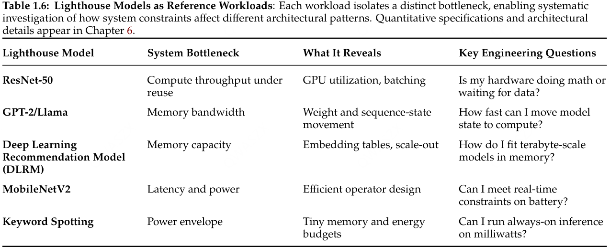

> 我们的魔法, 是不输给任何人的“想象力”.

第一周课的内容是介绍深度学习系统的目标和计算任务, 也有一些基础知识的回顾.

深度学习的基本想法是将多个层组合为神经网络, 训练过程通过反向传播计算梯度, 参数更新方程:
$$\theta_{t+1} := f(\theta_t, \nabla_L(\theta_t, D_t)).$$

- $D$ 表示训练数据, $\theta$ 表示模型参数.
- $L$ 是损失函数, 它衡量模型的表现, 常见的有 L2 loss, hinge loss, softmax loss 等.
- $f$ 是参数更新策略, 比较传统的是 Adam, 最近一些 MoE 模型使用 Muon 优化器.

**数据**、**模型**和**计算**是深度学习系统的三个关键要素.

- 数据的性质取决于任务. 语言模型的训练数据就是大量的 token, 而一些前沿的 lab 正在研发全模态的模型, 即单个模型支持文本、图像、音频、视频的输入和输出.
- 现在有几种流行的模型: 小规模的视觉任务一般用 CNN, 否则就是耳熟能详的 LLM, 包括 MoE 架构的. 音视频生成会用到扩散模型.
- 计算包括训练和推理. 二十年前一般直接在 CPU 上跑, 现在都是专门的“加速器”, GPU/TPU/FPGA 等.

这门课主要考虑三个最常见的构建块: 卷积层, Transformer 层, 以及 MoE 层.

深度学习框架使用**计算图**表示计算流程, 节点代表计算操作和输出的 tensor, 边代表数据的依赖关系.

- 在早期的 TensorFlow 框架中, 实际执行前需要先构建计算图, 这种方式称为**静态图**.
- 现代的框架如 PyTorch 采用**动态图**的方式, 实时构建计算图并执行, 便于调试和开发.

**即时编译**是让动态语言更“静态”的一种优化方法, 在运行第一次时记录计算图并进行优化.

## MLSys Book

哦牛批还有这种大砖头的, 两册书每本一千多页, 很难知道里面究竟讲了什么, 随便看看吧.

这本书不讲具体工具的用法, 而是从物理学的视角, 分析如何在给定的系统约束下, 构建高性能的系统.  
第一册主要考虑单个计算节点, 即一台机器使用一个共享内存空间, 不超过 8 个加速器的情况.

- 第一部分 ==基础== 描述机器学习项目的术语体系、思维模型和工作流程.
- 第二部分 ==构建== 从深度学习的数学基础讲到如何构建实际运行的系统.
- 第三部分 ==优化== 讲解数据清洗、模型压缩、硬件加速, 以及评估系统性能的基准测试方法.
- 第四部分 ==部署== 介绍其他的工程实践, 包括推理服务基础设施, 以及其他可靠性的考虑.

  

### 第 1 章: 导论

相比于传统的计算系统, 机器学习系统的行为和表现更容易受到数据的影响. 机器学习工程师需要同时管理数据的统计分布和执行上的约束. 算法选择与底层系统的设计互相影响、密切相关.

  

这称为**数据即代码**的原则: 数据应该像代码一样管理和验证.

AI 的发展历史是一段突破瓶颈的历史:

- 在机器学习方法出现之前, 符号计算和专家系统方法很快受限于逻辑和知识的表达能力.
- 早期的统计学习时代, 出现了 SVM 等学习方法, 但仍然依靠人工设计特征, 扩展性差.
- 现在的深度学习强调**端到端**的学习过程. AlexNet 是一个经典的算法系统 co-design 的工作.  
  瓶颈转移到了计算上, 需要更高效的软硬件系统来支持大规模的训练和推理.

**机器学习系统**是一类软件系统, 其核心行为由从数据中学习到的参数而非显式编程的规则决定. 系统的性能同时取决于数据质量、算法选择和硬件能力. 性能开销可以划分为数据传输、算术运算和固定延迟这三类.

这一定义对应着**数据·算法·机器分类法**: 根据这三个维度对机器学习系统的性能瓶颈进行分类.  
这三个部分不能孤立考虑, 修改任一个部分可能都会影响其他的因素.

在构建系统时还可以按四个层级进行分析:

- **硬件**: 计算的物理基础, 参数包括峰值计算吞吐量 $R_\mathrm{peak}$、内存带宽 BW、存储容量 $C$.
- **系统**: 集成部署单元, 定义硬件如何运行, 包括功耗预算、热量限制、节点级互联等.
- **负载**: 模型的算法需求, 包括计算量 $O$、数据传输量 $D_{\mathrm{vol}}$、数据布局等.
- **任务**: 最终的应用环境, 设定了电池续航、时延要求、云成本预算等高层需求.

三个部分体现在**单位成本的样本量**这一经济指标上:
$$\mathrm{Cost}\propto\frac{\mathrm{Model\ Size}\times\mathrm{Dataset\ Size}}{\mathrm{Hardware\ Efficiency}}$$

机器学习系统的性能可以通过以下公式刻画: 运行时间 $T$ 可以划分为数据项、计算项和其他时延,

$$T=\frac{D_\mathrm{vol}}{\mathrm{BW}}+\frac{O}{R_\mathrm{peak}\eta_\mathrm{hw}}+L_\mathrm{lat}.$$

其中 $0\le\eta_\mathrm{hw}\le 1$ 表示硬件利用率, 这称为机器学习系统的 Iron Law.

  

