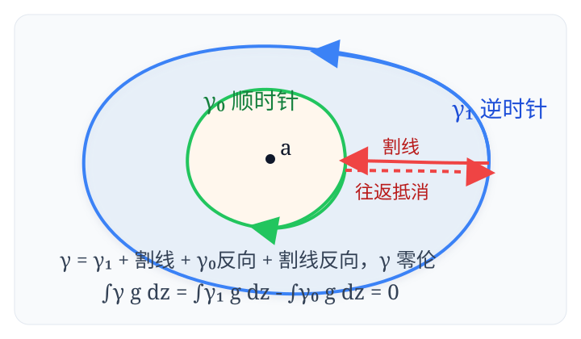

> 理解一个概念最好的方法, 就是自己去发现它.

设 $x_1,\ldots,x_n$ 是两两不同的实数, 证明:
$$\sum_{i=1}^n\prod_{j\ne i}\frac{1-x_ix_j}{x_i-x_j}=n\bmod 2.$$

## 解答

本题是 2019 年 IMO Shortlist 的代数第 5 题, [AoPS 讨论版](https://artofproblemsolving.com/community/c6h2279006p17828803).

只需证明 $x_1,\ldots,x_n$ 中没有 $\pm 1$ 的情形, 否则根据连续性取极限即可. 考虑有理函数 $f:\mathbb C\to\mathbb C$ 如下:
$$f(z):=\frac{\prod_{i=1}^n(1-x_iz)}{(1-z^2)\prod_{i=1}^n(z-x_i)}.$$
$f$ 的所有奇点 $\pm 1,x_1,\ldots,x_n$ 都是简单极点, 而无穷远点的极限是 $0$. 分别计算极点和无穷远处的留数如下:
$$
\begin{aligned}
\mathrm{Res}(f,1)&=\lim_{z\to 1}(z-1)f(z)=-\frac{\prod_{i=1}^n(1-x_i)}{2\prod_{i=1}^n(1-x_i)}=-\frac12,\\
\mathrm{Res}(f,-1)&=\lim_{z\to -1}(z+1)f(z)=\frac{\prod_{i=1}^n(1+x_i)}{2(-1)^n\prod_{i=1}^n(1+x_i)}=\frac{(-1)^n}{2},\\
\mathrm{Res}(f,x_i)&=\lim_{z\to x_i}(z-x_i)f(z)=\prod_{j\ne i}\frac{1-x_ix_j}{x_i-x_j},\\
\mathrm{Res}(f,\infty)&=-\lim_{|z|\to\infty}zf(z)=0.
\end{aligned}
$$
根据[留数定理](https://en.wikipedia.org/wiki/Residue_theorem), 所有奇点与无穷远点的留数和为 $0$, 所以有:
$$\mathrm{LHS}=\sum_{i=1}^n\mathrm{Res}(f,x_i)=\frac{1-(-1)^n}{2}=n\bmod 2.$$

## 何意味

也许有人要问了, 要是还没学留数定理, 怎么办? 我们写一遍留数定理的证明不就好了😃

  

回顾一下导数的定义, $f:\mathbb C\to\mathbb C$ 在 $a$ 处可导是指 $f'(a):=\lim\limits_{z\to a}\frac{f(z)-f(a)}{z-a}$ 存在:

- 当 $f'(a)\ne 0$ 时, $z-a$ 经过固定的伸缩和旋转得到 $f(z)-f(a)$, 称 $f$ 在 $a$ 处[共形](https://en.wikipedia.org/wiki/Conformal_map).
- 否则 $f'(a)=0$, 即 $f(z)-f(a)$ 远小于 $z-a$, 称 $f$ 在 $a$ 处是[临界点](https://en.wikipedia.org/wiki/Critical_point_(mathematics)).

特别地, 实轴方向与虚轴方向映射后的变化量是正交的, 这给出[柯西-黎曼方程](https://en.wikipedia.org/wiki/Cauchy%E2%80%93Riemann_equations):  
记 $f$ 将 $x+\mathrm iy$ 映射到 $u+\mathrm iv$, 则 $\partial_y v=\partial_x u$, $\partial_y u=-\partial_x v$.

再回顾一下[围道积分](https://en.wikipedia.org/wiki/Contour_integration): 给定可求长曲线 $\gamma$ 和函数 $f:\mathbb C\to\mathbb C$,  
积分 $\int_\gamma f(z)\,\mathrm{d}z$ 是对划分 $z_0,\ldots,z_n$ 求和 $\sum_{k=1}^n f(z_k)(z_k-z_{k-1})$ 的极限.

[柯西积分定理](https://www.bananaspace.org/wiki/Cauchy_%E7%A7%AF%E5%88%86%E5%AE%9A%E7%90%86)是复变函数积分的基本定理: 给定开集 $U\subseteq\mathbb C$ 和解析函数 $f:U\to\mathbb C$, 若闭曲线 $\gamma$ 在 $U$ 中 [零伦](https://mathworld.wolfram.com/Null-Homotopic.html) (指 $\gamma$ 可以 ==连续形变== 到单个点, 这是 $\gamma$ 的内部包含于 $U$ 的拓扑学表述), 则积分:
$$\int_\gamma f(z)\,\mathrm dz=0.$$
证明比较复杂且技术性, 具体可以看上面的[香蕉空间](https://www.bananaspace.org/wiki/%E9%A6%96%E9%A1%B5)链接.

这个定理有一系列积分计算的应用, 例如[柯西积分公式](https://en.wikipedia.org/wiki/Cauchy_integral_formula), 对于同样的条件和 $a\in U\setminus\gamma$, 我们有:
$$\frac 1{2\pi\mathrm i}\int_\gamma \frac{f(z)}{z-a}\,\mathrm dz=\nu(\gamma,a)f(a).$$
其中 $\nu(\gamma,a)$ 是 $\gamma$ 对 $a$ 的[卷绕数](https://en.wikipedia.org/wiki/Winding_number).  
由 [Hopf 定理](https://en.wikipedia.org/wiki/Hopf_theorem) 可得 $\gamma$ 在 $U\setminus\{a\}$ 上形变到围绕 $a$ 转 $\nu(\gamma,a)$ 次的小圆, 从而转化为小圆上的积分.

  

同样地, 假设 $U\subseteq\mathbb C$ 是单连通开集, $f$ 在有限个奇点 $z_1,\ldots,z_n$ 之外的 $U$ 上解析, 记 $f$ 在 $z_k$ 处的**留数**:
$$\mathrm{Res}(f,z_k):=\frac 1{2\pi\mathrm i}\int_\gamma f(z)\,\mathrm dz,$$
其中 $\gamma$ 是正方向围绕 $z_k$ 的小圆. 则有[留数定理](https://en.wikipedia.org/wiki/Residue_theorem): 对于 $U$ 上的闭曲线 $\gamma$, 积分
$$\frac 1{2\pi\mathrm i}\int_\gamma f(z)\,\mathrm dz=\sum_{k=1}^n \nu(\gamma,z_k)\cdot\mathrm{Res}(f,z_k).$$
例如, 假设 $f$ 在圆环 $r\le|z-a|\le R$ 的开邻域上解析, 记内外边界分别为 $\gamma_\mathrm{in}$ 和 $\gamma_\mathrm{out}$, 则有
$$f(z)=\frac 1{2\pi\mathrm i}\left(\int_{\gamma_\mathrm{out}}\frac{f(\zeta)}{\zeta-z}\,\mathrm d\zeta-\int_{\gamma_\mathrm{in}}\frac{f(\zeta)}{\zeta-z}\,\mathrm d\zeta\right).$$

将这两个积分里的 $1/(\zeta-z)$ 分别按如下幂级数展开:

$$
\begin{aligned}
\frac 1{\zeta-z}&=\frac 1{\zeta-a}\cdot\frac 1{1-\frac{z-a}{\zeta-a}}=\sum_{k=0}^\infty\frac{(z-a)^k}{(\zeta-a)^{k+1}},\\
\frac 1{\zeta-z}&=-\frac 1{z-a}\cdot\frac 1{1-\frac{\zeta-a}{z-a}}=-\sum_{k=0}^\infty\frac{(\zeta-a)^k}{(z-a)^{k+1}}.
\end{aligned}
$$

这两个幂级数在圆环上一致收敛, 所以逐项积分得到[洛朗级数](https://en.wikipedia.org/wiki/Laurent_series) $f(z)=\sum_{k=-\infty}^\infty a_k(z-a)^k$, 其中:
$$a_k:=\frac 1{2\pi\mathrm i}\int_\gamma\frac{f(\zeta)}{(\zeta-a)^{k+1}}\,\mathrm d\zeta.$$
其中 $a_{-1}=\mathrm{Res}(f,a)$. 特别地, 如果最低非零次项系数是 $a_{-m}$, 则称 $a$ 是 $f$ 的 $m$ 阶[极点](https://zh.wikipedia.org/zh-hans/%E6%9E%81%E7%82%B9_(%E5%A4%8D%E5%88%86%E6%9E%90)), 此时:
$$\mathrm{Res}(f,a)=\frac 1{(m-1)!}\lim_{z\to a}\frac{\mathrm d^{m-1}}{\mathrm dz^{m-1}}\!\left((z-a)^m f(z)\right).$$

## 部分分式分解

实际上, 留数定理确实有些“杀鸡用牛刀”的感觉了, ~~但是你不觉得过程写这么短很神圣吗?~~

记 $Q(z):=\prod_{i=1}^n(z-x_i)$, 考虑多项式 $P(z)$ 在 $x_1,\ldots,x_n$ 这些点处的 Lagrange 插值:
$$
\begin{aligned}
P(z)&=\sum_{i=1}^n P(x_i)\prod_{j\ne i}\frac{z-x_j}{x_i-x_j}=\sum_{i=1}^n\frac{P(x_i)Q(z)}{Q'(x_i)(z-x_i)}, \\
\frac{P(z)}{Q(z)}&=\sum_{i=1}^n\frac{P(x_i)}{Q'(x_i)}\cdot\frac{1}{z-x_i}.
\end{aligned}
$$
即 ==Lagrange 插值等价于 $P(z)/Q(z)$ 的部分分式分解==.  
回到原问题, 按这个方法处理 $f(z)$, 两边同乘 $z$ 再令 $z\to\infty$, 就得到与留数定理同样的结果.

## 代数解法

我们也可以用 $n$ 元多项式恒等判定的方法证明. 记原式为 $E_n$ 而多项式
$$F_n:=\prod_{i<j}(x_i-x_j)\cdot(E_n-n\bmod 2),$$
则 $\deg F_n<\binom{n+1}2$. 要证 $F_n=0$, 只需证 $F_n$ 被某个 $\binom{n+1}2$ 次多项式整除即可.

对 $n$ 归纳, 当 $n=1$ 时显然成立, 否则假设对 $k<n$ 都有 $F_k=0$:

- 当 $x_1=1$ 时, $E_n=1-E_{n-1}$, 由归纳假设知 $F_n=0$. 所以 $x_1-1$ 整除 $F_n$.
- 当 $x_1=x_2$ 时, 只需考虑 $E_n$ 中分母含 $x_1-x_2$ 的前两项, 容易计算得这两项相互抵消.

综上, 根据 $E_n$ 的对称性, 所有 $x_i-x_j$ 和 $x_i-1$ 都整除 $F_n$, 说明 $F_n=0$.  
实际上这个解法也是有点“超纲”的, 需要用到多项式环的唯一分解性, 不过大家一般都是直接用的.
