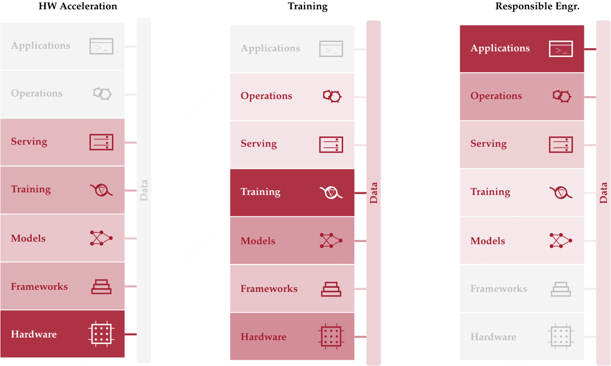
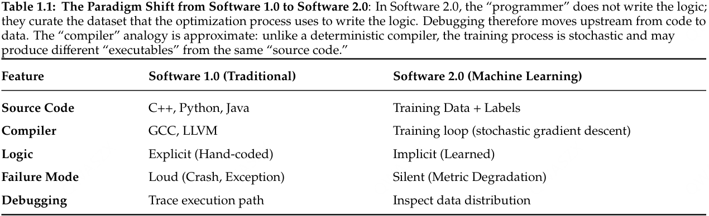

> Our magic is an "imagination" that loses to no one.

The first week introduces the goals and computational tasks of deep learning systems, along with a review of some fundamentals.

The basic idea of deep learning is to compose multiple layers into a neural network. During training, gradients are computed through backpropagation, and the parameter update equation is
$$\theta_{t+1} := f(\theta_t, \nabla_L(\theta_t, D_t)).$$

- $D$ denotes the training data, and $\theta$ denotes the model parameters.
- $L$ is the loss function, which measures model performance. Common examples include L2 loss, hinge loss, softmax loss, and so on.
- $f$ is the parameter update strategy. Adam is the more traditional choice, while some recent MoE models use the Muon optimizer.

**Data**, **models**, and **computation** are the three key elements of deep learning systems.

- The nature of the data depends on the task. The training data for language models is a massive amount of tokens, while some frontier labs are developing omni-modal models, where a single model supports text, image, audio, and video as both input and output.
- Several model families are currently popular: small-scale vision tasks usually use CNNs; otherwise, the familiar choice is the LLM, including MoE architectures. Audio and video generation often use diffusion models.
- Computation includes both training and inference. Twenty years ago, these workloads usually ran directly on CPUs. Today they run on specialized "accelerators" such as GPUs, TPUs, and FPGAs.

This course mainly considers three common building blocks: convolution layers, Transformer layers, and MoE layers.

Deep learning frameworks use **computation graphs** to represent computation flows. Nodes represent operations and output tensors, while edges represent data dependencies.

- In early TensorFlow, the computation graph had to be built before actual execution. This approach is called a **static graph**.
- Modern frameworks such as PyTorch use **dynamic graphs**, building and executing the computation graph in real time, which makes debugging and development easier.

**Just-in-time compilation** is an optimization method that makes dynamic languages more "static": on the first run, it records the computation graph and optimizes it.

## MLSys Book

Oh wow, there is this kind of brick too. Two volumes, each with more than a thousand pages. It is hard to know what is actually inside, so I will just browse around.

This book does not teach the usage of specific tools. Instead, it analyzes from a physics-oriented perspective how to build high-performance systems under given system constraints.  
The first volume focuses mainly on a single compute node, meaning one machine using one shared memory space with no more than eight accelerators.

- Part I, ==Foundations==, describes the terminology, mental models, and workflows of machine learning projects.
- Part II, ==Build==, goes from the mathematical foundations of deep learning to the construction of systems that actually run.
- Part III, ==Optimize==, explains data cleaning, model compression, hardware acceleration, and benchmarking methods for evaluating system performance.
- Part IV, ==Deploy==, introduces other engineering practices, including inference-serving infrastructure and reliability considerations.

  

### Chapter 1: Introduction

Compared with traditional computing systems, the behavior and performance of machine learning systems are more easily affected by data. Machine learning engineers need to manage both the statistical distribution of data and the constraints of execution. Algorithm choices and low-level system design affect each other and are closely connected.

  

This is called the principle of **data as code**: data should be managed and validated like code.

The history of AI is a history of breaking through bottlenecks:

- Before machine learning methods appeared, symbolic computing and expert systems were quickly limited by the expressive power of logic and knowledge.
- In the early statistical learning era, methods such as SVMs emerged, but they still relied on manually designed features and had poor scalability.
- Modern deep learning emphasizes **end-to-end** learning. AlexNet is a classic example of algorithm-system co-design.  
  The bottleneck shifted to computation, requiring more efficient software and hardware systems to support large-scale training and inference.

A **machine learning system** is a kind of software system whose core behavior is determined by parameters learned from data, rather than by explicitly programmed rules. Its performance depends on data quality, algorithm choices, and hardware capability at the same time. Performance costs can be divided into three categories: data movement, arithmetic operations, and fixed latency.

This definition corresponds to the **data-algorithm-machine taxonomy**: classifying performance bottlenecks in machine learning systems along these three dimensions.  
The three parts cannot be considered in isolation, since changing any one of them may affect the others.

When building systems, we can also analyze them at four levels:

- **Hardware**: the physical foundation of computation. Parameters include peak compute throughput $R_\mathrm{peak}$, memory bandwidth BW, and storage capacity $C$.
- **System**: the integrated deployment unit, defining how hardware operates, including power budgets, thermal limits, node-level interconnects, and so on.
- **Workload**: the algorithmic requirements of the model, including the amount of computation $O$, data movement volume $D_{\mathrm{vol}}$, data layout, and so on.
- **Task**: the final application environment, setting high-level requirements such as battery life, latency targets, and cloud cost budgets.

The three parts are reflected in the economic metric of **samples per unit cost**:
$$\mathrm{Cost}\propto\frac{\mathrm{Model\ Size}\times\mathrm{Dataset\ Size}}{\mathrm{Hardware\ Efficiency}}$$

The performance of a machine learning system can be characterized by the following formula: runtime $T$ can be divided into a data term, a compute term, and other latency,

$$T=\frac{D_\mathrm{vol}}{\mathrm{BW}}+\frac{O}{R_\mathrm{peak}\eta_\mathrm{hw}}+L_\mathrm{lat}.$$

Here, $0\le\eta_\mathrm{hw}\le 1$ denotes hardware utilization. This is called the Iron Law of machine learning systems.

  

