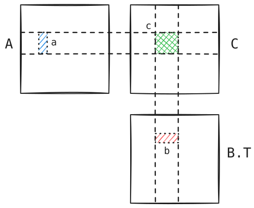

> Through endless lonely nights, all my heart wished for was a faint bit of warmth. Just as stars are drawn to one another, I dreamed of the moment I would meet you.

The second week continues from last week's discussion of computation graphs and automatic differentiation, then moves on to the theme of computation optimization, and finishes with a brief look at tiling optimizations for matrix multiplication operators. The key idea of automatic differentiation is to build the backpropagation process into the computation graph (the intermediate representation) as well, separating the semantics of deep learning from the computation itself, which makes later system-level optimizations easier.

The computation optimizations covered in this course fall into four topics:

- Operator optimization: how to write high-performance operators (called kernels on GPUs) for various computational needs and hardware.
- Graph-level optimization: for example, operator fusion, constant folding, and dead code elimination.
- Runtime environment: computation scheduling, memory management, etc...
- Multi-device parallelism: coordinating 10k+ devices to complete a task.

The core of optimization is reducing the cost of memory reads and writes so that the processor's compute capacity is fully utilized. Modern ML frameworks generally represent tensors in ==strided format==: each dimension $i$ records $\mathrm{shape}[i]$ and $\mathrm{stride}[i]$, giving the index range of that dimension and the increase in memory address when the index of that dimension increases by 1. This turns many tensor operations into manipulations of shape and stride, avoiding copies. Of course, if the actual computation places requirements on memory access, data can be copied to contiguous locations as needed.

$$A[i,j]=A.\mathrm{data}[\mathrm{offset}+i\cdot A.\mathrm{stride}[0]+j\cdot A.\mathrm{stride}[1]]$$

Consider a simplified memory hierarchy model: matrices A, B, and C live in DRAM, while computation happens in fast, small-capacity registers.

```python
def matmul(A: Float[Tensor, "n/v1 n v1", "DRAM"],
           B: Float[Tensor, "n/v2 n v2", "DRAM"],
           C: Float[Tensor, "n/v1 n/v2 v1 v2", "DRAM"]):
  for i in range(n/v1):
    for j in range(n/v2):
      c: Float[Tensor, "v1 v2", "reg"] = 0
      for k in range(n):
        a: Float[Tensor, "v1", "reg"] = A[i, k]
        b: Float[Tensor, "v2", "reg"] = B[j, k]
        c += outer(a, b)
      C[i, j] = c
```

The numbers of reads of A and B become $n^3/v_2$ and $n^3/v_1$ respectively, while the number of writes to C stays at $n^2$.  
The reads decrease because each computation lets $v_2$ elements of B share a single read of A, dividing the read count by $v_2$.

<p style="text-align: center;">
  
</p>

This technique is called ==register tiling==. With more memory levels, correspondingly more levels of tiling can be applied.

## PA1

PA1 is a warm-up assignment: just use Python to get familiar with defining computation graphs and automatic differentiation. The slightly trickier part is the backward pass for Softmax and LayerNorm, so I record it here.

### Softmax

Let $y_i:=\mathrm{softmax}(x)_i=\mathrm e^{x_i}/\sum_j\mathrm e^{x_j}$. Given $g_i:=\partial\mathcal L/\partial y_i$, we want $\partial\mathcal L/\partial x_i$.

The differentiation rules give $\partial y_j/\partial x_i=y_j(\mathbf 1_{\{i=j\}}-y_i)$, so
$$\frac{\partial\mathcal L}{\partial x_i}=\sum_{j=1}^N g_j\frac{\partial y_j}{\partial x_i}=y_i\left(g_i-\sum_{j=1}^N g_jy_j\right).$$

### LayerNorm

Let $\mu:=\frac 1N\sum_i x_i$, $\hat x_i:=x_i-\mu$, $\sigma^2:=\frac 1N\sum_i\hat x_i^2$, $s:=\sqrt{\sigma^2+\varepsilon}$, $y_i:=\hat x_i/s$.  
Given $g_i:=\partial\mathcal L/\partial y_i$, we want $\partial\mathcal L/\partial x_i$.

This amounts to a bit of "manual differentiation":
$$
\begin{aligned}
\frac{\partial\sigma^2}{\partial x_i}&=\frac 2N\sum_{j=1}^N\hat x_j\frac{\partial\hat x_j}{\partial x_i}=\frac{2\hat x_i}N, \\
\frac{\partial s}{\partial x_i}&=\frac 1{2s}\frac{\partial\sigma^2}{\partial x_i}=\frac{\hat x_i}{Ns}, \\
\frac{\partial y_j}{\partial x_i}&=\frac 1s\frac{\partial\hat x_j}{\partial x_i}-\frac{\hat x_j}{s^2}\frac{\partial s}{\partial x_i}=\frac 1s\left(\mathbf 1_{\{i=j\}}-\frac 1N-\frac{y_iy_j}{N}\right), \\
\frac{\partial\mathcal L}{\partial x_i}&=\sum_{j=1}^N g_j\frac{\partial y_j}{\partial x_i}=\frac 1s(g_i-\mathrm{mean}(g)-y_i\cdot\mathrm{mean}(gy)).
\end{aligned}
$$
