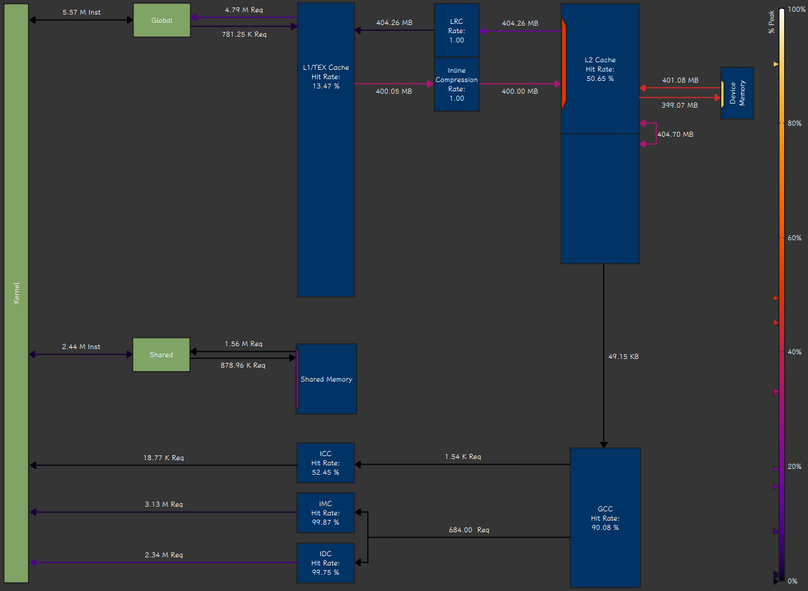

> You are everything I long for, everything I admire and love.

Week 3 covers the CUDA programming model and matrix multiplication. CUDA stands for "Compute Unified Device Architecture," though the name can refer to several different parts of the NVIDIA ecosystem depending on context. As a device architecture, it describes a GPU design built from identical hardware units that can each perform a wide range of computations. These units are called ==streaming multiprocessors==. As a programming model, CUDA refers to the abstractions that a GPU exposes to programmers, chiefly the ==thread-group hierarchy== and the ==memory hierarchy==. As a software platform, it is the collection of tools used to develop CUDA programs, including compute libraries such as cuDNN and cuBLAS and DSLs such as Triton and TileLang.


- A **thread**, much like its operating-system counterpart, describes a serial stream of instructions and is the basic programming unit in CUDA.
- A **thread block** is a group of threads that share "shared memory" and can synchronize with each other. Each block is scheduled as a unit onto an SM.
- A **warp** is the execution unit within an SM and usually contains 32 threads. All threads in a warp execute the same instruction at the same time, a model known as **single instruction, multiple threads**. If a branch causes only some threads to execute an instruction, the others are suspended. Avoiding branches and keeping every thread in a warp on the same instruction is important for performance. The resulting performance penalty is called **warp divergence**.
- A **grid** is the collection of thread blocks launched by a CUDA kernel. Blocks should be almost independent so that they can be scheduled onto SMs in any order. Semantically, the blocks express the parallelism in a computation.

## The First CUDA Program

Consider a Conv1d with a filter length of 5. This is an example of optimizing a memory-bound kernel.

```python
def torch_conv1d(x, w):
  return F.conv1d(x.view(1, 1, -1), w.view(1, 1, -1)).view(-1)
```

A basic implementation assigns eight consecutive outputs to each thread. It first loads the five required values of $w$ and twelve values of $x$ into registers, computes the eight outputs, and then writes them directly back to $y$.

```cpp :collapsed-lines=10
__global__ void __launch_bounds__(THREADS, 1)
conv1d_k5_register_kernel(const __half* __restrict__ x,
                          const __half* __restrict__ w,
                          __half* __restrict__ y,
                          const long long n_out) {
  const float w0 = __half2float(__ldg(&w[0]));
  const float w1 = __half2float(__ldg(&w[1]));
  const float w2 = __half2float(__ldg(&w[2]));
  const float w3 = __half2float(__ldg(&w[3]));
  const float w4 = __half2float(__ldg(&w[4]));
  const long long gout = (long long)blockIdx.x * TILE
                         + (long long)threadIdx.x * VEC;
  if (gout >= n_out) return;

  float r[VEC + K - 1];
  if (gout + VEC <= n_out) {
    #pragma unroll
    for (int j = 0; j < VEC + K - 1; ++j) {
      r[j] = __half2float(__ldg(&x[gout + j]));
    }
  } else {
    const long long n_in = n_out + K - 1;
    #pragma unroll
    for (int j = 0; j < VEC + K - 1; ++j) {
      const long long idx = gout + j;
      r[j] = (idx < n_in) ? __half2float(__ldg(&x[idx])) : 0.f;
    }
  }

  #pragma unroll
  for (int j = 0; j < VEC; ++j) {
    r[j] = w0 * r[j]
             + w1 * r[j + 1]
             + w2 * r[j + 2]
             + w3 * r[j + 3]
             + w4 * r[j + 4];
  }

  if (gout + VEC <= n_out) {
    __half out[VEC];
    #pragma unroll
    for (int j = 0; j < VEC; ++j) out[j] = __float2half(r[j]);
    *reinterpret_cast<uint4*>(&y[gout]) =
      *reinterpret_cast<const uint4*>(out);
  } else {
    for (int j = 0; j < VEC && gout + j < n_out; ++j)
      y[gout + j] = __float2half(r[j]);
  }
}
```

- `__global__` marks a GPU kernel launched by a CPU process.
- `__launch_bounds__` specifies the number of threads per block and the minimum number of blocks that should run on each SM. The compiler uses these settings to manage the SM resources consumed by each block, including registers, shared memory, and warps.
- `__restrict__` states that the pointer is the only path through which the corresponding memory region is accessed. This lets the compiler rule out memory aliasing, avoid conservative loads and stalls, and optimize global-memory access more aggressively.
- `__ldg__` explicitly loads global-memory data through the read-only cache, which may improve read latency and memory-bandwidth use.  
  In practice, it usually has the same effect as `const T* __restrict__`, so it does not do much here.
- `reinterpret_cast<uint4*>` enables vectorized memory access, with each instruction operating on 16 bytes.

Repeated accesses to $x$ are served by the L1 cache. Measurements from Nsight Compute show that DRAM bandwidth reaches 80%. Shared memory, effectively a software-managed L1 cache, can also make the access pattern more regular. When using shared memory, bank conflicts require attention:  
NVIDIA GPUs organize shared memory into 32 banks, and address $s$ maps to bank $\lfloor s/4\rfloor\bmod 32$. If a warp instruction concentrates its accesses on only some banks while leaving the others idle, bandwidth is wasted.  
That is largely irrelevant here, however, because DRAM bandwidth is the bottleneck; somewhat slower L1 access makes little difference.

```cpp :collapsed-lines=10
__global__ void __launch_bounds__(THREADS, 1)
conv1d_k5_kernel(const __half* __restrict__ x,
                 const __half* __restrict__ w,
                 __half* __restrict__ y,
                 const long long n_out) {
  __shared__ __align__(16) __half s[TILE + K - 1];
  const float w0 = __half2float(__ldg(&w[0]));
  const float w1 = __half2float(__ldg(&w[1]));
  const float w2 = __half2float(__ldg(&w[2]));
  const float w3 = __half2float(__ldg(&w[3]));
  const float w4 = __half2float(__ldg(&w[4]));
  const long long base = (long long)blockIdx.x * TILE;
  const int t = threadIdx.x;
  const long long n_in = n_out + K - 1;

  const long long g = base + (long long)t * VEC;
  if (g + VEC <= n_in) {
    *reinterpret_cast<uint4*>(&s[t * VEC]) =
      *reinterpret_cast<const uint4*>(&x[g]);
  } else {
    #pragma unroll
    for (int j = 0; j < VEC; ++j) {
      const long long idx = g + j;
      s[t * VEC + j] = (idx < n_in) ? x[idx] : __float2half(0.f);
    }
  }
  if (t < K - 1) {
    const long long idx = base + TILE + t;
    s[TILE + t] = (idx < n_in) ? x[idx] : __float2half(0.f);
  }
  __syncthreads();

  const int o = t * VEC;
  const long long gout = base + o;
  if (gout >= n_out) return;

  const uint4 v0 = *reinterpret_cast<const uint4*>(&s[o]);
  const uint2 v1 = *reinterpret_cast<const uint2*>(&s[o + VEC]);
  const __half* h0 = reinterpret_cast<const __half*>(&v0);
  const __half* h1 = reinterpret_cast<const __half*>(&v1);

  float r[VEC + K - 1];
  #pragma unroll
  for (int j = 0; j < VEC; ++j) r[j] = __half2float(h0[j]);
  #pragma unroll
  for (int j = 0; j < K - 1; ++j) r[VEC + j] = __half2float(h1[j]);

  #pragma unroll
  for (int j = 0; j < VEC; ++j) {
    r[j] = w0 * r[j]
             + w1 * r[j + 1]
             + w2 * r[j + 2]
             + w3 * r[j + 3]
             + w4 * r[j + 4];
  }

  if (gout + VEC <= n_out) {
    __half out[VEC];
    #pragma unroll
    for (int j = 0; j < VEC; ++j) out[j] = __float2half(r[j]);
    *reinterpret_cast<uint4*>(&y[gout]) =
      *reinterpret_cast<const uint4*>(out);
  } else {
    for (int j = 0; j < VEC && gout + j < n_out; ++j)
      y[gout + j] = __float2half(r[j]);
  }
}
```

Another Nsight Compute measurement puts DRAM bandwidth at 90%, which is close to saturating it.



Everything outside DRAM is mostly idle. There is little more to gain from optimizing a kernel like this in isolation: every additional fused operation avoids another round of DRAM reads and writes. Claude does not seem very proficient with TileLang yet; it only reaches the same performance when the TileLang implementation mirrors the CUDA code almost exactly.

```python :collapsed-lines=10
@tilelang.jit(target="cuda")
def _conv1d(N_out, K, block_N, threads):

  @T.prim_func
  def main(
    x: T.Tensor((N_out + K - 1,), "float16"),  # type: ignore
    w: T.Tensor((K,), "float16"),  # type: ignore
    y: T.Tensor((N_out,), "float16"),  # type: ignore
  ):
    VEC = block_N // threads  # halfs per thread (8 -> uint4 accesses)
    N_in = N_out + K - 1

    with T.Kernel(T.ceildiv(N_out, block_N), threads=threads) as bx:
      x_shared = T.alloc_shared((block_N + K - 1,), "float16")
      w_local = T.alloc_local((K,), "float32")
      r = T.alloc_local((VEC + K - 1,), "float32")
      out = T.alloc_local((VEC,), "float16")

      tx = T.get_thread_binding(0)
      base = bx * block_N + tx * VEC

      # Main tile (128-bit vectorized; scalar guarded in the last block)
      # plus K-1 halo elements.
      if base + VEC <= N_in:
        for j in T.vectorized(VEC):
          x_shared[tx * VEC + j] = x[base + j]
      else:
        for j in T.serial(VEC):
          x_shared[tx * VEC + j] = T.if_then_else(
            base + j < N_in, x[base + j], T.float16(0))
      if tx < K - 1:
        x_shared[block_N + tx] = T.if_then_else(
          bx * block_N + block_N + tx < N_in,
          x[bx * block_N + block_N + tx], T.float16(0))
      for k in T.serial(K):
        w_local[k] = T.cast(w[k], "float32")
      T.sync_threads()

      if base < N_out:
        for j in T.serial(VEC + K - 1):
          r[j] = T.cast(x_shared[tx * VEC + j], "float32")
        for j in T.serial(VEC):
          out[j] = T.cast(
            w_local[0] * r[j] + w_local[1] * r[j + 1]
            + w_local[2] * r[j + 2] + w_local[3] * r[j + 3]
            + w_local[4] * r[j + 4], "float16")

        if base + VEC <= N_out:
          for j in T.vectorized(VEC):
            y[base + j] = out[j]
        else:
          for j in T.serial(VEC):
            if base + j < N_out:
              y[base + j] = out[j]

  return main
```

The step-by-step IR transformations and the generated CUDA code are available [here](/conv1d-report.html); see also the [official documentation](https://tilelang.com/tools/lower_trace.html).  
TileLang normally provides built-in bounds checking, but memory access is not vectorized unless `T.vectorized` is written explicitly.
