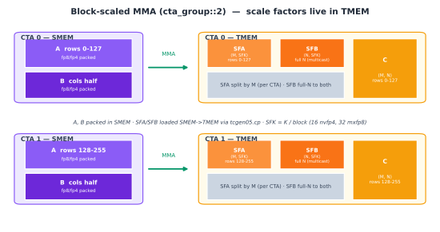

::: info Overview
- `tcgen05.mma` typically reads A and B from SMEM and updates the C/D accumulator in TMEM. The epilogue later brings the result back into registers with `tcgen05.ld`.
- `cta_group::1` uses the current CTA, while `cta_group::2` uses a CTA pair. The two modes use different TMEM accumulator mappings.
- Block-scaled MMA also needs SFA and SFB in TMEM. In the loading path used here, these scale factors first enter SMEM, then move to TMEM through `tcgen05.cp`, where they are sharded or replicated according to how the CTA pair divides A and B.
:::

[Tensor Core Operand Layouts Across GPU Generations](/en/gpupro/tensor-core-data-layouts/) traced the data path for matrix multiply-accumulate (MMA) across Ampere, Hopper, and Blackwell. This chapter narrows the focus to Blackwell's `tcgen05.mma`: how one MMA is issued, how its accumulator maps into TMEM, and how `cta_group` determines whether the operation uses the current CTA or a CTA pair.

TMA, introduced in the previous chapter ([Async Data Movement: TMA](/en/gpupro/tma/)), usually moves A and B tiles into SMEM asynchronously. We begin after those tiles have arrived. From there, we will see how `tcgen05.mma` performs the matrix multiply-accumulate, where it places the result in TMEM, and why block-scaled MMA needs an additional scale-factor path.

<div style="overflow-x:auto;">
<iframe src="/gpupro/demo/tcgen05_intro.html?v=block-units-20260715" title="tcgen05 and Tensor Memory" loading="lazy"
        style="width:100%; min-width:1320px; height:640px; border:1px solid var(--vp-c-border); border-radius:6px;"></iframe>
</div>

*Keep the default `M=128` and `N=16`, then step forward along K to watch the partial products accumulate in TMEM. You can also transpose A or B, or change N, to compare the input tiles, output tile, and instruction parameters for different configurations.*

Start with the default view. Each cell represents a `16 × 16` block of elements. Although the output tile C has shape `128 × 16`, it therefore appears as an 8-by-1 grid of cells. Each click on **K iteration** makes the Tensor Core read one `128 × 16` slice of A, shown as `8 × 1` blocks, and one `16 × 16` slice of B, shown as a single block. Their product contributes one `128 × 16` partial result.

The first iteration uses `accum=0`. It does not read the existing TMEM accumulator and writes the current product directly into the C tile:

```text
C[0:128, 0:16] =
    A[0:128, k:k+16] × B[k:k+16, 0:16]
```

Later iterations use `accum=1` and add each new partial result to the value already in TMEM:

```text
C[0:128, 0:16] +=
    A[0:128, k:k+16] × B[k:k+16, 0:16]
```

Every K iteration updates the same `128 × 16` TMEM region. That region contains the final C tile only after the last iteration completes.

The bottom of the figure also shows the descriptors and PTX instruction used by this MMA. The next section explains their fields.

We will now look at how the instruction is issued, what `cta_group` controls, and how the accumulator maps into TMEM.

## How `tcgen05.mma` Executes

`tcgen05.mma` is Blackwell's Tensor Core matrix multiply-accumulate instruction. It operates on a complete matrix tile rather than assigning an independent scalar multiply-accumulate to each thread.

Unlike Ampere's `mma.sync` and Hopper's `wgmma.mma_async`, `tcgen05.mma` has single-thread semantics. One elected thread issues the instruction, and the hardware launches the full tile-level MMA. The other threads do not each submit a copy of the same instruction.

The following is a common `tcgen05.mma` form for the case where both A and B reside in SMEM and block scaling is disabled:

```text
tcgen05.mma.cta_group.kind
    [d-tmem], a-desc, b-desc, idesc,
    {disable-output-lane}, enable-input-d {, scale-input-d};
```

Its operands and qualifiers have the following roles:

| Field | Role |
| --- | --- |
| `cta_group` | Selects the current CTA or a CTA pair as the resources used by the MMA |
| `kind` | Selects the data-type family for A and B |
| `d-tmem` | Gives the starting TMEM address of the C/D accumulator |
| `a-desc`, `b-desc` | Describe the addresses and layouts of A and B in SMEM |
| `idesc` | Specifies M, N, K, the concrete A/B and C/D data types, operand major modes, and other instruction parameters |
| `disable-output-lane` | Selects TMEM lanes that will not be updated; the default example leaves every lane enabled |
| `enable-input-d` | Corresponds to `accum` in the interactive figure: false computes `D=A × B`, while true computes `D=A × B+D` |
| `scale-input-d` | Optionally scales the existing D before accumulation; the examples in this chapter do not use it |

The default configuration in the interactive figure uses `cta_group::1.kind::f16`. Later kernels in this book also commonly use `.kind::f16` with an `f32` accumulator selected in `idesc`. Here `.kind::f16` identifies the 16-bit floating-point family for A and B. `idesc` separately chooses whether A and B are `f16` or `bf16`, and whether C/D is `f16` or `f32`.

`cta_group` does not change the single-thread issue semantics. It only determines whether the operation uses the current CTA or a CTA pair. The corresponding CTA responsibilities and TMEM mappings, along with the SFA and SFB addresses needed by block-scaled forms, appear later in this chapter.

For the path considered here, where A and B come from SMEM, two layouts matter:

- The SMEM layout determines how the Tensor Core interprets and reads A and B.
- The TMEM layout determines how the C/D accumulator maps to TMEM lanes and columns.

These layouts belong to different memory spaces. Their concrete mappings depend on the instruction shape, data types, and operand major modes of the current `tcgen05.mma`. We will use the named axes and swizzle concepts introduced in [Data Layout and Its Notation](/en/gpupro/data-layout/) to describe them.

Issuing `tcgen05.mma` starts an asynchronous operation; it does not mean the result has already reached TMEM. The same thread can issue one or more MMA instructions and then execute

```text
tcgen05.commit
```

to make an `mbarrier` track the asynchronous `tcgen05` operations previously issued by that thread. When the hardware finishes those operations, it signals completion through the barrier.

Other warps can move data or prepare later tiles while the MMA is in flight. Before a consumer reads the accumulator with `tcgen05.ld`, it must wait for the corresponding `mbarrier` and execute

```text
tcgen05.fence::after_thread_sync
```

to order the completion notification before the subsequent TMEM access. Otherwise, the epilogue could read TMEM while the accumulator is still being updated. The asynchronous synchronization chapter develops this protocol in detail.

## The Accumulator in TMEM

In the PTX programming model for Ampere and Hopper, the accumulator resides in registers. MMA results are distributed across the participating threads as register fragments, which the epilogue can read and process directly. As the accumulator tile grows, those long-lived fragments consume more registers.

Blackwell moves the long-lived accumulator into TMEM. TMEM is a two-dimensional, CTA-scoped on-chip memory space. On `sm_100a`, each CTA has 128 Lane rows and 512 Col columns, with one 32-bit cell at each Lane/Col coordinate. `tcgen05.mma` repeatedly updates the accumulator in TMEM, and the epilogue eventually loads it into registers with `tcgen05.ld` for conversion, elementwise work, and stores.

`tcgen05.ld` is itself asynchronous. Before using its destination registers, the warp must execute `tcgen05.wait::ld` to confirm that its earlier TMEM loads have completed.

The accumulator therefore no longer occupies registers throughout the main loop. Instead, the kernel must manage TMEM allocation and layout: MMA must write each result to the right TMEM coordinates, and the epilogue must read it back with a matching layout. The next chapter covers TMEM allocation, addressing, and data movement.

## How `cta_group` Sets the Operation Scope

With `cta_group::1`, the MMA updates only the current CTA's TMEM. We begin with the common dense-A path, where every A element is stored explicitly and descriptors supply both A and B from SMEM. Some `tcgen05.mma` variants can instead read A from TMEM.

With `cta_group::2`, the MMA accesses the TMEM of both CTAs in a pair. A CTA pair consists of two CTAs in the same cluster whose `%cluster_ctarank` values differ only in the least-significant bit. One rank is even and the other is odd; we refer to them below as the even CTA and the odd CTA.

Only one thread in the CTA pair needs to issue `tcgen05.mma`. That thread may belong to either CTA, but the peer CTA must remain active. The kernels later in this book generally elect one thread in the even CTA to issue the MMA and use `tcgen05.commit` to arrange completion notification.

The accumulator layout depends on four choices: `cta_group`, the size of M, whether A is dense or structured sparse, and whether the instruction is ordinary `tcgen05.mma` or the weight-stationary `tcgen05.mma.ws`. The selected layout maps each logical coordinate `(m,n)` to `TLane` and `TCol`.

The instruction descriptor supplies N. For the `f16`/`bf16` path considered here, `cta_group::1` supports N from 8 through 256 in increments of 8, while `cta_group::2` supports N from 16 through 256 in increments of 16. The four figures below use the symbol N for any of these legal values. Purple denotes SMEM operands, orange denotes the TMEM accumulator, and green denotes the Tensor Core MMA path.

### `cta_group::1`, `M = 128`

This is the direct case. One CTA computes a 128-row output tile, and its TMEM has exactly 128 Lane rows. Accumulator row `m` therefore maps directly to TMEM Lane `m`, while N extends across TMEM columns.

The result occupies 128 Lane rows and N Col columns. The CTA reads A and B from its own SMEM and keeps the complete accumulator tile in its own TMEM.


### `cta_group::1`, `M = 64` (without `.ws`)

Following the notation used above, the figures label the MMA output accumulator as `C`. Its logical shape is `M x N`; this section sets `M = 64`, so `C` has shape `64 x N`. TMEM still has 128 Lane rows. This section covers ordinary `tcgen05.mma`, not the weight-stationary `.ws` form. Its TMEM mapping uses Layout F.

Layout F divides the 128 TMEM lanes into four 32-lane regions, corresponding to `warp-rank % 4 = 0,1,2,3` in the hardware data path. It also divides the 64 M rows into four groups of 16 and places one group in each region. Because a group contains only 16 rows, the current tile uses only half of each 32-lane region.

Let `a` be the TMEM lane alignment, either 0 or 16. Logical row `m` maps to

```text
group        = m // 16
row_in_group = m % 16
TLane        = group * 32 + a + row_in_group
```

With lane alignment 0, the mapping is

```text
rows  0-15  -> lanes   0-15
rows 16-31  -> lanes  32-47
rows 32-47  -> lanes  64-79
rows 48-63  -> lanes 96-111
```

Lanes `16-31`, `48-63`, `80-95`, and `112-127` do not belong to this tile.

If the kernel needs to retain a second, independent `M=64` accumulator tile, it can set that tile's lane alignment to 16. Its four row groups then map to the Lane positions left unused above:

```text
rows  0-15  -> lanes  16-31
rows 16-31  -> lanes  48-63
rows 32-47  -> lanes  80-95
rows 48-63  -> lanes 112-127
```

In the figure, the orange bands show the current tile with lane alignment 0, while the hatched bands show the positions available with lane alignment 16. The two tiles can use the same TMEM columns because their Lane positions do not overlap. N still extends across the TMEM columns.


### `cta_group::2`, `M = 256`

When `M = 256`, the 128 Lane rows of one CTA cannot hold the complete M dimension, so the accumulator is distributed across the two TMEM allocations in the CTA pair.

The even CTA stores logical rows `0-127`, and the odd CTA stores rows `128-255`. Each CTA uses lanes `0-127` in its own TMEM, while N extends across all of its corresponding TMEM columns.

Physically, these are two separate 128-row TMEM regions owned by different CTAs. Logically, they form one `256 × N` accumulator tile. How A and B are distributed across the two CTAs' SMEM depends on the kernel and is not part of this accumulator layout.


### `cta_group::2`, `M = 128` (dense A)

For `cta_group::2, M=128` with dense A, PTX uses Layout B for the accumulator. It first divides M across the pair: the even CTA stores C rows `0-63`, and the odd CTA stores rows `64-127`.

Within each CTA, its 64 M rows are divided into two groups of 32, and N is divided into a lower and an upper half. The two row groups and two N halves form a 2-by-2 mapping onto that CTA's four 32-lane regions:

| N range | Local M rows in the CTA | TMEM lanes |
| --- | --- | --- |
| `0 ... N/2-1` | `0-31` | `0-31` |
| `0 ... N/2-1` | `32-63` | `32-63` |
| `N/2 ... N-1` | `0-31` | `64-95` |
| `N/2 ... N-1` | `32-63` | `96-127` |

Let `m_local = m % 64`. The CTA and TLane for logical element `C[m,n]` are

```text
CTA   = even,  if m < 64
        odd,   if m >= 64

TLane = m_local,       if n < N/2
        64 + m_local,  if n >= N/2
```

For example, when `N=16`, `C[10,3]` resides at TLane 10 in the even CTA. `C[10,11]` remains in the even CTA, but because it belongs to the upper half of N, it maps to TLane 74.

This is Layout B for dense A. With structured-sparse A, `cta_group::2, M=128` uses Layout C instead, so the mapping above does not apply.


These four layouts specify the CTA and TMEM location to which `tcgen05.mma` writes each accumulator element. A later `tcgen05.ld` must use a compatible TMEM address and load shape to reconstruct the original logical C tile.

## Block-Scaled MMA

MXFP8 and NVFP4 are two concrete block-scaled formats introduced earlier. [Data Layout and Its Notation](/en/gpupro/data-layout/) explained block scaling and derived the packing and cross-warp replication of SFA and SFB in TMEM. [Tensor Core Operand Layouts Across GPU Generations](/en/gpupro/tensor-core-data-layouts/) then followed the `tcgen05.cp` data path and explained how `scale_vec` selects bytes. We will not repeat those details here. Instead, we will focus on where the scale factors reside in a CTA pair.

We need two relationships. `SFA(M,SFK)` supplies scale factors for each row of A, while `SFB(N,SFK)` supplies them for each column of B. Block-scaled `tcgen05.mma` reads these factors from TMEM while continuing to read A and B from SMEM:

```text
A, B:     global memory -> SMEM -> tcgen05.mma
SFA, SFB: global memory -> SMEM -> tcgen05.cp -> TMEM -> tcgen05.mma
```

### Placing Scale Factors Across Two CTAs

For output coordinate `(m,n)`, A uses `SFA[m,sfk]` and B uses `SFB[n,sfk]`. Scale-factor placement in a CTA pair therefore follows the division of M and N.

Consider the `M=256` MMA in the figure. The even CTA computes C rows `0-127`, while the odd CTA computes rows `128-255`. Each side needs only the SFA entries for its own A rows:

```text
even CTA: SFA[0:128,   :]
odd CTA:  SFA[128:256, :]
```

The figure uses a common implementation: each CTA moves half of B's N columns into its local SMEM, while the cooperative MMA consumes the complete B tile. The SFB entries for the full N dimension must therefore be available to both CTAs:

```text
SFB[0:N, :]
```

A common implementation first multicasts SFB into the two SMEM allocations in the CTA pair. A `tcgen05.cp.cta_group::2` operation then copies the data from each CTA's local SMEM into its local TMEM.

There is a second level of replication within each CTA. For both SFA and SFB, `tcgen05.cp.32x128b.warpx4` copies the packed 32-lane base layout into all four 32-lane TMEM partitions: `TLane 0-31`, `32-63`, `64-95`, and `96-127`.

The figure therefore shows SFA sharded along M and a complete SFB copy in each CTA. Within each CTA, both scale-factor layouts are also replicated across its four 32-lane partitions.



## Handing Data Between `tcgen05` Instructions

Although one thread issues `tcgen05.mma`, the instruction performs a tile-level cooperative operation. `cta_group` determines whether it uses the SMEM and TMEM resources of the current CTA or of a CTA pair. The corresponding TMEM layout then determines the CTA and `TLane`/`TCol` coordinates that receive each accumulator element. In the block-scaled path used here, SFA and SFB first move into TMEM through `tcgen05.cp` and are sharded or replicated according to the division of A and B across the pair.

Connecting asynchronous instructions such as `tcgen05.cp`, `tcgen05.mma`, and `tcgen05.ld` requires three conditions: the operation must target the correct CTA or CTA pair, the producer's output layout must match the layout expected by the consumer, and the consumer must use the corresponding completion and ordering mechanism before accessing the data. If any condition fails, the hardware may interpret the wrong TMEM coordinates or read data that is still being updated.

The key to understanding `tcgen05` is therefore to ask three questions: which CTA resources does this instruction use, where does it map the data, and when may the next stage safely consume the result?
