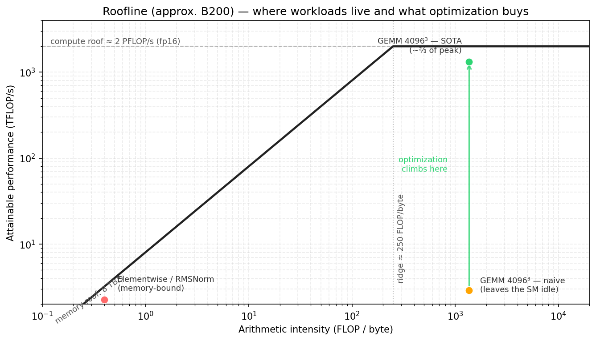
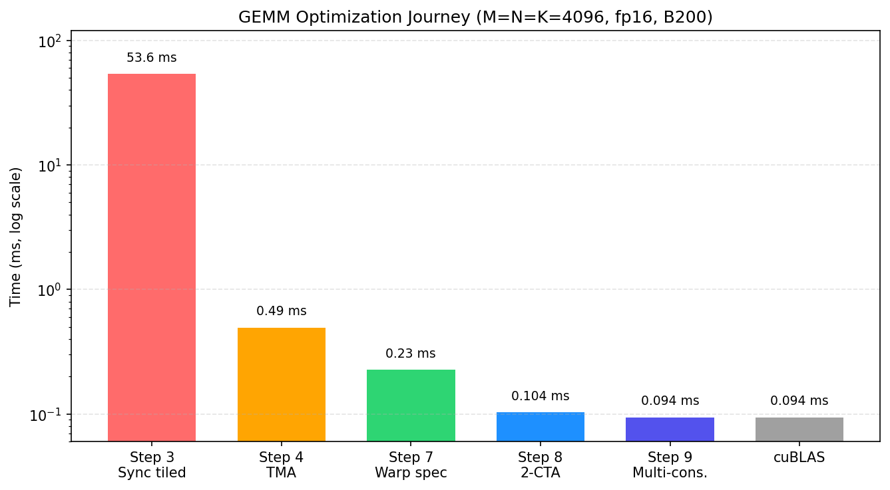

::: info Overview
- The roofline model gives a kernel a performance ceiling from memory bandwidth and compute throughput, while arithmetic intensity decides which ceiling applies.
- Low arithmetic intensity usually means memory-bound: performance is mainly limited by memory bandwidth. The optimization focus is to reduce HBM traffic, improve reuse, fuse operations, and get as close as possible to the memory-bandwidth roof.
- High arithmetic intensity usually means compute-bound: performance is mainly limited by compute throughput. The optimization focus is to keep Tensor Cores busy and reduce idle time on the compute path through overlap.
:::

A kernel is only fast relative to a ceiling. A number like 330 TFLOP/s may look large by itself, but it means something very different on a GPU that can sustain on the order of 2 PFLOP/s on dense fp16 or bf16 Tensor Core work. Without a ceiling, it is hard to tell whether a kernel is close to the hardware limit or still leaving most of the chip idle.

This chapter uses the roofline model to establish that reference point, with NVIDIA B200 as a
concrete example. We use two rounded values for calculation: roughly 2 PFLOP/s of dense fp16 or
bf16 Tensor Core throughput and 8 TB/s of HBM3e
bandwidth. Actual performance also depends on the device configuration, clock rate, power limit, and
measurement environment, so these numbers are convenient approximations rather than exact
specification limits.

## The Roofline Model

From a performance-analysis perspective, a kernel spends its time on two main activities: moving data and doing arithmetic. The roofline model gives a simple way to reason about this: the kernel's performance ceiling is jointly determined by the compute-throughput ceiling and the memory-bandwidth ceiling, and more specifically by the lower of the two.

The compute ceiling, or peak compute throughput, is the maximum FLOP/s the hardware can provide on the compute path used by the current kernel. For dense FP16/BF16 Tensor Core GEMM on B200, this ceiling usually comes from Tensor Core throughput. For scalar or elementwise kernels, it may instead come from CUDA cores, special-function units, or some other execution unit.

The memory-bandwidth ceiling can be estimated by multiplying HBM bandwidth by arithmetic intensity. If a kernel does little computation for each byte moved, its performance is usually limited by HBM bandwidth. If each byte supports many operations, the kernel has a better chance of entering the compute-bound region, where the ceiling is more likely to be set by compute throughput.

In units of FLOP/s, the basic roofline bound is:

$$
\text{attainable performance}
\le \min(\text{peak compute throughput}, \text{memory bandwidth} \times \text{arithmetic intensity})
$$

Arithmetic intensity is:

$$
\text{arithmetic intensity}
= \frac{\text{compute work}}{\text{data moved}}
$$

Here, compute work means the mathematical operations required by the algorithm, usually measured in
FLOPs, rather than the total number of instructions executed by the kernel. By convention, one
floating-point addition or multiplication counts as 1 FLOP, while one fused multiply-add,
`a * b + c`, counts as 2 FLOPs.

For GEMM `C = A @ B`, if `A` has shape `M × K` and `B` has shape `K × N`, the compute work is
usually written as:

$$
2 \times M \times N \times K
$$

The memory level must be specified. For an HBM roofline, the bytes are HBM bytes. For an L2 roofline, they are L2 bytes. For an SMEM roofline, they are shared memory bytes. In this chapter, the default roofline is the HBM roofline.

On a roofline plot, the x axis is **arithmetic intensity**, measured in **FLOP/byte**. The y axis is the performance the kernel can reach. The memory-bandwidth ceiling is a sloped line:

$$
\text{performance} = \text{bandwidth} \times \text{arithmetic intensity}
$$

The compute-throughput ceiling is a horizontal line:

$$
\text{performance} = \text{peak compute throughput}
$$

The point where this horizontal line intersects the memory-bandwidth line is called the **ridge point**, the boundary between memory-bound and compute-bound behavior:

$$
\text{ridge point} = \frac{\text{peak compute throughput}}{\text{bandwidth}}
$$

Using the B200 round numbers from this chapter, the ridge point has units of FLOP/byte:

$$
\text{ridge point}
\approx \frac{2000}{8}
\approx 250
$$

A kernel therefore needs to perform roughly 250 FLOPs for every byte moved from HBM before it can
approach the Tensor Core compute ceiling in this rough model. Below that arithmetic intensity, the
kernel is **memory-bound**: HBM cannot deliver data quickly enough to keep the compute units busy.

The value of the roofline model is that it identifies which class of resource limits performance.
Reducing a few arithmetic instructions rarely helps a memory-bound kernel, while a small memory
optimization does not change the primary bottleneck of a compute-bound kernel. The first step in
optimization is therefore to determine which side of the ridge point the kernel occupies.



## Arithmetic Intensity of Common Workloads

Arithmetic intensity first depends on how the algorithm reuses data. We can therefore often make an
initial prediction about the bottleneck before writing the kernel.

### Elementwise and Reductions

Elementwise kernels such as GELU and reduction kernels such as RMSNorm usually read and write large
tensors while performing relatively little computation per element. Their arithmetic intensity is
therefore low, placing them to the left of the ridge point, where performance is primarily limited
by memory bandwidth.

### GEMM

GEMM is the opposite case. Its arithmetic intensity grows with problem size because each loaded tile can be reused for many multiply-accumulate operations.

For a square fp16 matmul with `M = N = K`, the ideal arithmetic intensity (AI) is approximately:

$$
\mathrm{AI} \approx \frac{2N^3}{3 \cdot 2N^2}
= \frac{N}{3}
$$

The unit is FLOP/byte. This estimate assumes that A and B are each read from HBM once, C is written
once, and `beta = 0`, so the old C does not need to be read. It also assumes perfect on-chip reuse
with no extra metadata, padding, or redundant traffic. Metadata includes auxiliary values such as
the scales used by low-precision formats. Real kernels usually move more data, but this estimate is
still useful for understanding the overall trend.

### Attention

Attention sits between these extremes. Its arithmetic intensity depends on sequence length, head dimension, tiling, masking, and whether intermediate tensors are materialized.

One major performance cost in standard attention is the score matrix produced by `QK^T`. Writing
this intermediate to HBM and reading it back creates a large amount of memory traffic. Flash
Attention, including Flash Attention 4, keeps the relevant tiles on chip and avoids that round trip,
thereby increasing arithmetic intensity.

Attention optimization therefore operates at two levels. At the algorithm level, it reduces HBM
traffic and raises arithmetic intensity. At the implementation level, it schedules the remaining
data movement and computation to overlap as much as possible.

## Optimizing Memory-Bound Kernels

Once a kernel is known to be memory-bound, there are two avenues for optimization: reduce HBM
traffic to raise arithmetic intensity, or, when the traffic cannot be reduced further, bring
effective bandwidth as close as possible to the hardware limit.

Fusion is often the most direct method. A common source of low arithmetic intensity is that one kernel writes an intermediate tensor to HBM, and the next operation immediately reads it back. After fusing the producer, which creates the intermediate, with the consumer, which uses it, the intermediate can stay in registers or on-chip storage such as SMEM or TMEM, avoiding that HBM round trip.

- Fuse GEMM with an elementwise epilogue.
- Fuse normalization into an adjacent operator.
- Compute attention without materializing the full score matrix.

Another approach is to increase reuse through tiling, also called blocking in this context. Tiling
divides a large problem into smaller tiles so that data loaded on chip can be used multiple times. In
GEMM, one A element contributes to many C elements in the same row, while one B element contributes
to many C elements in the same column. Reloading those values from HBM for every use would create
substantial traffic.

Keeping A and B tiles on chip allows the same `2MNK` operations to use fewer HBM bytes, increasing
arithmetic intensity. The same principle applies to other workloads that repeatedly reuse a tile.

The following simplified model makes this reuse explicit. Suppose one CTA computes a
`B_M × B_N` tile of C. Each K-stage loads a `B_M × B_K` tile of A and a `B_K × B_N` tile of B,
and each element occupies `s` bytes. Counting only the A/B global-memory traffic for this stage and
ignoring reads and writes of C, the arithmetic intensity is approximately:

$$
\mathrm{AI}
\approx
\frac{2 \times B_M \times B_N \times B_K}
{s \times (B_M \times B_K + B_K \times B_N)}
=
\frac{2 \times B_M \times B_N}
{s \times (B_M + B_N)}
$$

If `B_M = B_N = B`, this becomes:

$$
\mathrm{AI} \approx \frac{B}{s}
$$

For a concrete example, keep the overall GEMM dimensions `M`, `N`, and `K` fixed, so the total
computation remains `2MNK`. We compare only the on-chip reuse produced by different CTA tile sizes.
Suppose the dtype is FP16/BF16, so `s = 2 bytes`, and each K-stage uses `B_K = 64`. With a
`16 × 16` CTA tile, the work in one stage is:

$$
2 \times 16 \times 16 \times 64 = 32768
$$

The A/B data read from global memory is:

$$
2 \times (16 \times 64 + 64 \times 16) = 4096
$$

The A/B arithmetic intensity for this stage is therefore
`32768 / 4096 = 8 FLOP/byte`. If the CTA tile grows to `64 × 64` while `B_K = 64` remains fixed,
the computation becomes:

$$
2 \times 64 \times 64 \times 64 = 524288
$$

and the A/B data read becomes:

$$
2 \times (64 \times 64 + 64 \times 64) = 16384
$$

The arithmetic intensity becomes `524288 / 16384 = 32 FLOP/byte`. A larger tile lets each A/B
element loaded from global memory participate in more on-chip computation, reducing the amount of
data movement required for the same amount of work.

Real kernels must also account for reads and writes of C, L2 reuse, occupancy, register pressure,
SMEM bandwidth, Tensor Core issue rate, and other factors. Although simplified, this model captures
why tiling raises arithmetic intensity: an A or B element loaded from global memory can serve more
multiply-accumulate operations inside the tile.

Another way to raise arithmetic intensity is to use a smaller dtype. Moving from fp32 to fp16, fp8,
or fp4 reduces data movement and increases useful work per byte. If a low-precision format requires
extra metadata, scale factors, or conversions, the actual gain will be smaller than dtype size alone
suggests. Scale factors are auxiliary values used to recover the numerical range of low-precision
data; block-scaled fp8 and fp4 require such values. Even so, smaller dtypes remain a direct way to
increase arithmetic intensity.

When arithmetic intensity cannot be raised further, the optimization target shifts to effective
bandwidth. Pure copies, simple elementwise operations, and single-pass reductions over large tensors
usually offer neither useful intermediates to fuse nor enough data reuse to exploit. In that case:

- Move each byte only once and avoid redundant reads.
- Use coalesced or vectorized accesses.
- Use TMA for regular bulk tiles.
- Keep enough memory requests in flight to prevent the memory pipeline from going idle.

Once a memory-bound kernel reaches the memory roof, further compute optimization does not help. The only way to go faster is to change the algorithm so it moves fewer bytes.

## The Optimization Ladder

The roofline model identifies a kernel's performance ceiling, but it does not tell us how to build an
implementation that approaches that ceiling.

A large fp16 GEMM may be compute-bound in theory. That only means the HBM-level memory roof is not the main limit; it does not mean any implementation will reach the Tensor Core compute roof. Closing the gap requires the right instructions, layouts, staging, synchronization, and scheduling. The later GEMM chapters show this on B200 through a sequence of steps: each step keeps the same basic algorithm but changes how the tile is computed or scheduled.

In the GEMM optimization ladder, the first large measured jump is the move from the thread-copy tiled path to the TMA-backed path. The former uses ordinary CTA threads to copy tiles from GMEM to SMEM; the latter delegates this regular tile movement to the TMA hardware engine, letting the kernel feed Tensor Cores through hardware-managed bulk copies.

After that first jump, subsequent optimizations address one question: how can the kernel reduce
waiting among data movement, Tensor Core computation, and the epilogue? Software pipelining and warp
specialization rearrange these stages so that different hardware units can work concurrently. The
next section examines this scheduling strategy.

Some structural changes do not improve performance immediately. Warp specialization, for example,
may temporarily increase resource use, but it provides the structure needed for more sophisticated
overlap later.

The figure below previews the optimization path developed in the GEMM chapters. Each point
corresponds to an implementation structure; later sections explain what TMA, warp specialization,
CTA clusters, and multi-consumer execution each change.



## Reducing Idle Time Through Overlap

Once a GEMM is compute-bound and already uses Tensor Cores, the remaining gap usually comes from hardware idle time.

A simple kernel might do this:

```text
load tile k
compute tile k
store tile k
load tile k + 1
compute tile k + 1
store tile k + 1
```

This schedule leaves the hardware units idle in turn. The Tensor Core may wait during a load; the
copy engine may sit idle during computation; and both may wait while a store drains.

A pipelined kernel instead tries to run independent stages together:

```text
load tile k + 1
compute tile k
store tile k - 1
```

On Blackwell, TMA, `tcgen05.mma`, and the epilogue/store path primarily execute these three stages,
while `mbarrier` coordinates data handoffs among them.

Overlap does not remove dependencies. The MMA for tile `k` must still wait for that tile to load, and
the epilogue must still wait for the MMA to complete. The kernel can instead advance independent
work, such as loading tile `k+1` or writing back tile `k-1`.

## Occupancy and Resource Pressure

Besides overlap, GPUs can also hide latency by increasing SM occupancy.

SM occupancy describes how much work can reside on one SM at a time. When one warp stalls, the
scheduler can run another ready warp and thereby hide the latency.

Registers, shared memory, warp slots, and CTA slots limit SM occupancy. Warp slots and CTA slots set
the maximum number of warps and CTAs that can reside on an SM. If each thread uses many registers or
each CTA uses a large amount of shared memory, fewer CTAs or warps fit on the SM and occupancy falls.

Many modern Tensor Core kernels intentionally spend resources in ways that reduce occupancy. Multi-stage shared memory pipelines consume SMEM. Large register fragments consume registers. TMEM allocations consume Tensor Memory capacity. Warp specialization may reserve whole warps for producer or consumer roles.

This is a deliberate tradeoff. Rather than hiding latency with many resident warps, these kernels
explicitly overlap stages within a smaller number of resident CTAs. A low-occupancy kernel can still
perform well if its pipeline keeps TMA, Tensor Cores, and the store path active.

Each approach has its place. Kernels with irregular memory access or limited opportunities for an
explicit pipeline often rely more heavily on high occupancy. Kernels with deep staging and warp
specialization may trade occupancy for greater overlap. Occupancy alone is therefore not a measure
of quality; the important question is whether the critical hardware units remain active.

## Using Roofline to Guide Optimization

A practical kernel analysis can proceed in three steps:

1. Estimate arithmetic intensity: how much computation is performed for each byte moved?
2. Compare that intensity with the roofline ridge point to determine whether memory bandwidth or
   compute throughput is the more likely limit.
3. Measure how far the implementation is from the relevant roof, then optimize the resource that is
   actually binding.

For a memory-bound kernel, focus on reducing data movement and increasing effective bandwidth. For a
compute-bound kernel, focus on reducing idle time in the compute units. The roofline model does not
produce the final implementation, but it prevents effort from being spent on resources that are not
the bottleneck.
