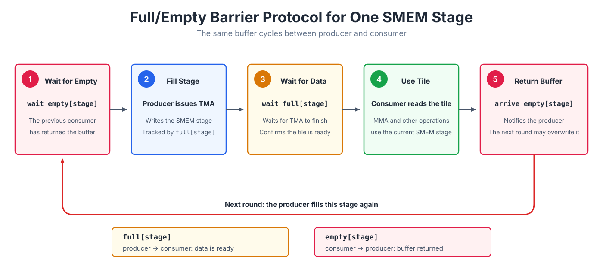

::: info Overview
- Issuing a TMA or Tensor Core instruction only starts an asynchronous operation. A consumer must wait for the corresponding completion signal before reading the result or reusing the resource.
- An `mbarrier` separates the producer's `arrive` from the consumer's `wait`. It combines ordinary thread arrivals with hardware completion notifications and, for TMA, also tracks bytes still in flight.
- A multistage pipeline typically uses a `full` barrier to signal that each stage is ready and an `empty` barrier to return its buffer. Barriers are reused through phases, so the kernel tracks phase parity to distinguish consecutive uses.
:::

The previous chapters on TMA and the Blackwell Tensor Core introduced two kinds of asynchronous operations. In both cases, a thread issues an instruction while the hardware continues the data transfer or matrix multiply-accumulate independently. The issuing thread does not have to wait in place.

Consider a TMA load. Program order can show that the TMA instruction was issued before an MMA reads the SMEM tile, but that only proves the transfer **started** first. It does not prove that the transfer has **finished**. If TMA is still writing the tile, MMA may read incomplete data. The same problem appears between `tcgen05.mma` and the epilogue: the epilogue must not read the TMEM accumulator until the Tensor Core has finished writing it.

These handoffs need an explicit completion signal. The producer reports when its work is complete, and the consumer waits for that report before using the data or reusing the resource. The hardware object that carries this signal is an `mbarrier`.

## `mbarrier`

`mbarrier` is short for memory barrier. It is a hardware synchronization object stored in shared memory, and its internal encoding is opaque. To understand its behavior, it is enough to track an arrival counter and a phase. The arrival counter says how many arrivals are still missing in the current round; the phase identifies the current round. With a parity-based wait, the kernel only tracks `phase % 2`, a zero-or-one value called the phase parity. For TMA loads, the barrier also uses a tx-count to track bytes that have not yet finished transferring.

<div style="overflow-x:auto;">
<iframe src="/gpupro/demo/mbarrier_mechanism.html?v=review-20260720" title="mbarrier state and operations" loading="lazy"
        style="width:100%; min-width:1320px; height:850px; border:1px solid var(--vp-c-border); border-radius:6px;"></iframe>
</div>

*Click any field to focus on its role in the barrier state.*

An `mbarrier` must first be initialized. During `init`, the kernel specifies how many arrivals each phase expects. The barrier starts in phase 0, with its pending arrival count set to the expected arrival count. It is now waiting for the relevant producers or resource users to report completion.

Every arrival reduces the amount of work the barrier is still waiting for. Different participants in a kernel report arrival in different ways.

For a TMA load, the usual path uses `mbarrier.arrive.expect_tx(bytes)`. This operation does two things. First, the issuing thread contributes one arrival, reducing the pending arrival count. Second, it adds the number of bytes that the TMA engine is expected to transfer to the tx-count.

The thread's arrival therefore does not mean that the barrier is complete. As the TMA engine finishes each transfer, hardware reports complete-tx updates that reduce the tx-count. The current phase completes only when both conditions below hold. The barrier then advances to the next phase, and its phase parity flips between 0 and 1:

```text
pending arrival count == 0
tx-count              == 0
```

For this reason, `expect_tx` is more than another ordinary arrival. It also registers the number of transfer bytes that the barrier must wait for. Completion requires all expected arrivals and all associated data transfers to finish.

Tensor Core work follows a different arrival path. Issuing `tcgen05.mma` alone does not update a barrier. The kernel must use `tcgen05.commit...mbarrier::arrive` to associate one barrier arrival with the previously issued asynchronous tcgen05 operations. Hardware reports that arrival only after those operations complete. Without the commit arrival, a consumer waiting for it cannot make progress.

An ordinary thread can also execute `mbarrier.arrive` directly. For example, after a consumer finishes reading a shared-memory buffer, it can arrive to tell the producer that the buffer may now be overwritten and reused.

`wait` is the consumer side of the same protocol. A consumer waits for the phase associated with the current iteration and may read the data or reuse the protected resource only after that wait completes. Raw PTX `mbarrier.try_wait.parity` may return `false` before the phase completes and therefore has to be retried. The `T.ptx.mbarrier.try_wait` operation used in this book wraps that retry loop and blocks until the requested phase completes. Because `arrive` and `wait` are separate, a producer can report progress and continue with other work, while the consumer waits only when it actually needs the result.

The common pattern is simple: asynchronous hardware runs independently and reports completion through the barrier. TMA can announce that an SMEM tile is ready, Tensor Core work can announce that a TMEM result is complete, and ordinary threads can announce that a buffer is no longer in use. In every case, the producer arrives and the consumer waits.

## How phases distinguish consecutive uses

The same `mbarrier` can be reused, with each round called a phase. After one phase completes, the barrier automatically enters the next phase and begins waiting for a new set of arrivals. If a consumer recorded only that the barrier had completed at some point, it could mistake the previous round's completion for the current data being ready. Phase parity alternates between 0 and 1 so the consumer can identify the particular completion it is waiting for.

<div style="overflow-x:auto;">
<iframe src="/gpupro/demo/phase_tracking.html?v=phase-order-20260720" title="phase tracking when an mbarrier is reused" loading="lazy"
        style="width:100%; min-width:1320px; height:640px; border:1px solid var(--vp-c-border); border-radius:6px;"></iframe>
</div>

*Select an iteration to see the phase parity alternate after each completed round.*

The figure shows one barrier alternating between phase 0 and phase 1. A two-stage TMA pipeline has two SMEM buffers, one for stage 0 and one for stage 1, and one TMA barrier for each stage. This lets the consumer wait for the two stages independently.

When the pipeline visits stage 0 and stage 1 in a fixed cycle, one `phase_tma` value can represent the current pass through the circular buffer. The parity flips after both stages have been visited:

```text
stage = iteration % 2
T.ptx.mbarrier.try_wait(tma_bar.ptr_to([stage]), phase_tma)

if stage == 1:
    phase_tma ^= 1
```

Both barriers start in phase 0, and `phase_tma` also starts at 0. The first four iterations evolve as follows:

| iteration | stage | phase parity waited on | barrier parity after completion | `phase_tma` after iteration |
|---:|---:|---:|---:|---:|
| 0 | 0 | 0 | 1 | 0 |
| 1 | 1 | 0 | 1 | 1 |
| 2 | 0 | 1 | 0 | 1 |
| 3 | 1 | 1 | 0 | 0 |

Iteration 0 waits for phase 0 of stage 0. When it completes, that barrier advances to phase 1, but the current pass through the circular buffer is not finished, so `phase_tma` remains 0. Iteration 1 waits for phase 0 of stage 1. Once both stages have been visited, `phase_tma` flips to 1.

Iteration 2 returns to stage 0 and waits for phase 1. That completion moves the stage 0 barrier back to phase 0. Iteration 3 does the same for stage 1, after which `phase_tma` returns to 0.

`phase_tma` describes the software's progress through the circular buffer. It does not assume that the two TMA transfers complete in any particular hardware order. A depth-`S` TMA pipeline therefore typically uses one TMA-completion, or `full`, barrier per stage and phase parity to distinguish consecutive uses of each stage. A complete buffer-reuse protocol adds the `empty` barriers introduced below.

## Common synchronization handoffs

In a Tensor Core kernel, `mbarrier` commonly coordinates three kinds of data handoff.

**Threads to asynchronous hardware.** If threads write shared memory and a later TMA store or MMA reads that memory, the kernel must first establish the required synchronization and ordering. Otherwise, the asynchronous operation may begin reading before the threads have finished writing the buffer.

**TMA to MMA.** A TMA load fills an SMEM tile asynchronously. The producer arranges for the `mbarrier` to track both its arrival and the transfer bytes. The MMA consumer waits for the current barrier phase to complete, along with any ordering required by the instruction, before reading the tile. The timeline below shows this handoff.

<div style="overflow-x:auto;">
<iframe src="/gpupro/demo/mbarrier_tma_timeline.html?v=review-20260720" title="tracking TMA loads with an mbarrier" loading="lazy"
        style="width:100%; min-width:1320px; height:500px; border:1px solid var(--vp-c-border); border-radius:6px;"></iframe>
</div>

*Step through the timeline to see two 2,048-byte TMA copies complete. The barrier advances atomically to the next phase only after both the pending arrival count and tx-count reach zero, allowing the consumer's wait to finish.*

**MMA to the epilogue.** `tcgen05.mma` updates a TMEM accumulator asynchronously. The thread that issues MMA uses `tcgen05.commit` to associate completion with an `mbarrier`. The epilogue waits for that barrier and applies the ordering fence required by tcgen05 before reading the result from TMEM.

## Using barriers to reuse a stage

A barrier can mean either "data is ready" or "the buffer is no longer in use." A pipelined kernel therefore usually gives each SMEM stage a pair of barriers: `full[stage]` means that TMA has filled the stage, while `empty[stage]` means that the consumer has finished with the buffer. Once the pipeline reaches steady state, one stage follows this cycle:



`full` hands data from producer to consumer, while `empty` returns the buffer from consumer to producer. Each barrier's expected arrival count depends on how many threads report completion. When the pipeline reuses the same pair of barriers, it must track the phase parity of `full` and `empty` separately.

When reading waits and arrivals in a pipelined kernel, first identify three things: the producer, the consumer, and the data or resource being handed off. Each wait and arrival can then be tied to a concrete event: data becoming ready, a result becoming readable, or a buffer becoming reusable.
