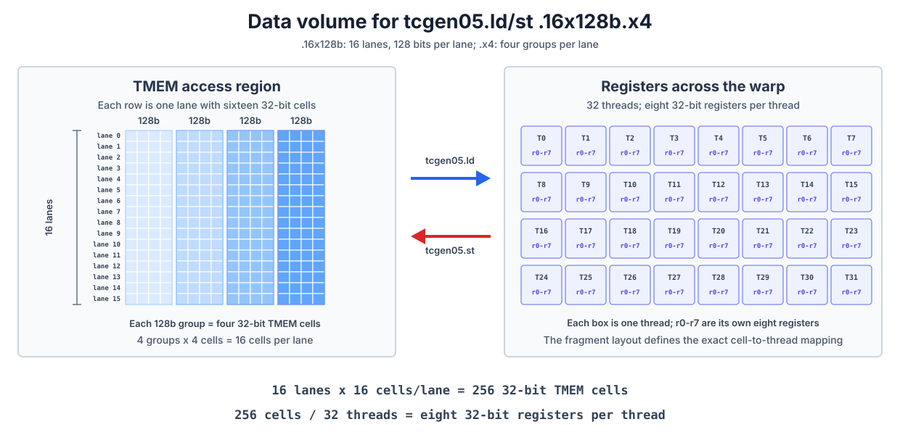

::: info Overview
- TMEM is a two-dimensional address space with Lane and Column coordinates, allocated dynamically along the Column dimension. `tcgen05.alloc` reserves space, `tcgen05.dealloc` releases it, and `tcgen05.relinquish_alloc_permit` gives up the right to make further allocations.
- `tcgen05.ld` and `tcgen05.st` are warp-collective instructions. A warp's ID within its warpgroup determines which 32 TMEM Lane positions it can access, while `.shape` and `.num` determine how much data moves and how many registers each thread uses.
- TMEM loads and stores are asynchronous. Execute `tcgen05.wait::ld` before using registers produced by a load, and `tcgen05.wait::st` before reusing TMEM locations touched by a store.
:::

Earlier chapters introduced TMEM from several directions. [Data Layout and Its Notation](/en/gpupro/data-layout/) explained the `TLane` and `TCol` axes and two-dimensional layouts. [Tensor Core Operand Layouts Across GPU Generations](/en/gpupro/tensor-core-data-layouts/) traced the accumulator and scale-factor data paths. [Blackwell Tensor Core](/en/gpupro/blackwell-tensor-core/) then showed how `tcgen05.mma` maps its result into TMEM.

We begin by recalling TMEM's physical structure. PTX calls its two address coordinates Lane and Column; in TIRx layout notation, the corresponding axes are `TLane` and `TCol`. A TMEM Lane is an address coordinate, not a thread's lane ID.

Each CTA has 128 positions along the Lane dimension and up to 512 positions along the Column dimension. Every `(Lane, Column)` cell is 32 bits. Allocating TMEM means reserving a range along the Column dimension, and every allocated column contains all 128 Lane positions.


This chapter focuses on the two remaining practical questions: how a kernel allocates and releases TMEM, and how its warps access that storage with `tcgen05.ld` and `tcgen05.st`.

## The TMEM Allocation Lifecycle

TMEM is allocated dynamically. `tcgen05.alloc` reserves space along the Column dimension, with legal `n_cols` values of 32, 64, 128, 256, or 512. Allocating one column reserves all 128 Lane positions in that column.

The following pattern appears in later TIRx kernels:

```python
pool = T.SMEMPool()
tmem_addr = pool.alloc((1,), "uint32")
pool.commit()

if warp_id == 0:
  T.ptx.tcgen05.alloc(
    T.address_of(tmem_addr), n_cols=256, cta_group=1
  )
```

`tmem_addr` is a 32-bit slot in SMEM. When `tcgen05.alloc` succeeds, it writes the base address of the allocated TMEM region into this slot. The instruction may wait for free TMEM columns, so it is a blocking instruction.

Here `warp_id == 0` selects all of warp 0. `tcgen05.alloc` is warp-collective: all 32 threads in that warp must execute it with the same `n_cols`. Do not add a `lane_id == 0` condition and turn it into a single-thread operation. Before other warps read `tmem_addr`, the kernel must also use the appropriate fence and CTA synchronization to make the allocation result visible throughout the CTA.

Once the base address is available, TIRx can declare a TMEM buffer over the allocated region:

```python
tmem = T.decl_buffer(
  (128, 256),
  "float32",
  scope="tmem",
  allocated_addr=tmem_addr[0],
  layout=TileLayout(
    S[(128, 256) : (1@TLane, 1@TCol)]
  ),
)
```

`allocated_addr` binds the buffer to the address returned by `tcgen05.alloc`. The layout maps logical coordinate `(m,n)` to TMEM `TLane` and `TCol`. Later code can refer to the logical element as `tmem[m,n]`, while the layout handles the hardware coordinates.

### Allocation-Size Restrictions

If one CTA performs several allocations in program order, a later allocation cannot request more columns than an earlier one. For example:

```text
256 columns -> 128 columns   valid
128 columns -> 256 columns   invalid
```

The kernel must therefore determine its largest TMEM requirement when it designs the allocation sequence rather than expanding the allocation later.

When the storage is no longer needed, the kernel performs two operations:

```python
if warp_id == 0:
  T.ptx.tcgen05.dealloc(tmem_addr[0], n_cols=256, cta_group=1)
  T.ptx.tcgen05.relinquish_alloc_permit(cta_group=1)
```

`tcgen05.dealloc` releases the allocated columns. Every TMEM allocation must be explicitly released before the kernel exits. `tcgen05.relinquish_alloc_permit` declares that the CTA will make no further TMEM allocations; after it executes, the CTA cannot call `tcgen05.alloc` again. Before cleanup begins, the kernel must ensure that asynchronous MMA, load, store, and other operations touching TMEM have completed.

### Allocation with `cta_group::2`

`cta_group::1` involves only the current CTA, so one warp in that CTA performs the allocation and deallocation. With `cta_group::2`, one warp on each side of the CTA pair must execute the same `tcgen05.alloc` or `tcgen05.dealloc`; the side that arrives first may wait for its peer.

The peer CTA must therefore have launched and eventually participate in these collective operations. Within one kernel, all `tcgen05` instructions carrying a `cta_group` qualifier must also use the same value. A kernel cannot allocate TMEM with `cta_group::2` and then access it with `cta_group::1` forms of `tcgen05.mma` or `tcgen05.commit`.

## Which TMEM Lanes Each Warp Can Access

TMEM belongs to the CTA, but `tcgen05.ld` and `tcgen05.st` do not give every warp access to all 128 Lane positions. The four warps in a warpgroup each access a fixed window of 32 TMEM Lane positions:

| Warp ID within the warpgroup | Accessible TMEM Lane positions |
| --- | --- |
| 0 | 0-31 |
| 1 | 32-63 |
| 2 | 64-95 |
| 3 | 96-127 |

All four warps can access every TMEM column; only their Lane windows differ. Reading an accumulator that spans all 128 Lane positions therefore requires four warp-level accesses, one for each window. This is the concrete meaning of the "warpgroup reads TMEM" shorthand used in earlier chapters.

## How `tcgen05.ld` and `tcgen05.st` Move Data

`tcgen05.ld` loads data from TMEM into registers, and `tcgen05.st` moves it in the opposite direction. Both are warp-collective instructions: every thread in the warp executes the same instruction and supplies the same TMEM address operand, `[taddr]`. The hardware uses each thread's lane ID to distribute the access among its registers, or to place those registers back into the corresponding TMEM cells.

The following figure uses an m8n8-style register fragment to illustrate both directions. This is only one local mapping supported by `tcgen05.ld/st`; the actual data movement depends on `.shape`, `.num`, and the optional `.pack::16b` or `.unpack::16b` qualifier.


### Shape and Repeat Factor

The amount of data moved by one load or store comes from `.shape` and `.num`. `.shape` specifies how many TMEM lanes participate and the base amount of data taken from each lane. `.num` repeats that amount. For example:

```text
tcgen05.ld.sync.aligned.16x128b.x4.b32
    {r0, r1, r2, r3, r4, r5, r6, r7}, [taddr]
```

The next figure expands this instruction from left to right. Each horizontal row on the left is one TMEM lane. The four blue groups in a row correspond to the four repetitions selected by `.x4`. Each group contains four cells, representing the 128 bits in `.16x128b`; one small cell is one 32-bit TMEM cell.



The left side therefore contains

```text
16 lanes × 4 groups/lane × 4 cells/group
    = 256 32-bit TMEM cells
```

The 32 boxes on the right represent the 32 threads in the warp. The `r0-r7` inside each box are that thread's own eight 32-bit registers. `tcgen05.ld` distributes the 256 cells among those registers, giving each thread

```text
256 cells / 32 threads = 8 32-bit registers/thread
```

`tcgen05.st` moves the same amount of data in the opposite direction. The figure counts data volume only; the instruction's fragment mapping still determines which TMEM cell corresponds to which register slot in which thread.

Changing `.x4` to `.x1` leaves only one 128-bit group in each lane. The instruction then moves `16 × 1 × 4 = 64` cells, which gives each of the 32 threads two 32-bit registers.

| Instruction form | Data per lane | Registers per thread |
| --- | ---: | ---: |
| `.16x128b.x1` | 128 bits | 2 |
| `.16x128b.x2` | 256 bits | 4 |
| `.16x128b.x4` | 512 bits | 8 |
| `.16x128b.x8` | 1024 bits | 16 |

This data-movement shape is different from the `M × N × K` instruction shape of MMA. The MMA shape gives the logical dimensions of the matrix multiplication. Here, `.shape` describes the hardware movement between TMEM and registers. The register fragments in [Tensor Core Operand Layouts Across GPU Generations](/en/gpupro/tensor-core-data-layouts/) explain how those registers map back to logical matrix elements.

### Packing and Unpacking 16-Bit Data

Each TMEM cell and each register operand of `tcgen05.ld/st` is 32 bits, but a kernel may manipulate 16-bit pieces of data. On `tcgen05.ld`, `.pack::16b` combines two 16-bit pieces from adjacent TMEM columns into one 32-bit register. On `tcgen05.st`, `.unpack::16b` splits one 32-bit register into two 16-bit pieces and writes them to adjacent TMEM columns.

Packing and unpacking change only how data is organized while moving between TMEM and registers. They do not change the allocation unit: TMEM is still allocated along the Column dimension, and every allocated column still contains all 128 Lane positions.

### Waiting for Asynchronous Loads and Stores

`tcgen05.ld` and `tcgen05.st` are asynchronous. After a load, execute `tcgen05.wait::ld` before using the destination registers. After a store, use `tcgen05.wait::st` before relying on the write being complete. Each wait covers all earlier `tcgen05.ld` or `tcgen05.st` operations issued by the current thread, respectively.

If another thread or warp will consume the data, waiting for the asynchronous operation is not enough by itself. The kernel also needs thread synchronization and the appropriate `tcgen05.fence` to establish ordering across threads.

The SMEM-to-TMEM instruction `tcgen05.cp` uses a different set of shapes and a different completion mechanism. Its role in moving scale factors for block-scaled MMA was covered in [Tensor Core Operand Layouts Across GPU Generations](/en/gpupro/tensor-core-data-layouts/) and [Blackwell Tensor Core](/en/gpupro/blackwell-tensor-core/), so we will not repeat it here.

When reading a kernel that uses TMEM, check four things in order: how many columns it allocates and releases, which Lane window the current warp may access, how many registers the `.shape` and `.num` of each `ld/st` produce, and whether the corresponding asynchronous operation has completed. Together, these checks connect TMEM's resource lifetime, data layout, and synchronization protocol.
