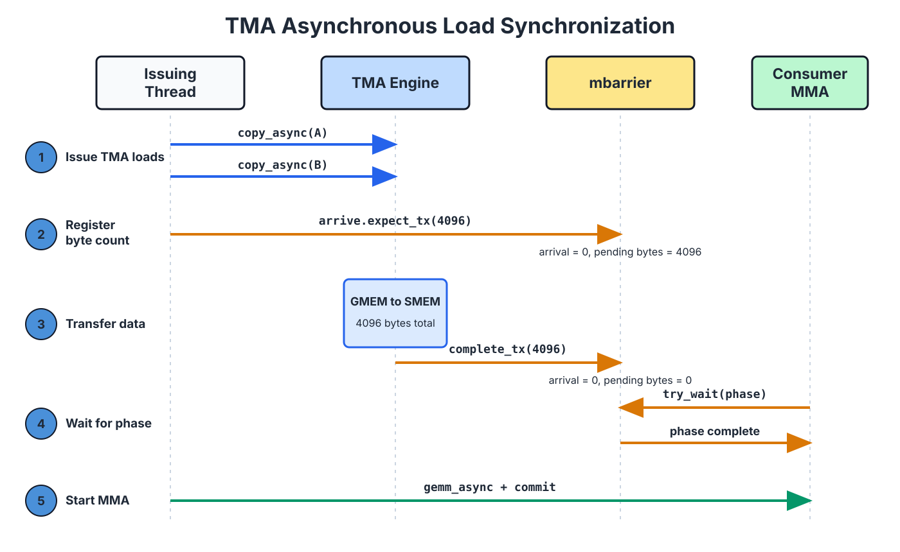

::: info Overview
- TMA asynchronously moves tiles between global memory and shared memory. One thread in a warp issues the operation; hardware performs the remaining address calculation and data transfer.
- A tensor map descriptor describes the global tensor, including its shape, strides, tile shape, and swizzle mode. The TMA instruction supplies the current tile coordinates and shared-memory address. On a load, TMA can apply the swizzle while writing shared memory, so the tile arrives in the layout expected by the later MMA.
- TMA loads and stores use different completion mechanisms. A load uses an `mbarrier` to track the number of transferred bytes; a store uses a commit group and wait group to determine when its source buffer can be reused.
:::

Start with the most common situation in a GEMM mainloop. While the Tensor Core computes tile $k$, the next A and B tiles must reach shared memory before the current computation finishes. If the data arrives late, the Tensor Core has to wait. The pipeline then develops a **bubble**, meaning a period in which the compute unit sits idle waiting for data.

One way to move the tiles is to have several threads cooperate: each thread computes its global-memory and shared-memory addresses, then executes the corresponding load and store. The Tensor Memory Accelerator, or TMA, provides another path. One thread submits a tile copy, and a dedicated TMA engine performs the remaining address calculation and data transfer.

TMA can also apply a swizzle as it writes shared memory, allowing the tile to arrive in the physical layout required by the later MMA. The following interactive figure shows this path. The global tensor on the left contains `16x128` `fp16` elements, and the blue rectangle selects an `8x64` tile. The right side shows how that tile is arranged after TMA writes it into shared memory. Each cell represents eight consecutive `fp16` values, or 16 bytes. Toggle the swizzle mode to compare the linear and 128-byte swizzled layouts.

<div style="overflow-x:auto;">
<iframe src="/gpupro/demo/tma_intro.html?v=tutorial-review-20260713" title="TMA: the Tensor Memory Accelerator" loading="lazy"
        style="width:100%; min-width:1320px; height:640px; border:1px solid var(--vp-c-border); border-radius:6px;"></iframe>
</div>

*Hover over any source cell on the left to see its physical destination in shared memory.*

## How One Thread Describes an Entire Tile

The thread that issues a TMA copy does not iterate over the elements in the tile. It only provides the hardware with two kinds of information.

The first is a tensor map descriptor. It records the global tensor's element type, shape and strides in each dimension, the tile shape for one copy, and the swizzle mode to apply when writing shared memory. The same descriptor can usually be reused across many tile copies.

The second is specific to the current copy: the tile's starting coordinates in the global tensor and its destination address in shared memory. A useful distinction is that the descriptor says "how is this tensor organized?", while the instruction arguments say "where does this copy begin, and where should it land?"

The warp still follows the SIMT execution model when the TMA instruction is issued. Only the selected thread participates in that instruction; the other threads in the warp are masked off. This lasts only until the request has been submitted. The TMA engine then moves the data asynchronously, allowing the issuing warp and the other warps in the CTA to continue with other work. Before a consumer reads the destination tile, it must wait for the transfer to complete.

## How TMA Writes a Swizzled Layout

Return to the interactive figure above and first select `None`. Each row is then written to shared memory in its original order, so logical sector `c` remains physical sector `c`.

Now select `128B`. Each row in the figure contains eight 16-byte sectors, exactly 128 bytes. In this simplified, aligned example, logical sector `col` in row `row` is written to:

```text
physical_sector = col XOR row
```

The sectors from one logical column now land at different physical positions in different rows, making a cross-row access less likely to concentrate on the same shared-memory banks. The TMA engine applies this address transformation while writing the tile; the issuing thread does not calculate each swizzled address itself.

Swizzling changes the tile's physical arrangement, not its logical contents. The TMA descriptor, the shared-memory tile layout, and the later MMA instruction must all describe the same physical arrangement ([Data Layout and Its Notation](/en/gpupro/data-layout/)). If TMA writes a 128-byte swizzle but MMA reads the data as a linear layout, the bytes have reached shared memory, but the Tensor Core will interpret them as the wrong matrix elements.

## Using 3D TMA to Move Multiple Swizzle Atoms

`SWIZZLE_128B` uses an `8 rows x 128 bytes` repeating unit called a swizzle atom. Address remapping occurs only within an atom, so the innermost contiguous dimension of a TMA box cannot exceed 128 bytes. For `fp16`, that space holds exactly 64 elements.

Now consider a `16x128` `fp16` matrix slice. Each row contains 128 `fp16` values, or 256 bytes, so the row cannot directly serve as one row of a 128-byte swizzle atom. To use `SWIZZLE_128B`, split each row into two groups of 64 `fp16` values:

```text
group 0: columns 0-63    = 128 bytes
group 1: columns 64-127  = 128 bytes
```

For a column coordinate `j` within the slice, define:

```text
group = j // 64
col   = j % 64

global[row, j] = global3[group, row, col]
```

The same data now has a three-dimensional `(group=2, row=16, col=64)` view. This reshape only changes how the tensor map interprets the coordinates; it does not move the data in global memory ahead of time. After adding the `group` dimension, the innermost `col` dimension contains 64 `fp16` values and therefore satisfies the 128-byte limit.

The next interactive figure draws this process. The left side is a complete `16x256` global matrix. Each cell represents one 16-byte sector, or eight `fp16` values. The blue region selects one `16x128` slice. A single 3D TMA copy writes its two groups into `g0` and `g1` on the right.

Each group has 16 rows, while one swizzle atom has only eight. Both `g0` and `g1` therefore contain two atoms: rows 0-7 form the first atom, and rows 8-15 form the second. The complete slice contains four atoms. With `128B` enabled, TMA rearranges sectors inside each atom according to `physical_sector = logical_sector XOR (row % 8)`.

<div style="overflow-x:auto;">
<iframe class="demo-tma3d" src="/gpupro/demo/tma_3d.html?v=tutorial-review-20260713" title="Using 3D TMA to move multiple swizzle atoms" loading="lazy"
        style="width:100%; min-width:1320px; height:640px; border:1px solid var(--vp-c-border); border-radius:6px;"></iframe>
</div>

*Toggle `Col offset` to select the first or second 128 columns of the original matrix. Hover over any cell in the blue region to see where its 16-byte sector lands in shared memory.*

### 128-Byte Swizzling and Row Layout

`SWIZZLE_128B` always permutes data within a 128-byte span. Each sector in the figure is 16 bytes, so a swizzle span always contains eight sectors. Even when a logical row contains 16 sectors, the hardware does not treat the full row as one 256-byte swizzle unit. The relevant distinction is how the two 128-byte spans are arranged in memory, not whether the swizzle itself groups sectors in sets of eight.

Consider a `16x16` sector grid. Each row contains 16 sectors, or 256 bytes. Reading the same sector column from eight consecutive rows produces eight parallel 16-byte accesses. Each access spans four adjacent shared-memory banks. To make the pattern easier to inspect, the figure groups the 32 banks into eight bank sectors, `S0` through `S7`.

If the ordinary 256-byte row stride is preserved, adjacent logical rows begin two 128-byte spans apart. Let `span = col // 8` and `local_col = col % 8`. The resulting bank sector is:

```text
bank_sector = local_col XOR ((2*row + span) % 8)
```

Across eight rows, this expression produces only four distinct bank sectors. Each sector is accessed twice, creating a 2-way conflict. This layout is included to illustrate the effect of row stride. Because its innermost dimension is 256 bytes, it cannot be used as a single `SWIZZLE_128B` TMA box.

After rewriting the logical coordinates as `(group, row, local_col)`, each group contains eight sectors and adjacent rows within a group are 128 bytes apart. The bank sector then becomes:

```text
bank_sector = local_col XOR (row % 8)
```

The eight rows now reach eight distinct bank sectors, so the accesses can proceed in parallel.

The following interactive figure compares these two row layouts. Select `128B groups` to arrange the two spans explicitly as `g0` and `g1`. Select `256B stride` to preserve the original row stride; the swizzle still permutes data only within each 128-byte span. Cells with black outlines show where the selected column lands in the swizzled layout, and the summary below reports the bank sectors used by those accesses. Changing `dtype` affects only the number of elements in each sector, not the address mapping.

<div style="overflow-x:auto;">
<iframe class="demo-tma3d" src="/gpupro/demo/tiling_constraint.html?v=row-layout-20260805" title="How 128-byte grouping affects bank conflicts" loading="lazy"
        style="width:100%; min-width:1320px; height:640px; border:1px solid var(--vp-c-border); border-radius:6px;"></iframe>
</div>


*Switch the row layout, then select a column and eight consecutive rows to compare the bank-sector use of 128-byte groups and a 256-byte row stride.*

When selecting a swizzle mode, the TMA box's innermost contiguous dimension must not exceed the corresponding swizzle width. For example, `SWIZZLE_128B` requires that dimension to be at most 128 bytes. If the data is narrower than the swizzle width, the shared-memory allocation must still reserve the full width. A kernel should therefore choose among the 128-byte, 64-byte, and 32-byte modes based on both its tile width and its access pattern ([Data Layout and Its Notation](/en/gpupro/data-layout/)).

## How to Wait for a TMA Load

A TMA load is asynchronous. Issuing the instruction only starts the transfer; the consumer cannot read the destination tile yet. TMA uses an `mbarrier` for this handoff. The producer tells the barrier how many bytes to expect during the current phase, the TMA engine updates the barrier after writing those bytes, and the consumer waits for that barrier phase to complete.

One phase of an `mbarrier` tracks both an arrival count and a pending transaction-byte count. The phase completes only after both reach zero.

Consider a concrete example. Suppose a kernel loads two operand tiles, A and B, each containing `2048 bytes`, and associates both copies with the same `mbarrier`. The phase must wait for:

```text
2048 + 2048 = 4096 bytes
```

Assume the barrier was initialized with an expected arrival count of 1. The issuing thread associates both TMA loads with the barrier and executes `mbarrier.arrive.expect_tx(4096)`. This performs the thread's one arrival and sets the pending byte count to 4096:

```text
after expect_tx:       arrival count = 0, pending bytes = 4096
after TMA completes:   arrival count = 0, pending bytes = 0
```

As each TMA copy finishes, the engine applies a complete-tx update that subtracts the corresponding byte count. The consumer waits with `try_wait(phase)`. Only after the two copies have completed all 4096 bytes does the pending count reach zero, allowing the consumer to read the A and B tiles safely. The next figure shows this handoff in time order.



## How to Wait for a TMA Store

A TMA store moves data in the opposite direction, from shared memory to global memory. The synchronization question changes with that direction: a load consumer needs to know when the destination tile is ready to read, whereas a store producer needs to know when the source buffer is safe to reuse.

For example, suppose the epilogue has written an output tile into `Dsmem` and then starts a TMA store to write it back to `D`. The kernel cannot immediately overwrite `Dsmem`, because the TMA engine might then read data from the next iteration. The store path uses a bulk async group:

```text
issue one or more TMA stores
cp.async.bulk.commit_group
cp.async.bulk.wait_group 0
reuse Dsmem
```

`commit_group` combines the uncommitted stores issued so far into one bulk async group. `wait_group 0` waits until all previously committed groups have completed. Only after it returns can `Dsmem` be reused safely.

The two paths can therefore be distinguished as follows:

```text
TMA load:  consumer waits for data through an mbarrier with byte tracking
TMA store: producer waits for source reuse through a commit group and wait group
```

## Putting TMA into a Pipeline

TMA reduces the number of copy instructions, but its larger benefit is the ability to overlap data movement with computation. With two shared-memory stages, for example:

```text
time t:    MMA reads stage 0    TMA fills stage 1
time t+1:  MMA reads stage 1    TMA fills stage 0
```

While the Tensor Core reads stage 0, TMA writes the next tile into stage 1. The two stages exchange roles on the next iteration. Before MMA reads a stage, it waits for the corresponding TMA load to finish. Before TMA overwrites a stage, the kernel also confirms that the previous computation no longer uses its data.

TMA performs the asynchronous transfer, and the barrier hands each stage from producer to consumer. Together, they allow the time spent waiting for future data to be hidden behind computation on the current tile.
