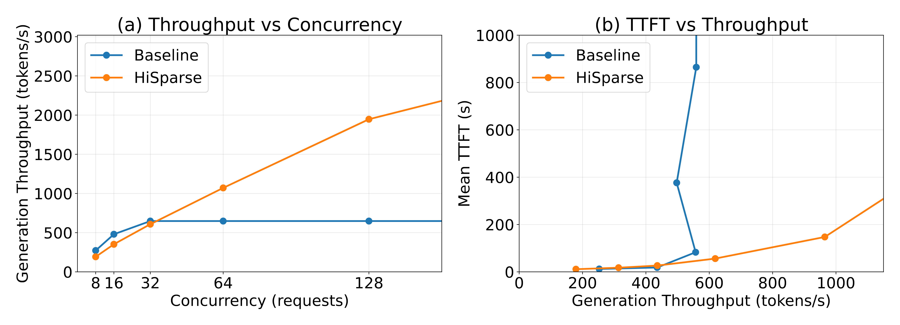
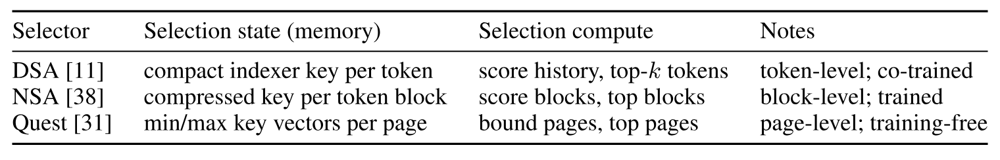
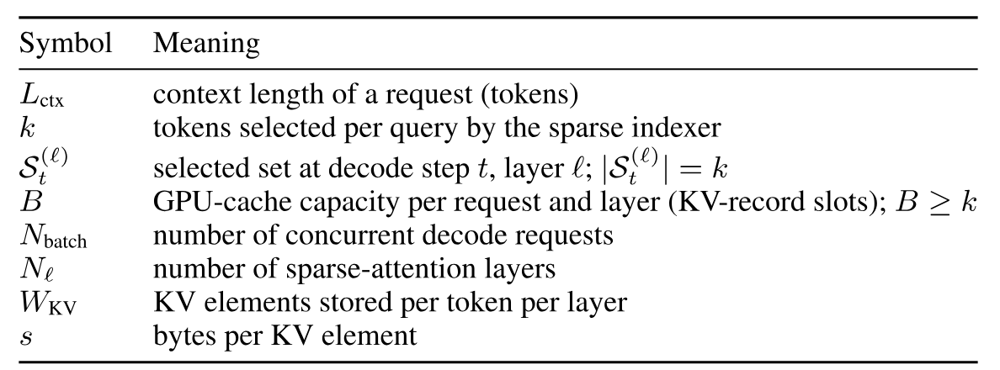
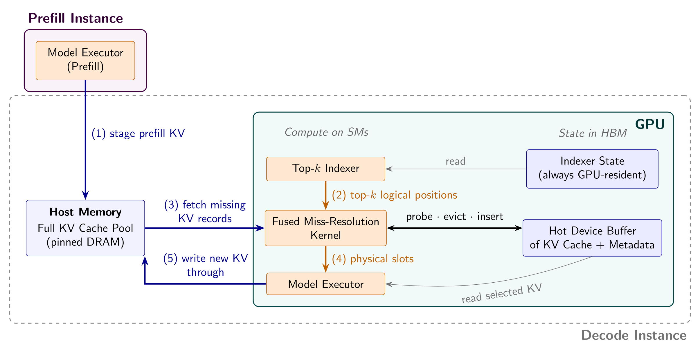
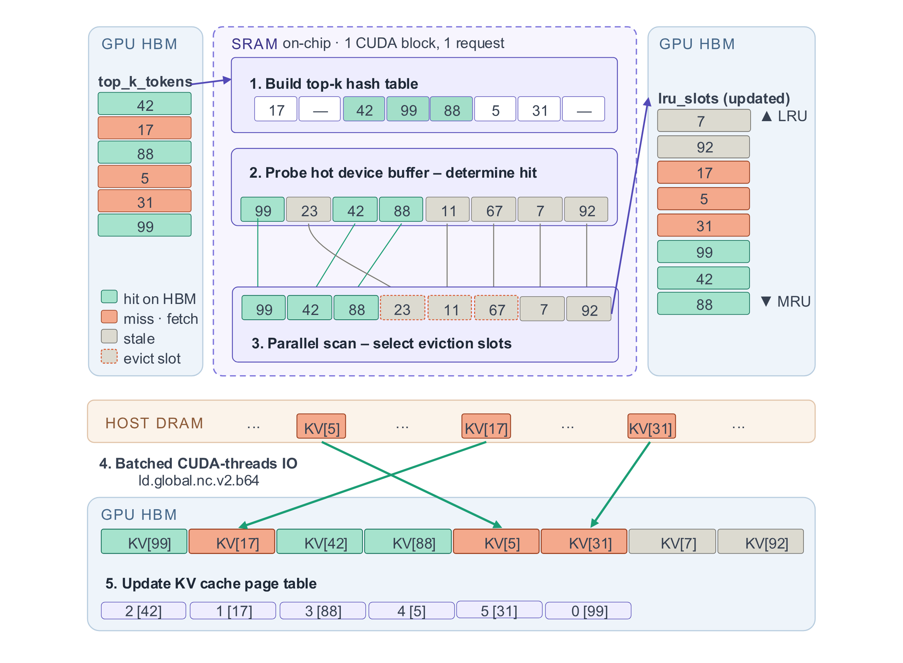
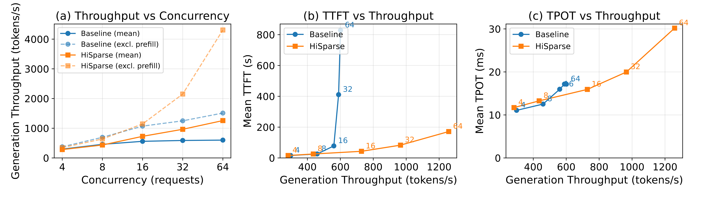
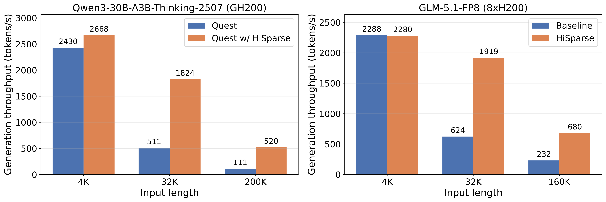
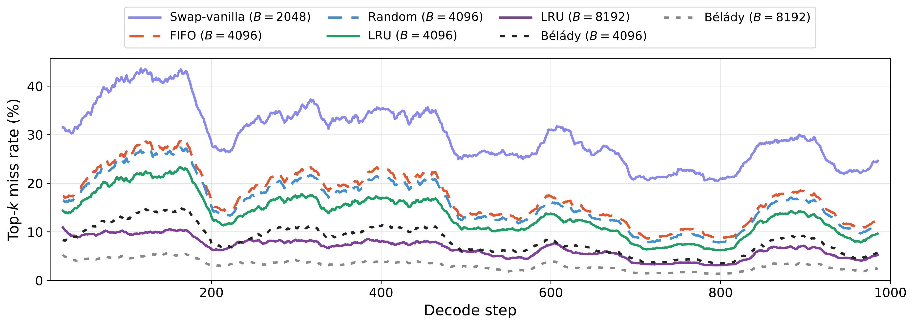
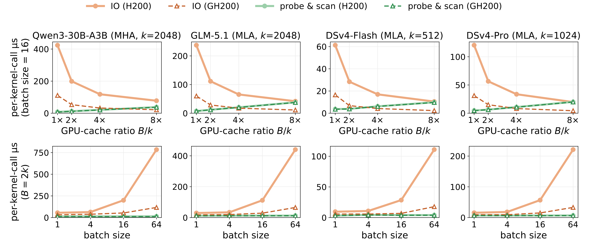
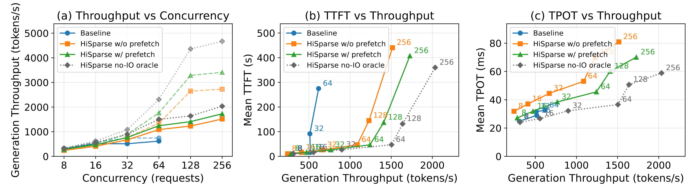

> [Zhiqiang Xie](https://zhiqiangxie.com/) [+corresponding-author], [Zhangheng Huang](https://github.com/hzh0425), [Tingwei Huang](https://github.com/huangtingwei9988), [Ziyi Xu](https://orcid.org/0009-0000-4411-9773), [Ruiyang Ma](https://orcid.org/0009-0003-9067-9538), and [Christos Kozyrakis](https://kozyraki.github.io/). First submitted to arXiv on August 7, 2026; current version v1. [HiSparse: Scaling Sparse-Attention Decoding with Hierarchical KV Cache Management](https://arxiv.org/abs/2608.07009v1). [Original PDF](/paper/hisparse.pdf). [DOI](https://doi.org/10.48550/arXiv.2608.07009). [TeX source](https://arxiv.org/src/2608.07009v1). The original PDF remains authoritative for the exact print layout and bibliography.

[+corresponding-author]: *Corresponding author: `xiezhq@cs.stanford.edu`.*

## Abstract

Top-$k$ sparse attention makes long-context LLM decoding cheap to compute: each step reads only a few thousand selected KV entries rather than the full context. Serving systems, however, typically keep the entire KV cache in GPU HBM so that every position stays selectable, so a request's memory bill still grows with its full context length—decoding hits a capacity wall long before it runs out of compute, and a context whose KV cache exceeds HBM cannot be served at all. We present HiSparse, an exact, indexer-agnostic hierarchical KV cache for sparse-attention serving. HiSparse keeps each request's full KV history in host memory and bounds its decode footprint with a small, fixed-size GPU cache; a fused CUDA kernel resolves each layer's selections—hit detection, LRU replacement, and host-to-device fetches—inside the decode CUDA graph; and, for models that share selections across layers, exact layer-wise prefetching hides roughly half of the remaining miss overhead. Because only KV placement changes, model outputs are unchanged. HiSparse is merged into upstream SGLang and evaluated across three sparse-attention families (DSA, NSA, and Quest) on H200, B200, and GH200 platforms: it improves peak generation throughput by up to $4.7\times$ on long-context workloads while preserving comparable per-token latency and reducing time-to-first-token at high load—and a no-IO oracle shows the resolution mechanism itself adds no measurable per-token cost, leaving host-device IO as the only price of bounded residency.

## 1 Introduction

Long-context inference is becoming a standard LLM workload: coding agents inspect entire repositories, assistants synthesize across long documents, and recent models target context windows from tens of thousands to millions of tokens [Dee26, Zen26, Qwe25a]. Serving these contexts remains expensive, because each live decoding request carries a KV cache that grows with its full history.

Top-$k$ sparse attention offers a promising path to scaling long contexts. Instead of attending to every previous token, each decode step attends to a small, query-dependent set of $k$ selected KV entries—typically a few thousand tokens, one to two orders of magnitude below the contexts these models target. DeepSeek-V3.2 demonstrates that a learned top-$k$ selection preserves model quality while sharply reducing long-context attention cost [Dee25a, Dee25d]; the same pattern appears in trained architectures such as DeepSeek Sparse Attention (DSA) and Native Sparse Attention (NSA) [Yua25e] and in training-free selectors such as Quest [Tan24]. Once the selected set is fixed, the attention kernel reads only $k$ KV entries rather than the full context, suggesting that long-context decoding should become much cheaper to serve.

Sparse attention, however, does not shrink the KV capacity bottleneck. The selected set changes across generated tokens and layers—an entry skipped now may be selected later—so serving systems typically keep the full KV cache resident in GPU HBM to keep every logical position addressable. The result is a lopsided serving economics: each decode step reads only $k$ entries, yet every entry of the full context pays for HBM residency so that it *might* be read—attention became orders of magnitude cheaper, while its memory bill did not drop by a byte. The bill is substantial even for compressed KV layouts: a $128$K-token GLM-5.1 request holds $13.09\,\mathrm{GB}$ of BF16 KV state, and a single $1$M-token request would claim an entire H200—more than $100\,\mathrm{GB}$ of its $141\,\mathrm{GB}$ HBM before counting weights; with weights resident, it cannot be admitted at all, capping the servable context well below the model's window. In practice the wall binds on the *product* of context length and concurrency: at $32$K tokens per request, a few dozen concurrent requests exhaust HBM ([Figure 1](#figure-01)), and at $128$K the same HBM admits $4\times$ fewer. Long-context sparse decoding therefore runs out of memory capacity long before it runs out of attention compute.

**Figure 1.** HiSparse decouples decoding throughput from GPU memory capacity on long-context workloads. **(a)** Decoding throughput vs. concurrency: the baseline plateaus once HBM saturates; HiSparse continues to scale. Longer contexts hit the same wall at proportionally lower concurrency. **(b)** Mean TTFT vs. throughput in PD-colocated mode: HiSparse sustains lower TTFT at higher throughput. GLM-5.1-FP8 (DSA, $k=2048$), $8\times$H200, $32$K input, $8$K output.

[Figure 1](#figure-01) shows the serving consequence: decoding throughput plateaus once HBM fills, and in colocated serving the time-to-first-token (TTFT) climbs as decode KV caches crowd out prefill work. Yet full-KV serving ignores a free oracle. The sparse selector announces, at every layer of every decode step, exactly which $k$ positions attention will read—a precise, per-step demand signal for KV placement that no dense-attention system ever had. That demand also has structure: consecutive decode steps reselect largely overlapping positions [Che25aa], and nearby layers select correlated positions, a locality that recent models make explicit by sharing indexer outputs across layers [Bai26, Glm26]. Sparse selections behave like memory accesses with strong temporal locality—exactly the regime in which a small fast cache backed by a larger, slower tier works. This observation motivates HiSparse, an exact hierarchical KV cache system for top-$k$ sparse-attention serving: HBM should pay for what attention reads, not for everything it might read.

HiSparse keeps each request's complete KV history in host memory and gives it a small, fixed-size *GPU cache* in HBM. Each layer's top-$k$ selections are resolved against this cache before its attention kernel launches: resident entries are used in place, and the few that miss are fetched from the host copy in one batched transfer. Selected positions, attention scores, and outputs are unchanged, and because HiSparse consumes only the selected positions each layer emits, it is *indexer-agnostic*: it slots beneath DSA, NSA, or Quest without retraining or model changes. A request's decode-time HBM consumption therefore scales with the GPU-cache size rather than with its context length.

The crux of HiSparse is keeping this hierarchy off the decode critical path; its design contributions answer three challenges. First, *what to keep resident*: staging only the current top-$k$ set discards locality—on a LongBenchV2 selection trace it misses $30\%$ of each step's selections—so HiSparse manages the cache with LRU, turning selection locality into an $87\%$ hit rate at twice the top-$k$ size ([Section 4.3](#section-4-3)). Second, *hiding the misses that remain*: each miss stalls that layer's attention on a host-memory fetch, and at high batch size the misses of concurrent requests contend for the same host link ([Section 4.4](#section-4-4)); HiSparse makes each fetch bandwidth-efficient with GPU-assisted IO and, when models share selections across layers, overlaps the remaining transfers with the intervening layers' computation via exact prefetch ([Section 3.5](#section-3-5)). Third, *making resolution itself cheap*: hit detection, victim selection, metadata updates, and host fetches recur at every sparse layer of every decode step, so HiSparse fuses them into a single CUDA kernel captured inside the decode CUDA graph ([Section 3.4](#section-3-4)).

HiSparse is not a research prototype: our implementation is merged into upstream SGLang [She24], a widely deployed open-source serving framework, and released as a supported serving feature [Xie26a, Sgl26a] ([Section 8](#section-8) details the integration). We evaluate it across three sparse-attention families (DSA, NSA, and Quest) on three hardware platforms (H200, B200, and GH200). HiSparse improves peak generation throughput by up to $4.7\times$ on long-context workloads, preserves a comparable time per output token (TPOT) in the overlapping throughput range, reduces TTFT at high load, and does so without changing model outputs. All of these gains come from one lever: bounded residency lets HiSparse run much larger decode batches in the same HBM. The same lever can be pulled the other way—serving a fixed batch with substantially less HBM ([Section 4.2](#section-4-2)), or serving contexts that HBM alone could never hold ([Section 5](#section-5)).

This paper makes the following contributions:

- We identify the capacity wall in long-context top-$k$ sparse-attention serving: active KV reads scale with $k$, but the HBM-resident KV footprint still scales with the full context length ([Section 2](#section-2)).
- We introduce HiSparse, an exact, indexer-agnostic hierarchical KV cache that keeps full KV state available in host memory while bounding per-request decode HBM with a fixed-size GPU cache ([Section 3](#section-3)).
- We design a locality-preserving miss-resolution path: LRU management that turns selection locality into cache hits, layer-wise prefetching that hides residual miss latency, and a fused CUDA resolve kernel that keeps resolution cheap on the decode critical path ([Section 3.4](#section-3-4), [Section 3.5](#section-3-5)).
- We evaluate HiSparse on DSA, NSA, and Quest workloads across H200, B200, and GH200 platforms, showing large long-context throughput gains and analyzing the cache-policy, kernel, and host-device bandwidth tradeoffs that determine performance ([Section 4](#section-4)).

## 2 Background and Motivation

### 2.1 Top-$k$ Sparse Attention

Top-$k$ sparse attention replaces full attention over the entire context with attention over a small, query-dependent set of keys. At decode step $t$, an *indexer* produces a selected set $\mathcal{S}_t \subseteq \{1,\dots,L_{\mathrm{ctx}}\}$ with $|\mathcal{S}_t| = k$, and the attention kernel reads only the corresponding key and value entries. The resulting sparse attention is still exact with respect to the model's sparse-attention rule: once $\mathcal{S}_t$ is fixed, unselected entries do not participate in the current attention computation.

Recent systems differ mainly in how they produce $\mathcal{S}_t$ ([Table 1](#table-01)). DeepSeek Sparse Attention (DSA) introduces a learned "lightning indexer" co-trained with the backbone and used by DeepSeek-V3.2 and GLM-5.1 [Dee25a, Dee25d, Zen26, Xie26a]: it keeps one compact indexer key per token and scores the full history with a lightweight kernel before taking a token-level top-$k$. Native Sparse Attention (NSA) combines compressed, selected, and sliding-window branches in a trainable architecture; its selected branch keeps one compressed key per block of tokens and takes a top-$k$ over block scores [Yua25e]. Quest is a training-free, page-granular selector for dense pretrained models: it maintains per-page min/max summaries of keys and selects the pages with the highest query-aware upper bounds [Tan24]. The selectors thus differ in the state they maintain, the scoring they perform, and their selection granularity—token, block, or page.

**Table 1.** Query-dependent top-$k$ selectors. Each maintains compact, HBM-resident selection state and emits logical token positions; the KV records read by attention dominate memory and are what HiSparse manages hierarchically.

Despite these differences, the selectors share three properties that define a common systems interface. First, the state needed to *choose* is compact: indexer keys, block keys, and page summaries are all far smaller than the KV records that attention reads, so selection state can stay HBM-resident even at long context. Second, selection completes *before* the attention kernel touches any KV record, creating a natural interposition point between choosing and reading. Third, the output has the same form everywhere: a set of logical token positions per layer, which we write $\mathcal{S}_t^{(\ell)}$ for layer $\ell$ at step $t$. Each sparse layer ordinarily selects its own set, though recent models amortize indexer cost by letting groups of consecutive layers *share* one layer's selection [Bai26, Glm26]—a design HiSparse later exploits for prefetching ([Section 3.5](#section-3-5)). HiSparse builds on exactly these properties ([Section 3](#section-3)): it leaves selection state and computation untouched on the GPU, interposes at the position interface, and applies hierarchical placement only to the bulky KV records—which is what makes it indexer-agnostic.

### 2.2 KV Cache and the Capacity Wall

During autoregressive decoding, the keys and values of every previous token are retained as the KV cache. Top-$k$ sparse attention narrows what one step *reads*, not what must remain *available*: $\mathcal{S}_t$ is drawn from the full history and drifts from step to step, so an entry skipped now may be selected later, and serving systems typically keep the entire cache HBM-resident to keep every position addressable by the indexer and attention backend ([Section 1](#section-1)). The resulting admission constraint is the quantitative form of the capacity wall: a decode batch of $N_{\mathrm{batch}}$ requests at context length $L_{\mathrm{ctx}}$ must fit $N_{\mathrm{batch}} \times L_{\mathrm{ctx}}$ tokens of KV state in whatever HBM remains after model weights, while each decode step's attention reads only $N_{\mathrm{batch}} \times k$ of those tokens.

The wall hits both common deployment modes. Adding concurrent requests improves throughput only until KV storage fills HBM, after which the scheduler cannot admit more decode work even though the attention kernels have compute headroom—the plateau in [Figure 1(a)](#figure-01). In *PD-disaggregated* serving, where prefill and decode run on separate GPU pools, HBM capacity directly caps decode-pool throughput. In *PD-colocated* serving, prefill and decode share GPUs and HBM: full-context decode KV caches consume memory that prefill chunks need, so incoming requests wait for both memory and decode slots before producing their first token, and mean TTFT becomes dominated by queueing and rises sharply with load ([Figure 1(b)](#figure-01)).

Our GLM-5.1 deployment ([Section 4.1](#section-4-1): $8\times$H200, $1.1\,\mathrm{TB}$ aggregate HBM) makes the numbers concrete. At $32$K input / $8$K output, each request holds up to $4\,\mathrm{GB}$ of KV state, and the full-KV baseline saturates at about $60$ concurrent requests—roughly $240\,\mathrm{GB}$ of KV, the share of HBM left once weights, activations, and CUDA-graph state are resident ([Figure 1(a)](#figure-01)). Colocated, this saturation point is where TTFT starts to climb; disaggregated, it caps a decode pool built from the same hardware at the corresponding decode-only rate ($777$ tokens/s in our measurements), no matter how much prefill capacity stands in front of it. At $128$K, the same arithmetic admits only ${\sim}15$ requests.

### 2.3 Decoupling Availability from Residency

The capacity wall comes from tying together two requirements that need not be identical. The model needs every past KV entry to be *logically available*, because a future top-$k$ selection may refer to any position in the history. The GPU, however, only needs the entries actually read by the current step. Full-HBM serving treats "may be selected later" as "must stay in HBM now," which is simple but overly strong. A serving system only needs to ensure that, once the indexer emits $\mathcal{S}_t^{(\ell)}$, the selected KV entries are on device before that layer's attention runs; entries outside $\mathcal{S}_t^{(\ell)}$ can reside elsewhere without changing the selected positions, attention scores, or outputs.

Decoupling alone, however, does not make offloading viable: the CPU-GPU interconnect would immediately become the bottleneck. If every layer's $k$ selections had to be fetched from host memory at every step, a GLM-5.1 request would move roughly $200\,\mathrm{MB}$ of KV records per generated token ($k=2048$ at ${\sim}100\,\mathrm{KB}$ of KV per token summed across layers)—about $7\,\mathrm{GB/s}$ of sustained host-to-device traffic per request at a TPOT of $30\,\mathrm{ms}$, so a dozen concurrent requests per GPU would saturate a PCIe Gen5 $\times16$ link (${\sim}64\,\mathrm{GB/s}$ per direction) on misses alone. What closes this gap is locality in the selections themselves, the structure noted in [Section 1](#section-1): consecutive decode steps reselect largely overlapping positions [Che25aa], and adjacent layers select correlated positions, which newer models make explicit by sharing indexer outputs across layers [Bai26, Glm26]. On a LongBenchV2 selection trace, a modest LRU cache (twice the top-$k$ size) turns $87\%$ of selections into device hits ([Section 4.3](#section-4-3)). This locality enables the entire design: caching works because most selected records were selected recently, and prefetching works because upcoming selections are predictable—or, with shared indexers, known outright.

Realizing this separation without giving back its gains means bounding each request's cache while preserving the locality above, hiding residual miss latency behind computation, and doing both through an interface that consumes only the emitted positions—the challenges outlined in [Section 1](#section-1). The next section presents the design that meets them; [Section 4](#section-4) quantifies each mechanism.

## 3 HiSparse Design

### 3.1 Design Goals and Invariants

HiSparse realizes the separation introduced in [Section 2.3](#section-2-3): every KV entry remains logically available to the sparse-attention algorithm, but only a bounded working set is resident in GPU memory. The design is guided by the following goals and invariants; [Table 2](#table-02) defines the notation used throughout.

**Table 2.** Notation.

**Complete KV availability.** For every active request, HiSparse maintains a complete copy of the KV cache outside the decode GPU's HBM. Any logical KV position selected by the sparse indexer can therefore be recovered without recomputation.

**Bounded device footprint.** For each request and layer, HiSparse reserves a fixed-size *GPU cache* of $B$ logical KV-record slots in HBM, which caches the KV records most recently selected for that request and layer. $B$ is a serving configuration parameter with $B \ge k$, independent of $L_{\mathrm{ctx}}$. If the model stores $W_{\mathrm{KV}}$ elements per token per layer, the decode-side KV footprint scales as $N_{\mathrm{batch}} N_{\ell} B W_{\mathrm{KV}} s$ rather than $N_{\mathrm{batch}} N_{\ell} L_{\mathrm{ctx}} W_{\mathrm{KV}} s$, up to metadata.

**Exact sparse-attention outputs.** Before a layer's sparse-attention kernel runs, all KV entries in that layer's selected set $\mathcal{S}_t^{(\ell)}$ must be materialized on device. HiSparse may change where unselected KV entries reside, but it does not change the selected positions, attention scores, or attention outputs.

**Indexer-agnostic interface.** HiSparse does not assume how the selected set is produced. DSA, NSA, and Quest can use different indexers; HiSparse only consumes the selected positions emitted for each request and layer.

**Miss latency off the critical path.** Bounding residency must not trade throughput for per-token latency. Selected-set misses add work to every sparse-attention layer, so HiSparse treats their cost as a first-class goal: cache management preserves the selection locality of [Section 2.3](#section-2-3) so that most selections hit ([Section 3.2](#section-3-2)), resolving the remainder is a single fused kernel launch ([Section 3.4](#section-3-4)), and prefetching overlaps host-to-device transfers with computation in earlier layers ([Section 3.5](#section-3-5)).

### 3.2 KV Hierarchy and Metadata

HiSparse organizes KV state as a two-level hierarchy ([Figure 2](#figure-02)). The **host KV pool**, allocated in pinned host DRAM, stores the authoritative full KV cache for active requests. In colocated serving, prefill writes into the local host pool. In disaggregated serving, prefill sends KV state to the decode instance's host pool over the prefill-decode transfer path.

The decode GPU stores only a **GPU cache**—introduced in [Section 1](#section-1) and labeled "hot device buffer" in [Figure 2](#figure-02) and [Figure 3](#figure-03). Conceptually, there is a $B$-slot cache for each request and layer; each slot holds the layer-local KV record for one logical position. The cache is more than a top-$k$ staging area: the selected entries for the current step must be present before attention runs, while the remaining $B-k$ slots keep recently useful records that are likely to be hit by future selections. The number of resident records per request and layer is thus at most $B$ and, once the cache warms, typically above $k$; $B \ge k$ is required so that the current selection always fits. A **page table** maps each layer-local logical position either to a slot in the cache or to a sentinel indicating that the record is host-only. **LRU metadata** records the recency of resident slots and directly drives replacement when selected entries miss. The metadata is small relative to KV tensors, but every sparse layer must consult and update it before its attention kernel can launch, so its latency adds directly to every decode step; HiSparse therefore keeps it GPU-resident and folds its updates into the fused kernel of [Section 3.4](#section-3-4).

Selection state, in contrast, never moves. The compact indexer state identified in [Section 2.1](#section-2-1)—DSA's per-token indexer keys, NSA's compressed block keys, Quest's page summaries—remains GPU-resident for the lifetime of a request, as do HiSparse's page tables and LRU metadata; HiSparse does not page any of them to host memory. This always-resident state still grows with context length, but at a per-token cost two to three orders of magnitude below the KV records themselves: indexer keys and page-table entries together occupy at most a few hundred bytes per token, versus ${\sim}100\,\mathrm{KB}$ of KV records ([Section 2.3](#section-2-3)). In our deployments it amounts to hundreds of megabytes in total, small next to the multi-GB per-request KV caches it replaces in HBM. Only attention KV records travel through the hierarchy, so the indexer's own computation is untouched.

**Replacement policy.** Each request-layer cache is managed independently with LRU, with one deliberate refinement: within a step, entries that *hit* are promoted above the newly fetched misses in the recency order. A record selected repeatedly across steps therefore outranks a first-time selection, so under eviction pressure one-off selections leave first and the cache accumulates the positions with demonstrated multi-step reuse. [Section 4.3](#section-4-3) validates the choice: recency is a good online proxy for future sparse selections, tracking the trend of the offline Bélády optimum. Caches are managed independently per layer: KV records are layer-local by nature, and coordinating residency across layers adds little over what LRU already captures ([Section 4.6](#section-4-6)); HiSparse instead exploits cross-layer selection structure through prefetching ([Section 3.5](#section-3-5)).

**Sizing the cache.** $B$ trades capacity against latency. Total decode KV HBM is $N_{\mathrm{batch}} N_{\ell} B W_{\mathrm{KV}} s$, so a larger $B$ raises the hit rate but consumes HBM that could otherwise admit more concurrent requests, and lengthens the resolve kernel's metadata scans. In practice $B \in [2k, 4k]$ is the useful range ([Section 4.4](#section-4-4)), and faster host-device links shift the optimum toward $B=2k$ ([Section 4.5](#section-4-5)).

**Figure 2.** HiSparse overview. Host memory keeps the authoritative full KV cache of every active request; the GPU keeps only compact state (indexer state, per-request-per-layer GPU caches with page-table and LRU metadata) and runs all compute. (1) Prefill writes each layer's KV records to the host pool. During decode, (2) the sparse indexer emits selected logical positions; the fused Resolve kernel probes the GPU cache, (3) fetches missing records from the host pool while evicting LRU victims, and (4) hands physical cache slots to the sparse-attention backend. (5) KV records of newly generated tokens are written through to the host pool.

### 3.3 Request Lifecycle

A request moves through four phases, shown in [Figure 2](#figure-02). The flow is identical in PD-colocated and PD-disaggregated deployments; the two differ only in how prefill KV reaches the host pool—written locally or sent over the prefill-decode transfer path ([Section 3.2](#section-3-2)).

**(1) Prefill and staging.** The prefill engine processes the prompt using the model's ordinary prefill path. As each layer's KV state is produced, HiSparse writes it to the host KV pool. Compact indexer state that must be consulted at every decode step, such as DSA's lightning-indexer representation, remains on device.

**(2) Admission.** A request becomes schedulable for decode once its host KV state is available and HiSparse has reserved its per-layer GPU caches and metadata. The reserved KV capacity per request is $N_{\ell} B W_{\mathrm{KV}} s$—proportional to the configured cache size $B$, a small multiple of $k$—rather than $N_{\ell} L_{\mathrm{ctx}} W_{\mathrm{KV}} s$, so long-context requests no longer consume decode HBM in proportion to their full history length (for GLM-5.1 at $B=4096$, about $0.4\,\mathrm{GB}$ per request instead of $13.09\,\mathrm{GB}$ at $128$K context—a ${\sim}30\times$ reduction).

**(3) Layer decode.** At decode step $t$ and layer $\ell$, the indexer emits its selected set. The miss-resolution path checks which selected logical positions are already resident, fetches the missing layer-local KV records from the host pool, updates the page table and LRU state, and emits a dense vector of physical device slots aligned with the selected positions. The sparse-attention kernel for that layer runs after this resolution completes. This describes the synchronous path; [Section 3.5](#section-3-5) overlaps part of the fetch work with computation in preceding layers.

**(4) Write-through of generated KV.** Each newly generated token's KV record is produced directly into a reserved slot of the request's GPU cache, so the newest position is always resident for upcoming selections. A dedicated backup stream then writes the record through to the host pool, overlapped with the next step's computation and ordered by events so that the backing copy is complete before any later fetch can reference it.

### 3.4 Fused Miss-Resolution Kernel

Miss resolution is on the critical path of every sparse-attention layer. Given a layer's selected set, HiSparse must identify hits, choose victims for misses, fetch missing KV records, update metadata, and return physical device slots to the attention backend. Splitting these operations across multiple CUDA launches would repeatedly materialize transient state to HBM and add launch latency at every layer. The intermediate state is also tightly coupled: hit/miss marks, victim assignments, LRU updates, and the output device-location vector all depend on the same selected set and resident-buffer metadata. HiSparse therefore performs miss resolution with a single fused CUDA kernel, Resolve, launched once per sparse layer with one CUDA block handling each request's work item ([Figure 3](#figure-03)) and captured inside SGLang's steady-state decode CUDA graph [She24], into which our implementation is integrated. Because resolution consumes only the emitted logical positions and HiSparse's own metadata, this one kernel serves DSA, NSA, and Quest alike—logical indices in, physical slots out, much like a software-managed TLB.

**Figure 3.** The fused miss-resolution kernel. For one request and layer, Resolve first builds a shared-memory hash table for the selected logical positions. It then probes every GPU-cache slot against the hash table in parallel, marks resident entries as hits or eviction candidates, uses a parallel scan over those marks to choose victims and update LRU metadata, fetches missing KV records from pinned host memory, and emits physical device slots in top-$k$ order for the sparse-attention backend.

**Phase 1: stage selected positions.** Threads cooperatively load the selected positions into a shared-memory hash table. This gives the rest of the kernel fast membership tests for the selected set without repeatedly rereading the top-$k$ vector from HBM.

**Phase 2: mark GPU-cache slots.** As shown in [Figure 3](#figure-03), threads probe the hash table for the logical position currently stored in each of the $B$ GPU-cache slots. The kernel writes a compact mark for each slot: hit if the resident entry is in the current selected set, and evictable otherwise.

**Phase 3: scan marks and update LRU.** The kernel then performs a parallel scan over the per-slot marks. The scan compacts evictable slots, selects enough victims for the missing selected positions, and produces the updated LRU metadata for the post-step buffer state. Hit slots are retained and promoted to the most-recently-used end, victim slots are assigned to misses, and the fetched misses are ordered just behind the hits, per the replacement policy of [Section 3.2](#section-3-2).

**Phase 4: fetch missing KV records.** Threads responsible for misses copy the corresponding layer-local KV records from the pinned host pool into their claimed device slots. HiSparse adopts the GPU-assisted IO technique of Strata [Xie25a]: instead of staging DMA copies, GPU threads issue vectorized non-coherent loads directly against pinned host memory (`ld.global.nc.v2.b64`), which tolerates the scattered addresses of cache misses and reduces transaction overhead on PCIe and NVLink-C2C systems [Nvi26a]. The per-thread transfer block size is tuned so that fragmented miss reads still approach link bandwidth.

**Phase 5: publish attention inputs.** Finally, the kernel updates the page table and emits `top_k_device_locs`, a dense vector of physical device offsets aligned with the selected logical positions. The downstream sparse-attention gather can then read the selected KV records directly from the GPU cache.

### 3.5 Layer-wise Prefetch

Even with a fused resolve kernel, selected entries that miss in the GPU cache may expose host-memory latency. HiSparse hides this cost by prefetching across layers, targeting models that make cross-layer selection locality explicit by reusing indexer outputs. IndexCache [Bai26] partitions layers into what we call *anchor* layers, which run the top-$k$ indexer, and *shared* layers, which reuse the selection of their preceding anchor; GLM-5.2 ships this design natively as IndexShare, sharing one indexer across each group of four layers [Glm26]. For such models, HiSparse does not need to guess: the moment an anchor layer emits its selected set, the selected positions of every shared layer in its group are known, several layers before their attention runs.

**Exact prefetch with shared selections.** HiSparse exploits this with a *plan-then-IO* scheme: the anchor's Resolve additionally records its miss plan—which host records move into which cache slots—and a copy-only kernel on a side stream replays that plan into each shared layer's cache, overlapping the transfers with the intervening layers' computation. Because every shared layer's cache follows its anchor's slot layout in lockstep, a shared layer reuses the anchor's slot table outright: it waits on its prefetch-completion event and skips resolution entirely—no probing, no LRU update, no synchronous host-memory load, and no speculative traffic wasted. The copies themselves reuse the demand path's GPU-assisted IO ([Section 3.4](#section-3-4)), so scattered prefetch reads run near link bandwidth—which matters because prefetching shifts IO earlier rather than eliminating it, drawing on the same host link that serves demand misses ([Section 4.5](#section-4-5)).

**A speculative alternative.** For models without shared indices, we also explored a speculative variant that uses layer $\ell$'s selected positions as a hint for layer $\ell+1$—adjacent layers often select overlapping positions, and a wrong hint costs only wasted transfers, never correctness. In our evaluation it produced little end-to-end gain ([Section 4.6](#section-4-6)): the LRU-managed GPU cache already captures most implicit cross-layer reuse, so hinted records are usually resident, while the misses that remain are precisely those the hints fail to predict. This negative result is part of why we consider shared-index model co-design, rather than deeper speculation, the right path to hiding miss latency.

## 4 Evaluation

Our evaluation asks four questions: (1) Does HiSparse improve end-to-end serving across context lengths, models, sparse selectors, and hardware platforms? (2) Does the GPU cache exploit enough locality to keep miss counts low? (3) What determines miss-resolution overhead and the choice of GPU-cache size? and (4) how do faster host-device links and layer-wise prefetching interact with emerging hardware and model-design trends?

### 4.1 Setup

**Models.** We evaluate three sparse-attention families: DeepSeek-V4-Flash, whose hybrid attention applies NSA-style top-$k$ selection over compressed KV entries (termed Compressed Sparse Attention by DeepSeek) [Dee26, Yua25e], GLM-5.1-FP8 with DeepSeek Sparse Attention (DSA) [Zen26, Dee25a, Xie26a], and Qwen3-30B-A3B-Thinking-2507 [Yan25g, Qwe25a] with Quest as a training-free sparse selector [Tan24]. The layer-wise prefetch study ([Section 4.6](#section-4-6)) additionally uses GLM-5.2-FP8, which shares DSA indexer selections across groups of layers (IndexShare) [Glm26, Bai26]. All experiments select $k=2048$ tokens per query. For DeepSeek-V4-Flash, selection operates at the granularity of $4$-token compressed KV entries, so its top-$512$ selection covers $2048$ tokens; HiSparse manages these compressed KV entries, which dominate the model's KV footprint, while the remaining branch state stays GPU-resident. For the other models, selection is token-level with $k=2048$; Quest requires no architectural sparsity and serves as a training-free selector, applied at every layer, over the ordinary dense-attention KV cache of the smaller Qwen3 model. All models serve with BF16 KV caches; the FP8 tag in model names refers to weight precision.

**Platforms.** End-to-end serving experiments use the platform indicated in each figure: DeepSeek-V4-Flash on $2\times$B200, GLM-5.1-FP8 and GLM-5.2-FP8 on $8\times$H200, and Qwen3+Quest on a GH200 node. The H200 node pairs its eight GPUs with $2\,\mathrm{TB}$ of host DRAM; at the largest operating point ([Section 4.6](#section-4-6), $256$ concurrent requests at $32$K input / $8$K output), the host KV pool grows to roughly $1\,\mathrm{TB}$ of pinned host memory.

**Baseline.** All experiments compare against unmodified SGLang v0.5.11 with the full KV cache resident in HBM, under an otherwise identical deployment configuration (model, parallelism, precision, and scheduler settings). We compare against no offloading system: the closest efforts, ESS [Che25aa] and ECHO [Liu26], are concurrent work—the former a prototype evaluated in simulation, the latter specific to NSA ([Section 6](#section-6)).

**Workloads and metrics.** We first evaluate end-to-end serving with SGLang's standard `bench_serving` harness [She24, Sgl26]. For each model, we sweep the input lengths shown in the corresponding figures under fixed output lengths and closed-loop concurrency. Concurrency sweeps ([Figure 1](#figure-01), [Figure 4](#figure-04), and [Figure 8](#figure-08)) fix $32$K input / $8$K output: the length is representative of long-context serving, and it is the regime where the comparison is most informative—the full-KV baseline can still admit a range of concurrencies at $32$K, so both systems trace complete curves, whereas at much longer contexts the baseline collapses to a few low-concurrency points and leaves little of the trend to compare. Longer contexts, up to $200$K, are therefore reported as peak-throughput comparisons ([Figure 5](#figure-05)). These runs report generation throughput (generated tokens/s), TTFT, and TPOT. Generation throughput measures system output rate; TPOT measures per-output-token latency after the first token. We then use ablations to explain where the end-to-end gains come from: cache-policy experiments replay sparse-selection traces from LongBenchV2 [Bai25] and kernel experiments report miss-resolution time.

### 4.2 End-to-End Benchmarks

**Figure 4.** End-to-end serving of DeepSeek-V4-Flash (NSA) on $2\times$B200 in PD-colocated mode, $32$K input / $8$K output; selection covers $2048$ tokens per step (top-$512$ over $4$-token compressed KV entries). **(a)** Generation throughput vs. closed-loop concurrency (solid: prefill+decode; dashed: decode-only, indicative of PD-disaggregated decode-pool throughput); **(b)** mean TTFT and **(c)** mean TPOT vs. achieved generation throughput.

[Figure 4](#figure-04) shows the end-to-end benchmark for DeepSeek-V4-Flash at $32$K input / $8$K output. At low concurrency, the baseline and HiSparse have similar throughput because the baseline can still keep all active KV caches in HBM. Once concurrency rises, the baseline saturates: additional requests cannot be admitted without more KV capacity, so throughput remains nearly flat—the same wall [Figure 1(a)](#figure-01) shows for GLM-5.1. HiSparse reduces the per-request decode HBM footprint and continues to scale, lifting generation throughput from $600$ to $1257$ tokens/s at concurrency $64$ ($2.1\times$)—and from $1511$ to $4308$ tokens/s ($2.9\times$) in decode-only terms. The gain is entirely a batch-size effect: HiSparse does not make an individual decode step faster—it admits a larger decode batch into the same HBM. At $32$K input the baseline can still hold a few dozen requests, so the headroom here is moderate; with longer inputs and outputs the baseline's feasible batch shrinks further and the same effect becomes much more pronounced ([Figure 5](#figure-05)).

The latency panels show why this matters for colocated serving. In the baseline, decode saturation causes prefill chunks and new requests to queue, so TTFT grows rapidly even though the per-token decode latency has not collapsed: mean TTFT climbs from $26\,\mathrm{s}$ at concurrency $8$ to $829\,\mathrm{s}$ at $64$, where HiSparse sits at $171\,\mathrm{s}$. HiSparse leaves more HBM headroom and drains decode work faster, keeping TTFT much lower at higher achieved throughput. TPOT rises as HiSparse pushes into higher-throughput operating points, but in the overlapping range it remains comparable to the baseline ($15.9$ vs. $16.0\,\mathrm{ms}$ at concurrency $16$), indicating that miss-resolution overhead is smaller than the capacity benefit in the long-context regime.

**Figure 5.** Peak generation throughput across input lengths for two additional sparse-attention families, both with $k=2048$ selected tokens. *Left:* Qwen3-30B-A3B with Quest on GH200. *Right:* GLM-5.1-FP8 with DSA on $8\times$H200.

[Figure 5](#figure-05) extends the result along two axes at once: to other models, selectors, and platforms, and—most importantly—to much longer contexts, sweeping input length up to $200$K (Qwen3+Quest on GH200) and $160$K (GLM-5.1+DSA on H200). At $4$K, the full-KV baseline already fits a useful batch in HBM, so HiSparse has little room to help: Qwen changes from $2430$ to $2668$ tokens/s and GLM remains essentially unchanged ($2288$ vs. $2280$ tokens/s). At longer contexts, the baseline becomes capacity-bound, while HiSparse keeps decode memory proportional to the configured GPU-cache size. The resulting gains are large and grow with context length: Qwen improves by $3.6\times$ at $32$K and $4.7\times$ at $200$K ($511$ to $1824$ and $111$ to $520$ tokens/s), while GLM improves by $3.1\times$ at $32$K and $2.9\times$ at $160$K ($624$ to $1919$ and $232$ to $680$ tokens/s). The GLM $32$K point summarizes the sweep already shown in [Figure 1](#figure-01), whose panels trace the full concurrency and TTFT behavior at that operating point. This is the regime where separating logical KV availability from GPU residency translates into higher serving throughput. The decode-only curves carry the same message for PD-disaggregated serving: with prefill time excluded, the dashed curves in [Figure 4(a)](#figure-04) estimate what a dedicated decode pool could sustain. A full-KV decode pool is capped by the batch its HBM can admit, and HiSparse raises exactly that ceiling—the $2.9\times$ decode-only gain above. We do not run a physically disaggregated deployment, due to our testbeds' capacity; the decode-only rate serves as its proxy.

The capacity dividend is fungible: an operator who does not need more throughput can take it as hardware savings instead. At matched batch size, HiSparse shrinks the decode KV budget by the same multiplier that otherwise raised concurrency—for GLM-5.1's ${\sim}60$-request batch at $32$K, from ${\sim}240\,\mathrm{GB}$ of HBM to ${\sim}25\,\mathrm{GB}$ at $B=4096$, a gap that widens with context ($13.09$ vs. $0.4\,\mathrm{GB}$ per request at $128$K, [Section 3.3](#section-3-3)). In KV-dominated long-context deployments, the same workload therefore fits in fewer GPUs or cheaper, lower-HBM parts, at the cost of the per-token IO overhead of [Section 4.6](#section-4-6).

### 4.3 GPU-Cache Locality and LRU

**Figure 6.** Per-step top-$k$ miss rate (averaged across layers, smoothed) when replaying the same LongBenchV2 sparse-selection trace of GLM-5.1 ($k=2048$) under seven cache configurations; $B$ counts KV-record slots per request and layer. Top-$k$-only staging (*Swap-vanilla*, $B=2048$) misses $30\%$ of each step's selections on average because it retains no extra hot entries. With the same $B=4096$ budget, LRU ($13.4\%$ mean) consistently outperforms FIFO ($17.2\%$) and random ($16.1\%$) replacement and follows the trend of the offline Bélády optimum ($8.2\%$). Doubling the LRU cache to $B=8192$ halves the miss rate again ($6.7\%$), showing that retained locality translates directly into fewer host-memory loads.

HiSparse deliberately uses the GPU cache as a hot KV cache, not merely as a temporary top-$k$ staging area. [Figure 6](#figure-06) demonstrates why this choice matters and why HiSparse manages the cache with LRU. The trace comes from a GLM-5.1 request serving a $100{,}384$-token LongBenchV2 prompt and decoding $1{,}799$ steps across all $78$ sparse layers; every policy replays the identical per-layer top-$k$ selection stream (the figure and the means below cover the first $1{,}000$ decode steps), so differences reflect replacement decisions alone. Throughout, recall that $B$ counts KV-record slots *per request and layer* ([Table 2](#table-02)), so $B=4096$ is twice the $k=2048$ selection. Keeping exactly the current top-$k$ entries resident ($B=k$) misses $30\%$ of each step's selections on average, because the selected set drifts across steps. Doubling the cache immediately cuts misses, but the replacement policy determines how much locality is preserved: at $B=4096$, LRU averages a $13.4\%$ miss rate, consistently below FIFO ($17.2\%$) and random ($16.1\%$) replacement, and tracks the shape of the offline-optimal Bélády policy [Bel66], indicating that recency is a good online proxy for future sparse selections. This is also why the miss-resolution kernel in [Section 3.4](#section-3-4) preserves resident hits and updates LRU in place instead of rebuilding the cache from only the current top-$k$ set. The same figure also shows what is left on the table: doubling the LRU cache to $B=8192$ halves the miss rate to $6.7\%$, while Bélády reaches $8.2\%$ already at $B=4096$ (and lower still at $B=8192$, also shown), bounding what a smarter, predictive replacement policy could still recover at the same capacity.

### 4.4 Miss-Resolution Cost and Cache-Size Tradeoff

A low miss rate is only half the story: resolving the misses that remain still costs time, and that cost shifts with cache size and batch size. A larger GPU cache retains more locality but lengthens metadata scans and consumes more HBM per request; at high batch size, the misses of concurrent requests contend for host-memory bandwidth. We therefore break the fused resolve kernel's time into phases, to locate both the practical cache-size range and the bottleneck that emerges once misses are rare.

**Figure 7.** Miss-resolution breakdown across models, GPU-cache sizes, and platforms: H200 with a PCIe Gen5 host-device link (wide light lines, filled markers) and GH200 with NVLink-C2C (dark dashed lines, open markers). Panel titles give each model's top-$k$ in KV-record granularity ([Section 4.1](#section-4-1)). *IO* is the host-memory fetch phase; *probe & scan* covers the metadata phases and is nearly platform-independent—the dashed GH200 curve tracks the H200 band within ${\sim}5\%$; the residual phase (hash-table build and output publication) is $1$-$4\,\mu\mathrm{s}$ everywhere and omitted. Top row: per-kernel-call time at batch size $16$ while varying the cache ratio $B/k$—larger caches reduce IO by lowering misses but increase probe-and-scan work over resident slots. Bottom row: per-kernel-call time at $B=2k$ while varying batch size—at high batch, IO dominates on the PCIe link, while the faster NVLink-C2C path compresses it.

[Figure 7](#figure-07) shows this tuning tradeoff across the three end-to-end models plus DeepSeek-V4-Pro (token-level selection, $k=1024$), each at its native selection granularity. A larger GPU cache reduces the number of misses and therefore the IO portion of the resolve kernel. It is not free: the kernel must probe and scan more resident slots, and a larger cache also consumes more HBM per request—HBM that could otherwise hold more concurrent requests, larger model weights, or more resident MoE experts. Across the models in the figure, the useful region is typically a small multiple of the selected set size, around $2k$-$4k$. This range keeps enough hot entries to exploit locality without turning metadata scans or HBM capacity into the new bottleneck. For scale, the sparse-attention kernel itself takes ${\sim}60\,\mu\mathrm{s}$ per layer in our GLM-5.2 decode profiles on H200 (per-GPU batch of $8$), so an unhidden $100$-$200\,\mu\mathrm{s}$ resolve would more than double a layer's attention critical path—which is why keeping misses rare ([Section 4.3](#section-4-3)) and hiding the remainder ([Section 4.6](#section-4-6)) both matter.

The bottom row isolates the batch-size effect at $B=2k$. The probe-and-scan component is comparatively stable, while the IO component grows quickly with batch size because more requests issue miss loads concurrently. This result motivates the rest of the IO-side design: making each fetch efficient with GPU-assisted IO and tuned block sizes ([Section 3.4](#section-3-4), [Section 3.5](#section-3-5)), benefiting from faster host-device links where the platform offers them ([Section 4.5](#section-4-5)), and hiding the remaining latency behind computation with layer-wise prefetch ([Section 4.6](#section-4-6)).

### 4.5 Bandwidth Sensitivity

The previous experiment shows that host-memory IO can dominate miss-resolution cost at high batch size. This raises a hardware-facing question: if the CPU-GPU path becomes much faster, should HiSparse still spend HBM on large GPU caches to avoid misses, or should it accept more misses and reserve memory for concurrency? We study this question on a GH200-class high-bandwidth host-device path [Nvi26a].

The dashed GH200 curves in [Figure 7](#figure-07) repeat the microbenchmark with only the platform changed and show that the IO component compresses substantially—for GLM-5.1 at $B=2k$ and batch size $16$, from $112$ to $29\,\mu\mathrm{s}$ per call—so the benefit of very large GPU caches diminishes: fetching a miss is cheaper, while scanning a larger cache still costs time and consumes HBM. This shifts the practical operating point toward smaller caches such as $B=2k$, which preserves more device memory for larger decode batches. The result reinforces the central systems lesson: HiSparse converts a capacity bottleneck into a tunable latency/bandwidth problem, and platforms with faster host-device links make that tradeoff more favorable.

In HiSparse this tuning is deliberately simple and static: $B$ is a serving-configuration parameter fixed at deployment, chosen by profiling sweeps like [Figure 7](#figure-07) for the target platform, with $B=2k$ a robust default. In our experiments the preferred setting depended primarily on the platform's host-link bandwidth (contrast the solid and dashed IO curves in [Figure 7](#figure-07)) rather than on the workload. Because caches are allocated per request, admission-time or dynamic resizing is mechanically straightforward, but we leave dynamic policies to future work. The next experiment studies the complementary model-side opportunity: using cross-layer selection locality to hide the remaining miss latency.

### 4.6 Layer-wise Prefetching

Even on faster host-device links, a miss still lies on the critical path unless its KV transfer can be overlapped with useful computation. We evaluate HiSparse's exact prefetch path ([Section 3.5](#section-3-5)) on GLM-5.2-FP8, which shares DSA indexer selections across layers via IndexShare [Glm26, Bai26]: of its $78$ layers, $21$ anchor layers run the indexer and the remaining $57$ layers reuse the selection of their preceding anchor. Once an anchor layer emits its selected set, HiSparse issues the host-to-device loads for the following shared layers' KV records and overlaps them with the computation of the intervening layers. We compare four settings on $8\times$H200 in PD-colocated mode at $32$K input / $8$K output with closed-loop concurrency from $8$ to $256$: the full-KV baseline, HiSparse with synchronous miss resolution (prefetch disabled), HiSparse with exact prefetch, and a *no-IO oracle*—HiSparse with the resolve kernel's host-memory IO skipped entirely. The oracle serves stale KV records on misses, so its outputs are invalid; because the benchmark fixes output lengths, its timing remains a valid upper bound on any IO-hiding scheme—stronger than perfectly overlapped prefetching, which still places the same traffic on the host link. All HiSparse configurations use $k=2048$ and $B=4096$ ($B=2k$), within the $2k$-$4k$ range identified in [Section 4.4](#section-4-4).

**Figure 8.** Layer-wise exact prefetching with IndexCache-shared selections: GLM-5.2-FP8 (DSA) on $8\times$H200 in PD-colocated mode, $32$K input, $8$K output, $k=2048$, $B=4096$. The gray dotted curve is the *no-IO oracle*, which skips host-memory IO entirely (outputs invalid; a performance bound on any IO-hiding scheme). **(a)** Generation throughput vs. closed-loop concurrency (darker: prefill+decode; lighter: decode-only, indicative of PD-disaggregated decode-pool throughput). The full-KV baseline saturates once KV caches fill HBM; all HiSparse variants continue to scale to $256$ requests. **(b)** Mean TTFT vs. achieved generation throughput; point labels give the concurrency. **(c)** Mean TPOT vs. achieved generation throughput: the oracle matches the baseline's TPOT at low concurrency—HiSparse's entire overhead is IO—and exact prefetch lowers TPOT by $13$-$15\%$ at matched concurrency, closing roughly half of the gap between synchronous resolution and the oracle.

[Figure 8](#figure-08) shows the same capacity trend as [Section 4.2](#section-4-2): the baseline saturates once full-context KV caches fill HBM—mean TTFT jumps from $16\,\mathrm{s}$ at concurrency $16$ to $91\,\mathrm{s}$ at $32$ and $275\,\mathrm{s}$ at $64$—while the HiSparse variants scale to $256$ concurrent requests. Panel (b) also shows that prefill-side staging is effectively free: at low concurrency, where TTFT contains no queueing, writing prefill KV through to the host pool leaves mean TTFT unchanged ($10.7\,\mathrm{s}$ for the baseline vs. $10.7$-$10.8\,\mathrm{s}$ for all HiSparse variants at concurrency $8$). Prefetching then recovers much of the remaining miss-resolution cost. At matched concurrency, exact prefetch lowers mean TPOT by $13$-$15\%$ and raises generation throughput by $14$-$17\%$ across the entire sweep, lifting peak generation throughput from $618$ (baseline) and $1515$ (no prefetch) to $1727$ tokens/s, a $2.8\times$ end-to-end gain over the full-KV baseline. The no-IO oracle bounds what any IO-hiding scheme could reach at $2034$ tokens/s: exact prefetch attains $85\%$ of this ceiling, up from $74\%$ without prefetch. The decode-only curves give the same bound for PD-disaggregated serving: the oracle's decode rate reaches $4671$ tokens/s and exact prefetch $3410$ ($73\%$)—a wider gap than in colocated mode, where prefill time dilutes the relative cost of decode-side IO.

Panel (c) quantifies the overhead against this explicit upper bound. At low concurrency the oracle tracks the full-KV baseline's TPOT ($24.1$ vs. $24.8\,\mathrm{ms}$ at concurrency $8$), showing that the resolve mechanism itself—hash probes, victim scans, LRU updates, and the KV gather—adds no measurable per-token cost: HiSparse's entire TPOT overhead is host-memory IO. Against this bound, synchronous resolution exposes $7.7\,\mathrm{ms}$ of IO per token at concurrency $8$ and $22.0\,\mathrm{ms}$ at $256$; exact prefetch cuts the exposure to $3.0\,\mathrm{ms}$ and $11.2\,\mathrm{ms}$ respectively, hiding roughly half of the IO overhead at matched concurrency across the sweep. Much of the residual is structural: anchor layers' own selections are not known in advance, so their misses—$21$ of $78$ layers, roughly $27\%$ of the IO under a uniform per-layer split—remain synchronous by construction. Discounting this floor, prefetch hides two thirds to four fifths of the IO it can act on; the remainder is overlap shortfall, since prefetching repositions transfers rather than eliminating them and the traffic still contends with demand misses on the same host link at high batch.

We also evaluated the speculative variant of [Section 3.5](#section-3-5), which uses layer $\ell$'s selection as a hint for layer $\ell+1$ in models without shared indices. It raised the GPU-cache hit rate only marginally and produced no measurable end-to-end gain: the hinted positions are usually resident already, while the misses that remain—positions newly entering the top-$k$—are precisely those the hints cannot predict, so speculation adds host-link traffic without removing critical-path loads. The takeaway is about dependencies: overlapping miss IO with computation requires knowing a layer's selections well before that layer runs, and speculation cannot reliably supply them. Model co-design can—sharing selections across layers removes the dependency outright and makes prefetch exact: the difference between no measurable gain and the $13$-$15\%$ TPOT reduction above.

## 5 Discussion and Limitations

**TPOT overhead from exposed IO.** HiSparse trades HBM capacity for host-memory traffic, which surfaces as a TPOT overhead: $7$-$8\,\mathrm{ms}$ per token at matched low concurrency when misses are resolved synchronously ([Section 4.6](#section-4-6)). The design layers mitigations—LRU caching ([Section 4.3](#section-4-3)), GPU-assisted IO ([Section 3.4](#section-3-4)), faster links ([Section 4.5](#section-4-5))—and model co-design hides roughly half of what remains: with shared selections, exact prefetch cuts the exposed IO to about $3\,\mathrm{ms}$ per token at low concurrency, against a no-IO oracle showing the resolve mechanism itself costs nothing ([Section 4.6](#section-4-6)). When serving is not capacity-bound—short contexts or low concurrency—HiSparse offers no benefit to offset this overhead and can simply be disabled.

**Beyond throughput: contexts that do not fit in HBM.** The capacity benefit is not only a batch-size multiplier. Under full-KV serving, a request whose KV cache exceeds free HBM cannot be admitted at *any* concurrency—device memory, not the model's context window, caps the servable context (a $1$M-token GLM-5.1 request needs over $100\,\mathrm{GB}$ of KV, [Section 1](#section-1)). Because HiSparse bounds decode-side HBM by the GPU-cache size regardless of context length, the same mechanism that converts capacity into batch size at moderate contexts converts it into feasibility at extreme ones: the maximum servable context is set by host-tier capacity instead. This follows directly from the footprint bound ([Section 3.3](#section-3-3)), so we do not evaluate it separately.

**Host-memory capacity.** The more fundamental limitation today is the size of the second tier, not the overhead. HiSparse presumes host DRAM is much larger than HBM—true on terabyte-class PCIe H200 servers, but not on Grace-based GB200/GB300 systems, where each Grace CPU's ${\sim}480\,\mathrm{GB}$ of LPDDR is comparable to (for GB300, smaller than) the paired GPUs' aggregate HBM. When the second tier is no bigger than the first, the capacity multiplier that HiSparse converts into batch size shrinks. NVMe or network-attached tiers recover capacity at higher latency, raising the stakes for locality and overlap.

**Co-design implications.** We hope this exploration informs future co-design. Models that reserve headroom for overlap—sharing selections across layers or emitting them early [Bai26, Glm26]—turn KV placement from a latency problem into a scheduling one; platforms with larger host memory and faster CPU-GPU interconnects convert directly into smaller GPU caches and larger batches ([Section 4.5](#section-4-5)). Sparse attention makes per-step KV demand small and predictable; modest accommodations in models and hardware would compound what HiSparse already exploits today.

## 6 Related Work

**LLM serving and KV memory management.** PagedAttention and vLLM manage KV memory in fixed-size pages to reduce fragmentation and enable higher serving throughput [Kwo23]. SGLang provides a high-throughput serving runtime with KV-reuse optimizations for structured LLM programs [She24]. Serving systems also split or coordinate prefill and decode because the two phases stress different resources [Pat23, Zho24], and IO-aware attention kernels reduce compute-side memory traffic without shrinking the resident KV footprint [Dao22, Dao24a]. HiSparse is complementary to all of these: it reduces the decode-side HBM footprint of each long-context sparse-attention request, which helps both disaggregated decode pools and colocated prefill/decode deployments.

**KV compression and eviction.** A large body of work shrinks the KV cache by discarding or approximating entries: eviction policies such as H2O, StreamingLLM, and SnapKV permanently drop tokens deemed unimportant [Zha23g, Xia24a, Li24c], and quantization reduces bytes per entry [Liu24c]. These methods trade output fidelity for capacity. HiSparse is orthogonal: it relocates KV entries rather than discarding or approximating them, leaving sparse-attention outputs unchanged.

**Hierarchical and offloaded KV caches.** Systems such as FlexGen, HiCache, CachedAttention, and Mooncake place model or KV state across GPU, host, and storage tiers for throughput-oriented or cross-turn serving [Sto24, Xie25d, Gao24a, Qin25c]; HiSparse borrows Strata's GPU-assisted IO technique for its host-memory fetch path [Xie25a]. Closer to HiSparse, several systems offload KV state to host memory and fetch or use it selectively during decode: InfiniGen speculatively prefetches entries predicted to be important [Lee24c], ShadowKV selects via low-rank keys kept on GPU and offloads values [Sun25f], MagicPIG samples KV entries with CPU-resident LSH [Che25ab], ArkVale evicts cold pages but recalls them by page summaries [Che24t], and PQCache retrieves entries via product quantization [Zha25i]; NEO and FastDecode instead offload attention computation itself to the CPU [Jia25e, He24g]. The retrieval-based systems graft their own approximate selector onto dense-attention models, so outputs deviate from the underlying model; the CPU-compute systems remain exact but place attention on the CPU. HiSparse instead serves the model's *own* top-$k$ selections—exact by construction—and keeps all compute on the GPU. Closest to HiSparse are two concurrent systems. The ESS prototype offloads DeepSeek-V3.2's latent cache to host memory behind a GPU hot cache, with an architecture specialized to that model and evaluated in simulation [Che25aa]. ECHO offloads KV state for NSA models and centers on prefetching, whose benefit hinges on accurately predicting upcoming selections [Liu26]. HiSparse spans trained and training-free selectors (DSA, NSA, Quest) through an indexer-agnostic interface, puts locality first—the LRU-managed cache keeps most selections resident, reducing IO load rather than overlapping it—resolves misses with a single fused kernel captured in the decode CUDA graph, and reserves prefetching for models whose shared selections make it exact rather than predictive.

**Sparse attention.** Early architectures constrain attention with fixed patterns, content-based bucketing, or low-rank projection [Bel20, Kit20, Wan20a]. Trained query-dependent sparse-attention architectures such as DSA/NSA and hybrid attention models reduce attention compute and active KV reads [Dee25a, Zen26, Yua25e, Dee26], and training-free methods such as Quest select query-dependent KV pages at inference time [Tan24]. HiSparse is not a new sparse-attention algorithm; it is a serving-system layer that makes these algorithms' inactive state cheap in HBM capacity.

## 7 Conclusion

Top-$k$ sparse attention leaves serving systems paying full-context HBM rent for KV entries that each decode step barely reads. HiSparse ends this mismatch by decoupling logical availability from physical residency: each request's complete KV history lives in host memory, its decode footprint is bounded by a small GPU cache whose LRU management turns selection locality into hits, a fused kernel resolves each layer's selections inside the decode CUDA graph, and models that share selections across layers make prefetching exact, overlapping much of the remaining IO with computation. Because only KV placement changes, model outputs are unchanged. Across DSA, NSA, and Quest on H200, B200, and GH200 platforms, HiSparse improves peak long-context generation throughput by up to $4.7\times$ at comparable per-token latency; a no-IO oracle shows the resolution mechanism itself adds no measurable cost and that exact prefetch reaches $85\%$ of the throughput any IO-hiding scheme could attain.

Beyond throughput, bounding decode-side HBM extends the servable context past what HBM alone can hold, with the ceiling set by host-tier capacity instead. HiSparse ships in upstream SGLang, and its broader lesson is one of co-design: sparse attention makes per-step KV demand small and predictable, and modest accommodations in models and hardware—selections shared or announced early, faster host-device links—compound what hierarchical KV placement already delivers today.

## Acknowledgements

We would like to thank the Alibaba Cloud TairKVCache team, the Ant Group SCT Inference team, the Baidu Baige AI team and Zhipu AI for their open-source contributions to HiSparse. We are grateful to Shangming Cai, Teng Ma, and Xingyu Ling from Alibaba Cloud for their constructive feedback. This research was supported in part by the Stanford Platform Lab and its affiliates. Zhiqiang Xie was supported by the NVIDIA Graduate Fellowship. We thank RadixArk for providing computational resources.

## 8 Implementation in SGLang

This appendix summarizes what HiSparse adds to SGLang and where it attaches to the existing engine. The feature is enabled by a single flag and otherwise leaves the serving stack unchanged; it comprises roughly $2{,}200$ lines of new Python across six modules plus a CUDA kernel header, together with integration changes to the scheduler, model runner, attention backends, and the disaggregation path.

**New components.** The *coordinator* (`managers/hisparse_coordinator.py`, ${\sim}1{,}000$ lines) owns the request lifecycle of [Section 3.3](#section-3-3): it stages prefill KV to the host pool, allocates and grows the per-request-per-layer GPU caches, performs the write-through of newly generated KV, and orchestrates swap-in, including the plan-then-IO prefetch groups of [Section 3.5](#section-3-5). The *fused kernels* (`jit_kernel/hisparse.py` with `csrc/hisparse.cuh`) implement Resolve for token-level and compressed KV layouts—with optional recording of the miss plan—plus the copy-only kernel that replays a recorded plan for shared layers. The *memory layer* (`mem_cache/allocator/hisparse.py`, `hisparse_memory_pool.py`, `pool_host/hisparse.py`) provides paged host-pool allocation, the device-side cache pool, and a mixin over SGLang's existing host KV cache class (below). A small *configuration module* (`arg_groups/hisparse_hook.py`) applies backend defaults and validates attention-backend and KV-dtype compatibility.

**Engine integration.** Beyond the mechanisms of [Section 3](#section-3), the engineering work concentrates in three places. Concurrency: staging, write-through, and prefetch each run on their own CUDA stream, ordered against the compute stream by events; the scheduler admits a request only once its staging acknowledgment arrives, and its retract and pause paths release HiSparse state alongside ordinary KV state. Graph capture: Resolve and the prefetch fork are captured inside SGLang's steady-state decode CUDA graph, which requires all metadata updates and IO issue to be replayable without host-side branching. Compatibility: the model runner auto-enables exact prefetch for models that declare selection-sharing groups, falls back to synchronous swap-in under pipeline parallelism or speculative decoding, and a HIP kernel variant supports AMD GPUs; in disaggregated mode, prefill instances write KV directly into the decode host's DRAM pool over the existing transfer backend.

**Relationship to HiCache.** SGLang's HiCache [Xie25d] is a hierarchical *prefix* cache: host and storage tiers that let finished requests' KV be reused by later requests with shared prefixes. HiSparse reuses HiCache's host-tier infrastructure—the pinned host KV pool and its IO backends—through a mixin, but manages a different object: a per-request decode working set governed by the model's own sparse selections. In deployment the two compose as a prefill-decode dual: HiCache on the prefill node reuses prefixes to cut prefill work, while HiSparse on the decode node bounds per-request residency to scale decode batches. The GPU-assisted IO path follows Strata [Xie25a].

**Configuration.** HiSparse is enabled with `--enable-hisparse`; a JSON `--hisparse-config` sets `top_k`, `device_buffer_size` ($B$), `host_to_device_ratio` (host-pool capacity relative to the device KV budget), and the swap-in transfer block size of [Section 3.4](#section-3-4). Exact prefetch enables itself for shared-index models and can be disabled for ablation via an environment variable; all experiments in [Section 4](#section-4) use these switches and no code changes.
