> [Lei Wang](https://x.com/Lei_Wang_1999) [+intern], [Lingxiao Ma](https://xysmlx.github.io/), [Shijie Cao](https://caoshijie0501.github.io/), [Quanlu Zhang](https://dblp.org/pid/165/8284), [Jilong Xue](https://dblp.org/pid/06/10336.html), [Yining Shi](https://dblp.org/pid/161/3927-1.html) [+intern], [Ningxin Zheng](https://dblp.org/pid/234/5381), [Ziming Miao](https://dblp.org/pid/216/9568.html), [Fan Yang](https://fanyangcs.github.io/), [Ting Cao](https://www.microsoft.com/en-us/research/people/ticao/), [Yuqing Yang](https://dblp.org/pid/91/9064-1.html), and [Mao Yang](https://www.microsoft.com/en-us/research/people/maoyang/). Published in the 18th USENIX Symposium on Operating Systems Design and Implementation (OSDI 24), July 10–12, 2024, Santa Clara, CA, pages 307–323. [Ladder: Enabling Efficient Low-Precision Deep Learning Computing through Hardware-aware Tensor Transformation](https://www.usenix.org/conference/osdi24/presentation/wang-lei). <a href="/paper/ladder.pdf" target="_blank" rel="noopener noreferrer">Original PDF</a>. No arXiv record or TeX source is available; this reading edition follows the published PDF, which remains authoritative for the exact print layout and bibliography.

[+intern]: Work is done during the internship at Microsoft Research.

## Abstract

The increasing demand for improving deep learning model performance has led to a paradigm shift in supporting low-precision computation to harness the robustness of deep learning to errors. Despite the emergence of new low-precision data types and optimization approaches, existing hardware and software have insufficient and inefficient support for those evolving data types, making it challenging to achieve real performance gains through low-precision computing.

This paper introduces LADDER, a novel compiler designed to bridge the gap between evolving custom data types and the fixed precision formats supported by current hardware. Leveraging a general type system, tType, and an extended tensor expression, LADDER transforms deep neural network (DNN) computations into optimized computing pipelines with custom data types as the first-class citizen, exposing an optimization space for efficiently handling data storage, accesses, and type conversions. LADDER employs a new set of tensor scheduling primitives and a hardware-aware optimization policy to navigate the complex transformation space, ensuring optimal performance across different memory layers and DNN operators. Our evaluation demonstrates LADDER's capability to systematically support a wide array of low-bit precision custom data types, significantly enhancing the performance of DNN computations on modern accelerators without necessitating hardware modifications. This innovation empowers model designers with the ability to explore data type optimizations and offers hardware vendors a flexible solution to expand their support for diverse precision formats.

## 1 Introduction

Building on the recent advancements in scaling up deep learning models [Bro20, Dev18, Kap20], there's a growing demand for more powerful computing performance in hardware accelerators like GPUs. The inherent robustness of deep learning to errors enables the use of lower precision arithmetic, setting it apart from traditional workload like scientific computing, which necessitate high precision like float64. In line with this trend, cutting-edge accelerators are increasingly integrating more low-precision computational units, such as 32-bit, 16-bit, and even 8-bit floating-point operations, into their new generations. At the same time, model developers are vigorously investigating various custom low-precision data types, such as mixed precision formats, to strike an optimal balance between model accuracy and training efficiency. Moreover, during the model deployment phase, computations can be converted to even more compact data representations to achieve extreme efficiency, such as 2 bits fixed-point precision in LLM [Che24b] or group-based types where multiple values share the same scaling factor [Dar23].

However, hardware accelerators are challenging in keeping pace with the diverse and rapidly evolving requirements for supporting various data precision formats, i.e., custom data types. This difficulty arises because each accelerator can only integrate a few types of computing units for standard data types, given the limited chip area and high hardware cost. Even for those recently supported low-precision data types, such as those under 16 bits in width, existing software is generally inefficient due to the complexity of aligning fine-grained low-bit data access with the coarse-grained memory system. For instance, NVIDIA GPU's shared memory bank size is 4 bytes in width, and simply loading or storing 8-bit data elements can easily lead to bandwidth waste. This often necessitates non-trivial optimizations, such as packing multiple data values together to align with the features of different memory hierarchies. Consequently, optimizing kernel libraries for all these new data types, combined with different operators and shapes, becomes a challenging task. For instance, the highly-optimized cutlass library for NVIDIA GPUs only achieves 422 tflops (68% utilization) on INT8 matrix multiplication. The inadequacy and inefficiency in supporting these new custom data types significantly hinder the innovation for both models and accelerators.

To address these challenges, we make the following observations: First, despite hardware accelerators lacking computing instructions for those custom data types, their memory system can be utilized to store arbitrary data types by casting them into an opaque data chunk with a fixed bit width. Second, most custom data type can be losslessly converted to a wider-bits standard data type supported by the computing units in existing hardware. For example, NF4 tensors can be computed with an FP16 or FP32 operation by converting their data types. These observations inspire us a general approach to support all custom data types by separating data storage and computation. That is, store and transmit tensors in custom data types and compute in standard data types through type conversion. Given that modern DNN models tend to be memory-intensive and the latest hardware faces the memory wall issue [Shi23a], such an approach is increasingly critical as it can effectively exploit the performance benefits of low-bits data types by saving memory traffic and footprint.

However, efficiently supporting such computing pipeline for general custom data types on existing accelerators is nontrivial. A typical tensor computation pipeline involves loading data from multiple layers of memory hierarchy, such as DRAM, L2 cache, shared memory, register, etc. First, converting tensor data types in different layers could significantly impact the performance factors like memory footprint, data access traffic, hardware cost, etc., which is complex to optimize. For example, converting a low-bit data chunk to a higher-bit type in a register could lead to register spill, causing a dramatic performance drop. Second, pipelines involving different data types usually require different data layout optimization to align with memory system, e.g., align with memory bank, to maximize the data access throughput. Existing optimizations like swizzling memory accesses [Nvi24a] are mostly designed for a few specific data types, which is hard to be generalized.

To address these challenges, we present LADDER, a compiler for efficient deep learning computation on general custom data types. To facilitate the implementation of quickly-evolving custom data types, such as block-wise data types like MXFP, LADDER first introduces a general type system called tType. tType is inherently a tile-wise data type, which can define all common custom types by explicitly specifying type width, element shape, and the type-converting functions. Based on tType, LADDER extends the existing tensor expression, used to express a DNN operator, to natively support annotating tType for each tensor. This way, LADDER can systematically translate a DNN computation with custom data types into a standard computation pipeline.

To optimize the computation pipeline involving custom data storage, access, and type conversions, we observe that tensor storage and access in a pipeline can be transformed into various logically equivalent formats, each with dramatically different performance impacts. For instance, a sub-tensor can be stored in row-major, column-major, block-wise, or even custom-defined layouts, padded to a certain shape to match computing instructions, and accessed in different granularities (e.g., different tile shapes) by the upper-layer memory.

All these factors significantly affect overall performance. To facilitate such transformations, LADDER introduces a set of tensor scheduling primitives, including slice, map, pad, and convert, that can be used to transform a default computing pipeline into optimized ones.

Deriving optimal tensor transformations for a specific computing pipeline requires holistic consideration of inter-memory layer and inter-operator optimizations. For example, a specific data layout can be propagated to adjacent operators to avoid explicit layout conversation costs. Moreover, the data layout in a specific memory layer needs to consider both the memory feature and upper-layer access pattern. Both cross-layer or cross-operator optimizations form a vast optimization space. LADDER optimizes such transformation space through a layer-wise hardware-aware optimization policy: a lower-layer memory provides the preferred data access granularity as a hint, and the upper layer decides the optimal compute granularity by aligning with the data access granularity. Thus, LADDER first models a DNN computation into a tile-level data flow graph and then optimizes the transformation scheduling using a granularity-aware scheduling policy.

LADDER is implemented on top of TVM [Che18], Roller [Zhu22] and Welder [Shi23a]. We have open-sourced LADDER [+source]. Furthermore, the DNN operation compilation in LADDER has also been released as BitBLAS [+bitblas], a library that can be integrated into existing DNN and LLM frameworks to empower efficient low-precision computing in existing deep learning ecosystem. Our evaluation of DNN inference on NVIDIA A100, NVIDIA V100, NVIDIA RTX A6000 and AMD Instinct MI250 GPUs shows that LADDER outperforms state-of-the-art DNN compilers on native-supported data types, while efficiently supports custom data types that GPUs do not support with up to 14.6× speedup. As a result, LADDER is the first system to systematically support general low-bit precision represented by custom data types for DNN computation on modern hardware accelerators. It opens the door for both model designers to explore more flexible data type optimization with real performance feedback and hardware vendors to support a large range of types without hardware modification.

[+source]: <https://github.com/microsoft/BitBLAS/tree/osdi24_ladder_artifact>
[+bitblas]: <https://github.com/microsoft/BitBLAS>

## 2 Background and Motivation

### 2.1 Precision Requirements in Deep Learning

The increasing demand to scale deep learning models to larger sizes, such as Large Language Models (LLM), enhances the requirement of computing in lower bits and mixed precision to increase computation efficiency and save memory. This section introduces some new data type requirements in deep learning.

**Lower-bit numeric precision.** FP32 (32-bit float) has been the go-to choice for data representation in deep learning models. However, recent practices suggest that the high precision of FP32 isn't always necessary. Lower precision can deliver the same level of effectiveness while simultaneously reducing costs. A pivotal example of this precision shift is the FP16/BF16 computation in Automatic Mixed Precision (AMP) training [Mic18]. More aggressively, systems like Transformer Engine [Mic22] and MS-AMP [Pen23e] have begun to employ FP8 for weight, gradient, and even optimizer tensors, pushing the boundaries of precision reduction in deep learning. During inference, models are frequently quantized to significantly lower precision, typically down to 8 or 4 bits [Det22, Fra22, Xia23]. Contemporary cutting-edge research is challenging these limits further, aiming to decrease weight quantization to a remarkable 2 or even 1 bit [Che24b, Wan23]. This is primarily due to the redundancy inherent in pretrained weights and the fact that computations are mostly forward passes. [Figure 1](#figure-01) highlights various data formats used in deep learning models, marking the notable shift from high-precision formats to low-bit alternatives.

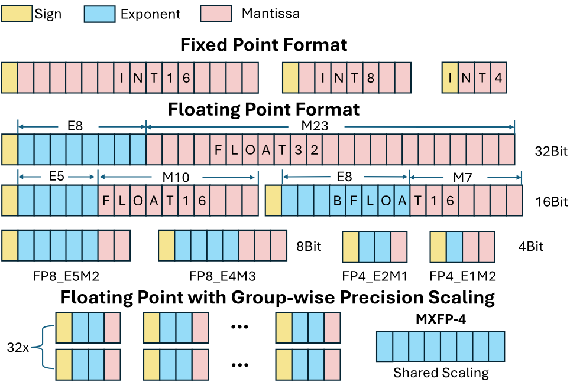

**Figure 1.** Diverse narrow-precision data types in deep learning training and inference.

**Group-wise precision scaling.** To improve the accuracy and robustness of low-precision deep learning models, a common approach is to use a scaling factor to rescale the values for a more accurate representation of the data distribution. Traditional methods typically employ a tensor-wise or channel-wise scaling factor. However, group-wise scaling, by virtue of its finer granularity, can better capture the distribution of sub-tensors or groups, leading to improved performance. For instance, in Post-training Quantization (PTQ) [Fra22], group sizes of 128 and 64 are typically preferred, with each group scaled using FP16. In OCP-MXFP [Dar23], an 8-bit shared scale is applied to a group of 32 elements.

**Mixed-precision operations.** Mixed-precision operations emerge in data quantization due to the varying sensitivity of different tensors to lower bit quantization. For example, mixed-precision training employs a combination of higher and lower bit tensors, such as FP32, FP16, and FP8. This strategic utilization of precision levels strikes a balance between computational efficiency and precision, thereby optimizing performance. Similarly, in Large Language Model (LLM) quantization, weights that are more receptive to quantization can be represented using lower bits. On the other hand, activations, which pose more substantial quantization challenges, require higher bit representations. This divergence leads to mixed-precision operations, including W4A16 (i.e., weight values are represented in 4-bit data types, and activations are represented in 16-bit data types), W2A16, W1A8, and others [Che24b, Fra22, Wan23].

### 2.2 Insufficient Precision Supports in GPUs

Hardware accelerators like GPUs are constantly adapting to the evolving data type requirements in deep learning. Early generations of GPUs, such as NVIDIA's Fermi, supported standard data types like FP32 and FP64. As deep learning workloads gained relevance, lower precision formats like FP16 were introduced in the Pascal architecture. The Turing architecture further expanded support by introducing INT4 and INT8 for inference workloads. The Ampere architecture later introduced BF16, striking a balance between performance benefits and numerical range for machine learning applications. The latest architecture, NVIDIA's Hopper, extends this trend by supporting FP8, showcasing the ongoing pursuit of efficiency by adjusting the precision-performance trade-off. This evolution highlights the increasing versatility of GPUs in handling diverse computing workloads. However, hardware typically lags behind the requirements of algorithms or models. When encountering unsupported data types, we must convert or simulate them in higher-precision supported data types. This could lead to significant performance issues and inefficiencies.

### 2.3 Inefficiency of Low-precision Computing

Low-precision computing is particularly challenging to optimize due to the fine-grained data access granularity and special hardware units, such as TensorCore. We tested the performance of a standard matrix multiplication benchmark with different precisions, using the latest software libraries and compilers on three of the latest GPUs: NVIDIA V100 and A100, and AMD MI250, as shown in [Table 1](#table-01). We make the following observations. First, the hardware utilization of low-precision computing is generally low, i.e., less than 60% on average. Even for the most dominant precision in today's deep learning workload, like FP16, the average utilization is around 60%. Second, some hardware-supported precisions are not well supported by the software. For example, while INT8 is supported in both A100 and MI250, most existing deep learning compilers do not support INT8 computing on these GPUs. Third, meeting new precision requirements is challenging for hardware to support in a timely manner. For instance, FP8 is only available in the next generation of NVIDIA Hopper architectures. Mixed precision computing, such as F16 × NF4, is not supported by all the latest GPUs.

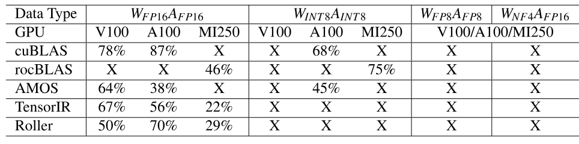

**Table 1.** MatMul $[M,N]=[M,K]\times[N,K]$ where $M,N,K=16384$. "X" indicates not supported in tensor core or matrix core.

### 2.4 Our Insights

We use mixed-precision matrix multiplication, specifically FP16×INT8, as an example to illustrate our key insights, as shown in [Figure 2](#figure-02). A DNN operation is often implemented as a computing pipeline, which continuously loads small data tiles from input tensors across multiple layers of memory hierarchy to compute in the top-level cores. Each memory layer usually has its preferred minimum access granularity, such as an 8-byte transaction length in the L1 layer. Some of the latest GPUs even introduce built-in instructions for highly efficient data loading, which load a two-dimensional data tile at a time—for instance, the `ldmatrix.2x2.f16` loads a 2×2 tile. Given that a data tile is typically stored in a strided memory space, data access often becomes unaligned with the transaction length or instruction shape, potentially leading to low bandwidth utilization. For example, the left figure illustrates that each memory access from L1 only achieves half utilization for both tensors. Furthermore, due to the absence of computing instructions for FP16×INT8, the operation cannot be supported, even if we manage to load the corresponding data into the register. To address these issues, we observe that the alignment issue can be circumvented by transforming the tensor layout into a well-optimized one based on the data type width, memory transaction length, and instruction shape. For instance, in the right figure, we store each 2×2 tile in contiguous memory space in the L1 layer so that the load instructions at the upper layer can fully utilize the bandwidth. Moreover, given that the computing instruction only supports the FP16 data format, we can convert the second tensor from INT8 to FP16 during the data loading from the L2 to the L1 memory layer. Consequently, the data loading from L2 to L1 efficiently leverages the low traffic due to the low-bit data type, the data loading from L1 to L0 fully utilizes the memory bandwidth through transaction alignment, and the computation is ultimately accelerated in the hardware computing unit by type conversion. This example demonstrates that a DNN computation on a custom data type not supported by hardware can still be scheduled and optimized through a well-designed tensor transformation on its layout and data types.

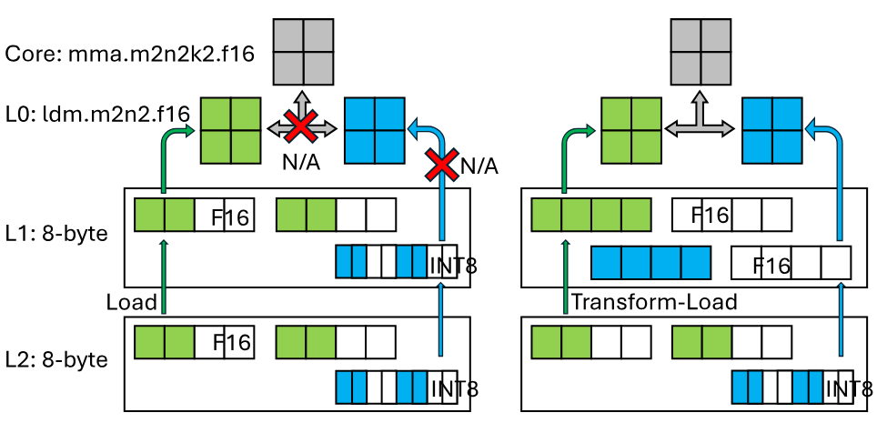

**Figure 2.** MatMul: $C_{\mathrm{FP16}}[2,2]=A_{\mathrm{FP16}}[2,4]\times B_{\mathrm{INT8}}[2,4]$.

## 3 LADDER Design

The observations in [Section 2](#section-2) motivate LADDER, a DNN compiler that treats data type as a first-class citizen and introduces tensor transformations to support efficient DNN computation on custom data types. [Figure 3](#figure-03) shows the system architecture.

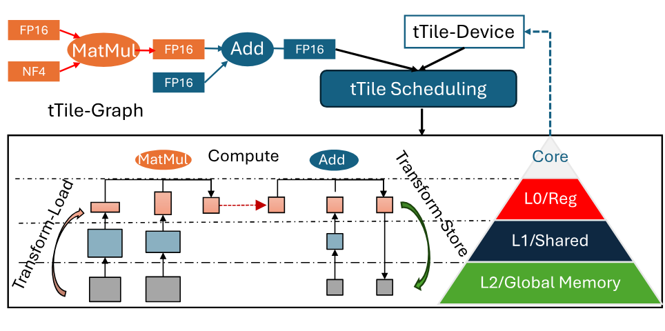

**Figure 3.** The system overview of LADDER.

The core of LADDER is the TypedTile (tTile) abstraction, which augments the tile-based tensor abstraction with data type (i.e., tType, [Section 3.1](#section-3-1)). Specifically, the algorithm designer can use commonly-used data type (e.g., FP16) or define a custom data type (e.g., MXFP8, NF4) as a tType, and define the DNN computation at this data type. Then, LADDER takes the DNN model as input and converts it into a tTile-based data-flow graph (i.e., tTile-graph) where operators are defined as tTile-based computing tasks (i.e., tTile-operator) ([Section 3.1](#section-3-1)).

Besides, LADDER abstracts a hardware accelerator as a multi-layer hierarchy where the requirement of each layer is represented as a tTile (tTile-device, [Section 3.1](#section-3-1)). tTile-device explicitly describes the requirements of each layer, e.g., supported data type, transaction size, etc. By aligning tTiles in the tTile-graph with the tTile-device, the tTile-graph represented DNN computation can be executed on the hardware accelerator.

Given the initial tTile-graph and the hardware specifications, LADDER will compile the DNN model into an efficient execution plan on the accelerator. To schedule the tTile-graph on the tTile-device and satisfy the requirements of the hardware hierarchy, LADDER separates the scheduling mechanism from its policy. On the mechanism side, LADDER proposes four tTile transformation primitives ([Section 3.2](#section-3-2)). Then, the scheduler will schedule the initial tTile-graph into a tTile-graph of fine-grained control over tTile configurations, transformations and tTile placement on the hardware hierarchy. The tTile abstraction enlarges the scheduling space for DNN computation and opens a new trade-off between memory footprint efficiency and latency efficiency. On the policy side, LADDER plays heuristics based on observations and provides a hardware-aware layer-wise policy optimizing for latency efficiency ([Section 3.3](#section-3-3)). Finally, the scheduled tTile-graph is lowered to hardware instructions for execution.

### 3.1 TypedTile: Type-annotated Tensor Tile

LADDER proposes TypedTile (tTile), a data type annotated tile-based tensor abstraction, to represent both the DNN computation and hardware requirements. [Figure 4](#figure-04) shows the definitions of tType, tTile and tTile-operator.

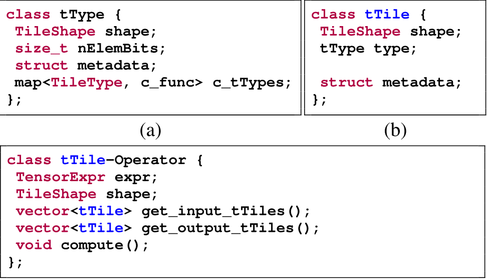

**Figure 4.** The definition of tType, tTile and tTile-operator.

**tType.** tType is a tile-wise tensor data type, which generalizes the numeric format and precision of one or multiple elements. Specifically, a tType contains the number of bits for each element (`nElemBits`), a shape (`shape`), and the conversion tTypes (`c_tTypes`) with conversion functions (`c_funcs`). The `shape` indicates the number and layout of elements represented by a tType. When `shape=[]`, a tType represents a scalar. For example, FP16 can be described as `tType(nElemBits=16, shape=[])`. A tType can also represent a group of elements, e.g., a group-wise data type. The conversion functions describe how to convert the tType to other tTypes losslessly. With this definition, common low-precision data types such as INT4, NF4, FP8 and MXFP can be represented as tTypes.

**tTile.** A tTile is a tensor tile annotated with a tType, represented as `tTile(shape, dtype)`. The `shape` describes the tile's logical shape, and `dtype` is its tType. A tensor can be partitioned into tTiles and a tTile may contain multiple elements in one tType granularity. This abstraction explicitly represents both data shape and storage granularity.

**tTile-operator and tTile-graph.** A tTile-operator is a computing task whose inputs and outputs are tTiles. LADDER extends tensor expressions by annotating the input, output and intermediate tensors with tTypes. A DNN model is then represented as a data-flow graph of tTile-operators, called a tTile-graph.

Hardware accelerators have a hardware hierarchy, including memory layers (e.g., DRAM, register) and computing units. Each layer in the hardware hierarchy has its preference for data accessing. Specifically, a memory layer usually requires accesses via transactions where a transaction is a sequential or a shape of data at a granularity. For example, the shared memory of NVIDIA GPUs requires a transaction of 32 4-byte banks. A compute unit also usually requires processing a shape of data at a granularity. For example, the `hfma2` instruction in NVIDIA GPUs processes at the granularity of two FP16 value.

These requirements can be described as tTiles. Therefore, LADDER abstracts a hardware accelerator as a hierarchy of multiple layers described as tTiles, i.e., tTile-device. Each layer is a memory layer or the compute unit, whose requirement represented as a shape on a granularity is described as a tTile and the granularity is described as tType.

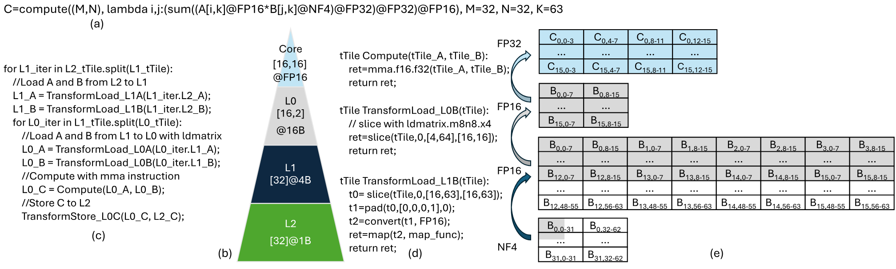

**Figure 5.** MatMul of FP16 tensor A and NF4 tensor B: (a) tType-annotated tensor expression, (b) tTile-device for NVIDIA A100, (c) Pseudo code of computing pipeline, (d) Transform-Load with tTile transformation primitives, (e) Tensor B transformations.

[Figure 5](#figure-05)(b) shows the tTile-device for the NVIDIA A100 GPU with the FP16 tensor cores. The FP16 tensor core MMA instruction [+mma] requires processing at a granularity of $[16,16]$ and $[8,16]$ for two inputs, respectively. This can be expressed as a tTile of shape $[16,16]$ with the `dtype=FP16`. The FP16 tensor core data loading instruction [+ldmatrix] requires loading $[16,2]$ data at a granularity of `half8` (i.e., 8 FP16 value), and can be expressed as a tTile of shape $[16,2]$ with the `dtype=16B`. Besides, the requirement of fully utilizing the shared memory can be expressed as a tTile of shape $[32]$ with the `dtype=4B`. The 32-byte transaction requirement of the global memory can be expresses as a tTile of shape $[32]$ with the `dtype=1B`.

[+mma]: `mma.sync.aligned.m16n8k16.row.col.f16.f16.f32.f32`
[+ldmatrix]: `ldmatrix.sync.aligned.m8n8.x4.shared.b16`

### 3.2 tTile Transformation

tTile explicitly describes the fine-grained tensor storage and the requirements of the hardware hierarchy. The tTile-represented DNN computation in the tTile-graph should align with the tTile-device for efficient execution. Fortunately, according to our observations in [Section 2](#section-2), the tensor storage and access in a pipeline can be transformed into logically equivalent formats, where each has different performance impacts in the hardware hierarchy. Therefore, LADDER proposes tTile transformation mechanism to enable transforming the layout or the tType of a tTile to an equivalent tTile. Specifically, LADDER augments the computation pipeline of a tTile-operator as three stages on the hardware hierarchy: Transform-Load, Compute, and Transform-Store. Transform-Load loads the tTiles from the lower memory layer to a higher memory layer with tTile transformations. Compute executes the computation task of the tTile-operator on the compute units. Transform-Store stores the tTiles from the higher memory layer to a lower memory layer with tTile transformations.

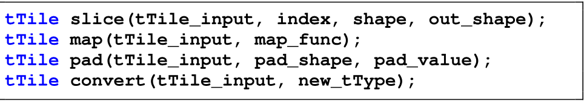

**Figure 6.** tTile transformation primitives.

LADDER provides four primitives to transform a tTile to an equivalent tTile, as shown in [Figure 6](#figure-06).

**Slice.** The slice primitive slices a group elements of `shape` from the address `index` of the `tTile_input` and returns them as a new tTile of `out_shape`. The slice primitive is usually used to represent the data tiling.

**Map.** The map primitive modifies the layout of the elements in a tTile. Given the `map_func`, the map primitive maps the address of each element to the expected address. For example, in [Figure 5](#figure-05)(d), the `TransformLoad_L1B` from the L2 memory layer to the L1 memory layer leverages the map primitive to modify the elements' addresses with the `map_func`.

**Pad.** The pad primitive pads the `tTile_input` with the `pad_value` on each border given in `pad_shape`. The length of the `pad_shape` is 2 times of that of the `tTile_input`'s shape, and describes the left and the right borders of each dimension, respectively.

**Convert.** The convert primitive converts the tType of the `tTile_input` to the given `new_tType`. The given `new_tType` should be in the `c_tTypes` of the `tTile_input`'s tType. convert will call the corresponding `c_func` of the given `new_tType` on each element in the `tTile_input`, and return the expected tTile of `new_tType`. For example, in [Figure 5](#figure-05)(d), the `TransformLoad_L1B` converts the tType from NF4 to FP16 with the convert primitive to satisfy the cores' FP16 tType requirement.

With the above four primitives, a tTile can be transformed to another equivalent tTile by changing the shape with slice and pad, modifying the elements' layout with map, or converting the tType with convert. This enables transforming the tTiles of a tTile-operator to align with the tTile-device, so that these tTiles can be efficiently processed in the hardware hierarchy.

[Figure 5](#figure-05) shows an example that a FP16 tensor $A[32,63]$ multiplies a NF4 tensor $B[32,63]$ with FP32 as the accumulation and outputs a FP16 tensor $C[32,32]$ ([Figure 5](#figure-05)(a)) on a four-layered tTile-device (i.e., from L2 to core, [Figure 5](#figure-05)(b)). Specifically, [Figure 5](#figure-05)(c) shows the pseudo code of the execution. tTiles of A and B are transformed and loaded from L2 to L1 as FP16 type. Then, the tTiles are loaded to L0 with `ldmatrix` and processed by the `mma` instruction which accumulates intermediates as FP32 in L0. Finally, the tTiles of C in L0 are transformed and stored to L2 as FP16. [Figure 5](#figure-05)(d)(e) shows the detailed transformations of the NF4 tensor B to align with the tTile-device, while the transformations of tensor A are similar. Specifically, the `mma` and `ldmatrix` instructions require the FP16 data type in L1. Each layer also has its transaction requirement shown as [Figure 5](#figure-05)(b). Therefore, `TransformLoad_L1B` slices $[16,63]$ and pads it to $[16,64]$, which aligns with the L2's transaction requirement. Then, `TransformLoad_L1B` converts it to FP16 and maps it to another elements layout to align with the transaction requirements of L1 and L0. We get the FP16 `L1_B` $[16,64]$ in L1. Then, `TransformLoad_L0B` leverages the `ldmatrix` to slice the `L1_B` and gets the FP16 `L0_B` $[16,16]$ on L0, which aligns with the requirements of L1, L0 and the `mma` core.

### 3.3 Hardware-Aware tTile-Graph Scheduling

Given the DNN computation represented as a tTile-graph, to schedule it to a tTile-device, we can map each tTile-operator's computation pipeline for tTiles (i.e., Transform-Load, Compute, and Transform-Store) to the tTile-device. Specifically, we can partition each tTile-operator into multiple tTiles to fit the capacity of each memory layer, schedule tTile transformations to align the tTiles with the requirements of hardware layers, and coordinate inter-operator tTile configurations and transformations for holistic optimizations. Finally, the entire tTile-graph is scheduled as a data pipeline where tTiles of a tTile-operator node move up and down on the hardware hierarchy and are passed cross the edge to the successor tTile-operator node.

The scheduling space of the tTile-graph becomes much larger because tTile opens another dimension (i.e., tensor transformation) in DNN computation scheduling. Furthermore, the tTile transformations introduce a new trade-off between memory footprint efficiency and latency efficiency, which brings more complexities and challenges in scheduling. Take the MatMul of a FP16 tensor and a NF4 tensor on NVIDIA GPU as an example, it requires to convert the NF4 type to FP16 due to the hardware support limitation. This conversion should be finished before the Transform-Load from L1 to L0, and therefore can be scheduled to either L2 or L1. When the conversion is on L2, it will take more memory on L2 and L1, but it will not occupy the compute unit in later tTile movement from L2 to L1 and to L0. When the conversion is on L1, it will save memory on L2 and save the memory bandwidth of L2, but it will occupy the compute unit for the type conversion. When the operator is bounded by the compute unit, the previous option can achieve lower latency but more memory footprint. When the operator is bounded by the memory IO, the latter one can achieve better performance on both latency and memory footprint. Additionally, as the convert is only required to be finished before the Transform-Load from L1 to L0, this convert can be fused into the previous operator for execution to achieve better end-to-end performance.

Given such a large scheduling space, LADDER provides a latency-oriented policy that targets at minimizing the end-to-end latency. Specifically, LADDER proposes a layer-wise scheduling policy based on hardware-awareness: a lower-layer memory provides the preferred data access granularity as a hint represented as a tTile, and the upper layer decides the optimal compute granularity by aligning with this tTile represented granularity with transformations. To reduce the large scheduling space and schedule a proper plan within reasonable time, LADDER plays heuristics based on our observations.

**Scheduling policy.** Algorithm 1 describes the hint-based layer-wise scheduling policy. It takes a DNN model $g$ represented as a tTile-graph and the hardware specifications represented as a tTile-device $D$, and returns the scheduled tTile-graph $g_{ret}$. Initially, this policy schedules the graph into sub-graphs (line 33). Each sub-graph represents as a computation pipeline that loads tTiles from the lowest memory layer to the core and then stores the results to the lowest memory layer. A sub-graph could be a tTile-operator or a group of tTile-operators that can be fused. The `ExtractConnectedGraph` can leverage existing DNN compiler work [Che18, Shi23a].

**Algorithm 1. Hint-based layer-wise scheduling**

- **Data:** $g$: tTile-graph; $D$: tTile-device
- **Result:** $g_{ret}$: scheduled tTile-graph
- **Function** `GetDeviceHint(g, D)`:
  - $D=$ `SelectDeviceConfig(g, D)`
  - `HintShape = None`, `HintGranularity = None`
  - **For** `layer ∈ D.layers`:
    - `HintGranularity = LCM(HintGranularity, layer.tTile.type)`
  - **For** `layer ∈ D.layers`:
    - `layer.tTile = convert(layer.tTile, HintGranularity)`
    - `HintShape = LCM(HintShape, layer.tTile.shape)`
  - **For** `layer ∈ D.layers`:
    - `layer.tTile.shape = HintShape`
  - **Return** $D$
- **Function** `ScheduleTransform(op, D, l_id)`:
  - `tTile_h = op.tTile[l_id - 1]`
  - `tTile_l = op.tTile[l_id]`
  - `ScheduleSlice(tTile_l, tTile_h)`
  - **If** `LCM(tTile_l.shape, tTile_h.shape) != tTile_l.shape`:
    - `SchedulePad(tTile_l, tTile_h, D)`
  - **If** `tTile_l.type != tTile_h.type`:
    - `ScheduleConvert(tTile_l, tTile_h, D)`
  - **If** `nBits(tTile_h.shape[-1]) != nBits(D.layers[l_id].shape[-1])`:
    - `ScheduleMap(tTile_l, tTile_h, D)`
  - **Return** `op.transform[l_id - 1]`
- **Function** `ScheduleConnectedGraph(g, D)`:
  - `D = GetDeviceHint(g, D)`
  - **For** `l_id` in `length(D.layers)`:
    - **For** `op ∈ g[l_id]`:
      - `op.tTile[l_id] = ScheduleTiling(op, D, l_id)`
      - **If** `l_id > 0`:
        - `op.transform[l_id] = ScheduleTransform(op, D, l_id)`
  - `g = ProfileAndSelect(g)`
  - **Return** $g$
- **Function** `Schedule(g, D)`:
  - `g = ExtractConnectedGraph(g, D)`
  - **For** $g_{\mathit{conn}}\in g$:
    - `g_conn = ScheduleConnectedGraph(g_conn, D)`
  - **Return** $g$

Given a sub-graph, it first infers the hints from the hardware. Specifically, it first selects the proper hardware configurations (e.g., the compute cores) (line 2), which prefers the bit-nearest tType supported by the hardware. Because numeric types of more bits usually require more transistors to implement the hardware instructions and usually result in lower performance. For example, in NVIDIA A100 GPU, the NF4 type can be converted to FP16 or FP32 for processing, and LADDER will select the FP16 core (312 TFlops) rather than FP32 (19.5 TFlops). Then it finds the aligned granularity and shape for each hardware layer by bit-alignment, and configures the hints (line 1–11). Take the NVIDIA A100 as an example ([Figure 5](#figure-05)(b)), the `HintGranularity` is 16B required by `ldmatrix` and the `HintShape` is $[4,8]$, where the inner dimension is 128B and aligns with the 32B transaction of global memory and the 128B transaction of shared memory. Then, the policy schedules this sub-graph from the top layer (i.e., core) to the bottom layer (i.e., DRAM) layer by layer (line 25–29). In each layer, the policy first schedules the tTile-operator tiling via `ScheduleTiling` with hint (line 27), and then schedules the tTile transformation (line 29). If the `ScheduleTiling` (line 27) schedules the operator tiling as multiple of $[4,8]$ with 16B, the later `ScheduleTransform` can align this scheduling with the tTile-device. Additionally, the `ScheduleTiling` can leverage existing tensor compilers [Che18, Zhe20, Zhu22]. In `ScheduleTransform`, the policy will check the alignment of both shape and type with the tTile-device, and schedule corresponding transformations to align tTiles (line 12–22). There may be some candidates after the scheduling, which will be profiled and returned the best (line 30).

**ScheduleMap.** The `map_func` in scheduling the map transformation is non-trivial. LADDER proposes a method to infer the `map_func`, i.e., mapping the elements in the tTile to the required transaction size in row-major order. [Figure 5](#figure-05)(e) shows an example: at the granularity of 16B, to map the shape $[16,2]$ in L0 to the required shape $[8]$ in L1, elements are flatten in row-major order, resulting in shape $[4,8]$. map can also support other `map_funcs`. This scheduling policy is not guaranteed as optimal. However, as shown in [Section 5](#section-5), this scheduling policy can already outperform state-of-the-arts and enable efficient low-precision DNN computing on GPUs. We also hope that this optimization space from the proposed scheduling mechanism could be further explored by future research on more advanced scheduling policies.

## 4 Implementation

LADDER is implemented by about 5K lines of code, including Python and C++, based on open-source DNN compilers: TVM [Che18], Welder [Shi23a], and Roller [Zhu22]. LADDER modifies TVM for implementing kernel schedules and generating kernel code, while Roller is leveraged to infer efficient tTile configurations. Welder is the state-of-the-art DNN compiler that can holistically optimize DNN models, and is leveraged for end-to-end graph optimizations.

The input of LADDER is a PyTorch program. For PyTorch built-in data types, LADDER does not require any modifications on the DNN model program. Additionally, for new data types that PyTorch does not support, LADDER extends the PyTorch with custom operators for expressing tensor expressions on the user-defined data types. Given the PyTorch program, LADDER exports it to an ONNX graph. LADDER also extends ONNX to represent computation on new data types, where the tType-annotated tensor expression is saved in the attribute of an ONNX graph node. With the exported ONNX graph and the tTile-based specification file of the targeted hardware accelerator, LADDER automatically converts the ONNX graph into the tTile-graph and performs the scheduling. Then, LADDER generates the device code for the targeted hardware accelerator.

We implemented LADDER for NVIDIA GPUs and AMD GPUs, recognizing their widespread use as the most popular accelerators for DNNs. In the rest of this section, we describe the LADDER implementation on NVIDIA GPUs in detail and briefly describe the implementation on AMD GPUs. Additionally, LADDER can be ported to new hardware instructions (e.g., FP8 tensor cores in the latest Hopper GPUs) and other hardware accelerators (e.g., Graphcore IPU) if they align with the tTile-based hardware abstraction and provide programming interfaces of loading and storing data on the hardware hierarchy.

### 4.1 LADDER on NVIDIA CUDA GPUs

#### 4.1.1 tType and tTile

LADDER has implemented the tTypes for common data types, e.g., FP32, FP16, INT8, FP8, MXFP, INT4, NF4, INT1.

A GPU is a single instruction multiple threads (SIMT) architecture, and it prefers a group of threads process the same instruction on different data. Therefore, LADDER separately stores the elements and each of the metadata in the tTile. [Figure 7](#figure-07) shows the storage of a MXFP8 tTile of shape $\left[32, 32\right]$ on NVIDIA GPU. The elements are stored in an array, while the shared scaling factors are stored in another array. To access a tTile, consecutive threads process consecutive elements, resulting in coalesced accesses. Note that, there may be some data types that the `nElemBits` is not $2^{n}$, e.g., 3-bit [Fra22]. To support these data types, LADDER stores at the granularity of 4B due to the GPU specifications, e.g., 10 3-bit value can be stored in a 4B (32-bit) granularity.

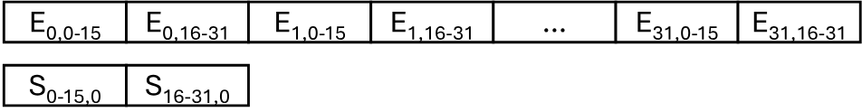

**Figure 7.** The storage of a MXFP8 tTile of shape $\left[32, 32\right]$ on NVIDIA GPU. E: elements. S: shared scaling in metadata.

#### 4.1.2 Optimizing Code Generation with PTX Instruction

NVIDIA does not provides the assembly instructions for programming. Instead, NVIDIA introduces the Parallel-Thread-Execution (PTX) as a low-level virtual machine for NVIDIA GPUs, where the ISA (Instruction Set Architecture) on the PTX virtual machine can be considered as the instruction-level APIs for NVIDIA GPUs [Nvi25]. CUDA C++ code is first compiled to the PTX code and then compiled to the machine code for execution. CUDA provides both the C++ APIs and the PTX APIs for some units. For example, the tensor cores provides both the WMMA C++ APIs and the MMA PTX APIs, where a WMMA API is compiled as a group of MMA instructions by the nvcc compiler. The MMA PTX APIs have more flexibility and better performance than the WMMA C++ APIs. LADDER uses the MMA PTX APIs for codegen on tensor cores, and uses `cp.async` instructions for the new asynchronous memory copy feature on Ampere GPUs [Nvi20]. Additionally, we observed converting low-bit integers (e.g., INT4) to floats (e.g., FP16) may introduce significant overheads. LADDER implements the conversion of integers of lower than 4 bits with the LOP3 instruction [Nvi25]. We modified the code generation module in TVM to implement these optimizations.

### 4.2 LADDER on AMD ROCm GPUs

AMD GPUs are similar to NVIDIA GPUs, which also have a hardware hierarchy of global memory shared by all CUs, local data store in each CU (similar to the shared memory), registers, and cores. Therefore, similar to NVIDIA GPUs, an AMD GPU can be abstracted as a four-layer tTile-device with different tTile configurations. ROCm provides the HIP programming model [Roc16] for AMD GPUs, which is similar to CUDA's functionality and supports most CUDA statements. We implemented a new code generation backend for HIP in TVM to support AMD ROCm GPUs. Additionally, we use the MFMA (Matrix Fused-Multiply Add) ISA-level APIs to utilize the matrix core (the equivalent of the NVIDIA tensor core).

## 5 Evaluation

### 5.1 Evaluation Setup

**Hardware platforms.** We evaluate LADDER on a diverse range of GPUs from both NVIDIA and AMD to ensure a comprehensive assessment of performance across different hardware ecosystems. Our evaluation comprises three high-performance NVIDIA GPUs: Tesla V100 (16GB), A100 (80GB), and RTX A6000 (48GB), utilizing the CUDA toolkit version 12.1 for optimal performance. We extend to the AMD ecosystem with the inclusion of the AMD Instinct MI250 GPU (128GB), utilizing the ROCm toolkit version 5.7.0. The operating systems remain consistent, utilizing Ubuntu 20.04.

**DNN models.** We evaluate the effectiveness of LADDER by benchmarking the inference on a suite of state-of-the-art DNN models that span various domains and architectures. These models encompass large language models, such as LLAMA-70B [Tou23a] and BLOOM-176B [Les23], computer vision models, including ResNet-50 [He16], ShuffleNet-V2 [Ma18], and ViT-Base [Dos20], as well as audio models like transducer Conformer-L [Gul20]. The data type configurations used in these models are all from state-of-the-art research literature and have been evaluated by the deep learning community. LADDER follows these configurations and does not introduce additional model quality loss. The data type configurations, representing both weights and activations and denoted as $W_{\mathrm{type}}A_{\mathrm{type}}$, for the evaluated models are detailed below:

- **LLAMA-70B and BLOOM-176B:** Evaluated with data type configurations of $W_{\mathrm{FP16}}A_{\mathrm{FP16}}$ [Tou23a, Les23], $W_{\mathrm{INT4}}A_{\mathrm{FP16}}$ [Fra22, Lin23d], $W_{\mathrm{NF4}}A_{\mathrm{FP16}}$ [Det23a], $W_{\mathrm{FP8}}A_{\mathrm{FP8}}$ [Mic22], $W_{\mathrm{MXFP8}}A_{\mathrm{MXFP8}}$ [Dar23], and $W_{\mathrm{INT1}}A_{\mathrm{INT8}}$ [Wan23].
- **ResNet-50:** Evaluated with data type configurations of $W_{\mathrm{FP16}}A_{\mathrm{FP16}}$ [He16], $W_{\mathrm{FP8}}A_{\mathrm{FP8}}$ [Mic22], $W_{\mathrm{MXFP8}}A_{\mathrm{MXFP8}}$ [Dar23], and $W_{\mathrm{INT1}}A_{\mathrm{INT4}}$ [Hua19d].
- **ShuffleNet-V2:** Evaluated with data type configurations of $W_{\mathrm{FP16}}A_{\mathrm{FP16}}$ [Ma18] and $W_{\mathrm{FP8}}A_{\mathrm{FP8}}$ [She23f].
- **ViT-Base:** Evaluated with data type configurations of $W_{\mathrm{FP16}}A_{\mathrm{FP16}}$ [Dos20], $W_{\mathrm{FP8}}A_{\mathrm{FP8}}$ [Kuz22], and $W_{\mathrm{INT4}}A_{\mathrm{INT4}}$ [Li22c].
- **Conformer-L:** Evaluated with data type configurations of $W_{\mathrm{FP16}}A_{\mathrm{FP16}}$ [Gul20], $W_{\mathrm{INT8}}A_{\mathrm{INT4}}$ [Din22], and $W_{\mathrm{INT4}}A_{\mathrm{INT4}}$ [Din22].

We configure various batch size (BS) and sequence length (SEQ) settings to cover diverse deployment scenarios. For large language models such as LLAMA-70B and BLOOM-176B, we conduct tests with (BS, SEQ) settings of (1, 1), (32, 1), and (1, 4096) to comprehensively represent online and offline inference scenarios, as well as pre-fill and decoding stages. Additionally, models like ResNet-50, ShuffleNet-V2, ViT-Base, and Conformer-L are evaluated with batch sizes of both 1 and 128 to assess performance across online and offline inference scenarios.

**Baselines.** We compare LADDER against various well-established compilers and frameworks across different GPU platforms. For NVIDIA GPUs, we include comparisons with Welder [Shi23a], PyTorch-Inductor [Pas19], ONNXRuntime [Onn24], TensorRT [Ten24], AMOS [Zhe22d], TensorIR [Fen23], vLLM [Kwo23], vLLM-$W_{\mathrm{INT4}}A_{\mathrm{FP16}}$ (the 4-bit quantized model support in vLLM) [Kwo23]. On AMD GPUs, we compare LADDER with Welder [Shi23a], PyTorch-Inductor [Pas19], ONNXRuntime [Onn24] and TensorIR [Fen23].

To harness the MatrixCore capabilities on ROCm devices, we have integrated MIOpen and rocBLAS into Welder, and we have also enhanced TensorIR with rocWMMA Auto Tensorize support. For operator benchmarks, LADDER is evaluated against cuBLAS [Cub16], CUTLASS [Nvi24a], vLLM [Kwo23], cuDNN [Nvi25c], AMOS [Zhe22d] and TensorIR [Fen23].

### 5.2 Evaluation on NVIDIA GPUs

#### 5.2.1 End-to-End Performance

**Inference latency.** Our inference latency evaluation targets the previously detailed DNN models, executed on the Tesla A100, V100, and RTX A6000 GPUs. For large language models, such as LLAMA-70B and BLOOM-176B, due to GPU memory constraints, we evaluate the inference latency using one decoder layer of these models, which serves as a proxy for the full model's performance because each layer is the same and the latency is linear with the number of layers.

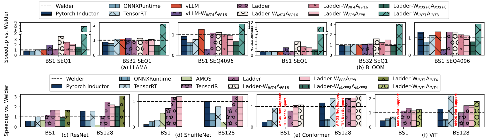

**Figure 8.** End-to-end performance on the NVIDIA A100 GPU.

[Figure 8](#figure-08) summarizes the inference latency results on the A100 GPU. In the data type configuration of $W_{\mathrm{FP16}}A_{\mathrm{FP16}}$, LADDER achieves notable performance enhancements. Compared to Welder, we report an average speedups of 1.0×, 1.2×, 2.0×, 1.2×, 1.1×, and 1.4× for LLAMA, BLOOM, ResNet, ShuffleNet, Conformer, and ViT, respectively. The reason is because Welder leverages Roller [Zhu22], cuBLAS [Cub16] and CUTLASS [Nvi24a] for kernel generations and suffers from kernel performance issues like shared memory bank conflicts, especially in ResNet where Conv2D operations introduce more irregular shapes. LADDER can achieve higher efficiency by resolving these kernel performance issues with tensor transformation scheduling, e.g., 1.1 ms and 7.6 ms latency on BS1 and BS128 of ResNet. In the data type configuration of $W_{\mathrm{INT4}}A_{\mathrm{FP16}}$ which is widely used in LLMs, LADDER achieves a remarkable 2.3× speedup on average over vLLM. Moreover, LADDER exhibits robust versatility by supporting custom data types not traditionally accommodated by other systems. For instance, in the case of $W_{\mathrm{INT1}}A_{\mathrm{INT8}}$ configuration, LADDER achieves an impressive speedup of up to 10× relative to Welder on one layer of BLOOM-176B-BS1SEQ1 with 0.32 ms latency.

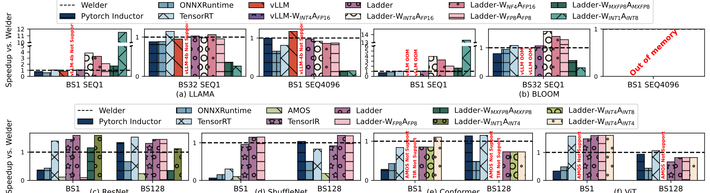

**Figure 9.** End-to-end performance on the NVIDIA V100 GPU.

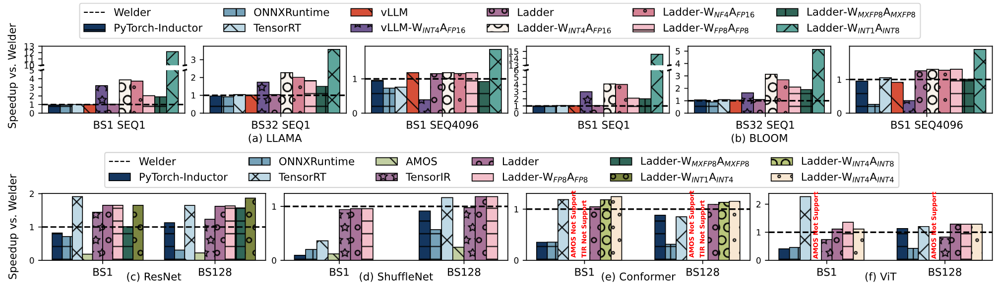

**Figure 10.** End-to-end performance on the NVIDIA RTX A6000 GPU.

Our inference latency evaluation extends to the Tesla V100 and RTX A6000 GPUs, with results shown in [Figure 9](#figure-09) and [Figure 10](#figure-10). The results on these platforms align closely with those observed on the A100. It is important to note that the V100, equipped with 16GB of memory, encounters limitations when handling even a single decoder layer of the BLOOM model, resulting in out-of-memory errors. In terms of performance gains, with the $W_{\mathrm{FP16}}A_{\mathrm{FP16}}$ configuration, LADDER delivers an average speedup of 1.1× on the V100 and 1.2× on the A6000, compared to Welder on both platforms. With the $W_{\mathrm{INT4}}A_{\mathrm{FP16}}$ configuration, LADDER achieves an average speedup of 2.0× compared to vLLM on the A6000 GPUs, and also enables effective $W_{\mathrm{INT4}}A_{\mathrm{FP16}}$ inference on V100 GPUs. In scenarios utilizing the $W_{\mathrm{INT1}}A_{\mathrm{INT8}}$ configuration, LADDER reaches up to 13.3× speedup on the V100 and 14.6× speedup on the A6000, compared to Welder.

**Memory usage.** Employing reduced-precision data types is a critical strategy for alleviating the substantial memory requirements of large language models (LLMs). To quantify the benefits of this approach, we conduct a thorough investigation of memory usage across various data type configurations during LLM inference on the A100 GPU. The results are shown in [Figure 11](#figure-11), which illustrates a near-linear decrease in memory usage corresponding to the reduction in bit width. This trend is particularly pronounced during the decoding phase with a sequence length of 1, highlighting the advantages of precision scaling in the memory-intensive decoding stage of inference.

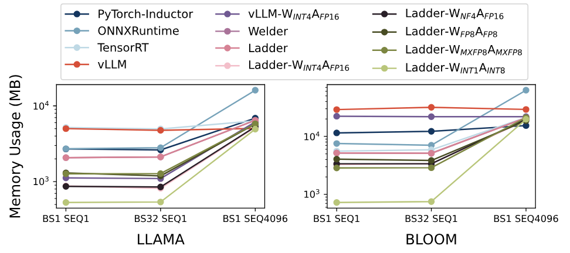

**Figure 11.** Memory usage of LLM inference on the NVIDIA A100 GPU across varying data type configurations.

In the most extreme scenario, employing a weight precision of 1-bit and activation precision of 8-bit ($W_{\mathrm{INT1}}A_{\mathrm{INT8}}$), we observe substantial memory savings. Specifically, when compared to the full precision ($W_{\mathrm{FP16}}A_{\mathrm{FP16}}$) configuration, the memory footprint for LLAMA model inference is reduced by 74%, 74%, and 24% across three different batch size and sequence length combinations, respectively. For the BLOOM model, the memory footprint is reduced by 85%, 85%, and 6% for the corresponding settings.

**Compilation time.** To assess the efficiency of our system, we present a comparative analysis of compilation times in [Table 2](#table-02). Our evaluation compares LADDER against other prominent systems: AMOS, TensorIR, and Welder. The compilation times are measured for the end-to-end compilation of two representative neural network models, ResNet and ShuffleNet, with different batch sizes (1 and 128) on an NVIDIA A100 GPU. The results highlight that on average, LADDER demonstrates a significant reduction in compilation time compared to both AMOS and TensorIR. Notably, LADDER is an order of magnitude faster than TensorIR, and two orders of magnitude faster than AMOS. As LADDER enables supporting low precision arithmetic through tensor transformation and thus, inherently, a broader schedule space. While it allows LADDER to capitalize on the performance benefits of low-precision arithmetic, it also imposes additional overhead during the compilation process. Consequently, LADDER exhibits slightly higher compilation times compared to Welder.

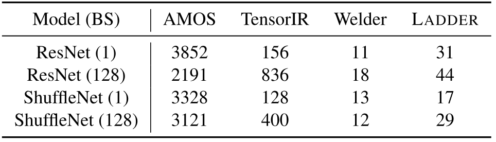

**Table 2.** Compilation time (in minutes) comparison of end-to-end models on NVIDIA A100 GPU.

#### 5.2.2 Operator Benchmark

To assess kernel performance within LADDER, we constructed an operator benchmark incorporating commonly utilized operators from the LLAMA and ResNet models. The benchmark is composed of six matrix multiplication (MatMul) operators, labeled M0–M5, and eight 2D convolution (Conv2d) operators, labeled C0–C7. We tested each operator under a variety of data type configurations, including $W_{\mathrm{FP16}}A_{\mathrm{FP16}}$, $W_{\mathrm{INT4}}A_{\mathrm{FP16}}$, $W_{\mathrm{NF4}}A_{\mathrm{FP16}}$, $W_{\mathrm{FP8}}A_{\mathrm{FP16}}$, $W_{\mathrm{INT1}}A_{\mathrm{INT8}}$, and $W_{\mathrm{MXFP8}}A_{\mathrm{MXFP8}}$. All experiments were executed on an NVIDIA A100 GPU to ensure consistency and reliability in performance evaluation.

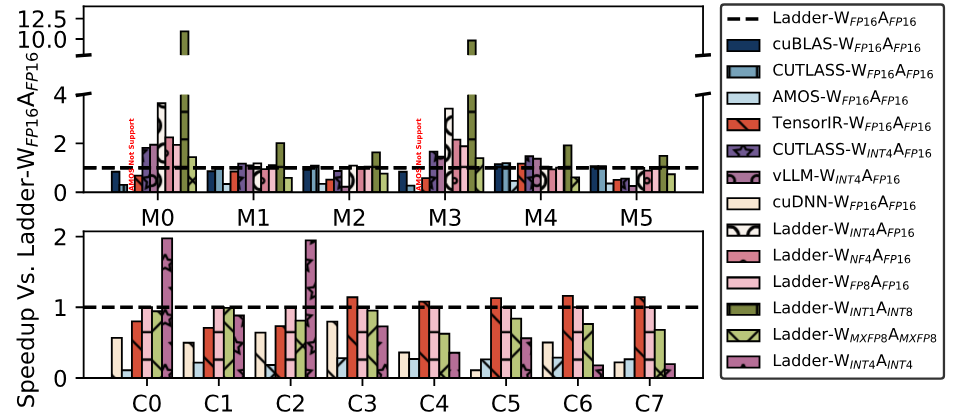

**Figure 12.** Operator benchmark on NVIDIA A100 GPU.

As depicted in [Figure 12](#figure-12), LADDER demonstrates optimal performance with the $W_{\mathrm{FP16}}A_{\mathrm{FP16}}$ configuration. Transitioning to $W_{\mathrm{INT4}}A_{\mathrm{FP16}}$, LADDER achieves an average speedup of 1.8×, while the $W_{\mathrm{INT1}}A_{\mathrm{INT8}}$ configuration enables an even further average speedup of 4.5×. The Ada Lovelace, Hopper and Blackwell GPUs support $W_{\mathrm{FP8}}A_{\mathrm{FP8}}$ tensor core. We also conducted the operator benchmark on a NVIDIA RTX 4090 GPU with CUDA 12.4 to evaluate the hardware-supported $W_{\mathrm{FP8}}A_{\mathrm{FP8}}$ performance. [Figure 13](#figure-13) shows the results.

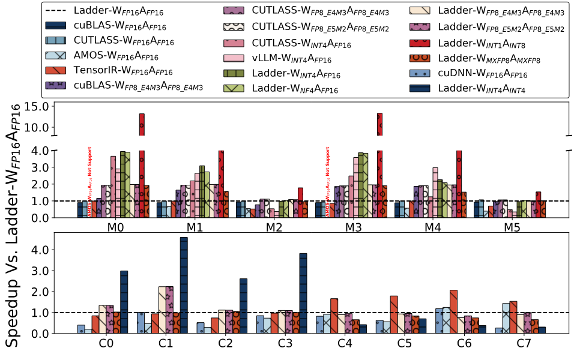

**Figure 13.** Operator benchmark on NVIDIA RTX 4090 GPU.

For $W_{\mathrm{FP8\_E4M3}}A_{\mathrm{FP8\_E4M3}}$, LADDER outperforms cuBLAS and achieves comparable performance over CUTLASS. For $W_{\mathrm{FP8\_E5M2}}A_{\mathrm{FP8\_E5M2}}$, LADDER achieves comparable performance over CUTLASS, while cuBLAS does not support this case. RTX 4090 only enables the $W_{\mathrm{FP8}}A_{\mathrm{FP8}}$ with FP32 accumulation which has the same theoretical performance as $W_{\mathrm{FP16}}A_{\mathrm{FP16}}$. Therefore, cuBLAS, CUTLASS and LADDER of $W_{\mathrm{FP8}}A_{\mathrm{FP8}}$ is similar to that of $W_{\mathrm{FP16}}A_{\mathrm{FP16}}$ on large matrices like M2 and M5. Although $W_{\mathrm{FP8}}A_{\mathrm{FP8}}$ with FP16 accumulation has double theoretical performance, it is not exposed by NVIDIA currently. LADDER achieves higher speedup on data types like $W_{\mathrm{NF4}}A_{\mathrm{FP16}}$ and $W_{\mathrm{INT1}}A_{\mathrm{INT8}}$ than those on A100, because RTX 4090 has more powerful cores for transforming data types.

#### 5.2.3 Optimization Breakdown

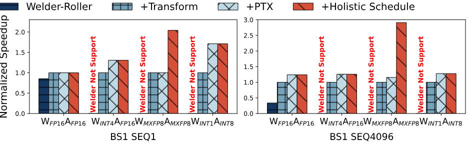

**Figure 14.** Optimization breakdown.

[Figure 14](#figure-14) illustrates the step-by-step optimizations LADDER applied to the LLAMA-70B model's kernels for both single (BS1 SEQ1) and large batch sequences (BS1 SEQ4096) across different data formats. Tile-aware kernel transformation led to smoother data handling and a 2.0× speed boost over the Roller baseline, also enabling support for various data types. PTX-level optimizations reduced GPU memory load, and with advanced control over tensor operations and layout, LADDER achieved a further up to 1.7× speedup. A comprehensive scheduling strategy yielded a up to 2.5× speedup, especially benefiting memory-constrained types like MXFP8, by optimizing transformations. Overall, LADDER's optimizations enhance computational efficiency and adaptability, delivering marked performance gains across multiple operations.

#### 5.2.4 Scaling Bit Width

Leveraging the versatile capabilities of LADDER, we are able to support a wide range of data types with arbitrary bit widths for both weights and activations. To thoroughly evaluate the performance implications of precision scaling, we conducted experiments across data type settings that progressively decrease bit widths. Our evaluation encompasses end-to-end performance as well as individual operator performance across two distinct batch size and sequence length configurations.

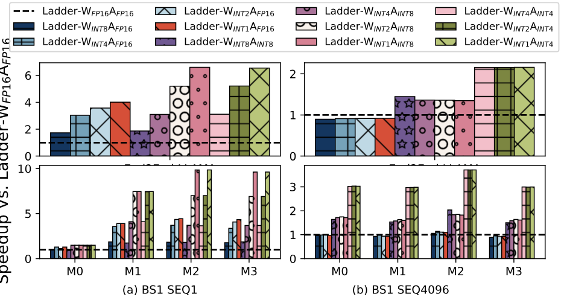

**Figure 15.** Scaling the bit width of weight and activation.

The experimental outcomes are detailed in [Figure 15](#figure-15). As we scale down the bit widths of W and A, we observe a corresponding escalation in speedup, reflecting the efficiency gains of lower precision arithmetic. In decoding scenarios with sequence length of 1, which are memory-bound, our experiments show a clear speedup increase with reduced W bit width (from $W_{\mathrm{INT4}}A_{\mathrm{INT4}}$ to $W_{\mathrm{INT2}}A_{\mathrm{INT4}}$, to $W_{\mathrm{INT1}}A_{\mathrm{INT4}}$). However, during encoding at sequence length of 4096, which is compute-bound, speedup remains unchanged across these configurations due to the reliance on higher-precision computations in mixed-precision operations.

#### 5.2.5 Efficiency and Accuracy of Low-Precision LLMs

Low-precision computing focuses on both model quality and model efficiency, thus there is usually an efficiency-accuracy trade-off in designing low-precision models. We take LLMs (i.e., LLAMA2-3B, LLAMA2-7B, LLAMA2-13B and LLAMA2-70B) as the example to evaluate both the efficiency and the accuracy of state-of-the-art low-precision methods. Specifically, we evaluated PTQ for $W_{\mathrm{FP8\_E4M3}}A_{\mathrm{FP8\_E4M3}}$ [Aut23, Mic22], GPTQ for $W_{\mathrm{INT4}}A_{\mathrm{FP16}}$ [Fra22], PTQ for $W_{\mathrm{NF4}}A_{\mathrm{FP16}}$ [Det22c], BitDistiller for $W_{\mathrm{INT2}}A_{\mathrm{FP16}}$ [Du24], OneBit for $W_{\mathrm{INT1}}A_{\mathrm{FP16}}$ [Xu24h], and BitNet-b1.58 for $W_{\mathrm{INT2}}A_{\mathrm{INT8}}$ [Ma24]. Both PTQ and GPTQ are post-training quantization methods, which does not include model training. BitDistiller and OneBit are quantization-aware training methods, leveraging distillation to achieve 2-bit and 1-bit weight quantization. BitNet-b1.58 trains LLMs from scratch to achieve ternary weights represented in $W_{\mathrm{INT2}}A_{\mathrm{INT8}}$.

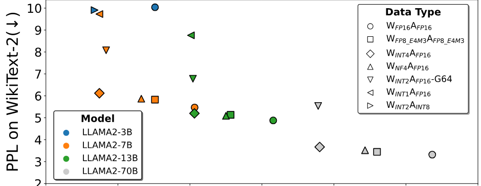

**Figure 16.** PPL on WikiText-2 (↓) and latency (ms) of decoding single token on A100 for different low-precision methods on LLMs. G64 of $W_{\mathrm{INT2}}A_{\mathrm{FP16}}$ indicates a group-wise scaling of 64 elements. LLAMA2-70B uses pipeline parallelism.

[Figure 16](#figure-16) shows the perplexity (PPL) on WikiText-2 and the latency of decoding single token on A100. Note that the lower PPL indicates the better model quality. The PPL of $W_{\mathrm{INT4}}A_{\mathrm{FP16}}$, $W_{\mathrm{NF4}}A_{\mathrm{FP16}}$ is reported by AFPQ [Zha23aa]. The PPL of $W_{\mathrm{INT1}}A_{\mathrm{FP16}}$ is reported by OneBit [Xu24h]. The PPL of $W_{\mathrm{FP16}}A_{\mathrm{FP16}}$ on LLAMA2-3B is reported by BitNet-b1.58 [Ma24]. The PPL of other models are evaluated with open-sourced model checkpoints and open-sourced implementations. $W_{\mathrm{FP8\_E4M3}}A_{\mathrm{FP8\_E4M3}}$, $W_{\mathrm{NF4}}A_{\mathrm{FP16}}$ and $W_{\mathrm{INT4}}A_{\mathrm{FP16}}$ show little affects on PPL, while achieve 1.6×, 1.7×, 2.5× on average, respectively. Quantizing LLMs to 2-bit weights with PTQ and GPTQ will result in NaN PPL [Du24, Xu24h], while BitDistiller and OneBit leverage distillation to achieve stable results in 2-bit and 1-bit quantization. However, the group-wise scaling introduces extra computation cost to $W_{\mathrm{INT2}}A_{\mathrm{FP16}}$-G64, resulting in similar speedup as $W_{\mathrm{INT4}}A_{\mathrm{FP16}}$.

It is noticeable that BitNet-b1.58 achieves even better PPL with 1.8× speedup on the LLAMA2-3B configuration, when compared to the $W_{\mathrm{FP16}}A_{\mathrm{FP16}}$ model trained on the same dataset with same tokens [Ma24]. This speedup does not achieve the theoretical speedup because the LLAMA2-3B is too small to saturate the GPU. We further evaluated BitNet-b1.58's $W_{\mathrm{INT2}}A_{\mathrm{INT8}}$ on the LLAMA2-70B configuration and achieved 4.6× speedup over $W_{\mathrm{FP16}}A_{\mathrm{FP16}}$, thus BitNet-b1.58 shows a good potential on both accuracy and efficiency.

When comparing across different model configurations, the model size has significant impact on both accuracy and efficiency. It is noticeable that LLAMA2-13B with $W_{\mathrm{INT4}}A_{\mathrm{FP16}}$ achieved better performance than LLAMA2-7B with $W_{\mathrm{FP16}}A_{\mathrm{FP16}}$ on both accuracy and efficiency, and the quantized LLAMA2-7B models also outperform LLAMA2-3B with $W_{\mathrm{FP16}}A_{\mathrm{FP16}}$ on both accuracy and efficiency. This shows the power of low-precision computing.

The community is actively exploring low-precision computing, and we hope LADDER can help researchers to explore this direction by providing feedback on efficiency.

### 5.3 Evaluation on AMD GPUs

We evaluate the efficient LADDER on AMD Instinct MI250 GPU by comparing it with Welder, PyTorch-Inductor and ONNXRuntime. [Figure 17](#figure-17) shows the end-to-end performance of 6 models.

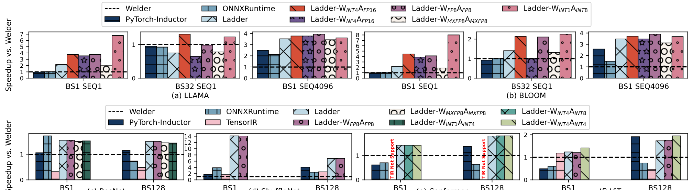

**Figure 17.** End-to-end performance on AMD Instinct MI250 GPU.

In the data type of $W_{\mathrm{FP16}}A_{\mathrm{FP16}}$, LADDER achieves an average 2.1×, 2.35×, 1.5×, 10.5×, 1.6×, and 1.5× speedup over Welder for LLAMA, BLOOM, ResNet, ShuffleNet, Conformer, and ViT, respectively. Welder does not perform well on ShuffleNet because it leverages rocBLAS and MIOpen for matrix core and thus breaks fusion opportunities. LADDER not only generates efficient computing kernel for matrix core but also enables more fusion opportunities, resulting in 14.1× speedup over Welder on ShuffleNet-BS1 with 0.43 ms latency. In the data type configuration of $W_{\mathrm{INT4}}A_{\mathrm{FP16}}$ for LLMs, LADDER achieves up to 3.8× speedup on LLAMA with 0.73 ms latency on BS1SEQ1 and 4.5× speedup on BLOOM with 1.75 ms latency on BS1SEQ1 over Welder.

## 6 Discussion

LADDER's current implementation mainly focuses on model inference. We discuss some LADDER's limitations and future work in this section.

**Multi-GPU serving.** Multiple GPUs are required to deploying some large-scale models like BLOOM-176B and LLAMA2-70B, because these models cannot fit into a single GPU. Multi-GPU support is complementary with LADDER. LADDER focuses on supporting low-precision computing on a hardware accelerator. Multi-GPU frameworks [Kwo23, Sto23d, Lin24i, Zhe22] focus on partitioning model and scheduling parallel computation across multiple GPUs. LADDER can collaborate with multi-GPU frameworks to enable parallel computation for low-precision models on multiple GPUs that multi-GPU frameworks partition a model and schedule the partitioned computation to LADDER on a device for execution. We leave integrating LADDER with multi-GPU frameworks to our future work.

**Low-precision training.** LADDER's design is not limited to inference. Both training and inference of low-precision models require low-precision support of system and hardware. And the backward computation in training is similar to the forward computation. Low-precision model training can achieve gains from: 1) leveraging more efficient low-precision computation units, e.g., $W_{\mathrm{INT8}}A_{\mathrm{INT8}}$ tensor core supported on A100 has 2× throughput than that of $W_{\mathrm{FP16}}A_{\mathrm{FP16}}$, while $W_{\mathrm{INT4}}A_{\mathrm{INT4}}$ tensor core has 4×; and 2) less memory footprint from low-precision model representation enabling larger batch sizes which may improve the hardware utilization. We leave low-precision training to our future work.

## 7 Related Work

**Deep learning compilers and frameworks.** Most existing deep learning compilers, such as [Ans24, Che18, Ma20, Pas19, Shi23a, Zha23h, Zhe20, Zhe23d, Zhu22], focus on operator or model computation optimizations for mainstream data types, e.g., FP16 or FP32, with little emphasis on low-precision data types. However, many optimizations are complementary with low-precision computing, for example, Roller [Zhu22] is leveraged to infer efficient tTile configurations, and Welder [Shi23a] is leveraged for end-to-end graph optimization in LADDER. SparTA [Zhe22e] treats model pruning and quantization as model sparsity to holistically optimize sparse model inference and training, and LADDER can provide efficient low-precision kernels to further improve the performance. AMOS [Zhe22d] has optimized for TensorCore computation, covering FP16 and INT8 types, but it is specific to NVIDIA GPUs. In comparison, LADDER is the first compiler to optimize for general low-precision computations that support general custom data types on different GPUs. Deep learning libraries or frameworks like ONNXRuntime [Onn24] and TensorRT [Ten24] support some low-bit operators for inference scenarios, but their coverage is still limited due to the significant effort required to implement those combinatorial cases. Some recent compilers like Triton [Til19] and TensorIR [Fen23] allow users to directly write the computation pipeline of a DNN operator, providing flexibility in specifying scheduling in each stage. However, these compilers mostly focus on computation scheduling and have little support in data scheduling for custom data types, which is the primary focus of LADDER.

**Model-specific low-precision optimization.** Given the lacking efficient support of low-precision in existing compilers and frameworks, many works have conducted workload-specific low-precision optimizations. For example, some quantization and model training on low-precision types are optimized for Large Language Models (LLMs) [Fra22, Kwo23, Lin23d, Ma24, Dar23, Tou23a, Wan23, Les23]. Previous work like [Gul20, He16, Hua19d, Ma18, She23f] optimizes other models like ShuffleNet, Conformer, etc., into FP8 or FP16 precision. In comparison, LADDER provides a mechanism to allow one to more easily implement custom data types and optimization policies. Thus, these optimization approaches are complementary to LADDER, as they can be implemented or automatically optimized in LADDER.

## 8 Conclusion

In conclusion, this paper introduces LADDER, the first deep learning compiler designed to optimize general low-precision computation on accelerators like GPUs. LADDER exposes a general type system (tType) and an extended tensor expression, enabling users to easily implement and express new data types in deep learning. It introduces a set of new tensor scheduling primitives to facilitate optimizations like tensor storage, access, and type conversions in a computing pipeline. The layer-wise hardware-aware optimization policy of LADDER navigates the complex transformation space, showcasing its capability to systematically support a wide array of low-bit precision custom data types. This enhances DNN computation performance on modern accelerators without requiring hardware modifications. This innovation empowers model designers to explore data type optimizations and offers hardware vendors a flexible solution to expand support for diverse precision formats.

## Acknowledgement

We thank anonymous reviewers and our anonymous shepherd for their extensive suggestions.
