> [Tianle Cai](https://ctlllll.github.io/) [+author-equal] [+author-corresponding], [Yuhong Li](https://leeyeehoo.github.io/) [+author-equal] [+author-corresponding], [Zhengyang Geng](https://gsunshine.github.io/), [Hongwu Peng](https://harveyp123.github.io/), [Jason D. Lee](https://jasondlee88.github.io/), [Deming Chen](https://ece.illinois.edu/about/directory/faculty/dchen), and [Tri Dao](https://tridao.me/). First submitted to arXiv on January 19, 2024; current version v3, revised June 14, 2024. Published in the *Proceedings of the 41st International Conference on Machine Learning*, PMLR 235:5209-5235, July 2024. [Medusa: Simple LLM Inference Acceleration Framework with Multiple Decoding Heads](https://arxiv.org/abs/2401.10774). <a href="/paper/medusa.pdf" target="_blank" rel="noopener noreferrer">Original PDF</a>. [PMLR](https://proceedings.mlr.press/v235/cai24b.html). [DOI](https://doi.org/10.48550/arXiv.2401.10774). [TeX source](https://export.arxiv.org/e-print/2401.10774v3). The original PDF remains authoritative for the exact print layout and bibliography.

## Abstract

Large Language Models (LLMs) employ auto-regressive decoding that requires sequential computation, with each step reliant on the previous one’s output. This creates a bottleneck as each step necessitates moving the full model parameters from High-Bandwidth Memory (HBM) to the accelerator’s cache. While methods such as speculative decoding have been suggested to address this issue, their implementation is impeded by the challenges associated with acquiring and maintaining a separate draft model. In this paper, we present Medusa, an efficient method that augments LLM inference by adding extra decoding heads to predict multiple subsequent tokens in parallel. Using a *tree-based attention mechanism*, Medusa constructs multiple candidate continuations and verifies them simultaneously in each decoding step. By leveraging parallel processing, Medusa substantially reduces the number of decoding steps required. We present two levels of fine-tuning procedures for Medusa to meet the needs of different use cases: **Medusa-1**: Medusa is directly fine-tuned on top of a *frozen* backbone LLM, enabling lossless inference acceleration. **Medusa-2**: Medusa is fine-tuned together with the backbone LLM, enabling better prediction accuracy of Medusa heads and higher speedup but needing a special training recipe that preserves the model’s capabilities. Moreover, we propose several extensions that improve or expand the utility of Medusa, including a *self-distillation* to handle situations where no training data is available and a *typical acceptance scheme* to boost the acceptance rate while maintaining generation quality. We evaluate Medusa on models of various sizes and training procedures. Our experiments demonstrate that Medusa-1 can achieve over $2.2\times$ speedup without compromising generation quality, while Medusa-2 further improves the speedup to 2.3-$2.8\times$.

## 1 Introduction

The recent advancements in Large Language Models (LLMs) have demonstrated that the quality of language generation significantly improves with an increase in model size, reaching billions of parameters [Bro20, Cho22b, Zha22, Hof22, Ope23, Pal23, Tou23a]. However, this growth has led to an increase in *inference latency*, which poses a significant challenge in practical applications. From a system perspective, LLM inference is predominantly memory-bandwidth-bound [Sha19, Kim23], with the main latency bottleneck stemming from accelerators’ memory bandwidth rather than arithmetic computations. This bottleneck is inherent to the sequential nature of auto-regressive decoding, where each forward pass requires transferring the complete model parameters from High-Bandwidth Memory (HBM) to the accelerator’s cache. This process, which generates only a single token, underutilizes the arithmetic computation potential of modern accelerators, leading to inefficiency.

To address this, one approach to speed up LLM inference involves *increasing the arithmetic intensity* (the ratio of total floating-point operations (FLOPs) to total data movement) of the decoding process and *reducing the number of decoding steps*. In line with this idea, speculative decoding has been proposed [Lev23, Che23, Xia23c, Mia23b]. This method uses a smaller draft model to generate a token sequence, which is then refined by the original, larger model for acceptable continuation. However, obtaining an appropriate draft model remains challenging, and it’s even harder to integrate the draft model into a distributed system [Che23].

Instead of using a separate draft model to sequentially generate candidate outputs, in this paper, we revisit and refine the concept of using multiple decoding heads on top of the backbone model to expedite inference [Ste18]. We find that when applied effectively, this technique can overcome the challenges of speculative decoding, allowing for seamless integration into existing LLM systems. Specifically, we introduce Medusa, a method that enhances LLM inference by integrating additional decoding heads to concurrently predict multiple tokens. These heads are fine-tuned in a *parameter-efficient* manner and can be added to any existing model. With no requirement for a draft model, Medusa offers easy integration into current LLM systems, including those in distributed environments, ensuring a user-friendly experience.

We further enhance Medusa with two key insights. Firstly, the current approach of generating a single candidate continuation at each decoding step leads to inefficient use of computational resources. To address this, we propose generating multiple candidate continuations using the Medusa heads and verifying them concurrently through a simple adjustment to the attention mask. Secondly, we can reuse the rejection sampling scheme as used in speculative decoding [Lev23, Che23] to generate consistent responses with the same distribution as the original model. However, it cannot further enhance the acceleration rate. Alternatively, we introduce a *typical acceptance* scheme that selects *reasonable* candidates from the Medusa head outputs. We use temperature as a threshold to manage deviation from the original model’s predictions, providing an efficient alternative to the rejection sampling method. Our results suggest that the proposed typical acceptance scheme can accelerate the decoding speed further while maintaining a similar generation quality.

To equip LLMs with predictive Medusa heads, we propose two distinct fine-tuning procedures tailored to various scenarios. For situations with limited computational resources or when the objective is to incorporate Medusa into an existing model without affecting its performance, we recommend Medusa-1. This method requires minimal memory and can be further optimized with quantization techniques akin to those in QLoRA [Det24], without compromising the generation quality due to the fixed backbone model. However, in Medusa-1, the full potential of the backbone model is not utilized. We can further fine-tune it to enhance the prediction accuracy of Medusa heads, which can directly lead to a greater speedup. Therefore, we introduce Medusa-2, which is suitable for scenarios with ample computational resources or for direct Supervised Fine-Tuning (SFT) from a base model. The key to Medusa-2 is a training protocol that enables joint training of the Medusa heads and the backbone model without compromising the model’s next-token prediction capability and output quality. We propose different strategies for obtaining the training datasets depending on the model’s training recipe and dataset availability. When the model is fine-tuned on a public dataset, it can be directly used for Medusa. If the dataset is unavailable or the model underwent a Reinforcement Learning with Human Feedback (RLHF) [Ouy22a] process, we suggest a self-distillation approach to generate a training dataset for the Medusa heads.

Our experiments primarily focus on scenarios with a batch size of one, which is representative of the use case where LLMs are locally hosted for personal use. We test Medusa on models of varying sizes and training settings, including Vicuna-7B, 13B (trained with a public dataset), Vicuna-33B [Chi23a] (trained with a private dataset [+1]), and Zephyr-7B (trained with both supervised fine-tuning and alignment). Medusa can achieve a speedup of 2.3 to 2.8 times across different prompt types without compromising on the quality of generation.

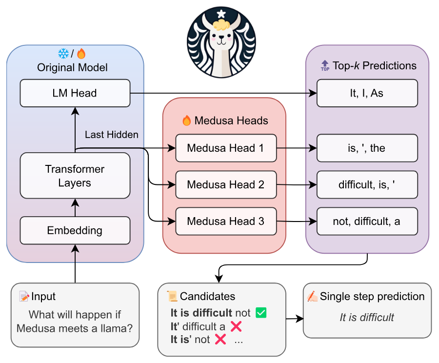

**Figure 1.** Medusa introduces *multiple heads* on top of the last hidden states of the LLM, enabling the prediction of several subsequent tokens in parallel ([Section 2.1.1](#section-2-1-1)). During inference, each head generates multiple top predictions for its designated position. These predictions are assembled into candidates, which are processed in parallel using a *tree-based attention* mechanism ([Section 2.1.2](#section-2-1-2)). The final step is to verify the candidates and accept a continuation. Besides the standard rejection sampling scheme, a *typical acceptance* scheme ([Section 2.3.1](#section-2-3-1)) can also be used here to select reasonable continuations, and the *longest accepted candidate prefix* will be used for the next decoding phase.

## 2 Methodology

Medusa follows the same framework as speculative decoding, where each decoding step primarily consists of three substeps: (1) generating candidates, (2) processing candidates, and (3) accepting candidates. For Medusa, (1) is achieved by Medusa heads, (2) is realized by tree attention, and since Medusa heads are on top of the original model, the logits calculated in (2) can be used for substep (1) for the next decoding step. The final step (3) can be realized by either rejection sampling [Lev23, Che23] or typical acceptance ([Section 2.3.1](#section-2-3-1)). The overall pipeline is illustrated in [Figure 1](#figure-01).

In this section, we first introduce the key components of Medusa, including Medusa heads, and tree attention. Then, we present two levels of fine-tuning procedures for Medusa to meet the needs of different use cases. Finally, we propose two extensions to Medusa, including self-distillation and typical acceptance, to handle situations where no training data is available for Medusa and to improve the efficiency of the decoding process, respectively.

### 2.1 Key Components

#### 2.1.1 Medusa Heads

In speculative decoding, subsequent tokens are predicted by an auxiliary draft model. This draft model must be small yet effective enough to generate continuations that the original model will accept. Fulfilling these requirements is a challenging task, and existing approaches [Spe23, Mia23b] often resort to separately *pre-training* a smaller model. This pre-training process demands substantial additional computational resources. For example, in [Mia23b], a reported 275 NVIDIA A100 GPU hours were used. Additionally, separate pre-training can potentially create a distribution shift between the draft model and the original model, leading to continuations that the original model may not favor. [Che23] have also highlighted the complexities of serving multiple models in a distributed environment.

To streamline and democratize the acceleration of LLM inference, we take inspiration from [Ste18], which utilizes parallel decoding for tasks such as machine translation and image super-resolution. Medusa heads are additional decoding heads appended to the last hidden states of the original model. Specifically, given the original model’s last hidden states $h_{t}$ at position $t$, we add $K$ decoding heads to $h_{t}$. The $k$-th head is used to predict the token in the $(t+k+1)$-th position of the next tokens (the original language model head is used to predict the $(t+1)$-th position). The prediction of the $k$-th head is denoted as $p_{t}^{(k)}$, representing a distribution over the vocabulary, while the prediction of the original model is denoted as $p_{t}^{(0)}$. Following the approach of [Ste18], we utilize a single layer of feed-forward network with a residual connection for each head. We find that this simple design is sufficient to achieve satisfactory performance. The definition of the $k$-th head is outlined as:

$$
\begin{aligned}
p_{t}^{(k)}=\operatorname{softmax}\left(W_{2}^{(k)}\cdot\left(\operatorname{SiLU}(W_{1}^{(k)}\cdot h_{t})+h_{t}\right)\right), \\
\mathrm{where}\;W_{2}^{(k)}\in\mathbb{R}^{d\times V},W_{1}^{(k)}\in\mathbb{R}^{d\times d}.
\end{aligned}
$$

$d$ is the output dimension of the LLM’s last hidden layer and $V$ is the vocabulary size. We initialize $W_{2}^{(k)}$ identically to the original language model head, and $W_{1}^{(k)}$ to zero. This aligns the initial prediction of Medusa heads with that of the original model. The SiLU activation function [Elf17] is employed following the Llama models [Tou23a].

Unlike a draft model, Medusa heads are trained in conjunction with the original backbone model, which can remain *frozen* during training (Medusa-1) or be trained together (Medusa-2). This method allows for fine-tuning large models even on a single GPU, taking advantage of the powerful base model’s learned representations. Furthermore, it ensures that the distribution of the Medusa heads aligns with that of the original model, thereby mitigating the distribution shift problem. Additionally, since the new heads consist of just a single layer akin to the original language model head, Medusa does not add complexity to the serving system design and is friendly to distributed settings. We will discuss the training recipe for Medusa heads in [Section 2.2](#section-2-2).

#### 2.1.2 Tree Attention

Through Medusa heads, we obtain probability predictions for the subsequent $K+1$ tokens. These predictions enable us to create length-$K+1$ continuations as candidates. While the speculative decoding studies [Lev23, Che23] suggest sampling a single continuation as the candidate, leveraging multiple candidates during decoding can enhance the expected acceptance length within a decoding step. Nevertheless, more candidates can also raise computational demands. To strike a balance, we employ a tree-structured attention mechanism to process multiple candidates concurrently.

![Figure 2. We demonstrates the use of tree attention to process multiple candidates concurrently. As exemplified, the top-2 predictions from the first Medusa head and the top-3 from the second result in a total of $2\times 3=6$ candidates. Each of these candidates corresponds to a distinct branch within the tree structure. To guarantee that each token only accesses its predecessors, we devise an attention mask that exclusively permits attention flow from the current token back to its antecedent tokens. The positional indices for positional encoding are adjusted in line with this structure.](../../papers/medusa/figure-02.png)

**Figure 2.** We demonstrates the use of tree attention to process multiple candidates concurrently. As exemplified, the top-2 predictions from the first Medusa head and the top-3 from the second result in a total of $2\times 3=6$ candidates. Each of these candidates corresponds to a distinct branch within the tree structure. To guarantee that each token only accesses its predecessors, we devise an attention mask that exclusively permits attention flow from the current token back to its antecedent tokens. The positional indices for positional encoding are adjusted in line with this structure.

This attention mechanism diverges from the traditional causal attention paradigm. Within this framework, only tokens from the same continuation are regarded as historical data. Drawing inspiration from the concept of embedding graph structures into attention as proposed in the graph neural network domain [Yin21], we incorporate the tree structure into our attention mask, visualized in [Figure 2](#figure-02). Remarkably, similar ideas have also been explored in independent works like [Mia23b, Spe23], where they follow a bottom-up approach and construct the tree by merging multiple candidates generated by a draft model. In our method, we instead take a top-down approach to build the tree thanks to the structure of candidates generated by Medusa heads. For a given $k$-th head, its top-$s_{k}$ predictions serve as the basis for candidate formation, where $s_{k}$ is a designated hyperparameter. These candidates are established by determining the Cartesian product of the top-$s_{k}$ predictions from each head. For instance, in [Figure 2](#figure-02), with $s_{1}=2$ and $s_{2}=3$, each first head prediction can be succeeded by any prediction from the second head. This leads to a tree structure where $s_{k}$ branches exist at the $k$-th level (considering a virtual root as the $0$-level, in practice, this $0$-level is for the prediction of the language model head of the original model, which can be sampled independently). Within this tree, only a token’s predecessors are seen as historical context, and our attention mask ensures that the attention is only applied on a token’s predecessors. By employing this mask and properly setting the positional indices for positional encoding, we can process numerous candidates simultaneously without the need to expand the batch size. The cumulative number of new tokens is calculated as $\sum_{k=1}^{K}\prod_{i=1}^{k}s_{i}$.

In this section, we demonstrate the most simple and regular way to construct the tree structure by taking the Cartesian product. However, it is possible to construct the tree structure in a more sophisticated way and exploit the unbalanced accuracy of different top predictions of different heads. We will discuss this in [Section 2.3.3](#section-2-3-3).

### 2.2 Training Strategies

At the most basic level, we can train Medusa heads by freezing the backbone model and fine-tuning Medusa heads. However, training the backbone in conjunction with the Medusa heads can significantly enhance the accuracy of the Medusa heads. Depending on the computational resources and the specific reqirements of the use case, we propose two levels of training strategies for Medusa heads.

In this section, we assume the availability of a training dataset that aligns with the target model’s output distribution. This could be the dataset used for Supervised Fine-Tuning (SFT) of the target model. We will discuss eliminating the need for such a dataset using a self-distillation approach in [Section 2.3.2](#section-2-3-2).

#### 2.2.1 Medusa-1: Frozen Backbone

To train Medusa heads with a frozen backbone model, we can use the cross-entropy loss between the prediction of Medusa heads and the ground truth. Specifically, given the ground truth token $y_{t+k+1}$ at position $t+k+1$, the loss for the $k$-th head is $\mathcal{L}_{k}=-\log p_{t}^{(k)}(y_{t+k+1})$ where $p_{t}^{(k)}(y)$ denotes the probability of token $y$ predicted by the $k$-th head. We also observe that $\mathcal{L}_{k}$ is larger when $k$ is larger, which is reasonable since the prediction of the $k$-th head is more uncertain when $k$ is larger. Therefore, we can add a weight $\lambda_{k}$ to $\mathcal{L}_{k}$ to balance the loss of different heads. And the total Medusa loss is:

$$
\mathcal{L}_{\mathrm{Medusa}-1}=\sum_{k=1}^{K}-\lambda_{k}\log p_{t}^{(k)}(y_{t+k+1}).
$$

In practice, we set $\lambda_{k}$ as the $k$-th power of a constant like $0.8$. Since we only use the backbone model for providing the hidden states, we can use a quantized version of the backbone model to reduce the memory consumption. This introduces a more democratized way to accelerate LLM inference, as with the quantization, Medusa can be trained for a large model on a single consumer GPU similar to QLoRA [Det24]. The training only takes a few hours (e.g., 5 hours for Medusa-1 on Vicuna 7B model with a single NVIDIA A100 PCIE GPU to train on 60k ShareGPT samples).

#### 2.2.2 Medusa-2: Joint Training

To further improve the accuracy of Medusa heads, we can train Medusa heads together with the backbone model. However, this requires a special training recipe to preserve the backbone model’s next-token prediction capability and output quality. To achieve this, we propose three strategies:

- **Combined loss**: To keep the backbone model’s next-token prediction capability, we need to add the cross-entropy loss of the backbone model $\mathcal{L}_{\mathrm{LM}}=-\log p_{t}^{(0)}(y_{t+1})$ to the Medusa loss. We also add a weight $\lambda_{0}$ to balance the loss of the backbone model and the Medusa heads. Therefore, the total loss is:

  

  $$
  \mathcal{L}_{\mathrm{Medusa}-2}=\mathcal{L}_{\mathrm{LM}}+\lambda_{0}\mathcal{L}_{\mathrm{Medusa}-1}.
  $$
- **Differential learning rates**: Since the backbone model is already well-trained and the Medusa heads need more training, we can use separate learning rates for them to enable faster convergence of Medusa heads while preserving the backbone model’s capability.
- **Heads warmup**: Noticing that at the beginning of training, the Medusa heads have a large loss, which leads to a large gradient and may distort the backbone model’s parameters. Following the idea from [Kum22], we can employ a two-stage training process. In the first stage, we only train the Medusa heads as Medusa-1. In the second stage, we train the backbone model and Medusa heads together with a warmup strategy. Specifically, we first train the backbone model for a few epochs, then train the Medusa heads together with the backbone model. Besides this simple strategy, we can also use a more sophisticated warmup strategy by gradually increasing the weight $\lambda_{0}$ of the backbone model’s loss. We find both strategies work well in practice.

Putting these strategies together, we can train Medusa heads together with the backbone model without hurting the backbone model’s capability. Moreover, this recipe can be applied together with Supervised Fine-Tuning (SFT), enabling us to get a model with native Medusa support.

#### 2.2.3 How to Select the Number of Heads

Empirically, we found that five heads are sufficient at most. Therefore, we recommend training with five heads and referring to the strategy described in [Section 2.3.3](#section-2-3-3) to determine the optimal configuration of the tree attention. With optimized tree attention, sometimes three or four heads may be enough for inference. In this case, we can ignore the redundant heads without overhead.

### 2.3 Extensions

#### 2.3.1 Typical Acceptance

In speculative decoding papers [Lev23, Che23], authors employ rejection sampling to yield diverse outputs that align with the distribution of the original model. However, subsequent implementations [Gan23, Spe23] reveal that this sampling strategy results in diminished efficiency as the sampling temperature increases. Intuitively, this can be comprehended in the extreme instance where the draft model is the same as the original one: Using greedy decoding, all output of the draft model will be accepted, therefore maximizing the efficiency. Conversely, rejection sampling introduces extra overhead, as the draft model and the original model are sampled independently. Even if their distributions align perfectly, the output of the draft model may still be rejected.

However, in real-world scenarios, sampling from language models is often employed to generate diverse responses, and the temperature parameter is used merely to modulate the “creativity” of the response. Therefore, higher temperatures should result in more opportunities for the original model to accept the draft model’s output. We ascertain that it is typically unnecessary to match the distribution of the original model. Thus, we propose employing a *typical acceptance* scheme to select plausible candidates rather than using rejection sampling. This approach draws inspiration from truncation sampling studies [Hew22] (refer to [Section 6](#section-6) for an in-depth explanation). Our objective is to choose candidates that are *typical*, meaning they are not exceedingly improbable to be produced by the original model. We use the prediction probability from the *original model* as a natural gauge for this and establish a threshold based on the prediction distribution to determine acceptance. Specifically, given $x_{1},x_{2},\cdots,x_{n}$ as context, when evaluating the candidate sequence $(x_{n+1},x_{n+2},\cdots,x_{n+K+1})$ (composed by top predictions of the original language model head and Medusa heads), we consider the condition

$$
\begin{aligned}
p_{\text{original}}(x_{n+k}|x_{1},x_{2},\cdots,x_{n+k-1})> \\
\min\left(\epsilon,\delta\exp\left(-H(p_{\text{original}}(\cdot|x_{1},x_{2},\cdots,x_{n+k-1}))\right)\right),
\end{aligned}
$$

where $H(\cdot)$ denotes the entropy function, and $\epsilon,\delta$ are the hard threshold and the entropy-dependent threshold respectively. This criterion is adapted from [Hew22] and rests on two observations: (1) tokens with relatively high probability are meaningful, and (2) when the distribution’s entropy is high, various continuations may be deemed reasonable. During decoding, every candidate is evaluated using this criterion, and a *prefix* of the candidate is accepted if it satisfies the condition. To guarantee the generation of at least one token at each step, we apply *greedy decoding* for the first token and *unconditionally* accept it while employing typical acceptance for subsequent tokens. The final prediction for the current step is determined by the *longest accepted prefix* among all candidates.

Examining this scheme leads to several insights. Firstly, when the temperature is set to $0$, it reverts to greedy decoding, as only the most probable token possesses non-zero probability. As the temperature surpasses $0$, the outcome of greedy decoding will consistently be accepted with appropriate $\epsilon,\delta$, since those tokens have the maximum probability, yielding maximal speedup. Likewise, in general scenarios, an increased temperature will correspondingly result in longer accepted sequences, as corroborated by our experimental findings.

Empirically, we verify that typical acceptance can achieve a better speedup while maintaining a similar generation quality as shown in [Figure 5](#figure-05).

#### 2.3.2 Self-Distillation

In [Section 2.2](#section-2-2), we assume the existence of a training dataset that matches the target model’s output distribution. However, this is not always the case. For example, the model owners may only release the model without the training data, or the model may have gone through a Reinforcement Learning with Human Feedback (RLHF) procedure, which makes the output distribution of the model different from the training dataset. To tackle this issue, we propose an automated self-distillation pipeline to use the model itself to generate the training dataset for Medusa heads, which matches the output distribution of the model.

The dataset generation process is straightforward. We first take a public seed dataset from a domain similar to the target model; for example, using the ShareGPT [Src23] dataset for chat models. Then, we simply take the prompts from the dataset and ask the model to reply to the prompts. In order to obtain multi-turn conversation samples, we can sequentially feed the prompts from the seed dataset to the model. Or, for models like Zephyr 7B [Tun23], which are trained on both roles of the conversation, they have the ability to self-talk, and we can simply feed the first prompt and let the model generate multiple rounds of conversation.

For Medusa-1, this dataset is sufficient for training Medusa heads. However, for Medusa-2, we observe that solely using this dataset for training the backbone and Medusa heads usually leads to a lower generation quality. In fact, even without training Medusa heads, training the backbone model with this dataset will lead to performance degradation. This suggests that we also need to use the original model’s probability prediction instead of using the ground truth token as the label for the backbone model, similar to classic knowledge distillation works [Kim16c]. Concretely, the loss for the backbone model is:

$$
\mathcal{L}_{\mathrm{LM-distill}}=\operatorname{KL}(p_{\mathrm{original},t}^{(0)}\|p_{t}^{(0)}),
$$

where $p_{\text{original},t}^{(0)}$ denotes the probability distribution of the original model’s prediction at position $t$.

However, naively, to obtain the original model’s probability prediction, we need to maintain two models during training, increasing the memory requirements. To further alleviate this issue, we propose a simple yet effective way to exploit the self-distillation setup. We can use a parameter-efficient adapter like LoRA [Hu21] for fine-tuning the backbone model. In this way, the original model is simply the model with the adapter turned off. Therefore, the distillation does not require additional memory consumption. Together, this self-distillation pipeline can be used to train Medusa-2 without hurting the backbone model’s capability and introduce almost no additional memory consumption. Lastly, one tip about using self-distillation is that it is preferable to use LoRA without quantization in this case, otherwise, the teacher model will be the quantized model, which may lead to a lower generation quality.

#### 2.3.3 Searching for the Optimized Tree Construction

In [Section 2.1.2](#section-2-1-2), we present the simplest way to construct the tree structure by taking the Cartesian product. However, with a fixed budget for the number of total nodes in the tree, a regular tree structure may not be the best choice. Intuitively, those candidates composed of the top predictions of different heads may have different accuracies. Therefore, we can leverage an estimation of the accuracy to construct the tree structure.

Specifically, we can use a calibration dataset and calculate the accuracies of the top predictions of different heads. Let $a_{k}^{(i)}$ denote the accuracy of the $i$-th top prediction of the $k$-th head [+2]. Assuming the accuracies are independent, we can estimate the accuracy of a candidate sequence composed by the top $\left[i_{1},i_{2},\cdots,i_{k}\right]$ predictions of different heads as $\prod_{j=1}^{k}a_{j}^{(i_{j})}$. Let $I$ denote the set of all possible combinations of $\left[i_{1},i_{2},\cdots,i_{k}\right]$ and each element of $I$ can be mapped to a node of the tree (not only leaf nodes but all nodes are included). Then, the expectation of the acceptance length of a candidate sequence is:

$$
\sum_{\left[i_{1},i_{2},\cdots,i_{k}\right]\in I}\prod_{j=1}^{k}a_{j}^{(i_{j})}.
$$

Thinking about building a tree by adding nodes one by one, the contribution of a new node to the expectation is exactly the accuracy associated with the node. Therefore, we can greedily add nodes to the tree by choosing the node that is connected to the current tree and has the highest accuracy. This process can be repeated until the total number of nodes reaches the desired number. In this way, we can construct a tree that maximizes the expectation of the acceptance length. Further details can be found in [Section 8](#section-8).

**Figure 3.** Left: Speed comparison of baseline, Medusa-1 and Medusa-2 on Vicuna-7B/13B. Medusa-1 achieves more than $2\times$ wall-time speedup compared to the baseline implementation while Medusa-2 further improves the speedup by a significant margin. Right: Detailed speedup performance of Vicuna-7B with Medusa-2 on 8 categories from MT-Bench.

## 3 Experiments

In this section, we present experiments to demonstrate the effectiveness of Medusa under different settings. First, we evaluate Medusa on the Vicuna-7B and 13B models [Chi23a] to show the performance of Medusa-1 and Medusa-2. Then, we assess our method using the Vicuna-33B and Zephyr-7B models to demonstrate self-distillation’s viability in scenarios where direct access to the fine-tuning recipe is unavailable, as with Vicuna-33B, and in models like Zephyr-7B that employ Reinforcement Learning from Human Feedback (RLHF). The evaluation is conducted on MT-Bench [Sto23e], a multi-turn, conversational-format benchmark. Detailed settings can be found in [Section 7](#section-7).

### 3.1 Case Study: Medusa-1 v.s. Medusa-2 on Vicuna 7B and 13B

**Experimental Setup.** We use the Vicuna model class [Chi23a], which encompasses chat models of varying sizes (7B, 13B, 33B) that are fine-tuned from the Llama model [Tou23a]. Among them, the 7B and 13B models are trained on the ShareGPT [Src23] dataset, while the 33B model is an experimental model and is trained on a private dataset. In this section, we use the ShareGPT dataset to train the Medusa heads on the 7B and 13B models for $2$ epochs. We use the v1.5 version of Vicuna models, which are fine-tuned from Llama-2 models with sequence length 4096.

**Results.** We collect the results and show them in [Figure 3](#figure-03). The baseline is the default Huggingface implementation. In [Figure 3(a)](#figure-03), we can see that for the 7B models, Medusa-1 and Medusa-2 configurations lead to a significant increase in speed, measuring in tokens processed per second. Medusa-1 shows a $2.18\times$ speedup, while Medusa-2 further improves this to a $2.83\times$. When applied to the larger 13B model, Medusa-1 results in a $2.33\times$ speed increase, while Medusa-2 maintains a similar performance gain of $2.83\times$ over the baseline. We also plot the speedup per category for Medusa-2 Vicuna-7B model. We observe that the coding category benefits from a $3.29\times$ speedup, suggesting that Medusa is particularly effective for tasks in this domain. This points to a significant potential for optimizing coding LLMs, which are widely used in software development and other programming-related tasks. The “Extraction” category shows the highest speedup at $3.62\times$, indicating that this task is highly optimized by the Medusa. Overall, the results suggest that the Medusa significantly enhances inference speed across different model sizes and tasks.

### 3.2 Case Study: Training with Self-Distillation on Vicuna-33B and Zephyr-7B

**Experimental Setup.** In this case study, we focus on the cases where self-distillation is needed. We use the Vicuna-33B model [Chi23a] and the Zephyr-7B model [Tun23] as examples. Following the procedure described in [Section 2.3.2](#section-2-3-2), we first generate the datasets with some seed prompts. We use ShareGPT [Src23] and UltraChat [Din23b] as the seed datasets and collect a dataset at about $100k$ samples for both cases. Interestingly, we find that the Zephyr model can continue to generate multiple rounds of conversation with a single prompt, which makes it easy to collect a large dataset. For Vicuna-33B, we generate the multi-turn conversations by iteratively feeding the prompts from each multi-turn seed conversation using random sampling with temperature 0.3. Both models are trained with sequence length $2048$ and batch size $128$.

**Table 1.** Comparison of various Medusa-2 models. The first section reports the details of Medusa-2, including accelerate rate, overhead, and quality that denoted the average scores on the MT-Bench compared to the original models. The second section lists the speedup ($S$) of SpecDecoding and Medusa, respectively.

![Figure 4. Effectiveness of numbers of candidate tokens for decoding introduced by trees (default number of candidate token for decoding is 1 when using KV cache). Left: The acceleration rate for randomly sampled dense tree settings (blue dots) and optimized sparse tree settings (red stars). Right: The speed (tokens/s) for both settings. The trend lines indicate that while the acceleration rate remains relatively stable for sparse trees, there is a notable decrease in speed as the candidate tokens increases.](../../papers/medusa/figure-04.png)

**Figure 4.** Effectiveness of numbers of candidate tokens for decoding introduced by trees (default number of candidate token for decoding is 1 when using KV cache). Left: The acceleration rate for randomly sampled dense tree settings (blue dots) and optimized sparse tree settings (red stars). Right: The speed (tokens/s) for both settings. The trend lines indicate that while the acceleration rate remains relatively stable for sparse trees, there is a notable decrease in speed as the candidate tokens increases.

**Results.** [Table 1](#table-01) complements these findings by comparing various Medusa-2 models in terms of their acceleration rate, overhead, and quality on MT-Bench with GPT-4 acting as the evaluator to assign performance scores ranging from 0 to 10. We report the quality differences of Medusa compared to the original model. Notably, while the Medusa-2 Vicuna-33B model shows a lower acceleration rate, it maintains a comparable quality. We hypothesize that this is due to a mismatch between the hidden training dataset and the dataset we used for self-distillation. Hence, the model’s generation quality can be well aligned by self-distillation while Medusa heads learn distribution from the self-distillation that potentially shifts from the training set. In our study, we also applied speculative decoding [Che23, Lev23] to the Vicuna lineup using open-source draft models (details can be found in [Section 9](#section-9)).

These results underscore the complex interplay between speed and performance when scaling up model sizes and applying self-distillation techniques. The findings also highlight the potential of the Medusa-2 configuration to boost efficiency in processing while carefully preserving the quality of the model’s outputs, suggesting a promising direction for co-optimizing LLMs with Medusa heads.

### 3.3 Ablation Study

#### 3.3.1 Configuration of Tree Attention

The study of tree attention is conducted on the writing and roleplay categories from the MT-Bench dataset using Medusa-2 Vicuna-7B. We target to depict tree attention’s motivation and its performance.

[Figure 4(a)](#figure-04) compares the acceleration rate of randomly sampled dense tree configurations ([Section 2.1.2](#section-2-1-2), depicted by blue dots) against optimized sparse tree settings ([Section 2.3.3](#section-2-3-3), shown with red stars). The sparse tree configuration with 64 nodes shows a better acceleration rate than the dense tree settings with 256 nodes. The decline in speed in [Figure 4(b)](#figure-04) is attributed to the increased overhead introduced by the compute-bound. While a more complex tree can improve acceleration, it does so at the cost of speed due to intensive matrix multiplications for linear layers and self-attention. The acceleration rate increase follows a logarithmic trend and slows down when the tree size grows as shown in [Figure 4(a)](#figure-04). However, the initial gains are substantial, allowing Medusa to achieve significant speedups. If the acceleration increase is less than the overhead, it will slow down overall performance. For detailed study, please refer to [Section 12](#section-12).

**Figure 5.** Performance comparison of Medusa using proposed typical sampling. The model is fully fine-tuned from Vicuna-7B. The plot illustrates the acceleration rate and average scores on the writing and roleplay (MT-Bench) with a fixed temperature of 0.7 for 3 different settings: greedy sampling and random sampling (RS) plotted as the star and the dot, and typical sampling curves under different thresholds.

#### 3.3.2 Thresholds of Typical Acceptance

The thresholds of typical acceptance are studied on the writing and roleplay categories from the MT-Bench dataset [Sto23e] using Medusa-2 Vicuna 7B. Utilizing the Vicuna 7B model, we aligned our methodology with the approach delineated by [Hew22] setting the $\alpha=\sqrt{\epsilon}$. [Figure 5](#figure-05) presents a comparative analysis of our model’s performance across various sampling settings. These settings range from a threshold $\epsilon$ starting at 0.01 and incrementally increasing to 0.25 in steps of 0.01. Our observations indicate a discernible trade-off: as $\epsilon$ increases, there is an elevation in quality at the expense of a reduced acceleration rate. Furthermore, for tasks demanding creativity, it is noted that the default random sampling surpasses greedy sampling in performance, and the proposed typical sampling is comparable with random sampling when $\epsilon$ increases.

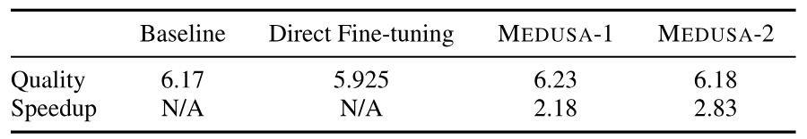

**Table 2.** Comparison of Different Settings of Vicuna-7B. Quality is obtained by evaluating models on MT-Bench using GPT-4 as the judge (higher the better).

#### 3.3.3 Effectiveness of Two-stage Fine-tuning

[Table 2](#table-02) shows the performance differences between various fine-tuning strategies for the Vicuna-7B model. Medusa-1, which fine-tunes only the Medusa heads, achieves a 2.18x speedup without compromising generation quality. Medusa-2, which employs two-stage fine-tuning ([Section 2.2.2](#section-2-2-2)), maintains generation quality and provides greater speedup (2.83x) compared to Medusa-1. In contrast, direct fine-tuning the model with the Medusa heads results in degraded generation quality. The findings indicate that implementing our Medusa-2 for fine-tuning maintains the model’s quality and concurrently improves the speedup versus Medusa-1.

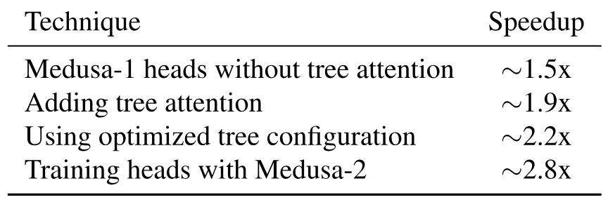

**Table 3.** Impact of Techniques on Speedup

## 4 Discussion

In conclusion, Medusa enhances LLM inference speed by 2.3-2.8 times by equipping models with additional predictive decoding heads, allowing for generating multiple tokens simultaneously and bypassing the sequential decoding limitation. Key advantages of Medusa include its simplicity, parameter efficiency, and ease of integration into existing systems. Medusa avoids the need for specialized draft models. The typical acceptance scheme removes complications from rejection sampling while providing reasonable outputs. Our approach including two efficient training procedures, ensures high-quality output across various models and prompt types. We summarize the development of each technique and their impact on the speedup in [Table 3](#table-03).

In the paper, we focus on the setting with batch size 1 for simplicity. Yet, we want to emphasize that the ideas presented in our paper can be generalized to larger batch-size settings, which are now supported by libraries like TensorRT and Huggingface TGI following our paper.

## Acknowledgements

We extend our heartfelt gratitude to several individuals whose contributions were invaluable to this project:

- Zhuohan Li, for his invaluable insights on LLM serving. If you haven’t already, do check out Zhuohan’s vLLM project—it’s nothing short of impressive.
- Shaojie Bai, for engaging in crucial discussions that helped shape the early phases of this work.
- Denny Zhou, for introducing the truncation sampling scheme to Tianle and encouraging Tianle to explore the area of LLM serving.
- Yanping Huang, for pointing out the memory-bandwidth-bound challenges associated with LLM serving to Tianle.
- Lianmin Zheng, for clarifying the different training recipes used in different sizes of Vicuna models.

Jason D. Lee acknowledges the support of the NSF CCF 2002272, NSF IIS 2107304, and NSF CAREER Award 2144994. Deming Chen acknowledges the support from the AMD Center of Excellence at UIUC.

## 5 Impact Statement

The introduction of Medusa, an innovative method to improve the inference speed of Large Language Models (LLMs), presents a range of broader implications for society, technology, and ethics. This section explores these implications in detail.

### 5.1 Societal and Technological Implications

- **Accessibility and Democratization of AI**: By significantly enhancing the efficiency of LLMs, Medusa makes advanced AI technologies more accessible to a wider range of users and organizations. Democratization can spur innovation across various sectors, including education, healthcare, and entertainment, potentially leading to breakthroughs that benefit society at large.
- **Environmental Impact**: The acceleration for LLM inference due to Medusa could lead to decreased energy consumption and a smaller carbon footprint. This aligns with the growing need for sustainable AI practices, contributing to environmental conservation efforts.
- **Economic Implications**: The increased efficiency brought about by Medusa may lower the cost barrier to deploying state-of-the-art AI models, enabling small and medium-sized enterprises to leverage advanced AI capabilities. This could stimulate economic growth, foster competition, and drive technological innovation.

### 5.2 Ethical Considerations

- **Bias and Fairness**: While Medusa aims to improve LLM efficiency, it inherits the ethical considerations of its backbone models, including issues related to bias and fairness. The method’s ability to maintain generation quality necessitates investigation to ensure that the models do not perpetuate or amplify existing biases.
- **Transparency and Accountability**: The complexity of Medusa, particularly with its tree-based attention mechanism and multiple decoding heads, may pose challenges in terms of model interpretability. Ensuring transparency in how decisions are made and maintaining accountability for those decisions are crucial for building trust in AI systems.
- **Security and Privacy**: The accelerated capabilities of LLMs augmented by Medusa could potentially be exploited for malicious purposes, such as generating disinformation at scale or automating cyber-attacks. It is imperative to develop and enforce ethical guidelines and security measures to prevent misuse.

## 6 Related Work

### 6.1 LLM Inference Acceleration

The inefficiency of Large Language Model (LLM) inference is primarily attributed to the memory-bandwidth-bound nature of the auto-regressive decoding process. Several methods have been proposed to alleviate this issue, improving inference latency and throughput. Traditionally, batch inference has been employed as a straightforward method to enhance arithmetic intensity and escape memory-bandwidth-bound limitations. However, with LLMs, both model parameters and the Key-Value (KV) cache consume substantial accelerator memory, hindering the utilization of large batch sizes. Existing methods to tackle this problem can be conceptually divided into two main categories: (1) Reducing memory consumption, thereby minimizing memory transfer overhead and enabling larger batch sizes, and (2) Minimizing the number of decoding steps to decrease latency directly.

**Reducing KV Cache.** Methods such as Multi-query attention [Sha19] and Grouped-query attention [Ain23] adopt a direct approach to diminish the KV cache. By utilizing fewer key and value heads in the attention modules relative to query heads, these strategies substantially cut the KV’s memory consumption, thereby facilitating larger batch sizes and enhanced accelerator utilization [Pop22]. Additionally, [Zha23g] proposes to selectively retain the most critical KV tokens, further reducing the KV cache. From a system perspective, [Kwo23] introduces a paged memory management scheme for reducing fragmentation of the KV cache.

**Quantization.** Quantization techniques are extensively used to shrink LLMs’ memory consumption. [Xia23] apply rescaling between activations and parameters to eliminate outliers and simplify the quantization process. [Det22] breaks down matrix multiplications into predominantly 8-bit and a minority of 16-bit operations. [Fra22] iteratively round weight columns into 3/4 bits, while [Lin23d] present an activation-aware quantization scheme to protect salient weights and compress LLMs to 3/4 bits. [Kim23] introduce a sparse plus low-precision pattern to handle a minor portion of vital weights, among other techniques.

**Speculative Decoding.** As an approach orthogonal to the aforementioned methods, speculative decoding [Lev23, Che23] aims to execute several decoding steps in parallel, thus reducing the total number of steps required. This parallelization is realized by employing a smaller draft model to conjecture several subsequent words, which the LLMs then collectively evaluate and accept as appropriate. While resonating with non-autoregressive generation literature [Xia23d], this method is specifically tailored for LLMs to address the aforementioned inefficiency. Unlike previous works, we propose leveraging the original model to make predictions rather than introducing an additional draft model. This approach is more straightforward and seamlessly integrates into existing systems without the complexities of managing two models. Independently, [Mia23b, Spe23] propose the use of tree-structured attention to generate multiple candidates in parallel, where [Mia23b] suggest employing an ensemble of models to propose candidates, and [Spe23] advocate adding another hierarchy for the draft model. However, draft models require specialized pretraining and alignment with the target models. While employing multiple draft models can be cumbersome and involves the complexity of managing parallelism, our approach, which relies solely on decoding heads, offers a simpler alternative. [Mia23b] employ multiple draft models to generate tokens and merge them using tree attention, while [Spe23] utilize a small draft model to process each level of the tree in batches. In contrast, our method directly uses the top predicted tokens from each of Medusa heads to create a static sparse tree without autoregression or adjusting the tree structure. This approach simplifies the process and improves efficiency. Additionally, we demonstrate through a detailed ablation study how the nodes of the tree can affect decoding speed.

### 6.2 Sampling Scheme

The manner in which text is sampled from Large Language Models (LLMs) can significantly influence the quality of the generated output. Recent studies have revealed that direct sampling from a language model may lead to incoherent or nonsensical results [Pil21, Hol20]. In response to this challenge, *truncation sampling* schemes have been introduced [Fan18, Bas21, Mei22, Hew22, Mei23]. These approaches aim to produce high-quality and diverse samples by performing sampling on a truncated distribution over a specific *allowed set* at each decoding step.

Different strategies define this allowed set in various ways. For example, top-$k$ sampling [Fan18] retains the $k$ most likely words, whereas top-$p$ sampling [Hol20] incorporates the minimal set of words that account for $p$ percent of the probability. Another method, known as typical decoding [Mei23], employs the entropy of the predicted distribution to establish the threshold for inclusion. [Hew22] offers a unified framework to understand truncation sampling techniques comprehensively.

Drawing inspiration from these methods, our typical acceptance scheme aligns with the concept of defining an allowed set to exclude improbable candidates from the sampling process. However, we diverge because we do not insist on an exact correspondence between the output and language model distribution. This deviation allows us to facilitate more diverse yet high-quality outputs, achieving greater efficiency without compromising the integrity of the generated text.

## 7 Experiment Settings

### 7.1 Common Terms

We clarify three commonly used terms:

- a) Acceleration rate: This refers to the average number of tokens decoded per decoding step. In a standard auto-regressive model, this rate is 1.0.
- b) Overhead: This is used to characterize the per decoding step overhead compared to classic decoding, and is calculated by dividing the average per step latency of the Medusa models by that of the vanilla model.
- c) Speedup: This refers to the wall-time acceleration rate.

Following these definitions, we have the relation: Speedup = Acceleration rate / Overhead.

### 7.2 Shared Settings

For all the experiments, we use the Axolotl [Axo23] framework for training. We use a cosine learning rate scheduler with warmup and use 8-bit AdamW [Det21] optimizer. We train $5$ Medusa heads with $1$ layer and set $\lambda_{k}$ in [Equation 1](#equation-01) to be $0.8^{k}$. For Medusa-2, we use either LoRA [Hu21] or QLoRA [Det24] for fine-tuning and set the learning rate of Medusa heads to be $4$ times larger than the backbone model. LoRA is applied to all the linear layers of the backbone model, including the language model head. The rank of LoRA adapter is set to $32$, and $\alpha$ is set to $16$. A dropout of $0.05$ is added to the LoRA adapter.

### 7.3 Medusa-1 v.s. Medusa-2 on Vicuna 7B and 13B

We use a global batch size of $64$ and a peak learning rate of $5e^{-4}$ for the backbone and $2e^{-3}$ for Medusa heads and warmup for $40$ steps. We use $4$-bit quantized backbone models for both models. We first train the models with Medusa-1 and use these trained models as initialization to train Medusa-2. We employ QLoRA for Medusa-2 and the $\lambda_{0}$ in [Equation 2](#equation-02) is set to be $0.2$.

### 7.4 Training with Self-Distillation on Vicuna-33B and Zephyr-7B

We use Medusa-2 for both models instead of using a two-stage training procedure. We use a sine schedule for the $\theta_{0}$ to gradually increase the value to its peak at the end of the training. We find this approach is equally effective. We set the peak learning rate of the backbone LoRA adapter to be $1e^{-4}$ and the warmup steps to be $20$ since the self-distillation loss is relatively small. We set the $\lambda_{0}$ in [Equation 2](#equation-02) to be $0.01$.

## 8 Visualization of optimized tree attention

[Figure 6](#figure-06) illustrates the structure of a sparsely constructed tree for the Medusa-2 Vicuna-7B model. This tree structure extends four levels deep, indicating the engagement of four Medusa heads in the computation. The tree is initially formed through a Cartesian product approach and subsequently refined by pruning based on the statistical expectations of the top-k predictions from each Medusa head measured on the Alpaca-eval dataset [Dub23]. The tree’s lean towards the left visually represents the algorithm’s preference for nodes with higher probabilities on each head.

**Figure 6.** Visualization of a sparse tree setting for Medusa-2 Vicuna-7B. The tree has 64 nodes representing candidate tokens and a depth of 4 which indicates 4 Medusa heads involved in calculation. Each node indicates a token from a top-k prediction of a Medusa head, and the edges show the connections between them. The red lines highlight the path that correctly predicts the future tokens.

## 9 Results of Speculative Decoding

In this study, speculative decoding was applied to Vicuna models [Chi23a] with varying sizes, specifically 7B, 13B, and 33B. The preliminary framework utilized open-source models such as Llama-68M and 160M [Mia23b], alongside Tiny-Llama [Zha24ab] and Tiny-Vicuna [Pan23a], fine-tuned from Tiny-Llama with the Vicuna-style instructional tuning strategy. Due to the proprietary nature of speculative decoding methods [Che23, Lev23], open-source alternatives [+3] were deployed for evaluation. Additionally, we utilize `torch.compile()` to accelerate the inference speed of draft models.

Our results shown in [Figure 7](#figure-07), reveal that the optimal settings of the draft model vary with the Vicuna model sizes. Specifically, the Llama-68M, with a setting of the draft token number $\gamma=4$, yielded the best performance for Vicuna-7B, while the same draft model with $\gamma=3$ was most effective for Vicuna-13B. For the larger Vicuna-33B, the Tiny-Vicuna (Vicuna-1B), with $\gamma=3$, provided the greatest acceleration. These results suggest that the choice and setting of the drafting model should be tailored to the size of the LLMs, presenting an area for further exploration in the field.

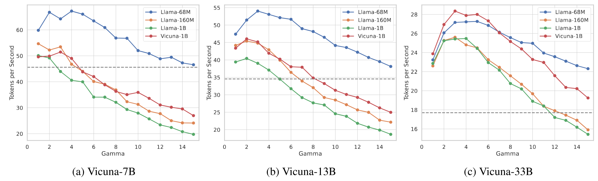

**Figure 7.** Inference speed of various models using speculative decoding on MT-Bench. Baseline model speeds are presented by grey dotted lines for comparison. $\gamma$ denotes the draft token number.

## 10 Additional Results for All Models

We show speedup on various models in [Figure 8](#figure-08).

**Figure 8.** Speedup of various models with Medusa-2. Medusa-2 shows significant speed improvement over all the models, while models trained with self-distillation (Zephyr-7B, Vicuna-13/33B) have weaker speedup due to the trade-off between preserving quality and boosting speed.

## 11 Additional Results on AlpacalEval Dataset

We conduct further experiments on the AlpacaEval [Li23z] dataset. Medusa-2 achieves consistent speedup similar to the results on MT-Bench.

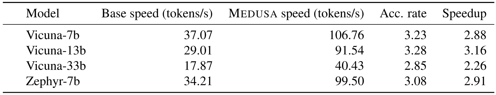

**Table 4.** Speedup results on AlpacaEval [Li23z] dataset.

## 12 Exploration and Modeling of Hardware Constraints and Medusa

We explore the hardware constraints, specifically memory-bandwidth bound, and their impact on Medusa-style parallel decoding by incorporating a simplified Llama-series model. First, we identify that the operators involving matrix multiplications, such as linear layers and attention matrix multiplications, are the primary sources of overhead. We profile the performance of FLOP/s vs. Operational Intensity which is the ratio of FLOP/s to bandwidth (bytes/s), across various GPUs, including the A100-80GB-PCIe, A40, and A6000. Next, we examine the changes in FLOP/s vs. Operational Intensity when using Medusa for different operators. Finally, we apply a straightforward analytical model to calculate acceleration rates and combine it with hardware benchmarks. This provides insights into the effects under different model sizes, sequence lengths, and batch sizes.

### 12.1 Roofline Model of Operators

We present an analysis of the roofline model for various operators in large language models (LLMs), specifically focusing on Llama-7B, Llama-13B, and Llama-33B [Tou23a]. These models were benchmarked on different GPUs, including the A100-80GB-PCIe, A40, and A6000. We looked into the three categories of matrix multiplication operators since they represent the primary sources of computational overhead in these models. Our study follows the report [Che23g] which investigates the effectiveness of batch size but ours focuses more on decoding and parallel decoding.

[Table 5](#table-05) details the computation and space complexity for each operator during the prefill, decoding, and Medusa decoding phases. The operators include the linear layers for query, key, and value matrices ($X W_{Q}$, $X W_{K}$, $X W_{V}$), the attention matrix multiplications ($Q K^\top$, $P V$), and the up/gate/down linear layers ($X W_{u}$, $X W_{g}$, $X W_{d}$). $b$ stands for the batch size, $s$ stands for the sequence length, $h$ stands for the hidden dimension, $i$ stands for the intermediate dimension, $n$ stands for the number of attention heads, $d$ stands for the head dimension and $q$ stands for the candidate length for Medusa. For more details of these operators please refer to the articles [Tou23a, Che23g].

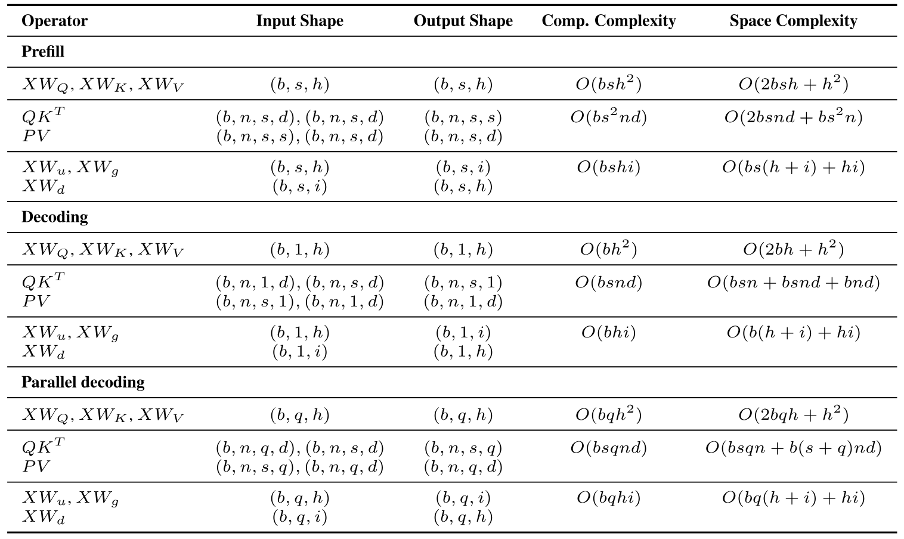

**Table 5.** Computational and space complexity of the main operators in different phases. The table is based on the corresponding table in the report [Che23g].

[Figures 9](#figure-09)-[17](#figure-17) show the benchmark of three categories of operators on different models (7/13/33B) under various settings. To evaluate each operator’s performance and throughput, we chose the combination of settings including batch sizes from 1 to 64 in powers of 2 and sequence lengths from 128 to 8192 in powers of 2 (49 settings for each operator). From all the figures, we observe that the datapoints of each operator in the prefill and decoding stages cluster at very similar positions across all GPUs and for various model sizes.

During the prefill phase, increasing the batch size changes the FLOP/s of the attention matrix multiplications (see `‘qk/pv init‘`) but does not affect the Operational Intensity (refer to the vertical dashed arrow in [Figure 9](#figure-09)). In contrast, increasing the sequence length impacts both FLOP/s and Operational Intensity in the prefill phase (refer to the diagonal dashed arrow in [Figure 9](#figure-09)). During the decoding phase, the attention matrix multiplications are significantly limited by memory bandwidth. Despite an increase in FLOP/s with changes in batch size and sequence length, the Operational Intensity remains nearly unchanged (see `‘qk/pv ar‘`). This indicates suboptimal resource utilization in the self-attention mechanism.

The linear layers in the prefill phase are mostly compute-bound (see `‘qkv mlp init‘` and `‘up/gate/down init‘`). During the decoding phase, the datapoints of the linear layer form a line with the same slope as the GPU’s memory bandwidth (see `‘qkv mlp ar‘` and `‘up/gate/down ar‘`). This indicates the linear layers in the decoding stage are also bounded by memory bandwidth. Increasing the batch size improves the achieved FLOP/s and Operational Intensity under memory bandwidth constraints through better parallelism. Note that linear layers only process the new token and are independent of sequence length (See ‘Decoding‘ section in [Table 5](#table-05)).

![Figure 9. The figure shows the relationship between FLOP/s and Operational Intensity for all benchmarked datapoints of Llama-7B operators on A100-80GB-PCIe. The dashed lines represent the HBM bandwidth limit (1,935GB/s) and the peak performance limit (312 TFLOP/s) Nvi20. ‘`qkv mlp`’ stands for the linear layers projecting hidden features to query/key/value features. ‘`up/gate/down`’ stands for the linear layers following the attention block. ‘`qk/pv`’ stands for the two steps of attention matrix multiplications. ‘`ar`’ stands for the decoding (autoregressive) and ‘`init`’ stands for the prefill phase.](../../papers/medusa/figure-09.png)

**Figure 9.** The figure shows the relationship between FLOP/s and Operational Intensity for all benchmarked datapoints of Llama-7B operators on A100-80GB-PCIe. The dashed lines represent the HBM bandwidth limit (1,935GB/s) and the peak performance limit (312 TFLOP/s) [Nvi20]. ‘`qkv mlp`’ stands for the linear layers projecting hidden features to query/key/value features. ‘`up/gate/down`’ stands for the linear layers following the attention block. ‘`qk/pv`’ stands for the two steps of attention matrix multiplications. ‘`ar`’ stands for the decoding (autoregressive) and ‘`init`’ stands for the prefill phase.

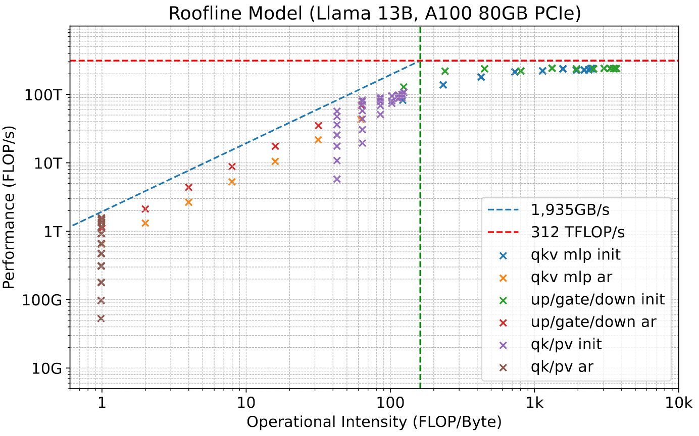

**Figure 10.** Llama-13B operators on A100-80GB-PCIe.

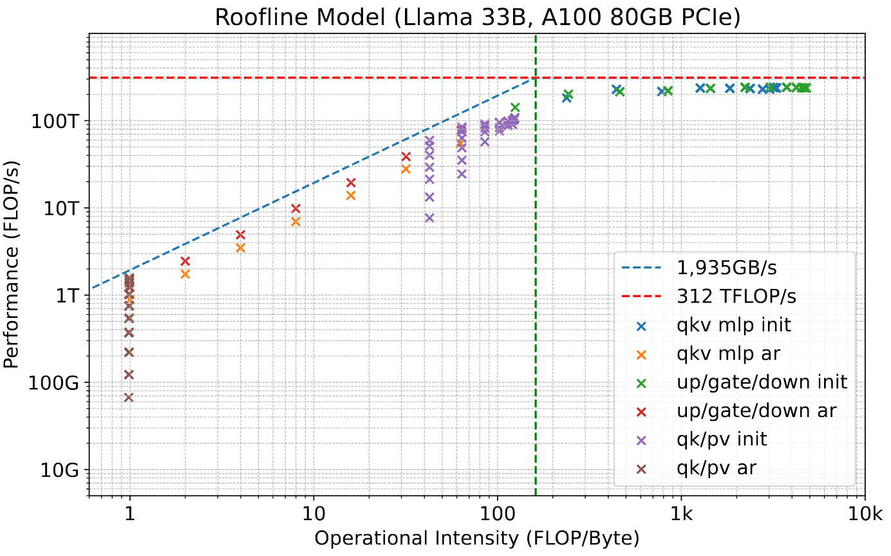

**Figure 11.** Llama-33B operators on A100-80GB-PCIe.

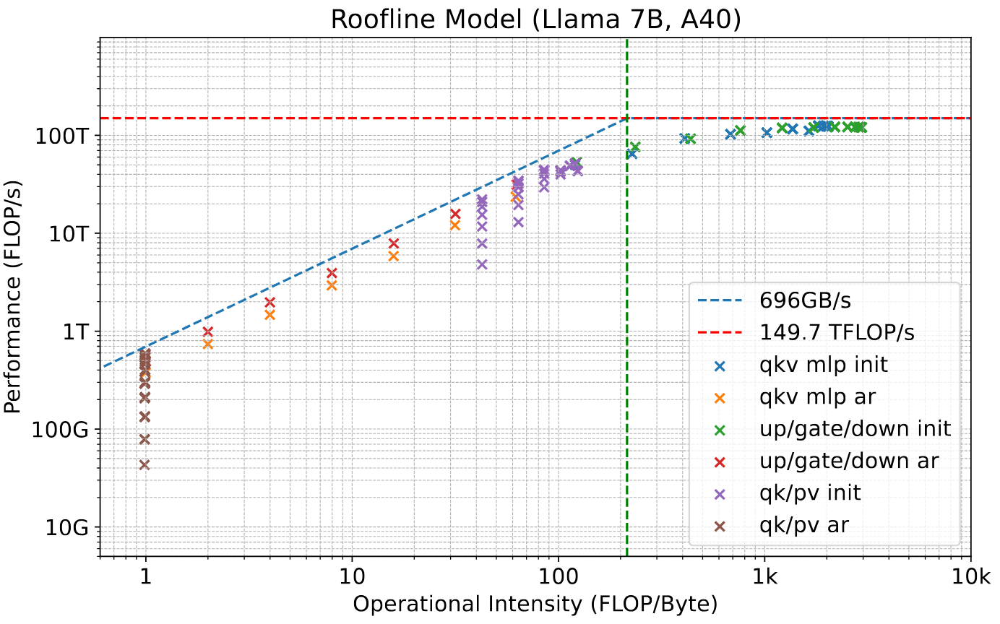

**Figure 12.** Llama-7B operators on A40.

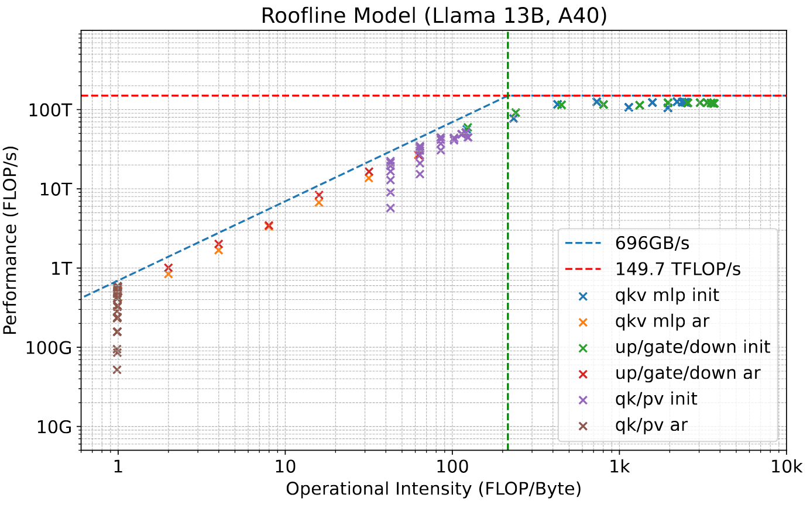

**Figure 13.** Llama-13B operators on A40.

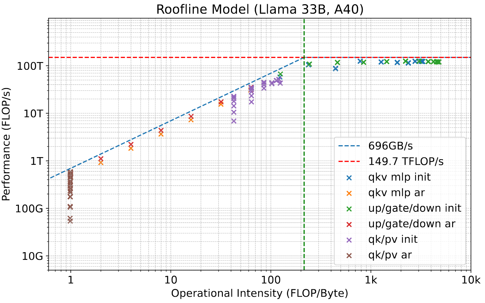

**Figure 14.** Llama-33B operators on A40.

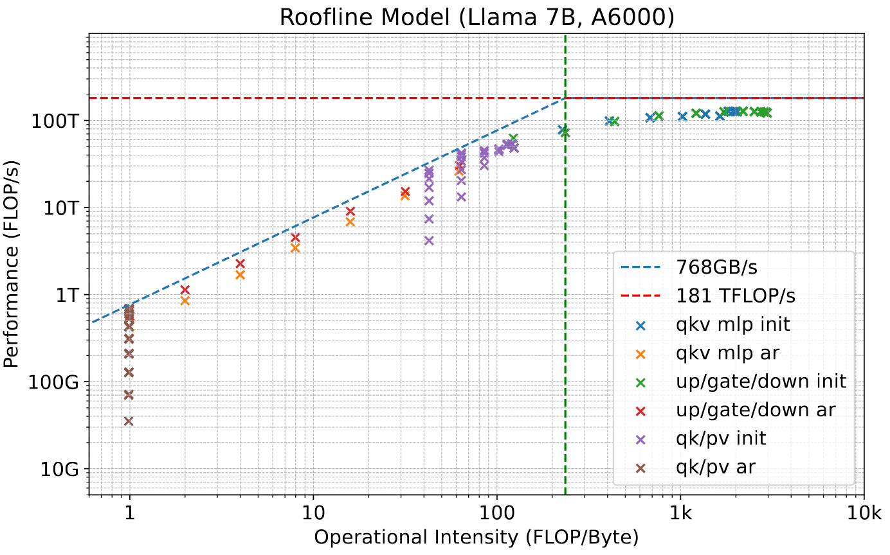

**Figure 15.** Llama-7B operators on A6000.

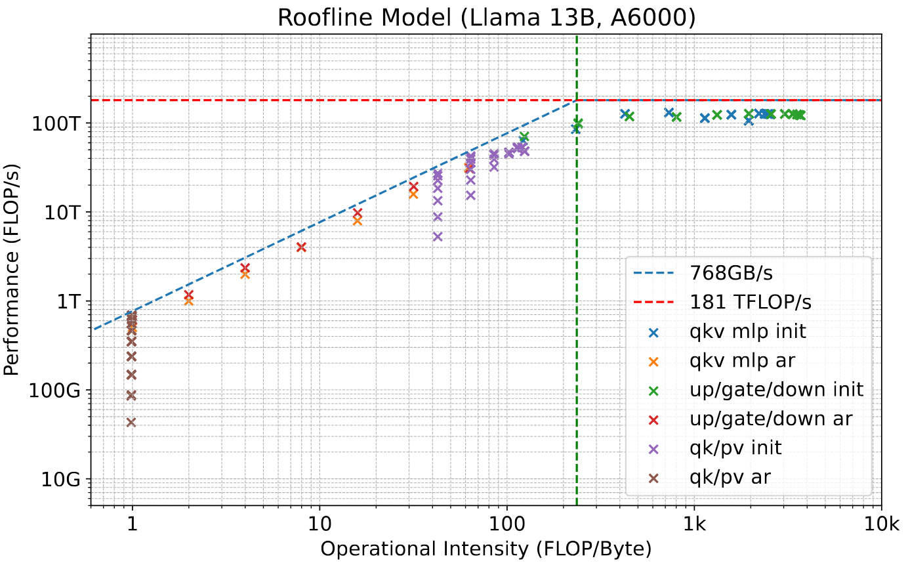

**Figure 16.** Llama-13B operators on A6000.

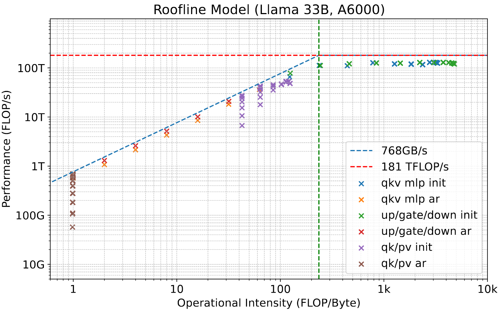

**Figure 17.** Llama-33B operators on A6000.

### 12.2 FLOP/s vs. Operational Intensity Variations in Medusa

We investigate how Medusa can change Operational Intensity and elevate the FLOP/s. We choose Llama 33B on A100-80GB-PCIe as the setting.

First, we examine the attention matrix multiplication. [Figure 18](#figure-18) and [Table 6](#table-06) illustrate the effects of Medusa while keeping the batch size fixed at 16. We observe increased FLOP/s and Operational Intensity as more candidate tokens are added (original decoding results are plotted as grey dots). This indicates that Medusa can leverage additional candidate tokens to improve computational throughput. Compared to regular decoding, Medusa achieves $44\times$ FLOP/s and $41\times$ Operational Intensity under the setting of batch size 16 and sequence length 1024 with 64 candidate tokens. [Figure 19](#figure-19) and [Table 7](#table-07) illustrate the effects of Medusa decoding while keeping the sequence length fixed at 1024. Increasing the batch size does not improve Operational Intensity in this scenario.

Next, we examine the linear layer, focusing on the up/gate/down linear layers. The results are shown in [Figure 20](#figure-20) and [Table 8](#table-08). Since the linear layers in the decoding phase only process the future tokens while the past tokens are cached, they are independent of the sequence length. We vary the batch size to observe the effects. As Medusa increases the number of candidate tokens with the increasing batch size, we observe a shift from a memory-bandwidth-bound region to a computation-bound region. This shift demonstrates how Medusa can transition the performance characteristics of the linear layers from being limited by memory bandwidth to being limited by computational capacity.

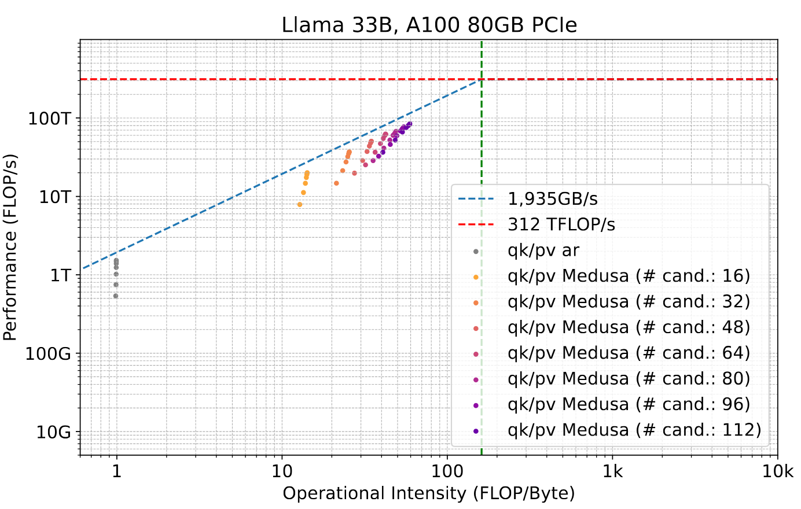

**Figure 18.** FLOP/s vs. Operational Intensity of attention matrix multiplication with batch size 16.

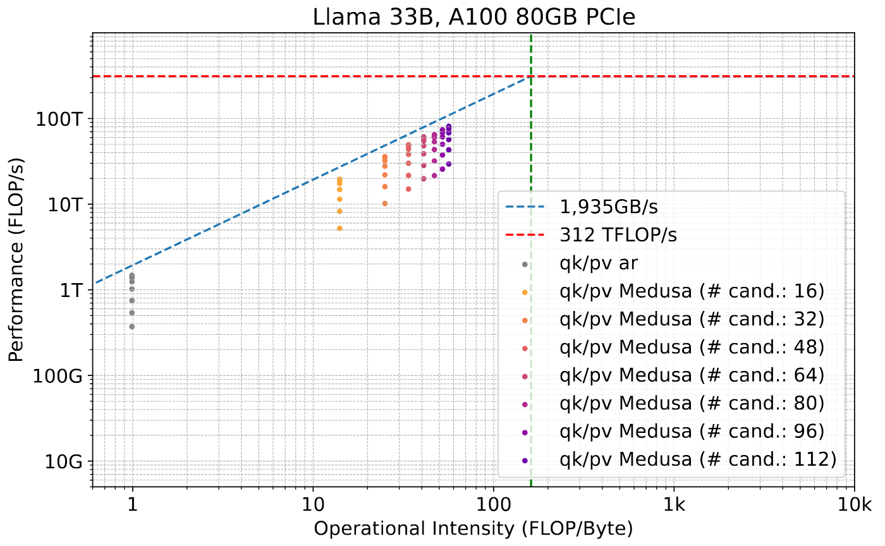

**Figure 19.** FLOP/s vs. Operational Intensity of attention matrix multiplication with sequence length 1024.

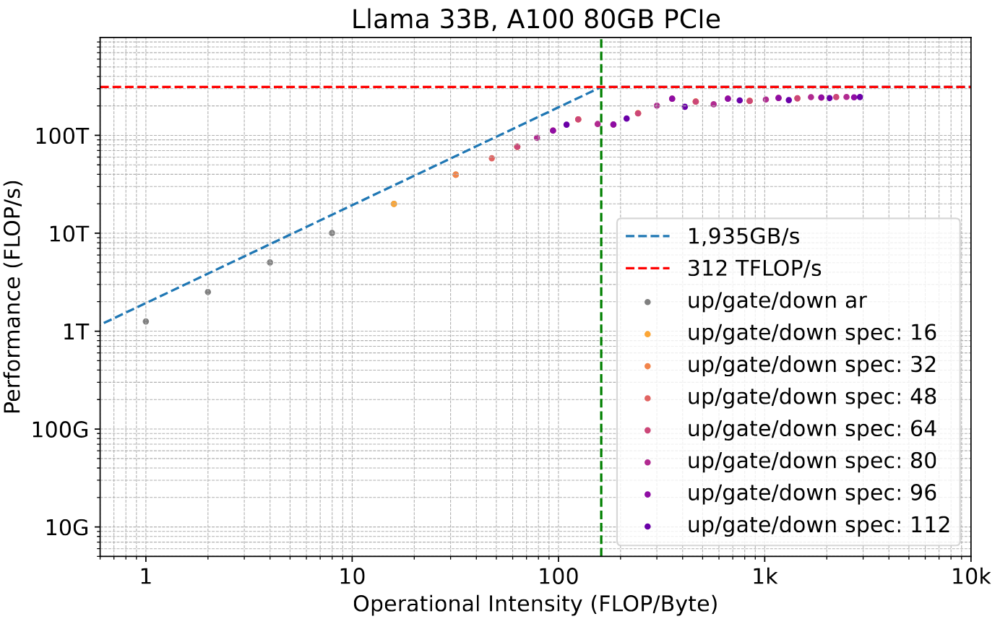

**Figure 20.** FLOP/s vs. Operational Intensity of Linear layers.

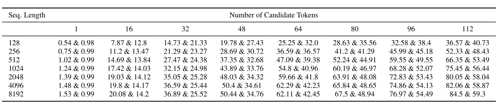

**Table 6.** TFLOP/s & Operational Intensity of attention matrix multiplication with batch size 16 for Llama 33B on an A100 80GB PCIe.

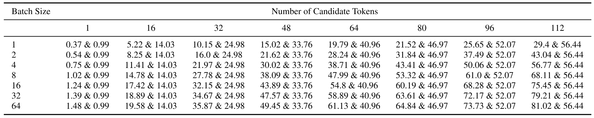

**Table 7.** TFLOP/s & Operational Intensity of attention matrix multiplication with sequence length 1024 for Llama 33B on an A100 80GB PCIe.

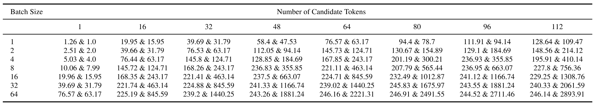

**Table 8.** TFLOP/s & Operational Intensity of linear layers (up/gate/down) for Llama 33B on an A100 80GB PCIe.

### 12.3 Predicting Medusa Performance

We further employ a straightforward analytical model for the acceleration rate. The ablation study results in [Section 3.3.1](#section-3-3-1) indicate that the acceleration rate can be approximated by a simple logarithmic function. Using the results from [Figure 4(a)](#figure-04), we model the curve as $\texttt{acc\_rate}=0.477\log(\texttt{num\_candidate})$. We simulate the latency of one simplified block of the Llama-7B model (sequentially processing $X W_{Q}$, $X W_{K}$, $X W_{V}$, $Q K^\top$, $P V$, $X W_{u}$, $X W_{g}$, $X W_{d}$) by first fixing the batch size at 1 and the sequence length at 1024. The candidate tokens are processed parallelly by constructing the tree attention described in [Section 2.1.2](#section-2-1-2). We omit the latency of the post-processing steps including verification and acceptance for Medusa since they introduce marginal overhead. [Figure 21](#figure-21) illustrates the simulated acceleration rate and speedup for different numbers of candidate tokens under these settings. As the number of candidate tokens increases, both the acceleration rate and speedup initially show improvements. However, beyond 64, the speedup starts to decline, indicating diminishing returns with further increases in candidate length. This aligns with the experimental results in [Figure 4(b)](#figure-04) and suggests that there is an optimal range for the numbers of candidate tokens where Medusa provides the most significant performance gains.

We plot the simulated speedup under different batch size settings with a fixed sequence length of 1024 in [Figure 22](#figure-22). The results indicate that when the batch size exceeds 32, the speedup decreases and may even have a negative effect. This occurs because the linear layers shift from being memory-bandwidth-bound to computationally bound.

We conduct another experiment using a batch size of 4 and different sequence lengths. As shown in [Figure 23](#figure-23), the optimal number of candidate tokens remains relatively consistent across different sequence lengths. However, as the sequence length increases, the overall performance decreases. This performance drop is primarily due to the overhead from attention matrix multiplication, while the linear layer computation remains constant since the computation of linear layers is independent of the sequence length.

Our simulations show that the optimal number of candidate tokens is key for model scaling with Medusa, as benefits decrease beyond a certain range. Initially, increasing batch size improves performance through parallelism, but too large a batch size shifts linear layers from memory-bandwidth-bound to compute-bound, reducing speedup. Longer sequences increase attention matrix multiplication overhead, lowering performance, and emphasizing the need to optimize attention mechanisms. Effective model scaling requires balancing the number of candidate tokens, adjusting batch sizes to avoid compute-bound transitions, and enhancing attention mechanisms for longer sequences. These strategies ensure better resource utilization and higher performance, demonstrating the value of simulations in predicting performance and guiding acceleration strategy design.

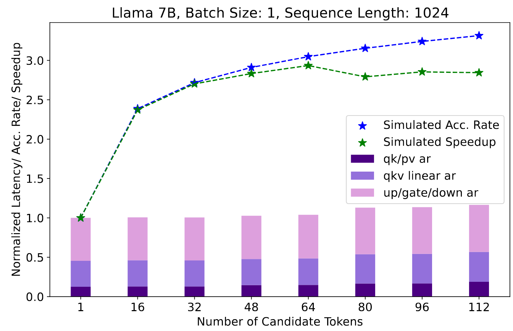

**Figure 21.** Simulated acceleration rate, speedup, and normalized latency ablation using different numbers of candidate tokens under the setting of batch size 1 and sequence length 1024 for Llama-7B on an A100 80GB PCIe.

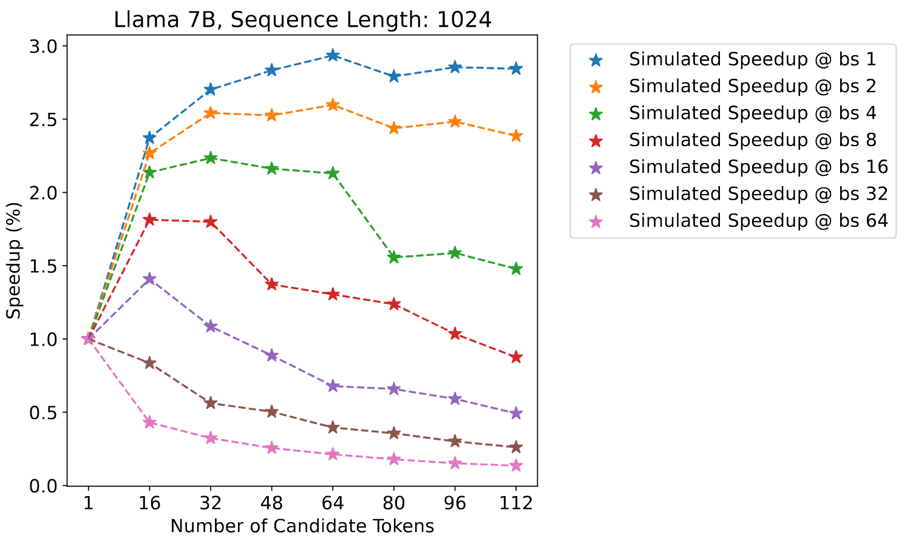

**Figure 22.** Simulated speedup with sequence length 1024 for Llama-7B.

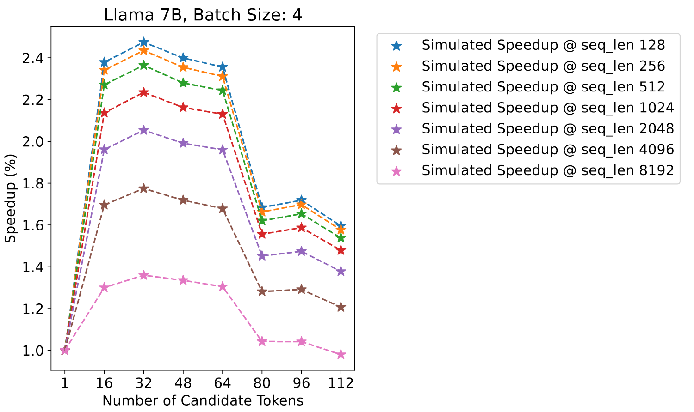

**Figure 23.** Simulated speedup with batch size 4 for Llama-7B.

[+1]: Upon contacting the authors, this version is experimental and used some different data than Vicuna 7B and 13B.

[+2]: Here, the accuracy is defined for the single top $i$-th token, i.e., this accuracy is equal to top-$i$ accuracy minus top-$(i-1)$ accuracy.

[+3]: [https://github.com/feifeibear/LLMSpeculativeSampling](https://github.com/feifeibear/LLMSpeculativeSampling)

[+author-equal]: Equal contribution.

[+author-corresponding]: Corresponding author.
