> [NVIDIA Corporation](https://www.nvidia.com/en-us/about-nvidia/). *[NVIDIA Tesla P100: The Most Advanced Datacenter Accelerator Ever Built](https://www.nvidia.com/en-us/data-center/resources/pascal-architecture-whitepaper/)*, featuring Pascal GP100, the world's fastest GPU, V1.2, 2017. The whitepaper was first released with the Tesla P100 announcement on April 5, 2016. <a href="/paper/nvidia-pascal-architecture.pdf" target="_blank" rel="noopener noreferrer">Original PDF</a>. No arXiv record or TeX source is available; the published PDF is authoritative for the exact wording, print layout, and bibliography.

## 1 Introduction

Nearly a decade ago, NVIDIA® pioneered the use of GPUs to accelerate computationally-intensive workloads with the introduction of the G80 GPU and the NVIDIA® CUDA® parallel computing platform. Today, NVIDIA® Tesla® GPUs accelerate thousands of High Performance Computing (HPC) applications across many areas including computational fluid dynamics, medical research, machine vision, financial modeling, quantum chemistry, energy discovery, and several others.

NVIDIA Tesla GPUs are installed in many of the world's top supercomputers, accelerating discovery and enabling increasingly complex simulations across multiple domains. Datacenters are using NVIDIA Tesla GPUs to speed up numerous HPC and Big Data applications, while also enabling leading-edge Artificial Intelligence (AI) and Deep Learning systems.

NVIDIA's new NVIDIA Tesla P100 accelerator (see [Figure 1](#figure-01)) using the groundbreaking new NVIDIA® Pascal™ GP100 GPU takes GPU computing to the next level. This paper details both the Tesla P100 accelerator and the Pascal GP100 GPU architectures.

Also discussed is NVIDIA's powerful new DGX-1 server that utilizes eight Tesla P100 accelerators, effectively an AI supercomputer in a box. The DGX-1 is purpose-built to assist researchers advancing AI, and data scientists requiring an integrated system for Deep Learning.

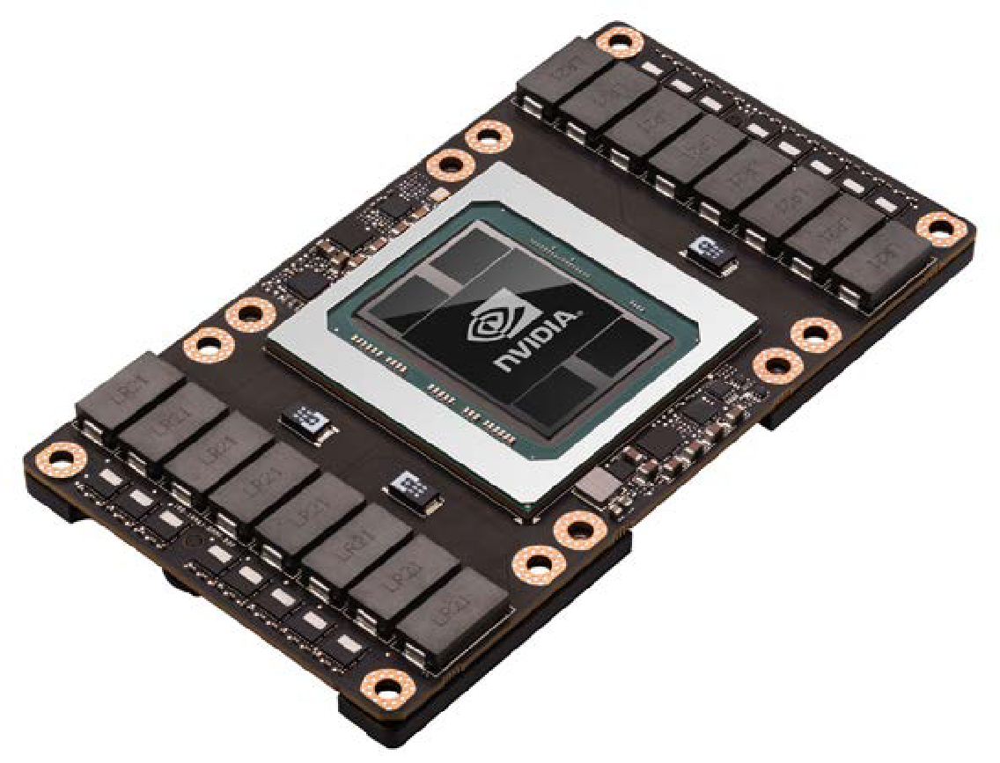

**Figure 1.** NVIDIA Tesla P100 with Pascal GP100 GPU

## 2 Tesla P100: Revolutionary Performance and Features for GPU Computing

With a 15.3 billion transistor GPU, a new high performance interconnect that greatly accelerates GPU peer-to-peer and GPU-to-CPU communications, new technologies to simplify GPU programming, and exceptional power efficiency, Tesla P100 is not only the most powerful, but also the most architecturally complex GPU accelerator architecture ever built.

Key features of Tesla P100 include:

- **Extreme performance** 
  Powering HPC, Deep Learning, and many more GPU Computing areas
- **NVLink™** 
  NVIDIA's new high speed, high bandwidth interconnect for maximum application scalability
- **HBM2** 
  Fast, high capacity, extremely efficient CoWoS (Chip-on-Wafer-on-Substrate) stacked memory architecture
- **Unified Memory, Compute Preemption, and New AI Algorithms** 
  Significantly improved programming model and advanced AI software optimized for the Pascal architecture;
- **16nm FinFET** 
  Enables more features, higher performance, and improved power efficiency

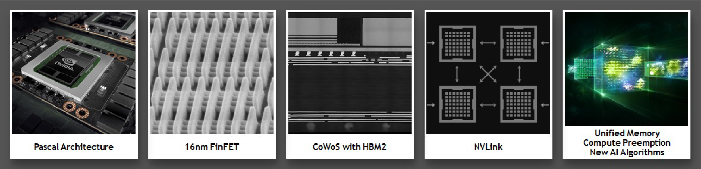

**Figure 2.** New Technologies in Tesla P100

### 2.1 Extreme Performance for High Performance Computing and Deep Learning

Tesla P100 was built to deliver exceptional performance for the most demanding compute applications, delivering:

- 5.3 TFLOPS of double precision floating point (FP64) performance
- 10.6 TFLOPS of single precision (FP32) performance
- 21.2 TFLOPS of half-precision (FP16) performance

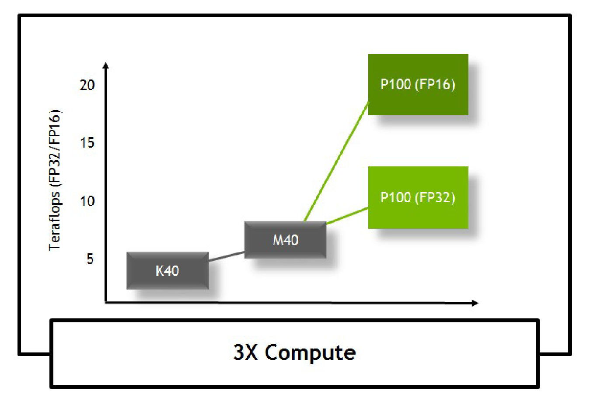

**Figure 3.** Tesla P100 Significantly Exceeds Compute Performance of Past GPU Generations

In addition to the numerous areas of high performance computing that NVIDIA GPUs have accelerated for a number of years, most recently Deep Learning has become a very important area of focus for GPU acceleration. NVIDIA GPUs are now at the forefront of deep neural networks (DNNs) and artificial intelligence (AI). They are accelerating DNNs in various applications by a factor of 10x to 20x compared to CPUs, and reducing training times from weeks to days. In the past three years, NVIDIA GPU-based computing platforms have helped speed up Deep Learning network training times by a factor of fifty. In the past two years, the number of companies NVIDIA collaborates with on Deep Learning has jumped nearly 35x to over 3,400 companies.

New innovations in our Pascal architecture, including native 16-bit floating point (FP) precision, allow GP100 to deliver great speedups for many Deep Learning algorithms. These algorithms do not require high levels of floating-point precision, but they gain large benefits from the additional computational power FP16 affords, and the reduced storage requirements for 16-bit datatypes.

### 2.2 NVLink: Extraordinary Bandwidth for Multi-GPU and GPU-to-CPU Connectivity

As GPU-accelerated computing has risen in popularity, more multi-GPU systems are being deployed at all levels, from workstations to servers, to supercomputers. Many 4-GPU and 8-GPU system configurations are now used to solve bigger and more complex problems. Multiple groups of multi-GPU systems are being interconnected using InfiniBand® and 100 Gb Ethernet to form much larger and more powerful systems. The ratio of GPUs to CPUs has also increased. 2012's fastest supercomputer, the Titan located at Oak Ridge National Labs, deployed one GK110 GPU per CPU. Today, two or more GPUs are more commonly being paired per CPU as developers increasingly expose and leverage the available parallelism provided by GPUs in their applications. As this trend continues, PCIe bandwidth at the multi-GPU system level becomes a bigger bottleneck.

To address this issue, Tesla P100 features NVIDIA's new high-speed interface, NVLink, that provides GPU-to-GPU data transfers at up to 160 Gigabytes/second of bidirectional bandwidth—5x the bandwidth of PCIe Gen 3 x16. [Figure 4](#figure-04) shows NVLink connecting eight Tesla P100 Accelerators in a Hybrid Cube Mesh Topology.

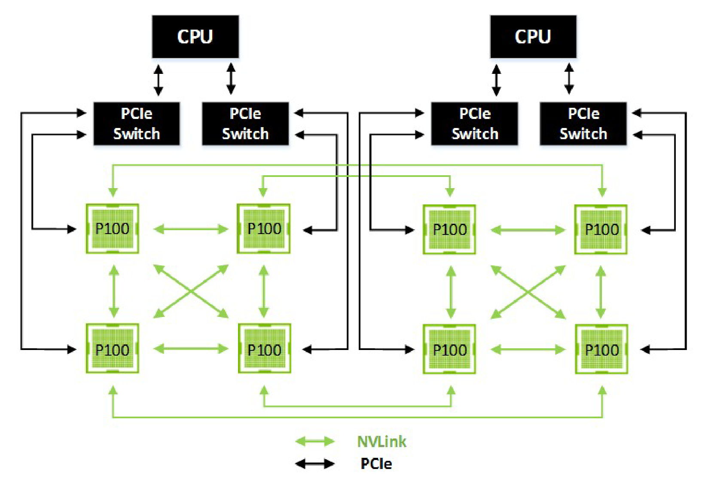

**Figure 4.** NVLink Connecting Eight Tesla P100 Accelerators in a Hybrid Cube Mesh Topology

[Figure 5](#figure-05) shows the performance for various workloads, demonstrating the performance scalability a server can achieve with up to eight GP100 GPUs connected via NVLink. (Note: These numbers are measured on pre-production P100 GPUs.)

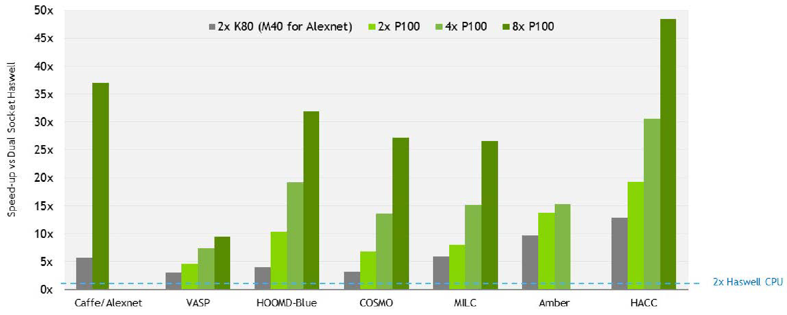

**Figure 5.** Largest Performance Increase with Eight P100s connected via NVLink

### 2.3 HBM2 High-Speed GPU Memory Architecture

Tesla P100 is the world's first GPU architecture to support HBM2 memory. HBM2 offers three times (3x) the memory bandwidth of the Maxwell GM200 GPU. This allows the P100 to tackle much larger working sets of data at higher bandwidth, improving efficiency and computational throughput, and reduce the frequency of transfers from system memory.

Because HBM2 memory is stacked memory and is located on the same physical package as the GPU, it provides considerable space savings compared to traditional GDDR5, which allows us to build denser GPU servers more easily than ever before.

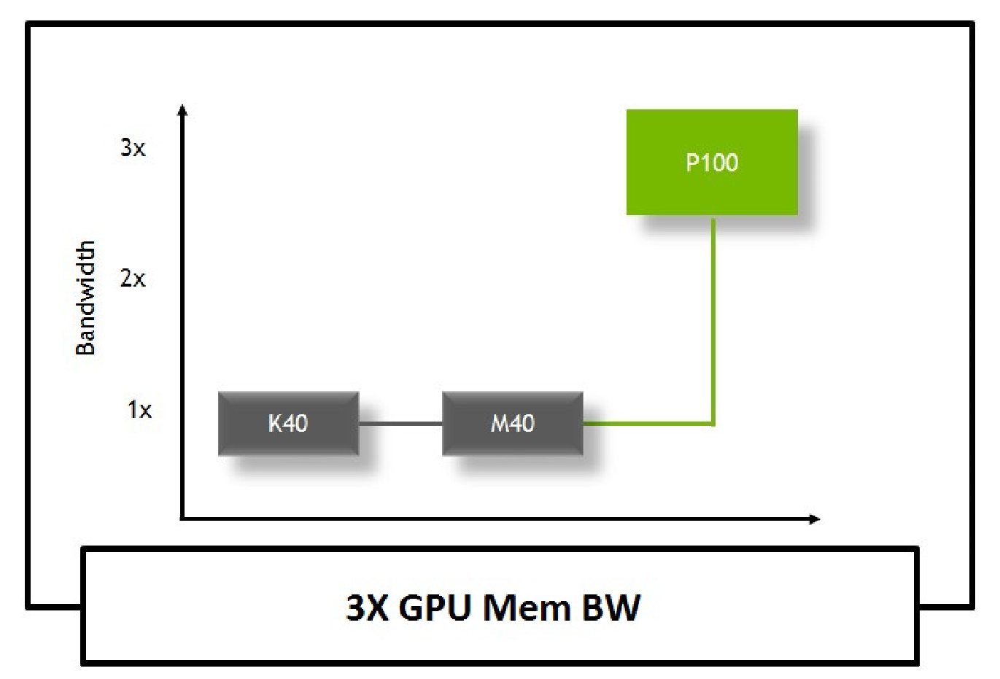

**Figure 6.** Tesla P100 with HBM2 Significantly Exceeds Memory Bandwidth of Past GPU Generations

### 2.4 Simplified Programming for Developers with Unified Memory and Compute Preemption

Unified Memory is a significant advancement for NVIDIA GPU computing and a major new hardware and software-based feature of the Pascal GP100 GPU architecture. It provides a single, seamless unified virtual address space for CPU and GPU memory. Unified Memory greatly simplifies GPU programming and porting of applications to GPUs and also reduces the GPU computing learning curve. Programmers no longer need to worry about managing data sharing between two different virtual memory systems.

GP100 is the first NVIDIA GPU to support hardware page faulting, and when combined with new 49-bit (512 TB) virtual addressing, allows transparent migration of data between the full virtual address spaces of both the GPU and CPU.

Compute Preemption is another important new hardware and software feature added to GP100 that allows compute tasks to be preempted at instruction-level granularity, rather than thread block granularity as in prior Maxwell and Kepler GPU architectures. Compute Preemption prevents long-running applications from either monopolizing the system (preventing other applications from running) or timing out. Programmers no longer need to modify their long-running applications to play nicely with other GPU applications. With Compute Preemption in GP100, applications can run as long as needed to process large datasets or wait for various conditions to occur, while scheduled alongside other tasks. For example, both interactive graphics tasks and interactive debuggers can run in concert with long-running compute tasks.

## 3 GP100 GPU Hardware Architecture In-Depth

GP100 was built to be the highest performing parallel computing processor in the world to address the needs of the GPU accelerated computing markets serviced by our Tesla P100 accelerator platform. Like previous Tesla-class GPUs, GP100 is composed of an array of Graphics Processing Clusters (GPCs), Texture Processing Clusters (TPCs), Streaming Multiprocessors (SMs), and memory controllers. A full GP100 consists of six GPCs, 60 Pascal SMs, 30 TPCs (each including two SMs), and eight 512-bit memory controllers (4096 bits total).

Each GPC inside GP100 has ten SMs. Each SM has 64 CUDA Cores and four texture units. With 60 SMs, GP100 has a total of 3840 single precision CUDA Cores and 240 texture units. Each memory controller is attached to 512 KB of L2 cache, and each HBM2 DRAM stack is controlled by a pair of memory controllers. The full GPU includes a total of 4096 KB of L2 cache.

[Figure 7](#figure-07) shows a full GP100 GPU with 60 SM units (different products can use different configurations of GP100). The Tesla P100 accelerator uses 56 SM units.

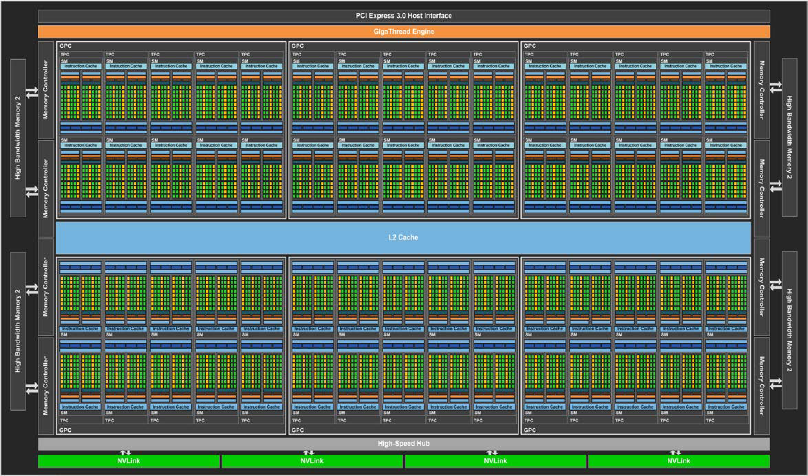

**Figure 7.** Pascal GP100 Full GPU with 60 SM Units

### 3.1 Exceptional Performance and Power Efficiency

Delivering higher performance and improving energy efficiency are two key goals for new GPU architectures. A number of changes to the SM in the Maxwell architecture improved its efficiency compared to Kepler. Pascal has built on this and incorporates additional improvements that allow us to increase performance per watt even further over Maxwell. While TSMC's 16-nm FinFET manufacturing process plays an important role, many GPU architectural modifications were also implemented to further reduce power consumption while maintaining high performance.

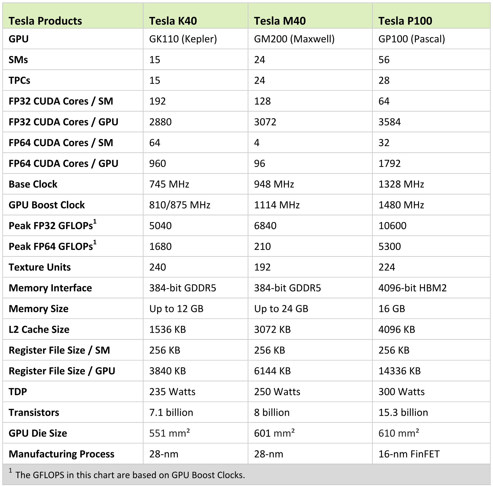

**Table 1.** Tesla P100 Compared to Prior Generation Tesla products

### 3.2 Pascal Streaming Multiprocessor

GP100's sixth-generation SM architecture improves CUDA Core utilization and power efficiency, resulting in significant overall GPU performance improvements, and allowing higher core clock speeds compared to previous GPUs.

GP100's SM incorporates 64 single-precision (FP32) CUDA Cores. In contrast, the Maxwell and Kepler SMs had 128 and 192 FP32 CUDA Cores, respectively. The GP100 SM is partitioned into two processing blocks, each having 32 single-precision CUDA Cores, an instruction buffer, a warp scheduler, and two dispatch units. While a GP100 SM has half the total number of CUDA Cores of a Maxwell SM, it maintains the same register file size and supports similar occupancy of warps and thread blocks. GP100's SM has the same number of registers as Maxwell GM200 and Kepler GK110 SMs, but the entire GP100 GPU has far more SMs, and thus many more registers overall. This means threads across the GPU have access to more registers, and GP100 supports more threads, warps, and thread blocks in flight compared to prior GPU generations.

Overall shared memory across the GP100 GPU is also increased due to the increased SM count, and aggregate shared memory bandwidth is effectively more than doubled. A higher ratio of shared memory, registers, and warps per SM in GP100 allows the SM to more efficiently execute code. There are more warps for the instruction scheduler to choose from, more loads to initiate, and more per-thread bandwidth to shared memory.

[Figure 8](#figure-08) shows the resulting block diagram of the GP100 SM.

Compared to Kepler, Pascal's SM features a simpler datapath organization that requires less die area and less power to manage data transfers within the SM. Pascal also provides superior scheduling and overlapped load/store instructions to increase floating point utilization. The new SM scheduler architecture in GP100 improves upon the advances of the Maxwell scheduler and is even more intelligent, providing increased performance and reduced power consumption. Each warp scheduler (one per processing block) is capable of dispatching two warp instructions per clock.

One new capability that has been added to GP100's FP32 CUDA Cores is the ability to process both 16-bit and 32-bit precision instructions and data, as described later in this paper. FP16 operation throughput is up to twice FP32 operation throughput.

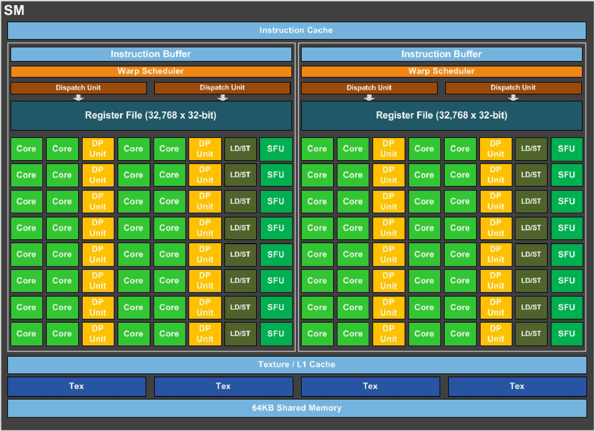

**Figure 8.** Pascal GP100 SM Unit

### 3.3 Designed for High-Performance Double Precision

Double precision arithmetic is at the heart of many HPC applications such as linear algebra, numerical simulation, and quantum chemistry. Therefore, one of the key design goals for GP100 was to significantly improve the delivered performance for these use cases.

Each SM in GP100 features 32 double precision (FP64) CUDA Cores, which is one-half the number of FP32 single precision CUDA Cores. A full GP100 GPU has 1920 FP64 CUDA Cores. This 2:1 ratio of single precision (SP) units to double precision (DP) units aligns better with GP100's new datapath configuration, allowing the GPU to process DP workloads more efficiently. Like previous GPU architectures, GP100 supports full IEEE 754-2008 compliant single precision and double precision arithmetic, including support for the fused multiply-add (FMA) operation and full speed support for denormalized values.

> **Note:** Kepler GK110 had a 3:1 ratio of SP units to DP units.

### 3.4 Support for FP16 Arithmetic Speeds Up Deep Learning

Deep learning is one of the fastest growing fields of computing. It is a critical ingredient in many important applications, including real-time language translation, highly accurate image recognition, automatic image captioning, autonomous driving object recognition, optimal path calculations, collision avoidance, and others. Deep learning is a two-step process.

- First, a neural network must be trained.
- Second, the network is deployed in the field to run inference computations, where it uses the results of previous training to classify, recognize, and generally process unknown inputs.

Compared to CPUs, GPUs can provide tremendous performance speedups for Deep Learning training and inference.

Unlike other technical computing applications that require high-precision floating-point computation, deep neural network architectures have a natural resilience to errors due to the backpropagation algorithm used in their training. In fact, to avoid overfitting a network to a training dataset, approaches such as dropout aim at ensuring a trained network generalizes well and is not overly reliant on the accuracy of (or errors in) any given unit's computation.

Storing FP16 data compared to higher precision FP32 or FP64 reduces memory usage of the neural network and thus allows training and deploying of larger networks. Using FP16 computation improves performance up to 2x compared to FP32 arithmetic, and similarly FP16 data transfers take less time than FP32 or FP64 transfers.

> **Note:** In GP100, two FP16 operations can be performed using a single paired-operation instruction.

Architectural improvements in GP100, combined with support for FP16 datatypes allow significantly reduced Deep Learning processing times compared to what was achievable just last year.

### 3.5 Better Atomics

Atomic memory operations are important in parallel programming, allowing concurrent threads to correctly perform read-modify-write operations on shared data structures.

Kepler featured shared memory atomic operations of the same form as Fermi. Both architectures implemented shared memory atomics using a lock/update/unlock pattern that could be expensive in the case of high contention for updates to particular locations in shared memory.

Maxwell improved atomic operations by implementing native hardware support for shared memory atomic operations for 32-bit integers, and native shared memory 32-bit and 64-bit compare-and-swap (CAS), which can be used to implement other atomic functions with reduced overhead (compared to the Fermi and Kepler methods which were implemented in software).

GP100 builds upon Maxwell by also improving atomic operations using new Unified Memory and NVLink features (described in the following paragraphs). The atomic addition operation in global memory has been extended to include FP64 data. The atomicAdd() function in CUDA now applies to 32 and 64-bit integer and floating-point data. The rounding mode for floating-point is round-to-nearest-even for all floating-point atomic add operations (formerly, FP32 atomic addition used round-to-zero).

### 3.6 L1/L2 Cache Changes in GP100

While Fermi and Kepler GPUs featured a 64 KB configurable shared memory and L1 cache that could split the allocation of memory between L1 and shared memory functions depending on workload, beginning with Maxwell, the cache hierarchy was changed. The GP100 SM has its own dedicated pool of shared memory (64 KB/SM) and an L1 cache that can also serve as a texture cache depending on workload. The unified L1/texture cache acts as a coalescing buffer for memory accesses, gathering up the data requested by the threads of a warp prior to delivery of that data to the warp.

> **Note:** One CUDA Thread Block cannot allocate 64 KB of shared memory by itself, but two Thread Blocks could use 32 KB each, etc..

A dedicated shared memory per SM means applications no longer need to select a preference of the L1/shared split for optimal performance—the full 64 KB per SM is always available for shared memory. GP100 features a unified 4096 KB L2 cache that provides efficient, high speed data sharing across the GPU. In comparison, GK110's L2 cache was 1536 KB, while GM200 shipped with 3072 KB of L2 cache. With more cache located on-chip, fewer requests to the GPU's DRAM are needed, which reduces overall board power, reduces memory bandwidth demand, and improves performance.

### 3.7 GPUDirect Enhancements

Whether you are working through mountains of geological data, or researching solutions to complex scientific problems, you need a computing platform that delivers the highest data throughput and lowest latency possible. GPUDirect is a capability that enables GPUs within a single computer, or GPUs in different servers located across a network, to directly exchange data without needing to go to CPU/system memory.

The RDMA feature in GPUDirect introduced in Kepler GK110 allows third party devices such as InfiniBand (IB) adapters, network interface cards (NICs), and SSDs to directly access memory on multiple GPUs within the same system, eliminating unnecessary memory copies, dramatically lowering CPU overhead, and significantly decreasing the latency of MPI send and receive messages to/from GPU memory. It also reduces the demands on system memory bandwidth and frees the GPU DMA engines for use by other CUDA tasks.

GP100 doubles the delivered RDMA bandwidth reading data from the source GPU memory and writing to the target NIC memory over PCIe. Doubling the bandwidth of GPUDirect is very important for many use cases, especially Deep Learning. In fact, Deep Learning machines have a high ratio of GPUs to CPUs (in some cases 8 GPUs per CPU), so it is very important for the GPUs to interact quickly with IO without falling back to the CPU for data transfers.

### 3.8 Compute Capability

The GP100 GPU supports the new Compute Capability 6.0. [Table 2](#table-02) compares the parameters of different Compute Capabilities for NVIDIA GPU architectures.

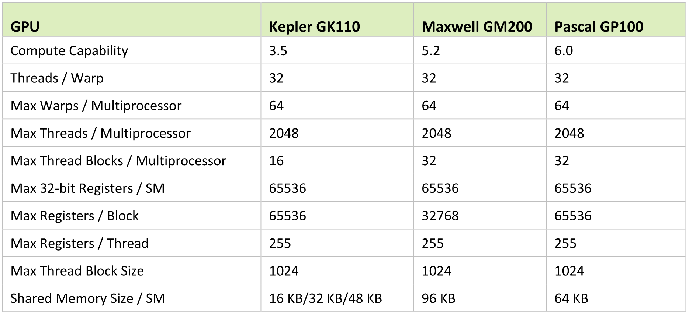

**Table 2.** Compute Capabilities: GK110 vs GM200 vs GP100

### 3.9 Tesla P100: World's First GPU with HBM2

As the use of GPUs to accelerate compute applications has risen greatly in recent years, so has the appetite for data in many of those applications. Much larger problems are being solved by GPUs, requiring much larger datasets and higher demand for DRAM bandwidth. To address this demand for higher raw bandwidth, Tesla P100 is the first GPU accelerator to use High Bandwidth Memory 2 (HBM2). HBM2 enables a significant boost in DRAM bandwidth by fundamentally changing the way the DRAMs are packaged and connected to the GPU.

Rather than requiring numerous discrete memory chips surrounding the GPU as in traditional GDDR5 GPU board designs, HBM2 includes one or more vertical stacks of multiple memory dies. The memory dies are linked using microscopic wires that are created with through-silicon vias and microbumps. One 8 Gb HBM2 die contains over 5,000 through-silicon via holes. A passive silicon interposer is then used to connect the memory stacks and the GPU die. The combination of HBM2 stack, GPU die, and Silicon interposer are packaged in a single 55mm x 55mm BGA package. See [Figure 9](#figure-09) for an illustration of the GP100 and two HBM2 stacks, and [Figure 10](#figure-10) for a photomicrograph of an actual P100 with GPU and memory.

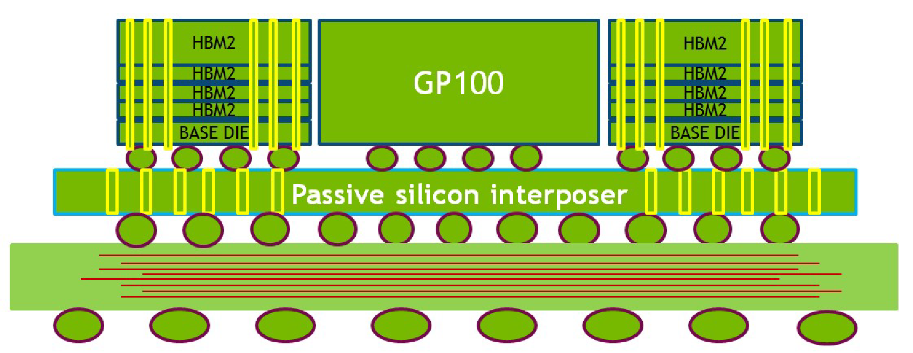

**Figure 9.** Cross-section Illustrating GP100 adjacent HBM2 stacks

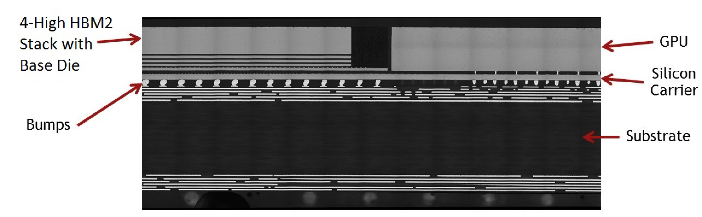

**Figure 10.** Cross-section Photomicrograph of a P100 HBM2 stack and GP100 GPU

The photomicrograph in [Figure 10](#figure-10) shows a cross-section of a Tesla P100 HBM2 stack and the GP100 GPU. The HBM2 stack in the upper left is built out of five die—a base die and 4 memory die above it. The top memory die layer is very thick. When assembled, the top die and GPU are ground to the same height to present a coplanar surface for a heat sink.

Compared to the prior HBM1 generation, HBM2 offers higher memory capacity and memory bandwidth. HBM2 supports four or eight DRAM dies per stack, while HBM1 only supports four DRAM dies per stack. HBM2 supports up to 8 Gb per DRAM die, while HBM1 supports only 2 Gb per die. Where HBM1 was limited to 125 GB/sec of bandwidth per stack, P100 supports 180GB/sec per stack with HBM2.

As shown in the GP100 full-chip block diagram ([Figure 7](#figure-07)), the GP100 GPU connects to four HBM2 DRAM stacks. Two 512-bit memory controllers connect to each HBM2 stack for an effective 4096-bit-wide HBM2 memory interface. Initially, Tesla P100 accelerators will ship with four 4-die HBM2 stacks, for a total of 16 GB of HBM2 memory.

#### 3.9.1 Memory Resilience

Another benefit of HBM2 memory is native support for error correcting code (ECC) functionality. ECC provides higher reliability for compute applications that are sensitive to data corruption. It is especially important in large-scale cluster computing environments where GPUs process very large datasets and/or run applications for extended periods.

ECC technology detects and corrects single-bit soft errors before they affect the system. In comparison, GDDR5 does not provide internal ECC protection of the contents of memory and is limited to error detection of the GDDR5 bus only. Errors in the memory controller or the DRAM itself are not detected.

GK110 Kepler GPUs offered ECC protection for GDDR5 by allocating some of the available memory for explicit ECC storage. 6.25% of the overall GDDR5 is reserved for ECC bits. In the case of a 12 GB Tesla K40 (for example), 750 MB of its total memory was reserved for ECC operation, resulting in 11.25 GB (out of 12 GB) of available memory with ECC turned on for Tesla K40. Also, accessing ECC bits caused a decrease in memory bandwidth of 12-15% on typical workloads, compared to the non-ECC case. Since HBM2 supports ECC natively, Tesla P100 does not suffer from the capacity overhead, and ECC can be active at all times without a bandwidth penalty. Like the GK110 GPU, the GP100 GPU's register files, shared memories, L1 cache, L2 cache, and the Tesla P100 accelerator's HBM2 DRAM are protected by a Single-Error Correct Double-Error Detect (SECDED) ECC code.

### 3.10 Tesla P100 Design

One of the most exciting new features of the Tesla P100 system architecture is its new board design that houses the GP100 GPU and HBM2 memory stacks, and also provides NVLink and PCIe connectivity. One or more P100 accelerators can be used in workstations, servers, and large-scale computing systems. The P100 accelerator is 140mm x 78mm and includes high-efficiency voltage regulators that supply the various required voltages to the GPU. The P100 is rated to 300W.

[Figure 11](#figure-11) shows the front of the Tesla P100 Accelerator and [Figure 12](#figure-12) shows the back.

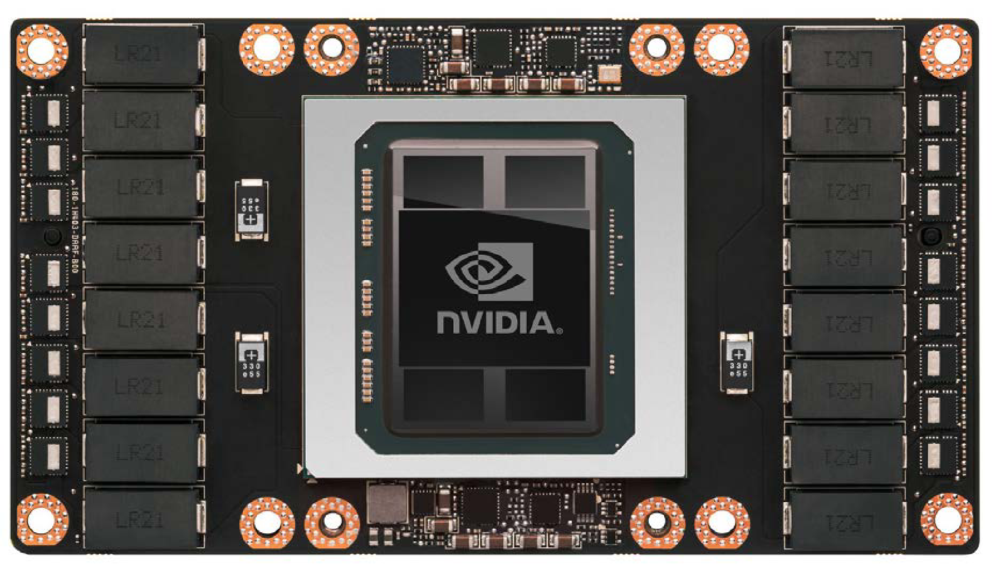

**Figure 11.** Tesla P100 Accelerator (Front)

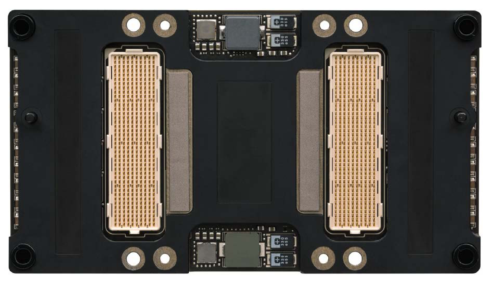

**Figure 12.** Tesla P100 Accelerator (Back)

## 4 NVLink High Speed Interconnect

NVLink is NVIDIA's new high-speed interconnect technology for GPU-accelerated computing. NVLink is currently implemented in Tesla P100 accelerator boards and Pascal GP100 GPUs, and it significantly increases performance for both GPU-to-GPU communications and for GPU access to system memory.

Multiple GPUs are commonly used in the nodes of high-performance computing clusters. Up to eight GPUs per node is typical today, and in multiprocessing systems, a powerful interconnect is extremely valuable. Our vision with NVLink was to create an interconnect for GPUs that would offer much higher bandwidth than PCI Express Gen 3 (PCIe), and be compatible with the GPU ISA to support shared memory multiprocessing workloads.

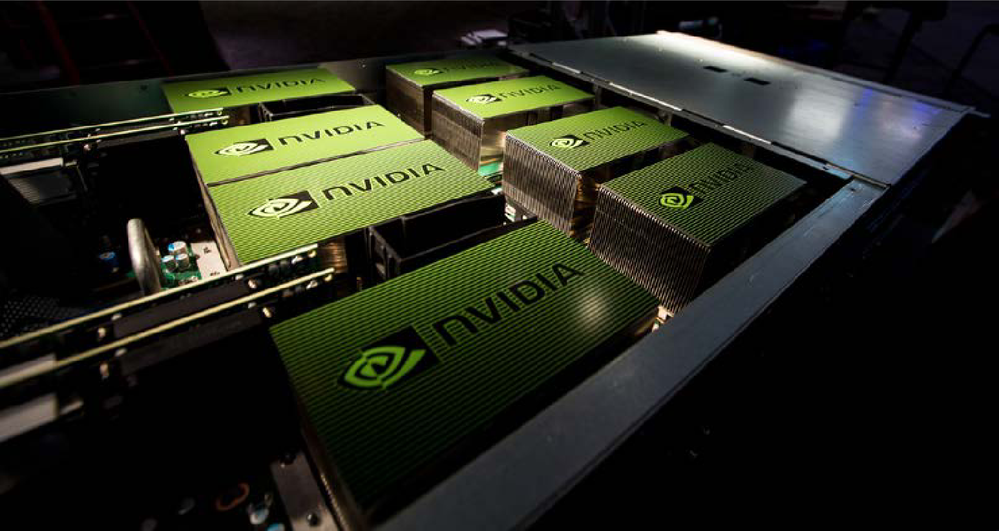

**Figure 13.** NVIDIA DGX-1 with Eight NVIDIA Tesla P100 GPUs

With NVLink-connected GPUs, programs can execute directly on memory that is attached to another GPU as well as on local memory, and the memory operations remain correct (for example providing full support for Pascal's atomic operations).

NVLink uses NVIDIA's new High-Speed Signaling interconnect (NVHS). NVHS transmits data over a differential pair running at up to 20 Gb/sec. Eight of these differential connections form a Sub-Link that sends data in one direction, and two sub-links—one for each direction—form a Link that connects two processors (GPU-to-GPU or GPU-to-CPU). A single Link supports up to 40 GB/sec of bidirectional bandwidth between the endpoints. Multiple Links can be combined to form Gangs for even higher-bandwidth connectivity between processors. The NVLink implementation in Tesla P100 supports up to four Links, enabling ganged configurations with aggregate maximum bidirectional bandwidth of 160 GB/sec, as shown in [Figure 14](#figure-14) and [Figure 15](#figure-15).

### 4.1 NVLink Configurations

Numerous topologies are possible, and different configurations can be optimized for different applications. In this section, we discuss the following NVLink configurations:

- GPU-to-GPU NVLink Connectivity
- CPU-to-GPU NVLink Connectivity

#### 4.1.1 GPU-to-GPU NVLink Connectivity

[Figure 14](#figure-14) shows an 8-GPU Hybrid Cube Mesh that includes two fully NVLink-connected quads of GPUs, with NVLink connections between the quads, and GPUs within each quad connected to their respective CPUs directly through PCIe. By using separate NVLink connections to span the gap between the two quads, it relieves pressure on the PCIe uplink to each CPU, and likewise avoids routing transfers through system memory and over an inter-CPU link.

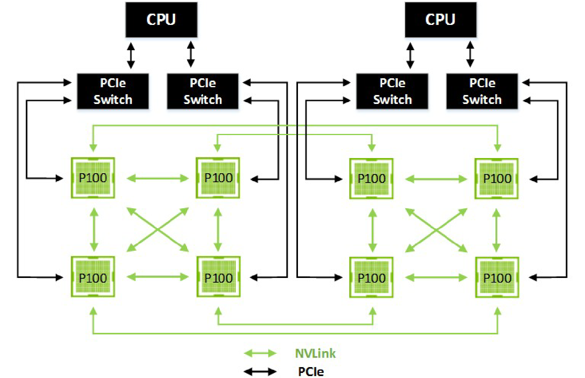

**Figure 14.** Eight GPU Hybrid Cube Mesh Architecture

Note that each half of the 8-GPU Hybrid Cube Mesh can operate as a shared memory multiprocessor, while the remote nodes can also share memory with DMA through peers. With all GPU-to-GPU traffic flowing over NVLINK, PCIe is now entirely available for either connection to a NIC (not shown) or for accessing system memory traffic. This configuration will be commonly recommended for general-purpose Deep Learning applications and is implemented in NVIDIA's new DGX-1 server.

[Figure 15](#figure-15) shows a four-GPU cluster with each of the GPUs connected to each of its peers with a single NVLink. In this case, peers can communicate at 40 GB/sec bidirectionally (80GB/sec bidirectional bandwidth for the double links), enabling robust data sharing between the GPUs.

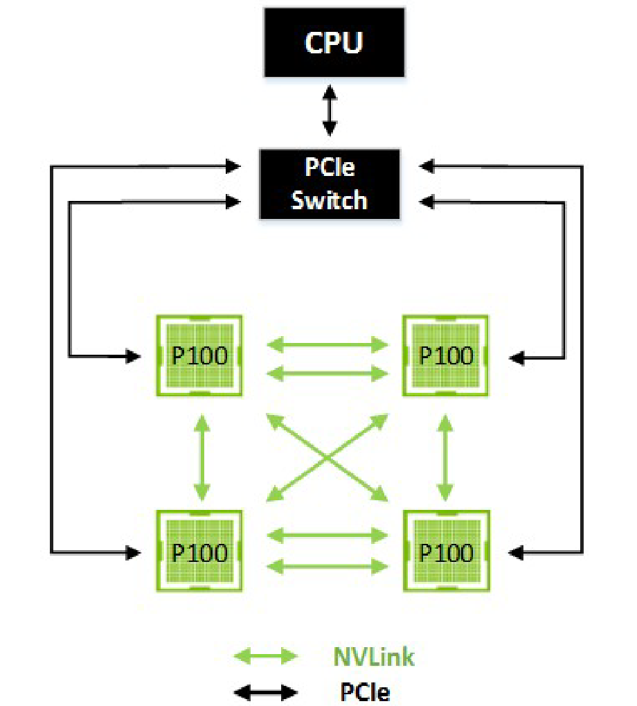

**Figure 15.** NVLink Connecting Four GPUs with the CPU Connected Using PCIe

#### 4.1.2 CPU-to-GPU NVLink Connectivity

While NVLink primarily focuses on connecting multiple NVIDIA Tesla P100 accelerators together, it is also possible to use as a CPU-to-GPU interconnect. For example, Tesla P100 accelerators can connect to IBM's POWER8 with NVIDIA NVLink technology. POWER8 with NVLink™ supports four NVLinks.

[Figure 16](#figure-16) shows a single GPU connected to an NVLink-enabled CPU. In this case, the GPU can access system memory at up to 160 GB/sec bidirectional bandwidth—5x higher bandwidth than available over PCIe.

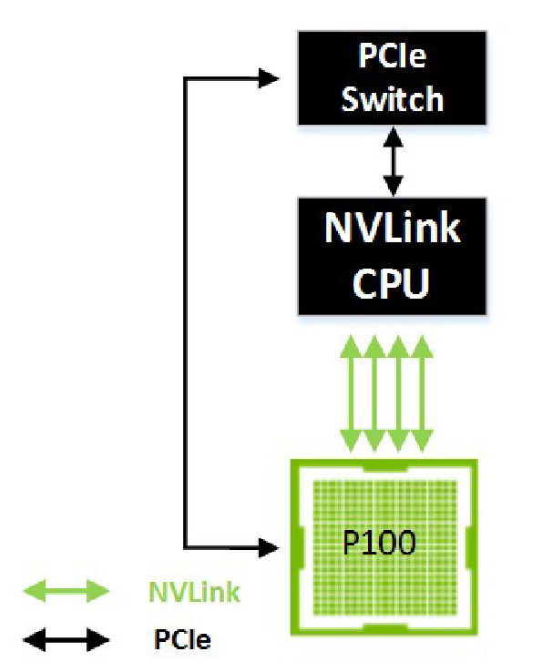

**Figure 16.** NVLink GPU-to-CPU Interconnect

[Figure 17](#figure-17) shows a system with two NVLinks from the CPU to each GPU. The remaining two links on each GPU are used for peer-to-peer communication.

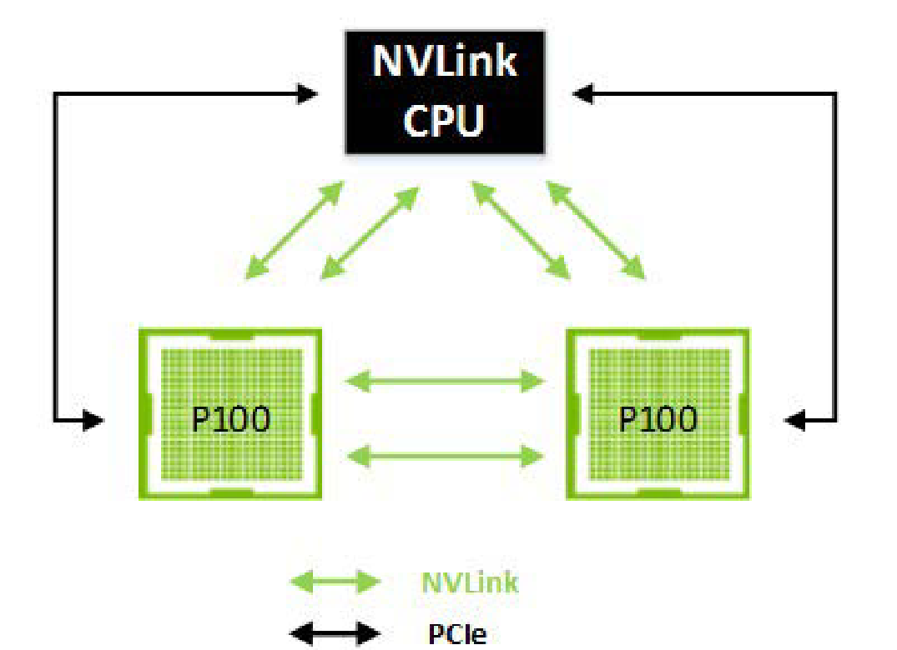

**Figure 17.** Two GPUs and a CPU Connected with 80 GB/sec Bidirectional Bandwidth

### 4.2 NVLink Interface to the Tesla P100

As described in the Tesla P100 Design section, NVLink interconnections are included on the P100 accelerator. The P100 includes two 400-pin high speed connectors. One of these connectors is used for the NVLink signals on/off the module; the other is used to supply power, control signals and PCIe I/O.

The Tesla P100 accelerator can be installed into a larger GPU carrier or system board. The GPU carrier makes the appropriate connections to other P100 accelerators or PCIE controllers. Because of the smaller size of the P100 accelerator compared to traditional GPU boards, customers can easily build servers that are packed with more GPUs than ever before. With the added bandwidth provided by NVLink, GPU-to-GPU communications will not be bottlenecked by the limitations of PCIe bandwidth, enabling previously unavailable opportunities for GPU clustering.

At the level of the GPU architectural interface, the NVLink controller communicates with the GPU internals through another new block called the High-Speed Hub (HSHUB). The HSHUB has direct access to the GPU-wide crossbar and other system elements, such as the High-Speed Copy Engines (HSCE). which can be used to move data into and out of the GPU at peak NVLink rates. [Figure 18](#figure-18) shows how NVLink relates to HSHUB and some of the higher level blocks in a GP100 GPU.

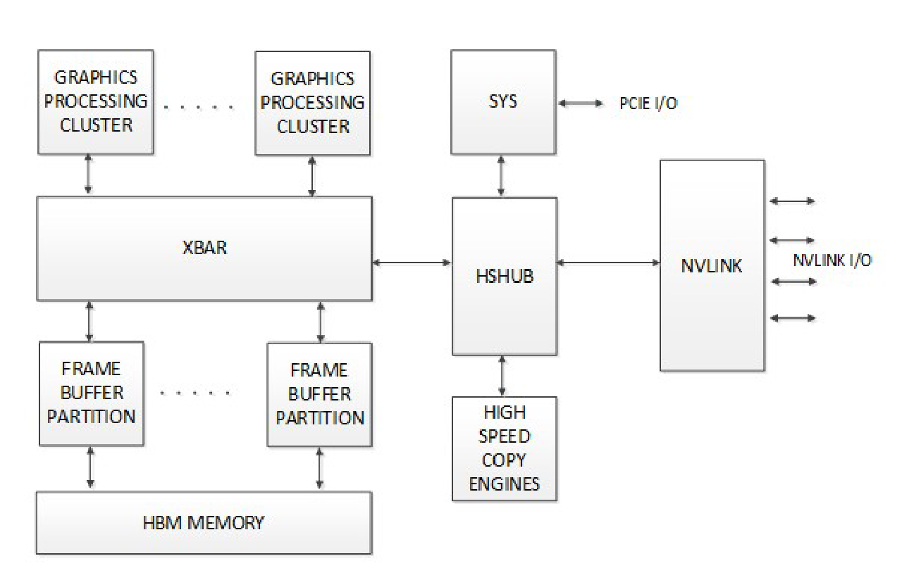

**Figure 18.** NVLink relationship to other major blocks in GP100

For more details, see [Section 9](#section-9).

## 5 Unified Memory

Unified Memory is an important feature of the CUDA programming model that greatly simplifies programming and porting of applications to GPUs by providing a single, unified virtual address space for accessing all CPU and GPU memory in the system. New Pascal GP100 features provide a significant advancement for GPU computing by expanding the capabilities and improving the performance of Unified Memory.

The key to high performance on modern processors is to ensure that the hardware computational units have fast, direct access to data. Over the years, NVIDIA has continuously improved and simplified GPU memory accesses and data sharing so that GPU programmers can focus more on building parallel applications and less on managing memory allocations and data transfers between GPU and CPU.

For many years, in a typical PC or cluster node, the memories of the CPU and each GPU have been physically distinct and separated by an interconnect bus, typically PCIe. In early versions of CUDA, GPU programmers had to explicitly manage CPU and GPU memory allocations and data transfers. This was challenging because any data shared between the CPU and GPU required two allocations, one in system memory and one in GPU memory. The programmer had to use explicit memory copy calls to move the most up-to-date data between them. Keeping the data in the right place at the right time added complexity to applications and increased the learning curve for new GPU programmers.

Explicit data transfers can also cost performance in the case of sparse memory access—for example, copying a whole array back to the GPU after only a few random bytes are written by the CPU adds transfer latency overhead. Managing memory transfers, improving memory locality, and using techniques such as asynchronous memory copies can improve performance, but these all require more care in programming.

### 5.1 Unified Memory History

The NVIDIA Fermi GPU architecture, introduced in 2009, implemented a unified GPU address space spanning the three main GPU memory spaces (thread private local memory, thread block shared memory, and global memory). This unified address space only applied to GPU memory addressing, and mainly resulted in simpler compilation by enabling a single load/store instruction and pointer address to access any of the GPU memory spaces (global, local, or shared memory), rather than different instructions and pointers for each. This also enabled full C and C++ pointer support, which was a significant advancement at the time.

In 2011, CUDA 4 introduced Unified Virtual Addressing (UVA) to provide a single virtual memory address space for both CPU and GPU memory and enable pointers to be accessed from GPU code no matter where in the system they reside, whether in GPU memory (on the same or a different GPU), CPU memory, or on-chip shared memory. UVA enables Zero-Copy memory, which is pinned CPU memory accessible by GPU code directly, over PCIe, without a memcpy. Zero-Copy provides some of the convenience of Unified Memory, but none of the performance, because it is always accessed by the GPU with PCIe's low bandwidth and high latency.

CUDA 6 introduced Unified Memory, which creates a pool of managed memory that is shared between the CPU and GPU, bridging the CPU-GPU divide. Managed memory is accessible to both the CPU and GPU using a single pointer. The CUDA system software automatically migrates data allocated in Unified Memory between GPU and CPU, so that it looks like CPU memory to code running on the CPU, and like GPU memory to code running on the GPU. But CUDA 6 Unified Memory was limited by the features of the Kepler and Maxwell GPU architectures: All managed memory touched by the CPU had to be synchronized with the GPU before any kernel launch. The CPU and GPU could not simultaneously access a managed memory allocation and the Unified Memory address space was limited to the size of the GPU physical memory.

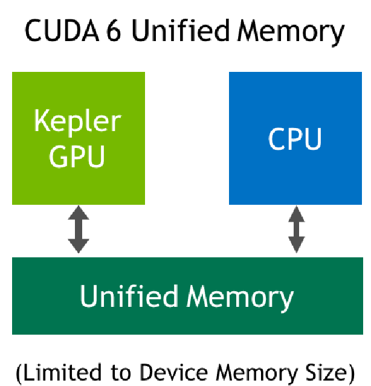

**Figure 19.** CUDA 6 Unified Memory

[Figure 20](#figure-20) shows an example of how Unified Memory in CUDA 6 simplifies porting of code to the GPU by providing a single pointer to data, making explicit CPU-GPU memory copies an optimization rather than a requirement.

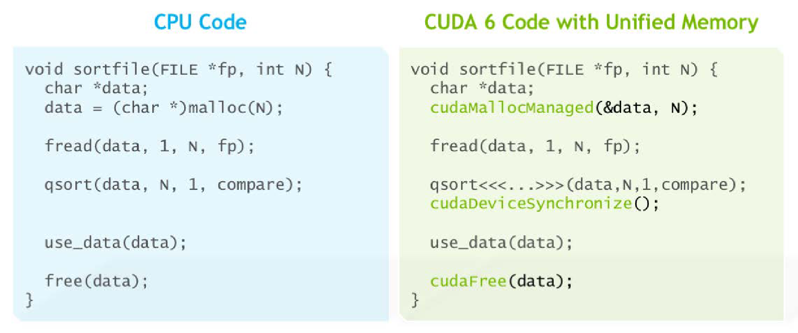

**Figure 20.** CUDA 6 Unified Memory Simplifies Porting Code to the GPU

(This is done by providing a new managed memory allocator that returns a pointer to data that can be accessed from either CPU or GPU code.)

### 5.2 Pascal GP100 Unified Memory

Expanding on the benefits of CUDA 6 Unified Memory, Pascal GP100 adds features to further simplify programming and sharing of memory between CPU and GPU, and allowing easier porting of CPU parallel compute applications to use GPUs for tremendous speedups. Two main hardware features enable these improvements: support for large address spaces and page faulting capability.

GP100 extends GPU addressing capabilities to enable 49-bit (512 TB) virtual memory addressing (note that GP100 also supports 47-bit (128 TB) physical memory addressing). This is large enough to cover the 48-bit virtual address spaces of modern CPUs, as well as the GPU's own memory. This allows GP100 Unified Memory programs to access the full address spaces of all CPUs and GPUs in the system as a single virtual address space, unlimited by the physical memory size of any one processor (see [Figure 21](#figure-21)).

Memory page faulting support in GP100 is a crucial new feature that provides more seamless Unified Memory functionality. Combined with the system-wide virtual address space, page faulting provides several benefits. First, page faulting means that the CUDA system software does not need to synchronize all managed memory allocations to the GPU before each kernel launch. If a kernel running on the GPU accesses a page that is not resident in its memory, it faults, allowing the page to be automatically migrated to the GPU memory on-demand. Alternatively, the page may be mapped into the GPU address space for access over the PCIe or NVLink interconnects (mapping on access can sometimes be faster than migration). Note that Unified Memory is system-wide: GPUs (and CPUs) can fault and migrate memory pages either from CPU memory or from the memory of other GPUs in the system.

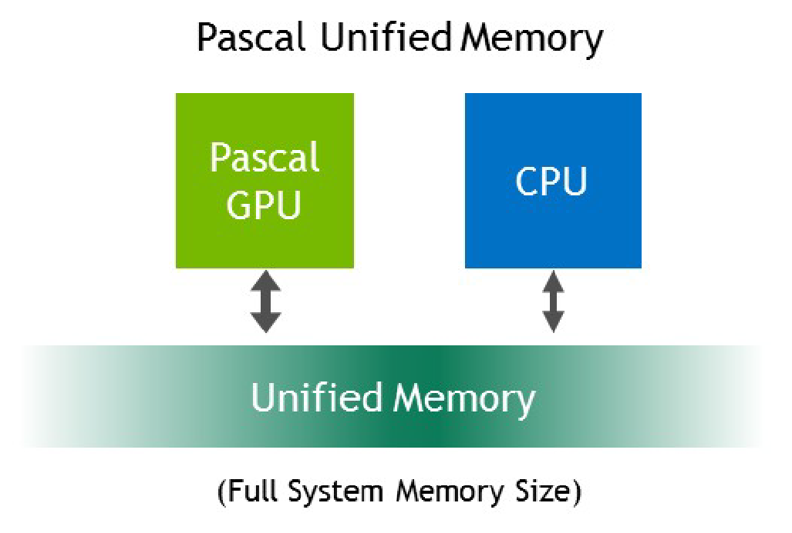

**Figure 21.** Pascal GP100 Unified Memory is not Limited by the Physical Size of GPU Memory.

With the new page fault mechanism, global data coherency is guaranteed with Unified Memory. This means that with GP100, the CPUs and GPUs can access Unified Memory allocations without any programmer synchronization. This was illegal on Kepler and Maxwell GPUs because coherency could not be guaranteed if the CPU accessed a Unified Memory allocation while a GPU kernel was active.

> **Note:** As with any parallel application, developers need to ensure correct synchronization to avoid data hazards between processors.

Finally, on supporting operating system platforms, memory allocated with the default OS allocator (for example, malloc or new) can be accessed from both GPU code and CPU code using the same pointer (see [Figure 22](#figure-22)). On these systems, Unified Memory can be the default: there is no need to use a special allocator or for the creation of a special managed memory pool. Moreover, GP100's large virtual address space and page faulting capability enable applications to access the entire system virtual memory. This means that applications are permitted to oversubscribe the memory system: in other words they can allocate, access, and share arrays larger than the total physical capacity of the system, enabling out-of-core processing of very large datasets.

Certain operating system modifications are required to enable Unified Memory with the system allocator. NVIDIA is collaborating with Red Hat and working within the Linux community to enable this powerful functionality.

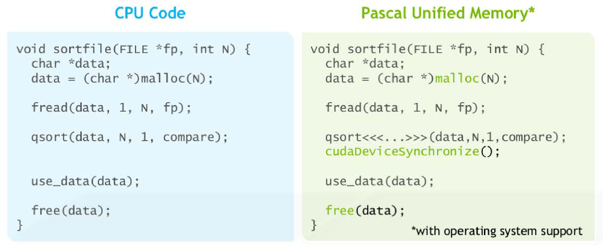

**Figure 22.** With Operating System Support, Pascal is Capable of Supporting Unified Memory with the Default System Allocator.

(Here, malloc is all that is needed to allocate memory accessible from any CPU or GPU in the system.)

### 5.3 Benefits of Unified Memory

There are two main ways that programmers benefit from Unified Memory.

- Simpler programming and memory model. Unified Memory lowers the bar of entry to parallel programming on GPUs by making explicit device memory management an optimization, rather than a requirement. Unified Memory lets programmers focus on developing parallel code without getting bogged down in the details of allocating and copying device memory. This makes it easier to learn to program GPUs and simpler to port existing code to the GPU.
- But it is not just for beginners; Unified Memory also makes complex data structures and C++ classes much easier to use on the GPU. On systems that support Unified Memory with the default system allocator, any hierarchical or nested data structure can automatically be accessed from any processor in the system. With GP100, applications can operate out-of-core on data sets that are larger than the total memory size of the system.
- Performance through data locality. By migrating data on demand between the CPU and GPU, Unified Memory can offer the performance of local data on the GPU, while providing the ease of use of globally shared data. The complexity of this functionality is kept under the covers of the CUDA driver and runtime, ensuring that application code is simpler to write. The point of migration is to achieve full bandwidth from each processor; the high HBM2 memory bandwidth is vital to feeding the compute throughput of a GP100 GPU. With page faulting on GP100, locality can be ensured even for programs with sparse data access, where the pages accessed by the CPU or GPU cannot be known ahead of time, and where the CPU and GPU access parts of the same array allocations simultaneously.

An important point is that CUDA programmers still have the tools they need to explicitly optimize data management and CPU-GPU concurrency where necessary: CUDA 8 will introduce useful APIs for providing the runtime with memory usage hints and for explicit prefetching. These tools allow the same capabilities as explicit memory copy and pinning APIs, without reverting to the limitations of explicit GPU memory allocation.

## 6 Compute Preemption

The new Pascal GP100 Compute Preemption feature allows compute tasks running on the GPU to be interrupted at instruction-level granularity, and their context swapped to GPU DRAM. This permits other applications to be swapped in and run, followed by the original task's context being swapped back in to continue execution where it left off.

Compute Preemption solves the important problem of long-running or ill-behaved applications that can monopolize a system, causing the system to become unresponsive while it waits for the task to complete, possibly resulting in the task timing out and/or being killed by the OS or CUDA driver. Before Pascal, on systems where compute and display tasks were run on the same GPU, long-running compute kernels could cause the OS and other visual applications to become unresponsive and non-interactive until the kernel timed out. Because of this, programmers had to either install a dedicated compute-only GPU or carefully code their applications around the limitations of prior GPUs, breaking up their workloads into smaller execution timeslices so they would not time out or be killed by the OS.

Indeed, many applications do require long-running processes, and with Compute Preemption in GP100, those applications can now run as long as they need when processing large datasets or waiting for specific conditions to occur, while visual applications remain smooth and interactive—but not at the expense of the programmer struggling to get code to run in small timeslices.

Compute Preemption also permits interactive debugging of compute kernels on single-GPU systems. This is an important capability for developer productivity. In contrast, the Kepler GPU architecture only provided coarser-grained preemption at the level of a block of threads in a compute kernel. This block-level preemption required that all threads of a thread block complete before the hardware can context switch to a different context. However when using a debugger and a GPU breakpoint was hit on an instruction within the thread block, the thread block was not complete, preventing block-level preemption. While Kepler and Maxwell were still able to provide the core functionality of a debugger by adding instrumentation during the compilation process, GP100 is able to support a more robust and lightweight debugger implementation.

## 7 NVIDIA DGX-1 Deep Learning Supercomputer

Data scientists and artificial intelligence researchers require accuracy, simplicity, and speed from their Deep Learning systems. Faster training and iteration ultimately means faster innovation and faster time to market. The NVIDIA DGX-1 is the world's first purpose-built server for Deep Learning, with fully integrated hardware and software that can be deployed quickly and easily. Its' revolutionary performance of up to 170 FP16 TFLOPS significantly accelerates training time, making the NVIDIA DGX-1 the first AI supercomputer in a box.

The NVIDIA DGX-1 server is the first server using Tesla P100 accelerators interconnected with NVLink. Available in an eight (8) Tesla P100 accelerator configuration, the DGX-1 system is built with high performance/high reliability components in a 3U rack-mountable chassis for standalone use or cluster integration.

The 8-GPU configuration features two NVLink fully-connected P100 GPU quads that are tied together by four additional NVLinks in a Hybrid Cube Mesh topology as seen in [Figure 14](#figure-14). Every GPU in a quad is also directly connected via PCIe to a PCIe switch that connects to a CPU.

Combining powerful hardware with software tailored to Deep Learning, the NVIDIA DGX-1 (see [Figure 23](#figure-23)) enables developers and researchers with a turnkey solution for high-performance GPU-accelerated Deep Learning application development, testing, and network training.

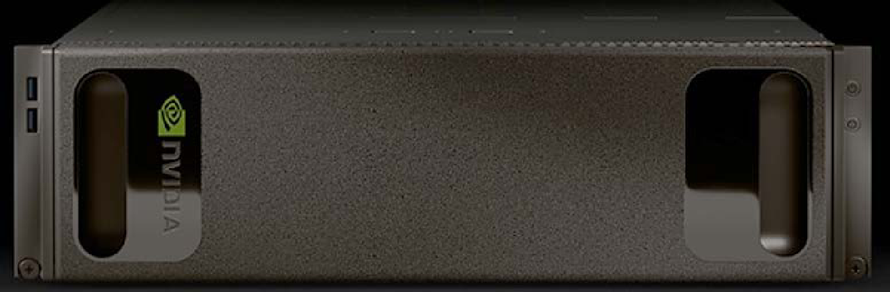

**Figure 23.** NVIDIA DGX-1 Server

### 7.1 250 Servers in a Box

[Table 3](#table-03) shows Alexnet training time on a Dual Xeon system compared to the DGX-1 server. As you can see, the raw processing power of DGX-1 far surpasses the Dual Xeon in both raw TFLOPS and aggregate node bandwidth. Dual Xeon would require over 250 nodes to train Alexnet in a two hour turn-around-time (TAT) compared to only a single DGX-1 node!

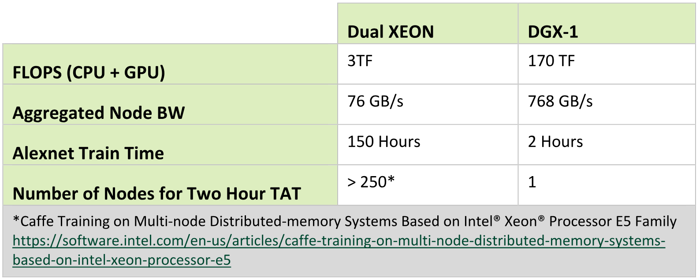

**Table 3.** Alexnet Training Time: Pascal GP100 vs Xeon

### 7.2 12X DNN Speedup in One Year

[Figure 24](#figure-24) compares Pascal DGX-1 and Maxwell DNN speedup over one year on Alexnet.

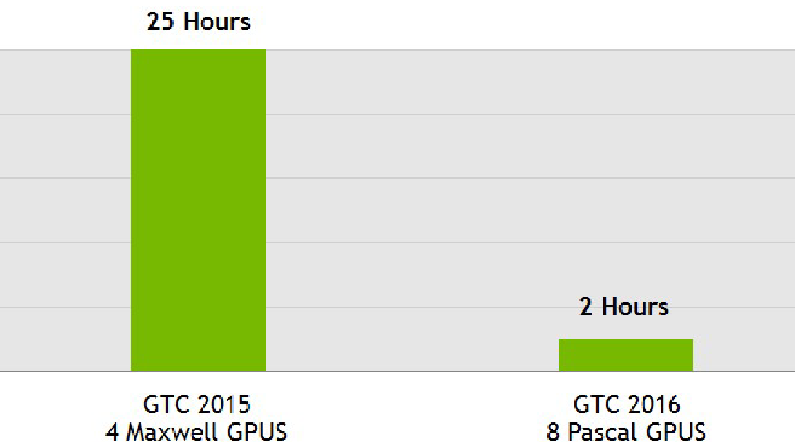

**Figure 24.** Pascal DGX-1 vs Maxwell DNN Speedup Over One Year Since NVIDIA's Last GTC Event

### 7.3 DGX-1 Software Features

The DGX-1 Base OS software empowers users to get started with Deep Learning quickly with minimal effort. Based on an industry standard Linux distribution tuned for GPUs, the DGX-1 software stack includes CUDA 8.0 and the latest release of NVIDIA's Deep Learning SDK, so Deep Learning applications can tap into the high performance features of the Tesla P100 to accelerate all the major Deep Learning frameworks and the applications that use them.

### 7.4 NVIDIA DGX-1 System Specifications

The NVIDIA DGX-1 is the world's first purpose-built server for Deep Learning with fully integrated hardware and software that can be deployed quickly and easily. Its revolutionary performance significantly accelerates training time, making the NVIDIA DGX-1 the first AI supercomputer in a box. [Table 4](#table-04) lists the NVIDIA DGX-1 system specifications.

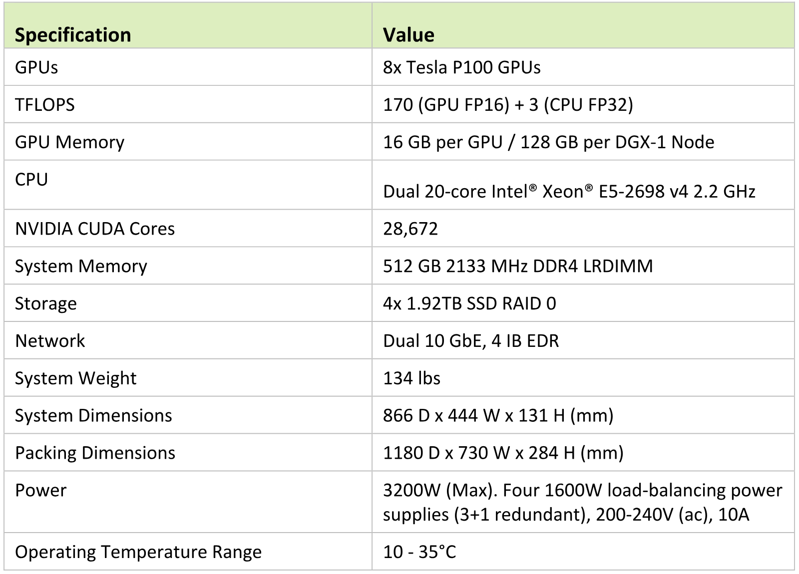

**Table 4.** NVIDIA DGX-1 System Specifications

## 8 Conclusion

NVIDIA's new NVIDIA Tesla P100 GPU accelerator build with Pascal architecture brings together breakthroughs that will enable customers to compute problems previously impossible to solve. From top to bottom, NVIDIA Tesla P100 has amazing innovations—compute performance, memory bandwidth, capacity, connectivity, and power efficiency—required to be the computational engine for next-generation HPC and AI systems.

## 9 Appendix A: NVLink Signaling and Protocol Technology

NVLink uses NVIDIA's High Speed Signaling technology (NVHS). Data is sent differentially at 20 Gbit/sec per signal pair. Eight differential pairs in each direction are combined to form a single link. This is the basic building block. A single link has a raw bidirectional bandwidth of 40 GB/sec. Signaling is NRZ (Non-Return-to-Zero). The link is DC-coupled and has a differential impedance of 85 Ohms. Links can tolerate polarity inversion and lane reversal to support effective PCB routing. On die, data is sent from the PHY (physical level circuit) to the NVLink controller using a 128-bit Flit (Flow control digit) at 1.25GHz data rate. NVHS uses an embedded clock. At the receiver, the recovered clock is used to capture the incoming data.

### 9.1 NVLink Controller Layers

The NVLink controller consists of three layers—the Physical Layer (PL), Data Link Layer (DL), and Transaction Layer (TL). The protocol uses a variable length packet with packet sizes ranging from 1 (simple read request command for example) to 18 (write request with data for 256B data transfer with address extension) flits. [Figure 25](#figure-25) shows the NVLink Layers and Links; Physical Layer (PHY), Data Link Layer (DL), Transaction Layer (TL).

#### 9.1.1 Physical Layer (PL)

The PL interfaces with the PHY. The PL is responsible for deskew (across all eight lanes), framing (figuring out the start of each packet), scrambling/descrambling (to ensure adequate bit transition density to support clock recovery), polarity inversion, lane reversal and for delivering the received data to the Data Link Layer. [Figure 25](#figure-25) shows the NVLink Layers and Links; Physical Layer (PHY), Data Link Layer (DL), Transaction Layer (TL).

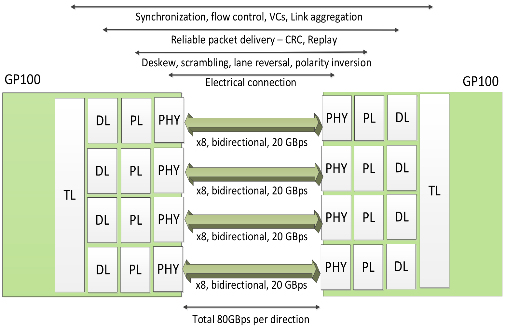

**Figure 25.** NVLink Layers and Links; Physical Layer (PHY), Data Link Layer (DL), Transaction Layer (TL)

#### 9.1.2 Data Link Layer (DL)

The Data Link Layer is primarily responsible for reliable transmission of packets across the link. Packets to be transmitted are protected using a 25-bit CRC (Cyclic Redundancy Check). The transmitted packets are stored in a replay buffer until they have been positively acknowledged (ACK) by the receiver at the other end of the link. If the DL detects a CRC error on an incoming packet, it does not send an ACK, and prepares for reception of the retransmitted data. The transmitter meanwhile, in the absence of an ACK, times-out and initiates data retransmission from the replay buffer. A packet is retired from the replay buffer only when it has been acknowledged. The 25-bit CRC allows detection of up to 5 random bit errors or up to 25-bit bursts of errors on any lane. The CRC is calculated over the current header and the previous payload (if any).

The DL is also responsible for link bring-up and maintenance. The DL sends data on to the Transaction Layer (TL).

#### 9.1.3 Transaction Layer

The Transaction Layer handles synchronization, link flow control, virtual channels, and can aggregate multiple links together to provide very high communication bandwidth between processors.

## 10 Appendix B: Accelerating Deep Learning and Artificial Intelligence with GPUs

The holy grail of computing is artificial intelligence: building a machine so intelligent, it can learn on its own without explicit instruction. Deep learning is a critical ingredient to achieving modern AI.

Deep learning allows the AI brain to perceive the world around it; the machine learns and ultimately makes decisions by itself. It takes massive amounts of data to train the machine to do this. In addition, highly sophisticated deep neural networks are needed to process it all. In 2012, Google's Deep Learning project, Google Brain, learned to recognize cats by watching movies on YouTube. But it required 2,000 CPUs (16,000 CPU cores) in servers powered and cooled in one of Google's data centers to do this. Few organizations have machines of this scale. Around the same time, NVIDIA Research teamed with Stanford University to use GPUs for Deep Learning. As it turned out, 12 NVIDIA GPUs could deliver the deep-learning performance of 2,000 CPUs.

Many say the beginning of the Deep Learning revolution was the 2012 ImageNet competition entry by Krizhevsky, Sutskever, and Hinton using a convolutional neural network now referred to as “AlexNet”, which used the parallel processing performance of GPUs and outperformed the entire conventional computer vision competition by a large margin. This was a milestone event in the history of artificial intelligence and Deep Learning. Krizhevsky and his team wrote no computer vision code. Rather, using Deep Learning, their computer learned to recognize images by itself. They designed a neural network (AlexNet) and trained it with a million example images that required trillions of math operations on NVIDIA GPUs. Krizhevksy's AlexNet had beaten the best human-coded software.

Since then, one by one, deep neural networks (DNN) running on GPUs have conquered various algorithm domains related to computer vision in particular, and machine perception in general. The potential use cases are endless: From self-driving cars to faster drug development, from automatic image captioning in online image databases to smart real-time language translation in video chat applications, Deep Learning is providing exciting opportunities wherever machines interact with the human world. These days, working with deep neural networks goes hand in hand with the use of GPUs. Deep learning users everywhere achieve dramatically reduced training times by transitioning from CPUs to one or more massively parallel GPU accelerators.

### 10.1 Deep Learning in a Nutshell

Deep Learning is a technique that models the neural learning process of the human brain, continually learning, continually getting smarter, and delivering more accurate results more quickly over time. A child is initially taught by an adult to correctly identify and classify various shapes, eventually being able to identify shapes without any coaching. Similarly, a Deep Learning or neural learning system has to be trained in object recognition and classification for it get smarter and more efficient at identifying basic objects, occluded objects, etc., while also assigning context to objects.

At the simplest level, neurons in the human brain look at various inputs fed into them, importance levels are assigned to each of these inputs, and output is passed on to other neurons to act upon.

The Perceptron as shown in [Figure 26](#figure-26) is the most basic model of a neural network and is akin to a neuron in the human brain. As seen in the image, the Perceptron has several inputs that represent various features of an object that the Perceptron is being trained to recognize and classify, and each of these features is assigned a certain weight based on the importance of that feature in defining the shape of an object.

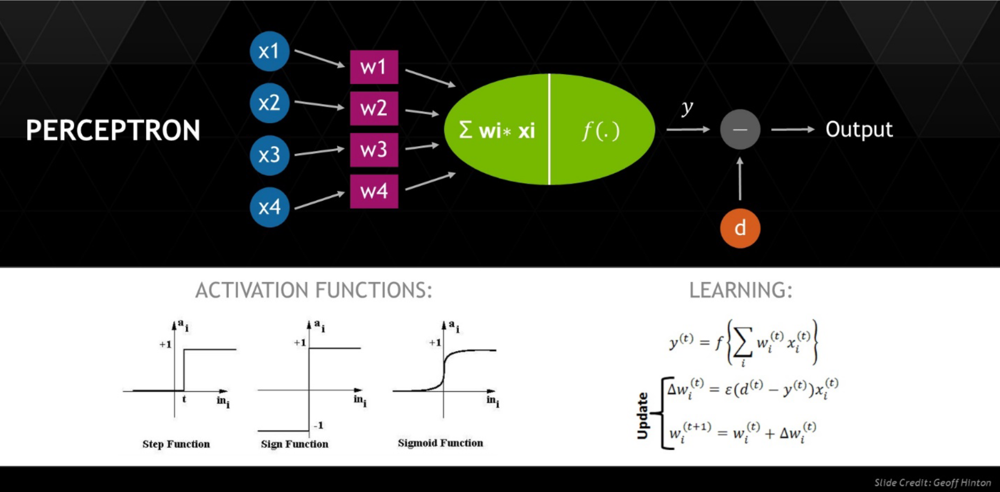

**Figure 26.** The Perceptron is the Simplest Model of a Neural Network

For example, consider a Perceptron that is being trained to identify the number zero that is handwritten. Obviously, the number zero can be written in many different ways based on different handwriting styles. The Perceptron will take the image of the number zero, decompose it into various sections and assign these sections to features x1 through x4. The upper right hand curve in the number zero may be assigned to x1, the lower bottom curve to x2, and so on. The weight associated with a particular feature determines how important that feature is in correctly determining whether the handwritten number is a zero. The green blob at the center of the diagram is where the Perceptron is calculating the weighted sum of all the features in the image to determine whether the number is a zero. A function is then applied on this result to output a true or false value on whether the number is a zero.

The key aspect of a neural network is in training the network to make better predictions. The Perceptron model (shown in [Figure 26](#figure-26)) to detect handwritten zeros is trained by initially assigning a set of weights to each of the features that define the number zero. The Perceptron is then provided with the number zero to check whether it correctly identifies the number. This flow of data through the network until it reaches a conclusion on whether the number is zero or not, is the *forward propagation* phase. If the neural network does not correctly identify the number, then the reason for the incorrect identification needs to be understood, along with the magnitude of the error, and the weights need to be adjusted for each feature until the perceptron correctly identifies a zero. The weights have to be further adjusted until it correctly identifies zeros written in various handwriting styles. This process of feeding back the errors and adjusting the weights of each feature that defines the number zero is called *backward propagation*. The equations shown in the diagram look complex, but are basically mathematical representations of the described training process.

Though the Perceptron is a very simple model of a neural network, advanced multi-layered neural networks based on similar concepts are widely used today. Once a network has been trained to correctly identify and classify the objects, it is deployed in the field, where it will repeatedly run *inference* computations. Examples of inference (the process through which a DNN extracts useful information from a given input) include identifying handwritten numbers on checks deposited into ATM machines, identifying images of friends in Facebook photos, delivering movie recommendations to over fifty million Netflix users, identifying and classifying different types of automobiles, pedestrians, and road hazards in driverless cars, or translating human speech in real-time.

A multi-layered neural network model as shown in [Figure 27](#figure-27) may consist of multiple interconnected complex Perceptron-like nodes, with each node looking at a number of input features, and feeding its output to the next several layers of interconnected nodes.

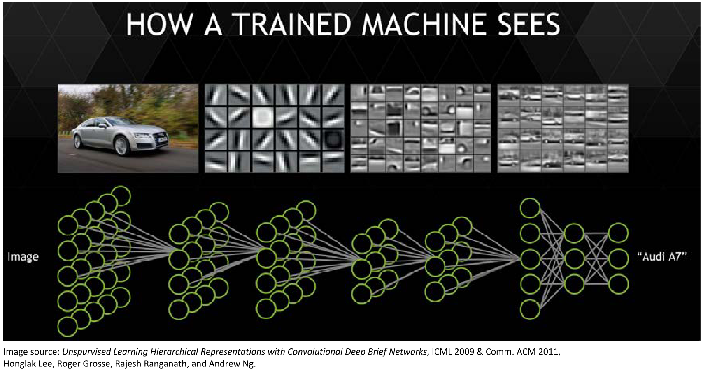

**Figure 27.** Complex Multi-layer Neural Network Models Require Increased Amounts of Compute Power

In the model shown in [Figure 27](#figure-27), the first layer of the neural model breaks down the image into various sections and looks for basic patterns such as lines and angles, the second layer assembles these lines to look for higher level patterns such as wheels, windshields, and mirrors, the next layer identifies the type of vehicle, and the final few layers of the neural model identify the model of a specific brand (which in this case is an Audi A7).

An alternative to a fully connected layer of a neural network is a convolutional layer. A neuron in a convolutional layer is connected to neurons only in a small region in the layer below it. Typically this region might be a 5×5 grid of neurons (or perhaps 7×7 or 11×11). The size of this grid is called the filter size. Thus a convolutional layer can be thought of as performing a convolution on its input. This type of connection pattern mimics the pattern seen in perceptual areas of the brain, such as retinal ganglion cells or cells in the primary visual cortex.

In a DNN convolutional layer, the filter weights are the same for each neuron in that layer. Typically, a convolutional layer is implemented as many “sub layers” each with a different filter. Hundreds of different filters may be used in one convolutional layer. One can think of a DNN convolutional layer as performing hundreds of different convolutions on its input at the same time, with the results of these convolutions available to the next layer up. DNNs that incorporate convolutional layers are called Convolutional Neural Networks (CNNs).

### 10.2 NVIDIA GPUs: The Engine of Deep Learning

State-of-the-art DNNs and CNNs can have from millions to well over one billion parameters to adjust via back-propagation. Furthermore, DNNs require a large amount of training data to achieve high accuracy, meaning hundreds of thousands to millions of input samples will have to be run through both a forward and backward pass.

It is now widely recognized within academia and industry that GPUs are the state of the art in training deep neural networks, due to both speed and energy efficiency advantages compared to more traditional CPU-based platforms. Because neural networks are created from large numbers of identical neurons, they are highly parallel by nature. This parallelism maps naturally to GPUs, which provide a significant speed-up over CPU-only training.

Neural networks rely heavily on matrix math operations and complex multi-layered networks require tremendous amounts of floating point performance and bandwidth for both efficiency and speed. GPUs with their thousands of processing cores, optimized for matrix math operations, and delivering tens to hundreds of TFLOPS of performance, are the obvious computing platform for deep neural network-based artificial intelligence and machine learning applications.

NVIDIA is at the forefront of this exciting GPU driven revolution in DNNs and Artificial Intelligence (AI). NVIDIA GPUs are accelerating DNNs in various applications by a factor of 10x to 20x, reducing training times from weeks to days. By collaborating with experts in this field, we continue to improve our GPU designs, system architecture, compilers and algorithms. In the past three years, NVIDIA GPU-based computing platforms have helped speed up Deep Learning network training times by a factor of fifty.

### 10.3 Tesla P100: The Fastest Accelerator for Training Deep Neural Networks

NVIDIA's latest and most advanced Pascal GPU architecture delivers an order of magnitude higher performance for training deep neural network and significantly reducing training times. Tesla P100 with its 3584 processing cores delivers over 21 TFLOPS of FP16 processing power for Deep Learning applications. Interconnecting eight Tesla P100 accelerators through the high-speed NVLink interconnect significantly increases the available performance to 170 TFLOPS/sec for training highly complex multi-layered DNNs

In addition to key architectural advances such as HBM2 memory, Unified Memory, high-speed NVLink interconnect, larger caches, and lower latency, Tesla P100 also includes features that increase performance for Deep Learning. First introduced in the Maxwell GPU architecture, the Pascal GP100 GPU also includes support for 16-bit storage and arithmetic. Support for 16-bit floating-point (FP16) storage and arithmetic has further improved the performance of neural network algorithms and reduced inference times.

### 10.4 Comprehensive Deep Learning Software Development Kit

AI innovation is on a breakneck pace. Ease of programming and developer productivity is paramount. The programmability and richness of NVIDIA's CUDA platform allow researchers to innovate quickly. NVIDIA provides high-performance tools and libraries such as NVDIA DIGITS™, cuDNN, cuBLAS and others to power innovative GPU-accelerated machine learning applications in the cloud, data centers, workstations, and embedded platforms with the Deep Learning Software Development Kit (SDK). Developers want to create anywhere and deploy everywhere. NVIDIA GPUs are available all over the world, from every PC OEM; in desktops, notebooks, servers, or supercomputers; and in the cloud from major companies like Amazon, Google, IBM, Facebook, Baidu and Microsoft. All major AI development frameworks are NVIDIA GPU accelerated—from Internet companies, to research, to startups. No matter the AI development system preferred, it will be faster with GPU acceleration. We have also created GPUs for just about every computing form-factor so that DNNs can power intelligent machines of all kinds. GeForce is for PC. Tesla is for cloud and supercomputers. Jetson is for robots and drones. And DRIVE PX is for cars. All share the same architecture and accelerate Deep Learning (see [Figure 28](#figure-28)).

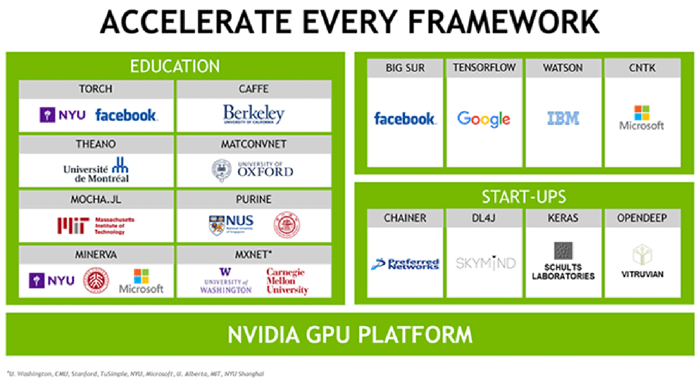

**Figure 28.** Accelerated Frameworks

### 10.5 Big Data Problem Solving with NVIDIA GPUs and DNNs

Baidu, Google, Facebook, Microsoft were among the earliest adopters of NVIDIA GPUs for Deep Learning and AI processing. In fact, AI technology enables these companies to respond to your spoken word, translate speech or text to another language, recognize and automatically tag images, and recommend newsfeeds, entertainment, and products that are tailored to each user. Startups and established companies are now racing to use AI to create new products and services, or improve their operations. In just two years, the number of companies NVIDIA collaborates with on Deep Learning has jumped nearly 35x to over 3,400 companies (see [Figure 29](#figure-29)). Industries such as healthcare, life sciences, energy, financial services, automotive, manufacturing, and entertainment will benefit by inferring insight from mountains of data. And with Facebook, Google, and Microsoft opening their deep-learning platforms for all to use, AI-powered applications will spread fast. In light of this trend, Wired recently heralded the rise of the GPU.

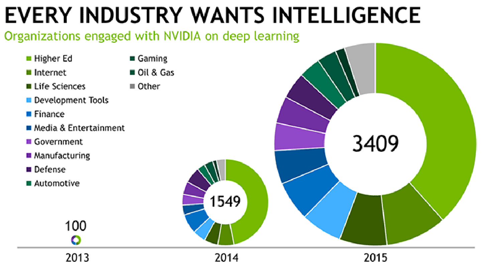

**Figure 29.** Organizations Engaged with NVIDIA on Deep Learning

#### 10.5.1 Self-driving Cars

Whether to augment humans with a superhuman co-pilot, or revolutionize personal mobility services, or reduce the need for sprawling parking lots within cities, self-driving cars have the potential to do amazing social good. Driving is complicated. Unexpected things happen. Freezing rain turns the road into a skating rink. The road to your destination is closed. A child runs out in front of the car. You can't write software that anticipates every possible scenario a self-driving car might encounter. That's the value of Deep Learning; it can learn, adapt, and improve. We are building an end-to-end Deep Learning platform for self-driving cars with NVIDIA DRIVE PX , NVIDIA DriveWorks, and NVIDIA DriveNet (see [Figure 30](#figure-30))—from the training system to the in-car AI computer. The results are very exciting. A future with superhuman computer co-pilots and driverless shuttles is no longer science fiction.

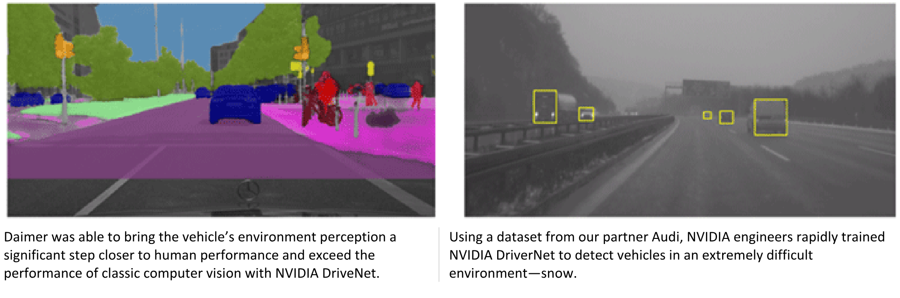

**Figure 30.** NVIDIA DriveNet

#### 10.5.2 Robots

FANUC, a leading manufacturing robot maker, recently demonstrated an assembly-line robot that learned to pick randomly oriented objects out of a bin. The GPU-powered robot learned by trial and error. This deep-learning technology was developed by Preferred Networks, which was recently featured in a The Wall Street Journal article headlined, Japan Seeks Tech Revival with Artificial Intelligence.

#### 10.5.3 Healthcare and Life Sciences

Deep Genomics is applying GPU-based Deep Learning to understand how genetic variations can lead to disease. Arterys uses GPU-powered Deep Learning to speed analysis of medical images. Its technology will be deployed in GE Healthcare MRI machines to help diagnose heart disease. Enlitic is using Deep Learning to analyze medical images to identify tumors, nearly invisible fractures, and other medical conditions.

These are just a handful of examples of how GPUs and DNNs are revolutionizing Artificial Intelligence and machine learning in various fields. There are literally thousands more.

Deep learning breakthroughs are accelerating AI capabilities at many levels, and GPU-accelerated Deep Learning and AI systems and algorithms are enabling exponential progress in the field.

## 11 Notice

ALL INFORMATION PROVIDED IN THIS WHITE PAPER, INCLUDING COMMENTARY, OPINION, NVIDIA DESIGN SPECIFICATIONS, REFERENCE BOARDS, FILES, DRAWINGS, DIAGNOSTICS, LISTS, AND OTHER DOCUMENTS (TOGETHER AND SEPARATELY, “MATERIALS”) ARE BEING PROVIDED “AS IS.” NVIDIA MAKES NO WARRANTIES, EXPRESSED, IMPLIED, STATUTORY, OR OTHERWISE WITH RESPECT TO MATERIALS, AND EXPRESSLY DISCLAIMS ALL IMPLIED WARRANTIES OF NONINFRINGEMENT, MERCHANTABILITY, AND FITNESS FOR A PARTICULAR PURPOSE.

NVIDIA reserves the right to make corrections, modifications, enhancements, improvements, and other changes to this specification, at any time and/or to discontinue any product or service without notice. Customer should obtain the latest relevant specification before placing orders and should verify that such information is current and complete.

NVIDIA products are sold subject to the NVIDIA standard terms and conditions of sale supplied at the time of order acknowledgement, unless otherwise agreed in an individual sales agreement signed by authorized representatives of NVIDIA and customer. NVIDIA hereby expressly objects to applying any customer general terms and conditions with regard to the purchase of the NVIDIA product referenced in this specification.

NVIDIA products are not designed, authorized or warranted to be suitable for use in medical, military, aircraft, space or life support equipment, nor in applications where failure or malfunction of the NVIDIA product can reasonably be expected to result in personal injury, death or property or environmental damage. NVIDIA accepts no liability for inclusion and/or use of NVIDIA products in such equipment or applications and therefore such inclusion and/or use is at customer's own risk.

NVIDIA makes no representation or warranty that products based on these specifications will be suitable for any specified use without further testing or modification. Testing of all parameters of each product is not necessarily performed by NVIDIA. It is customer's sole responsibility to ensure the product is suitable and fit for the application planned by customer and to do the necessary testing for the application in order to avoid a default of the application or the product. Weaknesses in customer's product designs may affect the quality and reliability of the NVIDIA product and may result in additional or different conditions and/or requirements beyond those contained in this specification. NVIDIA does not accept any liability related to any default, damage, costs or problem which may be based on or attributable to: (i) the use of the NVIDIA product in any manner that is contrary to this specification, or (ii) customer product designs.

No license, either expressed or implied, is granted under any NVIDIA patent right, copyright, or other NVIDIA intellectual property right under this specification. Information published by NVIDIA regarding third-party products or services does not constitute a license from NVIDIA to use such products or services or a warranty or endorsement thereof. Use of such information may require a license from a third party under the patents or other intellectual property rights of the third party, or a license from NVIDIA under the patents or other intellectual property rights of NVIDIA. Reproduction of information in this specification is permissible only if reproduction is approved by NVIDIA in writing, is reproduced without alteration, and is accompanied by all associated conditions, limitations, and notices.

ALL NVIDIA DESIGN SPECIFICATIONS, REFERENCE BOARDS, FILES, DRAWINGS, DIAGNOSTICS, LISTS, AND OTHER DOCUMENTS (TOGETHER AND SEPARATELY, “MATERIALS”) ARE BEING PROVIDED “AS IS.” NVIDIA MAKES NO WARRANTIES, EXPRESSED, IMPLIED, STATUTORY, OR OTHERWISE WITH RESPECT TO THE MATERIALS, AND EXPRESSLY DISCLAIMS ALL IMPLIED WARRANTIES OF NONINFRINGEMENT, MERCHANTABILITY, AND FITNESS FOR A PARTICULAR PURPOSE. Notwithstanding any damages that customer might incur for any reason whatsoever, NVIDIA's aggregate and cumulative liability towards customer for the products described herein shall be limited in accordance with the NVIDIA terms and conditions of sale for the product.

### 11.1 VESA DisplayPort

DisplayPort and DisplayPort Compliance Logo, DisplayPort Compliance Logo for Dual-mode Sources, and DisplayPort Compliance Logo for Active Cables are trademarks owned by the Video Electronics Standards Association in the United States and other countries.

### 11.2 HDMI

HDMI, the HDMI logo, and High-Definition Multimedia Interface are trademarks or registered trademarks of HDMI Licensing LLC.

### 11.3 ARM

ARM, AMBA and ARM Powered are registered trademarks of ARM Limited. Cortex, MPCore and Mali are trademarks of ARM Limited. All other brands or product names are the property of their respective holders. “ARM” is used to represent ARM Holdings plc; its operating company ARM Limited; and the regional subsidiaries ARM Inc.; ARM KK; ARM Korea Limited.; ARM Taiwan Limited; ARM France SAS; ARM Consulting (Shanghai) Co. Ltd.; ARM Germany GmbH; ARM Embedded Technologies Pvt. Ltd.; ARM Norway, AS and ARM Sweden AB.

### 11.4 OpenCL

OpenCL is a trademark of Apple Inc. used under license to the Khronos Group Inc.

### 11.5 Trademarks

NVIDIA, the NVIDIA logo, CUDA, FERMI, KEPLER, MAXWELL, PASCAL, TITAN, Tesla, GeForce, NVIDIA DRIVE PX, NVIDIA DriveWorks, and NVIDIA DriveNet, and NVLink are trademarks and/or registered trademarks of NVIDIA Corporation in the U.S. and other countries. Other company and product names may be trademarks of the respective companies with which they are associated.

### 11.6 Copyright

© 2017 NVIDIA Corporation. All rights reserved.

The original PDF remains authoritative for the exact print layout and bibliography.
