> [Haojie Wang](https://pacman.cs.tsinghua.edu.cn/~whj/), [Jidong Zhai](https://pacman.cs.tsinghua.edu.cn/~zjd/), [Mingyu Gao](https://people.iiis.tsinghua.edu.cn/~gaomy/), [Zixuan Ma](https://pacman.cs.tsinghua.edu.cn/~cwg/author/zixuan-ma/), [Shizhi Tang](https://pacman.cs.tsinghua.edu.cn/~cwg/author/shizhi-tang/), [Liyan Zheng](https://pacman.cs.tsinghua.edu.cn/~cwg/author/liyan-zheng/), [Yuanzhi Li](https://scholar.google.com/citations?user=aHtfItQAAAAJ), [Kaiyuan Rong](https://dblp.org/pid/294/4147), [Yuanyong Chen](https://dblp.org/pid/299/3231), and [Zhihao Jia](https://www.cs.cmu.edu/~zhihaoj2/). Published at OSDI 2021. This HTML transcription preserves the text, figures, tables, and references of the [original PDF](/paper/osdi21-wang-haojie.pdf). [Conference page](https://www.usenix.org/conference/osdi21/presentation/wang). [Source code](https://github.com/thu-pacman/PET).

## Abstract

High-performance tensor programs are critical for efficiently deploying deep neural network (DNN) models in real-world tasks. Existing frameworks optimize tensor programs by applying fully equivalent transformations, which maintain equivalence on every element of output tensors. This approach misses possible optimization opportunities as transformations that only preserve equivalence on subsets of the output tensors are excluded.

We propose PET, the first DNN framework that optimizes tensor programs with partially equivalent transformations and automated corrections. PET discovers and applies program transformations that improve computation efficiency but only maintain partial functional equivalence. PET then automatically corrects results to restore full equivalence. We develop rigorous theoretical foundations to simplify equivalence examination and correction for partially equivalent transformations, and design an efficient search algorithm to quickly discover highly optimized programs by combining fully and partially equivalent optimizations at the tensor, operator, and graph levels. Our evaluation shows that PET outperforms existing systems by up to 2.5x, by unlocking previously missed opportunities from partially equivalent transformations.

## 1 Introduction

Existing deep neural network (DNN) frameworks represent DNN computations as tensor programs, which are direct acyclic computation graphs describing the operations applied to a set of tensors (i.e., n-dimensional arrays). The operators in tensor programs are mostly linear algebra computations such as matrix multiplication and convolution. Although tensor programs are specified based on the high-level insights of today's DNN algorithms, such constructions do not necessarily offer the best runtime performance. Current practice to optimize tensor programs in existing DNN frameworks is to leverage program transformations, each of which identifies a subprogram that matches a specific pattern and replaces it with another subprogram that offers improved performance.

To preserve the statistical behavior of DNN models, existing frameworks only consider fully equivalent program transformations, where the new subprogram is mathematically equivalent to the original subprogram for arbitrary inputs. For example, TensorFlow, PyTorch, TensorRT, TVM, and Ansor all use rule-based optimization strategies that directly apply manually designed program transformations whenever applicable [Aba16, Che18, PyT17, Ten17a, Zhe20]. TASO automatically generates and verifies transformations by taking operator specifications as inputs, but is still limited to fully equivalent transformations [Jia19b].

Despite the wide use of equivalent program transformations in conventional compilers and modern DNN frameworks, they only exhibit limited opportunities for performance optimization, especially for tensor programs. Unlike traditional programs whose primitives are scalars or simple arrays of scalars, tensor programs operate on high-dimensional tensors with up to millions of elements. Many transformations can improve the runtime performance of a tensor program but do not preserve full equivalence on all elements of the output tensors. We call such transformations partially equivalent. Examples of performance-optimizing partially equivalent transformations include (1) changing the shape or linearization ordering of input tensors to improve computational efficiency, (2) replacing less efficient operators with more optimized operators with similar mathematical behavior, and (3) transforming the graph structure of a program to enable subsequent performance optimizations.

Partially equivalent transformations, despite their high potential, are not exploited in existing DNN frameworks due to several challenges. First, directly applying partially equivalent transformations would violate the functional equivalence to an input program and potentially decrease the model accuracy. It is necessary to correct any non-equivalent regions of output tensors, to preserve transparency to higher-level algorithms. However, quickly examining equivalence to identify these regions and effectively generating the required correction kernels are difficult tasks. Second, when partially equivalent transformations are applied, the design space is substantially enlarged compared to existing frameworks under equivalence constraint. Theoretically, any program transformation, regardless of how different the result is from the original one, becomes a potential candidate. The generation algorithm for partially equivalent transformations should carefully manage its computational complexity. The optimizer must balance the benefits and overhead and be able to combine fully and partially equivalent transformations to obtain performant tensor programs.

In this paper, we explore a radically different approach to optimize tensor programs, by exploiting partially equivalent transformations. We develop rigorous theorems that simplify equivalence examination and correction kernel generation, allowing us to easily restore functional equivalence and provably preserve the DNN models' statistical behavior. With a significantly larger search space of program optimizations that includes both fully and partially equivalent transformations, our approach can discover highly optimized tensor programs that existing approaches miss. Based on these techniques, we propose PET, the first DNN framework that optimizes tensor programs with partially equivalent transformations and automated corrections. PET consists of three main components:

#### Mutation generator

To discover partially equivalent transformations automatically for an input subprogram, PET uses a mutation generator to construct potential program mutants. Each mutant takes the same input tensors as in the original subprogram and produces output tensors with the same shapes. This ensures that a mutant can replace the input subprogram and therefore constitutes a potential transformation.

#### Mutation corrector

The generated mutants of an input subprogram may produce different results on some regions of the output tensors, thus affecting the model accuracy. To preserve its statistical behavior, PET's mutation corrector examines the equivalence between an input subprogram and its mutant and automatically generates correction kernels. These are subsequently applied to the output tensors to maintain an end-to-end equivalence to the input subprogram. To reduce the overhead and heterogeneity introduced by the correction kernels, PET opportunistically fuses the correction kernels with other tensor computation kernels.

Examining and correcting a partially equivalent transformation is difficult, since the output tensors of a program include up to millions of elements, and each one must be verified against a large number of input elements. A key contribution of PET is a set of rigorous theoretical foundations that significantly simplify this verification process. Rather than examining program equivalence for all positions in the output tensors, PET needs to test only a few representative positions.

#### Program optimizer

PET uses a program optimizer to identify mutant candidates with high performance, by effectively balancing the benefits from using better mutants and the overheads of extra correction kernels. We first split an arbitrarily large input program into multiple small subprograms at the positions of non-linear operators. Each subprogram then contains only linear operators and can be independently mutated. We support mutations on various subsets of operators in the subprogram, and can iteratively apply mutations to obtain mutants that are more complex. Finally, we apply a series of post-optimizations across subprogram boundaries, including redundancy elimination and operator fusion.

We evaluate PET on five real-world DNN models. Even for common and heavily optimized models in existing frameworks such as Resnet-18 [He16], PET can still improve the performance by 1.2x. For new models such as CSRNet [Li18a] and BERT [Dev18], PET is up to 2.5x faster than the state-of-the-art frameworks. The significant performance improvement is enabled by combining fully and partially equivalent transformations at the tensor, operator, and graph levels.

This paper makes the following contributions.

- We present the first attempt in tensor program optimization to exploit partially equivalent transformations with automated corrections. We explore a significantly larger search space than existing DNN frameworks.
- We develop rigorous theoretical foundations that simplify the equivalence examination and correction kernel generation, making it practical to preserve statistical behavior even with partially equivalent transformations.
- We propose efficient generation and optimization approaches to explore the large design space automatically with both fully and partially equivalent transformations.
- We implement the above techniques into an end-to-end framework, PET, and achieve up to 2.5x speedup compared to state-of-the-art frameworks.

## 2 Background and Motivation

To generate high-performance tensor programs, a common form of optimization in existing DNN frameworks (e.g., TensorFlow [Aba16], TensorRT [Ten17a], and TVM [Che18]) is fully equivalent transformations that improve the performance of a tensor program while preserving its mathematical equivalence. Examples of current fully equivalent transformations include operator fusion [Ten18a, Che18], layout transformations [Li16], and automated generation of graph substitutions [Jia19b]. Though effective at improving performance, fully equivalent transformations explore only a limited space of program optimizations.

In contrast, Figure 1 shows an example of a partially equivalent transformation for a convolution operator. It concatenates two individual images into a larger one along the width dimension to improve performance. This is because a larger width, which is typically the innermost dimension for convolution on modern accelerators like GPUs, provides more parallelism and improves computation locality. However, the new program after this transformation (shown in Figure 1b) produces different results on a sub-region of the output tensor along the boundary of the concatenation (shown as the shaded boxes in Figure 1b), resulting in partial non-equivalence.

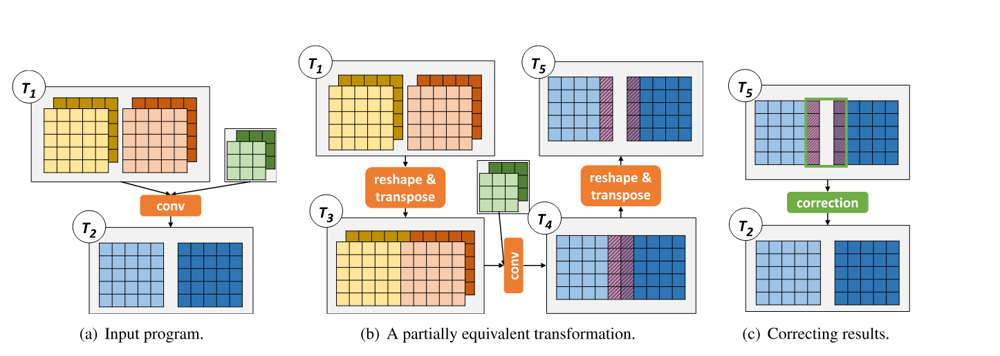

**Figure 1.** A partially equivalent transformation that improves the performance of convolution by manipulating tensor shape and linearization. The shaded boxes in (b) highlight non-equivalent elements between two programs in the transformation. The correction kernel in (c) is applied to these elements to recover the functional equivalence of the input program.

In addition to the above example that optimizes a tensor program by changing the shape and linearization of its tensors, partially equivalent transformations also include replacing less efficient operators with more optimized ones with similar semantics, and modifying the graph structure of a tensor program to enable additional optimizations. We provide more such examples in [Section 4.2](#_4-2-example-mutant-categories) and evaluate them in [Section 8.3](#_8-3-case-studies).

Although partially equivalent transformations exhibit high potential for performance improvement, they are not considered in current DNN frameworks due to their possible impact on model accuracy. Manually implementing such partially equivalent transformations is prohibitive. First, it requires evaluating a large amount of potential partially equivalent transformations to discover promising ones. Second, to apply partially equivalent transformations while preserving model accuracy, we need correction kernels to fix the results for non-equivalent parts (see Figure 1c). Overall, more automated approaches are needed to discover performance-optimizing partially equivalent transformations and correct the results, which are the main focus of this work.

## 3 Design Overview

PET is the first framework to optimize tensor programs by exploiting partially equivalent transformations and correcting their results automatically. To realize this, PET leverages the multi-linearity of tensor programs.

#### Multi-linear tensor programs (MLTPs)

We first define multi-linear tensor operators. An operator $\operatorname{op}$ with $n$ input tensors $I_1,\ldots,I_n$ is multi-linear if $\operatorname{op}$ is linear to all inputs $I_k$:

$$
\begin{aligned}
&\operatorname{op}(I_1,\ldots,I_{k-1},X,\ldots,I_n)
+\operatorname{op}(I_1,\ldots,I_{k-1},Y,\ldots,I_n) \\
&\qquad=\operatorname{op}(I_1,\ldots,I_{k-1},X+Y,\ldots,I_n),\\
&\alpha\cdot\operatorname{op}(I_1,\ldots,I_{k-1},X,\ldots,I_n)
=\operatorname{op}(I_1,\ldots,I_{k-1},\alpha\cdot X,\ldots,I_n),
\end{aligned}
$$

where $X$ and $Y$ are arbitrary tensors with the same shape as $I_k$, and $\alpha$ is an arbitrary scalar. DNN computation generally consists of multi-linear tensor operators (e.g., matrix multiplication and convolution) and element-wise non-linear operators (e.g., ReLU [Nai10] and sigmoid). The linear operators consume the majority of the computation time, due to their high computational complexity. A program $\mathcal{P}$ is a multi-linear tensor program (MLTP) if all operators $\operatorname{op}\in\mathcal{P}$ are multi-linear.

#### PET overview

Figure 2 shows an overview of PET. The input to PET is a tensor program to be optimized. Similar to prior work [Che18, Zhe20], PET first splits an input program into smaller subprograms to reduce the exploration space of each subprogram without sacrificing performance improvement opportunities. For each subprogram, PET's mutation generator discovers partially equivalent transformations by generating possible mutants for MLTPs in the subprogram. Each mutant has the same input and output shapes as the original MLTPs, thus constituting a partially equivalent transformation ([Section 4](#_4-mutation-generator)).

To maintain end-to-end equivalence to an input program, PET's mutation corrector examines the equivalence between a mutant and its original MLTP, and automatically generates correction kernels to fix the outputs of the mutant. PET leverages rigorous theoretical foundations to simplify such challenging tasks ([Section 5](#_5-mutation-corrector)).

The corrected mutants are sent to PET's program optimizer, which combines existing fully equivalent transformations with partially equivalent ones to construct a comprehensive search space of program optimizations. The optimizer evaluates a rich set of mutants for each subprogram and applies post-optimizations across their boundaries, in order to discover highly optimized candidates in the search space ([Section 6](#_6-program-optimizer)).

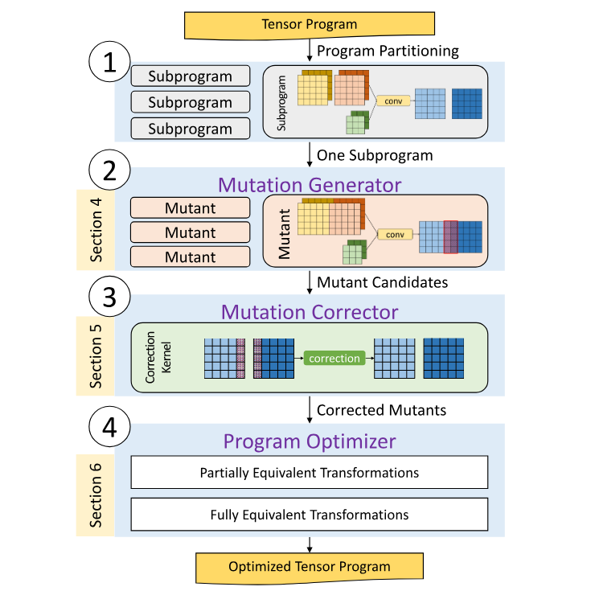

**Figure 2.** PET overview.

## 4 Mutation Generator

This section describes the mutation generator in PET, which takes an MLTP as input and automatically generates possible mutants to replace the input MLTP. The generation algorithm discovers valid mutants up to a certain size. Each generated mutant does not necessarily preserve mathematical equivalence to the input program on the entire output tensors. To restore functional equivalence, the mutation corrector ([Section 5](#_5-mutation-corrector)) automatically generates correction kernels.

### 4.1 Mutation Generation Algorithm

We call an MLTP $\mathcal{P}_1$ a mutant of another MLTP $\mathcal{P}_0$ if $\mathcal{P}_1$ and $\mathcal{P}_0$ have the same number of inputs (and outputs) and each input (and output) has the same shape. The computations of $\mathcal{P}_0$ and $\mathcal{P}_1$ are not necessarily equivalent. Intuitively, if $\mathcal{P}_0$ is a subprogram in a tensor program, then replacing $\mathcal{P}_0$ with $\mathcal{P}_1$ yields a valid but potentially non-equivalent tensor program.

For a given MLTP $\mathcal{P}_0$, PET generates potential mutants of $\mathcal{P}_0$ using a given set of multi-linear operators $O$ as the basic building blocks. Table 1 lists the operators used in our evaluation. The list covers a variety of commonly used tensor operators, including compute-intensive operators (`conv`, `matmul`, etc.), element-wise operators (`add`, `mul`, etc.), and tensor manipulation (`split`, `transpose`, etc.). This set can also be extended to include new DNN operators.

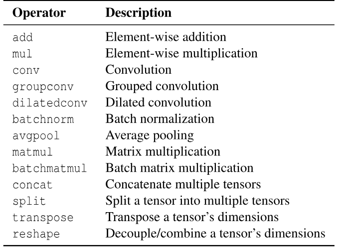

**Table 1.** Multi-linear tensor operators used in PET.

```pseudocode:line-numbers title="Algorithm 1: MLTP mutation generation algorithm"
Input: A set of operators O; an input MLTP P0
Output: A set of valid program mutants M for P0

I0 = the set of input tensors in P0
M = {}
Build(1, {}, I0)

// Depth-first search to construct mutants
function Build(n, P, I)
  if P and P0 have the same input/output shapes then
    M = M + {P}
  if n < depth then
    for op in O do
      for i in I where i is a valid input to op do
        Add operator op into program P
        Add the output tensors of op into I
        Build(n + 1, P, I)
        Remove operator op from P
        Remove the output tensors of op from I
  return M
```

Algorithm 1 shows a depth-first search algorithm for constructing potential mutants of an MLTP $\mathcal{P}_0$. PET starts from an empty program with no operator and only the set of original input tensors to $\mathcal{P}_0$. PET iteratively adds a new operator to the current program $\mathcal{P}$ by enumerating the type of operator from $O$ and the input tensors to the operator. The input tensors can be the initial input tensors to $\mathcal{P}_0$ (i.e., $I_0$ in Algorithm 1) or the output tensors of previous operators. The depth-first search algorithm enumerates all potential MLTPs up to a certain size (called the mutation depth). For each mutant $\mathcal{P}$, PET checks whether $\mathcal{P}$ and $\mathcal{P}_0$ have the same number and shapes of inputs/outputs. $\mathcal{P}$ is a valid mutant if it passes this test.

### 4.2 Example Mutant Categories

While the above mutation generation algorithm is general enough to explore a sufficiently large design space, we emphasize that several mutant categories are of particular importance to PET and lead to mutants with improved performance. Note that PET does not rely on manually specified categories. Rather, these categories are discovered by PET automatically.

#### Reshape and transpose

It is widely known that the in-memory layouts of tensors play an important role in optimizing tensor programs [Che18]. PET leverages the `reshape` and `transpose` operators to transform the shapes of input tensors and the linearization ordering of tensor dimensions to generate mutants with better performance. A `reshape` operator changes the shape of a tensor by decoupling a single dimension into multiple ones or combining multiple dimensions into one. For example, a `reshape` can transform a vector with four elements into a $2\times2$ matrix. A `transpose` operator modifies the linearization ordering of a tensor's dimensions, such as converting a row-major matrix to a column-major one.

`reshape` and `transpose` are generally applied jointly to transform tensor layouts. For example, Figure 1 shows a potential mutant of a convolution operator that concatenates two separate images (i.e., $T_1\to T_3$ in Figure 1b) along the width dimension to improve the performance of convolution: typically a larger width exhibits more parallelism to be exploited on modern accelerators such as GPUs. This concatenation involves a combination of three `reshape` and `transpose` operators. First, a `reshape` operator splits the batch dimension of $T_0$ into an inner dimension that groups every two consecutive images, and an outer dimension that is half the size of the original. Then, a `transpose` operator moves the newly created inner dimension next to the width dimension and updates the tensor's linearization ordering accordingly, so each row of the two images in the same group is stored consecutively in memory. Finally, another `reshape` operator combines the two images.

The mutation generator usually fuses multiple consecutive `reshape` and `transpose` operators into a single compound operator, namely `reshape & transpose`. This fusion reduces the size of the generated mutants and allows for exploring much larger and more sophisticated mutants.

#### Single-operator mutants

PET can also generate mutants that replace an inefficient operator in a tensor program with a different and more performant operator. Several standard tensor operators, such as convolution and matrix multiplication, have been extensively optimized either manually or automatically on modern hardware backends. In contrast, their variants, such as strided or dilated convolutions [Li18a], are not as efficiently supported. There are performance-related benefits to mutating them into their standard counterparts with highly optimized kernels. As an example, Figure 3 shows a mutant that transforms a dilated convolution into a regular convolution by reorganizing the linearization ordering of the input tensor based on the given dilation. However, the mutant is not fully equivalent to the input program and requires corrections afterward to restore functional equivalence.

#### Multi-operator mutants

PET also supports substituting a subgraph of multiple operators with another more efficient set of operators. For example, a few independent convolutions with similar tensor shapes may be combined into a single larger convolution to improve GPU utilization and reduce kernel launch overhead. This requires manipulating tensor shapes and adding proper padding (see the examples in [Section 8.3.3](#_8-3-3-graph-level-optimization)).

## 5 Mutation Corrector

While the mutants generated by PET have potentially higher performance than the original programs, they may produce different mathematical results on some regions of the output tensors, potentially leading to accuracy loss. To maintain transparency at the application level, PET chooses to preserve the statistical behavior of the input program and guarantees the same model accuracy, with the help of a mutation corrector. Specifically, the mutation corrector takes as inputs an MLTP $\mathcal{P}_0$ and one of its mutants $\mathcal{P}$, and automatically generates correction kernels that are applied to the output tensors of $\mathcal{P}$ to maintain functional equivalence to $\mathcal{P}_0$.

The goal of the mutation corrector is twofold. First, for any given MLTP and its mutant, the corrector analyzes the two programs and identifies all the regions of the output tensors on which the two programs provide identical results and therefore do not need any correction. Second, for the remaining regions where the two outputs are different, the corrector automatically generates kernels to fix the output of the mutant and preserve functional equivalence.

Designing the mutation corrector requires addressing two challenges. First, the output tensors may be very large, involving up to many millions of elements that all require equivalence verification. It is infeasible to verify every single element of the output tensors individually. Second, the verification of each output element may depend on a large number of input variables in many tensor operators. For example, each output element of a matrix multiplication is the inner product of one row and one column of the two input matrices, both with sizes up to several thousand. Numerically enumerating all possible values for this many input variables is impractical.

Two theorems that significantly simplify the verification tasks are central to the PET mutation corrector. Rather than verifying all output positions with respect to all input value combinations, PET only needs to verify a few representative output positions with a small number of randomly generated input values. This dramatically reduces the verification workload. We describe these theoretical foundations in [Section 5.1](#_5-1-theoretical-foundations) and introduce our mutation correction algorithm in [Section 5.2](#_5-2-mutation-correction-algorithm).

### 5.1 Theoretical Foundations

To simplify our analysis, we assume an input MLTP $\mathcal{P}_0$ and its mutant $\mathcal{P}$ each has one output. Our results can be generalized to programs with multiple outputs by sequentially analyzing each one. Let $\mathcal{P}(I)$ denote the output tensor of running $\mathcal{P}$ on $n$ input tensors $I=(I_1,\ldots,I_n)$. Let $\mathcal{P}(I)[\vec v]$ denote the output value at position $\vec v$, and let $I_j[\vec u]$ denote the input value at position $\vec u$ of $I_j$. With these definitions, the computation for a single output position of an MLTP $\mathcal{P}$ is represented as

$$
\mathcal{P}(I_1,\ldots,I_n)[\vec v]
=\sum_{\vec r\in\mathcal{R}(\vec v)}\prod_{j=1}^{n}I_j\left[L_j(\vec v,\vec r)\right],
$$

where $\mathcal{R}(\vec v)$ is the summation interval of $\vec v$, which is iterated over when computing $\mathcal{P}(I)[\vec v]$, and $\vec u=L_j(\vec v,\vec r)$ is a linear mapping from $(\vec v,\vec r)$ to a position $\vec u$ of the $j$-th input tensor $I_j$. For example, a convolution with a kernel size of $3\times3$ and zero padding is defined as

$$
\begin{aligned}
\operatorname{conv}(I_1,I_2)[c,h,w]
={}&\sum_{d=0}^{D-1}
\sum_{x=\max(-1,-h)}^{\min(H-1-h,1)}
\sum_{y=\max(-1,-w)}^{\min(W-1-w,1)}\\
&I_1[d,h+x,w+y]\times I_2[d,c,x,y].
\end{aligned}
$$

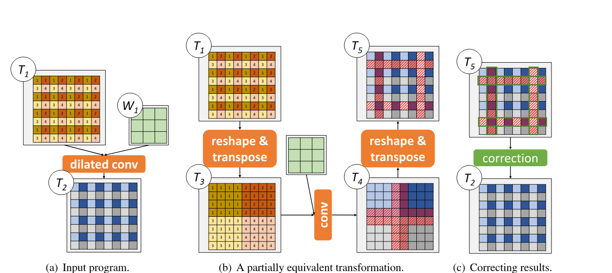

**Figure 3.** An example mutant that transforms a dilated convolution to a standard convolution. The red-shaded boxes in (b) highlight non-equivalent elements between the two programs, which are fixed by the correction kernel in (c).

Here, $D$, $H$, and $W$ refer to the number of channels, height, and width of the input image $I_1$, respectively. The numbers below and above the summation symbols denote the lower and upper bounds of the summation interval. The two linear mappings can be represented as $L_1(\vec v,\vec r)=(d,h+x,w+y)$ and $L_2(\vec v,\vec r)=(d,c,x,y)$, where $\vec v=(c,h,w)$ and $\vec r=(d,x,y)$.

Different positions of an output tensor may have different summation intervals. For the convolution operator defined above, computing the top-left output position (i.e., $h=0,w=0$) only involves a $2\times2$ kernel (i.e., $0\le x\le1,0\le y\le1$), since that position does not have a left or top neighbor, as shown in Figure 4. We group the output positions with an identical summation interval into a box. Formally, a box is a region of an output tensor whose elements all have the same summation interval. This convolution has nine boxes overall, which are depicted in Figure 4.

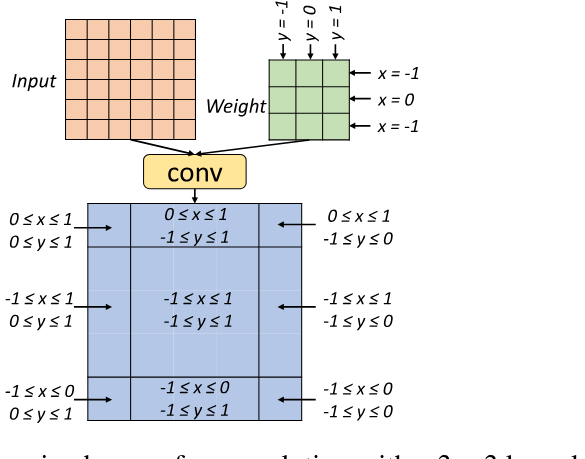

**Figure 4.** The nine boxes of a convolution with a $3\times3$ kernel and zero padding, as well as their summation intervals. A convolution has three summation dimensions (i.e., $d$, $x$, and $y$ in Equation 1). The channel dimension (i.e., $d$) has the same interval in all boxes and is thus omitted.

All output positions in the same box have an identical summation interval and share similar mathematical properties, which are leveraged by PET when examining program equivalence. Instead of testing the equivalence of two MLTPs on all individual positions, PET only needs to verify their equivalence on $m+1$ specific positions in each box, where $m$ is the number of dimensions of the output tensor.

**Theorem 1.** For two MLTPs $\mathcal{P}_1$ and $\mathcal{P}_2$ with an $m$-dimensional output tensor, let $\vec e_1,\ldots,\vec e_m$ be a set of $m$-dimensional base vectors. That is, $\vec e_i=(0,\ldots,0,1,0,\ldots,0)$ is an $m$-tuple with all coordinates equal to 0 except the $i$-th. Let $\mathcal{B}$ be a box for $\mathcal{P}_1$ and $\mathcal{P}_2$, and let $\vec v_0$ be an arbitrary position in $\mathcal{B}$. Define $\vec v_i=\vec v_0+\vec e_i$, $1\le i\le m$. If $\forall I,0\le i\le m$, $\mathcal{P}_1(I)[\vec v_i]=\mathcal{P}_2(I)[\vec v_i]$, then $\forall I,\vec v\in\mathcal{B}$, $\mathcal{P}_1(I)[\vec v]=\mathcal{P}_2(I)[\vec v]$.

**Proof sketch.** The proof uses a lemma whereby if $\mathcal{P}_1$ and $\mathcal{P}_2$ are equivalent for positions $\vec v_0$ and $\vec v_0+\vec e_i$, then the equivalence holds for $\vec v_0+k\cdot\vec e_i$, where $k$ is an integer. We prove this lemma by comparing the coefficient matrices of $\mathcal{P}_1$ and $\mathcal{P}_2$ with respect to the input variables. Using this lemma, we show that $\mathcal{P}_1$ and $\mathcal{P}_2$ are equivalent for the entire box $\mathcal{B}$, since any $\vec v\in\mathcal{B}$ can be decomposed to a linear combination of $\vec v_0$ and $\vec e_0,\ldots,\vec e_m$.

Theorem 1 shows that if $\mathcal{P}_1$ and $\mathcal{P}_2$ are equivalent for $m+1$ specific positions in a box, identified by $\vec v_0,\ldots,\vec v_m$, then the equivalence holds for all other positions in the same box. This theorem significantly reduces the verification workload: instead of examining all positions of an output tensor, PET only needs to verify $m+1$ specific positions in each box.

The verification of a single position remains challenging, nevertheless, since each MLTP generally involves a large number of input variables. Proving the equivalence of two MLTPs requires examining all possible combinations of value assignments to these input variables. We further address this challenge using the following theorem.

**Theorem 2.** For two MLTPs $\mathcal{P}_1$ and $\mathcal{P}_2$ with $n$ input tensors, let $\vec v$ be a position where $\mathcal{P}_1$ and $\mathcal{P}_2$ are not equivalent, i.e., $\exists I$, $\mathcal{P}_1(I)[\vec v]\ne\mathcal{P}_2(I)[\vec v]$. Let $I'$ be a randomly generated input uniformly sampled from a finite field $\mathbb{F}$. The probability that $\mathcal{P}_1(I')[\vec v]=\mathcal{P}_2(I')[\vec v]$ is at most $n/p$, where $p$ is the number of possible values in $\mathbb{F}$.

**Proof sketch.** This is a corollary of the Schwartz-Zippel Lemma [Sch80, Zip79].

Theorem 2 shows that if two MLTPs with $n$ inputs are not equivalent on a specific position $\vec v$, then the probability that they produce an identical result on this position with a random input sampled from a finite field $\mathbb{F}$ is low (i.e., at most $n/p$, where $p$ is the number of possible values in $\mathbb{F}$). This theorem shows the sufficiency and effectiveness of random testing for examining the equivalence of two MLTPs.

Theorem 2 relies on the fact that $\mathbb{F}$ is a finite field, from which the random inputs are sampled, but MLTPs operate on the infinite field of real numbers. To apply Theorem 2, we choose $\mathbb{F}$ to be a field of integers modulo $p$, where $p$ is a large prime number ($p=2^{31}-1$ in our evaluation). The arithmetic operations in random testing are performed on integers and calculated modulo the prime number $p$. Working with a finite field provides another desirable property that applying arithmetic operators does not involve integer overflow.

By combining Theorems 1 and 2, PET reduces the original verification task of examining all output positions with respect to all input value combinations to a much more lightweight task that only requires testing a few representative positions using several randomly generated inputs, as shown in Table 2.


**Table 2.** Reducing verification workload in PET.

### 5.2 Mutation Correction Algorithm

The PET mutation correction algorithm exploits the theorems in [Section 5.1](#_5-1-theoretical-foundations) to calculate which regions of the output tensors in a mutant are not equivalent to the input MLTP and, therefore, need additional correction. In particular, it suffices to examine the equivalence for each pair of overlapped boxes from the two MLTPs, using a small number of random tests. The overall algorithm works in the following three steps.


**Figure 5.** Box propagation for the example in Figure 1. The red arrows indicate the split points of each tensor dimension.

#### Step 1: Box propagation

First, we calculate the boxes of a given MLTP through box propagation. The idea of box propagation is similar to forward and backward propagation in deep learning: we compute the boxes of an operator's output tensors based on the boxes of its inputs, and the computation is conducted following the operator dependencies in a program. We maintain a set of split points for each dimension of a tensor to identify the boundaries of its boxes. For a multi-linear operator, we infer the split points of its output tensors based on the split points of its input tensors and the operator type and hyperparameters. Figure 5 shows the box propagation procedure for the mutation example in Figure 1.

#### Step 2: Random testing for each box pair

After obtaining all boxes of an input MLTP $\mathcal{P}_1$ and its mutant $\mathcal{P}_2$, PET leverages the theorems in [Section 5.1](#_5-1-theoretical-foundations) to examine the intersected regions of each pair of boxes from $\mathcal{P}_1$ and $\mathcal{P}_2$. If two boxes do not have any overlapped region, they can be skipped. For each box intersection, PET examines the equivalence of the two programs on $m+1$ positions identified by Theorem 1, where $m$ is the number of output tensor dimensions (e.g., $m=4$ in Figure 5, since the output of a convolution has four dimensions).

For each of these $m+1$ positions, PET runs a set of random tests by assigning input tensors with values uniformly sampled from a finite field $\mathbb{F}$ containing all integers between 0 and $p-1$, where $p=2^{31}-1$ is a prime number. As a result, the probability that two non-equivalent MLTPs produce identical outputs on a random input is at most $n/p$, where $n$ is the number of inputs to the MLTPs. Finally, two non-equivalent MLTPs pass all tests with a probability lower than $(n/p)^t$, where $t$ is the number of test cases and a hyperparameter in PET that serves as a tradeoff between the speed of the corrector and the error probability that non-equivalent MLTPs pass all random tests.

Our approach introduces an extremely small and controllable probability of error that we have to tolerate. That is, non-equivalent programs may pass random testing with probability $(n/p)^t$. We argue that this is an example of how random testing can enable a tradeoff between the cost of program verification and a small probability of unsoundness for verifying tensor program transformations.

To further reduce the verification workload, PET includes a caching optimization: the tests for all boxes share the same set of random inputs, and PET caches and reuses all intermediate results to avoid redundant computations.

#### Step 3: Correction kernel generation

For each box failing the random tests, PET generates correction kernels to fix its outputs and restore the mathematical equivalence between the original MLTP and its mutant. To fix the outputs, the correction kernel performs the same set of operations as the original MLTP but only on those boxes where the two input programs are not equivalent (shown as the red shaded boxes in Figure 1). These boxes are regular cubes in the multi-dimensional space and can be viewed as sub-tensors of the original ones but with much smaller sizes. Therefore, PET directly leverages existing DNN libraries [Che14, Cub16] or kernel generation techniques [Che18, Zhe20] to generate correction kernels. To reduce the correction overhead, PET opportunistically fuses the correction kernels with existing tensor operators ([Section 5.3](#_5-3-fusing-correction-kernels)).

### 5.3 Fusing Correction Kernels

Correction kernels may introduce non-trivial overheads due to the cost of launching the correction kernels and their limited degrees of parallelism. For example, some correction kernels may have similar execution time compared to the corresponding full-size tensor operators. This may eliminate the performance gains from applying partially equivalent transformations. To reduce the correction overhead, PET opportunistically fuses correction kernels with other tensor operators.

For example, Figure 6b shows the tensor program after applying the partially equivalent transformation in Figure 1. `Conv-2` is the correction kernel for fixing the output of `Conv-1`. Since the two convolution operators share the same weights (i.e., $W_1$), PET fuses them into a single convolution, shown as `Conv-1-2` in Figure 6c. This fusion requires concatenating $T_1$ and $T_0'$ into a single tensor and splitting the output of `Conv-1-2` into $T_2$ and $T_3'$. The concatenation and split only involve direct memory copies and can be fused with the `reshape` and `transpose` operators.

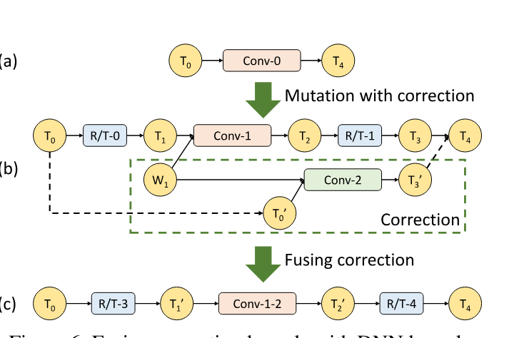

**Figure 6.** Fusing correction kernels with DNN kernels.

## 6 Program Optimizer

In this section, we describe the program optimizer in PET, which explores a large search space of program optimizations, combining fully and partially equivalent transformations, and quickly discovers highly optimized programs. The program optimizer first splits an input program into multiple subprograms with smaller sizes to allow efficient mutation generation ([Section 6.1](#_6-1-program-splitting)). Second, to optimize each individual subprogram, PET searches for the best mutants in a rich candidate space by varying both the subsets of operators to mutate together and the number of iterative rounds of mutation ([Section 6.2](#_6-2-subprogram-optimization)). Finally, when stitching the optimized subprograms back together, PET applies additional post-optimizations across the boundaries of the subprograms, including redundancy elimination and operator fusion ([Section 6.3](#_6-3-post-optimizations)). The overall program optimization algorithm is summarized in Algorithm 2.

```pseudocode:line-numbers title="Algorithm 2: Program optimization algorithm"
Input: An input tensor program P0
Output: An optimized tensor program Popt

Split P0 into a list of subprograms
Initialize a heap H to record the top-K programs
H.insert(P0)

// Greedily mutate each subprogram
for each subprogram S in P0 do
  mutants = GetMutants(S)
  Initialize a new heap Hnew
  for P in H do
    for M in mutants do
      Pnew = replace S with M in P
      Apply post-optimizations on Pnew
      Hnew.insert(Pnew)
  H = Hnew
Popt = the program with the best performance in H
return Popt

function GetMutants(S0)
  O = the set of mutant operators for S0
  Q = {S0}, mutants = {S0}
  for r rounds do
    Qnew = {}
    for S in Q do
      for each subset of operators S' in S do
        for M' in MutationGenerator(O, S') do
          M = replace S' with M' in S
          Add M to Qnew and mutants
    Q = Qnew
  return mutants
```

### 6.1 Program Splitting

The complexity of the mutation generation grows rapidly with the input program size, as explained in [Section 4](#_4-mutation-generator). It is nearly impossible to directly mutate a large tensor program with many hundreds of operators. Instead, PET splits an input program into multiple disjoint subprograms with smaller sizes.

It is crucial to properly select the split points for an input program, to effectively reduce the mutation complexity while still preserving most program optimization opportunities. More split points lead to smaller subprograms with fewer mutant candidates to be explored. As an extreme case, by constraining each subprogram to have only a small constant number of operators, the overall complexity scales linearly with the program size, rather than the naive exponential trend. However, an overly aggressive split may result in locally optimized mutants that are limited within subprograms, missing optimization opportunities across subprogram boundaries.

We use non-linear operators in tensor programs as the split points. First, non-linear operators such as the activation layers in DNNs are widely used in tensor programs. Typically, each one or a few linear operators are followed by a non-linear activation (e.g., ReLU or sigmoid). This effectively limits the split subprograms to the small sizes we expect. Second, as [Section 5](#_5-mutation-corrector) explains, PET's mutation only applies to MLTPs; any non-linear operators must be excluded from the mutation. This makes splitting at the points of non-linear operators a natural choice for the partially equivalent mutation in PET. Third, our design is also motivated by an observation that most existing tensor program transformations [Ten18a, Che18, Jia19b] also do not include non-linear operators in their substitution patterns (except for fusion, which we handle in [Section 6.3](#_6-3-post-optimizations)).

PET further adjusts the subprogram sizes after splitting an input program at the non-linear operators. For multiple individual subprograms without any data dependency, PET considers the possibility of combining them into a single subprogram using grouped or batched operators. Examples include fusing the standard convolutions on different branches of an Inception network [Sze16] into a grouped convolution, as shown in Figure 10. On the other hand, if a subprogram is still too large, PET will only query the mutation generator with a subset of operators each time (see [Section 6.2](#_6-2-subprogram-optimization)).

### 6.2 Subprogram Optimization

After splitting an input program into multiple individual subprograms, PET mutates each subprogram by querying the mutation generator in [Section 4.1](#_4-1-mutation-generation-algorithm) and keeps the top-$K$ candidates with the best estimated performance in a heap structure $\mathcal{H}$, as shown from Lines 7 to 16 in Algorithm 2. A larger $K$ allows PET to tolerate intermediate performance decreases during the search but requires more memory to save all $K$ candidates and involves higher computation cost. At each step, each of the obtained mutants replaces its corresponding subprogram in each of the current candidates (i.e., $\mathcal{P}$ in Algorithm 2) to generate a new candidate (i.e., $\mathcal{P}_{\mathrm{new}}$), which is then applied a series of post-optimizations (see [Section 6.3](#_6-3-post-optimizations)).

PET estimates the performance of each new candidate $\mathcal{P}_{\mathrm{new}}$ using a cost model adapted from TASO [Jia19b]. The cost model measures the execution time of each tensor operator once for each configuration (e.g., different strides and padding of a convolution), and estimates the performance of a new program candidate $\mathcal{P}_{\mathrm{new}}$ by summing up the measured execution time of its operators. The top-$K$ program candidates with the best performance thus far are kept in $\mathcal{H}$.

To explore a sufficiently large space of possible mutants for each subprogram within reasonable time and space cost, we manage the mutation process with several key features. First, when the number of operators in a subprogram exceeds a threshold $d$ (our evaluation uses $d=4$), PET breaks the subprogram into smaller subsets of operators by enumerating all possible combinations with up to $d$ operators, and only queries the mutation generator on the subset, while keeping the remaining operators unchanged (Algorithm 2 Line 26). Second, we allow iterative mutation on a subprogram for up to $r$ rounds (Algorithm 2 Line 23), which significantly enlarges the search space of possible mutants and allows PET to discover more optimized mutants. All generated mutants in all rounds are returned to the optimizer as potential candidates.

It is worth noting that PET's optimizer is compatible with and can incorporate existing fully equivalent transformations [Ten18a, Jia19b] besides PET's mutations. Doing so merely requires enhancing the mutation generator to explore and return fully equivalent transformations as well, which are directly applicable to the input subprograms in the same way as the mutations. By combining fully and partially equivalent transformations, PET explores a significantly larger search space of program optimizations and discovers highly optimized programs that existing optimizers miss.

### 6.3 Post-Optimizations

Finally, the optimized mutants for all subprograms need to be stitched together. In addition to connecting their input and output tensors, we also perform several post-optimizations across the subprogram boundaries to further improve the overall performance. We observe that the mutation generator in PET introduces a large number of `reshape` and `transpose` (R/T) operators, especially at the beginning and the end of each subprogram. There are opportunities to fuse these R/T operators across subprograms and further fuse the non-linear operators that are excluded from the above subprogram optimizations.

Figure 7 shows an example with two optimized subprograms. To optimize the boundaries between subprograms, PET first groups together all R/T operators between subprograms by reordering the R/T operators with element-wise non-linear activations (e.g., ReLU and sigmoid), as shown in Figure 7b. This reordering is functionally correct, since both `reshape` and `transpose` are commutative with element-wise operators. The reordering also allows PET to fuse the non-linear activations with other linear operators, such as fusing a Conv and a subsequent ReLU into a Conv-ReLU, as shown in Figure 7c. We then apply the following three post-optimizations.

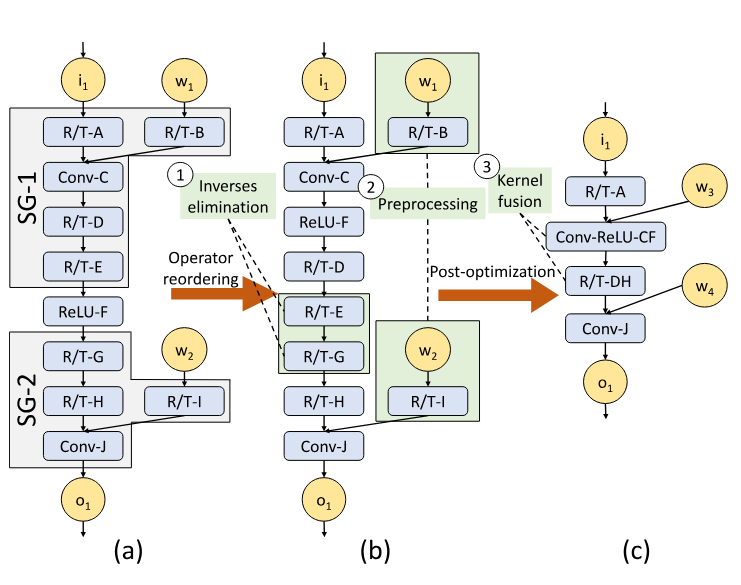

**Figure 7.** Post-optimizations applied when stitching two subprograms SG-1 and SG-2. R/T refers to a `reshape` followed by a `transpose`. Conv and ReLU denote a convolution and a ReLU operator, respectively.

#### Inverses elimination

We eliminate any pairs of R/T operators that can cancel out each other and therefore are equivalent to a no-op. We call each such pair an inverse group and directly remove them as part of the post-optimization. An example of an inverse group is R/T-E and R/T-G in Figure 7b.

#### Operator fusion

As shown in Figure 7c, PET fuses the remaining consecutive R/T operators into a single operator (e.g., R/T-DH) to reduce the kernel launch cost. The non-linear activations in a tensor program are also fused with an R/T or with other linear operators. Note that operator fusion is the most commonly used, if not the only, program optimization for non-linear operators. PET is able to recover most of the efficiency that was lost when splitting the tensor program.

#### Preprocessing

We preprocess any operator if all its input tensors are statically known. For example, in Figure 7b, both R/T-B and R/T-I can be preprocessed on the convolution weight tensors $w_1$ and $w_2$.

## 7 Implementation

PET is implemented as an end-to-end tensor program optimization framework, with about 13,000 lines of C++ code and 1,000 lines of Python code. This section describes our implementation of the PET mutation generator and corrector.

#### Mutation operators

Table 1 lists the tensor operators included in the current implementation of PET. We use cuDNN [Che14] and cuBLAS [Cub16] as our backend operator libraries. PET can also be extended to include other libraries, such as TVM [Che18] and Ansor [Zhe20]. In our evaluation, we demonstrate this extensibility on TVM and Ansor, and show that they can directly benefit from PET's partially equivalent optimizations and automated corrections.

`reshape` and `transpose` are two frequently used operators in partially equivalent transformations. Our implementation includes a series of optimizations on them, including eliminating inverse groups of R/T operators and fusing consecutive R/T operators, as described in [Section 6.3](#_6-3-post-optimizations). Since both `reshape` and `transpose` are multi-linear operators, PET directly uses the random testing method introduced in [Section 5](#_5-mutation-corrector) to examine whether a sequence of R/T operators forms an inverse group and therefore can be eliminated.

#### Correction kernels

[Section 5.2](#_5-2-mutation-correction-algorithm) describes a generic approach to generate correction kernels by directly running the original program on the positions with incorrect results. To reduce the correction overhead, PET fuses the correction kernels with other tensor operators, as described in [Section 5.3](#_5-3-fusing-correction-kernels). The correction kernel fusion introduces additional memory copies, which are also fused with the R/T operators during post-optimizations.

## 8 Evaluation

### 8.1 Experimental Setup

#### Platforms

We use a server equipped with two-socket, 28-core Intel Xeon E5-2680 v4 processors (hyper-thread enabled), 256 GB of DRAM, and one NVIDIA Tesla V100 GPU. All experiments use CUDA 10.2 and cuDNN 7.6.5 except for those with TVM and Ansor, which directly use the best kernels generated by these backends.

PET preserves an end-to-end equivalence between the original and optimized programs, same as all the baselines. PET takes ONNX models as input. TensorRT and TASO directly support the ONNX format. For TensorFlow and TensorFlow-XLA, we use the `onnx-tensorflow` tool [OnnWeb] for format conversion.

#### Workloads

We use five DNN architectures. Resnet-18 [He16] is a widely used convolutional network for image classification. CSRNet [Li18a] is a dilated convolutional network used for semantic segmentation. Its sampling rate can be arbitrarily adjusted to enlarge the receptive field for higher accuracy. Inception-v3 [Sze16] is an improved version of GoogLeNet [Sze14] with carefully designed Inception modules to improve accuracy and computational efficiency. BERT [Dev18] is a language representation architecture that obtains state-of-the-art accuracy on a wide range of natural language tasks. Resnet3D-18 [Har17] is a 3D convolutional network for video processing.

Unless otherwise stated, in all experiments, we use CUDA events to measure the elapsed time from launching the first CUDA kernel in a tensor program to receiving the completion notification of the last kernel. We set the default mutation generation depth to 4 (i.e., `depth = 4` in Algorithm 1) and the search rounds to 4 (i.e., `r = 4` in Algorithm 2). We further evaluate the scalability of the mutation generator and the program optimizer in [Section 8.5](#_8-5-ablation-and-sensitivity-studies).

### 8.2 End-to-End Evaluation

We first compare the end-to-end inference performance between PET and existing tensor program optimizers, including TensorFlow [Aba16], TensorFlow XLA [XLA17], TensorRT [Ten17a], and TASO [Jia19b]. Figure 8 shows the results under batch sizes of 1 and 16. To eliminate the impact of using different operator libraries, all optimizers use the same cuDNN [Che14] and cuBLAS [Cub16] libraries as the backend. Therefore, the performance differences only come from different optimized tensor programs produced by PET and the baselines. [Section 8.4](#_8-4-tvm-and-ansor) further evaluates PET with existing kernel generation techniques, such as TVM [Che18] and Ansor [Zhe20].

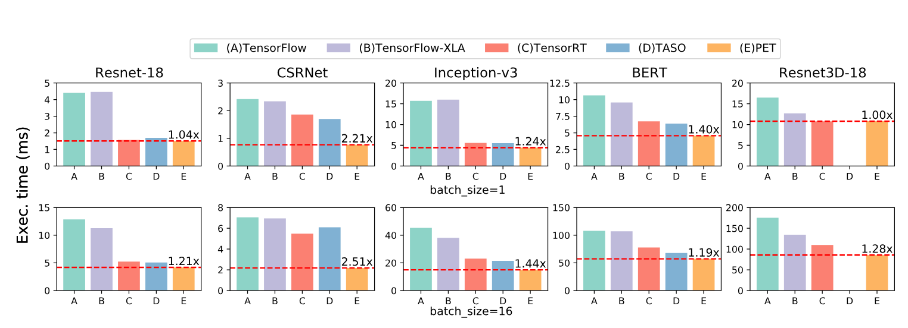

**Figure 8.** End-to-end performance comparison between PET and existing frameworks. For each DNN, the numbers above the PET bars show the speedups over the best baseline. TASO does not support the 3D convolution operators in Resnet3D-18.

Among the five DNN architectures, Resnet-18 and Resnet3D-18 are commonly used and heavily optimized in existing DNN frameworks. However, PET is still able to improve their performance by up to 1.21x and 1.28x, respectively, by discovering new partially equivalent transformations not considered by existing optimizers. For Resnet-18, CSRNet, and Inception-v3, PET achieves higher speedups with a batch size of 16. This is because a larger batch size offers more mutation opportunities across different tensor dimensions for PET to exploit. Overall, PET outperforms existing DNN frameworks by up to 2.5x.

To further evaluate the partially equivalent transformations discovered by PET, we manually add them and corresponding correction kernels as additional graph substitutions into TASO, and measure by how much these new transformations improve TASO's performance. As shown in Figure 9, the enhanced version of TASO further improves the inference performance of Inception-v3 and BERT by 1.12x and 1.31x, respectively. This demonstrates that partially equivalent transformations indeed enlarge the design space of graph transformations, and PET unleashes these benefits automatically. Some non-trivial partially equivalent transformations are not leveraged by TASO, due to substantial correction overhead, while PET is able to avoid this overhead through correction kernel fusion ([Section 5.3](#_5-3-fusing-correction-kernels)) and post-optimization ([Section 6.3](#_6-3-post-optimizations)).


**Figure 9.** Performance benefits after adding PET's partially equivalent transformations into TASO.


**Table 3.** Operator benchmark list.

### 8.3 Case Studies

To understand how partially equivalent transformations discovered by PET optimize DNN computation, we study four optimization categories in detail.

#### 8.3.1 Tensor-Level Optimization

PET discovers many partially equivalent transformations that improve DNN computation by optimizing the shapes or linearization of tensors. We evaluate a convolution operator in Inception-v3, whose configuration is depicted in the `conv` row of Table 3.

PET transforms the input tensor shape from $[1,48,38,38]$ to $[16,48,10,10]$ by splitting both the height and width dimensions each into four partitions. IGEMM and FFT are the most efficient convolution algorithms before and after the optimization, respectively. Using the transformed input tensor reduces the GPU DRAM and L2 accesses by 100x and 15x, respectively, and thus reduces the run time by 7x (Table 4).

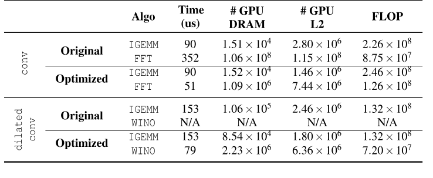

**Table 4.** Case studies on the performance of the `conv` and `dilatedconv` operators in Table 3. IGEMM, FFT, and WINO refer to implicit GEMM, Fast Fourier Transform, and Winograd convolution algorithms, respectively. For `conv`, the optimized program transforms the input tensor shape from $[1,48,38,38]$ to $[16,48,10,10]$. For `dilatedconv`, the optimized program replaces the `dilatedconv` with a regular convolution with the same input and kernel sizes.

As another example of tensor-level optimization, for `conv` with a stride size larger than 1 (i.e., the output tensor is a down-sample of the input tensor), PET can reorganize the linearization of the tensors and reduce the stride size to 1, which improves the computation locality.

#### 8.3.2 Operator-Level Optimization

For operators with less efficient implementations on specific hardware backends, PET can opportunistically replace them with semantically similar ones with more optimized implementations. We study the performance of a dilated convolution in CSRNet [Li18a], whose configuration is shown in the `dilatedconv` row of Table 3. PET replaces it with a regular convolution operator (as shown in Figure 3) to enable more efficient algorithms on GPUs such as Winograd [Lav16]. This reduces the execution time by 1.94x (Table 4).

Other examples of operator-level optimizations include replacing a batch matrix multiplication with a standard matrix multiplication, a group convolution with a convolution, and an average pooling with a group convolution or a convolution if the replacement leads to improved performance, even when including the correction cost.

#### 8.3.3 Graph-Level Optimization

PET also discovers graph-level optimizations. Figure 10 shows two graph transformations discovered by PET to optimize Inception-v3 [Sze16]. For two parallel `conv` operators with different numbers of output channels, Figure 10a shows a non-equivalent transformation that fuses the two `conv` operators into a `groupconv` by padding $W_2$ with zeros, so that the output of `pad` has the same shape as $W_1$. The correction splits and discards the zeros tensor at the end (shown in red).

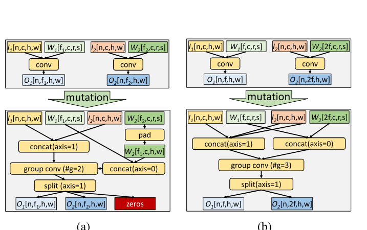

**Figure 10.** Mutants discovered by PET for Inception-v3. `axis` denotes the dimension on which to perform `concat` and `split`.

PET also discovers fully equivalent transformations that are missed by existing frameworks. The mutation corrector can successfully verify the equivalence for all output elements, in which case no correction is needed. Figure 10b shows a new equivalent transformation discovered by PET that optimizes two `conv` operators by duplicating the input tensors (i.e., $I_1$ and $I_2$) and fusing the two `conv` operators into a `groupconv`. Note that Figure 10 shows two different mutants of the same input program. PET's program optimizer can automatically select a more efficient one based on the performance of these mutants on specific devices.

#### 8.3.4 Kernel Fusion

We use CSRNet [Li18a] as an example to study the effectiveness of PET's kernel fusion optimization. Figure 11a and Figure 11b show the original and optimized model architectures of CSRNet. The numbers in each operator denote the input tensor shape. To demonstrate the correction kernel fusion and post-optimization in PET, Figure 11c shows the subprogram of a single dilated convolution before post-optimization, which contains three correction kernels and six R/T (i.e., `reshape` and `transpose`) operators. These correction kernels are fused with `Conv-4`, as described in [Section 5.3](#_5-3-fusing-correction-kernels). In addition, the multiple R/T operators between convolutions are fused into a single one during post-optimization ([Section 6.3](#_6-3-post-optimizations)).

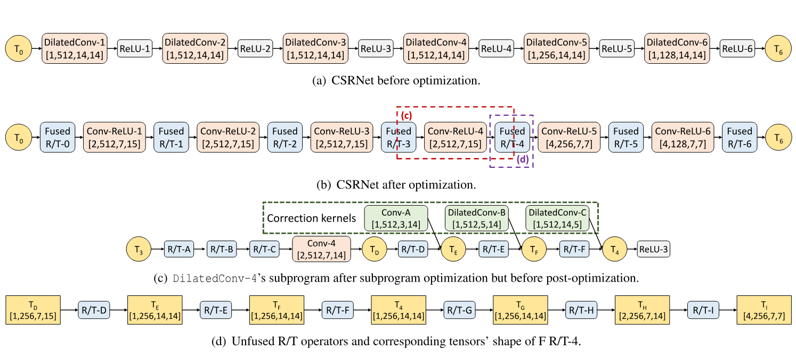

**Figure 11.** Optimization details in PET for CSRNet.

Fusing correction kernels and R/T operators is critical to PET's performance. In an ablation study, disabling kernel fusion in PET decreases the performance of the final program by 2.9x, making it even slower than the original one.

### 8.4 TVM and Ansor

PET improves tensor computations by generating and correcting partially equivalent transformations and is therefore orthogonal to and can potentially be combined with recent kernel generation techniques, such as TVM [Che18] and Ansor [Zhe20].

We evaluate PET on TVM and Ansor with a set of commonly used DNN operators, including `conv`, `dilatedconv`, `groupconv`, and `batchmatmul`, which are obtained from Resnet-18, CSRNet, Inception-v3, and BERT, respectively. Their shape configurations are listed in Table 3. To generate kernels for potential mutants during the search, we allow TVM and Ansor to run 1024 trials and use the best discovered kernels to measure the cost of the mutants.

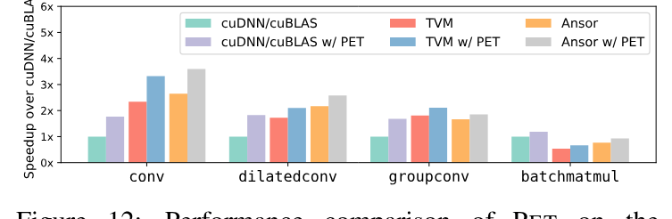

**Figure 12.** Performance comparison of PET on the cuDNN/cuBLAS, TVM, and Ansor backends. The performance is normalized to cuDNN/cuBLAS without PET.

As Figure 12 shows, when combining PET with TVM and Ansor, PET can improve the performance of the evaluated operators by up to 1.23x and 1.21x, respectively, compared to directly generating kernels for these operators. Beyond such simple combinations, joint optimization of PET and existing kernel generation techniques would uncover more benefits, which we leave as future work.

### 8.5 Ablation and Sensitivity Studies

The key insight of PET is to explore partially equivalent program mutants, while state-of-the-art frameworks only capture fully equivalent transformations [Jia19b, Zhe20]. We run several variants of PET to evaluate the benefits of considering either fully or partially equivalent program transformations, or both of them, as PET does. Figure 13 shows the results. When restricting PET to consider only equivalent transformations, it achieves similar performance gains as previous work such as TASO. Partially equivalent transformations, by themselves, enable noticeable benefits but also miss significant potential. Finally, PET achieves the highest performance by jointly considering both fully and partially equivalent transformations.

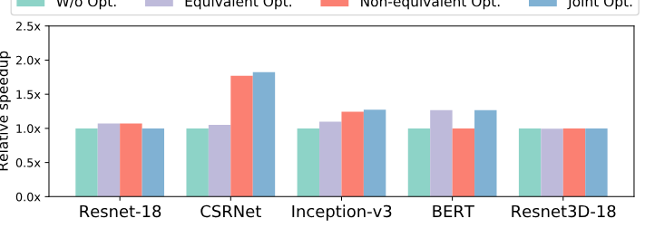

**Figure 13.** Performance comparison of tensor program optimizations using only (fully) equivalent transformations, only partially equivalent transformations, and both (as in PET).

Finally, PET relies on several heuristic parameters to balance the search time and the resultant program performance. The mutation depth in Algorithm 1 limits the maximum number of operators in a program mutant; the mutation round in Algorithm 2 specifies the maximum number of iterations to apply mutations. Larger values of these thresholds allow larger design spaces of potential mutants but also require more time to search. Figure 14 compares the performance of the optimized programs under different searching depths and rounds for Resnet-18 and CSRNet.

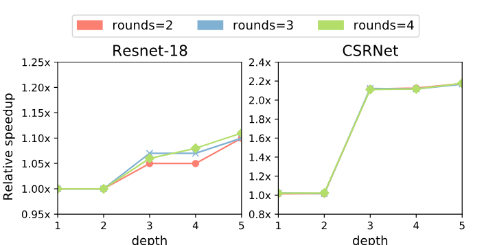

**Figure 14.** Performance comparison by using PET with different mutation depths ([Section 4.1](#_4-1-mutation-generation-algorithm)) and rounds ([Section 6.2](#_6-2-subprogram-optimization)).

The performance gains keep increasing with larger round values for Resnet-18, due to the generation of more optimized mutants, while for CSRNet, the performance improvement mainly comes from larger mutation depth. On the other hand, increasing the mutation depth from two to three improves the performance for both models significantly, since many mutations PET finds are subprograms with three operators. In summary, the key takeaway is that PET has only moderately high search complexity yet achieves significant performance gains.

### 8.6 Searching Time

PET uses a program optimizer to explore the search space of possible mutants and discover highly optimized candidates. Typically, it takes under 3 minutes (89 seconds, 88 seconds, 91 seconds, and 165 seconds on Resnet-18, CSRNet, BERT, and Resnet3D-18, respectively) for PET to find highly optimized program mutants with a batch size of 1. However, PET spends about 25 minutes optimizing Inception-v3, due to the multiple branches in the Inception modules [Sze16]. Although their search spaces are not directly comparable, PET's search time is on par with state-of-the-art DNN optimization frameworks such as TASO [Jia19b] and Ansor [Zhe20], and is acceptable because it is a one-time cost before stable deployment. We leave any further search optimizations, such as aggressive pruning and parallelization, to future work.

## 9 Related Work

#### Graph-level optimizations

TensorFlow [Aba16], TensorRT [Ten17a], TVM [Che18], and MetaFlow [Jia19] optimize tensor programs by applying substitutions that are manually designed by domain experts. TASO [Jia19b] generates graph substitutions automatically from basic operator properties, which significantly enlarges search space and reduces human effort. The key difference between PET and these frameworks is that PET can generate and correct partially equivalent transformations, enabling a significantly larger space of program optimizations.

#### Program mutation

Program mutation is a program testing technique designed to evaluate the quality of existing test cases [DeM91]. By randomly mutating the input program and running the generated mutants on existing test cases, the technique can quickly estimate the coverage of these test cases. PET generates mutants for a different purpose. Instead of testing an input tensor program, the mutants generated by PET are used for performance optimizations on the program.

#### Code generation

Halide [Rag13] is a programming language designed for high-performance tensor computing, and several works are proposed based on its scheduling model [Ada19, Li18, Mul16]. TVM [Che18, Che18a] uses a similar scheduling language and a learning-based approach to generate highly optimized code for different hardware backends. Ansor [Zhe20] explores larger search spaces than TVM and finds better optimized kernels. Tensor Comprehensions [Vas18] and Tiramisu [Bag19] use polyhedral compilation models to solve code generation problems in deep learning. As shown in [Section 8.4](#_8-4-tvm-and-ansor), PET's program-level optimizations are orthogonal and can be combined with these code generation techniques.

#### Data layout optimization

NeoCPU [Liu19] optimizes CNN models by changing the data layout and eliminating unnecessary layout transformations on CPUs, while Li et al. [Li16] explore the memory efficiency for CNNs on GPUs. Chou et al. [Cho20] introduce a language to describe the different sparse tensor formats and automatically generate code for converting data layouts. Many transformations discovered by PET also involve layout conversions. However, the key differences between PET and prior work are that PET considers more complicated layouts and combines tensor layout optimizations with operator- and graph-level optimizations.

#### AutoML

Recent work has proposed approaches to search for accurate neural architectures by iteratively proposing modifications to the models' architectures and accepting proposals with the highest accuracy gain. Examples include automatic statistician [Ste19] and TPOT [Ols16]. These approaches apply non-equivalent transformations to a model architecture and rely on expensive retraining steps to evaluate how each transformation affects model accuracy. On the contrary, PET leverages performance optimizations in non-equivalent transformations and applies automated corrections to preserve an end-to-end equivalence. As such, PET does not require retraining.

## 10 Conclusion

We present PET, the first DNN framework that optimizes tensor programs with partially equivalent transformations and automated corrections. PET discovers program transformations that improve DNN computations with only partial functional equivalence. Automated corrections are subsequently applied to restore full equivalence with the help of rigorous theoretical guarantees. The results of our evaluation show that PET outperforms existing frameworks by up to 2.5x by unlocking partially equivalent transformations that existing frameworks miss. PET is publicly available at [https://github.com/thu-pacman/PET](https://github.com/thu-pacman/PET).

## Acknowledgments

We would like to thank the anonymous reviewers and our shepherd, Behnaz Arzani, for their valuable comments and suggestions. This work is partially supported by National Natural Science Foundation of China (U20A20226, 62072262) and Beijing Natural Science Foundation (4202031). Jidong Zhai is the corresponding author of this paper ([zhaijidong@tsinghua.edu.cn](mailto:zhaijidong@tsinghua.edu.cn)).

## A Artifact Appendix

### A.1 Abstract

This artifact appendix helps the readers reproduce the main evaluation results of the OSDI '21 paper: PET: Optimizing Tensor Programs with Partially Equivalent Transformations and Automated Corrections.

### A.2 PET Usage

PET provides a C++ API to build the input tensor program, and also supports importing an input tensor program from an [ONNX](https://onnx.ai/) model. For each input tensor program, PET generates a mathematically equivalent executable that includes the performance optimizations described in this paper. PET uses cuDNN/cuBLAS as its backend by default, but users can also export the mutation subprograms with their corresponding input/output tensor shapes to use different backends like TVM and Ansor.

### A.3 Scope

The artifact can be used for evaluating and reproducing the main results of the paper, including the end-to-end evaluation, the operator-level evaluation, the performance comparison across different optimization policies and heuristic parameters, and the searching time.

### A.4 Contents

The artifact evaluation includes the following experiments:

- **E1:** An end-to-end performance comparison between PET and other frameworks (Figure 8).
- **E2:** An operator-level performance comparison on different backends, including cuDNN/cuBLAS, TVM, and Ansor (Figure 12).
- **E3:** A performance comparison across different optimization policies, including fully equivalent transformations, partially equivalent transformations, and joint optimization using both (Figure 13).
- **E4:** A performance comparison using different heuristics (Figure 14).
- **E5:** Searching time ([Section 8.6](#_8-6-searching-time)).

### A.5 Hosting

The source code of this artifact can be found on [GitHub](https://github.com/whjthu/pet-osdi21-ae), on the `master` branch at commit `9e07cb1`.

### A.6 Requirements

#### Hardware dependencies

This artifact depends on an NVIDIA V100 GPU.

#### Software dependencies

This artifact depends on the following software libraries:

- PET uses cuDNN and cuBLAS libraries as its backend. The evaluation uses CUDA 10.2 and cuDNN 7.6.5.
- TensorFlow, TensorRT, TASO, TVM, and Ansor are used as baseline DNN frameworks in E1 and E2. The baseline evaluation uses TensorFlow 1.15, TensorRT 7.0.0.11, TASO at commit `f1178f2c` (with some minor fixes for TASO to support the tested models), and TVM at commit `3950639`.

### A.7 Installation

#### A.7.1 Install PET from source

Clone the repository, then build PET:

```bash
mkdir build
cd build
cmake ..
make -j
```

Set the environment for evaluations:

```bash
export PET_HOME=path-to-pet-home
```

#### A.7.2 Install other frameworks

Please refer to the artifact evaluation instruction (`README.pdf` in the [GitHub repository](https://github.com/whjthu/pet-osdi21-ae)) or the installation instructions provided by the frameworks.

### A.8 Experiments Workflow

The following experiments are included in this artifact. All DNN benchmarks use synthetic input data in GPU device memory to remove the side effects of data transfers between CPU and GPU. The detailed running instructions can be found in the artifact evaluation instruction (`README.pdf` in the [GitHub repository](https://github.com/whjthu/pet-osdi21-ae)).

#### A.8.1 End-to-end performance (E1)

This experiment reproduces Figure 8 in the paper.

Prerequisite: generate ONNX models:

```bash
cd $PET_HOME/models-ae
./generate_onnx.sh
```

**TensorFlow and TensorFlow XLA.** The results of the four models are available in the `tensorflow_ae` folder. The following commands measure the inference latency of TensorFlow and TensorFlow XLA, respectively:

```bash
cd $PET_HOME/tf-ae
./run.sh
```

**TensorRT.** The results of the four models are available in the `tensorrt_ae` folder. Load the TensorRT environment by adding its library path to `LD_LIBRARY_PATH`, then run:

```bash
cd $PET_HOME/trt-ae
./run.sh
```

**TASO.** The results of the four models are available in the `taso_ae` folder. Load the TASO environment, then run:

```bash
cd $PET_HOME/taso-ae
./run_e2e.sh
```

**PET.** The results of the four models are available in the `pet_ae` folder:

```bash
cd $PET_HOME/pet-ae
./run_e2e.sh
```

#### A.8.2 Operator-level performance (E2)

This experiment reproduces Figure 12 in the paper. The scripts are available in the `operator_ae` folder. The experiments of TVM and Ansor take a long time to search different mutation kernels.

**cuDNN/cuBLAS.** The following commands measure cuDNN/cuBLAS results for the four operator-level benchmarks:

```bash
cd operator_ae/cudnn
./run.sh
```

**TVM and Ansor.** The scripts in `operator_ae/autotvm` and `operator_ae/ansor` search the kernels for the four operator-level benchmarks using TVM and Ansor, respectively.

#### A.8.3 Different optimization policy (E3)

This experiment reproduces Figure 13 in the paper. The scripts are available in the `pet-ae` folder:

```bash
cd $PET_HOME/pet-ae
./run_policy.sh
```

#### A.8.4 Different heuristic parameters (E4)

This experiment reproduces Figure 14 in the paper. The scripts are available in the `pet-ae` folder:

```bash
cd $PET_HOME/pet-ae
./run_param.sh
```

#### A.8.5 Searching time (E5)

This experiment reproduces [Section 8.6](#_8-6-searching-time) in the paper. The same PET commands in E1 print the searching time:

```bash
cd $PET_HOME/pet-ae
./run_e2e.sh
```

The artifact evaluation platform has different CPUs from the platform used for the paper, so the searching time could differ. Nevertheless, the results should be within the same scale.
