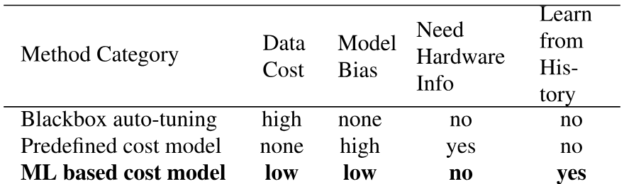
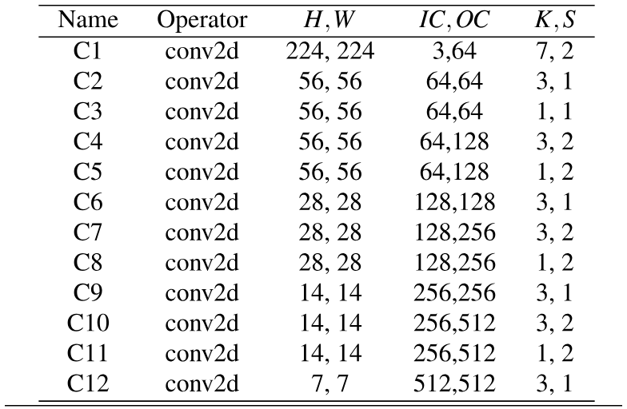

> [Tianqi Chen](https://tqchen.com/), [Thierry Moreau](https://homes.cs.washington.edu/~moreau/), [Ziheng Jiang](https://dblp.org/pid/14/8980), [Lianmin Zheng](https://lmzheng.net/), [Eddie Yan](https://dblp.org/pid/161/3140), [Meghan Cowan](https://dblp.org/pid/202/1675), [Haichen Shen](https://dblp.org/pid/34/8397), [Leyuan Wang](https://dblp.org/pid/165/7400), [Yuwei Hu](https://dblp.org/pid/120/1114), [Luis Ceze](https://www.cs.washington.edu/people/faculty/luisceze), [Carlos Guestrin](https://homes.cs.washington.edu/~guestrin/), and [Arvind Krishnamurthy](http://www.cs.washington.edu/homes/arvind/). First submitted to arXiv on February 12, 2018; current version v3. [TVM: An Automated End-to-End Optimizing Compiler for Deep Learning](https://arxiv.org/abs/1802.04799). [Original PDF](/paper/tvm.pdf). [TeX source](https://export.arxiv.org/e-print/1802.04799). The original PDF remains authoritative for the exact print layout and bibliography.

### Abstract

There is an increasing need to bring machine learning to a wide diversity of hardware devices. Current frameworks rely on vendor-specific operator libraries and optimize for a narrow range of server-class GPUs. Deploying workloads to new platforms – such as mobile phones, embedded devices, and accelerators (e.g., FPGAs, ASICs) – requires significant manual effort. We propose TVM, a compiler that exposes graph-level and operator-level optimizations to provide performance portability to deep learning workloads across diverse hardware back-ends. TVM solves optimization challenges specific to deep learning, such as high-level operator fusion, mapping to arbitrary hardware primitives, and memory latency hiding. It also automates optimization of low-level programs to hardware characteristics by employing a novel, learning-based cost modeling method for rapid exploration of code optimizations. Experimental results show that TVM delivers performance across hardware back-ends that are competitive with state-of-the-art, hand-tuned libraries for low-power CPU, mobile GPU, and server-class GPUs. We also demonstrate TVM’s ability to target new accelerator back-ends, such as the FPGA-based generic deep learning accelerator. The system is open sourced and in production use inside several major companies.

## 1 Introduction

Deep learning (DL) models can now recognize images, process natural language, and defeat humans in challenging strategy games. There is a growing demand to deploy smart applications to a wide spectrum of devices, ranging from cloud servers to self-driving cars and embedded devices. Mapping DL workloads to these devices is complicated by the diversity of hardware characteristics, including embedded CPUs, GPUs, FPGAs, and ASICs (e.g., the TPU [Jou17b]). These hardware targets diverge in terms of memory organization, compute functional units, etc., as shown in [Figure 1](#figure-01).

**Figure 1.** CPU, GPU and TPU-like accelerators require different on-chip memory architectures and compute primitives. This divergence must be addressed when generating optimized code.

Current DL frameworks, such as TensorFlow, MXNet, Caffe, and PyTorch, rely on a computational graph intermediate representation to implement optimizations, e.g., auto differentiation and dynamic memory management [Aba16b, Che15, Aga14]. Graph-level optimizations, however, are often too high-level to handle hardware back-end-specific operator-level transformations. Most of these frameworks focus on a narrow class of server-class GPU devices and delegate target-specific optimizations to highly engineered and vendor-specific operator libraries. These operator-level libraries require significant manual tuning and hence are too specialized and opaque to be easily ported across hardware devices. Providing support in various DL frameworks for diverse hardware back-ends presently requires significant engineering effort. Even for supported back-ends, frameworks must make the difficult choice between: (1) avoiding graph optimizations that yield new operators not in the predefined operator library, and (2) using unoptimized implementations of these new operators.

To enable both graph- and operator-level optimizations for diverse hardware back-ends, we take a fundamentally different, end-to-end approach. We built TVM, a compiler that takes a high-level specification of a deep learning program from existing frameworks and generates low-level optimized code for a diverse set of hardware back-ends. To be attractive to users, TVM needs to offer performance competitive with the multitude of manually optimized operator libraries across diverse hardware back-ends. This goal requires addressing the key challenges described below.

Leveraging Specific Hardware Features and Abstractions. DL accelerators introduce optimized tensor compute primitives  [Jou17b, Gpu17, Che16c], while GPUs and CPUs continuously improve their processing elements. This poses a significant challenge in generating optimized code for a given operator description. The inputs to hardware instructions are multi-dimensional, with fixed or variable lengths; they dictate different data layouts; and they have special requirements for memory hierarchy. The system must effectively exploit these complex primitives to benefit from acceleration. Further, accelerator designs also commonly favor leaner control [Jou17b] and offload most scheduling complexity to the compiler stack. For specialized accelerators, the system now needs to generate code that explicitly controls pipeline dependencies to hide memory access latency – a job that hardware performs for CPUs and GPUs.

Large Search Space for Optimization Another challenge is producing efficient code without manually tuning operators. The combinatorial choices of memory access, threading pattern, and novel hardware primitives creates a huge configuration space for generated code (e.g., loop tiles and ordering, caching, unrolling) that would incur a large search cost if we implement black box auto-tuning. One could adopt a predefined cost model to guide the search, but building an accurate cost model is difficult due to the increasing complexity of modern hardware. Furthermore, such an approach would require us to build separate cost models for each hardware type.

TVM addresses these challenges with three key modules. (1) We introduce a tensor expression language to build operators and provide program transformation primitives that generate different versions of the program with various optimizations. This layer extends Halide [Rag13a]’s compute/schedule separation concept by also separating target hardware intrinsics from transformation primitives, which enables support for novel accelerators and their corresponding new intrinsics. Moreover, we introduce new transformation primitives to address GPU-related challenges and enable deployment to specialized accelerators. We can then apply different sequences of program transformations to form a rich space of valid programs for a given operator declaration. (2) We introduce an automated program optimization framework to find optimized tensor operators. The optimizer is guided by an ML-based cost model that adapts and improves as we collect more data from a hardware back-end. (3) On top of the automatic code generator, we introduce a graph rewriter that takes full advantage of high- and operator-level optimizations.

By combining these three modules, TVM can take model descriptions from existing deep learning frameworks, perform joint high- and low-level optimizations, and generate hardware-specific optimized code for back-ends, e.g., CPUs, GPUs, and FPGA-based specialized accelerators.

This paper makes the following contributions:

- We identify the major optimization challenges in providing performance portability to deep learning workloads across diverse hardware back-ends.
- We introduce novel schedule primitives that take advantage of cross-thread memory reuse, novel hardware intrinsics, and latency hiding.
- We propose and implement a machine learning based optimization system to automatically explore and search for optimized tensor operators.
- We build an end-to-end compilation and optimization stack that allows the deployment of deep learning workloads specified in high-level frameworks (including TensorFlow, MXNet, PyTorch, Keras, CNTK) to diverse hardware back-ends (including CPUs, server GPUs, mobile GPUs, and FPGA-based accelerators). The open-sourced TVM is in production use inside several major companies.

  We evaluated TVM using real world workloads on a server-class GPU, an embedded GPU, an embedded CPU, and a custom generic FPGA-based accelerator. Experimental results show that TVM offers portable performance across back-ends and achieves speedups ranging from 1.2$\times$ to 3.8$\times$ over existing frameworks backed by hand-optimized libraries.

## 2 Overview

**Figure 2.** System overview of TVM. The current stack supports descriptions from many deep learning frameworks and exchange formats, such as CoreML and ONNX, to target major CPU, GPU and specialized accelerators.

This section describes TVM by using an example to walk through its components. [Figure 2](#figure-02) summarizes execution steps in TVM and their corresponding sections in the paper. The system first takes as input a model from an existing framework and transforms it into a computational graph representation. It then performs high-level dataflow rewriting to generate an optimized graph. The operator-level optimization module must generate efficient code for each fused operator in this graph. Operators are specified in a declarative tensor expression language; execution details are unspecified. TVM identifies a collection of possible code optimizations for a given hardware target’s operators. Possible optimizations form a large space, so we use an ML-based cost model to find optimized operators. Finally, the system packs the generated code into a deployable module.

#### End-User Example.

In a few lines of code, a user can take a model from existing deep learning frameworks and call the TVM API to get a deployable module:

![\[Uncaptioned image\]](../../papers/tvm/source-x3.png)

This compiled runtime module contains three components: the final optimized computational graph (graph), generated operators (lib), and module parameters (params). These components can then be used to deploy the model to the target back-end:

![\[Uncaptioned image\]](../../papers/tvm/source-x4.png)

TVM supports multiple deployment back-ends in languages such as C++, Java and Python. The rest of this paper describes TVM’s architecture and how a system programmer can extend it to support new back-ends.

## 3 Optimizing Computational Graphs

**Figure 3.** Example computational graph of a two-layer convolutional neural network. Each node in the graph represents an operation that consumes one or more tensors and produces one or more tensors. Tensor operations can be parameterized by attributes to configure their behavior (e.g., padding or strides).

Computational graphs are a common way to represent programs in DL frameworks [Aba16b, Bas12, Che15, Aga14].  [Figure 3](#figure-03) shows an example computational graph representation of a two-layer convolutional neural network. The main difference between this high-level representation and a low-level compiler intermediate representation (IR), such as LLVM, is that the intermediate data items are large, multi-dimensional tensors. Computational graphs provide a global view of operators, but they avoid specifying how each operator must be implemented. Like LLVM IRs, a computational graph can be transformed into functionally equivalent graphs to apply optimizations. We also take advantage of shape specificity in common DL workloads to optimize for a fixed set of input shapes.

TVM exploits a computational graph representation to apply high-level optimizations: a node represents an operation on tensors or program inputs, and edges represent data dependencies between operations. It implements many graph-level optimizations, including: operator fusion, which fuses multiple small operations together; constant-folding, which pre-computes graph parts that can be determined statically, saving execution costs; a static memory planning pass, which pre-allocates memory to hold each intermediate tensor; and data layout transformations, which transform internal data layouts into back-end-friendly forms. We now discuss operator fusion and the data layout transformation.

**Figure 4.** Performance comparison between fused and non-fused operations. TVM generates both operations. Tested on NVIDIA Titan X.

#### Operator Fusion.

Operator fusion combines multiple operators into a single kernel without saving the intermediate results in memory. This optimization can greatly reduce execution time, particularly in GPUs and specialized accelerators. Specifically, we recognize four categories of graph operators: (1) injective (one-to-one map, e.g., add), (2) reduction (e.g., sum), (3) complex-out-fusable (can fuse element-wise map to output, e.g., conv2d), and (4) opaque (cannot be fused, e.g., sort). We provide generic rules to fuse these operators, as follows. Multiple injective operators can be fused into another injective operator. A reduction operator can be fused with input injective operators (e.g., fuse scale and sum). Operators such as conv2d are complex-out-fusable, and we can fuse element-wise operators to its output. We can apply these rules to transform the computational graph into a fused version.  [Figure 4](#figure-04) demonstrates the impact of this optimization on different workloads. We find that fused operators generate up to a 1.2$\times$ to 2$\times$ speedup by reducing memory accesses.

#### Data Layout Transformation.

There are multiple ways to store a given tensor in the computational graph. The most common data layout choices are column major and row major. In practice, we may prefer to use even more complicated data layouts. For instance, a DL accelerator might exploit $4\times 4$ matrix operations, requiring data to be tiled into $4\times 4$ chunks to optimize for access locality.

Data layout optimization converts a computational graph into one that can use better internal data layouts for execution on the target hardware. It starts by specifying the preferred data layout for each operator given the constraints dictated by memory hierarchies. We then perform the proper layout transformation between a producer and a consumer if their preferred data layouts do not match.

**Figure 5.** Example schedule transformations that optimize a matrix multiplication on a specialized accelerator.

While high-level graph optimizations can greatly improve the efficiency of DL workloads, they are only as effective as what the operator library provides. Currently, the few DL frameworks that support operator fusion require the operator library to provide an implementation of the fused patterns. With more network operators introduced on a regular basis, the number of possible fused kernels can grow dramatically. This approach is no longer sustainable when targeting an increasing number of hardware back-ends since the required number of fused pattern implementations grows combinatorially with the number of data layouts, data types, and accelerator intrinsics that must be supported. It is not feasible to handcraft operator kernels for the various operations desired by a program and for each back-end. To this end, we next propose a code generation approach that can generate various possible implementations for a given model’s operators.

## 4 Generating Tensor Operations

TVM produces efficient code for each operator by generating many valid implementations on each hardware back-end and choosing an optimized implementation. This process builds on Halide’s idea of decoupling descriptions from computation rules (or schedule optimizations) [Rag13a] and extends it to support new optimizations (nested parallelism, tensorization, and latency hiding) and a wide array of hardware back-ends. We now highlight TVM-specific features.

### 4.1 Tensor Expression and Schedule Space

**Figure 6.** TVM schedule lowering and code generation process. The table lists existing Halide and novel TVM scheduling primitives being used to optimize schedules for CPUs, GPUs and accelerator back-ends. Tensorization is essential for accelerators, but it can also be used for CPUs and GPUs. Special memory-scope enables memory reuse in GPUs and explicit management of on-chip memory in accelerators. Latency hiding is specific to TPU-like accelerators.

We introduce a tensor expression language to support automatic code generation. Unlike high-level computation graph representations, where the implementation of tensor operations is opaque, each operation is described in an index formula expression language. The following code shows an example tensor expression to compute transposed matrix multiplication:

![\[Uncaptioned image\]](../../papers/tvm/source-x9.png)

Each compute operation specifies both the shape of the output tensor and an expression describing how to compute each element of it. Our tensor expression language supports common arithmetic and math operations and covers common DL operator patterns. The language does not specify the loop structure and many other execution details, and it provides flexibility for adding hardware-aware optimizations for various back-ends. Adopting the decoupled compute/schedule principle from Halide [Rag13a], we use a schedule to denote a specific mapping from a tensor expression to low-level code. Many possible schedules can perform this function.

We build a schedule by incrementally applying basic transformations (schedule primitives) that preserve the program’s logical equivalence. [Figure 5](#figure-05) shows an example of scheduling matrix multiplication on a specialized accelerator. Internally, TVM uses a data structure to keep track of the loop structure and other information as we apply schedule transformations. This information can then help generate low-level code for a given final schedule.

Our tensor expression takes cues from Halide [Rag13a], Darkroom [Heg14], and TACO [Kjo17]. Its primary enhancements include support for the new schedule optimizations discussed below. To achieve high performance on many back-ends, we must support enough schedule primitives to cover a diverse set of optimizations on different hardware back-ends. [Figure 6](#figure-06) summarizes the operation code generation process and schedule primitives that TVM supports. We reuse helpful primitives and the low-level loop program AST from Halide, and we introduce new primitives to optimize GPU and accelerator performance. The new primitives are necessary to achieve optimal GPU performance and essential for accelerators. CPU, GPU, TPU-like accelerators are three important types of hardware for deep learning. This section describes new optimization primitives for CPUs, GPUs and TPU-like accelerators, while [section 5](#S5 "5 Automating Optimization ‣ TVM: An Automated End-to-End Optimizing Compiler for Deep Learning") explains how to automatically derive efficient schedules.

### 4.2 Nested Parallelism with Cooperation

Parallelism is key to improving the efficiency of compute-intensive kernels in DL workloads. Modern GPUs offer massive parallelism, requiring us to bake parallel patterns into schedule transformations. Most existing solutions adopt a model called *nested parallelism*, a form of fork–join. This model requires a parallel schedule primitive to parallelize a data parallel task; each task can be further recursively subdivided into subtasks to exploit the target architecture’s multi-level thread hierarchy (e.g., thread groups in GPU). We call this model *shared-nothing nested parallelism* because one working thread cannot look at the data of its sibling within the same parallel computation stage.

**Figure 7.** Performance comparison between TVM with and without cooperative shared memory fetching on matrix multiplication workloads. Tested on an NVIDIA Titan X.

An alternative to the shared-nothing approach is to fetch data cooperatively. Specifically, groups of threads can cooperatively fetch the data they all need and place it into a shared memory space. [+1] This optimization can take advantage of the GPU memory hierarchy and enable data reuse across threads through shared memory regions. TVM supports this well-known GPU optimization using a schedule primitive to achieve optimal performance. The following GPU code example optimizes matrix multiplication.

![\[Uncaptioned image\]](../../papers/tvm/source-x11.png)

[Figure 7](#figure-07) demonstrates the impact of this optimization. We introduce the concept of *memory scopes* to the schedule space so that a compute stage (AS and BS in the code) can be marked as shared. Without explicit memory scopes, automatic scope inference will mark compute stages as thread-local. The shared task must compute the dependencies of all working threads in the group. Additionally, memory synchronization barriers must be properly inserted to guarantee that shared loaded data is visible to consumers. Finally, in addition to being useful to GPUs, memory scopes let us tag special memory buffers and create special lowering rules when targeting specialized DL accelerators.

**Figure 8.** TVM virtual thread lowering transforms a virtual thread-parallel program to a single instruction stream; the stream contains explicit low-level synchronizations that the hardware can interpret to recover the pipeline parallelism required to hide memory access latency.

**Figure 9.** Decoupled Access-Execute in hardware hides most memory access latency by allowing memory and computation to overlap. Execution correctness is enforced by low-level synchronization in the form of dependence token enqueueing/dequeuing actions, which the compiler stack must insert in the instruction stream.

### 4.3 Tensorization

DL workloads have high arithmetic intensity, which can typically be decomposed into tensor operators like matrix-matrix multiplication or 1D convolution. These natural decompositions have led to the recent trend of adding tensor compute primitives  [Jou17b, Gpu17, Che16c]. These new primitives create both opportunities and challenges for schedule-based compilation; while using them can improve performance, the compilation framework must seamlessly integrate them. We dub this *tensorization*: it is analogous to vectorization for SIMD architectures but has significant differences. Instruction inputs are multi-dimensional, with fixed or variable lengths, and each has different data layouts. More importantly, we cannot support a fixed set of primitives since new accelerators are emerging with their own variations of tensor instructions. We therefore need an *extensible* solution.

We make tensorization extensible by separating the target hardware intrinsic from the schedule with a mechanism for tensor-intrinsic declaration. We use the same tensor expression language to declare both the behavior of each new hardware intrinsic and the lowering rule associated with it. The following code shows how to declare an $8\times 8$ tensor hardware intrinsic.

![\[Uncaptioned image\]](../../papers/tvm/source-x14.png)

Additionally, we introduce a *tensorize* schedule primitive to replace a unit of computation with the corresponding intrinsics. The compiler matches the computation pattern with a hardware declaration and lowers it to the corresponding hardware intrinsic.

Tensorization decouples the schedule from specific hardware primitives, making it easy to extend TVM to support new hardware architectures. The generated code of tensorized schedules aligns with practices in high-performance computing: break complex operations into a sequence of micro-kernel calls. We can also use the *tensorize* primitive to take advantage of handcrafted micro-kernels, which can be beneficial in some platforms. For example, we implement ultra low precision operators for mobile CPUs that operate on data types that are one- or two-bits wide by leveraging a bit-serial matrix vector multiplication micro-kernel. This micro-kernel accumulates results into progressively larger data types to minimize the memory footprint. Presenting the micro-kernel as a tensor intrinsic to TVM yields up to a 1.5$\times$ speedup over the non-tensorized version.

### 4.4 Explicit Memory Latency Hiding

Latency hiding refers to the process of overlapping memory operations with computation to maximize utilization of memory and compute resources. It requires different strategies depending on the target hardware back-end. On CPUs, memory latency hiding is achieved implicitly with simultaneous multithreading [Egg97] or hardware prefetching [Jou90, Che95]. GPUs rely on rapid context switching of many warps of threads [Vol16]. In contrast, specialized DL accelerators such as the TPU [Jou17b] usually favor leaner control with a *decoupled access-execute* (DAE) architecture [Smi82] and offload the problem of fine-grained synchronization to software.

[Figure 9](#figure-09) shows a DAE hardware pipeline that reduces runtime latency. Compared to a monolithic hardware design, the pipeline can hide most memory access overheads and almost fully utilize compute resources. To achieve higher utilization, the instruction stream must be augmented with fine-grained synchronization operations. Without them, dependencies cannot be enforced, leading to erroneous execution. Consequently, DAE hardware pipelines require fine-grained dependence enqueuing/dequeuing operations between the pipeline stages to guarantee correct execution, as shown in [Figure 9](#figure-09)’s instruction stream.

Programming DAE accelerators that require explicit low-level synchronization is difficult. To reduce the programming burden, we introduce a virtual threading scheduling primitive that lets programmers specify a high-level data parallel program as they would a hardware back-end with support for multithreading. TVM then automatically lowers the program to a single instruction stream with low-level explicit synchronization, as shown in [Figure 8](#figure-08). The algorithm starts with a high-level multi-threaded program schedule and then inserts the necessary low-level synchronization operations to guarantee correct execution within each thread. Next, it interleaves operations of all virtual threads into a single instruction stream. Finally, the hardware recovers the available pipeline parallelism dictated by the low-level synchronizations in the instruction stream.

#### Hardware Evaluation of Latency Hiding.

**Figure 10.** Roofline [Wil09a] of an FPGA-based DL accelerator running ResNet inference. With latency hiding enabled by TVM, performance of the benchmarks is brought closer to the roofline, demonstrating higher compute and memory bandwidth efficiency.

We now demonstrate the effectiveness of latency hiding on a custom FPGA-based accelerator design, which we describe in depth in [subsection 6.4](#S6.SS4 "6.4 FPGA Accelerator Evaluation ‣ 6 Evaluation ‣ TVM: An Automated End-to-End Optimizing Compiler for Deep Learning"). We ran each layer of ResNet on the accelerator and used TVM to generate two schedules: one with latency hiding, and one without. The schedule with latency hiding parallelized the program with virtuals threads to expose pipeline parallelism and therefore hide memory access latency. Results are shown in [Figure 10](#figure-10) as a roofline diagram [Wil09a]; roofline performance diagrams provide insight into how well a given system uses computation and memory resources for different benchmarks. Overall, latency hiding improved performance on all ResNet layers. Peak compute utilization increased from 70% with no latency hiding to 88% with latency hiding.

## 5 Automating Optimization

Given the rich set of schedule primitives, our remaining problem is to find optimal operator implementations for each layer of a DL model. Here, TVM creates a specialized operator for the specific input shape and layout associated with each layer. Such specialization offers significant performance benefits (in contrast to handcrafted code that would target a smaller diversity of shapes and layouts), but it also raises automation challenges. The system needs to choose the schedule optimizations – such as modifying the loop order or optimizing for the memory hierarchy – as well as schedule-specific parameters, such as the tiling size and the loop unrolling factor. Such combinatorial choices create a large search space of operator implementations for each hardware back-end. To address this challenge, we built an automated schedule optimizer with two main components: a schedule explorer that *proposes* promising new configurations, and a machine learning cost model that *predicts* the performance of a given configuration. This section describes these components and TVM’s automated optimization flow ([Figure 11](#figure-11)).

### 5.1 Schedule Space Specification

We built a schedule template specification API to let a developer declare knobs in the schedule space. The template specification allows incorporation of a developer’s domain-specific knowledge, as necessary, when specifying possible schedules. We also created a generic master template for each hardware back-end that automatically extracts possible knobs based on the computation description expressed using the tensor expression language. At a high level, we would like to consider as many configurations as possible and let the optimizer manage the selection burden. Consequently, the optimizer must search over *billions* of possible configurations for the real world DL workloads used in our experiments.

### 5.2 ML-Based Cost Model

One way to find the best schedule from a large configuration space is through blackbox optimization, i.e., auto-tuning. This method is used to tune high performance computing libraries[Wha98, Fri98a]. However, auto-tuning requires many experiments to identify a good configuration.

An alternate approach is to build a predefined cost model to guide the search for a particular hardware back-end instead of running all possibilities and measuring their performance. Ideally, a perfect cost model considers all factors affecting performance: memory access patterns, data reuse, pipeline dependencies, and threading patterns, among others. This approach, unfortunately, is burdensome due to the increasing complexity of modern hardware. Furthermore, every new hardware target requires a new (predefined) cost model.

**Figure 11.** Overview of automated optimization framework. A schedule explorer examines the schedule space using an ML-based cost model and chooses experiments to run on a distributed device cluster via RPC. To improve its predictive power, the ML model is updated periodically using collected data recorded in a database.

**Table 1.** Comparison of automation methods. Model bias refers to inaccuracy due to modeling.

We instead take a statistical approach to solve the cost modeling problem. In this approach, a schedule explorer proposes configurations that may improve an operator’s performance. For each schedule configuration, we use an ML model that takes the lowered loop program as input and predicts its running time on a given hardware back-end. The model, trained using runtime measurement data collected during exploration, does not require the user to input detailed hardware information. We update the model periodically as we explore more configurations during optimization, which improves accuracy for other related workloads, as well. In this way, the quality of the ML model improves with more experimental trials.  [Table 1](#table-01) summarizes the key differences between automation methods. ML-based cost models strike a balance between auto-tuning and predefined cost modeling and can benefit from the historical performance data of related workloads.

#### Machine Learning Model Design Choices.

**Figure 12.** Comparison of different automation methods for a conv2d operator in ResNet-18 on TITAN X. The ML-based model starts with no training data and uses the collected data to improve itself. The Y-axis is the speedup relative to cuDNN. We observe a similar trend for other workloads.

We must consider two key factors when choosing which ML model the schedule explorer will use: *quality* and *speed*. The schedule explorer queries the cost model frequently, which incurs overheads due to model prediction time and model refitting time. To be useful, these overheads must be smaller than the time it takes to measure performance on real hardware, which can be on the order of seconds depending on the specific workload/hardware target. This speed requirement differentiates our problem from traditional hyperparameter tuning problems, where the cost of performing measurements is very high relative to model overheads, and more expensive models can be used. In addition to the choice of model, we need to choose an objective function to train the model, such as the error in a configuration’s predicted running time. However, since the explorer selects the top candidates based only on the relative order of the prediction (A runs faster than B), we need not predict the absolute execution times directly. Instead, we use a rank objective to predict the relative order of runtime costs.

**Figure 13.** Example workflow of ML cost models. XGBoost predicts costs based on loop program features. TreeRNN directly summarizes the AST.

We implement several types of models in our ML optimizer. We employ a gradient tree boosting model (based on XGBoost [Che16b]), which makes predictions based on features extracted from the loop program; these features include the memory access count and reuse ratio of each memory buffer at each loop level, as well as a one-hot encoding of loop annotations such as “vectorize”, “unroll”, and “parallel.” We also evaluate a neural network model that uses TreeRNN [Tai15] to summarize the loop program’s AST without feature engineering. [Figure 13](#figure-13) summarizes the workflow of the cost models. We found that tree boosting and TreeRNN have similar predictive quality. However, the former performs prediction twice as fast and costs much less time to train. As a result, we chose gradient tree boosting as the default cost model in our experiments. Nevertheless, we believe that both approaches are valuable and expect more future research on this problem.

On average, the tree boosting model does prediction in 0.67 ms, thousands of times faster than running a real measurement. [Figure 12](#figure-12) compares an ML-based optimizer to blackbox auto-tuning methods; the former finds better configurations much faster than the latter.

### 5.3 Schedule Exploration

Once we choose a cost model, we can use it to select promising configurations on which to iteratively run real measurements. In each iteration, the explorer uses the ML model’s predictions to select a batch of candidates on which to run the measurements. The collected data is then used as training data to update the model. If no initial training data exists, the explorer picks random candidates to measure.

The simplest exploration algorithm enumerates and runs every configuration through the cost model, selecting the top-$k$ predicted performers. However, this strategy becomes intractable with large search spaces. Instead, we run a parallel simulated annealing algorithm [Kir83]. The explorer starts with random configurations, and, at each step, randomly walks to a nearby configuration. This transition is successful if cost decreases as predicted by the cost model. It is likely to fail (reject) if the target configuration has a higher cost. The random walk tends to converge on configurations that have lower costs as predicted by the cost model. Exploration states persist across cost model updates; we continue from the last configuration after these updates.

### 5.4 Distributed Device Pool and RPC

A distributed device pool scales up the running of on-hardware trials and enables fine-grained resource sharing among multiple optimization jobs. TVM implements a customized, RPC-based distributed device pool that enables clients to run programs on a specific type of device. We can use this interface to compile a program on the host compiler, request a remote device, run the function remotely, and access results in the same script on the host. TVM’s RPC supports dynamic upload and runs cross-compiled modules and functions that use its runtime convention. As a result, the same infrastructure can perform a single workload optimization and end-to-end graph inference. Our approach automates the compile, run, and profile steps across multiple devices. This infrastructure is especially critical for embedded devices, which traditionally require tedious manual effort for cross-compilation, code deployment, and measurement.

## 6 Evaluation

**Table 2.** Configurations of all conv2d operators in ResNet-18 and all depthwise conv2d operators in MobileNet used in the single kernel experiments. H/W denotes height and width, IC input channels, OC output channels, K kernel size, and S stride size. All ops use “SAME” padding. All depthwise conv2d operations have channel multipliers of 1.

TVM’s core is implemented in C++ ($\sim$50k LoC). We provide language bindings to Python and Java. Earlier sections of this paper evaluated the impact of several individual optimizations and components of TVM, namely, operator fusion in [Figure 4](#figure-04), latency hiding in [Figure 10](#figure-10), and the ML-based cost model in [Figure 12](#figure-12). We now focus on an end-to-end evaluation that aims to answer the following questions:

- Can TVM optimize DL workloads over multiple platforms?
- How does TVM compare to existing DL frameworks (which rely on heavily optimized libraries) on each back-end?
- Can TVM support new, emerging DL workloads (e.g., depthwise convolution, low precision operations)?
- Can TVM support and optimize for new specialized accelerators?

To answer these questions, we evaluated TVM on four types of platforms: (1) a server-class GPU, (2) an embedded GPU, (3) an embedded CPU, and (4) a DL accelerator implemented on a low-power FPGA SoC. The benchmarks are based on real world DL inference workloads, including ResNet [He16b], MobileNet [How17a], the LSTM Language Model [Zar14], the Deep Q Network (DQN) [Mni15] and Deep Convolutional Generative Adversarial Networks (DCGAN) [Rad15]. We compare our approach to existing DL frameworks, including MxNet [Che15] and TensorFlow [Aba15], that rely on highly engineered, vendor-specific libraries. TVM performs end-to-end automatic optimization and code generation *without the need for an external operator library*.

### 6.1 Server-Class GPU Evaluation

**Figure 14.** GPU end-to-end evaluation for TVM, MXNet, Tensorflow, and Tensorflow XLA. Tested on the NVIDIA Titan X.

We first compared the end-to-end performance of deep neural networks TVM, MXNet (v1.1), Tensorflow (v1.7), and Tensorflow XLA on an Nvidia Titan X. MXNet and Tensorflow both use cuDNN v7 for convolution operators; they implement their own versions of depthwise convolution since it is relatively new and not yet supported by the latest libraries. They also use cuBLAS v8 for matrix multiplications. On the other hand, Tensorflow XLA uses JIT compilation.

[Figure 14](#figure-14) shows that TVM outperforms the baselines, with speedups ranging from 1.6$\times$ to 3.8$\times$ due to both joint graph optimization and the automatic optimizer, which generates high-performance fused operators. DQN’s 3.8 x speedup results from its use of unconventional operators (4$\times$4 conv2d, strides=2) that are not well optimized by cuDNN; the ResNet workloads are more conventional. TVM automatically finds optimized operators in both cases.

**Figure 15.** Relative speedup of all conv2d operators in ResNet-18 and all depthwise conv2d operators in MobileNet. Tested on a TITAN X. See [Table 2](#table-02) for operator configurations. We also include a weight pre-transformed Winograd [Lav16a] for 3x3 conv2d (TVM PT).

To evaluate the effectiveness of operator level optimization, we also perform a breakdown comparison for each tensor operator in ResNet and MobileNet, shown in [Figure 15](#figure-15). We include TensorComprehension (TC, commit: ef644ba) [Vas18a], a recently introduced auto-tuning framework, as an additional baseline. [+2] TC results include the best kernels it found in $10$ generations $\times$ $100$ population $\times$ $2$ random seeds for each operator (i.e., 2000 trials per operator). 2D convolution, one of the most important DL operators, is heavily optimized by cuDNN. However, TVM can still generate better GPU kernels for most layers. Depthwise convolution is a newly introduced operator with a simpler structure [How17a]. In this case, both TVM and TC can find fast kernels compared to MXNet’s handcrafted kernels. TVM’s improvements are mainly due to its exploration of a large schedule space and an effective ML-based search algorithm.

### 6.2 Embedded CPU Evaluation

**Figure 16.** ARM A53 end-to-end evaluation of TVM and TFLite.

**Figure 17.** Relative speedup of all conv2d operators in ResNet-18 and all depthwise conv2d operators in mobilenet. Tested on ARM A53. See [Table 2](#table-02) for the configurations of these operators.

We evaluated the performance of TVM on an ARM Cortex A53 (Quad Core 1.2GHz). We used Tensorflow Lite (TFLite, commit: 7558b085) as our baseline system. [Figure 17](#figure-17) compares TVM operators to hand-optimized ones for ResNet and MobileNet. We observe that TVM generates operators that outperform the hand-optimized TFLite versions for both neural network workloads. This result also demonstrates TVM’s ability to quickly optimize emerging tensor operators, such as depthwise convolution operators. Finally,  [Figure 16](#figure-16) shows an end-to-end comparison of three workloads, where TVM outperforms the TFLite baseline. [+3]

#### Ultra Low-Precision Operators

We demonstrate TVM’s ability to support ultra low-precision inference [Cou15a, Ras16a] by generating highly optimized operators for fixed-point data types of less than 8-bits. Low-precision networks replace expensive multiplication with vectorized bit-serial multiplication that is composed of bitwise and popcount reductions [Tul17]. Achieving efficient low-precision inference requires packing quantized data types into wider standard data types, such as int8 or int32. Our system generates code that outperforms hand-optimized libraries from Caffe2 (commit: 39e07f7)[Tul17]. We implemented an ARM-specific *tensorization* intrinsic that leverages ARM instructions to build an efficient, low-precision matrix-vector microkernel.We then used TVM’s automated optimizer to explore the scheduling space.

**Figure 18.** Relative speedup of single- and multi-threaded low-precision conv2d operators in ResNet. Baseline was a single-threaded, hand-optimized implementation from Caffe2 (commit: 39e07f7). C5, C3 are 1x1 convolutions that have less compute intensity, resulting in less speedup by multi-threading.

[Figure 18](#figure-18) compares TVM to the Caffe2 ultra low-precision library on ResNet for 2-bit activations, 1-bit weights inference. Since the baseline is single threaded, we also compare it to a single-threaded TVM version. Single-threaded TVM outperforms the baseline, particularly for C5, C8, and C11 layers; these are convolution layers of kernel size $1\times 1$ and stride of 2 for which the ultra low-precision baseline library is not optimized. Furthermore, we take advantage of additional TVM capabilities to produce a parallel library implementation that shows improvement over the baseline. In addition to the 2-bit+1-bit configuration, TVM can generate and optimize for other precision configurations that are unsupported by the baseline library, offering improved flexibility.

### 6.3 Embedded GPU Evaluation

For our mobile GPU experiments, we ran our end-to-end pipeline on a Firefly-RK3399 board equipped with an ARM Mali-T860MP4 GPU. The baseline was a vendor-provided library, the ARM Compute Library (v18.03). As shown in [Figure 19](#figure-19), we outperformed the baseline on three available models for both float16 and float32 (DCGAN and LSTM are not yet supported by the baseline). The speedup ranged from 1.2$\times$ to 1.6$\times$.

**Figure 19.** End-to-end experiment results on Mali-T860MP4. Two data types, float32 and float16, were evaluated.

### 6.4 FPGA Accelerator Evaluation

#### Vanilla Deep Learning Accelerator

We now relate how TVM tackled accelerator-specific code generation on a generic inference accelerator design we prototyped on an FPGA. We used in this evaluation the Vanilla Deep Learning Accelerator (VDLA) – which distills characteristics from previous accelerator proposals [Liu15, Che16c, Jou17b] into a minimalist hardware architecture – to demonstrate TVM’s ability to generate highly efficient schedules that can target specialized accelerators.  [Figure 20](#figure-20) shows the high-level hardware organization of the VDLA architecture. VDLA is programmed as a tensor processor to efficiently execute operations with high compute intensity (e.g, matrix multiplication, high dimensional convolution). It can perform load/store operations to bring blocked 3-dimensional tensors from DRAM into a contiguous region of SRAM. It also provides specialized on-chip memories for network parameters, layer inputs (narrow data type), and layer outputs (wide data type). Finally, VDLA provides explicit synchronization control over successive loads, computes, and stores to maximize the overlap between memory and compute operations.

#### Methodology.

We implemented the VDLA design on a low-power PYNQ board that incorporates an ARM Cortex A9 dual core CPU clocked at 667MHz and an Artix-7 based FPGA fabric. On these modest FPGA resources, we implemented a $16\times 16$ matrix-vector unit clocked at 200MHz that performs products of 8-bit values and accumulates them into a 32-bit register every cycle. The theoretical peak throughput of this VDLA design is about 102.4GOPS/s. We allocated 32kB of resources for activation storage, 32kB for parameter storage, 32kB for microcode buffers, and 128kB for the register file. These on-chip buffers are by no means large enough to provide sufficient on-chip storage for a single layer of ResNet and therefore enable a case study on effective memory reuse and latency hiding.

We built a driver library for VDLA with a C runtime API that constructs instructions and pushes them to the target accelerator for execution. Our code generation algorithm then translates the accelerator program to a series of calls into the runtime API. Adding the specialized accelerator back-end took $\sim$2k LoC in Python.

#### End-to-End ResNet Evaluation.

We used TVM to generate ResNet inference kernels on the PYNQ platform and offloaded as many layers as possible to VDLA. We also used it to generate both schedules for the CPU only and CPU+FPGA implementation. Due to its shallow convolution depth, the first ResNet convolution layer could not be efficiently offloaded on the FPGA and was instead computed on the CPU. All other convolution layers in ResNet, however, were amenable to efficient offloading. Operations like residual layers and activations were also performed on the CPU since VDLA does not support these operations.

**Figure 20.** VDLA Hardware design overview.

[Figure 21](#figure-21) breaks down ResNet inference time into CPU-only execution and CPU+FPGA execution. Most computation was spent on the convolution layers that could be offloaded to VDLA. For those convolution layers, the achieved speedup was 40$\times$. Unfortunately, due to Amdahl’s law, the overall performance of the FPGA accelerated system was bottlenecked by the sections of the workload that had to be executed on the CPU. We envision that extending the VDLA design to support these other operators will help reduce cost even further. This FPGA-based experiment showcases TVM’s ability to adapt to new architectures and the hardware intrinsics they expose.

## 7 Related Work

Deep learning frameworks [Aba16b, Bas12, Che15, Aga14] provide convenient interfaces for users to express DL workloads and deploy them easily on different hardware back-ends. While existing frameworks currently depend on vendor-specific tensor operator libraries to execute their workloads, they can leverage TVM’s stack to generate optimized code for a larger number of hardware devices.

High-level computation graph DSLs are a typical way to represent and perform high-level optimizations. Tensorflow’s XLA [Aba16b] and the recently introduced DLVM [Wei17] fall into this category. The representations of computation graphs in these works are similar, and a high-level computation graph DSL is also used in this paper. While graph-level representations are a good fit for high-level optimizations, they are too high level to optimize tensor operators under a diverse set of hardware back-ends. Prior work relies on specific lowering rules to directly generate low-level LLVM or resorts to vendor-crafted libraries. These approaches require significant engineering effort for each hardware back-end and operator-variant combination.

**Figure 21.** We offloaded convolutions in the ResNet workload to an FPGA-based accelerator. The grayed-out bars correspond to layers that could not be accelerated by the FPGA and therefore had to run on the CPU. The FPGA provided a 40x acceleration on offloaded convolution layers over the Cortex A9.

Halide [Rag13a] introduced the idea of separating computing and scheduling. We adopt Halide’s insights and reuse its existing useful scheduling primitives in our compiler. Our tensor operator scheduling is also related to other work on DSL for GPUs [Ste17, Hen17, Suj11, Klo14] and polyhedral-based loop transformation [Bag15, Ver13]. TACO [Kjo17] introduces a generic way to generate sparse tensor operators on CPU. Weld [Pal17] is a DSL for data processing tasks. We specifically focus on solving the new scheduling challenges of DL workloads for GPUs and specialized accelerators. Our new primitives can potentially be adopted by the optimization pipelines in these works.

High-performance libraries such as ATLAS [Wha98] and FFTW [Fri98a] use auto-tuning to get the best performance. Tensor comprehension [Vas18a] applied black-box auto-tuning together with polyhedral optimizations to optimize CUDA kernels. OpenTuner [Ans14] and existing hyper parameter-tuning algorithms [Li16a] apply domain-agnostic search. A predefined cost model is used to automatically schedule image processing pipelines in Halide [Mul16a]. TVM’s ML model uses effective domain-aware cost modeling that considers program structure. The based distributed schedule optimizer scales to a larger search space and can find state-of-the-art kernels on a large range of supported back-ends. More importantly, we provide an end-to-end stack that can take descriptions directly from DL frameworks and jointly optimize together with the graph-level stack.

Despite the emerging popularity of accelerators for deep learning [Jou17b, Che14a], it remains unclear how a compilation stack can be built to effectively target these devices. The VDLA design used in our evaluation provides a generic way to summarize the properties of TPU-like accelerators and enables a concrete case study on how to compile code for accelerators. Our approach could potentially benefit existing systems that compile deep learning to FPGA [Sha16, Umu16], as well. This paper provides a generic solution to effectively target accelerators via tensorization and compiler-driven latency hiding.

## 8 Conclusion

We proposed an end-to-end compilation stack to solve fundamental optimization challenges for deep learning across a diverse set of hardware back-ends. Our system includes automated end-to-end optimization, which is historically a labor-intensive and highly specialized task. We hope this work will encourage additional studies of end-to-end compilation approaches and open new opportunities for DL system software-hardware co-design techniques.

## Acknowledgement

We would like to thank Ras Bodik, James Bornholt, Xi Wang, Tom Anderson and Qiao Zhang for their thorough feedback on earlier versions of this paper. We would also like to thank members of Sampa, SAMPL and Systems groups at the Allen School for their feedback on the work and manuscript. We would like to thank the anonymous OSDI reviewers, and our shepherd, Ranjita Bhagwan, for helpful feedbacks. This work was supported in part by a Google PhD Fellowship for Tianqi Chen, ONR award #N00014-16-1-2795, NSF under grants CCF-1518703, CNS-1614717, and CCF-1723352, and gifts from Intel (under the CAPA program), Oracle, Huawei and anonymous sources.

[+1]: Halide recently added shared memory support but without general memory scope for accelerators.

[+2]: According to personal communication [Vas18b], TC is not yet meant to be used for compute-bound problems. However, it is still a good reference baseline to include in the comparison.

[+3]: DCGAN and LSTM results are not presented because they are not yet supported by the baseline.
