> [Yining Shi](https://dblp.org/pid/161/3927-1.html) [+internship], [Zhi Yang](https://yangzhihome.github.io/), [Jilong Xue](https://dblp.org/pid/06/10336.html), [Lingxiao Ma](https://xysmlx.github.io/), [Yuqing Xia](https://dblp.org/pid/211/8365.html), [Ziming Miao](https://dblp.org/pid/216/9568.html), [Yuxiao Guo](https://dblp.org/pid/22/329-1.html), [Fan Yang](https://dblp.org/pid/29/3081-24.html), and [Lidong Zhou](https://www.microsoft.com/en-us/research/people/lidongz/). Published in July 2023 in the *17th USENIX Symposium on Operating Systems Design and Implementation (OSDI 23)*, pages 701-718. [Welder: Scheduling Deep Learning Memory Access via Tile-graph](https://www.usenix.org/conference/osdi23/presentation/shi). <a href="/paper/welder.pdf" target="_blank" rel="noopener noreferrer">Original PDF</a>. No arXiv record or TeX source is available; the published PDF remains authoritative for the exact wording, print layout, and bibliography.

## Abstract

With the growing demand for processing higher fidelity data and the use of faster computing cores in newer hardware accelerators, modern deep neural networks (DNNs) are becoming increasingly memory intensive. A disparity between underutilized computing cores and saturated memory bandwidth has been observed in various popular DNN models. This inefficiency is caused by both the conventional treatment of DNNs as compute-intensive workloads and the lack of holistic memory access optimization in DNN models.

In this paper, we introduce WELDER, a deep learning compiler that optimizes the execution efficiency from a holistic memory access perspective. The core of WELDER is tile-graph, an abstraction that facilitates fine-grained data management at tile level. By leveraging the observation of optimization independence across memory layers, WELDER is able to decompose the whole combinatorial DNN optimization space into several independent ones and effectively trade off between intra- and inter-operator data reuse using a tile traffic-based cost model. This allows WELDER to unify previous ad-hoc memory optimizations into a single space, generate efficient execution plans with 89 more optimization patterns, and outperform state-of-the-art solutions significantly. WELDER is also able to handle DNN models with arbitrarily large input by combining the existing accelerator memory and host memory as a whole system.

## 1 Introduction

Deep neural networks (DNNs) have been used in a wide range of tasks like vision and language analysis and synthesis. Conventional wisdom treats DNNs as compute-intensive workloads. A DNN model is often defined as a dataflow graph (DFG), where each node represents a compute-intensive operator (e.g., matrix multiplication). These operators are offloaded to modern accelerators with massive parallel computing cores, such as GPUs and TPUs [Jou21], to speed up computation. To utilize accelerators efficiently, DNN frameworks and compilers explore various optimization techniques, such as code specialization [Che18e, Zhe20, Zhu22] and operator fusion [Che18e, Ma20a].

Although these computation centric optimizations are shown effective for classic DNN models, we observe that modern DNNs are becoming increasingly memory intensive. Our profiling on a range of state-of-the-art DNN models reveals that the bottleneck of the end-to-end DNN computation is mostly on GPU memory. The memory bandwidth utilization can be as high as 96.7% while the average utilization of computing cores is only 51.6% ([Section 2](#section-2)). Moreover, we observe the disparity between the underutilized cores and the saturated memory bandwidth could become even larger with the evolution of both hardware and DNN models. Modern models are processing higher fidelity data, e.g., larger images, longer sentences, high-definition graphics, which consume more memory bandwidth in the computation. Furthermore, the faster computing cores (e.g., TensorCore [Nvi17]) impose an even greater pressure on memory.

Optimizing memory intensive DNN workloads is challenging as it requires improving the sophisticated data access and reuse patterns across multiple memory layers (e.g., GPU DRAM and shared memory). From the memory perspective, DNN computation comprises of a repetitive process for each operator to 1) load input tensors across memory hierarchy, 2) compute at the cores, and 3) store the resulting tensors across memory hierarchy. To derive a good data access pattern, it requires a careful calculation of the size of tile, a partition of a tensor, along each tile dimension. Such a tiling strategy is already difficult to obtain in existing practice [Cut23, Zhe20, Zhu22]. As a further complication, due to the different algorithmic semantics, each operator may require a different data access patterns. Such diversity across operators makes inter-operator data reuse especially challenging, and often infeasible. If the derived tile shape of an operator at a certain memory layer does not match that of a downstream operator, it is difficult to reuse the tile at that layer. Consequently, existing approaches either focus on intra-operator optimization and leave all inter-operator intermediate tensors in the lowest memory layer (e.g., GPU memory), or rely on rule-based operator fusions to alleviate the inter-operator memory overhead. These rules are only applicable for specific operator combinations (e.g., register fusion for element-wise operators [Pyt17, Aba16c, Che18e], shared memory fusion for a limited set of operator types [Zhe22f]) and can be suboptimal when having different input sizes or running on different hardware configurations.

In this paper, we introduce WELDER, a deep learning compiler that holistically optimizes memory access for end-to-end DNN models consisting of general operators. The design of WELDER is based on three key observations. First, to resolve potential tile shape conflicts between two adjacent operators, we observe that their aligned tile shape can be automatically inferred by propagating an output tile shape from back to front, given that the computing logic in each operator can be accurately preserved (e.g., through the tensor expression). Second, to decide which tile shape will lead to better performance, by enforcing the computation pattern to be aligned with hardware feature (e.g., TensorCore), we can just minimize the data traffic across all memory layers. Given the operators with aligned tile configuration, we notice that their data traffic can be easily modeled based on their input/output tile sizes and the input/output tensor shapes. Finally, when considering the whole memory hierarchy, we observe that the optimization of memory traffic is inherently independent across memory layers, i.e., inter-layer independence. Particularly, the above traffic model is determined only by the tile configuration at the memory layer of interest. These observations allow us to optimize the whole space with an effective process: starting from aligning two adjacent operators at independent memory layers, deciding their optimal tiling size at the right memory layer guided by traffic costs, and expanding the optimization to include further operators.

WELDER incorporates these insights into a new DNN compiler design. First, to facilitate fine-grained data management, WELDER proposes tile-graph, a tile-level data-flow graph to model DNN computation. Each node in the graph processes one data tile of a tensor at a time. To map DNN computation to a multi-layered memory hierarchy, WELDER allows the control of each node's data tile size and the desired memory layer to reuse the data tile between two nodes. Specifically, WELDER provides a SetConnect interface to set the data reuse layer for each edge and a Propagate interface to infer the tile configurations within a group of connected nodes. Second, to efficiently optimize the tile level data-flow scheduling holistically, WELDER exploits the inter-layer independence properties in the data-flow computation to decouple the optimization space into multiple sub-spaces. Based on this, WELDER proposes a two-layered scheduling policy that enumerates different memory connection options for each edge and decides on an efficient tile configuration for each sub-space guided by the traffic cost model. Finally, the optimized execution plan is mapped to executable code for a specific hardware accelerator through four abstracted computing interfaces defined in the hardware layer: Allocate, LoadTiles, ComputeTile, and StoreTiles.

With the tile level holistic data-flow scheduling, WELDER is the first to unify all common operator fusions (e.g., register-based element-wise fusion, shared-memory fusion, etc.) into a single framework. This generality allows WELDER to find 89 uncommon operator fusion patterns automatically that are mostly unexplored by existing rule-based approaches ([Section 5.2](#section-5-2)). Interestingly, our approach can easily support new requirements for handling DNN models with arbitrarily large input (e.g., high-resolution images), where even a single operator may be too large to fit in the GPU memory. Specifically, by extending the current memory hierarchy with additional layers (e.g., host memory), WELDER can generate an optimized execution plan across the combined hierarchy of host and device memory.

We have implemented WELDER on top of TVM [Che18e], Rammer [Ma20a] and Roller [Zhu22]. Our evaluation is conducted on 10 state-of-the-art DNN models covering both classic and recent model structures for various tasks including vision, NLP, 3D-graphics, etc. The evaluation results show that WELDER significantly outperforms the state-of-the-art DNN framework and compilers like PyTorch, ONNXRuntime, and Ansor on both NVIDIA and AMD GPUs, with up to 21.4×, 8.7×, 2.8× speedups, respectively. WELDER's automatic optimization even outperforms TensorRT [Ten17a] and Faster Transformer [Fas21], which are a highly optimized handcrafted DNN inference library and a model-specific implementation from NVIDIA, with up to 3.0× and 1.7× speedups. Furthermore, when running these models on hardware with faster computing cores such as TensorCore, we observe a larger improvement in performance, highlighting the importance of memory optimization for future AI accelerators.

## 2 Motivation

Modern DNNs are memory-bounded. [Figure 1](#figure-01) presents the average GPU utilization, including both computational FLOPS and global memory throughput, for a representative DNN benchmark running with ONNXRuntime [Onn21]. As shown, the average computation utilization is only 51.6% while memory utilization is 96.7%. When examining the model types, we find that ResNet and BERT, which are dominated by convolution and matrix multiplication operators and can achieve relatively high computation utilization (e.g., >80%), are two representative classical models. However, the remaining models, which are popular models proposed in recent years, exhibit low computation efficiency due to introducing more memory-intensive patterns beyond compute-intensive operators. Additionally, we observe that the new DNN models often have a higher ratio of memory store traffic to load traffic compared to classical models. The primary reason is these models tend to process high-fidelity data and generate large activations across layers. However, current systems such as ONNXRuntime have limited optimizations for reducing inter-operator traffic. This indicates that these models will frequently exchange large intermediate data across operators through global memory. The results highlight the need for optimizing memory access efficiency across operators.

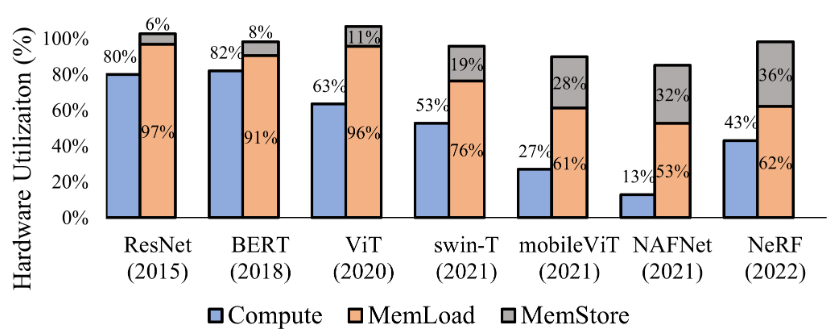

**Figure 1.** Computation FLOPS and memory bandwidth utilization for different models on NVIDIA V100 GPU.

**Conflicted intra- and inter-operator data reuse patterns.** Optimizing intra-operator and inter-operator data reuse simultaneously is challenging. An operator is often implemented as nested multi-level loops over all tensor dimensions. Within the operator, the data reuse across multiple memory layers are often implicitly optimized using sophisticated loop tiling techniques [Cut23, Zhe20, Zhu22]. We consider a typical pattern of two consecutive operators, i.e., Matmul and Softmax. When the two operators are optimized independently, their optimal tile sizes in shared memory are different, e.g., $[32\times64]$ for Matmul and $[4\times128]$ for Softmax. As a result, Softmax is unable to reuse the intermediate data from Matmul in shared memory, leading to a total latency of 0.36ms, as shown in [Figure 2](#figure-02). However, if we force them to take into account both intra- and inter-operator data reuse, the fused operator latency can be reduced to 0.29ms, achieving a 1.26x speedup. Upon examining their aligned tile size (i.e., $[16\times128]$), we observe that both operators sacrifice their own efficiency (e.g., with 15% and 4% performance degradation when running separately, due to suboptimal data tile for intra-operator data reuse) in favor of overall efficiency. This demonstrates the need for an efficient data reuse solution across intra-operator and inter-operator to optimize memory access holistically.

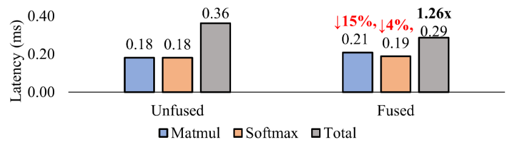

**Figure 2.** Latency numbers of unfused, fused, and each individual kernels of Matmul and Softmax.

**Key observations.** Through a further analysis on the example in [Figure 2](#figure-02), we have identified three key observations. First, an aligned tile configuration across operators can be deduced based on a chain of shape inference starting from an output tile shape. For example, if we want to compute a [4×128] output tile of Softmax, based on its computing logic (e.g., tensor expression), we can deduce that its dependent input tile shape is also [4×128]. Then, by using [4×128] as the output tile of Matmul, we can further deduce that input tile shapes of Matmul will be [4×k] and [k×128], where k is an reduction size that can be set as any number not exceeding the reduction dimension size of the Matmul. In this way, the two operators can be fused by reusing the intermediate data tile ([4×128]) in shared memory.

Second, given the aligned tile configuration and the original tensor shapes, the total memory traffic can be easily derived analytically. In this example, the Matmul takes input tensors A in shape [98304×64] and B in [64×128] respectively, and an output tensor C in [98304×128]. The Softmax then takes C as input and produces an output tensor D in the same shape. Input tensors A, B, and the output tensor D are in global memory. Given these shapes, we can first calculate the memory traffic when computing a single output tile (i.e., [4×128]) of tensor D. To do so, it will first load a tile of shape [4×k] from tensor A and a [k×128] tile from tensor B for Matmul, and then the intermediate tile [4×128] will be consumed by Softmax in shared memory, and write a tile of shape [4×128] to tensor D, where the k can be replaced as 64 given the input tensor shape of [98304×64]. Thus, the total traffic incurred in global memory for an individual output tile is 35KB ((4*64+64*128+4*128)*4Bytes(FP32)), where the traffic of the intermediate tile [4×128] is saved due to data reuse in shared memory. To compute the full output tensor D, a total of 24,576 such computations are required (i.e., (98304*128)/(4*128), resulting in a total global memory traffic of 840MB (i.e., 24,576*35KB). Interestingly, changing the output tile to [16×128] will reduce the total traffic to only 264MB, following the same calculation.

Finally, our traffic-cost calculation is only determined by the tile configuration at the memory layer of interest, e.g., the output tile shapes of [4×128] or [16×128] in shared memory, once the tensor shapes are specified. This allows us to choose the tile size for each layer independently in order to optimize the traffic cost from the lower memory layers.

These observations together provide us an effective way to optimize memory access holistically, i.e., aligning a group of adjacent operators through an output tile shape, deciding on the best tile shape based on memory traffic, and optimizing for each memory layer independently. In this way, WELDER is able to change the original coarse-grained inter-operator dependency into a more fine-grained tile-level dependency, which essentially removes some false barriers between operators and enables more concurrency.

## 3 WELDER Design

The observations in [Section 2](#section-2) motivate WELDER, a deep learning compiler that aims to improve the performance of modern DNNs in a holistic memory access scheduling space. [Figure 3](#figure-03) shows the system overview. WELDER takes a full DNN model as input and converts it into a data-flow graph of tile-based computing tasks (i.e., operator-tiles), which is called tile-graph ([Section 3.1](#section-3-1)). A tile-graph provides fine-grained control over data tile configurations and memory placement. Given a tile-graph, WELDER resolves the intra-operator and inter-operator data-reuse conflicts through a "first-connect-then-schedule" approach: it first assumes two adjacent operators can reuse data tile at a certain memory layer (i.e., connect), and then derives the best common tile shape to see if the total memory traffic can be reduced. To facilitate this goal, WELDER provides two tile-graph scheduling interfaces: SetConnect and Propagate (for the chain of shape inference). Based on this, we propose a two-step scheduling algorithm, i.e., graph connecting and sub-graph scheduling, to recursively decide an efficient tile-graph execution plan for multiple memory layers, known as a hierarchical tile-graph ([Section 3.2](#section-3-2)). Finally, this plan is then mapped to an executable code for a specific hardware accelerator using four abstracted computing interfaces defined in the hardware layer, i.e., Allocate, LoadTiles, ComputeTile, and StoreTiles ([Section 3.3](#section-3-3)). The memory specification of the abstracted accelerator is used by the tile-graph scheduling layer to guide the optimization process.

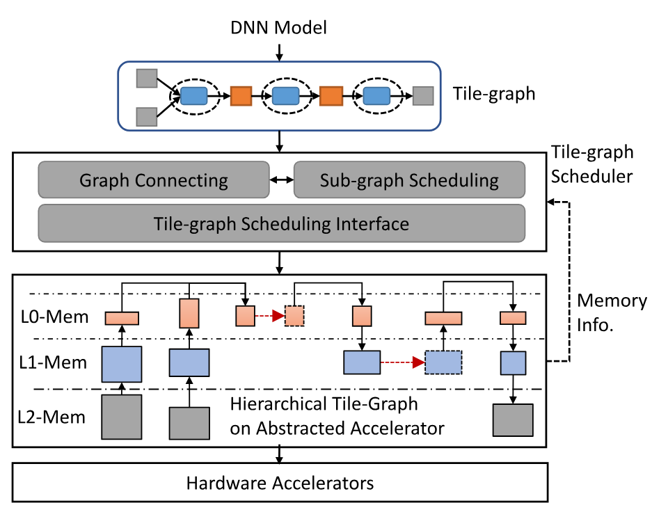

**Figure 3.** System overview of WELDER.

### 3.1 Operator-tile and Tile-graph

WELDER defines DNN computation in a fine-grained task granularity named operator-tile. A DNN operator, such as convolution, can be implemented as multiple homogeneous operator-tiles, which are executed either in a streaming or parallel manner to compute all the data tiles in the output tensors [Ma20a]. Each operator-tile takes as input a data tile sliced from the input tensors and computes a data tile in the output tensors, with the computing logic described by an index-based tensor expression [Che18e]. [Figure 4a](#figure-04) and [Figure 4b](#figure-04) shows examples of operator-tiles for Conv and MaxPool, where the Conv operator computes a $[1\times1\times C]$ data tile by taking a $[3\times3\times C]$ data tile as input, and the MaxPool operator takes an input tile of $[2\times2\times F]$ and computes an output tile of $[1\times1\times F]$.

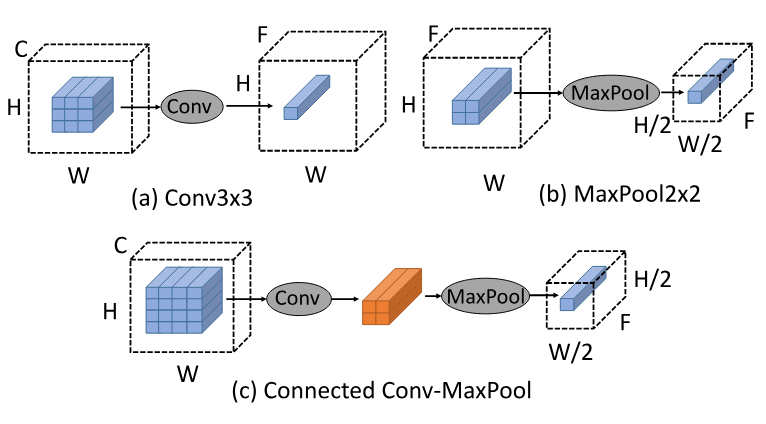

**Figure 4.** Illustration of two operator-tiles: (a) Conv and (b) MaxPool; and (c) connecting them into a tile-graph (the weight tensor of Conv is omitted for simplicity).

To improve the utilization of hierarchical memory resources, such as the shared memory, WELDER allows two adjacent operator-tiles to be "connected" through a common intermediate data tile, also known as a reuse-tile. This allows the second operator-tile to consume the data produced by the first operator-tile directly, without the need to materialize it into a full intermediate tensor. [Figure 4](#figure-04)(c) illustrates an example of this connection between two operator-tiles for Conv and MaxPool, using a [2 × 2 × F] reuse-tile. Multiple operator-tiles can be connected along each adjacent edge to form a data flow graph of operator-tiles, known as a tile-graph.

**Tile propagation.** Once connected, most tiles in a tile-graph are correlated, which can be automatically inferred by propagating an output tile shape to the entire graph. This is achieved by using a chain of shape inferences from the output nodes to the inputs. For each operator-tile, the dependent region of the input tensor can be accurately determined by analyzing its tensor expression and output tile size. In cases where the input region may contain irregular patterns such as sparse or noncontinuous access (e.g., Gather or Convolution with strides), our expression analysis provides a conservative upper bound as the input tile shape. If the tile-graph has multiple output nodes, their output shapes may also be correlated, as they may share a common ancestor node in the graph. In this case, after propagating the first output tile, we propagate separate shapes for the remaining output nodes, aligning them with the first one. If there is an inconsistent tile shape between the two propagations, we do not connect the latter output node to the current graph.

**Memory traffic and footprint.** After the tile propagation, the memory traffic and footprint of a tile-graph can be determined. First, the memory traffic for an individual tile-graph can be calculated by summing its input and output tile sizes. The total traffic is obtained through further multiplying this value by the number of tile-graphs needed to compute the full output tensor (e.g., through dividing the tensor size by the output tile size). Second, the minimum memory footprint for the tile-graph can be calculated using a memory allocation algorithm (e.g., bestfit [Gar72]) by allocating all data tiles in a topological order. As a footprint optimization, input tiles that contain reduction axes can be further partitioned into smaller ones, which can be loaded and consumed sequentially by accumulating their results to the output tile. Specifically, a particular policy can automatically try different tiling sizes along the reduction axes during the tile propagation.

### 3.2 Tile-graph Scheduling

To map a DNN model represented by an initial data flow graph to an accelerator, we can recursively partition each operator into multiple operator-tiles to fit within each memory layer, and connect operator-tiles at higher memory layers to exploit inter-operator data reuse. As a result, an entire DNN computation can be modeled as a data streaming pipeline over a two-dimensional space, with data tiles moving up and down the memory hierarchy vertically and being passed to successor operators at different layers horizontally. [Figure 5](#figure-05) illustrates an example of mapping three consecutive operators (Conv, ReLU, and MaxPool) to a three-layered memory hierarchy (e.g., from L2 to L0). The input tile of the Conv operator is repeatedly loaded from L2 to L1 and then L0 for computation. By connecting the Conv and ReLU operators at L0, the output of the Conv operator can be reused as the input for the ReLU operator, and the two operators form a tile-graph at L0. At the same time, they are consolidated into a virtual node (i.e., Conv+ReLU) in L1. The output of the ReLU is then continuously spilled into the data tile at L1 and reused as the input for the MaxPool, through further connection at L1. This allows all three operators to form a single tile-graph at the L1 layer, resulting in the virtual node Conv+ReLU+MaxPool in L2. After this recursive process, all operators are connected at the lowest layer as a single tile-graph.

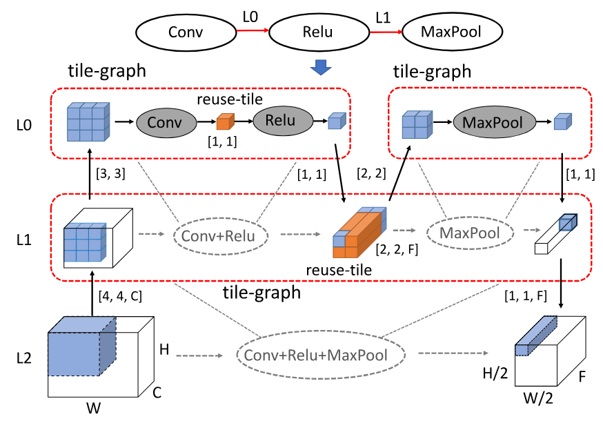

**Figure 5.** Map three consecutive operators to a three-layer memory hierarchy (the weight of Conv is omitted).

**Decoupling optimization space.** Given the observation that DNN computation is mostly memory-bounded, our major optimization goal of the data streaming pipeline can be transformed to minimizing the memory traffic. This allows us to decompose the whole optimization space into several subspaces by leveraging the inherent independence of optimizing traffic across memory layers. Specifically, the total data traffic loaded from and stored to a lower memory layer for a given tile-graph can be estimated by just its output tile shape, i.e., used to deduce all the input and output tile shapes. Based on this property, different tile-graphs from the same or different memory layers can independently optimize their memory traffic by searching for the optimal tile shapes. For example, in [Figure 5](#figure-05), the tile-graph of Conv and ReLU at L0 can be optimized independently of the L1 tile-graph (e.g., formed by the Conv+ReLU and MaxPool operators), which is referred to as inter-layer independence. This further implies that the optimal tile configurations of the sub-graphs Conv-Relu and MaxPool at L0 are also independent, due to their independence with the tile-graphs at L1, to which we refer as intra-layer independence. In practice, the only constraint is that the tile size at the lower memory level must be larger than the tile size at the upper memory level. This is often the case, as the lower memory level typically has greater capacity than the upper memory level. With these properties, we can independently schedule each tile-graph given a graph connection plan.

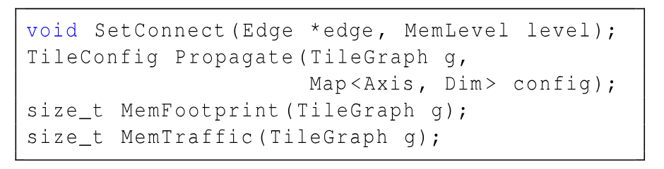

**Figure 6.** The scheduling interface in WELDER.

**Scheduling interface.** WELDER provides two scheduling interfaces to control graph connecting and sub-graph tiling, as shown in [Figure 6](#figure-06). First, the graph connecting is implemented using the SetConnect interface, which assigns a memory level for an edge in the tile-graph (the lowest level by default). After connecting, the tile shapes in the graph is inferred through the Propagate interface, by specifying the dimensional sizes of the output tiles and the optional reduction axes in input tiles. For example, in [Figure 5](#figure-05), we can use the SetConnect interface to connect Conv and Relu at L0 and connect Relu and MaxPool at L1. After the connection, for the sub-graph Conv+Relu, we can use the Propagate to infer the intermediate reuse-tile shape (i.e., $[1,1]$) by specifying the output tile shape of $[1,1]$. Similarly, we can also infer the intermediate reuse-tile shape of subgraph Conv+Relu+MaxPool (i.e., $[2,2,F]$) by specifying the output tile shape of $[1,1,F]$. The two scheduling primitives are essentially two interfaces to update the edges and vertices of the tile-graph. Particularly, SetConnect is used to add a connection between two nodes and Propagate is used to set tile configuration for a node. They together form a complete interface for updating the tile-graph. Note that these primitives are only used by WELDER's scheduling policy and transparent to the end users. WELDER also provides two cost interfaces, MemFootprint and MemTraffic, to calculate the memory footprint and the total traffic of a tile-graph, which serve as our cost models to guide the scheduling.

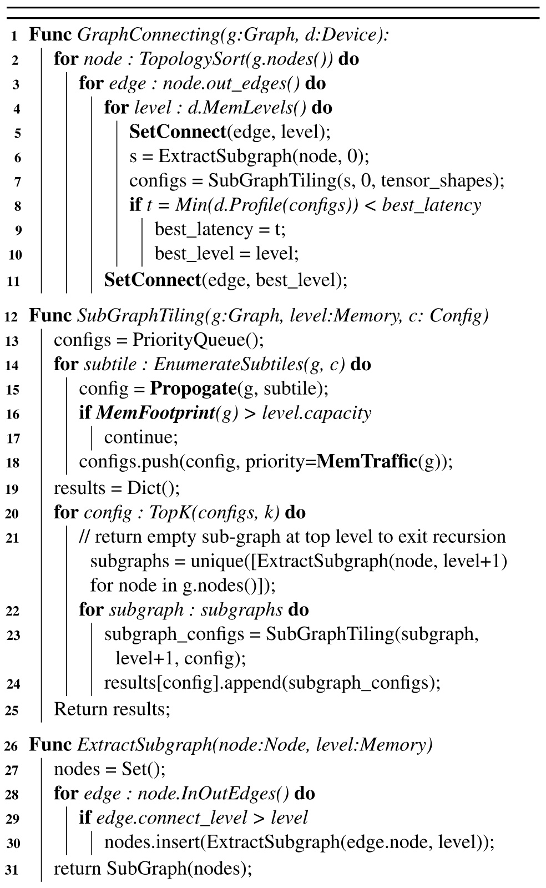

**Figure 7.** Two-step tile-graph scheduling algorithm.

**Scheduling policy.** WELDER adopts a two-step scheduling algorithm to optimize data flow computation effectively. Specifically, a graph-connecting scheduler first enumerates different graph connecting plans by setting different memory reuse levels for each edge, and then a sub-graph scheduler quickly searches for efficient tile configurations for each subgraph decoupled by the graph-connecting scheduler. [Figure 7](#figure-07) shows the two-step scheduling algorithm in WELDER. First, given a DNN data flow graph $g$ and an accelerator device $d$, the graph-connecting scheduler enumerates all graph nodes and their output edges in a topological order (line 1-3). For each edge, WELDER tries different connection levels (e.g., using the SetConnect interface) (line 5). It then extracts the connected sub-graphs where all edges have connection levels higher than 0. Here, we use the number 0 to represent the lowest memory level, and larger numbers for higher levels. The ExtractSubgraph function is implemented in line 26-31. For the extracted sub-graph, WELDER calls the SubGraphTiling function to get several efficient tile configurations and chooses the optimal one by profiling on the hardware (line 7-10). After comparing with all other connection levels, WELDER sets the best connection level for the current edge.

Then, the sub-graph scheduler (i.e., the SubGraphTiling function) takes as input a sub-graph and the last level tile configuration and searches for efficient tile configurations for the current level. First, WELDER enumerates the tile sizes (i.e., EnumerateSubtiles in line 14) for output dimensions using a tile shape expanding approach similar to Roller [Zhu22], which enlarges initial tile shape (e.g., size of 1) towards the shapes that can reduce total traffic and align with hardware features. After getting the output tile shapes, we can infer the complete tile configuration using the Propagate interface and check if it exceeds the memory capacity using the MemFootprint interface, or appends it to a sorted result list with the memory traffic as the key (e.g., using the MemTraffic interface) (line 15-18). Finally, we choose the top $K$ configurations with the least memory traffic for the current level, and then extract the upper-level sub-graphs and decide their best tile configurations recursively by calling ExtractSubgraph and SubGraphTiling (line 20-24).

Note that WELDER has no assumption on the memory size on different memory hierarchies, as our scheduling policy can always try its best to determine the optimal layer and tile size to place intermediate data, so as to minimize the overall latency. While WELDER always favors hardware with large higher-level fast memory (e.g., shared memory) that can hold a sufficiently large intermediate data tile, because too small tile sizes could lead to worse intra-operator data reuse. The scheduling result of a data flow graph in WELDER is a hierarchical tile-graph, which starts as a full graph at the lowest memory level and is recursively split into several sub-graphs in the upper layers, all the way to the top level.

### 3.3 Mapping to Hardware Accelerator

The hierarchical tile-graph generated by WELDER is an abstracted execution plan that can be mapped to an executable code for a specific hardware accelerator. To facilitate this mapping, WELDER provides an abstracted accelerator device with hierarchical memory layers. The memory configurations, such as the number of layers, memory capacity, and transaction width of each layer, can be obtained through a MemLevels interface (e.g., used in [Figure 7](#figure-07)). With this abstracted memory layer, it is easy to extend an existing accelerator with additional memory layers (e.g., host memory or SSD) as a new device, allowing it to handle very large tensors that may not fit in the single device memory ([Section 5.4](#section-5-4) for more details). WELDER's performance gain mainly comes from the bandwidth gap between memory layers. Thus, as long as a lower-level memory becomes the bottleneck and a high-level memory can hold the intermediate data tile, WELDER can automatically pipeline the inter-operator data transfer on the faster, high-level memory.

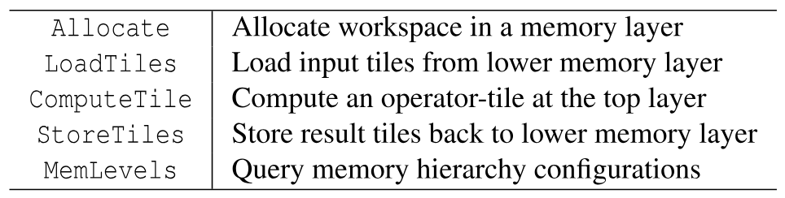

**Table 1.** Device interfaces in abstracted hardware accelerator.

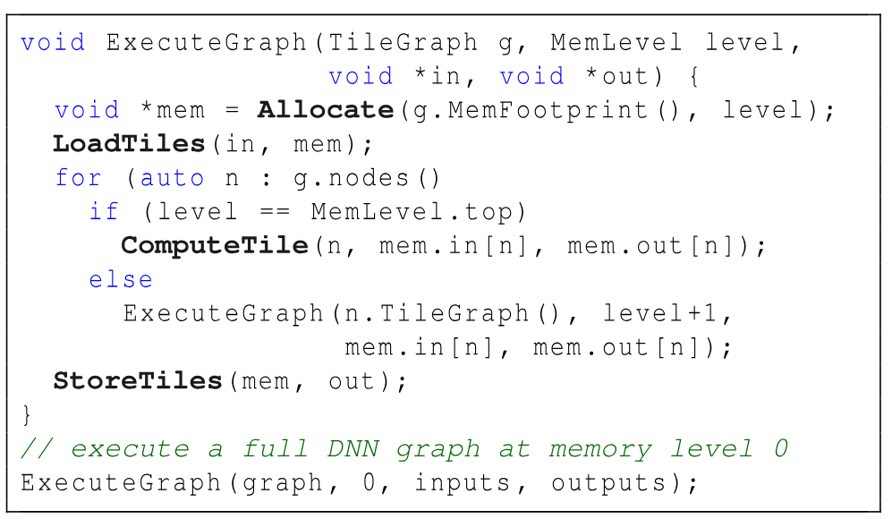

**Figure 8.** Compilation routine of hierarchical tile-graph.

In order to execute a hierarchical tile-graph on a hardware accelerator, WELDER provides four computing interfaces: Allocate, LoadTiles, ComputeTile, and StoreTiles (listed in [Table 1](#table-01)). The routine for executing a hierarchical tile-graph using these interfaces is shown in [Figure 8](#figure-08). The process starts by executing the bottom-layer tile-graph (i.e., the full DNN graph). For each tile-graph, it first allocates the necessary workspace in the corresponding memory layer (using the Allocate interface) and loads the input tiles into this space (LoadTiles). Then, it executes all the nodes in the sub-graph in a topological order. If the current memory layer is the top level, the node is executed directly in the computing cores (ComputeTile). Otherwise, the execution of the upper-level tile-graph is called recursively. Finally, the result tiles in the current space are stored in the lower memory layer (StoreTiles). This execution routine can be used as both a code generation process or a runtime process, depending on whether a specific accelerator implements these computing interfaces as code emitters or executable function calls. In WELDER, they are currently implemented as code emitters to generate the accelerator-specific computing logic. By executing this recursive routine, the entire hierarchical tile-graph is unrolled and a full-model computation program with all the necessary optimizations is generated automatically.

## 4 Implementation

WELDER is implemented based on open-source DNN compilers, TVM [Che18e], Roller [Zhu22] and Rammer [Ma20a]. It leverages TVM for writing kernel schedule, Roller for enumerating efficient tile configurations, and Rammer for the end-to-end graph optimization. WELDER's core mechanisms, including the tile-graph, tile propagation, scheduling algorithm, code generation, etc., are implemented in 5.2k lines of code. WELDER takes an ONNX graph as input and performs common graph optimizations such as constant folding and simple element-wise fusion. It then converts the optimized graph into a tile-graph for holistic memory scheduling optimization. WELDER is implemented on both CUDA and ROCm GPUs, and GraphCore IPU through the unified device interface ([Table 1](#table-01)). For CUDA and ROCm GPUs, WELDER schedules data tiles on three memory layers: global memory (DRAM), shared memory, and register. To handle large images on CUDA GPUs and GraphCore IPU, we also extend their device memory by adding a host memory layer.

### 4.1 Hardware-aligned Tile Search

**Enumerate efficient data tile size.** WELDER takes into account several hardware-related factors that could impact the data access efficiency by introducing a penalty factor to the traffic cost model. First, if there is uncoalesced memory access, the total memory traffic will include the additional transactions required for these accesses. For instance, in CUDA GPUs, it is always preferable to use coalesced memory access for a contiguous 128 bytes of data (one transaction). Second, when there is insufficient parallelism due to a large tile size, the memory traffic is increased proportionally based on the utilization percentage of the computing cores. Finally, we add an infinite penalty if the total memory footprint of a given tile configuration exceeds the memory capacity. To avoid enumerating inefficient candidates, WELDER searches for output tiles by only enumerating the dimensions that can reduce traffic the most according to the cost model, and retrieves only top k candidates with the minimum traffic.

**Decide aligned computation parallelism.** In GPUs, the top-level operator-tiles that are executed in the same threadblocks must agree on a unified block size (e.g., number of threads). To ensure this alignment, WELDER first enforces sufficient parallel tiles at the register level to align with the hardware parallelism (i.e., by enumerating hardware-aligned tiles). For example, in NVIDIA V100 GPUs, the tile number should be greater than 128, as each SM has 4 warp schedulers and each warp has 32 threads. We then determine the greatest common divisor among the tile numbers of all operators as the common thread-block size, if it is larger than the hardware parallelism (e.g., 128) and less than the maximum limitation (e.g., 1024). Otherwise, we set the block size to a number that equals the hardware parallelism. Once the block size is decided, we bind all operator-tiles at the register level to these threads. If a single thread needs to run multiple tiles, we use TVM's virtual thread to bind them, thus allowing concurrent data access over all memory banks and avoiding bank conflicts.

**Support TensorCore.** WELDER leverages TensorCore to accelerate certain operators such as GEMM, BatchMatmul, and Convolution (using implicit GEMM [Li16c]) on CUDA GPUs. We add annotations to these operators indicating which axes will be bound to CUDA's Warp-Level Matrix Operations. For top-level operator tiles, we bind them to warps (instead of threads) to perform MMA operations. Additionally, we introduce some extra constraints when enumerating tile sizes, such as ensuring that the number of threads is an integral multiple of the warp size and that the axes (M, N, and K) in each tile are an integral multiple of the fragment size of the MMA operations.

### 4.2 Code Generation and Compilation

WELDER's kernel generation is based on TVM. In particular, the register level tile connection is implemented using TVM's compute_inline schedule primitive. For shared memory level connection, we only use TVM to generate standalone kernels for each connected part above the shared memory, and then apply several additional passes to compose these standalone kernels into a single fused kernel.

**Load/store rewriting.** The standalone kernels generated by TVM load and store data from global memory. We rewrite these global memory accesses to shared memory accesses by adding an additional TIR [Ten20] pass to TVM's lowering procedure. Additionally, we add memory fences to prevent race conditions and apply padding to handle bank conflicts in the buffers. As a result, the original global kernel can be transformed into a device function, which is included in the final fused kernel.

**Block/thread index remapping.** Some operators cannot be directly connected to others and require remapping of their blockIdx and threadIdx values. The BlockIdx remapping is used for operators such as Transpose. The remapping relationship is deduced from their tensor expressions. The ThreadIdx remapping is used to connect 2D thread blocks to 1D thread blocks. This is necessary when inter-thread reduction or TensorCore primitives require the use of a 2D thread block (both threadIdx.x and threadIdx.y), while others may use a 1D thread block (only threadIdx.x). A 2D thread block can be mapped to a 1D thread block as long as their total number of threads is equal.

**Memory management.** We manage all shared memory, including that allocated in each standalone kernel and the inter-operator reuse buffer, in a uniform manner. First, we analyze the liveness of each buffer based on the topology execution order and convert them into a sequence of allocation and free operations. We then use the bestfit algorithm to compute the offset for each shared memory allocation, taking into account any alignment requirements for data types and TensorCore operations (e.g., aligning to 32 bytes to avoid misaligned address access).

**Compilation speedup.** WELDER optimizes the compilation speed through parallel compilations and sub-graph caching. First, by taking advantage of the independence between configurations, WELDER can use multi-processes to build and evaluate each configuration in parallel. Second, in most DNN models, some sub-graph patterns often repeat for multiple times. To avoid the redundant optimization, WELDER leverages a sub-graph signature to cache each unique graph pattern. For example, in a 12-layer BERT model, we can cache the optimization result (kernel code and profiled latency) for the first layer and reuse it for all the remaining 11 layers.

## 5 Evaluation

### 5.1 Experimental Setup

We evaluate WELDER using three servers equipped with different accelerators: NVIDIA GPU, AMD GPU, and Graphcore IPU.

Two servers are equipped with the NVIDIA GPUs. The first one is an Azure NC24s_v3 VM with Intel Xeon E5-2690v4 CPUs and NVIDIA Tesla V100 (16GB) GPUs, running on Ubuntu 16.04 with CUDA 11.0. The second one is a local workstation with Intel(R) Xeon(R) E5-2678 v3 CPUs and NVIDIA GeForce RTX 3090 GPUs, running on Ubuntu 18.04 with CUDA 11.3. The AMD GPU server is equipped with Intel Xeon CPU E5-2640 v4 CPU and AMD Radeon Instinct MI50 (16GB) GPUs, running on Ubuntu 18.04 with ROCm 5.2.3. The IPU server is an Azure ND40s_v3 VM with Intel Xeon Platinum 8168 CPUs and 16 IPUs with Poplar-sdk 3.0.

**DNN workloads.** WELDER is evaluated on 10 DNN models with different model types, including CNNs, Transformer, CNN-Transformer and multilayer perceptrons (MLP), and most of which are the state-of-the-art in the corresponding tasks. [Table 2](#table-02) characterizes them with a comparison of their model types, tasks, and the years of publication. For all models in the table, we use their official PyTorch implementations without modification.

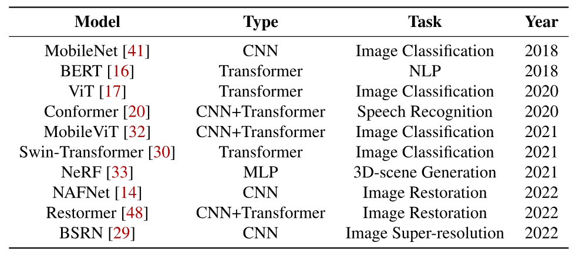

**Table 2.** DNN models evaluated in WELDER.

**Baselines.** We compare WELDER with several DNN frameworks, including PyTorch (v1.12) [Pyt17] and ONNXRuntime (v1.12) [Onn21], as well as state-of-the-art DNN compilers such as Ansor (v0.9) [Zhe20] and Rammer [Ma20a]. We also compare WELDER with TensorRT (v8.4) [Ten17a], a vendor-specific inference library for NVIDIA GPUs. For transformer models, we further compare WELDER with NVIDIA's FasterTransformer (v5.2) [Fas21], a hand-crafted C++ library optimized for transformer models. We also include BladeDISC (v0.3.0) [Bla23] that implements the latest AStitch [Zhe22f] for the kernel fusion optimization. We also include Nimble [Kwo20a] which implements multi-stream scheduling as a baseline on NVIDIA GPUs.

To evaluate a model on these baselines, we first trace the model in PyTorch and export it to the ONNX format. We then use this ONNX model as input to other frameworks, including WELDER, Ansor, ONNXRuntime, and TensorRT. For the ONNXRuntime, we use its CUDA execution provider and set its graph optimization level to "ALL" to achieve the best performance. For TensorRT, we use its Python API to build an engine for the input ONNX model. For Ansor, we set the total number of tuning trials to 800× the number of tasks in each model. For all frameworks, we place the input and output tensors in GPU device memory to avoid additional data movement costs. During evaluation, we first performe some warm-up iterations and then run each workload repeatedly for at least 5 seconds. We only report the average speed for each model, as we observe very little variation in all cases. The average performance (e.g., speedup) across models is calculated by geometric mean in all experiments.

### 5.2 Evaluation on NVIDIA GPUs

This section answers the following questions: 1) How does WELDER perform in comparison with state-of-the-art DNN frameworks or compilers? 2) To what extent can WELDER further boost performance with TensorCores? 3) Can WELDER automatically discover new optimization patterns beyond previous expert-designed fusion rules? 4) How well does WELDER improve both the memory and computational efficiency? 5) What is the search efficiency of WELDER's holistic optimization?

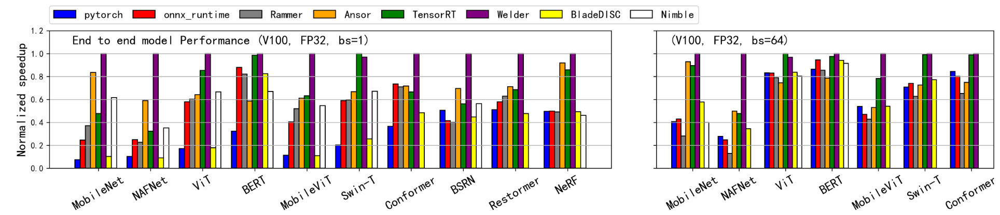

**Figure 9.** End-to-end model inference performance on NVIDIA V100 GPU (SIMT Core only). (left: batch size of 1, right: batch size of 64).

**End-to-end performance.** [Figure 9](#figure-09) shows the performance of WELDER and other baselines for batch size of 1, expressed as the normalized speedup relative to the best result. The geometric mean speedup that WELDER achieves over DNN frameworks is 4.29× for PyTorch and 2.07× for ONNXRuntime. PyTorch does not perform well for models with batch size 1 due to high Python overhead in its computation graph. In contrast, ONNXRuntime is a more optimized framework that removes Python overheads and implements pattern-based graph optimizations. WELDER also outperforms Rammer by 1.96×, as Rammer can only fuse independent parallel kernels instead of dependent ones through shared memory. When evaluating BladeDISC (implementing AStitch), we notice that it encounters "unsupported operator" failures and falls back to PyTorch runtime for the majority of models. For models without encountering any failure (including BERT, MobileNet, BSRN and NeRF), WELDER is 2.70× faster than BladeDISC. Regarding the Nimble baseline, WELDER achieves an average speedup of 1.79×, excluding the models where Nimble fails to execute.

Ansor improves DNN performance by generating high-performance tensor programs and using rule-based fusion across operators at the register level (e.g., Matmul+BiasAdd, Conv2D+ReLU). However, it cannot exploit further memory reuse opportunities, leading to an average performance gap of 1.44× compared to WELDER. This is evident in CNN models such as NAFNet (1.70×) and BSRN (1.43×), which mainly consist of convolutions with relatively small channels that can be well optimized by WELDER. WELDER also outperforms Ansor by a significant margin on Transformer-based models such as BERT (1.71×), Swin-Transformer (1.45×), and ViT (1.56×), due to Ansor's inability to fuse patterns like LayerNorm or Softmax in the attention block. Furthermore, WELDER performs well for CNN+Transformer models, achieving speedups of 1.64×, 1.39×, and 1.29× on MobileViT, Conformer, and Restormer, respectively, as WELDER can cover fusion opportunities in both the CNN and Transformer parts of these models. We also observe that WELDER only slightly outperforms Ansor on NeRF (1.09×), mainly due to that the compute-intensive MLP dominates the computation without further optimization opportunities.

Finally, TensorRT is a specialized DNN inference library provided by NVIDIA with highly optimized operators. WELDER is comparable to TensorRT on popular transformer models such as BERT (1.02×) and Swin-T (0.97×). This is because TensorRT has incorporated expert-designed fusion rules and in-house kernels for some popular models, including transformer-based models, thereby leaving limited room for further optimization. In contrast, WELDER identifies optimization patterns automatically and achieves performance that is on par with TensorRT, despite relying on less performant kernels for compute-intensive operators. It is worth noting that kernel optimization is complementary to WELDER, and further optimized kernels may offer even greater benefits for WELDER. Additionally, for newer and more diverse models such as NAFNet, WELDER has demonstrated superior performance to TensorRT, with speedups of up to 3.09× due to its generality. Overall, our system outperforms TensorRT with an average speedup of 1.47×.

[Figure 9](#figure-09) also shows the normalized performance for a larger batch size of 64. The last three models in [Table 2](#table-02) are unable to be traced on PyTorch with large batch sizes due to their use of large input size. Under this setting, WELDER continues to outperform all other baselines, providing an average speedup of 1.83× over PyTorch, 1.90× over ONNXRuntime, 2.1× over Rammer, 1.57× over BladeDISC, 1.49× over Nimble, 1.47× over Ansor, and 1.21× over TensorRT, respectively. We observe that for large batch sizes, frameworks using CUDA libraries perform much better, compared to the results for a batch size of 1. This leads to smaller speedups over PyTorch, ONNXRuntime, and TensorRT for WELDER, while the speedup over Ansor remains similar to the results for a batch size of 1.

**Performance with TensorCore.** The faster computing throughput of TensorCore can put greater pressures on memory access. To understand the optimization behaviors when running on TensorCore, we convert our benchmark models (both weights and activations) to half-precision float type (FP16) with PyTorch, as TensorCore only supports FP16. This is done using the tools in the onnxconverter_common package [Onn20], with the exception for TensorRT, which converts through its own converter as it often produces better results.

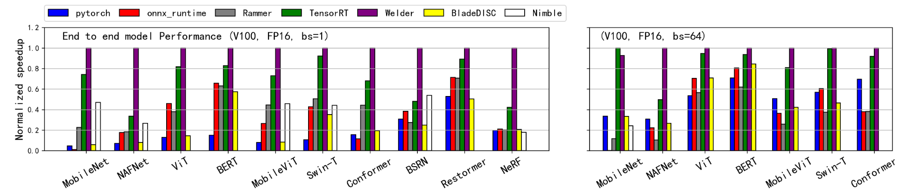

**Figure 10.** End-to-end model inference performance on NVIDIA V100 GPU (TensorCore enabled). (left: batch size of 1, right: batch size of 64).

[Figure 10](#figure-10) shows the performance comparisons of WELDER with other frameworks using TensorCore for batch sizes of 1 and 64. For the 10 cases that use a batch size of 1, WELDER outperforms PyTorch, ONNXRuntime, BladeDISC, Nimble, Rammer, and TensorRT. The averaged speedup is 7.18× (up to 21.4× on MobileNet) to PyTorch, 3.08× (up to 8.72× to on Conformer) to ONNXRuntime, 5.29× (up to 16.9× on MobileNet) to BladeDISC, 2.72× (up to 5.58× on NeRF) to Nimble, 2.76× (up to 5.42× on NAFNet) to Rammer, and 1.53× (up to 2.98× on NAFNet) to TensorRT, respectively.

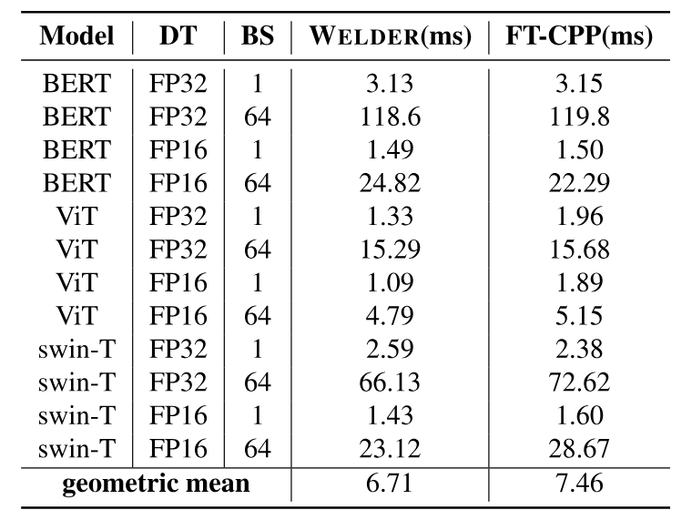

**Table 3.** Performance for WELDER and FasterTransformer.

For the remaining 7 cases in [Figure 10](#figure-10) that uses a batch size of 64, WELDER outperforms PyTorch by 1.98×, ONNXRuntime by 2.13×, BladeDISC by 1.97×, Nimble by 3.84×, Rammer by 3.45× and TensorRT by 1.16× respectively.

Some of the speedups are much larger than the ones achieved on SIMT cores. Especially for the NeRF model, WELDER outperforms TensorRT by 2.34× on TensorCore, while the speedup on SIMT cores is only 1.16×. This is mainly because TensorCore can greatly accelerate the compute-intensive part of the model, making the optimization of the remaining memory-intensive part more critical.

Note that Ansor is not included in this experiment as it does not support TensorCore. For a fair comparison, we disable WELDER's TensorCore feature and evaluate these FP16 models on SIMT cores by comparing with Ansor in [Figure 11](#figure-11). It shows a slightly higher speedups (1.74× on average and up to 2.82×) compared with the ones in FP32.

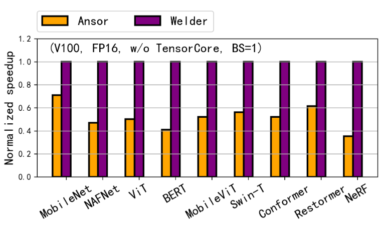

**Figure 11.** Comparing with Ansor under FP16 w/o Tensor-Core.

**Performance on another NVIDIA GPU.** We also conduct evaluations on RTX-3090, another widely-used GPU, which utilizes a distinct Ampere architecture. The RTX-3090 exhibits various new features compared to the V100, including advancements in memory load and TensorCore instructions, as well as a different number of streaming multiprocessors (SM). For the sake of conciseness, we solely compared WELDER with TensorRT on the RTX-3090, as TensorRT consistently delivers superior performance compared to other baselines on NVIDIA GPUs. The results, depicted in [Figure 12](#figure-12), illustrate that WELDER outperforms TensorRT with an average speedup of 1.40×, calculated using the geometric mean of all 34 test cases. Notably, this speedup is similar to the one observed on the V100 GPU, which amounted to 1.36×, thereby highlighting WELDER's adaptability across diverse GPU architectures.

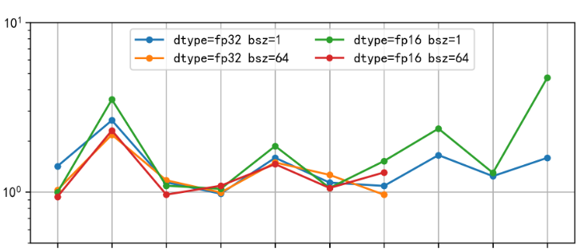

**Figure 12.** Comparing with TensorRT on NVIDIA RTX-3090.

**Patterns automatically discovered.** WELDER automatically discovers around 300 different fused subgraphs, which is counted by unique operator types under all 34 compiled test cases of the 10 models. Among them, 89 patterns contain at least two reduction-based operators which cannot be covered by simple element-wise fusion rule in Ansor. To the best of our knowledge, many of these patterns are uncommon fusion patterns that have not been explored by manually-designed rules or automatic fusion optimizations. [Figure 4](#figure-04) illustrates two examples of such patterns, which fuse multiple Convolution or MatMul (i.e., Dot) operators with other memory-intensive operators into a single kernel. The number of operators fused in each pattern ranges from 2 to 48 and can achieve an average speedup of 1.87× (up to 5.4×) compared to basic fusion methods such as those used in Ansor. The most common pattern has been used 191 times in all models.

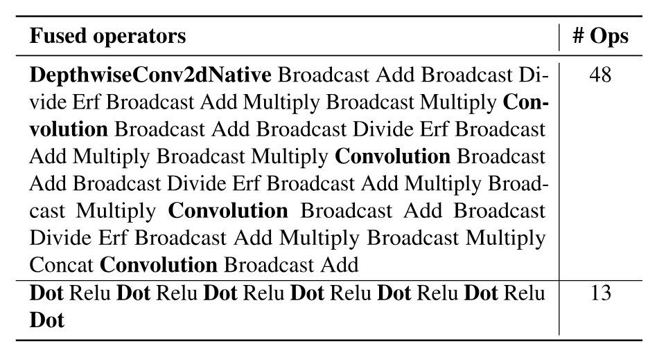

**Table 4.** Examples of fusion patterns discovered by WELDER.

Such a general fusion capability often allows WELDER to outperform the model-specific implementations optimized by experts. For example, FasterTransformer [Fas21] is a manually-optimized benchmark for transformer models from NVIDIA. It supports both element-wise fusion, such as BiasAdd+Transpose, and non-element-wise fusion, such as Layernorm+Softmax. In WELDER, all these patterns can be automatically fused. Even more, WELDER can further fuse Q*K with the following Softmax in the attention block when the sequence length is not long (e.g., they are fused in BERT where the sequence length is 128, but are not fused in Conformer where the sequence length is 512, this is automatically decided by WELDER).

For the three models supported by FasterTransformer, we compare its performance with WELDER in [Table 3](#table-03). In general, WELDER achieves an average speedup of 1.11× (up to 1.73× on ViT) over FasterTransformer. Based on our profiled data, The notable speedup for ViT under batch size of 1 can be attributed to a convolution operator with a non-conventional shape, where both stride and kernel size are 32 (ViT's patch size). For this single operator, WELDER's generated kernel is 4.4x faster. This highlights WELDER's adaptability in managing new operator shapes or model patterns.

Another example is NeRF, a popular 3D scene generation model that is typically implemented as a 7-layer MLP. To take full advantage of GPUs, domain experts often need to implement such models from scratch to achieve better fusion result (e.g., fully-fused MLP in [Mul21a]). With WELDER, we can automatically fuse this 7-layer MLP into a single GPU kernel. The generated kernel uses TensorCore for the first 6 layers and uses SIMT Core for the output layer, with all intermediate results stored in shared memory. We observe that our automatic fusion result can achieve a similar speedup (over 5×) to the values reported in [Mul21a] (we are unable to evaluate their code [Mul21] as it does not support V100 GPUs).

Finally, for CNN models such as NAFNet, BSRN, and MobileNet, WELDER is able to fuse different types of convolutions with other operators (e.g., Pooling, PixelShuffle, etc.). For example, in NAFNet, our system can fuse back-to-back pointwise convolutions together with the normalization operations between them. Another interesting pattern is in models with multiple separable convolution layers, where each layer consists of two operations: a depthwise convolution (DWConv) and a pointwise convolution (PWConv). WELDER is able to determine the optimal fusing order for these two types of operators based on their operator configurations. For example, on the top layers where the feature maps are large and the number of channels is small, WELDER constructs a DWConv+PWConv fusion group because it is better to cache a complete feature map in shared memory. In contrast, on the bottom layers, WELDER constructs a PWConv+DWConv fusion group which caches a complete channel for DWConv to reuse, as the feature map becomes smaller.

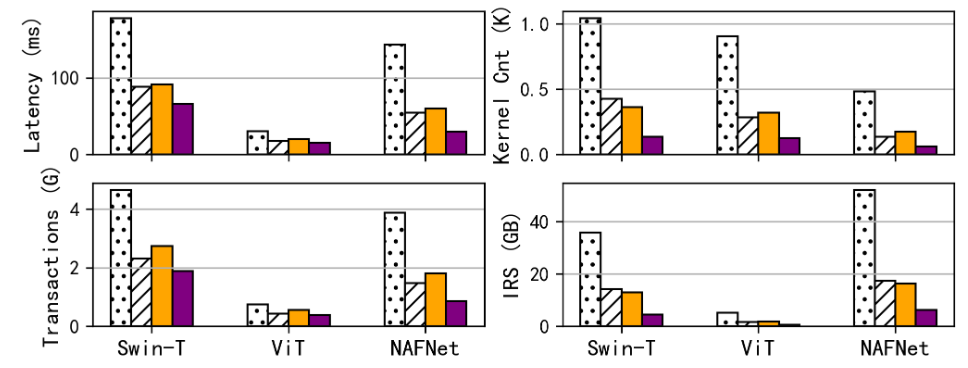

**Figure 13.** Latency, GPU kernel count, global memory transaction executed and intermediate result size (IRS) for 3 selected models (FP32, batch size 64).

**Ablation and sensitivity study.** To demonstrate the benefits of the holistic memory optimization provided by WELDER, we create two variants of WELDER: "WELDER-none" disables all inter-operator tile connection and only searches for intra-operator schedules, and "WELDER-base" only enables inter-operator tile connection at the register layer. We also include Ansor in this experiment, as it is another codegen-based approach similar to ours. As shown in [Figure 13](#figure-13), enabling register layer tile connection, WELDER-base reduces latency by an averaged 52% (i.e., 2.08× speedup), kernel launch count by 67% , global memory transactions by 52% and intermediate result size (IRS) by 66% compared with WELDER-none. Note that the metrics of WELDER-base is similar to that of Ansor, demonstrating the efficiency of our general tile-based memory scheduling compared with the rule-based fusion in Ansor. Moreover, by enabling tile connection at shared memory layer, WELDER is able to further reduce latency by an averaged 29% (with up to 1.82x speedup), kernel launches by 60%, transactions by 25% and IRS by 65% compared with WELDER-base. Note that the reduction of memory transactions is less than the reduction of IRS, because memory access on the model weights part cannot be optimized by fusion.

In addition, we conducted a sensitivity study by varying the input sizes of three selected models: BERT (128-512 text length), Conformer (128-512 audio frames), and NAFNet (256x256-1024x1024 image input). The results, as depicted in [Figure 14](#figure-14), reveal that the fusion gain significantly increases for NAFNet when employing larger images. Conversely, the gain diminishes for the other two transformer-based models. This discrepancy can be attributed to the fact that transformer-based models exhibit quadratic computational growth with respect to the input sequence length, thereby reducing their memory-intensive nature.

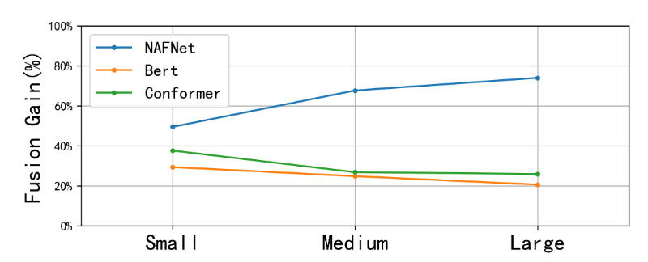

**Figure 14.** Varying input size, comparing with WELDER-base.

**Compilation time.** [Table 5](#table-05) compares WELDER's compilation time against Ansor, which is a search-based compiler requiring many tuning and profiling trails. We chose not to include other baselines in the comparison since they directly invoke library kernels, thereby eliminating the need for extra time dedicated to tuning and code generation. It shows that the end-to-end compilation speed of WELDER is more than an orders of magnitude faster than Ansor. This is because Ansor generates a very large search space for all the operators, and implicitly optimizes data reuse through machine learning-based tuning. This often requires a large number of tuning trials (e.g., 800 per operator in our evaluation) and has additional overheads to train a cost model on the fly. In contrast, WELDER decomposes the optimization space using a layered scheduling policy and searches for efficient tiling configurations using an analytic cost model to estimate traffic costs. As a result, WELDER requires significantly fewer tuning trials (20 per subgraph in our evaluation) than Ansor.

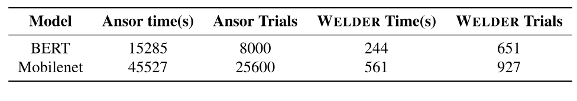

**Table 5.** Compilation time of Ansor and WELDER.

**Performance on compute intensive models.** Traditional models like ResNet [He16c], VGG [Sim14a], and UNet [Ron15] are typically dominated by some large operators such as convolution. For these compute intensive models, although WELDER mainly focuses on memory access optimization, WELDER can mostly achieve comparable performance to state-of-the-art baselines like TensorRT. This is because WELDER can still generate high performance single operators (using the multi-level tiling abstraction, which is similar to Ansor [Zhe20] or Roller [Zhu22]) although there might be few chances to connect the tile at a higher memory level. However, for some convolution operators, existing libraries like cuDNN [Cud23] implement them using an optimized numerical algorithm (e.g., winograd [Lav16]), which are difficult to automatically derive from tensor expressions. This can result in WELDER performing worse than TensorRT if there is no additional memory optimization room to compensate for this gap. For example, [Table 6](#table-06) compares the performance of WELDER, Ansor, and TensorRT on four such models. For ResNet, both systems achieve comparable performance, as the majority of convolution operators in this model perform better when implemented with the DirectConv algorithm (which is supported by both Ansor and WELDER) instead of winograd. However, for UNet and VGG16, the dominant convolution operators are mostly implemented using winograd in TensorRT, and there are no further fusion opportunities for WELDER to exploit, resulting in better performance for TensorRT. Given that this is orthogonal to WELDER's optimization, we leave the support of the winograd algorithm (by rewriting tensor expressions) to our future work.

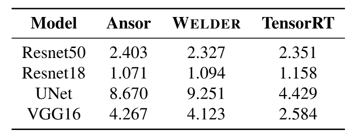

**Table 6.** Performance on compute intensive models.

### 5.3 Evaluation on AMD ROCm GPUs

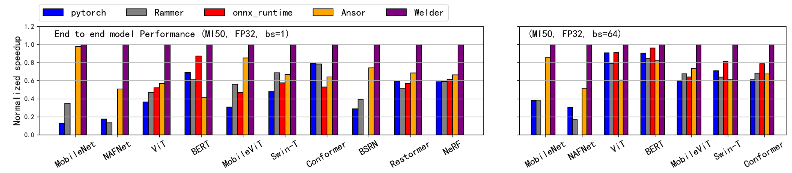

**Figure 15.** End-to-end model inference performance on AMD ROCm MI50 GPU (left: batch size of 1, right: batch size of 64).

We evaluate the efficiency of WELDER on AMD ROCm GPUs by comparing its performance with PyTorch, ONNXRuntime and Ansor. TensorRT and AStitch are not included because they are exclusive to NVIDIA GPUs. [Figure 15](#figure-15) shows the end-to-end performance of the 10 DNN models. Compared with PyTorch, ONNXRuntime and Rammer, WELDER can outperform them by an average of 2.62×, 1.71× and 2.14×, respectively. Compared to Ansor, WELDER achieves an average performance improvement of 1.53×. [Figure 15](#figure-15) shows the performance comparison with a larger batch size of 64, where WELDER outperforms PyTorch, ONNXRuntime, Rammer and Ansor by an average of 1.69×, 1.23×, 1.86× and 1.47×, respectively. Note that we have excluded some CNN models for ONNXRuntime as they fail to execute on it. We notice that WELDER's speedup on MI50 is slightly smaller than that of V100, this is because MI50's peak FLOPS is weaker than V100's, while its peak bandwidth is higher, according to the official data-sheet. Such difference makes the workload more compute-intensive on MI50, leaving less optimization chances for memory access optimization.

### 5.4 Scale-up with Host Memory

WELDER's abstracted device layer allows us to extend the memory hierarchy to support large DNN tasks. For example, in cases where classical CNN models like UNet or VGG16 are used to process high-resolution medical images [Sid21], a single tensor from some layers is often too large to fit in the GPU memory. In these scenarios, tensor-based memory swapping optimization techniques, such as SwapAdvisor [Hua20] or Capuchin [Pen20], may not be effective due to the large tensor granularity. WELDER addresses this issue by generating a tile-based execution plan on the extended memory hierarchy through holistic traffic optimization. This approach allows us to load a data tile from the host memory, compute several connected operator tiles by reusing the data in device memory, and store the result back, as if it was being processed on a single device. To evaluate the efficiency of this scheduling approach, we compared WELDER with a variant that only disables data reuse at the device memory layer.

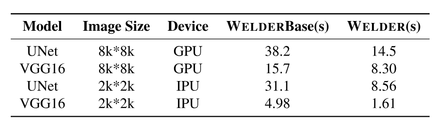

**Table 7.** Scale-up large DNN models to host memory.

**Scale-up GPUs.** As a preliminary experiment, [Table 7](#table-07) shows the performance of WELDER when scaling up UNet and VGG16 on large image data by augmenting the GPU memory with a host memory layer. As the results show, by enabling tile-connection at the device memory layer, WELDER is able to achieve average speedups of 2.63× and 1.89× for the two models, respectively. It also reduces host memory transfer by 3.11× and 2.90×. Note that the ratios of reduced memory traffic are higher than the actual speedup, as we have implemented double buffering (along with pinned memory and CUDA streams) to overlap some memory transfer with computation.

**Scale-up GraphCore IPU.** We also perform a preliminary evaluation of WELDER's ability to scale up on the Graphcore IPU [Ipu23], which is a DNN accelerator with a distinct architecture from NVIDIA and AMD GPUs. The IPU is equipped with massively parallel MIMD processors and a relatively small device memory (i.e., 300MB), which poses a challenge for it to handle even medium-sized tasks. We apply the same tile-based scheduling to the two models for the IPU and set the input image size to 2048*2048 to adapt to the IPU's memory capacity. The results in [Table 7](#table-07) show that WELDER's optimization is able to achieve average speedups of 3.63× and 3.09× for the two models, respectively. This improvement ratio is higher than that of the GPU, which is mainly due to that we disable the double-buffer optimization for the IPU due to its limited memory.

## 6 Discussion

WELDER's design and implementation mainly focuses on static models. For dynamic model execution, there are two practical ways to address this. First, the dynamic graph can be transformed into static sub-graphs through JIT compilation, such as PyTorch JIT compile, which has become a standard practice in PyTorch 2.0. Then, WELDER can concentrate on optimizing the static sub-graphs, which are typically the computationally dominant part. Second, even though tensor shapes may be dynamic, the internal tile in each operator can be statically determined. This presents an opportunity for WELDER to generate a static tile-level fusion plan but leave the number of parallel tasks determined by the input tensor shape.

## 7 Related Work

Compiler optimization like operator fusion is a widely-used technique in DNN computation to reduce kernel launch overhead and improve data locality in faster memory. Compilers such as TVM [Che18e], Ansor [Zhe20], XLA [Xla17], DNNfusion [Niu21] all support operator fusion at register level. Other compilers try to further fuse operators at shared memory, relying on either fusion rules for a set of known operator types (e.g., AStitch [Zhe22f], Apollo [Zha22h], DeepCuts [Jun21]) or specific template for a few operator combinations (e.g., Bolt [Xin22]). Specialized DNN runtimes such as TensorRT [Ten17a] and ONNXRuntime [Onn21] have incorporated expert-designed fusion rules for some common patterns in popular models such as the transformer-based models. In contrast, WELDER works for general operators implemented in tensor expressions without the assumption on operator types and decides on the best fusion memory layer automatically. This is because an operator's resource usage behavior (memory- or compute-intensive) often depends on its shape, and therefore the fusion decision. Systems like Rammer [Ma20a], HFuse [Li22e], Nimble [Kwo20a], etc., exploit better hardware parallelism utilization and reduce kernel launches by either horizontal fusion or scheduling parallel tasks through multi-stream and CUDA graph. WELDER builds upon Rammer by further exploring a complementary optimization to these systems, i.e., holistic memory optimization with a vertical fusion, resulting in a further speedup for memory-intensive models.

Ansor [Zhe20] and Roller [Zhu22] are representative tensor compilers that are focusing on intra-operator optimization through either loop optimization or tiling optimization. Especially, Roller [Zhu22] and Triton [Til19] also utilize the concept of tile to optimize kernel performance (e.g., intra-operator data reuse). In contrast, WELDER complements them by optimizing for intra- and inter-operator memory access holistically. WELDER generalizes the tile concept in Roller into a tile-graph abstraction, exposes a holistic tile-level scheduling space, and proposes an efficient scheduling mechanism over the holistic space and the explicit memory hierarchy.

Some works optimize for a specific pattern regarding to a type of models with more aggressive operator fusions, such as fully-fused MLP for the NeRF model [Mul21a], manually fused kernels for CNN models [Wan20h], and attention fusion for transformer models [Fas21, Fan21b]. Our evaluation shows that WELDER can achieve most of these fusions automatically and even produce new fusion patterns to help further optimization.

Moreover, kernel fusion techniques have been used in traditional image processing [Qia18, Qia19] or HPC [Wah14] areas. These efforts usually leverage domain-specific fusion rules for their workload. WELDER focuses on DNN workload, while it is applicable for general operators represented by tensor expressions. It is also potentially helpful for workload that can be implemented in tensor expressions in other domains.

## 8 Conclusion

By observing that modern DNN models are becoming increasingly memory intensive, we introduced WELDER, a DNN compiler that optimizes the execution efficiency based on a new tile-graph abstraction. WELDER is able to holistically optimize efficient intra- and inter-operator data reuse across multi-level memory hierarchy. WELDER is the first to unify all common operator fusions into a single framework, allowing for the discovery of 89 uncommon fusion patterns, with the largest one fusing 48 operators into a single kernel. This generality enables WELDER to significantly outperform state-of-the-art baselines. More importantly, WELDER provides a systematic approach to take advantage of emerging trends in the memory hierarchy, such as larger and more connected on-chip memory, in the future AI accelerators.

## Acknowledgement

We thank anonymous reviewers, and our shepherd, Prof. Byung-Gon Chun, for their extensive suggestions. This work was partially supported by the National Key Research and Development Program of China (No. 2021ZD0110202).

## 9 Artifact Appendix

### Abstract

WELDER provides end-to-end DNN model compilation with its new tile-graph abstraction. This artifact reproduces the main results of the evaluation on NVIDIA V100 GPU.

### 9.1 Scope

This artifact will validate the following claims:

- End-to-end model performances. By reproducing the experiments of [Figure 9](#figure-09), [Figure 10](#figure-10), [Figure 11](#figure-11), [Table 3](#table-03) and [Table 6](#table-06).

- Motivation experiments in [Figure 1](#figure-01) and [Figure 2](#figure-02).

- Ablation study in [Figure 13](#figure-13).

- Compilation time in [Table 5](#table-05).

- GPU stale out experiments in [Table 7](#table-07).

### 9.2 Contents

This artifacts includes all the source code to implement WELDER. We provide a docker file to setup environments. For each figure and table mentioned above, we provide a script to reproduce its result. Since there are more than 50 model test cases to compile to fully reproduce the results, which will cost a long time (especially for the Ansor's baseline), we also provide pre-compiled logs and models for NVIDIA V100 GPU. Please refer to the README.md file in the repository for more details.

### 9.3 Hosting

The artifact is hosted at github repository[+artifact] . Please use git to clone the repository and checkout to the osdi2023welder branch.

### 9.4 Requirements

This artifacts requires a NVIDIA V100 GPU with CUDA driver supporting CUDA runtime larger than 11.0.

[+internship]: Work is done during the internship at Microsoft Research.

[+artifact]: <https://github.com/microsoft/nnfusion/tree/osdi2023welder>

