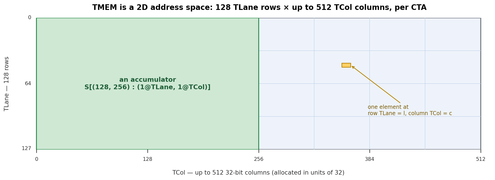
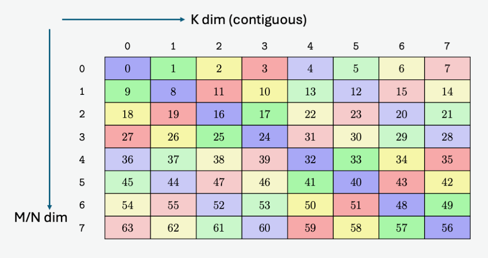

::: info 概览
- **数据布局**描述张量的逻辑索引如何映射到物理位置. 这个映射既决定程序能否读到正确数据, 也影响 global memory 访问是否合并, shared memory 是否产生 bank conflict, 以及 tile 是否满足特定硬件单元的格式要求.
- Shape-Stride 模型通过 shape 和 strides 定义这种映射; tiling 仍使用同一个模型, 只是把原始索引拆成更多坐标. 命名轴把物理位置扩展到 TMEM、warp lanes 和 registers, replication 与 offset 分别表示数据复制和位置平移.
- Swizzle 在保持 tile 逻辑结构不变的同时重排 shared memory 地址. 对于匹配的元素宽度、对齐方式和访问模式, XOR swizzle 可以把访问分散到不同 memory banks, 从而避免 bank conflict.
:::

同一组数字, 如果以不同的物理排列方式写入内存, 在同一块 GPU 上的运行速度可能相差一个数量级.

原因在于, 张量的逻辑索引并不说明它的字节在物理上实际存放在哪里. 硬件对这种位置关系非常敏感: 根据访问模式, 32 个 lanes 的 loads 可能合并成一次 transaction, 也可能最多被拆成 32 次; 这些地址可能落到不同的 memory banks, 也可能集中到同一个 bank 并被串行处理; 一个 tile 的字节排列还决定 Tensor Core 能否直接读取它.

机器学习程序通常用逻辑 shape 来描述张量. **数据布局**补上了缺失的物理部分: 它说明带有逻辑索引 `(i, j, …)` 的元素实际存放在哪里, 可以是在 memory 中, register 中, 也可以是在其他硬件存储空间中.

下面先从 Shape-Stride 模型出发, 再把同一套记号推广到 TMEM, register fragment 和多设备布局. 最后介绍 **swizzling**, 看看它如何通过重排地址来改善同一个 tile 的按行和按列访问.

## Shape-Stride 模型

在介绍 GPU 特有的布局之前, 我们先从 Shape-Stride 模型开始. **shape** 描述张量在每个维度上的大小, **strides** 描述逻辑索引在某个维度上增加 1 时, 物理位置要前进多少个元素. 我们把这对信息写成 `S[(shape) : (strides)]`. 要找一个逻辑索引对应的位置, 只需把索引和 strides 做点积. 例如, 一个 row-major 的 `4×4` 矩阵可以写成:

```text
S[(4, 4) : (4, 1)]

addr(i, j) = i·4 + j·1
```

PyTorch 和 NumPy 中的 tensor 本质上也使用这个模型: 一块扁平的 storage buffer, 加上一组描述如何解释这块 storage 的 `shape` 和 `strides`.

```python
import torch

t = torch.arange(12).reshape(3, 4)
t.shape        # torch.Size([3, 4])
t.stride()     # (4, 1)        ← 正是 S[(3, 4) : (4, 1)]
```

`t` 的底层 storage 仍然是一维的:

```text
[0, 1, 2, 3, 4, 5, 6, 7, 8, 9, 10, 11]
```

这里的 `t` 使用 `S[(3, 4) : (4, 1)]`: 每行占 4 个连续元素, 列方向的相邻元素在 storage 中也相邻. 很多 view 类操作只需要更换 `shape` 和 `strides`, 而不需要重新排列这些元素. 以二维 tensor 的转置为例, PyTorch 中的 `permute(1, 0)` 等价于 `t.T`:

```python
tt = t.permute(1, 0)               # 或 t.T
tt.shape                           # torch.Size([4, 3])
tt.stride()                        # (1, 4)        ← strides 交换了，但没有搬数据
tt.untyped_storage().data_ptr() == t.untyped_storage().data_ptr()
                   # True，底层仍然是同一块 storage
```

转置后的 view 使用 `S[(4, 3) : (1, 4)]`, 因此 `tt[i, j]` 的地址偏移为 `i·1 + j·4`, 正好对应原来 `t[j, i]` 的位置. 对 contiguous tensor 做 `view`, 或者在布局兼容时做 `reshape`, 机制相同. NumPy 也采用这一模型, 只是它的 `.strides` 以字节而不是元素为单位.

## Tile Layout

GPU kernel 很少一次处理完整矩阵, 通常会将矩阵划分成更小的 tiles. 例如, 可以把一个 `8×8` 矩阵划分成 `2×4` 的 tiles, 让各个 tile 按 row-major 顺序排列, 并让每个 tile 内部的元素也按 row-major 顺序连续存储.

下图先展示这个例子在逻辑矩阵和物理内存中的排列.

<iframe src="/gpupro/demo-zh/tiled_layout.html?v=tile-order-20260709" title="Tile layout: interactive address computation" loading="lazy"
        style="width:100%; height:640px; border:1px solid var(--vp-c-border); border-radius:6px;"></iframe>


### 用 Layout 函数表示 Tiling

要描述上面的排列, 需要同时知道 tile 在矩阵中的位置, 以及元素在 tile 内的位置. 先从原矩阵中的逻辑坐标 `(i, j)` 出发, 把它写成 `8×8` 矩阵中的扁平索引:

```text
x = i·8 + j
```

划分成 `2×4` 的 tiles 后, 行坐标会拆成 4 个 tile rows 和 tile 内的 2 个 rows; 列坐标会拆成 2 个 tile columns 和 tile 内的 4 个 columns. 因此, 用来分解 `x` 的 shape 是:

```text
(4, 2, 2, 4)
```

layout 按照这组 shape 对 `x` 做反展平 (unflatten):

```text
(c0, c1, c2, c3) = unflatten(x; 4, 2, 2, 4)

c0 = x // 16
c1 = (x // 8) % 2
c2 = (x // 4) % 2
c3 = x % 4
```

代入 `x = i·8 + j` 后:

```text
c0 = i // 2    = tile_row
c1 = i % 2     = row_in_tile
c2 = j // 4    = tile_col
c3 = j % 4     = col_in_tile
```

接下来确定这四个坐标如何映射到物理地址. 每个 tile 包含 `2×4=8` 个元素, 每个 tile row 包含 2 个 tiles; tile 内部每行包含 4 个连续元素. 因此:

$$
\begin{aligned}
f_D (x)
&= (c_0\cdot2+c_2)\cdot8+c_1\cdot4+c_3\\
&=c_0\cdot16+c_1\cdot4+c_2\cdot8+c_3\cdot1.
\end{aligned}
$$

最终, 这个 layout 写成:

```text
S[(4, 2, 2, 4) : (16, 4, 8, 1)]
```

*回到上面的交互图, 点击任意 cell, 可以将图中显示的 tile 坐标和物理地址与上面的 unflatten 过程及 $f_D(x)$ 对照.*

### 一般的 Layout 函数

刚才的计算可以推广到一般的 Shape-Stride layout:

```text
S[(e0, e1, ..., en-1) : (s0, s1, ..., sn-1)]
```

对于扁平逻辑索引 $x$, 先按照 shape 将它反展平为多个坐标:

$$
(c_0, c_1, \ldots, c_{n-1})
=\operatorname{unflatten} (x; e_0, e_1, \ldots, e_{n-1}).
$$

再将这些坐标与 strides 做点积:

$$
f_D (x)=\sum_{k=0}^{n-1}c_k s_k.
$$

因此, shape 决定 $x$ 被拆成哪些坐标, strides 决定这些坐标如何映射到物理位置. 上面的 tile layout 正是取 shape `(4, 2, 2, 4)`, strides `(16, 4, 8, 1)` 后得到的结果.

## 命名轴: 从线性地址到物理坐标

前面的 layout 都把元素映射到一个线性 memory 地址. 但 GPU 上有些物理位置本来就需要多个坐标才能确定, TMEM 和 register fragment 是两个直接的例子.

### TMEM 的二维物理空间

Blackwell 的 TMEM 天然是一个二维地址空间. 每个 CTA 对应 128 个 lane rows 和最多 512 个 32-bit columns; 要确定其中一个位置, 必须同时给出 lane 坐标和 column 坐标.



普通线性 memory 的单一地址轴无法区分这两个维度. 为了表示 TMEM 的二维结构, 我们分别用 `@TLane` 和 `@TCol` 表示它的 lane 轴和 column 轴. 例如, 一个 `128×256` accumulator tile 可以写成:

```text
S[(128, 256) : (1@TLane, 1@TCol)]

(row, col) = unflatten(x; 128, 256)
f_D(x) = row@TLane + col@TCol
```

这里的 $f_D(x)$ 不再返回一个整数地址, 而是同时给出 `TLane=row` 和 `TCol=col`. 相比之下, 普通的线性 memory 只有一个地址轴 `@m`; 显式写出这个 tag 后, 一个 row-major 的 `8×16` tile 是:

```text
S[(8, 16) : (16@m, 1@m)]

(row, col) = unflatten(x; 8, 16)
f_D(x) = (row·16 + col)@m
```

### Register Fragment

命名轴的另一个来源是 Tensor Core 使用的 register fragment. 以一个 m8n8-style fragment 为例: 逻辑上它包含一个 `8×8` tile, 共 64 个元素; 物理上这些元素分布在一个 warp 的 32 个 lanes 中, 因此每个 lane 持有两个 fragment slots.

这时只知道 lane ID 还不能唯一确定一个元素. 它的物理位置由两部分组成: 由哪个 lane 持有, 以及位于该 lane 的哪个 fragment slot. 对于这里的布局, 这两个坐标是:

```text
laneid = row·4 + col//2
reg    = col%2
```

下图展示了这个 `8×8` tile 在 warp lanes 和 registers 上的分布.

<iframe src="/gpupro/demo-zh/thread_register.html" title="Thread + register layout via named axes" loading="lazy"
        style="width:100%; height:640px; border:1px solid var(--vp-c-border); border-radius:6px;"></iframe>


*例如, 点击上图左侧 `Logical 8×8 Matrix` 中第 `r5` 行, 第 `c3` 列的 cell 43, 可以看到逻辑元素 `(5, 3)` 由 lane 21 持有, 并位于该 lane 的 fragment slot 1.*

这两个位置分别用 `@laneid` 和 `@reg` 表示: `@laneid` 是一个 warp 内的 lane ID, `@reg` 是该 lane 内的 fragment slot. 这里的 `@reg` 表示 layout 中的 lane-local 坐标; 具体指令仍可能把多个低精度元素打包到同一个 32-bit hardware register 中.

这个 `8×8` tile 可以写成:

```text
S[(8, 4, 2) : (4@laneid, 1@laneid, 1@reg)]

(c0, c1, c2) = unflatten(x; 8, 4, 2)
             = (row, col//2, col%2)

f_D(x) = (c0·4 + c1)@laneid + c2@reg
```

## Replication 与 Offset

### TMEM 中 Scale Factors 的跨 Warp 广播

Block-scaled MMA 不是一种特定的数据类型, 而是一类使用分块缩放因子的低精度 MMA. Blackwell 上常见的格式包括 MXFP8 和 NVFP4. 就本节讨论的局部 block scale 而言, MXFP8 使用 FP8 数据, 沿 K 维每 32 个元素共享一个 E8M0 scale factor; NVFP4 使用 E2M1 FP4 数据, 每 16 个元素共享一个 E4M3 scale factor.

无论采用哪种格式, 基本思路都相同: 沿 K 维将 A, B 划分为若干 scale blocks, 并为每个 block 配置一个 scale factor, 用来恢复该块的数值尺度. 设每个 scale block 包含 `K_blk` 个 K 元素, 那么元素 `k` 所属 block 的索引为:

```text
sfk = k // K_blk
```

从数学上看, block-scaled MMA 等价于按对应的 scale factor 对 A, B 的元素进行缩放后完成矩阵乘加:

```text
A_real[m, k] = A_low[m, k] · SFA[m, k // K_blk]
B_real[k, n] = B_low[k, n] · SFB[n, k // K_blk]
D = C + A_real × B_real
```

`SFA[m, sfk]` 是 A 的第 `m` 行, 第 `sfk` 个 K-scale block 对应的 scale factor; `SFB[n, sfk]` 是 B 的第 `n` 列, 第 `sfk` 个 K-scale block 对应的 scale factor.

下面用 NVFP4 的 SFA 说明 scale factors 如何放入 TMEM. 例子取 `M = 128`, `SF_K = 4`, 每个 scale factor 占 1 byte, 因此 SFA 的逻辑形状为 `128×4`, 总大小为:

```text
128 rows × 4 bytes/row = 512 bytes
```

负责搬运这组数据的 `tcgen05.cp.32x128b.warpx4` 以 `.32x128b` 为基础 shape: 32 条 local lanes, 每条 lane 搬运 128 bits, 也就是 16 bytes. 它的基础 tile 同样包含:

```text
32 local lanes × 16 bytes/lane = 512 bytes
```

数据量正好相等. 不过, 基础 tile 只有 32 个 lane 位置, 不能让 128 个 `m` 各占一条 lane. 因此要把 `m` 拆成两部分:

```text
local_lane = m % 32
Mgroup     = m // 32
```

`local_lane` 选择 32 条 lanes 中的一条, `Mgroup` 再选择这条 lane 上的 TCol. 对于固定的 local lane `l`, 四组 SFA rows 按下面的方式并排存放:

```text
TCol 0: SFA[l,      0:4]
TCol 1: SFA[l + 32, 0:4]
TCol 2: SFA[l + 64, 0:4]
TCol 3: SFA[l + 96, 0:4]
```

每一行 SFA 含有 4 个 1-byte scale factors, 正好填满一个 32-bit TCol cell;`sfk = 0…3` 选择其中的 byte. 因此, 完整的打包规则为:

```text
local_lane = m % 32
Mgroup     = m // 32
TCol       = Mgroup
byte       = sfk

byte_offset = TCol·4 + byte
```

例如, `SFA[64, 2]` 的 `local_lane = 0`, `Mgroup = 2`, 所以它位于 local lane 0, TCol 2 的第 2 个 byte. `SFA[0, 2]`、`SFA[32, 2]`、`SFA[64, 2]` 和 `SFA[96, 2]` 都使用 local lane 0, 但分别位于 TCol 0、1、2 和 3; 它们不会占用同一个 TMEM cell.

到这里, 一份完整的 `128×4` SFA 已经被打包成一个 32-lane 基础 tile. Block-scaled `tcgen05.mma` 将 TMEM lanes 按四个 32-lane partitions 读取, 并要求每个 partition 都在相同的 local-lane, TCol 和 byte 位置上提供完整的 scale-factor tile. [PTX ISA](https://docs.nvidia.com/cuda/parallel-thread-execution/index.html#tcgen05-mma-block-scaling) 因此规定 SFA 和 SFB 要复制到所有四个 partitions:

```text
partition 0: TLane 0…31
partition 1: TLane 32…63
partition 2: TLane 64…95
partition 3: TLane 96…127
```

`.warpx4` 会把刚才的 32-lane 基础 tile multicast 到这四个 partitions. 令 `p = 0…3` 表示 partition 编号, 则物理 Lane 坐标为:

```text
TLane = local_lane + 32·p
```

TCol 和 byte 不变. 于是 `SFA[64, 2]` 最终出现在 `(TLane, TCol, byte)` 为 `(0,2,2)`,`(32,2,2)`,`(64,2,2)` 和 `(96,2,2)` 的四个位置.

这里出现了两个互不相关的“四组”. 四个 `Mgroup` 是对 128 个逻辑 `m` 的打包, 它们沿 TCol 展开; 四个 partitions 是同一份打包结果的物理副本, 它们沿 TLane 展开. 交互图把这两个方向同时画了出来.

SFB 遵循同样的硬件规定, 只是逻辑索引换成 B 的列 `n`. 例如, 当 `N = 128`,`SF_K = 4` 时, 它使用 `local_lane = n % 32`,`TCol = n // 32`,`byte = sfk` 完成基础打包, 再由 `.warpx4` 复制到四个 32-lane partitions.

### 用 Replication 捕获多个物理位置

前面的 $f_D(x)$ 只能为逻辑元素 $x$ 给出一个位置, 无法表示 `.warpx4` 产生的额外副本. 为此, 我们在基础 layout 后面加入 `R[shape : strides]`. 例如,`R[n : s@axis]` 引入一个独立的副本坐标 `r = 0…n-1`, 并产生偏移 `r·s@axis`.

回到前面的 TMEM 例子, 沿 `TLane` 轴的四份复制可以写成:

```text
S[(32, …) : (1@TLane, …)] + R[4 : 32@TLane]
```

这里的 `R[4 : 32@TLane]` 让 `r` 依次取 `0`,`1`,`2` 和 `3`, 产生 `0`,`32`,`64` 和 `96` 四个 `TLane` 偏移.`R[...]` 不增加新的逻辑数据, 只记录这些副本所在的位置.

下图同时展示了 SFA 如何压入一个 32-lane 基础 tile, 以及 `.warpx4` 如何将这份 tile 复制到四个 TMEM partitions.

<iframe src="/gpupro/demo-zh/sf_tmem.html?v=tcol-subcolumn-20260710" title="Scale factors in TMEM: packing and .warpx4 broadcast" loading="lazy"
        style="width:100%; height:560px; border:1px solid var(--vp-c-border); border-radius:6px;"></iframe>


*点击任意 SFA cell, 可以查看它在 32-lane 基础 tile 中的位置, 以及 `.warpx4` 复制后所在的四个 TMEM partitions.*

### GPU Mesh 中的 Replication 与 Offset

同一个 replication 结构也可以描述多设备布局. GPU mesh 把多张 GPU 沿一个或多个逻辑设备轴排布成网格. 例如, 一个 `2×2` GPU mesh 包含四张 GPU, 每张 GPU 都可以用 `(@gpuid_x, @gpuid_y)` 坐标确定.

先定义一个沿 `@gpuid_y` 分片的基础布局:

```text
base = S[(2, 4, 8) : (1@gpuid_y, 8@m, 1@m)]
```

把这三个逻辑坐标记为 `(y, row, col)`. 例如, 元素 `(1, 2, 3)` 在基础布局中的位置是:

```text
gpuid_y = 1
m = 2·8 + 3 = 19
```

在这个基础上加入 replication:

```text
base + R[2 : 1@gpuid_x]

Element (1, 2, 3) → devices {(0, 1), (1, 1)}, local offset = 19
```

`R[2 : 1@gpuid_x]` 让这个元素同时出现在 `gpuid_x = 0` 和 `gpuid_x = 1` 上. 相比之下, 加入固定 offset:

```text
base + O[1@gpuid_x]

Element (1, 2, 3) → device (1, 1), local offset = 19
```

这个固定 offset 只会把基础位置沿 `@gpuid_x` 平移 1, 不会产生副本. 下图将这两种情况与 fully-sharded 布局放在一起比较, 可以在 fully-sharded, shard + replica 和 shard + offset 三种模式之间切换.

<iframe src="/gpupro/demo-zh/tile_distributed.html?v=offset-o-20260710" title="Distributed layout across a GPU mesh" loading="lazy"
        style="width:100%; height:640px; border:1px solid var(--vp-c-border); border-radius:6px;"></iframe>


*点击图中的任意 cell, 可以查看哪些设备持有对应的逻辑元素.*

## Swizzle Layout

本章最后要介绍的是 swizzle layout, 它主要用于缓解 shared memory 中的 bank conflict.

现代 NVIDIA GPU 的 shared memory 被划分为 32 个 memory banks, 连续的 32-bit words 依次映射到这 32 个 banks. 对于字节地址 `addr`, 本章使用的 bank 编号可以写成:

```text
bank = (addr // 4) % 32
```

如果同一批访问指向同一个 bank 中的不同地址, 硬件就必须分批处理, 这就是 bank conflict. 如果多个 lanes 读取同一个地址, 硬件可以通过 broadcast 返回数据, 不会产生冲突.

一条 warp 指令可能因访问宽度而分成多个处理批次, Nsight Compute 将这样的批次称为 wavefront. 对于连续且对齐的访问, 一个 wavefront 最多处理 128 bytes, 也就是 32 个 banks 各提供 4 bytes. 因此, 每个 lane 读取 4 bytes 时, 32 个 lanes 位于同一个 wavefront; 读取 8 bytes 时, 每 16 个 lanes 为一组; 读取 16 bytes 时, 每 8 个 lanes 为一组. Bank conflict 只在同一个 wavefront 内判断. 例如, 在 8-byte 访问中, lane 0 和 lane 16 即使访问同一个 bank, 也不会相互冲突, 因为它们属于不同的 wavefronts.

在 tensor 程序中, 同一个 tile 往往会被沿不同方向访问. 处理矩阵时, 我们既可能连续读取一行, 也可能取出一列. 但简单布局通常只能让其中一种访问方式高效. 以 row-major tile 为例, 同一行的相邻元素地址连续, 通常会分散到不同 bank; 而同一列的相邻元素之间隔着一个 row stride. 如果这个 stride 与 bank 的映射周期重合, 多个 lane 的访问就可能集中到同一个 bank, 产生 bank conflict. Column-major layout 的情况则恰好相反.

Swizzling 通过改变元素的物理地址排列来缓解这一问题, 同时保持 tile 的逻辑形状不变. 常见做法是将行索引的一部分与列索引做 XOR, 使目标访问模式下的元素更均匀地分布到不同 bank 上.

下面的 `8×8` 交互图把 32 个 banks 简化为 8 个. 左侧采用普通 row-major layout, 同一列的 8 个元素位于同一个 bank 的不同地址:

```text
bank = logical_col
```

因此, 读取 column 3 时, 8 次访问都指向 bank 3, 产生 8-way bank conflict.

右侧使用 XOR swizzle:

```text
mapped_col = logical_col XOR row
bank       = mapped_col
```

`XOR` 是按位异或. 它让同一逻辑列在不同 rows 中映射到不同 banks. 例如, 读取 `logical_col = 0` 时, rows `0…7` 分别映射到 banks `0…7`, 因此 8 次访问可以并行完成.

<iframe src="/gpupro/demo-zh/swizzle_8x8.html" title="8x8 XOR swizzle" loading="lazy"
        style="width:100%; height:640px; border:1px solid var(--vp-c-border); border-radius:6px;"></iframe>


*点击图中的任意 column index, 可以比较普通 row-major layout 和 XOR swizzle 的 bank 映射: 前者需要 8 个 cycles, 后者只需要 1 个 cycle.*

为了便于对照, 下面给出 NVIDIA PTX ISA 中 K-major 128B swizzling 的官方示意图. 它对应的就是上面交互图右侧“使用 Swizzle (XOR)”的布局: 两张图都使用相同的 XOR 规则重排每一行中的 8 个位置.



*NVIDIA PTX ISA 中的 K-major 128B swizzling layout. 每个 cell 表示一个 128-bit 元素块. 图片来源: [NVIDIA PTX ISA](https://docs.nvidia.com/cuda/parallel-thread-execution/).*

两张图中的数字看起来不同, 只是因为编号方式不同. 交互图在每一行中都用 `0–7` 表示元素原来的逻辑列号; 官方示意图则把整个 `8×8` 矩阵从 `0` 到 `63` 连续编号.

以第 1 行为例, 交互图显示的逻辑列号依次为 `1, 0, 3, 2, 5, 4, 7, 6`. 官方示意图在同一排列上加了这一行的编号偏移 `8`, 因此显示为 `9, 8, 11, 10, 13, 12, 15, 14`.

下面把图中的每个 128-bit cell 称为一个 16 B sector. 对于 `SWIZZLE_128B`, atom 的每一行包含 8 个 sector, 共 128 B. 在常见的 4-byte bank 粒度下, 一个 sector 中的四个 32-bit words 会映射到四个相邻 banks, 一整行正好覆盖 32 个 banks. swizzle 根据行坐标, 对这一行中的 8 个 sectors 做 XOR 重排.

一个 `SWIZZLE_128B` atom 包含 8 行, 因此大小为 `8 × 128 B = 1024 B`. 这里的 `128 B` 指 atom 每一行在连续维度上的宽度, 而不是 atom 的总大小. atom 是地址重排的最小重复块, 更大的 tile 由多个 atom 平铺而成.

<iframe src="/gpupro/demo-zh/swizzle_128B.html" title="SWIZZLE_128B layout" loading="lazy"
        style="width:100%; height:640px; border:1px solid var(--vp-c-border); border-radius:6px;"></iframe>


*图中的每个 cell 表示一个 16 B sector. 逐步查看 read cycles, 可以观察 XOR 如何把一列访问分散到不同 bank.*

其他 swizzle mode 使用相同的层级, 只是 atom 的每行宽度不同: `SWIZZLE_64B` 和 `SWIZZLE_32B` 的 atom 分别为 `8 × 64 B` 和 `8 × 32 B`.

下图可以直接比较这些 atom, 其中还包括 16 B interleaved mode (无 XOR swizzle).

<iframe src="/gpupro/demo-zh/swizzle_atom_general.html?v=interleaved-note-20260709" title="Swizzle atom layout per format (128B/64B/32B)" loading="lazy"
        style="width:100%; height:640px; border:1px solid var(--vp-c-border); border-radius:6px;"></iframe>


*选择一种 swizzle 格式和数据类型, 可以查看对应 atom 的形状 (8 × N B). 将鼠标悬停在任意单元格上, 可以看到该元素在 atom 内被重新映射到的位置.*

应该选择哪一种 swizzle mode? 一个实用的原则是: **在 tile 尺寸允许的情况下, 优先选择每行宽度最大的 atom.** 每行宽度为 `N` bytes 的 atom 要求 tile 的连续维度至少达到 `N` bytes, 最好还能被 `N` 整除.

因此, 一行至少包含 128 bytes, 也就是 64 个 `float16` 元素时, 通常优先使用 `SWIZZLE_128B`. 如果连续维度不足 128 bytes, 则选择能够容纳的 `SWIZZLE_64B` 或 `SWIZZLE_32B`.

对于图中使用 `fp16` 的访问方式, `SWIZZLE_128B` 可以让连续的行读取和跨 8 行的列读取都避免 bank conflict. 不过, 这一保证只适用于与硬件 descriptor 匹配的元素宽度、swizzle mode 和访问模式; 元素宽度、对齐方式或访问模式改变后, 仍可能产生冲突.

实际编程时, 不需要手工计算 swizzle 后的地址. 可以把完整映射理解成两步:`S[...]` 先把逻辑元素映射到线性的 memory 地址 `@m`, swizzle 再重排这个地址. 由于 XOR 重排不是仿射变换, swizzle 不属于 affine layout 本身, 而是与它组合使用的另一层地址变换.

所有访问同一个 tile 的操作必须使用一致的 swizzle mode, 具体的地址变换由组合后的 layout 统一处理. 不同硬件单元对 swizzle mode 的要求会随 GPU 架构代际变化, 下一章会进一步介绍这些约束.
