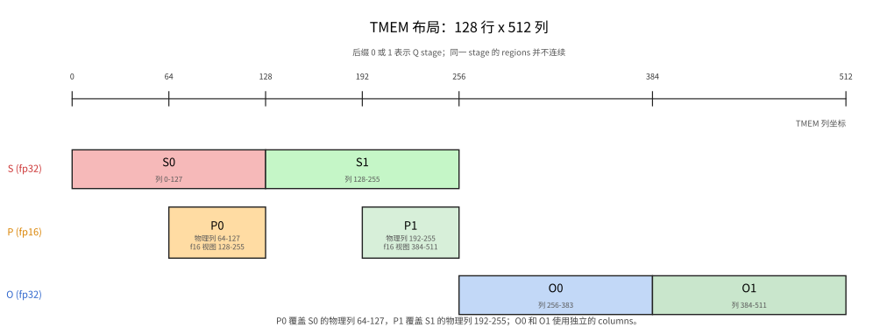
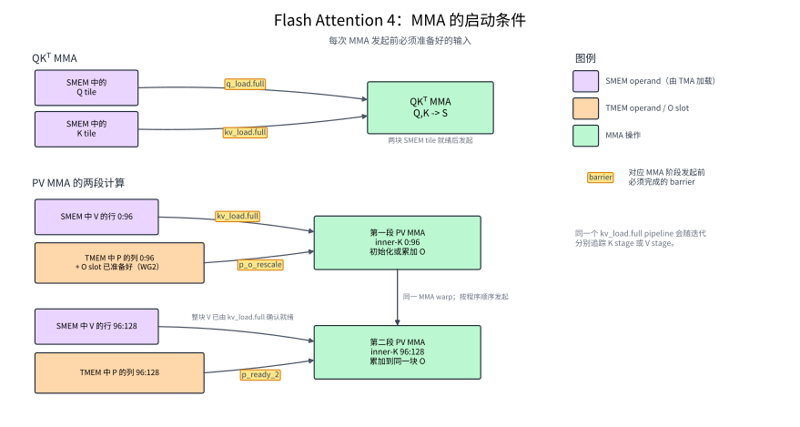
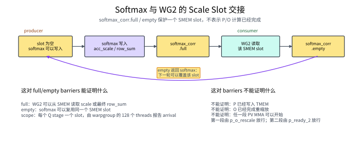
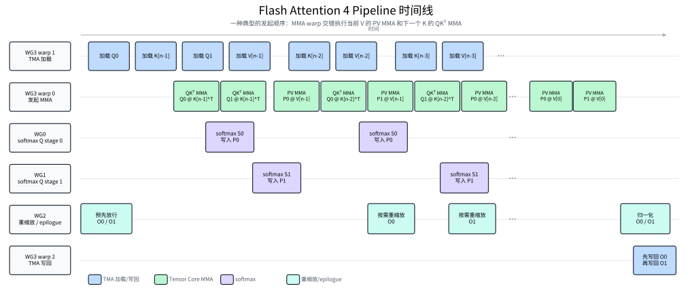

::: info 概览
- FlashAttention 按 block 处理 `K` 和 `V`, 用 online softmax 维护逐行状态, 因而不必把完整的 score matrix 写入 GMEM.
- FA4 为 Blackwell 重组了 pipeline: 不同角色分别执行 QKᵀ MMA、softmax、PV MMA 和 output correction, `S`、`P`、`O` 通过 TMEM 在这些角色之间交接.
- Conditional rescaling 会尽量跳过 `O` 在 TMEM 和 registers 之间的往返. 指数计算则由硬件 `exp2` 与基于 FMA 的多项式近似分担.
:::

Attention 是 Transformer 的核心计算之一, 也是长序列场景中主要的性能和内存瓶颈. 本章讨论的 Flash Attention 4 (FA4) 是针对 Blackwell GPU 优化的 attention forward kernel. 给定查询 `Q`、键 `K` 和值 `V`, 它计算:

$$O = \text{softmax}(QK^{\top} / \sqrt{d})V$$

其中, `QKᵀ` 给出 query 与 key 之间的 attention scores, $d$ 是每个 attention head 的维度. 除以 $\sqrt{d}$ 可以控制点积的数值范围; softmax 将每一行 scores 转换成 attention weights, 最后与 `V` 相乘得到输出 `O`. 直接实现会生成并保存完整的 score matrix. 随着 sequence length 增大, 这块中间结果会带来大量 memory traffic.

FlashAttention 把计算分块, 只在片上保留当前 tiles 和逐行 softmax 状态, 避免保存完整的 score matrix, 同时保持与标准 attention 相同的结果. 各版本的区别在于如何将这套算法映射到当代 GPU. FlashAttention-2 改进了 thread blocks 与 warps 的任务划分. FlashAttention-3 在 Hopper 上使用 TMA、WGMMA 和 warp specialization, 让数据搬运、两次 MMA 与 softmax 交错执行. FA4 则围绕 Blackwell 的 `tcgen05` 和 TMEM 重组这条 pipeline.

前面的 GEMM kernel 已经介绍了这些 Blackwell 硬件路径: TMA 搬运 tiles, `tcgen05` 执行 MMA, accumulator 保存在 TMEM 中. FA4 将它们连成一条新的计算链: QKᵀ MMA 先计算 score tile `S = QK^T`, CUDA cores 再将 `S` 转换为尚未归一化的权重 tile `P`, PV MMA 最后用 `P` 和 `V` 更新 output accumulator `O`. 本章沿用 FA4 论文的写法, 将两次矩阵乘法分别称为 QKᵀ MMA 和 PV MMA. 当 softmax 的指数参考值变化时, 还要先把 TMEM 中已有的 `O` 转换到新尺度.

本章重点说明 TMEM 如何连接两次 MMA 与 softmax, conditional rescaling 如何减少 `O` 的重缩放, 以及指数计算如何分配给不同浮点执行路径. 下面先推导这些操作的数学关系, 再说明 `S`、`P` 和 `O` 的 TMEM layout, 各个 warpgroup 的分工, 以及 barriers 如何交接数据和存储资源.

## 算法结构

上面的矩阵公式描述了完整的 attention 计算. 对于 sequence length 为 $L$ 的 self-attention, 每个 head 的 score matrix `S` 的 shape 为 $L\times L$, 使用 fp32 存储需要 $4L^2$ bytes. 完整的 `S` 无法长期保存在片上. 如果将它写入 GMEM, 再读回来计算 softmax 和后续矩阵乘法, 中间数据流量会随序列长度平方增长. FlashAttention 以 query block 为单位计算, 并逐块读取 `K` 和 `V`, 因而无需在 GMEM 中保存完整的 `S`.

在长度为 $L$ 的 self-attention 中, 单个 head 的 `Q`、`K` 和 `V` 的 shape 都是 $L\times d$. 用 $i$ 表示 query 的序列位置, 用 $j$ 表示 key/value 的序列位置. 相应的行向量记为:

$$q_i,k_j,v_j\in\mathbb{R}^d$$

$q_i$ 和 $k_j$ 的点积得到位置 $(i,j)$ 上的标量 score:

$$s_{ij}=q_i\cdot k_j$$

固定第 $i$ 个 query vector $q_i$, 让它与所有 key vectors $k_j$ 分别做点积, 就得到这一行的 scores $s_{ij}$. 这些 scores 构成 score matrix $S=QK^\top$ 的第 $i$ 行. 将这一行的真实最大 score 记为 $m_i^{\max}$:

$$m_i^{\max}=\max_j s_{ij}$$

基础的稳定 softmax 会用 $m_i^{\max}$ 作为指数参考值. 计算指数前统一减去它, 可以让这一行最大的指数输入变成 0, 避免指数值过大. 这项平移会同时作用于 softmax 的分子和分母, 因此不会改变最终的归一化结果. 每个位置的未归一化 attention weight 为:

$$p_{ij}=\exp\left(\frac{s_{ij}-m_i^{\max}}{\sqrt d}\right)$$

将这一行的所有 $p_{ij}$ 相加, 得到未归一化权重之和 $\ell_i$. 再用同一组 $p_{ij}$ 对 value vectors 加权求和, 得到尚未除以 $\ell_i$ 的 output vector $o_i$:

$$\ell_i=\sum_j p_{ij}$$

$$o_i=\sum_j p_{ij}v_j$$

最终输出为:

$$O_i=\frac{o_i}{\ell_i}$$

FlashAttention 按 block 处理 K/V. 一个 block 的 scores 用完即可丢弃; kernel 只需为每一行保留指数参考值 $r_i$, running denominator $\ell_i$ 和 running weighted sum $o_i$. 基础 online softmax 会将 $r_i$ 更新为截至当前的最大 score, 而 FA4 可以暂时保留旧值. $\ell_i$ 和 $o_i$ 都相对于当前 $r_i$ 累加, 因此后续 block 一旦改用更大的参考值, 必须先将旧状态换算到新尺度, 才能加上当前 block 的贡献.

基础 online softmax 每次发现更大的逐行最大值都会完成这次换算. FA4 则先比较新旧参考值的差距: 差距较小时继续使用旧值, 避免立刻重缩放已经累积的 output. 要理解这项优化, 先写清楚参考值变化时的尺度转换.

代码使用 base-2 exponential, 因此先定义:

$$\alpha=\frac{\log_2(e)}{\sqrt d}$$

于是自然指数可以改写为:

$$\exp\left(\frac{s-m}{\sqrt d}\right)=2^{(s-m)\alpha}$$

代码将 $\alpha$ 记为 `scale_log2`. 设旧状态使用参考值 $r_{\mathrm{old}}$, 当前 block 的逐行最大值为 $m_{\mathrm{block}}$. 用下标 $c$ 表示 candidate, 本轮可选的新参考值为:

$$r_c=\max(r_{\mathrm{old}},m_{\mathrm{block}})$$

再定义二者在 base-2 exponent 中的有符号差距 $\delta$, 它对应代码变量 `delta`:

$$\delta=(r_{\mathrm{old}}-r_c)\alpha\le 0$$

$\delta$ 是旧参考值减去候选参考值后的有符号结果. $-\delta$ 才表示候选参考值高出了多少个 base-2 exponent units. 因为 $r_c\ge r_{\mathrm{old}}$, $\delta$ 不会大于 0.

在 [FA4 论文](https://arxiv.org/abs/2603.05451)中, 阈值通常取 $\tau=\log_2(256)=8$. 当 $-\delta=8$ 时, 继续使用旧参考值会让当前 block 的最大未归一化权重达到 $2^8=256$; 若切换到候选参考值, 旧状态则要乘 $2^\delta=1/256$. 因此, 阈值 8 表示新旧尺度最多可相差 256 倍, 超过后才执行重缩放: `delta >= -8` 时保留旧参考值, `delta < -8` 时切换参考值. 这项优化通过阈值延迟重缩放, 以减少 correction 的数据搬运和乘法开销. 阈值取 8, 是在重缩放次数与指数增长之间的折中.

如果本轮改用候选参考值 $r_c$, 此前相对于旧参考值计算的每个指数都要乘同一个系数:

$$e^{(s-r_c)/\sqrt d}
=e^{(s-r_{\mathrm{old}})/\sqrt d}
\cdot e^{(r_{\mathrm{old}}-r_c)/\sqrt d}$$

将这个尺度转换系数记为 $a_{\mathrm{scale}}$, 则:

$$a_{\mathrm{scale}}
=e^{(r_{\mathrm{old}}-r_c)/\sqrt d}
=2^\delta$$

切换到候选参考值 $r_c$ 后, 之前累积的归一化分母 $\ell_i$ 和未归一化加权和 $o_i$ 仍处于旧尺度. Kernel 先将两者同时乘以 $a_{\mathrm{scale}}=2^\delta$, 转换到新尺度, 再加上当前 block 的结果. 映射到下面的伪代码时, $\ell_i$ 和 $o_i$ 分别记为 `row_sum` 和 `O`, 转换系数由 `acc_scale = exp2(delta)` 计算.

对应到下面的伪代码, 需要跨 K/V blocks 保留的三项状态分别是:

- `row_max`: 计算指数时从这一行所有 scores 中减去的参考值 $r_i$. 基础 online softmax 使用截至当前最大的 score; FA4 在阈值允许时可以继续使用旧参考值. 因此, 尽管变量名是 `row_max`, 它并不保证在每个 iteration 都等于真实最大值 $m_i^{\max}$.
- `row_sum`: 已经处理过的所有 key positions 的 $p_{ij}$ 之和, 也就是 $\ell_i$.
- `O`: 使用同一组 $p_{ij}$ 得到的加权和 $o_i$; 所有 blocks 处理完成后再除以 `row_sum`.

更新这些状态时, kernel 分三种情况处理:

- 第一个 K/V block 还没有旧状态, 直接采用 `candidate_max`, 并令 `acc_scale = 1`.
- 当 `delta >= -8` 时, kernel 保留旧参考值, 当前 block 也继续相对于旧值计算, 因此不需要转换旧状态, `acc_scale = 1`.
- 当 `delta < -8` 时, 差距超过阈值. Kernel 改用 `candidate_max`, 并令 `acc_scale = exp2(delta)`, 把旧的 `row_sum` 和 `O` 转换到新尺度.

下面先忽略 warpgroup 分工和 pipeline overlap, 写出一个 query block 的核心算法循环. 真实 kernel 执行的仍是这些步骤, 只是会让不同角色交错推进:

```text
scale_log2 = log2(e) / sqrt(d)
rescale_threshold = 8

row_max = -inf
row_sum = 0
O = 0
first_block = true

for each (K_block, V_block):
    S = Q_block @ K_block.T

    if causal:
        S[masked positions] = -inf

    candidate_max = max(row_max, rowmax(S))

    if first_block:
        new_ref = candidate_max
        acc_scale = 1
    else:
        delta = (row_max - candidate_max) * scale_log2  # delta <= 0
        if delta >= -rescale_threshold:                 # 差距未超过阈值
            new_ref = row_max
            acc_scale = 1
        else:                                           # 差距超过阈值
            new_ref = candidate_max
            acc_scale = exp2(delta)

    row_max_safe = 0 if new_ref == -inf else new_ref
    P = exp2((S - row_max_safe) * scale_log2)
    row_sum = row_sum * acc_scale + rowsum(P)

    block_O = P @ V_block
    if first_block:
        O = block_O
    elif all(acc_scale == 1):
        O += block_O
    else:
        O = O * acc_scale[:, None] + block_O

    row_max = new_ref
    first_block = false

for each row:
    O[row, :] = O[row, :] / row_sum[row] if row_sum[row] != 0 else 0
store O
```

`new_ref` 是本轮最终采用的指数参考值. 保留旧参考值时, `acc_scale = 1`, 原有状态不需要改变, `block_O` 可以直接累加; 采用候选参考值时, kernel 先用 `acc_scale` 转换旧的 `row_sum` 和 `O`, 再加入 `block_O`. 这里用 `all(acc_scale == 1)` 简化表示可以跳过 `O` 重缩放的情况; 实际 kernel 会对 WG2 中每个 warp 负责的 32 行分别判断. 所有 K/V blocks 处理完成后, kernel 才计算最终的 `O / row_sum`. “重缩放与结果写回”一节会展开这项判断.

如果某一行截至当前 block 仍没有出现任何有效 score, 该行的旧参考值和当前 block maximum 都是 `-inf`, 因此 `new_ref` 也为 `-inf`. 直接计算 `S - new_ref` 会出现 `-inf - (-inf)`; `row_max_safe` 在这种情况下改用 0, 使被 mask 的 scores 的指数为 0, `P`、`row_sum` 和 `O` 也保持为 0. 如果该行在更早的 blocks 中已经出现过有效 score, 那么后续一个全被 mask 的 block 只会产生全 0 的新贡献, 不会清空之前累积的 `row_sum` 和 `O`.

将自然指数改写成 base-2 exponential 只是数学形式的转换, 本身并不能消除 exponential path 的吞吐瓶颈. 如果所有元素仍然通过硬件 `exp2` 计算, 执行这条路径的单元依然可能限制 softmax 的速度.

FA4 因此把指数计算分配到两条执行路径: [论文](https://arxiv.org/abs/2603.05451)中, 一部分元素使用硬件 `exp2`, 另一部分使用 FP32 FMA 指令计算三次多项式近似. 当前 TIRx 实现中的 `ex2_emulation_2` 负责后一条路径. 这样, hardware exponential units 和 FMA units 可以并行工作, 减少 softmax 对单一执行路径的依赖. 这项调整只改变指数的实现方式, 不改变上面的 online-softmax 更新公式.

将这套算法映射到 kernel 后, 每个 K/V block 会产生或更新三类 tiles; 它们的存储位置决定了后面的 layout 和 barrier:

- `S` 是 score tile, 由 QKᵀ MMA 写入 TMEM.
- `P` 是尚未归一化的权重 tile. Softmax 将 `S` 从 TMEM 读入 registers, 计算 `P = exp2((S - row_max_safe) * scale_log2)`, 再将 `P` 写回 TMEM.
- `O` 是 output accumulator tile. PV MMA 从 TMEM 读取 `P`, 从 SMEM 读取 `V`, 并将结果累加到 TMEM 中的 `O`.

指数参考值改变时, 旧的 `O` 会从 TMEM 读入 registers, 完成 rescale 后再写回 TMEM, 随后 PV MMA 才能继续累加.

## Tile Primitive 数据流

明确 `S`、`P` 和 `O` 三类 tiles 的含义后, 就可以把一个 K/V block 的处理过程展开成具体的数据路径:

```text
Q, K:  GMEM --TMA load--> SMEM --QKᵀ MMA--> S in TMEM
S:     TMEM --tcgen05.ld--> registers --softmax--> P in registers
P:     registers --TMEM store--> P in TMEM
V:     GMEM --TMA load--> V in SMEM
P, V:  P in TMEM + V in SMEM --PV MMA--> O in TMEM

必要时：O in TMEM --tcgen05.ld--> registers --rescale/TMEM store--> O in TMEM
最终：  O in TMEM --tcgen05.ld--> registers --normalize/cast--> O in SMEM --TMA store--> O in GMEM
```

QKᵀ MMA 只读取 Q 和 K, 生成 `S`. Softmax 随后将 `S` 从 TMEM 读到 registers, 计算 `P`, 再把 `P` 写回 TMEM; PV MMA 读取这块 `P` 和 SMEM 中的 V, 更新 TMEM 中的 `O`. 处理后续 K/V blocks 时, `O` 可能先经过一次重缩放; 所有 blocks 完成后, epilogue 才执行最终归一化和写回.

下表将这条路径对应到具体的 TIRx primitives 和硬件指令:

| 阶段 | Tile 移动或计算 | TIRx primitive | 硬件路径 |
|---|---|---|---|
| 加载 Q/K/V | GMEM tiles → SMEM tiles | `Tx.copy_async(..., dispatch="tma")` | TMA load |
| QKᵀ MMA | SMEM 中的 Q、K → TMEM 中的 score tile `S` | `Tx.warp.gemm_async(..., dispatch="tcgen05")` | `tcgen05.mma` |
| Softmax 读出 | TMEM 中的 `S` → warpgroup register tile | `Tx.wg.copy_async(reg, tmem)` | `tcgen05.ld` |
| Softmax 写回 | registers 中尚未归一化的权重 tile `P` → fp16 TMEM view | `Tx.copy_async(tmem_as_f16, reg)` | TMEM store, 随后执行 `tcgen05.wait.st()` |
| PV MMA | TMEM 中的 `P`、SMEM 中的 V → TMEM 中的 output accumulator `O` | `Tx.warp.gemm_async(..., dispatch="tcgen05")` | 使用 TMEM operand 的 `tcgen05.mma` |
| 重缩放 | TMEM 中的 `O` → registers → TMEM 中的 `O` | TMEM readback, register multiply, TMEM store | `tcgen05.ld` / TMEM store |
| Epilogue | TMEM 中的最终 `O` → registers → SMEM → GMEM | TMEM readback, `Tx.copy`, TMA store | `tcgen05.ld` + TMA store |

与 GEMM 相比, FA4 在两次 MMA 之间加入了 softmax: `S` 需要从 TMEM 读出, `P` 又要写回 TMEM. 指数参考值改变时, `O` 还会额外经过一次 TMEM → registers → TMEM 的重缩放. 后文的 layouts 和 barriers, 主要用来保证这些读写按正确顺序发生.

## Warp 角色与 Scope

确定数据路径后, 还要把各个阶段分给具体 threads. 一个 CTA 包含 4 个 warpgroups, 每个 warpgroup 又包含 4 个 warps, 共 128 个 threads, 因此整个 CTA 有 512 个 threads. 下文将 warpgroup 0 至 3 简写为 WG0 至 WG3.

Kernel 同时处理两块 Q tiles. 每块 Q tile 都分配一个可循环复用的 slot, 其中包括 SMEM 中的 Q buffer, TMEM 中对应的 `S`、`P`、`O` 区域, 以及保护这些数据的 barriers. 代码将这样的 slot 称为 Q stage, 并将两个 slots 分别编号为 stage 0 和 stage 1. WG0 负责 stage 0 的 softmax, WG1 负责 stage 1 的 softmax; WG3 为两个 stages 发起 TMA 和 MMA, WG2 处理两个 stages 的 correction 和 epilogue.

这里的 correction 就是前面推导的 `O` 重缩放: 指数参考值改变时, WG2 按需将 TMEM 中已有的 `O` 乘以 `acc_scale`. 所有 K/V blocks 处理完成后, WG2 再用 `row_sum` 归一化 `O`, 转换输出类型, 并将结果写入 SMEM staging buffer, 供 TMA store 写回 GMEM.

四个 warpgroups 的具体分工如下:

| Owner | 角色 | 工作内容 |
|---|---|---|
| WG3, warp 1 | TMA load | 将 Q, K, V tiles 从 GMEM 加载到 SMEM |
| WG3, warp 0 | MMA | 发起 QKᵀ MMA 和 PV MMA |
| WG3, warp 2 | TMA store | 将最终的 O tiles 从 SMEM 写回 GMEM |
| WG0 | Q stage 0 的 softmax | 从 TMEM 读取 S, 计算 P, 再将 P 写回 TMEM |
| WG1 | Q stage 1 的 softmax | 为第二个 Q pipeline stage 执行相同工作 |
| WG2 | Correction 和 epilogue | 按需重缩放 TMEM 中的 `O`; 最后执行归一化和类型转换, 并将结果写入 SMEM staging buffer |

代码用两个 thread coordinates 选择当前 thread 的角色:

```python
wg_id = T.warpgroup_id([4])
warp_id = T.warp_id_in_wg([4])
```

`wg_id` 和 `warp_id` 的取值都为 0–3: 前者选择当前 thread 所属的 warpgroup, 后者选择该 warpgroup 内的 warp. Kernel 根据这两个值进入对应的 role branch.

WG3 是异步硬件指令的发起者: warp 1 发起 TMA load, warp 0 发起 QKᵀ MMA 和 PV MMA, warp 2 发起 TMA store. 每项操作都由对应 warp 中的一个 elected lane 提交, 实际的数据搬运或矩阵计算由 TMA engine 或 Tensor Core 完成. WG0 和 WG1 各用完整的 128-thread warpgroup 执行一个 Q stage 的 softmax; WG2 同样以 warpgroup 为执行范围, 完成 `O` correction 和最终 epilogue.

### Registers 如何在角色之间分配

Warp specialization 不只分配工作, 也让 kernel 可以把 register 容量集中给真正需要它的角色. WG3 大多只负责发出 TMA 和 MMA 指令, 不需要长期保存大块中间结果; WG0 和 WG1 则要让每个 thread 同时保存一整行 128 个 fp32 scores, 以及 softmax 计算使用的临时值. 如果 CTA 中的 512 个 threads 都按 softmax 的最大需求保留 registers, 就会超出 register 容量.

代码因此通过 `setmaxnreg` 动态调整每个角色中每个 thread 的 register 上限:

```python
if wg_id == 3:
  Tx.ptx.setmaxnreg(False, 48)       # WG3 释放多余 registers
elif wg_id < 2:
  Tx.ptx.setmaxnreg(True, 200)       # WG0/WG1 为 softmax 增加 registers

with WarpgroupRole(wg_id, 2, regs=64): # WG2 执行 correction / epilogue
  ...
```

当前配置中, WG0 和 WG1 每个 thread 最多使用 200 个 32-bit registers, WG2 使用 64 个, WG3 使用 48 个. 四个 128-thread warpgroups 的总预算为:

```text
128 × (200 + 200 + 64 + 48) = 65,536 个 32-bit registers
```

这种重分配让 softmax threads 能把完整 score row 留在 registers 中, 同时不会为只负责发指令的 WG3 预留同样大的 register 配额.

### 论文与当前 TIRx 实现的差异

本章解释的是当前 `flash_attention4.py` 的默认执行路径. 它沿用了 FA4 论文的整体 pipeline, 但有两处实现选择并不相同.

第一, 论文让 WG0 和 WG1 的 exponential-heavy softmax 区域错开执行, 避免两个 softmax warpgroups 同时争用 exponential units. 当前代码保留了 `bar_s0_s1_sequence` 及其同步分支, 但默认设置 `USE_S0_S1_BARRIER=False`, 因此默认路径不会启用这项顺序约束.

第二, 论文利用空余 TMEM 传递 correction statistics; 当前 TIRx 实现则把逐行的 `acc_scale` 和最终 `row_sum` 写入 SMEM buffer `sScale`, 再通过 `softmax_corr.full/empty` 在 softmax warpgroups 与 WG2 之间交接. 后文直接沿用代码中的名称, 将这块缓冲区称为 `sScale`.

## 阅读代码前的约定

本章使用的片段来自 [`flash_attention4.py`](https://github.com/mlc-ai/tirx-kernels/blob/main/tirx_kernels/attention/flash_attention4.py), 因此会引用在片段之外定义的 shapes, stage indices 和 phase variables. 下面列出后文反复出现, 但不容易只看名字判断含义的符号:

| 名称 | 含义 |
|---|---|
| `q_stage`、`i_q` | 当前 Q pipeline stage, 取值为 0 或 1; 在 WG0/WG1 的 softmax 分支中, `wg_id` 也是同一个 stage index |
| `MMA_N` | Score tile 和 TMEM region 的基本宽度, 当前为 128 columns |
| `MMA_K`、`K_SPLIT` | PV MMA 每个 inner-K step 处理 16 个位置; `K_SPLIT = 6 * MMA_K = 96` 将 128 个位置拆成 96 和 32 两段 |
| `should_accumulate` | 当前 PV MMA 是初始化 `O`, 还是累加到已有的 `O` |
| `phase_tmem` | 与 `P`、`O` 相关 barriers 当前要等待的 phase parity |
| `should_rescale` | 当前 row 的旧 `O` 是否需要在下一次 PV MMA 前重缩放 |
| `rescale_threshold` | 延迟更新指数参考值的阈值, 当前为 8.0 |
| `scale_log2` | base-2 指数使用的 softmax scale, 即 `log2(e)/sqrt(d)` |
| `acc_scale` | Softmax 交给 WG2, 用于调整旧 `row_sum` 和 `O` 的逐行 scale |

### Barrier 的分工与完成条件

FA4 的 pipeline 同时维护多种彼此独立的交接状态. Q, K/V 的 SMEM stages 需要在 TMA 和 MMA 之间交接; S, P, O 的 TMEM slots 需要在 Tensor Core, softmax 和 correction 之间交接; softmax 与 WG2 还要复用 `sScale`, epilogue 与 TMA store 则要复用 `O_smem`. 这些事件由不同角色在不同时间完成, 也保护不同的存储位置, 因此需要分别追踪.

对于循环复用的存储, 交接通常包含两个方向: `full` 或 `ready` 表示 producer 已经写好数据, consumer 可以读取; `empty` 表示 consumer 已经用完, producer 可以覆盖这块存储. 下面的 barriers 分别记录数据就绪和资源归还事件.

Barrier 的初始化 count 也不总是 thread 数. 普通 `MBarrier` 统计显式 arrival 次数; 如果一个 128-thread warpgroup 中每个 thread 都执行一次 `arrive`, count 才是 128. `TMABar` 除了一次 producer arrival, 还要等待登记的传输字节数归零; `TCGen05Bar` 则等待一次由 `tcgen05.commit` 发出的 Tensor Core 完成通知.

当前实现中, `q_load.full` 和 `kv_load.full` 使用 `TMABar`; `q_load.empty`、`kv_load.empty`、`s_ready` 和 `o_ready` 使用 `TCGen05Bar`; 其余 barriers 使用普通 `MBarrier`. 下表列出每个 barrier slot 在一个 phase 内的完成条件. Q pipeline 有 2 个 slots, K/V pipeline 有 3 个 slots, 其余表中的 staged barriers 各有 2 个 slots.

对于 `TCGen05Bar`, 表格描述的是 barrier 在算法中的逻辑职责, 也就是它保护哪份数据以及完成后允许哪个角色继续执行. 实际的 `tcgen05.commit` 会让 barrier 跟踪同一个 issuing thread 在 commit 之前发出的相关异步 `tcgen05` 操作, 并不保证只包含表中命名的那一条 MMA. 因此, 表中的 QKᵀ/PV MMA 应理解为这次交接所关心的最后一个结果或最后一次使用; 硬件上的完成依赖可能更加保守.

| Barrier | 参与通知的 threads | 每个 phase 的完成条件 | 完成后可以安全执行的操作 |
|---|---|---|---|
| `q_load.full` | 1 个 elected TMA-load thread | 该 thread 报告 1 次 arrival; TMA 再完成 `CTA_GROUP * BLK_M * HEAD_DIM * 2` bytes 的 Q 传输 | QKᵀ MMA 可以读取 Q SMEM tile |
| `q_load.empty` | 1 个 elected MMA thread | 该 thread 提交完成通知; Tensor Core 完成所有仍在读取该 Q stage 的 QKᵀ MMA 后更新 barrier | TMA 可以用下一个 query tile 覆盖该 Q stage |
| `kv_load.full` | 1 个 elected TMA-load thread | 该 thread 报告 1 次 arrival; TMA 再完成 `CTA_GROUP * BLK_N * HEAD_DIM * 2` bytes 的 K 或 V 传输 | QKᵀ MMA 或 PV MMA 可以读取当前 K/V SMEM tile |
| `kv_load.empty` | 1 个 elected MMA thread | 该 thread 提交完成通知; Tensor Core 完成读取该 stage 的两次 MMA 后更新 barrier | TMA 可以复用该 K/V stage |
| `s_ready` | 1 个 elected MMA thread | Tensor Core 完成 QKᵀ MMA 后报告 1 次通知 | Softmax 可以读取 S TMEM tile |
| `p_o_rescale` | 128 个 softmax threads + 128 个 WG2 threads | 两组共报告 256 次 arrivals | 第一段 PV MMA 可以读取 `P[:, 0:96]`, 并初始化或继续累加 O |
| `p_ready_2` | Softmax warpgroup 的 128 个 threads | 共报告 128 次 arrivals | 第二段 PV MMA 可以读取 `P[:, 96:128]` |
| `o_ready` | 1 个 elected MMA thread | Tensor Core 完成最后一段 PV MMA 后报告 1 次通知 | Epilogue 可以读取最终 O accumulator |
| `softmax_corr.full` | Softmax warpgroup 的 128 个 threads | 共报告 128 次 arrivals | WG2 可以读取 `sScale` 中的 `acc_scale` 或最终 `row_sum` |
| `softmax_corr.empty` | WG2 的 128 个 threads | 共报告 128 次 arrivals | Softmax 可以继续推进并重新写入对应的 `sScale` slot |
| `corr_epi.full` | WG2 的 128 个 threads | 共报告 128 次 arrivals | TMA-store warp 可以读取已经写好的 `O_smem` |
| `corr_epi.empty` | TMA-store warp 的 32 个 threads | 等待 TMA store 完成后, 共报告 32 次 arrivals | Epilogue 可以复用该 `O_smem` stage |

表中的 count 都针对单个 slot 的当前 phase. 多个 slots 只是在不同 pipeline stages 上各自保存一份 barrier 状态, 并不会把 expected arrival count 相乘. 后文遇到每个 barrier 时, 会结合对应的 wait 和 arrive 位置展开它的具体交接过程.

## QKᵀ MMA 与 PV MMA

固定一个 Q stage 后, kernel 会依次用它处理流式到达的 K/V blocks. 每处理一个 block, 都要完成下面三步:

```text
Q, K -> QKᵀ MMA -> S
S    -> softmax   -> P
P, V -> PV MMA -> O
```

QKᵀ MMA 先生成当前 block 的 attention scores `S`, softmax 再将 `S` 转换为尚未归一化的权重 `P`, PV MMA 最后计算 `P @ V`. 第一个 K/V block 的结果用于初始化 `O`, 后续 blocks 的结果则继续累加到同一块 `O` 中. 所有 blocks 处理完成后, epilogue 才用 `row_sum` 对 `O` 做最终归一化.

下面依次分析这三个步骤. 每个 tile operation 都从四个方面说明: 哪些 threads 执行它, operands 和结果采用什么 layout, 最终 dispatch 到哪条硬件路径, 以及哪个 barrier 将结果交给下一角色.

代码使用 `S_region`、`P_region` 和 `O_region` 表示同一块 TMEM allocation 中保存三类 tiles 的区域. `q_stage` 和 `i_q` 都表示当前使用的 Q stage, 取值为 0 或 1; 用同一个 stage index 访问这三个 regions, 就能选中同一块 Q tile 对应的 `S`、`P` 和 `O`. 这里先把它们理解为命名后的 TMEM 区域, 具体的 column 划分将在“TMEM 布局与复用”一节说明.

### QKᵀ MMA

对于当前 Q stage 和当前 K block, QKᵀ MMA 计算:

$$S = Q_{\text{block}}K_{\text{block}}^{\top}$$

`Q_block` 和 `K_block` 的 shape 都是 `128×HEAD_DIM`. `K_block` 转置后, 每条 Q row 都会与 128 条 K rows 分别做点积, 因此得到一个 `128×128` score tile: 行对应 queries, 列对应当前 K block 中的 keys. 结果写入当前 Q stage 的 `S_region[q_stage]`; 代码中的 `MMA_N=128` 就是这 128 个 score columns.

```python
Tx.warp.gemm_async(
  S_region[q_stage],
  Q_smem[q_stage, 0:BLK_M, 0:HEAD_DIM],
  K_smem[kv_stage, 0:BLK_N, 0:HEAD_DIM],
  dispatch="tcgen05",
  cta_group=CTA_GROUP,
)
if T.ptx.elect_sync():
  s_ready.arrive(q_stage)
```

> **Tile primitive: QKᵀ MMA**
> - Scope: WG3 warp 0 执行这个 warp-scoped tile operation; 其中一个 elected lane 提交完成通知.
> - Layout: SMEM 中的 Q, K → TMEM 中的 `S`(`S_region[q_stage]`).
> - Dispatch:`tcgen05`.
> - 交接:`s_ready`(→ softmax).

`s_ready` 是追踪 Tensor Core 完成状态的 `TCGen05Bar`. 这里的 `s_ready.arrive(q_stage)` 会发出 `tcgen05.commit`, 将此前启动的 QKᵀ MMA 与该 stage 的 barrier 关联起来. 只有一个 elected lane 执行这次 commit; Tensor Core 写完 `S` 后, 硬件才会向 barrier 报告完成. 对应的 softmax warpgroup 等待 `s_ready` 通过后, 才能读取 `S_region[q_stage]`.

### 两次 MMA 之间的 Softmax

Softmax 位于两次 MMA 之间, 负责将 score tile `S` 转换为尚未归一化的权重 tile `P`:

> **Tile primitive: Softmax**
> - Scope: WG0 (Q stage 0) 或 WG1 (Q stage 1), 完整 warpgroup.
> - Layout: TMEM 中的 `S` → registers → fp16 TMEM 中的 `P`(`P_region[wg_id]`).
> - Dispatch: 通过 `tcgen05.ld` 读取 `S`, 在 registers 中执行逐行 softmax, 再通过 `tcgen05.st` 写回 `P`.
> - 交接: 先等待 `s_ready`; 前 96 columns 写完后向 `p_o_rescale` 报告完成, 最后 32 columns 写完后再通知 `p_ready_2`.

每个 score tile 有 128 行, 一个 softmax warpgroup 也有 128 个 threads, 因此 kernel 让 thread `r` 负责逻辑 row `r`. 代码中的 `wg_local_layout` 表达的就是这项映射: 每个 thread 最终处理自己一行的 128 个 scores.

每个 thread 会为这一整行保留一个包含 128 个 fp32 values 的 register buffer `s_chunk_buf`; 前面为 WG0/WG1 设置的 200-register 上限主要就是为这个 buffer 和 softmax 临时值提供空间. WG0/WG1 等待 `s_ready` 后, 并不是用一条指令读出整行, 而是通过四次 32-column `tcgen05.ld` 填满这个 buffer:

```python
for chunk_idx in Tx.unroll(BLK_N // SOFTMAX_LD_CHUNK):
  Tx.copy_async(
    s_chunk[
      :, chunk_idx * SOFTMAX_LD_CHUNK : (chunk_idx + 1) * SOFTMAX_LD_CHUNK
    ],
    S_region[
      wg_id,
      chunk_idx * SOFTMAX_LD_CHUNK : (chunk_idx + 1) * SOFTMAX_LD_CHUNK,
    ],
  )
```

这里 `SOFTMAX_LD_CHUNK=32`. 分块的是 TMEM load, 而不是 softmax 算法: 当前实现将一整行拆成四个较小的 register fragments, 每次填入 32 个 values, 从而控制单次 tile operation 的 register tuple 大小. 四次 load 结束后, 完整的 128 个 scores 仍同时保存在每个 thread 的 registers 中. 这是当前 kernel 选择的读取粒度, 并不表示 softmax 被分成四次独立计算. 随后, 每个 thread 对自己负责的整行完成下面的计算:

1. 求当前 128 个 scores 的最大值, 并结合此前保存的 `row_max`, 确定本轮的指数参考值和 `acc_scale`.
2. 计算这一行的 $p_{ij}$, 并将 fp32 结果转换为 fp16, 组成 tile `P`.
3. 对这一行的 $p_{ij}$ 求和, 更新 `row_sum`.

下面的代码省略了 profiler 和可选的 WG0/WG1 顺序 barrier, 保留了这三步的主要计算. 先求新的参考值, 并根据阈值决定是否需要重缩放旧的 `O`:

```python
row_max_old = row_max[0]
with Tx.thread():
  if is_first:
    Tx.max(tile_max, s_chunk_buf)
  else:
    tile_max[0] = row_max_old
    Tx.max(tile_max, s_chunk_buf, accum=True)

row_max_new = tile_max[0]
row_max_safe = Tx.if_then_else(tile_max[0] == -float("inf"), 0.0, tile_max[0])
if is_first:
  acc_scale = Tx.float32(1.0)
else:
  acc_scale_ = (row_max_old - row_max_safe) * scale_log2
  if acc_scale_ >= -rescale_threshold:
    row_max_new = row_max_old
    row_max_safe = row_max_old
    acc_scale = Tx.float32(1.0)
  else:
    acc_scale = Tx.ptx.exp2(acc_scale_)
row_max[0] = row_max_new
```

然后将 scores 转成 base-2 exponent 的输入, 计算 fp32 权重, 并转换为后续 PV MMA 使用的 fp16 `P`. 实现会在硬件 `exp2` 和 `ex2_emulation_2` 之间选择:

```python
Tx.fma(s_chunk, s_chunk, scale_log2, -row_max_safe * scale_log2)
for frag_idx in Tx.unroll(4):
  with Tx.thread():
    s_chunk_local = s_chunk_buf.local(BLK_N)
    for i in Tx.unroll(BLK_N // 4 // 2):
      idx = Tx.meta_var(frag_idx * BLK_N // 4 + 2 * i)
      if i * 2 % 16 < 16 - 4 or frag_idx >= 4 - 1 or apply_mask:
        s_chunk_local[idx] = Tx.ptx.exp2(s_chunk_local[idx])
        s_chunk_local[idx + 1] = Tx.ptx.exp2(s_chunk_local[idx + 1])
      else:
        ex2_emulation_2(
          s_chunk_local,
          idx,
          s_chunk_local[idx],
          s_chunk_local[idx + 1],
        )
  Tx.cast(
    p_chunk[:, frag_idx * BLK_N // 4 : (frag_idx + 1) * BLK_N // 4],
    s_chunk[:, frag_idx * BLK_N // 4 : (frag_idx + 1) * BLK_N // 4],
  )
```

Softmax 随后将 `P` 分四个 32-column chunks 写回 TMEM. 代码先写前三个 chunks, 等待这些 TMEM stores 完成, 再报告前 96 columns 已经准备好:

```python
for i in Tx.unroll(3):
  Tx.copy_async(
    P_region[wg_id, i * BLK_N // 4 : (i + 1) * BLK_N // 4],
    p_chunk[:, i * BLK_N // 4 : (i + 1) * BLK_N // 4],
  )
T.ptx.tcgen05.wait.st()
p_o_rescale.arrive(wg_id)

Tx.copy_async(P_region[wg_id, 3 * BLK_N // 4 : BLK_N],
  p_chunk[:, 3 * BLK_N // 4 : BLK_N])
T.ptx.tcgen05.wait.st()
p_ready_2.arrive(wg_id)
```

`s_chunk_buf` 中仍保留着转换前的 fp32 `P`. WG2 读完 `acc_scale` 并允许对应的 `sScale` slot 再次写入后, softmax warpgroup 再用这些 values 更新 denominator:

```python
softmax_corr.empty.wait(wg_id, phase_q)
with Tx.thread():
  if is_first:
    Tx.sum(row_sum, s_chunk_buf)
  else:
    row_sum[0] = row_sum[0] * acc_scale
    Tx.sum(row_sum, s_chunk_buf, accum=True)
```

第一段 PV MMA 需要同时读取 `P[:, 0:96]` 和更新 `O`, 所以必须等待两件事: softmax 已写完这部分 `P`, WG2 也已确认 `O` 可以初始化或继续累加. `p_o_rescale` 汇合这两个完成信号. 最后 32 columns 使用单独的 `p_ready_2`, 这样第一段 MMA 不必等待最后一次 TMEM store.

为什么刚在 registers 中算出 `P`, 又要把它写回 TMEM? 这里的 PV MMA 使用 `tcgen05.mma`, 其 `P` operand 必须采用 MMA 能读取的 TMEM layout, 不能直接使用分散在 softmax threads 私有 registers 中的值. `P_region` 是同一块物理 TMEM 的 fp16 view; 写回这个区域后, `P` 才能作为下一次 MMA 的矩阵 operand.

### PV MMA

当前 block 的 `P` 和 V 都准备好后, PV MMA 使用它们更新 `O`:

```text
第一个 K/V block：O = P_block @ V_block
后续 K/V blocks： O = O + P_block @ V_block
```

`P` 的 shape 为 `128×128`, V block 的 shape 为 `128×d`, 因此 `P@V` 产生一个 `128×d` output tile. 第一个 K/V block 还没有旧结果, `should_accumulate=false`, 这次乘积直接初始化 `O`. 后续 blocks 使用 `should_accumulate=true`; 在发起 MMA 前, WG2 必须先完成旧 `O` 的必要重缩放, 或确认本轮不需要重缩放.

PV MMA 的两个 operands 来自不同的 memory spaces: `P` 位于 TMEM, V 位于 SMEM, fp32 accumulator `O` 也位于 TMEM. Kernel 又将 128 个归约位置拆成 96 和 32 两段, 代码如下:

```python
# 第一段：P 的前 96 columns 与 V 对应的前 96 rows。
Tx.warp.gemm_async(
  O_region[i_q],
  P_region[i_q, 0:K_SPLIT],
  V_smem[kv_stage, 0:K_SPLIT, 0:HEAD_DIM],
  transB=True,
  accum=should_accumulate,
  dispatch="tcgen05",
  cta_group=CTA_GROUP,
)

p_ready_2.wait(i_q, phase_tmem)
Tx.warp.gemm_async(
  O_region[i_q],
  P_region[i_q, K_SPLIT:BLK_N],
  V_smem[kv_stage, K_SPLIT:BLK_N, 0:HEAD_DIM],
  transB=True,
  accum=True,
  dispatch="tcgen05",
  cta_group=CTA_GROUP,
)
```

> **Tile primitive: PV MMA**
> - Scope: WG3 warp 0 执行这个 warp-scoped tile operation.
> - Layout: TMEM 中的 `P` + SMEM 中的 V → TMEM 中的 `O`(`O_region[i_q]`).
> - Dispatch: 使用 TMEM operand 的 `tcgen05`.
> - 交接: 第一段等待 `kv_load.full` 和 `p_o_rescale`, 第二段再等待 `p_ready_2`; 最后一个 K/V block 完成后, 通过 `o_ready` 交给 epilogue.

`kv_load.full` 确认 V 已经进入 SMEM. `p_o_rescale` 同时确认 `P` 的前 96 columns 已经写入 TMEM, 并且 `O` 可以初始化或继续累加. 第一段 MMA 发出后, kernel 再等待 `p_ready_2`, 确认最后 32 columns 已经写完, 然后以 `accum=true` 发出第二段 MMA. 这里第二段始终累加, 因为即使是第一个 K/V block, `O` 也已经包含第一段产生的 partial sum.

这里的 inner-K 是矩阵乘法 `P(128×128) @ V(128×d)` 的归约维, 也就是当前 K/V block 内的 128 个位置. 硬件每个 `MMA_K=16` step 消费其中 16 个位置. Kernel 将前六个 steps 合并为第一段, 因此 `K_SPLIT=6*MMA_K=96`; 剩余的 32 个位置由第二段处理:

1. Softmax 将 `P` 分成四个 32-column chunks 写入 TMEM.
2. 前三个 chunks 准备好后, PV MMA 立即处理 `P` 的前 96 columns 和 V 中对应的 rows.
3. 最后 32 columns 通过 `p_ready_2` 单独等待.
4. 第二段 MMA 处理最后一个 chunk, 完成当前 tile.

这样拆分可以减少 Tensor Core 等待 `P` writeback 的时间. 如果把 128 个归约位置作为一个整体交接, PV MMA 必须等四个 `P` chunks 全部写入 TMEM 后才能开始. 现在, 前三个 chunks 写完后, 第一段 MMA 就可以启动, 并与 softmax warpgroup 对最后 32 columns 的 TMEM store 及其完成通知并行推进.

## TMEM 布局与复用

FA4 为一个 CTA 申请 128 rows × 512 个物理 TMEM columns, 每个 cell 为 32 bits. 两个 Q stages 都需要保存一个 128-column fp32 score tile `S` 和一个 128-column fp32 output accumulator `O`, 因此仅 `S` 和 `O` 就会占满整块 allocation:

```text
2 stages × (128 columns for S + 128 columns for O) = 512 columns
```

源码首先为这块 allocation 建立两个 buffer. `move_base_to(0)` 将分配位置移回起点, 因此 `tmem_as_f16` 与 `tmem` 从同一个物理 TMEM column 开始:

```python
tmem_pool = T.TMEMPool(
  pool, total_cols=N_COLS_TMEM, cta_group=CTA_GROUP, tmem_addr=tmem_addr
)
tmem = tmem_pool.alloc((128, N_COLS_TMEM), "float32")
tmem_pool.move_base_to(0)
tmem_as_f16 = tmem_pool.alloc((128, N_COLS_TMEM * 2), "float16")
tmem_pool.commit()
```

这两个 buffer 每行包含的总 bits 相同:

```text
tmem:         512 × 32 bits = 16384 bits
tmem_as_f16: 1024 × 16 bits = 16384 bits
```

所以,`tmem_as_f16` 不是另一块存储, 而是同一行 TMEM 的另一种索引方式. 硬件仍将每行划分为 512 个 32-bit 格子; 这里把格子的编号称为物理 column. 通过 fp16 buffer 访问时, 每个格子被看成两个 16-bit element slots:

```text
物理 column p（32 bits）
┌────────────────┬────────────────┐
│ fp16 slot 2p   │ fp16 slot 2p+1 │
└────────────────┴────────────────┘
```

因此, `tmem[:, p]` 以 fp32 读取整个格子; `tmem_as_f16[:, 2p]` 和 `tmem_as_f16[:, 2p+1]` 则分别访问其中两个 fp16 values.

建立这两个 buffer 后, 源码再定义 `S`,`P` 和 `O` 的两个 pipeline stages:

```python
S_region = T.TMEMStages(
  tmem, col_start=0, width=MMA_N,
  stages=SMEM_PIPE_DEPTH_Q, stride=MMA_N,
)
O_region = T.TMEMStages(
  tmem, col_start=MMA_N * SMEM_PIPE_DEPTH_Q, width=MMA_N,
  stages=SMEM_PIPE_DEPTH_Q, stride=MMA_N,
)
P_region = T.TMEMStages(
  tmem_as_f16, col_start=MMA_N, width=BLK_N,
  stages=SMEM_PIPE_DEPTH_Q, stride=MMA_N * 2,
)
```

这里 `MMA_N=BLK_N=128`, Q pipeline 有两个 stages. `S_region` 和 `O_region` 通过 fp32 buffer 索引, 所以它们的下标就是物理 column 编号. `P_region` 通过 fp16 buffer 索引, 需要把下标除以 2 才得到物理 column.

以 `P0` 为例. 设 `n` 是它自己的逻辑列号, 则:

```text
P_region[0, n]
    -> tmem_as_f16[:, 128 + n]       # col_start = 128
    -> 物理 column 64 + n // 2
```

`P0[:, 0]` 和 `P0[:, 1]` 因而落在物理 column 64 的两个 16-bit 半格中;`P0[:, 2]` 和 `P0[:, 3]` 落在物理 column 65.128 个 fp16 values 最终占用 64 个物理 columns, 即 `[64, 128)`.

对于 stage 1,`P_region` 的 fp16 起点为 `128 + 1 × 256 = 384`, 所以:

```text
P_region[1, n]
    -> tmem_as_f16[:, 384 + n]
    -> 物理 column 192 + n // 2
```

因此 `P1` 占用物理 columns `[192, 256)`. 下图和表格汇总了各个 regions 的最终位置:



| Region | 每行保存的数据 | 实际占用的物理 columns |
|---|---: |---: |
| `S0` | 128 个 fp32 scores | `[0, 128)` |
| `P0` | 128 个 fp16 weights | `[64, 128)`, 复用 `S0` 的后半部分 |
| `S1` | 128 个 fp32 scores | `[128, 256)` |
| `P1` | 128 个 fp16 weights | `[192, 256)`, 复用 `S1` 的后半部分 |
| `O0` | 128 个 fp32 accumulator values | `[256, 384)` |
| `O1` | 128 个 fp32 accumulator values | `[384, 512)` |

`P` 没有第三块独立空间. 这里的重叠是分时复用, 并不是 `S` 和 `P` 同时保存在相同位置. 以 stage 0 为例, QKᵀ MMA 最初在物理 columns `[0, 128)` 写入完整的 `S0`; softmax 将 `S0` 全部读入 registers 后, 再把 128 个 fp16 `P0` values 两两打包, 写入 `[64, 128)`. 这会覆盖原来位于该处的后 64 个 fp32 scores, 而这些 scores 此时已经不再需要.

这种复用要求三个操作严格按顺序发生: softmax 必须先把完整的 `S` 读入 registers, 之后才能用 `P` 覆盖 `S` 的后半部分; PV MMA 必须等对应的 `P` chunks 写完后才能读取; 下一轮 QKᵀ MMA 又必须等当前 `P` 已被消费后, 才能重新写入这块区域.

这些条件不能只靠普通的源代码顺序保证. QKᵀ MMA 的 `tcgen05.commit` 完成通知通过 `s_ready` 放行 softmax; softmax 等 TMEM-to-register loads 完成后才使用这些 scores. 写回 `P` 时, `tcgen05.wait::st` 先确认异步 TMEM stores 完成, softmax 再向 `p_o_rescale` 或 `p_ready_2` 报告 arrival; PV MMA 等待对应 barrier 后才读取. 最后, PV MMA 和下一轮 QKᵀ MMA 由 WG3 warp 0 中的同一个 issuing thread 按固定的 `tcgen05` 序列发出, lowering 需保留它们之间必要的 `tcgen05` 依赖. 这些完成与顺序机制共同防止同一块 TMEM 被过早读取或覆盖.

Regions 定义完成后, 计算代码只需用 stage index 访问 `S_region[...]`,`P_region[...]` 和 `O_region[...]`, 不再直接计算原始 TMEM column 编号.

## 关键 Barrier 协议

前面的总表已经列出了所有 barriers 的通知者, 完成条件和放行操作. 下面只展开两处最容易混淆的同步过程: QKᵀ MMA 和 PV MMA 在发起前分别等待哪些条件, 以及 softmax 与 WG2 如何通过一对 full/empty barriers 反复使用 SMEM buffer `sScale`.

### 两次 MMA 分别等待什么

下图列出了 QKᵀ MMA 和两段 PV MMA 各自的开始条件, 也就是每段计算在发起前必须等到哪些 operands 和 accumulator 状态:



上半部分是 QKᵀ MMA.`q_load.full` 确认当前 Q stage 已经进入 SMEM,`kv_load.full` 确认当前 K stage 已经进入 SMEM; 两个条件都满足后, QKᵀ MMA 才能生成 `S`.

下半部分把 PV MMA 拆成代码中实际发出的两段. 第一段处理 inner-K `0:96`:`kv_load.full` 确认整块 `V` 已经进入 SMEM,`p_o_rescale` 则同时等待 `P[:, 0:96]` 写入 TMEM, 并确认 `O` slot 可以初始化或继续累加. 第一个 K/V block 可以直接初始化 `O`; 后续 blocks 则要先完成必要的重缩放, 或者确认本轮可以跳过重缩放.

第一段发出后, 同一个 MMA warp 等待 `p_ready_2`, 再使用 `P[:, 96:128]` 和 `V[96:128, :]` 发出第二段, 并以 `accum=True` 累加到同一块 `O`. 第二段不需要再次等待 `kv_load.full`, 因为整块 `V` 在第一段开始前已经确认就绪. `p_ready_2` 只放行第二段, 不会推迟第一段的启动.

`p_o_rescale` 的 expected arrival count 为 256: softmax warpgroup 写完 `P` 的前 96 columns 后贡献 128 次 arrivals, WG2 让 `O` 准备好后再贡献 128 次. 第一个 K/V block 尚无旧的 `O`, WG2 会预先报告自己这一半 arrivals; 后续 blocks 则在重缩放完成或确认无需重缩放后报告. 两组 arrivals 全部到达, barrier 才会放行第一段 PV MMA. `p_ready_2` 的 expected arrival count 为 128, 由 softmax warpgroup 在最后 32 columns 写入 TMEM 后报告, 用来单独放行第二段.

### Softmax 如何向 WG2 传递逐行状态

Softmax warpgroup 还要把每个 output row 的两个标量交给 WG2. K/V loop 期间传递 `acc_scale[row]`, 告诉 WG2 应该把 TMEM 中该行的旧 `O` 缩放多少; 所有 K/V blocks 处理完成后, 再传递最终的 `row_sum[row]`, 供 WG2 计算 `O[row, :] / row_sum[row]`.

为此,`sScale` 会为每个 Q stage 保留 128 个 `fp32` 位置, 下面称为一个 `sScale` slot. 循环期间, 这 128 个位置保存各行的 `acc_scale`; 循环结束后, 同一 slot 改为保存最终的 `row_sum`. Softmax 写入后通过 `softmax_corr.full` 通知 WG2, WG2 读完后再通过 `softmax_corr.empty` 表示该 slot 可以重新写入. 下图展示一个 `sScale` slot 的 full/empty 协议:



从单个 slot 看, 这组 producer-consumer 协议可以理解为:

1. Softmax 先等待 `softmax_corr.empty`, 确认对应的 `sScale` slot 可以重新写入.
2. Softmax 将 `acc_scale` 或最终 `row_sum` 写入该 slot.
3. Softmax 向 `softmax_corr.full` 报告 arrival.
4. WG2 等待 `softmax_corr.full`, 再读取该 slot.
5. WG2 发出对应的 empty arrival.
6. Softmax warpgroup 在下一 phase 中重新写入这个 `sScale` slot.

第一个 K/V block 没有旧的 `O`, 因此不需要传递 `acc_scale`. 不过, softmax 和 WG2 仍完成一次 full/empty 交接, 让双方的 barrier phase 同时前进; 否则下一轮可能等待不同的 phase. 后续 iterations 使用同一 `sScale` slot 传递 `acc_scale`, 最后一次交接再传递 `row_sum`.

实际 kernel 将两个 Q stages 的 correction 交错执行. WG2 处理 stage `i_q` 后, 会用 `softmax_corr.empty.arrive(1 - i_q)` 放行另一个 softmax stage, 使 WG0 和 WG1 交替前进; epilogue 读取最终 `row_sum` 时, 才允许重新写入同一个 `i_q` 对应的 slot. 因此, 上图只说明一个 `sScale` slot 如何完成交接, 代码中的 stage index 还受到两级 pipeline 的交错顺序影响.

还要区分 `softmax_corr.empty` 与 `p_o_rescale`. 前者控制 `sScale` slot 的复用和两级执行顺序; 后者才向 PV MMA 证明 `P` 与 `O` 已经满足第一段计算的条件.

FA4 比 GEMM 多出的 barriers 大多围绕 softmax: QKᵀ MMA 与 PV MMA 之间增加了 register 计算, TMEM rewrite 和 output rescale, 每一步都需要明确证明下一角色何时可以读取数据或复用存储空间.

## Pipeline 时间线

前一节的交接图说明了每个角色开始前需要等待什么, 但没有展示哪些角色会在同一时间工作. Barrier 可能早在 consumer 到达前就已经满足, 也可能让 consumer 等待很久, 因此依赖关系与执行时间线需要分开观察.

FA4 没有一个统一的 pipeline depth, 因为不同 tile streams 的推进速度并不相同. Kernel 分别为它们维护循环使用的 stages:

- Q pipeline depth 为 2: 一个 CTA 同时推进两个 query tiles, WG0 和 WG1 分别处理 stage 0 和 stage 1 的 softmax.
- KV pipeline depth 为 3: K, V blocks 按倒序流过三块循环使用的 SMEM stages, 为两块 query tiles 提供 operands.
- TMEM pipeline depth 为 2: 两个 query tiles 分别使用一组 S/P/O slots; 完成相应的数据交接后, 这些 slots 才能进入下一轮.

下图使用时间线表示这几组 pipeline 同时运行后, 各个角色可以在大致相同的时间执行哪些工作. 图中将首轮初始化, 稳态 K/V loop 和最后的收尾分开画出:



这张图应当按时间线阅读, 用来观察哪些角色可以同时工作. 前面的 barrier-flow 图则用于检查各阶段之间准确的 wait 和 arrival. 两张图分别回答“哪些条件必须满足”和“哪些工作可以重叠”这两个问题.

图中的每一行对应一个 role branch:

- WG3 warp 1 发起 TMA loads.
- WG3 warp 0 发起 QKᵀ MMA 和 PV MMA.
- WG0 和 WG1 为两个 Q stages 执行 softmax.
- WG2 在首轮前放行两块 `O` slots, 在后续轮次中按需 rescale `O`, 最后再执行 normalization.
- WG3 warp 2 发起 TMA store.

从左到右可以追踪一轮典型的 pipeline. 图中 $n$ 表示这两个 query tiles 需要处理的 K/V block 数量, kernel 从最后一个有效 block 开始, 按 `n-1`,`n-2`, ……的顺序向前遍历. Load warp 先后准备 `Q0`,`K[n-1]`,`Q1`,`V[n-1]`, 随后继续加载编号更小的 K/V blocks. MMA warp 先执行 QKᵀ MMA 生成 `S0` 和 `S1`, WG0/WG1 再将它们转换为 `P0` 和 `P1`.

MMA warp 不会先执行完所有 QKᵀ MMAs, 再执行所有 PV MMAs. 两个 Q stages 预填充完成后, 两类 MMA 会交错执行: 先使用当前 V block 执行 PV MMA, 再使用下一个 K block 执行 QKᵀ MMA:

```text
score Q0*K[n-1]
score Q1*K[n-1]
value P0*V[n-1]
score Q0*K[n-2]
value P1*V[n-1]
score Q1*K[n-2]
value P0*V[n-2]
...
```

两类 MMA 的交错使图中的 score, softmax, correction 和 value 可以互相重叠, 避免各阶段依次串行执行.

时间线左侧的 `预先放行 O0/O1` 发生在主循环之前. 此时 TMEM 中还没有旧的 `O`, WG2 直接向两个 `p_o_rescale` slots 报告 arrivals, 允许首轮 PV MMA 以 `accum=false` 初始化 `O0` 和 `O1`. 稳态循环中, WG2 在对应 softmax 产生 `acc_scale` 后按需重缩放旧的 `O`, 再放行下一次 PV MMA. 省略号表示同样的交错继续到 `V[0]`; 只有最后两次 PV MMA 完成后, WG2 才会归一化 `O0` 和 `O1`, 随后由 WG3 warp 2 依次发起两次 TMA store.

Q tiles, K/V blocks 和 TMEM slots 按不同节奏推进. Kernel 用 `PipelineState` 记录 K/V ring 的 stage index 和 phase, 并用独立的本地 phase variables 跟踪 Q 与 TMEM slots. 这样, 各条数据路径可以分别等待自己的 barrier, 并在 consumer 用完后独立复用资源.

## 重缩放与结果写回

“算法结构”一节已经说明了 correction 的数学来源. 当 `delta >= -8` 时, softmax 保留旧参考值,`acc_scale = 1`, TMEM 中的 `O` 不需要修改; 当 `delta < -8` 时, softmax 采用新的参考值, 旧 `O` 必须乘以 `acc_scale = exp2(delta)` 后才能继续累加.

`row_sum` 保存在 softmax warpgroup 的 registers 中, 可以在更新时直接乘 `acc_scale`. `O` 则位于 TMEM, 需要由 WG2 完成单独的数据操作. Softmax 将逐行 `acc_scale` 写入对应的 `sScale` slot; WG2 等待 `softmax_corr.full`, 从 TMEM 读出当前 `O`, 完成乘法后再写回:

```python
RESCALE_TILE = T.meta_var(16)
o_row = T.wg_reg_tile(RESCALE_TILE)
Tx.copy_async(o_row, O_region[i_q, d_start : d_start + RESCALE_TILE])
Tx.mul(o_row, o_row, acc_scale)
Tx.copy_async(O_region[i_q, d_start : d_start + RESCALE_TILE], o_row)
T.ptx.tcgen05.wait.st()
```

WG2 中的每个 warp 负责 32 行, 并分别判断这些行是否需要 correction. 每个 lane 根据对应行的 `acc_scale` 生成 `should_rescale`, 再由 `any_sync` 在当前 warp 的 32 个 lanes 中汇总: 如果 32 行的 `acc_scale` 都等于 1, 这个 warp 会跳过 TMEM → registers → TMEM 的数据操作; 只要其中一行需要更新, 该 warp 就处理自己负责的 32 行, 其中不需要变化的行只会乘以 1. 其他 warps 独立作出相同判断.

对应的控制流可以简化为:

```python
should_rescale = T.Select(acc_scale < T.float32(1.0), 1, 0)
any_needs_rescale = T.ptx.any_sync(0xFFFFFFFF, should_rescale)

if any_needs_rescale != 0:
  # 当前 warp：TMEM -> registers -> multiply -> TMEM
  ...

# correction loop 在此归还另一个 Q stage
p_o_rescale.arrive(i_q)
softmax_corr.empty.arrive(1 - i_q)
```

跳过数据操作后, 同步协议仍然要继续. 每个 warp 无论是否实际修改 `O`, 都必须完成 `p_o_rescale` 和 `softmax_corr.empty` 所需的 arrival, 分别允许 PV MMA 继续执行, 并允许 softmax 再次写入对应的 `sScale` slot.

Conditional rescaling 最终形成两级筛选: 阈值判断先让许多 rows 得到 `acc_scale = 1`, `any_sync` 再判断当前 warp 的 32 行是否都能跳过 correction 数据路径. 即使跳过 TMEM load、multiply 和 store, 这个 warp 仍会完成推进 pipeline 所需的 barrier arrivals.

需要 correction 时, 每个 warp 对自己负责的 `O` row stripe 执行 TMEM → registers → TMEM tile operation:

> **Tile primitive: 重缩放 (rescale)**
> - Scope: WG2; 每个 warp 独立判断并处理自己负责的 32 行.
> - Layout: TMEM 中的 `O` → registers → TMEM 中的 `O`(`O_region[i_q]`).
> - Dispatch: 使用 `tcgen05.ld` 读取, 使用 TMEM store 写回; 中间在 registers 中完成乘法.
> - 交接: 等待 `softmax_corr.full`; 完成后通知 `p_o_rescale`(→ PV MMA) 和 `softmax_corr.empty`(→ softmax).

完整的交接过程如下:

1. Softmax 将 scale 写入 SMEM.
2. WG2 等待 `softmax_corr.full`.
3. WG2 的每个 warp 判断自己的 32 行是否需要 rescale, 并在需要时更新 TMEM 中的 `O`.
4. 无论是否执行了数据操作, WG2 都完成 `p_o_rescale` 和 `softmax_corr.empty` 的 arrival.
5. WG3 的 PV MMA 读取 `P`, 并将结果累加到已经完成 rescale 的 `O`.

K/V loop 结束后, WG2 开始执行 epilogue. 它等待最终的 `row_sum`、`o_ready` 和可复用的 `O_smem` stage, 从 TMEM 读出最终 `O`, 乘以 `1 / row_sum` 完成前面推迟的 normalization, 再转换为 fp16 并写入 `O_smem`. `corr_epi.full` 随后将这块数据交给 WG3, 最后由 TMA store warp 写回 GMEM.

如果要将这个 kernel 扩展为训练 forward, 通常还要写出供 backward 使用的 log-sum-exp (LSE); 否则 backward 需要重新计算它. 当前实现只写出 output `O`.

设最终保存在 `row_max` 中的指数参考值为 $r_i$. 源码先从未经 scale 的 $QK^T$ scores 中选择这个参考值, 再在计算指数时乘以 `scale_log2`. 由于 delayed rescaling, $r_i$ 不一定等于这一行的真实最大 score, 但所有已经累积的权重都使用同一个 $r_i$ 表示, 因此:

$$
\mathrm{row\_sum}_i
= \sum_{j\in\mathrm{valid}}
  \exp\left (\frac{s_{ij}-r_i}{\sqrt d}\right)
= \sum_{j\in\mathrm{valid}}
  2^{(s_{ij}-r_i)\, \mathrm{scale\_log2}}.
$$

将参考值 $r_i$ 加回指数后, scaled logits 的自然对数 LSE 为:

$$\mathrm{LSE}_i = \log(\mathrm{row\_sum}_i) + r_i / \sqrt{d}$$

这个推导只要求 `row_sum` 与同一个参考值 $r_i$ 对应, 并不要求 $r_i$ 必须是真实 maximum. 公式适用于 `row_sum > 0` 的有效行; 没有任何有效 key 的行对应 LSE 为 $-\infty$. 当前实现不会写出 LSE.

## Causal Mask

Causal attention 要求每个 query 只能访问当前位置及之前的 key. 在 Q、K 序列等长时, score matrix 的有效区域位于主对角线及其下方. 当两个序列不等长时, 当前实现使用右对齐 (bottom-right-aligned) 的 causal mask: query position `i` 最多可以访问 key position `i + SEQ_LEN_KV - SEQ_LEN_Q`, 上界再截断到 `SEQ_LEN_KV - 1`. 实现从 block 和 element 两个层次处理这一约束: 跳过完全无效的 blocks, 并在跨越边界的 blocks 内屏蔽无效 columns.

对于完全位于 causal 边界之外的 K/V blocks, 所有元素都无效. `get_n_block_max(...)` 返回当前 Q task 需要访问的 K/V block 排他上界, 因此 loop 只遍历 `0` 到 `n_block_max - 1`, 不会加载更高编号的 blocks.

跨越 causal 边界的 blocks 同时包含有效和无效 columns, 仍然需要执行 QKᵀ MMA. Softmax 会在指数运算前屏蔽无效 columns: 它根据当前 query row 的位置和 block offset 计算 column limit, 保留不超过该位置的 columns, 并在 registers 中将其余 columns 设为 `-inf`. 这些位置不会参与 row maximum, 对应的 $p_{ij}$ 也会变成 0.

`mask_r2p(...)` 不为每个元素单独比较坐标, 而是把 column limit 转换成若干 bit masks. 实现每次处理最多 24 个元素, 随后用 bit test 生成 predicates; 这些操作会 lower 到高效的 register-to-predicate 路径. 完全位于 causal 边界内的 blocks 中, 所有 columns 都有效, 不需要 mask.

从 tile primitive 的角度看, causal mode 没有改变数据路径. 它只会缩短 K/V loop, 并在 QKᵀ MMA 与 `P` writeback 之间, register-resident softmax 内部应用 causal mask.

## GQA 支持

Grouped Query Attention (GQA) 允许多个 query heads 共享一个 K/V head, 从而减少 K, V 的存储和内存流量. 若 query heads 数量为 `num_qo_heads`, K/V heads 数量为 `num_kv_heads`, 那么每个 K/V head 对应 `GQA_RATIO = num_qo_heads // num_kv_heads` 个 query heads. Kernel 会让这一组 query heads 同时使用 scheduler 指定的同一个 `kv_head_idx`:

```python
GQA_RATIO = num_qo_heads // num_kv_heads
SEQ_Q_PER_TILE = BLK_M // GQA_RATIO
```

关键是重新解释 128 个 Q-tile rows. 当 `GQA_RATIO=4` 时, 这些 rows 编码 32 个 sequence positions 与 4 个 query heads 的组合. 对于 tile 内的 row:

```text
seq_offset    = row // GQA_RATIO
q_head_offset = row % GQA_RATIO
q_head        = kv_head_idx * GQA_RATIO + q_head_offset
```

Q load 使用一个 3D view 表示这种 packing. 源数据采用自然的 `Q[batch, seq, qo_head, dim]` layout, 目标则是 QKᵀ MMA 随后按 `128×HEAD_DIM` 二维 operand 读取的同一块 SMEM tile. View 只规定这次 TMA copy 如何解释源, 目标坐标, 不需要再执行一次单独的数据重排:

```python
Q_smem_3d = Q_smem.view(SMEM_PIPE_DEPTH_Q, SEQ_Q_PER_TILE, GQA_RATIO, HEAD_DIM)
Tx.copy_async(
  Q_smem_3d[i_q, :, :, :],
  Q[batch_idx,
    m_start : m_start + SEQ_Q_PER_TILE,
    kv_head_idx * GQA_RATIO : (kv_head_idx + 1) * GQA_RATIO,
    :],
  **tma_copy_q,
)
```

K 和 V 不会为每个 query head 各保存一份. 同一个 `kv_head_idx` 对应的 K/V tile, 会由打包在 Q rows 中的 `GQA_RATIO` 个 query heads 共同使用. Output path 使用匹配的 3D view, 在 epilogue 后将这些 rows 写回 `O[batch, seq, qo_head, dim]`.

因此, GQA 不会改变 QKᵀ MMA, softmax 和 PV MMA 的 tile shapes: 内部仍然把 Q 看成普通的 `128×HEAD_DIM` operand. Q-load 和 O-store 使用 3D views 完成 packed-row 与 `(sequence, query head)` 坐标之间的转换; scheduler 的 query-tile 步长和 causal mask 的 row position 也要使用 `SEQ_Q_PER_TILE` 与 `GQA_RATIO` 解释这些 packed rows.

## Tile 调度

Scheduler 将每个 CTA 映射到一个 `(batch, kv_head, m_block)` attention task. 一个 `m_block` 包含前面介绍的两个 Q stages, 也就是两块同时推进的 query tiles. Causal mask 会改变不同 tasks 的计算量, 因此 causal 与 non-causal mode 使用不同的策略:

- Non-causal mode 使用 `FlashAttentionLinearScheduler`. 每个 task 都遍历相同数量的 K/V blocks, kernel 启动固定数量的 persistent CTAs; 每个 CTA 完成一个 task 后, 将线性 task index 增加 `num_ctas`, 继续处理下一项工作.
- Causal mode 使用 `FlashAttentionLPTScheduler`. Causal mask 会让各 tasks 的工作量差异很大: 靠前的 Q block 可能只访问一个 K/V block, 靠后的 Q block 则需要访问全部 K/V blocks. Scheduler 先反转 `m_block` 顺序, 让较后, 工作量较大的 blocks 优先进入 launch order, 尽量缩小不同 CTAs 的结束时间差. 它还将展平后的 `batch × kv_head` 索引按 `L2_SWIZZLE` 分组: 在切换到下一个 `m_block` 前, 先遍历同组中的 batch/KV-head tasks. 这样可以在 `m_block` 向前推进时将有限一组 K/V working sets 保留在 L2 中. 当前实现为每个 causal task 启动一个 CTA.

当前代码中的调度常量针对本书使用的 B200 配置调优, 并不是所有 Blackwell GPU 的通用参数. `max_ctas=148` 将 non-causal persistent worker 数量限制为 148; `SM_NUMBER=148` 还用于 profiler buffer 的索引. `L2_SIZE=50 MiB` 则是计算 `L2_SWIZZLE` 时采用的可用 cache budget, 并不表示 GPU 的完整 L2 容量. 迁移到具有不同 SM 数量或 cache 配置的 Blackwell GPU 时, 应重新选择这些值, 或改为从目标设备配置中传入.

两种 schedulers 使用相同的 loop interface:

```python
while scheduler.valid():
  m_block_idx = scheduler.m_block_idx
  batch_idx = scheduler.batch_idx
  kv_head_idx = scheduler.head_idx
  # 使用对应范围内的 K/V blocks 处理一个 Q block
  scheduler.next_tile()
```

区别只在 `next_tile()` 的行为. Non-causal mode 会让 persistent CTA 前进到另一个 task; causal mode 的 CTA 只负责当前 task, 因此 `next_tile()` 会结束 loop. 进入 loop 后, 两种模式都会执行相同的 TMA load, QKᵀ MMA, softmax, PV MMA, 重缩放和 TMA store.

## 编译与验证

前面使用的都是完整 kernel 中的代码片段. 要运行 FA4, 可以从 `tirx-kernels` 导入 [`flash_attention4.py`](https://github.com/mlc-ai/tirx-kernels/blob/main/tirx_kernels/attention/flash_attention4.py), 编译后与 PyTorch reference 比较. 与 GEMM 的验证代码相比, 这里使用 `get_flash_attention4_kernel` 创建 kernel, 并额外传入内置 profiler 使用的 `profiler_buffer`:

当前 `flash_attention4.py` 是针对固定 tile shapes 编写的专用 kernel, 并不是接受任意 attention shape 的通用接口. 调用前需要满足以下条件:

- `NUM_QO_HEADS` 必须能被 `NUM_KV_HEADS` 整除, 才能得到整数 `GQA_RATIO`.
- `GQA_RATIO` 必须能整除 `BLK_M=128`, 否则 128 条 packed Q rows 无法均匀还原为 sequence positions.
- `HEAD_DIM` 当前必须为 128; TMEM regions, PV MMA 和 epilogue 都按照这个宽度组织.
- Non-causal 路径要求 `SEQ_LEN_KV` 是 `BLK_N=128` 的整数倍. 代码会向上取整 K/V block 数, 但没有为 non-causal 最后一个不足 128 的 block 应用 tail mask. 内置测试配置在 causal 和 non-causal 两种模式下也都使用 128 的整数倍.

下面的示例在编译前显式检查这些约束:

```python
import torch
import torch.nn.functional as F
import tvm
from tirx_kernels.attention.flash_attention4 import (
  get_flash_attention4_kernel, PROFILER_BUFFER_SIZE)

B, S, Hq, Hkv, D = 1, 1024, 32, 8, 128   # GQA: 32 query heads share 8 KV heads
assert Hq % Hkv == 0
assert 128 % (Hq // Hkv) == 0
assert D == 128
assert S % 128 == 0

Q = torch.randn(B, S, Hq, D, dtype=torch.float16, device="cuda")
K = torch.randn(B, S, Hkv, D, dtype=torch.float16, device="cuda")
V = torch.randn(B, S, Hkv, D, dtype=torch.float16, device="cuda")
O = torch.empty(B, S, Hq, D, dtype=torch.float16, device="cuda")
prof = torch.zeros(PROFILER_BUFFER_SIZE, dtype=torch.uint64, device="cuda")

kernel = get_flash_attention4_kernel(B, S, S, Hq, Hkv, D, is_causal=False)
target = tvm.target.Target("cuda")
with target:
  ex = tvm.compile(tvm.IRModule({"main": kernel}), target=target, tir_pipeline="tirx")
ex.mod(Q, K, V, O, prof)
torch.cuda.synchronize()

# torch reference；enable_gqa 允许 32 个 query heads 共享 8 个 KV heads
qt, kt, vt = (x.transpose(1, 2).float() for x in (Q, K, V))
ref = F.scaled_dot_product_attention(qt, kt, vt, enable_gqa=True).transpose(1, 2).half()
torch.testing.assert_close(O, ref, rtol=1e-2, atol=1e-2)
print(f"FA4: B={B} S={S} Hq={Hq} Hkv={Hkv} D={D}, non-causal -> PASS")
```

预期输出为 `... -> PASS`. Kernel 使用 fp32 累加 online softmax, 但它与上面的 PyTorch float32 reference 仍然存在几项数值差异. 输入和 operands 使用 fp16 存储与舍入; 指数由硬件 `exp2` 和三次多项式近似共同计算, 两条路径都受有限精度影响; online softmax 按 block 更新并逐行 rescale, 求和顺序也与一次性计算不同; 最终 `O` 在写回前还会转换为 fp16.

这里的 `rtol`/`atol` 与原 kernel 自带测试相同, 用于覆盖这些误差的共同影响. 如果结果明显超出容差, 应优先检查 softmax path, 例如是否遗漏了 `s_ready`,`p_o_rescale` 或 `p_ready_2` 的 wait, 以及 `row_max` / `row_sum` 的更新是否正确传递到 rescale.

FA4 复用了 GEMM kernel 中的 TMA、`tcgen05`、TMEM 和 barrier 机制, 但数据依赖更长: QKᵀ MMA 生成 `S`, softmax 将 `S` 转换为 `P`, PV MMA 再使用 `P` 和 `V` 更新 `O`. 由于 `S`、`P` 和 `O` 需要在不同 warpgroups 之间交接, 并复用同一块 TMEM, kernel 必须在重叠这些阶段的同时, 保证每块数据只在准备完成后被读取或覆盖.

## 练习

1. 考虑一个 query row, 设 `scale_log2=1`,`rescale_threshold=8`,`row_max=2`,`row_sum=3`,`O=[4,6]`. 下一个 block 的 `S=[5,4]`,`V=[[1,0],[0,1]]`. 计算 `candidate_max`,`delta`,`new_ref`,`acc_scale`,`P`, 以及更新后的 `row_sum` 和 `O`. 再将 `S` 改为 `[11,10]` 重算, 并解释为什么只有第二种情况需要重缩放旧状态.
2. 分别追踪以下四段数据路径: Q/K SMEM → S TMEM, S TMEM → P TMEM, P TMEM + V SMEM → O TMEM, 以及 O TMEM → O GMEM. 对每一段列出执行角色, 源和目标存储位置, tile primitive 与硬件路径, 并指出其中哪些步骤在前面的 GEMM kernel 中不存在.
3. 根据 fp16 view 中的 column $c$ 对应物理 32-bit column $\lfloor c/2\rfloor$, 推导 `S0`,`S1`,`P0`,`P1`,`O0` 和 `O1` 的物理 column ranges. 哪些 regions 会发生重叠? 哪些 waits 或 barriers 能防止重叠区域被过早读取或覆盖?
4. 追踪一个 K/V block 依次经过 `s_ready`,`p_o_rescale`,`p_ready_2` 和 `o_ready` 的过程. 对每个 barrier, 说明谁执行 wait, 谁贡献 arrivals, 以及随后哪块 tile 可以安全使用. 为什么 `p_o_rescale` 需要等待 256 次 arrivals? 将 `P` 按 96 columns 和 32 columns 分两段交给 PV MMA, 又获得了什么重叠机会?
5. 负责发起 TMA 和 MMA 指令的 WG3 将每个 thread 的 register 上限降到 48, 两个 softmax warpgroups WG0/WG1 将上限提高到 200, WG2 则使用 64. 计算四个 128-thread warpgroups 的 register 总预算, 再与 CTA 中所有 threads 都使用 200 个 registers 的情况比较. Softmax 角色为什么需要最大的配额? 降低 WG3 的上限又如何使这项分配成为可能?
6. Kernel 已经将自然指数改写为 base-2 `exp2`, 为什么 hardware exponential path 仍可能成为 softmax 的瓶颈? 说明将元素分配给硬件 `exp2` 和基于 FMA 的三次多项式近似后, 执行单元的利用方式发生了什么变化, 以及哪些 online-softmax 公式保持不变.
7. 设 `SEQ_LEN_Q=6`,`SEQ_LEN_KV=8`, 并采用右对齐 causal mask. Query positions 0 和 5 分别可以访问到哪个最大 key index? 若 `BLK_N=4`, 它们各自需要处理哪些完整, 部分有效或完全跳过的 K/V blocks? 这会怎样影响 causal tasks 的工作量和调度顺序?
8. 设 `num_qo_heads=32`,`num_kv_heads=8`,`BLK_M=128`. 求 `GQA_RATIO` 和 `SEQ_Q_PER_TILE`; 当 `kv_head_idx=3` 时, 分别将 packed rows 0,5 和 127 映射到 `(sequence offset, query head)`, 并说明为什么这 128 行可以共享同一份 K/V tile.
