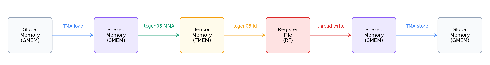

::: info 概述
- 从单个输出 tile 开始, 根据 TIRx tile 原语构建正确的 tiled GEMM.
- 第 1 步实现单 tile GEMM, 第 2 步加入 K 循环累积, 第 3 步将 CTA 空间平铺扩展到完整矩阵.
- 正确性是第一位的; 性能是接下来两章的工作.
:::

GEMM 是贯穿全书的核心工作负载. 线性层, attention 投影和卷积都以它为基础, 并占据了大量 GPU 时间. 因此, GEMM 仅仅正确与真正高效之间的差距, 往往就是大部分芯片资源闲置与充分利用硬件之间的差距.

这个差距无法一步跨越. 如果一开始就追求充分利用硬件的 kernel, 便需要同时调试数据搬运, 累积, 平铺和 Tensor Core 调度, 也很难得到可信的对比基准. 更稳妥的路径是从能产生正确结果的最小 kernel 开始, 每次只加入一项设计决策.

本章首先实现一个正确的 tiled GEMM. 前面的章节抽象地介绍了 TIRx scope / layout / dispatch 模型; 这里我们将其应用到真实的 kernel 上. 我们从一个 128 x 128 输出 tile 开始, 并将其发展为处理全尺寸矩阵的 kernel, 添加 K 维累积, 然后跨多个 CTA 进行空间平铺.

这是从头到尾讲述单一 GEMM 优化路径的三章中的第一章. 在本教程中, 我们构建了一个正确的 tiled kernel 并就此停止. 下一章 ([使用 TMA 流水线化 GEMM](/gpupro/pipelined-gemm/)) 将 thread 副本替换为 TMA, 并通过流水线将数据移动与计算重叠, 而 [使用 Warp Specialization 和 Cluster 扩展 GEMM](/gpupro/warp-specialized-gemm/) 则进一步介绍了 warp specialization 和 CTA cluster. 每一章都建立在前一章的基础上, 因此 kernel 会积累功能而不是重新开始.

可以把每一步理解为修改同一组约定中的三项内容: 由哪个 scope 执行操作, operand tile 采用哪种 layout, 以及操作经由哪条 dispatch 路径执行. 每一步通常只有一项主要变化, 因此我们会先用一张简短的说明卡标出变化, 再补充保证安全复用所需的同步细节. 第 1 步将建立后续步骤共同修改的基线.

## GEMM

GEMM 是位于线性层, attention 投影和许多卷积实现下方的密集矩阵乘法, 这就是为什么快速 GEMM kernel 几乎在任何地方都能带来回报. 本教程中的示例使用 $D = A B^{\top}$:

- $A$ 的形状为 $M \times K$.
- $B$ 的形状为 $N \times K$.
- $D$ 的形状为 $M \times N$.
- $D[m,n] = \sum_k A[m,k] \cdot B[n,k]$.

转置不是我们选择执行的额外操作; 它与数据的存储方式无关. 这些示例将 $B$ 保留为长度为 $K$ 的 $N$ 行, 这是通常出现的 layout 线性层权重, 因此沿 $K$ 收缩自然会读取 $B^{\top}$ 无需任何重新排列.

在整个教程中, 我们通过 TFLOPS 的吞吐量来测量 kernel, 根据挂钟时间计算每个乘加的两个浮点运算:

$$\text{TFLOPS} = \frac{2 \times M \times N \times K}{t_{\text{seconds}} \times 10^{12}}$$

### GEMM 数据路径

本教程中的每项优化都取决于数据所在的位置及其移动方式, 因此值得在编写任何代码之前将其映射出来. 从本质上讲, Blackwell GEMM kernel 只围绕两项活动进行组织: 在内存之间移动 tile 以及在内存上进行计算. 下图跟踪了 tile 在从输入到输出的过程中所触及的每个内存:



上图显示了以后每次优化都会编辑但不会替换的基线路径. 从左到右读: operand tile 首先从 GMEM 迁移到 SMEM; `tcgen05.mma` 然后消耗 SMEM operand 并将 accumulator 写入 TMEM; 最后, epilogue 将 TMEM 读回到寄存器, 然后将结果存储到 GMEM. 请记住这条链, 因为下面的每一步都会改变这些环节之一“如何”发生; 它永远不会改变数据搬运路径本身.

## 优化路径

上面的简单数据路径足以获得正确答案, 但它使大部分硬件闲置. 本教程的其余部分通过一次添加一个 Blackwell 功能来缩小这一差距, 每个功能都通过 TIRx tile 原语表示. 我们将遵循的路径依次访问这些功能:

- TMA 异步移动 通过 Blackwell 的硬件复制路径移动 GMEM <-> SMEM tile, 并完成 barrier 跟踪.
- 软件流水线使用多个 SMEM 阶段, 以便下一个 K tile 的数据移动可以与当前的 Tensor Core 计算重叠.
- 持久调度 保留固定的 CTA 池, 每个 CTA 通过 tile 调度器处理许多输出 tile, 而不是为每个 tile 启动一个 CTA.
- warp specialization 将 producer, MMA consumer 和 writeback 角色拆分为不同的 warpgroup.
- CTA cluster 让两个 CTA 在一个更大的 Blackwell MMA tile 上合作.
- 多 consumer 执行 使用多个 consumer warpgroup 一次计算 tile 的不同部分, 从而提高计算密度.

---

## 第 1 步: 顺序执行的单 tile GEMM

仍然执行完整硬件路径的最简单的 GEMM 是计算单个输出 tile 的 GEMM. 这就是我们开始的地方. 第 1 步计算一个 128 x 128 输出 tile, 其中 K = 64, 该输出足够小, 无需循环, 并且数据路径的每一部分都恰好出现一次. 无需重复任何内容, 我们就可以在必须推理循环之前单独查看每一跳.

> 此步骤建立的内容: 基线
> - scope: 128 个 thread 中的单个 warpgroup 按顺序走完全程, 一个接着一个阶段.
> - layout: A 和 B tile 位于 SMEM 中, accumulator 位于 TMEM 中, 结果通过寄存器上演.
> - dispatch: 同步 `Tx.copy` 承载负载, `tcgen05` 运行 MMA.

### 单 tile 数据流

确定基准约定后, 接下来要确定的是 tile 通过它的顺序. 第一个 kernel 恰好在核心 GEMM 数据路径上行走一次, 相同的 GMEM -> SMEM -> TMEM ->寄存器-> 数据流图中的 GMEM 链, 周围没有循环. 它分配工作内存, 加载 operand, 计算乘积, 将结果写回, 并自行清理:

1. 分配: SMEM (池分配器), TMEM (`tcgen05.alloc`), mbarrier
2. 加载: 全部 128 个 thread 协同将 A 和 B tile 从 GMEM 复制到 SMEM (同步 `Tx.copy`)
3. 计算: 单选 thread 发出 `Tx.gemm_async` + `tcgen05.commit`; 所有 thread 等待 mbarrier
4. writeback: warpgroup 读取 TMEM →寄存器; 每个 thread 转换 fp32→fp16 并写入 GMEM
5. 解除分配: TMEM 解除分配

### 第一个 kernel 的四个部分

完整的 kernel 只有几十行, 但分成几个部分更容易理解. 我们将把它分成四块 (内存分配, 同步加载, MMA, dispatch 和 writeback) 来读取, 然后将它们组装成一个 kernel. 一路上出现的 API 名称是第二部分中介绍的 TIRx tile 基元词汇 ([TIRx 简介](/gpupro/tirx-introduction/), [TIRx Layout API](/gpupro/tirx-layout-api/)).

内存分配. kernel 首先为 operand 雕刻出 shared memory, 以及用于 TMEM 地址的插槽和 mbarrier:

```python
pool = T.SMEMPool()
tmem_addr = pool.alloc((1,), "uint32")           # TMEM address (4 bytes)
mma_bar = pool.alloc((1,), "uint64", align=8)    # mbarrier (8 bytes)
pool.move_base_to(1024)                           # Skip to offset 1024
Asmem = pool.alloc((BLK_M, BLK_K), a_type, layout=A_layout)  # 128×64 fp16
Bsmem = pool.alloc((BLK_N, BLK_K), b_type, layout=B_layout)  # 128×64 fp16
pool.commit()
```

这里有两个细节值得暂停. `pool.move_base_to(1024)` 将 Asmem 和 Bsmem 推出到偏移量 1024, 为它们上方的小元数据片段保留低地址, 以便较大的 operand tile 落在干净的边界上. `layout=A_layout` 向 `tma_shared_layout` 请求 TMA 和 `tcgen05.mma` 都可以直接读取的混合 SMEM 位置, 这正是 layout 作为约定义务第二部分描述的那种.

同步加载. 缓冲区就位后, operand 仍必须到达 SMEM. 在第一个版本中, 我们让 CTA 自己的 thread 进行复制:

```python
Tx.cta.copy(Asmem[:, :], A[:, :])
Tx.cta.copy(Bsmem[:, :], B[:, :])
T.cuda.cta_sync()
```

因为这里只有一个 tile (M=N=128, K=64), 所以复制 A 和 B 整体就是整个负载. `Tx.cta.copy(...)` 使 CTA 对该副本进行协作, 每个 thread 负责自己的数据切片. 接下来的 `T.cuda.cta_sync()` 执行双重任务: 它等待每个 thread 完成并发布其共享内存写入, 以便当 MMA 稍后读取 `Asmem` 和 `Bsmem` 时, 它会看到完成 tile 而不是半填充的缓冲区. 这个 thread 驱动的副本也是我们要替换的第一个东西; 下一章 ([使用 TMA 流水线化 GEMM](/gpupro/pipelined-gemm/)) 将其替换为 TMA.

MMA dispatch. 随着 operand 现在位于 SMEM 中, 我们可以发出 MMA, 并且我们从单个选定的 thread 中执行此操作:

```python
if warp_id == 0:
  if T.ptx.elect_sync():
    Tx.gemm_async(tmem[:, :BLK_N], Asmem[:, :], Bsmem[:, :],
      accum=False, dispatch="tcgen05", cta_group=1)
    T.ptx.tcgen05.commit(mma_bar.ptr_to([0]), cta_group=1)
```

两个嵌套的守卫分两步缩小了发行者的范围. 外部 `if warp_id == 0` 仅保留 warpgroup 的 warp 0, 内部 `if T.ptx.elect_sync():` 然后在其中选择一个活动的 lane warp. 他们总共留下了一个 thread 来运行 `Tx.gemm_async` 和 `tcgen05.commit`.

值得明确的是单个 thread 的含义和含义, 因为自然阅读会产生误导. 单个发出 thread 并不意味着单线程乘法. 计算仍然是完整的 tile-level MMA: 硬件对 SMEM operand layout 和 TMEM 描述的 tile 执行协作乘法 accumulator layout. 关键是 `Tx.gemm_async` 是一个 *tile 操作*, 而不是一个硬件指令. K = 64 tile 比硬件 MMA K 原子 (`MMA_K = 16`) 更宽, 因此这个 tile 操作降低为沿 K 步进的一小段原始 `tcgen05.mma` 指令, 并且 warpgroup 协同驱动它们中的每一个. 只有一个 thread 发出 tile 操作的原因是, 每个底层 `tcgen05.mma` 本身就是一个“单指令”协作操作: 一次启动驱动 tile MMA 的 K 原子. 如果所有 128 个 thread 都发出该序列, 则同一作品将简单地启动 128 次. 最后, `accum=False` 标志告诉 MMA 覆盖 TMEM 目标而不是添加到其中, 这正是我们想要的, 因为没有先前的部分和可以扩展.

writeback. 该产品现在位于 TMEM 中, 但调用者希望它以 fp16 的形式返回 GMEM 中. 因此, epilogue 必须通过寄存器将结果传递下来并一路投射:

```python
Dreg = T.alloc_local((BLK_N,), acc_type)        # per-thread fp32 register row
Dreg_f16 = T.alloc_local((BLK_N,), d_type)      # same row, cast to fp16
Dreg_wg = Dreg.view(
  128,
  BLK_N,
  layout=TileLayout(
    S[(128, BLK_N) : (1@tid_in_wg, 1)]
  ),
)
Tx.wg.copy_async(Dreg_wg[:, :], tmem[:, :BLK_N])
T.ptx.tcgen05.wait.ld()
Tx.cast(Dreg_f16[:], Dreg[:])
m_thr = T.meta_var(m_st + warp_id * 32 + lane_id)
Tx.copy(D[m_thr, n_st : n_st + BLK_N], Dreg_f16[:])
```

MMA 在 TMEM 中留下 128 x 128 fp32 accumulator tile. fp32 是经过深思熟虑的: GEMM 对 K 上的许多乘积求和, 并以更高的精度保持运行总和, 从而减少了可能累积的舍入误差. 但 `D` 是 fp16, 所以这些值不能直接输出. 他们首先降落在寄存器, 在那里缩小到 fp16, 然后才到达 GMEM.

两个寄存器缓冲区发挥着不同的作用. `Dreg` 是 `BLK_N` 元素的 per-thread 缓冲区, 而 `Dreg_wg` 是选定的相同寄存器的 warpgroup 范围 *视图* layout:

```python
TileLayout(S[(128, BLK_N) : (1@tid_in_wg, 1)])
```

此 layout 将 tile 的第一个维度映射到 warpgroup 的 thread: thread 0 拥有第 0 行, thread 1 拥有第 1 行, 依此类推, 直到第 127 行. 第二个维度保留在每个 thread 自己的寄存器缓冲区内, 因此单个 thread 保存其一行的所有列. warpgroup 中有 128 个 thread, tile 中有 128 行, 128 x 128 输出整齐地划分为每个 thread 一行.

在该视图下读取 accumulator 正是 `Tx.wg.copy_async(Dreg_wg, tmem)` 所做的事情, 并且它降低到 Blackwell TMEM 加载路径 `tcgen05.ld`. 由于该加载是异步的, 因此 `T.ptx.tcgen05.wait.ld()` 必须在任何 thread 接触 `Dreg` 之前完成; 否则, thread 将读取寄存器, 负载尚未填充.

一旦等待返回, 每个 thread 的私有 `Dreg[:]` 就保存其一个逻辑输出行的 fp32 值. thread 将 `Dreg_f16` 中的范围缩小到 fp16, 计算出它负责哪个全局行,

```python
m_thr = T.meta_var(m_st + warp_id * 32 + lane_id)
```

并写入 `D[m_thr, n_st:n_st + BLK_N]`. 行在四个 warp 之间干净地分区: warp 0 写入第 0-31 行, warp 1 写入第 32-63 行, warp 2 写入第 64-95 行, 并且 warp 3 写入第 96-127 行.

### 完成 kernel

现在我们将这四个部分重新拼接成一个可运行的 kernel (M=N=128, K=64). 进口优先:

```python
import tvm
from tvm.script import tirx as T
from tvm.script.tirx import tile as Tx
from tvm.tirx.cuda.operator.tile_primitive.tma_utils import (
  tma_shared_layout,
  SwizzleMode,
)
from tvm.tirx.layout import TileLayout, S, TLane, TCol, tid_in_wg
```

kernel 包装在后续步骤使用的相同 `hgemm_vX(M, N, K)` 样式中. 第 1 步使用 `M=N=128, K=64` 运行, 因此启动只包含一个输出 tile:

```python
def hgemm_v1(M, N, K):
  a_type = tvm.DataType("float16")
  b_type = tvm.DataType("float16")
  d_type = tvm.DataType("float16")
  acc_type = tvm.DataType("float32")

  BLK_M, BLK_N, BLK_K = 128, 128, 64
  # MMA_M/MMA_N/MMA_K document the underlying hardware MMA tile; they are not
  # passed to gemm_async (which derives the MMA shape from the operand and
  # accumulator tiles), so the later steps omit them.
  MMA_M, MMA_N, MMA_K = 128, 128, 16

  A_layout = tma_shared_layout(
    a_type,
    SwizzleMode.SWIZZLE_128B_ATOM,
    (BLK_M, BLK_K),
  )
  B_layout = tma_shared_layout(
    b_type,
    SwizzleMode.SWIZZLE_128B_ATOM,
    (BLK_N, BLK_K),
  )

  @T.prim_func
  def kernel(
    A: T.Buffer((M, K), a_type),
    B: T.Buffer((N, K), b_type),
    D: T.Buffer((M, N), d_type),
  ):
    T.device_entry()
    # Step 1 is a single-tile kernel: M = BLK_M and N = BLK_N, so the grid
    # is 1x1. Starting with a 1x1 grid keeps the per-CTA tile offsets
    # (m_st, n_st) trivially zero; Steps 3+ generalise this to larger M / N.
    bx, by = T.cta_id([M // BLK_M, N // BLK_N])
    # A single warpgroup makes wg_id zero and unused below.
    wg_id = T.warpgroup_id([1])
    warp_id = T.warp_id_in_wg([4])
    lane_id = T.lane_id([32])

    # --- SMEM allocation ---
    pool = T.SMEMPool()
    tmem_addr = pool.alloc((1,), "uint32")
    mma_bar = pool.alloc((1,), "uint64", align=8)
    pool.move_base_to(1024)
    Asmem = pool.alloc((BLK_M, BLK_K), a_type, layout=A_layout)
    Bsmem = pool.alloc((BLK_N, BLK_K), b_type, layout=B_layout)
    pool.commit()

    # --- Barrier + TMEM init (warp 0 only) ---
    if warp_id == 0:
      if lane_id == 0:
        T.ptx.mbarrier.init(mma_bar.ptr_to([0]), 1)
      T.ptx.tcgen05.alloc(T.address_of(tmem_addr), n_cols=512, cta_group=1)

    T.ptx.fence.proxy_async("shared::cta")
    T.ptx.fence.mbarrier_init()
    T.cuda.cta_sync()

    tmem = T.decl_buffer(
      (128, 512), "float32", scope="tmem", allocated_addr=tmem_addr[0],
      layout=TileLayout(S[(128, 512) : (1@TLane, 1@TCol)])
    )

    m_st = T.meta_var(bx * BLK_M)
    n_st = T.meta_var(by * BLK_N)
    phase_mma: T.int32 = 0

    # --- Load: all threads copy global -> shared (synchronous).
    # With M=BLK_M and N=BLK_N the slices below cover the full matrices;
    # the slice form is kept so the diff to Step 3 (multi-tile) is minimal.
    Tx.cta.copy(Asmem[:, :], A[m_st:m_st + BLK_M, :])
    Tx.cta.copy(Bsmem[:, :], B[n_st:n_st + BLK_N, :])
    T.cuda.cta_sync()

    # --- Compute: single elected thread issues MMA ---
    if warp_id == 0:
      if T.ptx.elect_sync():
        Tx.gemm_async(
          tmem[:, :BLK_N], Asmem[:, :], Bsmem[:, :],
          accum=False, dispatch="tcgen05", cta_group=1
        )
        T.ptx.tcgen05.commit(mma_bar.ptr_to([0]), cta_group=1)

    T.ptx.mbarrier.try_wait(mma_bar.ptr_to([0]), phase_mma)

    # --- Writeback: TMEM -> RF -> GMEM ---
    Dreg = T.alloc_local((BLK_N,), acc_type)
    Dreg_f16 = T.alloc_local((BLK_N,), d_type)
    Dreg_wg = Dreg.view(128, BLK_N,
      layout=TileLayout(S[(128, BLK_N) : (1@tid_in_wg, 1)]))
    Tx.wg.copy_async(Dreg_wg[:, :], tmem[:, :BLK_N])
    T.ptx.tcgen05.wait.ld()
    Tx.cast(Dreg_f16[:], Dreg[:])
    m_thr = T.meta_var(m_st + warp_id * 32 + lane_id)
    Tx.copy(D[m_thr, n_st : n_st + BLK_N], Dreg_f16[:])

    # --- Deallocate TMEM ---
    T.cuda.cta_sync()
    if warp_id == 0:
      T.ptx.tcgen05.relinquish_alloc_permit(cta_group=1)
      T.ptx.tcgen05.dealloc(tmem_addr[0], n_cols=512, cta_group=1)

  return kernel
```

接下来的每个 GEMM 步骤都以相同的方式编译, 运行和检查自身, 因此我们仅在此处完整拼写该脚手架一次, 从那时起仅显示 kernel. 要运行后面的步骤, 请放入 `hgemm_vX` 和匹配的问题大小来代替下面的内容. 有一点值得记住: 为每个新的 Python 会话编译一个步骤, 并在尝试另一个步骤之前重新启动, 因为示例重用了内部名称, 并且编译器保存每个会话的状态.

```python
import torch

target = tvm.target.Target("cuda")
device = torch.device('cuda')  # gpu(0)

M, N, K = 128, 128, 64
kernel = hgemm_v1(M, N, K)
with target:
  ex = tvm.compile(
    tvm.IRModule({"main": kernel}),
    target=target,
    tir_pipeline="tirx",
  )

torch.cuda.empty_cache()
torch.cuda.synchronize()
A_tensor = torch.randn(M, K, dtype=torch.float16, device=device)
B_tensor = torch.randn(N, K, dtype=torch.float16, device=device)
D_tensor = torch.zeros(M, N, dtype=torch.float16, device=device)

# ex.mod(...) takes torch tensors directly, using the same call form
# as every other chapter.
ex.mod(A_tensor, B_tensor, D_tensor)

D_ref = (A_tensor.float() @ B_tensor.float().T).half()
max_err = float((D_tensor - D_ref).abs().max())
print(f"Max error vs torch reference: {max_err:.6f}")
# Relative tolerance, like the warp-specialization and Flash Attention cells:
# Output magnitude grows with K, so a fixed absolute bound would
# fail at larger K.
torch.testing.assert_close(D_tensor, D_ref, rtol=2e-2, atol=1e-2)
print("PASS")

# Optional timing for larger kernels.
ITERS = 10
for _ in range(3):
  ex.mod(A_tensor, B_tensor, D_tensor)
torch.cuda.synchronize()
start = torch.cuda.Event(enable_timing=True)
end = torch.cuda.Event(enable_timing=True)
start.record()
for _ in range(ITERS):
  ex.mod(A_tensor, B_tensor, D_tensor)
end.record()
torch.cuda.synchronize()
ms = start.elapsed_time(end) / ITERS
tflops = 2 * M * N * K / ms / 1e9
print(f"Performance: {ms:.3f} ms, {tflops:.1f} TFLOPS")
```

第 1 步至第 3 步故意以较小的尺寸运行 (此处为 128×128, 第 3 步中为 256³), 以使这些初步演练易于遵循. [使用 Warp Specialization 和 Cluster 扩展 GEMM](/gpupro/warp-specialized-gemm/) 末尾的跨步骤 *端到端结果* 表采用相反的方法: 它以单个 M=N=K=4096 大小测量每个步骤, 包括第 1 步算法, 因此其加速比可以直接比较.

### 单台限制- tile kernel

这个 kernel 是正确的, 这就是第 1 步的全部要点, 但仅在非常狭窄的设置中才是正确的. 故意加入了四个限制, 其余的优化路径一次解决一个:

- 它仅处理单个 K tile, 因此它无法收缩较大的 K.
- 它仅处理单个输出 tile, 因此 M 和 N 固定为 128.
- 它使用同步 GMEM -> SMEM 副本而不是 TMA.
- 它不会将数据移动与计算重叠, 因此两者不会同时运行.

---

## 第 2 步: K 环累积

要删除的第一个限制是最小的限制. 第 1 步仅处理单个 64 宽 K tile, 但实际矩阵收缩的范围远不止于此. 在第 2 步中, 我们保留单个输出 tile, 但让 K 跨越许多 64 宽的块.

这个想法很简单: 每个块重复加载 -> MMA -> 等待序列一次, 并让每个 MMA 累积到同一个 TMEM 插槽中. 事实证明, 真正的工作在于同步. 跨迭代重用一个 mbarrier 引入了本章的第一个真正的正确性风险. 如果代码跟踪错误的 phase, 则等待可能会在其 MMA 实际完成之前返回, 从而默默地破坏结果. 下面的机制准确地展示了如何出错以及如何避免它.

> 此步骤更改的内容: layout 重用
> - scope: 不变, 仍然是单个 warpgroup.
> - layout /重用: 相同的 SMEM tile 对和 TMEM accumulator 插槽在 K 环路中重复使用. 没有分配新的存储空间; operand tile 流通过一对固定的缓冲区, 并且 accumulator 状态保留在一个 TMEM 插槽中.
> - 同步: 重用的 MMA barrier 必须在每个 K 块上通过正确的 phase, 否则稍后的等待可以观察到更早的完成.
> - dispatch: 不变.

### K 环力学

第 1 步收缩在单个 64 宽 K tile 上; 在这里, 我们保留其单输出 tile, 但让 K 按照矩阵需求运行. 为了覆盖大于 64 的 K, 我们将 K 分为 `BLK_K=64` 块. 每次迭代将下一个 A 和 B K 切片加载到 SMEM 中并发出 `Tx.gemm_async`. `accum` 标志将这些块拼接在一起形成一个点积: 在第一个块上, `accum=False` 初始化 TMEM accumulator, 在后面的每个块上, `accum=True` 将该块的乘积添加到已经位于 TMEM 中的运行总和中.

同步是需要关注的地方. 我们为每个 MMA 完成重用一个 mbarrier, 并且安全地重用它可以归结为跟踪我们正在等待哪个 barrier phase. mbarrier 带有 1 位 phase, 即 0 或 1, 并且每次预期到达着陆时它都会翻转为另一个值. 微妙的部分是等待条件本身: `try_wait(bar, phase)` 会阻塞, 直到 barrier 的内部 phase 与 `phase` 参数“不同”. 因此, 我们传递的参数必须命名我们期望留下的 phase, 而不是我们正在等待到达的 phase:

| K 次迭代 | 等待前本地 `phase_mma` | `try_wait` 还在等什么 | 等待后本地更新 |
|---|---: |---|---: |
| 0 | 0 | barrier 翻转为 1 | `phase_mma = 1` |
| 1 | 1 | barrier 翻转为 0 | `phase_mma = 0` |
| 2 | 0 | barrier 翻转为 1 | `phase_mma = 1` |

单行 `phase_mma ^= 1` 使该表保持诚实. 删除它, 第二次迭代仍然调用 `try_wait(bar, 0)`, 但是 barrier 在第一个 MMA 之后已经翻转到 phase 1, 因此等待会在第二个 MMA 之前看到不匹配并立即返回已经完成了. 然后, kernel 读取半计算的 accumulator 并报告错误答案, 但根本没有错误. 这是一个完美编译和运行的错误, 这正是 phase 翻转值得如此关注的原因.

### 完成 kernel

下面的完整 kernel 只是第 1 步, 其中 K 环和 phase 翻转折叠起来. 导入与以前相同:

```python
import tvm
from tvm.script import tirx as T
from tvm.script.tirx import tile as Tx
from tvm.tirx.cuda.operator.tile_primitive.tma_utils import (
  tma_shared_layout,
  SwizzleMode,
)
from tvm.tirx.layout import TileLayout, S, TLane, TCol, tid_in_wg
```

它被包裹在 `hgemm_v2(M, N, K)` 中. grid 仍然是 `[1, 1]`, 因为我们仍在计算单个输出 tile; 增长的只是它的 K 范围:

```python
def hgemm_v2(M, N, K):
  a_type = tvm.DataType("float16")
  b_type = tvm.DataType("float16")
  d_type = tvm.DataType("float16")
  acc_type = tvm.DataType("float32")

  BLK_M, BLK_N, BLK_K = 128, 128, 64
  K_TILES = K // BLK_K

  A_layout = tma_shared_layout(
    a_type,
    SwizzleMode.SWIZZLE_128B_ATOM,
    (BLK_M, BLK_K),
  )
  B_layout = tma_shared_layout(
    b_type,
    SwizzleMode.SWIZZLE_128B_ATOM,
    (BLK_N, BLK_K),
  )

  @T.prim_func
  def kernel(
    A: T.Buffer((M, K), a_type),
    B: T.Buffer((N, K), b_type),
    D: T.Buffer((M, N), d_type),
  ):
    T.device_entry()
    # This is still one output tile (M=N=128).
    bx, by = T.cta_id([M // BLK_M, N // BLK_N])
    wg_id = T.warpgroup_id([1])
    warp_id = T.warp_id_in_wg([4])
    lane_id = T.lane_id([32])

    pool = T.SMEMPool()
    tmem_addr = pool.alloc((1,), "uint32")
    mma_bar = pool.alloc((1,), "uint64", align=8)
    pool.move_base_to(1024)
    Asmem = pool.alloc((BLK_M, BLK_K), a_type, layout=A_layout)
    Bsmem = pool.alloc((BLK_N, BLK_K), b_type, layout=B_layout)
    pool.commit()

    if warp_id == 0:
      if lane_id == 0:
        T.ptx.mbarrier.init(mma_bar.ptr_to([0]), 1)
      T.ptx.tcgen05.alloc(T.address_of(tmem_addr), n_cols=512, cta_group=1)

    T.ptx.fence.proxy_async("shared::cta")
    T.ptx.fence.mbarrier_init()
    T.cuda.cta_sync()

    tmem = T.decl_buffer(
      (128, 512), "float32", scope="tmem", allocated_addr=tmem_addr[0],
      layout=TileLayout(S[(128, 512) : (1@TLane, 1@TCol)]))

    phase_mma: T.int32 = 0
    m_st = T.meta_var(bx * BLK_M)
    n_st = T.meta_var(by * BLK_N)

    # === K-loop: iterate over K in chunks of BLK_K ===
    # The serial device loop keeps full-K A/B parameters shaped correctly.
    for i in T.serial(K_TILES):
      # Load the i-th K chunk
      Tx.cta.copy(Asmem[:, :], A[:, i*BLK_K:(i+1)*BLK_K])
      Tx.cta.copy(Bsmem[:, :], B[:, i*BLK_K:(i+1)*BLK_K])

      T.cuda.cta_sync()

      # MMA: accum=False for first tile, True for rest
      if warp_id == 0:
        if T.ptx.elect_sync():
          Tx.gemm_async(tmem[:, :BLK_N], Asmem[:, :], Bsmem[:, :],
            accum=(i != 0), dispatch="tcgen05", cta_group=1)
          T.ptx.tcgen05.commit(mma_bar.ptr_to([0]), cta_group=1)

      # Wait for MMA, then flip phase
      T.ptx.mbarrier.try_wait(mma_bar.ptr_to([0]), phase_mma)
      phase_mma ^= 1

    # === Writeback (same as Step 1) ===
    Dreg = T.alloc_local((BLK_N,), acc_type)
    Dreg_f16 = T.alloc_local((BLK_N,), d_type)
    Dreg_wg = Dreg.view(128, BLK_N,
      layout=TileLayout(S[(128, BLK_N) : (1@tid_in_wg, 1)]))

    Tx.wg.copy_async(Dreg_wg[:, :], tmem[:, :BLK_N])
    T.ptx.tcgen05.wait.ld()

    Tx.cast(Dreg_f16[:], Dreg[:])
    m_thr = T.meta_var(m_st + warp_id * 32 + lane_id)
    Tx.copy(D[m_thr, n_st : n_st + BLK_N], Dreg_f16[:])

    T.cuda.cta_sync()
    if warp_id == 0:
      T.ptx.tcgen05.relinquish_alloc_permit(cta_group=1)
      T.ptx.tcgen05.dealloc(tmem_addr[0], n_cols=512, cta_group=1)

  return kernel
```

---

## 第 3 步: 空间平铺 (多 CTA)

K 循环负责收缩维度, 但 M 和 N 仍然固定到单个 128 x 128 tile. 真正的输出远远大于一个 tile, 所以基本 kernel 的最后一块是用许多 tile 一次性覆盖 M 和 N. 第 3 步启动 CTA 的 2D grid, 每个输出 tile 一个, 并让 GPU 并行计算所有 tile. 该示例使用 M=N=K=256, 这给出了 tile 的 2x2 grid, 足以使索引变得不那么简单, 而不会隐藏它.

> 此步骤更改的内容: scope
> - scope: CTA 的 2D grid, 每个 CTA 拥有一个 128 x 128 输出 tile.
> - layout: 不变; 在 CTA 中, 这与第 2 步的 SMEM/TMEM/寄存器路径相同.
> - dispatch: 不变.

### grid 映射

grid 形状直接来自平铺: 对于每 128 x 128 输出 tile 一个 CTA, 我们总共需要 `[M // BLK_M, N // BLK_N]` CTA. 与第 2 步相比, 唯一真正的新工作是教导每个 CTA 矩阵的哪个切片是要计算的 *其* 切片.

CTA `(bx, by)` 拥有此输出区域:

```text
D[bx * BLK_M : (bx + 1) * BLK_M,
  by * BLK_N : (by + 1) * BLK_N]
```

为了生成它, CTA 的 K 循环重复加载其自己的 A 行带和 B 列带的匹配 K 切片:

```text
A[bx * BLK_M : (bx + 1) * BLK_M, k : k + BLK_K]
B[by * BLK_N : (by + 1) * BLK_N, k : k + BLK_K]
```

索引直接遵循 `D = A @ B.T` 约定: `bx` 选择 A 和 D 行, 而 `by` 选择 B 行, 一旦应用转置, B 行将成为 D 列.

每个 CTA 一个 tile 是最简单的有效映射, 但也很浪费. 行中的每个 CTA 都会从 GMEM 重新加载相同的 A tile, 列中的每个 CTA 都会重新加载相同的 B tile, 因此不会重用相邻 CTA 已经拉入的数据. 我们暂时将这种浪费留在原地; 持久调度 ([使用 TMA 流水线化 GEMM](/gpupro/pipelined-gemm/) 中的第 6 步) 返回到它并使那些共享的 operand 在 L2 中保持热状态.

尝试使用你的代理: 使用 `M=N=K=256`, `BLK_M=BLK_N=128` 和 `BLK_K=64`, 要求其跟踪 CTA `(1, 0)` 和 CTA `(0, 1)`. 对于每个 CTA, 列出 `m_st`, `n_st`, 每次 K 迭代加载的 A 和 B 切片以及写入的 D 区域. 由于 kernel 计算 `D = A @ B.T`, 哪些 B 行变成了 D 列?

### 完成 kernel

kernel 再次进入第 2 步, 这次仅进行两处更改: grid 形状和每个 CTA 偏移量. 内部 K 环和 writeback 未受影响. 导入是相同的:

```python
import tvm
from tvm.script import tirx as T
from tvm.script.tirx import tile as Tx
from tvm.tirx.cuda.operator.tile_primitive.tma_utils import (
  tma_shared_layout,
  SwizzleMode,
)
from tvm.tirx.layout import TileLayout, S, TLane, TCol, tid_in_wg
```

grid 变为 `[M // BLK_M, N // BLK_N]` 而不是 `[1, 1]`, 并且加载和存储现在由 CTA 自己的 `m_st` 和 `n_st` 抵消:

```python
def hgemm_v3(M, N, K):
  a_type = tvm.DataType("float16")
  b_type = tvm.DataType("float16")
  d_type = tvm.DataType("float16")
  acc_type = tvm.DataType("float32")

  BLK_M, BLK_N, BLK_K = 128, 128, 64
  K_TILES = K // BLK_K

  A_layout = tma_shared_layout(
    a_type,
    SwizzleMode.SWIZZLE_128B_ATOM,
    (BLK_M, BLK_K),
  )
  B_layout = tma_shared_layout(
    b_type,
    SwizzleMode.SWIZZLE_128B_ATOM,
    (BLK_N, BLK_K),
  )

  @T.prim_func
  def kernel(
    A: T.Buffer((M, K), a_type),
    B: T.Buffer((N, K), b_type),
    D: T.Buffer((M, N), d_type),
  ):
    T.device_entry()
    # 2D grid: one CTA per 128x128 output tile
    bx, by = T.cta_id([M // BLK_M, N // BLK_N])
    wg_id = T.warpgroup_id([1])
    warp_id = T.warp_id_in_wg([4])
    lane_id = T.lane_id([32])

    pool = T.SMEMPool()
    tmem_addr = pool.alloc((1,), "uint32")
    mma_bar = pool.alloc((1,), "uint64", align=8)
    pool.move_base_to(1024)
    Asmem = pool.alloc((BLK_M, BLK_K), a_type, layout=A_layout)
    Bsmem = pool.alloc((BLK_N, BLK_K), b_type, layout=B_layout)
    pool.commit()

    if warp_id == 0:
      if lane_id == 0:
        T.ptx.mbarrier.init(mma_bar.ptr_to([0]), 1)
      T.ptx.tcgen05.alloc(T.address_of(tmem_addr), n_cols=512, cta_group=1)

    T.ptx.fence.proxy_async("shared::cta")
    T.ptx.fence.mbarrier_init()
    T.cuda.cta_sync()

    tmem = T.decl_buffer(
      (128, 512), "float32", scope="tmem", allocated_addr=tmem_addr[0],
      layout=TileLayout(S[(128, 512) : (1@TLane, 1@TCol)]))

    phase_mma: T.int32 = 0

    # Per-CTA tile offsets
    m_st = T.meta_var(bx * BLK_M)
    n_st = T.meta_var(by * BLK_N)

    # K-loop with offset A and B slices
    # The serial device loop keeps full-K A/B parameters shaped correctly.
    for i in T.serial(K_TILES):
      Tx.cta.copy(Asmem[:, :], A[m_st:m_st+BLK_M, i*BLK_K:(i+1)*BLK_K])
      Tx.cta.copy(Bsmem[:, :], B[n_st:n_st+BLK_N, i*BLK_K:(i+1)*BLK_K])

      T.cuda.cta_sync()

      if warp_id == 0:
        if T.ptx.elect_sync():
          Tx.gemm_async(tmem[:, :BLK_N], Asmem[:, :], Bsmem[:, :],
            accum=(i != 0), dispatch="tcgen05", cta_group=1)
          T.ptx.tcgen05.commit(mma_bar.ptr_to([0]), cta_group=1)

      T.ptx.mbarrier.try_wait(mma_bar.ptr_to([0]), phase_mma)
      phase_mma ^= 1

    # Writeback to the correct output tile
    Dreg = T.alloc_local((BLK_N,), acc_type)
    Dreg_f16 = T.alloc_local((BLK_N,), d_type)
    Dreg_wg = Dreg.view(128, BLK_N,
      layout=TileLayout(S[(128, BLK_N) : (1@tid_in_wg, 1)]))

    Tx.wg.copy_async(Dreg_wg[:, :], tmem[:, :BLK_N])
    T.ptx.tcgen05.wait.ld()

    Tx.cast(Dreg_f16[:], Dreg[:])
    m_thr = T.meta_var(m_st + warp_id * 32 + lane_id)
    Tx.copy(D[m_thr, n_st:n_st+BLK_N], Dreg_f16[:])

    T.cuda.cta_sync()
    if warp_id == 0:
      T.ptx.tcgen05.relinquish_alloc_permit(cta_group=1)
      T.ptx.tcgen05.dealloc(tmem_addr[0], n_cols=512, cta_group=1)

  return kernel
```

## 练习

1. 在第 1 步至第 3 步中, `Tx.copy` 在 MMA 之前将 A 和 B tile 移动到 SMEM 中. 为什么 kernel 在 `Tx.gemm_async` 读取那些 SMEM tile 之前需要 `T.cuda.cta_sync()`?
2. 在第 2 步中, 如果从 K 循环中删除 `phase_mma ^= 1` 会发生什么? kernel 是否等待每个 MMA, 或者稍后的等待是否会过早?
3. 对于 M=N=4096 且 BLK_M=BLK_N=128, 第 3 步中启动了多少个 CTA? 哪些 operand tile 在逻辑上可以在相邻 CTA 之间重用, 第 3 步是否利用了这种重用?
