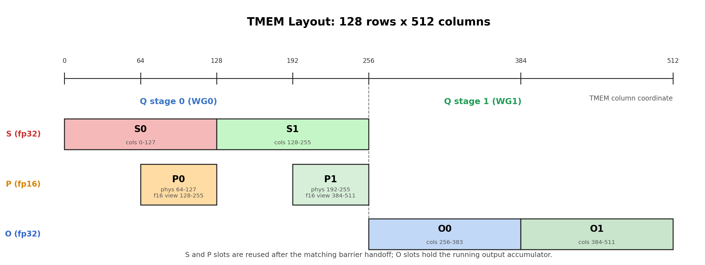
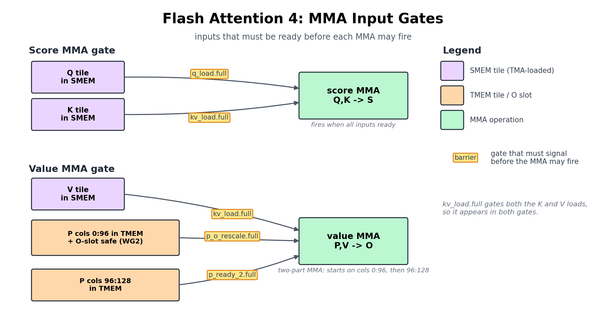
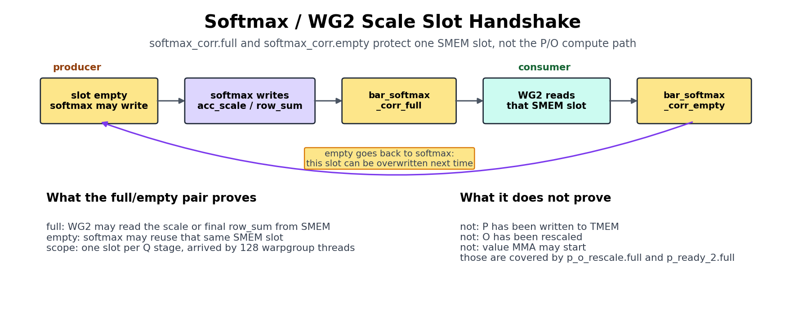
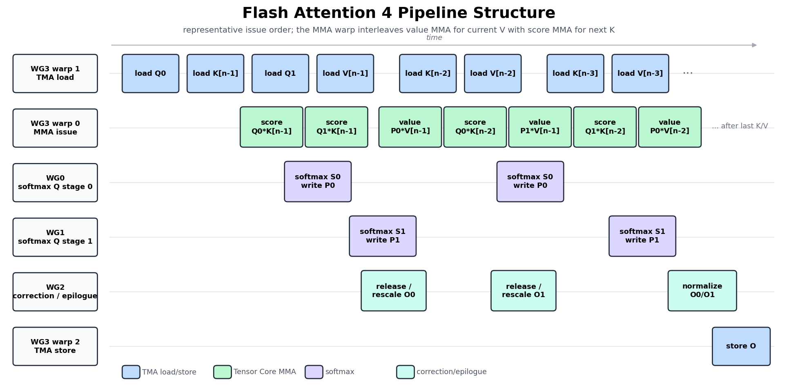

::: info 概要
- Attention は softmax を挟んで 2 つの MMA を走らせるため、GEMM のように 1 つの MMA を繰り返すことはできません。
- kernel はパート I のハードウェアプリミティブ(TMA、 `tcgen05`、TMEM、barrier)とパート III の GEMM 技術を含み、warp ロール、オンライン softmax の再スケーリング、causal masking、GQA を含みます。
:::

Attention は Transformer が動作するかどうかを決める kernel であり、これまで構築したすべてが最終的に連携しなければならない場所でもあります。GEMM のために組み立てたすべてのパーツはここに引き継がれます: TMA tile の動き、 `tcgen05` MMA、TMEM、warpgroup レジスタ tile、そして明示的な barrier。

難しいのは、Attention が同じ MMA の繰り返しではない点です。2 つの MMA の間にオンライン softmax、causal masking、さらに先に処理した block と後の block を同じ尺度にそろえる再スケーリングが入ります。

この中間段階が新しい難所です。通常の matmul は accumulator に加算し続ければ済みますが、Attention では新しい key と value が届くたびに、それまでの結果を新しい尺度へ合わせ直す必要があります。softmax は 2 つの Tensor Core MMA の間で CUDA Core 上に実行されるため、指数関数と行単位の reduction がそのままクリティカルパスに入ります。

だからこそ、attention 最適化の多くは本質的に softmax 最適化であり、 `exp` を再定式化し、softmax を MMA と重ね合わせ、停滞させるのではなく活用しているのです。

本章の目的は Flash Attention をゼロから導出することではありません。kernel を読めるだけのアルゴリズムを押さえたうえで、実装上の新しい部分、つまり TIRx でこのアルゴリズムをどう表現するかに焦点を当てます。

最も理解しやすいのは、kernel を流れる 1 つの tile を追う方法です。入力 tile の `Q`、 `K`、 `V` は GMEM から SMEM にロードされます。score MMA が `Q` と `K` を乗算して TMEM 上の score tile `S` を作り、softmax が `S` を分子 tile `P` に変換します。最後に value MMA が `P` と `V` を組み合わせ、出力 accumulator `O` を更新します。

一見すると 2 つの matmul をつないだだけですが、GEMM にはなかった問題があります。softmax の running maximum が更新されると、それまでに蓄積した `O` の尺度が古くなるため、次の value MMA を加える前に再スケーリングしなければなりません。以下ではまずこのデータ経路を追い、その後で TIRx が各ステージを warpgroup 間でどう受け渡すかを見ていきます。

## アルゴリズム形状

メモリに tile を配置する前に、その tile が対応するアルゴリズムが必要です。1 つのクエリブロックに対して、Flash Attention は次のように計算します:

$$O = \text{softmax}(QK^{\top} / \sqrt{d})V$$

文字通りに言うと、公式は完全なスコア行列を `S = QKᵀ` 作成し、softmax し、その後 `V` で掛けると言っています。しかし、それは私たちが使えない唯一のアプローチです。なぜなら、 `S` の全体が膨大だからです。seq=4096 では、1 ヘッドあたり約 16M の要素を保持し、fp32 で約 64MB の容量を持ち、これは SMEM や単一の 128×512 TMEM 領域よりも桁違いに大きいです。チップ上に置く場所が単純に存在しません。『Flash Attention』の答えは、 `S` を一切現れないことです。代わりにブロック単位で `K/V` ストリーミングし、1 行ごとに 3 つの実行状態を持ち、これまでに見られたすべてをまとめています:

- `row_max`: これまでに見られた最大得点。
- `row_sum`: Softmax の定番です。
- `O`: 稼働中の出力 accumulator。

ストリーミングアップデートは、新しいブロックが届くたびにその状態を正しく保つ役割を果たしています。微妙な点は、ブロックを処理するたびに実行中の最大値が上昇し、一度上昇すると、古い最大値の下で計算したすべてのスケールが間違ったスケールになってしまうことです。新しい寄与を追加する前に、まず古い状態を新しいスケールに戻します:

```text
S = Q_block @ K_block.T
m_new = max(row_max, rowmax(S))
scale = exp((row_max - m_new) / sqrt(d))
P = exp((S - m_new) / sqrt(d))
row_sum = row_sum * scale + rowsum(P)
O = O * scale + P @ V_block
row_max = m_new
```

単一 `scale` 因子はここで二重の役割を果たします。つまり、実行分母と実行出力の両方を再スケールし、過去と後のブロックからの寄与が最終的に共通のスケールで測定されるようにします。

上記の擬似コードは、読みやすい自然な `exp` と明示的な `/sqrt(d)` で書かれていますが、kernel はより安価な方法を選んでいます。このシステムは `1/sqrt(d)` と `log2(e)` の両方を一つの定数 `scale_log2 = log2(e)/sqrt(d)` に折りたたみ、ハードウェア `exp2` の生スコアで各指数関数を単位 `exp(x/sqrt(d)) = exp2(x · scale_log2)` を用いて評価します。動機は単純に、このハードウェア上の自然な `exp` よりも速い `exp2` です。

先に明確にしておくべき点があります。 `P` これは最終的な正規化された attention 行列ではありません。これは現在の K/V ブロックの softmax 分子に過ぎません。正規化は意図的に遅延され、最後のブロックの後にのみ kernel は書き込み `O / row_sum`。

TIRx の場合、アルゴリズムが何を計算するかを知ることは全体の半分に過ぎません。残りの半分は kernel が動作する際に各 tile がどこに存在するかで、それが layout や barrier コードを決定するからです。 `S`、 `P`、 `O` はすべて tile の値であり、それぞれにホームがあります。

- `S` スコア tile です。スコア MMA は TMEM に書き込みます。
- `P` は softmax 分子 tile です。Softmax は TMEM から `S` をレジスタに読み込み、 `P = exp((S - m_new) / sqrt(d))` を計算し、TMEM に書き戻す `P` します。
- `O` は出力 accumulatortile です。MMA は TMEM から `P` 読み、SMEM から `V` し、TMEM で `O` に積み重なります。

先にフラグを立てたリスケールも tile 操作であり、スカラー簿記ではありません。 `row_max` が変わると、古い `O` が TMEM から読み込まれ、レジスタに乗算され、次の MMA 値が TMEM に蓄積される前に書き戻されます。その後のセクションは同じ構造に従います: tile の配置、ハードウェアの経路、そして次の consumer が走る可能性があることを証明する barrier です。

## tile プリミティブグラフ

ランニングステートとそのホームを手にしたことで、アルゴリズムを tile 移動の具体的な順序として展開できます。1 つの K/V ブロックに対して、kernel はこの tile のパスを上から下へ歩きます:

```text
Q, K, V in GMEM
  -> Q, K, V in SMEM        by TMA load
  -> S in TMEM              by score MMA: QK^T
  -> P in TMEM              by softmax numerator: TMEM -> RF -> TMEM
  -> O in TMEM              by value MMA: P V
  -> O in GMEM              by normalization, SMEM staging, and TMA store
```

GEMM との違いは一本の線に集約されます。GEMM は 1 つの MMA 連鎖を繰り返すもので、FA4 には 2 つの MMA phase があり、そのうちの中央に softmax が位置しています。その後のほとんどすべての展開は、その一つの追加ステージの結果です。

ショートパスを明示的な producer-consumer のエッジに拡張すると、完全なグラフが得られます。

| 舞台 | tile 移動または計算 | TIRx プリミティブ | ハードウェア経路 |
|-------|--------------------------|----------------|---------------|
| Q/K/V を装填 | GMEM tile-> SMEM tile | `Tx.copy_async(..., dispatch="tma")` | TMA 負荷 |
| スコア MMA | SMEM の Q と SMEM の K ->tile `S` スコア | `Tx.warp.gemm_async(..., dispatch="tcgen05")` | `tcgen05.mma` |
| softmax リード | TMEM の warpgroup レジスタ tile-> `S` | `Tx.wg.copy_async(reg, tmem)` | `tcgen05.ld` |
| Softmax の書き込み | 分子 tile `P` レジスタ -> fp16 TMEM ビュー | `Tx.copy_async(tmem_as_f16, reg)` | TMEM ストア、その後 `tcgen05.wait.st()` |
| バリューMMA | TMEM では `P`、SMEM では出力 accumulator `O` -> SMEM で V が使われます | `Tx.warp.gemm_async(..., dispatch="tcgen05")` | TMEM operand を持つ `tcgen05.mma` |
| 訂正 | TMEM の `O` -> TMEM のレジスタ-> `O` | TMEM 読み戻し、レジスタ乗算、TMEM ストア | `tcgen05.ld` / TMEM ストア |
| epilogue | TMEM の最終 `O` -> SMEM -> GMEM ->レジスタ | TMEM リードバック、 `Tx.copy`、TMA ストア | 4 `tcgen05.ld` + TMA ストア |

新しい行は softmax と correction です。両者とも TMEM トラフィック->レジスタに TMEM ->を追加し、スコア MMA と価値 MMA 間に追加のハンドオフを生み出します。

エージェントので試してみてください: 上記の短い経路だけを追跡するように頼んでください。各矢印について、producer ステージ、consumer ステージ、ソース tile、デスティネーション tile、ハードウェアパスの名前を付けます。次に、GEMM の章に存在しなかった矢印はどれかを尋ねてください。

## warp の役割と scope

データパスが決まったら、次の自然な質問は、実際に各ステージを誰が操作するかということです。ここでの各 CTA は 4 つの warpgroup、合計 512 スレッドで構成されており、どのデータに触れるかではなく、warpgroup が行う *種類の作業* によって分けられています:

- WG3 はハードウェアエンジン、すなわち TMA ロード、MMA、TMA ストアを駆動します。
- WG0、WG1、WG2 は、これらのエンジンコール間で行われるレジスタを多用した計算を行います: softmax、correction、eplogue です。

正確な役割表は以下の通りです:

| オーナー | 役割 | その役割 |
|-------|------|--------------|
| WG3、warp 1 | TMA 負荷 | GMEM から SMEM への Q、K、V tile を読み込みます |
| WG3、warp 0 | MMA | MMA の評価と価値の両方を決めます |
| WG3、warp 2 | TMA ストア | SMEM から GMEM への最終 O tile を保存 |
| WG0 | Q ステージ 0 の softmax | TMEM から S を読み込み、P を計算し、P を TMEM に書きます |
| WG1 | Q ステージ 1 の softmax | 第 2Q パイプライン段階でも同様の作業が行われました |
| WG2 | 訂正と epilogue | TMEM で O をリスケーリングし、正規化し、出力を段階化します |

「2 つの Q 段階」を 2 つの注意の頭と誤解しがちですが、そうではありません。Q のパイプラインには単に 2 つのスロットがあり、WG0 が 1 つ、WG1 がもう 1 つを所有するため、2 つの Q tile が同時に稼働しているのです。そのため、softmax の作業は WG0 と WG1 で 2 回現れます。

コードはこれらの役割を記号座標で選びます:

```python
wg_id = T.warpgroup_id([4])
warp_id = T.warp_id_in_wg([4])
```

kernel を読むときは、まずロールブランチを見つけてください。どのチームがその tile の中にあるすべての原始 tile を所有しているかを教えてくれます。

- WG3 warp 1 が TMA ロードコマンドを開始します。1 つの選出レーンがコピーを発行し、TMA エンジンが tile を動かします。
- WG3 warp 0 は `tcgen05.mma` 指示を出します。
- WG0 と WG1 は完全な warpgroupscope で softmax を運用しています。
- WG2 は修正と epilogue の作業を warpgroup の完全な範囲で行っています。

一つの非対称性が barrier 全体のグラフを形作る: すべての MMA、スコアも価値も、WG3 の warp 0 だけで問題が起きているのです。WG0 と WG1 は MMA を一切発行しません。スコア tile だけを消費し、softmax を実行し、TMEM に書き戻す `P`。

この分離こそが、SoftMax が周囲に barrier を設ける理由です。 `s_ready` MMA warp から softmax へスコア tile を運びます。 `p_o_rescale` は MMA の価値に見合う安全な `P` と `O` スロットを搭載しており、すでにリスケール済みか、リスケール不要のリリースです。この 2 つの名前については、章の残りの部分で繰り返し取り上げていきます。

## 断片を読む

この章の断片は['flash_attention4.py'](https://github.com/mlc-ai/tirx-kernels/blob/main/tirx_kernels/attention/flash_attention4.py)の抜粋であり、必ずとして私たちが再現しない核の一部で定義された名前を参照している。自己記述的なもの(`wg_id`、 `warp_id`、 `BLK_M` / `BLK_N`、 `HEAD_DIM`、 `kv_stage`、 `SMEM_PIPE_DEPTH_*` / `TMEM_PIPE_DEPTH` の深さ、 `should_accumulate`、そして `CTA_GROUP` (1))については、以下で最初に重要な点を紹介します。残りの部分は表に一行で解説されているので、断片が見慣れない名前を目の前にした瞬間に見つめられる場所ができます。

| 名称 | 意味 |
|------|---------|
| `q_stage`、 `i_q` | Q パイプラインステージ、0 または 1、つまりどの Q tile スロット(`SMEM_PIPE_DEPTH_Q = 2`)かを選びます。WG0/WG1 の中で warpgroup 自身の `wg_id` (0 または 1)を softmax すると、同じステージインデックスが `S_region[q_stage]`、 `P_region[wg_id]`、 `O_region[i_q]` すべて同じ Q ステージを選択します |
| `MMA_N` | スコア/出力 tile 幅(TMEM 列)は 128 |
| `MMA_K` | MMA の `P` / `V` 列の内 K ステップ(16)、 `K_SPLIT = 6 * MMA_K = 96` |
| `K_SPLIT` | 価値分点-MMA スケジュール(*2 つの MMA phase* を参照);最初の値は MMA が `0:K_SPLIT` 列(`6 * MMA_K = 96`)をカバーしています。 |
| `should_rescale` | WG2 の行あたりフラグ: 次の値 MMA の前に旧 `O` のスケーリングが必要かどうか(warpgroup 全体で `any_sync` で縮小) |
| `rescale_threshold` | 小さな行最大変更に対して閾値をスキップし、現在の kernel は `8.0` を使用しており、スキップされたリスケールはちょうど `acc_scale` `1.0` に設定します |
| `scale_log2` | SoftMax スケールは log2 単位で `log2(e)/√d`、 `P = exp2((S - m) · scale_log2)` |
| `acc_scale` | 行ごとのリスケールファクターsoftmax は SMEM メールボックスを通じて WG2 に渡されます |
| `chunk_start` / `chunk_end`、 `p_start` / `p_end` | 読み書き中の 32 幅の SoftMax チャンクの列範囲 |

## MMA の二つの phase

各ストリーミングされた K/V tile に対して、Flash Attention は softmax でブリッジした 2 つの MMA phase を実行します。

```text
Q, K -> score MMA -> S
S    -> softmax   -> P
P, V -> value MMA -> O
```

これを 3 人の producer が連続したパイプラインのようなものだと考えてください。最初の MMA は attention スコアを `S`、softmax は `S` 分子 `P` に変換し、2 つ目の MMA は出力 accumulator `O` を更新するために `P` を消費します。正規 `row_sum` 化は epilogue まで保留され、すべての K/V tile が発言された後に行われます。

以下の各 tile オペレーターには、GEMM ステップで使った同じ scope/layout/dispatch カードが付与され、さらに「Handoff」という追加の行が 1 行追加され、tile を次の役割に渡す barrier を指定しています。

計算コードは生の TMEM カラム番号で話すことはありません。代わりに kernel は単一の TMEM 割り当てを段階ごとのビュー(`S_region`、 `P_region`、 `O_region`)に分割し、パイプライン段階(`S_region[q_stage]`、 `O_region[i_q]`、 `P_region[i_q, 0:K_SPLIT]`)ごとにインデックス化します。これらのビューは `T.TMEMStages` [TMEM layout および Reuse](#tmem-の-layout-と再利用)セクションで定義されています。現時点では、各領域を同じ物理的 TMEM の命名スライスとして扱うだけで十分です。

### スコア MMA

2 つの phase のうち最初の phase はスコア MMA、すなわち毎回 K/V の反復を開く matmul です。計算は次の通りです:

$$S = Q_{\text{block}}K_{\text{block}}^{\top}$$

そして `128 x 128` スコア tile を TMEM に書きます:

```python
Tx.warp.gemm_async(
  S_region[q_stage],
  Q_smem[q_stage, 0:BLK_M, 0:HEAD_DIM],
  K_smem[kv_stage, 0:BLK_N, 0:HEAD_DIM],
  dispatch="tcgen05",
  cta_group=CTA_GROUP,
)
if T.ptx.elect_sync():
  s_ready.arrive(q_stage)
```

GEMM の章がすべての tile オペレーターに尋ねたのと同じ 4 つの質問を投げかけることができます: 誰がそれを運営しているのか、tile がどこに存在するのか、どのように発信するのか、そしてどのように引き継ぐのか。

> tile プリミティブ表示: MMA スコア
> - scope: WG3 warp 0 で発行;選出されたレーンが `s_ready` に到着します。
> - layout: SMEM では Q、K、TMEM(`S_region[q_stage]`)では Q、K→ `S`。
> - 通信: `tcgen05`。
> - ハンドオフ: `s_ready` (→ softmax)。

`s_ready` に到達する単一の選出スレッドは、全体にわたる引き渡しです。このスコア tile が完成し、softmax warpgroup が自由に読み取れることを告げます。

### MMA 間の softmax

2 つの MMA の間には softmax があり、スコア tile `S` 分子 tile `P` に変わるステージです。その表示カードは以下の通りです:

> tile プリミティブ表示: Softmax
> - scope: WG0(Q ステージ 0)/WG1(Q ステージ 1)、フル warpgroup。
> - layout: TMEM で、→→ `P` fp16 TMEM(`P_region[wg_id]`)でレジスタを `S`。
> - dispatch: `tcgen05.ld` が読み込み、TMEM ストアが書き込む;それらの間のレジスタの行ごとの計算です。
> - ハンドオフ: `s_ready` 待機; `p_o_rescale` 列(最初の 96 列)と `p_ready_2` 列(最後の 32 列)に到着します。

この段階には GEMM の対応物が全く存在しません。WG0/WG1 はスコア tile が `s_ready` に届くのを待ち、TMEM からレジスタサイズのチャンクを一つずつ読み出します:

```python
Tx.copy_async(
  s_chunk[:, chunk_start : chunk_end],
  S_region[wg_id, chunk_start : chunk_end],
)
```

これは warpgroupscope で TMEM からレジスタへの tile を読み取るものです。楽譜がレジスタに置かれた今、softmax warpgroup は順に 3 つのことをします:

1. 行最大値と行和を計算します。
2. Softmax 分子 tile `P` を計算します。
3. `P` を TMEM に FP16 として書き戻します。

最後のステップは以下の通りです:

```python
Tx.copy_async(
  P_region[wg_id, p_start : p_end],
  p_chunk[:, p_start : p_end],
)
```

`P` レジスタで計算を終えたばかりなのに、なぜ TMEM に書き返す必要があるのでしょうか?MMA の値は *tile operand* として `P` を必要とし、MMA はスレッドごとの散乱したスカラーを読み取ることができないため、行列としてレジスタされます。この kernel における MMA で読み取れる `P` の形は `P_region` であり、これは fp16 TMEM エイリアス `tmem_as_f16` の視点です。したがって、書き込みは冗長な動きではありません。それが次の MMA が実際に消費できる唯一の形に `P` を与えるのです。

### バリューMMA

第 2 段階は、各 K/V 反復を閉じる段階で、MMA 値です。計算は次の通りです:

$$O = O + P_{\text{block}}V_{\text{block}}$$

この MMA が実行される頃には、 `O` はすでに現在の K/V ブロックに適した状態に設定されており、最初のブロックで初期化され、後のブロックで再スケーリングされるため、MMA はただ蓄積するだけです。GEMM と異なるのは operand の位置にあります。A operand は TMEM で `P` され、B operand は SMEM で `V` され、accumulator `O` も TMEM に含まれます。

```python
# First sub-MMA: columns 0:K_SPLIT (the first 96 of P / rows of V).
Tx.warp.gemm_async(
  O_region[i_q],
  P_region[i_q, 0:K_SPLIT],
  V_smem[kv_stage, 0:K_SPLIT, 0:HEAD_DIM],
  transB=True,
  accum=should_accumulate,
  dispatch="tcgen05",
  cta_group=CTA_GROUP,
)
# The second sub-MMA (same form, accum=True, gated on p_ready_2) covers the
# remaining columns K_SPLIT:BLK_N.
```

> tile プリミティブ表示: MMA の価値
> - scope: WG3 warp 0。
> - layout: TMEM では `P` +SMEM では V、TMEM(`O_region[i_q]`)では→ `O`。
> - dispatch: TMEM operand を持つ `tcgen05`。
> - ハンドオフ: `p_o_rescale`、 `p_ready_2`、 `kv_load.full` 待ち; `o_ready` 到着(epilogue→)。

この operand 配置が 2 つの MMA 間のハードウェアの違いです:

- スコア MMA は SMEM の Q と K の両方の operand を読み取っています。
- 価値 MMA は TMEM から 1 operand `P` 読み取ります。
- Value MMA は SMEM からもう一つの operand V を読み取ります。
- その結果は TMEM で `O` に蓄積されます。

`accum=should_accumulate` フラグはアルゴリズムの「初期化か追加か」の選択を実装します。クエリブロックの最初の K/V tile では false で、その後のすべての tile で true となります。

また、価値 MMA はワンショットではなく、 `96 + 32` スケジュールに分割されていることにも気づくかもしれません。

1. Softmax は `P` を 4 つの 32 列のチャンクに書き込みます。
2. 最初の 3 つのチャンクが準備でき次第、MMA の値は `P` の最初の 96 列と対応する `V` の行から始まります。
3. 最後の 32 列は `p_ready_2` を待つ。
4. 2 回目の MMA がその最後の塊を消費し、tile を終わらせます。

分割の理由は tensor コアを忙しくさせるためです。MMA の値を単一の命令として実行すると、4 つの 32 列 `P` チャンクすべてが指数関数化されて保存されるまで phase 全体が停止します。最初の 3 チャンクをすぐに発射することで、kernel は最後のチャンクの `exp` と TMEM 書き込みをすでに飛行中の 96 幅の MMA と重なり、使われる時間が有用な作業に変わる。

## TMEM の layout と再利用

`S`、 `P`、 `O` は 1 つの `128 x 512` TMEM 割り当てを共有しなければならず、それらが詰め込まれている方法こそが、この kernel 内で barrier と layout が切り離せない理由です。

下図は、パッキング(スコアスロット、分子スロット、出力スロット)がすべて同じ TMEM 割り当てを共有していることを示しており、barrier プロトコルが再利用を合法化しています。



図は tile スロットのセットとして読めます:

- スコアスロットは `S = QK^T` を保持します。
- 分子スロットは softmax 指数のステップ後の `P` tile を保持します。
- 出力スロットには FP32 `O` accumulator が入っています。

これらは独立したバッファではありません。それらは同じ割り当ての地域であり、共有はス tile の選択ではなく強制的なものです。Q パイプライン深度 2 の場合、2 つの `S` スロット(2 × MMA_N = 256 列)と 2 つの `O` スロット(2 × MMA_N = 256 列)はすでに 512 列すべての p32 列をカバーしています。 `P` に余分なものが何も残らないため、同じバイトに狭い fp16 ビューでエイリアスを割り当てるしか `P` ありません。これが安全な唯一の理由は、各地域が前の利用者が使い終わった後に厳密に再利用されるためであり、そのタイミングこそが barrier が保証するものだからです。つまり FA4 の barrier は単なるスケジューリングではなく、そもそも layout を合法にしているのです。

エイリアシングトリックは `T.TMEMPool` を通じて設定されます。kernel はスコアと出力 accumulator のために 1 つの fp32 ビュー(`tmem`)を取得し、プールベースを 0 に戻して同じ物理バイトで 2 回目の fp16 ビュー(`tmem_as_f16`)を取得します。

```python
tmem_pool = T.TMEMPool(
  pool,
  total_cols=N_COLS_TMEM,
  cta_group=CTA_GROUP,
  tmem_addr=tmem_addr,
)
tmem = tmem_pool.alloc((128, N_COLS_TMEM), "float32")
tmem_pool.move_base_to(0)
tmem_as_f16 = tmem_pool.alloc((128, N_COLS_TMEM * 2), "float16")
tmem_pool.commit()
```

fp16 の要素は幅が半分なので、同じバイトでインデックス可能な列が 2 倍分に表示され、まさにその空間が `P` の空間であり、FP32 layout にはそのスペースがありませんでした。両方のビューを手にした kernel は、 `S`、 `P`、 `O` を `T.TMEMStages` で段階的にスロットアウトし、これによりコードの計算は生の列ではなくパイプライン段階でインデックス化できます。

```python
S_region = T.TMEMStages(
  tmem,
  col_start=0,
  width=MMA_N,
  stages=SMEM_PIPE_DEPTH_Q,
  stride=MMA_N,
)
O_region = T.TMEMStages(
  tmem,
  col_start=MMA_N * SMEM_PIPE_DEPTH_Q,
  width=MMA_N,
  stages=SMEM_PIPE_DEPTH_Q,
  stride=MMA_N,
)
P_region = T.TMEMStages(
  tmem_as_f16,
  col_start=MMA_N,
  width=BLK_N,
  stages=SMEM_PIPE_DEPTH_Q,
  stride=MMA_N * 2,
)
```

`P_region` の歩みの `* 2` こそが、エイリアシングがコードに目に見えて漏れている部分だ。 `S_region` と `O_region` は FP32 の `tmem` 列で測定され、 `P_region` は FP16 の `tmem_as_f16` 列で測定され、幅は半分なので、ステージ間の移動は同じ物理バイトに着地するために倍の歩幅が必要です。領域が定義されると、計算コードはクリーンなままです。 `S_region[q_stage]` を書き込み、 `S_region[wg_id, ...]` を読み込み、 `P_region[wg_id, ...]` を書き込み、 `O_region[i_q]` に蓄積し、生のカラムインデックスには一度も触れません。

エージェントので試してみて: この FA4 kernel 内の fp32(`tmem`)と fp16(`tmem_as_f16`)のビューについて説明してもらうよう求めてください。どの物理的な TMEM 領域に `S`、 `P`、 `O` があり、なぜ `P_region` のストライドは `MMA_N * 2` を使うのでしょうか?再利用の質問は次のセクションに取っておきましょう: barrier 表の後、各地域を再利用する前にどの consumer がクリアしなければならないか確認してください。

## 役割を結ぶ barrier の方法

ここが一番難しい部分なので、徐々に進めるのが賢明です。まずはデータを主要な計算経路に移動させるいくつかの barrier から始め、それ以外は後で調べられる帳簿として扱う。データ対応のハンドオフは以下の通りです:

| ハンドオフ | 意味 |
|---------|---------|
| TMA 負荷->スコア/バリューMMA です | Q、K、または V が SMEM に到着し、MMA に餌を与えられます |
| スコア MMA ->softmax | `S` TMEM で準備完了です |
| softmax/補正->価値 MMA | `P` は TMEM で準備できており、蓄積 `O` 安全です |
| 価値 MMA ->epilogue | 最終 `O` は TMEM で準備完了 |
| TMA ストア->epilogue | `O_smem` は保管の準備ができています |

そのリストに含まれていないものはすべてパイプライン簿記です。これは SMEM、TMEM、またはステージングバッファを解放し、他の役割が再利用できるようにする barrier です。便利なのは、データを含むものでも簿記だけの障害物でも、すべての barrier が tile の引き渡しのように読み取れることです。誰がデータを生成し、誰が消費し、両方が終わった後にどのバッファが空になるのかを問うのです。

次の図は、これらのハンドオフを MMA の 2 段階の正確な準備ゲートに分解しています。すなわち、スコア MMA が待つものと、MMA が蓄積する前に待たなければならない価値のゲートです。



この図はスケジュールではなく、正確性ゲートのセットとして読み取ってください。「この MMA が発射される前に真実でなければならないこと」に答え、タイミングについては何も言及していない。スコア MMA は SMEM で Q と K を待ち、その後 `S` を生成します。MMA の価値は同時に 3 つのものを待っています: SMEM の V、softmax の `P` tile、そして WG2 がリリースまたは再調整した `O` スロットです。softmax からバリューへのゲートが分割されているのは、すでに述べた理由からです。価値 MMA は最初の 96 列の `P` が揃った時点で始まり、 `p_ready_2` が最後の 32 列をリリースするからです。

tile 準備の枠には合わないハンドオフが一つあります。それが softmax から補正エッジへのエッジです。softmax は tile を渡す代わりに `acc_scale`、単一のスカラー(K/V ループ中、または epilogue の最終 `row_sum`)を 1 スロットの SMEM 郵便受けを通じて WG2 に渡します。そのスロットは毎回繰り返し使用されるため、 `full` / `empty` barrier ペアがそれを守らなければなりません:

下の図はその郵便受けの握手をズームインしているため、この barrier ペアは tile 対応ゲートではなく、スカラーの producer-consumer チャネルとして読むべきです。



`softmax_corr.full` と `softmax_corr.empty` を producer と consumer のペアとして読んでみてください:

1. Softmax は `softmax_corr.empty` を待ってからスケール/合計スロットを再利用します。
2. Softmax はそのスロットに最終 `acc_scale` または最終 `row_sum` を書き込みます。
3. Softmax が `softmax_corr.full` に登場します。
4. WG2 はその `softmax_corr.full` を待ってからスロットを読みます。
5. WG2 は `softmax_corr.empty` に到着します。
6. softmaxwarpgroup は次の phase でスロットを再利用することができます。

`softmax_corr.empty` が何を意味し、何を意味しないかには注意が必要です。WG2 がスケール/合計スロットを消費したことを示すだけです。準備ができているかどうかについては何も言 `P` ておらず、価値 MMA が始まるゲートではないことは断固としてありません。そのゲートは `p_o_rescale` で、最初の 96 列の `P` が書き込まれ、 `O` スロットが安全に積み重ねられると発動します。この二つを混同することは、誤った結果のバグの典型的な原因です。

メインルートを手にした上で、全 barrier リストが参考になります。

| barrier | producer->consumer | 安全になるもの |
|---------|----------------------|-------------------|
| `q_load.full` | TMA の負荷-> MMA スコア | 質問: SMEM tile は MMA を養うことができます |
| `q_load.empty` | この Q ステージ-> TMA 負荷で全て MMA スコアを得点しています | Q SMEM ステージは次のタスクでも再利用できます |
| `kv_load.full` | TMA 負荷->スコア/バリューMMA です | K または V の SMEM tile は MMA を養うことができます |
| `kv_load.empty` | スコア/バリューMMA -> TMA 負荷 | K/V SMEM ステージは再利用可能です |
| `s_ready` | スコア MMA ->softmax | S TMEM tile は読み取れます |
| `p_o_rescale` | softmax + WG2 -> 価値 MMA | P の最初の 96 列は TMEM に入っており、O スロットは価値 MMA に安全です |
| `p_ready_2` | softmax->価値 MMA | P の最後の四分の一は TMEM に含まれています |
| `o_ready` | 価値 MMA ->epilogue | 最終 O accumulator は準備完了です |
| `softmax_corr.full` | softmax -> WG2 | `acc_scale` または最終の `row_sum` は SMEM の郵便受けに準備済みです |
| `softmax_corr.empty` | WG2 ->softmax | 同じ SMEM 郵便受けスロットは WG2 が読み取った後に再利用できます |
| `corr_epi.full` | TMA ストア->epilogue | O_smem は保管の準備ができています |
| `corr_epi.empty` | TMA ストア->epilogue | O_smem 段は再利用可能です |

GEMM と同様に、信号を出す人物から barrier の種類を予測できます:

- TMA ロードは `TMABar` を使用します。なぜなら TMA エンジンは自身の完了をバイトカウントするからです。
- MMA の完了は `TCGen05Bar` を使用します。なぜなら `tcgen05.commit` は完結グループを示すからです。
- 純粋なスレッド間ハンドオフは `MBarrier` を使い、参加スレッドが明示的に到着します。

分割された softmax からバリューへのハンドオフは、より詳しく調べる価値があります。2 つのゲートを使用します:

- `p_o_rescale`、MMA の値は最初の 96 列の `P` が書き込まれ、 `O` tile が安全に積み重ねられるようになった時点で開始されます。
- `p_ready_2` は、前のセクションの `96 + 32` 値 MMA スケジュールに一致する最後の 32 列の `P` を公開します。

最初の K/V ブロックは簡単なケースです。WG2 は `p_o_rescale` に発売されます。なぜなら、まだ古い `O` tile がスケール変更できないからです。

後のブロックはより注意が必要です。WG2 は `p_o_rescale` に到達するまでに、不要なリスケールを省略するか、旧 `O` のリスケーリングを終えた後にしかありません。スキップテストは意図的に保守的です。softmax は log2 スケールのデルタ `(m_old - m_new) * scale_log2` を計算します。もしその値がまだ `-rescale_threshold` を超えている場合、新しい最大値はリスケーリングを正当化するほど十分に動いていないため、kernel は古い最大値を保持し、 `acc_scale` を正確に 1.0 に設定します。より大きな最大ジャンプだけが `exp2` パスを選び、WG2 に `O` の再スケールを求めます。

WG2 は warpgroup 全体の `should_rescale` を `any_sync` で減少させます。どの行も更新を必要としなければ、 `O` はそのままにします。このスキップが重要なのは、リスケーリング `O` が accumulator 全体にわたる TMEM -> RF -> TMEM の読み書き・修正・書き込みであり、しきい値ロジックがすでに 1.0 のまま `acc_scale` しているのに純粋に無駄な作業になるからです。

新しい barrier がすべて一箇所に集まっていることに注目してください。 `s_ready`、 `p_o_rescale`、 `p_ready_2`、そして softmax/補正ペアはすべて softmax の周囲の barrier です。これらは一つの理由で存在します。スコア MMA と価値 MMA はもはや隣接していません。レジスタの演算、TMEM の書き換え、出力の再スケーリングがそれらの間に位置し、それぞれのステップがそれぞれ独自のハンドオフを必要としています。

エージェントで試してみてください: `s_ready`、 `p_o_rescale`、 `p_ready_2`、 `o_ready` の間、1 つの K/V ブロックを追跡するように頼んでください。各 barrier ごとに、誰が待っているのか、誰が到着するのか、どの tile が読めるのか、どの収納が再利用できるのかを尋ねます。

## パイプライン構造

barrier は、役割が tile を消費する前に何が *準備* しなければならないかを示していました。しかし、実際に何が *同時* に行われているのかは教えてくれませんでした。これが今私たちが注目すべき問題です。この二つは本当に異なります。正確性ゲートは、producer が走るずっと前でも、あるいはずっと後でも満たされることがあります。

ここには単一のパイプライン深度はありません。なぜなら、異なる tile ストリームが異なる速度で動くからです。したがって、核はそれぞれの環を別々に保持します:

- Q パイプライン深度 2:1 つの CTA が 2 つの Q ステージで動作します。WG0 は 1 段階を担当し、WG1 はもう 1 段階を担当します。
- KV パイプライン深度 3: K および V ブロックが内側ループを通過し、同じ Q ステージを再利用します。
- TMEM パイプライン深度 2: 各 Q ステージには独自の S/P/O TMEM スロットがあり、マッチング barrier が点火した後にそれらのスロットを再利用します。

下図は正確性ゲートからタイムラインビューに切り替わり、それぞれのリングが飛行した時点でどの役割がほぼ同時に活性化できるかを示しています。



これは barrier グラフではなく、タイムラインとして読み取ってください。どの役割がほぼ同じ時点で稼働しているかを示し、先ほどの barrier フローの数値は producer と consumer の待機状況を確認するためのものだ。この二つの図は、このセクションの冒頭で提起した二つの異なる問いに答えています。

各行はコードのロールブランチのいずれかに対応しています:

- WG3 warp 1 は TMA ロードを発行します。
- WG3 の warp 0 号は MMA と MMA の価値の両方を評価します。
- WG0 と WG1 は 2 つの Q ステージで softmax を運用しています。
- WG2 はリリースまたはリスケール `O`、その後最終出力を正規化します。
- WG3 の warp 2 は TMA ストアを発行します。

図の左から右へ、代表的なパイプライン波をたどります。ロード warp は `Q0`、 `K[n-1]`、 `Q1`、 `V[n-1]` から始まり、低インデックスの K/V ブロックをストリーミングし続けます。MMA warp は最初のスコア MMA を発行し、 `S0` と `S1` を生み出し、WG0/WG1 はそれらを `P0` と `P1` に変換します。

MMA warp がすべてのスコア MMA を処理し、その後にすべての価値 MMA を表示しないことが重要です。両方の Q ステージがプライムされると、2 種類のものが交互に行われます: 現在の `V` ブロックの MMA 値、次の `K` ブロックのスコア MMA、そしてそのように続きます。

```text
score Q0*K[n-1]
score Q1*K[n-1]
value P0*V[n-1]
score Q0*K[n-2]
value P1*V[n-1]
score Q1*K[n-2]
value P0*V[n-2]
...
```

このインターリーブが、スコア、softmax、補正、値の各行が図の中で連続して重複し、連続して表示されるのを防ぐ理由です。

WG2 の列は `release / rescale` とラベル付けされており、その 2 つの半分は私たちが見た 2 つのケースに対応しています。最初の K/V ブロックにはまだ古い `O` がないため、WG2 は価値 MMA が進行できる引き継ぎにのみ参加します。後のブロックでは、MMA の価値が蓄積される前に旧 `O` を再スケーリングすることもあります。正規化と TMA ストアは、attention タスクの最終 K/V ブロックの後にちょうど一度だけ行われます。

単一の GEMM ス tile のパイプラインでは FA4 を記述できません。なぜなら、Q、K/V、TMEM スロットはすべて独立したスケジュールで進むからです。TIRx はこれらのスケジュールを明示的に保ち、個別の tile バッファ、 `PipelineState` カーソル、barrierphase として保持し、kernel を一つのモノリシックプリミティブの背後に隠すのではありません。コストはより多くの可動部品ですが、その利点は複雑さが常に可視化され、検査しやすいことです。

## リスケーリングと書き込み

リスケールは必須であり、やめられる最適化ではありません。オンライン softmax は新しいスコア tile ごとに 1 行あたりの最大値を上げることができ、そのたびに以前のブロックで蓄積された `O` が *古い* 最大値でスケーリングされます。そのため、前の項はそれぞれ `exp(m_new - m_old)` 倍に大きくなります。補正を飛ばすと、そのブロックは過重みになり、最終的な出力は単純に間違ってしまいます。修正方法は TMEM→、TMEM tile 操作→レジスタを設置することです:

$$O_{\text{old}} \leftarrow O_{\text{old}} \cdot e^{(m_{\text{old}} - m_{\text{new}}) / \sqrt{d}}$$

作品は二つの役割に分かれています。Softmax は行ごとのスケールを計算し、SMEM メールボックスに入力します。WG2 は `softmax_corr.full` を待ち、TMEM から現在の `O` を読み出し、そのスケールで掛けてから `O` を書き戻します。

```python
RESCALE_TILE = T.meta_var(16)
o_row = T.wg_reg_tile(RESCALE_TILE)
Tx.copy_async(o_row, O_region[i_q, d_start : d_start + RESCALE_TILE])
Tx.mul(o_row, o_row, acc_scale)
Tx.copy_async(O_region[i_q, d_start : d_start + RESCALE_TILE], o_row)
T.ptx.tcgen05.wait.st()
```

これは `O` accumulator 全体にわたる TMEM tile 操作→レジスタを格納する完全な TMEM→であり、スカラー簿記は一切なく、他のすべての段階と同じ読み出しカードを搭載していることを強調しておく価値があります。

> tile プリミティブ読み取り: 補正(リスケール)
> - scope: WG2、フル warpgroup。
> - layout: TMEM で `O` →TMEM(`O_region[i_q]`)でレジスタ→ `O`。
> - dispatch: `tcgen05.ld` が読み込み、TMEM ストアが書き込む;レジスタを掛け合わせて。
> - ハンドオフ: `softmax_corr.full` 待機;→価値 MMA は 4 `p_o_rescale`、Softmax→ `softmax_corr.empty` に到着します。

端から端までの同期を追跡する:

1. Softmax はスケール値を SMEM に書き込みます。
2. WG2 は `softmax_corr.full` を待っています。
3. WG2 は TMEM で `O` を再スケールします。
4. WG2 は `p_o_rescale` に到着します。
5. WG3 の価値 MMA は `P` 消費し、リスケールされた `O` tile に蓄積できます。

WG2 が SMEM スロットを読み取った後に SMEM スロットを解放するとループは `softmax_corr.empty` 閉じられ、これにより softmax は次のイテレーションでメールボックスを再利用できるようになります。

K/V ループが終わると、WG2 は修正から epilogue へと切り替わります。最終 `row_sum` と `o_ready` を待ち、TMEM から最終 `O` を読み込み、 `1 / row_sum` (最初に延期していた正規化)を掛け、fp16 にキャストし、 `O_smem` を書きます。WG3 の TMA ストア warp は `O_smem` を GMEM に持ち帰ります。

この kernel を拡張しようとする方のために、ひとつ指摘しておくべき制限があります。この方法は前方出力のみを計算しますが、トレーニングフォワードパスは通常、バックワードパスに必要な対数合計エクスプ(LSE)も格納します。これに加えてスケーリングの詳細も考慮しなければなりません。この kernel は `row_max` を *生の* 未スケールの `QK^T` スコアの最大値として保持し、 `row_sum` は `exp((S - row_max) / sqrt(d))` を蓄積します。したがって、自然対数 LSE を形成する際には `1/\sqrt{d}` 因子を `row_max` に再適用する必要があります:

$$\mathrm{LSE}_i = \log(\mathrm{row\_sum}_i) + \mathrm{row\_max}_i / \sqrt{d}$$

この実装はフォワード出力のみであり、LSE は書きません。

## causal masking

causal attention は制約を加えます(クエリは自分の位置の鍵にのみ注意を向けることがあります)。kernel はそれを二つの補完的な方法で尊重します。一つは安価で、もう一つは正確です。

安価な方法は、仕事を完全にサボることです。多くの K/V ブロックは対角線上に完全に位置し、Q ブロックに対して何も寄与しないため、 `get_n_block_max(...)` はそのブロックが必要とする最後のブロックを計算し、ループは単に読み込みも残りのブロックも計算しません。

正確な方法は、対角線にまたがるブロックを扱い、ある列は有効で、一部はそうでない列です。これらのブロックは MMA のスコアを計算しますが、Softmax は指数関数の前に無効な列をマスキングします。各行に対して、その行のクエリ位置とブロックオフセットから列の制限を導き出し、その制限以下の列を保持し、それ以降のすべての列をレジスタで `-inf` に設定します。つまり、それらの列は行の最大値や `exp2` 分子に何も寄与しません。

要素ごとに分岐するのではなく、 `mask_r2p(...)` で制限を適用し、32 幅のスコアチャンク全体をビットマスクし、ワンショットでマスキングします。斜め線より完全に下にあるブロックはすべての列を保持し、マスクは一切必要ありません。

tile プリミティブの視点から見ると、因果モードはデータ経路を書き換えません。K/V トリップカウントをトリミングし、スコア MMA と `P` 書き込みの間にあるレジスタ常駐 softmax にマスキングステップを挿入します。

## GQA サポート

グループ化された query attention は、複数のクエリヘッドが 1 つの K/V ヘッドを共有します。これによりメモリ帯域幅を節約できますが、パッキングの問題が生じます。つまり、多くのクエリヘッドを通しつつ、どうやって 1 つの K/V tile だけを保持できるのか?kernel の答えは、1 つのスケジューリング `kv_head_idx` に対して複数のクエリヘッドを同時に処理することです。

```python
GQA_RATIO = num_qo_heads // num_kv_heads
SEQ_Q_PER_TILE = BLK_M // GQA_RATIO
```

コツは 128 の Q tile 行を再解釈することです。 `GQA_RATIO=4` では、もはや 128 の連続位置を意味しません。これらは 32 のシーケンス位置に 4 つのクエリヘッドを掛け、4 つのヘッドが同じ K/V tile に乗るようにまとめられています。行のデコードは次の通りです:

```text
seq_pos = row // GQA_RATIO
q_head  = row % GQA_RATIO
```

Q 荷重はこのパッキングを 3D ビューで表現します。ソースは自然な `Q[batch, seq, qo_head, dim]` layout であり、目的地は後にスコア MMA がフラット `128 x HEAD_DIM` operand として読み取る同じ SMEM tile です。この視点こそが両者を調和させるものであり、それをコピーすることなく成し遂げています。

```python
Q_smem_3d = Q_smem.view(
  SMEM_PIPE_DEPTH_Q,
  SEQ_Q_PER_TILE,
  GQA_RATIO,
  HEAD_DIM,
)
Tx.copy_async(
  Q_smem_3d[i_q, :, :, :],
  Q[batch_idx,
    m_start : m_start + SEQ_Q_PER_TILE,
    kv_head_idx * GQA_RATIO : (kv_head_idx + 1) * GQA_RATIO,
    :],
  **tma_copy_q,
)
```

K と V はメモリ上で展開されることはなく、それが GQA の本質です。 `kv_head_idx` の単一の K/V tile は、Q 行に詰め込まれたすべてのクエリヘッドで再利用される `GQA_RATIO`。出力側は入力をミラー化し、epilogue 後にまとめられた行を `O[batch, seq, qo_head, dim]` に戻す 3D ビューで対応しています。

その結果、GQA は完全に Q-load と O-store の境界に限定されています。計算パス内では、スコア MMA は依然として単純な Q tile `128 x HEAD_DIM` 表示され、残りの tile プリミティブグラフは手つかずのままです。

## tile スケジューリング

スケジューラーの役割は、各 CTA を `(batch, kv_head, m_block)` attention タスクにマッピングすることです。適切な戦略は、マスキングによってそれらのタスクがコストを等しくするかどうかによります。

- 非因果モードは `FlashAttentionLinearScheduler` を使用します。すべてのタスクは同じ量の作業を行うため、固定された CTA プールが `num_ctas` 段階で進むだけで均等に分散できます。
- 因果モードは `FlashAttentionLPTScheduler` を使います。なぜなら、causal masking によって作業が非常に不均一になるからです。開始近くの Q ブロックはおおよそ 1 つの K/V ブロックに対応し、終盤近くの Q ブロックはそれらすべてに対応します。単純な分割では、一部の CTA が他より長く遅れて終わるため、最も長い処理時間のスケジューラが重いブロックを前倒しして完了時間を均等にしつつ、L2 局所のために近くのバッチ/ヘッドタスクをまとめて管理します。

すべての違いにもかかわらず、2 つのスケジューラは同一のループインターフェースを公開しています。

```python
while scheduler.valid():
  m_block_idx = scheduler.m_block_idx
  batch_idx = scheduler.batch_idx
  kv_head_idx = scheduler.head_idx
  # process one Q block against its K/V block range
  scheduler.next_tile()
```

挙動上の違いは `next_tile()` の行動にあります。非因果モードでは CTA を別のタスクに進めますが、因果モードでは現在のループの後にループを終了します。いずれにせよ、これは純粋にスケジュールの決定であり、CTA が所有する *どの* attention tile を選びますか?その tile の計算方法ではありません。ループ内では同じローカルプリミティブが実行されます: TMA ロード、スコア MMA、softmax、値 MMA、補正、TMA ストア。

## コンパイルと検証

以上はすべて抜粋なので、すべてをまとめて kernel を実行するために、 `tirx-kernels` から本物をインポートし、コンパイルし、トーチ参照と照らし合わせます。この章で歩いたすべてのパーツをまとめた完全な kernel は、 `tirx-kernels` リポジトリの['flash_attention4.py'](https://github.com/mlc-ai/tirx-kernels/blob/main/tirx_kernels/attention/flash_attention4.py)です。GEMM の検証セルとは異なる点が 2 つあります。Flash Attention はより豊かなエントリーポイント(`get_flash_attention4_kernel`)を持ち、内蔵プロファイラーに対してさらに `profiler_buf` の議論が必要です。この章全体で実行されるセルはこれだけです:

```python
import torch
import torch.nn.functional as F
import tvm
from tirx_kernels.attention.flash_attention4 import (
  get_flash_attention4_kernel, PROFILER_BUFFER_SIZE)

# GQA: 32 query heads share eight KV heads.
B, S, Hq, Hkv, D = 1, 1024, 32, 8, 128
Q = torch.randn(B, S, Hq, D, dtype=torch.float16, device="cuda")
K = torch.randn(B, S, Hkv, D, dtype=torch.float16, device="cuda")
V = torch.randn(B, S, Hkv, D, dtype=torch.float16, device="cuda")
O = torch.empty(B, S, Hq, D, dtype=torch.float16, device="cuda")
prof = torch.zeros(PROFILER_BUFFER_SIZE, dtype=torch.uint64, device="cuda")

kernel = get_flash_attention4_kernel(B, S, S, Hq, Hkv, D, is_causal=False)
target = tvm.target.Target("cuda")
with target:
  ex = tvm.compile(
    tvm.IRModule({"main": kernel}),
    target=target,
    tir_pipeline="tirx",
  )
# ex.mod takes torch tensors directly, as in every other chapter.
ex.mod(Q, K, V, O, prof)
torch.cuda.synchronize()

# torch reference; enable_gqa lets the 32 query heads share the 8 KV heads
qt, kt, vt = (x.transpose(1, 2).float() for x in (Q, K, V))
ref = F.scaled_dot_product_attention(
  qt,
  kt,
  vt,
  enable_gqa=True,
).transpose(1, 2).half()
torch.testing.assert_close(O, ref, rtol=1e-2, atol=1e-2)
print(f"FA4: B={B} S={S} Hq={Hq} Hkv={Hkv} D={D}, non-causal -> PASS")
```

期待出力: `... -> PASS`。kernel はオンライン softmax を fp32 で蓄積しますが、それでも高精度基準からはいくつかの異なる近似が存在します。入力および operand の FP16 の格納と四捨五入があります。 `exp2` ベースの softmax 再定式化(指数関数の `scale_log2 = log2(e)/√d` リフレーミング);オンラインの SoftMax の再順序付けと行ごとのリスケーリング(ブロックを一度にまとめるのではなく、ランニングスケールで合計)、そして最後に、Writeback で FP16 のキャスト `O` を収録しました。ここで選んだ `rtol` / `atol` は、ソース kernel 自身のテストが使うのと同じ許容差で、これらすべてをトーチ基準に対してまとめてカバーするようにサイズ化されており、単独で FP16 の丸めをカバーするわけではありません。ですので、ここで本当に失敗を見かけたら、それは softmax パスを指し示すサインとして読んでください。つまり、 `s_ready` / `p_o_rescale` / `p_ready_2` 待つ、あるいはリスケールステップが適用されなかったという `row_max` や `row_sum` のアップデートです。まさにこの章が壁を使った引き渡しの場です。

## GEMM との違い

以下の表は、FA4 と GEMM が変化した軸に沿って比較したものです。

| アスペクト | GEMM | Flash Attention 4 |
|--------|------|-------------------|
| MMA phase | 1 回は MMA の繰り返し | MMA のスコアと価値 MMA の価値 |
| MMA 間の仕事 | パイプラインのハンドオフ以外は | オンライン softmax、マスキング、O リスケーリング |
| ランニング状態 | accumulator のみ | 行最大値、行和値、O accumulator |
| メインインターミディエイト | accumulator TMEM tile | S、P、O TMEM tile 領域 |
| warp の役割 | TMA producer、MMA consumer、書き込み | TMA ロード、MMA、softmax、訂正、TMA ストア |
| barrier | 主にロード/コンピュート/writeback のハンドオフです | 追加のスコア/softmax/バリュー/補正のハンドオフ |
| スケジューリングユニット | 出力マトリックス tile | attention タスク: `(batch, kv_head, m_block)` |

これらの違いはすべて、章の冒頭で示した構造的な変更に起因しています。すなわち、その間に softmax が挟まれた 2 つ目の MMA です。一方で、基礎となる TIRx 契約は全く変わりませんでした。

- tile プリミティブは、どの tile が動くか、または何を計算するかを示します。
- 周囲の scope はどの糸が協力するかを判断します。
- layout には tile の位置が書かれています。
- barrier は次の役割がいつそれを消費するかを示しています。

FA4 が GEMM より難しいのはハードウェアが異なるからではなく、単純に tile 値が多く、両者間のハンドオフも多いからです。

## 演習

1. GEMM と比べて、FA4 の 2 つの MMA phase 間に新しい tile の引き継ぎは何が加わったのでしょうか?producer、TMEM tile、consumer の名前を挙げます。
2. なぜ Softmax は分子 tile `P` を TMEM に書き戻し、MMA の値のレジスタだけに残さないのでしょうか?
3. `p_o_rescale` か `p_ready_2` を選んでください。この barrier は具体的に何を証明し、価値 MMA がその待ち時間を飛ばした場合、何が問題になる可能性があるのでしょうか?

エージェントで試してみてください: 注釈なしの tile プリミティブを 1 つ選びましょう。例えば epilogue `Tx.copy_async`、FP32 -> FP16 `Tx.cast`、またはサブ MMA の `gemm_pv` などです。scope、layout、dispatch、ハンドオフカードを求め、その回答をソースガード、割り当て、待機と照合してください。
