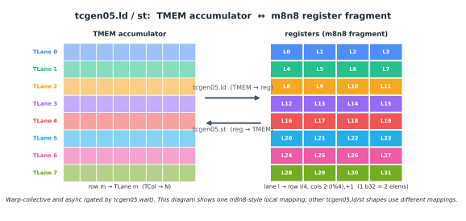
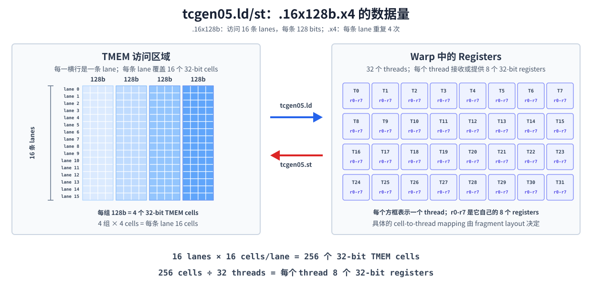

::: info 概要
- TMEM はレーンと列で構成され、列単位で動的に割り当てられた二次元のアドレス空間です。 `tcgen05.alloc` 空きを申請する、 `tcgen05.dealloc` 空きを空ける `tcgen05.relinquish_alloc_permit` その後の割り当て権を放棄する。
- `tcgen05.ld` と `tcgen05.st` は WARP 全体にわたって調整されています。 warpgroup 内の warp ID はアクセス可能な 32 の TMEM レーンの位置を決定し、 `.shape` と `.num` は一度に移動するデータ量とスレッドあたりの使用レジスタ数を決定します。
- TMEM のロードとストアの両方は非同期操作です。 ロードを使う前に、レジスタを登録する前に `tcgen05.wait::ld` を実行する必要があります。 TMEM の場所で関係する店舗を再利用する前に、 `tcgen05.wait::st` を行う必要があります。
:::

前の章ではすでに TMEM を異なる視点から紹介しています。 [データ layout とその表記法](/ja/gpupro/data-layout/)は `TLane`、 `TCol`、二次元 layout を説明しています。 [Tensor Core データ layout の進化](/ja/gpupro/tensor-core-data-layouts/) accumulator とスケールファクターのデータ経路を紹介します。 [Blackwell Tensor Core: tcgen05.mma](/ja/gpupro/blackwell-tensor-core/) `tcgen05.mma` 結果を TMEM にマッピングする方法を説明しています。

まずは下の図を使って TMEM の物理的構造を振り返りましょう。 PTX は 2 つのアドレス座標をレーンと列と呼びます。 TIRx layout 表記では、対応する軸は `TLane` と `TCol` と表記されます。 ここでの TMEM レーンはスレッドのレーン ID ではなくアドレス座標を指します。

各 CTA の TMEM はレーン次元に 128 位置、列次元で最大 512 位置を持ち、セルあたり 32 ビット `(Lane, Column)`。 後述の TMEM 割り当てとは、列次元から空間の一部を要求することを意味します。 各指定列には全 128 車線の位置が含まれています。


本章では、TMEM を使用する際にまだ対処すべき 2 つの課題に焦点を当てます。すなわち、kernel がどのように TMEM を要求しリリースするか、そして各 warp が `tcgen05.ld` および `tcgen05.st` を通じてどのようにアクセスするかです。

## TMEM の割り当てライフサイクル

TMEM は動的割り当てを使用します。 `tcgen05.alloc` `n_cols` 32、64、128、256、または 512 の利用可能な列次元に沿った空間を申請します。 各列に申請するたびに、その列内の 128 レーン全てが一緒に割り当てられます。

以下は、その後の TIRx kernel でよく見られる慣行です。

```python
pool = T.SMEMPool()
tmem_addr = pool.alloc((1,), "uint32")
pool.commit()

if warp_id == 0:
  T.ptx.tcgen05.alloc(
    T.address_of(tmem_addr), n_cols=256, cta_group=1
  )
```

`tmem_addr` SMEM 内の 32 ビットスロットです。 `tcgen05.alloc` 成功すると、割り当てられた TMEM ベースアドレスがこのスロットに書き込まれます。 命令自体はアイドル状態の TMEM 列を待つことがあるため、ブロッキング命令となります。

ここでは、 `warp_id == 0` warp 0. `tcgen05.alloc` 全体を warp 集合命令として選択し、warp 内の 32 スレッドすべてを同じ `n_cols` で同時に実行する必要があります。 もう一層 `lane_id == 0` をかけて単一スレッドの操作にすることはできません。 他の warp は対応するフェンスと CTA 同期を経てから読み `tmem_addr`、割り当てが CTA 全体で見えるようになります。

ベースアドレスを取得した後、TIRx はこの割り当てられた領域に TMEM バッファを宣言します:

```python
tmem = T.decl_buffer(
  (128, 256),
  "float32",
  scope="tmem",
  allocated_addr=tmem_addr[0],
  layout=TileLayout(
    S[(128, 256) : (1@TLane, 1@TCol)]
  ),
)
```

`allocated_addr` バッファを、 `tcgen05.alloc` から返されるアドレスにバインドし、論理座標 `(m,n)` TMEM の `TLane` と `TCol` にどのようにマッピングするかを指定します `layout`。 この方法により、後続のコードは論理要素を `tmem[m,n]` で表現でき、特定の TMEM 座標は layout ごとに一様に扱われます。

### 割り当てのサイズ制限

同じ CTA が実行順に複数回割り当てられる場合、次のアプリケーションで適用されるカラム数は前回のそれを超えてはなりません。 例えば:

```text
256 columns -> 128 columns   合法
128 columns -> 256 columns   不合法
```

このルールでは、kernel が設計段階で最大 TMEM 要件を決定することを求めており、後で実行してから割り当てを拡大するのではなく、

使用後、kernel は以下の 2 つのことを満たさなければなりません。

```python
if warp_id == 0:
  T.ptx.tcgen05.dealloc(tmem_addr[0], n_cols=256, cta_group=1)
  T.ptx.tcgen05.relinquish_alloc_permit(cta_group=1)
```

`tcgen05.dealloc` リリース欄は以前適用されていました; kernel 終了前に、割り当てられたすべての TMEM を明示的に解放しなければなりません。 `tcgen05.relinquish_alloc_permit`、現在の CTA は以降の期間に TMEM を割り当てる権利を放棄し、実行後は `tcgen05.alloc` を呼び出すことができなくなります。 クリーンアップ phase を開始する前に、MMA、ロード、ストアなどの非同期操作が完了していることを確認する必要があります。

### `cta_group::2` 分布

`cta_group::1` 現在の CTA のみが関与しているため、割り当てと解放は現在の CTA 内の warp のいずれかによって完了します。 `cta_group::2`、同じ `tcgen05.alloc` や `tcgen05.dealloc` を実行するために CTA ペアの両側に warp が必要です。 最初に到着した側は、ピア CTA の warp を待つことができます。

これはまた、ピア CTA がすでにこれらの集合的な運営を開始し、最終的に関与していることを意味します。 kernel 内の修飾子 `cta_group` を持つすべての `tcgen05` 命令は同じ値を使わなければなりません。TMEM は `cta_group::2` で割り当てられず、 `cta_group::1` `tcgen05.mma` または `tcgen05.commit` でアクセスできます。

## どの TMEM レーンが warp アクセスできるのか?

TMEM は CTA ですが、 `tcgen05.ld` と `tcgen05.st` は CTA 内の warp を許可して 128 レーンすべての場所にアクセスすることはできません。 warpgroup 内の 4 つの warp は、それぞれ 32 レーンの固定範囲を管理します。

| warp 群における warp の識別 | アクセス可能な TMEM レーンの場所 |
| --- | --- |
| 0 | 0-31 |
| 1 | 32-63 |
| 2 | 64-95 |
| 3 | 96-127 |

4 つの warp はすべてすべての TMEM コラムにアクセスでき、唯一の違いはレーン範囲内です。 したがって、128 レーンの位置をカバーする完全な accumulator を読み取るには、それぞれのレーン範囲を読み取るために 4 つの warp が必要です。 前節で述べた「warpgroup が TMEM に読み戻す」は、これら 4 つの warp レベルのアクセスを指しています。

## `tcgen05.ld` と `tcgen05.st` データの移動方法

`tcgen05.ld` TMEM からレジスタへのデータを読み込み、 `tcgen05.st` 逆方向に処理する。 両命令は warp 集合演算であり、warp 内のすべてのスレッドは同じ命令を実行し、同じ TMEM アドレス operand `[taddr]` を提供しなければなりません。 ハードウェアはスレッドのレーン ID に基づいてアクセス結果全体をスレッドのレジスタに割り当てるか、対応する TMEM セルに書き戻します。

下図は m8n8 ス tile のレジスタ断片を用いて、データの動きを 2 方向に示しています。 これは単に `tcgen05.ld/st` によって支えられた局所的なマッピングです。 実際のデータの移動は、 `.shape`、 `.num`、そしてオプションで選べば、 `.pack::16b` または `.unpack::16b` の限定詞によって決まります。

に書き戻します

### 形状と繰り返し係数

ロードやストアで移動されるデータ量は、 `.shape` と `.num` の両方によって決まります。 `.shape` 同時にカバーする TMEM レーンの数と、レーンごとのベースデータボリュームを指定します。 `.num` このデータを何度も繰り返します。 例えば:

```text
tcgen05.ld.sync.aligned.16x128b.x4.b32
    {r0, r1, r2, r3, r4, r5, r6, r7}, [taddr]
```

以下の図はこのコマンドを左から右へ拡張しています。 左側の各水平列は TMEM レーンに対応しています。 各列には 4 つの青いブロックがあり、これは `.x4` の 4 回の繰り返しに対応しています。 各カラーブロックは 4 つの小さなセルで構成されており、これは `.16x128b` の 128 ビットです。 スモールセルは 32 ビットの TMEM セルを表します。



したがって、左側には以下のものがあります:

```text
16 lanes × 4 groups/lane × 4 cells/group
    = 256 个 32-bit TMEM cells
```

右側の 32 個の箱は経糸の 32 本の糸を表しています。 各ボックス内の `r0-r7` はスレッド自身の 8 つの 32 ビットレジスタを表しています。 `tcgen05.ld` 左側の 256 セルをこれらのレジスタに割り当て、各スレッドは以下のようになります:

```text
256 cells ÷ 32 threads = 8 个 32-bit registers/thread
```

`tcgen05.st` 同じ量のデータを反対方向に移動させます。 このチャートはデータ量のみをカウントしています。 各 TMEM セルは、どのスレッドとどのレジスタスロットに対応し、命令のフラグメントマッピングによって決定されます。

`.x4` を `.x1` に変えると、左側の各レーンには 1 つの 128 ビットカラーブロックだけが表示されます。 この時点で、セル数は合計 `16×1×4=64` です。平均 32 スレッドの後、各スレッドには 2 つの 32 ビットレジスタがあります。

| 指示書 | レーンあたりのデータ量 | 各スレッドのレジスタ |
| --- | ---: | ---: |
| `.16x128b.x1` | 128 ビット | 2 |
| `.16x128b.x2` | 256 ビット | 4 |
| `.16x128b.x4` | 512 ビット | 8 |
| `.16x128b.x8` | 1024 ビット | 16 |

これは MMA の `M×N×K` 指導的な形とは異なる概念です。 MMA 形状は行列乗算の論理次元を表し、 ここでのデータ移動形状は、TMEM とレジスタ間の単一転送のハードウェアモードを表しています。 [Tensor Core データ layout の進化](/ja/gpupro/tensor-core-data-layouts/)レジスタ断片で、これらのレジスタが論理行列の要素に対応する仕組みを説明する。

### 16 ビットデータのパッケージ化とアンパック

TMEM の各セルおよび `tcgen05.ld/st` レジスタ operand は 32 ビットですが、kernel は処理できるデータ断片が 16 ビットに限られます。 `tcgen05.ld` を実行する際、 `.pack::16b` 隣接する TMEM 列から 2 つの 16 ビットデータ断片を 32 ビットレジスタにパッケージ化します。 `tcgen05.st` を実行する際、 `.unpack::16b` 32 ビットレジスタを 2 つの 16 ビットデータセグメントに分割し、隣接する TMEM 列に書き込みます。

パックとアンパックは TMEM とレジスタの組織方法を変えるだけで、TMEM 割り当てユニット自体は変わりません。TMEM はカラム次元に沿って割り当てられ、各割り当てされた列には 128 レーンすべての位置が含まれています。

### 非同期読み書きが完了するまで待ちます

`tcgen05.ld` と `tcgen05.st` は非同期命令です。 ロードを実行した後は、ターゲットレジスタを使用する前に `tcgen05.wait::ld` を実行しなければなりません。 ストアを実行した後、書き込みが `tcgen05.wait::st` を経て完了するのを待ちます。 各スレッドは、現在スレッドが以前に発行したすべての `tcgen05.ld` または `tcgen05.st` 操作を待機します。

データを他のスレッドや warp に渡す必要がある場合、非同期操作の完了を待つだけでなく、スレッド同期と対応する `tcgen05.fence` を調整してスレッド間の実行シーケンスを確立する必要があります。

SMEM から TMEM への `tcgen05.cp` は、追加の形状と仕上げ機構を使用します。 ブロックスケール MMA のスケールファクターをどのように持っているかは、すでに[Tensor Core データ layout の進化](/ja/gpupro/tensor-core-data-layouts/)や[Blackwell Tensor Core: tcgen05.mma](/ja/gpupro/blackwell-tensor-core/)で紹介されているため、ここでは繰り返しません。

TMEM で kernel を読み取る際には、要求・解放された列の数、現在の warp がアクセス可能なレーン位置、 `.shape` と `.num` `ld/st` が生成するレジスタ数、そして関連する非同期操作が完了しているかどうかの 4 つの項目を順に確認できます。 これにより、TMEM はリソースライフサイクル、データ layout、同期関係を接続できます。
