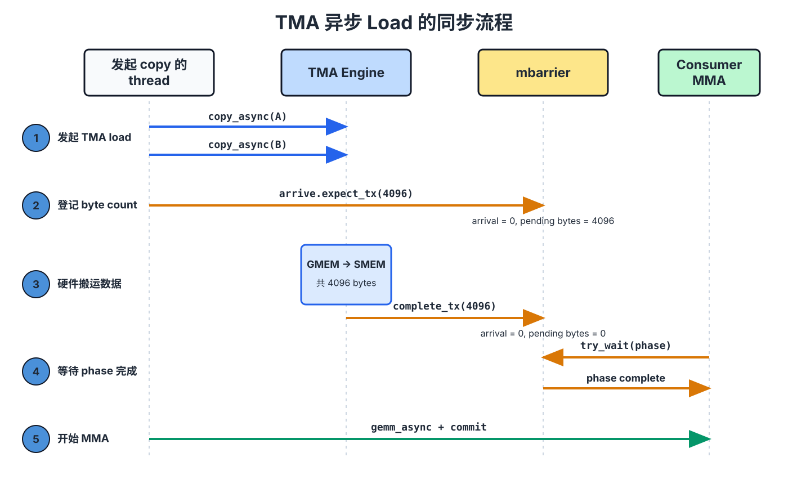

::: info 概要
- TMA はグローバルメモリと共有メモリ間で tile を非同期的に転送する責任を負っています。 warp で操作を開始するのにスレッドは 1 つだけで済み、その後のアドレス計算やデータ伝送はハードウェアによって処理されます。
- tensor マップ記述子は、グローバル tensor がどのように組織されるかを説明し、形状、ストライド、tile 形状、スウィズルモードなどを含みます。 TMA 命令は現在の tile の座標と共有メモリアドレスを提供します。 ロードを実行する際、TMA は共有メモリを書き込む際にスウィズルをかけることができ、tile が後の MMA で必要な layout を直接採用できるようにします。
- TMA の読み込みとストアは異なる完了通知を使用します。 ロード: `mbarrier` は送信されたバイト数に基づいてデータが準備完了かどうかを判断します。 ストアはコミットグループや待機グループを通じて、ソースバッファが再利用可能であることを確認します。
:::

まずは GEMM メインループで最も一般的なシナリオを見てみましょう。 tensor コアが $k$ 番目の tile を計算している間、次の A tile と B tile のセットを現在の計算が終了する前に共有メモリに移動しなければなりません。 データが期限内に届かない場合、tensor コアは停止して待つしかできず、パイプラインのバブルが発生することもあり、計算ユニットはデータを待つためにアイドル状態になります。

この問題に対処する方法の一つは複数のスレッドが協力することです。各スレッドが独自のグローバルメモリと共有メモリアドレスを計算し、その後ロードとストアを実行します。 tensor メモリアクセラレータ(TMA)は、別のアプローチを提供します。 スレッドは tile コピーの送信のみを担当し、その後のアドレス計算とデータ転送は専用の TMA エンジンによって処理されます。

TMA は共有メモリを書き込む際にスウィズルを適用することもでき、tile が次の MMA に必要な物理的な配置を直接採用できるようにします。 下の相互作用図はこの経路を示しています。 左側のグローバル tensor には `16×128` `fp16` 要素が含まれています。青いボックスの `8×64` tile を選択してください。 右側では、共有メモリを書き込んだ後のこの tile の配置を見ることができます。 図の各セルは連続した 8 つの `fp16` を表し、合計 16 バイトです。 スウィズルモードに切り替えると、リニア layout と 128 バイトのスウィズル layout を比較できます。

<div style="overflow-x:auto;">
<iframe src="/gpupro/demo/tma_intro.html?v=tutorial-review-20260713" title="TMA：Tensor Memory Accelerator" loading="lazy"
        style="width:100%; min-width:1320px; height:640px; border:1px solid var(--vp-c-border); border-radius:6px;"></iframe>
</div>

*共有メモリに書き込み後、左側の任意のソースセルにマウスを合わせると、その物理的な位置を確認できます。*

## 糸が tile 全体をどのように表現するか

TMA コピーを開始するスレッドは tile 内の要素を反復しません。 ハードウェアに提供する情報は 2 種類だけです。

最初のタイプは tensor 写像記述子です。 グローバル tensor、次元形状やストライド、単一コピーの tile 形状、共有メモリに書き込みする際に使われるスウィズルモードのデータ型を記述しています。 同じディスクリプタは通常、複数の tile コピーに再利用可能です。

2 つ目はこのコピーのパラメータで、グローバル tensor 内の tile の開始座標や共有メモリ内の宛先アドレスが含まれます。 この分業は次のように理解できます。記述子は「tensor 全体の構成」を説明するのに対し、命令パラメータは「今回どこから動き始め、どこへ移動するか」を指定します。

TMA 命令を発行しても、warp は SIMT モデルに従って実行されます;選択されたスレッドのみがこの命令に参加し、同じ warp 内の他のスレッドはブロックされます。 この状態はリクエストがコミットされるまでのみ続きます。 その後、TMA エンジンは非同期にデータを転送し、操作を開始した warp や CTA 内の他の warp の実行を継続できるようにします。 実際にこのデータを使う前に、転送が完了するまで待ちましょう。

## TMA がスウィズル layout を書く方法

上記の相互作用図に戻り、まず `None` を選択します。 この時点で、各 tile の行は元の順序で共有メモリに書き込み、論理セクター `c` は物理セクター `c` に該当します。

その後、 `128B` に切り替えましょう。 チャートの行は 8 つの 16 バイトセクターで構成されており、正確に 128 バイトです。 この簡略化・整列された例では、論理セクター `col` on line `row` 次のように書かれます:

```text
physical_sector = col XOR row
```

このようにして、同じ論理列のセクターが異なる行の物理的な位置に分散し、同じ共有メモリバンクにクロスローアクセスが集中しにくくなります。 このアドレス再配置は書き込み時に TMA エンジンによって行われるため、コピーを開始するスレッドはスウィズされたアドレスを個別にカウントする必要はありません。

Swizzle は tile の物理的な配置を変えるだけで、論理的な構成は変えません。 TMA ディスクリプタ、共有メモリ tile の layout、およびその後の MMA 命令は同じ物理的配置([データ layout とその表記法](/ja/gpupro/data-layout/))を記述しなければなりません。 TMA が 128 バイトのスウィズルで書き込み、MMA がリニア layout で読み取る場合、データが共有メモリに到達していても、tensor コアはこれらのバイトを誤った行列要素として解釈します。

## 3D TMA による複数のスウィズル原子の輸送

`SWIZZLE_128B` `8 rows × 128 bytes` 繰り返し単位、すなわちスウィズル原子として扱われます。 アドレスの再配置は原子内でのみ行われるため、TMA ボックスの最も内側の連続次元は 128 バイトを超えてはなりません。 `fp16` の場合、この空間はちょうど 64 個の要素を保持します。

次に `16×128` `fp16` 行列スライスを考えます。 各行は 128 `fp16`、合計 256 バイトで、128 バイトのスウィズルアトム行として直接使用することはできません。 `SWIZZLE_128B` を使うには、まず各行を 2 つのグループに分け、それぞれ 64 `fp16` を含みます。

```text
group 0: columns 0–63    = 128 bytes
group 1: columns 64–127  = 128 bytes
```

スライスの列座標を `j` とし、次のように分割できます:

```text
group = j // 64
col   = j % 64

global[row, j] = global3[group, row, col]
```

したがって、同じデータが 3D ビュー `(group=2, row=16, col=64)` になります。 この形取りは tensor マップが座標を解釈する方法を変えるだけで、グローバルメモリ内のデータを事前に移動させることはありません。 `group` 次元を加えると、最も内側の `col` 次元は 64 `fp16` しかなく、128 バイトの制限を正確に満たします。

以下の相互作用図はこのプロセスを示しています。 左側は完全な `16×256` グローバル行列で、各セルは 16 バイトのセクター(8 `fp16`)を表します。 青い部分は `16×128` スライスのいずれかを選択します。 単一の 3D TMA コピーが、このスライスの 2 つのグループを右側の `g0` と `g1` に書き込みます。

各群は 16 行ありますが、スウィズルアトムは 8 行しかないので、 `g0` と `g1` はそれぞれ 2 つの原子を含みます。0–7 行目は最初の原子、8–15 行目は 2 番目の原子に属します。 全体が最終的に 4 つの原子に対応します。 `128B` を有効にした後、TMA は各原子内のセクターをそれぞれのセクター `physical_sector = logical_sector XOR (row % 8)` に応じて再配置します。

<div style="overflow-x:auto;">
<iframe class="demo-tma3d" src="/gpupro/demo/tma_3d.html?v=tutorial-review-20260713" title="使用 3D TMA 搬运多个 swizzle atoms" loading="lazy"
        style="width:100%; min-width:1320px; height:640px; border:1px solid var(--vp-c-border); border-radius:6px;"></iframe>
</div>

*スイッチ `Col offset` 元の行列の最初の 128 列または最後の 128 列を選択できます。 青いエリア内の任意のセルにマウスを合わせると、共有メモリに書き込みた後に対応する 16 バイトのセクターが表示されます。*

### 128 バイトのスウィズルグルーピング要件

なぜ 256 バイトの行を 2 つの 128 バイトのグループに分割するのですか? TMA ボックスの幅制限を満たすことに加え、グループ化によって共有メモリバンクのクロスバンクアクセスがどのバンドに属するかも変わります。

`16×16` セクターgrid を考えてみましょう。 各セクターは 16 バイトなので、1 行あたり 256 バイトです。 同じセクター列を 8 行それぞれから読み取ると、合計 8 回の並列 16 バイトアクセスが送信されます。

16 バイトのアクセスは 4 つの隣接する共有メモリバンクをカバーします。 観察しやすくするために、32 の銀行は隣接する銀行 4 つごとに 8 つの銀行セクターに分かれており、 `S0` から `S7` と表記されています。 同じ銀行セクターに属する銀行グループが異なるアクセスで競合します。

まず、各行を 128 バイトのグループに分けます。 完全な grid の列番号を `col` し、 `col // 8` 左グループと右グループを選択します。 `local_col = col % 8` グループ内の列番号を示します。 0〜7 行の場合、スウィズル後の銀行セクターは次の通りです:

```text
bank_sector = local_col XOR (row % 8)
```

連続した 8 行で 8 つの異なる結果が得られるため、これらのアクセスは並行して完了できます。

グループ化せずに 256 バイトの行のストライドを維持している場合、横切る 1 行分は 128 バイト単位を 2 つ横切るのと同じです。 XOR に使われる番号は 2 行先に進みます:

```text
bank_sector = local_col XOR ((2·row + col // 8) % 8)
```

現時点では、4 つの異なる結果しかなく、各銀行セクターは 2 回訪問され、二者間の対立が生じます。 ここでのグループ未登録の状態は比較に過ぎず、TMA ボックス `SWIZZLE_128B` 正当なものではありません。

以下の相互作用図はこれら二つのシナリオを示しています。 左側は元の grid から `Column` と連続した 8 行を選択し、右側の黒い枠のセルはスウィズィング layout 内のこれらのアクセス位置を示しています。 `Tiling` 「はい」を選択する際は、各行を 128 バイトの 2 つのグループ(`g0` と `g1`)に分割します。 「いいえ」を選択すると、256 バイトの行のストライドが参照として保持されます。 一番下の「 `S0` to `S7` 」には、各アクセスで使用される銀行セクターがまとめられています。 `dtype` セクター内の要素数だけを変更するだけでは、ここでのアドレスマッピングには影響しません。

<div style="overflow-x:auto;">
<iframe class="demo-tma3d" src="/gpupro/demo/tiling_constraint.html?v=tutorial-review-20260713" title="128-byte 分组对 bank conflict 的影响" loading="lazy"
        style="width:100%; min-width:1320px; height:640px; border:1px solid var(--vp-c-border); border-radius:6px;"></iframe>
</div>


*tile の切り替えを切り替え、次に列と 8 行連続を選択して、グループ化前後の 2 つの layout の銀行セクター使用状況を比較してください。*

tile のサイズやターゲットアクセスパターンが許す場合、通常はできるだけ広いスウィズルを選び、より多くのバンクにアクセスを分散させます。 幅 `N` バイトのスウィズル原子は、少なくとも `N` バイトを収容するために連続的な寸法が必要です。 128 バイトのアトムが収まらない場合は、64 バイトか 32 バイトのスウィズル([データ layout とその表記法](/ja/gpupro/data-layout/))に切り替えてください。

## TMA のロードが完了するまでの待ち方

TMA 負荷は非同期操作です。 コマンドを出すことは、再配置が開始されたことを示すだけで、consumer はまだターゲット tile を読み取れません。 TMA はこのハンドオフを完了するために `mbarrier` を使用します。producer はこのラウンドで転送される予定のバイト数を barrier に伝えます。TMA エンジンがこれらのバイトを実際に書き込んだ後、barrier を更新し、consumer は現在の barrierphase が完了するのを待ちます。

`mbarrier` ワン phase は到着カウントと保留中のトランザクションバイトの両方を記録します。 到着数と保留中のバイトの両方がゼロにリセットされた場合にのみ位相カウントが完了します。

例を見てみましょう。 kernel が A と B 両方の operand tile を同時に読み込み、同じ通知で完成させた `2048 bytes` `mbarrier`、このラウンドは合計で待たなければなりません。

```text
2048 + 2048 = 4096 bytes
```

初期化時に期待到着数が 1 に設定されていると仮定 `mbarrier`。 コピーを開始するスレッドは A と B の両方の TMA をこの barrier に関連付け、 `mbarrier.arrive.expect_tx(4096)` を実行します。 このステップはスレッドの 1 回の到着を完了するだけでなく、保留中のバイトを 4096 に設定します:

```text
发出 expect_tx 后: arrival count = 0, pending bytes = 4096
TMA 完成搬运后:   arrival count = 0, pending bytes = 0
```

その後、TMA コピーが完了するたびに、エンジンはそのバイト数を complete-tx で差し引きます。 consumer は `try_wait(phase)` を待つために使います。 2 回のコピーで合計 4096 バイトになると、保留中のバイトはゼロにリセットされ、consumer は安全に A tile と B tile を読み取ることができます。 以下の図は、この引き継ぎを年代順に示しています。



## TMA ストアの完成を待つ方法

TMA ストアは共有メモリからグローバルメモリへ逆方向にデータを書き戻します。 ここで解決すべき問題も変わります。ロード consumer はターゲット tile をいつ読み取れるかを知る必要があり、ストア producer はソースバッファを再利用できるタイミングを知る必要があります。

例えば、epilogue はすでに出力 tile を `Dsmem` に書き込み、それを TMA ストア経由で `D` に書き戻しています。 ストアを送信した後、kernel はすぐにその `Dsmem` を上書きすることはできません。そうでなければ、TMA エンジンが次の書き込みデータを読み取ることができます。 ストアパスはバルク非同期グループを使って待機します:

```text
发起一个或多个 TMA stores
cp.async.bulk.commit_group
cp.async.bulk.wait_group 0
复用 Dsmem
```

`commit_group` これまでコミットしていなかった店舗をまとめて、一括非同期グループにまとめます。 `wait_group 0` これまでに提出したすべてのグループが完了するまで待ちます。 戻ってきてから `Dsmem` 安全に再利用できます。

したがって、2 つの経路は次のように区別できます。

```text
TMA load:  consumer 通过带 byte count 的 mbarrier 等待数据到达
TMA store: producer 通过 commit group 和 wait group 等待 source 可复用
```

## TMA をパイプラインに入れてください

TMA はコピー命令を減らすだけでなく、データ処理と計算の重複を可能にします。 例として、2 つの共有メモリステージを挙げると:

```text
时间 t:    MMA 读取 stage 0    TMA 填充 stage 1
时间 t+1:  MMA 读取 stage 1    TMA 填充 stage 0
```

tensor コアがステージ 0 を読み取ると、TMA は次の tile をステージ 1 に書き込みます。 次のラウンドでは、2 つのステージから役割を交換します。 MMA がステージをロードする前に、対応する TMA ロードが完了するのを待つ必要があります。 TMA が段階をカバーする前に、前回の計算ラウンドのデータが使用されていないことも確認しなければなりません。

したがって、TMA は非同期転送を担当し、barrier は producer と consumer 間の各段階を担当します。 両者を組み合わせると、現在の tile 計算ではデータの待ち時間が隠されることがあります。
