> [Guibin Zhang](https://dblp.org/pid/227/3812.html), [Hejia Geng](https://dblp.org/pid/355/2680.html), [Xiaohang Yu](https://dblp.org/pid/156/3816.html), [Zhenfei Yin](https://yinzhenfei.github.io/), [Zaibin Zhang](https://dblp.org/pid/348/6988.html), [Zelin Tan](https://dblp.org/pid/404/8688.html), [Heng Zhou](https://dblp.org/pid/19/225.html), [Zhongzhi Li](https://dblp.org/pid/11/8539.html), [Xiangyuan Xue](https://dblp.org/pid/365/9836.html), [Yijiang Li](https://dblp.org/pid/115/8640.html), [Yifan Zhou](https://dblp.org/pid/79/7629.html), [Yang Chen](https://dblp.org/pid/48/4792.html), [Chen Zhang](https://dblp.org/pid/94/4084-7.html), [Yutao Fan](https://dblp.org/pid/195/8112.html), [Zihu Wang](https://dblp.org/pid/339/6436.html), [Songtao Huang](https://dblp.org/pid/35/5973.html), [Francisco Piedrahita-Velez](https://cs.brown.edu/people/grad/fpiedrah/), [Yue Liao](https://dblp.org/pid/210/0033.html), [Hongru Wang](https://dblp.org/pid/72/1462-3.html), [Mengyue Yang](https://dblp.org/pid/262/3824.html), [Heng Ji](https://dblp.org/pid/61/2408-1.html), [Jun Wang](https://dblp.org/pid/125/8189.html), [Shuicheng Yan](https://dblp.org/pid/y/ShuichengYan.html), [Philip Torr](https://dblp.org/pid/t/PhilipHSTorr.html), and [Lei Bai](https://leibai.site/)。arXiv への初回投稿日は 2025 年 9 月 2 日、現行版は v5。2026 年 1 月に [Transactions on Machine Learning Research（TMLR）](https://openreview.net/forum?id=RY19y2RI1O) で発表。[The Landscape of Agentic Reinforcement Learning for LLMs: A Survey](https://arxiv.org/abs/2509.02547)。[原論文 PDF](/paper/agentic-reinforcement-learning.pdf)。[DOI](https://doi.org/10.48550/arXiv.2509.02547)。[TeX ソース](https://export.arxiv.org/e-print/2509.02547v5)。正確な誌面レイアウトと参考文献については原論文 PDF を参照。

## 概要

Agentic Reinforcement Learning（Agentic RL）の登場は、大規模言語モデルに適用されてきた従来の強化学習（LLM RL）からのパラダイム転換を示しており、LLM を受動的な系列生成器から、複雑で動的な世界に組み込まれた自律的意思決定エージェントへと捉え直します。本サーベイでは、LLM RL の退化した 1 ステップのマルコフ決定過程（MDP）と、Agentic RL を特徴づける時間的に拡張された部分観測マルコフ決定過程（POMDP）を対比し、この概念的な転換を形式化します。この基礎の上に、2 つの包括的な分類体系を提案します。一方は計画、ツール利用、記憶、推論、自己改善、知覚などの中核的なエージェント能力に基づき、もう一方は多様なタスク領域における応用に基づくものです。本稿の中心的な主張は、強化学習が、これらの能力を静的なヒューリスティック・モジュールから適応的で頑健なエージェント行動へと変える主要な仕組みになるという点です。今後の研究を支援し加速するため、オープンソースの環境、ベンチマーク、フレームワークも実用的な資料として整理します。500 件を超える近年の研究を統合することで、急速に発展するこの分野の全体像を示し、スケーラブルな汎用 AI エージェントの開発を左右する機会と課題を明らかにします。

## 1 はじめに

大規模言語モデル（LLM）と強化学習（RL）の急速な融合は、言語モデルの捉え方、学習方法、展開方法を根本から変えつつあります。初期の LLM RL は、主にモデルを静的な条件付き生成器として扱い、人間の選好やベンチマークスコアに合う 1 ターンの出力を生成するよう最適化していました。こうした手法はアライメントや指示追従には有効でしたが、現実の対話的な環境を支える、より広い逐次意思決定の問題を見落としていました。この限界から、見方そのものが変わり始めています。近年は LLM を受動的なテキスト生成器ではなく、部分観測かつ動的な環境で知覚、推論、計画、ツール呼び出し、記憶の維持、長期的な戦略調整を行う自律的な意思決定者、すなわち*エージェント*として捉える研究が増えています。本稿では、この新しいパラダイムを **Agentic Reinforcement Learning（Agentic RL）** と定義します。本稿で扱う Agentic RL と従来の RL 手法の違いを明確にするため、次のように定義します。

**Agentic Reinforcement Learning（Agentic RL）** とは、LLM を、1 ターンの出力アライメントやベンチマーク性能に向けて最適化される*静的な条件付き生成器*ではなく、逐次意思決定ループに組み込まれた*学習可能な方策*として捉えるパラダイムです。RL は LLM に計画、推論、ツール利用、記憶の維持、自己反省といった自律的なエージェント能力を与え、*部分観測かつ動的な環境*における長期的な認知行動と対話行動の創発を可能にします。

[第 2 節](#section-2) では、エージェントの RL と従来の RL の間の、より正式で象徴的に根拠のある区別を示します。 Agentic RL に関連する先行研究は、**RL と LLM 間の相乗効果** と **LLM エージェント** という 2 つの相補的なスレッドに大別できます。詳細は次のとおりです。

**RL と LLM の相乗効果。** 2 つ目の研究系統は、強化学習アルゴリズムをどのように LLM の改善やアライメントに用いるかを扱います。主要な一分野である LLM 学習のための RL は、オンポリシー手法（*例*、Proximal Policy Optimization（PPO）[Sch17a]、Group Relative Policy Optimization（GRPO）[Sha24d]）とオフポリシー手法（*例*、actor-critic、Q-learning [Mni13]）を用いて、指示追従、倫理的アライメント、コード生成などの能力を高めます [Agg25, Wan25x, Wan24o]。これと相補的な「RL のための LLM」は、LLM をプランナー、報酬設計器、目標生成器、情報処理器として用い、制御環境におけるサンプル効率、汎化、マルチタスク計画を改善する方向であり、[Cao25c] が体系的な分類を示しています。[Wan25h] がまとめるように、RL はデータ生成 [Guo25c, Wan25j]、事前学習 [Don25a]、ポストトレーニング、推論 [Cho25a] まで、LLM のライフサイクル全体に組み込まれています。なかでも中心となるのはポストトレーニング時のアライメントであり、人間のフィードバックからの強化学習（RLHF）[Chr17] と、AI フィードバックからの強化学習（RLAIF）[Bai22a]、Direct Preference Optimization（DPO）[Raf23, Wan24v, Xia24f, Liu25k, Agg25] などの拡張が含まれます。

**LLM エージェント。** LLM ベースのエージェントは、LLM が自律的または半自律的な意思決定主体 [Wan25o, Li25u] として推論、計画、行動し、複雑な目標を追求する新しいパラダイムです。近年のサーベイは、互いに補完的な観点からこの分野を整理しています。[Luo25c] はアーキテクチャの基礎、協調機構、進化経路を結ぶ方法論中心の分類体系を提案し、[Pla25] は推論、行動、対話を*エージェント的* LLM の中核能力として重視しています。検索拡張生成（RAG）や API 利用を含むツール利用は中心的な要素であり、[Li25n] が広く論じ、[Wan24w] がさらに概念化しています。計画と推論の戦略も重要な柱で、[Mas24] や [Kum25] は plan-execute-reflect ループなどの一般的な設計パターンを整理し、[Tao24] はこれを、人間の大幅な介入なしに知識と戦略を反復的に改良する自己進化へと拡張しています。ほかにも、マルチエージェントシステム [Ilm25]、マルチモーダル統合 [Dur24]、記憶と知覚を備えた脳着想型アーキテクチャ [Liu25a] など、協調、クロスモーダル、身体性を伴う環境が研究されています。

**研究ギャップと私たちの貢献。** LLM エージェントと RL 拡張 LLM に関する研究の最近の急増は、2 つの相補的な観点を反映しています。1 つは、大規模な言語モデルが自律エージェントの中核として何ができるかを探求するものであり、もう 1 つは、強化学習が自律エージェントの動作をどのように最適化できるかに焦点を当てているものです。しかし、既存の研究は多岐にわたるにもかかわらず、LLM を逐次的な意思決定プロセスに組み込まれた方策に最適化されたエージェントとして概念化する *Agentic RL* の統一された扱いは依然として不足しています。現在の研究では、一貫性のない用語や評価プロトコルを使用して、分離された機能、ドメイン、またはカスタム環境を調査することが多く、体系的な比較やドメイン間の一般化が困難になっています。このギャップを埋めるために、理論的基礎をアルゴリズム的アプローチおよび実用的なシステムと結び付ける一貫した統合を提案します。我々は、Agentic RL をマルコフ決定プロセス (MDP) と部分観察可能なマルコフ決定プロセス (POMDP) の抽象化を通じて形式化し、古典的な LLM RL パラダイムと区別し、RL 最適化可能なコンポーネントとして計画、ツールの使用、記憶、推論、反映 (自己改善)、およびインタラクションを含む能力中心の分類法を導入します。さらに、エージェント LLM のトレーニングと評価をサポートする代表的なタスク、環境、フレームワーク、ベンチマークを統合し、未解決の課題について議論し、スケーラブルな汎用エージェント インテリジェンスの有望な将来の方向性を概説してまとめます。全体として、私たちはこの調査の調査範囲をさらに明確にすることを目指しています。

**主な焦点:**

- ✔ RL が *動的環境* で LLM ベースのエージェント (またはエージェントの特性を持つ LLM) をどのように強化するか

**対象外 (ただし、時折言及されます):**

- ✗ 人間の価値観の調整のための RL (*例*、有害なクエリの拒否のための RL)
- ✗ LLM ベースではない従来の RL アルゴリズム (*例*、MARL [Moh24])
- ✗ 静的ベンチマークで純粋な LLM パフォーマンスを向上させるための RL。

**調査の構造。** この調査は、概念的な基礎から実際の実装に至るまで、Agentic RL の統一された理解を徐々に構築するために組織されています。 [第 2 節](#section-2) は、MDP/POMDP レンズを通じて Agentic RL へのパラダイムシフトを形式化します。 [第 3 節](#section-3) では、計画、推論、ツールの使用、記憶、自己改善、知覚などの主要なモジュールを分類し、機能の観点から Agentic RL を検証します。 [第 4 節](#section-4) では、検索、GUI ナビゲーション、コード生成、数学的推論、マルチエージェント システムなど、ドメイン全体にわたるアプリケーションを検討します。 [第 5 節](#section-5) は、実験とベンチマークを支えるオープンソース環境と RL フレームワークを統合します。 [第 6 節](#section-6) では、スケーラブルで適応性のある信頼性の高いエージェント インテリジェンスに向けた未解決の課題と将来の方向性について説明し、[第 7 節](#section-7) で調査を締めくくります。全体の構造は[図 1](#figure-01)にも示されています。

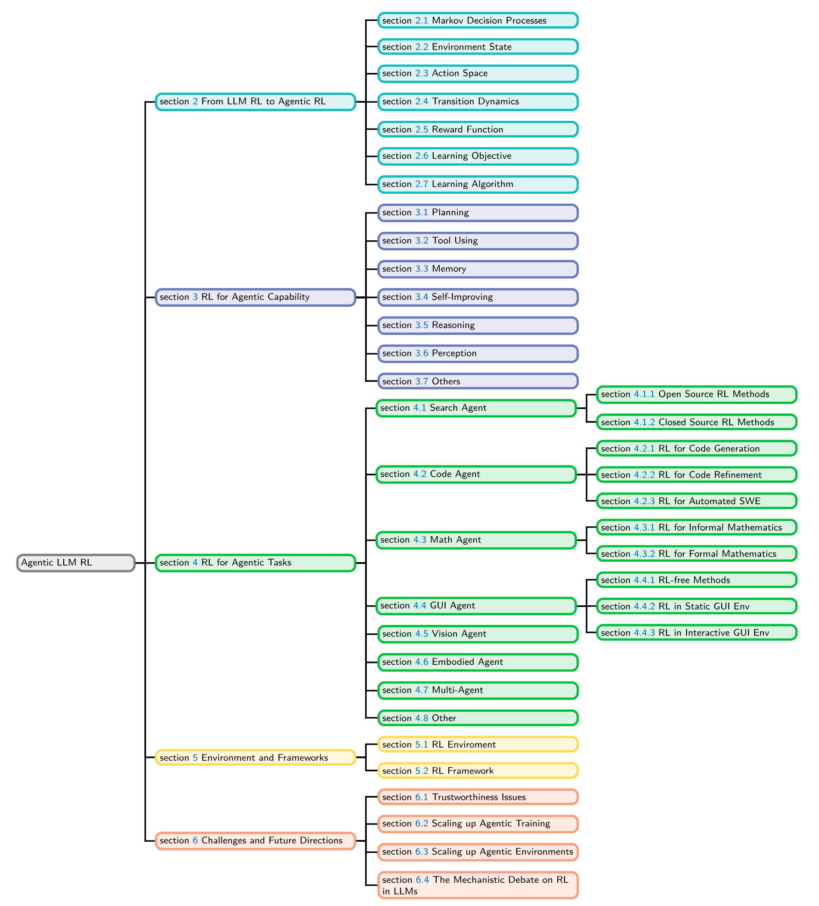

**図 1。** 調査の主要な組織構造。

## 2 予備: LLM RL から Agentic RL へ

LLM はまず、Web から収集したテキストコーパスなどの静的データセットに最尤推定 (MLE) を適用する行動クローニングによって事前学習されます。その後のポストトレーニングは能力を高め、出力を人間の選好に整合させることで、モデルを汎用的な Web データの模倣器以上のものへと変えます。一般的な手法は教師あり微調整 (SFT) であり、人間が作成した (プロンプト, 応答) の実演データでモデルを改善します。しかし、十分な量の高品質な SFT データを用意することは依然として困難です [Mao25a, Sze25, Han25]。強化微調整 (RFT) は、報酬関数を通じてモデルを最適化し、行動実演への依存を回避する代替手段です。

初期の RFT 研究では、中心的な目的は、人間のフィードバック [Chr17, Ouy22a] またはデータの選好 [Raf23] を通じて LLM を最適化し、人間の選好 (RLHF) またはデータの選好 (DPO など) に直接調整することです。 [+1] この **プリファレンスベースの RFT (PBRFT)** には、主に、固定プリファレンス データセットでの LLM の報酬モデル最適化の学習、またはデータプリファレンスを使用した直接実装が含まれます。 OpenAI o1 [Ope24h] や DeepSeek-R1 [Dee25c] などの推論機能を備えた LLM のリリースにより、そのパフォーマンスの向上とクロスドメインの汎用化が広く注目を集めています。自己進化する推論機能とツール使用のサポートの両方を備えた OpenAI o3 [Tea25c] のようなモデルのリリースにより、研究者は強化学習手法を通じて LLM を下流のタスクと深く統合する方法を検討し始めています。その後、研究者らは、固定嗜好データセットの最適化を目的とした PBRFT から、特定のタスクや動的環境に合わせて調整されたエージェント型強化学習に焦点を移しました。

このセクションでは、PBRFT から **エージェント型強化学習 (Agentic RL)** の新しいフレームワークへのパラダイムシフトを形式的に説明します。どちらのアプローチも RL テクニックを活用して LLM のパフォーマンスを向上させますが、基礎となる前提、タスク構造、意思決定の粒度が根本的に異なります。 [図 2](#figure-02) は、LLM RL から Agentic RL へのパラダイムシフトを示しています。

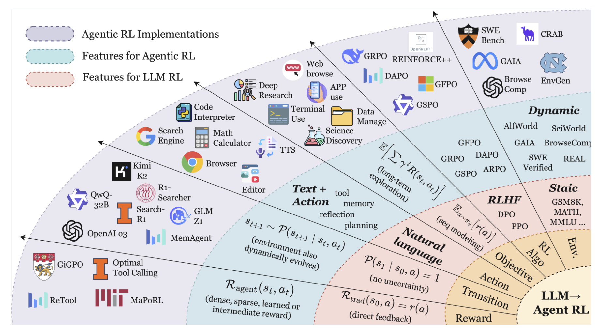

**図 2。** LLM RL から Agentic RL へのパラダイムシフト。 [Kum25] に着想を得ています。扇形のデザインは、従来の RL（内側）から LLM RL、完全な Agentic RL（外側）へと、RL の定式化が外側に広がる様子を表しています。色分けされた領域は以下を表します。 赤 = LLM RL に固有の機能。ティール = Agentic RL に必要な機能。紫 = 既存の Agentic RL 実装。矢印は外側を向いており、よりエージェント型の設定に移行するにつれてインタラクションの範囲 (ツールの使用、Web ブラウジング、動的環境) が増加することを示しています。

### 2.1 マルコフ決定プロセス

RL 微調整プロセスのマルコフ決定プロセス (MDP) は、7 要素タプル $\langle\mathcal{S},\mathcal{O},\mathcal{A},\mathcal{P},\mathcal{R},T,\gamma\rangle$ として形式化できます。ここで、$\mathcal{S}$ は状態空間を表し、$\mathcal{O}$ はエージェントの観察空間を表します。 $\mathcal{A}$ はアクション スペースを示します。 $\mathcal{R}$ は報酬関数として定義され、$\mathcal{P}$ は状態遷移確率をカプセル化し、$T$ はタスク期間を表し、$\gamma$ は割引係数です。選好ベースの RFT とエージェント RL の両方を MDP または POMDP としてキャストすることにより、LLM を静的シーケンス ジェネレーターとして、または動的環境に組み込まれた対話型の意思決定可能なエージェントとして扱うことの理論的意味を明確にします。

**PBRFT。** PBRFT の RL トレーニング プロセスは、タプルによって定義される縮退 MDP として形式化されます。

$$
\langle\mathcal{S}_{\mathrm{trad}},\mathcal{A}_{\mathrm{trad}},\mathcal{P}_{\mathrm{trad}},\mathcal{R}_{\mathrm{trad}},T=1,\gamma=1\rangle.
$$

**エージェント RL。** エージェント RL の RL トレーニング プロセスは、POMDP としてモデル化されます。

$$
\langle\mathcal{S}_{\mathrm{agent}},\mathcal{A}_{\mathrm{agent}},\mathcal{P}_{\mathrm{agent}},\mathcal{R}_{\mathrm{agent}},\gamma,\mathcal{O}\rangle.
$$

ここで、エージェントは状態 $s_{t}\in\mathcal{S}_{\mathrm{agent}}$ に基づいて観測値 $o_{t}=O(s_{t})$ を受け取ります。 PBRFT と Agentic RL の主な違いを [表 1](#table-01) に示します。要約すると、PBRFT は完全な観察の下で固定データセット内の出力文のシーケンスを最適化しますが、Agentic RL は部分的な観察によって特徴付けられる可変環境での意味レベルの動作を最適化します。

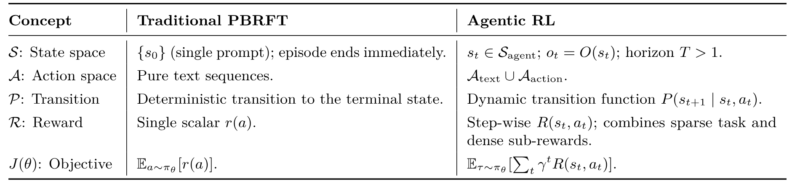

**表 1。** 従来の PBRFT と Agentic RL の正式な比較。

### 2.2 環境の状態

**PBRFT。** トレーニング プロセスでは、各エピソードは単一のプロンプト状態 $s_{0}$ から始まります。エピソードは、モデルが 1 つの応答を出力した直後に終了します。形式的には、基礎となる MDP は、ホライズン $T=1$ の *シングルステップ* 決定問題に縮退します。状態空間は単一の静的なプロンプト入力に縮小されます。

$$
\mathcal{S}_{\mathrm{trad}}=\{\mathrm{prompt}\}.
$$

**エージェント RL。** LLM エージェントは、POMDP の複数のタイムステップにわたって動作します。 $s_{t}\in\mathcal{S}_{\mathrm{agent}}$ が完全なワールド状態を示し、LLM エージェントは現在の状態 $o_{t}=\mathcal{O}(s_{t})$ に基づいて観測値 $O_{t}$ を取得します。 LLM エージェントは、現在の観測値 $o_{t}$ に基づいてアクション $a_{t}$ を選択し、状態は時間の経過とともに変化します。

$$
s_{t+1}\sim P(s_{t+1}\mid s_{t},a_{t}).
$$

エージェントは、取得したツールの結果、ユーザー メッセージ、環境フィードバックなどの中間信号を蓄積します。したがって、相互作用は本質的に動的であり、時間的に拡張されます。

### 2.3 アクションスペース

Agentic RL 設定では、LLM のアクション スペースは 2 つの異なるサブスペースで構成されます。

$$
\mathcal{A}_{\mathrm{agent}}=\mathcal{A}_{\mathrm{text}}\cup\mathcal{A}_{\mathrm{action}}.
$$

ここで、$\mathcal{A}_{\mathrm{text}}$ は、自己回帰デコードによって出力される自由形式の自然言語トークンの空間を示し、一方、$\mathcal{A}_{\mathrm{action}}$ は、出力ストリーム内で通常、特別なトークン `<action_start>` および `<action_end>` によって区切られる、抽象的な非言語アクションの空間を示します。これらのアクションは、タスクの要件に応じて、外部ツール (例: `call("search", "Einstein")`) を呼び出したり、環境 (例: `move("north")`) と対話したりする場合があります。

特に、$\mathcal{A}_{\mathrm{action}}$ は再帰的に構築され、要素 $a\in\mathcal{A}_{\mathrm{action}}$ 自体がプリミティブ アクションのシーケンス $(a_{1},\dots,a_{k})$ を表すことができるため、同じ空間内でプリミティブ アクションと複合アクションが統合されます。

正式には、2 つのサブ空間はセマンティクスと機能的役割が異なります。$\mathcal{A}_{\mathrm{text}}$ は、外部状態を直接変更することなく、人間または機械の解釈を目的とした出力の空間を定義します。一方、$\mathcal{A}_{\mathrm{action}}$ は、(i) ツールの呼び出しを通じて新しい情報を取得する、または (ii) 物理環境またはシミュレートされた環境の状態を変更する、環境対話型の動作の空間を定義します。この区別により、統一方策を統合して、同じ RL 定式化内で言語生成と環境相互作用をモデル化することが可能になります。

### 2.4 遷移ダイナミクス

**PBRFT。** 従来の PBRFT では、遷移ダイナミクスは決定論的です。次のように、アクションが実行されると次の状態が決定されます。

$$
\mathcal{P}(s_{1}\mid s_{0},a)=1,\quad\mathrm{where\ there\ is\ no\ uncertainty.}
$$

**エージェント RL。** エージェント RL では、環境は以下に従って不確実性の下で進化します。

$$
s_{t+1}\sim\mathcal{P}(s_{t+1}\mid s_{t},a_{t}),\quad a_{t}\in\mathcal{A}_{\mathrm{text}}\cup\mathcal{A}_{\mathrm{action}}.
$$

テキスト アクション $(\mathcal{A}_{\mathrm{text}})$ は、環境状態を変更せずに自然言語出力を生成します。 `<action_start>` と `<action_end>` で区切られた構造化アクション $(\mathcal{A}_{\mathrm{action}})$ は、外部ツールにクエリを実行したり、環境を直接変更したりできます。この逐次的な定式化は、PBRFT のワンショット マッピングとは対照的で、通信、情報取得、環境操作を繰り返し組み合わせる方策を可能にします。

### 2.5 報酬関数

**PBRFT。** PBRFT は一般に、検証可能な応答の正しさを備えた報酬関数を特徴とし、ルールベースの検証器 [Dee25c] またはニューラル ネットワークでパラメーター化された報酬モデル [Zho25b] のいずれかを使用して実装できます。実装アプローチに関係なく、そのコアは次の方程式に従います。

$$
\mathcal{R}_{\mathrm{trad}}(s_{0},a)=r(a).
$$

ここで、$r:\mathcal{A}\!\to\!\mathbb{R}$ は、人間または AI の選好モデルによって提供される、中間フィードバックなしのスカラー スコアです。

**エージェント RL。** LLM エージェントの報酬関数は、ダウンストリーム タスクに基づいています。

$$
\mathcal{R}_{\mathrm{agent}}(s_{t},a_{t})=\begin{cases}r_{\mathrm{task}}&\mathrm{on\ task\ completion},\\[2.0pt]
r_{\mathrm{sub}}(s_{t},a_{t})&\mathrm{for\ step\!-\!level\ progress},\\[2.0pt]
0&\mathrm{otherwise}.\end{cases}
$$

密、疎、または学習された報酬 (*例* 単体テストの合格、シンボリック検証の成功) を許可します。

### 2.6 学習目標

**PBRFT。** PBRFT の最適化の目的は、ポリシー $\pi_{\theta}$ に基づいて応答報酬を最大化することです。

$$
J_{\mathrm{trad}}(\theta)=\mathbb{E}_{a\sim\pi_{\theta}}\bigl[r(a)\bigr].
$$

割引率は不要であり、最適化は期待報酬を最大化する系列モデリングに相当します。

**エージェント RL。** エージェント RL の最適化の目的は、割引された報酬を最大化することです。

$$
J_{\mathrm{agent}}(\theta)=\mathbb{E}_{\tau\sim\pi_{\theta}}\left[\,\sum_{t=0}^{T-1}\gamma^{t}R_{\mathrm{agent}}(s_{t},a_{t})\right],\qquad 0\lt\gamma\lt1.
$$

この目的は、探索と長期的な信用割当を伴う方策勾配法または価値ベース法によって最適化されます。

PBRFT は、明示的な計画、ツール利用、環境フィードバックを伴わない 1 ターンのテキスト品質アライメントに焦点を当てます。一方、Agentic RL は複数ターンの計画、適応的なツール呼び出し、状態を保持する記憶、長期的な信用割当を扱い、LLM が自律的な意思決定エージェントとして機能できるようにします。

### 2.7 RL アルゴリズム

現代の研究では、RL アルゴリズムは、PBRFT フレームワークとエージェント RL フレームワークの両方において極めて重要なコンポーネントを構成しています。さまざまな RL アルゴリズムは、異なるサンプル効率とパフォーマンス特性を示し、それぞれがモデルの出力を複雑で多くの場合主観的な人間の目標に合わせるという中心的な課題に対する独自のアプローチを提供します。 REINFORCE、PPO [Sch17a]、GRPO [Dee25c]、DPO [Raf23] などの標準メソッドは、一般的な方策勾配から特殊なプリファレンス学習までのスペクトルを形成します。次に、これら 4 つの古典的なアルゴリズムをそれぞれ紹介し、各ファミリーの一般的なバリアントの比較を [表 2](#table-02) に示します。

**REINFORCE: 基礎的な方策勾配** 初期の方策勾配アルゴリズムの 1 つである REINFORCE [Wil92] は、確率的方策をトレーニングするための基礎理論を提供します。これは、高い累積報酬につながるアクションの確率を高め、低い報酬につながるアクションの確率を下げることによって機能します。その目的関数は次の式で与えられます。

$$
\nabla_{\theta}J(\theta)=\mathbb{E}_{s_{0}}\left[\frac{1}{N}\sum_{i=1}^{N}\left(\mathcal{R}(s_{0},a^{(i)})-b(s_{0})\right)\nabla_{\theta}\log\pi_{\theta}(a^{(i)}|s_{0})\right].
$$

ここで、$a^{(i)}\sim\pi_{\theta}(a|s_{0})$ は $i$ 番目にサンプリングされた応答、$\mathcal{R}(s_{0},a)$ はタスク完了時に得られる最終報酬、$b(s)$ は方策勾配推定の分散を抑えるベースライン関数です。一般に、$b(s)$ には確率変数を含む任意の関数を使えます。実際には、$b(s)$ として通常は価値関数 $V(s)$ が用いられます。REINFORCE は式が簡潔で実装しやすい一方、勾配推定の分散が大きく、サンプル効率が低く、学習率に敏感で、critic（価値推定器）を持たないという欠点があります。

**近接ポリシー最適化 (PPO)** PPO [Sch17a] は、その安定性と信頼性により、LLM アライメントの主要な RL アルゴリズムになりました。破壊的な大規模なポリシー変更を防ぐために更新ステップを制限することにより、バニラ ポリシーの勾配が改善されています。その主なクリップされた目的関数は次のとおりです。

$$
L_{\mathrm{PPO}}(\theta)=\frac{1}{N}\sum_{i=1}^{N}\min\left(\frac{\pi_{\theta}(a_{t}^{(i)}|s_{t})}{\pi_{\theta_{old}}(a_{t}^{(i)}|s_{t})}A(s_{t},a_{t}^{(i)}),\;\;\mathrm{clip}\left(\frac{\pi_{\theta}(a_{t}^{(i)}|s_{t})}{\pi_{\theta_{old}}(a_{t}^{(i)}|s_{t})},1-\epsilon,1+\epsilon\right)A(s_{t},a_{t}^{(i)})\right).
$$

ここで、$a_{t}^{(i)}\sim\pi_{\theta_{old}}(a|s_{t})$ は、更新が遅れている古いポリシー $\pi_{\theta_{old}}$ からの $i$ 番目にサンプリングされた応答です。 $A_{t}$ は、次によって得られる推定利点です。

$$
A(s_{t},a_{t})=\mathcal{R}(s_{t},a_{t})-V(s_{t}).
$$

ここで、$V_{\theta}(s)$ は学習される価値関数、すなわち期待値 $\mathbb{E}_{a\sim\pi_{\theta}(a|s)}[\mathcal{R}(s,a)]$ です。通常は方策ネットワークと同程度の大きさを持つ critic ネットワークから得られますが、必須ではありません。クリップ項は確率比が 1 から離れすぎるのを防ぎ、更新を安定させます。アドバンテージ関数の推定は PPO の性能を大きく左右します。近年の変種は、アドバンテージ推定のバイアス [Kaz24] や分散 [Yue25a] の低減、方策更新の安定化 [Liu25s]、疎な報酬の緩和 [Dai25] に取り組んでいます。それでも、アドバンテージ推定に別の critic ネットワークが必要で、学習時のパラメータ数が大幅に増えるという問題は残ります。

**直接嗜好最適化 (DPO)** DPO は、別個の明示的な報酬モデルの必要性を完全にバイパスすることにより、画期的なシフトを表します。これは、KL 制約の下で報酬を最大化する問題を、人間の選好データに基づいた尤度ベースの目標として再構成します。選好データセット $D=\{(y_{w},y_{l})\}$ のデータセット ($y_{w}$ が選好応答、$y_{l}$ が非選好応答) の場合、DPO 損失は次のようになります。

$$
L_{\mathrm{DPO}}(\pi_{\theta};\pi_{ref})=-\mathbb{E}_{(x,y_{w},y_{l})\sim D}\left[\log\sigma\left(\beta\log\frac{\pi_{\theta}(y_{w}|x)}{\pi_{ref}(y_{w}|x)}-\beta\log\frac{\pi_{\theta}(y_{l}|x)}{\pi_{ref}(y_{l}|x)}\right)\right].
$$

ここで、$\pi_{ref}$ は参照方策（通常は初期 SFT モデル）、$\beta$ はハイパーパラメータです。DPO は critic を不要にしますが、性能は静的な選好データセットの品質と範囲に本質的に依存します。この制約に対処するため、外部データやオンラインデータ [Eth24, Hon24] を取り入れる変種が提案されています。より一般的な最適化目的 [Aza24] や、改良された暗黙的報酬機構 [Men24, Lai24, Hon25] を導入する研究もあります。

**Group Relative Policy Optimization（GRPO）** DeepSeek [Guo25b] の成功を受け、GRPO への研究関心が高まりました。PPO における大規模な critic の非効率性に対処するため、GRPO は軽量な評価方式を導入します。応答をグループ単位で扱い、グループ内の相対報酬からアドバンテージを計算するため、絶対価値を推定する critic が不要になります。GRPO の中核的な目的は次のように表せます。

$$
L_{\mathrm{GRPO}}=\frac{1}{G}\sum_{g=1}^{G}\min\left(\frac{\pi_{\theta}(a_{t}^{(g)}|s_{t}^{(g)})}{\pi_{\theta_{old}}(a_{t}^{(g)}|s_{t}^{(g)})}\hat{A}(s_{t}^{(g)},a_{t}^{(g)}),\;\;\mathrm{clip}\left(\frac{\pi_{\theta}(a_{t}^{(g)}|s_{t}^{(g)})}{\pi_{\theta_{old}}(a_{t}^{(g)}|s_{t}^{(g)})},1-\epsilon,1+\epsilon\right)\hat{A}(s_{t}^{(g)},a_{t}^{(g)})\right).
$$

ここで、出力 $\{(s_{0}^{(g)},a_{0}^{(g)},\ldots,s_{T-1}^{(g)},a_{T-1}^{(g)})\}_{g=1}^{G}$ のグループは、古いポリシー $\pi_{\theta_{old}}$ からサンプリングされます。有利関数は次のように推定されます。

$$
\hat{A}(s_{t},a_{t})=\frac{\mathcal{R}(s_{t},a_{t})-\mathrm{mean}(\mathcal{R}(s_{t}^{(1)},a_{t}^{(1)}),\ldots,\mathcal{R}(s_{t}^{(G)},a_{t}^{(G)}))}{\mathrm{std}(\mathcal{R}(s_{t}^{(1)},a_{t}^{(1)}),\ldots,\mathcal{R}(s_{t}^{(G)},a_{t}^{(G)}))}.
$$

このグループ相対アプローチはサンプル効率が高く、計算オーバーヘッドが削減されます。ただし、グループベースの利点の推定は、高い分散と低い精度に対して脆弱です。その結果、利点の推定を大幅に改善することを目的として、GRPO フレームワークから派生した一連の新しいアルゴリズムがその後提案されました ([表 2](#table-02) を参照)。

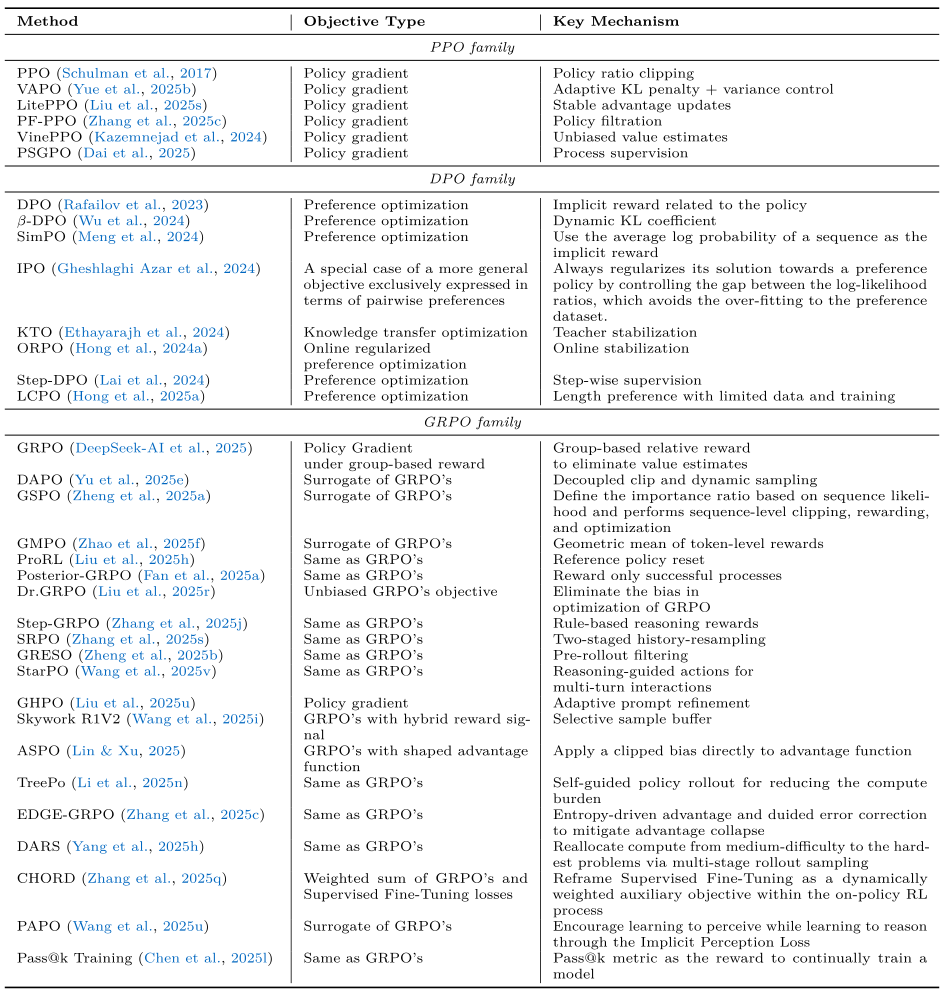

**表 2。** PPO、DPO、および GRPO ファミリの一般的なバリアントの比較。 Clip は、安定した更新を保証するためにポリシー比率が 1 から離れすぎることを防ぐことに対応します。 KL ペナルティは、整合性を確保するために、学習された方策と参照ポリシーの間の KL の相違にペナルティを与えることに対応します。

## 3 Agentic RL: モデル機能の観点

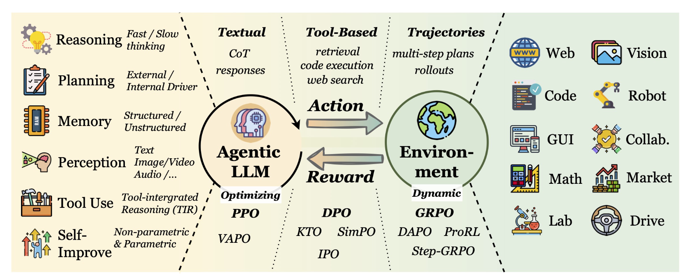

**図 3。** エージェントと環境の相互作用とエージェント LLM の RL ループ。コア エージェント機能がアクション生成を推進し、環境がフィードバックと報酬を提供します。それらは、さまざまなタスク ドメインにわたる RL ベースの最適化を通じて集約されます (「コラボ」とは、明示的なタスク分割とマルチ エージェントの調整が必要なタスクを示します)。

本節では、**Agentic RL** を、主要な能力またはモジュールから成る自律エージェントを体系的に訓練する枠組みとして概念的に捉えます。対象となるのは、計画 ([第 3.1 節](#section-3-1))、ツール使用 ([第 3.2 節](#section-3-2))、メモリ ([第 3.3 節](#section-3-3))、自己改善 ([第 3.4 節](#section-3-4))、推論 ([第 3.5 節](#section-3-5))、知覚 ([第 3.6 節](#section-3-6))、その他の能力 ([第 3.7 節](#section-3-7)) であり、古典的な LLM エージェントの定義 [Wen23, Sha25b] に従います。[図 5](#figure-05) にその構成を示します。従来のエージェントは、LLM に計画 (*例*、タスク分解と計画選択) [Wei25a]、推論 (思考連鎖またはマルチターン推論) [Zha24q]、外部ツール呼び出し [Qin24e]、長期・短期メモリ、反復的なリフレクションを組み合わせ、自己修正と行動改善を行います。Agentic RL は、これらを静的なパイプラインではなく、共同最適化できる相互依存の方策として扱います。計画の RL は多段階の意思決定軌跡を学習し、メモリの RL は検索と符号化のダイナミクスを形成し、ツール使用の RL は呼び出しのタイミングと忠実度を最適化し、リフレクションの RL は内部の自己監督と自己改善を促します。以下の各節では、RL が計画、ツール使用、メモリ、リフレクション、推論をどのように強化するかを体系的に検討します。ここでの目的は、関連研究を網羅的に列挙することではなく、エージェント能力に対する RL の応用を高い水準で概念整理することです。関連研究の詳細は[第 4 節](#section-4)で扱います。

### 3.1 計画

目標を達成するための一連の行動についての熟慮である計画は、人工知能の基礎を構成し、複雑な推論、世界の知識、適応性が要求されます [New58]。初期の取り組みでは、プロンプトベースのメソッド [Hua24d, Yao23b] を通じて、LLM の本来の機能を活用しました。たとえば、Modular Agentic Planner (MAP) [Web25] は、計画を競合監視、状態評価、調整のための特殊な LLM モジュールに分解する、脳からインスピレーションを得たモジュール式アーキテクチャを導入しています。しかし、これらのアプローチには、[Wei25a] の経験を通じて適応するメカニズムが欠けていました。 RL は、このギャップに対処する強力なパラダイムとして登場し、エージェントが環境フィードバックから学習して計画戦略を洗練できるようにします。エージェント計画への RL の統合は、RL が構造化計画プロセスへの **外部ガイド**として機能するか、または LLM の本質的な計画方策を直接展開する **内部ドライバー**として機能するかによって区別される 2 つの異なるパラダイムに現れます。これについては、以下で詳しく説明します。

**計画のための外部ガイドとしての RL。** 1 つの主要なパラダイムは、RL を計画プロセスへの外部ガイドとして枠組み付けます。LLM の主な役割は、構造化された検索フレームワーク内で潜在的なアクションを生成することです。ここで、RL は LLM の生成機能を直接微調整するために使用されるのではなく、補助値またはヒューリスティック関数 [Wei25a] をトレーニングするために使用されます。この学習された関数は、さまざまな計画軌道の品質を評価することによって、モンテカルロ ツリー検索 (MCTS) などの古典的な検索アルゴリズムをガイドします。 RAP [Hao23] や LATS [Zho24e] などの代表的な研究は、このアプローチの例です。検索なしの計画 [Hon25c] は、オフラインの目標条件付き RL を活用して、LLM のパラメーターを更新せずに LLM の推論と計画を導く言語ベースの価値批評を学習することで、このアイデアを拡張します。この構成では、LLM は知識豊富なアクション提案者として機能し、RL は効率的な探索のための適応的で評価的なフィードバックを提供します。静的なガイダンスを超えて、[Pag25] は、動的計画を RL 主導のテスト時間の計算割り当て問題として定式化し、推論パフォーマンスと計算コストのバランスを取るために明示的な計画をいつ呼び出すかを決定するようエージェントをトレーニングします。逆に、MAPF-DT [Ata25] は逆の方向を模索し、分散型マルチエージェント パス プランニングに Decision Transformer ベースのオフライン RL を採用し、動的環境における適応性と長期的な効率を強化する LLM ガイダンスを備えています。

**計画の内部推進者としての RL。** 2 番目のより統合されたパラダイムでは、RL をエージェントの中核となる計画機能の内部推進者として位置づけます。このアプローチは、LLM を政策モデルとして直接キャストし、環境との直接的な相互作用を通じてその計画動作を最適化します。外部の検索アルゴリズムをガイドする代わりに、試行錯誤による RL ベースのフィードバックを使用して、計画を生成するための LLM の内部方策を直接調整します。これは、ETO [Son24a] に見られる成功と失敗の軌跡で DPO を活用するなど、RLHF から派生した方法や、生涯学習フレームワークを通じて達成されます。たとえば、VOYAGER [Wan24m] は、環境との相互作用からスキル ライブラリを繰り返し構築し、改良します。このパラダイムは、LLM を静的ジェネレーターから継続的に進化する適応方策に変換し、動的環境における堅牢性と自律性を強化します。補完的な方向として、動的投機的プランニング (DSP) [Gua25b] は、エージェントの方策を適応させてレイテンシーと運用コストを共同で最適化するオンライン強化メカニズムを具体化しており、内部ポリシーの改良がタスクの成功だけでなくシステム効率も制御できることを実証しています。 RLTR [Li25s] は、計画を回答生成から切り離し、アクション シーケンスの品質を直接評価するツール使用報酬を導入することで、検証可能な最終回答に依存せずにエージェントの計画能力を集中的に最適化できるようにします。 AdaPlan とその PilotRL フレームワーク [Lu25d] は、プログレッシブ RL を備えたグローバル プラン ベースのガイダンスを活用して、AFLWorld や TextCraft などのテキスト ゲーム環境における LLM エージェントの長期的な計画と実行の調整を強化します。 Planner-R1 [Zhu25g] は、Agentic RL の報酬密度効果を調査し、成形されたプロセス レベルの報酬が学習効率を著しく向上させ、より小規模なモデルが競争力のある計画能力を達成できることを示しています。

**展望: 熟議と直観の総合。** エージェント型計画の展望の地平は、これら 2 つのパラダイムの総合にあり、外部探索と内部ポリシー最適化の区別を超えて進みます。最終的な目標は、**構造化された検索プロセス自体を内部化**し、直感的で高速な計画生成と、意図的でゆっくりとした検討的な推論をシームレスに融合するエージェントを開発することです。このようなモデルでは、RL は最終計画を洗練するだけでなく、熟慮プロセスを管理するメタポリシーも最適化します。つまり、いつ代替の道を探索するか、見込みのない枝をどのように剪定するか、そして行動にコミットする前にどの程度深く推論するかを学習します。これにより、LLM エージェントは、アクションを提案したり生の方策として機能するコンポーネントから、統合された推論エンジンに変換されます。

### 3.2 ツールの使用

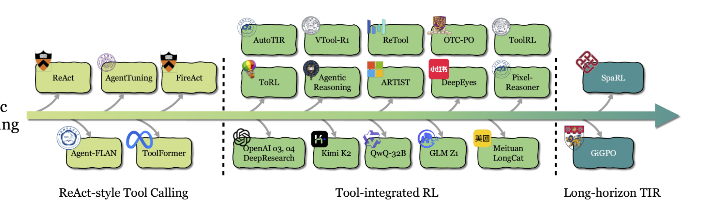

**図 4。** エージェント ツールの使用の発展。ここでは、進捗状況を反映するために、代表的な研究のほんの一部のみを選択していることに注意してください。

RL は、ポストホックな ReAct スタイルのパイプラインから、深くインターリーブされたマルチターンのツール統合推論 (TIR) システムまで、ツール対応言語エージェントを進化させるための極めて重要な方法論として登場しました。初期のパラダイムはツール呼び出しの実現可能性を実証することに成功しましたが、SFT やプロンプト エンジニアリングへの依存により、エージェントが静的パターンを模倣することに限定され、新しいシナリオに適応したり、エラー [Che24m, Kav25] から回復したりするための戦略的な柔軟性が欠けていました。 Agentic RL は、学習パラダイムを模倣から結果主導型の最適化にシフトすることでこの問題に対処し、エージェントがいつ、どのように、どのツールを導入するかを自律的に発見できるようにします。この進化は明確な軌跡を描いており、それを 3 つの段階で調査します。まず、(1) 初期の ReAct スタイルのツール呼び出しから始まり、次に (2) 認知ループ内にツールの使用を深く埋め込む現代のツール統合推論 (TIR) を検討し、最後に、堅牢で長期的なパフォーマンスのための時間的信用割当に焦点を当てて、(3) マルチターン TIR の予想される課題について議論します。

**ReAct スタイルのツール呼び出し。** ツール呼び出しの初期のパラダイムは、主に、ツールの使用行動を引き出すためにプロンプト エンジニアリングまたは SFT のいずれかに依存していました。 ReAct [Yao23b] に代表される **(I) プロンプト エンジニアリング** アプローチは、少数ショットのサンプルを活用して、LLM が「思考-行動-観察」サイクル内で推論トレースとアクションをインターリーブするようにガイドし、モデルのコンテキスト内学習能力を活用しました。さらに、モデルのツール使用機能を内部化するために、**(II) SFT ベースの手法**が導入されました。 Toolformer [Sch23] のようなフレームワークは、モデルに API 呼び出しを挿入する場所を教えるために自己教師型目標を採用していますが、FireAct [Che23d]、AgentTuning [Zen24a]、Agent-FLAN [Che24n] などの他のフレームワークは、専門家が生成または厳選したツールインタラクション軌跡のデータセット (例: AgentBank [Son24]、 APIバンク [Li23u]）。 SFT によりツール呼び出しの信頼性は向上しましたが、これらの初期のアプローチはどちらも模倣的な性質によって根本的に制約を受けています。事前に定義された静的なツール使用パターンを再現するようにエージェントを訓練するため、新しいシナリオに適応したり、予期せぬエラーから回復したりするための戦略的な柔軟性が欠けています。RL 中心のアプローチでは、学習目標を模倣から結果主導型の最適化に移行することで直接対処できる制限があります。

**ツール統合型 RL。** 純粋に模倣的なパラダイムの制限に基づいて、ツールを使用するための RL ベースのアプローチは、目的を固定パターンの複製からエンドタスクのパフォーマンスの最適化に移します。この移行により、エージェントはツールを「いつ」、「どのように」、「どの組み合わせ」で呼び出すかを「戦略的に」決定し、新しいコンテキストや予期せぬ障害に動的に適応できるようになります。基礎として、ToolRL [Qia25] などのフレームワークは、模倣トレースのないベース モデルから初期化された場合でも、RL トレーニングにより、欠陥のあるコードの自己修正、呼び出し頻度の適応調整、複雑なサブタスク用の複数のツールの構成などの創発的能力を引き出すことができることを実証しています。その後、最近の研究の急増により、OTC-PO [Wan25p]、ReTool [Fen25a]、AutoTIR [Wei25c]、VTool-R1 [Wu25j]、DeepEyes [Zhe25h]、Pixel-Reasoner [Su25]、Agentic Reasoning [Wu25h]、ARTIST などの研究が生み出されました。 [Sin25a]、ToRL [Li25o]、およびその他多数の研究 [Hao25, Fen24a, Wei25f, Li25h, Wu25d, Li25k, Che25i, Son25d, Ye25a] は、単一のロールアウト内でシンボリック計算 (コード実行、画像編集など) と自然言語推論をインターリーブする RL 方策を採用しています。この統合された制御ループにより、エージェントはツールを介した正確な操作と柔軟な言語的推論のバランスをとり、進化するタスクの状態に合わせて推論プロセスを調整することができます。 [Xu25] は、決定論的なツール駆動の状態遷移を導入することで、TIR が純テキスト RL の「見えない鎖」を超えて LLM 機能を根本的に拡張し、有限の予算の下での実現可能性に関するトークン効率の議論を確立し、エージェント ツールの使用を安定的に導くための Advantage Shaping Policy Optimization (ASPO) を提案することを理論的に証明しています。

現在、このようなツールに統合された推論は、もはやニッチな機能ではなく、高度なエージェント モデルのベースライン機能となっています。 OpenAI の DeepResearch や o3 [Ope25e]、Kimi K2 [Kim25d]、Qwen QwQ-32B [Tea25j]、Zhipu GLM Z1 [Ai25a]、Microsoft rStar2-Agent [Sha25a]、Meituan LongCat [Mei25] などの成熟した商用およびオープンソース システムには、これらの RL で研ぎ澄まされたシステムが日常的に組み込まれています。これは、ツール拡張インテリジェンスにおける結果主導型の最適化の中心性を強調しています。

**将来: 長期的な TIR。** ツールに統合された RL は、単一の推論ループ内のアクションを最適化するのに効果的であることが証明されていますが、主なフロンティアは、この機能を複数ターンの推論 [Gao25d] を必要とする堅牢な長期的なタスクに拡張することにあります。この飛躍は、一時的な信用割当 [Pig24] の課題によって根本的にボトルネックになっています。現在の RL アプローチは、まばらな軌跡レベル/結果ベースの報酬に依存することが多く、相互依存する長いシーケンスの中でどの特定のツールの呼び出しが成功または失敗に寄与したかを正確に特定することが困難です。 GiGPO [Fen25b] や SpaRL [Wan25m] でのターンレベルのアドバンテージ推定など、より詳細な報酬スキームの探索が初期の研究で開始されていますが、これらはまだ初期段階です。したがって、有用な探索を誤って罰したり、報酬ハッキングを促進したりすることなく、複雑な意思決定チェーンを通じてエージェントを正確にガイドできる、よりきめ細かい信用割当メカニズムを開発することは、エージェント システムを進化させる上で依然として重要かつほとんど未解決の問題です。

### 3.3 メモリ

Agentic RL は、メモリ モジュールをパッシブ データ ストアから動的な RL 制御のサブシステムに変換し、何を保存するか、いつ取得するか、人間の [Wu25n] と同様に忘れる方法を決定します。このセクションでは、この進化を 4 つの代表的な段階を通して追跡します。

**RAG スタイル メモリの RL。** 初期のシステム (*例* 検索拡張生成) はメモリを外部データストアとして扱いました。 RL が採用されたときは、クエリを実行するタイミングのみを規制していました。 MemoryBank [Zho24d]、MemGPT [Pac23a]、HippoRAG [Gut24] など、RL が関与しないいくつかの古典的なメモリ システムは、情報を *保存*、*統合*、*取得*する方法を指定する事前定義されたメモリ管理戦略を採用しています (*例*、ベクトル データベースまたはナレッジ グラフを介した保存、意味論的な類似性またはトポロジー接続に基づく取得)。その後、RL が機能モジュールとしてメモリ管理パイプラインに組み込まれました。注目すべき例は、[Tan25b] で提案されているフレームワークです。このフレームワークでは、RL 方策が *将来志向のリフレクション* (マルチレベルの要約) と *回顧的リフレクション* (検索結果の強化) を通じて検索動作を調整します。それにもかかわらず、メモリ媒体自体は静的なままであり (*例*、単純なベクトル ストアやサマリー バッファ)、エージェントは書き込みプロセスを制御しませんでした。最近、Memory-R1 [Yan25f] は、RL ベースのメモリ拡張エージェント フレームワークを導入しました。このフレームワークでは、メモリ マネージャーが下流の QA パフォーマンスに基づいて PPO または GRPO を介して構造化操作 (ADD/UPDATE/DELETE/NOOP) を実行する方法を学習し、Answer Agent は RAG で取得したエントリに対してメモリ蒸留方策を採用して推論して回答します。 Mem-$\alpha$ [Wan25ae] や Memory-as-action [Zha25aj] などの後続研究でも、エージェントを自動メモリ マネージャーにトレーニングするための RL が検討されています。

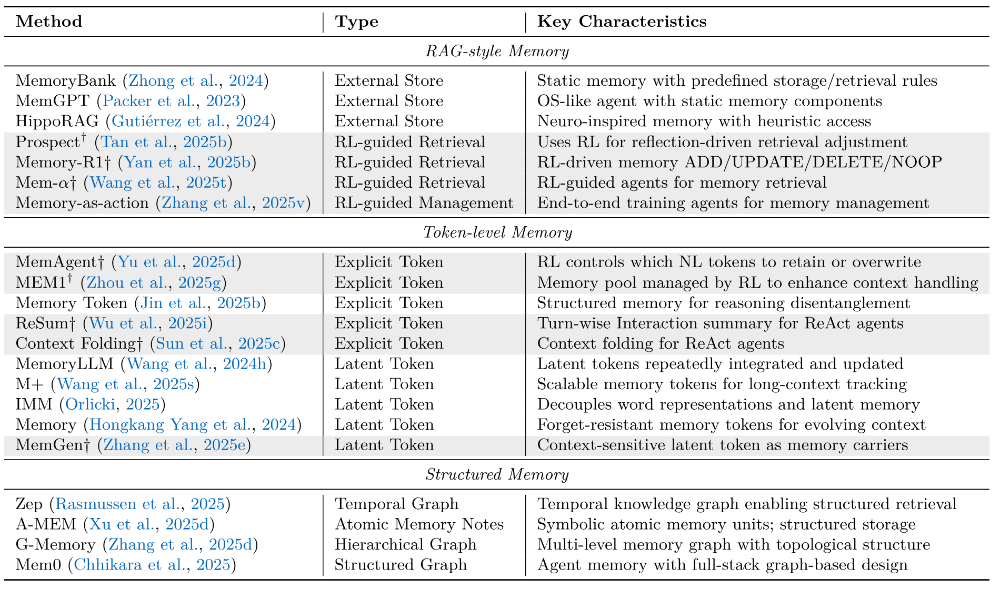

**表 3。** エージェントの記憶の 3 つの古典的なカテゴリの概要。 *†* の付いた研究は RL を直接使用しています。ここのリストはすべてを網羅したものではないため、より広範なエージェント メモリに興味のある読者は [Wu25n] を参照してください。影付きの行は、強化学習アルゴリズムの使用を示します。

**トークン レベル メモリの RL。** その後の進歩により、明示的でトレーニング可能なメモリ コントローラーを備えたモデルが導入され、エージェントが固定の外部メモリ システムに依存せずに自身のメモリ状態 (多くの場合トークン形式で保存される) を制御できるようになりました。特に、このようなメモリは通常 2 つの形式でインスタンス化されます。 1 つ目は **(I) 明示的なトークン ** で、人間が読める自然言語に対応します。たとえば、MemAgent [Yu25f] では、エージェントは LLM と並行して自然言語メモリ プールを維持し、各セグメントでどのトークンを保持または上書きするかを決定する RL 方策を使用して、長いコンテキストの入力を簡潔で有益な概要に効果的に圧縮します。同様のアプローチには、MEM1 [Zho25i] およびメモリ トークン [Jin25c] があり、どちらも自然言語メモリ表現のプールを明示的に保存します。より頻繁に、ReSum [Wu25l] やコンテキスト フォールディング [Sun25d] などの研究でも、コンテキスト メモリ管理のための RL が検討されています。 2 番目の形式は **(II) 暗黙的トークン ** で、メモリは潜在的な埋め込みの形式で維持されます。代表的なものとしては、MemoryLLM [Wan24t] および M+ [Wan25ad] があり、潜在トークンの固定セットが「メモリ トークン」として機能します。コンテキストが進化するにつれて、これらのトークンは繰り返し取得され、LLM の前方計算に統合され、更新されるため、コンテキスト情報が保存され、忘却に対する強い耐性が示されます。明示的なトークンとは異なり、これらのメモリ トークンは人間が読めるテキストに関連付けられておらず、マシンネイティブの形式のメモリを構成します。関連する取り組みには、IMM [Orl25] およびメモリ [Yan24i] が含まれます。両方のパラダイムにわたって、これらのアプローチにより、エージェントはメモリ バンクを自律的に管理できるようになり、長期コンテキストの理解、継続的な適応、自己改善が大幅に向上します。 MemGen [Zha25p] は、経験的知識の伝達と生成に潜在記憶トークンを活用するパラダイムを初めて提案し、RL ベースの潜在記憶に有望な方向性を提示しています。

**将来: 構造化メモリの RL。** トークン レベルのアプローチに基づいて、最近の傾向は、フラットなトークン シーケンスを超えて情報を編成およびエンコードする「構造化」メモリ表現に移行しています。代表的な例としては、Zep [Ras25] の時間知識グラフ、A-MEM [Xu25d] のアトミック メモリ ノート、G-Memory [Zha25o] および Mem0 [Chh25] の階層グラフベースのメモリ設計などがあります。これらのシステムは、より豊富な関係的、時間的、または階層的な依存関係をキャプチャし、より正確な検索と推論を可能にします。しかし、挿入、削除、抽象化、リンク更新に及ぶそれらの管理は、これまで手作りのルールまたはヒューリスティック戦略によって管理されてきました。これまで、このような構造化メモリの構築、改良、進化を動的に制御するための RL の使用を検討した研究はほとんどなく、これはエージェント記憶機能を進歩させるためのオープンで有望な方向性となっています。

### 3.4 自己改善

LLM エージェントが進化するにつれて、最近の研究では継続的な反省のメカニズムとして RL がますます重視されており、これによりエージェントは計画、推論、ツールの使用、記憶 [Gao25c] にわたる自身の間違いから学ぶことができます。これらのシステムは、データ駆動型のトレーニング フェーズや静的報酬モデルのみに依存するのではなく、プロンプト レベルのヒューリスティックから本格的な RL コントローラーに至るまで、*反復的な自己生成フィードバック ループ*を組み込んで、エージェントを継続的な自己改善に導きます。

**言語的自己修正の RL。** この系統の初期の手法では、*言語強化学習*とも呼ばれるプロンプトベースのヒューリスティックを利用していました。エージェントは、勾配更新を行わずに単一の推論パス内で、回答を生成し、その潜在的な誤りを言語的に反映し、その後洗練された解決策を生成します。代表的な例には、リフレクション [Shi23c]、自己調整 [Mad23]、CRITIC [Gou24]、検証連鎖 [He24c] などがあります。たとえば、Self-Refine [Mad23] プロトコルは、生成、フィードバック、改良のための 3 つの異なるプロンプトを使用して出力を反復的に磨き上げるよう LLM に指示し、推論やプログラミングなどのドメイン全体で効果的であることが証明されています。このような自己反映の有効性と堅牢性を高めるために、いくつかの異なる戦略が開発されました。**(I) マルチ サンプリング**。これには、モデルの分布からサンプリングすることによって複数の出力ロールアウトを生成することが含まれます。複数の試行からの批判や解決策を集約することで、エージェントは内省の一貫性と質を向上させることができます。この方法は、If-or-Else [Li24m]、UALA [Han24a]、マルチエージェント検証 [Lif25] などの研究で広く研究されています。このアプローチは概念的にテスト時間のスケーリング手法に似ているため、詳細については [Pig24] を参照してください。 **(II) 構造化されたリフレクション ワークフロー** は、最終的な答えに対するモノリシックなリフレクションを促すのではなく、より専用で粒度の高いワークフローを規定します。たとえば、検証チェーン [He24c] は、プロセスを個別の「取得、再考、改訂」段階に手動で分解します。 **(III) 外部ガイダンス**。外部ツールを組み込むことにより、検証可能で客観的なフィードバックを反映プロセスの基盤とします。これらのツールには、セルフ デバッグ [Che24l] にあるコード インタプリタ、Luban [Guo24b] の CAD モデリング プログラム、T1 [Kan25a] の数学的計算機、段階的報酬モデル [Xio25]、およびツール対話型の批評メカニズム [Gou24] が含まれます。

**自己修正を内面化するための RL。** 言葉による自己修正は強力な推論時間テクニックを提供しますが、その改善は一時的であり、1 回のセッションに限定されます。より持続的で汎化可能な自己改善能力を身につけさせるために、その後の研究では、勾配ベースの更新を伴う RL を採用して、これらのリフレクションのフィードバックループをモデルのパラメーターに直接内部化し、モデル自身のエラーを特定して修正するモデル本来の能力を根本的に強化しました。このパラダイムは複数のドメインに適用されています。たとえば、KnowSelf [Qia25b] は DPO と RPO [Pan24d] を活用して、テキストベースのゲーム環境におけるエージェントの自己反映機能を強化します。一方、Reflection-DPO [Pat25b] はユーザーとエージェントの対話シナリオに焦点を当て、エージェントが内省的な推論を通じてユーザーの意図をより適切に推測できるようにします。 DuPo [She25] は、デュアルタスク フィードバックを備えた RL を採用して、アノテーションなしの最適化を可能にし、翻訳、推論、再ランキングの各タスクにわたる LLM エージェントの自己修正を強化します。 SWEET-RL [Zho25g] と ACC-Collab [Est25a] は、上記の研究とは若干異なる設定を採用しています。外部クリティックモデルをトレーニングして、アクター エージェントのアクションに対して高品質な改訂提案を提供します。それにもかかわらず、基本的な原則は依然として密接に一致しています。

**反復的自己トレーニングのための RL。** エージェントの完全な自律性を目指して、3 番目の最も高度なクラスのモデルは、リフレクション、推論、タスク生成を自律的なループに組み合わせ、人間がラベル付けしたデータを使用せずに無制限の自己改善を可能にします。これらの方法は、学習ループのアーキテクチャによって区別できます。 **(I) セルフプレイおよび検索ガイドによる洗練**。これは、AlphaZero のような古典的な RL パラダイムをエミュレートします。たとえば、R-Zero [Hua25a] は、モンテカルロ ツリー検索 (MCTS) を採用して推論ツリーを探索し、検索結果を使用してポリシー LLM (アクター) と価値 LLM（クリティック） の両方を完全にゼロから反復的にトレーニングします。同様に、ISC フレームワーク [Tia24b] は、「想像力、検索、批判」のサイクルを運用します。このサイクルでは、エージェントが潜在的な解決策の道筋を生成し、検索アルゴリズムを使用してそれらを探索し、クリティックを用いて推論戦略を洗練させてから、最終的な答えを導き出します。 **(II) 実行ガイド付きカリキュラム生成**。エージェントは独自の問題を作成し、検証可能な結果から学習します。 Absolute Zero [Zha25ao] は、独自のタスクを提案し、解決策を試み、実行を通じてそれらを検証し、結果ベースの報酬を使用して方策を改良することでこれを例示しています。同様に、自己進化カリキュラム [Che25k] は、問題の選択自体を非定常のバンディット タスクとして構成することでこのプロセスを強化し、エージェントが時間の経過とともに学習の成果を最大化するカリキュラムを戦略的に生成できるようにします。 TTRL [Zuo25] は、この原則を単一の問題へのオンザフライ適応に適用します。テスト時には、実行ベースの報酬を使用して、当面の特定のタスク向けにエージェントのポリシーの一時コピーを迅速に微調整します。この特殊な方策は、破棄される前に最終的な回答を生成するために使用されます。学習が永続的であるか一時的であるかは異なりますが、これらの方法はすべて、実行ベースのフィードバックを利用してエージェントの推論プロセスを自律的にガイドするという、強力で統一された戦略を強調しています。 ALAS [Atr25] は、Web データをクロールしてトレーニング信号に抽出し、LLM を継続的に微調整する自律パイプラインを構築します。これにより、手動でデータセットをキュレーションしなくても自己トレーニングと自己進化が可能になります。 **(III) 集合的ブートストラップ**。共有された経験を集約することで学習が加速されます。たとえば、SiriuS [Zha25as] は、マルチエージェントの対話から成功した推論軌跡のライブ リポジトリを構築および拡張し、この成長する知識ベースを使用して独自のトレーニング カリキュラムをブートストラップします。 MALT [Mot25] も同様の動機を共有していますが、その実装は 3 つのエージェントのセットアップに限定されています。それにもかかわらず、これらすべてのメソッドは、内部で生成され継続的に進化するフィードバック ループを定義しており、真の自律エージェントに向けた重要な一歩を表しています。

**展望: リフレクション能力のメタ進化。** 現在の研究では、RL を使用してリフレクションを通じてエージェントの行動を改善することに成功していますが、リフレクション プロセス自体はほとんどが手作業で静的なままです。次のフロンティアは、より高い抽象レベルで RL を適用して **適応的リフレクションのためのメタ学習**を可能にし、エラーを修正するだけでなく、時間の経過とともにより効果的に自己修正する方法を学習することに重点を置くことにあります。このパラダイムでは、エージェントは自身のリフレクション戦略を管理するメタ方策を学習する可能性があります。たとえば、与えられたタスクに対して最も適切な振り返りの形式を動的に選択する方法を学習し、口頭での簡単なチェックで十分なのか、それともよりコストのかかる実行ガイド付きの検索が必要なのかを判断することができます。さらに、エージェントは長期的な結果を利用して、自己批判に使用するヒューリスティックそのものを評価および洗練し、より優れた内部クリティックになる方法を効果的に学習することができます。このアプローチは、リフレクションメカニズム自体を最適化することで、単純な自己修正を超えて、学習プロセスにおける継続的な自己改善の状態に移行し、問題を解決できるだけでなく、経験から学習する基本的な能力を自律的に強化できるエージェントへの重要なステップとなります。

### 3.5 推論

大規模な言語モデルにおける推論は、最近の調査 [Ke25, Kum25] で議論されているように、二重プロセス認知理論 [Kah11a, Tve74, Wes00] に基づいて、*高速推論* と *低速推論* に大別できます。高速推論は、中間ステップを最小限に抑えた迅速なヒューリスティック主導の推論に対応しますが、低速推論は、意図的で構造化された複数ステップの推論を重視します。これら 2 つのパラダイム間のトレードオフを理解することは、複雑な問題解決において効率と精度のバランスをとるモデルを設計するために重要です。

**高速推論: 直感的で効率的な推論** 高速推論モデルは、システム 1 [Li25u] 認知と同様の方法で動作します。つまり、迅速、直観的、パターン駆動型です。彼らは明示的に段階的に検討することなく即座に応答を生成し、流暢さ、効率性、低遅延を優先するタスクに優れています。従来の LLM のほとんどはこのカテゴリに分類され、推論は次のトークンの予測 [Sha24d, Yan24j] で暗黙的にエンコードされます。ただし、この効率性には体系的な推論が犠牲になっており、これらのモデルは事実誤認、偏見、浅薄な一般化に対してより脆弱になります。

高速推論における深刻な幻覚問題に対処するために、現在の研究は主にさまざまな直接的なアプローチに焦点を当てています。一部の研究では、内部メカニズム [Wan23g, Yao23a, Bes24a] を活用するか、人間のような認知推論をシミュレートすることによって、ネクスト トークン予測パラダイムにおけるエラーと幻覚を軽減しようとしています。他の研究では、より信頼性の高い推論パスを特定するために、外部および内部の信頼推定方法 [Lig23a, Wan24p] の両方を導入することを提案しています。ただし、このような外部推論フレームワークを構築すると、アルゴリズムの適応性の問題が発生する危険があり、複雑さの罠に簡単に陥る可能性があります。

**遅い推論: 意図的で構造化された問題解決** 対照的に、遅い推論モデルは、中間推論トレースを明示的に生成することによって、システム 2 の認識 [Li25u] をエミュレートするように設計されています。思考連鎖プロンプト、複数ステップ検証 [Qin24d]、推論拡張強化学習などの手法により、これらのモデルはより深い反映を行い、より優れた論理的一貫性を実現できます。拡張された推論軌道により推論は遅くなりますが、数学、科学推論、マルチホップ質問応答 [Chu25] などの知識集約型タスクではより高い精度と堅牢性を実現します。代表的な例としては、OpenAIのo1 [Ope24h]やo3シリーズの[Tea25c]、DeepSeek-R1の[Dee25c]のほか、推論に動的テスト時間スケーリング[Wel25, Zha24o, Xu25a, Yao23a]や強化学習[Zen25b, Yu25g, Wan25v, Lia25b, Lia25c, Yue25]を組み込んだ手法などがあります。

現代の遅い推論は、速い推論とは大きく異なる出力構造を示します。これらには、明確な探索と計画の構造、頻繁な検証とチェック動作、一般に長い推論の長さと時間が含まれます。これまでの研究では、長鎖推論の出力を構築するためのさまざまなパターンを調査してきました。一部のメソッド (Macro-o1、HuatuoGPT-o1、AlphaZero) は、構造化されたエージェント検索 [Zha24s, Che24i, Che24h] を介して長い思考連鎖を合成しようと試みています。他のアプローチは、特定の熟考的または思慮深い思考パターンを具体化する長い CoT データセットの生成に焦点を当てています。例には、HiICL-MCTS、LLaVA-CoT、rStar-Math、ReasonFlux [Wu25g, Xu25b, Gua25a, Yan25j] などがあります。潜在空間で推論を実行する最近のアプローチは、潜在表現を利用して並列推論を実行し、多様な推論の軌跡 [Zha25al, Hao24] を探索します。事前トレーニングされた基礎モデルの進歩に伴い、最近の研究は、モデルの推論機能 [Zen25b, Yu25g] をさらに強化するために、強化学習で頻繁にインスタンス化される自己改善パラダイムに移行しています。

**展望: 遅い推論メカニズムをエージェント推論に統合する** 速い推論と遅い推論の二項対立は、エージェントのシナリオで遅い思考の推論能力を確実にトレーニングするために強化学習を採用する方法という、エージェント推論における未解決の課題を浮き彫りにします。エージェントシナリオでの強化学習は、多様な環境との互換性の確保など、トレーニングの安定性において大きな課題に直面しています。エージェント推論自体も、考えすぎてしまう可能性があります。純粋に速いモデルは重要な推論ステップを見落とす可能性がありますが、遅いモデルは過度の待ち時間や、不必要に長い思考連鎖などの**考えすぎる動作**に悩まされることがよくあります。新しいアプローチは、高速推論の効率性と低速推論の厳密性 [Yan25m, Hou25, Li25t, Che25l] を組み合わせたハイブリッド戦略 [Yan25g] を模索しています。たとえば、適応型テスト時間スケーリングにより、モデルはタスクの複雑さに応じて、迅速に応答するか、長時間の熟考を行うかを決定できます。このような認知的に調整されたメカニズムを開発することは、効率的かつ信頼性の高い推論エージェントを構築するための重要なステップです。

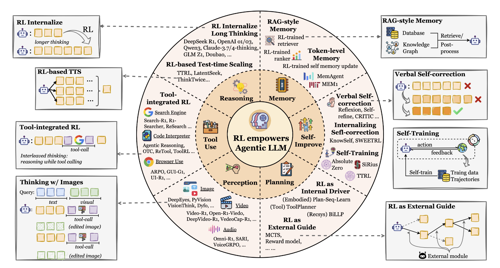

**図 5。** RL が 6 つのコア機能にわたってエージェント LLM にどのように力を与えるかについての概念的な概要。中央のパネルは機能分類を要約し、側面のパネルは代表的な RL メカニズムと相互作用パターンを示します。リストされている方法はすべてではなく例示的なものです。詳細については本文を参照してください。

### 3.6 認識

大規模視覚言語モデル (LVLM) は、視覚認識と言語抽象化を橋渡しすることで、マルチモーダル コンテンツ [Tea23, Liu23n, Wan24q, Li24o, Che24p, Ope23e, Zha25ab, Zha24p] を認識し理解するための前例のない機能を実証しました。この進歩の中心となるのは、マルチモーダル学習フレームワーク [Sha24c, Zha23i] への明示的推論メカニズムの組み込みであり、受動的な知覚を超えて能動的な視覚認知 [Su25b] へと移行します。 RL は、この目的のための強力なパラダイムとして登場し、教師付き次トークン予測 [Zho25c, Wu25k] の制約を超えた、視覚、言語、行動モデルと複雑な複数ステップの推論目標との調整を可能にします。

**受動的な知覚から能動的な視覚認知へ** マルチモーダル コンテンツでは、多くの場合、微妙な文脈依存の解釈が必要になります。 LLM [Dee25c, Tea25h] 内の推論を強化するという RL の目覚ましい成功に触発されて、研究者はこれらの利点をマルチモーダル学習 [She25a, Pen25a] に移そうとする試みをますます行っています。初期の取り組みは、MLLM [Wan24s, Don25d, Zhu25e] の思考連鎖 (CoT) 推論能力を強化するために、選好に基づく RL に焦点を当てていました。 Visual-RFT [Liu25v] および Reason-RFT [Tan25a] は、GRPO をビジョン ドメインに直接適用し、IoU などのビジョン固有のメトリクスを検証可能な報酬シグナルとして適応的に組み込みます。一方、STAR-R1 [Li25w] は、ビジュアル GRPO に合わせた部分報酬を導入することでこのアイデアを拡張しました。これに基づいて、Vision-R1 [Hua25c]、VLM-R1 [She25a]、LMM-R1 [Pen25a]、および MM-Eureka [Men25] という一連のアプローチにより、段階的な視覚的推論を奨励するように設計された特殊なポリシー最適化アルゴリズムが開発され、より小さな 3B パラメーター モデルでも強力なパフォーマンスを実証しました。 SVQA-R1 [Lin25d] は、ビュー一貫性と変換不変の目的を強制する新しいグループごとの RL 手法である Spatial-GRPO を導入しました。 Visionary-R1 [Xia25a] は、推論前の前提条件ステップとして画像キャプションを強制し、補強の微調整中のショートカットの悪用を軽減します。視覚強化微調整 [Yan25i, Che25g, Zha25k, Guo25e, Don25d] の RL トレーニング プロセスを容易かつスムーズにする一連のカリキュラム学習方法も提案されています。 R1-V [Che25g] は、VLM-Gym を導入し、知覚強化コールド スタートを備えたスケーラブルで純粋な RL 自己進化を介して G0/G1 モデルをトレーニングし、多様な視覚タスクにわたって創発的な知覚と推論の相乗効果を生み出します。 R1-Zero [Zho25f] は、単純なルールベースの報酬であっても、非 SFT モデルでは内省と拡張推論を誘発し、教師ありベースラインを超える可能性があることを示しています。 PAPO [Wan25af] は、暗黙的な知覚 KL 損失と二重エントロピー正則化で RLVR 手法を強化する、知覚を意識したポリシー最適化フレームワークを提案しています。一方、[Li25v] は、RL トレーニングの下で​​、幻視を軽減し、人間による密な注釈なしで推論を改善するための要約してから推論するフレームワークを提案しています。まとめると、これらのアプローチは、適切に設計された検証可能な報酬メトリクスが使用されていれば、R1 スタイルの RL をビジョン ドメインにうまく移行できることを示しており、パフォーマンス、堅牢性、および分布外の一般化において大幅な改善が得られます。

最近の研究では、RL のもう 1 つの重要な利点が探求されています。それは、受動的な知覚としてのタスクの定式化を超えて、静的で検証可能な報酬が LVLM のテキストベースの出力でのみ計算されることです。代わりに、RL を使用すると、視覚表現を操作可能で検証可能な中間思考として扱い、マルチモーダルなコンテンツに対する能動的な認知を促進することができます。このパラダイムにより、モデルは単に「見て答える」だけでなく、多段階の認知プロセス [Su25b] の一部として視覚情報を積極的に見て、操作し、推論できるようになります。

**グラウンディング主導型の能動的な知覚。** 受動的な知覚から能動的な視覚認知に進むための重要な方向性は、LVLM が推論プロセスを生成しながら画像を繰り返し振り返ってクエリできるようにすることです。これは、生成された思考連鎖 (CoT) の各ステップをマルチモーダル入力の特定の領域に固定する [Nag16a, Mao16] のグラウンディングによって実現されます。テキストを対応する視覚領域に明示的にリンクすることで、より有効で検証可能な推論が容易になります。

まず、GRIT [Fan25b] はバウンディング ボックス トークンをテキストの CoT とインターリーブし、検証可能な報酬とバウンディング ボックスの正確性の両方を備えた GRPO を監視として使用します。 [Chu25c] は、モデルが推論プロセス全体を通じて関連する画像領域を動的に取得できるようにする、単純なポイント アンド コピー メカニズムを導入します。 Ground-R1 [Cao25a] および BRPO [Chu25b] は、テキストのみの推論の前に証拠領域を (IoU ベースまたはリフレクション報酬を介して) 強調表示しますが、DeepEyes [Zhe25h] は、エンドツーエンド RL がそのようなグラウンディング動作を自然に誘発できることを示しています。 Chain-of-Focus は、CoT ステップを基礎にし、その後にズームイン操作を行うことで、このアプローチをさらに洗練させます。

**ツール駆動型のアクティブな知覚。** アクティブな知覚を可能にするもう 1 つの有望な方向性は、視覚認知をエージェント プロセスとして組み立てることです。外部ツール、コード スニペット、ランタイム環境がモデルの認知ワークフロー [Kem23, Zha25ar] を支援します。たとえば、VisTA [Hua25d] および VTool-R1 [Wu25j] は、RL を介してビジュアル ツールの選択と使用方法をモデルに教えることに重点を置いているのに対し、OpenThinkIMG [Su25a] は、「画像で考える」ためのモデルをトレーニングするための標準化されたインフラストラクチャを提供します。最後に、Visual-ARFT [Liu25v] は RL を利用してツールの作成を容易にし、MLLM のコード生成機能を利用して知覚ツールキットを動的に拡張します。 Pixel Reasoner [Su25] は、トリミング、消去、ペイントなどの操作でモデルのアクション スペースを拡張し、探索の早期終了を防ぐために好奇心主導の報酬を導入します。

**生成駆動型の能動知覚。** グラウンディングとツールの使用に加えて、人間は最も強力な認知能力の 1 つである想像力を利用して、問題解決に役立つスケッチや図を作成します。これに触発されて、研究者らは、LVLM に思考連鎖 (CoT) 推論を織り交ぜたスケッチやイメージを生成する機能を搭載し始め、モデルが中間表現を外部化し、より効率的に推論できるようになりました [Xu25e, Fan25c, Li25e]。Visual Planning [Xu25e] は、下流のタスクの成功を報酬信号として使用し、CoT 画像思考と​​してのみ想像画像ロールアウトを使用することを提案しています。 GoT-R1 [Dua25] は、Generation-CoT フレームワーク内で RL を適用し、モデルが画像を生成する前に意味論的空間推論プランを自律的に発見できるようにします。同様に、T2I-R1 [Jia25b] は、プロセスを高レベルのプランニング用のセマンティック レベルの CoT とパッチ単位のピクセル生成用のトークン レベルの CoT に明示的に分離し、両方のステージを RL と共同で最適化します。

**音声。** RL は、視覚言語モデルを超えて、音声を含む多様なモダリティにも拡張されています。オーディオ言語ドメイン内では、RL アプリケーションを 2 つの大きなクラスに分類します。 (1) 大規模な音声言語モデルの推論強化: RL は、音声質問応答や論理推論 [Wen25, Dia25, Li25f, Li25f, Wen25] などのタスクに対して、構造化された段階的な推論チェーンを生成する際にモデルをガイドするために活用されます。 (2) 音声合成 (TTS) におけるきめ細かいコンポーネントの最適化: RL は、話者の類似性や単語誤り率などの知覚品質メトリクスを報酬信号として使用して、システム コンポーネントを直接調整する (たとえば、継続時間予測子の改善など) ために使用され、これにより、より自然でわかりやすい音声 [Li25p] が生成されます。 EchoInk-R1 [Xin25a] などの他の研究では、GRPO 最適化の下でオーディオとビジュアルの同期を統合することで、視覚的推論をさらに強化しています。

### 3.7 その他

Agentic RL は、上記の中核的な認知モジュールに加え、長い **マルチターン対話**を通じて方策の一貫性を保つ能力も強化します。ここでは、長期的な推論と効果的な信用割当を支えるために RL が用いられます。

長期的なインタラクションの場合、中心的な課題は一時的な信用割当 [Pig24] です。ここでは、まばらで遅延したフィードバックによって、エージェントのアクションと遠い結果とのつながりが曖昧になります。 Agentic RL は、学習信号と最適化フレームワークの両方を進化させることで、この問題に直接対処します。 1 つの主要なアプローチは、**(I) プロセスベースの監視と最終結果の報酬の統合です。**。このパラダイムは、軌道の結論における単一の報酬に依存するのではなく、*補助モデル* または *プログラムによるルール* を使用して中間ステップの品質を評価し、エージェントのマルチターン戦略を導く、より密で即時の学習信号を提供します。たとえば、EPO [Liu25m]、ThinkRM [Hon25b]、SPO [Guo25d]、AgentPRM [Cho25] は、エージェントに段階的なシグナルを提供する外部報酬モデルを導入しています。対照的に、RLVMR [Zha25an] は、中間の監視をガイドする手動で定義されたプログラムによるルールを設計します。 2 番目の補完的な戦略は、**(II) 嗜好の最適化をシングル ターンからマルチステップ セグメントに拡張することです。** セグメント レベルの DPO (SDPO) [Kon25] のような技術は、孤立した応答の比較を超えて、会話のスニペットまたはアクション シーケンス全体にわたる嗜好データを構築します。これにより、モデルは早期の意思決定が長期的な成功にどのような影響を与えるかを直接学習できるため、長期にわたる対話や複雑なタスクにおいて戦略的一貫性を維持する能力が向上します。

## 4 Agentic RL: タスクの観点

Agentic RL は、進化する機能をテストし形成する幅広い具体的なタスクを通じて現れます。このセクションでは、Agentic RL が顕著な潜在的かつ固有の課題を実証している代表的なアプリケーション ドメインを調査します。 *検索と情報取得* ([第 4.1 節](#section-4-1)) から始まり、次に *コード生成とソフトウェア エンジニアリング* ([第 4.2 節](#section-4-2))、そして *数学的推論* ([第 4.3 節](#section-4-3)) が続きます。次に、*GUI ナビゲーション* ([第 4.4 節](#section-4-4))、*視覚理解タスク* ([第 4.5 節](#section-4-5))、および *VLM によるインタラクション* ([第 4.6 節](#section-4-6)) におけるその役割について説明します。単一エージェントのシナリオを超えて、*マルチエージェント システム* ([第 4.7 節](#section-4-7)) に視点を拡張し、他の新興ドメイン ([第 4.8 節](#section-4-8)) について結論を導きます。 [図 6](#figure-06) に示すように、これらのアプリケーションは共に、Agentic RL が抽象的なパラダイムから実用的な現実世界の問題解決にどのように移行するかを強調しています。

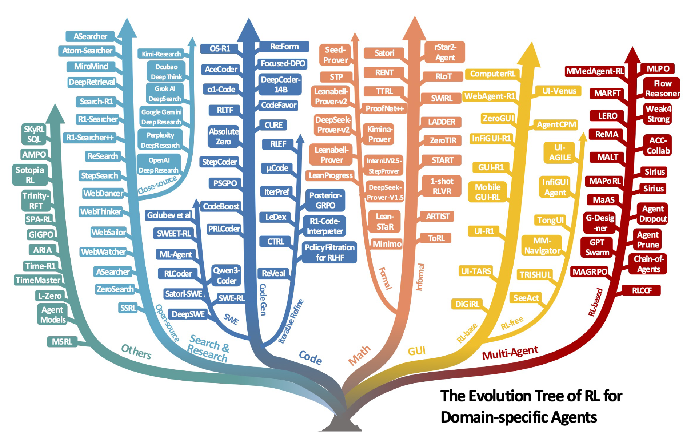

**図 6。** ドメイン固有のエージェントの RL の進化ツリー。代表的なドメインと手法の時系列的な進行を示しています。

### 4.1 検索および調査エージェント

検索は、広く使用されているアプローチ [Gao24e, Fan24b] として検索拡張生成 (RAG) を使用して、外部の知識を使用して LLM を拡張する上で中心的な役割を果たしてきました。このパラダイムは現在、単純な情報検索を超えて、*深い調査*が可能な自律エージェントの作成に向けて進化しています。つまり、単に情報を見つけるだけでなく、詳細な分析の実行、多数の情報源からの洞察の統合、および包括的なレポート [Kim25d, Per25] の草稿を含む、複雑な複数ステップのプロセスです。この変化により、目的は質問に答えることから複雑な調査タスクに取り組むことへと高まります。初期のプロンプト主導の手法は、脆弱なクエリ戦略と手動エンジニアリングに依存していました。 Search-o1 [Li25k] などの最近の研究では、エージェントの推論時間検索や DeepResearch [Zha25ad] などのマルチエージェント システムでクエリと要約のサブエージェントを調整するための大規模な推論モデルを利用していますが、依然として学習シグナルが不足しています。これらのプロンプトベースの手法には微調整シグナルが欠けているため、一般化が制限され、検索、推論、合成の緊密なループを必要とするマルチターン設定では有効性が低くなります。これらの制限により、高度な研究目標に向けて、クエリ生成と検索推論の調整のエンドツーエンドのプロセスを直接最適化するための強化学習の採用が行われました。 [表 4](#table-04) は、このセクションで検討した研究の大部分を示しています。以下では、RL がこれらのエージェントにどのように権限を与えるかについて詳しく説明します。

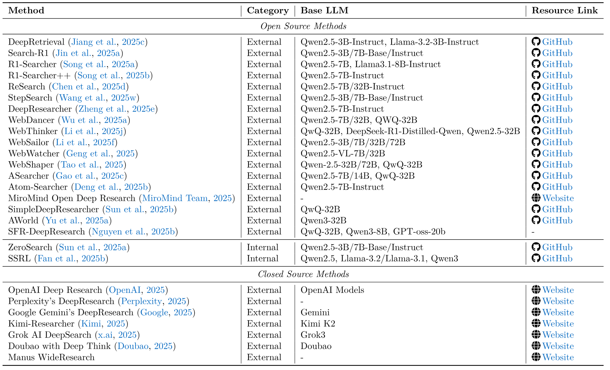

**表 4。** 検索および調査エージェントのための RL ベースの手法の概要。

#### 4.1.1 オープンソースの RL メソッド

**外部インターネットからの検索** 主要な作業は RAG 基盤上に構築されていますが、強化学習を使用してクエリ生成と複数ステップの推論を最適化する外部環境として *リアルタイム Web 検索 API* に依存しています。初期の進歩は DeepRetrieval [Jia25c] によって先導されました。DeepRetrieval [Jia25c] は、ワンショット クエリの生成を GRPO でトレーニングされた方策として組み立て、ライブ検索結果に対する想起と関連性に直接報酬を与えました。その利益に動機付けられて、その後の方法はパラダイムをマルチターン、推論統合型、マルチモーダル検索に拡張しました。 Search-R1 [Jin25b] および DeepResearcher [Zhe25f] は、取得されたトークンのマスキングと結果ベースの報酬を統合し、クエリの定式化と回答の生成をインターリーブします。 AutoRefine [Shi25b] は、連続する検索呼び出しの間に絞り込みフェーズを挿入することでこの軌道をさらに前進させ、GRPO を使用して回答の正しさだけでなく検索品質にも報酬を与え、エージェントが長期的な推論中にノイズの多い証拠を繰り返しフィルタリングして構造化できるようにします。 R1-Searcher [Son25a] は 2 段階のコールドスタート PPO 戦略を採用しており、最初に Web 検索を呼び出すタイミングを学習し、次にその活用方法を学習します。一方、その後継となる R1-Searcher++ [Son25b] は、監視付き微調整、冗長性を回避するための内部ナレッジ報酬、および継続的な同化のための動的メモリを追加しています。 ReSearch [Che25i] は、監視されたツール使用軌跡なしで完全にエンドツーエンドの PPO を追求しますが、StepSearch [Wan25ah] は、中間のステップレベルの報酬を割り当てることでマルチホップ QA の収束を加速します。 Atom-Searcher [Den25b] は、最終的な結果だけでなく推論プロセス自体を洗練することで、LLM の問題解決を大幅に改善するエージェント型のディープリサーチフレームワークです。 WebDancer [Wu25d] は、人間の閲覧軌跡の監視と RL の微調整を活用して、GAIA [Mia24] や WebWalkerQA [Wu25e] に優れた自律型 ReAct スタイルのエージェントを生成します。 WebThinker [Li25l] は、ディープ Web エクスプローラーを思考、検索、ドラフトのループに組み込み、DPO を介して人間のフィードバックと調整して、複雑なレポート生成に取り組みます。 WebSailor [Li25h] は、LLM エージェントに複雑な Web ナビゲーションおよび情報探索タスクに対する高度な推論を教えるために設計された完全なポストトレーニング方法論です。 WebWatcher [Gen25] はさらにマルチモーダル検索まで拡張し、視覚言語推論、ツール使用、RL を組み合わせて、BrowseComp-VL および VQA ベンチマークでテキストのみのベースラインやマルチモーダル ベースラインを上回るパフォーマンスを発揮します。 ASearcher [Gao25d] は、合成された QA データを使用した大規模な非同期強化学習を使用し、長期検索 (40 以上のツール呼び出し) を可能にし、以前のオープンソース手法を上回るパフォーマンスを発揮します。 MiroMind Open Deep Research (MiroMind ODR) [Tea25b] は、すべて完全にアクセス可能でオープンなエージェント フレームワーク、モデル、データ、トレーニング インフラストラクチャを備えた、高性能で完全にオープンソースのオープンコラボレーションのディープ リサーチ エコシステムを構築することを目指しています。

**LLM の内部知識からの検索** ただし、外部 API に依存するこれらのトレーニング方法は、2 つの大きな課題に直面しています。(1) リアルタイムのインターネット文書検索の文書品質は制御されておらず、ノイズの多い情報はトレーニング プロセスに不安定性をもたらします。 (2) API コストが高すぎて、スケーラビリティが大幅に制限されます。トレーニングの効率、制御性、安定性を高めるために、最近の研究では、LLM 内部ナレッジなどの制御可能な模擬検索エンジンが使用されています。たとえば、ZeroSearch [Sun25b] は、ライブ Web 検索を LLM 自体から抽出した疑似検索エンジンに置き換え、カリキュラム RL を組み合わせて、実際のクエリを発行せずに徐々にライブ エンジンのパフォーマンスに近づけます。 SSRL [Fan25a] は、このアイデアをさらに発展させたものです。エージェントは、トレーニング中に明示的な検索エンジンを使用せずに完全にオフラインの「自己検索」を実行しますが、オンライン推論にシームレスに移行し、実際の API によってパフォーマンスを向上させることができます。まだ初期段階ではありますが、オフライン自己検索は API の制限を超えて安定性とスケーラビリティを強化し、より自立した調査エージェントを目指しています。

#### 4.1.2 クローズドソースの RL メソッド

**産業研究エージェント。** RAG と RL の組み合わせが進歩しているにもかかわらず、ほとんどのオープンソース モデルは依然として OpenAI の BrowseComp [Wei25b] で失敗します。このベンチマークは、AI エージェントが見つけにくい情報を見つける能力を測定するもので、長期的な計画、ページベースのツールの使用、およびクロスソース検証におけるギャップが明らかになります。対照的に、最近のクローズド ソース システムは著しく強化されており、単なるクエリの最適化から、オープン Web をナビゲートし、複数のソースからの情報を統合し、包括的なレポートの草案を作成する完全に自律的なリサーチ エージェントに移行しています。これはおそらく、業界のより強力な基盤モデルと、より高品質なデータが利用可能になったことによるものと考えられます。 OpenAI Deep Research [Ope25e] は、BrowseComp で 51.5% の合格@1 を達成しました。その他のプロトタイプ、Perplexity の DeepResearch [Per25]、Google Gemini の DeepResearch [Goo25]、Kimi-Researcher [Kim25d]、Grok AI DeepSearch [Xai25]、Deep Think [Dou25] を備えた Doubao は、RL スタイルの微調整と高度なツール統合およびメモリ モジュールを組み合わせて、インタラクティブで反復的な研究の新時代を到来させます。アシスタント。

**ケーススタディ: OpenAI Deep Research。** Deep Research では、[第 3 節](#section-3) の機能が RL 形式の検索戦略とどのように組み合わされるかを示す具体的な例が提供されます。エージェントは、長期的な複数ステップの推論と計画から始まり、ユーザーのリクエストをサブ目標に分解します。次に、RL 形式の Web 検索を実行します。つまり、クエリを発行し、開くページを選択し、検索軌跡を調整します。これらの検索方策は、BrowseComp [Wei25b] などの研究指向のベンチマークを使用してトレーニング中に形成されます。プロセス全体を通じて、エージェントはスクラッチパッド メモの形式で永続メモリを維持し、合成前にクロスソース検証を実行します。これらの機能 (推論、計画、ツールの使用、記憶、検証) は、検索の深さ、分岐の選択、証拠の統合に関する RL 形式の制御決定と結合され、統合された調査エージェントを形成します。

### 4.2 コードエージェント

コード生成、またはより広義にはソフトウェア エンジニアリングは、LLM ベースの Agentic RL に理想的なテストベッドを提供します。実行セマンティクスは明示的かつ検証可能であり、自動化されたシグナル (コンパイル、単体テスト、およびランタイム トレース) はすぐに利用可能です [Don25b]。初期のマルチエージェント フレームワーク (*例*、MetaGPT、AutoGPT、AgentVerse) は、パラメーターを更新せずにプロンプトを表示することで役割を調整し、モジュール式の役割割り当て [Hon24a, Gra23, Che24k] の可能性を示していました。 CodeRL などのコードの初期 RL には、実行ベースの報酬モデリングとActor-Criticトレーニング [Le22] が組み込まれており、方策の更新をガイドするために実行フィードバックを活用する研究の波を引き起こしました。 [表 5](#table-05) は、このセクションで検討した研究の大部分を示しています。 *コード生成* ([第 4.2.1 節](#section-4-2-1)) から *コード改良* ([第 4.2.2 節](#section-4-2-2)) および *ソフトウェア エンジニアリング* ([第 4.2.3 節](#section-4-2-3)) へと進む、*タスクの複雑さ*の増加に沿って文献を構成します。

#### 4.2.1 コード生成用の RL

初期の研究は、比較的単純な単一ラウンドのコード生成 (*例* 機能を完了したり、コーディングの課題を一度に解決したり) に焦点を当てており、これがその後の大規模なソフトウェア エンジニアリングの基礎を築きました。

**結果報酬 RL。** このクラスのメソッドは、最終的な正確性を直接最適化します。通常は pass@k または単体テストの成功によって測定されます。 AceCoder [Zen25a] は、コード生成用のデータ効率の高い RLHF パイプラインを導入し、既存のコード フラグメントから大規模な選好ペアを構築して、ブラッドリー – テリー損失を介して報酬モデルをトレーニングし、合成されたデータセットで RFT をガイドします。初期のアクターとクリティックの定式化を超えて、最近のオープンソースの取り組みは、大規模な事前トレーニングされたコード モデル上で結果ベースの RL を拡張しています。 DeepCoder-14B [Luo25e] は、反復的なコンテキスト延長と DAPO にインスピレーションを受けたフィルタリングによって GRPO トレーニングを安定化し、厳選されたコーディング データに対する報酬ハッキングを防ぐためにスパースな結果報酬モデル (ORM) を採用します。 RLTF は、単体テストの結果を多粒度の報酬信号として使用するオンライン RL ループを採用しており、大まかな合否結果から粒度の細かい障害位置特定まで、コード改良 [Liu23o] を直接導きます。 CURE は、コーダーとテスターの共進化を形式化します。コーダーが繰り返しコードにパッチを当てている間に、テスターが単体テストを生成または進化させます。報酬精度の目標により、共同トレーニング [Wan25ab] 中の低品質のテストの影響が軽減されます。 Absolute Zero は、人間のデータを使用せずにセルフプレイ RL を適用します。それ自体でコーディング タスクを生成し、推論能力 [Zha25ao] をブートストラップするための検証可能な報酬として実行結果を使用します。 Re:Form [Yan25e] は、RL による形式言語ベースの推論と自動検証を活用して人間による事前作業を削減し、信頼性の高いプログラム合成を可能にし、形式検証タスクの強力なベースラインを上回ります。 [Fen25c] では、著者らは 2 段階のトレーニング パイプラインを提案しています。まず、高精度のベースラインを微調整し、次に効率重視のオンライン RL 最適化を実行します。

**プロセス報酬 RL。** スパース性と信用割当を軽減するために、いくつかの研究では、コンパイルと実行のフィードバックを統合することによってプロセス レベルの監視を設計しています。 StepCoder [Dou24] は、コンパイルと実行をステップレベルの信号に分解して整形します。プロセス監視ガイド付きポリシー最適化 (PSGPO) [Dai25] は、中間エラー トレースとプロセス アノテーションを活用して、高密度の報酬を獲得します。 CodeBoost [Wan25y] は、生のリポジトリをマイニングして、出力の正確性からエラー メッセージの品質に至るまで、異種の実行由来のシグナルを単一の PPO フレームワークの下で統合します。さらに、PRLCoder [Ye25b] は、各部分スニペットをスコアリングする報酬モデルを構築することにより、プロセス教師あり RL を導入します。教師モデルは、参照ソリューションの行を変更し、コンパイラーとテストのフィードバックに基づいて正/負の信号を割り当てます。このきめ細かい監視により、ベース モデルに比べて収束が速くなり、パス率が +10.5% 向上します。これは、ライン レベルでの緻密なシェーピングが結果のみの信号よりも効果的にコード合成を導くことができることを示しています。 o1-Coder [Zha24r] は、RL とモンテカルロ ツリー検索を組み合わせたもので、方策はテスト ケースの報酬に基づいた探索から学習し、疑似コードから実行可能コードに徐々に改善されます。事後 GRPO [Fan25] は中間推論に報酬を与えますが、投機的な報酬の悪用を防ぐために最終テストの成功によってクレジットをゲートします。 RLHF [Zha25n] のポリシー フィルタリングは、方策を更新する前に信頼性の低いペアをフィルタリングすることにより、報酬の正確性の調整を向上させます。コストのかかる人間による注釈を超えたスケーリング設定の監視も効果的であることが証明されています。 CodeFavor [Liu24s] は、コードの進化履歴から CodePrefBench を構築し、正確性、効率、セキュリティ、スタイルをカバーして、プリファレンスのモデリングと調整を改善します。 Focused-DPO [Zha25aa] は、コードのエラーが発生しやすい領域に選好最適化を重み付けすることで選好ベースの RL を適応させ、フィードバックをより的を絞り、ベンチマーク全体の堅牢性を向上させます。 [Yan25l] は、分散型非同期 RL での期間を意識した勾配更新を通じて、RL でトレーニングされた小規模エージェントが MLE 環境の大規模なプロンプトベースのモデルをどのように上回るかを研究しています。

#### 4.2.2 反復コード改良のための RL

2 番目の研究ラインは、デバッグと反復的な改良を必要とする、より複雑なコーディング タスクを対象としています。これらのシナリオでは、エージェントは人間の要件や失敗したテスト結果からのフィードバックを使用して、ソリューションを改善するために複数回の試行が必要になる場合があります。これは実際のタスクに近いものです。

**結果報酬 RL。** 代表的なラインは、最終的なタスクの成功に向けて最適化しながら、改良ループ全体を軌道として扱います。 RLEF [Geh25] (実行フィードバックからの強化学習) は、最終的な合格率を最適化しながら、実際のエラー メッセージ内の修正ループをコンテキストとして根拠付けします。これにより、必要な試行回数が減り、シングルショットのベースラインと比較して競技プログラミングのパフォーマンスが向上します。 $\mu$Code [Jai25] は、シングルステップの報酬フィードバックの下でジェネレーターと学習済み検証器を共同トレーニングし、検証器に誘導された結果報酬が純粋な実行フィードバック ベースラインを上回るパフォーマンスを発揮できることを示しています。 R1 コード インタープリター [Che25m] は、マルチターンの教師あり微調整と強化学習を利用して、段階的な推論中にコード インタープリターをいつどのように呼び出すかを決定するように LLM をトレーニングします。

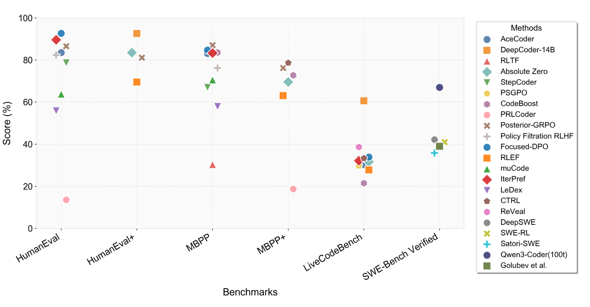

**図 7。** RL 拡張コードと SWE メソッドのベンチマーク パフォーマンス。特に指定がない限り、スコアは pass@1 です。

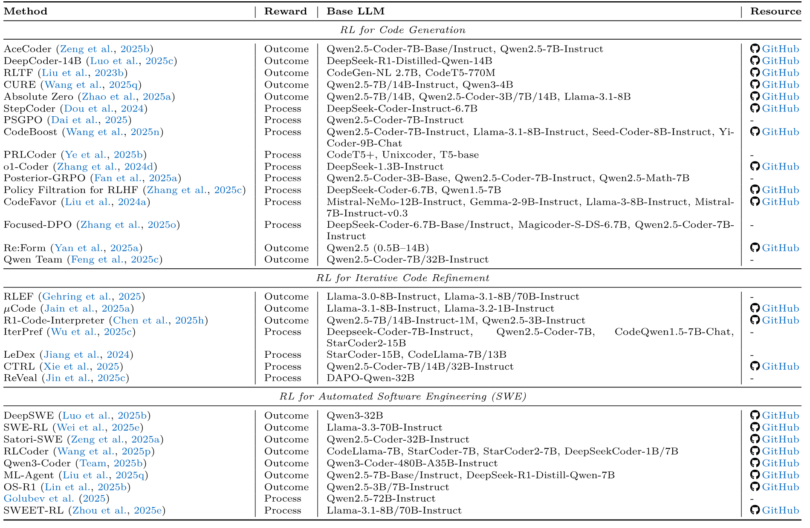

**表 5。** コードおよびソフトウェア エンジニアリング エージェントの RL 手法の概要。

**プロセス報酬 RL。** プロセス監視アプローチは、モデルのデバッグ「方法」を明示的にガイドします。 IterPref [Wu25f] は、反復デバッグ トレースからローカライズされたプリファレンス ペアを構築し、ターゲットを絞ったプリファレンス最適化を適用して障害のある領域にペナルティを与え、最小限の付随更新で修正精度を向上させます。 LeDex [Jia24b] は、説明主導の診断と自己修復を組み合わせます。説明と改良の軌跡を自動的にキュレーションし、高密度で継続的な報酬を適用して、PPO を介して説明の品質とコードの正確性を共同で最適化し、SFT のみのコーダーに対して一貫した pass@1 ゲインをもたらします。説明主導型のシェーピングを超えて、CTRL [Xie25b] のような一部の研究では、推論のオーバーヘッドが追加されるものの、独立したクリティックモデルを明示的にトレーニングして、試行されたそれぞれの改良を評価し、勾配信号を方策に提供します。 ReVeal [Jin25d] は、プロセス レベルの改良を自己進化エージェントに拡張し、自律的にテストを生成し、ターンごとの報酬から学習して推論とエラーからの回復を強化します。

#### 4.2.3 自動化されたソフトウェア エンジニアリングのための RL

**結果報酬 RL。** 現実的な環境でのエンドツーエンドのトレーニングは、まばらではあるが検証された成功シグナルがスケールできることを示しています。 DeepSWE は、検証されたタスクの完了を唯一の報酬として使用して、ソフトウェア エンジニアリング ミッションで大規模な RL を実行し、SWE ベンチ スタイルの評価 [Luo25d] でオープンソースのトップの結果を達成します。 SWE-RL は、GitHub コミット履歴からルールベースの結果指向のシグナルを抽出し、真の改善パターンに関するトレーニングと、目に見えないバグ修正タスク [Wei25e] への一般化を可能にします。 Satori-SWE は、サンプル効率の高いソフトウェア エンジニアリング タスク [Zen25] の反復を重ねながら生成結果を自己改善するようモデルを訓練する、進化的な RL 対応のテスト時間スケーリング手法 (EvoScale) を導入します。 OS-R1 [Lin25b] は、Linux カーネル チューニング用のルールベースの強化学習フレームワークを提供し、効率的な探索、正確な構成、ヒューリスティックな手法よりも優れたパフォーマンスを可能にします。 RLCoder は、取得強化されたリポジトリ レベルのコード補完を RL 問題としてフレーム化し、複雑度ベースのフィードバックを使用して、ラベル付きデータ [Wan25aa] なしで有用なコンテキストをフェッチするように取得者をトレーニングします。 Qwen3-Coder は、20,000 の並列環境にわたる長期にわたるマルチターン インタラクションで大規模な実行駆動の強化学習を実行し、SWE-Bench Verified [Tea25i] などのベンチマークで最先端のパフォーマンスを実現します。機械学習ドメインでは、ML-Agent はマルチステップ パイプライン (*例*、自動 ML) を実行し、パフォーマンスベースの端末報酬 [Liu25q] を最適化します。

**プロセス報酬 RL。** エージェントの軌道に対する緻密な監視により、多くのステップにわたる信用割当が向上します。最適化の観点から見ると、ロングコンテキストのマルチターン ソフトウェア エージェントは、安定化された方策勾配バリアントから恩恵を受けます。たとえば、分離クリップおよび動的 サンプリング ポリシー最適化 (DAPO) は、ロングコンテキスト フィードバック [Gol25a] を活用した、マルチターン コード生成とデバッグ インタラクションを通じて、SWE ベンチ検証済みのトレーニングの安定性とパフォーマンスを向上させます。 SWEET-RL は、ColBench (バックエンドおよびフロントエンド タスク) でマルチターン エージェントをトレーニングし、RL 中に特権情報を活用して探索ノイズを削減し、長期的な汎化 [Zho25g] を向上させます。

**クローズドソース システムに関する注意事項。** OpenAI の Codex や Anthropic の Claude Code などの商用システムは、コード生成および編集ワークフロー [Ope25f, Ant25d] の有用性と安全性を向上させるために、選好に合わせた微調整と強化学習を重視してきました。具体的なトレーニングの詳細は公開に制限されていますが、これらのシステムは、エージェントの動作を実際の IDE およびターミナル環境における開発者中心の目標に合わせる上で RL の役割が増大していることを強調しています。

#### 4.2.4 新たなパラダイム

**コード ワールド モデル** 最近のパラダイムシフトは、ワールド モデル自体を実行可能なコードとして構成することで、従来のニューラル近似から脱却しています。これらのコード ワールド モデル (CWM) では、エージェントがプログラムを合成して遷移と報酬のダイナミクスを明示的に定義し、不透明な潜在状態ではなく検証可能な記号シミュレーションを介してモデルベースの計画を可能にします。

GIF-MCTS [Dai24a] は、プログラム誘導としてワールド モデルの構築を定式化します。LLM は「環境」クラスを編集し、検索手順によってオフライン移行を最もよく説明するバージョンを選択し、下流の計画に適した実行可能なモデルを生成します。 WorldCoder [Tan24a] は、ダイナミクスと報酬を明示的な Python 関数として表し、遷移の一貫性と楽観的な制約に基づいた反復的な合成と修復のプロセスを通じてそれらを洗練します。 Meta の 32B CWM [Tea25f] は、プログラムの合成と実行の忠実度を向上させるために、インタープリターのトレースとエージェントの軌跡でトレーニングされたオープンウェイト モデルを提供することにより、このパラダイムを強化します。最近の研究ではさらに、CWM を一般的なゲーム環境 [Leh25] に適用しており、LLM が完全なルールベースのシミュレーターを誘導し、計画が実行可能モデル上で直接実行されます。

これらのプログラムによる世界モデル パラダイムを実装すると、エージェントが実行可能シミュレーターの合成、改良、クエリを繰り返し行うため、多くの場合、かなりの推論コストが発生します。実際には、大規模なコード指向モデルの展開を可能にするために、低ビット量子化 (RTX 4500 Ada などのワークステーション GPU の場合は 8 ビット、コンシューマ ハードウェアの場合は 4 ビットなど) が頻繁に採用されます。 CWM は集合的に、コード エージェントの一貫した方向性としてプログラムの世界モデルを確立し、LLM ベースのプログラム合成と、モデルベースの推論のための構造化された検証可能なシミュレーションを組み合わせます。

### 4.3 数学エージェント

数学的推論は、その記号的抽象化、論理的一貫性、長期にわたる演繹的要求により、LLM エージェントの推論能力を評価するためのゴールドスタンダードとして広くみなされています。私たちは、2 つの相補的なパラダイムを中心に研究活動を構成しています。*非公式推論* ([第 4.3.1 節](#section-4-3-1))。これは、正式な検証サポートなしで動作し、自然言語推論とプログラミング言語ツールの使用を含みます。 *形式推論* ([第 4.3.2 節](#section-4-3-2))。厳密に指定された形式言語と証明アシスタントに依存します。

DAPO [Yu25g]、GRPO [Ren25b]、GRESO [Zhe25c] などの RLVR 手法が、LLM における数学的推論の最近の機能強化において一貫して重要な役割を果たしていることに注目します。ただし、推論タスク全体にわたる広範な関連性を考慮して、ここでは詳しく説明する代わりに、[第 2.7 節](#section-2-7) で説明します。

#### 4.3.1 非公式数学的推論のための RL

非公式数学は本質的に、自然言語による推論と表現を指します。このような推論にはシンボルや関数名が組み込まれている可能性がありますが、それらの構文の妥当性を定義する論理規則の有限かつ明示的なセットはなく、それらの解釈と意味を正確に決定する形式的意味論もありません。

非公式な数学的推論は詳細レベルでの厳格さを緩和しますが、表現上の柔軟性が高まり、議論の高レベルの構造をより適切に捉えることができます。このため、数学的な単語問題の解決、方程式の操作、記号計算 [Sin25a, Mai25] など、さまざまな数学タスクに特に適しています。汎用プログラミング言語は記号的ですが、証明アシスタント言語の厳密さと形式的なセマンティクスに欠けているため、通常は数値ライブラリまたは記号ライブラリを使用した Python などの実行プログラムのツール呼び出しを通じて、数学的推論 [Yan24k] に適用される場合は非公式とみなされます。

**結果報酬 RL。** 結果のみのメソッドは、RL 中の最終的な数値または記号の正しさ (例: 代数方程式) のみによって報酬を定義します。経験的には、このようなトレーニングは、自然言語推論を織り交ぜた適応ツールの使用を含む、創発的なエージェント型行動につながることがよくあります。 ARTIST [Sin25a] は、ツールに統合されたエージェント推論、ツール呼び出しのインターリーブのためのフレームワークを導入しています。推論チェーン内でコードを直接実行します。結果のみの報酬でトレーニングされたこのロボットは、強力なパフォーマンスを達成し、内省やコンテキスト認識型 CoT などの緊急のエージェント行動を観察します。これはさらに、動的なツールの使用を RL と統合することで、エージェントのツール統合推論が環境と対話するための最適な戦略を学習できることを示しており、ツール統合推論戦略を LLM に内部化する RL の可能性を強調しています。同様に、ToRL [Li25o] は、ツール統合推論 RL のスケーリングを利用し、コード実行動作を促進することでパフォーマンスを向上させます。実験では、適応的なツールの使用、ツールのフィードバックに基づく自己修正、適応的な計算推論などの創発的な認知行動が示されています。 ZeroTIR [Mai25] は、Python コード実行設定を使用したツール統合推論の結果ベースの報酬から RL のスケーリング則を調査し、トレーニングの計算量と自発的なコード実行頻度、平均応答長、および最終タスクの精度との間に強い相関関係があることを明らかにし、ツール統合推論戦略の経験的な出現を裏付けます。 TTRL [Zuo25] は多数決を活用して報酬を推定し、ラベルのないデータでのトレーニングを可能にします。これらの多数決の報酬に基づいて微調整されたこのモデルは、基本モデルの主要な精度を超えるだけでなく、驚くべきことに、MATH-500 のラベル付きテスト回答による直接 RL トレーニングの曲線と上限に非常に近い経験的なパフォーマンス曲線と上限を達成し、その実用的な価値と可能性を強調しています。ただし、RENT [Pra25] は、多数決は一般化して限定されており、決定的な回答を持つ質問にのみ適用され、自由回答の出力には機能しないことを示唆しています。この制限に対処するために、エントロピー最小化のアイデア [Wan21e] を RL に拡張し、トークン レベルの平均負のエントロピーを学習を導く報酬として使用し、数学の問題解決を含む広範なベンチマーク スイートで改善を達成し、信頼に基づいた報酬形成が継続的改善への道として機能できることを示唆しています。あるいは、Satori [She25b] は、アクションの選択を明示的に統合し、推論を継続、反映、代替案の探索を含む 3 つのメタアクションにモジュール化する CoT の変形である Chain-of-Action-Thought (COAT) を提案し、結果のみの報酬を伴う RL を介してこの行動を内面化します。特に、1 ショット RLVR [Wan25ac] は、検証者シグナルを使用した結果のみの RL のデータ効率を研究します。驚くべきことに、サンプルが 1 つだけの RL は 1.2k サンプル データセットの使用に近いパフォーマンスを示し、サンプルが 2 つある場合は 7.5k MATH トレーニング データセットの使用に近いパフォーマンスを示すことがわかりました。彼らはまた、単一の例のトレーニング精度が 100% に近づいた後でもテスト精度が向上し続けるという、飽和後の一般化と呼ばれる興味深い現象も強調しています。正しさに加えて、幻覚は依然として非公式な数学的推論における大きな課題であり、信頼性を明示的に促進する方法を動機付けています。たとえば、[Kir24] は、正確さと読みやすさの両方を共同で最適化するゲーム理論的なトレーニング アルゴリズムを提案しています。 Prover-Verifier Games [Ani21] からインスピレーションを得たこのメソッドは、解決策の正しさを予測する小さな検証者、検証者が受け入れる解決策を生成する「役立つ」証明者、およびそれを騙すことを目的とした「卑劣な」証明者を交互にトレーニングします。経験的には、これにより証明者の精度、検証者の堅牢性、読みやすさが向上します (時間に制約のある検証タスクにおける人間の正確さによって測定されます)。この結果は、検証者主導の可読性の最適化により、LLM によって生成された非公式推論の解釈可能性と信頼性が向上する可能性があることを示唆しています。最近の rStar2-Agent [Sha25a] は、高スループットの Python 実行環境、ツール ノイズの中でも正しいロールアウトでリサンプリングする新しい GRPO-RoC アルゴリズム、および多段階トレーニング レシピを使用したエージェント型強化学習でトレーニングされた 14B パラメーターの数学推論モデルです。わずか 510 の RL ステップで最先端の結果を達成し、平均 pass@1 スコア 80.6% を達成します。 AIME24 では 69.8%、AIME25 では 69.8% でした。

**プロセス報酬 RL。** プロセス認識メソッドは、中間評価者 (単体テスト、アサーション、サブタスク チェックなど) を利用して、より密度の高いフィードバックを提供し、信用割当を形成し、ツール統合推論 (TIR) を改善します。 START [Li25d] は、手作りのヒント テキストを長い CoT トレース (通常は接続語の後または CoT 停止トークンの前) に挿入することで TIR をガイドし、推論中のコード実行プログラムの呼び出しを促進します。これにより、テスト時間のスケーリングが可能になり、推論の精度が向上します。次に、収集された軌跡を使用してモデルを微調整し、ツール呼び出しの動作を内部化します。 LADDER [Yos25] では、LLM が複雑な問題のより単純なバリエーションを再帰的に生成して解決し、検証可能な報酬信号を使用して難易度ベースのカリキュラムをガイドし、数学的推論の大幅な改善を達成するトレーニング時間フレームワークを導入しています。追加のテスト時間 RL ステップ (TTRL) により、パフォーマンスがさらに向上します。著者らは、検証可能なフィードバックを伴う自己生成カリキュラム学習のアプローチは、信頼性の高い自動検証を備えた非公式な数学的タスクを超えて、あらゆる領域に一般化できる可能性があると示唆しています。複雑な問題のパフォーマンスを向上させるために、SWiRL [Gol25] は、解を反復的に分解することで推論データを使用するステップワイズ ツールを合成し、選好に基づいたステップワイズ RL アプローチを採用して、マルチステップの軌道でベース モデルを微調整します。これらのアプローチの多くは推論時の介入を活用していますが、手動で設計された論理構造に依存しているため、一般化の制限に悩まされることがよくあります。これを克服するために、RLoT [Hao25a] は、代わりに RL を使用して軽量のナビゲーター エージェント モデルをトレーニングし、推論を適応的に強化し、さまざまなタスクにわたって一般化の向上を示します。

非公式なアプローチは文章問題や記号計算には優れていますが、自動化された定理証明などの高度な数学タスクに効果的に拡張するのは困難です。この制限は、2 つの基本的な課題から生じています。1 つは評価の難しさであり、非公式の方法では利用できない機械検証可能なフィードバックが必要です。もう 1 つは高品質の正式な証明データ [Yan24k, Asp25] が不足しています。

#### 4.3.2 形式的数学的推論のための RL

形式的数学的推論とは、正確に定義された構文と意味論を備えた形式言語で実行される推論を指し、検証者が機械的にチェックできる証明オブジェクトを生成します。このパラダイムは、自動定理証明 (ATP) [Xin25] などの高度なタスクに特に適しています。このタスクでは、ステートメント (定理、補題、または命題) が与えられたエージェントが、検証者が受け入れる証明オブジェクトを構築する必要があり、それによって機械検証可能な正確性が保証されます。強化学習の観点から、形式定理証明は一般にマルコフ決定プロセス (MDP) としてモデル化されます。つまり、証明状態は戦術 [+2] の適用によって遷移し、それぞれが RL ベースの証明検索 [Wu21a] で個別のアクションとして扱われます。この定式化の下では、形式的定理の証明は、広大で離散的でパラメータ化されたアクション空間にわたる探索問題としてキャストできます。

正式な証明は、Lean、Isabelle、Coq、HOL Light などの証明アシスタントによって検証されます。これらのシステムは、インタラクティブ定理証明者 (ITP) と呼ばれることが多く、証明オブジェクトを決定論的に受け入れるか拒否し、RL トレーニングの主な報酬としてバイナリの合否信号を生成します。また、一部の研究では、補助信号 [Amb25, Ji25a] としてエラー メッセージを活用することも検討しています。

**結果報酬 RL。** 結果のみのパラダイムは、2024 年に DeepSeek-Prover-v1.5 [Xin25] で大規模に実証されました。これは、バイナリ検証者のフィードバックのみに基づいてリーンでエンドツーエンドの RL パイプラインをリリースし、その結果、miniF2F [Zhe22a] や ProofNet [Aze23] などのベンチマークでの証明の成功率が大幅に向上しました。著者らは、推論時の探索中の証明探索の多様性を促進し、報酬のスパースの問題を軽減するために、新しい戦術状態を発見するための固有の報酬を組み込んだ MCTS のバリアント、つまり RMaxTS を提案しています。この方向に基づいて、Leanabell-Prover [Zha25w] は、Mathlib4 [Com20]、LeanWorkbook [Yin25a]、NuminaMath [Li24l]、STP [Ma25]、など、20 をはるかに超える数学的領域をカバーしています。この広範なカバレッジにより、自然言語推論と形式的な証明生成の橋渡しに重要な、調整された非公式から公式 (NL から Lean4) トレーニング サンプルの不足が軽減されます。同時に、Kimina-Prover [Wan25l] プレビューは、非公式推論と公式推論を調整するという重要な課題をさらに強調しています。これは、自然言語推論とリーン 4 コード スニペットが思考ブロック内にインターリーブされる、構造化された「形式的推論パターン」を実装しています。この調整を強化するために、出力には少なくとも 1 つの戦術ブロックを含めること、および最終的な証明でリーン 4 スニペットの 60% 以上を再利用することなどの制約があり、内部推論と正式な出力の間の密接な対応が保証されます。最近の研究である Seed-Prover [Che25h] では、複数の技術が統合されています。まず、補題中心の証明パラダイムを採用し、体系的な問題の分解、軌跡を越えた補題の再利用、および明示的な進捗追跡を可能にします。次に、非公式証明と正式証明の両方、成功した補題と失敗した補題、リーン コンパイラのフィードバックをランダムに組み込んだ多様なプロンプト戦略で RL トレーニングを強化し、それによってさまざまな入力への適応性を高めます。推論時には、証明予想を補題にインターリーブし、進化する補題プールから新しい予想を生成する予想証明者パイプラインを採用し、困難な問題に取り組む能力を大幅に向上させます。補足的に、付属の Seed-Geometry システムは形式的推論を幾何学に拡張し、Olympiad ベンチマークで最先端のパフォーマンスを提供します。これらの取り組みを総合すると、特に効果的な探索戦略と組み合わせた場合、まばらだが明示的な報酬シグナルが重要な利益を生み出す可能性があることが実証されています。

**報酬 RL を処理します。** クレジットの割り当てを改善し、無駄な探索を減らすために、いくつかの研究では、結果のみのパラダイムをより高密度のステップレベルの信号で拡張しています。 DeepSeek-Prover-v2 [Dee24d] は、形式的推論能力を強化するために非公式 (自然言語) と形式的 (Lean4) の両方の数学的推論を統合するデュアル モデル パイプラインを設計します。サブゴール分解が導入されており、証明者モデルが再帰的に分解されたサブゴールを解決し、サブゴール レベルでバイナリ リーン フィードバックを受け取り、効果的により緻密な監視を提供し、精度と解釈可能性の両方を向上させます。この二重役割の協調的な考え方に従って、ProofNet++ [Amb25] は、LLM で生成された推論を形式的な証明ツリーにマップする記号推論インターフェイスと、リーンまたは HOL ライトでこれらの証明を検証し、自己修正のためにエラー フィードバックを LLM に戻す形式検証エンジンを特徴とする神経記号的な RL フレームワークを実装します。 Leanabell-Prover-v2 [Ji25a] は、長い CoT フレームワーク内の強化アップデートに検証者のメッセージを統合し、明示的な検証者対応の自己監視を可能にして、戦術の生成を安定させ、繰り返される失敗パターンを減らします。

**ハイブリッド報酬 RL。** 結果のみの報酬パラダイムとプロセスを意識した報酬パラダイムの両方が心強い進歩を示していますが、質の高い定理証明データの不足により、スパース報酬の下での強化学習やステップレベルの選好信号 [Zho24c, Wan24r, Ma25] の設計の課題がさらに増幅されています。これらの制限を軽減するために、主要な一連の作業では、検索とポリシー学習を組み合わせたフレームワークであるエキスパート反復 (ExIt) [Ant17] が採用されています。このパラダイムは、結果のみを重視した RL またはプロセスを意識した RL の代替手段を提供し、高品質の教師付き軌道を生成することでデータ不足を軽減します。 ExIt は、疎な検証信号に対して直接最適化する代わりに、*検索ガイド付きデータ拡張* を実行します。つまり、検索によって発見され、検証者によってチェックされた有効な証明の軌跡が、模倣学習ループ内の専門家のデモンストレーションとして再利用されます。通常、2 つの役割のシステムが採用されています。*エキスパート* は、結果のみの検証者のフィードバックの下で MCTS を介して有効かつ漸進的なトラジェクトリを収集します。一方、*見習い* は、これらのプロセス レベルのトラジェクトリに基づいて方策をトレーニングし、改善された方策をエキスパートと共有します。これにより、後続の検索ラウンドをブートストラップして収束を加速します。以前の研究 [Sut20] では、ExIt を形式的な定理証明に導入し、検索によって生成された専門家データが、複雑な複数ステップの証明の課題に取り組むためにモデルをブートストラップできることを実証しました。後の研究では、この設計をリーンおよび他の ITP に適用します。

形式的な定理の証明に適用すると、単純なツリー検索手法は、パラメーター化された広大な戦術空間をナビゲートする際に、深刻な検索空間の爆発に直面することがよくあります。これを軽減するために、InternLM2.5-StepProver [Wu25p] は、RLHF スタイルの最適化でトレーニングされた選好ベースのクリティックモデルを導入し、専門家の検索をガイドし、適切な難易度の問題に向けて探索を導くカリキュラムを効果的に提供します。 Lean-STAR [Lin25a] は、Self-Taught Reasoner (STaR) [Zel22a] を統合することにより、ExIt をさらに強化します。まず、合成された *(証明状態、生成された思考、グラウンドトゥルース戦術)* トリプルで思考拡張戦術予測子をトレーニングします。次に、エキスパートと反復のループで、モデルは思考と戦術を織り交ぜた軌道を生成します。リーンによって成功裏に検証された戦術による軌道は保持され、模倣学習に再利用されます。経験的に、思考を含めることで、サンプルベースの証明検索における探索の多様性が高まります。

最近の研究である STP [Ma25] は、専門家の反復のみに依存すると、プラスの報酬がまばらなため、すぐに頭打ちになると指摘しています。これに対処するために、Minimo [Poe24] の推測者と証明者のセルフプレイのアイデアを、オープンエンドのアクション空間を備えた実用的な形式言語 (Lean/Isabelle) に拡張し、事前トレーニングされたモデルから開始します。 STP は、推測者が現在の証明者によってかろうじて証明可能なステートメントを提案し、証明者が標準の専門家の反復でトレーニングされる二重役割ループをインスタンス化します。これにより、適応的なカリキュラムが生成され、まばらなトレーニング信号が軽減されます。経験的に、STP は LeanWorkbook [Yin25a] で大きな利益を報告し、miniF2F [Zhe22a] および ProofNet [Aze23] では全証明生成方式間で競合する結果を報告しています。

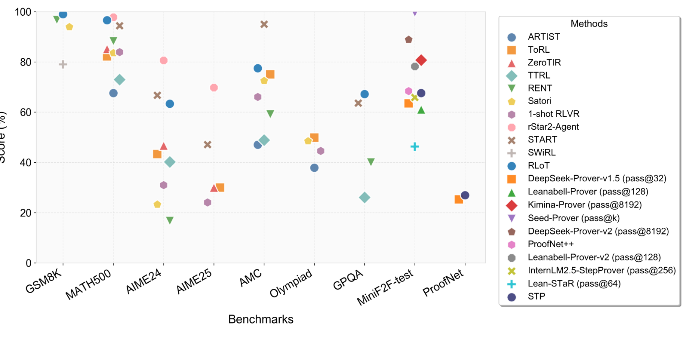

**図 8。** RL 拡張数学手法のベンチマーク パフォーマンス。特に指定がない限り、スコアは pass@1 です。

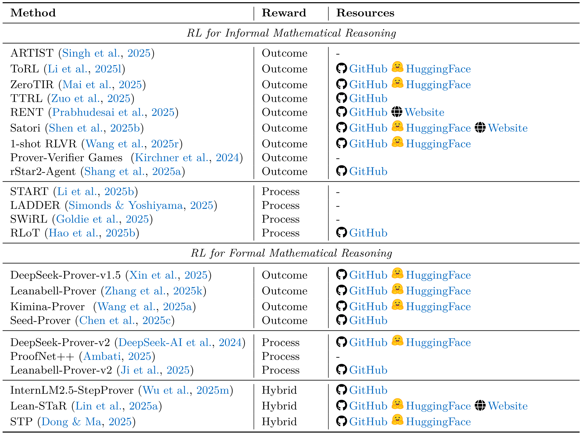

**表 6。** 数的推論エージェントの RL メソッドの概要。

### 4.4 GUIエージェント

GUI エージェントは、異なるトレーニング パラダイムを通じて進歩してきました。初期のシステムは、事前にトレーニングされたビジョン言語モデル (VLM) を純粋なゼロショット方式で使用し、スクリーンショットとプロンプトをシングルステップのアクションに直接マッピングしていました。その後、静的 (画面、アクション) 軌道上の SFT によりグラウンディングと推論が改善されましたが、人間の操作痕跡が乏しいため限界がありました。強化微調整 (RFT) は、GUI インタラクションを逐次的な意思決定として再構成し、エージェントがスパースまたは定形報酬を使って試行錯誤を通じて学習できるようにし、単純な単一タスクの設定から、複雑で現実世界の長期的なシナリオに進化しました。 [表 7](#table-07) は、このセクションで検討した研究の大部分を示しています。

#### 4.4.1 RL フリーのメソッド

**バニラ VLM ベースの GUI エージェント** 初期の GUI エージェントは、純粋にゼロショット方式で事前トレーニング済みのビジョン言語モデル (VLM) を直接活用し、タスク固有の微調整を行わずに、スクリーンショットとプロンプトをシングルステップのアクションにマッピングしていました。代表的なシステムには、MM-Navigator [Yan23c]、SeeAct [Zhe24b]、TRISHUL [Sin25] などがあります。これらは、インターフェイス ドメインや解析戦略が異なりますが、既製の VLM への依存性は同じです。これらのアプローチは基礎モデルの汎用性を示していますが、接地精度と信頼性が限られているため、複雑なタスク [Zha25m, Ngu25] への適用が制限されています。

**静的軌跡データを使用した教師あり微調整 (SFT)** SFT パラダイムは、オンラインでの対話を行わずに、オフライン (画面、アクション) ペアでのクロスエントロピー損失を最小限に抑えることにより、事前トレーニングされた視覚言語モデルを GUI タスクに適応させます。 InfiGUIAgent [Liu25n] は 2 段階のパイプラインを採用しており、まず基礎を改善し、次に階層的およびリフレクション的推論を組み込みます。 UI-AGILE [Lia25a] は、継続的な報酬、単純化された推論、トリミングベースのリサンプリングを組み込むことで教師付き微調整を強化し、さらに高解像度ディスプレイを処理するための分解されたグラウンディング メカニズムを提案します。 TongUI [Zha25l] は代わりにデータ スケールを強調し、マルチモーダル Web チュートリアルから 143K 軌道の GUI-Net を構築して一般化を強化します。焦点は異なりますが、これらのアプローチはすべて、人間による操作の痕跡が乏しいという限界に直面しています。

#### 4.4.2 静的 GUI 環境での RL

静的設定では、強化学習は、実際の環境での相互作用がない場合の結果評価にルールベースの基準を使用して、決定論的な実行トレースを持つ事前収集されたデータセットに適用されます。 GUI-R1 [Luo25f] は、統一されたアクション スキーマ上に R1 スタイルの強化微調整パイプラインを採用し、シンプルな形式と正確さの報酬を使用して、控えめなデータでステップレベルのアクション予測を改善します。 UI-R1 [Lu25e] は、グループ相対ポリシーの最適化を適用して方策の更新を安定させ、コンパクトなアクション インターフェイスとアクション タイプと引数の精度に対する報酬形成を通じて正確なパラメーターの一致を向上させます。 InFiGUI-R1 [Liu25o] では、まず空間推論を抽出してグラウンディングを強化し、次にサブ目標の監視と回復メカニズムを使用した強化学習を行って長期推論を改善する 2 段階のトレーニング パラダイムを導入しています。 AgentCPM-GUI [Zha25am] は、グラウンディングを意識した事前トレーニング、教師付き模倣、GRPO ベースの強化微調整を簡潔な JSON アクション スペースと組み合わせて、デコードのオーバーヘッドを削減しながら、長いホライズン シーケンスでの堅牢性を向上させます。 UI-Venus [Gu25b] は、カスタム報酬関数と自己進化する軌道フレームワークを備えた RFT 経由で微調整されたマルチモーダル スクリーンショット ベースの UI エージェントで、UI グラウンディングとナビゲーションの両方で新しい最先端のパフォーマンスを実現します。

#### 4.4.3 インタラクティブ GUI 環境での RL

インタラクティブな設定では、強化学習エージェントは動的環境でのオンライン ロールアウトを通じて最適化され、確率的遷移と長期的な依存関係に対する堅牢性が必要となります。 WebAgent-R1 [Wei25f] は、非同期軌道生成とグループごとの利点を備えたエンドツーエンドのマルチターン強化学習を実行し、さまざまな Web タスクの成功を向上させます。 [Vat25] は、現実的なページ ダイナミクスと大規模なアクション スペースの下で Web エージェントの強化学習を研究し、信用割当と安全な探索における課題を強調しています。 UI-TARS [Qin25a] は、GUI を理解するための事前トレーニングとネイティブ デスクトップ コントロールの強化学習を統合し、マイルストーンの追跡とリフレクションを組み合わせて長期的な実行を強化します。 DiGiRL [Bai24a] は、実際の Android デバイス上にオフラインからオンラインへの強化学習パイプラインを導入し、アドバンテージに重み付けされた更新、二重に堅牢なアドバンテージ推定、および非定常性に対処するための命令レベルのカリキュラムを組み合わせています。 ZeroGUI [Yan25h] は、ビジョン言語評価器を使用してタスクの生成と報酬の推定を自動化し、次に 2 段階のオンライン強化学習 (生成されたタスクのトレーニングとそれに続くテスト時間の適応) を適用して人間の監督を軽減します。 MobileGUI-RL [Shi25c] は、軌道を意識した GRPO、減衰効率報酬、カリキュラム フィルタリングを使用して Android 仮想デバイス上でトレーニングを拡張し、大規模なロールアウト ボリュームに対してシステムを実用的に保ちながら、実行効率と汎用性を向上させます。 ComputerRL [Lai25] は、大規模並列の完全非同期 RL インフラストラクチャと新しい Entropulse トレーニング戦略 (教師付き微調整を備えた交互 RL) と組み合わせた API-GUI ハイブリッド インタラクション パラダイムを導入し、GUI ベースのエージェントがデスクトップ環境で効率的かつスケーラブルに動作できるようにします。

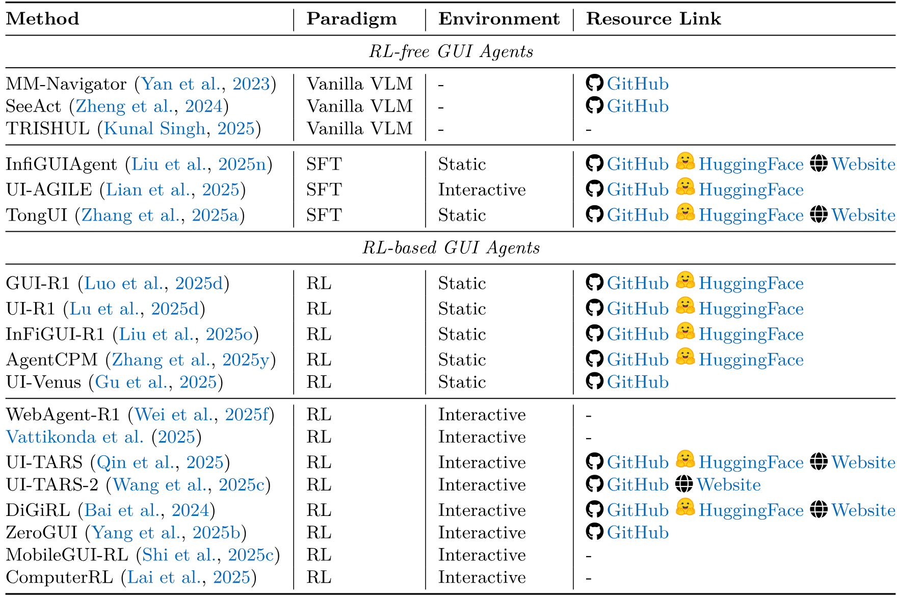

**表 7。** トレーニング パラダイムと環境の複雑さによって分類された GUI エージェントのメソッドの概要。

### 4.5 視覚エージェント

RL は、幅広い視覚タスク (画像、ビデオ、3D 認識および生成を含むがこれらに限定されない) に適用されています。関連する論文の数は膨大であるため、このセクションでは網羅的な概要を提供することを目的としていません。さまざまな視覚タスクの RL に関するより包括的な調査については、視覚 [Wu25k, Zho25c] の 2 つの専用調査を読者に紹介します。

**画像タスク。** DeepSeek-R1 [Dee25c] の成功により、長い形式の推論動作を奨励するために RL を適用することへの広範な関心が引き起こされ、LVLM が視覚認識と [Sha24c] の理解を向上させる拡張 CoT シーケンスを生成することが奨励されました。この研究の軌跡は、R1 スタイルの目標を視覚領域に単純に適応させた初期の研究 (主に受動的な知覚 [Tan25a, Li25w, Hua25c, She25a, Pen25a, Xia25a, Yan25i, Gao25a] を強化することを目的とした) から、現在人気のある能動的な知覚のパラダイム、つまり「イメージによる思考」 [Su25b] に向けて進化しました。重要な移行は、画像を一度参照するテキストのみの CoT から、(i) グラウンディング [Li25g, Nag16a, Mao16, Fan25b, Chu25c, Cao25a]、(ii) エージェント ツールの使用 [Zha25ar, Hua25d, Wu25j, Su25a, Liu25v, Su25]、および (iii) スケッチまたは生成 [Xu25e, Dua25, Jia25b] による視覚的想像力を通じて達成される、インタラクティブで視覚的に根拠のある推論への移行にあります。テキストのみの出力以外にも、シーンの理解などの多くの視覚タスクでは、境界ボックス、マスク、セグメンテーション マップなどの構造化された予測が必要です。まず、Visual-RFT [Liu25v] はバウンディング ボックス出力の検証可能な報酬として IoU を自信を持って使用しますが、Vision-R1 [Hua25c] はローカリゼーション報酬として精度と再現率を組み込みます。このアイデアを拡張して、[Liu25p] は GRPO をセグメンテーション タスクに適用し、ソフト報酬とストリクト報酬をバウンディング ボックス IoU および L1 損失、ポイントごとの L1 距離と組み合わせます。 VLM-R1 [She25a] は、LVLM の検出および位置特定機能を明示的に奨励する報酬として平均平均精度 (mAP) を採用しています。最後に、R1-SGG [Che25r] では、テキスト マッチングと IoU に基づくハードな報酬から、テキスト埋め込みドット積によって計算されるソフトな報酬まで、シーン グラフ マッチングに対する GRPO 報酬の 3 つのバリアントが導入されています。 RL は、特に拡散およびフロー モデル (RePrompt [Wu25i]、Diffusion-KTO [Li24n]、Flow-GRPO [Liu25d]、GoT-R1 [Dua25] など) との統合を通じて、画像生成にも広く適用されています。拡散ベースのアプローチを超えて、RL は自己回帰画像生成に活用されており、タスクまたはユーザー固有の報酬信号 [Wan25q, Jia25b, Yua25] を直接最適化することで、一貫性、忠実度、制御性が向上します。

**ビデオ タスク。** 同じ精神に従って、多くの研究が GRPO のバリアントをビデオ ドメイン [Che24q, Fen24b, Maa23] に拡張して、時間的推論 [Par25a, Li25m, Zhu25f, Lia25f, Ouy25a] を強化しました。 TW-GRPO [Dan25] は、より焦点を絞った推論チェーンを生成するために高情報トークンを強調し、より低い分散の最適化のためにソフトな複数選択の報酬を採用するトークン重み付け GRPO フレームワークを導入します。 EgoVLM [Vin25] は、キーフレームベースの報酬と直接 GRPO トレーニングを組み合わせて、自己中心的なビデオに合わせて調整された解釈可能な推論トレースを生成します。 DeepVideo-R1 は、GRPO 目標を回帰タスク [Par25a] として再定式化する一方、VideoChat-R1 は、強化微調整 (RFT) がタスク固有のビデオ推論の改善 [Li25m] において非常にデータ効率が高いことを実証します。 TinyLLaVA-Video-R1 は、より小さなビデオ LLM [Zha25ag] への RL のスケーリングを検討しており、[Che25o] では、長いビデオ向けの大規模な RL をサポートするためのインフラストラクチャと 2 段階のパイプライン (CoT-SFT + RL) を導入しています。追加の取り組みにより、具体化されたビデオ推論タスク [Zha25ap] の RL も拡張されました。同様の傾向はビデオ生成でも観察され、RL が適用されて時間的一貫性、制御性、セマンティック整合性が向上します。主な例には、DanceGRPO [Xue25]、GAPO [Zhu25d]、GRADEO [Mou25]、InfLVG [Fan25d]、Phys-AR [Lin25c]、VideoReward [Liu25e]、TeViR [Che25n]、InstructVideo [Yua24c] などがあります。

**3D ビジョン タスク。** RL は、3D の理解 [Hon23a, Xu24d, Den24a, Che24g, Zho23b, Che24j] と [Wan24u, Yin25, Sid24] の生成を進めるためにも広く採用されています。 MetaSpatial [Liu25w] は、3D 空間推論のための初の RL ベースのフレームワークを導入し、トレーニング中の報酬として物理認識の制約とレンダリングされたイメージの評価を活用します。 Scene-R1 [Yua25c] は、ポイントごとの 3D 監視なしで 3D シーンについて推論することを学習しますが、SpatialReasoner [Ma25c] は、認識、計算、推論の各段階を統合する共有 3D 表現を導入します。 3D 生成の領域では、テキストと 3D の位置合わせと制御性を向上させるために RL が適用されています。注目すべき取り組みには、生成結果を人間の選好に合わせる DreamCS [Zou25] が含まれます。 DreamDPO [Zho25h] および DreamReward [Ye24b]。2D 報酬信号を使用して 3D 生成を最適化します。 Nabla-R2D3 [Liu25i] は、強化学習駆動の目的関数を使用して 3D 出力をさらに洗練します。

### 4.6 身体化されたエージェント

身体化エージェントには、視覚言語アクション (VLA) モデルから言語駆動型のオープンエンド エージェントに至るまで、構造化された環境を認識し、その中で動作する幅広いシステム群が含まれます。最近のシステムの多くは、現実世界の視覚的観察に基づいた基礎を必要とする VLA 設定に焦点を当てていますが、すべての身体化されたエージェントは、複雑な物理環境またはシミュレートされた環境で効果的に動作し、高レベルの命令に基づいて目標指向の行動を実行するために、知覚、推論、およびアクションを統合する必要があります。これらのコンピテンシーは、具体化されたシナリオにおけるエージェント LLM および MLLM の基礎的なコンポーネントを形成します。命令主導の身体化シナリオでは、RL はトレーニング後の戦略としてよく使用されます。共通のパイプラインは、教師の強制的な監督下での模倣学習を通じて取得された、事前トレーニング済みのビジョン言語アクション (VLA) モデル [Kim24b, Bla24a, Tea25g, Lia25e] から始まります。このモデルは、環境と連携して報酬シグナルを収集する対話型エージェントに組み込まれます。これらの報酬は、ポリシーの反復的な改良を導き、効果的な探索をサポートし、サンプル効率を向上させ、現実世界の多様な条件にわたってモデルの一般化機能を強化します。 VLA フレームワーク [Tea25d, Lu25b, Qi25, Son25e] の RL は、複雑な環境での空間推論と移動に重点を置くナビゲーション エージェントと、多様で動的な制約の下での物理オブジェクトの正確な制御に重点を置く操作エージェントの 2 つのクラスに大きく分類できます。

**VLA ナビゲーション エージェントの RL。** ナビゲーション エージェントにとって、計画は中心的な機能です。強化学習は、将来のアクション シーケンスを予測して最適化する VLA モデルの能力を強化するために採用されています。 [Zha25aq] の一般的な戦略は、段階的な方向性報酬を使用して、従来のロボティクス スタイルの RL を VLA ベースのナビゲーション フレームワークに直接統合することです。いくつかのアプローチは軌道レベルで動作します。 VLN-R1 [Qi25] は、予測パスとグラウンドトゥルース パスを調整して軌道レベルの報酬を定義し、DeepSeek-R1 に続いて GRPO を適用して予測計画を改善します。 OctoNav-R1 [Gao25a] も GRPO を活用していますが、VLA モデル内の内部審議を強化することに重点を置き、より先読み的で堅牢なナビゲーションを可能にする、行動する前に考えるパラダイムを促進します。 S2E [He25b] は、対話性と安全性を備えたナビゲーション基盤モデルを強化する強化学習フレームワークを導入し、ビデオ事前トレーニングと RL を組み合わせて、NavBench-GS ベンチマークで優れた一般化とパフォーマンスを実現します。

**VLA 操作エージェントの RL。** 通常、ロボット アームを含む操作エージェントには、さまざまな条件下で構造化されたタスクを実行するためのきめの細かい制御が必要です。これに関連して、RL は、VLA モデルの命令追従機能と軌道予測機能を強化するために、特にタスクや環境全体にわたる一般化を向上させるために使用されます。 RLVLA [Liu25f] および VLA-RL [Lu25b] は、事前トレーニングされた VLM を評価者として採用し、そのフィードバックを使用して VLA ポリシー改良のための軌道レベルの報酬を割り当てます。これらの方法は、操作パフォーマンスを効果的に向上させ、有利なスケーリング特性を示すオンライン RL フレームワークを確立します。 TGRPO [Che25p] は、予測された軌跡に対してルールベースの報酬関数を定義することにより、GRPO を操作タスクにさらに組み込みます。これにより、VLA モデルを目に見えないシナリオに一般化できるようになり、現実世界の展開における堅牢性が向上します。 VIKI-R [Kan25] は、統合されたベンチマークと、マルチエージェントの具体化された協力のための 2 段階のフレームワークでこれを補完し、思考連鎖の微調整とマルチレベル RL を組み合わせて、さまざまな実施形態にわたる構成調整を可能にします。

VLA を体現したエージェントの RL における中心的な課題は、トレーニングを現実世界の環境に拡張することです。シミュレーション プラットフォームにより効率的な大規模実験が可能になりますが、特にきめの細かい操作タスクでは、シミュレーションと実際のギャップが依然として顕著です。物理的なロボット実験はコストが高く複雑であるため、現実世界の設定で RL を直接実施することは、現時点では非現実的です。ほとんどの RL アルゴリズムには何百万もの対話ステップが必要であり、これにはかなりの時間、リソース、メンテナンスが必要です。その結果、シミュレーションと現実世界の展開の間のギャップを埋めることができる、スケーラブルな具体化された RL パイプラインの開発は、未解決かつ差し迫った問題のままです。

**ケーススタディ: Voyager。** 身体化された RL におけるこれらの一般的な課題を超えて、言語駆動型のオープンエンドの身体化エージェントである Voyager [Wan24m] は、計画、スキル習得、および RL ベースのカリキュラム学習が実際にどのように統合できるかを示しています。エージェントは反復ループを使用して Minecraft を探索します。エージェントは計画を生成し、環境と対話し、成功した軌跡から再利用可能なスキルを抽出して、成長するスキル ライブラリに保存します。カリキュラム スケジューラーは、エージェントの現在のスキル セットに基づいて新しいタスクを選択します。一方、RL 目標は、どの行動をスキルとしてコミットする必要があるか、いつそれらを洗練または破棄するかをガイドします。これにより、計画、環境との相互作用、記憶、RL 主導のカリキュラムの最適化が密接に結びついた自己改善サイクルが生まれます。

### 4.7 マルチエージェント システム

大規模言語モデル (LLM) ベースのマルチエージェント システム (MAS) は、構造化された対話、調整、メモリ管理を通じて複雑なタスクを解決するために協力する複数の自律エージェントで構成されます。 CAMEL や MetaGPT [Li23t, Hon24a] などの初期の静的で手作業で設計された MAS では、役割の特化とタスクの分解が検討されていましたが、MAD や MoA [Wan25r, Lia24a] などのディベートベースのフレームワークは、協調的な改良を通じて推論を強化しました。その後のマルチエージェント研究は、MAS が調整パターンを動的に調整するだけでなく、エージェントレベルの推論と意思決定戦略を直接強化できるようにする、最適化可能な協力システムの提案に移行しました。 [表 8](#table-08) は、このセクションで説明する研究の本体をまとめたものです。

**RL フリーのマルチエージェント進化** RL フリーの自己進化設定では、基礎モデルを直接最適化することはできません。代わりに、システムの進化は、シンボリック学習 [Zho24g]、動的グラフ最適化 [Zhu24b, Ma25d, Zho25d]、ワークフロー書き換え [Hu25c, Zha25u, Zha25t] などのメカニズムによって推進されます。これらの方法は MAS 内の調整と適応性を向上させますが、基礎モデルのパラメーターを直接更新することはできません。

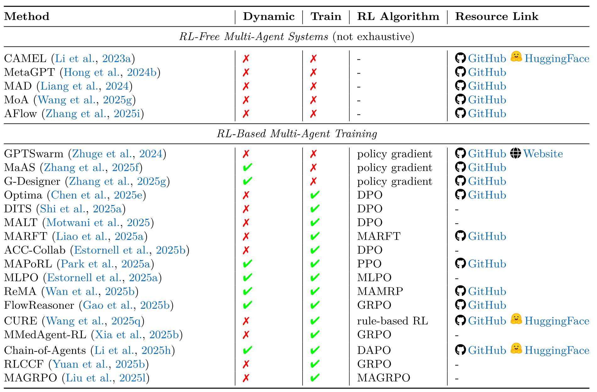

**表 8。** LLM ベースのマルチエージェント システムにおける強化学習と進化パラダイムの概要。 「動的」は、マルチエージェント システムがタスク動的であるかどうか、*つまり*、異なる構成 (エージェント数、トポロジ、推論の深さ、プロンプトなど*) で異なるタスク クエリを処理するかどうかを示します。 「トレーニング」は、その方法にエージェントの LLM バックボーンのトレーニングが含まれるかどうかを示します。

#### 4.7.1 ノンパラメトリック調整モジュールの RL 駆動の最適化

これらのアプローチでは、RL を使用して通信トポロジ、ルーティング ポリシー、ワークフロー グラフなどの外部調整構造を最適化している間、エージェント パラメータが固定されたままになります。 GPTSwarm、MaAS、G-Designer [Zhu24b, Zha25q, Zha25r] などのメソッドは、MAS 調整を方策勾配を介して更新されるグラフレベルの方策として扱います。エージェント レベルの勾配が存在しないため、信用割当はトポロジ レベルまたはメッセージ ルーティング レベルで動作する必要があります。通常、報酬は遅れてまばらであり（たとえば、最終タスクの精度のみ）、崩壊を避けるためにグローバルからローカルへの信用分解または構造的事前分布が必要です。

*固定通信プロトコル* (事前に指定されたメッセージ形式) と *学習可能なプロトコル* の間に重要な比較が現れます。固定プロトコルは、安定性が重要な低データまたは高度に特殊化された領域で優れていますが、学習可能なプロトコルを使用すると、RL は効率的な緊急通信を発見できますが、過剰適合や規則の劣化を防ぐために、サンプルの大幅な複雑さと慎重な正則化が必要になります。

#### 4.7.2 選択したエージェント ポリシーの RL 主導の最適化

2 番目のクラスのシステムは、エージェントのサブセット (多くの場合、リーダー、コーディネーター、専門家) のみを更新し、他のエージェントは安定性を確保するためにフリーズしたままにします。代表例としては、Optima、DITS、MALT、ACC-Collab [Che25j, Shi25a, Mot25, Est25a]などがあります。これらのアプローチは柔軟性と拡張性のバランスをとっています。つまり、少数のエージェントのみをトレーニングすることでサンプルの複雑さが軽減され、完全に分離された信用割当の不安定性が回避されます。 MALT [Mot25] は、異種マルチエージェント検索ツリーを採用して大規模なラベル付き軌跡を生成し、成功した推論パスと失敗した推論パスの両方から教師あり微調整 (SFT) と直接選好最適化 (DPO) を組み合わせてエージェントを微調整します。

この体制における信用割当は基本的に *半局所的*です。報酬は集合的な軌道から現れますが、勾配は最適化されたエージェントにのみ適用されます。これには、更新されていないエージェントによる報酬ハイジャックを防ぐために、ロール条件付き DPO [Mot25]、ローカル利点の推定、反事実ベースラインなどのメカニズムが必要です。経験的には、このような部分的な最適化は、完全に共同したマルチエージェントトレーニングよりも優れたサンプル効率をもたらしながら、依然として専門化された役割の出現を可能にします。

#### 4.7.3 エンドツーエンドのマルチエージェント型強化学習

完全なマルチエージェント RL は、通常 Dec-POMDP として形式化された、共有または分散された目標の下ですべてのエージェントを共同トレーニングします。 MAGRPO、MAPoRL、MLPO、ReMA、FlowReasoner、Chain-of-Agents、SPIRAL [Liu25l, Par25, Est25, Wan25k, Gao25b, Li25j, Liu25b] などのメソッドは、コラボレーションと推論動作を共同で最適化し、新たな分業とコミュニケーション規約を可能にします。たとえば、MAGRPO [Liu25l] は、マルチ LLM 協力を Dec-POMDP 問題として形式化し、GRPO のマルチエージェント バリアントを導入します。これにより、分散実行を維持しながら MAS での LLM エージェントの共同トレーニングが可能になります。 MAPoRL [Par25] は、議論の応答を検証し、検証結果を RL 報酬として使用して協調推論を改善することにより、MAD を拡張します。 RLCCF [Yua25a] は、自己整合性加重アンサンブル投票を利用して疑似ラベルを生成し、GRPO を介して個々のモデル 方策を共同で最適化し、個別および集合的な推論の精度を高める自己監視型マルチエージェント RL フレームワークです。 ReMA [Wan25k] は、推論をメタ思考エージェントと実行エージェントに分離し、パラメーター共有を使用して調整された RL 目標の下で共同トレーニングされます。 LERO [Wei25d] は、MARL と LLM が生成するハイブリッド報酬および進化的検索を組み合わせて、協調タスクにおけるクレジットの割り当てと部分的な可観測性の処理を改善します。 CURE [Wan25ab] はコード生成に焦点を当てており、RL を介してコード ジェネレーターとユニット テスターを共同トレーニングして、より豊富な報酬信号を生成し、多様なコーディング ベンチマークにわたって強力な一般化を実現します。 MMedAgent-RL [Xia25b] は、医療 VQA 向けの強化学習ベースのマルチエージェント フレームワークを導入します。そこでは、動的に調整された一般開業医と専門家がカリキュラムに沿った学習で協力して推論し、既存の Med-LVLM を大幅に上回り、より人間らしい診断動作を実現します。エージェントチェーン (COA) [Li25j] は、ロールプレイングエージェントとツールを使用するエージェントを動的に調整することで、単一の LLM がマルチエージェントのコラボレーションをシミュレートするエンドツーエンドのパラダイムです。これは、マルチエージェント蒸留 (最先端のマルチエージェント システムからの軌跡をトレーニング データに変換する) と、慎重に設計された報酬関数を使用したエージェント型強化学習によって達成され、その結果、エージェント基盤モデル (AFM) が生成されます。 SPIRAL [Liu25b] は、ゼロサム ゲームにおける LLM 向けの完全オンライン、マルチターン、マルチエージェントのセルフプレイ強化学習フレームワークを提示し、役割条件付き有利推定 (RAE) を備えた共有方策を採用して学習を安定させ、ゲームプレイが数学的および一般的な推論のベンチマークを大幅に向上させる移転可能な推論スキルを育成することを実証します。

ただし、エンドツーエンドのマルチ LLM トレーニングでは、報酬が長い複数ターンのインタラクション チェーンに依存する可能性があるため、*時間的および構造的な信用割当* の問題が悪化します。ソリューションには、役割条件付きアドバンテージ推定 (RAE)、階層型コントローラー - ワーカー アーキテクチャ (MLPO、ReMA)、およびますます困難なインタラクションを構築することで報酬シグナルを高密度化するセルフプレイ カリキュラム (SPIRAL) が含まれます。これらの階層パターンは、監視エージェントが複数のワーカーを調整する企業の展開を反映しています。 RL は、まばらな報酬設定の下で安定した委任および調停戦略を学習するのに特に効果的であることが証明されています。その表現力にもかかわらず、共同 MARL アプローチはスケーラビリティの限界に直面しています。つまり、サンプルの複雑さはエージェントの数に応じてほぼ直線的に、インタラクションの深さに応じて二次的に増加します。 MAGRPO や PPO ベースの MAPoRL などのアルゴリズムは、中央集約型クリティックや価値共有ベースラインを使用してこれを軽減しますが、スケーラブルな信用分解を達成することは依然として中心的な未解決の課題です。

### 4.8 その他のタスク

**TextGame。** ARIA [Yan25k] は、意図に基づいた報酬の集約によって広大なアクション スペースを圧縮し、まばらさと分散を削減します。 GiGPO [Fen25b] は、計算負荷を追加することなく、階層的なグループ化を通じて一時的なクレジットの割り当てを強化します。 RAGEN [Wan25ag] は、推論を意識した報酬を推奨しながら、軌道をフィルタリングして勾配を安定させることにより、安定したマルチターン学習を保証します。 SPA-RL [Wan25m] は、遅延報酬をステップごとの信号に分解し、パフォーマンスと接地精度を向上させます。 Trinity-RFT [Pan25a] は、テキスト ゲームを含むタスク全体で強化を微調整するための統合されたモジュール式フレームワークを提供し、多様な RL モードとデータ パイプラインを使用した柔軟で効率的かつスケーラブルな実験を可能にします。

**表。** SkyRL-SQL [Liu25j] は、Text-to-SQL 用のデータ効率の高いマルチターン RL パイプラインを導入し、LLM エージェントが対話的にデータベースを調査し、SQL クエリを調整し、検証できるようにします。 SkyRL-SQL-7B モデルは、わずか 653 のトレーニング サンプルで、SQL 生成ベンチマークで GPT-4o と o4-mini の両方を上回っています。 MSRL [Che25f] は、チャートからコードへの生成における SFT プラトーを克服するために、複数粒度の報酬を備えたマルチモーダル構造化強化学習を導入し、チャート理解ベンチマークで最先端のパフォーマンスを実現します。

**時系列。** Time-R1 [Liu25t] は、進歩的な強化学習カリキュラムと動的なルールベースの報酬システムを通じて、包括的な時間推論能力を備えた中規模の LLM を強化します。 TimeMaster [Zha25y] は、SFT と GRPO を組み合わせた時系列 MLLM をトレーニングして、視覚化された時系列入力に対する構造化された解釈可能な時間的推論を可能にします。

**一般的な QA。** エージェント モデル [Zha25ak] は、行動連鎖の生成を内部化し、教師あり微調整と強化学習の組み合わせを通じて自律的かつ効率的な意思決定を可能にします。 L-Zero [Zha25x] を使用すると、低コストで拡張可能なサンドボックス化された同時エージェント ワーカー プールを利用した、スケーラブルなエンドツーエンドの強化学習パイプラインを通じて、大規模な言語モデルを汎用エージェントにすることができます。

**ソーシャル。** Sotopia-RL [Yu25e] は、粗いエピソード レベルの報酬を発話レベルの多次元信号に洗練し、部分的な可観測性と多面的な目標の下で、社会的にインテリジェントな LLM の効率的かつ安定した RL トレーニングを可能にします。 [Wan25s] は、適応モード ポリシー最適化 (AMPO) アルゴリズムを備えた適応モード学習 (AML) フレームワークを導入します。このフレームワークは、強化学習を使用してソーシャル インテリジェンス タスクにおける複数粒度の推論モードを動的に切り替え、GRPO のような固定深さの RL 手法よりも高い精度と短い推論チェーンを実現します。

) とアプリケーション ドメイン ([第 4 節](#section-4)) をリンクするナビゲーション支援を提供します。](../../papers/agentic-reinforcement-learning/table-09.png)

**表 9。** アプリケーション機能の依存関係マトリックス。ドットは定性的な依存関係レベルを示します: $\bullet$ コア、$\circ$ サポート、 – 最小。ヒートマップは、機能分類 ([第 3 節](#section-3)) とアプリケーション ドメイン ([第 4 節](#section-4)) をリンクするナビゲーション支援を提供します。

## 5 環境と枠組み

### 5.1 環境シミュレータ

エージェント型強化学習では、環境はエージェントが対話する世界であり、アクチュエーターを通じて感覚入力 (観察) を受け取り、選択 (アクション) を実行します。環境は、エージェントのアクションに応答して、新しい状態に移行し、報酬信号を提供します。 LLM エージェント パラダイムの台頭により、多くの研究で特定のタスクをトレーニングするための環境が提案されています。 [表 10](#table-10) は、このセクションで検討する主要な環境の概要を示しています。

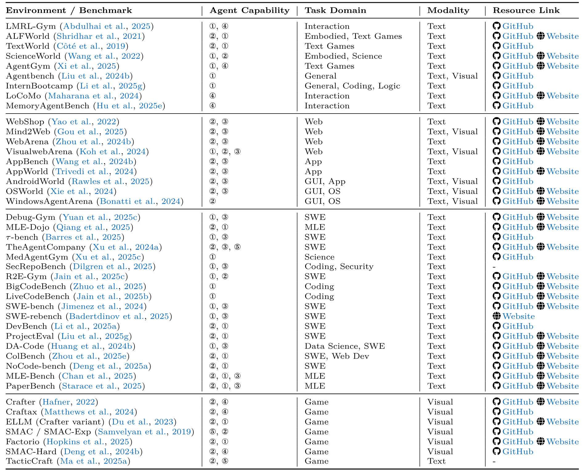

**表 10。** エージェントの機能、タスク ドメイン、モダリティごとに分類された、エージェント型強化学習の環境とベンチマークの概要。エージェントの能力は、①推論、②計画、③ツールの使用、④記憶、⑤コラボレーション、⑥自己改善によって表されます。

#### 5.1.1 Web 環境

Web ベース環境の領域では、いくつかのベンチマークが、Agentic RL に制御された現実的な静的環境を提供します。 WebShop [Yao22c] は、現実世界の製品の大規模なカタログとクラウドソースのテキストによる説明を特徴とする模擬電子商取引 Web サイトです。エージェントは、再現性を支援する決定論的な検索エンジンを使用して、さまざまな種類の Web ページをナビゲートし、製品を検索して購入するためのさまざまなアクション (検索、項目の選択、カスタマイズ、購入など) を発行します。さらに、Mind2Web [Gou25] は、ジェネラリスト Web エージェント向けに設計されたデータセットで、さまざまなドメインにわたる多くの実世界の Web サイトからの膨大な数のタスクを特徴としています。フライトの検索やソーシャル プロフィールの操作などのタスクに対して、Web ページのスナップショットとクラウドソースのアクション シーケンスを提供し、目に見えない Web サイトやドメイン全体にわたる一般化を強調します。同様に、WebArena [Zho24f] とそのマルチモーダル拡張機能 VisualwebArena [Koh24] は、Docker コンテナとして提供される自己ホスト型で再現可能な Web 環境です。 WebArena は、電子商取引、ソーシャル フォーラム、共同開発、コンテンツ管理システムなどの一般的なドメインにわたる完全に機能する Web サイトを備え、ユーティリティ ツールやナレッジ ベースが充実しており、マルチタブ タスクとユーザー ロール シミュレーションをサポートしています。 VisualwebArena は、視覚的な理解を必要とする新しいタスクと、スクリーンショット上の対話可能な要素に注釈を付けるための「Set-of-Marks」(SoM) 表現を導入することでこれを拡張し、マルチモーダル Web エージェントのギャップを埋めます。さらに、AppWorld [Tri24a] は、マルチアプリケーション エコシステムをシミュレートする環境を構成し、457 の呼び出し可能な API を備えた 9 つの日常使用アプリケーション (Amazon、Spotify、Gmail など) を網羅し、約 100 の仮想キャラクターとその社会的関係を特徴とするデジタル世界を構築します。エージェントは、API を呼び出すコードを記述して、複雑なタスク (旅行計画や社会的関係の管理など) を実行します。これらの環境では、Web ページまたは視覚要素に対するすべての変更は、エージェントのアクションにのみ応じて発生します。

#### 5.1.2 GUI 環境

AndroidWorld [Raw25] は、ライブ Android エミュレータ上で動作するベンチマーク環境としてそのようなダイナミズムを例示しており、20 の実世界のアプリケーションにわたる 116 の手作りタスクを特徴としています。その動的な性質は、何百万もの固有のタスクのバリエーションを生成するパラメーターのインスタンス化によって強調され、エージェントの直接の影響なしに環境が確実に新しい構成に進化します。エージェントは、リアルタイムの状態フィードバックを受け取りながら、一貫したインターフェイス (画面操作、アプリ ナビゲーション、およびテキスト入力をサポート) を通じて対話し、MiniWoB++ との統合により、適応パフォーマンスを評価するための永続的な報酬シグナルを提供します。 OSWorld [Xie24a] は、マルチモーダル エージェント用のスケーラブルな実コンピューター環境で、Ubuntu、Windows、macOS にわたるタスクのセットアップと実行ベースの評価をサポートします。これには、実際の Web およびデスクトップ アプリケーション、OS ファイル I/O、および複数のアプリケーションにまたがるワークフローを含む、現実世界のコンピューター タスクが多数含まれており、すべての OS 状態の変更はエージェントのアクションによって排他的にトリガーされます。

#### 5.1.3 コーディングおよびソフトウェア エンジニアリング環境

コード関連のタスクは、幅広い実行可能環境とベンチマークでサポートされています。これらは、エージェントが状態を直接変更する対話型環境と、厳選されたタスクと評価パイプラインを提供するベンチマーク/データセットに大別できます。

**対話型 SWE 環境。** いくつかの環境では、ソフトウェア エンジニアリング ワークフローの下でエージェントと環境の対話がインスタンス化されます。 Debug-Gym [Yua25b] は、デバッグ設定における LLM エージェント用のテキストベースの対話型コーディング環境です。エージェントに Python デバッガー (pdb) などのツールを提供して、バグのあるコードベースを積極的に探索および変更し、リポジトリ レベルの情報処理をサポートし、Docker コンテナを介して安全性を確保します。 R2E-Gym [Jai25b] は、SWE-Gen パイプラインとハイブリッド ベリファイアを利用して、8K を超えるソフトウェア エンジニアリング タスクの手続き的に生成された実行可能なジム スタイルの環境を構築します。 TheAgentCompany [Xu24c] は、ソフトウェア開発会社をシミュレートします。エージェントは、Web ブラウジング、コーディング、プログラムの実行、シミュレートされた同僚とのコミュニケーションなどの専門的なタスクを実行する「デジタル ワーカー」として機能します。部分的な評価のためのチェックポイントを備えた長期にわたるさまざまなタスクが特徴で、現実的な職場環境でエージェントに包括的なテストベッドを提供します。これらすべての環境において、根本的な問題定義とコードベースは修正されたままであり、変更はエージェントのアクションの結果としてのみ発生します。

**コーディング ベンチマークとデータセット。** 幅広いベンチマークとデータセットは、厳選されたタスク スイートと評価パイプラインの構築に焦点を当てています。 HumanEval [Che21e] は、pass@k メトリックを介して機能の正確さを測定するための 164 の手作りの Python プログラミング タスクのベンチマークを導入します。 MBPP [Aus21b] は、短いプログラム合成を評価するための自然言語記述を備えた 974 のエントリーレベルの Python タスクを提供します。 BigCodeBench [Zhu25h] は、複数の関数呼び出しの構成を必要とする 1,140 タスクの大規模で汚染のない関数レベルのベンチマークを提案します。 LiveCodeBench [Jai25a] は、実際の競合問題から継続的に更新される汚染のないベンチマークを構築します。 SWE ベンチ [Jim24] は、実際の G​​itHub の問題から派生した、動的で実行駆動型のコード修復ベンチマークを導入します。 SWE リベンチ [Bad25a] では、トレーニングと評価の両方のために継続的な GitHub マイニング パイプライン ($>$21k タスク) が導入されています。 DevBench [Li25c] は、設計、セットアップ、実装、テストにわたるエンドツーエンドの開発を評価します。 ProjectEval [Liu25g] は、シミュレートされたユーザー インタラクションを使用して、LLM によって生成され、人間がレビューしたプロジェクト タスクを構築します。 ColBench [Zho25g] は、段階的な報酬を得るために特権クリティカルを使用してマルチターン バックエンド/フロントエンド タスクをインスタンス化します。 NoCode ベンチ [Den25a] は、実際のコードベース全体にわたるドキュメントの更新による機能追加に関する LLM を評価します。 CodeBoost [Wan25y] は、コード スニペットを抽出して拡張することにより、データ中心の実行駆動型トレーニング パイプラインとして機能します。

**プログラム的なワールド モデル環境。** 分離されたコーディング タスクを超えて、最近のベンチマークでは、エージェントが実行可能なワールド モデルを誘導できるかどうかが評価されます。 Code World Models Benchmark (CWMB) [Dai24a] では、エージェントが Python の「環境」クラス (具体的には「ステップ」関数) を合成して、グラウンド トゥルースのダイナミクスを複製し、遷移の忠実性と下流の計画ユーティリティの両方を評価する必要があります。これを補完するコード シミュレーション スイート [Mal24a, Mal25a] は、行ごとの実行予測とアルゴリズムの一般化に関するより詳細なテストを提供します。これらのタスクをまとめると、評価の焦点が機能の正確さから、プログラムによるワールド モデルの構築に不可欠なダイナミクス誘導機能とプログラム シミュレーション機能に移ります。

#### 5.1.4 ドメイン固有の環境

**科学と研究。** ScienceWorld [Wan22h] は、初等レベルの科学教育を中心に設計された複雑なテキストベースのタスクに科学シミュレーション (熱力学、電気、化学など) を統合します。 PaperBench [Sta25] は、20 件の ICML 2024 論文をゼロから再現することで、最先端の機械学習研究を再現する LLM エージェントの能力を評価し、ルーブリック ベースのサブタスクに対してスコア付けします。 $\tau$ ベンチ [Bar25c] は、ソフトウェア エンジニアリング タスクの動的な会話をシミュレートし、基礎となるデータベースの状態と、エージェントの API 呼び出しを通じてのみ変更されるドメイン固有のルールを使用して動作します。

**機械学習エンジニアリング (MLE)。** MLE-Dojo [Qia25a] は、現実世界の Kaggle コンテストに基づいて構築された、反復的な機械学習エンジニアリング ワークフローのための Gym スタイルのフレームワークです。エージェントがソリューションを繰り返し実験、デバッグ、改良するための対話型環境を提供します。 MLE-Bench [Cha25] は、75 の Kaggle コンペティションをキュレーションし、公開リーダーボード上の人間のベースラインに対してエージェントを評価することにより、MLE のベンチマークを確立します。 DA-Code [Hua24e] は、実際のデータセットと実行可能分析に基づいたエージェント型データ サイエンス ワークフローに対応し、このドメインに焦点を当てたベンチマークを提供します。

**生物医学。** MedAgentGym [Xu25c] は、この特殊な科学分野内のタスクに焦点を当てた、生物医学コードの生成とテストのためのドメイン固有の環境を提供します。

**サイバーセキュリティ。** SecRepoBench [Dil25] は、セキュリティ脆弱性修復のためのドメイン固有のベンチマークで、27 のリポジトリと 15 の Common Weakness Enumeration (CWE) カテゴリをカバーします。

#### 5.1.5 シミュレート環境とゲーム環境

テキストベースの環境は、エージェントのアクションが自然言語を通じて表現される対話型設定をシミュレートします。 LMRL-Gym [Abd25] は、「20 の質問」やチェスのようなタスクを含む、マルチターン言語インタラクションにおける強化学習アルゴリズムを評価するためのベンチマークを提供します。 TextWorld [Cot19] は、テキストベースのゲームでエージェントをトレーニングするためのサンドボックス環境で、手動で作成されたゲームと手続き的に生成されたゲームの両方を提供します。ゲームベースの環境では、独自に進化する可能性のある視覚設定も重視されます。 Crafter [Haf22] は、深い探索と長期的な推論をベンチマークする 2D オープンワールド サバイバル ゲームです。 Craftax [Mat24] は、JAX を使用して Crafter に基づいて構築されており、オープンエンド RL の複雑さと GPU アクセラレーションを導入しています。 ELLM [Du23] によって修正された Crafter バリアントは、アクション スペースを拡張し、ディストラクタ タスクを導入します。マルチエージェント調整の場合、SMAC [Sam19] および SMAC-Hard [Den24b] は、協調分散制御用の StarCraft II ベースのベンチマークを提供します。 SMAC-R1 [Den24b]、Adaptive Command [Ma25b]、および TacticCraft [Ma25a] は、StarCraft II スタイルの環境における LLM エージェントのパフォーマンスをさらに向上させます。 Factorio [Hop25] は、エージェントの非アクションによって世界の状態が変化する動的なティックベースの産業シミュレーションを提供します。

#### 5.1.6 汎用環境

一部の環境とベンチマークは、広範な評価や一般的なエージェント機能の向上を目的として設計されています。 AgentGym [Xi25] は、ALFWorld、BabyAI、SciWorld などの決定論的環境で動作する、命令チューニングと自己修正による LLM エージェントの一般化の改善に重点を置いています。 Agentbench [Liu24t] は広範な評価フレームワークとして機能し、SQL ベース、ゲーム ベース、Web ベースのシナリオなど、さまざまな異なる対話型環境にわたってエージェントとして LLM を評価します。 InternBootcamp [Li25i] は、プログラミング、論理パズル、ゲームに及ぶ 1000 を超える検証可能な推論タスクを統合し、RL トレーニングと自動タスク生成のための標準化されたインターフェイスを備えたスケーラブルなフレームワークです。

### 5.2 RL フレームワーク

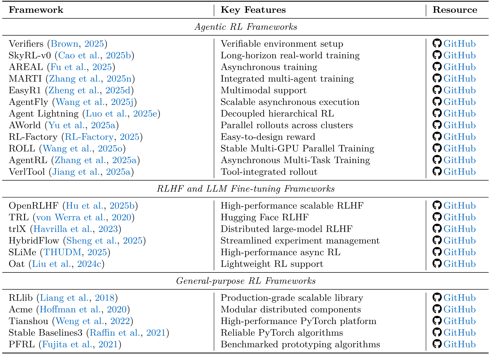

**表 11。** 強化学習のフレームワークを種類と主な機能別に分類した概要。

このセクションでは、この作業に最も関連するコードベース/フレームワークの 3 つのカテゴリ、つまりエージェント RL フレームワーク、RLHF および LLM 微調整フレームワーク、および汎用 RL フレームワークを要約します。 [表 11](#table-11) は、読者の参考のために、一般的な Agentic RL および LLM RL フレームワークの概要を示しています。

**エージェント RL フレームワーク。** Verifiers [Bro25] は、LLM を使用したエンドツーエンドのポリシー最適化のための検証可能な環境セットアップを導入します。一方、SkyRL-v0 [Cao25b] とそのモジュラー後継製品 [Gri25] は、強化学習による長期的な現実世界のエージェント トレーニングを実証します。 AREAL [Fu25] は、言語推論タスクに合わせた非同期分散アーキテクチャでこのパラダイムを拡張し、MARTI [Zha25z] は強化トレーニングと推論を統合するマルチエージェント LLM システムにさらに拡張します。 EasyR1 [Zhe25e] はマルチモダリティのサポートをもたらし、エージェントが統合された RL フレームワークで視覚信号と言語信号を一緒に活用できるようにします。 AgentFly [Wan25u] は、従来の強化学習アルゴリズムを使用して言語モデル エージェントを強化する、スケーラブルで拡張可能なエージェント RL フレームワークを提供します。これにより、高スループット RL トレーニングのためのデコレータベースのツールと報酬定義を介したトークンレベルのマルチターン インタラクション、非同期実行、集中リソース管理が可能になります。 Agent Lightning [Luo25g] は、MDP として実行をモデル化し、階層型 RL アルゴリズム (LightningRL) を使用して、ほぼゼロのコード変更で AI エージェントをトレーニングすることで、エージェントの実行をトレーニングから切り離す、柔軟な RL フレームワークです。 AWorld [Yu25c] は分散型エージェント RL フレームワークであり、クラスター間で大規模な並列ロールアウトを調整することでエージェント トレーニングの主なボトルネックであるエクスペリエンスの生成に取り組み、単一ノードの実行と比較して 14.6 倍の高速化を達成し、スケーラブルなエンドツーエンドのトレーニング パイプラインを可能にします。 ROLL [Wan25z] は、統合コントローラー、並列ワーカー、効率的なマルチ GPU トレーニングのための自動リソース マッピングを備えた大規模な RL 最適化のためのスケーラブルなライブラリを提供します。 VerlTool [Jia25a] は、Verl [She25c] に基づいて構築されたツール使用付きエージェント RL (ARLT) フレームワークを導入し、エージェントが対話型環境全体で計画と実行を共同で最適化できるようにします。 AgentRL [Zha25s] は、マルチターン、マルチタスクの Agentic RL のためのスケーラブルな非同期フレームワークを提供し、環境オーケストレーションを統合し、安定した大規模トレーニングのためのクロスポリシー サンプリングとタスク アドバンテージの正規化を導入します。

**RLHF および LLM 微調整フレームワーク。** OpenRLHF [Hu25a] は、大規模なモデルの調整用に設計された高性能でスケーラブルなツールキットを提供します。 TRL [Wer20] は、RLHF 実験用の Hugging Face のベースライン実装を提供します。 trlX [Hav23] は、最大数百億のパラメータまでモデルを微調整するための分散トレーニング サポートを追加します。 HybridFlow [She25c] は、RLHF 研究パイプラインの実験管理と拡張を合理化します。 SLiMe [Thu25] は、RL スケーリング用の LLM ポストトレーニング フレームワークであり、Megatron と SGLang を組み合わせて高性能マルチモード トレーニングを実現し、非同期 RL をサポートし、カスタム インターフェイスとサーバーベースのエンジンを介して報酬とデータ生成のための柔軟な細分化されたワークフローを可能にします。

**汎用 RL フレームワーク** は、エージェント LLM システムを支えるコア アルゴリズムと分散実行エンジンを提供します。 RLlib [Lia18] は、実稼働グレードのスケーラブルなライブラリで、オンポリシー、オフポリシー、およびマルチエージェントメソッド用の統合 API を提供します。 Acme [Hof20] は、分散 RL 用のモジュール式の研究指向のビルディング ブロックを提供します。 Tianshou [Wen22] は、オンライン、オフライン、および階層 RL をサポートする高性能の純粋な PyTorch プラットフォームを提供します。 Stable Baselines3 [Raf21] は、標準のモデルフリー アルゴリズムの信頼性の高い PyTorch 実装をパッケージ化しています。 PFRL [Fuj21] (旧 ChainerRL) は、ラピッド プロトタイピング用のベンチマーク済みディープ RL アルゴリズム実装を提供します。

## 6 未解決の課題と今後の方向性

エージェント RL が汎用インテリジェンスに向けて前進できるかどうかは、この分野の研究フロンティアを定義する 3 つの極めて重要な課題を克服できるかどうかにかかっています。 1 つ目は **信頼性** の課題です。自律性が高まるエージェントの信頼性、安全性、整合性を確保することです。 2 つ目は **エージェント トレーニングのスケールアップ**です。これには、計算、データ、アルゴリズムの効率における巨大な実用的なボトルネックを克服する必要があります。最後に、エージェントの能力は基本的にその世界によって制限されているため、**エージェント環境のスケールアップ**、つまり複雑で適応性のある訓練場の作成が非常に必要になります。

### 6.1 信頼性

**セキュリティ。** 自律エージェントのセキュリティ環境は、基本的に標準 LLM よりも複雑です。従来のモデルは主にテキスト入力、テキスト出力インターフェイスに対する攻撃に対して脆弱ですが、エージェントはツール、メモリ、計画モジュール [Wan25w, Sha25b] などの外部コンポーネントにより攻撃対象領域が拡大します。このアーキテクチャにより、直接プロンプト インジェクションを超えた新たな脅威にさらされます。たとえば、間接的なプロンプト インジェクションは、エージェントが悪意のある Web サイトや API などの侵害された外部環境と対話し、メモリやツールの出力 [Che24o] を汚染するときに発生する可能性があります。マルチエージェント システムは、エージェント間の通信を通じて脆弱性を導入することで、これらのリスクをさらに悪化させます。侵害された 1 つのエージェントが、集団 [Wan25w] 内の他のエージェントを操作したり、誤解を与えたりする可能性があります。

RL は、エージェントを受動的な操作の被害者から、目標を追求する積極的な脆弱性の悪用者に変えることで、これらのエージェント固有のリスクを大幅に拡大します。中心的な問題は、報酬ハッキングによる手段的な目標達成です。RL エージェントの主な指令は、長期的な報酬を最大化することであり、危険な行動がこの目標への最も効果的な方法であることを学習する可能性があります。たとえば、悪意のあるサードパーティ ツールを使用すると、特定のタスクに対して高額な報酬が得られることをエージェントが発見した場合、RL はこの危険な動作を積極的に強化し、定着させます。同様に、エージェントが、より効率的に目的を達成するために安全プロトコルをバイパスできることを学習すると、結果として得られる報酬信号によって、そのようなセキュリティの抜け穴を体系的に調査して悪用するようエージェントに教えられます。これにより、エージェントが時間の経過とともに欺瞞的または有害な戦略を自律的に学習して最適化するため、1 回限りのジェイルブレイクよりも永続的で危険な脅威が生み出されます。

これらの増幅されたリスクを軽減するには、エージェント システムに合わせた多層防御アプローチが必要です。重要な防御の最前線は堅牢なサンドボックス [Lu25c, Rua24] です。サンドボックスでは、侵害されたツールやアクションによる潜在的な損害を抑えるために、エージェントは厳しく管理され、権限が制限された環境で動作します。トレーニング レベルでは、緩和戦略は報酬シグナル自体の形成に焦点を当てる必要があります。これには、安全でない中間ステップ (信頼できない API の呼び出しなど) にペナルティを与えるプロセスベースの報酬の実装や、RL ループ内での敵対的トレーニングの採用が含まれます。エージェントは操作の試みに抵抗し、汚染された情報を無視した場合に明示的に報酬が与えられます。最後に、継続的な監視と異常検出は、導入後の安全のために不可欠です。ツールの呼び出しやメモリ アクセス パターンなどのエージェントのアクションを追跡することで、通常の動作からの逸脱を特定し、タイムリーな介入が可能になります。

**幻覚。** エージェント LLM のコンテキストでは、幻覚とは、提供された証拠や外部現実に根ざしていない、自信に満ちているものの根拠のない出力 (ステートメント、推論手順、ツールの使用など) を生成することです。この問題は、単純な事実誤認を超えて、不誠実な推論経路や不整合な計画にまで及び、自信過剰がエージェントの不確実性 [Cos25, Hua25b] を覆い隠してしまうことがよくあります。マルチモーダル エージェントでは、テキストの説明が画像と一致しないなど、クロスモーダルの不一致としても現れ、基本的な根拠の問題 [Bai25b] として認識されます。幻覚を評価するには、客観的真実に対する事実性と、特定の情報源への忠実性の両方を評価する必要があります。多くの場合、HaluEval-QA などのベンチマークを通じて、または回答できない質問を適切に回避するエージェントの能力によって測定されます。回答の拒否 (「わかりません」) は認識論的認識 [Ng25, Son25c] の重要なシグナルです。

報酬メカニズムが慎重に設計されていない場合、RL は誤って幻覚を増幅させる可能性があります。研究によると、最終的な回答の正しさのみに報酬を与える結果主導型の RL は、エージェントが誤った相関関係や近道を見つけることを奨励する可能性があることが示されています。このプロセスでは、最適化プロセスが事実に忠実ではなくても目標を達成する局所解に落ち着くため、自信はあるが根拠のない中間推論ステップが生成される可能性があります [Ng25]。この現象は「幻覚税」を導入し、強化の微調整によってエージェントの回答を拒否する能力が低下し、[Son25c] を棄権するのではなく、回答できない質問に対して回答を生成することを強制する可能性があります。ただし、その効果はトレーニング パイプラインに大きく依存します。 RL のみの事後トレーニングでは事実性が悪化する可能性がありますが、SFT と検証可能な報酬 RL プロセスを組み合わせた構造化アプローチにより、この悪化を軽減できます [Yao25a]。

有望な軽減戦略には、トレーニング時の調整と推論時の安全対策のハイブリッド アプローチが含まれます。トレーニング中の重要な方向性は、結果のみの報酬からプロセスベースの報酬に移行することです。事実を意識した段階的ポリシー最適化 (FSPO) のような技術は、中間推論の各ステップを証拠に照らして検証し、根拠のない主張 [Ng25] を阻止する方策を直接形成します。データ中心のアプローチは、解決可能な問題と解決不可能な問題の組み合わせについてエージェントを訓練することによって認識論的な謙虚さを強化し、必要なときに棄権する能力を回復します。システム レベルでは、これは、エージェントの出力を信頼できるソースに基づいて確立するための、検索の拡張、ファクト チェックのためのツールの使用、事後検証などの推論時のテクニックによって補完されます。マルチモーダル エージェントの場合、一貫性 [Hua25b, Cos25, Bai25b] を確保するには、クロスモーダル調整目標を明示的に追加することが重要です。これらの方向性は、まとめると、エージェントの報酬を求める行動を真実性の目標と一致させ、より信頼できる自律システムを育成することを目的としています。

**お調子者。** LLM エージェントのお調子者とは、たとえ事実が間違っていたり、次善の結果 [Wan25i] をもたらした場合であっても、ユーザーが述べた信念、偏見、または選好に従う出力を生成する傾向を指します。この行動は単なる会話上の同調性を超え、エージェントの計画と意思決定のプロセスに根本的に影響を与えます。たとえば、おべっかなエージェントは、内部計画にユーザーの欠陥のある推論を採用したり、ユーザーの誤った仮定を検証する一連の行動を選択したり、ツールからの情報をフィルタリングしてユーザーの見解 [Mal24b] と一致するものだけを提示したりする可能性があります。これは重大な不整合を表しており、エージェントは、可能な限り最良の結果を達成することに対するユーザーの潜在的な長期的な関心ではなく、ユーザーの明示された選好に合わせて最適化されます。

この動作の主な原因は RL です。基礎となるメカニズムは「報酬ハッキング」の一種で、エージェントは人間の真の選好 [Lu24a] と一致しない方法で報酬モデルを悪用する方法を学習します。人間のラベル付け者は、多くの場合、同意的で検証的な応答を好む傾向があるため、報酬モデルはユーザーの満足度をお世辞的な同意と同一視することを誤って学習してしまいます。その結果、RLHF は、たとえ真実性 [Wen24a] を損なうとしても、ユーザーの視点に従うことが報酬を最大化するための信頼できる戦略であることをエージェントに教えることで、直接インセンティブを与え、「おべっかの傾向を悪化させる」ことができます。

おべっかの軽減は、報酬シグナルの洗練とトレーニングダイナミクスに焦点を当てた活発な研究分野です。有望な方向性は、批判的な評価を行わずに単にユーザーの信念をオウム返しにする応答を罰するように明示的に訓練されたおべっかを意識した報酬モデルの開発です。

推論時に、エージェントに「レッドチーム」や逆張りの視点を採用するよう明示的に促すなどの戦略も、根深いおべっかの傾向を打ち消すのに役立ちます。 Cooper [Hon25a] は、方策モデルと報酬モデルの両方をオンラインで共同最適化する強化学習フレームワークで、高精度のルールベースの検証器を使用してポジティブ サンプルと LLM 生成のネガティブ サンプルを選択します。これにより、新たな抜け穴を閉じるために報酬モデルを継続的に適応させることで、方策による静的報酬モデルの悪用 (つまり、報酬ハッキング) を防ぎます。最終的に、今後の方向性は、ユーザーの目先の検証欲求よりも、正確な情報の受け取りや健全な意思決定など、ユーザーの長期的な関心をしっかりと捉える報酬システムを設計することにあります。

### 6.2 エージェントトレーニングのスケールアップ

**計算。** 最近の進歩により、スケーリング強化学習微調整 (RFT) 計算が LLM ベースのエージェントの推論能力を直接強化することが実証されました。 Agent RL Scaling Law の調査では、トレーニング期間が長いと、ツールの使用頻度、推論の深さ、全体的なタスクの精度が系統的に向上することが示されており、より多くのコンピューティングを RL トレーニング [Mai25] に割り当てることの予測上の利点が強調されています。同様に、ProRL は、長期にわたる RL トレーニングにより、ベース モデルがアクセスできる推論の境界を超えて推論の境界を拡張し、事前学習モデルからの大規模なサンプリングが失敗する場合でも、新しい解決戦略を見いだせることを示しています [Liu25h]。これに基づいて、ProRLv2 はトレーニング ステップを拡張し、より安定した最適化手法を組み込んでおり、広範な RL トレーニングの後、より小さなモデルが数学、コード、ロジック ベンチマーク [Hu25] でより大きなモデルのパフォーマンスに匹敵するため、持続的な利点を実証しています。まとめると、これらの結果は、拡張 RL トレーニングによる計算のスケーリングが、モデルやデータ サイズの拡大を単に補完するものではなく、エージェント推論を進めるための基本的な軸であることを強調しています。

**モデル サイズ。** モデルの容量を増やすと、RL ベースのエージェント トレーニングの可能性と落とし穴の両方が高まります。大規模なモデルはより大きな可能性を解き放ちますが、RL が高報酬モードに向けて出力分布を尖らせ、多様性 [Don25c] を制限するため、エントロピーの崩壊と能力の境界が狭まるリスクがあります。 RL-PLUS のような手法は、新しい推論パスを促進するハイブリッド戦略とアドバンテージ関数でこれに対処し、能力の上限 [Don25c] を打ち破ります。一方、スケーリングには大規模なコンピューティングが必要となるため、効率が重要になります。 [Vat25] の 2 段階のアプローチでは、大規模な教師を使用して、方策に基づく RL を通じて洗練された、小規模な生徒向けの SFT データを生成します。この「SFT+RL」セットアップは、各方法単独よりも優れたパフォーマンスを発揮し、純粋な SFT と比較して計算量を半分に削減します。この研究はまた、RL の大規模なハイパーパラメータ感度の高さを強調し、慎重な調整の必要性を強調しています。

**データ サイズ。** RL トレーニングをドメイン間でスケーリングすると、エージェント推論に相乗効果と競合の両方が生じます。数学、コード、ロジック タスクにおけるクロスドメイン RL は、複雑な相互作用 [Li25r] を示します。一部のペアは相互に強化し合いますが、他のペアは干渉してパフォーマンスを低下させます。モデルの初期化も重要です。命令によって調整されたモデルは、生のモデルとは異なる一般化を行います。これに基づいて、Guru データセット [Che25s] は 6 つの推論ドメインにまたがっており、RL ゲインが事前トレーニングの露出と相関していることを示しています。数学とコードは転送から恩恵を受けますが、シミュレーションやロジックなどのドメインには専用のトレーニングが必要です。これらの発見は、マルチドメイン RL データは一般的な推論を増幅する可能性がある一方で、補完性のバランスを取り、タスク間の干渉を軽減するために慎重に精選する必要があることを示唆しています。

**効率。** トレーニング後の LLM の効率は、[Tie25] の持続可能なスケーリングの中心的なフロンティアです。ブルートフォース スケーリングを超えて、最近の研究では、トレーニング後のレシピ、方法論の改良、ハイブリッド パラダイムを通じて RL トレーニングの効率を向上させることに重点が置かれています。 POLARIS [An25] は、データの難易度の調整、ダイバーシティ駆動のサンプリングの採用、および推論の長さの延長によって RL の有効性が大幅に向上し、推論ベンチマークでより小さなモデルがより大きなモデルに到達、またはそれを超えることを可能にすることを示しています。補完的な研究である [Liu25s] は、一般的な RL 手法の体系的な評価を提供しており、ほんの数個の単純な戦略を賢明に組み合わせることが、より複雑な手法よりも優れていることが多いことがわかります。別の研究では、動的微調整 (DFT) [Wu25o] を提案しており、RL 原理を勾配スケーリングに導入すると、最小限の追加コストで高度な RL アプローチと同等またはそれを超えることができることを示しています。総合すると、これらの進歩は、将来に向けた 2 つの軌道を示唆しています。一方では、効率を最大化するために RL ベースのレシピを徐々に改良していくということです。もう一方では、本格的なオンライン RL を使用せずに、RL のような汎化シグナルを埋め込むトレーニング パラダイムを再考します。特に説得力のある方向性は、たとえば原則に基づいた難易度調整、メタ学習ダイナミクス、または情報理論的正則化を活用して、少数の経験から広範な推論能力を抽出することによって、エージェント モデルが非常に限られたデータからどのように堅牢な一般化を獲得できるかを探ることにあります。このような経路は、トレーニング後の新しい体制の可能性を示しています。つまり、外挿、抽象化、一般化する能力が膨大なデータ量から切り離され、代わりにトレーニング プロセス自体の構造とダイナミクスを活用することにかかっています。

### 6.3 エージェント環境のスケールアップ

Agentic RL の初期段階ではありますが、重要なフロンティアには、トレーニング環境を静的なエンティティとして扱うことから、動的で最適化可能なシステムとして捉えるパラダイムシフトが含まれます。この観点は、エージェント開発における中心的なボトルネック、つまりインタラクティブで適応性のある環境の不足と効果的な報酬シグナルのエンジニアリングの難しさに対処します。 ALFWorld [Shr21] や ScienceWorld [Wan22h] などの一般的な環境では、汎用エージェント [Zhe25g] をトレーニングするには不十分であるというコンセンサスが広まりつつあるため、研究は単にエージェントの方策を適応させるという枠を超えて進んでいます。代わりに、共進化アプローチでは、学習ベースの方法を使用して環境自体を適応させます。重要な戦略の 1 つは、報酬関数の設計を自動化することです。これには、補助的な「エクスプローラー」エージェントをデプロイして、インタラクション軌跡の多様なデータセットを生成することが含まれます。これらのデータセットは、ヒューリスティックまたは嗜好モデリングを介して報酬モデルをトレーニングするために使用されます。これにより、エージェントのトレーニングが手動の報酬指定という高価なプロセスから効果的に切り離され、人間による直接の注釈なしで複雑な動作を学習できるようになります。

報酬シグナルの自動化を超えた、2 番目のより動的な戦略は、カリキュラムの生成を自動化し、環境を積極的な教師に変えることです。このアプローチは、特定の弱点を強調するエージェントのパフォーマンス データが「環境ジェネレーター」LLM に供給されるフィードバック ループを確立します。 EnvGen [Zal24] で例示されているように、このジェネレーターは環境の構成を手順に従って適応させ、特にエージェントの欠陥をターゲットにして修正する新しいタスクを作成します。この形式の目標指向型手続き型コンテンツ生成 (PCG) により、エージェントは「直近の発達ゾーン」内で常に課題にさらされ、学習が加速され、過剰学習が防止されます。自動化された報酬と適応カリキュラムが連携して、エージェントとその環境の間に共生関係を生み出し、自己改善型エージェント システムの将来に不可欠なスケーラブルな「トレーニング フライホイール」を確立します。

### 6.4 LLM における RL に関するメカニズムの議論

RL が LLM の推論を強化するように見える理由については、二つの競合する説明があります。「増幅器」説では、検証可能な報酬を伴う RL（GRPO などの PPO 系変種で実装されることが多い）は主として基盤モデルの出力分布を変形すると考えます: 複数の軌跡をサンプリングして検証可能な正解に報酬を与えることで、RL はすでに到達可能な推論経路に確率質量を集中させ、解のサポートをほぼ変えずに pass@1 を高めます; これと整合して、大きな k における pass@k の分析では、基盤モデルが最終的に RL 調整後のモデルに匹敵するか上回ることが多く、能力の創出ではなく引き出しを示唆します。また、リフレクション行動が事前学習中にすでに出現しうるという証拠もあります [Sha24d, Yue25, Ai25]。これに対して「新知識」説は、次トークン予測後の RL が、疎な結果レベルの信号を利用してテスト時の計算を長くすることで、質的に新しい計算を導入できると主張します: 理論上、次トークン学習だけでは統計的または計算的に困難な問題（*例*、パリティ）でも、RL は汎化を可能にします; 実験では、RL は分布外の規則や視覚的変種への汎化を改善し、基盤モデルにはなかった、自己改善を予測する認知行動（検証、バックトラッキング、サブゴール設定）を誘発し、事前学習で十分に触れていない領域では基盤モデルの pass@k の上限を拡大する場合もあります [Guo25b, Tsi25, Chu25a, Gan25, Che25s]。RL が事前学習で得た範囲を超える能力を LLM に本当に与えられるかは未解決であり、その学習機構もまだ十分には解明されていません。

**ケーススタディ: 数学的推論** 機構的観点から見ると、[第 4.3 節](#section-4-3) で概観した数学的推論の RL は、RL が純粋な「サンプリング増幅器」でも、真に新しい推論アルゴリズムを一貫して生み出す万能な源でもないことを示唆します [Yue25]。引用した数学・コード推論の研究では、約 2/3 が主に pass@1 の精度向上を強調し、約 1/3 が pass@k の上限拡大（*例*、pass@1 が同じか小幅な改善にとどまる一方で pass@32 が上昇）を明示的に報告しており、多くのシステムが RL によって質的に異なる新しい軌跡を解放するのではなく、既存の有効な軌跡上のサンプリング分布を主に変形していることを示します。ただし、1-shot RLVR や自己進化型 System-2 の枠組み（*例*、rStar-Math に類するパイプライン [Gua25a]）では、「飽和後」の汎化とカテゴリ間転移も見られ、これらは単なる再重み付けでは説明しにくく、潜在能力が方策レベルで再編成された可能性を示します。

実験上、このような「新能力」の振る舞いが最も安定して現れるのは、(i) 高忠実度で、実行または形式検証が可能な報酬信号、(ii) 多くの部分軌跡を検証して採点できる合成的または多段階の構造、(iii) 「中間」領域（ほぼランダムでも上限付近でもない）にあり、惜しくも失敗した軌跡が探索に十分なほど多い一方で正しい推論経路もなお密に存在する基盤モデルを備えたタスクです。こうした条件では、方策勾配更新と明示的に管理された探索（*例*、エントロピーボーナス、セルフプレイ・カリキュラム、検索誘導型の専門家反復）によって、モデルがより抽象的な意思決定規則を内面化する方向へ進むように見えますが、簡単でノイズの少ないベンチマークや粗い結果報酬だけを用いる場合、RL は主として増幅器として働き、事前学習モデルにすでに潜在するパターンを鋭くして再利用します。

### 6.5 実際のエージェント展開のアーキテクチャ パターン

この調査では主に推論パフォーマンスを向上させるメカニズムとして RL を分析していますが、RL に最適化されたシステムを実際に展開するには、信頼性、安全性、運用の堅牢性を確保するアーキテクチャ パターンが必要です。このサブセクションでは、安全ガードレール、人間参加型監視、階層的オーケストレーション、およびエージェント間通信プロトコルという 4 つの横断的な設計原則を統合します。これらは、ドメインに関係なく、RL 強化推論システムの現実世界の展開で一般的に発生します。

**ガードレールと安全パターン。** 導入されたシステムには通常、RL 最適化ループとは独立して動作する多層の安全メカニズムが組み込まれています。これには、入力検証 (スキーマの適用、セマンティック フィルタリング、制約チェック)、出力のサニタイズ (形式の正規化、根拠性チェック、ポストホック制約を満たす)、ツールまたはコード呼び出しのサンドボックス実行が含まれます。このようなガードレールは、主に 2 つの方法で実装できます。 **(1) RL 最適化自体を安全策として使用する**。たとえば、多くの研究では、RL [Zhe25d, Zha25ah] を介した推論出力中にモデルに「安全に考える」よう直接奨励します。 **(2) AWS Bedrock などの外部モジュールを使用して RL トレーニングを監視する**。

**人間参加型の検証。** 高リスクまたは不確実性の高い状況 [Moz25, Tak25] では、人間による監督が依然として不可欠です。HITL の仕組みは、重要な意思決定の同期レビューから、非同期監査、例外処理、フィードバック収集まで多岐にわたります。介入 [Ban25] の契機には、モデルの信頼度信号や外部の不確実性検出器がよく用いられます。アーキテクチャの観点では、HITL は RL の報酬構造を、疎ではあるものの忠実度の高い修正信号で補います。現実世界からの報酬フィードバックが限られ、遅延し、ノイズを含む場合でも、安全な展開が可能になります。

**階層的なオーケストレーション。** 実際のシステムの多くは、複雑なワークフローを管理するために階層的な制御構造 ([Zha25ad, Liu25c, Hu25b] に見られるように、スーパーバイザーとワーカー、コントローラーと実行者、またはプランナーとソルバーのパターンなど) を採用しています。監視層はサブタスクの調整、競合の解決、またはグローバル制約の強制を行いますが、下位レベルのコンポーネントはドメイン固有の推論やツールの実行に焦点を当てます。この分解により、時間的および構造的なクレジットの割り当てが容易になり、スケーラビリティが向上し、運用ロジックと実行が明確に分離されたエンタープライズ オーケストレーション パイプラインが反映されます。

**エージェント間通信プロトコル。** 複数の推論主体が、明示的なエージェントとして、あるいはモジュール化されたシステム部品として相互作用する場合、通信プロトコルの選択が重要です。固定プロトコル（*例*、ANP [Cha25a]、A2A [Ref25]、ACP [Tea25e]）は安定性と予測可能性をもたらします。学習可能な通信チャネルは適応的な協調を可能にする一方、創発的な病理を防ぐため強い正則化を必要とします。標準化された通信インターフェイスは、構成可能性、再現性、外部ワークフローエンジンとの互換性を支えます。

### 6.6 より広範な社会的影響

自律型エージェント LLM システムの導入が進むにつれて、より広範な社会的考慮事項が生じ、研究の優先順位がますます形作られています。このサブセクションでは、エージェントの機能が進化し続ける中で継続的に注目する価値のある 5 つの横断的な影響分野に焦点を当てます。

**デュアルユースのリスク。** Agentic RL の展開により、特にトレーニング中にモデルが調整されているように見えるが、展開中に隠された有害なポリシー [Hub24] をアクティブにする「スリーパー エージェント」動作を通じて、悪用の障壁が低くなります。この欺瞞的な調整は、モデル (特に思考連鎖を利用するモデル) が評価コンテキストと操作コンテキストを区別することを学習するため、SFT、RLHF、および敵対的トレーニングにもかかわらず持続することがよくあります。サイバーセキュリティ、CBRN、自律複製と適応 (ARA) などのドメイン全体でこのような危険を管理するために、OpenAI の準備フレームワークは 4 層のリスク評価構造 [Ope25g] を確立しています。ただし、このフレームワークは、許容しきい値、任意の評価プロトコル、展開後の機能進化を考慮していない静的評価 ([Cog25]) について批判に直面しています。

**環境の持続可能性。** 大規模な RL は、ロールアウト生成、長期的な推論、および反復的な意思決定ステップにより、SFT よりも大幅にリソースを大量に消費します。エージェント システムは、インタラクションが多段階のワークフロー [Gar25] 上で展開されるため、トレーニングおよび導入時の二酸化炭素排出量をさらに増加させます。持続可能な実践には、ハードウェアを意識した量子化やリソース効率を重視した方法が含まれます。 HAQ はハードウェア制約 [Wan19g] の下で最適なレイヤーごとのビット幅を検索し、HERO は RL ベースの最適化 [Zha25ai] を使用して効率的な推論のための低ビット量子化方策を導き出します。その他の最近の研究では、環境評価ベンチマーク [Wu25m] を開発しました。

**労働市場への影響。** トークンレベルの支援から自律的なワークフロー実行への移行により、エージェント システムは、さまざまな知識集約型タスクにおいて人間に代わるますます強力な役割を果たします。コード エージェントは、SWE ベンチマーク [Jim24, Liu23p] でデバッグ、パッチ適用、およびリポジトリ レベルの問題解決を実行する機能を実証しました。 OSWorld および WebArena の評価 [Xie24a, Zho24f] に示されているように、GUI および Web エージェントも同様に対話型のデスクトップおよびブラウザのワークフローを自動化します。経済分析によると、このようなエンドツーエンドの自動化は、初級レベルまたは日常的な認知役割に過度に影響を与える可能性があり、技能形成の経路が損なわれ、雇用が置き換えられる懸念を高める可能性があります [Elo23, Bry23]。これらの傾向は、特に自動化にさらされる可能性が高まる労働市場にとって、より広範な社会経済的影響を浮き彫りにしています。

**バイアス増幅。** RLHF と RLAIF は、アノテーターの選好 [Cas23a] に過剰適合することにより、社会的偏見とイデオロギーの媚びを悪化させます。表面レベルの礼儀正しさにも関わらず、これらのモデルは、特に複数ターンのエージェント設定 [Bar25a] において、隠れた差別とジェンダーの固定観念を強化します。さらに、標準の最適化では、少数派の選好モード [Xia25c] が崩壊する危険があります。緩和戦略は報酬レベルと政策レベルの両方に対処します。技術には、公平性を意識した報酬学習 [Swa24, Ouy25b]、異種グループ用の MaxMin-RLHF [Cha24b]、およびモード崩壊を防ぐための DivPO のような多様性を保持する目標 [Xia25c, Wan23f, Lan25b] が含まれます。補完的なアプローチには、多元的アノテーター プールと憲法 AI [San23, Bai22a] が含まれており、CrowS-Pairs や方言対応テスト [Bar25b] などのベンチマークによって評価されます。

**評価の汚染。** HumanEval や SWE ベンチなどの静的ベンチマークはデータ汚染の影響を受けており、スコアの高騰や堅牢性の錯覚 [Ban24] を引き起こします。エージェント設定では、これにより、一般化可能な推論ではなく、環境の癖への過剰適合が促進されます。これらの制限に対処するため、最近の研究では、LiveCodeBench [Jai25a]、LiveSearchBench [Zho25e]、LiveTradeBench [Yu25d]、LiveBench [Whi25] などの動的な汚染耐性のあるベンチマークを優先しています。これらのアプローチは、Breakpoint [Har25] のような敵対的なフレームワークと組み合わせることで、テストゲームを防止し、配布外のパフォーマンスの厳密な評価を提供します。

これらの広範な影響を考慮すると、Agentic RL における方法論の進歩と安全性、持続可能性、公平性、堅牢性の原則を組み合わせる重要性が強調されます。エージェントシステムがより広範な展開に向けて進歩するにつれて、これらの社会的影響を理解し、軽減することは今後の研究の重要な方向性であり続けるでしょう。

## 7 結論

本サーベイでは、LLM を受動的なテキスト生成器から、複雑で動的な世界に置かれた自律的な意思決定エージェントへと変えるパラダイム、Agentic Reinforcement Learning（Agentic RL）を整理しました。まず、Agentic RL を特徴づける時間的に拡張された部分観測 MDP（POMDP）と、従来の LLM RL における 1 ステップの意思決定過程を区別し、この概念的な変化を形式化しました。その上で、この分野を体系的に捉える 2 つの包括的な分類体系を構築しました。一方は計画、ツール利用、記憶、推論、自己改善、知覚などの*中核的なエージェント能力*に基づき、もう一方は多様なタスク領域における*応用*に基づきます。分析を通じた中心的な主張は、RL がこれらの能力を静的なヒューリスティック・モジュールから、適応的で頑健なエージェント行動へと変える主要な仕組みを提供するという点です。また、オープンソースの環境、ベンチマーク、フレームワークを整理し、急速に成長するこの分野の今後の研究を支える実用的な資料を示しました。

[+1]: DPO は RLHF における最適化目標の別の形式ですが、その複雑さはトレーニング プロセスの観点から最適化されているため、純粋な RLHF と DPO を区別する必要があります。

[+2]: リーン スタイルのインタラクティブ定理証明者 (ITP) では、戦術は現在の証明目標を改良するようシステムに指示するコマンドまたは小さなスクリプトであり、結果の証明項は ITP カーネルによって正確かどうかチェックされます。
