> [Lianmin Zheng](https://lmzheng.net/), [Chengfan Jia](https://dblp.org/pid/225/0687), [Minmin Sun](https://dblp.org/pid/196/9996), [Zhao Wu](https://dblp.org/pid/26/6973), [Cody Hao Yu](https://comaniac.github.io/), [Ameer Haj-Ali](https://ameerhajali.com/), [Yida Wang](https://wangyida.github.io/), [Jun Yang](https://dblp.org/pid/181/2799), [Danyang Zhuo](https://danyangzhuo.com/), [Koushik Sen](http://srl.cs.berkeley.edu/~ksen/), [Joseph E. Gonzalez](https://people.eecs.berkeley.edu/~jegonzal/), and [Ion Stoica](http://www.cs.berkeley.edu/~istoica/). arXiv 初回投稿日: June 11, 2020; 現行版は v5. [Ansor: Generating High-Performance Tensor Programs for Deep Learning](https://arxiv.org/abs/2006.06762). [原 PDF](/paper/ansor.pdf). [TeX ソース](https://export.arxiv.org/e-print/2006.06762). 正確な印刷レイアウトと参考文献については原 PDF を正本とする.

## 要約

高性能のテンソルプログラムは、ディープニューラルネットワークの効率的な実行を保証するために非常に重要です。しかし、異なるハードウェアプラットフォーム上でさまざまな演算子向けの高性能なテンソルプログラムを取得することは非常に困難です。現在、ディープラーニングシステムは、性能の高いテンソルプログラムを得るために、ベンダー提供のカーネルライブラリやさまざまな探索戦略に依存しています。これらのアプローチは、プラットフォーム固有の最適化コードを開発するために多大なエンジニアリング努力を必要とするか、探索空間が制限されており探索戦略が効果的でないため、高性能なプログラムを見つけることができません。

本論文では、ディープラーニングアプリケーション向けのテンソルプログラム生成フレームワークであるAnsorを提案します。既存の探索戦略と比較して、Ansorは探索空間の階層的表現からプログラムをサンプリングすることにより、はるかに多くの最適化の組み合わせを探索します。その後、Ansorは進化的探索と学習済みコストモデルを用いてサンプリングされたプログラムを微調整し、最適なプログラムを特定します。Ansorは、既存の最先端アプローチの探索空間外にある高性能プログラムを見つけることができます。さらに、Ansorはタスクスケジューラを利用して、ディープニューラルネットワーク内の複数のサブグラフを同時に最適化します。我々は、AnsorがIntel CPU、ARM CPU、およびNVIDIA GPUにおいて、最先端技術と比較してそれぞれ最大$3.8\times$、$2.6\times$、および$1.7\times$までディープニューラルネットワークの実行性能を向上させることを示します。

## 1 はじめに

深層ニューラルネットワーク（DNN）の低遅延実行は、自動運転 [IEEE16]、拡張現実 [Britis17]、言語翻訳 [Xivh18]、その他のAIアプリケーションにおいて重要な役割を果たします。DNNは、有向非巡回計算グラフ（DAG）として表現することができ、ノードは演算子（例：畳み込み、行列積）を表し、有向エッジは演算子間の依存関係を表します。既存のディープラーニングフレームワーク（例：Tensorflow [OSDIb16]、PyTorch [Systea19]、MXNet [Xivl15]）は、DNN内の演算子をベンダー提供のカーネルライブラリ（例：cuDNN [Xivg14]、MKL-DNN [Intel17]）にマッピングして高性能を実現します。しかし、これらのカーネルライブラリは、各ハードウェアプラットフォームおよび演算子ごとに手動でチューニングするためにかなりのエンジニアリング努力を必要とします。各ターゲットアクセラレータ向けに効率的な演算子実装を作成するために必要な大幅な手動作業は、新しい演算子 [System19] および特化型アクセラレータ [Micro19] の開発と革新を制限します。

DNNの性能の重要性を考慮すると、研究者や産業界の実務者は、*テンソルプログラム*、すなわちテンソル演算子の低レベル実装の自動生成のために、探索ベースのコンパイル[OSDI18, TOG19, System20, Xivi18, Optimi19]に注目してきました。ある演算子や複数の演算子からなる（サブ）グラフに対して、ユーザーは高レベルの宣言型言語（[§ 2](#S2)）で計算を定義し、コンパイラはその後、異なるハードウェアプラットフォーム向けに最適化されたプログラムを探索します。

高性能なテンソルプログラムを見つけるためには、探索ベースのアプローチが有用な全てのテンソルプログラム最適化をカバーする十分に大きな探索空間を探索する必要があります。しかし、既存のアプローチは、多くの効果的な最適化の組み合わせを捉えることに失敗しています。なぜなら、これらは事前に定義された手作業のテンプレート（例： TVM [System18], FlexTensor [System20]）に頼るか、不完全なプログラムを評価して過度に枝刈りする（例： Halideオートスケジューラ [TOG19]）ため、包括的な探索空間をカバーできないからです（[§ 2](#S2)）. 彼らが探索空間を構築するために使用するルールも限られています。

本論文では、高性能なテンソルプログラムを生成するための新しい探索戦略を探求します。この方法は、最適化を包括的に網羅した大規模な探索空間を自動的に生成でき、その空間内のすべてのテンソルプログラムが選ばれる可能性を持ちます。したがって、既存のアプローチでは見逃される高性能のプログラムを見つけることを可能にします。

この目標を実現するには、複数の課題があります。まず、与えられた計算定義に対して可能な限り多くのテンソルプログラムをカバーする大規模な探索空間を自動的に構築する必要があります。次に、既存のテンプレートがカバーできる範囲をはるかに超える可能性のある大規模な探索空間内で、不完全なプログラムを比較せずに効率的に探索する必要があります。最後に、多くのサブグラフを持つDNN全体を最適化する場合、エンドツーエンドの性能にとって重要なサブグラフを認識し、優先順位を付ける必要があります。

この目的のために、我々は自動テンソルプログラム生成のためのフレームワークである*Ansor*を設計および実装します。Ansorは階層的な表現を利用して、大きな探索空間をカバーします。この表現は高レベルの構造と低レベルの詳細を切り離し、高レベル構造の柔軟な列挙および低レベル詳細の効率的なサンプリングを可能にします。この空間は指定された計算定義に基づいて自動的に構築されます。その後、Ansorは探索空間から完全なプログラムをサンプリングし、進化的探索と学習されたコストモデルを用いてこれらのプログラムを微調整します。複数のサブグラフを持つDNNの性能を最適化するために、Ansorはエンドツーエンドの性能の向上により寄与する可能性が高いDNNのサブグラフを動的に優先します。

我々は、Ansorを、標準的なディープラーニングベンチマークおよび新たに登場したワークロードにおいて、手動ライブラリや最先端の検索ベースフレームワークと比較して評価します。実験結果は、AnsorがIntel CPU、ARM CPU、NVIDIA GPU上でDNNの実行性能を、それぞれ$3.8\times$、$2.6\times$、$1.7\times$まで向上させることを示しています。ほとんどの計算定義において、Ansorによって見つけられた最適なプログラムは、既存の検索ベースの手法の探索空間外にあります。また、結果は、既存の検索ベース手法と比較して、Ansorがより効率的に探索を行い、探索空間が大きいにもかかわらず、より短時間で高性能なプログラムを生成することを示しています。Ansorは、最先端フレームワークの性能に匹敵するプログラムを、桁違いに少ない探索時間で生成できます。さらに、Ansorは手動テンプレートを必要とせず、演算子の数学的定義のみで新しい演算子への自動拡張を可能にします。

まとめると、本論文は以下の貢献をしています：

-   •

計算グラフ用のテンソルプログラムの大規模階層型探索空間を生成するメカニズム。

-   •

学習済みコストモデルを用いた進化戦略により、テンソルプログラムの性能を微調整する手法。

-   •

DNNのエンドツーエンド性能を最適化する際に、重要なサブグラフを優先するための勾配降下法に基づくスケジューリングアルゴリズム。

-   •

Ansorシステムの実装と包括的評価で、上記の技術がさまざまなDNNおよびハードウェアプラットフォームで最先端システムよりも優れていることを示しています。

## 2 背景

ディープラーニングのエコシステムは、CPU、GPU、FPGA、ASICを含む急速に多様化するハードウェアプラットフォームを受け入れています。これらのプラットフォームでDNNを展開するためには、DNNで使用される演算子の高性能テンソルプログラムが必要です。必要な演算子セットには、通常、標準演算子（例：matmul、conv2d）と、機械学習研究者によって発明された新しい演算子（例：カプセルconv2d [Matrix18]、拡張conv2d [Xivo15]）が混在しています。

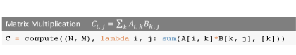

**図1.** 行列乗算の計算定義。

幅広いハードウェアプラットフォームでこれらの演算子の移植可能な性能を生産的に提供するために、複数のコンパイラ技術が導入されています（例：TVM [OSDI18]、Halide [Notice13]、Tensor Comprehensions [Xivi18]）。ユーザーは高レベルの宣言型言語を使用して数学的表現に似た形で計算を定義し、コンパイラは定義に従って最適化されたテンソルプログラムを生成します。[図1](#figure-01)はTVMテンソル式言語における行列乗算の計算定義を示しています。ユーザーは主にテンソルの形状と出力テンソルの各要素の計算方法を定義する必要があります。

しかし、高レベルの定義から高性能なテンソルプログラムを自動生成することは非常に困難です。ターゲットプラットフォームのアーキテクチャに応じて、コンパイラは最適化（例：タイル構造、タイルサイズ、ベクトル化、並列化）の組み合わせを含む非常に大きく複雑な空間を探索する必要があります。高性能なプログラムを見つけるには、探索戦略が包括的な空間をカバーし、それを効率的に探索する必要があります。本節では、最近の2つの効果的なアプローチと、その他の関連する研究を [§ 8](#S8) にて説明します。

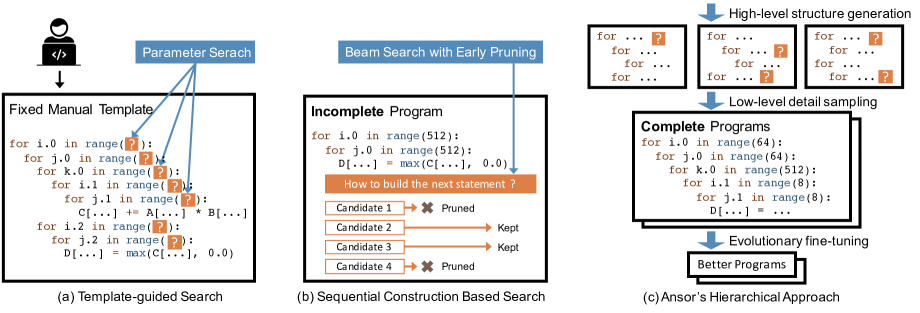

**図 2.** 探索戦略の比較。疑似コードはループネストを持つテンソルプログラムを示しています。オレンジ色の背景の疑問符は低レベルのパラメータを表しています。

テンプレートガイド検索。テンプレートガイド検索では、検索空間は手動のテンプレートによって定義されます。[図2a](#figure-02)に示されているように、コンパイラ（例：TVM）は、ユーザーに計算定義のためのテンプレートを手動で作成することを要求します。テンプレートは、いくつかの調整可能なパラメータ（例：タイルサイズや展開係数）を持つテンソルプログラムの構造を定義します。その後、コンパイラは特定の入力形状構成および特定のハードウェアターゲットに対するこれらパラメータの最適値を検索します。このアプローチは一般的な深層学習演算子において良好な性能を達成しています。しかし、テンプレートの開発には多大な労力が必要です。例えば、TVMのコードリポジトリには、これらのテンプレートのために既に15,000行以上のコードが含まれています。この数は、新しい演算子や新しいハードウェアプラットフォームが登場するにつれて増加し続けています。さらに、高品質なテンプレートを構築するには、テンソル演算子とハードウェアの両方に関する専門知識が必要です。高品質なテンプレートを開発するには、かなりの研究努力が必要です [Optimi19, Proces19, System20]。テンプレート設計の複雑さにもかかわらず、手動テンプレートは限られたプログラム構造しかカバーできません。すべての演算子に対してすべての最適化選択肢を手動で列挙することは不可能だからです。このアプローチでは通常、各演算子ごとに1つのテンプレートを定義する必要があります。FlexTensor [System20] は複数の演算子をカバーする一般的なテンプレートを提案していますが、そのテンプレートは依然として単一演算子の粒度で設計されており、複数の演算子を含む最適化（例：演算子融合）を含めることはできません。複数の演算子を持つ計算グラフを最適化する検索空間には、演算子を構成する異なる方法が含まれるべきです。テンプレートベースのアプローチでは、固定されたテンプレートを分解して検索中に再構成することができないため、これを実現することはできません。

逐次構築に基づく探索。この方法では、プログラム構築を固定された一連の決定に分解することで探索空間を定義します。その後、コンパイラはビームサーチのようなアルゴリズム [Intell77] を使用して良い決定を探索します（例：Halide オートスケジューラ [TOG19]）。このアプローチでは、コンパイラは計算グラフ内のすべてのノードを順次展開することによってテンソルプログラムを構築します。各ノードについて、コンパイラはそれを低レベルのテンソルプログラムに変換する方法に関していくつかの決定を行います（すなわち、計算場所、記憶場所、タイルサイズ等を決定する）。すべてのノードが展開されると、完全なテンソルプログラムが構築されます。この方法では、各ノードに対して一般的な展開ルールのセットを使用するため、手動のテンプレートなしで自動的に探索することができます。各決定の可能な選択肢の数が多いため、逐次処理を実行可能にするために、この方法では各決定の後に上位 $k$ の候補プログラムのみを保持します。コンパイラは学習済みのコストモデルを用いて候補プログラムの性能を推定・比較し、上位 $k$ の候補を選択し、その他の候補は削除します。探索中、候補プログラムは計算グラフの一部しか展開されていないか、あるいは一部の決定しか行われていないため、未完成です。[図 2b](#figure-02) がこのプロセスを示しています。

しかし、不完全なプログラムの最終性能を推定することは、いくつかの点で困難です：（1） 完全なプログラムで訓練されたコストモデルは、不完全なプログラムの最終性能を正確に予測できません。コストモデルは、プログラムをコンパイルし、その実行時間を測定して訓練用ラベルを取得する必要があるため、完全なプログラムでのみ訓練できます。このモデルを直接不完全なプログラムの最終性能比較に使用すると、精度が低くなります。ケーススタディとして、我々はコストモデル（[§ 5.2](#S5.SS2)）を探索空間からの20,000個のランダムな完全プログラムで訓練し、このモデルを用いて不完全なプログラムの最終性能を予測します。不完全なプログラムは、完全なプログラムのループ変換の一部のみを適用することで得られます。評価には2つのランキング指標を使用します：ペアワイズ比較の正確性とトップ-$k$プログラムのrecall@$k$スコア[+1] （$k=10$）。[図 3](#figure-03)に示すように、2つの曲線はそれぞれ$50\%$と$0\%$から始まり、これは情報がゼロのランダムな推測が$50\%$のペアワイズ比較精度と$0\%$のトップ-$k$リコールを与えることを意味します。プログラムが完全になるにつれて、2つの曲線は急速に増加します。これは、コストモデルが完全なプログラムには非常に良く機能しますが、不完全なプログラムの最終性能を正確に予測できないことを示しています。（2） 逐次決定の固定順序は探索空間の設計を制限します。例えば、ある最適化には計算グラフに新しいノードを追加する必要があります（例：キャッシュノードの追加、rfactor[Parall17]の使用）。異なるプログラムの決定回数は異なるため、不完全なプログラムを公正に比較するために整列させるのは困難です。（3） 逐次構築に基づく探索はスケーラブルではありません。探索空間を拡大するにはより多くの逐次構築ステップを追加する必要がありますが、これは蓄積誤差を悪化させます。

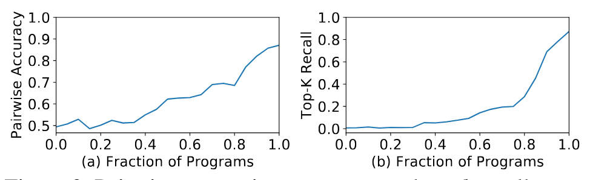

**図3.** ランダム部分プログラムにおけるペアワイズ比較精度およびトップ$k$想起曲線。両方のサブフィギュアにおいて、値が高いほど良いです。

アンソールの階層的アプローチ[図2c](#figure-02)に示されているように、アンソールは高レベル構造と低レベルの詳細を分離する階層的探索空間によって支えられています。Ansorは計算グラフの探索空間を自動的に構築し、テンプレートを手動で開発する必要を排除します。Ansoは空間から完全なプログラムをサンプリングし、完全なプログラムに対してファインチューニングを行い、不完全なプログラムの誤った推定を避けます。[図2](#figure-02)はアンソールのアプローチと既存のアプローチとの重要な違いを示しています。

## 3 デザイン概要

Ansor は自動化されたテンソルプログラム生成フレームワークです。[図4](#figure-04)はアンソールの全体的な建築様式を示しています。Ansorの入力は最適化されるDNNの集合です。AnsorはRelay[Xiv04]の演算子融合アルゴリズムを用いて、一般的なモデル形式（例：ONNX [Onnx19]、TensorFlow PB）からDNNを分割された小さな部分グラフに変換します。Ansorはこれらの部分グラフに対してテンソルプログラムを生成します。Ansorには主に3つの構成要素があります。（1） 大規模な検索空間を構築し、そこから多様なプログラムをサンプリングするプログラムサンプラー；（2） サンプリングされたプログラムのパフォーマンスを微調整するパフォーマンスチューナー；（3） DNN内の複数のサブグラフを最適化するための時間リソースを割り当てるタスクスケジューラ。

プログラムサンプラー。Ansorが取り組むべき主要な課題の1つは、与えられた計算グラフに対して大規模な探索空間を生成することです。様々な高レベル構造および低レベルの詳細を持つ多様なテンソルプログラムをカバーするために、Ansorは探索空間を階層的に表現し、スケッチとアノテーションの2つのレベルを使用します（[§ 4](#S4)）。Ansorは、プログラムの高レベル構造をスケッチとして定義し、数十億の低レベルの選択（例：タイルサイズ、並列化、アンロールのアノテーション）をアノテーションとして残します。この表現により、Ansorは高レベル構造を柔軟に列挙し、低レベルの詳細を効率的にサンプリングできます。Ansorには、探索空間の包括的なカバレッジを提供するために、空間からランダムにプログラムをサンプリングするプログラムサンプラーが含まれています。

パフォーマンスチューナー。ランダムにサンプリングされたプログラムのパフォーマンスは必ずしも良いとは限りません。次の課題はそれらを微調整することです。Ansor は進化的探索と学習済みコストモデルを用いて、反復的に微調整を行います（[§ 5](#S5)）。各イテレーションで、Ansor は新たに再サンプリングされたプログラムと前のイテレーションで良好だったプログラムの両方を、進化的探索を開始するための初期集団として使用します。進化的探索は、順序外の書き換えを行う変異や交叉によってプログラムを微調整し、逐次構築の制約を克服します。学習済みコストモデルへの問い合わせは実際の計測よりも桁違いに高速なため、数千のプログラムを数秒で評価することが可能です。

タスクスケジューラ。プログラムのサンプリングと性能の微調整を使用することで、Ansorは計算グラフに対して高性能なテンソルプログラムを見つけることができます。直感的には、DNN全体を単一の計算グラフとして扱い、そのための完全なテンソルプログラムを生成することは、理論上最適な性能を達成できる可能性があります。しかし、これは探索空間の不要な指数関数的膨張に対処する必要があるため、非効率です。通常、コンパイラはDNNの大きな計算グラフをいくつかの小さなサブグラフ [Xiv04, OSDI18] に分割します。この分割は、DNNの層ごとの構築特性のおかげで、性能への影響はほとんどありません。これにより、Ansorの最終的な課題が生じます：複数のサブグラフのプログラムを生成する際に時間リソースをどのように割り当てるかです。Ansorのタスクスケジューラ（[§ 6](#S6)）は、勾配降下法に基づくスケジューリングアルゴリズムを使用して、エンドツーエンドのDNN性能を向上させる可能性の高いサブグラフにリソースを割り当てます。

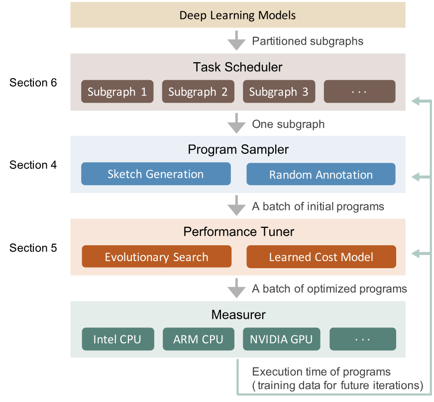

**図 4.** システム概要。グレーの矢印は、深層学習モデルからサブグラフを抽出し、最適化されたプログラムを生成する流れを示しています。緑の矢印は、メジャーがプロファイリングデータを返してシステム内のすべてのコンポーネントの状態を更新することを意味します。

## 4 プログラムサンプリング

アルゴリズムが探索する探索空間は、見つけられる最適なプログラムを決定します。既存のアプローチで考慮される探索空間は、以下の要因によって制限されています：（1） 手動列挙（例：TVM [System18]）。テンプレートによってすべての可能な選択肢を手動で列挙することは非現実的であり、そのため既存の手動テンプレートはヒューリスティックに限定的な探索空間しかカバーしていません。（2） 積極的な早期剪定（例：Halide 自動スケジューラ [TOG19]）。不完全なプログラムを評価することに基づく積極的な早期剪定は、検索アルゴリズムが空間の特定の領域を探索することを防ぎます。

このセクションでは、上記の制約に対処することで考慮される探索空間の境界を押し広げる技術を紹介します。（1） を解決するために、柔軟な導出ルールのセットを再帰的に適用して探索空間を自動的に拡張します。（2） を回避するために、探索空間内で完全なプログラムをランダムにサンプリングします。ランダムサンプリングにより、すべての点がサンプリングされる可能性が均等になるため、我々の検索アルゴリズムは考慮される空間内のすべてのプログラムを潜在的に探索できます。我々はランダムサンプリングにより最適なプログラムを見つけることに依存していません。なぜなら、サンプルされた各プログラムは後で微調整されるためです（[§ 5](#S5)）。

|いいえ|ルール名|条件|適用|
| --- | --- | --- | --- |
|1|スキップ|$\neg \mathrm{IsStrictInlinable}(S,i)$|$S^{\prime}=S;i^{\prime}=i-1$|
|2|常にインライン|$\mathrm{IsStrictInlinable}(S,i)$|$S^{\prime}=\mathrm{Inline}(S,i)$； $i^{\prime}=i-1$ |
|3|マルチレベルタイル|$\mathrm{HasDataReuse}(S,i)$|$S^{\prime}=\mathrm{MultiLevelTiling}(S,i);i^{\prime}=i-1$|
|4|フュージョン付きマルチレベルタイル|$\mathrm{HasDataReuse}(S,i)\wedge \mathrm{HasFusibleConsumer}(S,i)$|$S^{\prime}=\mathrm{FuseConsumer}(\mathrm{MultiLevelTiling}(S,i),i);i^{\prime}=i-1$|
|5|キャッシュステージを追加|$\mathrm{HasDataReuse}(S,i)\wedge\neg \mathrm{HasFusibleConsumer}(S,i)$|$S^{\prime}=\mathrm{AddCacheWrite}(S,i);i=i^{\prime}$|
|6|リダクション因数分解|$\mathrm{HasMoreReductionParallel}(S,i)$|$S^{\prime}=\mathrm{AddRfactor}(S,i);i^{\prime}=i-1$|
|…|ユーザー定義ルール|…|…|

**表1.** スケッチを生成するために使用される導出ルール。条件は現在の状態$\sigma=(S,i)$で実行されます。アプリケーションは現在の状態$\sigma$から次の状態$\sigma^{\prime}=(S^{\prime},i^{\prime})$を導出します。注意すべきは、一部の関数（例：$\mathrm{AddRfactor}$, $\mathrm{FuseConsumer}$）が$S^{\prime}$の複数の可能な値を返すことができる点です。この場合、可能な$S^{\prime}$をすべて収集し、単一の入力状態$\sigma$に対して複数の次状態$\sigma^{\prime}$を返します。

大きな探索空間をカバーできるサンプルプログラムのために、スケッチと注釈の二層構造を持つ階層型探索空間を定義します。プログラムの高レベル構造をスケッチとして定義し、数十億の低レベルの選択肢（例：タイルサイズ、並列化、アンロール注釈）は注釈として残します。最上位レベルでは、いくつかの導出規則を再帰的に適用してスケッチを生成します。最下位レベルでは、これらのスケッチにランダムに注釈を付けて完全なプログラムを得ます。この表現により、数十億の低レベル選択肢からいくつかの基本構造をまとめ、高レベル構造の柔軟な列挙と低レベル詳細の効率的なサンプリングが可能になります。

AnsorはCPUとGPUの両方をサポートしていますが、CPU向けのサンプリングプロセスを[§ 4.1](#S4.SS1)および[§ 4.2](#S4.SS2)で例として説明します。その後、GPU向けのプロセスとの違いについて[§ 4.3](#S4.SS3)で説明します。

### 4.1 スケッチ生成

[図4](#figure-04)に示すように、プログラムサンプラーは分割されたサブグラフを入力として受け取ります。[図5](#figure-05)の最初の列には、入力の2つの例が示されています。入力には3つの同等の形式があります：数学的表現、ループインデックスを直接展開して得られる対応する素朴なプログラム、および対応する計算グラフ（有向非巡回グラフ、DAG）です。

複数のノードを持つDAGのスケッチを生成するために、すべてのノードを位相順序で訪れ、構造を反復的に構築します。計算量が多く、データ再利用の機会が多い計算ノード（例：conv2d、matmul）については、それらのスケッチとして基本的なタイルおよびフュージョン構造を構築します。単純な要素ごとのノード（例：ReLU、要素ごとの加算）は、安全にインライン化できます。スケッチ生成中に、新しいノード（例：キャッシュノード、レイアウト変換ノード）がDAGに導入される場合もあることに注意してください。

私たちは、いくつかの基本ルールを再帰的に適用することで、すべての可能なスケッチを生成する導出ベースの列挙アプローチを提案します。このプロセスはDAGを入力として受け取り、スケッチのリストを返します。状態$\sigma=(S,i)$を定義します。ここで$S$はDAGに対して現在部分的に生成されたスケッチであり、$i$は現在の作業ノードのインデックスです。DAGのノードは出力から入力に向かってトポロジカル順に並べられています。導出は、初期の単純なプログラムと最後のノード、または初期状態$\sigma=(\mathrm{naive}\ \mathrm{program},\mathrm{index}\ \mathrm{of}\ \mathrm{the}\ \mathrm{last}\ \mathrm{node})$から始まります。そして、すべての導出ルールを状態に再帰的に適用しようとします。各ルールについて、現在の状態が適用条件を満たす場合、そのルールを$\sigma=(S,i)$に適用して$\sigma^{\prime}=(S^{\prime},i^{\prime})$を得ます（ここで$i^{\prime}\leq i$）。この方法で、インデックス$i$（作業ノード）は単調に減少します。状態は$i=0$のとき終端状態になります。列挙中、複数のルールを1つの状態に適用して複数の次状態を生成することができます。また、1つのルールが複数の可能な次状態を生成することもあります。そのため、すべての中間状態を保持するためにキューを維持します。キューが空になるとプロセスは終了します。終端状態のすべての$\sigma.S$は、スケッチ生成の最後にスケッチリストを形成します。典型的な部分グラフでは、スケッチの数は10未満です。

導出規則。[表1](#table-01) は、CPU に使用した導出規則を示しています。まず使用した述語の定義を提供し、次に各規則の機能を説明します。$\mathrm{IsStrictInliable}(S,i)$ は $S$ 内のノード $i$ が常にインライン可能な単純な要素単位演算子（例：要素単位加算、ReLU）であるかどうかを示します。$\mathrm{HasDataReuse}(S,i)$ は $S$ 内のノード $i$ が計算集約型の演算子であり、演算子内部のデータ再利用機会が豊富であるかどうかを示します（例：行列積、conv2d）。$\mathrm{HasFusibleConsumer}(S,i)$ は $S$ 内のノード $i$ が単一の消費者 $j$ のみを持ち、ノード $j$ がノード $i$ に融合できるかどうかを示します（例：行列積 + bias_add、conv2d + relu）。$\mathrm{HasMoreReductionParallel}(S,i)$ は $S$ 内のノード $i$ が空間次元での並列性は少ないが、縮約次元での並列性の機会は十分であるかどうかを示します（例：行列の2-ノルム計算、行列積 $C_{2\times 2}=A_{2\times 512}\cdot B_{512\times 2}$）。これらの述語の値を取得するために、計算定義に対して静的解析を行います。この解析は、数式における読み書きパターンを解析することで自動的に行われます。次に、各導出規則の機能について説明します。

規則1は、ノードが厳密にインライン可能でない場合、単にスキップします。規則2は、厳密にインライン可能なノードを常にインライン化します。規則1と規則2の条件は相互に排他的であるため、$i>1$ を持つ状態は常にそのいずれかを満たし、導出を続行できます。

のルール 3、4、5 は、データ再利用のあるノードに対する多段階タイルと融合に関するものです。ルール 3 はデータ再利用可能なノードの多段階タイルを行います。CPU では、「SSRSRS」のタイル構造を使用します。ここで「S」は空間ループの1レベルのタイルを、「R」は削減ループの1レベルのタイルを表します。例えば、matmul $C(i,j)=\sum_{k}A[i,k]\times B[k,j]$ では、$i$ と $j$ が空間ループであり、$k$ が削減ループです。matmul における「SSRSRS」タイル構造は、元の3レベルループ $(i,j,k)$ を10レベルループ $(i_{0},j_{0},i_{1},j_{1},k_{0},i_{2},j_{2},k_{1},i_{3},j_{3})$ に展開します。ループ順序を変更することはありませんが、この多段階タイルは一部の並べ替えケースもカバーできます。例えば、上記の10レベルループは、他のループの長さを1に設定することで、単純な並べ替え $(k_{0},j_{2},i_{3})$ に特化することができます。「SSRSRS」タイル構造は、ディープラーニングにおける計算集約型の密結合演算子（例：matmul、conv2d、conv3d）に一般的に適用可能です。なぜなら、これらは全て空間ループと削減ループで構成されているからです。

ルール4はマルチレベルタイルを実行し、さらに融合可能なコンシューマーを融合します。例えば、要素ごとのノード（例：ReLU、バイアス加算）をタイル化されたノード（例：conv2d、matmul）に融合します。ルール5は、現在のデータ再利用可能なノードに融合可能なコンシューマーがない場合にキャッシュノードを追加します。例えば、DAGの最終出力ノードにはコンシューマーが存在しないため、デフォルトでは結果を直接メインメモリに書き込みますが、メモリアクセスの高い遅延のため非効率です。キャッシュノードを追加することで、DAGに新しい融合可能なコンシューマーを導入し、ルール4を適用してこの新たに追加されたキャッシュノードを最終出力ノードに融合することができます。キャッシュノードが融合されると、最終出力ノードは結果をキャッシュブロックに書き込み、ブロック内の全データが計算されると、キャッシュブロック全体が一度にメインメモリに書き込まれます。

ルール6はrfactor [Parall17] を使用してリダクションループをスペースループに分解し、より多くの並列性をもたらすことができます。

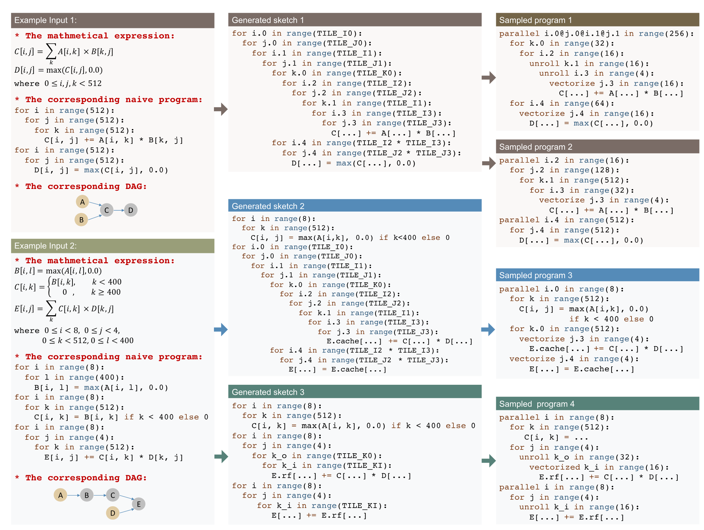

**図5.** 生成されたスケッチとサンプリングされたプログラムの例。この図は2つの入力例、3つの生成されたスケッチ、および4つのサンプリングされたプログラムを示しています。コード例はPython風の構文による擬似コードです。

の例。[図 5](#figure-05) は生成されたスケッチの 3 つの例を示しています。スケッチは TVM の手動テンプレートとは異なります。なぜなら、手動テンプレートは高レベルの構造と低レベルの詳細の両方を指定するのに対し、スケッチは高レベルの構造のみを定義するからです。例入力 1 では、DAG 内の 4 つのノードのソート順は $(A,B,C,D)$ です。DAG のスケッチを導出するには、出力ノード $D(i=4)$ から始めて、規則をノードに順に適用します。具体的には、生成されたスケッチ 1 の導出は次の通りです：

$$
\mathrm{Input}~{}1\rightarrow\qquad \sigma(S_{0},i=4)\xrightarrow{\mathrm{Rule\,1}}\sigma(S_{1},i=3)\xrightarrow{\mathrm{Rule\,4}}
$$

$$
\sigma(S_{2},i=2)\xrightarrow{\mathrm{Rule\,1}}\sigma(S_{3},i=1)\xrightarrow{\mathrm{Rule\,1}}\mathrm{Sketch}~{}1
$$

。例入力 2 では、5 つのノードのソート順は $(A,B,C,D,E)$ です。同様に、出力ノード $E(i=5)$ から始めて、規則を再帰的に適用します。生成されたスケッチ 2 の導出は次の通りです：

$$
\mathrm{Input}~{}2\rightarrow\qquad \sigma(S_{0},i=5)\xrightarrow{\mathrm{Rule\,5}}\sigma(S_{1},i=5)\xrightarrow{\mathrm{Rule\,4}}
$$

$$
\sigma(S_{2},i=4)\xrightarrow{\mathrm{Rule\,1}}\sigma(S_{3},i=3)\xrightarrow{\mathrm{Rule\,1}}
$$

$$
\sigma(S_{4},i=2)\xrightarrow{\mathrm{Rule\,2}}\sigma(S_{5},i=1)\xrightarrow{\mathrm{Rule\,1}}\mathrm{Sketch}~{}2
$$

。同様に、生成されたスケッチ 3 の導出は次の通りです：

$$
\mathrm{Input}~{}2\rightarrow\qquad \sigma(S_{0},i=5)\xrightarrow{\mathrm{Rule\,6}}\sigma(S_{1},i=4)\xrightarrow{\mathrm{Rule\,1}}
$$

$$
\sigma(S_{2},i=3)\xrightarrow{\mathrm{Rule\,1}}\sigma(S_{3},i=2)\xrightarrow{\mathrm{Rule\,2}}
$$

$$
\sigma(S_{4},i=1)\xrightarrow{\mathrm{Rule\,1}}\mathrm{Sketch}~{}3
$$

。カスタマイズ。提示された規則はほとんどの演算子の構造をカバーするのに十分実用的ですが、例外は常に存在します。例えば、いくつかの特殊なアルゴリズム（例：Winograd 畳み込み [Recoga16]）やアクセラレータの組み込み関数（例：TensorCore [Nvidia17]）は、効果的であるために特別なタイル構造を必要とします。テンプレート指向の探索アプローチ（TVM での）は、毎回新しいケースに対して新しいテンプレートを作成できますが、膨大な設計努力を要します。一方、Ansor における導出ベースのスケッチ生成は、ユーザーが新しい導出規則を登録し、既存の規則とシームレスに統合できるため、新しいアルゴリズムやハードウェアに必要な構造を柔軟に生成することが可能です。

### 4.2 ランダム注釈

前節で生成されたスケッチは、具体的なタイルサイズや並列化、アンロール、ベクトル化などのループ注釈がないため、不完全なプログラムです。本節では、スケッチに注釈を加えて、ファインチューニングや評価用の完全なプログラムにします。

生成されたスケッチのリストが与えられた場合、ランダムに1つのスケッチを選び、タイルサイズをランダムに埋め、外側のループをいくつか並列化し、内部のループをいくつかベクトル化し、いくつかの内部ループをアンロールします。また、プログラム内の一部のノードの計算位置をランダムに変更して、タイル構造にわずかな変更を加えます。本節における「ランダム」は、すべての有効な値に対する一様分布を意味します。特定のアルゴリズムが効果を発揮するためにカスタム注釈を必要とする場合（例：特別なアンロール）、利用者が計算定義内で簡単なヒントを与えて注釈方針を調整できるようにしています。最後に、定数テンソルのレイアウト変更はコンパイル時に行え、実行時のオーバーヘッドをもたらさないため、マルチレベルタイル構造に従って定数テンソルのレイアウトを再構築し、キャッシュに最適化します。この最適化は、畳み込み層や全結合層の重みテンソルが推論アプリケーションにおいて定数であるため、有効です。

ランダムサンプリングの例は[図 5](#figure-05)に示されています。サンプリングされたプログラムは、スケッチよりもループが少ない場合があります。なぜなら、長さが1のループは簡略化されるためです。

### 4.3 GPUサポート

GPUの場合、マルチレベルタイル構造を「SSRSRS」から「SSSRRSRS」に変更してGPUのアーキテクチャに合わせます。最初の三つの空間タイル内のループは、それぞれ BlockIdx、仮想スレッド（バンク競合を減らすため）、および ThreadIdx にバインドされます。スケッチ導出ルールを二つ追加しました。一つはキャッシュノードを挿入して共有メモリを利用するためのもの（ルール5に類似）、もう一つはスレッド間のリダクションのためのもの（ルール6に類似）です。

## 5 パフォーマンス微調整

プログラムサンプラーによってサンプリングされたプログラムは、探索空間を十分にカバーしていますが、その品質は保証されません。これは、タイル構造やループ注釈などの最適化選択がすべてランダムにサンプリングされるためです。本節では、進化的探索と学習済みコストモデルを用いてサンプリングされたプログラムのパフォーマンスを微調整するパフォーマンスチューナーを紹介します。

微調整は反復的に行われます。各イテレーションでは、まず学習済みコストモデルに基づいて有望な少数のプログラムを進化的探索で見つけます。次に、これらのプログラムをハードウェア上で計測し、実際の実行時間コストを取得します。最後に、計測によって得られたプロファイリングデータを使用してコストモデルを再訓練し、精度を向上させます。

進化的探索は、ランダムにサンプリングされたプログラムと以前の測定から得られた高品質なプログラムを初期集団として使用し、次世代を生成するために突然変異と交叉を適用します。学習されたコストモデルは各プログラムの適合度（本ケースではプログラムのスループット）を予測するために使用されます。私たちは進化を固定世代数だけ実行し、探索中に見つかった最良のプログラムを選びます。学習済みコストモデルを活用する理由は、このコストモデルがプログラムの適合度を比較的正確に推定できる一方で、実際の測定よりも桁違いに高速であるためです。これにより、検索空間内の何万ものプログラムを数秒で比較でき、有望なものを実際の測定に抽出できます。

### 5.1 進化的探索

進化的探索 [Evolut16] は、生物の進化に触発された一般的なメタヒューリスティックアルゴリズムです。高品質なプログラムを反復的に変異させることで、潜在的により高品質な新しいプログラムを生成できます。進化は、サンプリングされた初期世代から始まります。次世代を生成するために、まず現在の世代からいくつかのプログラムを特定の確率に従って選択します。プログラムの選択確率は、学習済みのコストモデルによって予測された適合度に比例します（[§ 5.2](#S5.SS2)）。つまり、より高い性能スコアを持つプログラムほど、選択される確率が高くなります。選択されたプログラムに対して、進化操作のうちの一つをランダムに適用して新しいプログラムを生成します。基本的には、サンプリング時に行った決定（[§ 4.2](#S4.SS2)）に対応して、それらを書き換え、微調整する進化操作を設計しています。

タイルサイズ変異。この操作ではプログラムをスキャンし、ランダムにタイル化されたループを選択します。このタイル化されたループについて、あるタイルレベルのタイルサイズをランダムな係数で割り、その係数を別のレベルに掛けます。この操作によりタイルサイズの積が元のループ長と等しく保たれるため、変異後のプログラムは常に有効です。

並列変異。この操作はプログラムをスキャンし、parallel と注釈されたループをランダムに選択します。このループに対して、この操作は隣接するループレベルを結合するか、またはある係数で分割することによって並列粒度を変更します。

プラグマ変異。プログラム内のいくつかの最適化は、コンパイラ固有のプラグマによって指定されます。この操作はプログラムをスキャンし、プラグマをランダムに選択します。このプラグマに対して、この操作はランダムに別の有効な値に変異させます。例えば、我々の基盤となるコードジェネレーターは auto_unroll_max_step=N プラグマを提供することで最大ステップ数の自動アンローリングをサポートします。我々は $N$ の数字をランダムに調整します。

計算位置の変異。この操作はプログラムをスキャンし、マルチレベルタイルされていない柔軟なノード（例：畳み込み層のパディングノード）をランダムに選択します。このノードに対して、この操作はその計算位置を別の有効な接続ポイントにランダムに変更します。

ノードベースの交叉。交叉は、2つ以上の親から遺伝子を組み合わせて新しい子孫を生成する操作です。Ansorにおけるプログラムの遺伝子はその書き換えステップです。Ansorによって生成されるすべてのプログラムは、初期の単純な実装から書き換えられています。Ansorは、スケッチ生成とランダム注釈の間に、各プログラムの完全な書き換え履歴を保持します。書き換えステップは、プログラムが初期の単純な実装からどのように形成されたかを示しているため、プログラムの遺伝子として扱うことができます。これに基づいて、既存の2つのプログラムの書き換えステップを組み合わせることで新しいプログラムを生成できます。ただし、2つのプログラムの書き換えステップを任意に組み合わせると、ステップ間の依存関係が壊れ、無効なプログラムが作成される可能性があります。その結果、Ansorにおける交叉操作の粒度はDAGのノードに基づいています。というのも、異なるノード間の書き換えステップは通常、依存関係が少ないからです。Ansorは、各ノードに対してランダムに1つの親を選択し、選択されたノードの書き換えステップを統合します。ノード間に依存関係がある場合、Ansorは単純なヒューリスティックを用いてステップを分析・調整しようとします。さらにAnsorは、統合されたプログラムの機能的正しさを保証するために検証を行います。検証は簡単で、Ansorはごく少数のループ変換書き換えステップのみを使用し、基盤となるコード生成器が依存関係分析によって正確性を確認できるからです。

進化的探索は、突然変異と交叉を活用して新しい候補セットを繰り返し生成し、複数のラウンドの後に最も高いスコアを持つ少数のプログラムを出力します。これらのプログラムはコンパイルされ、ターゲットハードウェア上で測定され、実際の実行時間コストが取得されます。収集された測定データは次にコストモデルを更新するために使用されます。このようにして、学習されたコストモデルの精度は徐々に向上し、ターゲットハードウェアに適合するようになります。その結果、進化的探索はターゲットハードウェアプラットフォーム向けにより高品質なプログラムを徐々に生成します。

TVMやFlexTensorの固定されたグリッド状のパラメータ空間でのみ動作する検索アルゴリズムとは異なり、Ansorの進化的操作はテンソルプログラム専用に設計されています。これらは一般的なテンソルプログラムに適用可能で、複雑な依存関係を持つ探索空間も扱うことができます。Halideオートスケジューラの展開ルールとは異なり、これらの操作はプログラムに対して順不同の変更を行うことができ、順序制約の問題に対応します。

### 5.2 学習されたコストモデル

検索中にプログラムの性能を迅速に推定するためにコストモデルは必要です。我々は関連研究に類似した学習コストモデルを採用し、さらに新たに設計されたプログラム特徴を加えています。
[TOG19, System18] 学習コストモデルに基づくシステムは高い移植性を持っています。なぜなら、単一のモデル設計が異なるトレーニングデータを入力することで異なるハードウェアバックエンドに再利用できるからです。

私たちの対象プログラムは主にデータ並列テンソルプログラムであり、これらは複数の入れ子ループが絡み合い、最も内側の文として複数の代入文を持つ形で作られているため、コストモデルはループネスト内の最も内側の非ループ文1つのスコアを予測するように訓練します。完全なプログラムの場合、私たちは各最も内側の非ループ文に対して予測を行い、予測結果を合計してスコアとします。最も内側の非ループ文の特徴ベクトルは、完全なプログラムの文脈から特徴を抽出することで構築します。抽出される特徴には算術的特徴やメモリアクセス特徴が含まれます。抽出特徴の詳細なリストは[付録B](#A2)にあります。

私たちは損失関数として重み付き二乗誤差を使用します。検索空間から性能の良いプログラムを特定することに主に関心があるため、実行が速いプログラムにより多くの重みを置きます。具体的には、スループットが $y$ のプログラム $P$ に対するモデル $f$ の損失関数は $\mathrm{loss}(f,P,y)=w_{p}(\sum_{s\in S(P)}f(s)-y)^{2}=y(\sum_{s\in S(P)}f(s)-y)^{2}$ であり、ここで $S(P)$ は $P$ 内の最も内側の非ループ文の集合です。スループット $y$ を直接重みとして使用します。基礎モデル $f$ として勾配ブースティング決定木 [Xgboos16] を訓練します。すべてのDAGから来るすべてのテンソルプログラムに対して単一のモデルを訓練し、同じDAGから来るすべてのプログラムのスループットを $[0,1]$ の範囲に正規化します。DNNを最適化する際、測定されるプログラムの数は通常3万未満です。このような小さなデータセットでは勾配ブースティング決定木の訓練は非常に高速であるため、増分更新を行う代わりに毎回新しいモデルを訓練します。

## 6 タスクスケジューラ

DNNは多くの独立したサブグラフ（例：conv2d   relu）に分割できます。あるサブグラフでは、チューニングに時間をかけてもエンドツーエンドのDNN性能は大幅に向上しません。これは二つの理由によります：（1） サブグラフが性能のボトルネックではない場合、または （2） チューニングによるサブグラフの性能改善が最小限にとどまる場合です。

重要でないサブグラフのチューニングに時間を無駄にしないように、Ansorは異なるサブグラフに対して動的に異なる量の時間リソースを割り当てます。ResNet-50を例に取ると、グラフ分割後に29個のユニークなサブグラフがあります。これらのサブグラフのほとんどは、異なる形状構成（入力サイズ、カーネルサイズ、ストライドなど）を持つ畳み込み層です。最適なテンソルプログラムはこれらの形状構成に依存するため、異なる畳み込み層ごとに異なるプログラムを生成する必要があります。実際には、ユーザーはすべてのアプリケーションに対して複数のDNNを持っている可能性があります。これは、より多くのサブグラフを生じさせると同時に、サブグラフ間で知識を共有・再利用できるため、総チューニング時間を削減する機会を増やします。サブグラフは、1つのDNN内または異なるDNN間で複数回現れることもあります。

私たちはタスクを、サブグラフの高性能プログラムを生成するために行うプロセスと定義します。つまり、単一のDNNを最適化するには、何十ものタスクの完了が必要です（例：ResNet-50では29のタスク）。Ansorのタスクスケジューラは、反復的にタスクに時間リソースを割り当てます。各反復では、Ansorはタスクを選択し、サブグラフに対する有望なプログラムのバッチを生成し、そのプログラムをハードウェア上で計測します。このような反復を1単位の時間リソースと定義します。タスクに1単位の時間リソースを割り当てると、そのタスクは新しいプログラムを生成および計測する機会を得ることになり、これはより良いプログラムを見つけるチャンスを意味します。次に、スケジューリング問題の定式化と私たちの解決策を提示します。

### 6.1 問題の定式化

DNNや複数のDNNをチューニングする際、ユーザーは様々な種類の目標を持つことがあります。例えば、DNNのレイテンシを削減すること、DNNのセットに対してレイテンシの要件を満たすこと、またはチューニングがDNNの性能を大幅に改善しなくなったときにチューニング時間を最小化することなどです。したがって、私たちはユーザーが目標を表現できるよう一連の目的関数を提供します。ユーザーは自身の目的関数を提供することも可能です。

仮に合計で$n$個のタスクがあるとします。$t\in\mathbf{Z}^{n}$を割り当てベクトルとし、$t_{i}$がタスク$i$に費やされる時間単位の数とします。タスク$i$が達成する最小サブグラフレイテンシを割り当てベクトル$g_{i}(t)$の関数とします。DNNのエンドツーエンドコストをサブグラフのレイテンシ$f(g_{1}(t),g_{2}(t),...,g_{3}(t))$の関数とします。私たちの目的はエンドツーエンドコストを最小化することです。

$$
\mathrm{minimize\,}f(g_{1}(t),g_{2}(t),...,g_{3}(t))
$$

単一のDNNのエンドツーエンドレイテンシを最小化するために、$f(g_{1},g_{2},...,g_{n})=\sum_{i=1}^{n}{w_{i}\times g_{i}}$を定義できます。このとき$w_{i}$はDNNにおけるタスク$i$の出現回数です。この定式化は直接的です。なぜなら、$f$はエンドツーエンドのDNNレイテンシの近似だからです。

DNNのセットをチューニングする際には、いくつかの選択肢があります。[表2](#table-02) は、複数のDNNをチューニングするためのいくつかの例の目的関数を示しています。$m$をDNNの数とし、$S(j)$をDNN $j$に属するタスクの集合とします。$f_{1}$はすべてのDNNのレイテンシを合計するものであり、これはすべてのDNNを一度順番に実行するパイプラインのコストを最適化することを意味します。$f_{2}$では、$L_{j}$をDNN $j$のレイテンシ要件として定義します。これは、レイテンシがすでに要件を満たしている場合はそのDNNに時間を費やさないことを意味します。$f_{3}$では、$B_{j}$をDNN $j$の基準レイテンシとして定義します。その結果、私たちの目標は、与えられた基準レイテンシに対する加速の幾何平均を最大化することです。最後に$f_{4}$では、$\mathrm{ES}(g_{i},t)$という関数を定義し、タスク$i$のレイテンシの履歴を見て早期停止の値を返します。これにより、タスクごとの早期停止の効果を実現できます。

|$f_{1}=\sum_{j=1}^{m}\sum_{i\in S(j)}w_{i}\times g_{i}(t)$|
| --- |
|$f_{2}=\sum_{j=1}^{m}{\max(\sum_{i\in S(j)}w_{i}\times g_{i}(t),L_{j})}$|
|$f_{3}=-(\prod_{j=1}^{m}{\frac{B_{j}}{\sum_{i\in S(j)}w_{i}\times g_{i}(t)}})^{\frac{1}{m}}$|
|$f_{4}=\sum_{j=1}^{m}{\sum_{i\in S(j)}w_{i}\times\max(g_{i}(t),\mathrm{ES}(g_{i},t))}$|

**表2.** 複数のニューラルネットワークのための目的関数の例

### 6.2 勾配降下法による最適化

我々は目的関数を効率的に最適化するために勾配降下法に基づくスケジューリングアルゴリズムを提案する。現在の割り当て$t$が与えられた場合、目的関数$\frac{\partial f}{\partial t_{i}}$の勾配を近似して$i$のタスクを選択し、$i=\mathrm{argmax}_{i}{|\frac{\partial f}{\partial t_{i}}|}$となるようにするというアイデアである。勾配は楽観的な推測を行い、タスク間の類似性を考慮することで近似する。

導出は[付録A](#A1)にある。勾配は次のように近似する：

$$
\frac{\partial f}{\partial t_{i}}\qquad \approx\frac{\partial f}{\partial g_{i}}(\alpha\frac{g_{i}(t_{i})-g_{i}(t_{i}-\Delta t)}{\Delta t}+
$$

$$
(1-\alpha)(\min(-\frac{g_{i}(t_{i})}{t_{i}},\beta\frac{C_{i}}{\max_{k\in N(i)}{V_{k}}}-g_{i}(t_{i}))))
$$

ここで$\Delta t$は小さなバックワードウィンドウサイズ、$g_{i}(t_{i})$と$g_{i}(t_{i}-\Delta t)$は割り当て履歴から既知である。$N(i)$は$i$の類似タスクの集合、$C_{i}$はタスク$i$の浮動小数点演算数、$V_{k}$はタスク$k$で達成可能な1秒あたりの浮動小数点演算数である。パラメータ$\alpha$と$\beta$は一部の予測を信頼する重みを制御する。

アルゴリズムを実行するために、Ansorは$t=\mathbf{0}$から開始し、初期の割り当てベクター$t=(1,1,...,1)$を取得するためにラウンドロビンの1ラウンドでウォームアップを行います。ウォームアップ後、各イテレーションで各タスクの勾配を計算し、$\mathrm{argmax}_{i}{|\frac{\partial f}{\partial t_{i}}|}$を選択します。その後、リソースユニットをタスク$i$に割り当て、割り当てベクター$t_{i}=t_{i}+1$を更新します。最適化プロセスは、時間予算が尽きるまで続きます。探索を促進するために、確率$\epsilon$でランダムにタスクを選択する$\epsilon$-グリーディ戦略[MIT18]を採用します。

単一DNNのエンドツーエンドのレイテンシを最適化する場合を例に取ると、Ansorは初期レイテンシが高いサブグラフを優先します。なぜなら、楽観的な推測でそのレイテンシを迅速に削減できると考えるからです。後で、Ansorが多くのイテレーションを費やしてもレイテンシの減少が観測されない場合、Ansorは$|\frac{\partial f}{\partial t_{i}}|$が減少するためそのサブグラフを離れます。

## 7 評価

AnsorのコアはCで実装されており、コードは約12K行（検索ポリシー用に3K、その他のインフラ用に9K）です。Ansorは独自の中間表現（IR）でプログラムを生成します。これらのプログラムは、さまざまなハードウェアプラットフォームをターゲットにしたコード生成のためにTVM IRに低次化されます。AnsorはTVMを決定論的コード生成器としてのみ利用します。

我々は、生成されたプログラムの性能を三つのレベルで評価します：単一演算子、サブグラフ、そしてニューラルネットワーク全体です。各評価レベルにおいて、Ansorを最先端の探索フレームワークやハードウェア特化型の手動ライブラリと比較します。また、探索効率とAnsorの各コンポーネントの有効性も評価します。

生成されたテンソルプログラムは三つのハードウェアプラットフォームでベンチマークされます：Intel CPU（18コア Platinum 8124M@3.0 GHz）、NVIDIA GPU（V100）、およびARM CPU（Raspberry Pi 3bの4コア Cortex-A53@1.4GHz）。すべての評価においてデータ型はfloat32を使用します。

### 7.1 単一演算子ベンチマーク

ワークロード。我々はまず、C1D、C2D、C3D（それぞれ1D、2D、3D畳み込み）、行列乗算（GMM）、グループ畳み込み（GRP）、拡張畳み込み（DIL）[Xivo15]、深さ方向畳み込み（DEP）[Xivl17]、転置2D畳み込み（T2D）[Xivn15]、カプセル2D畳み込み（CAP）[Matrix18]、および行列2ノルム（NRM）を含む一般的な深層学習演算子のセットでAnsorを評価します。各演算子について、4つの一般的な形状構成を選択し、二つのバッチサイズ（1と16）で評価します。合計で、$10$演算子$\times 4$形状構成$\times 2$バッチサイズ$=80$テストケースがあります。使用される形状構成は[付録C](#A3)に記載されています。これらのテストケースはIntel CPU上で実行します。

ベースライン。我々はベースラインとして PyTorch （v1.5）[Systea19]、Halide オートスケジューラ（コミット： 1f875b0）[TOG19]、FlexTensor（コミット： 7ac302c）[System20]、AutoTVM（コミット： 69313a7）[System18] を含めます。PyTorch はベンダー提供のカーネルライブラリ MKL-DNN [Intel17] によってサポートされています。Halide オートスケジューラは、Halide のための逐次構築ベースの探索フレームワークです。AutoTVM と FlexTensor は TVM を基にしたテンプレートガイドの探索フレームワークです。Halide オートスケジューラには AVX-512 用の事前学習コストモデルがないため、評価では AVX-512 を無効にしました [§ 7.1](#S7.SS1) および [§ 7.2](#S7.SS2)。すべてのオペレーターについて、各フレームワークで利用可能な最適なレイアウトを使用しますが、入力および出力のテンソルはパックされてはいけません。

探索設定。探索フレームワーク（すなわち、Halide オートスケジューラ、FlexTensor、AutoTVM、および Ansor）に対して、各テストケースにつき最大 $1,000$ 回の測定トライアルで探索または自動チューニングを実行させました。これは、この評価において各フレームワークが自動チューニングのために最大 $80\times 1,000$ プログラムを測定できることを意味します。同じ数の測定トライアルを使用することで、実装の詳細に関係なく公平な比較が可能となります。さらに、各テストケースにつき $1,000$ 回の測定トライアルを使用することで、これらのフレームワークにおける探索は通常収束します。

正規化。[図6](#figure-06)は正規化された性能を示しています。各テストケースについて、スループットを最も高性能なフレームワークに対して正規化します。その後、各オペレーターの4つの形状の幾何平均をプロットします。幾何平均も最も高性能なフレームワークに対して正規化されているため、図中では最も高性能なフレームワークの正規化性能は1となります。エラーバーは、各オペレーターの4つの形状の正規化されたスループットの標準偏差を示しています。

の結果。[図 6](#figure-06)に示されているように、Ansor はすべてのオペレーターとバッチサイズの設定で最高、または同等に最高の性能を発揮します。Ansor は既存の探索フレームワークよりも $1.1-22.5\times$ だけ優れています。Ansor の性能向上は、大きな探索空間と効果的な探索戦略の両方によるものです。ほとんどのオペレーターにおいて、Ansor によって生成された最適なプログラムは、既存の探索フレームワークの探索空間の外にあることがわかりました。これは、Ansor がより多くの最適化の組み合わせを探索できるためです。例えば、NRM での大幅な高速化は、Ansor が削減ループを並列化できるのに対し、他のフレームワークはできないためです。T2D の大幅な高速化は、Ansor が正しいタイル構造とアンローリング戦略を使用して、コードジェネレータがストライド付き転置畳み込みのゼロの掛け算を簡略化できるためです。対照的に、他のフレームワークは探索空間内で多くの有効な最適化を捉えることができず、Ansor が見つけるプログラムを見つけることができません。例えば、Halide の展開ルールは、GMM の削減ループを分割せず、パディングが削減ループの外で計算される場合、C2D の削減ループも分割しません。AutoTVM のテンプレートはタイル構造に制限があり、[図 5](#figure-05) の「Generated Sketch 1」の構造をカバーできません。FlexTensor のテンプレートはパディングの計算位置を変更せず、NRM のような削減オペレーターでは動作しません。

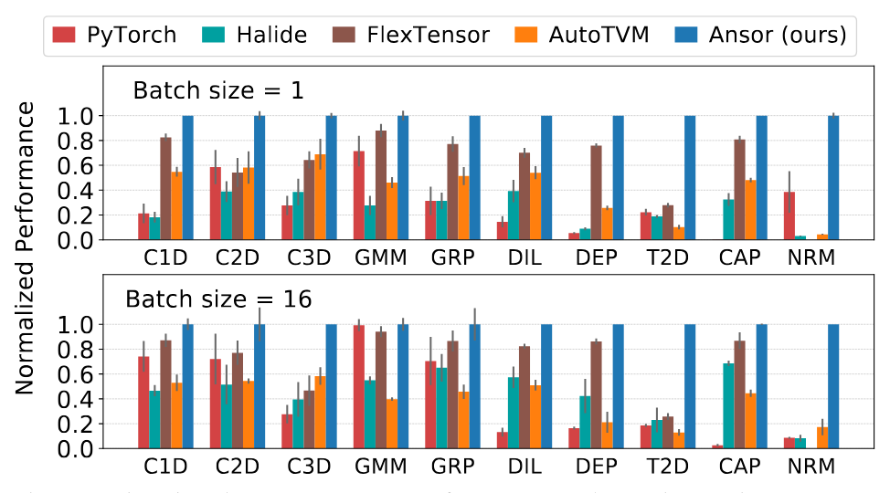

**図6.** 20コアのIntel-Platinum-8269CYにおける単一オペレーター性能ベンチマーク。y軸は各オペレーターの最適スループットに正規化されたスループットです。

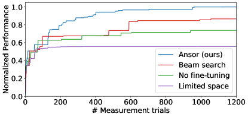

**図7.** 畳み込み演算子上のアンサー4つの変種のアブレーション研究。y軸は、最良のプログラムのスループットに対するスループットです。

アブレーションの研究。私たちは、4つのAnsorバリアントを畳み込み演算子上で実行し、パフォーマンスカーブを報告します。ResNet-50の最後の畳み込み演算子を、バッチサイズ=16のテストケースに選びます。これは探索アルゴリズムを評価するのに十分な探索空間があるためです。他のオペレーターも同様のパターンを共有しています。[図7](#figure-07)では、各曲線は5回の走の中央値です。「アンソール（私たちの）」は、私たちが導入したすべての技法を使います。「ビームサーチ」とは、サンプリング過程でコストモデルで未完成プログラムを剪定し、微調整を行わないことを意味します。「ファインチューニングなし」は「アンサー（我々の）」に基づいていますが、ファインチューニングを無効にし、ランダムサンプリングのみに依存しています。「Limited Space」も「Ansor（私たちの）」に基づいていますが、既存の手動テンプレートのスペース（例：タイルレベル、最も内側のタイルサイズ、計算場所の制限）に似た検索空間を制限しています。[図7](#figure-07)で示されているように、大きな探索空間を削減するか効率的なファインチューニングを行うと、最終的な性能が大幅に低下します。「ビームサーチ」での積極的な早期剪定は、不正確な推定のために良好な最終性能を持つ不完全なプログラムを捨ててしまいます。

### 7.2 サブグラフベンチマーク

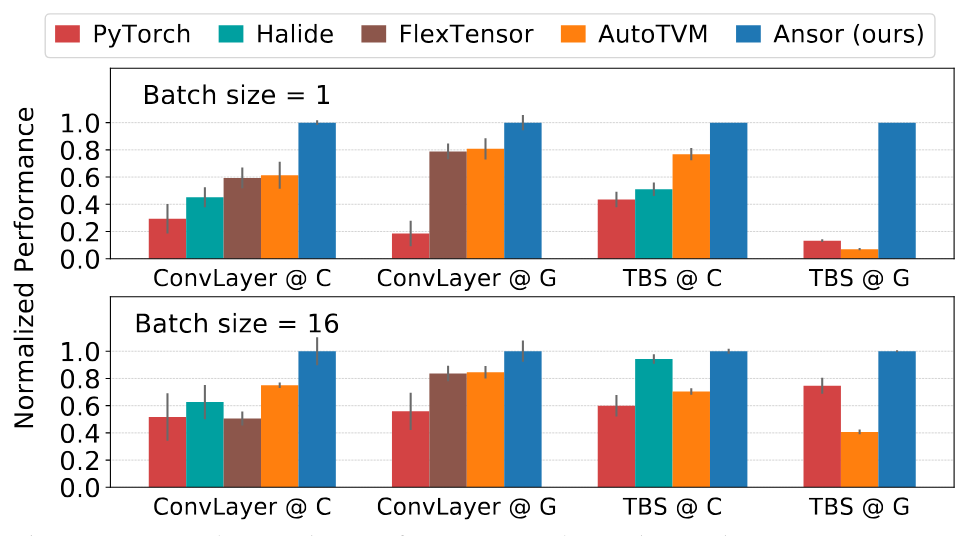

**図 8.** 20コアのIntel Platinum 8269CYおよびNVIDIA V100でのサブグラフ性能ベンチマーク。「@C」はCPUの結果を、「@G」はGPUの結果を示します。y軸は各サブグラフの最良スループットで正規化されたスループットです。

我々はDNNにおける2つの一般的なサブグラフでサブグラフベンチマークを実施します。「ConvLayer」は2D畳み込み、バッチ正規化[Xivm15]、およびReLU活性化からなるサブグラフで、畳み込みニューラルネットワークにおける一般的なパターンです。「TBS」は2つの行列転置、1つのバッチ行列積、およびソフトマックスからなるサブグラフで、言語モデルにおけるマルチヘッドアテンションのパターンです[Advanc17]。単一オペレータベンチマーク（[§ 7.1](#S7.SS1)）と同様に、我々は4つの異なる形状構成と2つのバッチサイズを選択し、各テストケースで最大$1,000$回の計測試行による自動チューニングを実施し、正規化された性能を報告します。基準となるフレームワークは同じセットを使用し、Intel CPUおよびNVIDIA GPUでベンチマークを実行します。論文執筆時点ではHalideのGPU対応がまだ実験段階であるため、GPUでのHalideオートスケジューラの性能は報告しません。FlexTensorは「TBS」のような複雑なサブグラフでは実行に失敗します。

[図8](#figure-08) は、Ansor が手動ライブラリおよび他の探索フレームワークに対して $1.1-14.2\times$ の性能で優れていることを示しています。Ansor は、これらのサブグラフに対して両方のプラットフォームで一貫して高性能なプログラムを生成できます。FlexTensor は単一のオペレータに対しては良好な性能を発揮しますが、オペレータ融合のサポートがないためサブグラフに対してはあまり利点がありません。

### 7.3 エンドツーエンドネットワークベンチマーク

ワークロード。いくつかのDNNのエンドツーエンド推論実行時間をベンチマークします。これには、画像分類用の ResNet-50 [IEEEa16] および MobileNet-V2 [IEEE18]、アクション認識用の 3D-ResNet-18 [CVPRh18]、画像生成用の DCGAN [Xivn15] ジェネレータ、および言語理解用の BERT [Xivh18] が含まれます。これらのDNNを三つのハードウェアプラットフォームでベンチマークします。サーバークラスの Intel CPU と NVIDIA GPU では、バッチサイズ1およびバッチサイズ16の結果を報告します。エッジデバイスの ARM CPU では、リアルタイムでのフィードバックが通常求められるため、バッチサイズ1の結果のみを報告します。

ベースラインと設定。私たちは、ベースラインフレームワークとして PyTorch（v1.5、トーチスクリプト対応）、TensorFlow（v2.0、グラフモード対応）、TensorRT（v6.0、TensorFlow統合対応）[Nvidib17]、TensorFlow Lite（v2.0）、および AutoTVM を含めています。Halide 自動スケジューラや FlexTensor は、広く使われている深層学習モデル形式（例：ONNX、TensorFlow PB）のサポートや高レベルのグラフ最適化を欠いているため、含めていません。その結果、これらが達成できるエンドツーエンドの実行時間は、DNN 内のすべてのサブグラフのレイテンシの合計になると予想されます。対照的に、AutoTVM は手動テンプレートやさまざまなグラフレベルの最適化（例：グラフレベルのレイアウト検索 [Optimi19]、グラフレベルの定数畳み込み [Xiv04]）を使って DNN 全体を最適化でき、パフォーマンスを大幅に向上させます。Ansor も [§ 4.2](#S4.SS2) に記載されているようにレイアウト書き換えを行います。私たちは AutoTVM と Ansor の両方に対し、それぞれの DNN で $1000\times n$ 回の計測試行を使用するまでオートチューニングを実行させます。ここで $n$ は DNN 内のサブグラフの数です。通常、これで十分に収束します。タスクスケジューラの目的は、1 つの DNN の総レイテンシを最小化することであり、これらのネットワークに対してプログラムを順番に生成します。一方、PyTorch、TensorFlow、TensorRT、および TensorFlow Lite はすべて静的カーネルライブラリ（Intel CPU 上の MKL-DNN、NVIDIA GPU 上の CuDNN、ARM CPU 上の Eigen）によりサポートされており、オートチューニングは不要です。私たちは、このネットワークベンチマークで Intel CPU 上のすべてのフレームワークに対して AVX-512 を有効にしています。

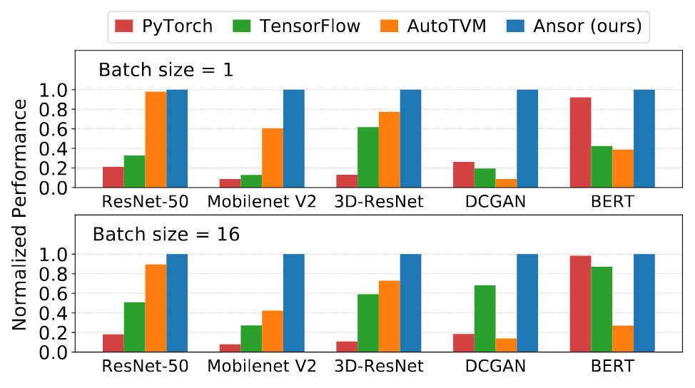

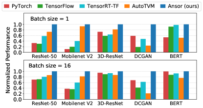

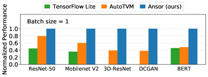

**図9.** 3つのハードウェアプラットフォームにおけるネットワーク推論性能ベンチマーク。y軸は各ネットワークにおける最高スループットに対する相対スループットです。

の結果。[図 9](#figure-09) は Intel CPU、NVIDIA GPU、および ARM CPU [+2] 上での結果を示しています。全体として、Ansor はすべてのケースで最も良いか、同等に最良の性能を発揮しています。検索ベースの AutoTVM と比較すると、Ansor はすべてのケースでそれに匹敵するか、$1.0-21.8\times$ のスピードアップで上回っています。最良の代替手段と比較すると、Ansor は Intel CPU、ARM CPU、および NVIDIA GPU 上での DNN の実行性能を、それぞれ最大 $3.8\times$、$2.6\times$、$1.7\times$ 向上させます。DCGAN における大幅なスピードアップの理由は、DCGAN が主に転置 2D 畳み込み （T2D） から構成されており、Ansor によってうまく最適化できるためであり、これは単一演算子ベンチマーク （[§ 7.1](#S7.SS1)） で示され説明されています。AutoTVM は、2D 畳み込みの高度に最適化されたテンプレートとグローバルレイアウト検索 [Optimi19] により、Intel CPU 上の ResNet-50 で非常に良好な性能を発揮します。Ansor はグローバルレイアウト検索を行いませんが、[§ 4.2](#S4.SS2) で述べられているように、重みテンソルのレイアウトを書き換えます。Ansor はより多くのレベルのタイル化を使用するため、重みテンソルをより多くのレベルにパックします。レイアウト書き換えにより、Ansor の ResNet-50 では約 40% の改善がもたらされます。ベンダー固有の静的ライブラリと比較すると、Ansor は非標準形状や小さいバッチサイズにおいてより多くの利点があり、これらのケースを手動で最適化することは容易ではありません。

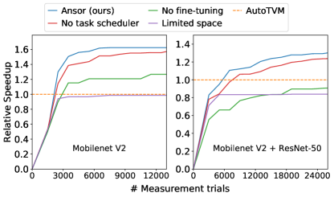

**図10.** ネットワーク性能の自動チューニング曲線。y軸はAutoTVMに対する速度向上です。

アブレーションスタディ。私たちは[図10](#figure-10)の2つのテストケースでAnsorのバリアントを実行しました。左の図では、単一のmobilenet-V2用のプログラムを生成するために、Ansorの4つのバリアントを実行しています。右の図では、これらのバリアントをmobilenet-V2とResNet-50の両方に対して実行しています。我々はタスクスケジューラの目的関数を、AutoTVMに対する速度向上の幾何平均に設定しました。 [図10](#figure-10)に示すように、「タスクスケジューラなし」は、すべてのサブグラフに均等な時間リソースを割り当てるラウンドロビン戦略を使用することを意味します。「限定された空間」は「Ansor（本研究）」に基づいていますが、探索空間を制限しています。「微調整なし」も「Ansor（本研究）」に基づいていますが、微調整を無効にしランダムサンプリングのみを使用しています。 [図10](#figure-10)からわかるように、「限定された空間」は最終的な達成性能の観点で最も成績が悪く、最良のプログラムが限定空間に含まれていないことを証明しています。探索空間を拡大することで、最終的な達成性能を改善することができ、「微調整なし」で示されています。しかし、右の図では、タイルサイズとアノテーションをランダムに割り当てても、与えられた時間枠内ではAutoTVMに勝つことはできません。微調整を有効にすると、「タスクスケジューラなし」は両方のケースでAutoTVMを上回ります。最後に、「Ansor（本研究）」は性能ボトルネック（例：3×3畳み込みを含むサブグラフ）を優先するためにタスクスケジューラを使用しており、探索効率と最終的な達成性能の両方で最も優れたパフォーマンスを発揮します。

### 7.4 検索時間

Ansorは効率的に検索を行い、検索時間が短くてもAutoTVMに勝るか、同等の性能を発揮できます。Ansorは時間を分割し、タスクスケジューラを利用してすべてのサブグラフを同時に最適化します。対照的に、AutoTVMや他のシステムにはタスクスケジューラがないため、各サブグラフごとに定められた測定試行の予算でプログラムを順番に生成します。Ansorは重要なサブグラフを優先することで検索時間を節約しますが、AutoTVMはすべてのサブグラフに事前に定められた時間予算を費やすため、重要でないサブグラフに対しては無駄になる可能性があります。

[表3](#table-03) は、Intel CPU ネットワークベンチマークにおいて Ansor が AutoTVM の性能に匹敵するために必要な探索時間を示しています （[§ 7.3](#S7.SS3)）. 探索時間は 2 つの指標で示しています：測定回数と実時計時間。「測定回数」は測定の実装や探索アルゴリズムのオーバーヘッドに依存しない指標であり、「実時計時間」はこれらの要素も考慮しています。表に示されているように、Ansor は AutoTVM と同等の性能を、桁違いに少ない探索時間で達成できます。[表3a](#table-03) では、探索時間の節約はタスクスケジューラ、効率的なファインチューニング、および効果的な最適化の包括的なカバレッジに起因します。[表3b](#table-03) では、Ansor は実時計時間でさらに多くの節約を示しています。これは、Ansor が探索のオーバーヘッドをほとんど導入せず、測定の実装が優れているためです（Intel CPU 上では、Ansor は一部のテンソルに対してキャッシュを明示的にフラッシュすることで、より少ない繰り返しで正確な測定結果を得ることができます）。他のバックエンドでも、Ansor は探索時間の節約を維持しつつ AutoTVM の性能を達成できます。

通常、Ansor が単一のマシンで DNN の完全に最適化されたプログラムを生成するには数時間かかります。これは、デプロイ前の一度きりの作業であるため、推論アプリケーションには受け入れ可能です。さらに、Ansor の全体的なアーキテクチャは非常に簡単に並列化できます。

||AutoTVM|Ansor|時間節約|
| --- | --- | --- | --- |
|ResNet-50|21,220|6,403|3.3 $\times$|
|Mobilenet-V2|31,272|1,892|16.5 $\times$|
|3D-ResNet|5,158|1,927|2.7 $\times$|
|DCGAN|3,003|298|10.1 $\times$|
|BERT|6,220|496|12.5 $\times$|

**表3.** Ansor が Intel CPU で AutoTVM の性能にマッチするために使用した測定回数とウォールクロック時間（バッチサイズ=1）。

### 7.5 コストモデルの評価

この小節では、学習済みコストモデルの予測精度を評価します。Intel CPU 上で ResNet-50 のチューニング中に測定された 25,000 のプログラムをデータセットとして使用します。20,000 のプログラムをランダムに選んで訓練セットとし、残りの 5,000 のプログラムをテストセットとして使用します。コストモデルを訓練し、テストセットに対して予測を行わせます。

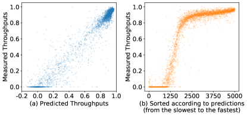

**図11.** 測定されたスループットと予測されたスループットの比較。

[図11](#figure-11)は、予測されたスループットと測定されたスループットをプロットしたものである。測定されたスループットは、テストセット内で最も性能の高いプログラムに正規化されている。予測されたスループットはモデルの出力であるため、負の値になることがある。[図11a](#figure-11)では、点が対角線の周りに散らばっており、モデルが正確な予測を行っていることを示している。分布は一様ではない。なぜならデータセットは探索中に収集されたためである。性能の良いプログラムは測定対象として選ばれる確率が高いため、ほとんどのプログラムは右上に位置している。測定されたスループットが0.0の点は、無効であるか測定中にタイムアウトで終了されたプログラムである。[図11b](#figure-11)では、5000点を予測スループットの遅い順から速い順に並べ、相対的なランキングをx軸として使用した。したがって、点はx軸に沿って均等に分布している。これにより、探索されたプログラムの性能分布がより明確に示される。

モデルは、テストセットで0.079のRMSE、0.958の$R^{2}$相関、0.851のペアワイズ比較精度、および上位30プログラムのrecall@30が0.624を達成している（定義は[脚注1](#footnote1)を参照）。

## 8 関連研究

スケジューリング言語に基づく自動テンソルプログラム生成。Halide [Notice13] はループ最適化プリミティブを記述できるスケジューリング言語を導入する。この言語は手動による最適化と自動探索の両方に適している。Halide には異なる技術に基づく3つの自動スケジューラのバージョンがある [TOG16, TOG18, TOG19]。最新のビームサーチと学習済みコストモデルを使用したものが最も優れた性能を示し、評価にも使用されている。TVM [OSDI18] は類似のスケジューリング言語を利用し、テンプレートガイド探索フレームワーク AutoTVM [System18] を含む。FlexTensor [System20] は、複数の演算子を対象にできる一般的なテンプレートを提案しているが、そのテンプレートは単一の演算子向けに設計されている。複数の演算子を含む最適化（例えば、演算子融合）にはこれらのテンプレートを使うのは難しい。同時期の研究 ProTuner [Xiv05] は、Halide 自動スケジューラにおける不正確な推定問題を解決するためにモンテカルロ木探索を使用している。ProTuner は主に画像処理ワークロードを対象とし、Ansor は深層学習ワークロードを対象として新しい探索空間や他の最適化を導入している。

多面体コンパイルモデル。多面体コンパイルモデル[Implem08, TACO13, Presbu16]は、プログラムの最適化を整数線形計画（ILP）問題として定式化します。これは、依存する文の間のデータ再利用距離を最小化するアフィンループ変換によってプログラムを最適化します。Tiramisu [Tirami19] と TensorComprehensions [Xivi18] は、ディープラーニング分野もターゲットとする二つの多面体コンパイラです。TiramisuはHalide言語に類似したスケジューリング言語を提供し、手動でのスケジューリングが必要です。TensorComprehensionsはGPUコードの自動探索が可能ですが、まだ計算制約がある問題向けには設計されていません [OSDI18]。conv2dやmatmulのような演算子ではTVMより性能が上回ることはできません [OSDI18, Langud19]。これは、特定の最適化の欠如 [TACO19] や、多面体定式化における不正確な暗黙のコストモデルが原因です。

深層学習のためのグラフレベルの最適化。グラフレベルの最適化は、計算グラフ内のオペレーターを基本単位として扱い、オペレーターの内部実装を変更することなくグラフレベルで最適化を行う。グラフレベルでの一般的な最適化には、レイアウトの最適化 [Optimi19]、オペレーター融合 [OSDI18, Nvidib17, Xiv09]、定数畳み込み [Xiv04]、自動バッチ処理 [Xivm17]、グラフ置換の自動生成 [Princi19] などが含まれる。グラフレベルの最適化は通常、オペレーター単位の最適化を補完するものである。グラフレベルの最適化は、オペレーターの高性能な実装からも恩恵を受けることができる。例えば、一般的なオペレーター融合は Ansor のコード生成能力に依存している。我々は Ansor とさらに多くのグラフレベル最適化の共同最適化を将来の課題として残す。

検索ベースのコンパイルと自動チューニング。検索ベースのコンパイルと自動チューニングは、ディープラーニング以外の分野でもその効果がすでに示されています。Stock [News13] はランダム検索に基づくスーパーオプティマイザです。Stock はループフリーのハードウェア命令列を探索する一方で、Ansor はループのネストを持つテンソルプログラムを生成します。OpenTuner [Parall14] は、多腕バンディットアプローチに基づいたプログラム自動チューニングのための汎用フレームワークです。OpenTuner はユーザー指定の探索空間に依存しますが、Ansor は探索空間を自動的に構築します。ATLAS[SC98] や FFTW [Fftw98] といった従来の高性能ライブラリも自動チューニングを活用しています。最近の研究である NeuroVectorizer [Optimi20] や AutoPhase [Autoph19, MLSys20] は、深層強化学習を使用してプログラムを自動的にベクトル化し、コンパイラのフェーズ順序を最適化します。

## 9 制限事項と今後の課題

Ansorの制約の1つは、Ansorが動的形状を持つグラフを最適化できないことです[Xiv06]。Ansorは、計算グラフ内の形状が静的で事前に知られている必要があり、分析を行い、探索空間を構築し、測定を行うことができます。シンボリックまたは動的形状のプログラムを生成する方法は、興味深い将来の方向性です。もう1つの制約は、Ansorが密な演算子のみをサポートしていることです。疎なニューラルネットワーク[Xivb02]やグラフニューラルネットワーク[Xiv08]で一般的に使用されるスパース演算子（例えば、SpMM）をサポートするためには、Ansorの大部分を再利用できることが期待されますが、探索空間を再設計する必要があります。最後に、Ansorはプログラムの最適化を高レベルでのみ行い、プラットフォーム依存の最適化（例：命令選択）は他のコード生成器（例えばLLVMやNVCC）に依存しています。Ansorは、現在市販のコード生成器では十分に扱われていない混合精度および低精度演算子向けの Intel VNNI、NVIDIA Tensor Core、ARM Dot などの特殊命令を活用することには及んでいません。

## 10 結論

我々はAnsorを提案します。これは、深層ニューラルネットワーク向けの高性能テンソルプログラムを生成する自動検索フレームワークです。大規模な探索空間を効率的に探索し、性能ボトルネックに優先的に対処することで、Ansorは既存のアプローチの探索空間外の高性能プログラムを見つけます。Ansorは、さまざまなニューラルネットワークおよびハードウェアプラットフォームにおいて、既存の手動ライブラリや探索ベースのフレームワークを最大$3.8\times$まで上回ります。より良いプログラムを自動的に探索することで、Ansorが計算能力の増大する要求と限定されたハードウェア性能の間のギャップを埋める手助けになることを期待しています。AnsorはApache TVMオープンソースプロジェクトに統合されています[+3]。

## 11 謝辞

我々は、Weizhao Xian、Tianqi Chen、Frank Luan、匿名レビュアー、そして指導者であるDerek Murrayに、洞察に満ちたフィードバックをいただいたことに感謝します。NSF CISE Expeditions Award CCF-1730628に加え、本研究はAlibaba Group、Amazon Web Services、Ant Group、CapitalOne、Ericsson、Facebook、Futurewei、Google、Intel、Microsoft、Nvidia、Scotiabank、Splunk、およびVMwareからの寄付により支援されています。

## 付録A タスクスケジューラのための勾配近似

ここでは、目的関数 $f$ の勾配を近似する方法を示します。まず、近似 $g_{i}(t)\approx g_{i}(t_{i})$ を行います。これは、タスク $i$ の最適コストが、そこに費やされたリソースユニットのみに依存すると仮定することを意味します。これは、すべてのタスクが同じコストモデルを共有しているため、必ずしも正しくない可能性があります。異なるリソース配分は異なるトレーニングデータの集合を生み、それが異なるコストモデルにつながります。ここでは、導出を続けるためにこの近似を行います：

$$
\frac{\partial f}{\partial t_{i}}\qquad =\frac{\partial f}{\partial g_{i}}\frac{\partial g_{i}}{\partial t_{i}}
$$

$$
\approx\frac{\partial f}{\partial g_{i}}(\alpha\frac{g_{i}(t_{i})-g_{i}(t_{i}-\Delta t)}{\Delta t}+(1-\alpha)\frac{g_{i}(t_{i}+\Delta t)-g_{i}(t_{i})}{\Delta t})
$$

$$
\approx\frac{\partial f}{\partial g_{i}}(\alpha\frac{g_{i}(t_{i})-g_{i}(t_{i}-\Delta t)}{\Delta t}+(1-\alpha)(g_{i}(t_{i}+1)-g_{i}(t_{i})))
$$

この式において、$\Delta t$ は小さな後方ウィンドウサイズであり、$g_{i}(t_{i})$ および $g_{i}(t_{i}-\Delta t)$ は履歴の配分からわかっています。しかし、$g_{i}(t_{i}+1)$ は不明です。なぜなら、このタスクに $t_{i}+1$ ユニットのリソースをまだ割り当てていないからです。そのため、この値を予測する必要があります。パラメータ $\alpha$ は予測を信頼する重みを制御します。$g_{i}(t_{i}+1)$ を2つの方法で予測します。まず、追加で $t_{i}$ を費やせば、タスク $i$ のレイテンシを0に減らせると楽観的に推測します。これは $g_{i}(t_{i}+1)\approx g_{i}(t_{i})-\frac{g_{i}(t_{i})}{t_{i}}$ を意味します。次に、部分グラフが構造的に類似している場合、そのレイテンシもフローティングポイント操作あたりで類似します。両方の要素を考慮し、次の近似を行います：

$$
g_{i}(t_{i}+1)\approx\min(g_{i}(t_{i})-\frac{g_{i}(t_{i})}{t_{i}},\beta\frac{C_{i}}{\max_{k\in N(i)}{V_{k}}})
$$

ここで $N(i)$ は $i$ と類似したタスクの集合であり、$C_{i}$ はタスク $i$ のフローティングポイント操作の数、$V_{k}$ はタスク $k$ で達成可能な1秒あたりのフローティングポイント操作数です。パラメータ $\beta$ は類似性に基づく予測を信頼する重みを制御します。

## 付録B 抽出された特徴のリスト

フルテンソルプログラムの文脈における最も内側の非ループ文1つについて、以下の特徴を抽出します。特徴には、カテゴリ特徴と数値特徴が含まれます。カテゴリ特徴を表現するためにはワンホットエンコーディングを使用します。1つの文に含まれるすべての列挙された特徴を含む特徴ベクトルの長さは$164$です。CPUとGPUの両方に同じ特徴セットを使用します。

-   •

浮動小数点演算の数。加算、減算、除算、剰余演算、比較、組み込み数学関数呼び出し（例：exp、sqrt）、およびその他の数学関数呼び出しのそれぞれ、浮動小数点オペランドを用いた場合の数。

-   •

整数演算の数。上記と同様ですが、整数オペランドを用いた操作の場合。

-   •

ベクトル化関連の特徴。最も内側のベクトル化されたループの長さ。ベクトル化位置のタイプ（InnerSpatial、MiddleSpatial、OuterSpatial、InnerReduce、MiddleReduce、OuterReduce、Mixed、None）。すべてのベクトル化ループの長さの積。ベクトル化ループの数。

-   •

展開関連の特徴。ベクトル化関連特徴と同様ですが、展開に関するものです。

-   •

並列化関連の特徴。ベクトル化関連特徴と同様ですが、並列化に関するものです。

-   •

GPUスレッドバインディング関連の機能。blockIdx.x、blockIdx.y、blockIdx.z、threadIdx.x、threadIdx.y、threadIdx.zおよび仮想スレッドの長さ [OSDI18]。

-   •

算術強度曲線。算術強度は $\frac{\mathrm{The\,number\,of\,floating\,point\,operations}}{\mathrm{The\,number\,of\,bytes\,accessed}}$ と定義される。各ループレベルで算術強度を計算し、線形補間で曲線を描く。その後、この曲線から10点をサンプリングする。

-   •

バッファアクセス機能。この文がアクセスする各バッファに対して、特徴量を抽出する。異なる文は異なる数のバッファにアクセスすることがあるが、特徴量抽出は最大5つのバッファに対して行う。文が5つ未満のバッファにアクセスする場合はゼロでパディングし、5つ以上のバッファにアクセスする場合は小さいバッファを削除する。

-   –

アクセスタイプ。アクセスの種類（読み取り、書き込み、読み取り書き込み）。

-   –

バイト数。この文がアクセスする合計バイト数。

-   –

ユニークバイト数。この文がアクセスするユニークなバイト数の合計。

-   –

ライン数。この文がアクセスするキャッシュラインの合計。

-   –

ユニークライン数。この文がアクセスするユニークなキャッシュラインの合計。

-   –

再利用タイプ。データ再利用の種類（LoopMultipleRead、SerialMultipleRead、NoReuse）。

-   –

再利用距離。forループの繰り返し回数およびアクセスされた総バイト数に基づくデータの再利用間の距離。

-   –

再利用カウンタ。データ再利用が発生する回数。

-   –

ストライド。アクセスのストライド。

-   –

再利用で割ったアクセスバイト数。次の値を計算します：$\frac{\mathrm{Bytes}}{\mathrm{Reuse\,counter}}$、$\frac{\mathrm{Unique\,bytes}}{\mathrm{Reuse\,counter}}$、$\frac{\mathrm{Lines}}{\mathrm{Reuse\,counter}}$、$\frac{\mathrm{Unique\,lines}}{\mathrm{Reuse\,counter}}$。

-   •

割り当て関連の特徴。このステートメントの出力バッファに割り当てられたバッファのサイズ。割り当て回数。

-   •

その他の特徴。外側ループの数。外側ループの長さの積。外側ループのプラグマによって指定された“auto_unroll_max_step”の値。

## 付録C 評価における形状構成

-   •

C1D（1次元畳み込み）。形式 = （長さ、入力チャネル、出力チャネル、カーネルサイズ、ストライド、パディング）

-   –

（256, 64, 128, 3, 2, 1）

-   –

（128, 128, 256, 1, 2, 0）

-   –

（64, 256, 256, 5, 1, 2）

-   –

（32, 512, 512, 3, 1, 1）

-   •

C2D（2次元畳み込み）。形式 = （高さ, 幅, 入力チャネル, 出力チャネル, カーネルサイズ, ストライド, パディング）

-   –

（224, 224, 3, 64, 7, 2, 3）

-   –

（56, 56, 64, 64, 1, 1, 0）

-   –

（14, 14, 256, 256, 3, 1, 1）

-   –

（7, 7, 512, 512, 3, 1, 1）

-   •

C3D（3D畳み込み）。フォーマット = （深さ, 高さ, 幅, 入力チャンネル, 出力チャンネル, カーネルサイズ, ストライド, パディング）

-   –

（16, 224, 224, 3, 64, 7, 2, 3）

-   –

（16, 56, 56, 64, 64, 1, 1, 0）

-   –

（16, 14, 14, 256, 256, 3, 1, 1）

-   –

（16, 7, 7, 512, 512, 3, 1, 1）

-   •

GMM（行列積）。フォーマット = （N, M, K）

-   –

（128, 128, 128）

-   –

（512, 32, 512）

-   –

（512, 512, 512）

-   –

（1024, 1024, 1024）

-   •

GRD（グループ畳み込み）。フォーマット = （高さ, 幅, 入力チャンネル, 出力チャンネル, カーネルサイズ, ストライド, パディング, グループ数）

-   –

（224, 224, 3, 64, 7, 2, 3, 4）

-   –

（56, 56, 64, 64, 1, 1, 0, 4）

-   –

（14, 14, 256, 256, 3, 1, 1, 4）

-   –

（7, 7, 512, 512, 3, 1, 1, 4）

-   •

DIL（拡張畳み込み）。フォーマット = （高さ, 幅, 入力チャンネル, 出力チャンネル, カーネルサイズ, ストライド, パディング, 拡張率）

-   –

（224, 224, 3, 64, 7, 2, 3, 2）

-   –

（56, 56, 64, 64, 1, 1, 0, 2）

-   –

（14, 14, 256, 256, 3, 1, 1, 2）

-   –

（7, 7, 512, 512, 3, 1, 1, 2）

-   •

DEP（深さ方向畳み込み）。フォーマット = （高さ, 幅, チャンネル, カーネルサイズ, ストライド, パディング）

-   –

（112, 112, 32, 3, 1, 1）

-   –

（112, 112, 64, 3, 2, 1）

-   –

（14, 14, 512, 3, 2, 1）

-   –

（7, 7, 1024, 3, 1, 1）

-   •

T2D（転置2D畳み込み）。フォーマット = （高さ, 幅, 入力チャンネル, 出力チャンネル, カーネルサイズ, ストライド, パディング）

-   –

（4, 4, 512, 256, 4, 2, 1）

-   –

（8, 8, 256, 128, 4, 2, 1）

-   –

（16, 16, 128, 64, 4, 2, 1）

-   –

（32, 32, 64, 3, 4, 2, 1）

-   •

CAP（カプセル2D畳み込み）。フォーマット = （高さ, 幅, 入力チャンネル, 出力チャンネル, カーネルサイズ, ストライド, パディング, カプセルサイズ）

-   –

（16, 16, 32, 32, 3, 2, 1, 4）

-   –

（8, 8, 32, 32, 3, 1, 1, 4）

-   –

（16, 16, 8, 16, 3, 2, 1, 4）

-   –

（8, 8, 16, 16, 3, 1, 1, 4）

-   •

NRM（行列2ノルム）。フォーマット = （N, M）

-   –

（256, 256）

-   –

（512, 512）

-   –

（1024, 1024）

-   –

（4096, 4096）

-   •

ConvLayer（畳み込み層）。フォーマット = （高さ, 幅, 入力チャンネル, 出力チャンネル, カーネルサイズ, ストライド, パディング）

-   –

（224, 224, 3, 64, 7, 2, 3）

-   –

（56, 56, 64, 64, 3, 2, 1）

-   –

（28, 28, 128, 256, 1, 2, 0）

-   –

（7, 7, 512, 512, 3, 1, 1）

-   •

TBS（マルチヘッドアテンションにおける転置バッチ行列積ソフトマックス）。フォーマット =（シーケンス長、ヘッド数、隠れ次元）

-   –

（128, 12, 64）

-   –

（128, 16, 64）

-   –

（64, 12, 128）

-   –

（128, 12, 128）

[+1]： 上位$k$のtop-$k$におけるリコール = $\frac{|G\cap P|}{k}$、ここで$G$はグラウンドトゥルースに基づく上位$k$プログラムの集合であり、$P$はモデルによって予測された上位$k$プログラムの集合である。

[+2]： D-ResNetおよびDCGANは、ARM CPU上のTensorFlow Liteではまだサポートされていません。

[+3]： [https://tvm.apache.org/](https://tvm.apache.org/]
