> [Michael Luo](https://dblp.org/pid/152/0092)、[Xiaoxiang Shi](https://dblp.org/pid/25/3181)、[Colin Cai](https://dblp.org/pid/250/0706)、[Tianjun Zhang](https://dblp.org/pid/193/9376)、[Justin Wong](https://dblp.org/pid/50/6336)、[Yichuan Wang](https://dblp.org/pid/60/7475)、[Chi Wang](https://dblp.org/pid/09/404)、[Yanping Huang](https://dblp.org/pid/00/10104)、[Zhifeng Chen](https://dblp.org/pid/61/5154)、[Joseph E. Gonzalez](https://dblp.org/pid/61/8262)、[Ion Stoica](https://dblp.org/pid/s/IonStoica)。arXiv 初回提出日：2025-02-19、現行版 v1。[Autellix: An Efficient Serving Engine for LLM Agents as General Programs](https://arxiv.org/abs/2502.13965v1)。[原 PDF](/paper/autellix.pdf)。[DOI](https://doi.org/10.48550/arXiv.2502.13965)。[TeX ソース](https://arxiv.org/src/2502.13965v1)。正確な印刷レイアウトと参考文献は原 PDF を参照してください。

## 概要

大規模言語モデル（LLM）アプリケーションは、単純なチャットボットから、LLM 呼び出しと出力 token 数を拡張して AI エージェントの推論、探索、複雑なタスク解決を支援する動的で汎用的なエージェントプログラムへ進化している。しかし既存の LLM サービングシステムはプログラムと呼び出しの依存関係を無視し、重要な最適化機会を逃している。分析の結果、LLM サービングエンジンに投入されたプログラムは、個々の LLM リクエストとプログラムの両方で発生するヘッドオブライン（HoL）ブロッキングのため、長い累積待ち時間を経験することが分かった。

そこで、プログラムを第一級市民として扱い、エンドツーエンド遅延を最小化する LLM サービングシステム Autellix を導入する。Autellix はプログラムから送られた LLM 呼び出しを捕捉し、スケジューラにプログラムレベルのコンテキストを与える。単一スレッドおよび分散プログラム向けに、完了済み呼び出しに基づいて LLM 呼び出しを先取りし優先順位付けする 2 つのスケジューリングアルゴリズムを提案する。評価では、多様な LLM とエージェントワークロードにおいて、vLLM などの最先端システムと同じ遅延でプログラムスループットを 4–15 倍に向上させた。

## 1 はじめに

自律エージェントとしての大規模言語モデル（LLM）は、推論計算を拡張する、すなわち出力 token 数や LLM 呼び出し数を増やすことで問題解決能力を高める [Eva84, Kah11, Kah03, Kum24, Zou24, Mir24]。呼び出しと token を増やすと、LLM はエージェントに高度な推論 [Wei22a, Cao23, Dee25]、計画と探索 [Wan24, Raf24]、過去の経験からの自己反省 [Yao23, Yu24, Fau24]、複数エージェント間の協調能力 [Mor23, Wan23, Sch24] を与える。これらの技術により、エージェントはツールを介して外部環境を操作し [Sci23, Gon23, Cao23]、ウェブの自律閲覧 [Nar23, Neu24, Fau24a]、GitHub issue の解決 [Nar24, Pre24, Oth24]、難しい数学問題の証明 [Dee24, Ana24] などを行える。

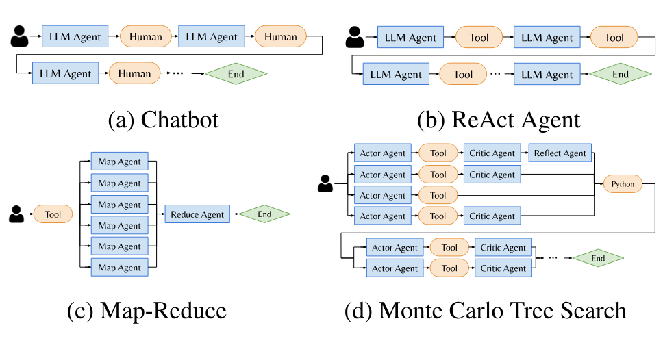

**図 1. エージェントプログラムの実行ワークフロー。** エージェントプログラムは有向非巡回グラフ（DAG）に従う動的な実行ワークフローであり、1 つ以上の LLM エージェントによる LLM 呼び出しと、ツール呼び出しや人間入力などの外部割り込みからなる。

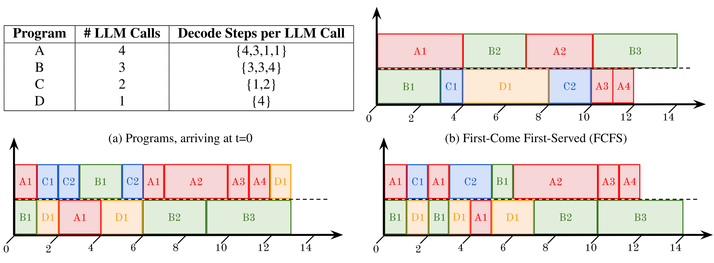

**図 2. 最大バッチサイズ（BS）2 の LLM サービングエンジンにおける LLM 呼び出し実行のガントチャート。** 縦軸はバッチ、横軸はデコードステップを表す。

推論時技術とエージェントアプリケーションの発展は、静的で専用の LLM アプリケーション [Con23, Qiu24] から、高度に動的で汎用的な*エージェントプログラム* [She24, Wan23, Inc24] への転換を示している。エージェントプログラムとは、DAG で表される動的実行ワークフローであり、1 つ以上のエージェントによる LLM 呼び出しと、ツール呼び出し（外部 API 呼び出し）、一般コード実行、人間入力を含む外部割り込みからなる（[背景と関連研究](#section-02)参照）。プログラムの LLM 呼び出しパターンは実行時に初めて現れるため、グラフ全体を事前に完全に把握・予測することは難しいと仮定する。

[図 1](#figure-01) は単一スレッドおよびマルチスレッドの例で、エージェントプログラムの動的性を示す。単一スレッドプログラムは、ユーザプロンプトに依存するプログラム長と、制御フローで決まる LLM 呼び出し・割り込み列の 2 つの次元で変化する。Chatbot と ReAct（Reasoning and Acting）[Cao23] は、LLM 呼び出しと人間またはツールの割り込みを循環し、人間または LLM の判断で終了する。マルチスレッドプログラムは一般に DAG となる。Map-Reduce と Monte Carlo Tree Search（MCTS）は、時間とともに分岐・合流するスレッド数が変化し、各スレッドが異なる LLM 呼び出し列を持ち得る。MCTS は推論およびウェブエージェントの探索・計画で広く使われる [Wan24, Raf24, Cap24, Has25]。

vLLM など既存の LLM サービングエンジン [Sto23c] は、KV キャッシュ効率 [Sto23c, She24]、CUDA カーネル [Kas24, Jin24]、LLM リクエストのスケジューリング [Jin24, Ram24] を改善し、個々の LLM 呼び出しや静的 LLM アプリケーション [Qiu24] の最適化に注力する。しかし、同じプログラム内の呼び出し依存関係や総実行時間のようなプログラムレベルの文脈を考慮しないため、複雑なプログラムのエンドツーエンド性能、とくにプログラム遅延が悪化する（[3 節](#section-03)参照）。

[図 2](#figure-02) は、時刻 t=0 に 2 つの長いプログラム（A、B）と 2 つの短いプログラム（C、D）が最大バッチサイズ 2 のエンジンへ到着する場合を示す。FCFS ポリシー（vLLM の既定値 [Sto23c]）では長い呼び出しが他の呼び出しをブロックし、呼び出しレベルの HoL ブロッキングが生じる。A、B の長い初回呼び出しが先に実行され、C、D は t=3、4 まで遅れる。総待ち時間は **18** 単位となる。MLFQ [Jin24] のような先取りスケジューリングは長い呼び出しを先取りして短い呼び出しを実行するが、プログラムレベルの文脈がないため、古いプログラムの後続呼び出しが新しいプログラムを遅らせる。MLFQ は A、B の後続呼び出しを t=6–12 に繰り返し優先し、D を遅らせるため、FCFS と同じ **18** 単位の待ち時間になる。

Autellix は個々の呼び出しではなくプログラムを実行する LLM 推論システムである。OS のプロセススケジューラに着想を得て、プログラムが過去に完了した呼び出しの総実行時間に基づき LLM 呼び出しを優先する。長いプログラムの呼び出しは早く終わる可能性が低いため優先度を下げ、短いプログラムを先に完了させる。[図 2](#figure-02) では C、D が A、B の後続呼び出しに阻まれず、総待ち時間が **12** 単位に下がる。

Autellix はプログラムの累積実行時間などの統計を利用して待ち時間を減らし、エンジンスループットを高める。事前のワークロード知識を必要としない PLAS（Program-Level Attained Service）と、動的 DAG のマルチスレッドプログラム向け ATLAS（Adaptive Thread-Level Attained Service）を提案する。PLAS はプログラムの累積サービス時間で呼び出しを優先し、ATLAS は同じプログラムの全スレッドにおける最大累積サービス時間を用いてクリティカルパスに沿って呼び出しを並べる [Zha20]（[Autellix 設計](#section-05)参照）。

数十から数百の LLM 呼び出しを含むプログラムでは、単一エンジンは MCTS を毎秒 0.2 プログラムしか処理できない（[6 節](#section-06)参照）。そこで Autellix は複数エンジンに呼び出しを分散する。同一プログラムの呼び出しは共通プレフィックスと累積会話状態を共有し、異なるプログラム間では通常システムプロンプトだけを共有する [Zha24a]。長い呼び出しをプログラムのエンジンへ固定し、短い呼び出しを他のエンジンへ負荷分散することで、KV キャッシュの再計算を避ける。

Autellix を vLLM などの LLM サービングエンジン上のレイヤとして実装し [Sto23c]、従来のステートレス API [Ope24a] とは異なる永続セッション用ステートフル API を提供する。異なる LLM と 4 種類のエージェントワークロードで評価した結果（[6 節](#section-06)）、vLLM に対してスループットが 4–15 倍向上し、複数エンジンでは標準ロードバランサより最大 1.5 倍向上した。

主な貢献は次のとおりである。

- エージェントプログラムを LLM 呼び出しと割り込みからなる動的・非決定的 DAG として初めて形式化した。
- Autellix はプログラムレベル統計をスケジューラに与え、同一プログラム内の累積サービス時間だけで非予知スケジューリングを行う。
- 複数エンジン間の単純なロードバランシングでデータ局所性と KV 再計算を両立する。
- ステートフル API を既存のプログラミング・エージェントフレームワークに統合し、大きなスループット向上を得る。

## 2 背景と関連研究

Autellix の背景として、AI エージェント基盤と応用を LLM サービング層とエージェント層に分けて概説する（[図 3](#figure-03)）。

### LLM サービング層

**LLM 推論過程。** チャットボットや AI アプリケーションを駆動する LLM は主に Transformer アーキテクチャ [Pol23] を使い、GPT、Claude、LLaMA などのデコーダ専用モデルを含む [Oth20, Oth23, Oth23a, Say23]。推論は、入力プロンプトを中間 token 状態へ変換する*プレフィル*と、既存 token 列に基づいて 1 token ずつ自動回帰生成する*デコード*の 2 段階である。LLM サービングシステムは中間状態を保存する KV キャッシュを使って生成計算を削減する [Chu22, Sto23c]。

**LLM サービング。** システムはエンジン間の呼び出しルーティングと各エンジン内の実行を管理する（[図 3](#figure-03)）。既存手法は仮想メモリとページング [Sto23c]、リクエスト間の共有プレフィックス [Qiu24, She24]、GPU・CPU・ディスク間のキャッシュ階層 [Kas24, Zha23, Sto24] を使い、自注意力カーネル [R22]、演算子パイプライン [Kas24]、テンソル／パイプライン並列 [Jin24, Sto23d] を最適化する。プレフィルとデコードの同時バッチ化 [Ram24] やリクエスト先取り [Jin24] も応答時間を改善する。複数エンジンではライブマイグレーション [Lin24a]、プレフィルとデコードの分離 [Xu24]、プレフィックス木 [Zha24a]、KV キャッシュ移行 [Qiu24] などを用いる。これらは独立した LLM リクエスト（一般プログラムの関数呼び出し）を対象とするのに対し、Autellix は OS がプロセスを管理するようにプログラムレベル、とくにスケジューリングを扱う。

複数エンジンの動的スケジューリングに関する研究 [Lin24, Zha24] もこの課題に取り組んでいる。

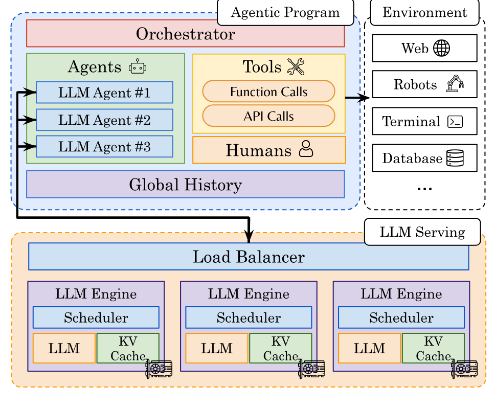

**図 3. AI エージェント基盤。** 上段では開発者とユーザがエージェントプログラムを構築・実行し、エージェント、ツール、人間の間の累積履歴を保持する。下段では LLM サービングシステムが呼び出しを処理し、1 つ以上のエンジンへルーティングする。

### エージェント層

**エージェントプログラム。** LLM 推論層の上で、開発者はエージェント、ツール、人間の相互作用を調整する*エージェントプログラム*を構築する（[図 3](#figure-03)）。LLM エージェントは役割を指定するシステムプロンプトと LLM モデルクラスの組として定義する [+2]。OS のプロセスと割り込みに似て、プログラムは LLM 呼び出しでサービング層と直接対話するか、エンジン外部で時間を費やす外部割り込みに参加する。ツールはデータベース、ロボット、インターネットなどを制御する汎用関数や外部 API を実行する [Sci23, Gon23, Nar23, Bai24, Sha22, Li24]。LangChain や Autogen などのオーケストレーションフレームワーク [Ope24, Con23, Inc24, Wan23] は、エージェント実行、ツール呼び出し、人間入力を決める制御フロー原語を提供する。条件分岐、ループ、エラー処理、終了条件という一般的なプログラミング意味論に従う [She24, Inc24, Wan23, Kha23]。プログラムはエージェント、ツール、人間の出力履歴を保持し [Qiu24, Inc24, Gon24, Cui24]、LLM チャットボットはエージェント出力と人間入力のメッセージを蓄積する [Ope23]。Autellix はプログラム層を変更せず、実行時に DAG の内部状態を構築してプロセステーブルに保存する（[実装](#section-07)）。

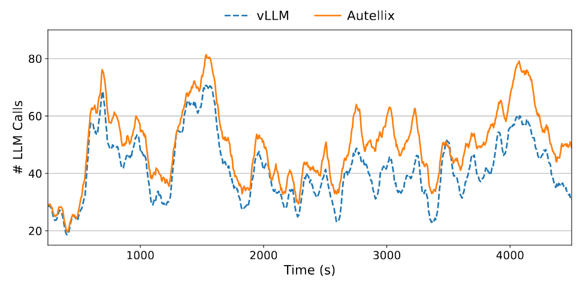

**図 4. 1 時間の定常状態におけるサービングエンジン内の LLM 呼び出し数。** プログラムの待ち時間を最適化すると定常状態の呼び出し数が増える。

**エージェントアプリケーション。** チャットボット（[図 1](#figure-01)）以外にも、ウェブ／UI 操作（OpenAI Operator など）[Has25, Neu24, Fau24a, Bai24]、GitHub issue 解決 [Nar24, Pre24, Oth24]、IMO レベル問題 [Dee24, Ana24]、複数情報源の検証と要約（[図 1](#figure-01)）[Gon24, Qiu24]、ロボット制御 [Car24] がある。多くのアプリケーションは LLM 呼び出し数と総デコード token 数を増やして複雑なタスク性能を高める。手法には段階的推論 [Wei22a, Lew23]、思考注入 [Cao23]、探索 [Nar23, Bes24, Wan24]、自己批評 [Sto23e, Sto24b]、自己反省 [Yao23, Fau24]、マルチエージェント協調 [Wan23, Mor23a] がある。ReAct は CoT と環境操作を組み合わせ（[図 1](#figure-01)）、Deepseek／o1 型 LLM 上で推論とツール呼び出しに使われる [Dee25, Oth24, Li25]。MCTS [Wan24] は並列計画、自己批評、自己反省、協調を統合する。分散プログラムは best-of-N、ビームサーチ、先読み、遺伝的アルゴリズムも使う [Fau24b, Kum24, Dav24, Che25]。LLM の確率性から、プログラムは動的、非決定的、分散的であり、Autellix はワークロードや実行グラフを事前に知らない非予知システムである。

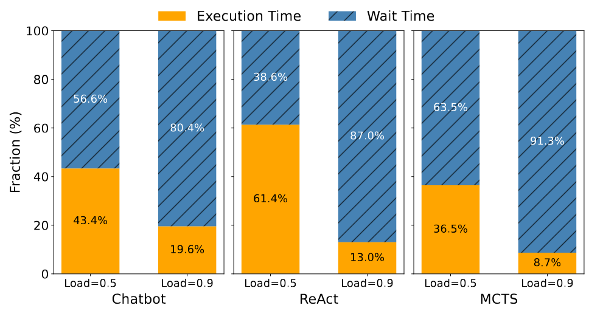

**図 5. 異なるプログラムと負荷における実行時間と待ち時間。** 中程度の負荷ではプログラムは待ち時間を多く費やし、その長さはワークロードに依存する。

## 3 動機

現在の AI エージェント基盤は LLM サービングとエージェントプログラムを分離している（[2 節](#section-02)）。高レベルの AI アプリケーションへ移行するには、LLM エンジンが応答時間やエンドツーエンド遅延というプログラム目標を最適化する必要がある [Qiu24]。単一スレッドプログラムの遅延は、LLM 呼び出しの総待ち時間、呼び出しの累積実行時間、ツールや人間入力を待つ外部割り込み時間の 3 つからなる。後者は LLM サービングと無関係なので、待ち時間と実行時間の削減機会を特定し、Autellix のポリシーで対処する（[Autellix 設計](#section-05)）。

### プログラムレベルの待ち時間

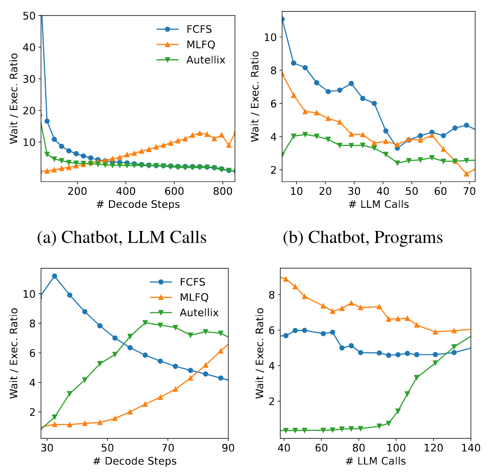

**図 6. LLM 呼び出しとプログラムの待ち時間／実行時間比。** 短い呼び出しやプログラムが実行時間より長く待つと HoL ブロッキングが発生する。

[図 6](#figure-06) は、チャットボット、ReAct、MCTS などのワークロードで負荷が増えるとプログラムの大半が待ち時間になることを示す。Autellix は待ち時間を減らし、プログラム遅延とエンジンスループットを改善する。[図 4](#figure-04) は LLaMA-3.1-8B [Oth24a] と ShareGPT [Src23] を単一 A100-80GB で 1 時間実行した定常状態を示す。vLLM の FCFS と比べ、Autellix は常に 10 個多い同時 LLM 呼び出しを扱う。

**呼び出しレベルのブロッキング。** 長いデコードが短い呼び出しを遅らせる呼び出しレベル HoL が第一の課題である [Jin24]。vLLM [Sto23c] は実行中の呼び出しが終わるまで新規呼び出しをスケジュールしないため、長いデコードの長い裾分布を持つワークロードでは HoL が深刻になる（[図 11](#figure-11)）。[図 6](#figure-06) は出力 token 数ごとの待ち時間／実行時間比を示す。FCFS では短い呼び出しの比率が増えるが、MLFQ の先取りは短いデコードでこの比率を下げる。ただしプログラム統計なしの先取りだけでは不十分である。

**プログラムレベルのブロッキング。** 多数の要求を持つ長いプログラムが短いプログラムを遅らせることが第二の課題である。既存スケジューラは個々の要求をプログラム内の位置なしに扱うため、短いプログラムの比率が高くなる。MLFQ も新規要求を盲目的に優先し、短いプログラムを飢餓させる（[6 節](#section-06)）。

### プログラムレベルの実行時間

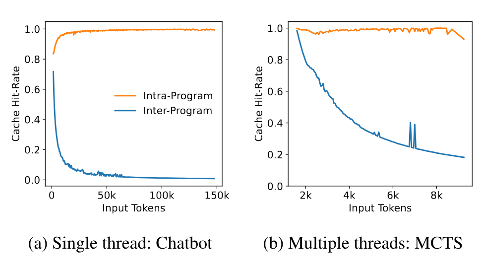

**図 7. 入力長に対するプレフィックスキャッシュヒット率。**

プログラム実行時間はプレフィルとデコードの管理効率に依存する。エージェントワークロードでは累積プレフィルが長いため、Autellix はプレフィックスキャッシュでシステムプロンプトなどの KV エントリを再利用する [Qiu24, She24]。

**データ局所性。** [図 7](#figure-07) は入力長に対するキャッシュヒット率を示す。同一プログラム内では全長で 90% 以上だが、異なるプログラム間では入力長とともに指数的に低下し、共有されるのはシステムプロンプトだけである。したがって複数エンジンのサービングシステムはプログラムのデータ局所性を考慮すべきである。

## 4 Autellix の設計

Autellix のアーキテクチャ（[4.1 節](#section-04-01)）と、呼び出し／プログラム両レベルのブロッキングを減らすプログラム対応スケジューラ（[4.2 節](#section-04-02)）、データ局所性対応ロードバランサ（[4.3 節](#section-04-03)）を説明する。

### 4.1 概要

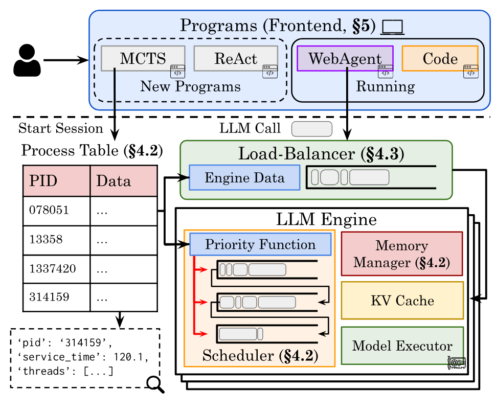

**図 8. Autellix のシステムアーキテクチャ。** ユーザはローカルでプログラムを実行し、ステートフルセッションを開始してバックエンドへ LLM 呼び出しを送る。Autellix はグローバルプロセステーブルでセッションを追跡し、ロードバランサとスケジューラに情報を与える。

Autellix は個々の要求ではなくエージェントプログラム向けの高レベルサービングエンジンである。目的は、ユーザのエンドツーエンド遅延、提供者の GPU 利用率、95／99 パーセンタイルで測る公平性を改善することだ。

**仮定。** Autellix は非予知であり、到着、ワークフロー構造、一般的な分布を知らない。到着時の DAG は未知で、実行中に内部表現を構築する。この柔軟性で、基盤エンジンへ LLM 呼び出しを行う任意のプログラムに一般化できる。静的アプリケーションを投入する先行研究 [Qiu24] と違い、ユーザがローカルで Python プログラムを実行しバックエンドを呼ぶと仮定する（[実装](#section-07)）。

**アーキテクチャ。** [図 8](#figure-08) に示す通り、Autellix はステートレス呼び出しを仮定する既存エンジンと異なりステートフルである。セッション開始時にプロセステーブルへエントリを追加し、サービス時間、スレッドメタデータ、待ち時間を追跡する。スケジューラ（[4.2 節](#section-04-02)）とロードバランサ（[4.3 節](#section-04-03)）はこの表で次のバッチを決め、データ局所性に基づきエンジンへルーティングする。

### 4.2 プログラム対応スケジューラ

**アルゴリズム 1. Autellix のプログラム対応スケジューラ**

- **手続き** `Update_Process_Table(Call c, Table pt)`
  - `pd = pt[c.pid]`
  - コメント：総サービス時間（PLAS）、最大クリティカルパス（ATLAS）。
  - `pd.service = max(pd.service, c.service + c.model_time)`
  - コメント：その他のメトリクスを更新…
  - `...`
- **手続き** `Scheduler(Queues Q_1, ..., Q_K, Table pt)`
  - **各** `C_arrived` の `c`（到着 LLM 呼び出し）**について**、プログラム ID で優先度を取得し、`c.service = pt[c.pid].service` とする。
  - `Q_i^low <= c.service <= Q_i^hi` を満たすキューへ追加し、`c.quanta` をキューの量子に設定する。
  - **各** `c` **について**、完了なら表を更新して除去し、量子が尽きれば低いキューへ降格する。
  - `wait / service >= beta` なら `Q_1` へ昇格し、`c.wait` と `c.model_time` を 0 に戻す。
  - `B_out = []` を作り、`engine.can_fit(c)` の呼び出しを優先キュー順に次のバッチへ追加する。

このスケジューラは先験知識なしにプログラム応答時間を最小化する。プログラム・呼び出し両レベルの HoL を緩和するため、累積実行時間などの統計に基づき優先度を付け、呼び出しを動的に先取りする。[アルゴリズム 1](#section-04-02) に完全な手順を示す。

#### 4.2.1 プログラムレベルの優先度

Autellix はグローバルプロセステーブルで単一・マルチスレッドプログラムの主要メトリクスを追跡する。

**プロセステーブル。** OS に倣い、実行中プログラムの状態を記録する表を維持する。各エントリはサービス時間、反飢餓用待ち時間、使用中エンジン ID、活動呼び出しの到着・待ち・サービス時間、最新到着、最新完了を記録する。呼び出し完了時に更新し、スケジューラはプログラムの全体状態を判断する。

**単一スレッドプログラム。**

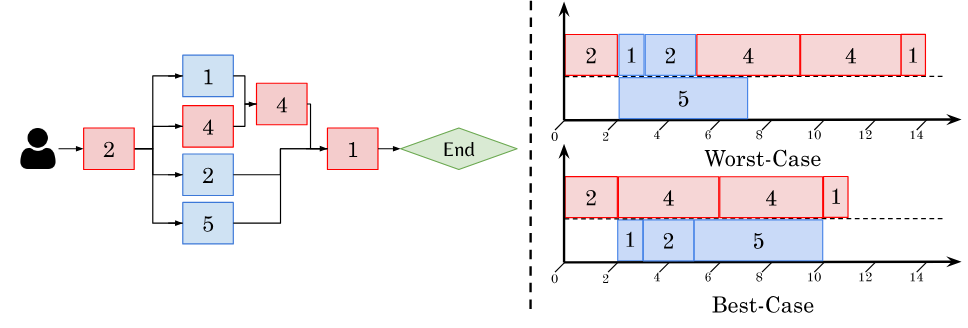

**図 9. マルチスレッドプログラムのクリティカルパス。** DAG を通る例と、14 単位の最良 makespan と 11 単位の最悪 makespan を示す。

SJF と SRPT は応答時間を最適化できるが [Har18, Akh15]、実行時間の完全な知識を必要とする。情報非依存の LAS [Wie08] はデータセンタネットワーク [Wan15, Cho15] や深層学習クラスタ [Gu19] で実用的である。PLAS は LAS をプログラムへ拡張し、完了済み呼び出しの実行時間合計をサービス時間とする。

$$p(c_j) = \sum_{\substack{k < j \\ c_k.id = c_j.id}} t_k$$

大きい値ほど低い優先度である。表からサービス時間を読み、完了時に更新することで、サービスの少ない短いプログラムを先に完了させる。

**マルチスレッドプログラム。** 動的 DAG の完了時間は開始から終了までの最長依存列であるクリティカルパス（[図 9](#figure-09)）に決まる。ATLAS は親呼び出しの優先度とサービス時間から次を計算する。

$$p(c_j) = \begin{cases} 0 & \mathrm{if}\ c_j\ \mathrm{is\ root} \\
\max_{c_k \in \mathcal{P}(c_j)} \{p(c_k) + t_k\} & \mathrm{otherwise} \end{cases}$$

プログラムごとに観測された最長クリティカルパスを 1 つのスカラーとして保持し、各呼び出しが継承する。完了時により長い場合だけ更新するため、依存関係を追跡せずに推定を改善でき、同一プログラムの並列呼び出しをまとめて遅延スレッドを防ぐ。

#### 4.2.2 先取りスケジューリング

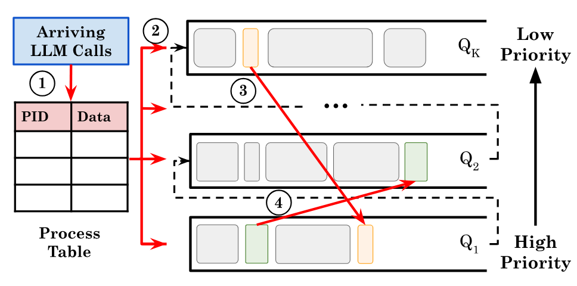

**図 10. 離散優先度に基づく LLM 呼び出しのライフサイクル。**

連続優先度の先取りは最悪の場合ラウンドロビン [Cho15] になり、FCFS より悪く、CPU-GPU の KV 交換を含む不要な切替を招く [Jin24]。そこで優先度を `Q_1` から `Q_K` の有限キューへ離散化する [Cho15, Gu19, Arp18]。各キューは `[Q_i^lo, Q_i^hi)` を担当し、新しい呼び出しをその範囲へ置く。量子が尽きれば低いキューへ降格し、長く待てば反飢餓で `Q_1` へ昇格する。

**反飢餓。** 長く低優先度のプログラムは飢餓し得る [Gu19, Jin24, Cho15]。`W_total / T_total >= beta` のとき `c` を `Q_1` に昇格し、`W_c` と `T_c` を 0 にする。

$$\frac{W_{\mathrm{total}}}{T_{\mathrm{total}}} \geq \beta$$

`beta` は平均応答時間と公平性のトレードオフを決める。

**メモリ管理。** 先取りにより KV ブロックの GPU-CPU 転送が増える [Jin24]。Autellix は N デコードステップごとのマルチステップスケジューリングで交換回数を減らし、GPU 上のキューを過剰プロビジョニングする。また KV ブロックを連続バッファへまとめて一括転送するカーネルで PCIe 帯域を高め、ブロックごとのオーバーヘッドと遅延を下げる（[実装](#section-07)）。

### 4.3 ロードバランサ

**アルゴリズム 2. Autellix のロードバランサ**

- **手続き** `Load_Balancer(Call c, Table pt, List Engines)`
  - `len(c.tokens) <= 2048` なら `Least_Used(Engines)` へ送る。
  - それ以外で `c.pid in pt` なら既存エンジンへ固定する。
  - 新規プログラムなら最少利用エンジンを選び、`pt[c.pid]` に記録する。
  - **返す** `assigned_engine`。
- **手続き** `Least_Used(List Engines)`：エンジン負荷を並列に問い合わせ、`Argmin(workloads)` を返す。

エージェントワークロードが拡大すると複数レプリカが必要になるが、局所性を無視した分配は性能を下げる [Zha24a]。2048 token 未満の短い要求は共通システムプロンプトにより任意のエンジンで 75%以上のヒット率を得るため最少負荷へ分散し、長い要求はプログラムのエンジンへ固定する。これにより再計算を減らし、[アルゴリズム 2](#section-04-03) の方針でスループットと遅延を改善する（[6 節](#section-06)）。

## 5 実装

Autellix はフロントエンド、スケジューラ、ロードバランサからなるマルチエンジン LLM 推論サービングシステムで、Python と CUDA/C++ の約 5k 行で実装した。

**フロントエンド。** OpenAI Chat Completion と vLLM Python API [Sto23c, Ope25a] を拡張し、開発者にはステートレスに見えるステートフルインターフェースを提供する。初期化時に `start_session` を送り、以後の呼び出しにセッション、プログラム、スレッド ID を付加する。終了またはエラー時は `end_session` で表から削除する。研究プロトタイプのため、パッケージ改変への保護はなく、将来課題である。

**LLM エンジン。** vLLM v0.6.1 [Sto23c] を基礎に、スケジューラへ PLAS、ATLAS、MLFQ と効率的な交換カーネルだけを統合した。`cudaMemcpyAsync` による KV ブロック単位の細切れ転送を、ホストバッファへまとめた一括転送に変更し、PCIe 帯域を有効利用する。

**マルチエンジン。** `AsyncLLMEngine` 上に `AsyncMultiLLMEngine` を構築し、各レプリカを別 Python プロセスで動かす。メタエンジンは `mp.Queue` と `mp.Pipe` で要求を割り当て、future-like オブジェクトを返す。結果を受信すると future を解決するため、ルーティング、資源割当、結果収集を非ブロッキングに並行実行できる。

## 6 評価

代表的なエージェントワークロードを分析し、最先端サービングシステムと比較し、設計要素をアブレーションする。

### ワークロード

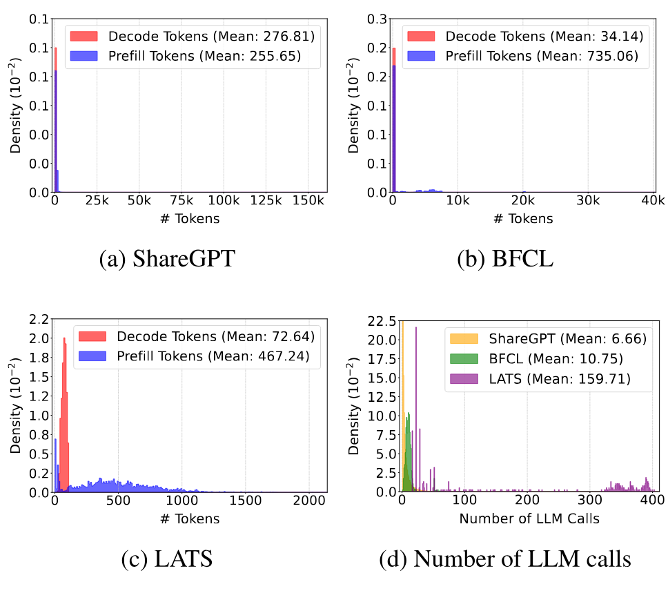

**図 11. ワークロード分析。** ShareGPT、BFCL、LATS の token 長分布と、各プログラムの LLM 呼び出し数を示す。

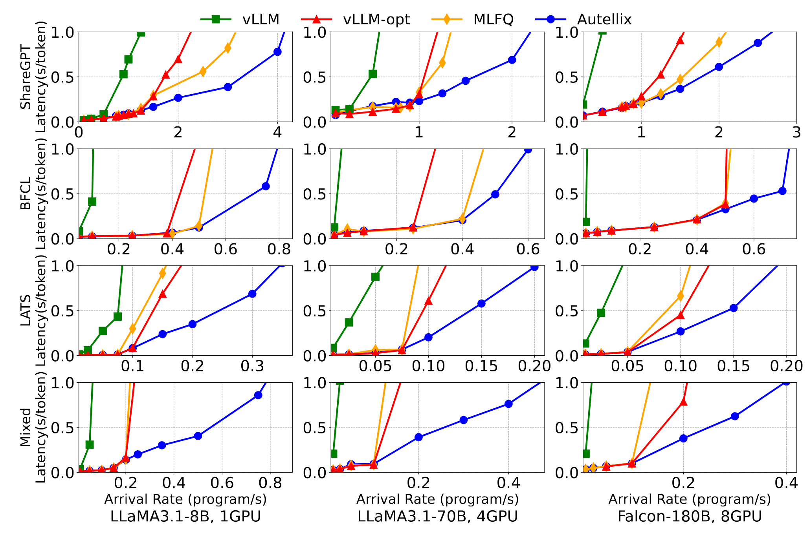

**図 12. 単一エンジンの主結果。**

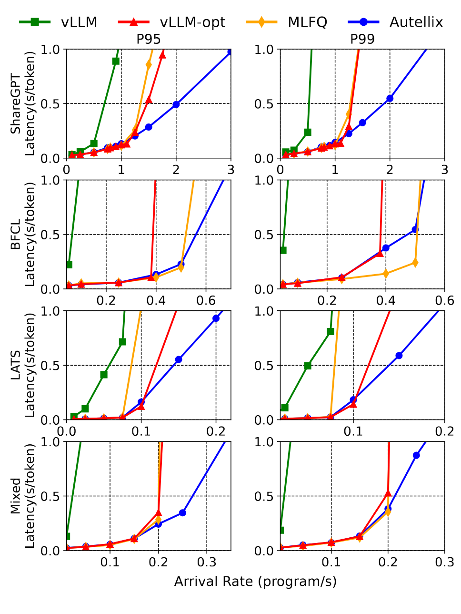

**図 13. 単一エンジンのテール遅延。**

4 つの実ワークロードは decode token、prefill token、LLM 呼び出し数が大きく異なる（[図 11](#figure-11)）。ShareGPT [Src23] は平均 6.66、最大 80 呼び出しで、decode 平均 277、prefill 平均 256 token の会話型データである。BFCL [Gon24a] は平均 10.75、最大 70 呼び出しで、長いシステムプロンプトとツール署名により prefill 平均 735.06、decode 平均 34.14 token のツール利用課題である。LATS [Wan24] は HotpotQA [Man18] 上の MCTS から得られ、1 プログラム平均 159.7 呼び出し、prefill 467.2、decode 72.6 token の並列ワークロードである。[図 11](#figure-11) に示す 3 種を等量混合し、プログラム単位でランダムサンプリングしてポアソン過程 `lambda` により到着を生成する [Sto23c, Jin24]。

### 実験設定

**モデルとテストベッド。** LLaMA-3.1-8B、70B、Falcon-180B をそれぞれ 1、4、8 GPU で評価した。8 枚の A100-SXM4-80GB を NVLink 接続した GCP `a2-ultragpu-8g`（ホストメモリ 1360 GB、PCIe-4.0×16、ディスク 2 TB）を用いる。

**メトリクス。** TFTT と TPOT など要求レベル指標 [Sto23c, Jin24, Kas24] はプログラム遅延を捉えない。そこで総プログラム応答時間を生成 token 数で割るプログラムレベルトークン遅延を導入する [+3]。以降は単に遅延と呼ぶ。

**ベースライン。** すべて同じ最大バッチサイズを使う。

- **vLLM [Sto23c]。** 連続バッチ処理 [Chu22] と PagedAttention [Sto23c] を備えた高スループットシステムで、FCFS により HoL が生じる。v0.6.1 を使う。
- **vLLM-opt。** chunk-prefill [Ram23]、prefix-caching [She24, Qiu24]、マルチステップスケジューリングを有効化した版で、SGLang [She24] と TensorRT [Nvi23] に近い性能を持つ [Tea24]。
- **MLFQ。** vLLM-opt 上で MLFQ [Jin24] による先取りを実装する。

### エンドツーエンド単一エンジン性能

[図 12](#figure-12) では 4 ワークロードすべてで Autellix が同じ token 遅延に対して最高スループットを達成する。vLLM は prefix cache がなく累積状態を再計算するため最も悪い（[図 7](#figure-07)）。ShareGPT と BFCL では MLFQ が呼び出しレベル HoL を緩和し、vLLM-opt より 1.5 倍高いスループットを得るが、高負荷ではプログラムレベル HoL が残る。PLAS により Autellix は vLLM の最大 8 倍、vLLM-opt の 2 倍、MLFQ の 1.5 倍となる。LATS では ATLAS が全スレッドの進行を調整し、vLLM、MLFQ、vLLM-opt より最大 5、2.5、2 倍高い。混合ワークロードでは vLLM、MLFQ、vLLM-opt より最大 15、5.5、4 倍高い。

**テール遅延。** [図 13](#figure-13) は LLaMA-3.1-8B の P95/P99 を示す。8 シナリオ中 7 つで Autellix は MLFQ と vLLM-opt より低いテール遅延を保ち、P95/P99 のスループットを最大 1.7 倍改善する。

### エンドツーエンド・マルチエンジン性能

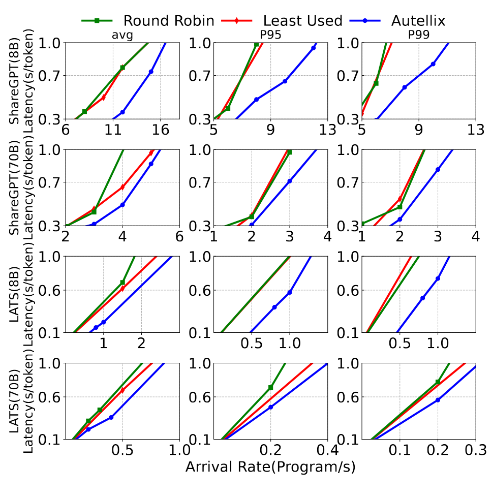

**図 14. マルチエンジンの主結果。** 異なるロードバランシングポリシーに対する平均、P95/99 遅延。

Autellix の局所性対応ロードバランサ（[4.3 節](#section-04-03)）を、同じ PLAS／ATLAS の下で Round Robin と Least Used と比較する。Round Robin は Kubernetes の既定ポリシー [Src17] だが局所性を無視し、Least Used も呼び出し数だけを均衡化して KV 再計算を招く。LLaMA3.1-8B を 4 レプリカ、70B を 2 レプリカで ShareGPT と LATS に実験した結果、[図 14](#figure-14) の Autellix は全構成で低い平均・テール遅延を保ち、両ベースラインより最大 1.4 倍高い。ShareGPT では会話履歴の再利用が局所性を増幅し、レプリカ数が増えるほど利点が明確になる。

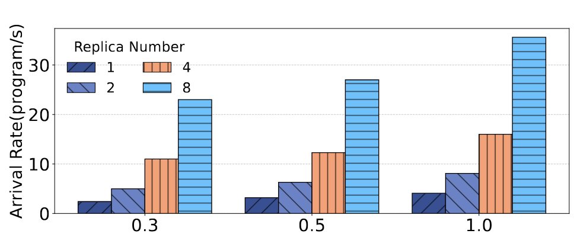

**図 15. スケーラビリティ実験。** 同じ SLO（s/tok）で、最大到着率はレプリカ数、すなわち LLM エンジン数に対して線形に増える。

**スケーラビリティ。** ShareGPT と LLaMA3.1-8B でレプリカ数を増やし、[図 15](#figure-15) の線形スケールを確認した。プログラムレベルのロードバランシングにより局所性オーバーヘッドなしに水平拡張できる。

### アブレーション

オフラインバッチ推論、タイミング分解、交換カーネルなどを調べる。すべて LLaMA3.1-8B [Oth24a]、ShareGPT [Src23]、LATS [Wan24] で実行する。

#### オフライン推論

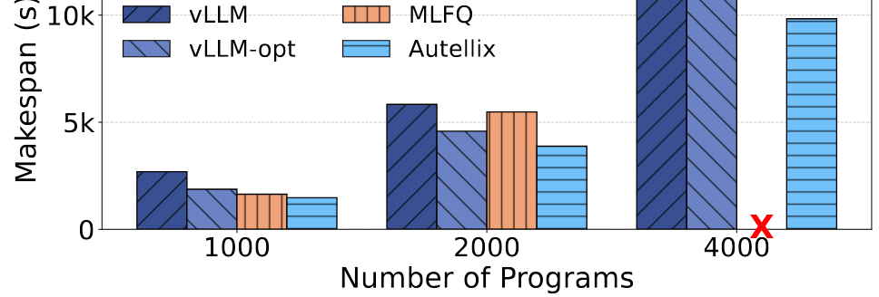

**図 16. オフラインバッチ推論。** Autellix はプログラムバッチ処理に必要な makespan を短縮する。

全プログラムを開始時に投入するオフライン設定では、Autellix が平均 makespan を 10–40% 短縮する。[図 16](#figure-16) の 4000 プログラムで MLFQ は OOM により完了しない。新規要求を最高優先度へ集めるため、メモリ競合と GPU-CPU 交換が激増し、1.2 TB 超の swap でも資源を使い果たす。

#### タイミング分解

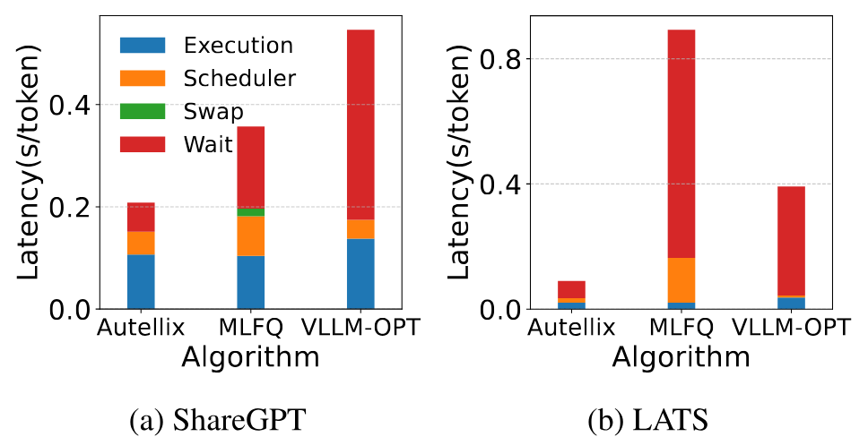

**図 17. 推論オーバーヘッドの分解。** Autellix は待ち時間を大幅に減らし、vLLM に小さなスケジューラオーバーヘッドを追加する。また改良カーネルで swap 時間も減らす。

[図 17](#figure-17) はサービス層の時間を分解する。Autellix はプログラムレベルのスケジューリングと交換カーネルにより ShareGPT と LATS の token 遅延を下げる。MLFQ は新規呼び出しを高優先度キューへ入れるため、Autellix よりスケジューリングオーバーヘッドが大きい。

#### 最適スケジューリングとの比較

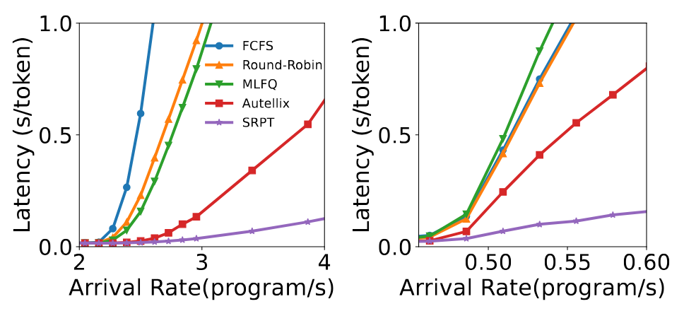

**図 18. 最適スケジューリングポリシーとの比較。** シミュレーションでは Autellix が他のポリシーを上回るが、最適な SRPT との差は残る。

SRPT はプログラム実行時間を完全に知ることを仮定するため、各プログラムの総呼び出し数とデコードステップを事前公開するシミュレータで予知を模倣した。連続バッチの各ステップが同一という簡略条件で Autellix は FCFS、Round Robin、MLFQ を上回るが、SRPT との差は先験知識の価値を示す。

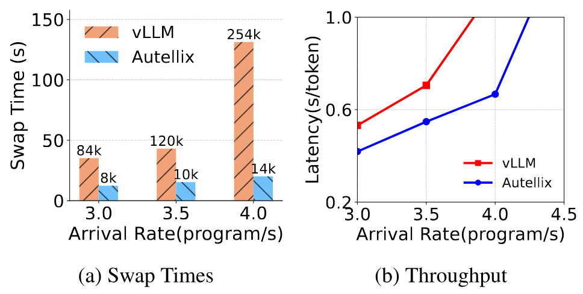

**図 19. Autellix の交換カーネルの影響。** 総交換回数と GPU-CPU 交換時間を減らし、スループットを向上する。

#### 交換カーネルの影響

先取りスケジューリングは活動中の呼び出しと GPU 使用量を増やし、高負荷で KV キャッシュ取得の GPU-CPU 交換を頻発させる [Jin24]。Autellix は並列 KV ブロック転送を 1 操作にまとめ、交換回数を最大 18 倍、交換時間を 3–7 倍減らし、vLLM カーネルより 1.3 倍高いスループットを達成する（[図 19](#figure-19)）。

## 7 議論と今後の課題

**グラフ最適化。** Autellix は実行 DAG を事前に知らず、実行時に内部表現を構築する。完全な知識は非現実的だが、直後のステップを予測できれば分岐予測や投機実行などの*コンパイラ最適化*で、前の呼び出しが完了する間に次の LLM 呼び出しを実行できる。これは今後の課題である。

**ポストトレーニング。** Deepseek-R1 [Dee25] や OpenAI o1/o3 [Ope25] の推論モデルは、思考過程を最適化するエンドツーエンド RL で後学習される。分散 RL はオンラインサンプリングと訓練を交互に行い、軌跡と方策勾配を収集する [She24a, Sto18]。より良いスケジューリングは RL 反復ごとのバッチサンプリング makespan を減らし、分散後学習に利益をもたらす。

## 8 結論

Autellix は個々の LLM 呼び出しではなく、高度に動的で汎用的なプログラム向けの分散 LLM サービングシステムである。累積サービス時間などのプログラム統計で呼び出しを優先し、応答時間とスループットを改善する。単一・マルチスレッド向け 2 つのスケジューリングアルゴリズムと局所性対応ロードバランサを提案し、vLLM と同じ遅延でプログラムスループットを 4–15 倍向上した。

### 謝辞

IBM の Pravein Kannan、Diana Arroyo、Marquita Ellis に有益な議論を感謝する。Google DeepMind の資金と実験用 AI 基盤に感謝する。Sky Computing Lab は Accenture、AMD、Anyscale、Google、IBM、Intel、Microsoft、Mohamed Bin Zayed University of Artificial Intelligence、Samsung SDS、SAP、Uber、VMware の支援を受けている。

[+2]: 同一システムプロンプトでも異なるモデル（LLaMA [Oth23]、Mistral [Say23]）を使う LLM エージェントは別のエージェントとみなす [Zou24a]。

[+3]: マルチスレッドプログラムのプログラムレベルトークン遅延は、クリティカルパスの応答時間を全スレッドの総 token 数で割った値である。
