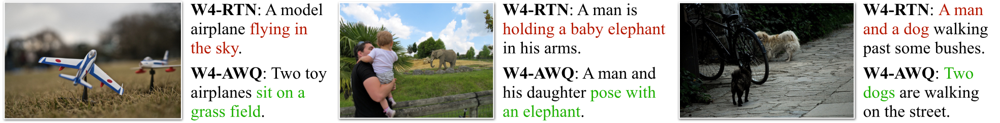
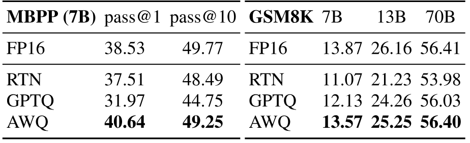
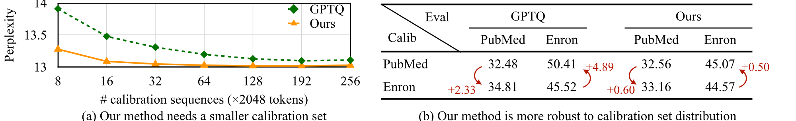
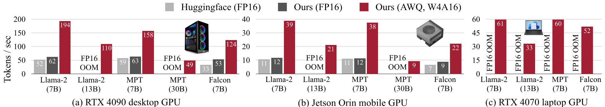
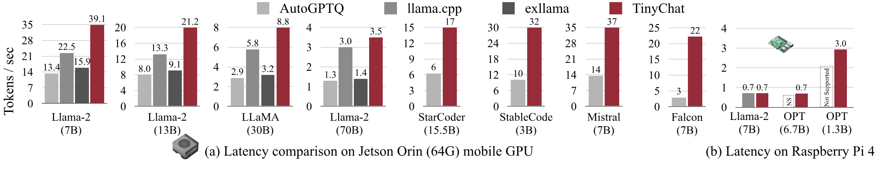
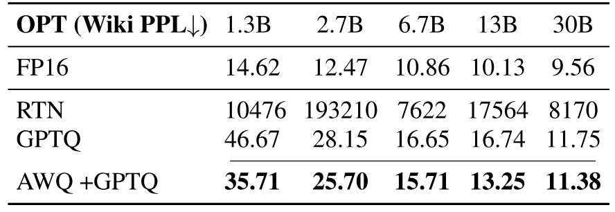
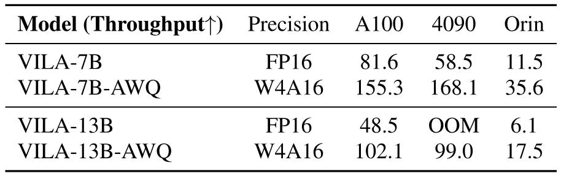

> [Ji Lin](https://www.linji.me/)、[Jiaming Tang](https://jiamingtang.me/)、[Haotian Tang](https://www.mit.edu/~kentang/)、[Shang Yang](https://ys-2020.github.io/)、[Wei-Ming Chen](https://developer.nvidia.com/blog/author/weimingc/)、[Wei-Chen Wang](https://weichenwang.me/)、[Guangxuan Xiao](https://guangxuanx.com/)、[Xingyu Dang](https://dangxingyu.github.io/)、[Chuang Gan](https://people.csail.mit.edu/ganchuang/)、[Song Han](https://songhan.mit.edu/) [+contrib]。2023 年 6 月 1 日に arXiv へ初投稿。現在の版は 2026 年 4 月 25 日投稿の v6。MLSys 2024 Best Paper Award。[AWQ: Activation-aware Weight Quantization for LLM Compression and Acceleration](https://arxiv.org/abs/2306.00978)。<a href="/paper/awq.pdf" target="_blank" rel="noopener noreferrer">原論文 PDF</a>。[TeX ソース](https://export.arxiv.org/e-print/2306.00978)。[プロジェクトコード](https://github.com/mit-han-lab/llm-awq)。厳密な印刷レイアウトと参考文献は原論文 PDF を正本とする。

## 概要

大規模言語モデル（LLM）は、数多くの AI 応用を一変させた。*オンデバイス* LLM の重要性は高まりつつある。LLM をエッジデバイス上でローカル実行すれば、クラウド計算コストを削減し、ユーザーのプライバシーを守ることができる。しかし、膨大なモデルサイズと限られたハードウェア資源は、デプロイを著しく難しくする。本稿では、LLM の低ビット重みのみ量子化に向けたハードウェアフレンドリーな手法 Activation-aware Weight Quantization（AWQ）を提案する。AWQ は、LLM のすべての重みが同じ重要度を持つわけではないことを見いだした。顕著な重みのうち*わずか 1%* を保護するだけで、量子化誤差を大幅に削減できる。顕著な重みチャネルを特定するには、重みではなく活性化分布を参照すべきである。ハードウェア効率の悪い混合精度量子化を避けるため、顕著なチャネルを拡大すれば量子化誤差を削減できることを数学的に導出する。AWQ は等価変換によって顕著な重みチャネルを拡大し、保護する。スケールは、活性化統計をオフラインで収集して決定する。AWQ はバックプロパゲーションにも再構成にも依存しないため、較正セットに過適合せず、異なるドメインやモダリティへ汎化する。さまざまな言語モデリングおよびドメイン固有ベンチマーク（コーディングと数学）で、AWQ は既存研究を上回る。汎化性能が高いため、*指示調整済み* LM で優れた量子化性能を達成し、さらに*マルチモーダル* LM の量子化にも初めて成功した。AWQ と併せて、4 ビットのオンデバイス LLM/VLM に特化した効率的かつ柔軟な推論フレームワーク TinyChat を実装した。カーネル融合とプラットフォーム対応の重みパッキングにより、TinyChat はデスクトップ GPU とモバイル GPU の双方で Huggingface の FP16 実装より 3 倍以上高速である。また、70B の Llama-2 モデルをモバイル GPU にデプロイできるようにした。

## 1 はじめに

大規模言語モデル（LLM）をエッジデバイスへ直接デプロイすることは重要である。オンデバイス利用では、データをクラウドサーバーへ送る遅延がなくなり、LLM をオフラインで動作させられるため、仮想アシスタント、チャットボット、自動運転車などのリアルタイム用途に適している。集中型クラウド基盤の維持と拡張に伴う運用コストも削減できる。さらに、機密情報をローカルに保持してデータ漏洩の可能性を下げるため、オンデバイス LLM はデータセキュリティも高める。Transformer ベースのアーキテクチャ [Vas17] を土台とする LLM は、多様なベンチマークで優れた性能を示し [Bro20c, Zha22a, Tou23, Les23]、大きな注目を集めてきた。しかし、モデルサイズが大きいため、サービングコストも高い。たとえば GPT-3 は 175B パラメータを持ち、FP16 では 350GB を占める一方、最新の B200 GPU でさえメモリは 192GB にすぎず、エッジデバイスではなおさらである。

**図 1.** LLM の汎用的な重み量子化手法 **AWQ** を導入する。AWQ を実装するため、4 ビット量子化 LLM を多様なエッジプラットフォームへデプロイする **TinyChat** を開発し、FP16 に比べて **3-4**$\times$ の性能向上を達成した。さらに、TinyChat で動作し、メモリ 8GB、消費電力 15W の NVIDIA Jetson Orin Nano を搭載した **TinyChat computer** も製作した。デモ：[https://youtu.be/z91a8DrfgEw](https://youtu.be/z91a8DrfgEw)。

LLM の低ビット重み量子化は、オンデバイス LLM 推論のメモリ使用量を大幅に減らせるが、実現は難しい。量子化認識学習（QAT）は学習コストが高く効率的でない一方、学習後量子化（PTQ）は低ビット設定で精度が大きく低下する。最も近い研究は GPTQ [Fra22] であり、二次情報を用いて誤差を補償する。しかし再構成中に較正セットへ過適合し、分布外ドメインで学習済み特徴を歪める可能性がある（[図 8](#figure-08)）。LLM は*汎用*モデルであるため、これは問題となる。

本稿では、LLM 向けのハードウェアフレンドリーな低ビット重みのみ量子化手法 Activation-aware Weight Quantization（AWQ）を提案する。本手法は、LLM の*重みがすべて同じ重要度を持つわけではない*という観察に基づく。*顕著*な重みは 0.1%-1% しかなく、その量子化を省けば量子化損失を大幅に削減できる（[表 1](#table-01)）。顕著な重みチャネルを見つける際の要点は、*重みのみ*を量子化する場合でも、*重み*分布ではなく*活性化*分布を参照することである。より大きな活性化値に対応する重みチャネルは、より重要な特徴を処理するため、より顕著である。ハードウェア効率の悪い混合精度実装を避けるため、重み量子化誤差を解析し、*顕著なチャネルを拡大すれば相対量子化誤差を小さくできる*ことを導く（[式 2](#equation-02)）。この直観に従い、全重みを量子化した状態で量子化誤差を最小にする最適スケールを自動探索する、チャネル単位のスケーリング手法を設計した。AWQ はバックプロパゲーションにも再構成にも依存しないため、較正セットに過適合せず、さまざまなドメインやモダリティにおける LLM の汎化能力を十分に保持できる。

AWQ を実装するため、4 ビット LLM による理論上のメモリ削減を実測速度向上へ変換する効率的な推論フレームワーク TinyChat を設計した。このフレームワークはオンザフライ逆量子化により線形層を大幅に高速化する。また、効率的な 4 ビット重みパッキングとカーネル融合を利用して、途中の DRAM アクセスやカーネル起動などの推論オーバーヘッドを最小化し、バイト単位で整列する計算機でも重みを 4 ビットへ量子化した効果を十分に引き出す。

実験の結果、AWQ は異なるモデルファミリー（LLaMA [Tou23]、OPT [Zha22a] など）、モデルサイズ、および多様なタスクで既存研究を上回った。優れた汎化性能により、*指示調整済み* LM（Vicuna など）でも良好な量子化性能を示し、*マルチモーダル* LM（OpenFlamingo [Awa23]）も初めて量子化できた。TinyChat は、約 4$\times$ 小さいメモリフットプリントを実測速度向上へ変換する。デスクトップ、ラップトップ、モバイル GPU 上の多様な LLM で、Huggingface の FP16 実装に対して平均 **3.2-3.3**$\times$ の高速化を一貫して確認した。さらに、Llama-2-70B を 64GB メモリの NVIDIA Jetson Orin 1 台へ容易にデプロイできる。VRAM が 8GB しかないラップトップ RTX 4070 GPU でも、13B パラメータの LLM を毎秒 30 トークンという対話的な速度で動作させられる。AWQ は産業界とオープンソースコミュニティで広く採用されている：[HuggingFace Transformers](https://huggingface.co/docs/transformers/main_classes/quantization)、[NVIDIA TensorRT-LLM](https://github.com/NVIDIA/TensorRT-LLM/)、[Microsfot DirectML](https://blogs.windows.com/windowsdeveloper/2024/05/24/quantization-with-directml-helps-you-scale-further-on-windows/)、[Google Vertex AI](https://console.cloud.google.com/vertex-ai/publishers/meta/model-garden/llama-2-quantized)、[Intel Neural Compressor](https://github.com/intel/neural-compressor)、[Amazon Sagemaker](https://aws.amazon.com/blogs/machine-learning/boost-inference-performance-for-llms-with-new-amazon-sagemaker-containers/)、[AMD](https://community.amd.com/t5/ai/reduce-memory-footprint-and-improve-performance-running-llms-on/ba-p/686157)、[FastChat](https://github.com/lm-sys/FastChat/blob/main/docs/awq.md)、[vLLM](https://github.com/vllm-project/vllm/blob/main/vllm/model_executor/layers/quantization/awq.py)、[LMDeploy](https://github.com/InternLM/lmdeploy)。また、Falcon-180B を[単一](https://github.com/NVIDIA/TensorRT-LLM/blob/main/docs/source/blogs/Falcon180B-H200.md) H200 GPU へデプロイできるようにした。

## 2 関連研究

**モデル量子化手法。** 量子化は深層学習モデルのビット精度を下げ [Han15, Ben18, Nag19a, Wan19a, Nag20, Lin20b]、モデルサイズを削減して推論を高速化する。量子化技術は概ね、量子化した重みをバックプロパゲーションで更新する量子化認識学習（QAT）[Ben13, Gho21a, Nag21, Cho18a] と、通常は学習を必要としない学習後量子化 [Ben18, Nag19a, Nag20]（PTQ）の 2 種類に分かれる。QAT 手法は LLM のような大規模モデルへ容易には拡張できない。そのため、LLM の量子化には通常 PTQ 手法が使われる。

**LLM の量子化。** LLM 量子化では 2 つの設定が研究されている。（1）活性化と重みの両方を INT8 に量子化する W8A8 [Det22, Xia23, Yao22a, Wei22b, Wei23]。（2）重みだけを低ビット整数へ量子化する低ビット重みのみ量子化（W4A16 など）[Fra22, Det22c, She23a, Par22]。本研究では 2 番目の設定に注目する。これは必要メモリを減らしてハードウェア障壁を下げるだけでなく、メモリ律速の負荷を緩和し、トークン生成も高速化するためである。単純な最近傍丸め（RTN）を除けば、GPTQ [Fra22] が本研究に最も近い。しかし GPTQ の再構成処理は較正セットへ過適合し、他のモダリティやドメインで LLM の汎用能力を保持できない可能性がある。また一部のモデル（LLaMA-7B [Tou23]、OPT-66B [Zha22a] など）では、動作に並べ替えが必要となる。汎用ハードウェア向けの量子化手法とは別に、SpAtten [Wan20b] は softmax 計算に使うビット数を段階的に増やす手法を設計している。

**低ビット量子化 LLM のシステムサポート。** 低ビット量子化 LLM は推論コストを下げる一般的な設定となり、実用上の高速化を得るためのシステムも存在する。GPTQ [Fra22] は OPT モデル用の INT3 カーネルを提供し、`GPTQ-for-LLaMA` は Triton [Til19] を利用して、並べ替えを伴う INT4 量子化へカーネル対応を拡張する。FlexGen [She23a]、`llama.cpp` [+llama-cpp]、`exllama` [+exllama] はグループ単位の INT4 量子化によって I/O とオフロードのコストを削減する。FasterTransformer は重みのみテンソル単位量子化向けの FP16$\times$INT4 GEMM を実装しているが、グループ量子化には対応しない。LUT-GEMM [Par22] はルックアップテーブルを用いて GPU CUDA コア上でビット演算を行う。同時期の研究 MLC-LLM [Mlc23] は強力な TVM [Che18e, Fen23] バックエンドを活用し、複数のエッジ CPU/GPU プラットフォームで優れた結果を得ている。

**図 2.** *活性化分布*に基づけば、LLM の顕著な重み 1% を見つけられる（中央）。顕著な重みを FP16 のまま保つと量子化性能は大きく改善する（PPL は左の 43.2 から中央の 13.0 へ低下）が、混合精度形式はハードウェア効率が悪い。活性化認識の原則に従い AWQ（右）を提案する。AWQ はチャネル単位のスケーリングで顕著な重みを保護し、量子化誤差を削減する。OPT-6.7B を INT3-g128 で量子化したときの perplexity を測定した。

## 3 AWQ: Activation-aware Weight Quantization

*量子化*は浮動小数点数を低ビット整数へ写像する。これは LLM のモデルサイズと推論コストを削減する有効な方法である [Det22, Fra22, Yao22a, Xia23]。本節ではまず、より「重要な」重みを保護し、*学習や回帰なしで*精度を高める重みのみ量子化手法を提案する。続いて、量子化誤差を削減する最適スケールを探索するデータ駆動型手法を開発する（[図 2](#figure-02)）。

### 3.1 顕著な重み 1% を保持して LLM 量子化を改善する

**表 1.** 少数の重み（0.1%-1%）を FP16 のまま保持すると、量子化モデルは最近傍丸め（RTN）より大幅に高い性能を示す。*重み*分布ではなく*活性化*分布を見て重要な重みを選び、FP16 のまま保持した場合にのみ有効である。良好な perplexity を緑で示す。グループサイズ 128 の INT3 量子化を用い、WikiText perplexity（$\downarrow$）を測定した。

LLM の重みは*すべて同じ重要度ではない*。他の重みより LLM の性能に大きく影響する*顕著な*重みは、全体のごく一部しかない。これらの重みを量子化しなければ、学習や回帰を一切行わずに量子化損失による性能低下を埋められる（[図 2b](#figure-02)）。この考えを検証するため、[表 1](#table-01) では一部の重みチャネルを量子化しない場合の LLM 性能を測定した。INT3 量子化モデルで、所定の割合の重みチャネルを FP16 のまま保持した。重みの重要度を決める一般的な方法は、その大きさまたは $L_2$ ノルムを見ることである [Han15a, Fra18]。しかし、大きなノルムを持つ重みチャネルを量子化しなくても（FP16%（based on W））、量子化性能は大きく改善せず、ランダム選択と同程度のわずかな改善にとどまる。興味深いことに、*活性化の大きさ*に基づいて重みを選ぶと、チャネルの 0.1%-1% だけを FP16 に保っても性能が大きく向上する。大きな値を持つ入力特徴は一般に重要だと推測される。対応する重みを FP16 のまま保てば、その特徴が維持され、モデル性能が向上する。

**制限：** 重みの 0.1% を FP16 のまま保てば、モデルサイズ（総ビット数で測定）をほぼ増やさずに量子化性能を改善できるが、この混合精度データ型はシステム実装を難しくする。実際に FP16 のまま保持せず、重要な重みを保護する手法が必要である。

### 3.2 活性化認識スケーリングによる顕著な重みの保護

ハードウェア効率の問題を起こさず、*チャネル単位のスケーリング*によって顕著な重みの量子化誤差を削減する別の手法を提案する。

**量子化誤差の解析。** まず、重みのみ量子化による誤差を解析する。

**表 2.** 顕著なチャネル 1% に $s>1$ を乗じたときの統計。顕著なチャネルを拡大すると、perplexity は 23.54 から 11.92 へ大きく改善する。$s$ が大きいほど $\Delta$ が変化する割合は増え、顕著なチャネルの誤差低減率も高まる。ただし最良の perplexity は $s=2$ で得られ、それ以上 $s$ を大きくすると*非顕著*チャネルの量子化誤差が増加する。

重みのグループまたはブロック $\mathbf{w}$ を考える。線形演算は $y=\mathbf{w}\mathbf{x}$、量子化した演算は $y=Q(\mathbf{w})\mathbf{x}$ と書ける。量子化関数は次のように定義される。

$$
Q(\mathbf{w})=\Delta\cdot\mathrm{Round}\left(\frac{\mathbf{w}}{\Delta}\right),\quad \Delta=\frac{\max(|\mathbf{w}|)}{2^{N-1}},
$$

ここで $N$ は量子化ビット数、$\Delta$ は絶対最大値によって決まる量子化スケールである。重み要素 $w\in\mathbf{w}$ に $s>1$ を乗じ、$x$ を逆方向にスケーリングすると、$Q(w\cdot s)(x/s)$ は次のようになる。

$$
Q(w\cdot s)\cdot\frac{x}{s}=\Delta'\cdot\mathrm{Round}\left(\frac{ws}{\Delta'}\right)\cdot x\cdot\frac{1}{s},
$$

ここで $\Delta'$ は $s$ の適用後に得られる新しい量子化スケールである。実験から次のことが分かった。（1）$\mathrm{Round}(\cdot)$ の期待誤差（$\mathrm{RoundErr}(\cdot)$ と表す）は変わらない。丸め関数は浮動小数点数を整数へ写像するため、誤差は $[0,0.5]$ にほぼ一様分布し、平均誤差は $0.25$ になる。すなわち $\mathrm{RoundErr}(\cdot)\sim0.25$ である。（2）単一要素 $w$ の拡大は通常、グループ $\mathbf{w}$ の最大値を変えない。したがって $\Delta'\approx\Delta$ である。（3）$\Delta$ と $x$ は FP16 で表現されるため、量子化誤差を持たない。よって [式 1](#equation-01) と [式 2](#equation-02) の量子化誤差は次式で表せる。

$$
\begin{aligned}
\mathrm{Err}(Q(w)x)&=\Delta\cdot\mathrm{RoundErr}\left(\frac{w}{\Delta}\right)\cdot x\\
\mathrm{Err}\left(Q(w\cdot s)\left(\frac{x}{s}\right)\right)&=\Delta'\cdot\mathrm{RoundErr}\left(\frac{ws}{\Delta'}\right)\cdot x\cdot\frac{1}{s}
\end{aligned}
$$

新しい誤差と元の誤差の比は $\frac{\Delta'}{\Delta}\cdot\frac{1}{s}$ である。$\Delta'\approx\Delta$ かつ $s>1$ なので、顕著な重み $w$ の相対誤差は小さくなる。

この考えを検証するため、OPT-6.7B の顕著なチャネル 1% に $s>1$ を乗じ、各グループにおける $\Delta$ の変化を[表 2](#table-02)で測定した。顕著なチャネルの拡大は有効であり、perplexity は $s=1$（単純な RTN）の 23.54 から $s=2$ の 11.92 へ改善する。$s$ が大きいほど $\Delta$ の変化率は概ね増えるが、$s<2$ では依然として小さい（5% 未満）。顕著なチャネルの相対誤差も $s$ の増加に伴って小さくなる。それでも最良の PPL は $s=2$ で現れる。$s$ が非常に大きいと、$\Delta$ の増加時に*非顕著*チャネルの相対誤差が増えるためである（非顕著チャネルの誤差は $\frac{\Delta'}{\Delta}$ 倍され、$s=4$ では 21.2% のチャネルでこの比が 1 を超える）。これはモデル全体の精度を損なう。したがって、顕著なチャネルを保護するときは非顕著チャネルの誤差も考慮する必要がある。

**表 3.** AWQ はスケーリングによって顕著な重みを保護し、量子化誤差を削減する。最近傍丸め（RTN）を一貫して上回り、混合精度（1% FP16）と同等の性能を達成しながら、ハードウェア効率にも優れる。グループサイズ 128 の 3 ビット量子化を用いる。

**図 3.** NVIDIA RTX 4090 上の Llama-2-7B に対するボトルネック解析。**左：** オンデバイス LLM では、生成段階はコンテキスト段階よりはるかに遅い。**中央：** 生成段階はメモリ律速であり、算術強度が低い。W4A16 量子化は算術強度を 4$\times$ に高められる。**右：** 重みへのアクセス量は活性化へのアクセス量より桁違いに大きい。したがって、重みのみ量子化はオンデバイス LLM に有効である。

**スケールの探索。** 顕著な重みと非顕著な重みの両方を考慮するため、特定の層で量子化後の出力差を最小にするチャネル単位の最適スケールを自動探索する。形式的には次の目的を最適化する。

$$
\begin{aligned}
\mathbf{s}^{*}&=\mathop{\arg\min}_{\mathbf{s}}\mathcal{L}(\mathbf{s})\\
\mathcal{L}(\mathbf{s})&=\left\|Q\left(\mathbf{W}\cdot\mathrm{diag}(\mathbf{s})\right)\left(\mathrm{diag}(\mathbf{s})^{-1}\cdot\mathbf{X}\right)-\mathbf{W}\mathbf{X}\right\|
\end{aligned}
$$

$Q$ は重み量子化関数（グループサイズ 128 の INT3/INT4 量子化など）、$\mathbf{W}$ は元の FP16 重み、$\mathbf{X}$ は小規模較正セットからキャッシュした入力特徴である（特定タスクへ過適合しないよう、事前学習データセットから小規模較正セットを取る）。$\mathbf{s}$ は入力チャネル単位のスケールであり、$\mathbf{s}^{-1}\cdot\mathbf{X}$ は通常、前の演算子へ融合できる [Wei22, Xia23]。量子化関数は微分不可能なので、通常のバックプロパゲーションでは直接最適化できない。近似勾配を使う手法もある [Ben13, Ess19] が、収束は依然として不安定だった。

処理を安定させるため、スケール選択に影響する要因を解析し、最適スケールの*探索空間*を定義する。前節で示したように、重みチャネルの顕著性は実際には活性化スケールによって決まる（このため「activation-awareness」と呼ぶ）。そこで、次の単純な探索空間を用いる。

$$
\mathbf{s}=\mathbf{s}_{X}^{\alpha},\quad \alpha^{*}=\mathop{\arg\min}_{\alpha}\mathcal{L}(\mathbf{s}_{X}^{\alpha})
$$

$\mathbf{s}_{X}$ はチャネル単位の活性化の平均絶対値であり、単一のハイパーパラメータ $\alpha$ によって顕著なチャネルと非顕著なチャネルの保護を調整する。区間 $[0,1]$ 上で高速なグリッド探索を行えば最良の $\alpha$ が得られる（$0$ はスケーリングなし、$1$ は探索空間中で最も積極的なスケーリングに対応する）。量子化の MSE 誤差を最小化するため、重みクリッピングも適用する。[表 3](#table-03) に OPT モデルを INT3-g128 で量子化したアブレーションを示す。AWQ は最近傍丸め（RTN）を一貫して上回り、ハードウェア効率を保ちながら混合精度（1% FP16）と同等の性能を達成する。

**利点。** 本手法は回帰 [Fra22] にもバックプロパゲーションにも依存しないが、多くの量子化認識学習手法はこれらを必要とする。チャネルごとの平均絶対値だけを測定するため、較正セットへの依存が小さく、過適合を防げる（[図 8](#figure-08)）。したがって、量子化に必要なデータは少なく、較正セットの分布外にある LLM の知識も保持できる。詳細は[第 5.3 節](#section-5-3)を参照されたい。

## 4 TinyChat: AWQ のエッジプラットフォームへのマッピング

AWQ は LLM のサイズを大幅に削減できる。しかし、W4A16（4 ビット重み、16 ビット活性化）量子化による理論上のメモリ削減を実測速度向上へ変えることは容易でない。SmoothQuant [Xia23] などの W8A8 量子化手法では、ストレージと計算に*同じ*データ精度を使うため、逆量子化を計算カーネルのエピローグへ自然に統合できる。一方、W4A16 量子化はメモリアクセスと計算に*異なる*データ型を使う。最適な性能を得るには逆量子化を主要な計算ループへ組み込む必要があり、実装が難しい。そこで、AWQ モデル推論用の軽快なシステム TinyChat を導入する。PyTorch フロントエンドと、デバイス固有の命令セット（CUDA/PTX、Neon、AVX など）を活用するバックエンドを備える。

### 4.1 AWQ がオンデバイス LLM を高速化する理由

**図 4.** 128 ビット SIMD ユニットを備える ARM NEON 向けの SIMD 対応重みパッキング。元の重みを並べ替え、ビット幅に合わせてパックすることで、実行時には 128 ビットマスクを用いた AND とシフトのビット演算によって重みをバイトへ展開できる。

エッジ上の量子化 LLM における高速化の余地を理解するため、RTX 4090 GPU 上で LLaMA-7B [Tou23] のレイテンシ内訳を測定する。エッジ用途を想定して推論バッチサイズを 1 とし、NVIDIA FasterTransformer によりモデルを FP16 で実装する。

**コンテキストと生成のレイテンシ。** [図 3a](#figure-03)では、20 トークンの生成に 310ms を要するのに対し、200 トークンのプロンプトを要約する処理は 10ms で終わる。したがって生成段階はコンテキスト段階より大幅に遅く、特にオンデバイスの対話的アプリケーションで顕著である。

**生成段階はメモリ律速である。** 生成段階を高速化するため、[図 3b](#figure-03)でルーフライン解析を行う。4090 GPU のピーク演算性能は 165 TFLOPS、メモリ帯域幅は 1TB/s である。したがって、算術強度（FLOP とメモリアクセスの比）が 165 未満の処理は、4090 GPU 上でメモリ律速となる。FP16 で実行したオンデバイス LLM の生成段階は、算術強度が約 1 しかない。これは処理がメモリ律速であることを示す。モデルの FLOP 数は固定なので、ピーク性能を上げる唯一の方法は総メモリトラフィックを減らすことである。AWQ は重みメモリを 4 分の 1 にする。

**重みアクセスがメモリトラフィックを支配する。** そこで[図 3c](#figure-03)では、重みと活性化へのメモリアクセスをさらに分解する。オンデバイス LLM のメモリトラフィックは明らかに重みアクセスが支配する。モデル重みを 4 ビット整数へ量子化すると、算術強度は約 4 FLOPs/Byte まで増え、[図 3b](#figure-03)のピーク性能 4TFLOPS に達する。重みのみ量子化は重みのビット幅を下げ、理論性能上限を高めるため、AWQ がオンデバイス LLM でこの設定に従うのは自然である。

### 4.2 TinyChat による AWQ のデプロイ

以上から、4 ビット重み量子化は理論ピーク性能を 4$\times$ にできる。さらに、この高速化を実現する TinyChat を設計する。GPU では、アテンション、レイヤー正規化、線形射影カーネルなどの必須要素だけを実装する。柔軟なフロントエンドにより、容易なカスタマイズと新しいモデルへの迅速な対応が可能である。4 ビット AWQ を用いる TinyChat は、GPU 上の複数の LLM ファミリーで Huggingface の FP16 実装より 3 倍以上高速である。CPU ではオーバーヘッドを最小化するため、計算グラフ全体を C++ へ低レベル化する。

**オンザフライ重み逆量子化。** ハードウェアには INT4 と FP16 の乗算命令がないため、量子化層では行列計算前に整数を FP16 へ逆量子化する必要がある。逆量子化カーネルを行列乗算カーネルと融合し、逆量子化した重みを DRAM へ書き込まないようにする。この融合は行列-行列（MM）積と行列-ベクトル（MV）積の両方に適用する。

**SIMD 対応重みパッキング。** オンザフライ重み逆量子化は途中の DRAM アクセスを減らすが、依然として高コストである。たとえば*単一の 4 ビット重み*を逆量子化するには、1 回のシフト、1 回のビット AND、1 回の FMA スケーリングが必要だが、逆量子化後の重みが行うのは 1 回の FMA 計算だけである。ベクトル命令を好む SIMD アーキテクチャの CPU では特に高コストとなる。そこでデバイスの SIMD ユニットのビット幅に合わせたプラットフォーム固有の重みパッキングを提案する。[図 4](#figure-04)は、128 ビット SIMD レジスタを持つ ARM CPU 向け戦略を示し、最大 1.2$\times$ の高速化を得る。各レジスタには 32 個の 4 ビット重みを $w_0,w_{16},w_1,w_{17},\ldots,w_{15},w_{31}$ の順で格納する。この方法なら、通常のパッキング（$w_0,w_1,\ldots,w_{31}$）で*重みごと*に 3 個のスカラー命令を要するのに対し、わずか 3 個の SIMD 命令で*全 32 重み*を展開できる。一般に $2^n$ ビット SIMD レジスタでは、各レジスタが $1/8\times2^n$ 個の 8 ビット整数を保持できるため、隣接する重みのインデックス差は $1/8\times2^n$ となる。GPU では、8 個の重みを $w_{\{0,2,4,6,1,3,5,7\}}$ の順でパックするほうが効率的だった [Kim22]。

**カーネル融合。** オンデバイス LLM 推論の最適化にはカーネル融合も広く適用する。レイヤー正規化では、乗算、除算、平方根などのすべての演算子を単一カーネルへ融合する。アテンション層では QKV 射影を 1 つのカーネルへ融合し、位置埋め込みもオンザフライで計算する。KV キャッシュも事前確保し、アテンションカーネル内で更新する。カーネル融合は、Falcon [Pen23c] や StarCoder [Li23o] のように非効率な順伝播実装を持つモデルで特に有効である。4090 GPU 上の各 FP16 カーネルの計算時間は約 0.01ms であり、GPU カーネルの起動オーバーヘッドに匹敵する。そのため、融合でカーネル呼び出し回数を減らすと直接高速化できる。

## 5 実験

**表 4.** 異なるモデルサイズとビット精度で、AWQ は最近傍丸め（RTN）を上回る。LLaMA および Llama-2 では、並べ替えの有無にかかわらず GPTQ より良い perplexity を一貫して達成する。

**表 5.** Mistral-7B-Instruct-v0.2 [Jia23] と Mixtral-8x7B-Instruct-v0.1 [Jia24] の AWQ 量子化結果。WikiText の PPL は、GQA を持つ LLM や Mixture-of-Experts（MoE）モデルを含む異なるモデルアーキテクチャで、AWQ が優れた量子化性能を達成できることを示す。

### 5.1 設定

**量子化。** 本研究では*重みのみのグループ量子化*に注目する。先行研究 [Det22c, Fra22] が示すように、グループ量子化は性能とモデルサイズのトレードオフを常に改善する。特に指定しない限り、全実験でグループサイズ 128 を用いる。LLM の性能をほぼ保持できるため [Det22c]、INT4/INT3 量子化に焦点を当てる。AWQ では特定の下流ドメインへの過適合を避けるため、Pile [Gao20] から小規模較正セットを取得した。[式 5](#equation-05)の最適な $\alpha$ はグリッドサイズ 20 で探索した。

**モデル。** LLaMA [Tou23] と OPT [Zha22a] の各ファミリーで本手法を評価した。BLOOM [Les23] など他の公開 LLM もあるが、一般に品質が低いため対象に含めない。さらに、汎化性能を示すため、指示調整済みモデル Vicuna [Chi23a] と視覚言語モデル OpenFlamingo-9B [Awa23]、LLaVA-13B [Liu23j] を評価する。

**評価。** 先行研究 [Det22, Xia23, Fra22, Det22c, Yao22a] に従い、perplexity は LLM の性能を安定して反映するため [Det22c]、主に言語モデリングタスク（WikiText-2 [Mer16a] 上の perplexity）で量子化モデルを評価する。

**ベースライン。** 主なベースラインは単純な最近傍丸め量子化（RTN）である。128 のように小さなグループサイズでは、実際に強力である [Fra22, Det22c]。LLM 重み量子化の最先端手法 GPTQ [Fra22] とも比較する。GPTQ については「reorder」を使う更新版（GPTQ-Reorder または GPTQ-R）も比較する。ZeroQuant [Yao22a]、AdaRound [Nag20]、BRECQ [Li21a] などはバックプロパゲーションで量子化重みを更新するため、大規模モデルへ容易に拡張できず、GPTQ [Fra22] も上回らない。そのため評価対象に含めない。

### 5.2 評価

**図 5.** GPT-4 評価プロトコル [Chi23a] のもとで、INT3-g128 量子化 Vicuna と対応する FP16 モデルを比較する。勝利数（青）が多いほど性能が高い。AWQ は RTN および GPTQ [Fra22] より量子化性能を一貫して改善し、指示調整済みモデルへの汎化を示す。

**表 6.** 視覚言語モデル OpenFlamingo-9B [Awa23] の COCO Captioning データセットにおける量子化結果。Activation-aware Weight Quantization はゼロショットおよび各種フューショット設定で既存手法を上回り、異なるモダリティとインコンテキスト学習負荷への汎化を示す。INT4-g128 では 32-shot の量子化による性能低下を 4.57 から 1.17 へ削減し、性能をほぼ損なわずモデルサイズを 4$\times$ 小さくする。

**表 7.** 11 の視覚言語ベンチマークにおける VILA-7B と VILA-13B [Lin24c] の INT4-g128 結果。AWQ はすべてのベンチマークで性能を損なわない。紙幅の都合でベンチマーク名を略記する。VQA-v2 [Goy17]、GQA [Hud19]、VisWiz [Gur18]、SQA$^{\mathrm{I}}$：ScienceQA-IMG [Lu22a]、VQA$^{\mathrm{T}}$：TextVQA [Sin19]、POPE [Li23p]、MME [Fu23a]、MMB：MMBench [Liu23k]、MMB$^{\mathrm{CN}}$：MMBench-Chinese [Liu23k]、SEED：SEED-Bench [Li23n]、LLaVA$^{\mathrm{W}}$：LLaVA-Bench（In-the-Wild）[Liu23j]、MM-Vet [Yu23a]。

**LLaMA モデルでの結果。** LLaMA モデル（LLaMA [Tou23] と Llama-2 [Tou23a]）は他の公開 LLM [Zha22a, Les23] より性能が高く、多くの人気オープンソースモデル [Tao23, Chi23a] の基盤でもあるため、これを中心に評価する。[表 4](#table-04)では量子化前後の perplexity を測定する。AWQ は異なる世代とモデル規模（7B-70B）のすべてで、最近傍丸め（RTN）および並べ替えの有無を問わず GPTQ [Fra22] を一貫して上回る。

**Mistral / Mixtral モデルでの結果。** 人気の高いオープンソース LLM である Mistral と、Mixture-of-Experts（MoE）モデルである Mixtral でも AWQ を評価した [Jia23, Jia24]。AWQ は Mistral と Mixtral の双方で優れた性能を達成した。この結果は、AWQ がさまざまなモデルアーキテクチャに有効であることを示す。

**図 6.** LLaVA-13B [Liu23j] の視覚推論例。AWQ は最近傍丸め（RTN）ベースラインより妥当な回答を生成する。テキストの色で正しい回答と誤った回答を示す。

**図 7.** 量子化した OpenFlamingo-9B [Awa23] の COCO Captioning データセットにおける定性的結果（4-shot、INT4-g128 量子化）。本手法は最近傍丸め（RTN）ベースラインよりキャプション品質を大幅に改善する。テキストの色で正しいキャプションと誤ったキャプションを示す。

**指示調整済みモデルの量子化。** 指示調整はモデルの性能と使いやすさを大きく改善でき [Wei22c, San22, Ouy22, Chu22]、デプロイ前の必須工程になっている。人気の指示調整済みモデル Vicuna [Chi23a] で本手法をさらに評価した（[図 5](#figure-05)）。80 の質問例について GPT-4 スコアを用い、量子化モデルと FP16 モデルの性能を比較した [Chi23a]。順序効果（GPT-4 は最初の入力の評価を高くする傾向があった）を除くため、量子化-FP16 と FP16-量子化の両順序を比較し、計 160 試行とした。AWQ は 7B と 13B の両規模で、INT3-g128 量子化 Vicuna を RTN と GPTQ より一貫して改善し、指示調整済みモデルへの汎化を示す。

**表 8.** MBPP 上の CodeLlama-7b-Instruct-hf と、GSM8K 上の Llama-2（7B/13B/70B）に対する INT4-g128 量子化結果。AWQ はプログラミングと数学の両データセットで既存手法を上回り、異なる状況と評価設定への汎化を示す。特に INT4-g128 の AWQ は、両データセットで元の FP16 モデルと同等の性能を示す。

**マルチモーダル言語モデルの量子化。** 大規模マルチモーダルモデル（LMM）または視覚言語モデル（VLM）は、視覚入力を追加した LLM である [Ala22, Li23m, Koh23, Dri23, Zha23e, Liu23j]。これらのモデルは画像や動画入力を条件にテキストを生成できる。本手法は較正セットへ過適合しないため、VLM に直接適用して高精度かつ効率的に量子化できる。OpenFlamingo-9B [Awa23]（[Ala22] のオープンソース再実装）を COCO Captioning [Che15a] 上で評価した（[表 6](#table-06)）。異なるフューショット設定で 5k サンプルの平均性能を測定した。モデルサイズの大半を占めるため、言語部分だけを量子化する。AWQ はゼロショットおよび各種フューショット設定で既存手法を上回り、異なるモダリティとインコンテキスト学習負荷への汎化を示す。INT4-g128 では 32-shot の量子化による性能低下を 4.57 から 1.17 へ削減し、性能をほぼ損なわずモデルサイズを 4$\times$ 小さくする。AWQ の汎化性能をさらに示すため、最先端のマルチ画像視覚言語モデル VILA でも評価した。[表 7](#table-07)は、11 の視覚言語ベンチマークで AWQ が損失のない量子化性能を達成することを示す。RTN に対する優位性を示す定性的なキャプション例も[図 7](#figure-07)に掲載する。本手法は LMM/VLM 量子化にプッシュボタン式の解決策を与える。知る限り、VLM の低ビット量子化を扱った初めての研究である。

**図 8.** **左：** AWQ は良好な量子化性能に達するために必要な較正セットがはるかに小さい。GPTQ の 10 分の 1 の較正セットでも、より良い perplexity を達成できる。**右：** 本手法は較正セットの分布に対してより頑健である。全体として、較正と評価の分布が同じ場合（PubMed-PubMed、Enron-Enron）が最良である。しかし分布が異なる場合（PubMed-Enron、Enron-PubMed）、AWQ の perplexity は 0.5-0.6 しか増えないのに対し、GPTQ は 2.3-4.9 悪化する。すべての実験は OPT-6.7B を INT3-g128 で量子化して行った。

**図 9.** TinyChat は、理論上のメモリフットプリント削減を測定可能な高速化へ変えるターンキーソリューションである。その結果、4090（デスクトップ GPU）と Orin（モバイル GPU）で Huggingface の FP16 実装より、それぞれ最大 **3.9**$\times$、**3.5**$\times$ 高速である。AWQ は VRAM が 8GB しかないラップトップ GPU（4070）にも Llama-2-13B をデプロイできるようにする。

**図 10.** NVIDIA Jetson Orin 上で 4 ビット量子化 Llama を動かすと、TinyChat は既存システムより **1.2-3.0**$\times$ 高速である。また多様な汎用およびコーディング特化 LLM に対応し、同じすべてのワークロードを扱える AutoGPTQ より少なくとも **2.6**$\times$ 高速である。さらに Raspberry Pi 上でも動作し、最大 7B パラメータの LLM を資源が極端に限られた IoT デバイスへデプロイできる。

**表 9.** 本手法は GPTQ と直交しており、GPTQ と組み合わせることで極低ビット量子化（INT2-g64）の性能差をさらに縮める。OPT モデルの WikiText-2 perplexity を示す。

**視覚推論結果。** LLaVA-13B [Liu23j] の定性的な視覚推論例を[図 6](#figure-06)に示す。INT4-g128 量子化では、AWQ は最近傍丸め（RTN）ベースラインより妥当な回答を生成する。最初の例で AWQ は、そのミームが宇宙から見た地球に似ていると理解する一方、RTN は誤った記述を生成する（赤で表示）。

**プログラミングおよび数学タスクでの結果。** 複雑な生成タスクにおける AWQ の性能をさらに評価するため、MBPP [Aus21] と GSM8K [Cob21] でもテストした。MBPP [Aus21] は約 1,000 問の Python プログラミング問題からなり、初級プログラマーが解けるよう設計され、プログラミングの基礎や標準ライブラリなどを扱う。GSM8K [Cob21] は、多段階推論を必要とする基礎的な数学問題への質問応答を支援するために作られた。CodeLlama-7b-Instruct-hf と Llama-2 を INT4-g128 へ量子化し、プログラミングおよび数学データセットで実験した（[表 8](#table-08)）。AWQ は両データセットで既存手法を上回り、複雑な生成への汎化を示す。INT4-g128 の AWQ は、両データセットで元の FP16 モデルと同等の性能を示す。

**極低ビット量子化。** 限られたデバイスメモリへ収めるため、LLM をさらに INT2 へ量子化する（[表 9](#table-09)）。RTN は完全に破綻するが、AWQ は GPTQ に加えることで perplexity を大幅に改善する。本手法は GPTQ と直交する。両者を組み合わせれば INT2 の量子化性能をさらに改善し、より実用的な設定にできる。

### 5.3 データ効率と汎化

**較正セットのデータ効率。** 本手法は回帰やバックプロパゲーションに依存せず、較正セットから平均活性化スケールだけを測定するため、必要な較正セットが小さく、データ効率が高い。この考えを示すため、[図 8a](#figure-08)で INT3-g128 量子化 OPT-6.7B の perplexity を比較する。AWQ は良好な量子化性能に達するために必要な較正セットがはるかに小さく、GPTQ の 10 分の 1 の較正セットでも、より良い perplexity を達成できる（16 シーケンス *v.s.* 192 シーケンス）。

**較正セット分布への頑健性。** 本手法は較正セットの平均活性化スケールだけを測定し、この統計量は異なるデータ分布へ汎化しやすいため、較正セット分布への感度が低い。[図 8b](#figure-08)では異なる較正セット分布の影響をさらに評価する。Pile [Gao20] から PubMed Abstracts と Enron Emails [Kli04] の 2 つのサブセットを取得した。各サブセットを較正セットに使い、両方で量子化モデルを評価する（較正セットと評価セットは重複せず、評価には 1k サンプルを用いる）。全体として、較正と評価の分布が同じ場合（PubMed-PubMed、Enron-Enron）が最良である。しかし分布が異なる場合（PubMed-Enron、Enron-PubMed）、AWQ の perplexity は 0.5-0.6 しか増えないのに対し、GPTQ は 2.3-4.9 悪化する。これは較正セット分布に対する AWQ の頑健性を示す。

### 5.4 高速化の評価

**表 10.** TinyChat は最先端の視覚言語モデル VILA [Lin24c] も複数の GPU プラットフォームへ容易にデプロイできる。4 ビット AWQ 量子化を利用し、VILA-7B を最大 **3.1**$\times$、VILA-13B を最大 **2.9**$\times$ 高速化する。

**設定。** [図 9](#figure-09)に TinyChat のシステム高速化結果を示す。TinyChat は線形層と、量子化重みを持たない層の双方を最適化する。exllama [+exllama] のプロトコルに従い、RTX 4090 と Jetson Orin でベンチマークする。すべての LLM で推論バッチサイズを 1、プロンプト長を 4 トークンに固定する。各推論で 200 トークンを生成し、レイテンシの中央値を最終結果とする。

**結果。** [図 9a](#figure-09)に示すように、TinyChat は 4090 上の 3 つの LLM ファミリー（Llama-2、MPT、Falcon）で Huggingface の FP16 実装より **2.7-3.9**$\times$ 高速である。Llama-2-7B では FP16 カーネル融合により推論速度を毎秒 52 トークンから 62 トークンへ改善する。この強力な FP16 ベースラインに、高速量子化線形カーネルによる **3.1**$\times$ の追加高速化を重ねる。Falcon-7B の公式実装は推論時に KV キャッシュを正しく扱わないため、他のモデルより大幅に遅い。この場合、FP16 最適化だけで **1.6**$\times$ の大きな高速化となる。VRAM が 8GB しかないラップトップ 4070 GPU でも、Llama-2-13B を毎秒 33 トークンで実行できる一方、FP16 実装は 7B モデルさえ収まらない。[表 10](#table-10)には視覚言語モデル [Lin24c] の高速化結果も示す。NVIDIA Jetson Orin 上で TinyChat は VILA-7B と VILA-13B の双方を約 **3**$\times$ 高速化する。すべての AWQ モデルの順伝播はネイティブ PyTorch API で実装され、同じコードをさまざまな GPU アーキテクチャで再利用できる。したがって TinyChat は拡張性に優れる。

**他のシステムとの比較。** [図 10](#figure-10)では TinyChat を既存のエッジ LLM 推論システム AutoGPTQ、llama.cpp、exllama と比較する。Orin 上で本システムは llama.cpp より最大 1.7$\times$ 高速である。さらに llama.cpp と exllama は適応範囲が狭く、主に LLaMA と Llama-2 向けである。対照的に TinyChat は StarCoder [Li23o]、StableCode（GPT-NeoX）[Bla22]、Mistral [Jia23]、Falcon [Pen23c] を含む幅広い用途へ対応し、AutoGPTQ より一貫して大幅に高速である。資源が極めて限られた Raspberry Pi 4B にも LLM をデプロイでき、7B モデルで毎秒 0.7 トークンを達成する。

## 6 結論

本研究では、低ビット重みのみ LLM 圧縮のための簡潔で有効な手法 Activation-aware Weight Quantization（AWQ）を提案した。LLM の重みがすべて同じ重要度ではないという観察に基づき、AWQ はチャネル単位のスケーリングで顕著な重みの量子化損失を削減する。AWQ は較正セットに過適合せず、多様なドメインとモダリティにおける LLM の汎用能力を保持する。言語モデリングでは既存研究を上回り、指示調整済み LM とマルチモーダル LM にも適用できる。TinyChat システムは AWQ による理論上のメモリ削減を、デスクトップおよびモバイル GPU 上の Huggingface FP16 実装に対する実測 **3.2-3.3**$\times$ の高速化へ変換し、エッジへの LLM デプロイを容易にする。

## 謝辞

本研究を支援した MIT AI Hardware Program、National Science Foundation（CNS-2112562）、MIT-IBM Watson AI Lab、Amazon and MIT Science Hub、Microsoft Turing Academic Program、Samsung に感謝する。

[+contrib]: $*$：アルゴリズム共同責任者。$\dagger$：システム共同責任者。

[+llama-cpp]: [https://github.com/ggerganov/llama.cpp](https://github.com/ggerganov/llama.cpp)

[+exllama]: [https://github.com/turboderp/exllama](https://github.com/turboderp/exllama)
