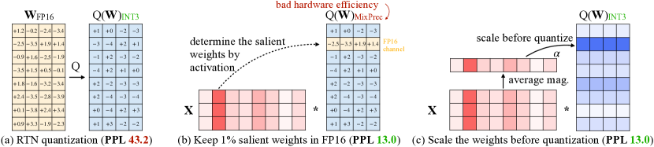
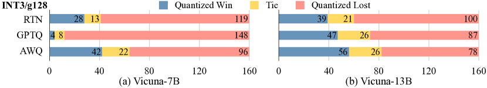
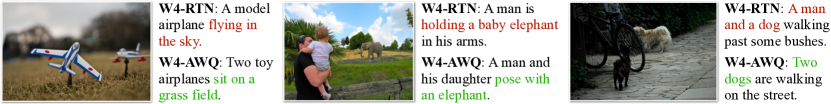
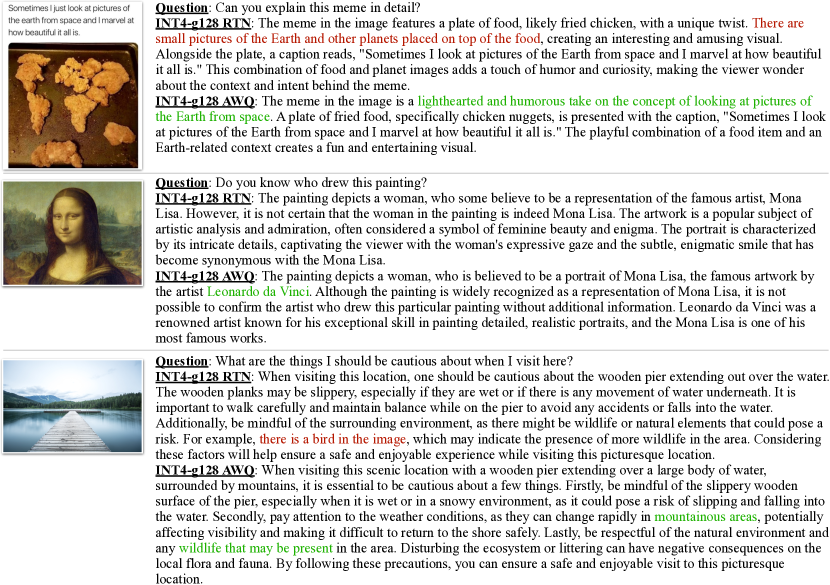
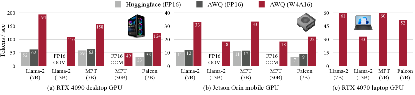
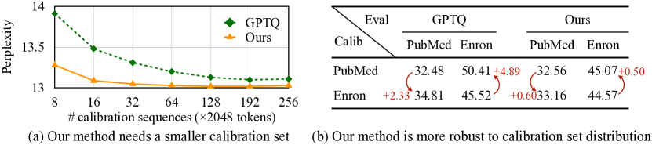

> Ji Lin, [Jiaming Tang](https://dblp.org/pid/277/8890), [Haotian Tang](https://dblp.org/pid/245/0058), [Shang Yang](https://dblp.org/pid/79/9960), Wei-Ming Chen, Wei-Chen Wang, Guangxuan Xiao, [Xingyu Dang](https://dblp.org/pid/348/8880), Chuang Gan, and Song Han. arXiv 初回投稿日: June 1, 2023; 現行版は v6. [AWQ: Activation-aware Weight Quantization for LLM Compression and Acceleration](https://arxiv.org/abs/2306.00978). [原 PDF](/paper/awq.pdf). [TeX ソース](https://export.arxiv.org/e-print/2306.00978). 正確な印刷レイアウトと参考文献については原 PDF を正本とする.

## 要約

大規模言語モデル（LLM）はさまざまなタスクで優れた性能を示していますが、天文学的なモデルサイズは、提供に必要なハードウェアの障壁（メモリサイズ）を高め、トークン生成（メモリ帯域幅）を遅くします。本論文では、LLMの低ビット重みのみ量子化のためのハードウェアに優しいアプローチとして、Activation-aware Weight Quantization（AWQ）を提案します。我々の手法は、重みは等しく重要ではないという観察に基づいています：顕著な重みの*わずか1%*を保護するだけで、量子化誤差を大幅に減らすことができます。次に、重きではなく*活性化*を観察することで、顕著な重みを保護する最適なチャンネルごとのスケーリングを探索することを提案します。AWQはバックプロパゲーションや再構築に依存しないため、キャリブレーションセットに過剰適合することなく、LLMの異なるドメインやモダリティに対する一般化能力をよく保持できます。AWQは、さまざまな言語モデリングおよびドメイン固有のベンチマークで既存の手法を上回ります。より良い一般化のおかげで、*インストラクションチューニングされた*LMや、初めて*マルチモーダル*LMに対しても優れた量子化性能を達成します。AWQと並行して、エッジ上のLLM向けに効率的で柔軟な推論フレームワークも実装しており、デスクトップおよびモバイルGPUでHuggingfaceのFP16実装に対して3$\times$以上の速度向上を提供します。また、モバイルGPU（NVIDIA Jetson Orin 64GB）での70B Llama-2モデルの展開も一般利用可能にします。

[+1]

## 1 はじめに

トランスフォーマーに基づく大規模言語モデル（LLM）は [Advanf17]、さまざまなベンチマークで優れた性能を示しています [Systea01, Open22, Xive23, Xivr22]。しかし、大規模モデルのサイズは高いサービングコストにつながります。例えば、GPT-3 は 175B パラメータを持ち、FP16 では 350GB ですが、最新の H100 GPU は 96GB のメモリしか持たず、エッジデバイスはなおさらです。

LLM の低ビット重み量子化はメモリを節約できますが、困難です。量子化対応トレーニング（QAT）はトレーニングコストが高いため実用的ではなく、事後量子化（PTQ）は低ビット設定では精度低下が大きくなります。最も近い研究は GPTQ [Xivo22] で、二次情報を使って誤差補償を行います。しかし、再構築時にキャリブレーションセットに過適合する可能性があり、分布外ドメインで学習した特徴が歪む可能性があります（[図6](#figure-06)）、これは LLM が*汎用*モデルであることを考えると問題となることがあります。

本論文では、Activation-aware Weight Quantization（AWQ）を提案します。これは、LLM向けのハードウェアに優しい低ビット重量専用量子化手法です。我々の方法は、*重みはLLMの性能において同等に重要ではない* という観察に基づいています。小さな割合（0.1%-1%）の*顕著な* 重みが存在し、これらの顕著な重みの量子化をスキップすることで、量子化誤差を大幅に減少させることができます（[表1](#table-01)参照）。顕著な重みチャネルを見つけるための洞察として、*重み専用*量子化を行っているにもかかわらず、*重み分布*ではなく*活性化分布*を参照すべきです。より大きな活性化の大きさに対応する重みチャネルは、より重要な特徴を処理するため、より顕著です。ハードウェア効率の悪い混合精度実装を避けるために、重み量子化による誤差を分析し、*顕著チャネルをスケーリングアップすることで相対的な量子化誤差を減少させる*（式 [2](#S2.E2)）ことができると導き出しました。この直感に従い、全重量量子化下で量子化誤差を最小化する最適なスケーリングを自動的に探索するチャネルごとのスケーリング手法を設計しました。AWQは逆伝播や再構成に依存しないため、較正セットに過学習することなく、様々なドメインやモダリティにおけるLLMの汎化能力をよく保持できます。さらに、理論上のメモリ節約を実際の速度向上に変換する効率的なサービングフレームワークを実装しました。我々のフレームワークはカーネル融合を活用して推論のオーバーヘッド（*例えば* 中間DRAMアクセスやカーネル起動オーバーヘッド）を最小化するため、線形層の量子化による速度向上をより良く実現できます（AWQはパラメータの大部分を占める線形層に適用されます）。

実験により、AWQ は異なるモデルファミリー（例：LLaMA [Xive23]、OPT [Open22]）およびモデルサイズに対して、さまざまなタスクで既存の手法を上回ることが示されています。より優れた一般化能力のおかげで、*指示チューニング済み* の LM（例：Vicuna）でも良好な量子化性能を達成し、さらに初めて *マルチモーダル* LM（OpenFlamingo [March23]）にも適用可能です。効率的なシステム実装により、Huggingface の FP16 実装と比較して、さまざまな LLM において平均 3.2-3.3$\times$ の速度向上を一貫して観測しています。さらに、Llama-2-70B モデルを 64GB メモリの単一 NVIDIA Jetson Orin 上で容易にデプロイ可能にします。また、最大 130億パラメータを持つ LLM を、8GB メモリのラップトップ RTX 4070 GPU 上で 1 秒あたり 30 トークンというインタラクティブ速度で利用可能にし、LLM の民主化にも貢献します。

AWQ は、[FastChat]（https://github.com/lm-sys/FastChat/blob/main/docs/awq.md）、[vLLM]（https://github.com/vllm-project/vllm/blob/main/vllm/model_executor/quantization_utils/awq.py）、[HuggingFace TGI]（https://github.com/huggingface/text-generation-inference/pull/1054）、[LMDeploy]（https://github.com/InternLM/lmdeploy） など、さまざまなオープンソース LLM サービングソリューションによって広く採用されています。

## 2 AWQ：活性化に対応した重みの量子化

*量子化* は、浮動小数点数を低ビット整数にマッピングする方法です。これは、LLM（大規模言語モデル）のモデルサイズと推論コストを削減する効果的な方法です [Xivm22, Xivo22, Effici22, Xivt22]。本節ではまず、より「重要な」重みを保護することで、*トレーニング/回帰なし*で精度を向上させる重みのみの量子化手法を提案します。その後、量子化誤差を減らす最適なスケーリングを探索するデータ駆動型手法を開発します（[図1](#figure-01)）。

**図1.** LLMにおいて顕著な重み1%を *活性化分布* を観察することで見つけることができることがわかります（中央）。顕著な重みをFP16で保持すると、量子化後の性能（PPL）が大幅に改善されます（左の43.2から中央の13.0へ）が、混合精度フォーマットはハードウェア効率が良くありません。我々は活性化認識の原則に従い、AWQを提案します（右）。AWQはチャネルごとのスケーリングを行い、顕著な重みを保護することで量子化誤差を減少させます。PPLはINT3-g128量子化下でOPT-6.7Bを用いて測定されました。

### 2.1 顕著な重み1%を保持することでLLM量子化の改善

|PPL
$\downarrow$|FP32|RTN|FP16%（活性化基準）|||FP16%（重み基準）|||FP16%（ランダム）|||
| --- | --- | --- | --- | --- | --- | --- | --- | --- | --- | --- | --- |
|（w3-g128）|0.1%|1%|3%|0.1%|1%|3%|0.1%|1%|3%|||
|OPT-1.3B|14.62|119.00|25.03|16.91|16.68|108.71|98.55|98.08|119.76|109.38|61.49|
|OPT-6.7B|10.86|23.54|11.58|11.39|11.36|23.41|22.37|22.45|23.54|24.23|24.22|
|OPT-13B|10.13|46.04|10.51|10.43|10.42|46.07|48.96|54.49|44.87|42.00|39.71|

**表1.** FP16で少量の重み（0.1%-1%）を保持すると、量子化モデルの性能は最も近い値への丸め（RTN）よりも大幅に向上します。これは、重み分布ではなく*活性化*分布を見てFP16で重要な重みを選択した場合にのみ効果があります。適度なパープレキシティの結果を緑で強調しています。128のグループサイズでINT3量子化を使用し、WikiTextのパープレキシティ（$\downarrow$）を測定しました。

我々はLLMの重みが*同じ重要性を持つわけではない*ことを観察している：ごく一部の*顕著な*重みが、他の重みに比べてLLMの性能にとってはるかに重要である。これらの顕著な重みの量子化をスキップすることは、*トレーニングや回帰*なしで量子化による性能低下を補うのに役立つ（[図 1](#figure-01)（b））。このアイデアを検証するために、[表 1](#table-01) で一部の重みチャンネルをスキップした場合の量子化LLMの性能をベンチマークした。FP16である比率の重みチャンネルを保持しながらINT3量子化モデルの性能を測定した。重みの重要性を判断する一般的な方法は、その大きさや$L_{2}$ノルム [Advanb15, Xivbj18]を確認することである。しかし、ノルムが大きい重みチャンネル（*すなわち* Wに基づくFP16%）をスキップしても、量子化性能はあまり改善せず、ランダム選択と同様のわずかな改善に留まることがわかった。興味深いことに、*活性化の大きさ*に基づいて重みを選択することで、性能を大幅に向上させることができる：大きな活性化に対応するチャンネルのわずか0.1%-1%を保持するだけで、量子化性能は大幅に改善され、強力な再構築ベースの手法であるGPTQ [Xivo22]と同等になることさえある。我々は、より大きな大きさの入力特徴量は一般的により重要であると仮定している。対応する重みをFP16で保持することで、それらの特徴を保持でき、モデル性能の向上に寄与することができる。

制限事項： 重みの0.1%をFP16で保持することで、モデルサイズ（総ビット数で測定）に目立った増加がなくても量子化性能を向上させることができますが、そのような混合精度データ型はシステム実装を困難にします。重要な重みを実際にFP16として保持せずに保護する方法を考案する必要があります。

### 2.2 活性化認識スケーリングによる顕著な重みの保護

ハードウェアの非効率性の問題を回避するために、*チャネルごとのスケーリング* によって顕著な重みの量子化誤差を減らす代替方法を提案します。

量子化誤差の分析。重みのみの量子化からの誤差を分析することから始めます。重みのグループ/ブロック$\mathbf{w}$を考えます。線形演算は次のように書けます：$y=\mathbf{w}\mathbf{x}$、量子化された対応は$y=Q(\mathbf{w})\mathbf{x}$です。具体的には、量子化関数は次のように定義されます：

$$
Q(\mathbf{w})=\Delta\cdot\mathrm{Round}(\frac{\mathbf{w}}{\Delta}),\quad\Delta=\frac{\max(|\mathbf{w}|)}{2^{N-1}},\tag{1}
$$

ここで$N$は量子化ビット数であり、$\Delta$は絶対最大値によって決定される量子化スケーラです。次に重み要素$w\in\mathbf{w}$を考え、もし$w$に$s>1$を掛け、$x$を逆スケーリングすると、次のようになります：$Q(w\cdot s)(x/s)$

$$
Q(w\cdot s)\cdot\frac{x}{s}=\Delta^{ {}^{\prime}}\cdot\mathrm{Round}(\frac{\mathrm{ws}}{\Delta})\cdot x\cdot\frac{1}{s},\tag{2}
$$

、ここで $\Delta^{ {}^{\prime}}$ は $s$ を適用した後の新しい量子化スケーラーです。我々は経験的に次のことを発見しました：（1）$\mathrm{Round}(\cdot)$ からの期待誤差（$\mathrm{RoundErr}$ と表される）は変動しません：丸め関数は浮動小数点数を整数にマッピングするため、誤差は概ね 0-0.5 の範囲で一様に分布し、平均誤差は 0.25 になります；（2）単一の要素 $w$ をスケーリングアップしても、通常はグループ $\mathbf{w}$ の極値は変わりません。したがって、$\Delta^{ {}^{\prime}}\approx\Delta$ となります；（3）方程式 [2] （#S2.E2 "In 2.2 Protecting Salient Weights by Activation-aware Scaling ‣ 2 AWQ： Activation-aware Weight Quantization ‣ AWQ： Activation-aware Weight Quantization for LLM Compression and Acceleration"） からの誤差は $\mathrm{Err}^{ {}^{\prime}}=\Delta^{ {}^{\prime}}\cdot \mathrm{RoundErr}\cdot\frac{1}{s}$ と表現でき、元の誤差 $\mathrm{RoundErr}$ と比較した比率は $\frac{\Delta^{ {}^{\prime}}}{\Delta}\cdot\frac{1}{s}$ です。$\Delta^{ {}^{\prime}}\approx\Delta$ と $s>1$ が与えられた場合、相対誤差は顕著な重み $w$ に対して小さくなります。

アイデアを検証するために、OPT-6.7B モデルの 1% の顕著なチャンネルを $s>1$ と掛け合わせ、[表 2](#table-02) の各グループにおける $\Delta$ の変化を測定します。我々は、顕著なチャンネルをスケーリングアップすることが非常に効果的であることを発見しました：$s=1$（単なる RTN）では困惑度（perplexity）が 23.54 から $s=2$ では 11.92 に改善されます。$s$ が大きくなるにつれて、変化した $\Delta$ の割合は一般的に大きくなりますが、$s<2$ に対してはまだかなり小さいです；顕著なチャンネルの相対誤差は、$s$ が増加するにつれて引き続き小さくなります。それにもかかわらず、最良の PPL は実際には $s=2$ で現れます。これは、非常に大きな $s$ を使用すると、$\Delta$ が増加する際に *非顕著な* チャンネルの相対誤差が増加するためです（非顕著チャンネルの誤差は $\frac{\Delta^{ {}^{\prime}}}{\Delta}$ によって増幅され、$s=4$ の下で 21.2% のチャンネルで比率は 1 を超えます）、これによりモデル全体の精度が損なわれる可能性があります。したがって、顕著なチャンネルを保護する際には、非顕著なチャンネルからの誤差も考慮する必要があります。

|OPT-6.7B|$s=1$|$s=1.25$|$s=1.5$|$s=2$|$s=4$|
| --- | --- | --- | --- | --- | --- |
|$\Delta^{ {}^{\prime}}\neq\Delta$ の割合|0%|2.8%|4.4%|8.2%|21.2%|
|$\Delta^{ {}^{\prime}}/\Delta$ の平均|1|1.005|1.013|1.038|1.213|
|平均 $\frac{\Delta^{ {}^{\prime}}}{\Delta}\cdot\frac{1}{s}$ （誤差低減率）|1|0.804|0.676|0.519|0.303|
|Wiki-2 PPL|23.54|12.87|12.48|11.92|12.36|

**表2.** 1%の顕著なチャネルに$s>1$を掛けたときの統計。顕著なチャネルを拡大することで、困惑度が大幅に改善される（23.54から11.92へ）。$s$が大きくなると、変更された$\Delta$の割合が増加し、顕著なチャネルの誤差低減率も増加する。しかし、最適な困惑度は$s=2$で達成される。それ以上$s$を増やすと、*非顕著*チャネルの量子化誤差が増加する。

|OPT / PPL$\downarrow$||1.3B|2.7B|6.7B|13B|30B|
| --- | --- | --- | --- | --- | --- | --- |
|FP32|-|14.62|12.47|10.86|10.13|9.56|
|INT3 g128|RTN|119.47|298.00|23.54|46.04|18.80|
|1% FP16|16.91|13.69|11.39|10.43|9.85||
|$s=2$|18.63|14.94|11.92|10.80|10.32||
|AWQ|16.32|13.58|11.39|10.56|9.77||

**表3.** AWQは、スケーリングベースの方法を使用して重要な重みを保護し、量子化誤差を減らします。それは一貫して最も近い丸め（RTN）量子化よりも優れており、混合精度（1％FP16）と同等の性能を達成しつつ、よりハードウェアに優しいです。

スケーリングの探索。重要な重みと非重要な重みの両方を考慮するために、特定の層の量子化後の出力差を最小にする最適な（入力チャネルごとの）スケーリングファクターを自動的に探索することを選択します。形式的には、以下の目的関数を最適化したいと考えています：

$$
\mathbf{s}^{*}=\mathrm{arg\,min}_{\mathbf{s}}\mathcal{L}(\mathbf{s}),\quad\mathcal{L}(\mathbf{s})=\| Q(\mathbf{W}\cdot\mathbf{s})(\mathbf{s^{-1}}\cdot\mathbf{X})-\mathbf{W}\mathbf{X}\|\tag{3}
$$

ここで$Q$は重み量子化関数（例：グループサイズ128のINT3/INT4量子化）を意味し、$\mathbf{W}$はFP16の元の重み、$\mathbf{X}$は小さなキャリブレーションセットからキャッシュされた入力特徴です（特定のタスクに過度に適合しないように事前学習データセットから小さなキャリブレーションセットを取得します）。$\mathbf{s}$は入力チャネルごとのスケーリングファクターであり、$\mathbf{s^{-1}}\cdot\mathbf{X}$の場合、通常は前の演算子[Xivs22, Xivt22]に統合可能です。量子化関数は微分可能ではないため、通常の逆伝播では問題を直接最適化することはできません。いくつかの近似勾配に依存する技術[Xivf13, Xivn02]がありますが、収束の不安定さに依然として悩まされています。

プロセスをより安定させるために、スケーリング係数の選択に影響を与える要因を分析して、最適なスケールのための*探索空間*を定義します。前節で示したように、重みチャンネルの顕著性は実際には活性化スケールによって決まります（したがって、“活性化認識”）。したがって、非常に単純な探索空間を使用します。

$$
\mathbf{s}=\mathbf{s_{X}}^{\alpha},\quad\alpha^{*}=\mathrm{arg\,min}_{\alpha}\mathcal{L}(\mathbf{s_{X}}^{\alpha})\tag{4}
$$

$\mathbf{s}$ は活性化 $\mathbf{s_{X}}$ の大きさにのみ関連し、単一のハイパーパラメータ $\alpha$ を使用して、顕著チャンネルと非顕著チャンネルの保護のバランスを取ります。$\alpha$ は $[0,1]$ の間隔で高速グリッドサーチを行うことで見つけることができます（$0$ はスケーリングしないことを意味し、$1$ は最も積極的なスケーリングに対応します）。さらに、重みクリッピングも MSE 誤差を最小化することで適用します。なぜなら、重みのクリッピングは式 [2](#S2.E2) における $\Delta^{ {}^{\prime}}$ の削減にさらに役立つからです。したがって、量子化誤差を減らすことができます。[表 3](#table-03) では INT3-g128 量子化下の OPT モデルに関するアブレーション研究を提供しており、AWQ は一貫して最近傍丸め（RTN）を上回り、混合精度（1% FP16）と同等の性能を達成しつつ、よりハードウェアに優しいことがわかります。

利点。私たちの方法は、多くの量子化対応トレーニング手法が必要とする回帰 [Xivo22] や逆伝播に依存しません。チャネルごとの平均大きさだけを測定するため、キャリブレーションセットへの依存は最小限であり、過学習を防ぐことができます（[図6](#figure-06)）。したがって、私たちの方法では量子化プロセスに必要なデータ量が少なく、キャリブレーションセットの分布外でもLLMの知識を保持できます。詳細はセクション [3.3](#S3.SS3) を参照してください。

## 3 実験

### 3.1 設定

#### 量子化

本研究では、*重みのみのグループ化量子化* に焦点を当てています。前の研究 [Xivn22, Xivo22] で示されているように、グループ化量子化は常に性能とモデルサイズのトレードオフの改善に役立ちます。本研究では特に断りがない限り、グループサイズ128を使用しました。LLMの性能をほぼ維持できるため、INT4/INT3量子化に注目しています [Xivn22]。AWQでは、特定の下流ドメインに過学習しないよう、Pile [Xiva20] データセットから小規模なキャリブレーションセットを使用しました。最適な$\alpha$を探すためのグリッドサイズとして20を使用しました（式 [4](#S2.E4) 参照）。

#### モデル

我たちはLLaMA [Xive23]およびOPT [Open22]ファミリーで我々の方法をベンチマークしました。BLOOM [Xivr22]のような他のオープンLLMもありますが、一般的に品質が低いため、本研究には含めていません。我々はさらに、指示調整モデルのVicuna [Marcha23]および視覚言語モデルのOpenFlamingo-9B [March23]とLLaVA-13B [Visual23]をベンチマークして、我々の方法の汎用性を示します。

#### 評価

先行研究 [Xivm22, Xivt22, Xivo22, Xivn22, Effici22] に従い、主に量子化モデルを言語モデリングタスク（WikiText-2 [Pointa16]でのパープレキシティ評価）で評価しました。パープレキシティはLLMの性能を安定して反映できるためです [Xivn22]。

#### ベースライン

我々の主要なベースラインは、バニラの最も近い値への丸め量子化（RTN）です。小さなグループサイズ（128など）を使用すると、実際には非常に強力です [Xivo22, Xivn22]。我々はまた、LLM重み量子化の最先端手法であるGPTQ [Xivo22] と比較しました。GPTQでは、「並べ替え」トリックを使った更新バージョン（GPTQ-ReorderまたはGPTQ-Rと表記）とも比較しました。ZeroQuant [Effici22]、AdaRound [PMLRf20]、およびBRECQ [Xivaw21]のような他の技術は、量子化された重みを更新するためにバックプロパゲーションに依存しており、大規模モデルには簡単に拡張できず、GPTQ [Xivo22] を上回ることもないため、本研究には含めていません。

### 3.2 評価

##### LLaMAモデルの結果。

我々は、他のオープンソースLLMと比較して優れた性能を持つため、LLaMAモデル（LLaMA [Xive23]およびLlama-2 [Xivf23]）に研究を集中しています [Open22, Xivr22]。また、多くの人気のあるオープンソースモデルの基礎でもあります [Stanfo23, Marcha23]。[表4](#table-04)で量子化前後のパープレキシティを評価しました。AWQは、異なるモデル規模（7B-70B）および世代にわたって、常に最も近い丸め（RTN）およびGPTQ [Xivo22]（並べ替えあり/なし）よりも優れていることが分かります。

|PPL$\downarrow$||Llama-2|||LLaMA||||
| --- | --- | --- | --- | --- | --- | --- | --- | --- |
||7B|13B|70B|7B|13B|30B|65B||
|FP32|-|5.47|4.88|3.32|5.68|5.09|4.10|3.53|
|INT3 g128|RTN|6.66|5.52|3.98|7.01|5.88|4.88|4.24
ZX0021QXZ  GPTQ|
|GPTQ|6.43|5.48|3.88|8.81|5.66|4.88|4.17||
|GPTQ-R|6.42|5.41|3.86|6.53|5.64|4.74|4.21||
|AWQ|6.24|5.32|3.74|6.35|5.52|4.61|3.95||
|INT4 g128|RTN|5.73|4.98|3.46|5.96|5.25|4.23|3.67|
|GPTQ|5.69|4.98|3.42|6.22|5.23|4.24|3.66||
|GPTQ-R|5.63|4.99|3.43|5.83|5.20|4.22|3.66||
|AWQ|5.60|4.97|3.41|5.78|5.19|4.21|3.62||

**表4.** AWQは、異なるモデルサイズや異なるビット精度において、最近傍丸め量子化（RTN）よりも改善されます。LLaMAおよびLlama-2モデルにおいて、GPTQ（並べ替えあり・なし）よりも一貫して優れたパープレキシティを達成します。

**図2.** GPT-4評価プロトコル下でFP16の対応モデルと比較したINT3-g128量子化Vicunaモデル。勝利ケースが多い（青色）はより良い性能を示します。AWQはRTNおよびGPTQと比較して量子化性能を一貫して改善し、指示調整済みモデルへの一般化を示しています。

#### 指示調整済みモデルの量子化。

インストラクションチューニングは、モデルの性能と使いやすさを大幅に向上させる可能性があります [Xivaz21, Xivay21, Systee22, Xivl22]。これはモデルの展開前に不可欠な手順となっています。我々は、人気のあるインストラクションチューニング済みモデル Vicuna [Marcha23] 上で我々の手法の性能をさらにベンチマークしました（[図 2](#figure-02)）。量子化モデルの性能を FP16 対応モデルと比較評価するために、80 のサンプル質問に対して GPT-4 スコアを使用しました [Marcha23]。順序の効果を排除するために、両方の順序（量子化-FP16、FP16-量子化）で応答を比較し（GPT-4 は最初の入力の評価を高くする傾向があることがわかっています）、160 回の試行を実施しました。AWQ は、両方のスケール（7B および 13B）において、RTN および GPTQ に対して INT3-g128 量子化 Vicuna モデルを一貫して改善し、インストラクションチューニング済みモデルへの汎用性を示しています。

|COCO （CIDEr $\uparrow$）||0-shot|4-shot|8-shot|16-shot|32-shot|*$\Delta$（32-shot）*|
| --- | --- | --- | --- | --- | --- | --- | --- |
|FP32|-|63.73|72.18|76.95|79.74|81.70|-|
|INT4 g128|RTN|60.24|68.07|72.46|74.09|77.13|-4.57|
|GPTQ|59.72|67.68|72.53|74.98|74.98|-6.72||
|AWQ|62.57|71.02|74.75|78.23|80.53|-1.17||
|INT3 g128|RTN|46.07|55.13|60.46|63.21|64.79|-16.91|
|GPTQ|29.84|50.77|56.55|60.54|64.77|-16.93||
|AWQ|56.33|64.73|68.79|72.86|74.47|-7.23||

**表5.** ビジュアル言語モデル OpenFlamingo-9B [March23] の COCO キャプションデータセットにおける量子化結果。AWQ はゼロショットおよび様々な少数ショット設定で既存の手法を上回り、異なるモダリティやコンテキスト内学習ワークロードへの汎用性を示しています。AWQ は INT4-g128 での 32 ショットにおける量子化による性能低下を 4.57 から 1.17 に減少させ、性能損失がほとんどないままモデルサイズを 4$\times$ 削減します。

**図3.** COCOキャプションデータセットにおける量子化されたOpenFlamingo-9B [March23]の定性的結果（4ショット、INT4-g128量子化）。我々の手法は、最も近い値への丸め（RTN）ベースラインに比べてキャプションの品質を大幅に向上させる。正しいキャプションや間違ったキャプションを示すためにテキストに色を付けている。

#### マルチモーダル言語モデルの量子化。

大規模マルチモーダルモデル（LMM）または視覚言語モデル（VLM）は、視覚入力が追加されたLLMです [Systed22, Xivc23, Xivb23, Xiva23, Xivh23, Visual23]。これらのモデルは、画像/動画の入力に基づいたテキスト生成を行うことができます。私たちの手法はキャリブレーションセットへの過学習の問題がないため、VLMに直接適用して正確かつ効率的な量子化を提供できます。私たちは、COCOキャプションデータセット上でOpenFlamingo-9Bモデル [March23]（[Systed22] のオープンソース再現）を使用して実験を行いました [Xivaa15]（[表5](#table-05)）。異なる少数ショット設定で5,000サンプルの平均性能を測定しました。モデルサイズを支配する言語部分のみを量子化します。AWQはゼロショットおよびさまざまな少数ショット設定で既存の手法を上回り、異なるモダリティや文脈内学習ワークロードへの汎用性を示しています。INT4-g128下での量子化劣化（32ショット）を4.57から1.17に減少させ、ほとんど性能損失なく4$\times$のモデルサイズ削減を実現します。[図3](#figure-03)では、RTNに対する利点を示す定性的なキャプションの結果も提供しています。私たちの手法は、LMM/VLMの量子化におけるワンプッシュソリューションを提供します。私たちの知る限り、これはVLM低ビット量子化に関する*最初の*研究です。

**図4.** LLaVA-13Bモデルからの視覚的推論の例 [Visual23]。AWQは最も近い値への丸め（RTN）ベースラインよりも改善され、より合理的な回答を提供します。テキストを色分けして、正しいまたは間違った回答を示します。

#### 視覚的推論の結果

[図 4](#figure-04)（[図 4](#figure-04)）にLLaVA-13Bモデルのいくつかの定性的な視覚的推論の例をさらに示します。AWQは、INT4-g128量子化において、最も近い値への丸め（RTN）ベースラインと比較して応答を改善し、より合理的な回答を導きます。最初の例では、AWQモデルは、宇宙から見た地球に似ているためミームを理解できますが、RTNは間違った説明を出します（赤でマークされています）。2番目の例では、AWQは質問（絵の作者）に正しく答えますが、RTNは作者に関する情報を提供しません。最後の例では、RTNは誤って画像中の鳥を指摘しますが、AWQは画像が山間部で撮影されたことに気づき、より多くの情報を提供します。AWQは応答中の事実誤りを減らすことでVLMの視覚的推論能力を改善します。RTNは4ビットでも十分ではありません。

|OPT / Wiki PPL
$\downarrow$||1.3B|2.7B|6.7B|13B|30B|
| --- | --- | --- | --- | --- | --- | --- |
|FP32|-|14.62|12.47|10.86|10.13|9.56|
|INT2 g64|RTN|10476|193210|7622|17564|8170|
|GPTQ|46.67|28.15|16.65|16.74|11.75||
|AWQ  GPTQ|35.71|25.70|15.71|13.25|11.38||

**表6.** 我々の手法はGPTQに対して直交しており、GPTQと組み合わせることで、極端な低ビット量子化（INT2-g64）でも性能の差をさらに縮めます。結果はOPTモデルのWikiText-2のパープレキシティです。

#### 極端な低ビット量子化.

我々はさらにLLMをINT2に量子化して、限られたデバイスメモリに対応します（[表6](#table-06)）。RTNは完全に失敗し、AWQはGPTQの上に大幅なパープレキシティ改善をもたらしますが、それでもFP16と比べると性能差があります。私たちの手法はGPTQに対して直交しています。我々の手法をGPTQと組み合わせることで、INT2量子化性能をさらに向上させ、より実用的な設定にすることが可能です。

**図5.** AWQは理論上のメモリフットプリント削減を定量的な速度向上に変換するターンキーソリューションを提供します。その結果、AWQは4090（デスクトップGPU）およびOrin（モバイルGPU）でそれぞれFP16実装より最大3.9倍$\times$、3.5倍$\times$高速です。AWQはまた、わずか8GBのメモリでノートパソコンGPU（4070）上でLlama-2-13Bの展開を民主化します。

#### 速度評価.

[図 5](#figure-05)（#figure-05）において、AWQのシステム加速結果を示します。線形層と量子化されていない重みを持つ層の両方を最適化します。RTX 4090（デスクトップGPU）、RTX 4070（ノートPC GPU）、および Jetson Orin（モバイルGPU）でベンチマーク実験を行います。すべてのLLMに対してバッチサイズ = 1 の推論を行い、固定プロンプト長4トークンを使用します。各推論実行で200トークンを生成し、中央値レイテンシを最終結果として計算します。[図 5](#figure-05)（#figure-05）（a）に示すように、当システムは4090上でHuggingface FP16実装と比較して、3つのLLMファミリ（Llama-2、MPT、Falcon）に2.7～3.9$\times$のスピードアップをもたらします。特筆すべきは、8GBメモリしかないノートPCの4070 GPU上でも、Llama-2-13Bモデルを秒間33トークンで実行できるのに対し、FP16実装では7Bモデルすら収まらないことです。

当システムは、NVIDIA Jetson Orin（32GB）上でも有望な性能を示します。[図 5](#figure-05)（#figure-05）（b）に示すように、Llama-2モデルを実行する際、当システムは1秒あたり33トークンの対話的処理速度を達成しています。AWQのおかげで、MPT-30Bのようなより大きなモデルも、このリソース制約のあるエッジデバイス上でスムーズに動作し、秒間7.8トークンの処理速度を提供します。注目すべきは、すべてのAWQモデルの順伝播（フォワードパス）をネイティブのPyTorch APIを使用して実装しており、このコードはさまざまなGPUアーキテクチャで再利用されるという点です。その結果、当システムは、最先端の推論速度と卓越した拡張性の両方を提供します。

### 3.3 分析

**図6.** 左： AWQは、良好な量子化された性能に到達するために、はるかに小さいキャリブレーションセットを必要とします。GPTQと比較して、10$\times$小さいキャリブレーションセットを使用しても、より良いパープレキシティを達成できます。右： 我々の方法はキャリブレーションセットの分布に対してより頑健です。全体として、同じキャリブレーションおよび評価分布を使用することが最も効果的です（PubMed-PubMed、Enron-Enron）。しかし、異なるキャリブレーション分布を使用する場合（PubMed-Enron、Enron-PubMed）、AWQはパープレキシティをわずかに0.5-0.6増加させるだけですが、GPTQは2.3-4.9も悪化します。すべての実験は、INT3-g128量子化下のOPT-6.7Bモデルで行われています。

#### キャリブレーションセットのデータ効率の向上

我々の方法は回帰/バックプロパゲーションに依存しないため、より小さいキャリブレーションセットで済みます。我々はキャリブレーションセットから平均アクティベーションスケールを測定するだけであり、データ効率が高いです。このアイデアを示すために、[図6](#figure-06)（a）でINT3-g128量子化におけるOPT-6.7Bモデルのパープレキシティを比較します。AWQは良好な量子化性能に到達するために、はるかに小さいキャリブレーションセットで済みます。GPTQと比較して、10$\times$小さいキャリブレーションセット（16シーケンス *対* 192シーケンス）を使用して、より良いパープレキシティを達成できます。

#### キャリブレーションセットの分布に対して頑健

私たちの方法はキャリブレーションセットの分布に対してあまり敏感ではありません。なぜなら、キャリブレーションセットから平均活性化スケールのみを測定するためであり、これは異なるデータセット分布間でより一般化可能だからです。さらに、キャリブレーションセットの異なる分布の影響を [図 6](#figure-06)（b） でベンチマークしました。私たちは Pile データセット [Xiva20] から 2 つのサブセットを取りました： PubMed Abstracts と Enron Emails [ECML04]。各サブセットをキャリブレーションセットとして使用し、量子化されたモデルを両方のセット（キャリブレーションセットと評価セットは重複なしで分割； 評価には 1k サンプルを使用）で評価しました。全体として、同じキャリブレーションおよび評価分布を使用すると最も良い結果が得られます（PubMed-PubMed, Enron-Enron）。しかし、異なるキャリブレーション分布を使用した場合（PubMed-Enron, Enron-PubMed）、AWQ は困惑度を 0.5-0.6 しか増加させませんが、GPTQ は 2.3-4.9 も悪化します。これは、AWQ がキャリブレーションセットの分布に対して頑健であることを示しています。

## 4 関連研究

#### モデル量子化手法

量子化は深層学習モデルのビット精度を下げる [ICLRb16, Recogo18, Visiom19, CVPRc19, PMLRf20, Systeq20] ことで、モデルサイズの削減と推論の高速化に役立ちます。量子化手法は一般的に二つのカテゴリに分けられます：量子化対応学習（QAT、量子化された重みを更新するために逆伝播を使用する） [Xivf13, Xivav21, Xivax21, Xivbi18] と学習後量子化 [Recogo18, Visiom19, PMLRf20] （PTQ、通常は学習不要）です。QAT手法はLLMのような大規模モデルには容易にスケーリングできません。したがって、人々は通常PTQ手法を用いてLLMを量子化します。

#### LLMの量子化。

人々はLLM量子化に関して二つの設定を研究しています：（1） W8A8量子化、ここでは活性化と重みの両方をINT8に量子化 [Xivm22, Xivt22, Effici22, Pushin22, Xivg23] する；（2） 低ビットの重みのみの量子化（例：W4A16）、ここでは重みだけが低ビット整数に量子化されます [Xivo22, Xivn22, Xivd23, Xivq22]。本研究では二番目の設定に焦点を当てています。これはハードウェアの障壁を減らす（より小さいメモリサイズで済む）だけでなく、トークン生成を高速化する（メモリ制約のあるワークロードを改善する）ためです。通常の四捨五入（RTN）ベースライン以外では、GPTQ [Xivo22] が本研究に最も近いものです。しかし、GPTQの再構築プロセスはキャリブレーションセットへの過学習の問題を引き起こし、LLMが他のモダリティやドメインで持つ汎用的能力を保持できない可能性があります。また、特定のモデル（例：LLaMA-7B [Xive23] および OPT-66B [Open22]）に対しては並べ替えのトリックが必要です。

#### 低ビット量子化LLMのためのシステムサポート。

低ビット量子化LLMは、推論コストを削減するために人気のある設定です。実用的なスピードアップを実現するためのいくつかのシステムサポートがあります。 GPTQ [Xivo22] はOPTモデル向けにINT3カーネルを提供し、GPTQ-for-LLaMAはTriton [Languf19]の助けを借りてINT4再順序量子化のカーネルサポートを拡張します。 FlexGen [Xivd23] と llama.cpp [+2] はI/Oコストとオフロードを削減するためにグループ単位のINT4量子化を実行します。 FasterTransformer [+3] はFP16$\times$INT4 GEMMをウェイト専用テンソル量子化で実装しますが、グループ量子化はサポートしていません。 LUT-GEMM [Xivq22] は、ルックアップテーブルの助けを借りてGPUのCUDAコア上でビット単位の計算を行います。 AWQカーネルはテンソルコアとCUDAコアの両方で適応的に実行され、LLM推論におけるコンテキストおよび生成フェーズの両方に適しています。その結果、HuggingfaceのFP16実装に対して3.2〜3.3$\times$のスピードアップで最先端のLLaMAモデルを実行できます。

## 5 結論

本研究では、Activation-aware Weight Quantization （AWQ） を提案します。AWQ はシンプルでありながら効果的な、低ビット重みのみの LLM 圧縮手法です。AWQ は、LLM 内の重みが同じ重要度ではないという観察に基づき、チャンネルごとのスケーリングを行い、重要な重みの量子化損失を低減します。AWQ はキャリブレーションセットに過学習せず、さまざまな領域やモダリティにおける LLM の汎用性を維持します。言語モデリングでは既存の手法より優れており、指示チューニング済みの LM やマルチモーダル LM にも適用可能です。私たちのシステム実装は、AWQ によって理論的に得られるメモリ削減を、デスクトップおよびモバイル GPU 上で Huggingface の FP16 実装と比較して 3.2-3.3 倍の測定速度向上に変換し、エッジでの LLM 展開を民主化します。

## 謝辞

本研究を支援してくださった MIT AI ハードウェアプログラム、米国国立科学財団（NSF）、NVIDIA アカデミックパートナーシップアワード、MIT-IBM Watson AI ラボ、Amazon と MIT Science Hub、Qualcomm イノベーションフェローシップ、Microsoft Turing アカデミックプログラムに感謝します。

## 付録 A 広範な影響と制限

より広範な影響。本論文では、大規模言語モデル（LLM）の低ビット重みのみの量子化を正確かつ効率的に行うための一般的な手法を提案します。本手法によりLLMがより効率的で利用しやすくなり、したがってLLMの影響を受ける可能性があります。肯定的な面として、量子化はLLMの民主化に寄与し、より多くの人々（特に低所得者）に利益をもたらします。LLMの導入にかかるコストとハードウェアの障壁を低減し、これらのモデルのエッジ推論を容易にすることで、データプライバシーの問題（データをクラウドに送信する必要がなくなるため）に対応します。否定的な面として、LLMは悪意のあるユーザーによって誤情報や操作の生成に利用される可能性があります。量子化はこのような負の影響を防ぐことはできませんが、悪化させることもありません。

制限事項。本論文では、前例研究[Xivm22, Xivo22, Xivt22, Effici22, Xivn22]に従い、主に標準の精度指標（パープレキシティや精度など）で量子化モデルを評価しています。しかし、精度以外にも、LLM評価にはロバスト性、公平性、バイアス、有害性、役立ち度、キャリブレーションなどの他の重要な指標があります。[Xivp22]。我々は、これらの側面をカバーする量子化LLMのより包括的な評価を行うことが有益であると考えており、これは将来の課題として残します。さらに、我々はハードウェア上でのデータ型キャストが容易であるため、LLMの低ビット整数量子化のみを研究しています。データ型を変更することでさらなる改善が得られる可能性があります（例：FP4 [Xivn22]）が、本研究には含まれていません。

## 付録B 計算量

本研究では、大規模言語モデル（LLM）の事後量子化（PTQ）を検討します。任意の逆伝播を使用しないため、計算要件は一般に控えめです。小規模モデル（<40B パラメータ）には NVIDIA A100 GPU を1台、大規模モデルにはメモリ制限のため 2～4 台の A100 GPU を使用しました。

量子化プロセスは一般に高速で、GPU 時間が数時間程度で済みます（モデルサイズにより 0.1～3 時間）。精度測定時間はモデルとデータセットのサイズによります：4つの常識QAタスクで LLaMA-65B（複数データセットでテストした最大モデル）をテストするには3 GPU時間、MMLU（57のサブデータセットで構成）でテストするには5 GPU時間が必要です。小規模モデルやデータセット（例：WikiText-2）の場合、GPU時間はより少なくなります。

## 付録C ノーグループ量子化の制限

私たちの方法は、重要な重みチャンネルを保護するための適切なスケーリングを探索します。これは、グループ化量子化の下で非常によく機能し、重要な重みをFP16で保持した場合と同じ精度を実現します（[図1](#figure-01)）。しかし、このようなスケーリングベースの方法は、各グループごとに*1つ*の重要チャンネルしか保護できません。これはグループ化量子化では問題ではありません（重要なチャンネルは0.1%-1%を保護するだけで十分ですし、グループサイズは通常128のように小さいため、各グループで平均して1チャンネル未満を保護すればよいです）。しかし、ノーグループ量子化では、*全体の重み*に対して1つの入力チャンネルしか保護できないため、性能劣化を補うには十分でないかもしれません。[表7](#table-07)に示されているように、INT3-g128量子化のもとでは、AWQはFP16で1%の重要な重みを保持する場合と同様の性能を達成しています。しかし、INT3ノーグループ量子化では、依然として目立つギャップがあります。それにもかかわらず、ノーグループ量子化の性能は、コストが同程度でもグループ化量子化に比べてまだ大きく劣ることを強調したいと思います。したがって、グループ化量子化はエッジ向けのLLM圧縮において*より実用的な解決策*であり、AWQはこの設定の下で量子化された性能を効果的に向上させることができます。

|PPL $\downarrow$|FP32|INT3 （group 128）|||INT3 （no group）|||
| --- | --- | --- | --- | --- | --- | --- | --- |
|RTN|1% FP16|AWQ|RTN|1% FP16|AWQ|||
|OPT-6.7B|12.29|43.16|13.02|12.99|21160|14.67|18.11|
|LLaMA-7B|9.49|12.10|10.77|10.82|50.45|14.06|20.52|

**表7.** AWQは、混合精度を導入することなく、グループ化量子化下でFP16の重要な重み1％を保持するパフォーマンスに匹敵できますが、非グループ量子化には当てはまりません。それでも、グループ化量子化は非グループ化と比較してはるかに高いパフォーマンスを示し、LLMの重みのみの量子化においてはるかに実用的な設定であり、AWQはこの設定下で非常に良好に機能します。結果はWikiText-2データセットでの困惑度です。

[+1]： †脚注： $*$ は同等の貢献を示します。

[+2]： **https://github.com/ggerganov/llama.cpp

[+3]： ††https://github.com/NVIDIA/FasterTransformer
