> [Dayou Du](https://openalex.org/A5113196534) [+internship]、[Shijie Cao](https://openalex.org/A5140976747) [+corresponding]、[Jianyi Cheng](https://openalex.org/A5010206458)、[Luo Mai](https://luomai.github.io/)、[Ting Cao](https://openalex.org/A5061455084)、[Mao Yang](https://dblp.org/pid/89/1482-4.html)。2025 年 3 月 24 日に arXiv へ初投稿され、現在の版は v3 です。本閲覧版は [BitDecoding: Unlocking Tensor Cores for Long-Context LLMs with Low-Bit KV Cache](https://arxiv.org/abs/2503.18773v3) を転記・翻訳したものです。<a href="/paper/bitdecoding.pdf" target="_blank">原論文 PDF</a>。[DOI](https://doi.org/10.48550/arXiv.2503.18773)。[TeX ソース](https://export.arxiv.org/e-print/2503.18773v3)。正確な印刷レイアウトと参考文献については、原論文 PDF を正本とします。

[+internship]: 本研究の一部は Microsoft Research でのインターン期間中に行われました。

[+corresponding]: 責任著者。

## 概要

長文コンテキストを扱う大規模言語モデル（LLM）の発展に伴い、拡大し続ける Key-Value（KV）キャッシュが、自己回帰デコード時のメモリおよび帯域幅に大きな負荷をもたらしています。精度を維持する KV キャッシュ量子化（4 ビットや 2 ビットなど）はメモリ使用量を削減できますが、既存システムは CUDA core のみに依存してデコードするため、GPU の主要な計算資源である Tensor Core を十分に活用できず、効率が低いままです。

本稿では、CUDA core と Tensor Core を協調利用して低ビット KV キャッシュを効率よくデコードする初の推論システム、BitDecoding を提案します。BitDecoding は Tensor Core に適したレイアウトを巧みに導出し、warp レベルの並列な逆量子化を導入します。さらに、query transformation、高性能な tensor-wise および channel-wise 量子化、混合精度実行を可能にするソフトウェアパイプライン化された逆量子化 kernel を通じて、統一的なシステム支援を提供します。アーキテクチャを考慮した最適化により、Hopper の warpgroup tensor 命令と Blackwell の NVFP4（MXFP4）tensor 形式も活用します。

Blackwell、Hopper、Ampere GPU で評価した結果、BitDecoding は FP16 FlashDecoding-v2 に対して平均 7.5$\times$ のデコード高速化を達成し、NVFP4 を用いた Blackwell では最大 8.6$\times$、最先端手法に対しては最大 4.3$\times$ の高速化を実現しました。128K コンテキストの LLaMA-3.1-8B では、単一 batch のデコード遅延を 3$\times$ に短縮します。BitDecoding は [https://github.com/OpenBitSys/BitDecoding](https://github.com/OpenBitSys/BitDecoding) でオープンソース公開されています。

## 1 はじめに

大規模言語モデル（LLM）が**長文コンテキスト** [Pen23, Din24d, Tea24a] を処理できるようになったことで、書籍要約 [Cha23c]、マルチモーダル理解 [Yan23d]、test-time scaling [Dee25c, Ope25k] などの新たな能力が開かれました。しかし、こうした進展には大きなメモリおよび計算上の課題が伴います。主因は、長文コンテキストにおける Key-Value（KV）キャッシュの大きさです。自己回帰デコードでは、LLM は token を生成するたびに増大するキャッシュへ繰り返しアクセスする必要があり、メモリ使用量が増えてデコードも遅くなります。batch size が大きいほど、KV キャッシュが同時 query 数に比例して増えるため、問題はさらに深刻になります。例えば 7B モデルのパラメーターには約 14GB の GPU メモリが必要ですが、コンテキスト長 32K、batch size 8 では KV キャッシュだけで 128GB の GPU メモリを消費し [Hoo24]、重大なメモリボトルネックになります。

この拡大するボトルネックへの有望な対策として、**KV キャッシュ量子化**が登場しました。KV キャッシュの bit-width を縮小すれば、量子化によってメモリ負荷を抑え、全体の効率を高められます。最近の量子化アルゴリズムは、低ビット KV キャッシュでも高い精度を維持できることを示しています。

QServe [Lin24a] は、4 ビット重みおよび 8 ビット activation と併用した場合でも、4 ビット KV キャッシュが高い精度を保ちながら LLaMA-3 や Qwen-1.5 などのモデルの throughput を改善することを示しています。

その後の研究 [Liu24c, Kan24, Su25c] では、2 ビット KV キャッシュでも fp16 に近い精度を達成できることが示されています。

例えば Kivi [Liu24c] は、LLaMA-2-7B-Chat で 2 ビット KV キャッシュを使用したとき、LongBench [Bai23] の精度低下をわずか 0.6% に抑えています。

最近の研究 [Zha24b, Tao24a] は KV キャッシュの 1 ビット量子化も検討し、特定の条件下で許容可能な精度を維持しています。

これらの結果から、KV キャッシュ量子化は効率と精度を効果的に両立し、長文コンテキスト LLM の展開に利用できることが分かります。

*メモリを節約できるにもかかわらず、現在の低ビット KV キャッシュ向けシステム支援では、期待される高速化を実現することが困難です。* 従来の実装 [Liu24c, Zha24e, Lin24a] はまだ初歩的で個別の状況に特化しており、体系的に最適化できる余地が大きく残っています。主要なボトルネックは、量子化と逆量子化がもたらすオーバーヘッドです。KV キャッシュは低ビットでも、query（Q）値と attention score は高精度のままです。その結果、既存ハードウェアがネイティブ対応していない混合精度行列乗算（mpGEMM）が必要となり、乗算前に逆量子化しなければなりません。Ladder [Wan24e] や Marlin [Fra24] など従来の mpGEMM kernel は低ビット重み向けに設計されており、低ビット KV キャッシュへ直接適用できません。重みは*静的でオフライン保存される*一方、KV キャッシュは*動的でオンライン生成される*ためです。自己回帰デコードでは、新しい token を生成するたびに低ビット KV キャッシュの量子化、packing、逆量子化が必要となり、[図 1](#figure-01) に示すように、GPU kernel の設計に大きなオーバーヘッドと複雑さが加わります。

この問題に対する私たちの着想は、計算量の多い行列乗算に Tensor Core を使い、KV キャッシュの逆量子化には CUDA core を効率的に使うことです。従来手法は kernel を分離して実装するか、融合 attention 演算を CUDA core のみで実行しており、[図 2](#figure-02) のように Tensor Core を十分に活用していません。私たちの手法は三つの観察に基づきます。第一に、現代の言語モデルは Grouped-Query Attention（GQA）と Multi-Query Attention（MQA）を採用し、複数の query で一群の key を共有するため、Tensor Core で self-attention の内積を高速化できます。第二に、Tensor Core を使えば CUDA core の計算負荷を軽減し、低ビット演算をより効率よく実行できます。最後に、新しい GPU アーキテクチャはそれぞれ異なる仕組みを備えています。Hopper は非同期実行と warp specialization により低ビット演算と計算を重ね合わせられ [Luo24b]、Blackwell は低精度形式（MXFP4 など）をネイティブ対応することで、オンライン変換の必要性を減らしてオーバーヘッドを抑えます。

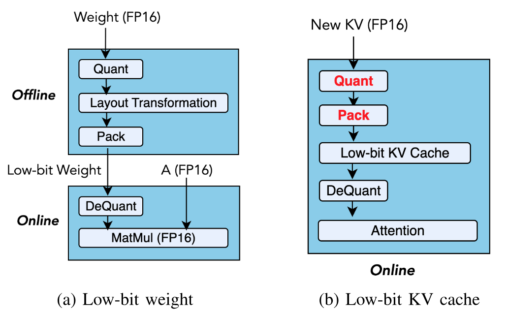

**図 1.** 低ビット重みと低ビット KV キャッシュにおける混合精度行列乗算の比較。（a）量子化重みはオフラインで前処理できます。（b）KV キャッシュでは、新しい token を生成するたびにオンライン量子化と packing が必要です。

Tensor Core を利用して低ビット KV キャッシュを効率よくデコードするには、重大な課題があります。第一に、Tensor Core では、逆量子化した低ビットデータを高精度形式に合わせる必要がありますが、KV キャッシュが動的に増加して Tensor Core 固有のレイアウトに従わなければならない自己回帰デコードでは、これは容易ではありません。レイアウトを最適化しなければ、Tensor Core の利用率が低下し、誤った結果さえ生じる可能性があります。第二に、逆量子化のコストが高いと Tensor Core の実行が stall し、CUDA core と Tensor Core の workload が一致しないため GPU occupancy が低下します。第三に、tensor-wise と channel-wise で異なる scaling を採用する多様な attention 機構および量子化アルゴリズムに対応するには、汎用的でありながら高度に最適化された実装が必要です。設計が不十分であれば、長文コンテキスト生成時に CUDA core または Tensor Core が性能ボトルネックになります。

以上の課題に対処するため、私たちは低ビット KV キャッシュを用いる高性能な長文コンテキスト LLM 推論システム **BitDecoding** を設計・実装しました。BitDecoding の設計には、Tensor Core の活用に不可欠な複数の貢献があります。（i）ハードウェア命令に基づく低ビット最適化レイアウトの導出、（ii）Tensor Core を飽和させるための warp と residual buffer の整合、（iii）逆量子化を高速化するレイアウトの再マッピング、（iv）量子化 kernel と逆量子化 kernel の協調です。さらに、低ビット演算のオーバーヘッドを抑える新たな GPU warp 並列化戦略として、（i）効率的な warp 並列レイアウトと、（ii）GPU メモリ階層を利用して warp を高速同期する attention アルゴリズムの改良を提案します。

また、BitDecoding による LLM 推論の実装技術として、（i）多様な attention 変種を効率よく実行し、既存 LLM へ容易に導入できる query transformation、（ii）channel-wise と tensor-wise の scaling の両方に対応し、量子化アルゴリズムをまたいで汎用性を保つ高性能量子化 kernel、（iii）CUDA core と Tensor Core を協調させて GEMM と逆量子化を行い、追加の低ビット metadata を含むデータ移動を重ね合わせる、ソフトウェア定義 pipeline を備えた逆量子化 kernel を実現しました。さらに BitDecoding は、Hopper の warpgroup tensor 演算と Blackwell のネイティブ低精度 tensor 形式を利用するアーキテクチャ固有の最適化を取り入れ、最新世代の GPU でデコード性能を最大化します。

BitDecoding は Blackwell、Hopper、Ada、Ampere GPU アーキテクチャにわたり、kernel レベルと end-to-end レベルの双方で評価されています。kernel レベルでは FP16 FlashDecoding-v2 に対し、Blackwell（例えばネイティブ MXFP4 対応の RTX 5090）で最大 8.6$\times$、Hopper で 8.0$\times$、Ada で 7.5$\times$、Ampere で 4.8$\times$ 高速であり、QServe に対しても最大 4.3$\times$ 高速です。end-to-end モデルでは、128K の sequence length を持つ LLaMA-3.1-8B の単一 batch デコード遅延を 3$\times$ に短縮し、QServe の 4$\times$ を超える serving throughput を達成します。

## 2 背景と動機

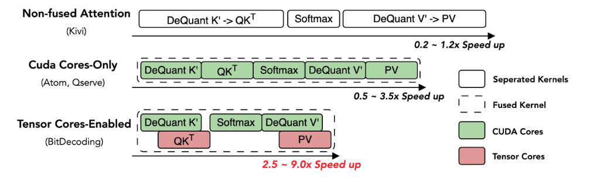

**図 2.** さまざまな低ビット KV キャッシュシステムと半精度 FlashAttention の比較。各システムは attention の定式化 $\mathrm{Out}=\mathrm{softmax}(Q\,\mathcal{D}(K'^\top))\,\mathcal{D}(V')$ に従います。ここで $K'$ と $V'$ は低ビット量子化された Key および Value tensor、$\mathcal{D}(\cdot)$ は逆量子化関数です。

**LLM 推論と低ビット KV キャッシュ。** LLM 推論は二つの段階からなります。（i）*Prefill* は prompt を処理し、キャッシュする Key（K）tensor と Value（V）tensor を計算します。（ii）*Decode* は自己回帰生成のために KV キャッシュを token ごとに更新します。$n$ 層、$h_{kv}$ 個の KV head、hidden size $d$ のモデルでは、KV キャッシュに $2 \cdot 16 \cdot n \cdot h_{kv} \cdot d \cdot b \cdot l$ bit が必要です（FP16 を仮定）。ここで $b$ は batch size、$l$ は sequence length です。この必要量は $b$ と $l$ の双方に比例して増えるため、特に長文コンテキストや大規模 batch workload では、KV キャッシュがメモリ使用量の大半を占めます。batch 推論では各 sequence が独立した過去のコンテキストを持つため、キャッシュされた Key と Value の読み込み時に batch レベルの並列性や再利用はほとんどありません。*したがって、KV キャッシュへのアクセスは通常、メモリ帯域幅に制約されます。* この制約を受け、非量子化 baseline に近い精度を保ちながらメモリ使用量を減らして throughput を高めるため、研究界と産業界では低ビット KV キャッシュ [Liu24c, Hoo24, Zha24b] が広く検討されています。

**現代の GPU における Tensor Core と CUDA core。** GPU 上で LLM 推論と低ビット KV キャッシュを最適化するには、Tensor Core と CUDA core の双方を活用することが重要です。Tensor Core は現代の GPU における計算 FLOPS の大半を担いますが、行列演算（GEMM など）に特化しています。一方、CUDA core は vector、scalar、control-flow を柔軟に処理できますが、peak FLOPS はかなり低くなります。例えば A100 では、Tensor Core が FP16/BF16 で最大 312 TFLOPS を提供し、CUDA core の FP32 性能 19.5 TFLOPS を大きく上回ります。

この性能差は最近の世代で大きく広がりました。Hopper アーキテクチャは Warpgroup Matrix Multiply-Accumulate（WGMMA）命令と warp-specialized pipeline を導入し、非同期実行の効率を最大化します。Blackwell アーキテクチャはネイティブの micro-scaling 形式（MXFP4、NVFP4 など）に対応し、最大 20 PFLOPS を提供することで、この差をさらに拡大します。

LLM 推論を高速化するため、Tensor Core を利用する attention 変種の最適化が盛んに進められています。最先端 LLM [Dee24a, Dub24, Yan25a] は、複数の query で KV head を再利用してメモリ帯域幅を抑える MQA [Sha19] と GQA [Ain23] をますます採用しています。この再利用は arithmetic intensity と計算効率を高め [Sun25e]、高 throughput で行列中心の Tensor Core 設計に適しています。そのため、長文コンテキストおよび grouped-attention LLM の効率的な推論では、Tensor Core の活用が不可欠になっています。

**既存の低ビット KV キャッシュシステムの限界。** 長文コンテキスト LLM 推論で低ビット KV キャッシュを支援するため、多数のシステム [Liu24c, Lin24a, Zha24e] が提案されています。しかし、GPU を十分に利用できないことが多く、性能は最適とはいえません。主な理由を以下にまとめます。

- *独立した低ビット KV キャッシュ kernel を用いる attention:* 最も単純な手法は Kivi [Liu24c] に代表されます。混合精度 attention を複数の独立 kernel に分解し、融合されていない attention 実装へ組み込みます。この設計は柔軟性が高く、多様な attention 変種 [Ain23, Sha19] に容易に対応できます。しかし、独立した起動ごとに中間データを繰り返し読み書きするため、global memory traffic が増え、on-chip data reuse が失われます。その結果、起動オーバーヘッド、メモリ帯域幅の負荷が増し、実効 throughput が低下します。
- *CUDA core のみで低ビット KV キャッシュ kernel を実行する融合 attention:* CUDA core は混合精度演算に汎用的に使えるため、FlashAttention 形式の融合 [Dao24a] を CUDA core のみで動く低ビット KV キャッシュへ拡張するのは自然な方法です。これは非融合設計より高速ですが、Tensor Core を十分に利用できません。このシステムでは、逆量子化と行列演算（GEMV/GEMM）の双方を fused multiply-add（FMA）命令で CUDA core 上に実行します。混合精度では CUDA core が高コストの逆量子化（int4/8 $\rightarrow$ FP16/BF16 など）、scaling、element-wise 演算を処理する必要があります。これらはメモリ制約を受け、instruction slot、register bandwidth、L1/L2 容量を消費します。そのため occupancy が低下し tile size も制約され、計算量の多い行列乗算に使える資源が減ります。したがって、逆量子化と matmul を CUDA core 上でともに実行すると、とりわけ arithmetic intensity が高い attention 変種で大きなオーバーヘッドが生じます。

## 3 提案する解決策と課題

### 3.1 解決策: Tensor Core と CUDA core の協調利用

本稿では、長文コンテキスト LLM 推論における低ビット KV キャッシュを支援するため、Tensor Core と CUDA core を*協調的に*利用する解決策を検討します。私たちの設計では、（i）Tensor Core 上で行列乗算を構築・schedule し、（ii）量子化、packing、逆量子化という行列乗算以外の演算を CUDA core 上で効率よく実行する、新たな設計と実装を導入します。この協調を有効にするため、Tensor Core と CUDA core の workload を均衡させ、逆量子化が Tensor Core GEMM を stall させずに供給され、memory traffic が最小となり、end-to-end のデコード throughput が最大となるよう、データ移動を慎重に統率します。

幅広く採用できるよう、この協調設計を（i）MHA、MQA、GQA を含む複数の attention 変種における低ビット KV キャッシュに対応し、（ii）複数世代の GPU にまたがるシステムとして実現することを目指します。前者には既存の attention 実装へ統合できる明確な interface が必要です。後者には、高いデコード throughput を維持しながら異なる GPU backend へ迅速に対応できる、適応しやすい設計が必要です。

この解決策には大きな利点が期待できます。例えば、FlashAttention-3（FA-3）[Sha24b] に基づく低ビットデコードを実現すれば、warp-specialized pipeline など SM90 固有の機能を利用して従来実装に対し最大 $6\times$ 高速化でき、従来の SM80 命令に伴う 35% の throughput 低下を回避できます。さらに、この設計は Blackwell のアーキテクチャ能力を見越しており、低精度形式へのネイティブ対応によって、さらに大きな throughput 向上が得られます。

### 3.2 未解決の課題

低ビット KV キャッシュに Tensor Core と CUDA core を*協調的に*使用する手法は有望ですが、いくつかの理由から実装はとりわけ困難です。

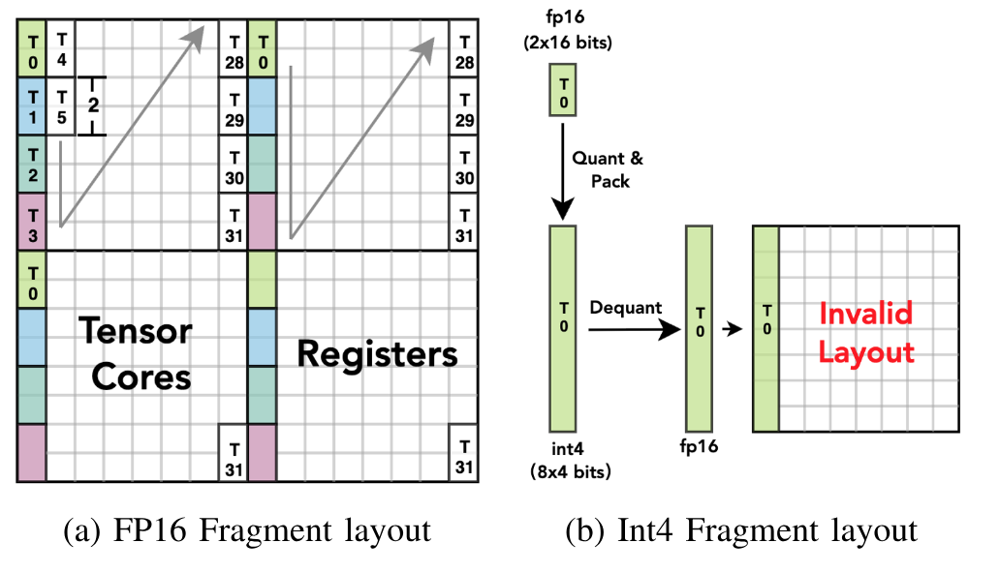

**図 3.** （a）行列 B に対する `mma.m16n8k16` の fragment レイアウト。各 thread（$T_i$）には、命令で定義された交錯 mapping に基づく値の集合が割り当てられます。（b）INT4 では量子化値が thread ごとに連続して packing されます。逆量子化後のレイアウトは、期待される交錯 pattern と一致しません。

**課題 1: Tensor Core では低ビットレイアウトの不一致が頻繁に生じます。** 低ビットデータのレイアウトを Tensor Core の要件に合わせるのは困難です。KV キャッシュが動的に拡大する自己回帰生成では、特に難しくなります。

実行時には、量子化・packing 後の低ビット KV キャッシュを、Tensor Core が求める半精度レイアウトへ逆量子化する必要があります。この対応が難しい理由は三つあります。

第一に、fragment レイアウトは命令や GPU 世代によって異なります。最適化されたデータ移動命令 `ldmatrix` を使うと、register 内の fragment には値と thread の厳密な対応関係が課されます。[図 3a](#figure-03) は、$N$ 次元に沿って tiling を反復する `mma.m16n8k16` で各 thread（$T$）が読み取る register を示します。しかし、この対応関係は別の Tensor Core 命令（`mma.m16n8k8` など）や Hopper の `wgmma` 系列（`wgmma.m64n64k16` など）とは異なります。

第二に、低い bitwidth は alignment の問題をさらに悪化させます。Tensor Core 命令では特定の計算型が必要ですが、その固定的で交錯した register レイアウトに低精度データを直接合わせるのは困難です。レイアウト変換を行わなければ、交錯したアクセス pattern と一致しないため、低ビット register レイアウトは MMA 実行に対する**無効なレイアウト**になります。[図 3b](#figure-03) のように、Thread 0（T0）が元々計算した二つの FP16 値を、KV キャッシュ内の連続した八つの低ビット値として量子化・packing すると、unpacking と逆量子化の後には期待される Tensor Core register レイアウトと一致せず、誤った値になります。Blackwell のネイティブ低精度形式でもハードウェア支援は限定的です。特に KV キャッシュでは継続的な量子化と packing が必要なため、ソフトウェアが低精度値と micro-scaling factor を慎重に扱わなければなりません [Nvi25e]。

最後に、逆量子化が実行のボトルネックになり得ます。単純な低ビット$\rightarrow$FP16 cast は遅く [Kim22]、効率よく実行するには**適切なレイアウト**が必要です。Ladder [Wan24e] や Marlin [Fra24] などの従来研究は、静的な重みに別のレイアウト変換 kernel を挿入して不一致を緩和しますが、大きなオーバーヘッドを加えるため動的なデコードには適しません。実験の詳細は[表 2](#table-02) に示します。

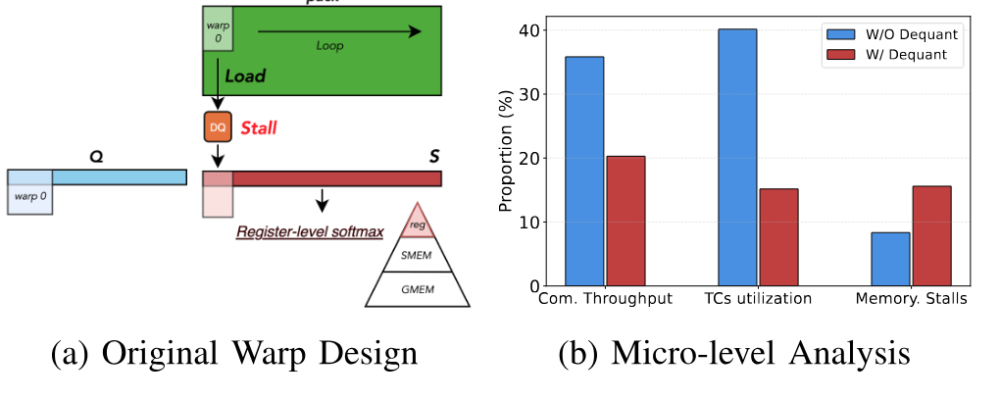

**図 4.** （a）register レベルの演算で $N$ 方向に一つの warp だけを割り当てると、逆量子化（DQ）による stall が生じます。（b）逆量子化の有無による micro レベルの比較。

**課題 2: 頻繁な stall が Tensor Core の利用率を制限します。** 高性能 attention kernel で経験的に調整された warp レイアウトと分割は、低ビット KV キャッシュの性能を意図せず低下させることがあります。

FlashAttention の元の warp 分割では、追加の逆量子化（DQ）が throughput と Tensor Core 利用率を大きく低下させる可能性があります。[図 4a](#figure-04) のように、FlashAttention は $N$ 次元に一つの warp を割り当て、register レベルの softmax と行列乗算 $P V$ を実行します。$P$ は Tensor Core のレイアウトに合う register 内に保持されます。matmul の前に DQ を挿入すると、この戦略は非効率になります。$K$ または $V$ の小さな warp tile は $N$ を順番にたどる必要があり、DQ が頻繁に warp を stall させるためです。[図 4b](#figure-04) の Nsight Compute profiling [Nvi25a] は、追加された DQ のオーバーヘッドが memory-access stall を増やし、計算 throughput と Tensor Core 利用率を低下させることを示しており、従来の観察 [Fan25e] と一致します。

さらに、ネイティブ低精度形式は逆量子化を不要にする一方、独自のオーバーヘッドをもたらします。具体的には、第二の行列乗算（$P V$）に低精度 Tensor Core を使うため、softmax の後に確率行列 $P$ を動的に再量子化しなければなりません。$P_{f16}=\mathrm{softmax}(Q_{f4}K_{f4}^\top), \quad O_{f16}=\mathrm{Quant}(P_{f16})V_{f4}$ となります。このオンライン量子化は新たな計算ボトルネックとなり、同様に Tensor Core の実行を stall させる可能性があります。

**課題 3: 異なる低ビット KV キャッシュ手法に共通して使えるシステム最適化がありません。** 一般的な KV キャッシュ量子化手法では、Key tensor に tensor-wise [Zha24e, Hoo24] と channel-wise [Liu24c, Kan24] という異なる scaling granularity が使われ、すべてに対応する統一システムの構築を難しくしています。オンラインの量子化と packing には reduction と element-wise 変換が必要であり、無視できない実行時オーバーヘッドが加わります。さらに、補助 metadata（scale と zero-point）は memory traffic を増やし、慎重に schedule しなければ load-compute pipeline を乱します。従来の混合精度 kernel 最適化 [Wan24e, Fra24] は静的な重み量子化を対象とするため、動的で段階的に進む KV キャッシュへ一般化できません。現在まで、高性能な低ビット KV キャッシュ量子化に共通して適用できるシステムレベルの最適化技術は存在していません。

## 4 BitDecoding の設計

本節では、低ビット KV キャッシュを支援する際に Tensor Core と CUDA core を協調利用する BitDecoding システムの設計を示します。この設計は主に、（i）Tensor Core 利用時の低ビットレイアウトを最適化する新たな手法と原則、（ii）逆量子化による stall を最小化するため GPU warp を並列化・協調させる新たな戦略からなります。

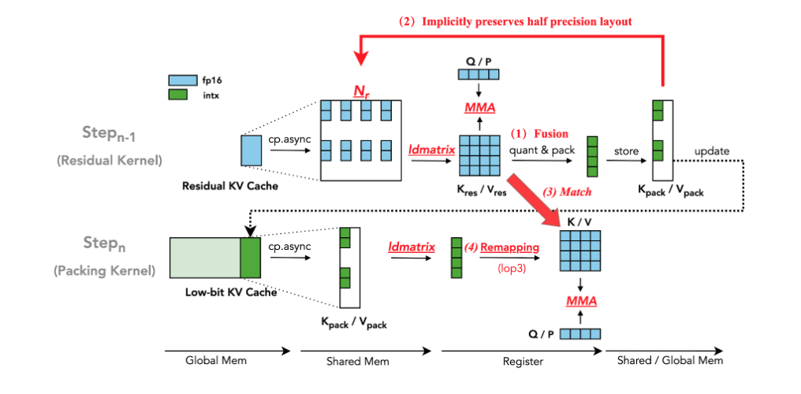

**図 5.** Tensor Core 上の低ビットレイアウトを最適化する手法の概要。（1）Tensor Core fragment 内での計算と量子化の融合。（2）低ビット packing データが FP16 値を保持します。（3）低ビットレイアウトが逆量子化後の半精度レイアウトと一致します。（4）逆量子化を高速化するレイアウト再マッピング。

### 4.1 Tensor Core 上の低ビットレイアウト最適化手法

本設計が最初に解決する課題は、GPU 世代や低ビット KV キャッシュの構成が異なっても、Tensor Core を十分に活用できる最適なレイアウトを BitDecoding が自動生成できるようにすることです。そのため、以下の原則と手法を設計しました。

**（1）ハードウェア命令による低ビット最適化レイアウトの導出。** 本設計は、`ldmatrix` の thread-to-register mapping が Tensor Core の交錯した fragment レイアウトでデータを読み込むという新たな着想に基づきます。[図 5](#figure-05)-（2）のように、各 thread がその後ローカルで量子化と packing を行えば、得られる低ビット packing は半精度（FP16）の交錯レイアウトを*暗黙に保持*します。unpacking と逆量子化を行うと、値はすでに Tensor Core register と一致しており、global な reshape は不要です。したがって、従来手法のように手作業の実装 [Fra24] や反復探索 [Wan24e] による高コストな global 変換に頼らず、ハードウェア命令を用いて計算中に有効な低ビット packing レイアウトを自動的に導出します。これにより、効率がよく、Tensor Core の実行に対応し、追加のデータ移動を必要としない、オーバーヘッドゼロの再マッピングが得られます。

この着想に基づき、新たに生成された FP16 KV tensor の計算、量子化、packing を融合する専用 GPU *Residual Kernel* を設計します。`ldmatrix` を用いて、高精度 KV tensor を Tensor Core 向けに構造化された register へ読み込み、行列演算（$Q K^\top$ または $P V$ など）を実行してから、各 thread が担当部分を register 内で量子化・packing します（[図 5](#figure-05)-（1））。その結果、交錯してレイアウト互換性を持つ低ビットデータが global memory へ直接書き込まれ、低ビット KV キャッシュを更新します。

このキャッシュを使用するため、逆量子化と計算を融合する *Packing Kernel* を導入します。unpacking 時に正しい register レイアウトを保証するため、（i）同じ `ldmatrix` 変種を使い、（ii）同じ `mma` 変種と warp-tiling 構成に従うことで、Residual Kernel の命令構成を再現します。その結果、Packing Kernel が `ldmatrix` で packing 済み低ビットデータを読み込むと、unpacking 後の値は Tensor Core register と本質的に整合し、明示的なレイアウト修正を行わずに直ちに行列乗算へ参加できます。

**（2）Tensor Core を飽和させるための warp と residual KV キャッシュの整合。** Tensor Core は warp tile 単位で行列演算を実行するため、最適な throughput を得るには入力 tile を完全に満たす必要があります。そこで*私たちは*、Tensor Core の tiling 容量に合う大きさの residual buffer を割り当てれば、低ビットデータをハードウェアの計算粒度に合わせ、計算ユニットの能力を十分に利用できると考えました。

この考えを実装するため、residual block size が $N_r$ の半精度 residual KV キャッシュを導入します。$X \in \mathbb{R}^{L \times d}$ を KV キャッシュ全体とします。$X$ を次のように分割します。

$$
X=X_{\mathrm{pack}}\cup X_{\mathrm{res}},
$$

ここで

$$
\begin{cases}
X_{\mathrm{pack}}=X[:L-N_r] \\
X_{\mathrm{res}}=X[L-N_r:]
\end{cases}
$$

$\beta$ を低ビット量子化の bit-width（$\beta=4$ または $2$ など）、$\omega$ を packing 済みデータの格納に用いる word size（INT16 なら $\omega=16$ など）とします。対応する *packing ratio* は $R=\omega/\beta$ です。$W_n$ を N 次元方向の warp 数、$P_n$ を各 warp tile が処理する要素数（`mma.m16n8k16` では $P_n=8$ など）とします。各 warp に対する Tensor Core fragment を完全に満たすため、residual block size は次式で計算します。

$$
N_r=P_n\times W_n\times R
$$

これにより、低ビット KV キャッシュの fragment が Tensor Core 演算の warp レベル tiling と正確に整合し、密でレイアウト互換性のある packing が可能となり、計算ユニットの occupancy が最大化されます。

**（3）逆量子化を高速化するレイアウト再マッピング。** Tensor Core のレイアウトと互換性があっても、低ビット値を `static_cast` で FP16 へ直接変換すると大きなオーバーヘッドが生じるため、このレイアウトは逆量子化には非効率です。

この非効率を緩和するため、[Kim22] に着想を得た低レベルの bitwise 演算と命令に基づく、より高速な逆量子化 mapping を設計します。packing 済みデータを `ldmatrix` で register へ読み込んだ後、INT32 に cast してから、75316420 pattern に従う交錯した Tensor Core レイアウトへ mapping します。このレイアウトでは、Tensor Core の計算 pattern に合わせながら、bit 操作用の `lop3` 命令によって INT4/INT2 データを FP16 へ効率よく変換できます。

**（4）構成設定による Residual Kernel と Packing Kernel の協調。** この設計は、統一された命令構成の下で Residual Kernel と Packing Kernel を協調させることで実行します。まず、`ldmatrix` と `mma` の変種を含むハードウェア命令構成を GPU アーキテクチャに基づいて決定できます。この構成を用い、低ビット KV キャッシュの bit-width から residual block size $N_r$ を計算します。[図 5](#figure-05) のように、Residual Kernel は `ldmatrix` で高精度 KV entry を register へ読み込み、Tensor Core で計算してから、量子化と packing を融合して低ビット KV キャッシュへ格納します。同じ命令構成を用いる Packing Kernel は packing 済みデータを register へ読み込み、効率よく逆量子化して Tensor Core の計算へ進みます。

### 4.2 warp を並列化する戦略

第二の課題は、頻繁な warp stall のためハードウェア利用率が低くなる、既存の混合精度 attention 向け warp 並列化戦略の問題を BitDecoding が回避することです。重要な着想は、低ビットデータは full precision よりはるかに高い帯域幅で移動するため、ボトルネックがメモリから計算へ移るという点です。そこで GPU のメモリ階層を利用して低精度演算を効率よく並列化し、データ移動を最小限に抑えながら Tensor Core の利用率を大幅に高める warp レイアウトを設計します（オーバーヘッドが小さいことは[表 3](#table-03) に示します）。

**（1）低精度演算に対する warp 並列性の強化。** packing 済みデータの複数 chunk を並列に処理できる、新たな warp レイアウトを導入します。逆量子化を例に、並列性をさらに活用できるよう warp の分割戦略を変更します。[図 6](#figure-06) のように、$M$ 次元方向へ複数の warp を割り当てる元の戦略とは異なり、デコード時の query length が通常は小さい（$<16$）ことを利用して $W_m=1$ に制限し、資源を再配分して $N$ 次元方向の warp 数（$W_n$）を増やします。

$W_n$ を増やすと、複数の warp が packing 済みデータを同時に逆量子化してから Tensor Core ベースの行列乗算へ進むため、Streaming Multiprocessor（SM）の warp scheduler [San15] によって逆量子化の stall を効果的に緩和できます。

同様に、この並列化戦略はネイティブ低精度 attention のオンライン量子化がもたらす stall を緩和し、量子化も逆量子化も逐次実行のボトルネックにならないようにします。

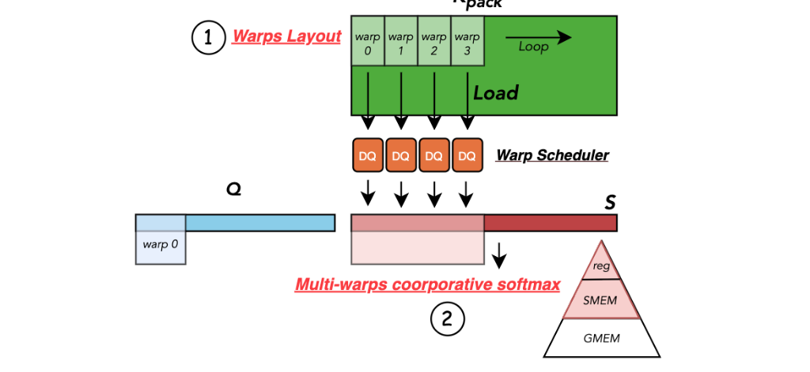

**図 6.** Tensor Core を効率よく利用するための並列性強化。（1）新しい warp レイアウト設計で逆量子化の stall を減らします。（2）協調 softmax が GPU register と shared memory 間のデータ移動を利用し、小さなオーバーヘッドで cross-warp reduction を実現します。

**（2）warp 同期におけるメモリ階層の活用。** しかし、結果が異なる register と warp に分散するため、元の register レベル softmax は実行できません。さらに、新しい warp レイアウトと $P V$ の MMA 演算が求める形式に互換性がないという*重要な課題*が生じます。

これに対処するため、register から shared memory までの多層メモリ階層を利用し、softmax 計算の cross-warp reduction と同期を可能にします。Algorithm 1 のように、FlashAttention など既存の高性能 attention アルゴリズムへ、$\mathit{sTMP} \in \mathbb{R}^{W_n}$ と $\mathit{sAcc} \in \mathbb{R}^{T_m \times T_n}$ という二つの shared memory buffer を追加します。$\mathit{sTMP}$ buffer は、softmax の row-wise maximum を求める cross-warp reduction を支援します。まず register 内で intra-warp reduction を行い、続いて shared memory で inter-warp reduction を行います。$\mathit{sAcc}$ buffer は Tensor Core register で計算された attention score $P$ を一時保存し、その後 `ldmatrix` で再読み込みすることで、後続の Tensor Core `mma` 演算に必要な alignment を保証します。

$W_n$ は通常小さいため、メモリ負荷を抑える目的で $\mathit{sTMP}$ の shared memory pointer を $\mathit{sAcc}$ に再利用します。また、Hopper Tensor Core では WGMMA が shared memory への直接アクセスに対応しており、shared memory から register への明示的なデータ移動が不要です。

**Algorithm 1: Multi-warps Cooperative Softmax**

- **入力:** SMEM 内の $\mathit{sTMP} \in \mathbb{R}^{W_n}$ と $\mathit{sAcc} \in \mathbb{R}^{T_m \times T_n}$。
- **入力:** $Q_i \in \mathbb{R}^{T_m \times d}$ と $K_i,V_i \in \mathbb{R}^{T_n \times d}$ を REG へ読み込みます。
- $S_i=Q_i K_j^\top$。ここで $S_i \in \mathbb{R}^{T_m \times T_n}$。
- $m_i^{\mathrm{new}}=\max(m_i,\mathrm{rowmax}(S_i,\mathit{sTMP}))$。
- $P_i=\exp(S_i-m_i^{\mathrm{new}})$。ここで $P_i \in \mathbb{R}^{T_m \times T_n}$。
- $\mathit{sAcc}=\mathit{tiled\_copy\_r2s}(P_i)$。
- $P_i'=\mathit{tiled\_copy\_s2r}(\mathit{sAcc})$。
- $O_i^{\mathrm{new}}=P_i'V_j+\mathrm{diag}(e^{m_i-m_i^{\mathrm{new}}})O_i$。

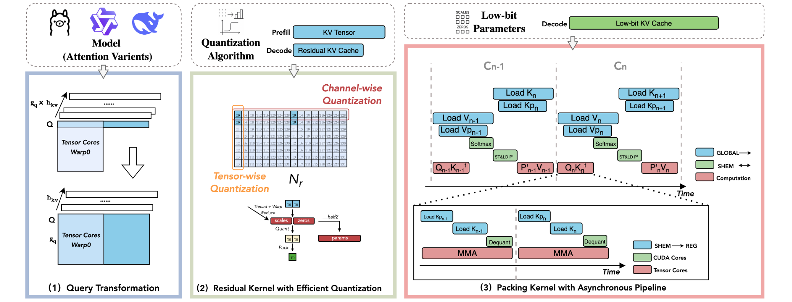

**図 7.** BitDecoding のシステム概要。（1）**Query Transformation** は query tensor のレイアウトを組み替え、attention 変種を Tensor Core 上で効率よく warp レベル実行できるようにします。（2）**Residual Kernel** は小さなオーバーヘッドで量子化と packing を行い、tensor-wise と channel-wise の scaling の両方に対応します。（3）**Packing Kernel** は細粒度の非同期 pipeline で逆量子化と行列乗算を実行し、低ビット parameter を用いながら Tensor Core と CUDA core の利用率を最大化します。

## 5 システム実装

本節では、[図 7](#figure-07) に示す BitDecoding の実装を説明します。本実装は三つの主要コンポーネントからなります。（i）LLM の多様な attention 変種に対応する *query transformation*、（ii）量子化アルゴリズムが tensor-wise と channel-wise のどちらの scaling を使っても汎用性を保ちながら、低コストで量子化と packing を行う *Residual Kernel*、（iii）Tensor Core と CUDA core の双方を十分に活用する細粒度 pipeline を備えた *Packing Kernel* です。最後に、最新 GPU 世代（Hopper や Blackwell など）の高度な機能を利用してデコード throughput をさらに高める、アーキテクチャ固有の最適化を説明します。

### 5.1 Query Transformation

現代の LLM は、key-value（KV）の共有 pattern が異なる多様な attention 変種 [Dub24, Yan25a, Dee24a] を採用しています。BitDecoding はこれらすべての変種への対応を目指します。

例えば GQA と MQA では、複数の query head が一つの KV head を共有し、KV projection の数と memory access を削減します。共有の程度は $g_q=h_q/h_{kv}$ で表され、$h_q$ と $h_{kv}$ はそれぞれ query head 数と KV head 数です。$g_q=1$ は MHA、$g_q>1$ は GQA、$h_{kv}=1$（すなわち $g_q=h_q$）は MQA を表します。

デコード時には課題があります。$Q\_len=1$（一度に一つの token）であるため、query tensor の batch 次元は非常に小さく、単純な $Q\cdot K^\top$ では Tensor Core が埋まらず、warp occupancy と throughput が低下します。

そこで query レイアウトを組み替え、Tensor Core の tiling に適合させる *query transformation* を行います。[図 7](#figure-07)（左）のように、query tensor を $[1,(g_q,h_{kv})]$ から $[g_q,h_{kv}]$ へ reshape し、attention の意味や KV 共有 pattern を変えずに、より大きな $Q$ tile を実質的に形成します。grouped query head は大きな GEMM block として並列処理され、Tensor Core fragment を完全に満たすため、warp occupancy と throughput が向上します。

### 5.2 Residual Kernel

低ビット KV キャッシュ設計における主な課題は、特に scaling granularity（tensor-wise、channel-wise など）が異なる多様な量子化アルゴリズムを、性能を犠牲にせず支援することです。量子化では scale と zero-point を計算するための reduction と element-wise 演算に続いて bit-packing を行います。デコード中はこれらをオンライン実行する必要があり、実行時オーバーヘッドが増えるうえ、Tensor Core が求める固定的なレイアウトと一致しないおそれがあります。そこで *Residual Kernel* に二つの重要な最適化を施します。

**（1）residual block size に基づく KV キャッシュの分割。** コンテキスト長 $L$ の prefill では、Tensor Core と整合する residual block size $N_r$ に基づき KV キャッシュを分割します（[式 1](#equation-01)）。先頭の $N_p=L-(L\mod N_r)$ 個の entry は、融合された量子化・packing 演算で低ビット KV キャッシュへ量子化・packing します。残る $\texttt{res\_len}=L\mod N_r$ 個の KV tensor は、半精度 residual KV キャッシュへ保存します。各 decode step では、新たに生成した $K,V$ tensor を residual cache へ追加して attention 計算に使います。このキャッシュは residual block size $N_r$ に達するまで段階的に増加します。Residual Kernel は token の生成ごとに半精度 residual KV キャッシュを使って attention を計算し、必要に応じて（$\texttt{res\_len}=N_r$ のとき）packing 形式へ量子化します。

デコード時にこのように KV キャッシュを分割すれば、$seq\_len$ に沿った channel-wise 量子化と、residual block 内の hidden dimension に沿った tensor-wise 量子化を自然に実行できます。

**（2）warp レベル命令による reduction の最適化。** [図 7](#figure-07)（中央）のように、半精度 KV データが計算されると、それは Tensor Core fragment として register に残り、`mma` 演算が使うネイティブな交錯レイアウトで構造化されています。量子化 parameter（scale と zero-point）を効率よく計算するため、まず thread レベル reduction を行い、各 group 内のローカルな min/max 統計を求めます。

続いて、PTX 命令 `__shfl_xor_sync` を使って warp 全体でローカルな結果を集約し、shared memory を使わず効率よく warp レベル reduction を実現します。warp の反復係数 $W_n>1$ の場合は、小さな shared memory buffer を導入し、warp 間の最終 reduction を協調させます。

量子化 parameter を計算した後、各 thread は register 内で量子化し、低ビット値を INT16 形式へ packing します。これにより余分なメモリ移動を避け、データを計算可能な状態に保ちます。オーバーヘッドを抑えるため、scale と zero-point はどちらもコンパクトな `half2` 形式で保存し、デコード段階の逆量子化で効率的な memory access と fused multiply-add を可能にします。

### 5.3 Packing Kernel

もう一つの課題は、低ビットの補助 metadata（scale と zero-point）が memory traffic を増やす一方、逆量子化は CUDA core 上で実行されることです。慎重に schedule しなければ load-compute pipeline が乱れ、Tensor Core 演算との overlap を妨げます。そこで細粒度の非同期 pipeline を設計します。CUDA core が逆量子化、Tensor Core が行列乗算を担当し、GPU のメモリ階層を通る転送と重なるよう両者を統率することで、効率的な混合精度計算を実現します。

**（1）非同期データ移動の最適化。** *Global Memory から Shared Memory へ*は、FlashAttention [Dao24a] と同様に block-wise tiling [Wan25] と戦略的な再計算を採用します。入力行列 $Q \in \mathbb{R}^{T_m \times d}$、$K,V \in \mathbb{R}^{T_n \times d}$ を、block size $T_m$ と $T_n$ の tile に分け、shared memory 内で処理します。key-value tile の数は $C_n=\lceil L/T_n\rceil$ です。

量子化 parameter を効率よく管理するため、$K_{\mathrm{pack}}$ の parameter（$K_p$）と $V_{\mathrm{pack}}$ の parameter（$V_p$）に専用 shared memory buffer を導入し、memory copy を効率よく tiling します。これらの buffer は `scale` と `zeros` を `half2` 形式で保存し、一つの命令で読み込めるようにします。

$K_p$ の shape は量子化 granularity の設定で決まり、$V_p$ は Tensor-wise レイアウトに従います。

- **Channel-wise:** $(T_n/\mathit{group\_size},d)$。
- **Tensor-wise:** $(T_n,d/\mathit{group\_size})$。

[図 7](#figure-07)（右）のように、memory overlap を最適化するため、global-to-shared memory の転送はすべて `cp.async` intrinsic で非同期実行し、pipeline の効率を高めます。異なる cache 戦略を持つ命令を使って memory transaction を最適化します。

- **`cp.async.cg`:** 同じ kernel 内で再利用されず global memory のみに cache される $Q$、$K_{\mathrm{pack}}$、$V_{\mathrm{pack}}$ に使用します。
- **`cp.async.ca`:** $K_p$ と $V_p$ に適用し、細粒度の memory access に必要な byte レベルの小さな alignment を保証します。

Hopper アーキテクチャでは FA3 に従い、データ読み込みに `tma.copy` 命令を利用します。これにより warp-specialized scheduling が可能となり、複数 warp にわたる data locality が改善してメモリ遅延が減少します。

*Shared Memory から Register へ*は、PTX 命令 `ldmatrix` を使い、$K_{\mathrm{pack}}$、$V_{\mathrm{pack}}$、$\mathit{sAcc}$ を Tensor Core の tiling レイアウトで shared memory から register へ効率よく読み込みます。bank conflict を取り除くため、[Nvi24a] で定義された次の sizzling scheme を使います。

$$
\mathrm{col}_{id}=\mathrm{row}_{id}\oplus\mathrm{col}_{id}
$$

これにより bank conflict のないアクセスを実現します。さらに、$K_p$ と $V_p$ の shared memory レイアウトを再構成し、bank conflict を減らして throughput 効率を最大化します。

**（2）CUDA core と Tensor Core を overlap させる非同期 pipeline。** CUDA core と Tensor Core の双方を十分に利用するため、計算とメモリ演算を重ね合わせる register レベルの非同期 pipeline を実装します。この pipeline では、SM warp scheduler の下で、`ldmatrix` による shared-memory load と逆量子化（`Dequant`）を Tensor Core の行列乗算（`mma`）と同時に実行します。

[図 7](#figure-07)（右）のように、$i$ 番目の slice を Tensor Core の `mma` で処理している間に、$(i+1)$ 番目の slice を shared memory から読み込み（`ldmatrix`）、同時に逆量子化します。これにより連続した producer-consumer flow を維持し、instruction throughput を高めて CUDA core と Tensor Core の利用率を最大化します。

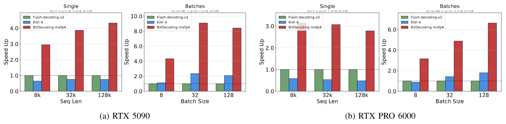

**図 8.** Blackwell アーキテクチャにおける mxfp4 の kernel 性能。（a）RTX 5090。（b）RTX PRO 6000。

### 5.4 最新アーキテクチャへの対応

ここまでの設計は Hopper より前のアーキテクチャ（Ampere など）を効果的に対象としていますが、新しい世代には固有のハードウェア機能があり、専用の最適化戦略が必要です。以下では、Hopper と Blackwell の専用命令およびネイティブデータ形式を活用するため、本手法をどのように適応させるか説明します。

**（1）PTX レベル命令の巧みな利用による Hopper の warpgroup 加速能力の解放。** Hopper Tensor Core は Warpgroup Matrix Multiply-Accumulate（`wgmma`）命令を導入しています。ただし、この命令には重要な制約があります。行列乗算 $C=A B$ では $A$ と $C$ のみ register から取得でき、$B$ は shared memory に置かなければなりません。低ビット量子化データは通常、計算前に register 内で FP16 へ upconvert されるため、この制約が課題になります。そこで Hopper の `STSM` PTX 命令を利用し、逆量子化した FP16 値を shared memory へ効率よく格納して、`wgmma_SS` 演算からアクセスできるようにします。WGMMA の非同期性によって格納と計算を重ね合わせ、性能を最適化できます。

**（2）ネイティブ低精度形式による Blackwell の高速化。** Blackwell アーキテクチャは低精度 tensor 演算をネイティブ対応し、明示的な逆量子化を不要にします。そのため、前述した `lop3` ベースの register 再マッピングを省き、直接実行します。Blackwell の低精度 `mma` 命令、具体的には micro-scaling 形式（`mxfp4 / nvfp4` など）に対応する命令を用い、packing 済み 4 ビットデータ上で GEMM を直接実行します。これらの命令は packing 済みの値と block-scaling factor の双方に固定的なレイアウト制約を課しますが、[第 4.1 節](#section-4-1) で提案したレイアウト変換戦略はレイアウトに依存しないよう設計されています。packing 済み KV データをハードウェア指定の形式に自動で合わせ、Blackwell のネイティブ tensor pipeline へ滑らかに統合します。

## 6 評価

本節では、BitDecoding を最先端の手法およびシステムと比較して包括的に評価します。評価から得られた主な結果は次のとおりです。

1. BitDecoding は各世代の GPU で FP16 FlashDecoding-v2 を大きく上回り、Blackwell（ネイティブ MXFP4 を使用）で最大 8.6$\times$、Hopper で 8.0$\times$、Ada アーキテクチャで 7.5$\times$ 高速化し、最先端の低ビットシステム QServe に対しても最大 4.3$\times$ 高速です（[第 6.1 節](#section-6-1)）。
2. end-to-end の長文コンテキスト推論では、BitDecoding は単一 batch の遅延を 3 倍（128K コンテキストの LLaMA-3.1-8B）短縮し、QServe の 4 倍を超える serving throughput を達成します。従来の CUDA core のみの手法が性能を落とす GQA 環境でも、高い scalability を示します（[第 6.2 節](#section-6-2)）。
3. BitDecoding はほぼ FP16 の精度を保ちながら、各システムコンポーネントから大きな性能向上を得ます。4 ビット量子化による精度低下はわずか 0.2% であり、ablation study からすべての設計 module が全体の高速化に寄与することが確認されます（[第 6.3 節](#section-6-3)）。

### 6.1 GPU アーキテクチャ別の kernel 性能

**Kernel の設定。** LLM serving の場面によって必要な workload と attention kernel の設計が異なるため、次の三つの代表的な設定で性能を評価します。

- **Single:** $\mathit{batch\_size}=1$ の場面で、長文コンテキストを扱う edge user の推論を表します。
- **Batches:** 同じ入力長を保ち、単純な padding を適用しながら $\mathit{batch\_size}$ を大きくした設定です。
- **Page:** 大きな $\mathit{batch\_size}$ を page management 技術 [Kwo23] で管理する、高 throughput の場面です。

**Baseline。** BitDecoding を代表的な複数の attention kernel 実装と比較します。FP16 KV キャッシュでは、長文コンテキストのデコード向けに最適化された FlashAttention の split-partitioned 変種である FlashDecoding [Dao24a, Sha24b] を、speedup を正規化する baseline とします。低ビット KV キャッシュでは、4 ビットと 2 ビット量子化に対応する非融合 kernel の Kivi [Liu24c]、CUDA core のみを使う融合 kernel 実装で、page management を伴う 4 ビットキャッシュに対応する Atom [Zha24e] と QServe [Lin24a] を評価します。なお、Atom は GQA に対応していません。

**量子化の設定。** BitDecoding をさまざまな量子化構成で評価し、Channel-wise（KC）と Tensor-wise（KT）の双方で、4 ビットおよび 2 ビットの Key tensor を使用します。

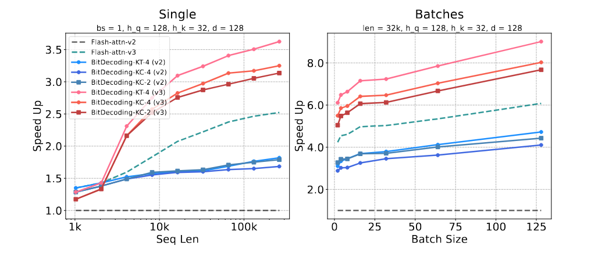

**図 9.** Hopper（H100）における kernel 性能。

**MXFP4 / NVFP4 における結果（RTX5090、RTX PRO 6000）。** Blackwell アーキテクチャは低精度データ形式をネイティブ対応するため、オンライン逆量子化のオーバーヘッドを取り除きながら、低ビット演算で非常に高い計算 throughput を提供します。[図 8a](#figure-08) のように、BitDecoding は優れた性能を示し、batch 環境で最大 8.6$\times$、単一 batch の長文コンテキストデコード（128k）で 4.3$\times$ を超える高速化を達成し、非融合 attention baseline を大幅に上回ります。同様に、[図 8b](#figure-08) は RTX PRO 6000 でも大きな改善が得られ、batch size が大きいと最大 6.5$\times$ 高速になることを示します。

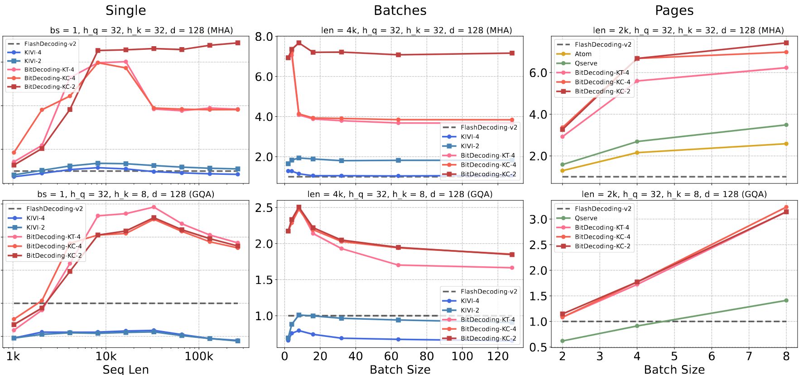

**図 10.** RTX4090 における kernel 性能。

**高度な Tensor Core 加速における結果（H100）。** 新しい GPU アーキテクチャには、kernel の実行を大幅に高速化する高度な計算命令が導入されることがあります。[図 9](#figure-09) のように、Hopper Tensor Core 向けに最適化された FlashDecoding-v3 は、v2 より明確な性能向上を示します。BitDecoding-v2 は最大 4.1$\times$ の高速化を達成し、v3 実装ではさらに 8.0$\times$ まで高まります。BitDecoding が Hopper の `wgmma` と非同期メモリ命令を利用することで、混合精度でも Tensor Core の高い利用率を確保できるためです。

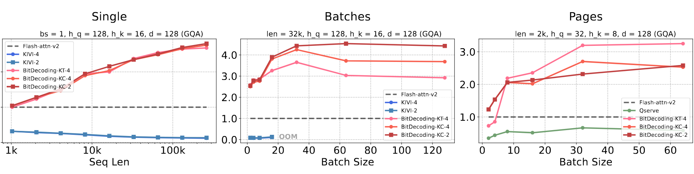

**図 11.** A100 における kernel 性能。

**帯域幅に制約された GPU での結果（RTX 4090）。** 帯域幅に制約された GPU で推論を高速化するには、低精度データの活用が重要です。[図 10](#figure-10) のように、BitDecoding は Single と Batches の設定で FlashDecoding-v2 に対し、約 $4\times$（4 ビット）および $7\times$ 超（2 ビット）の高速化を達成します。これは低ビット KV キャッシュによって DRAM ボトルネックを緩和した直接の効果です。

BitDecoding はすべての場面で baseline を大幅に上回ります。独立した kernel に依存し、GQA で性能が大きく低下する非融合の KIVI とは異なり、BitDecoding は完全融合設計によって高い効率を保ちます。Page 設定では、融合された CUDA core baseline を上回ります。MHA では QServe が $3.5\times$ であるのに対し、BitDecoding は $6\times$ を超える高速化を達成します。特に計算量の多い GQA では、QServe が $1.4\times$ まで低下する一方、BitDecoding は $3\times$ の高速化を維持します。これは、CUDA のみの手法が不調となる場面でも、Tensor Core の利用が堅実な高速化をもたらすことを裏付けます。

**高帯域幅 GPU における結果（A100）。** A100 のようなメモリ帯域幅の広いアーキテクチャでは、性能ボトルネックが memory access から compute utilization へ移るため、計算負荷がより顕著になります。特に kernel 設計が利用可能な計算資源を十分に活用できない場合に当てはまります。[図 11](#figure-11) のように、KIVI と QServe はどちらも性能が低く、KIVI は非融合 kernel 設計、QServe は Tensor Core の利用不足が原因で、FP16 baseline より遅くなることさえあります。対照的に BitDecoding は、Tensor Core の効率的な利用と融合実行 pipeline により、すべての workload で baseline を一貫して上回り、最大 $3\times$ 高速化します。A100 では DRAM 帯域幅の増加でメモリボトルネックが緩和され、性能の重心が compute-bound の実行へ移るため、4 ビット変種と 2 ビット変種の性能差が小さくなる点も興味深い結果です。

### 6.2 LLM 推論システム間の性能

**モデルの設定。** LLaMA-2-7B、LLaMA-3.1-8B、LLaMA-3.1-70B、Qwen3-8B、Qwen3-14B を含む複数の LLM で評価します。このうち MHA を採用するのは LLaMA-2-7B だけで、その他は GQA を使います。LLaMA-3.1-70B のみ 8$\times$A100 GPU で評価し、それ以外のモデルは単一の A100 GPU で実行します。

**量子化の設定。** 精度に優れ、Kivi と整合するため、LLM の KV キャッシュには channel-wise 量子化を選びます。

**非融合 Attention との比較。** [図 12](#figure-12) のように、Single 設定では KV キャッシュの読み込みが LLM 推論の主要ボトルネックとなる 128K コンテキスト長で、BitDecoding は最大 3.3$\times$ 高速化します。一方、Kivi は scalability が限られており、block-tiling kernel に対応していないため、128K で out-of-memory（OOM）が発生します。Batches 設定でも BitDecoding の throughput は KIVI を大きく上回ります。BitDecoding-KC-4 と KC-2 はそれぞれ最大 900 tokens/s と 1200 tokens/s に達しますが、KIVI-4 と KIVI-2 は最大でも 700 tokens/s 未満です。

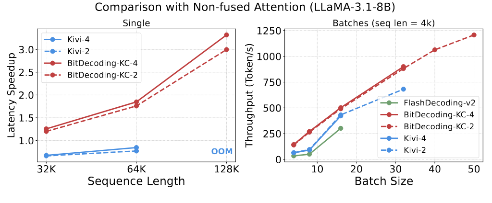

**図 12.** Kivi との比較。（a）end-to-end 生成時間。（b）デコード throughput。

**CUDA core のみを使う融合 Attention との比較。** Qserve は MHA と GQA の双方の attention 構造に対応するため、page-setting 推論で BitDecoding と比較します。最大 throughput は、GPU メモリに収まる最大の batch size で評価します。[図 13](#figure-13) のように、Qserve は LLaMA-2-7B では FlashDecoding-v2 より高い throughput を達成しますが、GQA の処理が非効率なため、その他すべてのモデルで性能が低下します。一方 BitDecoding は、単一 GPU と複数 GPU のどちらの設定でも、LLaMA と Qwen の両アーキテクチャで一貫して QServe を上回り、QServe の 2$\times$ を超える最大 throughput を達成します。

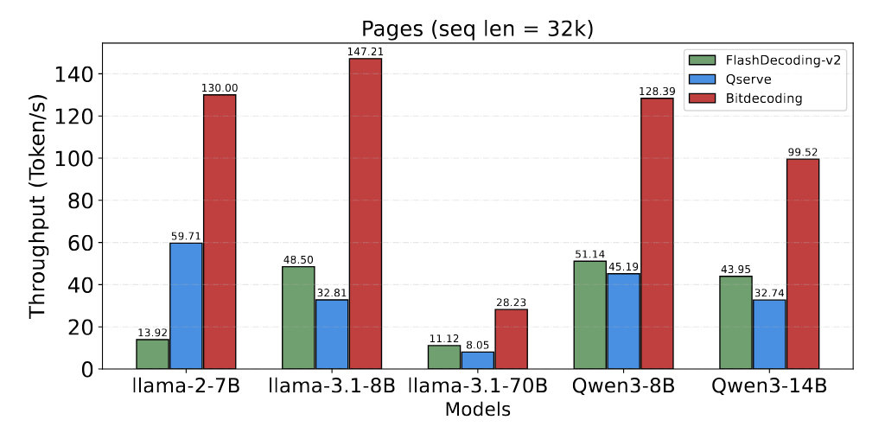

**図 13.** Qserve とのデコード throughput の比較。

### 6.3 精度、オーバーヘッド、性能内訳

**精度分析。** [表 1](#table-01) のように、異なる bit width で throughput と精度を評価します。2 ビット量子化はメモリ使用量を大幅に削減し、batch size を大きくできるため、FP16 と比べて $4.25\times$ 高い throughput を達成します。一方、4 ビット量子化はほぼ full precision の精度を保ち、精度低下をわずか $0.2\%$ に抑えながら $2.98\times$ 高速化します。この結果は trade-off を示しており、4 ビット量子化は均衡を提供し、2 ビット量子化はわずかな精度低下と引き換えに throughput を最大化します。

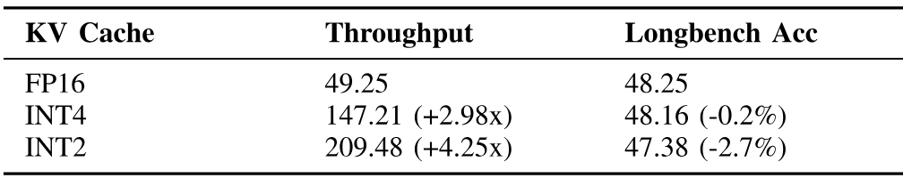

**表 1.** 低ビット KV キャッシュにおける効率と精度の trade-off。$seq\_len=32K$ の Llama-3.1-8B-Instruct を使用し、longbench [Bai23] の平均精度を評価します。

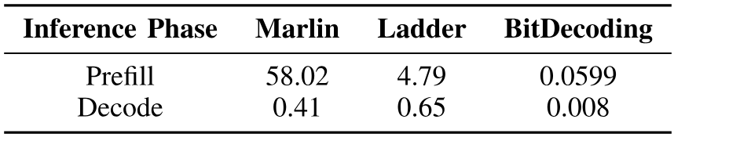

**表 2.** 推論時の量子化および packing 遅延（ms）の比較。

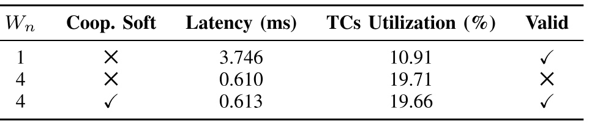

**表 3.** 協調 softmax と warp が性能および妥当性に与える影響。

**半精度 Residual Kernel のオーバーヘッド。** $seq\_len\gg N_r$ であり、$seq\_len$ は 32K を超え、$N_r$ は常に 256 未満であるため、半精度 residual KV Cache が増やすメモリ量はごくわずかです。[図 14](#figure-14) のように、追加の kernel 起動によって半精度 residual KV キャッシュがもたらす実行時オーバーヘッドも小さくなります。さらに、sequence length が伸びるほど residual 部分が KV キャッシュ全体に占める割合は小さくなるため、このオーバーヘッドは一層無視できるものになります。

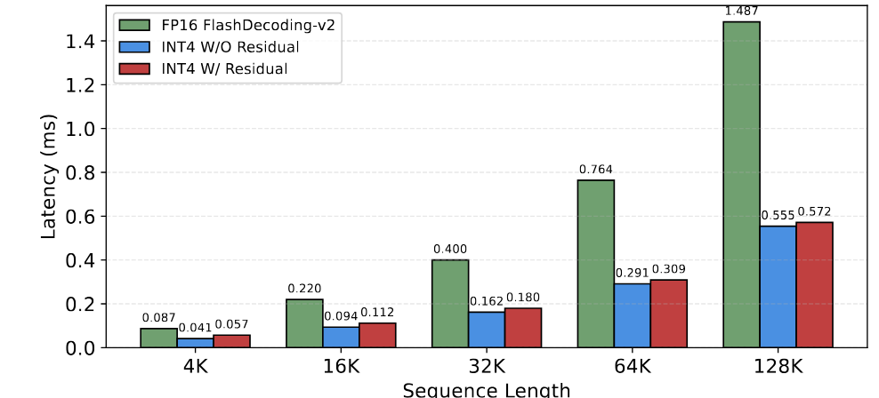

**図 14.** residual KV キャッシュの実行時オーバーヘッド。

**量子化と Packing のオーバーヘッド。** $seq\_len=128K$ で量子化と packing の遅延を評価し、BitDecoding を Marlin [Fra24] および Ladder [Wan24e] と比較します。[表 2](#table-02) のように、従来の混合精度計算手法における事前変換と packing には、無視できない大きなオーバーヘッドがあります。私たちの kernel では Prefill 段階後のオーバーヘッドが小さく、主に kernel の起動によるものです。またデコード中は kernel の計算へ完全に融合されるため、オーバーヘッドはほぼ無視できます。

**逆量子化のオーバーヘッド。** [図 15a](#figure-15) は Atom と QServe の逆量子化に大きな計算オーバーヘッドがあり、kernel 実行時間のほぼ半分を占めることを示します。対照的に BitDecoding は Tensor Core との overlap を改善することで、オーバーヘッドを 15% 未満（4 ビット）および 35% 未満（2 ビット）まで大幅に削減します。

Atom と BitDecoding を比較する追加の microbenchmark（[図 15b](#figure-15)）では、Tensor Core を効果的に使用する BitDecoding の memory throughput が優れていることが分かります。対照的に Atom は CUDA core に大きく依存するため、FMA 演算と ALU 演算の負荷が増えます。

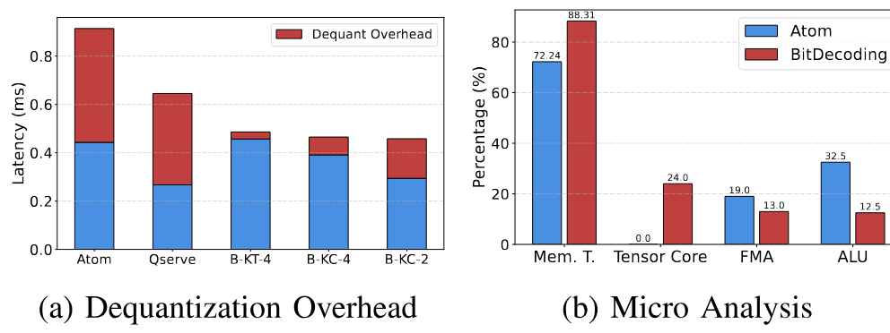

**図 15.** 逆量子化のオーバーヘッド分析。（a）逆量子化のオーバーヘッド。（b）Micro Analysis。

**Multi-warps Cooperative Softmax のオーバーヘッド。** [表 3](#table-03) は、$W_n$ を増やすと Tensor Core の利用率が上がって遅延が減る一方、協調 softmax がなければ正しさが損なわれることを示します。協調 softmax を有効にすると、わずか 0.5% のオーバーヘッドで正しさを回復できます。shared memory access は追加されますが、低ビットデータによってメモリ帯域幅の負荷が減り、kernel が memory-bound から compute-bound へ移るため、オーバーヘッドは小さくなります。

**内訳分析。** BitDecoding の性能向上をさらに分析するため、[図 16](#figure-16) で最適化を分解します。[Ash24] に従い、生成 step ごとに KV キャッシュを量子化・packing する continuous-packing baseline を用います。この baseline は大きなオーバーヘッドをもたらし、有効なレイアウトを保つため手作業も必要です。対照的に、私たちのレイアウト設計は任意の低ビット形式に対して Tensor Core 互換レイアウトを自動的に導出し、Tensor Core の計算能力を十分に引き出します。これに加えて warp 並列化戦略が大きな追加高速化をもたらし、pipeline 最適化が end-to-end 性能をさらに高めます。

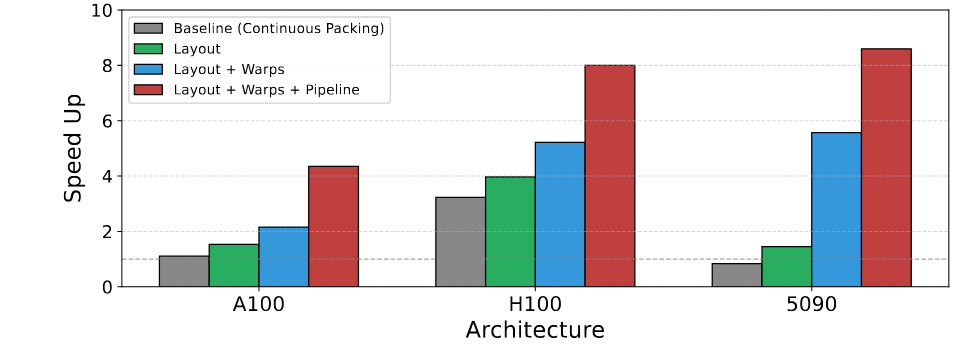

**図 16.** アーキテクチャ世代ごとの BitDecoding 最適化の内訳。

## 7 関連研究

**KV キャッシュ量子化アルゴリズム。** KV キャッシュ量子化は、性能を維持しながら長文コンテキスト LLM のメモリ使用量を削減します。最近の研究は圧縮の限界を押し広げるため、4 ビット、2 ビット、さらには 1 ビットの KV キャッシュ量子化を検討しています。KIVI [Liu24c]、Gear [Kan24]、KVQuant [Hoo24] などの手法は、key-value の outlier を処理するため per-channel 量子化を用い、RotateKV [Su25c] は rotation によって channel-wise 分布を平滑化します。高い圧縮率で効果を発揮するものの、これらの手法には効率的なシステム実装がなく、性能は最適とはいえません。

**混合精度行列乗算。** LLM の低ビット重みと低ビット KV キャッシュには、一方の入力行列が低精度（INT4/2/1 など）、他方が高精度（FP16/8 など）の混合精度行列乗算（mpGEMM）が必要です。Ladder [Wan24e] や Marlin [Fra24] などの最適化 kernel は、レイアウト変換と効率的な逆量子化によって性能を高めます。しかし、これらの手法は重みの事前 packing と事前変換が必要であり、自己回帰デコード時の低ビット KV キャッシュへの適用は限られます。

**低ビット KV キャッシュのシステム実装。** KIVI [Til19] は Triton の独立 kernel を用いて低ビット KV キャッシュを実装します。Atom [Zha24e] は直前の linear layer に量子化を組み込み、QServe [Lin24a] は量子化を FlashAttention kernel へ直接融合します。しかし、どちらも fused multiply-add（FMA）命令による GEMV 演算に依存し、Tensor Core による高速化を利用していません。

## 8 結論

BitDecoding は、原則に基づくシステム設計によって CUDA core と Tensor Core を協調させる方法を示し、効率的な低ビット KV キャッシュデコードに向けた新たなシステム基盤を確立します。レイアウト導出と warp レベルの協調技術は、attention 変種、量子化方式、GPU 世代をまたいで一般化でき、Blackwell やその先の新興アーキテクチャへ自然に拡張できます。BitDecoding が、KV キャッシュ量子化の algorithm-system co-design、ほぼ無損失の test-time scaling、長文コンテキスト LLM 推論に向けたより高機能な GPU 実行モデルに関する今後の研究を可能にすると期待しています。
