> [Hongyu Wang](https://ustcwhy.github.io/) [+author-note]、[Shuming Ma](https://shumingma.com/) [+author-note]、[Furu Wei](https://thegenerality.com/)◇。[GeneralAI](https://aka.ms/GeneralAI)。2024 年 11 月 7 日に arXiv へ初回投稿。現行版は v1。進行中の研究である。[BitNet a4.8: 4-bit Activations for 1-bit LLMs](https://arxiv.org/abs/2411.04965)。<a href="/paper/bitnet-a4-8.pdf" target="_blank" rel="noopener noreferrer">原論文 PDF</a>。[DOI](https://doi.org/10.48550/arXiv.2411.04965)。[TeX ソース](https://export.arxiv.org/e-print/2411.04965v1)。正確な印刷レイアウトと参考文献については、原論文 PDF を正とする。

[+author-note]: Hongyu Wang と Shuming Ma は同等に貢献した。◇ は Furu Wei が責任著者であることを示す。Shuming Ma と Furu Wei は Microsoft Research に所属する。Hongyu Wang は中国科学院大学に所属する。

## 概要

BitNet b1.58 [Ma24] など、1-bit 大規模言語モデル（LLM）に関する最近の研究は、性能を維持しながら LLM の推論コストを削減する有望な方向を示している。本研究では、1-bit LLM で 4-bit 活性化を可能にする **BitNet a4.8** を導入する。BitNet a4.8 は、外れ値チャネルによって生じる量子化誤差を軽減するため、量子化と疎化を組み合わせた戦略を採用する。具体的には、attention 層と feed-forward network 層への入力に 4-bit 活性化を用いる一方、中間状態を疎化してから 8-bit 量子化する。広範な実験により、BitNet a4.8 は同等の学習コストで BitNet b1.58 に匹敵する性能を達成しながら、4-bit（INT4／FP4）カーネルを利用できるため推論が高速になることを示す。さらに、BitNet a4.8 が活性化するパラメータは 55％にすぎず、3-bit KV キャッシュもサポートするため、大規模 LLM の展開と推論の効率が一段と向上する。

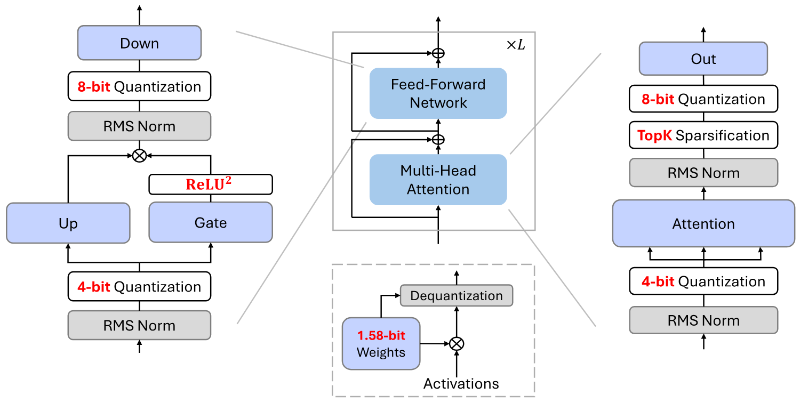

**図 1.** 重みと活性化の両方を量子化する BitNet a4.8 の概要。すべてのパラメータは三値である（すなわち BitNet b1.58 [Ma24] と同じ 1.58-bit）。一部の Transformer サブレイヤーに存在する外れ値活性化へ対処するため、量子化と疎化を組み合わせた戦略を用いる。

## 1 はじめに

最近の研究 [Ma24] は、1-bit LLM が同じパラメータ数と学習トークン数を与えられた全精度モデルに並ぶ一方、レイテンシ、メモリ、スループット、エネルギー消費の面ではるかにコスト効率が高いことを示している。モデルの重みを 1.58-bit（すなわち $\{-1, 0, 1\}$）で表現することにより、推論のボトルネックは限られたメモリ帯域幅から高い計算コストへ移った。LLM の活性化を低ビットまたは疎にすることは、下流タスクの性能を維持しながら計算量をさらに削減する有望な手法となっている。

一般的な手法の一つは、活性化の疎性 [Liu23t, Son24c, Liu24aa] を利用することであり、絶対値の小さい活性化要素を枝刈りして、推論 FLOPs と重みの I/O を削減する。疎化は、極めて不均衡な裾の長い分布を示す活性化の処理に特に適している。最近の研究 [Wan24ag] は、活性化を全面的に疎にした LLM が、活性パラメータを大幅に減らしながら密なモデルに匹敵する結果を達成できることを示している。

疎化に加えて、活性化量子化も行列乗算を高速化する手法の一つである。しかし、学習が進みモデルサイズが拡大するにつれて外れ値次元が現れるため、低ビット活性化を用いるニューラルネットワークの最適化は難しい。これらの外れ値が活性化に占める割合はごくわずかであるにもかかわらず [Det22, Xia23]、絶対値ははるかに大きく、著しい量子化誤差と下流タスクでの性能低下を招く。従来の研究 [Xi23, Ash24, Liu24b, Lin24b] は、主として Hadamard 変換または学習可能な回転変換を用い、外れ値特徴をほかの要素へ分散させる。しかし、それらの多くは、より高い精度（たとえば 4-bit）の LLM 向けに設計されている。1-bit LLM では、重みのビット幅が極端に小さいため、これらの変換行列を重みへ直接吸収することは難しく、オンライン変換として残すと追加の計算オーバーヘッドが生じ、推論性能全体が制限される。

本研究では、1-bit LLM で 4-bit 活性化を可能にする、量子化と疎化を組み合わせた戦略 **BitNet a4.8** を導入する。1-bit LLM の活性化分布を詳細に分析し、その分布パターンに基づいて 4-bit 量子化または疎化を選択的に適用する。具体的には、[図 1](#figure-01) に示すように、BitNet a4.8 は attention と FFN への入力に 4-bit 活性化を用いる一方、中間状態には 8 bit での疎化を用いる。学習効率を向上させるため、BitNet a4.8 は二段階のレシピで活性化を 8-bit から 4-bit へ移行して学習し、学習の終盤に BitNet b1.58 を低ビット活性化へ適応させるために必要な学習トークンはわずかで済む。広範な実験により、BitNet a4.8 は同じ学習コストで BitNet b1.58 に匹敵する性能を達成しながら、推論時の効率が大幅に高いことを示す。さらに、BitNet a4.8 で活性化されるパラメータは 55％にすぎず、3-bit KV キャッシュもサポートするため、LLM の展開効率が一段と向上する。

## 2 BitNet a4.8

### 2.1 アーキテクチャ

[図 1](#figure-01) に示すように、BitNet a4.8 は BitNet b1.58 と同じ構成を採用する。[Wan23, Ma24] に従い、attention と feed-forward network（FFN）の両方で線形射影を BitLinear に置き換え、1.58-bit の重みをゼロから学習する。活性化には、外れ値次元によって生じる誤差を軽減するため、量子化と疎化を組み合わせた戦略を採用する。

[図 2](#figure-02) は、モデルサイズが 7B の BitNet b1.58 モデルにおける各コンポーネントへの入力分布を示す。attention 層と FFN 層への入力は一般に Gaussian に似た分布に従う一方、FFN の down projection の前と attention の output projection の前にある活性化には、より多くの外れ値チャネルと、ゼロ付近に集中する膨大な数の要素が存在する。[Liu24aa] も全精度 LLM について同様の観察を報告している。[図 3](#figure-03) に示すように、これらの中間状態へ低ビット量子化を直接適用すると、大きな量子化誤差が生じる。

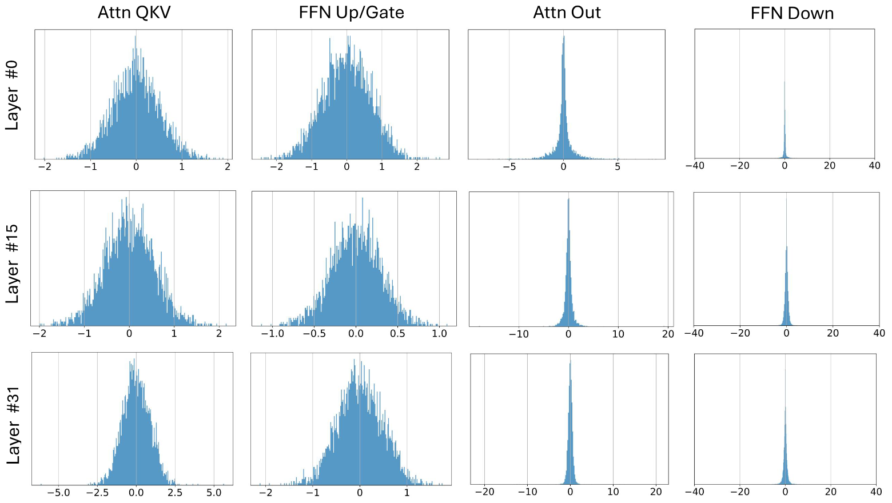

**図 2.** 各射影への入力分布。この可視化は、C4 の検証セットの一部を用い、7B BitNet b1.58 モデルで行った。Gaussian に似た分布を示す層には、4-bit 活性化量子化を用いる。分布が鋭い層には、Q-Sparse [Wan24ag] を採用して活性化を疎化する。

したがって、Q-Sparse [Wan24ag] の疎化手法を用い、これらの中間状態を 8 bit に保ちながら計算のボトルネックを取り除く。self-attention 層の output projection には、疎化してから量子化する関数を用いる。

$$
\mathbf{Y} = \left(\mathrm{Q}_{\mathrm{INT}8}(\mathbf{X}) \odot \mathbf{M}\right) \cdot \mathrm{Q}_{w}(\mathbf{W})^\top, \quad \mathbf{M} = \mathrm{Top}_k\left(|\mathbf{X}|\right)
$$

ここで、$\mathrm{Q}_{w}(\cdot)$ と $\mathrm{Q}_{\mathrm{INT}8}(\cdot)$ は、それぞれ重み $\mathbf{W}$ と活性化 $\mathbf{X}$ の量子化関数を表す。$\mathbf{M}$ は、活性化 $\mathbf{X}$ の絶対値に関して上位 K 個の要素を示すマスクテンソルであり、$\odot$ は要素ごとの乗算演算である。

具体的には、重み量子化関数と活性化量子化関数は次のように定式化できる。

$$
\mathrm{Q}_{w}(\mathbf{W}) = \alpha\mathrm{RoundClip}\left(\frac{\mathbf{W}}{\alpha+\epsilon}, -1, 1\right), \quad \alpha = \mathrm{mean}(|\mathbf{W}|)
$$

$$
\mathrm{Q}_{\mathrm{INT}8}(\mathbf{X}) = \frac{\gamma}{127}\mathrm{RoundClip}\left(\frac{127}{\gamma+\epsilon}\mathbf{X}, -128, 127\right), \quad \gamma = \max(|\mathbf{X}|)
$$

$$
\mathrm{RoundClip}(X, a, b) = \min\left(\max(\mathrm{round}(X), a), b\right)
$$

FFN には、活性化の疎性をさらに高めるため、squared ReLU [So21, Wan24ag] と gated linear unit（GLU）を採用する。これは次のように定義される。

$$
\mathrm{ReLU}^2\mathrm{GLU}(\mathbf{X}) = \mathbf{X}\mathbf{W}_{\mathrm{up}}^\top \odot \mathrm{ReLU}^2\left(\mathbf{X}\mathbf{W}_{\mathrm{gate}}^\top\right)
$$

予備実験によれば、squared ReLU を用いると、down projection への入力は性能への影響を最小限に抑えながら 80％を超える疎性を達成する。さらに、gate projection の出力 $\mathrm{ReLU}^2(\mathbf{X}\mathbf{W}_{\mathrm{gate}}^\top)$ も高い活性化の疎性を示すことを観察した（たとえば 7B モデルで 67.5％）。この特性により、まず gate projection を計算し、次に gate の非ゼロチャネルだけに up projection を実行することで、up projection の推論 FLOPs をさらに削減できる。

attention と FFN への入力は外れ値特徴がはるかに少ないため、absmean 関数を用いて活性化を 4-bit 整数へ量子化する。

$$
\mathbf{Y} = \mathrm{Q}_{\mathrm{INT}4}(\mathbf{X}) \cdot \mathrm{Q}_{w}(\mathbf{W})^\top
$$

$$
\mathrm{Q}_{\mathrm{INT}4}(\mathbf{X}) = \frac{\beta}{\sqrt{7}}\mathrm{RoundClip}\left(\frac{\sqrt{7}}{\beta+\epsilon}\mathbf{X}, -8, 7\right), \quad \beta = \mathrm{mean}(|\mathbf{X}|)
$$

### 2.2 学習

**BitNet b1.58 からの継続学習。** BitNet a4.8 は、二段階のレシピにより W1.58A8 から W1.58A4 へ移行して学習する。第一段階では、8-bit 活性化と $\mathrm{ReLU}^2\mathrm{GLU}$ を用いてモデルを学習する。第二段階では、[第 2.1 節](#section-2-1) に示す量子化と疎化を組み合わせた手法を採用する。BitNet a4.8 は、性能をほとんど損なわず、わずかな学習トークンだけで 4-bit 活性化と疎な活性化へ速やかに適応する。

**勾配近似。** [Wan23, Wan24ag] に従い、BitNet a4.8 の勾配近似には straight-through estimator（STE）[Ben13] を用い、パラメータの更新には混合精度学習を用いる。逆伝播では、量子化関数や top-K 疎化関数などの微分不可能な関数をそのまま通過させる。混合精度学習では、パラメータ更新を蓄積するため、全精度の潜在重みを保持する。順伝播では、この潜在重みをその場で 1.58-bit へ量子化する。

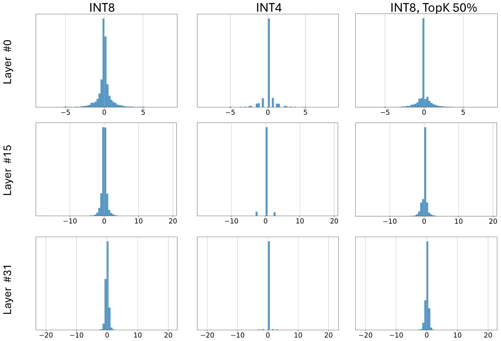

**図 3.** 量子化と疎化の方法を変えたときの、attention の output projection への入力分布。この可視化は、C4 の検証セットの一部を用い、7B BitNet b1.58 モデルで行った。

### 2.3 浮動小数量子化

浮動小数量子化は整数ベースの量子化より広いダイナミックレンジを持ち、活性化の裾の長い分布を扱ううえで不可欠である。浮動小数点精度を用いる場合、FFN の down projection への入力だけを 8-bit 整数のまま残し、MinMax 量子化器 [Liu23c] を用いてほかの活性化を FP4 へ量子化する。これは次のように定義される。

$$
\mathrm{Q}_{\mathrm{FP}4}(\mathbf{X}) = \frac{\gamma}{2^{M+b}}\mathrm{Round}\left(\frac{2^{M+b}}{\gamma}\mathbf{X}\right), \quad \gamma = 2^{\max\left(\left\lfloor\left\lfloor\log_2|\mathbf{X}|\right\rfloor+b\right\rfloor,1\right)}
$$

$$
b = \log_2\left(\frac{2-2^{-M}}{|\mathbf{X}|_{\max}}\right) + 2^E - 1
$$

ここで、$E$ と $M$ は、それぞれ指数部と仮数部のビット幅を表す。ダイナミックレンジが広いため、E2M1 形式を採用する。[表 1](#table-01) に示すように、FP4 量子化を用いる BitNet a4.8 は、整数ベースの量子化と疎化を組み合わせた戦略を用いる場合と同等の性能を示す。

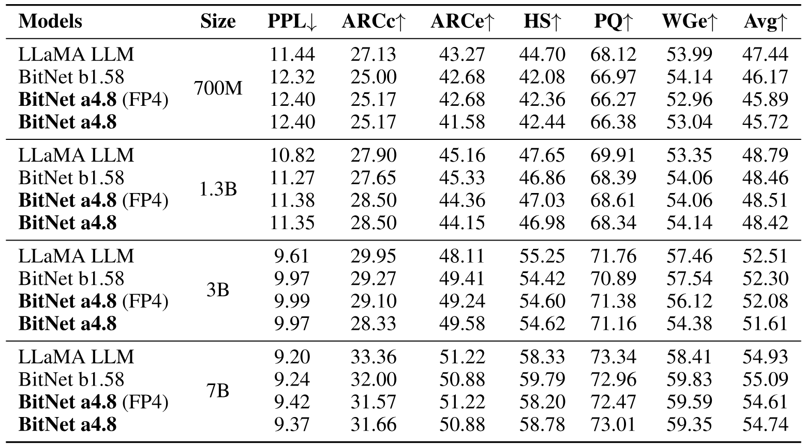

**表 1.** 最終タスクにおける BitNet a4.8、BitNet b1.58、LLaMA LLM の perplexity と結果。平均スコアの誤差の標準分散は 1.06％である。

## 3 実験

さまざまなサイズの BitNet a4.8 を、BitNet b1.58 および再現した FP16 LLaMA LLM と比較した。1.58-bit モデルには、BitNet b1.58 [Ma24] の学習レシピに従って、二段階の weight decay と学習率スケジュールを採用した。詳細は[第 5 節](#section-5)に示す。公平に比較するため、すべてのモデルを RedPajama データセット [Tog23a] の 1000 億トークンで学習した。BitNet a4.8 は、まず 950 億トークンにわたって 8-bit 活性化でモデルを学習した。次に optimizer の状態を再利用し、提案する量子化と疎化の組み合わせを用いて、さらに 50 億トークンの継続学習を行った。attention の output projection では topK を 50％に設定した。

*lm-evaluation-harness* ツールキット [Gao24h] を用い、ARC-Easy（ARCe）[Yad19]、ARC-Challenge（ARCc）[Yad19]、Hellaswag（HS）[Zel19]、Winogrande（WGe）[Sak20]、PIQA（PQ）[Bis20] を含む一連の言語タスクで、これらのモデルのゼロショット精度を評価した。C4 データセット [Raf19] の検証セットにおける perplexity も報告した。

### 3.1 主な結果

[表 1](#table-01) は BitNet a4.8、BitNet b1.58、FP16 LLaMA LLM の詳細な結果をまとめている。全精度（すなわち FP16）LLaMA LLM と BitNet b1.58 の性能差は、モデルサイズが大きくなるにつれて縮小する。7B モデルでは、BitNet b1.58 は言語モデルの perplexity と最終タスクの平均精度の両方で LLaMA LLM に並ぶ。さらに、BitNet a4.8 は平均精度をほとんど損なわず、BitNet b1.58 に匹敵する性能を達成する。

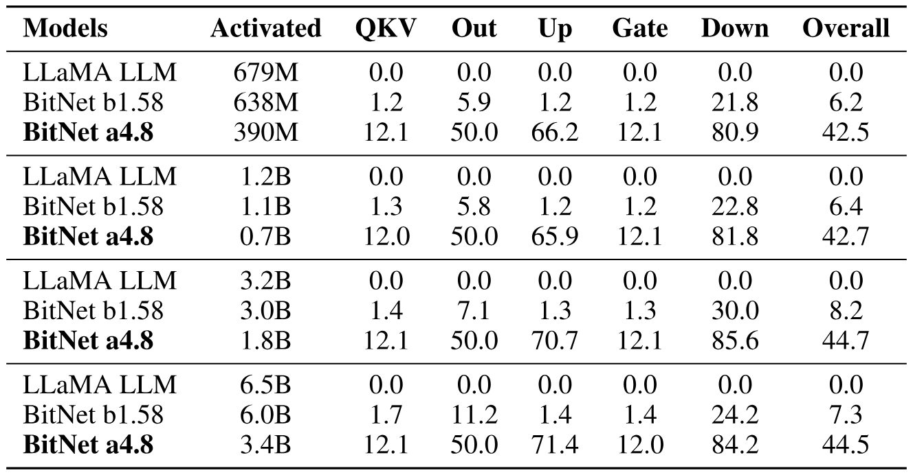

**表 2.** C4 の検証セットにおける BitNet a4.8、BitNet b1.58、LLaMA LLM の詳細な疎性。

**疎性。** [表 2](#table-02) は、さまざまなサイズの BitNet a4.8、BitNet b1.58、FP16 LLaMA LLM について、各コンポーネントの詳細な疎性を示す。疎性は、C4 の検証セットで embedding 以外のパラメータを用いて計算した。特に、BitNet a4.8 は BitNet b1.58 と LLaMA LLM の両方より著しく高い疎性を達成する。たとえば 7B モデルでは、BitNet a4.8 は全体で 44.5％の疎性に達し、活性パラメータはわずか 3.4B である。down projection への入力は特に高い疎性を示し、中間状態の分布がゼロ付近へ鋭く集中するという観察と一致する。さらに、gate projection の出力も極めて疎であることを観察した。gate から選ばれた非ゼロチャネルだけに射影を実行すればよいため、これにより up projection の疎性が高くなる。具体的には、7B BitNet a4.8 で gate と up projection への入力の疎性は、それぞれ 67.5％と 12.0％である。したがって、up projection の疎性は $1 - (1 - 12.0\%)\times(1 - 67.5\%)$、すなわち 71.4％と推定できる。

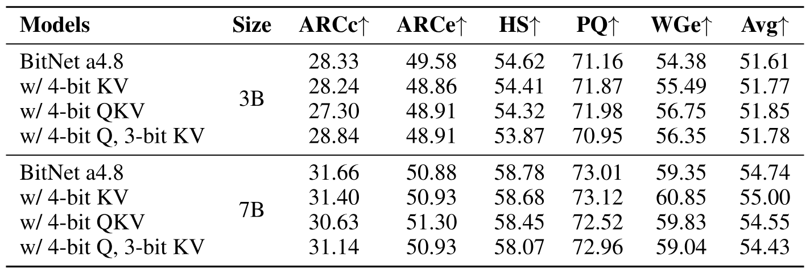

**表 3.** 最終タスクにおける、QKV 状態のビット幅を変えた BitNet a4.8 の詳細な結果。すべてのモデルのゼロショット精度を報告した。

**低ビット attention。** [表 3](#table-03) は、3B と 7B の BitNet a4.8 に低ビット attention を用いた場合の詳細な結果を示した。低ビット attention は、KV キャッシュのメモリフットプリントと I/O を削減し、attention の計算を高速化するため、長い系列の効率的なモデリングに不可欠である。実験では、RoPE 後の量子化を採用した。QKV head は、較正データセットを一切必要とせず、absmax 関数を用いて符号なし整数へ直接量子化した。3-bit KV 量子化では、より多くの外れ値特徴を含むため、bos トークンの head を 4-bit のまま保持する。[表 3](#table-03) に示すように、BitNet a4.8 は、3B および 7B モデルで 4-bit KV または QKV head を用いても精度低下を無視できる程度に抑える。さらに、BitNet a4.8 の KV キャッシュは 3-bit 整数へ量子化でき、平均精度はほとんど低下しない。

### 3.2 アブレーション研究

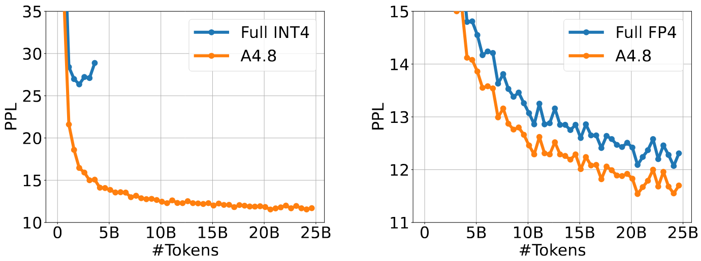

**図 4.** 量子化と疎化を組み合わせた手法に関するアブレーション研究。

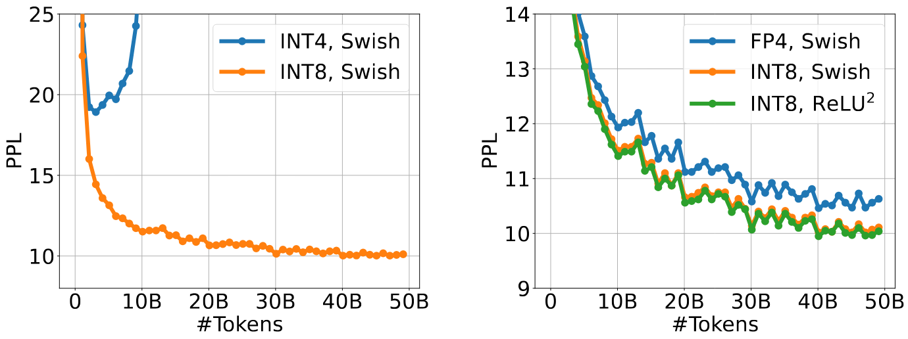

**図 5.** FFN の down projection への入力に用いる量子化または活性化関数を変えたアブレーション研究。

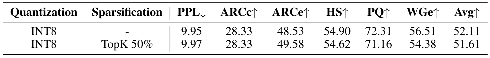

**表 4.** attention の output projection への入力に対する TopK 疎化のアブレーション。

**ハイブリッドアーキテクチャ。** [図 4](#figure-04) は、全面的な INT4／FP4 量子化と、量子化と疎化の組み合わせを用いた 700M BitNet a4.8 の学習損失曲線を示した。これらのモデルは、RedPajama データセットの 250 億トークンを用い、第一段階のスケジュールで学習した。全面的な INT4 量子化と FP4 量子化には、それぞれ absmean 量子化器と MinMax 量子化器を採用する。さらに、全面的な INT4 量子化では、FFN の down projection への入力にはより大きな外れ値があるため、$\beta = 2\mathrm{mean}(|X|)$ とする absmean 量子化器を用いる。[図 4](#figure-04) に示すように、全面的な INT4 量子化は発散を招く。さらに、ハイブリッドアーキテクチャは学習時の perplexity の点で全面的な FP4 アーキテクチャを大幅に上回る。

**FFN の down projection。** FFN の down projection に用いる量子化または活性化関数を変え、1.3B BitNet a4.8 を比較した。すべてのモデルを、RedPajama データセットの 500 億トークンを用い、第一段階のスケジュールで学習した。公平に比較するため、ほかの活性化は 8-bit のままとした。INT8 量子化には absmax 量子化器を、FP4 量子化には MinMax 量子化器を採用する。absmean 量子化器の $\beta$ は $2\mathrm{mean}(|X|)$ に設定した。[図 5](#figure-05) に、これらのモデルの学習損失曲線を示す。squared ReLU は、より高い疎性を実現しながら、Swish よりわずかに良い学習時の perplexity を達成する。さらに、down projection への入力に FP4 量子化を適用すると性能が著しく低下し、STE を用いる INT4 活性化では発散が生じる。

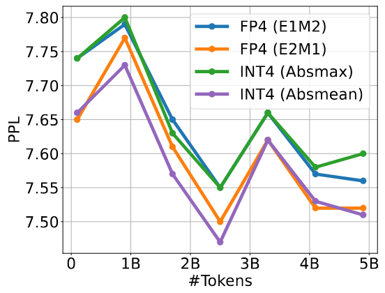

**図 6.** attention と FFN への入力に用いる 4-bit 量子化器のアブレーション。

**attention の output projection。** [表 4](#table-04) は、attention の output projection への入力に Top-K 疎化を用いる場合と用いない場合について、3B BitNet a4.8 の詳細な結果を示す。両モデルは、同じ二段階のレシピにより 8-bit 活性化から 4-bit 活性化へ移行して学習した。疎化の $K$ は 50％に設定した。ベースラインでは、output projection への入力に INT8 absmax 量子化器を用いた。結果は、TopK 疎化による perplexity と精度の低下が無視できる程度であることを示す。

**4-bit 量子化。** attention と FFN への入力に異なる 4-bit 量子化器を用いた 3B BitNet a4.8 の損失曲線を示した。MinMax 量子化器を用いる E2M1 形式および E1M2 形式の浮動小数量子化と、absmax 量子化器および absmean 量子化器を用いる整数量子化について、BitNet a4.8 の性能を比較した。[図 6](#figure-06) に示すように、E2M1 形式の FP4 と absmean 量子化器を用いる INT4 は、絶対値の小さい活性化要素の処理に適しているため、学習時の perplexity がわずかに良い。

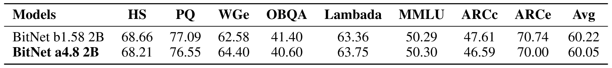

**表 5.** 2B パラメータ、2T 学習トークンの BitNet a4.8 と BitNet b1.58 の結果。

### 3.3 より多くの学習トークン

先行研究 [Det22] は、学習トークン数と、言語モデルにおける活性化の外れ値の出現頻度との間に正の相関があることを示している。BitNet a4.8 のスケーラビリティ特性を厳密に評価するため、20 億パラメータを 2 兆トークンで学習するモデル構成を用いて広範な実験を行った。同一の学習データと構成を用いて、BitNet b1.58 との統制比較を行った。[表 5](#table-05) に示す実験結果は、BitNet a4.8 が 4-bit 活性化圧縮を実現しながら、精度指標の低下を無視できる程度に抑え、同等の性能を維持することを示している。これらの知見は、提案手法が大規模環境でも有効であることを強く裏付ける。

## 4 結論

本論文では、1-bit LLM で 4-bit 活性化を可能にする BitNet a4.8 を提示する。BitNet a4.8 は、活性化の外れ値チャネルによって生じる量子化誤差を削減するため、量子化と疎化を組み合わせた新しいアーキテクチャを用いる。具体的には、attention 層と FFN 層への入力に 4-bit 量子化を用いる一方、中間状態は 8-bit 整数で疎化する。BitNet a4.8 は、W1.58A8 から W1.58A4 へ継続学習する。実験結果は、BitNet a4.8 が同じ学習コストで BitNet b1.58 に匹敵する結果を達成しながら、推論効率を大幅に向上させることを示している。

## 謝辞

推論効率に関する議論について、Lei Wang に感謝する。

## 5 ハイパーパラメータ

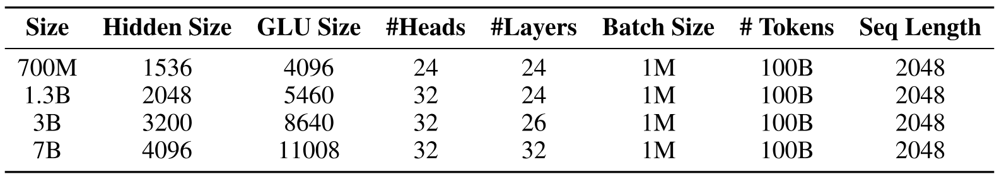

**表 6.** BitNet a4.8、BitNet b1.58、LLaMA LLM のモデル構成。

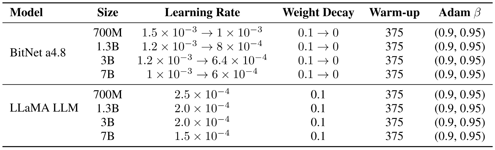

**表 7.** BitNet a4.8 と LLaMA LLM の学習ハイパーパラメータ。
