> [Hongyu Wang](https://ustcwhy.github.io/) [+author-note]、[Shuming Ma](https://shumingma.com/) [+author-note]、[Li Dong](https://dong.li/)、[Shaohan Huang](https://buaahsh.github.io/)、[Huaijie Wang](https://dblp.dagstuhl.de/pid/346/1061.html)、[Lingxiao Ma](https://xysmlx.github.io/)、[Fan Yang](https://fanyangcs.github.io/)、[Ruiping Wang](https://www.jdl.link/user/rpwang/index.htm)、[Yi Wu](https://jxwuyi.weebly.com/)、[Furu Wei](https://www.microsoft.com/en-us/research/people/fuwei/) [+author-note]。2023 年 10 月 17 日に arXiv へ初回投稿。現行版は v1 であり、作業中の論文である。[BitNet: Scaling 1-bit Transformers for Large Language Models](https://arxiv.org/abs/2310.11453)。<a href="/paper/bitnet.pdf" target="_blank" rel="noopener noreferrer">原論文 PDF</a>。[DOI](https://doi.org/10.48550/arXiv.2310.11453)。[TeX ソース](https://export.arxiv.org/e-print/2310.11453v1)。厳密な印刷レイアウトと参考文献については原論文 PDF を正とする。

[+author-note]: Hongyu Wang と Shuming Ma は同等に貢献した。Furu Wei は責任著者である。Hongyu Wang、Shuming Ma、Li Dong、Shaohan Huang、Lingxiao Ma、Fan Yang、Furu Wei は Microsoft Research に所属する。Hongyu Wang と Ruiping Wang は中国科学院大学に所属する。Huaijie Wang と Yi Wu は清華大学に所属する。[GeneralAI](https://aka.ms/GeneralAI)。

## 概要

大規模言語モデルの規模拡大は、導入上の課題を生み、高いエネルギー消費による環境への影響について懸念を引き起こしている。本研究では、大規模言語モデル向けに設計した、スケーラブルで安定した 1-bit Transformer アーキテクチャ BitNet を提案する。具体的には、1-bit 重みをゼロから学習するため、`nn.Linear` 層をそのまま置き換えられる `BitLinear` を導入する。言語モデリング実験の結果、BitNet は最先端の 8-bit 量子化手法および FP16 Transformer ベースラインと比べ、メモリ使用量とエネルギー消費を大幅に削減しながら、競争力のある性能を達成した。さらに、BitNet は全精度 Transformer に似たスケーリング則を示し、効率と性能の利点を保ったまま、さらに大規模な言語モデルへ効果的に拡張できる可能性を示している。

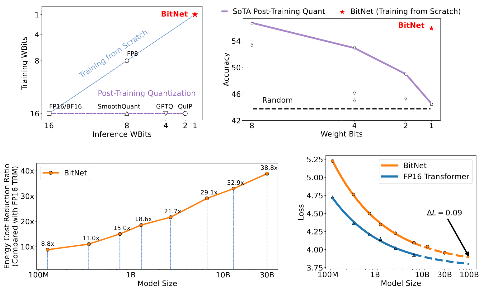

**図 1.** BitNet は 1-bit Transformer をゼロから学習し、エネルギー効率の高い方法で競争力のある結果を得る。BitNet は最先端の量子化手法を大幅に上回る。モデル規模が大きくなるにつれ、FP16 で学習したモデルに匹敵する性能を達成しながら、コスト削減効果はさらに大きくなる。

> 人間の知能に固有のものがあるとは思わない。知覚や感情を形作る脳内のすべてのニューロンは、二値的に動作している。
>
> — William Henry Gates III

## 1 はじめに

大規模言語モデル [Bro20, Ope23, Cho22, Ani23, Tou23, Tou23a] の急速な発展により、さまざまなタスクの性能が大幅に向上した。しかし、推論コストとエネルギー消費が高いため、大規模言語モデルの運用には多額の費用がかかる。モデル規模が大きくなるにつれ、モデルパラメータへのアクセスと処理に必要なメモリ帯域幅が主要なボトルネックとなり、推論性能全体を制限する。さらに、分散システムや複数デバイスのプラットフォームへモデルを配置する場合、デバイス間通信のオーバーヘッドが推論レイテンシとエネルギー消費に大きく影響する。モデル量子化 [Fra23, Che24b, Xia23] は、大規模モデルの競争力ある性能を維持しながら、メモリ使用量と計算コストを大幅に削減できる有望な解決策として注目されている。

既存の大規模言語モデル量子化手法の大半は、学習後量子化である。学習パイプラインの変更やモデルの再学習が不要なため、単純で適用しやすい。しかし、学習中に量子化表現へ最適化されていないため、精度を下げるほど正解率の低下が大きくなる。

深層ニューラルネットワークを量子化するもう一つの流れは、量子化認識学習である。モデルが学習開始時から低精度を考慮するため、学習後量子化より高い精度が得られることが多い。さらに、継続学習やファインチューニングが可能であり、これは大規模言語モデルに不可欠である。量子化認識学習の主な課題は最適化にあり、精度が低いほどモデルは収束しにくくなる。また、量子化認識学習がニューラル言語モデルのスケーリング則に従うかどうかは不明である。

本研究では、量子化の極端な場合である二値化（すなわち 1-bit）を大規模言語モデルへ適用する。二値ニューラルネットワーク [Ras16, Bul19a] に関する従来研究の多くは、畳み込みニューラルネットワークを対象としてきた。近年、二値 Transformer に関する研究も行われている。しかし、これらは機械翻訳または BERT の事前学習を対象としており、大規模言語モデルとは大きく異なる。たとえば、機械翻訳はエンコーダ・デコーダ型アーキテクチャ、BERT の事前学習は双方向エンコーダ、大規模言語モデルは単方向デコーダを用いる。さらに、大規模言語モデルは通常、BERT や機械翻訳モデルよりはるかに大きな規模まで拡張される。

我々の知る限り、本研究は 1-bit 大規模言語モデルの量子化認識学習を初めて調査するものである。我々は、メモリと計算の両面で効率よく拡張することを目指した、大規模言語モデル向け 1-bit Transformer アーキテクチャ BitNet を提案する。BitNet は低精度の二値重みと量子化された活性値を用いる一方、学習中のオプティマイザ状態と勾配には高精度を維持する。本手法はスケーラビリティと安定性を備え、大規模言語モデルを効率よく処理できるよう設計されている。BitNet アーキテクチャの実装は単純であり、Transformer 内の線形射影（PyTorch の *nn.Linear*）を置き換えるだけでよい。さらに、PagedAttention [Kwo23]、FlashAttention [Dao22, Dao24a]、投機的デコーディング [Lev23] など、大規模言語モデル向けの他の高速化手法と併用できる。

我々は複数の言語モデリングベンチマークで BitNet を評価し、最先端の量子化手法および FP16 Transformer と比較する。実験結果から、BitNet はパープレキシティと下流タスクの正解率の両方で競争力のある性能を達成することが分かった。さらに重要な点として、BitNet はベースラインよりメモリ使用量とエネルギー消費を大幅に削減する。加えて、BitNet は全精度 Transformer に似たスケーリング則に従い、性能と効率の利点を得ながら、さらに大きな言語モデルへ効果的に拡張できることを示す。

## 2 BitNet

[図 2](#figure-02) に示すように、BitNet は Transformer と同じ構成を用い、自己注意とフィードフォワードネットワークのブロックを積み重ねる。通常の Transformer と異なり、BitNet は二値化された（すなわち 1-bit）モデル重みを用いる `BitLinear`（[式 11](#equation-11)）で通常の行列乗算を置き換える。その他の構成要素は高精度のままにし、本実験では 8-bit とする。理由は次のとおりである。第一に、残差接続と層正規化が大規模言語モデルの計算コストに占める割合は無視できる。第二に、モデルが大きくなるほど、QKV 変換の計算コストはパラメトリック射影よりはるかに小さくなる。第三に、言語モデルはサンプリングに高精度の確率を用いる必要があるため、入出力埋め込みの精度を維持する。

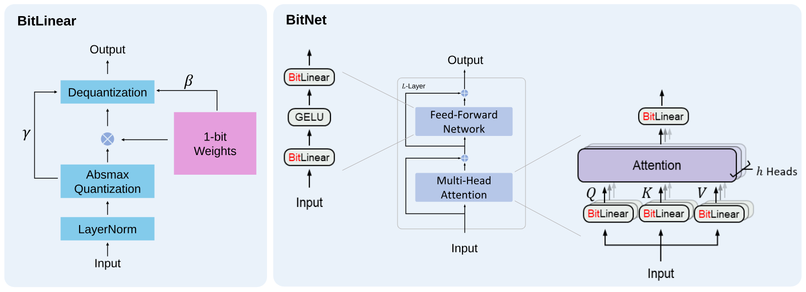

**図 2.** （a）`BitLinear` の計算フロー。（b）注意機構と FFN のスタックから成り、行列乗算を `BitLinear` で実装した BitNet のアーキテクチャ。

### 2.1 BitLinear

まず、符号関数を用いて重みを $+1$ または $-1$ に二値化する。[Liu22] に従い、限られた数値範囲内の容量を増やすため、二値化の前に重みを中心化して平均をゼロにする。二値化後にスケーリング係数 $\beta$ を用い、実数値重みと二値化重みの間の $l2$ 誤差を減らす。重み $W \in \mathcal{R}^{n \times m}$ の二値化は次のように定式化できる。

$$
\widetilde{W} = \mathrm{Sign}(W - \alpha),
$$

$$
\mathrm{Sign}(W_{ij}) = \left\{
\begin{aligned}
&+1, \quad &&\text{if } W_{ij} > 0, \\
&-1, \quad &&\text{if } W_{ij} \leq 0,
\end{aligned}
\right.
$$

$$
\alpha = \frac{1}{nm}\sum_{ij} W_{ij}
$$

さらに、活性値を $b$-bit 精度へ量子化する。[Det22] に従い、absmax 量子化を用いる。これは、活性値に $Q_b$ を乗じ、入力行列の絶対値の最大値で除算することで、$[-Q_b, Q_b]$（$Q_b=2^{b-1}$）の範囲へスケーリングする。

$$
\widetilde{x} = \mathrm{Quant}(x) = \mathrm{Clip}\left(x \times \frac{Q_b}{\gamma}, -Q_b+\epsilon, Q_b-\epsilon\right),
$$

$$
\mathrm{Clip}(x, a, b) = \max(a, \min(b, x)), \quad \gamma = \|x\|_{\infty},
$$

ここで $\epsilon$ は、クリッピング時のオーバーフローを防ぐ小さな浮動小数点数である。

非線形関数（ReLU など）の前にある活性値については、入力の最小値を減じてすべての値を非負にし、$[0, Q_b]$ の範囲へスケーリングする。

$$
\widetilde{x} = \mathrm{Quant}(x) = \mathrm{Clip}\left((x-\eta) \times \frac{Q_b}{\gamma}, \epsilon, Q_b-\epsilon\right), \quad \eta = \min_{ij} x_{ij}.
$$

本研究では活性値を 8-bit に量子化し、より低い精度は今後の課題とする。また、安定性と効率を両立するため、学習時にはテンソル単位、推論時にはトークン単位で量子化する。

上記の量子化式を用いると、行列乗算は次のように書ける。

$$
y = \widetilde{W} \widetilde{x}
$$

$W$ と $x$ の各要素は相互に独立で同じ分布に従い、さらに $W$ と $x$ も互いに独立であると仮定する。このとき、出力 $y$ の分散は次のように推定される。

$$
\mathrm{Var}(y) = n \mathrm{Var}(\widetilde{w} \widetilde{x})
$$

$$
=n E[\widetilde{w}^2] E[\widetilde{x}^2]
$$

$$
=n \beta^2 E[\widetilde{x}^2] \approx E[\widetilde{x}^2]
$$

標準的な初期化手法（Kaiming 初期化や Xavier 初期化など）を用いると、全精度計算における出力分散 $\mathrm{Var}(y)$ のオーダーは $1$ となり、学習の安定性に大きく寄与する。量子化後も分散を保つため、活性値の量子化前に LayerNorm [Ba16] を導入する。これにより、出力 $y$ の分散は $\mathrm{Var}(y) \approx E[\mathrm{LN}(\widetilde{x})^2] = 1$ と推定され、全精度版の $\mathrm{Var}(y)$ と同じ大きさになる。Transformer では、これは `SubLN` [Wan22l] とまったく同じ実装である。`SubLN` と上記の量子化手法から得られる `BitLinear` は、次のように定式化される。

$$
y = \widetilde{W} \widetilde{x} = \widetilde{W}\,\mathrm{Quant}(\mathrm{LN}(x)) \times \frac{\beta\gamma}{Q_b}
$$

$$
\mathrm{LN}(x) = \frac{x-E(x)}{\sqrt{\mathrm{Var}(x)+\epsilon}}, \quad \beta = \frac{1}{nm}\|W\|_1
$$

[図 2](#figure-02) は `BitLinear` の計算フローを示す。SubLN 演算の後、absmax 関数で活性値を量子化する。1-bit 重みと量子化された活性値の間で行列乗算を行う。出力活性値を $\{\beta, \gamma\}$ で再スケーリングし、元の精度へ逆量子化する。

**グループ量子化と正規化を用いたモデル並列。** 大規模言語モデルを拡張するうえで重要な技術の一つがモデル並列 [Sho19] であり、行列乗算を複数のデバイスへ分割する。既存のモデル並列手法では、分割次元に沿ってテンソルが独立していることが前提となる。しかし、パラメータ $\alpha$、$\beta$、$\gamma$、$\eta$ はいずれもテンソル全体から計算されるため、この独立性の前提が崩れる。一つの解決策は、各パラメータに一回の *all-reduce* 演算を導入することである。しかし、各パラメータの通信量が小さくても、モデルが深くなるほど同期回数が増え、順伝播が大幅に遅くなる。この問題は `SubLN` にもあり、平均と分散を分割次元全体で推定する必要がある。

そこで、モデル並列をより効率よくする単純な手法を提案する。重みと活性値をグループへ分割し、各グループのパラメータを独立に推定する。これにより、追加通信を行わずパラメータをローカルに計算できる。このグループ量子化と呼ぶ手法は、次のように定式化される。

重み行列 $W \in \mathcal{R}^{n \times m}$ を分割次元に沿って $G$ グループへ分け、各グループのサイズを $\frac{n}{G} \times m$ とする。その後、各グループのパラメータを独立に推定する。

$$
\alpha_g = \frac{G}{nm}\sum_{ij} W_{ij}^{(g)}, \quad \beta_g = \frac{G}{nm}\|W^{(g)}\|_1,
$$

ここで $W^{(g)}$ は重み行列の第 $g$ グループを表す。同様に、活性値についても入力行列 $x \in \mathcal{R}^{n \times m}$ を $G$ グループへ分割し、各グループのパラメータを計算できる。

$$
\gamma_g = \|x^{(g)}\|_{\infty}, \quad \eta_g = \min_{ij} x_{ij}^{(g)}
$$

LN にはグループ正規化 [Wu20a] を適用し、各グループの平均と分散を独立に計算できる。

$$
\mathrm{LN}(x^{(g)}) = \frac{x^{(g)}-E(x^{(g)})}{\sqrt{\mathrm{Var}(x^{(g)})+\epsilon}}
$$

このように、追加通信を必要とせず、大規模言語モデルへ拡張可能なモデル並列を、グループ量子化と正規化によって効率よく実装できる。

### 2.2 モデル学習

**Straight-through estimator。** 1-bit モデルを学習するため、straight-through estimator（STE）[Ben13] を用いて逆伝播時の勾配を近似する。この手法は、逆伝播時に Sign（[式 2](#equation-02)）や Clip（[式 5](#equation-05)）などの微分不可能な関数を迂回する。STE により、これらの微分不可能な関数の影響を受けずに勾配がネットワークを流れ、量子化モデルを学習できる。

**混合精度学習。** 重みと活性値は低精度へ量子化する一方、学習の安定性と精度を確保するため、勾配とオプティマイザ状態は高精度で保存する。先行研究 [Liu21f] に従い、学習可能なパラメータについて、パラメータ更新を蓄積する高精度形式の潜在重みを維持する。潜在重みは順伝播時にその場で二値化され、推論処理では使用されない。

**大きな学習率。** 最適化上の課題の一つは、潜在重みへの小さな更新では 1-bit 重みが変わらない場合が多いことである。そのため、1-bit 重みに基づいて推定される勾配と更新にはバイアスが生じる。モデルができるだけ速く収束すべき学習初期には、この問題がさらに悪化する。この課題に対してさまざまな手法を検討し、学習率を上げることが最適化を加速する最も単純で優れた方法だと結論づけた。実験では、大きな学習率が BitNet の収束に有効である一方、FP16 Transformer は同じ学習率を用いると学習初期に発散した。詳細は[第 3 節](#section-3)に示す。

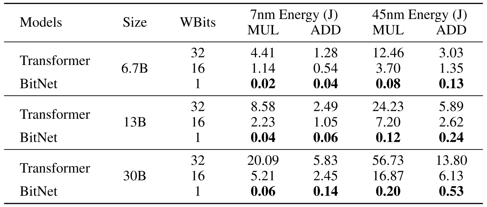

**表 1.** モデル規模を変えた場合の BitNet と Transformer のエネルギー消費。入力長 512 で結果を報告する。

### 2.3 計算効率

算術演算のエネルギーとメモリ使用量の両面から、BitNet の計算効率を推定する。大規模言語モデルのコストの大半を占めるため、主に行列乗算の計算を扱う。

**算術演算のエネルギー。** [Hor14, Zha22g] のエネルギーモデルに基づき、異なる算術演算のエネルギー消費を次のように推定できる。

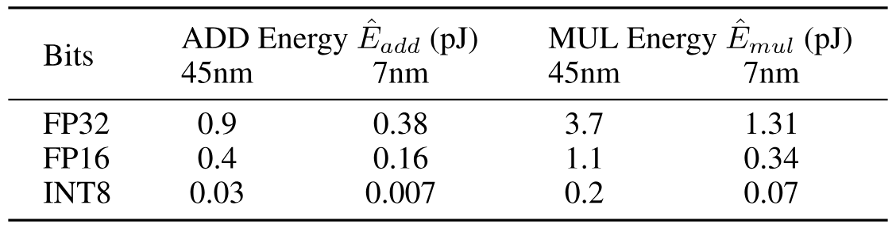

**表 2.** 45nm および 7nm プロセスノードにおける、異なる bit 表現の ADD と MUL のエネルギー消費 [Hor14, Zha22g]。

通常の Transformer では、次元が $m \times n$ と $n \times p$ の行列を乗算する場合、エネルギー消費は次のように計算できる。

$$
E_{\mathrm{add}} = m \times (n-1) \times p \times \hat{E}_{\mathrm{add}}
$$

$$
E_{\mathrm{mul}} = m \times n \times p \times \hat{E}_{\mathrm{mul}}
$$

BitNet では重みが 1-bit であるため、行列乗算のエネルギー消費は加算演算が支配的である。乗算演算は、スカラー $\beta$ と $\frac{\gamma}{Q_b}$ で出力をスケーリングする場合にのみ使われるため、乗算のエネルギー消費は次のように計算できる。

$$
E_{\mathrm{mul}} = (m \times p + m \times n) \times \hat{E}_{\mathrm{mul}}
$$

これは Transformer より大幅に小さい。全精度（32-32）および半精度（16-16）の Transformer と比べた W1A8 BitNet のエネルギー削減量を[表 1](#table-01)に示す。BitNet はエネルギー消費を大幅に削減しており、特に行列乗算のエネルギー消費の主要部分である乗算演算において効果が大きい。

## 3 FP16 Transformer との比較

### 3.1 設定

125M から 30B まで、さまざまな規模の BitNet 自己回帰言語モデルを学習する。モデルは、Pile データセット、Common Crawl スナップショット、RealNews、CC-Stories データセットから成る英語コーパスで学習する。データの前処理には Sentencpiece tokenizer を用い、語彙サイズは 16K とする。公平に比較するため、BitNet に加えて、同じデータセットと設定で Transformer ベースラインも学習する。詳細は付録に示す。

### 3.2 推論最適スケーリング則

通常の Transformer アーキテクチャを用いるニューラル言語モデルは、予測可能な形でスケールすることが示されている [Kap20]。損失は学習に使用した計算量に対してべき乗則でスケールする。これにより、計算予算の最適な配分を決定し、小規模モデルから大規模言語モデルの性能を予測できる。

二値 Transformer のスケーリング則を調べるため、BitNet と FP16 Transformer ベースラインのスケーリング曲線をパラメータ数に対して描く。学習トークン数を固定し、モデル規模を変化させる。[図 3](#figure-03) に示すように、BitNet の損失スケーリングは FP16 Transformer と似ており、べき乗則に従う。続いて、既約損失項を含むスケーリング則を当てはめる。

$$
L(N)=aN^b+c
$$

このスケーリング則が損失を正確に予測できるか評価するため、125M から 6.7B までのモデルでべき乗則のパラメータを当てはめ、その法則から 13B と 30B の損失を予測する。当てはめたスケーリング則は BitNet の損失を高精度に予測した。また、モデル規模が大きくなるほど、BitNet と FP16 Transformer の差は小さくなる。

上記のべき乗則は BitNet のスケーリング傾向を測るが、損失と実際の計算量の関係を適切にはモデル化しない。先行研究 [Kap20, Hen20a, Hof22] は FLOPs の計算によって計算量を推定している。しかし、コストが整数演算に支配される 1-bit モデルには適用できない。さらに、これは主に学習時の計算を測るものであり、推論時の計算ではない。ニューラル言語モデルのスケーリング効率をさらに理解するため、推論最適スケーリング則を導入する。これは、エネルギー消費に対する損失を予測する。学習コストは一度だけ発生する一方、推論時のエネルギーコストはモデルの使用量に比例するため、推論時のエネルギーコストに注目する。エネルギー消費は[第 2.3 節](#section-2-3)と同様に推定する。[図 3](#figure-03) は、7nm プロセスノードにおける推論エネルギーコストに対するスケーリング曲線を示す。この結果は、BitNet のスケーリング効率がはるかに高いことを証明する。計算予算を固定した場合、BitNet は大幅に優れた損失を達成する。同時に、FP16 モデルと同じ性能を得るための推論コストははるかに小さい。

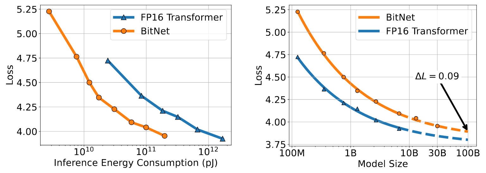

**図 3.** BitNet と FP16 Transformer のスケーリング曲線。

### 3.3 下流タスクの結果

損失に加えて、BitNet のスケーリングに伴う能力にも注目する。ニューラル言語モデルには創発性があるため、損失と比べて能力の予測は難しい。解釈可能な指標で能力を評価するため、Hellaswag [Zel19]、Winogrande [Sak20]、Winograd [Lev12]、Storycloze [Mos16] の四つの下流タスクについて、0-shot と 4-shot の結果を測定する。[図 4](#figure-04) は、さまざまな規模の BitNet と FP16 Transformer の平均結果を示す。損失スケーリング曲線と同様に、下流タスクの性能も計算予算の増加に伴ってスケールする。さらに、zero-shot と few-shot のどちらでも、能力のスケーリング効率は FP16 Transformer ベースラインよりはるかに高い。

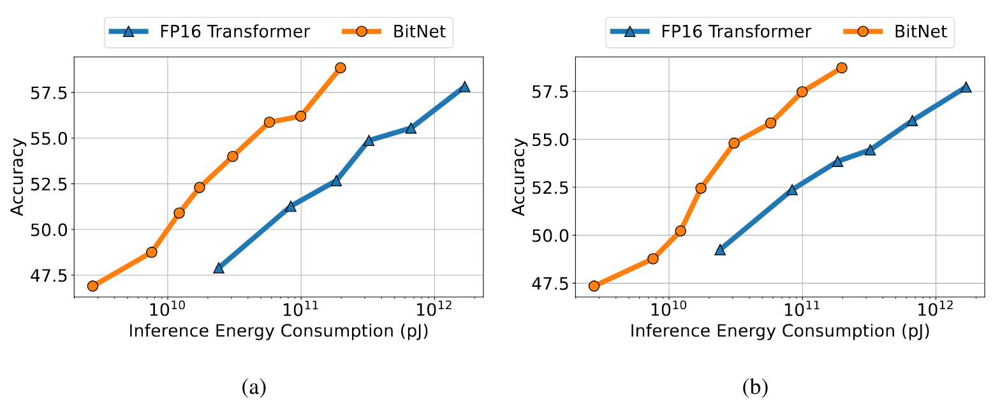

**図 4.** 推論コストに対する BitNet と FP16 Transformer の zero-shot（左）および few-shot（右）性能。

### 3.4 安定性テスト

低 bit Transformer の学習における主な課題は、最適化の安定性である。そこで、ピーク学習率を変えて一連のモデルを学習し、BitNet と FP16 ベースラインの安定性テストを行う。[図 5a](#figure-05) に安定性テストの結果を示す。BitNet は大きな学習率でも収束できる一方、FP16 Transformer は収束できず、BitNet の学習安定性が高いことを示している。この最適化上の利点により、さらに大きな学習率で学習できる。[図 5b](#figure-05) は、BitNet が学習率の増加から恩恵を受け、PPL に関してより良く収束することを示す。

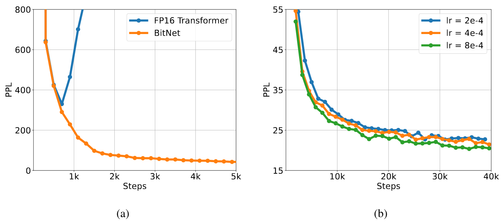

**図 5.** 同じ学習率を用いると、BitNet は FP16 Transformer より安定している（左）。学習の安定性によって BitNet はより大きな学習率を使用でき、収束が改善する（右）。

## 4 学習後量子化との比較

### 4.1 設定

BitNet は[第 3.1 節](#section-3-1)と同じ設定で学習する。Absmax [Det22]、SmoothQuant [Xia23]、GPTQ [Fra23]、QuIP [Che24b] など、最先端の量子化手法と BitNet を比較する。これらの手法は、BitNet と同じ学習設定とデータを使用した FP16 Transformer モデルに対する学習後量子化である。Absmax と SmoothQuant は重みと活性値の両方を量子化し、GPTQ と QuIP は重みの精度だけを下げる。各手法を複数の量子化精度で適用する。重みのみの量子化（GPTQ と QuIP）では W4A16 と W2A16 を試す。重みと活性値の量子化（Absmax と SmoothQuant）では、FP16 Transformer を W8A8、W4A4、W1A8 へ量子化する。本研究の BitNet 実装は、二値重みと 8-bit 活性値（W1A8）であり、ベースライン以下の bit 数となる。

### 4.2 結果

[表 3](#table-03) は、Winogrande、Winograd、Storycloze、Hellaswag の四つのベンチマークデータセットにおいて、提案手法 BitNet と各ベースラインの zero-shot 性能を詳細に比較する。公平な比較のため、すべてのモデル規模を 6.7B とする。各手法は、16 から 1 までの複数の重み bit 数で評価する。下流タスクの zero-shot 正解率に加え、検証セット上の言語モデルパープレキシティも評価指標に含め、各手法の性能を包括的に捉える。

結果は、特に bit 数が小さい場合、BitNet がベースラインと比べて競争力のある性能を達成することを示す。BitNet の zero-shot スコアは 8-bit モデルに匹敵するが、推論コストははるかに低い。4-bit モデルでは、活性値の量子化が難しいことから、重みのみの量子化手法が重みと活性値を量子化する手法を上回る。1-bit モデルである BitNet は、重みと活性値を量子化する手法と、重みのみを量子化する手法の両方より大幅に良い結果を達成する。より低い bit 数では、BitNet のスコアが一貫してすべてのベースラインを上回る。これは、量子化認識学習が学習後量子化より優れることを示す。[図 6](#figure-06) は、モデル規模を 1.3B から 6.7B へ拡大したときの、提案手法と各ベースラインの zero-shot および few-shot 正解率をまとめている。この結果は、その利点が異なる規模でも一貫していることを示す。

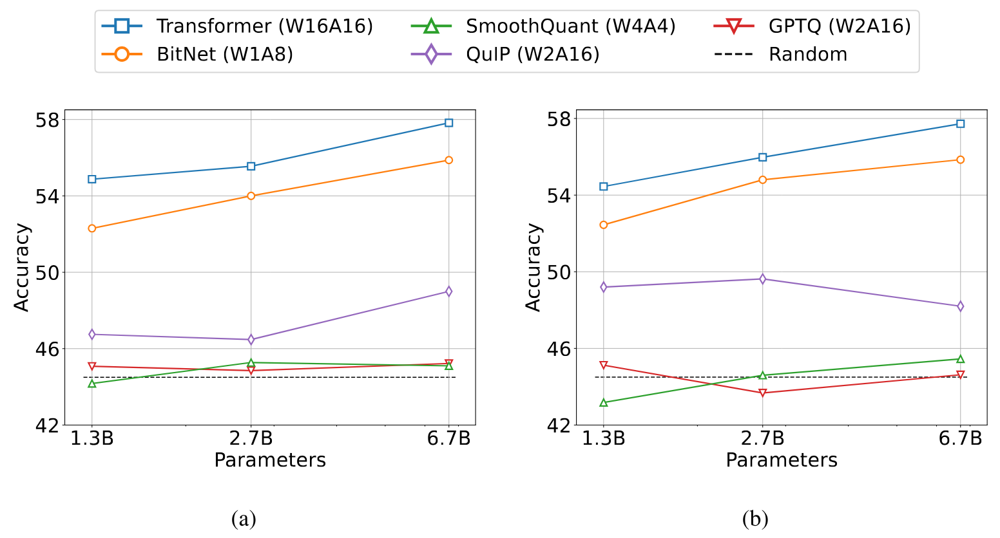

**図 6.** 下流タスクにおける BitNet と学習後量子化ベースラインの zero-shot（左）および few-shot（右）結果。

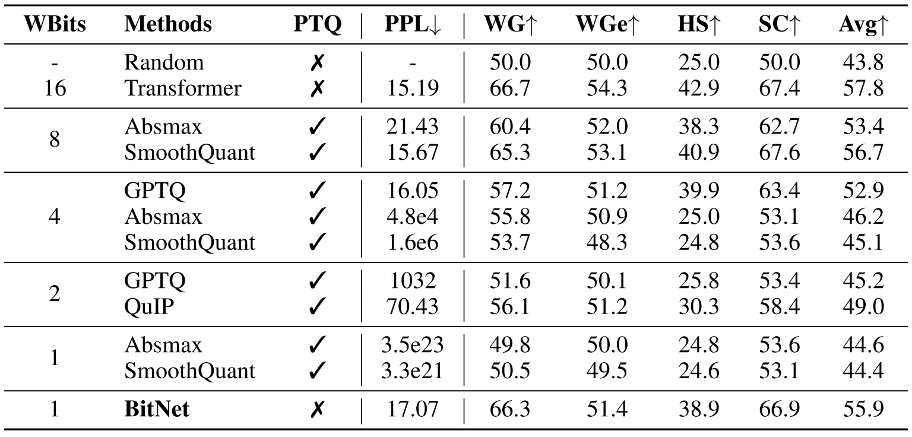

**表 3.** BitNet とベースラインの zero-shot 結果（`PTQ`：学習後量子化、`WGe`：Winogrande、`WG`：Winograd、`SC`：Storycloze、`HS`：Hellaswag データセット）。

## 5 アブレーション研究

[表 4](#table-04) では、提案手法と複数の代替手法を比較するアブレーション研究を示す。活性値量子化手法の選択と、モデル学習を安定させる技術の効果を検証する。BitNet は absmax で活性値を量子化し、学習の安定化に `SubLN` を用いる。量子化の代替手法として、学習可能なパラメータでスケールを動的に調整する elastic 関数 [Liu22] がある。実験では、absmax が elastic 関数より高い性能を示した。加えて、absmax 関数は学習を安定させるため、BitNet でより大きな学習率を利用できる。さらに、`SubLN` を Pre-LN および BMT アーキテクチャ [Zha23s] と比較する。Pre-LN は GPT 事前学習の標準アーキテクチャであり、BMT は二値モデルの学習安定性を改善することが示されている。実験では、`SubLN` が Pre-LN と BMT の両方を上回った。したがって、BitNet の実装には absmax と `SubLN` を選択する。

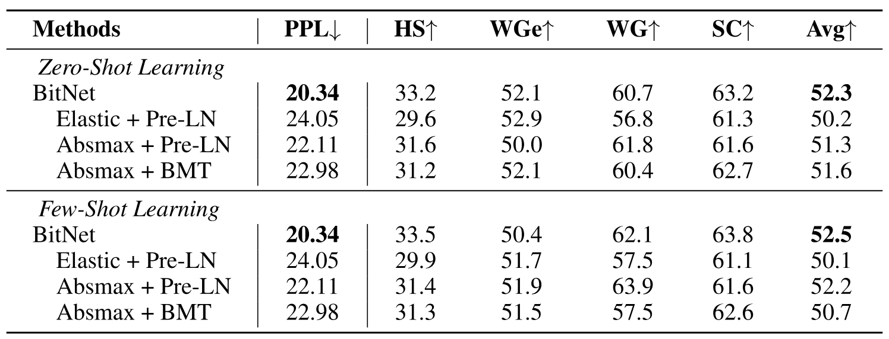

**表 4.** BitNet のアブレーション（`WGe`：Winogrande、`WG`：Winograd、`SC`：Storycloze、`HS`：Hellaswag データセット）。Elastic は [Liu22] の活性値量子化手法であり、BMT は低 bit モデルの学習を安定させる [Zha23s] のアーキテクチャである。

## 6 結論と今後の課題

本研究では、大規模言語モデル向けの新しい 1-bit Transformer アーキテクチャ BitNet を提示した。本手法はスケーラブルかつ安定するよう設計され、大規模言語モデルを効率よく処理できる。実験結果から、BitNet はパープレキシティと下流タスク性能の両方で競争力のある性能を達成し、ベースラインと比べてメモリ使用量とエネルギー消費を大幅に削減することが分かった。さらに、BitNet は全精度 Transformer に似たスケーリング則に従い、性能と効率の利点を得ながら、さらに大規模な言語モデルへ効果的に拡張できることを示した。今後は、モデル規模と学習ステップ数の両面で BitNet を拡張したい。また、大規模言語モデルを学習するため、BitNet を他のアーキテクチャ（RetNet [Sun23a] など）へ適用することにも関心がある。

## 7 ハイパーパラメータ

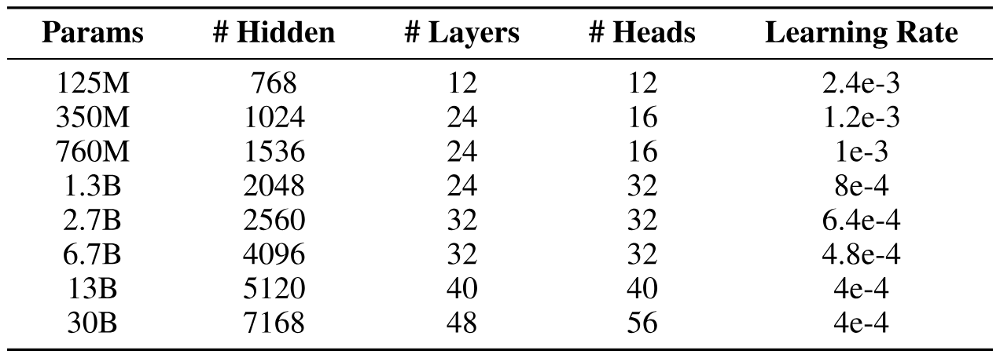

**表 5.** BitNet のスケーリング実験に用いたモデル構成。

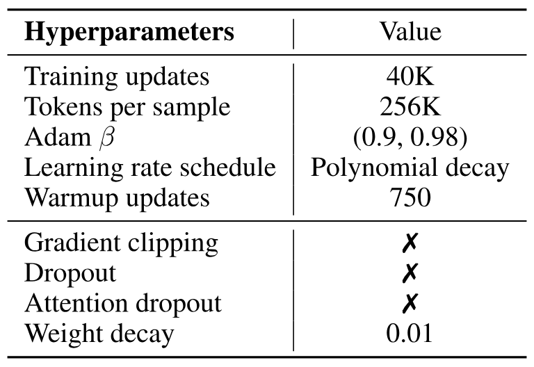

**表 6.** BitNet と FP16 Transformer のスケーリング実験に用いたハイパーパラメータ。13B と 30B のモデルでは、学習を安定させるため、weight decay を 0.05 に設定する。

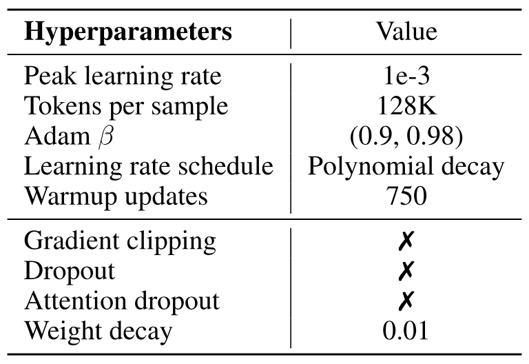

**表 7.** BitNet と FP16 Transformer の安定性テストに用いたハイパーパラメータ。

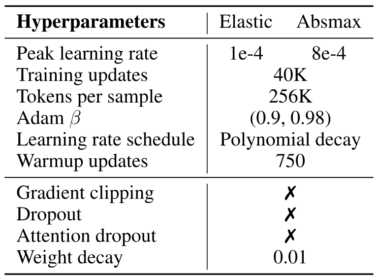

**表 8.** BitNet のアブレーションに用いたハイパーパラメータ。
