> [Gerasimos Gerogiannis](https://dblp.org/pid/314/4553)、[Stijn Eyerman](https://dblp.org/pid/99/4678)、[Evangelos Georganas](https://dblp.org/pid/121/2450)、[Wim Heirman](https://heirman.net/)、[Josep Torrellas](https://dblp.org/pid/t/JosepTorrellas)。arXiv 初回提出日は 2025-05-25、現行版は v2 (2025-08-08)。MICRO 2025 掲載、pages 184-200、online 2025-10-17、print 2025-10-18。[arXiv:2505.19349](https://arxiv.org/abs/2505.19349)。[原 PDF](/paper/deca.pdf)。[DOI: 10.1145/3725843.3756073](https://doi.org/10.1145/3725843.3756073)。[TeX ソース](https://arxiv.org/e-print/2505.19349)。原論文の題名は「DECA: A Near-Core LLM Decompression Accelerator Grounded on a 3D Roofline Model」。

## 概要

大規模言語モデル (LLM) 推論のメモリ帯域幅ボトルネックを緩和するため, 重み行列は量子化およびスパース化形式でメモリに格納される。そのため, 行列 tile をコア内汎用行列乗算 (GeMM) ハードウェアエンジンで処理する前に, 逆量子化とデスパース化を行う必要がある。現在この処理はソフトウェアのベクトル演算で実行されるが, 性能は限定的である。さらに, GeMM 全体の性能はメモリ資源、ベクトルユニット、ハードウェア行列エンジンの相互作用に依存するため, システムの改善方法を把握することも難しい。

コア内 GeMM エンジンと HBM を備えた先進的プラットフォームで LLM 推論性能を高めるため, 本論文は三つの主要な貢献を示す。第一に, メモリ資源、ベクトルユニット、ハードウェア行列エンジンの連携を分析できる三次元可視化性能モデルを構築する。第二に, 近傍コア ML モデル解凍アクセラレータ DECA を提案する。DECA は tile のデスパース化と逆量子化を CPU からオフロードし, コア内 GeMM エンジンが利用できる tile を生成する。第三に, 近傍コアアクセラレータをアウト・オブ・オーダーで呼び出す ISA 拡張を導入する。この拡張により, アクセラレータとコアの計算を交互に実行し, 重ね合わせることができる。シミュレーションした HBM 搭載 56 コア Xeon 4 サーバでは, DECA は最適化された Intel ソフトウェア kernel より圧縮 GeMM を最大 4 倍高速化し, Llama2-70B と OPT-66B の次 token 生成時間を 1.6 倍から 2.6 倍短縮する。

<span id="section-1"></span>

## 1 はじめに

大規模言語モデル (LLM) は最も重要な機械学習 (ML) ワークロードの 1 つであり, チャットボット、翻訳、文章要約、コンテンツ生成などのタスクに優れている [Zho24j, Zha23m, Kal23, Yao23d]。LLM は Transformer [Vas17] を使い, 主にマルチヘッド注意機構と全結合 (FC) 層から構成される。最大規模のモデルでは, FC 層に数兆個のパラメータ (重み) が含まれる [Ope24a, Zha23d]。推論時にはこれらの重みの再利用性が低く (例えば小さいバッチの場合), 現代的なプラットフォームのメモリ容量だけでなくメモリ帯域幅にも負荷をかける [Yua24]。

GPU は高い計算能力とメモリ帯域幅を持つため, LLM 推論の標準的なプラットフォームとみなされている。しかし, Intel Xeon 4 サーバ (コードネーム Sapphire Rapids, SPR) の最近の進展 [Bis21] により, CPU も LLM 推論の魅力的な選択肢になった。第一に, このプロセッサには TMUL と呼ばれるコア内汎用行列乗算 (GeMM) エンジンが搭載されている [Int24a]。TMUL は GPU の Tensor Core [Mar18b] と同じ役割を果たす。AMX ISA 拡張 [Int24a] でプログラムし, 行列 tile 上で GeMM を実行する。ベクトル SIMD ユニットだけに頼る場合と比べ, GeMM の計算スループットは 1 桁向上する。第二に, SPR サーバは高帯域幅メモリ (HBM) を搭載でき, DDR ベースのシステムより利用可能なメモリ帯域幅を 3-4$\times$ 増やせる。

SPR CPU では GPU [Yua24] と同様に, LLM 推論がメモリ帯域幅に制約されることが分かる。Llama2-70B では FC 層の大規模 GeMM が次の token の生成時間の 90% 以上を占める [Tou23a]。このような GeMM は算術強度が低く, メインメモリから大量の重みを読み込む。したがって CPU 上の LLM 推論を高速化することは, 大規模 GeMM を高速化することにほぼ等しい。

低ビット重み量子化 [Gho21a] や疎化/プルーニング [Hoe21, Xia23b, Zhu23b] などの深層ニューラルネットワーク (DNN) モデル圧縮技術 [Lia21a, Den20a] は GeMM の性能を向上させられる。メモリから読み込むデータ量が減り, メモリ律速の kernel が大幅に高速化するためである。しかし TMUL は, systolic array [Jou23] や Tensor Core [Xia23b] と同様に, 任意の量子化方式や疎パターンを扱えない。そのため SPR の TMUL エンジンは, BF16 [Kal19] または INT8 形式の, 形式の整った密な入力 tile (すなわちゼロ値を含む) を必要とする。

モデル圧縮と TMUL の GeMM スループットを両立するため, Intel は最近 libxsmm フレームワークに専用 kernel を導入した [Hei16]。libxsmm は一連のベクトル (AVX) 命令でメモリから圧縮 tile を読み込み, それを非疎化および/または逆量子化して TMUL の AMX ユニットに供給する。この協調処理モードにはベクトルと行列という 2 つの計算ドメインがあり, それぞれ独自の命令 (AVX と AMX) と機能ユニット (SIMD ユニットと TMUL) を持つ。

異なる量子化・疎化ワークロードで libxsmm kernel の性能を測定した。その結果, 中程度に圧縮された GeMM や比較的低帯域幅の DDR メモリでは非常に有効である一方, HBM では性能が低下することが分かった。この低下は, メモリ帯域幅と (行列) 計算スループットだけを上限要因とする従来の 2 次元 (2D) Roofline 性能モデル [Zha15] では説明できない。

性能最適化を導くため, メモリ、行列、ベクトル資源の相互作用を捉える解析性能モデルをまず構築する。2D Roofline と異なり, このモデルは達成可能な性能と不可能な性能を分ける面を持つ 3 次元表現である。このためモデルを *Roof-Surface* と呼ぶ。Roof-Surface は有用な性能上の洞察を与え, libxsmm の性能低下を AVX ベクトル解凍列に正確に帰属させる。さらに, 解凍の非効率を解消するには CPU コア資源を現実的でない規模で拡張する必要があることも示す。

この問題に対処するため, 本論文は新しい近コア *ML モデル解凍アクセラレータ* である *DECA* を提案する。DECA は tile の非疎化と逆量子化を CPU からオフロードし, TMUL がそのまま使える tile を生成する。DECA は 1 から 8 ビットまで任意のビット数の量子化数値形式を扱えるようプログラムでき, 任意の非構造化疎性をサポートし, グループ量子化もサポートする [Gho21a]。DECA のマイクロアーキテクチャは高度なベクトル演算を備えた pipeline で解凍を行う。重要なのは, (1) ベクトル pipeline のマイクロアーキテクチャを決め, (2) 設計空間探索を行って均衡の取れた DECA 設計を導くために *Roof-Surface* モデルを用いる点である。

CPU コアが通常の memory-mapped load/store 命令で DECA と通信すると, 通信遅延が露出して性能を損なう。そこで, アクセラレータを out-of-order で呼び出して CPU-DECA 間の通信遅延を隠す新しい ISA 拡張を導入する。この拡張を *Tile External Preprocess and Load* (TEPL) と呼ぶ。

2 種類の低ビット量子化形式 (BF8 と MXFP4) と異なる非構造化疎性レベルを用いた評価から, DECA が非常に有効であることが分かった。HBM を備えた 56 コア SPR をシミュレートした場合, DECA は最適化された Intel libxsmm ソフトウェア kernel と比べて圧縮 GeMM の実行を最大 4x 高速化する。さらに FC 層を高速化することで, Llama2-70B と OPT-66B [Zha22] の次 token 生成時間をソフトウェアのみの方式より 1.6$\times$—2.6$\times$, 非圧縮ベースラインモデルより 2.5$\times$—5.0$\times$ 短縮する。

本論文の貢献は次のとおりである。

- ベクトルユニット、行列ユニット、メモリの相互作用をモデル化する *Roof-Surface* 性能モデル。
- 圧縮 ML モデルの非疎化と逆量子化を高速化する近コアアクセラレータ *DECA*。
- 近コアアクセラレータの out-of-order 呼び出しを可能にする Tile External Preprocess & Load (*TEPL*) 拡張。
- LLM 推論の圧縮 GeMM における *DECA* の性能をシミュレーションで評価した結果。

<span id="section-2"></span>

## 2 背景

<span id="section-2-1"></span>

### 2.1 LLM 推論

大規模言語モデル (LLM) は Embedding 層、全結合 (FC) 層、Attention 層などの異なる層から構成される [Vas17]。LLM 推論には 2 つの段階がある [Pat23]。第一段階は入力 token を符号化して最初の token を生成する prompt 段階, 第二段階は次の出力 token を生成する generation 段階である。本研究では算術強度の低い generation 段階を効率よく実行することに注目する, 多くの実用例でこの段階が LLM 推論全体の時間を支配するためである [Yua24]。

GPU は高い計算能力とメモリ帯域幅を持つため LLM 推論の標準プラットフォームとみなされている [Pat23, Su23a]。しかし HBM やコア内 GeMM エンジンなどの最近の進展 [Bis21] により, CPU も魅力的な選択肢になった。拡張や小型アクセラレータを CPU ダイに組み込んで CPU の機械学習 (ML) および科学計算ワークロードを改善する研究・産業上の関心も高まっている [Jeo23, Gon20, Gon22, Sir23, Nas22, Ore22]。そこで本論文では, 最新 CPU サーバ上の LLM 推論に焦点を当てる。

<span id="section-2-2"></span>

### 2.2 モデル圧縮

算術強度の低い LLM の FC 層では, 重み行列を圧縮するとデータ移動が減り, GPU と CPU の双方で性能を直接改善できる。ML モデルを圧縮する主な方法は 2 つある [Han15, Zhu23b]。

- **量子化。** 重みを FP16 ではなく FP8 や FP4 などの低ビット形式で保存する。複数の量子化方式が存在する [Lin23d, Zha24e, Kim24, Wei23]。さらに重みをグループに分け, グループごとのスケーリング係数 (*group quantization*) を導入して精度を高める方式もある。本研究では BF8 (8 ビット brain floating point) と MXFP4 [Bit23] の 2 種類を評価する。MXFP4 は 4 ビット浮動小数点とグループ量子化を用い, 32 個の重みごとに共有スケーリング係数 (8 ビット指数) を持つ。LLM の精度を低下させないことが示されている [Bit23]。
- **疎化。** ゼロに近い重みやモデル精度への寄与が小さい重みを除去 (*プルーニング*) する [Lec89, Bla20, Hoe21]。*非構造化疎性* は除去する重みの位置に制約を設けず, 同じ疎性レベルなら構造化疎性より高い精度を達成する [Liu21d, Fra23a]。本研究ではゼロの保存を避けるため, 非構造化疎性と bitmask ベースの疎形式を仮定する。元の重み行列で非ゼロ値の位置を復元するため, 元の行列の要素数と同じビット数の bitmask を使う。bitmask の '1' は非ゼロ値の位置を示し, 非ゼロ値は nonzero array に連続して格納される。SparseGPT など最近の LLM 重みプルーニング手法は, 精度を大きく損なわず最大 60-70% の非構造化疎性を達成している [Fra23a]。ResNet50 [He16] のような従来 ML モデルでは最大 95% の非構造化疎性を容易に達成できる [Pes21]。LLM 研究の進展によって近くさらに高い疎性が可能になると考え, 本研究では 50%-95% の広い範囲を評価する。

モデルは疎であると同時に量子化されてもよい [Har24]。密な BF16 モデルを起点とすると, 密度係数 $d$ の $Q$ ビット量子化モデル (例えば $d=10\%$ は重みの 10% だけが非ゼロであることを意味する) は, モデルサイズを $16/(Q\times d+1)$ 倍に縮小する。ここで '1' は bitmask のビットに由来する。activation のフットプリントは無視できると仮定する。この係数を *Compression Factor (CF)* と呼ぶ。

圧縮処理はオフライン (例えば学習後) に実行される。図 [1](#figure-01) の左側に示している。本論文では, すでに圧縮されたモデルをオンライン推論で使うと仮定する。

<span id="section-2-3"></span>

### 2.3 行列拡張

CPU 上の行列乗算を効率化する行列拡張はいくつか存在する [Int22, Wil22, Car22a, Bha21]。本研究では Intel の Advanced Matrix Extensions (AMX) [Int22] を用いる。AMX はレジスタファイルに 8 個の行列レジスタを追加し, tile レジスタと呼ぶ。各レジスタは最大 16 行を保持でき, 1 行あたり 64 バイトで, 32 個の 2 バイト要素 (BF16) または 64 個の 1 バイト要素 (INT8) として解釈できる。1 つの tile は最大 1 KB のデータを含む。

各コアには tile レジスタと tile を乗算する行列乗算 TMUL ユニットがある。AMX は tile レジスタとの間でデータを load/store する tload/tstore 命令を備える。batch size が $N\leq16$ で BF16 を使う LLM の next token 生成段階では, 重み tile $W$ は $M=16$ 行, 各行 $K=32$ 列を持つ。activation tile $A$ は $N$ 行, 各行 $K=32$ 列を持つ。TMUL は $A\times W^\top$ を実行して $N\times M$ の出力 tile を生成する。TMUL 操作は N の値によらず 16 サイクルかかり, 合計 $N\times K\times M =N\times32\times16=512N$ 回の fused multiply-add (FMA), すなわち 1 サイクルあたり $32N$ 回の FMA を実行する。N>16 では activation tile が最大 16 行しか保持できないため, TMUL スループットは 1 サイクルあたり 512 FMA で飽和する。本研究で FLOPs と記すものはすべて FMA を指す。

<span id="section-2-4"></span>

### 2.4 GeMM の解凍

TMUL は他の GeMM エンジン [Mar18b, Jou23] と同様, 非常に限定されたデータ形式 (BF16 または I8) しか扱えず, 非構造化疎性にも対応しない。GeMM に圧縮重みが含まれる場合, TMUL の要件に合う tile を生成するため解凍が必要になる。圧縮とは異なり解凍はオンラインで行われる (図 [1](#figure-01)) ため, 性能に影響しうる。

<span id="figure-01"></span>

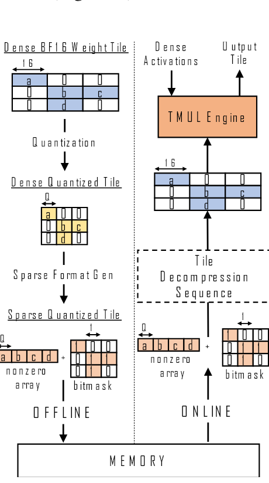

**図 1.** オフライン圧縮とオンライン解凍。

<span id="figure-02"></span>

```text
............
//Decompress Ti+1
for(r=0 to 16):
{
  //Decompress
  //row r of Ti+1
  VectorOps AVX
  ...
}

//GeMM Ti
MatrixOps AMX
TLoad Ti
TComp Tout, Ti

//Decompress Ti+2
//GeMM Ti+1
............
```

**図 2.** Libxsmm 压缩 GeMM kernel 的疑似コード。

圧縮 GeMM kernel で高性能を達成し解凍オーバーヘッドを隠すため, Intel は最近 Libxsmm フレームワークに統合されたソフトウェア方式を導入した [Hei16] (図 [2](#figure-02))。解凍列は AVX ベクトル演算で処理し, 実際の GeMM は AMX 行列演算で実行する。Libxsmm は両者を重ね合わせる巧妙な方法を採用する。ソフトウェアが 2 つのバッファを割り当て, L1 キャッシュに保持しようとする。tile *Ti+1* の AVX 解凍列の出力を一方のバッファに書き込む間, AMX 命令はもう一方のバッファから, AVX 列で以前に解凍した *Ti* を読み込む。AMX と AVX の重複実行は out-of-order 実行で可能になり, 依存関係も自然に守られる。

解凍列は permute などのベクトル演算と, mask 付きベクトル expand を使って非ゼロ配列の適切な位置にゼロを挿入する。詳細は紙幅の都合で省略するが, 第一の要点は AMX とは異なる "domain" (独立した命令と機能ユニット) を使う AVX で解凍を行うことである。第二の要点は, AMX が tile サイズ (1KB) のオペランドを使うのに対し AVX は cache line サイズ (64B, tile の 1 行) を処理するため, AVX の動的命令数が AMX よりはるかに多いことである。

<span id="section-3"></span>

## 3 動機

<span id="section-3-1"></span>

### 3.1 FC 層の GeMM が推論を支配する

表 [1](#table-01) は, DDR5 または HBM を備えた SPR サーバ上の Llama2-70B [Tou23a] について, 各全結合 (FC) 層の GeMM が次 token (すなわち generation) 時間に占める割合を示す。BF16 重みを持つ非圧縮モデルについて, 入力 token 数と batch size ($N$) を変えた結果を示す。残りの時間は attention など, 重み圧縮を適用できない kernel に費やされる。このような GeMM の時間は DDR5 で 95% 超, HBM で 85-90% を占める。したがってこれらの GeMM を高速化すれば, 次 token の時間を大幅に改善できる。

<span id="table-01"></span>

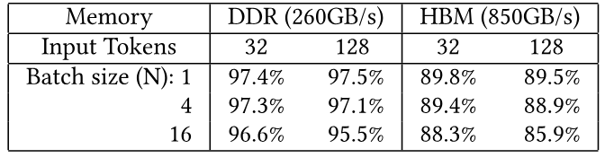{.paper-table-narrow}

**表 1.** FC 层 GeMM 对下一个 token 时间的贡献。

<span id="section-3-2"></span>

### 3.2 FC 層の GeMM は帯域幅に制約される

図 [3](#figure-03) は, DDR5 または HBM を備えた SPR で N=4 とした LLama2-70B FC 層の大規模 GeMM の 1 つについて Roofline モデルを示す。計算律速領域で達成可能な最大 GeMM FLOPS には TMUL FLOPS 上限 ([第 2.3 節](#section-2-3)) を使う。本研究でメモリバイトあたり FLOPs として算術強度 (AI) を計算する際, 小さい N では成り立つ, 重み行列のフットプリントが activation よりはるかに大きいという仮定を置く。両グラフの左端にある 'BF16' と表示された円は非圧縮実行のベースラインである。AI が低いため, この実行はどちらの場合もメモリ帯域幅律速になる。これはメモリから読み込むデータ量を減らすモデル圧縮の動機になる。

<span id="figure-03"></span>

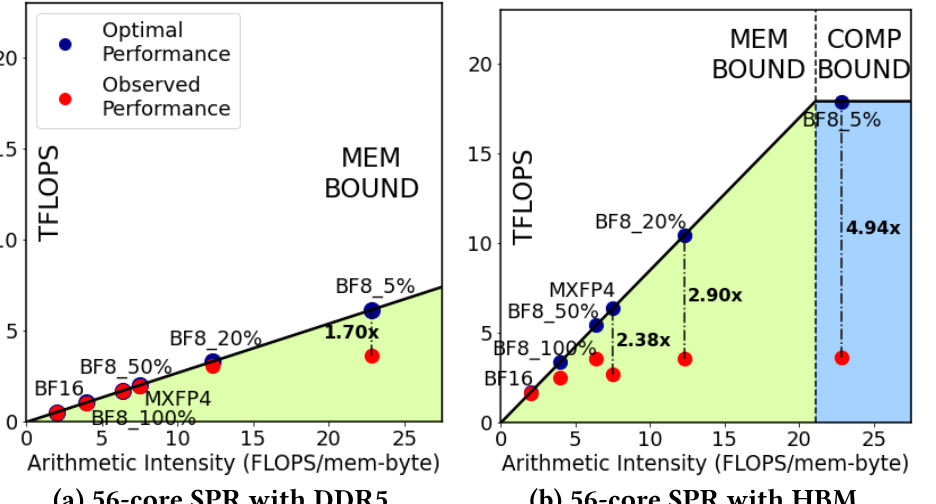

**図 3.** $N=4$ 时 GeMM 的传统 Roofline。

<span id="section-3-3"></span>

### 3.3 圧縮 GeMM は非効率を招く場合がある

図 [3](#figure-03) の他のデータ点は, 4 ビット量子化 (MXFP4) または 8 ビット量子化 (BF8) を使い, 密度 (非ゼロ値の割合) が 5% から 100% までの圧縮モデルを表す。圧縮によりメモリから取得するデータ量が減るため AI が増え, 圧縮係数が増すにつれて円は右へ移動する。各設計点には 2 つの円を示す。1 つは *Observed* 性能, もう 1 つは同じ AI における Roofline 上の性能で, 後者を *Optimal* 性能と呼ぶ。

圧縮係数を増やすと Observed と Optimal の点が次第に離れる。DDR5 グラフでは密度 5% の BF8 で乖離が現れる。一方 HBM グラフでは圧縮モデルがすべて Optimal 性能を下回り, 密度 5% の BF8 では Optimal と Observed の比が 4.94x になる。これは Roofline モデルが捉えていない非効率が性能を制限することを意味する。手動プロファイリングから, 根本原因は AVX 解凍命令列のオーバーヘッドだと分かった。実際, コアの AVX SIMD 処理ユニットはメモリ帯域幅および/または TMUL のスループットに追いつけない。

LLM ワークロードの重要性を考えれば, 解凍オーバーヘッドへの何らかのハードウェア支援は正当化できる。しかし資源に制約のある CPU では変更に慎重でなければならない。Roofline モデルは, kernel をベクトル処理律速からメモリまたは行列計算律速へ移すために必要なベクトルスループットの改善量を示さない。そのためハードウェアを過小構成または過剰構成する危険がある。これを避けるため, 次節では別の解析モデルを提案する。このモデルは圧縮 GeMM の解凍オーバーヘッドを除去するために必要なハードウェア支援を理論的に導ける。

<span id="section-4"></span>

## 4 Roof-Surface モデル

行列、ベクトル、メモリ操作を含む kernel の性能最適化を導くため, それらの相互作用を捉える性能モデルを開発する。このモデルを *Roof-Surface* と呼び, 3 次元 (3D) で可視化する。また, *Bounding Region Diagram* (BORD) と呼ぶ 2 次元投影も示す。

<span id="section-4-1"></span>

### 4.1 三次元 Roof-Surface 性能モデル

複数の相互作用する要因が性能に影響する場合, 最も遅い要因が性能を決める。そこでまず, (1) メモリが圧縮 tile を供給する速度 (MEM), (2) ベクトルハードウェアが圧縮 tile を処理する速度 (VEC), (3) 行列ハードウェアが解凍済み tile を処理する速度 (MTX) を表す必要がある。

**メモリ。** メモリは $\mathrm{MBW}/\mathrm{Bytes}_{\mathrm{tile}}$ tile/s の割合で圧縮 tile を供給できる。ここで $MBW$ はメモリ帯域幅, $\mathrm{Bytes}_{\mathrm{tile}}$ は圧縮 tile のバイト数である。圧縮重み tile は 1 回の TMUL 行列操作に使われるため, $1/\mathrm{Bytes}_{\mathrm{tile}}$ を行列からメモリへの算術強度, すなわち $\mathrm{AI}_{\mathrm{XM}}$ と呼ぶ。これはメモリから 1 バイト読み込むごとに実行できる行列操作数を表し, 図 [3](#figure-03) の Roofline で使う従来の算術強度に似ている。違いは単位が FLOPs/byte ではなく matrix operations/byte である点である。本設定では圧縮係数 (CF) が高い方式 ([第 2.2 節](#section-2-2)) ほど $\mathrm{AI}_{\mathrm{XM}}$ が高い。圧縮 tile の MEM 速度は $\mathrm{MBW}\cdot\mathrm{AI}_{\mathrm{XM}}$ tile/s となる。

**ベクトルハードウェア。** ベクトルハードウェアは $\mathrm{VOS}/\mathrm{VO}_{\mathrm{tile}}$ tile/s の割合で tile を解凍する。$\mathrm{VOS}$ はアーキテクチャが 1 秒あたりに実行できるベクトル操作数, $\mathrm{VO}_{\mathrm{tile}}$ は 1 tile に必要なベクトル操作数である。$\mathrm{VOS}$ はベクトルスループットで, アーキテクチャ依存のパラメータである。例えば SPR システムでは, プロセッサ周波数 ($f$)、コア数 ($c$)、コアあたり SIMD ユニット数の積で表される。$\mathrm{VO}_{\mathrm{tile}}$ は kernel 依存のパラメータである。GeMM では重み行列だけを解凍すればよいため, $\mathrm{VO}_{\mathrm{tile}}$ は実質的に 1 回の行列操作に必要なベクトル操作数を表す。$1/\mathrm{VO}_{\mathrm{tile}}$ は 1 回のベクトル操作で実行できる行列操作数を表すため, 行列からベクトルへの算術強度, すなわち $\mathrm{AI}_{\mathrm{XV}}$ と呼ぶ。VEC 速度は $\mathrm{VOS}\cdot\mathrm{AI}_{\mathrm{XV}}$ tile/s となる。

**行列ハードウェア。** 行列ハードウェアは 1 秒あたり $\mathrm{MOS}$ 回の行列操作を実行できる。$\mathrm{MOS}$ は kernel ではなくアーキテクチャに依存する。例えば SPR では各コアの TMUL が tile 乗算に 16 サイクルかかるため $fc/16$ である。したがって MTX の tile/s 速度は単に $\mathrm{MOS}$ である。

**最終性能。** 最終性能は, 3 つの速度のうち最も低い tile 処理速度で決まる。具体的にアーキテクチャが処理できる 1 秒あたりの tile 数 (*TPS*) は次のとおりである。

<span id="equation-01"></span>

$$
\mathrm{TPS} = \min\{\mathrm{MBW}\cdot \mathrm{AI}_{\mathrm{XM}}, \mathrm{VOS}\cdot \mathrm{AI}_{\mathrm{XV}}, \mathrm{MOS}\}
$$

TMUL の tile 操作が $512N$ 回の FMA に相当することを [第 2.3 節](#section-2-3) から思い出せば, 1 秒あたり FLOPs (*FLOPS*) の速度は容易に得られる。

<span id="equation-02"></span>

$$
\mathrm{FLOPS} = 512N\cdot \min\{\mathrm{MBW}\cdot \mathrm{AI}_{\mathrm{XM}}, \mathrm{VOS}\cdot \mathrm{AI}_{\mathrm{XV}}, \mathrm{MOS}\}
$$

この式を *Roof-Surface* 方程式と呼ぶ。*min* の中の 3 項はいずれも性能を制限しうる。特定のアーキテクチャ (固定された *MBW*、$\mathrm{VOS}$、$\mathrm{MOS}$) では, *min* の中に *kernel 依存の変数* が 2 つある。$\mathrm{AI}_{\mathrm{XM}}$ と $\mathrm{AI}_{\mathrm{XV}}$ である。これらは kernel の "signature" であり, 2 つの kernel が同じ signature を持てば予測性能も同じになる。これに対し Roofline モデルで kernel の signature は従来の FLOP-to-memory AI という 1 変数だけである。したがって性能モデルは図 [3](#figure-03) の 2 次元 (FLOP-to-memory AI と FLOPS) では表せず, $\mathrm{AI}_{\mathrm{XM}}$ を x 軸, $\mathrm{AI}_{\mathrm{XV}}$ を y 軸, FLOPS を z 軸とする 3 次元が必要になる。

<span id="figure-04"></span>

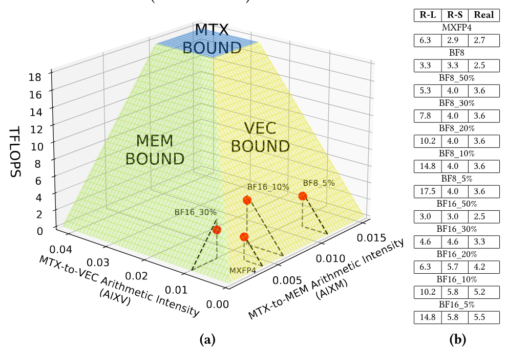

**図 4.** (a) 3 次元 Roof-Surface モデル。(b) Roofline (R-L)、Roof-Surface (R-S)、実測値に基づく最適性能, 単位は TFLOPs。

図 [4a](#figure-04) は式 [2](#equation-02) (N=4, HBM) を 3 次元に描いて *Roof-Surface* 図を形成した結果である。Roof-Surface 図には異なる色で示す 3 つの領域がある。各領域では Roof-Surface 式の異なる項が最小となり, 性能を制限する。青い下位面より下の動作点は MTX 要因, 緑の下位面より下は MEM 要因, オレンジの下位面より下は VEC 要因に制約される。kernel 性能は 3 次元空間の点で表す。達成可能な性能は Roofline のような線ではなく全体の面で境界づけられるため, このモデルを Roof-Surface と呼ぶ。全体の面より上の点は達成できない。

図 [4a](#figure-04) には異なる圧縮方式の実測性能に対応する赤い点も含まれる。VEC-bound 領域の下にある赤い点 (MXFP4、BF16_10%、BF8_5%) は対応する接線三角形の頂点, すなわちほぼ Roof-Surface 上にある。これはベクトル操作に制約されることを視覚的に示す。MEM-bound 領域の赤い点 (BF16_30%) は Roof-Surface よりわずかに低く, メモリレイテンシなど図にない要因が少し性能を失わせていることを示す。

図 [4b](#figure-04) では Roofline (R-L) と Roof-Surface (R-S) が予測する最適性能値と実測値を示す。ほぼすべての kernel で Roof-Surface は正確な性能上限を与えるが, Roofline は大きく外れることがある。Roofline の予測を 3 次元空間に描けば, 多くが Roof-Surface の上に浮かぶ。BF8、BF16_50%、BF16_30% では R-L と R-S の推定値が同じである。両モデルがこれらを MEM-bound に分類するためである。

<span id="section-4-2"></span>

### 4.2 二次元境界領域図

Roof-Surface 図をより見やすくした 2 次元表現として Bounding Region Diagram (BORD) を導入する。BORD は Roof-Surface の xy 平面への投影である。FLOPS 情報は示さないが, 描画された要因のどれが特定の kernel の性能を制約するかを正確に識別できる。

<span id="figure-05"></span>

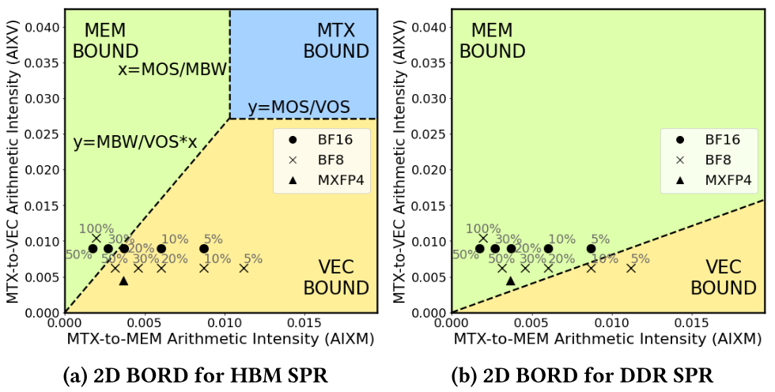

**図 5.** 2 次元境界領域図 (BORD)。

図 [5a](#figure-05) は HBM SPR の BORD を示す。3 領域を分ける直線の方程式 $y=(\mathrm{MBW}/\mathrm{VOS})x$、$x=\mathrm{MOS}/\mathrm{MBW}$、$y=\mathrm{MOS}/\mathrm{VOS}$ も示す。図 [3](#figure-03)b の BF8、MXFP4 圧縮 GeMM kernel と, 異なる密度の BF16 kernel の位置も描く。大半の kernel が VEC-bound であることが分かる。図 [3](#figure-03)b の Roofline 性能に到達するには, これらの点を VEC-bound 領域から離す必要がある。

図 [5b](#figure-05) は *MBW* が小さい DDR SPR の BORD を示す。MEM-bound 領域の面積が増え, BORD に描く $\mathrm{AI}_{\mathrm{XM}}$ と $\mathrm{AI}_{\mathrm{XV}}$ の範囲では MTX-bound 領域が見えなくなり, MEM 領域に吸収される。20% 以下の密度の BF8 を除くすべての kernel は MEM-bound 領域内またはその近くにある。これにより図 [3](#figure-03)a の大半の設計点でソフトウェア解凍方式が Roofline に到達する理由が分かる。

<span id="figure-06"></span>

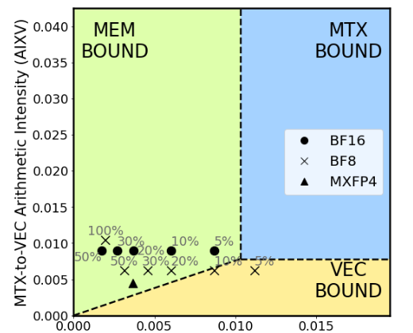{.paper-figure-half}

**図 6.** VOS を 4 倍にした HBM の 2 次元 BORD。

最後に, 図 [6](#figure-06) は HBM SPR で VOS のベクトルスループットを 4x 増やしてベクトルボトルネックを除こうとした場合の BORD を示す。図 [5a](#figure-05) と比べると VEC-bound 領域が縮小し, MEM-bound 領域がより多くの kernel を覆う。しかし VOS を 4x 増やしても, すべての kernel を VEC-bound でなくすには不十分である。

図 [5a](#figure-05) の HBM SPR では, コアが動的命令の 95% 超を tile 解凍に費やし, すでに commit slot の 40-80% を使っている。したがって VOS を 4x にするには SIMD AVX ユニットを 4x 増やすだけでなく, コアの superscalar 幅も現実的でない規模で増やす必要がある。この方式や, AVX ユニット数を増やさずベクトル幅だけを増やす方式などの限界を [第 7 節](#section-7) で議論し, [第 9 節](#section-9) で評価する。

<span id="section-5"></span>

## 5 DECA の概要とアウト・オブ・オーダー呼び出し

前節の分析から, 従来方式で解凍オーバーヘッドを隠すには汎用コアの資源を非常に高コストで拡張する必要があることが分かる。そこで *DECA*, すなわち *ML モデル向け近コア解凍アクセラレータ* を提案する。DECA は解凍のベクトル処理をコアからオフロードする。本節ではまず DECA の統合を説明し, 次に CPU コアと近コアアクセラレータの動作を効率よく重ねる新しい機構と ISA 拡張を導入する。

<span id="section-5-1"></span>

### 5.1 DECA の配置とシステム統合

図 [7](#figure-07) のように, プロセッサの各コアに DECA を 1 つ関連付ける。DECA にはコアがコマンドを書きデータを読む memory-mapped interface がある。DECA は processing element (PE)、制御レジスタ、tile 出力 (*TOut*) レジスタを持つ。コアは特権 store で制御レジスタを書き, 指定量子化方式の tile を疎性の有無に応じて解凍するよう PE を設定する。設定には効率的な逆量子化に使う lookup table (LUT) の充填も含まれる ([第 6 節](#section-6))。

<span id="figure-07"></span>

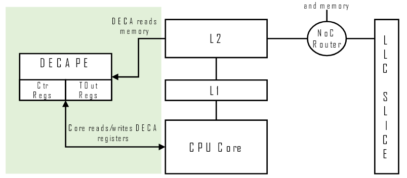{.paper-figure-half}

**図 7.** コアに隣接する DECA の配置。

DECA PE は圧縮 tile をメモリから読み, 処理して解凍済み tile を TOut レジスタに書く。CPU コアは TOut レジスタを読み, そのデータを AMX 命令で GeMM に使う。PE は L2 経由でメモリにアクセスし, 通常の load (store は行わない) と PE 内蔵 prefetcher が生成する prefetch request を発行する。DECA は先行研究 [Gon22, Ger23, Sir23] と同様にコアと L2 TLB を共有し, CPU コアの仮想アドレス空間を使う。

1 つの DECA は複数プロセスで利用できる。1 つの方法は context switch 時に DECA の状態を保存・復元することである。別の方法として, context switch をまたいで状態を保持し, 新しいプロセスが DECA を使おうとしたとき OS への trap を発生させ, OS が状態を保存して DECA を再設定する方式を提案する。

<span id="section-5-2"></span>

### 5.2 DECA とコアによる協調 tile 処理

GeMM を高性能に実行するため, ハードウェア double buffering により DECA のベクトル操作と CPU コアの AMX 操作を重ねる機構を導入する。設計を図 [8](#figure-08) に示す。DECA には 2 つの Loader モジュールと 2 つの TOut レジスタがある。Loader はデータ、bitmask、スケーリング係数という 3 つのデータ構造を含む圧縮 tile をメモリシステムから読む。Loader は tile を先読みする prefetch も発行できる。tile は DECA が Loader に読み込む (図 [8](#figure-08) の D1), DECA のベクトル pipeline で解凍する (D2), TOut レジスタに格納する (D3), コアが読む (C1), AMX 操作に使う (C2), 次の tile の 3 構造の開始アドレスと長さを渡して Loader に取得を開始させる (C3), という経路をたどる。図のように double buffer は 2 tile の操作を重ねる。コアが Tile *i-1* を読み処理する間, DECA は Tile *i* を読み処理して書き出す。コアが *i-1* を終えると Tile *i+1* の取得を開始する。

<span id="figure-08"></span>

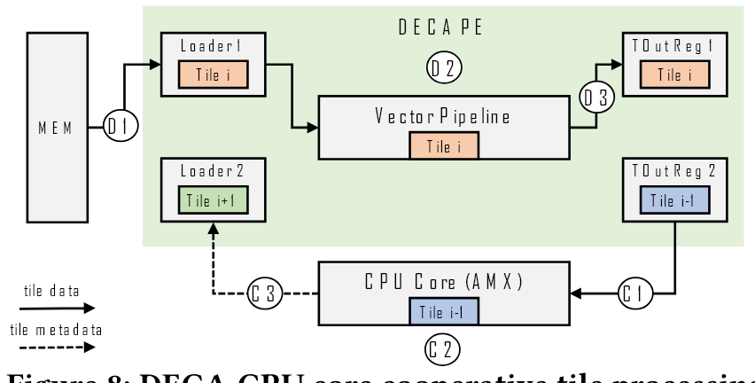

**図 8.** DECA 与 CPU 核心协同处理 tile。

CPU コアと DECA の通信には 2 つの方式がある。第一は memory-mapped DECA interface への通常 store, 第二は [第 5.3 節](#section-5-3) で説明する ISA 拡張を使う方式である。第一の方式で図 [9](#figure-09) は, 図 [8](#figure-08) のように tile を処理するコアの疑似コードを示す。重要な命令は 4-6 行にある。コアは *TLoad* (AMX 命令) で DECA TOut レジスタから tile $T_{i-1}$ を tile レジスタ TReg$_1$ に読む (4 行目)。次に GeMM を行う AMX 命令 *TComp* でこの tile を使い, 出力を TReg$_2$ に保存する (5 行目)。最後に通常 store で tile $T_{i+1}$ のメタデータ ($M_{i+1}$) を DECA Loader2 の memory-mapped レジスタに書く。この書き込みで Loader2 が tile $T_{i+1}$ の取得を開始する。4-6 行と並行して DECA は $T_i$ を解凍する。

<span id="figure-09"></span>

```text
............
DECA_ldr1 <- ST M_i
Fence
TReg_1 <- TLoad T_i-1
TReg_2 <- TComp TReg_1
DECA_ldr2 <- ST M_i+1
Fence
TReg_1 <- TLoad T_i
TReg_2 <- TComp TReg_1
............
```

**図 9.** store による DECA 呼び出しの CPU コア疑似コード。

<span id="figure-10"></span>

```text
............
TReg_1 <- TEPL M_i-1
TReg_2 <- TComp TReg_1
TReg_1 <- TEPL M_i
TReg_2 <- TComp TReg_1
TReg_1 <- TEPL M_i+1
TReg_2 <- TComp TReg_1
............
```

**図 10.** TEPL による DECA 呼び出しの CPU 疑似コード。各反復でアーキテクチャ tile レジスタ TReg$_1$ と TReg$_2$ は異なる物理 tile レジスタに rename される。

図 [9](#figure-09) には前の反復 (2 行目) と次の反復 (8-9 行目) の一部も示す。メモリ操作の誤った並べ替えを防ぐため, 反復ごとに memory fence を追加する。具体的には tile $T_i$ の load (8 行目) は, $T_i$ のメタデータを DECA Loader1 の制御レジスタに書き込む (2 行目) 前に実行してはならない。この書き込みは TOut Register 1 をリセットし, メモリからの tile 取得を開始する。両命令には依存関係がないため, 3 行目に fence を置く。各反復に fence が 1 つある。

残念ながらこの方式の性能は限られる。第一に, 各反復の fence が反復間の重複を防ぐ。第二に, 反復内でも命令は重ならない。4、5 行目には真の依存があり, 6 行目の store は reorder buffer (ROB) の先頭に来たときだけ更新できる。全命令が in-order のように直列化され, 各反復でコアと DECA の通信 (load と store の両方) のレイテンシが完全に露出する。

<span id="section-5-3"></span>

### 5.3 アウト・オブ・オーダー呼び出しの ISA 支援

out-of-order 実行を復元してコア-DECA 通信を隠すため, CPU AMX ISA の拡張に基づく別方式を提案する。この拡張を *Tile External Preprocess and Load* (TEPL) と呼ぶ。主な考えは, 2 行目と 8 行目の命令をハードウェアで 1 命令にまとめ, 図 [9](#figure-09) の反復ごとの fence をなくすことである。この命令はメタデータで Loader の制御レジスタを更新して tile 取得を開始し, DECA が tile を解凍してコア tile レジスタ (例えば TReg$_1$) に格納したときだけコアへ戻る。

TEPL 命令は tile メタデータを持つソースレジスタと, 宛先コア tile レジスタを引数に取る。メタデータを DECA に転送して解凍を開始する。同時に実行できる TEPL 数の上限は DECA Loader の総数 (2) である。各 Loader は一度に 1 tile しか扱えないため, accelerator invocation の上書きを避ける構造ハザードがそれ以上の TEPL を阻止する。

この設計により図 [9](#figure-09) のコードは図 [10](#figure-10) のように書き換えられる。fence は除去され, 1 反復は 2 命令だけになる (例えば 4、5 行目)。TReg$_1$ と TReg$_2$ が rename されるため反復間にレジスタ依存はない。ただし構造ハザードにより 6 行目の TEPL は直前 2 つのいずれかが完了するまで停止する。

context switch は命令の間でのみ起こる。したがって新しいプロセスが DECA を使う際に保存・復元すべき状態は DECA の制御レジスタと LUT だけで, tile データは不要である。

これらの命令を支えるため, コアには load-store queue に似た *TEPL Queue* と, それぞれ DECA Loader に接続する 2 つの *TEPL execution port* がある。TEPL 命令 $i$ が ROB に入るとこの Queue に格納され, ソースレジスタが利用可能で空きポートがあれば $i$ を DECA に発行する。

高性能を得るため, TEPL は ROB の先頭を待たず可能な限り早く DECA に発行する。そのため load 命令と同様に投機的かつ out-of-order に実行される。DECA はメモリ状態を更新しないため投機呼び出しは常に安全である。TEPL が未完了のまま分岐予測ミスや例外などでコアが pipeline を flush する必要がある場合, コアは DECA に squash signal を送る。DECA は状態にかかわらず進行中の tile 操作を中止し, コアは同じ TEPL を安全に再発行できる。

全体としてこの設計はコアと DECA の通信を隠す。コアは fence なしで実行し, 複数 tile の操作を重ねられる。TEPL は DECA だけに有用なのではなく, 他の DECA 類似の近コア tile 前処理アクセラレータとの通信にも使える。

<span id="section-6"></span>

## 6 DECA マイクロアーキテクチャ設計

次に, DECA が高い解凍性能を維持しながら豊富な圧縮方式をサポートするマイクロアーキテクチャを説明する。簡単のため, 以降では DECA の出力 tile を BF16 形式と仮定する。DECA は I8 出力 tile を生成するよう容易に設定できる。

<span id="section-6-1"></span>

### 6.1 DECA マイクロアーキテクチャ

図 [11](#figure-11) は DECA PE のマイクロアーキテクチャを示す。理解のため, 複数の構成要素を説明する。

<span id="figure-11"></span>

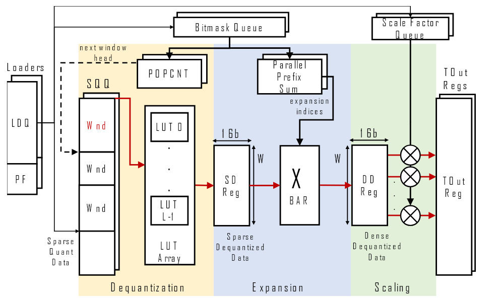

**図 11.** DECA PE のマイクロアーキテクチャ。

**メモリへのアクセス。** DECA には 2 つの Loader があり, 各 Loader は *Load Queue* (LDQ) と prefetcher (PF) で構成される。LDQ はメモリから圧縮重み、bitmask、スケーリング係数を読む。これらのアドレス基底と長さは DECA 呼び出し時に CPU が渡すメタデータに含まれる。要求した cache line がメモリから到着すると, 含まれるデータの種類に応じて *Sparse Quantized Queue* (SQQ)、*Bitmask Queue*、*Scale Factor Queue* に置かれる。PF は tile のアドレス基底と長さを観測して将来の tile の値を予測し, データを L2 cache に運ぶ prefetch request を生成する。高い L2 MSHR 占有率を保つよう PF の積極性を動的に調整する。

**Pipeline stage。** pipeline は逆量子化、拡張 (非疎化)、スケーリングを担う 3 段階に分かれる。各段階は pipeline 化のため出力レジスタ (SD、DD、TOut) を持つ。逆量子化段階は SQQ から値を読み, $L$ 個の lookup table (*LUT Array*) で逆量子化し, BF16 値を *Sparse Dequantized* (SD) レジスタに書く。値はゼロを省いて連続格納されるため疎な場合がある。拡張段階は bitmask が示す位置にゼロを挿入して非疎化する。これは拡張 index で制御する crossbar (*XBAR*) が行い, index は bitmask から *Parallel Prefix Sum* 回路で生成する。結果は明示的なゼロを含む密な逆量子化データとして *Dense Dequantized* (DD) レジスタに書かれる。最後にグループ量子化を使う場合, Scaling 段階がスケーリング係数との乗算で BF16 値を適切に縮尺し, 最終値を *TOut* レジスタに書く。図の赤い矢印はクリティカルパスを示す。

**複製モジュール。** DECA PE は DECA と CPU の動作を重ねるため 2 つの Loader と 2 つの TOut レジスタを持つ。そのため図 [11](#figure-11) のように PE は LDQ、PF、入力 queue (SQQ、Bitmask queue、Scale Factor queue)、TOut を複製する。一方の Loader がデータを供給する間, pipeline はもう一方が供給したデータを処理できる。bitmask 処理回路は主に 1 ビットデータの加算を行い, レイテンシを隠すためこれも複製する。残りの pipeline は複製せず, 一度に 1 つの Loader-TOut 対で使う。

**ベクトル操作 (vOp)。** 常に 512 個の BF16 要素を含む解凍済み BF16 tile の生成には複数サイクルかかる。pipeline は一度に *W* 要素の出力 chunk を生成し, 各 chunk に 1 回の DECA Vector Operation (vOp) を使うためである。pipeline bubble がなければ毎サイクル新しい chunk を生成する。vOp は SQQ からデータを読み, pipeline stage を通って最後に W 要素を TOut に書く。vOp は pipeline を活用し, 1 つが Expansion に入ると次が Dequantization に入れる。tile の vOp は in-order に処理され, (1) 入力がメモリから到着し, (2) 最初の stage が空いている限り pipeline に入れる。

疎性がなければ vOp は SQQ から W 要素を読む。疎性がある場合, SQQ にゼロがないため必要数は W 未満になる。vOp が SQQ から読む要素を vOp の window (*Wnd*) と呼ぶ。Wnd のサイズを決めるため, POPCNT 回路が bitmask の "1" の数を数え, 現在の Wnd の終端と次の Wnd の開始を求める。後者は pipeline に読み込む次の SQQ 位置である。

**LUT Array の構成。** DECA の逆量子化段階は最大 8 ビットの量子化数をサポートし, 最大 256 種類の値を表せる。そのため LUT Array の各 $L$ 個の LUT は 256 ($2^8$) 個の BF16 値を格納する。8 ビット値の逆量子化は, その値を LUT address とする lookup に対応する。DECA は複数値を並列に逆量子化するため $L$ 個の LUT を持つ。各 LUT は内部で 4 つの小さな sub-LUT に分かれ, 各 sub-LUT は read port と 64 ($2^6$) 個の entry を持つ。量子化データの bitwidth が 6 以下なら 4 sub-LUT を独立に使い, 256-entry の "big" LUT から 4 回読み出せる。6 ビット未満では一部の LUT entry が冗長で実行時には使われない。

**Bubble と Roof-Surface。** DECA 面積を抑えるため "big" LUT 数を $L < W$ にする。vOp の Wnd が $L$ 要素を超えると, vOp は Dequantization stage を 1 サイクル以上占有し, pipeline に 1 つ以上の *bubble* が入り vOp スループットを低下させる。例えば密な 8 ビット量子化方式の Wnd は W なので, vOp の逆量子化には常に $W/L$ サイクル必要である。$L < W$ は密な方式の DECA スループットを制限するが, BF8_100% や MXFP4 のような密な方式は VEC 領域を抜けるために必要なベクトルスループット (VOS) が小さいため大きな問題ではない。図 [5](#figure-05) の BORD にこれが表れている。

一方, より疎な方式は VEC-bound 領域を抜けるため高い VOS を必要とする。DECA pipeline ではこれが自然に実現される。疎性が増すほど vOp の Wnd が $L$ を超える確率が下がるためである。その結果 sparse 方式では bubble が減り, 同じ $L$ で密な方式より高いスループットを自然に得る。低 bitwidth 方式も LUT Array から $L$ を超える値を並列に読み出せるため同じ挙動を示す。

**汎用性と性能。** DECA は 8 ビット以下の量子化形式、グループ量子化、非構造化疎性をサポートし, 現在および将来考えられるモデル圧縮方式の大半をカバーする。LUT Array の値やスケーリング係数を変えるだけで, ハードウェアを再設計せず豊富な形式を支援できる柔軟な設計である。不要な stage は省略できる (例えば疎性なしの量子化)。性能面では, DECA が逆量子化、拡張、スケーリングをまとめて行う 1 回の vOp で複数の AVX 命令を置き換えることが主な利点である。vOp 数の減少により *$\mathrm{AI}_{\mathrm{XV}}$ が増加し* ([第 4 節](#section-4)), 点が VEC 領域から離れる。さらに DECA は非ゼロ値だけを効率よく逆量子化する。これは従来のベクトル ISA を持つ CPU では, 拡張時のデータ依存分岐のため難しい。

<span id="section-6-2"></span>

### 6.2 マイクロアーキテクチャの定量設計

前節では Roof-Surface モデルが DECA 設計に *定性的に* 影響した方法を説明した。例えば CPU の幅や AVX 資源を盲目的に拡張するのではなく, $\mathrm{AI}_{\mathrm{XV}}$ を最適化して高性能アクセラレータを設計することを示唆した。ここでは DECA の $W$ と $L$ を *定量的に* 決め, 均衡の取れた設計を導く方法を説明する。

式 [2](#equation-02) を考える。式のパラメータが $W$ と $L$ にどう依存するかを表す必要がある。実際には $\mathrm{AI}_{\mathrm{XV}}$ だけが $W$ と $L$ に依存する。$\mathrm{VOS}=c\cdot1\cdot f$ である。$c$ 個の CPU コアがそれぞれ 1 つの DECA PE を持ち, 各 PE はコア周波数で 1 サイクルに最大 1 vOp を完了できるためである。一方 kernel ごとの $\mathrm{AI}_{\mathrm{XV}}$ は DECA の $W$ と $L$ に依存する。計算には tile あたりの vOp 数と bubble 数を合計する必要がある。

<span id="table-02"></span>

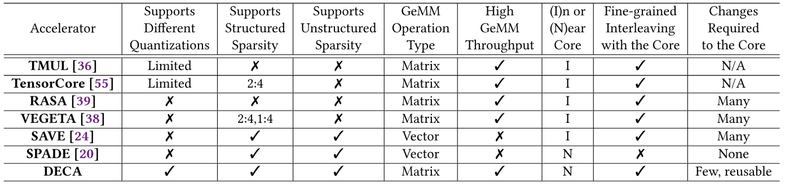

**表 2.** DECA と他のコア内/近コアアクセラレータの比較。

tile あたりの vOp 数は $\#\mathrm{vOps}=512/W$ である。各 tile は 512 要素を持ち, 1 vOp で W 要素を生成するためである。tile あたりの bubble 数を $\#\mathrm{bbl}=\#\mathrm{vOps}\cdot\mathit{bpv}$ と表す。$\mathit{bpv}$ は vOp あたりの bubble 数である。bubble は Dequantization stage の資源不足だけで生じるため, 1 サイクルに逆量子化できる最大要素数を $L_q$ とする。8 ビット量子化では $L_q=L$, 7 ビットでは $2*L$, 6 ビット以下では $4*L$ である。疎性がなければ $\mathit{bpv}=\lceil W/L_q\rceil-1$。疎性がある場合, bubble 数は圧縮 tile の非ゼロ数に依存するため決定的でない。密度 $d$ の行列で非ゼロが一様に分布すると仮定すると, 連続する W 個の行列要素に含まれる非ゼロ数はパラメータ W, d の二項分布になる。bubble の期待数は次で計算する: $$\begin{aligned}
\mathit{bpv} &=  \sum\nolimits_{k=0}^{\frac{W}{L_q}-1} k \cdot [F((k+1)L_q; W, d) - F(kL_q; W, d)]
\end{aligned}$$ ここで $F(i;W,d)$ は二項累積分布関数である。最後に $\mathrm{AI}_{\mathrm{XV}}=1/[\#\mathrm{vOps}\cdot(1+\mathit{bpv})]$ となる。

これで Roof-Surface モデルによる解析的な Design Space Exploration (DSE) に必要なものがそろう。例えば異なる ($W$, $L$) の BORD を描き, 最小の DECA ハードウェアコストで全 kernel を VEC-bound 領域から出せる組を選べる ([第 9.2 節](#section-9-2))。

<span id="section-7"></span>

## 7 解凍ボトルネックに対する DECA の代替案

[第 5 節](#section-5) と [第 6 節](#section-6) では, DECA が豊富な圧縮方式を支えながら高い解凍性能を維持する方法を説明した。ここでは DECA の代替となる 2 つの方式, CPU コアのベクトル資源の拡張と他のコア内/近コアアクセラレータ設計の短所を議論する。

1. **CPU ベクトル資源の従来型拡張。** [第 4 節](#section-4) の Roof-Surface 分析によれば, 大半の解凍オーバーヘッドを隠すにはベクトルスループット (VOS) を 4x 超増やす必要がある。コアのベクトル資源を従来方式で拡張してこれを支えるのは難しい。SIMD AVX ベクトルユニット数を 4x 超増やす方法があるが, [第 4 節](#section-4) のとおりコアはすでに commit slot の 40-80% を使っている。そのためユニットの大幅な増加には superscalar コア幅の大幅な増加が必要で, コア面積が superscalar 幅の二乗で増えるため望ましくない [Pal97]。別の方法は SIMD AVX のベクトル幅を増やすことである。少なくとも 2048 ビットの複数 cache line オペランドを扱う新しい AVX 命令が必要になる。しかし AVX2048 の支援には, すべてのベクトル命令の幅広版や新しいレジスタファイルなど, ISA と pipeline の大幅な変更が必要である。さらにこれほど大きなベクトルをコアに供給するには最低でも L1 cache の port 数を増やす必要があり, L1 アクセスレイテンシとコアの cycle time を悪化させて汎用ワークロードの性能に影響する。[第 9 節](#section-9) で DECA と定量比較する。
2. **行列操作を使うコア内アクセラレータ。** TMUL や RASA [Jeo21] のような従来の行列ユニットは圧縮 tile を扱えない。tile 解凍を避けるため, VEGETA [Jeo23] など一部のコア内アクセラレータ設計 [Jeo23, Pel24, Nvi24d] は特定の構造化疎パターンを行列ユニットに追加する。この方式は, より大きな行列ユニット、より多いアーキテクチャレジスタ、レジスタ rename の変更など, コアのハードウェア複雑度を高める。ゼロ値を含む計算を省略して行列スループット ($\mathrm{MOS}$) を増やせるものの, [第 4 節](#section-4) の Roof-Surface 分析では本研究の kernel にその増加は不要である。ほとんどの kernel はベクトル律速領域を抜けるとメモリ律速になる。他の設計はより効率的な低ビット量子化形式を行列ユニットでネイティブに支援する [Jan24, Nvi24d]。しかし対応形式ごとに行列ユニットへ追加ハードウェアが必要で, 未知の新形式が現れれば再設計も必要になる。DECA は形式ごとの追加ハードウェアなしに, LUT Array の値やスケーリング係数を変えて非常に多くの量子化形式を支援できる。柔軟性により将来の形式にも再設計なしで対応できる。原理的には DECA の全ハードウェア (LUT Array、拡張・スケーリング回路など) を行列乗算ユニットに統合できる。しかし DECA の分離方式には重要な利点がある。第一に柔軟性が増す。decompressor の出力を別のアクセラレータに渡したり, メモリへ書き戻したり, 他用途に使えたりする。第二に独自 Loader を持つアクセラレータを L2 に接続することで, DECA はデータをより効果的に fetch・prefetch できる。最後に CPU コアの ISA と pipeline の変更が少なく, 汎用ワークロード性能への影響リスクが低い。
3. **ベクトル操作を使うコア内/近コアアクセラレータ。** SPADE [Ger23] と SAVE [Gon20] は CPU に統合するよう設計された疎アプリケーション向けアクセラレータである。しかし行列ユニットではなくベクトルユニットで実際の GeMM を実行する。この方式は非常に疎な行列には使えるかもしれないが, 機械学習モデルに見られる中程度の疎行列では行列ユニットの高スループットを使う必要がある [Yan24m]。

他の最先端コア内/近コアアクセラレータと比べ, 表 [2](#table-02) は DECA が可能にする特性の独自の組合せをまとめる。第一に, DECA は構造化または非構造化疎性と豊富な量子化方式を組み合わせて支援する初の設計であり, TMUL 行列ユニットと協調して高い GeMM スループットも実現する。第二に投機呼び出しにより, コアとの細粒度インターリーブを可能にする初の近コア設計である。最後にコア pipeline の変更は少なく, 他の近コアアクセラレータにも再利用できる ([第 5.3 節](#section-5-3))。

<span id="section-8"></span>

## 8 方法論

**シミュレーションとシステムパラメータ。** 評価のため, AMX を完全に支援する Sniper [Car14] ベースの内部 simulator で SPR 類似パラメータの 56 コアサーバをシミュレートする。DDR5 設計と HBM 設計の達成可能メモリ帯域幅はそれぞれ約 260GB/s と 850GB/s である。simulator に (1) DECA PE, (2) コア pipeline で TEPL を支える TEPL queue と port を追加する。コアと DECA PE は 2.5GHz で動作する。baseline PE は W=32, L=8 とし, [第 9.2 節](#section-9-2) で他の選択肢も評価する。

**ソフトウェアと DECA 制御コード生成。** Intel Libxsmm の圧縮 GeMM kernel ([第 2.4 節](#section-2-4)) をソフトウェア baseline とする。DECA を呼び出すため, libxsmm JIT compiler を変更し AVX 解凍列を TEPL 命令に置き換える。

圧縮 GeMM に対する DECA の効果を単独で測るため, FC 層だけからなる大規模 cascade を実装し, ループ並列化に Parlooper [Geo23] を使う。これらの層の重み行列は Llama-2-70B の大規模 FC 層と同程度の $\approx250$ million パラメータを持つ。libxsmm と Parlooper は CPU 上の Llama-2 と OPT の end-to-end 推論を支援する Intel Tensor Processing Primitives (TPP) Framework [Geo21a] に統合済みである。そこでソフトウェアのみの推論には TPP をそのまま使い, DECA 推論には TEPL 対応 libxsmm kernel を呼び出す。batch size 1-16 を試す。simulator はすべての framework と互換性がある。

**圧縮方式。** 評価では BF16、BF8、MXFP4 をそれぞれ Q16、Q8、Q4 と呼ぶ。libxsmm がすでに支援する方式に限定する。Q16 (疎性のみ) と Q8 (量子化と疎性) では重み密度 50% から 5% の非構造化疎性も評価する。Q4 sparse kernel は libxsmm にまだ含まれないため, DECA と比較する参照データはない。end-to-end の Llama-2-70B と OPT-66B 推論では, 非圧縮 Q16 baseline、密度 50% の Q16 (Q16_50%)、Q8_100% は 64GB HBM に収まらない。そのためこれらにはより大きい HBM 容量をシミュレートする。Q4 の性能は AWQ [Lin23d] のようなスケーリング係数付き INT4 圧縮方式も代表する。

**面積見積もり。** W=32, L=8 の DECA 設計面積を見積もる。メモリ構造 (LDQ、SQQ など)、レジスタ、LUT Array には CACTI [Bal17] を使う。crossbar と BF16 multiplier にはそれぞれ [Cak15] と [Zha19j] の値を使い, [Sca17] で 7nm にスケールする。56 DECA PE の総面積は約 2.51 $\mathrm{mm}^2$ と見積もる。Loader、SQQ、Bitmask queue、Scale Factor queue、TOut レジスタが DECA 面積の約 55%, LUT Array が 22%, 残りが 23% を占める。56 コア SPR の総 die 面積は約 1600 $\mathrm{mm}^2$ [Wik24] なので, DECA の面積オーバーヘッドは 0.2% 未満である。

<span id="section-9"></span>

## 9 評価

<span id="section-9-1"></span>

### 9.1 圧縮 GeMM のための DECA

図 [12](#figure-12) と [13](#figure-13) は, 異なる圧縮方式で libxsmm ソフトウェア方式 (*Software-only*) と DECA が非圧縮 BF16 baseline に対して得る speedup を示す。すべての VEC オーバーヘッドが隠れると仮定した *Roofline* モデルの *Optimal* speedup も加える。圧縮方式は圧縮係数の昇順に並べ, N=1 の結果を示す。

<span id="figure-12"></span>

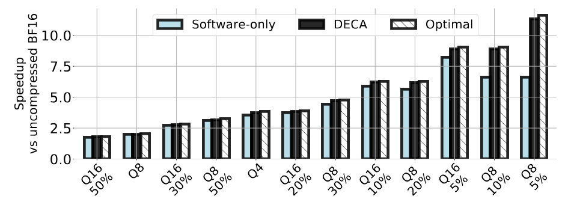

**図 12.** DDR、$N=1$ における圧縮 GeMM の speedup。

<span id="figure-13"></span>

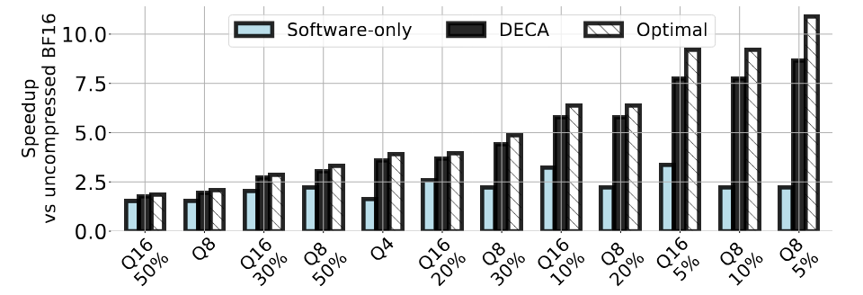

**図 13.** HBM、$N=1$ における圧縮 GeMM の speedup。

DDR 設定 (図 [12](#figure-12)) では, 高い圧縮係数に限って DECA がソフトウェアのみを上回る。図 [5b](#figure-05) の BORD によれば高圧縮係数だけが VEC-bound なので予想どおりである。speedup は 1.7$\times$ に達する。HBM 設定 (図 [13](#figure-13)) ではほぼすべての圧縮方式で DECA が高速化する。図 [5a](#figure-05) の BORD が示すようにほぼすべてが VEC-bound だからである。speedup は 4.0$\times$ に達する。DDR と HBM の双方で DECA はほぼ最適性能となり, VEC オーバーヘッドが隠れたことが分かる。batch size を N=16 まで増やしても同様の結果を得た。

DECA を備えたコアは従来コアよりベクトル処理能力が高い。図 [14](#figure-14) は DDR、N=4 で全圧縮方式を平均した両種の性能を比較する。コア数 8、16、...56 を比較しており, 例えば DECA 付き 16 コアが従来 56 コアを上回る。余ったコアはメモリ帯域幅をあまり消費しない別ワークロードに解放するか, power-gate して省エネルギー化できる。

<span id="figure-14"></span>

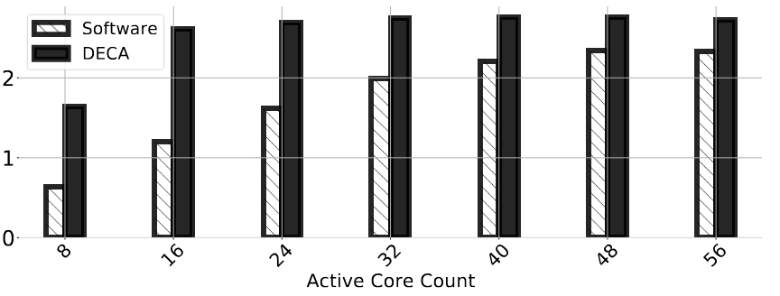

**図 14.** DDR、$N=4$ における異なる圧縮方式の TFLOPS。

ソフトウェアのみのシステムと DECA システムをさらに理解するため, 表 [3](#table-03) はメモリ帯域幅、TMUL、CPU の AVX ユニットまたは DECA の利用率を示す。性能は TMUL 利用率に比例するため, DECA システムが software-only より大幅に高性能であることが分かる。3 要素の操作は重なるので, 利用率が最大の要素がボトルネックになる。software-only ではほぼ全密度で AVX ベクトルユニットがボトルネックであり, Roof-Surface の予測を裏付ける。DECA ではメモリがより有効に使われ, 直接的な性能向上につながる。疎な kernel は実行時間が短いが DECA 利用率はほぼ一定である点に注意する。[第 6 節](#section-6) で説明したように, DECA は疎な方式で自然に高いスループットを達成する。

<span id="table-03"></span>

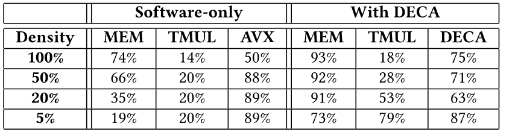{.paper-table-narrow}

**表 3.** Q8、$N=1$、HBM におけるコンポーネント利用率。

図 [15](#figure-15) は解凍オーバーヘッドを緩和するため CPU コアのベクトル資源を拡張する案と DECA を比較する。DECA 付きコアを, (1) ベクトル AVX unit が 4$\times$ 多い (*More AVX Units*) コア, または (2) AVX unit 幅が 4$\times$ 広い (*Wider AVX Units*) コアと比較する。AVX2048 は解凍 loop の 4 反復中 3 つから動的命令を除くという楽観的モデルにする。system cache line は変えないため各 AVX2048 memory 操作は cache-line サイズの操作 4 回として実行する。非 DECA システムでは superscalar 幅や L1 port 数を拡張しない。[第 7 節](#section-7) で説明したように変更が禁止的だからである。図から従来のベクトル拡張方式は DECA よりはるかに低性能だと分かる。

<span id="figure-15"></span>

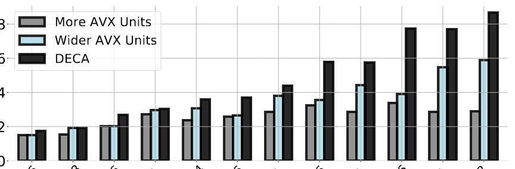

**図 15.** HBM、$N=1$ における DECA と従来ベクトル拡張の比較。

<span id="section-9-2"></span>

### 9.2 Roof-Surface による設計空間探索

DECA の W と L は解凍速度を決めるが, 大きすぎる値は実益なく面積を増やす可能性がある。そこで *Roof-Surface* で異なる {W,L} の性能を調べる。DECA の規模には, 予測性能が飽和する (全 kernel が *VEC-bound でなくなる*) 最小の {W,L} を選ぶ。モデルによれば {W=32,L=8} である。図 [16](#figure-16) では HBM SPR の DECA なし (a) と DECA あり (b) について, {W=8,L=4} (underprovisioned)、{W=32,L=8} (best)、{W=64,L=64} (overprovisioned) の BORD を比較する。

<span id="figure-16"></span>

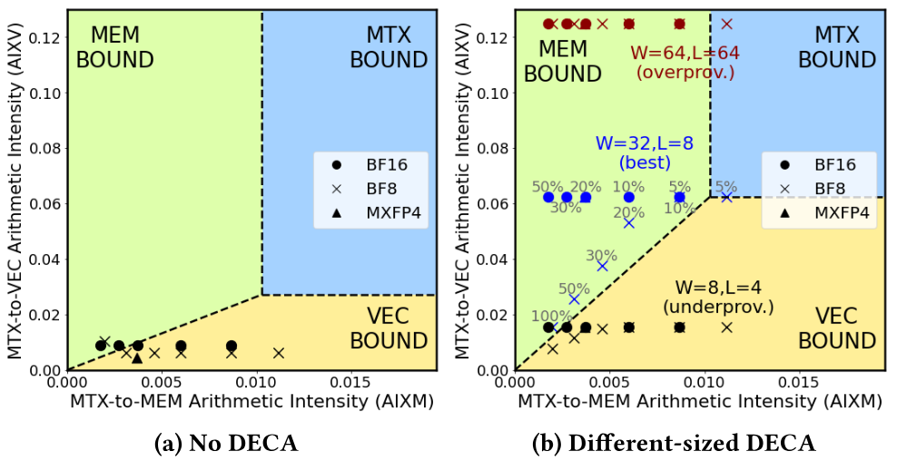

**図 16.** DECA なしと異なる規模の DECA における HBM BORD。

CPU と比べると DECA の VOS パラメータは小さい。VEC-bound 領域が大きいためである。しかし [第 6 節](#section-6) のとおり DECA は行列操作あたりのベクトル操作数を減らし, $\mathrm{AI}_{\mathrm{XV}}$ を増やす。{W=8,L=4} の underprovisioned DECA は kernel を VEC-bound 領域から出せない。{W=64,L=64} の overprovisioned 版は出せるが過剰である。これらの性能をシミュレートしてモデルの正確さを検証する。DECA-best は underprovisioned 版より 2$\times$ 高速で, overprovisioned 版は DECA-best より 3% 未満しか速くない。一方 DECA-best は LUT が 8$\times$ 少なく W が半分で大幅に安価である。総じて Roof-Surface は行列-ベクトル-メモリ相互作用の動きを正確に捉え, マイクロアーキテクチャの判断を導ける。

<span id="section-9-3"></span>

### 9.3 DECA 統合と TEPL の分析

DECA とコアの統合について行った異なる判断を評価する。まず DECA が LLC から圧縮 tile を読み (L2 をバイパス), 解凍 tile をコアが読めるよう L2 に書き, 通常の load、store、fence で呼び出す base 構成から始める。次に (1) accelerator が L2 から圧縮重みを読み L2 prefetcher を使う (*+Reads L2*), (2) L2 prefetcher の代わりに独自 prefetcher を使う (*+DECA prefetcher*), (3) L2 ではなく TOut Regs に書く (*+TOut Regs*), (4) load、store、fence の代わりに TEPL 命令を使う (*+TEPL (DECA)*) と段階的に強化する。

<span id="figure-17"></span>

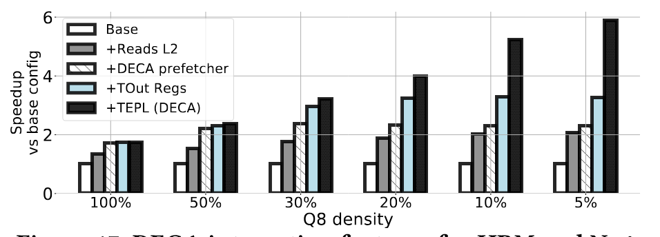

**図 17.** HBM、$N=4$ における DECA 統合機能。

図 [17](#figure-17) は異なる密度の Q8 で, これらの最適化を段階的に適用したときの base 設計に対する speedup を示す。*+Reads L2* は全密度で性能を改善する。システムに既にある L2 hardware prefetcher が将来の tile を取得してメモリと LLC のアクセスレイテンシを隠すためである。*+DECA prefetcher* はデフォルトの L2 prefetcher ではなく DECA prefetcher を使い, さらに改善する。*+TOut Regs* と *+TEPL (DECA)* は DECA-コア通信レイテンシを減らすか隠し, out-of-order 呼び出しに必要である。*+TOut Regs* は L2 を経由する長い経路ではなく DECA から直接データを取得できるようにする。*+TEPL (DECA)* は通信を計算と重ねて通信を効果的に隠す。密度が下がるほど両者の効果が高まる。DECA は低密度 tile の処理時間が短くなる一方, コアとの通信オーバーヘッドは一定だからである。低密度では通信コストが露出しやすい。TEPL は低密度モデルに非常に有効で, 密度 5% では性能を 2 倍にする。

<span id="section-9-4"></span>

### 9.4 LLM 推論のための DECA

最後に, 非 GeMM 段階を含む LLM の次 token 生成で DECA がもたらす性能上の利点を示す。表 [4](#table-04) は HBM 付き SPR 上で入力 128 token、出力 128 token、batch size 1 と 16, 異なる圧縮方式を使った Llama2-70B と OPT-66B の次 token latency を示す。ソフトウェア解凍 (*SW*) と提案方式 (*DECA*) を比較する。説明したように, 非圧縮 BF16 baseline は大きな HBM 容量を仮定してシミュレートする。DECA は *SW* より次 token 時間を 1.6$\times$-2.6$\times$ 短縮する。これは非圧縮 baseline より 2.5$\times$-5.0x の speedup に相当する。短い/長い token 列でも同様の結果を観測した。

<span id="table-04"></span>

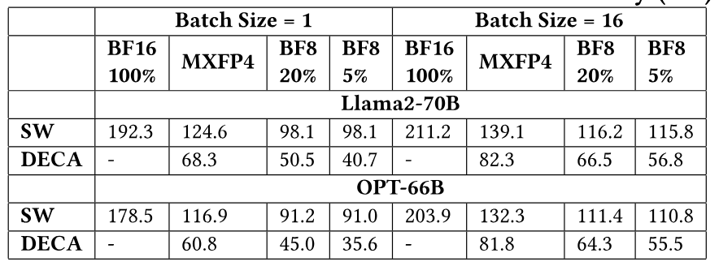{.paper-table-narrow}

**表 4.** Llama2-70B/OPT-66B の次 token latency (ms)。

<span id="section-10"></span>

## 10 その他の関連研究

**分離型アクセラレータ。** ML と科学アプリケーションの疎性を対象とする多様な独立分離型アクセラレータが提案されている [Zha16c, Lu19, Ger24, Par17a, Che22b, Heg19, Sri20, Gon19a, Han16a, Adi23, Aan23]。量子化に依存する分離型アクセラレータもある [Zhu24d, Ryu22, Jan24]。最近は attention 向けアクセラレータも普及している [Wan20b, Kac24, Lu21, Ham21, Ham20]。分離型アクセラレータは大きな面積・電力予算を要し [Jeo23], データ移動オーバーヘッドにも悩まされる [Ger23]。そのため CPU 統合型アクセラレータが提案されており [Ger23, Jeo23, Gon20, Gon22, Jeo21, Nas22], DECA もこの系譜に属する。他のコア内/近コアアクセラレータの短所は [第 7 節](#section-7) で議論した。

**協調ベクトル-行列処理。** 多くのアーキテクチャは異種の行列ユニットとベクトルユニットを含み, その相互作用を *Roof-Surface* モデルで表せる。例として Tandem processor [Gho24]、AWS Trainium [Bsh24, Fan24d]、TPU [Nor21]、Tensor Core と SIMT Core を持つ GPU がある。

**GPU における DECA 着想解凍 engine の有用性。** TMUL と同様 GPU Tensor Core は限られた量子化形式しか支援せず, 非構造化疎性を支援しない。そのため Flash-LLM [Xia23b] などの GPU kernel は libxsmm と同様, ソフトウェアで圧縮データを解凍して Tensor Core に渡す。効果的ではあるが Flash-LLM は SM の L1/共有メモリに圧力をかけ, Tensor Core/HBM の完全利用を妨げる。DECA 着想の解凍 engine は GPU にも有用だと考える。NVIDIA は最近, メモリから Tensor Core へデータを供給する TMA accelerator [Luo24b] を導入した。TMA に DECA 着想の解凍機能を追加することは興味深い将来方向である。

<span id="section-11"></span>

## 11 結論

核内 GeMM engine と HBM を備えた先進 CPU プラットフォームで LLM 推論を改善するため, 本論文は *Roof-Surface* 性能モデル, *DECA* 近コア ML モデル解凍アクセラレータ, out-of-order accelerator invocation のための TEPL ISA 拡張という 3 つの貢献を行った。評価により DECA が圧縮 GeMM と LLM 推論を効果的に高速化することを示した。
