# DeepSeekMoE

> **原題：** *DeepSeekMoE: Towards Ultimate Expert Specialization in Mixture-of-Experts Language Models* 
> **著者：** [Damai Dai](https://dblp.org/pid/199/2097.html) [+internship]、[Chengqi Deng](https://dblp.org/pid/255/4939.html)、[Chenggang Zhao](https://dblp.org/pid/254/2607.html) [+internship]、[R.X. Xu](https://dblp.org/pid/267/5291.html)、[Huazuo Gao](https://dblp.org/pid/366/3356.html)、[Deli Chen](https://dblp.org/pid/50/2637.html)、[Jiashi Li](https://dblp.org/pid/241/9364.html)、[Wangding Zeng](https://dblp.org/pid/315/5319.html)、[Xingkai Yu](https://dblp.org/pid/257/4432.html) [+internship]、[Y. Wu](https://dblp.org/pid/22/0-24.html)、[Zhenda Xie](https://dblp.org/pid/239/8676.html)、[Y.K. Li](https://dblp.org/pid/16/8783.html)、[Panpan Huang](https://dblp.org/pid/19/6338.html)、[Fuli Luo](https://dblp.org/pid/220/4216.html)、[Chong Ruan](https://dblp.org/pid/159/9956.html)、[Zhifang Sui](https://dblp.org/pid/22/5834.html)、[Wenfeng Liang](https://dblp.org/pid/59/9456.html) 
> **所属：** DeepSeek-AI；北京大学マルチメディア情報処理国家重点実験室；清華大学交叉情報研究院；南京大学新型ソフトウェア技術国家重点実験室 
> **出典：** 2024 年 1 月 11 日に初回投稿；[arXiv v1](https://arxiv.org/abs/2401.06066v1)；<a href="/paper/deepseek-moe.pdf" target="_blank" rel="noopener noreferrer">ローカル PDF</a>；[arXiv DOI](https://doi.org/10.48550/arXiv.2401.06066)；その後 ACL 2024、1280–1297 ページに掲載（[論文](https://aclanthology.org/2024.acl-long.70/)、[DOI](https://doi.org/10.18653/v1/2024.acl-long.70)）；[TeX ソース](https://export.arxiv.org/e-print/2401.06066v1)；[コードとモデル](https://github.com/deepseek-ai/DeepSeek-MoE)

[+internship]: DeepSeek-AI でのインターン期間中の貢献。

## 概要

大規模言語モデルの時代において、Mixture-of-Experts（MoE）は、モデルのパラメータを拡大する際の計算コストを抑えるための有望なアーキテクチャである。しかし、$N$ 個のエキスパートから上位 $K$ 個を活性化する GShard のような従来の MoE アーキテクチャでは、各エキスパートが重複せず焦点の定まった知識を獲得するという、エキスパート特化の実現が難しい。この問題に対し、究極のエキスパート特化を目指す **DeepSeekMoE** アーキテクチャを提案する。これには二つの主要な戦略がある。(1) エキスパートを $mN$ 個へ細分化し、そのうち $mK$ 個を活性化することで、活性化エキスパートをより柔軟に組み合わせられるようにする。(2) $K_s$ 個のエキスパートを共有エキスパートとして分離し、共通知識を捉えるとともに、ルーティング対象エキスパートの冗長性を緩和する。まず、控えめな 2B パラメータ規模から始め、DeepSeekMoE 2B が、エキスパートのパラメータ数と計算量が 1.5$\times$ である GShard 2.9B に匹敵する性能を達成することを示す。さらに、DeepSeekMoE 2B は、総パラメータ数が同じで MoE モデルの上限を定める密モデルにも迫る性能を示す。次に DeepSeekMoE を 16B パラメータへ拡張し、約 40% の計算量だけで LLaMA2 7B に匹敵する性能を達成することを示す。さらに、DeepSeekMoE を 145B パラメータへ拡張する予備的な取り組みにおいても、GShard アーキテクチャに対する大幅な優位性が一貫して確認され、計算量を 28.5%（場合によっては 18.2%）しか用いずに DeepSeek 67B に匹敵する性能が示された。

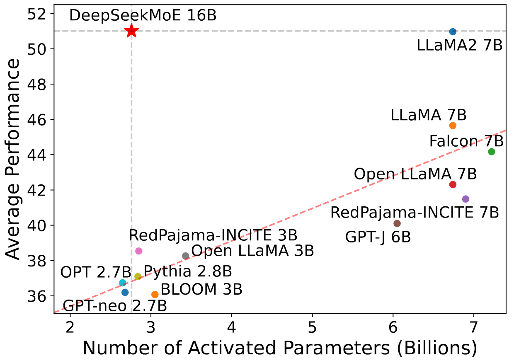

**図 1.** Open LLM Leaderboard における DeepSeekMoE 16B とオープンソースモデルの比較。赤い破線は、DeepSeekMoE 16B を除く全モデルのデータ点から線形フィッティングしたものである。DeepSeekMoE 16B は、活性化パラメータ数が近いモデルを一貫して大幅に上回り、活性化パラメータ数が約 2.5 倍の LLaMA2 7B に匹敵する性能を達成する。

## 1 はじめに

近年の研究と実践から、十分な訓練データが利用できる場合、パラメータ数と計算予算を増やして言語モデルをスケールさせることで、著しく強力なモデルを得られることが実証されている [Bro20, Ope23, Tou23, Hof22]。しかし、モデルを極めて大規模にする試みには、非常に高い計算コストも伴うことを認識しなければならない。この莫大なコストを踏まえ、Mixture-of-Experts（MoE）アーキテクチャ [Jac91, Jor94, Sha17] が広く用いられる解決策として登場した。これは計算コストを適度な水準に保ちながら、パラメータ数を拡大できる。Transformer [Vas17d] に MoE アーキテクチャを適用した近年の研究では、言語モデルを大規模化する試みが成功し [Fed22, Lep20, Du22, Zop22]、顕著な性能を達成している。これらの成果は、MoE 言語モデルが大きな可能性と将来性を備えていることを裏づけている。

MoE アーキテクチャには有望な可能性がある一方、既存の MoE アーキテクチャは、知識の混在と知識の冗長性という問題を抱える可能性があり、各エキスパートが重複せず焦点の定まった知識を獲得するというエキスパート特化を妨げている。従来の MoE アーキテクチャは、Transformer の Feed-Forward Network（FFN）を MoE 層で置き換える。各 MoE 層は、標準的な FFN と同じ構造を持つ複数のエキスパートからなり、各トークンは一つ [Fed22] または二つ [Lep20] のエキスパートへ割り当てられる。このアーキテクチャには二つの潜在的な問題がある。(1) **知識の混在：** 既存の MoE では、エキスパート数が少ない（例えば 8 または 16）ことが多く、特定のエキスパートへ割り当てられるトークンが多様な知識を含みやすい。その結果、そのエキスパートは大きく異なる種類の知識をパラメータ内に集めようとするが、それらを同時に活用することは難しい。(2) **知識の冗長性：** 異なるエキスパートへ割り当てられるトークンが共通知識を必要とする場合がある。その結果、複数のエキスパートがそれぞれのパラメータ内で同じ知識を獲得する方向へ収束し、エキスパートのパラメータに冗長性が生じる。これらの問題が重なることで、既存の MoE におけるエキスパート特化が阻害され、MoE モデルの理論的な性能上限へ到達できなくなる。

これらの問題に対応するため、究極のエキスパート特化に向けて特別に設計した革新的な MoE アーキテクチャ、**DeepSeekMoE** を導入する。本アーキテクチャは二つの主要な戦略からなる。(1) **細粒度エキスパート分割：** パラメータ数を一定に保ったまま、FFN の中間隠れ次元を分割してエキスパートをより細かな粒度にする。それに対応して、計算コストを一定に保ちながら、より多くの細粒度エキスパートを活性化し、活性化エキスパートをより柔軟かつ適応的に組み合わせられるようにする。細粒度エキスパート分割により、多様な知識をより細かく分解し、異なるエキスパートへより正確に学習させられるため、各エキスパートはより高い特化度を維持できる。さらに、活性化エキスパートの組み合わせが柔軟になることで、より正確で対象を絞った知識獲得も可能になる。(2) **共有エキスパート分離：** 常に活性化される共有エキスパートとして一部のエキスパートを分離し、さまざまな文脈に共通する知識を捉えて集約する。共通知識をこれらの共有エキスパートへ圧縮することで、それ以外のルーティング対象エキスパート間の冗長性が緩和される。これによりパラメータ効率を高め、各ルーティング対象エキスパートが固有の側面に集中して特化した状態を保てる。DeepSeekMoE におけるこれらのアーキテクチャ上の革新は、各エキスパートが高度に特化した、パラメータ効率の高い MoE 言語モデルを訓練する道を開く。

まず、控えめな 2B パラメータ規模から、DeepSeekMoE アーキテクチャの利点を検証する。多様なタスクにまたがる 12 のゼロショットまたは少数ショットのベンチマークで評価を行う。実験結果から、DeepSeekMoE 2B は GShard 2B [Lep20] を大幅に上回り、さらにエキスパートのパラメータ数と計算量が 1.5$\times$ の、より大きな MoE モデルである GShard 2.9B にも匹敵することが分かる。注目すべきことに、DeepSeekMoE 2B は、MoE 言語モデルの厳密な上限を定める、同等のパラメータ数を持つ密モデルにも迫る性能を示す。さらに深い知見を得るため、DeepSeekMoE について詳細なアブレーション研究とエキスパート特化の分析を行う。これらの研究により、細粒度エキスパート分割と共有エキスパート分離の有効性が検証され、DeepSeekMoE が高いエキスパート特化を達成できるという主張を支持する実証的な根拠が得られる。

本アーキテクチャを活用して、続いてモデルのパラメータ数を 16B へ拡張し、2T トークンの大規模コーパスで DeepSeekMoE 16B を訓練する。評価結果から、DeepSeekMoE 16B は、同じ 2T コーパスで訓練した密モデル DeepSeek 7B [Dee24e] に、約 40% の計算量だけで匹敵する性能を達成することが分かる。また、DeepSeekMoE をオープンソースモデルと比較した評価では、DeepSeekMoE 16B が活性化パラメータ数の近いモデルを一貫して大幅に上回り、活性化パラメータ数が約 2.5 倍の LLaMA2 7B [Tou23a] に匹敵する性能を達成することが示される。[図 1](#figure-01) は Open LLM Leaderboard [+1] における評価結果を示す。さらに、アラインメントのために教師ありファインチューニング（SFT）を行い、モデルをチャットモデルへ変換する。評価結果から、DeepSeekMoE Chat 16B はチャット設定でも DeepSeek Chat 7B および LLaMA2 SFT 7B に匹敵する性能を達成することが分かる。これらの結果を受け、さらに DeepSeekMoE を 145B へ拡張する予備的な試みに着手する。その実験結果でも、GShard アーキテクチャに対する大幅な優位性が一貫して確認される。加えて、計算量を 28.5%（場合によっては 18.2%）しか用いずに、DeepSeek 67B に匹敵する性能を示す。

本研究の貢献を以下にまとめる。

- **アーキテクチャ上の革新。** 究極のエキスパート特化を目指し、細粒度エキスパート分割と共有エキスパート分離という二つの主要戦略を採用する革新的な MoE アーキテクチャ、DeepSeekMoE を導入する。

- **実証的検証。** DeepSeekMoE アーキテクチャの有効性を実証するため、広範な実験を行う。実験結果は DeepSeekMoE 2B の高いエキスパート特化を裏づけ、DeepSeekMoE 2B が MoE モデルの性能上限にほぼ到達できることを示す。

- **スケーラビリティ。** DeepSeekMoE を拡張して 16B モデルを訓練し、約 40% の計算量だけで DeepSeekMoE 16B が DeepSeek 7B および LLaMA2 7B に匹敵する性能を達成することを示す。さらに、DeepSeekMoE を 145B へ拡張する予備的な試みにも着手し、GShard アーキテクチャに対する一貫した優位性と、DeepSeek 67B に匹敵する性能を示す。

- **MoE のアラインメント。** DeepSeekMoE 16B に対する教師ありファインチューニングを成功させてアラインメント済みチャットモデルを作成し、DeepSeekMoE 16B の適応性と汎用性を示す。

- **一般公開。** オープンな研究の精神に基づき、DeepSeekMoE 16B のモデルチェックポイントを一般公開する。特に、このモデルは量子化を必要とせず、40GB メモリの単一 GPU 上へデプロイできる。

## 2 予備知識：Transformer の Mixture-of-Experts

まず、Transformer 言語モデルで一般的に用いられる汎用的な MoE アーキテクチャを紹介する。標準的な Transformer 言語モデルは、標準 Transformer ブロックを $L$ 層積み重ねて構築され、各ブロックは次のように表せる。 $$\begin{aligned}
    \mathbf{u}_{1:T}^{l} &= \operatorname{Self-Att}\left( \mathbf{h}_{1:T}^{l-1} \right) + \mathbf{h}_{1:T}^{l-1}, \\
    \mathbf{h}_{t}^{l} &= \operatorname{FFN}\left( \mathbf{u}_{t}^{l} \right) + \mathbf{u}_{t}^{l},
\end{aligned}$$ ここで、$T$ は系列長、$\operatorname{Self-Att}(\cdot)$ は自己注意モジュール、$\operatorname{FFN}(\cdot)$ は Feed-Forward Network（FFN）、$\mathbf{u}_{1:T}^{l} \in \mathbb{R}^{T \times d}$ は $l$ 番目の注意モジュール後における全トークンの隠れ状態、$\mathbf{h}_{t}^{l} \in \mathbb{R}^{d}$ は $l$ 番目の Transformer ブロック後における $t$ 番目のトークンの出力隠れ状態を表す。簡潔にするため、上式では層正規化を省略している。

MoE 言語モデルを構築する一般的な方法は、Transformer 内の FFN を一定間隔で MoE 層に置き換えることである [Fed22, Lep20, Du22, Zop22]。MoE 層は複数のエキスパートからなり、各エキスパートは標準的な FFN と同一の構造を持つ。そして、各トークンは一つ [Fed22] または二つ [Lep20] のエキスパートへ割り当てられる。$l$ 番目の FFN を MoE 層で置き換える場合、出力隠れ状態 $\mathbf{h}_{t}^{l}$ の計算は次のように表される。 $$\begin{aligned}
\mathbf{h}_{t}^{l} & = \sum_{i=1}^{N} \left( {g_{i,t} \operatorname{FFN}_{i}\left( \mathbf{u}_{t}^{l} \right)} \right) + \mathbf{u}_{t}^{l}, \\
g_{i,t} & = \begin{cases}
s_{i,t}, & s_{i,t} \in \operatorname{Topk} (\{ s_{j, t} | 1 \leqslant j \leqslant N \}, K), \\
0, & \text{otherwise},
\end{cases} \\
s_{i,t} & = \operatorname{Softmax}_i \left( {\mathbf{u}_{t}^{l}}^\top \mathbf{e}_{i}^{l} \right),
\end{aligned}$$ ここで、$N$ はエキスパートの総数、$\operatorname{FFN}_{i}(\cdot)$ は $i$ 番目のエキスパート FFN、$g_{i,t}$ は $i$ 番目のエキスパートのゲート値、$s_{i,t}$ はトークンとエキスパートの親和度、$\operatorname{Topk}(\cdot, K)$ は $t$ 番目のトークンと全 $N$ エキスパートについて計算した親和度スコアのうち上位 $K$ 個からなる集合、$\mathbf{e}_{i}^{l}$ は $l$ 番目の層における $i$ 番目のエキスパートのセントロイドを表す。$g_{i,t}$ は疎であり、$N$ 個のゲート値のうち非ゼロなのは $K$ 個だけである。この疎性により、MoE 層内の計算効率が保証される。すなわち、各トークンが割り当てられて計算されるのは $K$ 個のエキスパートだけである。上式でも、簡潔にするため層正規化の演算を省略している。

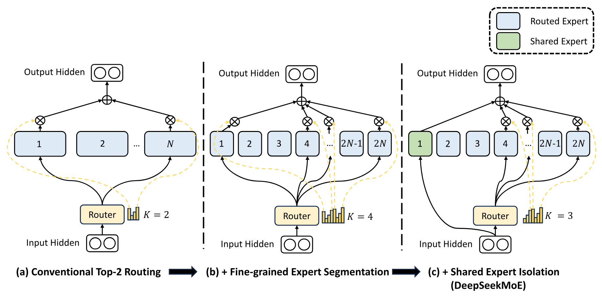

**図 2.** DeepSeekMoE の概略図。(a) は従来の top-2 ルーティング戦略を用いる MoE 層を示す。(b) は細粒度エキスパート分割戦略を示す。続く (c) は共有エキスパート分離戦略を統合し、完全な DeepSeekMoE アーキテクチャを構成する様子を示す。これら三つのアーキテクチャでは、エキスパートのパラメータ数と計算コストが一定であることに注意されたい。

## 3 DeepSeekMoE アーキテクチャ

[第 2 節](#section-2) で概説した汎用 MoE アーキテクチャを基礎として、エキスパート特化の可能性を引き出すために特別に設計した DeepSeekMoE を導入する。[図 2](#figure-02) に示すように、本アーキテクチャは細粒度エキスパート分割と共有エキスパート分離という二つの主要戦略を取り入れている。どちらの戦略も、エキスパート特化の度合いを高めることを目的としている。

### 3.1 細粒度エキスパート分割

エキスパート数が限られる場合、特定のエキスパートへ割り当てられるトークンは、多様な種類の知識を含みやすい。その結果、そのエキスパートは大きく異なる種類の知識をパラメータ内で学習しようとするが、それらを同時に活用することは難しい。しかし、各トークンをより多くのエキスパートへルーティングできれば、多様な知識を分解し、それぞれ異なるエキスパートで学習できる可能性が生まれる。このとき、各エキスパートは高い特化度を維持でき、エキスパート間で知識をより集中的に分布させられる。

この目標に向けて、エキスパートのパラメータ数と計算コストを一定に保ちながら、エキスパートをより細かな粒度へ分割する。細かなエキスパート分割により、活性化エキスパートをより柔軟かつ適応的に組み合わせられるようになる。具体的には、[図 2](#figure-02)(a) に示す典型的な MoE アーキテクチャを基礎として、FFN の中間隠れ次元を元の $\frac{1}{m}$ 倍へ縮小し、各エキスパート FFN を $m$ 個の小さなエキスパートへ分割する。各エキスパートが小さくなるため、それに応じて活性化するエキスパート数も $m$ 倍へ増やし、[図 2](#figure-02)(b) に示すように計算コストを同じに保つ。細粒度エキスパート分割を用いると、MoE 層の出力は次のように表せる。 $$\begin{aligned}
\mathbf{h}_{t}^{l} & = \sum_{i=1}^{mN} \left( {g_{i,t} \operatorname{FFN}_{i}\left( \mathbf{u}_{t}^{l} \right)} \right) + \mathbf{u}_{t}^{l}, \\
g_{i,t} & = \begin{cases}
s_{i,t}, & s_{i,t} \in \operatorname{Topk} (\{ s_{j, t} | 1 \leqslant j \leqslant mN \}, mK), \\
0, & \text{otherwise},
\end{cases} \\
s_{i,t} & = \operatorname{Softmax}_i \left( {\mathbf{u}_{t}^{l}}^\top \mathbf{e}_{i}^{l} \right),
\end{aligned}$$ ここで、エキスパートの総パラメータ数は標準 FFN のパラメータ数の $N$ 倍に等しく、$mN$ は細粒度エキスパートの総数を表す。細粒度エキスパート分割戦略により、非ゼロのゲート数も $mK$ へ増加する。

組合せ論の観点から見ると、細粒度エキスパート分割戦略は、活性化エキスパートの組合せの柔軟性を大幅に高める。例として、$N=16$ の場合を考える。典型的な top-2 ルーティング戦略で得られる組合せは $\binom{16}{2}=120$ 通りである。これに対し、各エキスパートを $4$ 個の小さなエキスパートへ分割すると、細粒度ルーティング戦略で得られる組合せは $\binom{64}{8}=4,426,165,368$ 通りになる。組合せの柔軟性が飛躍的に増すことで、より正確で対象を絞った知識獲得を実現できる可能性が高まる。

### 3.2 共有エキスパート分離

従来のルーティング戦略では、異なるエキスパートへ割り当てられたトークンが、何らかの共通知識や情報を必要とする場合がある。その結果、複数のエキスパートがそれぞれのパラメータで同じ知識を獲得する方向へ収束し、エキスパートのパラメータに冗長性が生じる。しかし、さまざまな文脈に共通する知識を捉えて集約する専用の共有エキスパートがあれば、それ以外のルーティング対象エキスパート間のパラメータ冗長性を緩和できる。この冗長性の緩和は、より特化したエキスパートを備える、パラメータ効率の高いモデルにつながる。

この目的に向けて、細粒度エキスパート分割戦略に加え、さらに $K_{s}$ 個のエキスパートを共有エキスパートとして分離する。ルーターモジュールにかかわらず、各トークンは必ずこれらの共有エキスパートへ割り当てられる。計算コストを一定に保つため、[図 2](#figure-02)(c) に示すように、それ以外のルーティング対象エキスパートのうち活性化する数を $K_{s}$ だけ減らす。共有エキスパート分離戦略を統合した、完全な DeepSeekMoE アーキテクチャの MoE 層は次のように定式化される。 $$\begin{aligned}
\mathbf{h}_{t}^{l} & = \sum_{i=1}^{K_{s}} {\operatorname{FFN}_{i}\left( \mathbf{u}_{t}^{l} \right)} + \sum_{i=K_{s} + 1}^{mN} \left( {g_{i,t} \operatorname{FFN}_{i}\left( \mathbf{u}_{t}^{l} \right)} \right) + \mathbf{u}_{t}^{l}, \\
g_{i,t} & = \begin{cases}
s_{i,t}, & s_{i,t} \in \operatorname{Topk} (\{ s_{j, t} | K_{s} + 1 \leqslant j \leqslant mN \}, mK - K_{s}), \\
0, & \text{otherwise},
\end{cases} \\
s_{i,t} & = \operatorname{Softmax}_i \left( {\mathbf{u}_{t}^{l}}^\top \mathbf{e}_{i}^{l} \right).
\end{aligned}$$ 最終的に、DeepSeekMoE では共有エキスパート数が $K_{s}$、ルーティング対象エキスパートの総数が $mN - K_{s}$、非ゼロのゲート数が $mK - K_{s}$ となる。

なお、共有エキスパート分離の原型は [Raj22] に帰することができる。主な違いは、彼らが工学的な観点からこの戦略を導いたのに対し、我々はアルゴリズムの観点から取り組んでいる点にある。

### 3.3 負荷分散に関する考慮

自動的に学習されるルーティング戦略は負荷不均衡の問題に直面する場合があり、そこには二つの顕著な欠点がある。第一に、モデルが常に少数のエキスパートだけを選択し、ほかのエキスパートが十分に訓練されなくなるルーティング崩壊 [Sha17] の危険がある。第二に、エキスパートが複数のデバイスへ分散配置されている場合、負荷不均衡が計算ボトルネックを悪化させる可能性がある。

**エキスパート単位のバランス損失。** ルーティング崩壊のリスクを緩和するため、エキスパート単位のバランス損失も用いる。このバランス損失は次のように計算する。 $$\begin{aligned}
    \mathcal{L}_{\mathrm{ExpBal}} & = \alpha_1 \sum_{i=1}^{N^{\prime}}{f_i P_i}, \\
    f_i & = \frac{N^{\prime}}{K^{\prime}T} \sum_{t=1}^{T}{ \mathbb{1}( \text{Token } t \text{ selects Expert } i )}, \\
    P_i & = \frac{1}{T} \sum_{t=1}^{T}{s_{i,t}},
\end{aligned}$$ ここで、$\alpha_1$ はエキスパート単位のバランス係数と呼ぶハイパーパラメータであり、簡潔に表すため $N^{\prime}$ は $(mN - K_s)$、$K^{\prime}$ は $(mK - K_s)$ に等しいものとする。$\mathbb{1}(\cdot)$ は指示関数を表す。

**デバイス単位のバランス損失。** エキスパート単位のバランス損失に加え、デバイス単位のバランス損失を導入する。計算ボトルネックの緩和を目指す場合、負荷分散に過度な制約を課すとモデル性能が損なわれるため、エキスパート単位で厳密なバランス制約を強制する必要はない。代わりに、主な目的をデバイス間で計算を均衡させることに置く。すべてのルーティング対象エキスパートを $D$ 個のグループ $\{\mathcal{E}_1, \mathcal{E}_2, ..., \mathcal{E}_D \}$ に分割し、各グループを一つのデバイスへ配置する場合、デバイス単位のバランス損失は次のように計算する。 $$\begin{aligned}
    \mathcal{L}_{\mathrm{DevBal}} & = \alpha_{2} \sum_{i=1}^{D}{f_i^{\prime} P_i^{\prime}}, \\
    f_i^{\prime} & = \frac{1}{|\mathcal{E}_i|} \sum_{j \in \mathcal{E}_i}{ f_j }, \\
    P_i^{\prime} & = \sum_{j \in \mathcal{E}_i}{ P_j },
\end{aligned}$$ ここで、$\alpha_{2}$ はデバイス単位のバランス係数と呼ぶハイパーパラメータである。実際には、ルーティング崩壊のリスクを緩和するため小さなエキスパート単位のバランス係数を設定し、それと同時に、デバイス間で均衡した計算を促すため、より大きなデバイス単位のバランス係数を設定する。

## 4 検証実験

### 4.1 実験設定

#### 4.1.1 訓練データとトークン化

訓練データは、DeepSeek-AI が作成した大規模な多言語コーパスからサンプリングする。このコーパスは主に英語と中国語に重点を置くが、ほかの言語も含む。ウェブテキスト、数学資料、コードスクリプト、出版文献、その他さまざまなテキスト資料を含む多様なソースから構成されている。検証実験では、このコーパスから 100B トークンを含む部分集合をサンプリングしてモデルを訓練する。トークン化には HuggingFace Tokenizer [+2] ツールを使用し、訓練コーパスのより小さな部分集合でバイト対符号化（BPE）[Sen16] トークナイザを訓練する。検証実験では語彙サイズ 8K のトークナイザを用意し、より大規模なモデルを訓練する際には語彙サイズも拡大する。

#### 4.1.2 インフラストラクチャ

実験は、テンソル並列 [Sho19, Nar21, Kor22]、ZeRO データ並列 [Raj20]、PipeDream パイプライン並列 [Har18]、さらに具体的にはデータ並列とテンソル並列を組み合わせたエキスパート並列 [Lep20] など、複数の並列化戦略を統合する効率的で軽量な訓練フレームワーク HAI-LLM [Hig23] に基づいて行う。性能を最適化するため、ゲーティングアルゴリズムと、異なるエキスパート内の線形層をまたぐ演算融合に向けて、CUDA と Triton [Til19] を用いた GPU カーネルを開発する。

すべての実験は、NVIDIA A100 または H800 GPU を備えたクラスタで実施する。A100 クラスタの各ノードには、NVLink ブリッジで対ごとに接続された 8 基の GPU が搭載されている。H800 クラスタもノード当たり 8 基の GPU を備え、ノード内では NVLink と NVSwitch で相互接続されている。A100 と H800 のいずれのクラスタでも、ノード間の通信には InfiniBand 接続を用いる。

#### 4.1.3 ハイパーパラメータ

**モデル設定。** 検証実験では、Transformer の層数を 9、隠れ次元を 1280 に設定する。注意ヘッドを合計 10 個持ち、各ヘッドの次元が 128 のマルチヘッド注意機構を用いる。初期化では、すべての学習可能なパラメータを標準偏差 0.006 でランダムに初期化する。すべての FFN を MoE 層へ置き換え、エキスパートの総パラメータ数が標準 FFN の 16 倍になるようにする。さらに、共有エキスパートのパラメータと活性化されたルーティング対象エキスパートのパラメータを含む活性化エキスパートのパラメータ数を、標準 FFN の 2 倍に保つ。この設定では、各 MoE モデルの総パラメータ数は約 2B、活性化パラメータ数は約 0.3B となる。

**訓練設定。** ハイパーパラメータを $\beta_1=0.9$、$\beta_2=0.95$、$\mathrm{weight\_decay}=0.1$ とする AdamW オプティマイザ [Los17] を用いる。学習率にはウォームアップと段階的減衰を組み合わせたスケジュールを用いる。最初の 2K ステップでは、学習率を 0 から最大値まで線形に増加させる。続いて、訓練ステップの 80% 時点で学習率を 0.316 倍し、90% 時点でも再び 0.316 倍する。検証実験の最大学習率を $1.08 \times 10^{-3}$、勾配クリッピングのノルムを 1.0 に設定する。バッチサイズを 2K、最大系列長を 2K とし、各訓練バッチに 4M トークンを含める。これに対応して、訓練トークン数を 100B とするため、総訓練ステップ数を 25,000 に設定する。訓練データが豊富なため、訓練中にドロップアウトは使用しない。モデル規模が比較的小さいことから、不均衡な計算を避けるため、エキスパートのパラメータを含むすべてのパラメータを単一 GPU デバイスへ配置する。したがって、訓練中にトークンを破棄せず、デバイス単位のバランス損失も用いない。ルーティング崩壊を防ぐため、エキスパート単位のバランス係数を 0.01 に設定する。

読みやすさのため、さまざまな規模の DeepSeekMoE におけるハイパーパラメータの概要表も [第 10 節](#section-10) に示す。

#### 4.1.4 評価ベンチマーク

さまざまな種類のタスクを網羅する幅広いベンチマークで評価を行う。使用するベンチマークを以下に示す。

**言語モデリング。** 言語モデリングでは、Pile [Gao20] のテストセットでモデルを評価し、評価指標には交差エントロピー損失を用いる。

**言語理解と推論。** 言語理解と推論では、HellaSwag [Zel19]、PIQA [Bis20]、ARC-challenge および ARC-easy [Cla18] を用いる。これらのタスクの評価指標は正解率である。

**読解。** 読解には RACE-high と RACE-middle [Lai17] を用い、評価指標は正解率とする。

**コード生成。** コード生成では、HumanEval [Che21e] と MBPP [Aus21b] でモデルを評価する。評価指標には、一回だけ生成を試みた場合の合格率を表す Pass@1 を用いる。

**クローズドブック質問応答。** クローズドブック質問応答では TriviaQA [Jos17] と NaturalQuestions [Kwi19a] を用い、評価指標には完全一致（EM）率を用いる。

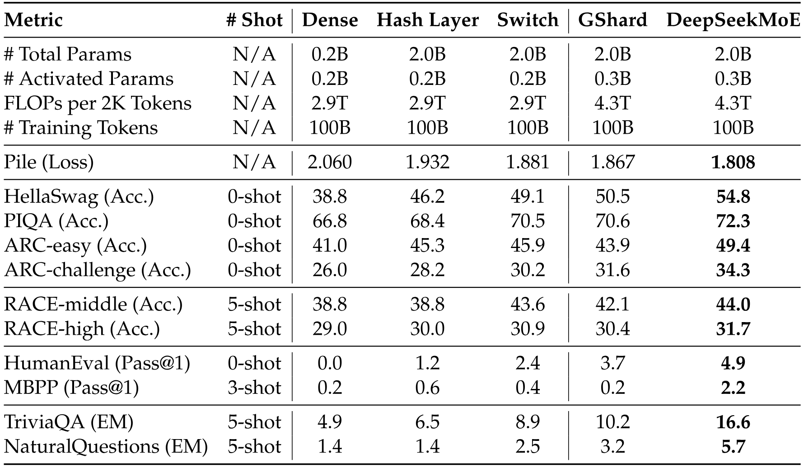

**表 1.** 検証実験の評価結果。**太字**は最高値を示す。他の MoE アーキテクチャと比べ、DeepSeekMoE は大幅な性能上の優位性を示す。

### 4.2 評価

**ベースライン。** DeepSeekMoE を含む五つのモデルを検証実験で比較する。**Dense** は総パラメータ数 0.2B の標準的な密 Transformer 言語モデルを表す。**Hash Layer** [Rol21] は top-1 ハッシュルーティングに基づく MoE アーキテクチャであり、総パラメータ数は 2.0B、活性化パラメータ数は密ベースラインと同じ 0.2B である。**Switch Transformer** [Fed22] は top-1 の学習可能なルーティングに基づく別の著名な MoE アーキテクチャであり、総パラメータ数と活性化パラメータ数は Hash Layer と同じである。**GShard** [Lep20] は top-2 の学習可能なルーティング戦略を採用し、top-1 ルーティング手法より一つ多くエキスパートが活性化されるため、総パラメータ数は 2.0B、活性化パラメータ数は 0.3B である。**DeepSeekMoE** は 1 個の共有エキスパートと 63 個のルーティング対象エキスパートを持ち、各エキスパートの大きさは標準 FFN の 0.25 倍である。DeepSeekMoE を含む比較対象の全モデルは、同じ訓練コーパスと訓練ハイパーパラメータを共有する。比較対象の全 MoE モデルは総パラメータ数が同じであり、GShard と DeepSeekMoE は活性化パラメータ数も同じである。

**結果。** 評価結果を [表 1](#table-01) に示す。提示した全モデルについて、100B トークンで訓練した後の最終評価結果を報告する。この表から、次の点が分かる。(1) 疎なアーキテクチャと多くの総パラメータを持つ Hash Layer と Switch Transformer は、活性化パラメータ数が同じ密ベースラインより大幅に高い性能を達成する。(2) Hash Layer および Switch Transformer と比べ、GShard は活性化パラメータ数が多く、Switch Transformer よりわずかに良い性能を達成する。(3) 総パラメータ数と活性化パラメータ数が同じ条件で、DeepSeekMoE は GShard を圧倒的に上回る。これらの結果は、既存の MoE アーキテクチャの中で、本研究の DeepSeekMoE アーキテクチャが優れていることを示す。

**表 2.** DeepSeekMoE、より大きな GShard モデル、より大きな密モデルの比較。「# Experts」の行では、$a$ + $b$ は $a$ 個の共有エキスパートと $b$ 個のルーティング対象エキスパートを表す。「# Activated Experts」の行では、$a$ + $b$ は活性化された共有エキスパート $a$ 個と活性化されたルーティング対象エキスパート $b$ 個を表す。DeepSeekMoE は、エキスパートのパラメータ数と計算量が 1.5 倍の GShard モデルに匹敵する性能を達成する。さらに DeepSeekMoE は、FFN パラメータ数が 16 倍で、モデル容量の観点から MoE モデルの上限を定める密モデルに迫る性能を示す。

### 4.3 DeepSeekMoE は MoE モデルの上限に極めて近い

DeepSeekMoE が密ベースラインと他の MoE アーキテクチャを上回ることを示した。DeepSeekMoE の性能をより正確に理解するため、総パラメータ数または活性化パラメータ数がより多い、大きなベースラインと比較する。この比較により、DeepSeekMoE と同等の性能を達成するために GShard または密ベースラインに必要なモデル規模を推定できる。

**GShard$\times 1.5$ との比較。** [表 2](#table-02) は、DeepSeekMoE と、エキスパートのサイズを 1.5 倍にし、エキスパートのパラメータ数と計算量の両方が 1.5 倍となる、より大きな GShard モデルとの比較を示す。全体として、DeepSeekMoE は GShard$\times 1.5$ に匹敵する性能を達成しており、DeepSeekMoE アーキテクチャ固有の大きな利点が明らかになった。GShard$\times 1.5$ との比較に加え、[第 11 節](#section-11) では GShard$\times 1.2$ との比較も示す。

さらに、DeepSeekMoE の総パラメータ数を 13.3B へ増やし、総パラメータ数がそれぞれ 15.9B と 19.8B の GShard$\times 1.2$ および GShard$\times 1.5$ と比較する。より大きな規模では、DeepSeekMoE が GShard$\times 1.5$ を明確に上回ることさえ分かる。これらの結果も [第 11 節](#section-11) に示す。

**Dense$\times 16$ との比較。** [表 2](#table-02) は、DeepSeekMoE とより大きな密モデルとの比較も示す。公平な比較のため、注意パラメータと FFN パラメータの間で広く用いられる比率（1:2）は採用しない。代わりに、各エキスパートが標準 FFN と同じパラメータ数を持つ 16 個の共有エキスパートを設定する。このアーキテクチャは、標準 FFN の 16 倍のパラメータを持つ密モデルを模したものである。表から、DeepSeekMoE は、モデル容量の観点で MoE モデルの厳密な上限を定める Dense$\times 16$ に迫る性能を示すことが分かる。これらの結果は、***少なくとも約 2B パラメータと 100B 訓練トークンの規模では、DeepSeekMoE の性能が MoE モデルの理論的上限に極めて近い***ことを示唆する。また、[第 11 節](#section-11) では Dense$\times 4$ との追加比較も示す。

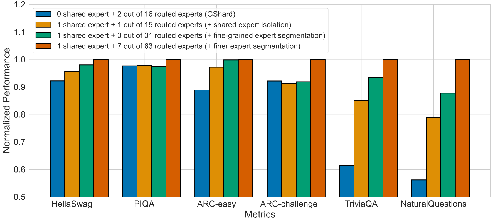

**図 3.** DeepSeekMoE のアブレーション研究。見やすくするため、性能を最良性能で正規化している。比較対象の全モデルは、パラメータ数と活性化パラメータ数が同じである。細粒度エキスパート分割と共有エキスパート分離の両方が、全体的な性能向上に寄与することが分かる。

### 4.4 アブレーション研究

細粒度エキスパート分割と共有エキスパート分離の有効性を裏づけるため、DeepSeekMoE のアブレーション研究を行い、その結果を [図 3](#figure-03) に示す。公平な比較のため、比較に含める全モデルで総パラメータ数と活性化パラメータ数が同じになるようにする。

**共有エキスパート分離。** 共有エキスパート分離戦略の影響を評価するため、GShard を基礎として一つのエキスパートを共有エキスパートとして分離する。[図 3](#figure-03) から、GShard と比べ、一つの共有エキスパートを意図的に分離すると、大半のベンチマークで性能が向上することが分かる。これらの結果は、共有エキスパート分離戦略がモデル性能の向上に寄与するという見解を支持する。

**細粒度エキスパート分割。** 細粒度エキスパート分割戦略の有効性を評価するため、エキスパートをさらに細かな粒度へ分割して、より詳細に比較する。具体的には、各エキスパートを 2 個または 4 個の小さなエキスパートへ分割し、エキスパートの総数を 32 個（共有 1 個 + ルーティング対象 31 個）または 64 個（共有 1 個 + ルーティング対象 63 個）とする。[図 3](#figure-03) から、エキスパート分割の粒度を細かくし続けるほど、モデル全体の性能も一貫して向上する傾向が分かる。これらの結果は、細粒度エキスパート分割戦略の有効性を実証的に裏づけている。

**共有エキスパートとルーティング対象エキスパートの比率。** さらに、共有エキスパートとルーティング対象エキスパートの最適な比率を調べる。総エキスパート数と活性化エキスパート数を一定に保ち、総エキスパート数が 64 個となる最も細かな粒度を基礎として、1 個、2 個、4 個のエキスパートを共有エキスパートとして分離する。共有エキスパートとルーティング対象エキスパートの比率による性能への大きな影響はなく、共有エキスパートが 1 個、2 個、4 個の場合の Pile 損失はそれぞれ 1.808、1.806、1.811 となる。1:3 の比率で Pile 損失がわずかに良くなることを踏まえ、DeepSeekMoE を拡張する際には、共有エキスパートと活性化ルーティング対象エキスパートの比率を 1:3 に保つ。

### 4.5 エキスパート特化の分析

本節では、DeepSeekMoE 2B のエキスパート特化を実証的に分析する。本節の DeepSeekMoE 2B は [表 1](#table-01) で報告したモデル、すなわち総パラメータ数 2.0B、共有エキスパート 1 個、63 個のルーティング対象エキスパートのうち 7 個を活性化するモデルを指す。

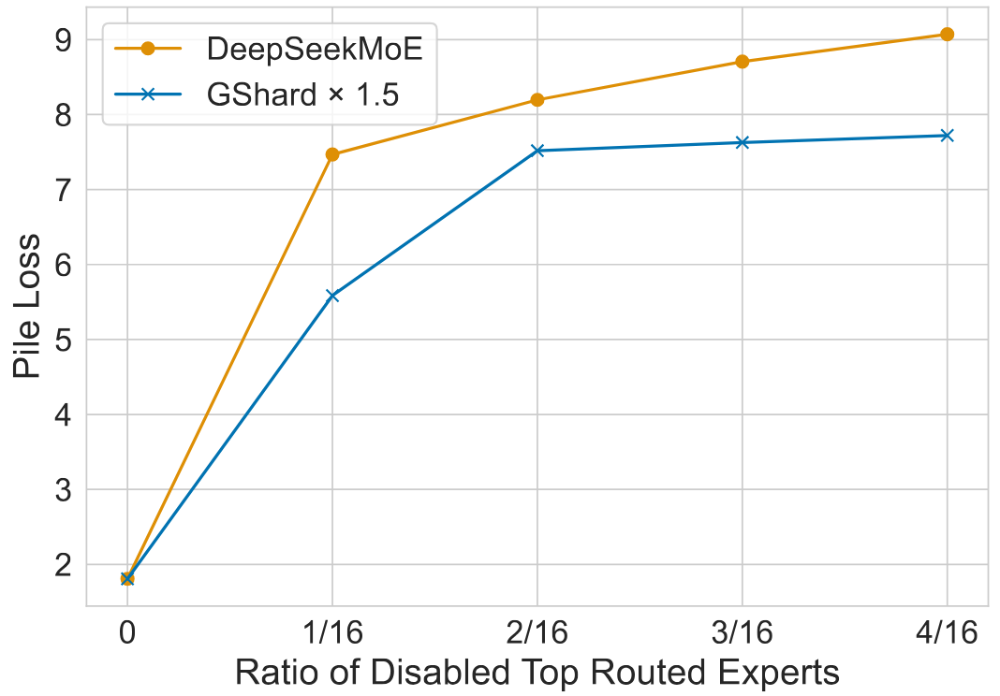

**図 4.** 上位ルーティング対象エキスパートを無効化する比率ごとの Pile 損失。特に、DeepSeekMoE は上位ルーティング対象エキスパートを無効化する比率に対してより敏感であり、DeepSeekMoE のルーティング対象エキスパート間の冗長性が低いことを示している。

**DeepSeekMoE はルーティング対象エキスパート間の冗長性が低い。** ルーティング対象エキスパート間の冗長性を評価するため、上位のルーティング対象エキスパートをさまざまな比率で無効化し、Pile 損失を評価する。具体的には、各トークンについてルーティング確率が最も高いエキスパートを一定の比率でマスクし、残りのルーティング対象エキスパートから top-K エキスパートを選択する。公平を期すため、エキスパートを無効化しない場合に Pile 損失が同じである GShard$\times 1.5$ と DeepSeekMoE を比較する。[図 4](#figure-04) に示すように、DeepSeekMoE は GShard$\times 1.5$ と比べ、上位ルーティング対象エキスパートを無効化することに対してより敏感である。各ルーティング対象エキスパートの代替がより難しいため、この敏感さは DeepSeekMoE のパラメータ冗長性が低いことを示唆する。これに対し、GShard$\times 1.5$ はエキスパートのパラメータ間により大きな冗長性があるため、上位ルーティング対象エキスパートを無効化した際の性能低下を緩衝できる。

**共有エキスパートはルーティング対象エキスパートで代替できない。** DeepSeekMoE における共有エキスパートの役割を調べるため、共有エキスパートを無効化し、代わりにルーティング対象エキスパートを一つ多く活性化する。同じ計算コストを維持したにもかかわらず、Pile による評価では Pile 損失が 1.808 から 2.414 へ大幅に増加する。この結果は共有エキスパートの重要な機能を浮き彫りにし、共有エキスパートがルーティング対象エキスパートと共有されない基礎的かつ不可欠な知識を捉えているため、ルーティング対象エキスパートでは代替できないことを示す。

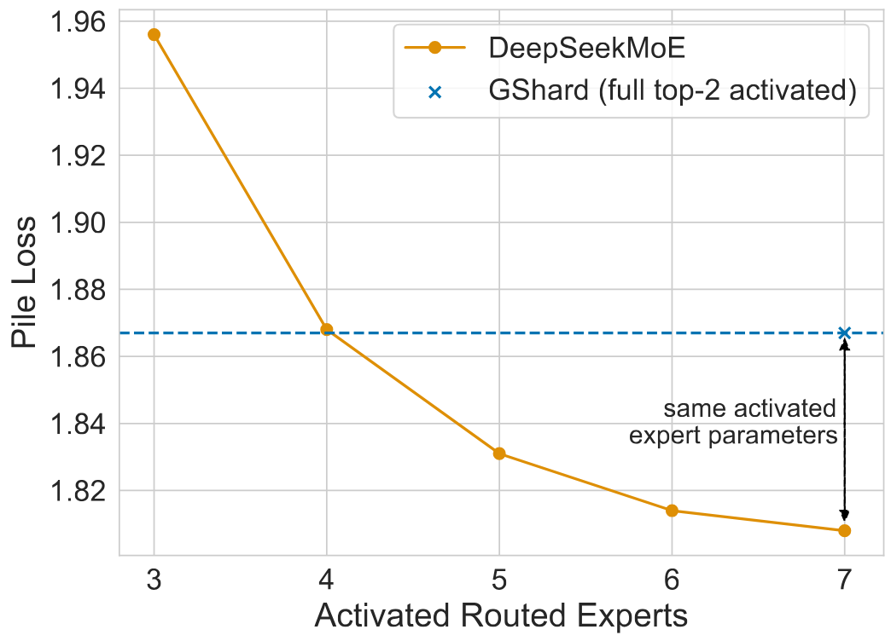

**図 5.** DeepSeekMoE で活性化するルーティング対象エキスパート数ごとの Pile 損失。ルーティング対象エキスパートを 4 個だけ活性化した場合でも、DeepSeekMoE は GShard に匹敵する Pile 損失を達成する。

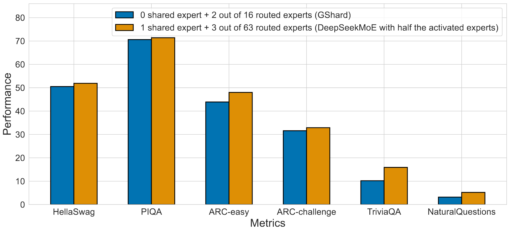

**図 6.** GShard と、活性化エキスパート数を半分にした DeepSeekMoE（スクラッチから訓練）の比較。エキスパートの総パラメータ数が同じで、活性化エキスパートのパラメータ数が半分だけであっても、DeepSeekMoE は GShard を上回る。

**DeepSeekMoE は知識をより正確に獲得する。** 活性化エキスパートを柔軟に組み合わせられるほど、より正確で対象を絞った知識獲得に寄与するという主張を検証するため、DeepSeekMoE がより少ない活性化エキスパートで必要な知識を獲得できるか調べる。具体的には、活性化するルーティング対象エキスパート数を 3 から 7 まで変化させ、そのときの Pile 損失を評価する。[図 5](#figure-05) に示すように、ルーティング対象エキスパートを 4 個だけ活性化した場合でも、DeepSeekMoE は GShard に匹敵する Pile 損失を達成する。この観察結果は、DeepSeekMoE が必要な知識をより正確かつ効率的に獲得できるという見解を支持する。

これらの知見を受け、DeepSeekMoE のエキスパート特化と正確な知識獲得をより厳密に検証するため、新しいモデルをスクラッチから訓練する。このモデルは共有エキスパート 1 個とルーティング対象エキスパート 63 個からなり、ルーティング対象エキスパートは 3 個だけ活性化する。[図 6](#figure-06) に示す評価結果から、エキスパートの総パラメータ数が同じで、活性化エキスパートのパラメータ数が半分だけであっても、DeepSeekMoE は GShard を上回ることが分かる。これは DeepSeekMoE がエキスパートのパラメータをより効率的に活用できること、すなわち活性化エキスパート内の有効なパラメータの割合が GShard よりはるかに高いことを示している。

## 5 DeepSeekMoE 16B へのスケールアップ

DeepSeekMoE アーキテクチャを用いて MoE モデルを総パラメータ数 16B のより大きな規模へ拡張し、2T トークンで訓練する。その結果、DeepSeekMoE 16B は LLaMA2 7B と比べ、約 40% の計算量だけでより高い性能を達成することが示される。

### 5.1 実験設定

#### 5.1.1 訓練データとトークン化

訓練データは [第 4.1.1 節](#section-4-1-1) で述べたものと同じコーパスからサンプリングする。検証実験とは異なり、LLaMA2 7B の訓練トークン数に合わせ、2T トークンという、より大量のデータをサンプリングする。同様に HuggingFace Tokenizer ツールを用いて BPE トークナイザを訓練するが、DeepSeekMoE 16B の語彙サイズは 100K に設定する。

#### 5.1.2 ハイパーパラメータ

**モデル設定。** DeepSeekMoE 16B では、Transformer の層数を 28、隠れ次元を 2048 に設定する。注意ヘッドを合計 16 個持ち、各ヘッドの次元が 128 のマルチヘッド注意機構を用いる。初期化では、すべての学習可能なパラメータを標準偏差 0.006 でランダムに初期化する。第 1 層では負荷分散状態の収束が特に遅いことが観察されたため、第 1 層を除くすべての FFN を MoE 層へ置き換える。各 MoE 層は 2 個の共有エキスパートと 64 個のルーティング対象エキスパートからなり、各エキスパートの大きさは標準 FFN の 0.25 倍である。各トークンは、この 2 個の共有エキスパートと、64 個のルーティング対象エキスパートのうち 6 個へルーティングされる。エキスパートが過度に小さくなると計算効率が低下する可能性があるため、これ以上細かなエキスパート分割は採用しない。16B を超える大規模モデルでは、さらに細かな粒度を採用することもできる。本設定では、DeepSeekMoE 16B の総パラメータ数は約 16.4B、活性化パラメータ数は約 2.8B となる。

**訓練設定。** ハイパーパラメータを $\beta_1=0.9$、$\beta_2=0.95$、$\mathrm{weight\_decay}=0.1$ とする AdamW オプティマイザ [Los17] を用いる。学習率には、ここでもウォームアップと段階的減衰を組み合わせたスケジュールを用いる。最初の 2K ステップでは、学習率を 0 から最大値まで線形に増加させる。続いて、訓練ステップの 80% 時点で学習率を 0.316 倍し、90% 時点でも再び 0.316 倍する。DeepSeekMoE 16B の最大学習率を $4.2 \times 10^{-4}$、勾配クリッピングのノルムを 1.0 に設定する。バッチサイズを 4.5K、最大系列長を 4K とし、各訓練バッチに 18M トークンを含める。これに対応して、2T の訓練トークン数を達成するため、総訓練ステップ数を 106,449 に設定する。訓練データが豊富なため、訓練中にドロップアウトは使用しない。パイプライン並列を利用してモデルの異なる層を異なるデバイスへ配置し、各層ではすべてのエキスパートを同一デバイスへ配置する。したがって、訓練中にトークンを破棄せず、デバイス単位のバランス損失も用いない。ルーティング崩壊を防ぐため、エキスパート単位のバランス係数を非常に小さな 0.001 に設定する。これは、採用した並列化戦略では、エキスパート単位のバランス係数を大きくしても計算効率は向上せず、かえってモデル性能を損なうことが分かったためである。

#### 5.1.3 評価ベンチマーク

より包括的に評価するため、検証実験で使用したベンチマークに加えて、さらにベンチマークを追加する。検証実験で使用したベンチマークとの相違点を以下に示す。

**言語モデリング。** 言語モデリングでは、ここでも Pile [Gao20] のテストセットでモデルを評価する。DeepSeekMoE 16B と LLaMA2 7B では使用するトークナイザが異なる。公平な比較のため、評価指標には 1 バイト当たりビット数（BPB）を用いる。

**読解。** 読解では DROP [Dua19] を追加する。評価指標には完全一致（EM）率を用いる。

**数学的推論。** 数学的推論では GSM8K [Cob21] と MATH [Hen21] を追加し、評価指標には EM を用いる。

**複数分野の多肢選択。** 複数分野の多肢選択では、MMLU [Hen20] でもモデルを評価する。評価指標は正解率である。

**曖昧性解消。** 曖昧性解消では WinoGrande [Sak19] を追加し、評価指標は正解率とする。

**中国語ベンチマーク。** DeepSeekMoE 16B は二言語コーパスで事前訓練されるため、四つの中国語ベンチマークでも評価する。CLUEWSC [Xu20] は中国語の曖昧性解消ベンチマークである。CEval [Hua23] と CMMLU [Li23e] は、MMLU と同様の形式を持つ、中国語の複数分野多肢選択ベンチマークである。CHID [Zhe19] は中国語の成語穴埋めベンチマークであり、中国文化への理解を評価することを目的とする。これらの中国語ベンチマークの評価指標には、正解率または EM を用いる。

**Open LLM Leaderboard。** これまでに挙げたベンチマークはすべて、社内の評価フレームワークで評価する。DeepSeekMoE 16B をオープンソースモデルと公平かつ容易に比較するため、さらに Open LLM Leaderboard でも DeepSeekMoE 16B を評価する。Open LLM Leaderboard は HuggingFace が提供する公開リーダーボードで、ARC [Cla18]、HellaSwag [Zel19]、MMLU [Hen20]、TruthfulQA [Lin22]、Winogrande [Sak19]、GSM8K [Cob21] の六つのタスクからなる。

### 5.2 評価

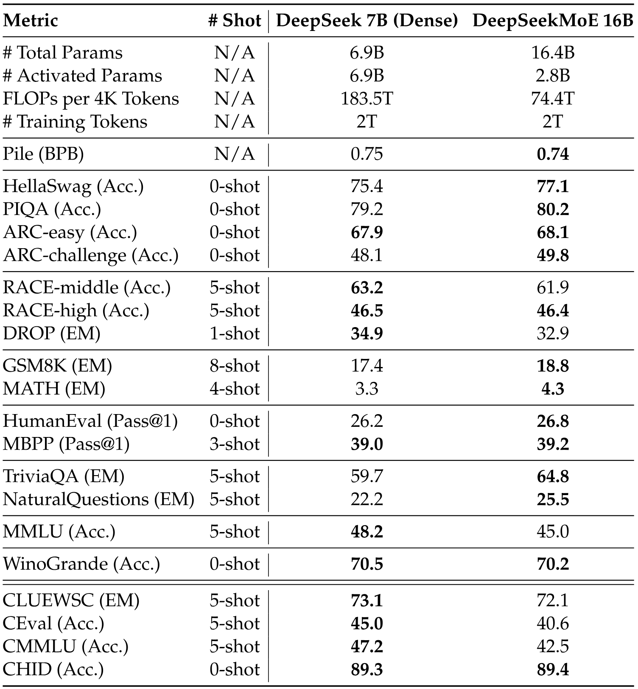

**表 3.** DeepSeek 7B と DeepSeekMoE 16B の比較。**太字**は最高値またはそれに近い値を示す。DeepSeekMoE 16B は計算量を 40.5% しか用いずに、DeepSeek 7B に匹敵する性能を達成する。

#### 5.2.1 DeepSeek 7B との内部比較

まず DeepSeekMoE 16B と、6.9B パラメータの密言語モデル DeepSeek 7B [Dee24e] を内部比較する。公平性を確保するため、両モデルを同じ 2T トークンのコーパスで訓練する。これにより、訓練データの影響とは独立して、MoE アーキテクチャの有効性を正確に評価できる。

評価結果を [表 3](#table-03) に示し、そこから次の点が分かる。(1) 全体として、DeepSeekMoE 16B は約 40% の計算量だけで DeepSeek 7B に匹敵する性能を達成する。(2) DeepSeekMoE 16B は、Pile、HellaSwag、TriviaQA、NaturalQuestions など、言語モデリングと知識集約的タスクで顕著な強みを示す。MoE モデルでは FFN パラメータが注意パラメータよりはるかに大きな割合を占めることを踏まえると、この結果は Transformer の FFN が知識を記憶する能力を備えるという見解 [Dai22a] と一致する。(3) 他のタスクでの優れた性能と比べ、DeepSeekMoE には多肢選択タスクの処理に限界がある。この不足は DeepSeekMoE 16B の注意パラメータが少ないことに起因する（DeepSeekMoE 16B の注意パラメータは約 0.5B にすぎないのに対し、DeepSeek 7B では 2.5B である）。DeepSeek 7B に関する以前の調査では、注意の容量と多肢選択タスクの性能との間に正の相関があることが分かっている。例えば、マルチクエリ注意機構 [Sha19] を備える DeepSeek 7B MQA も、MMLU のようなタスクでは苦戦した。さらに、DeepSeekMoE 16B の訓練過程をより包括的に理解できるよう、[第 12 節](#section-12) では、訓練中の DeepSeekMoE 16B と DeepSeek 7B（Dense）のベンチマーク曲線も示す。

重要な点として、DeepSeekMoE 16B はパラメータ数が控えめなため、40GB メモリの GPU へ単一デバイスでデプロイできる。適切に演算子を最適化すれば、7B 密モデルの約 2.5 倍の推論速度を達成できる。

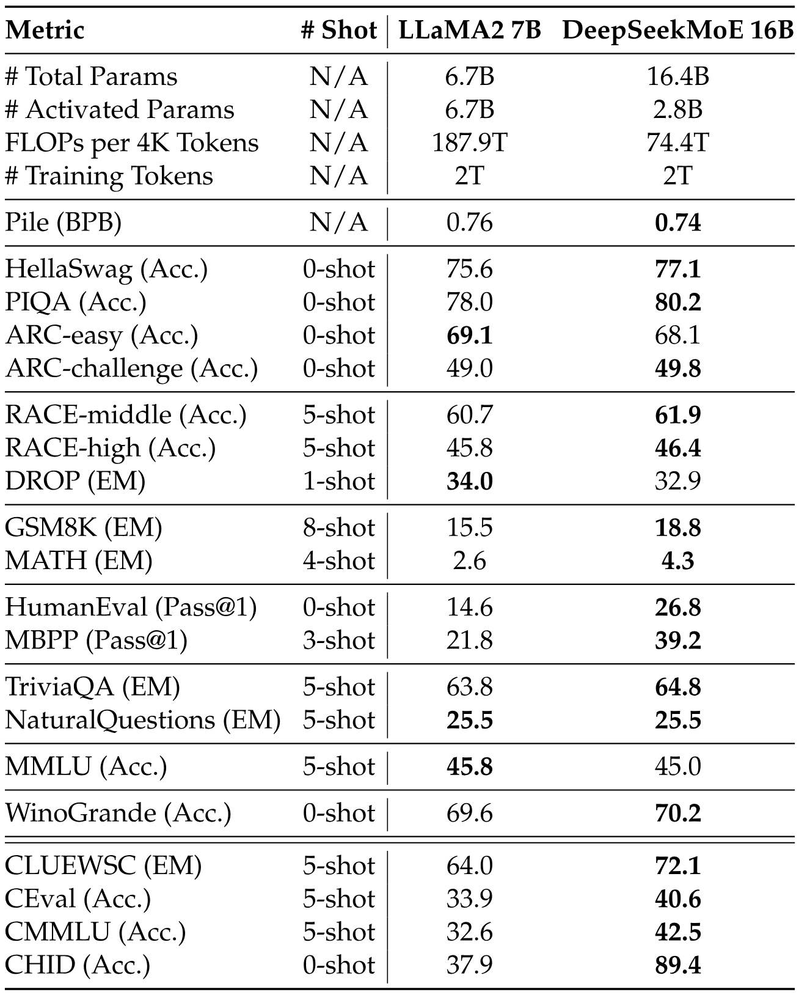

**表 4.** LLaMA2 7B と DeepSeekMoE 16B の比較。DeepSeekMoE 16B は計算量を 39.6% しか用いずに、大半のベンチマークで LLaMA2 7B を上回る。

#### 5.2.2 オープンソースモデルとの比較

**LLaMA2 7B との内部比較。** オープンソースモデルの中では、主に DeepSeekMoE 16B と、6.7B パラメータの著名で強力なオープンソース言語モデル LLaMA2 7B [Tou23a] を比較する。DeepSeekMoE 16B と LLaMA2 7B は、どちらも 2T トークンで事前訓練されている。LLaMA2 7B と比べ、DeepSeekMoE の総パラメータ数は 245% だが、必要な計算量は 39.6% にすぎない。社内ベンチマークによる結果を [表 4](#table-04) に示し、そこから次の点が分かる。(1) 評価したベンチマークのうち、DeepSeekMoE 16B は約 40% の計算量だけで、大半のベンチマークにおいて LLaMA2 7B を上回る。(2) DeepSeekMoE 16B の数学的推論能力とコード生成能力は LLaMA2 7B より高いが、これは事前訓練コーパスに数学やコードに関するテキストが豊富に含まれるためである。(3) 事前訓練コーパスに中国語テキストが含まれるため、DeepSeekMoE 16B は中国語ベンチマークで LLaMA2 7B を大幅に上回る。(4) 英語テキストによる訓練が少ないにもかかわらず、DeepSeekMoE 16B は英語理解または知識集約的ベンチマークで LLaMA2 7B と同等以上の性能を達成し、DeepSeekMoE 16B の卓越した能力を示す。

**Open LLM Leaderboard による評価。** 社内評価に加え、Open LLM Leaderboard でも DeepSeekMoE 16B を評価し、ほかのオープンソースモデルと比較する。LLaMA2 7B に加えて、LLaMA 7B [Tou23]、Falcon 7B [Alm23b]、GPT-J 6B [Wan21g]、RedPajama-INCITE 7B および 3B [Tog23a]、Open LLaMA 7B および 3B [Gen23a]、OPT 2.7B [Zha22]、Pythia 2.8B [Bid23]、GPT-neo 2.7B [Bla21]、BLOOM 3B [Les23] を含む、より幅広いオープンソースモデルを比較対象とする。[図 1](#figure-01) に示す評価結果から、DeepSeekMoE 16B は活性化パラメータ数が近いモデルを一貫して大幅に上回ることが分かる。さらに、活性化パラメータ数が約 2.5 倍の LLaMA2 7B に匹敵する性能を達成する。

## 6 DeepSeekMoE 16B のアラインメント

従来の研究では、通常、MoE モデルはファインチューニングから大幅な向上を得られないことが示されている [Fed22, Art22]。しかし [She23a] は、MoE モデルが命令チューニングから確かに恩恵を受けられることを示唆する知見を報告している。DeepSeekMoE 16B がファインチューニングから恩恵を受けられるか評価するため、教師ありファインチューニングを行い、DeepSeekMoE 16B に基づくチャットモデルを構築する。実験結果から、DeepSeekMoE Chat 16B は LLaMA2 SFT 7B および DeepSeek Chat 7B にも匹敵する性能を達成することが分かる。

### 6.1 実験設定

**訓練データ。** チャットモデルの訓練では、社内で精選した 1.4M 件の訓練例からなるデータで教師ありファインチューニング（SFT）を行う。このデータセットは、数学、コード、文章作成、質問応答、推論、要約など、幅広いカテゴリにまたがる。SFT 訓練データの大半は英語と中国語であり、チャットモデルは汎用性が高く、二言語の場面に適用できる。

**ハイパーパラメータ。** 教師ありファインチューニングでは、バッチサイズを 1024 例に設定し、AdamW オプティマイザ [Los17] を用いて 8 エポック訓練する。最大系列長を 4K とし、系列長の上限へ達するまで訓練例をできる限り密にパッキングする。教師ありファインチューニングではドロップアウトを使用せず、学習率スケジュールも組み込まずに、学習率を一定の $10^{-5}$ に設定する。

**評価ベンチマーク。** チャットモデルの評価には、[第 5.1.3 節](#section-5-1-3) で使用したものと同様のベンチマークを用いるが、次のように調整する。(1) チャットモデルが純粋な言語モデリングに用いられることは少ないため、Pile [Gao20] を除外する。(2) 結果が不安定で確かな結論を導けないため、CHID [Zhe19] を除外する。(3) チャットモデルの推論能力をより包括的に評価するため、BBH [Suz22] を追加する。

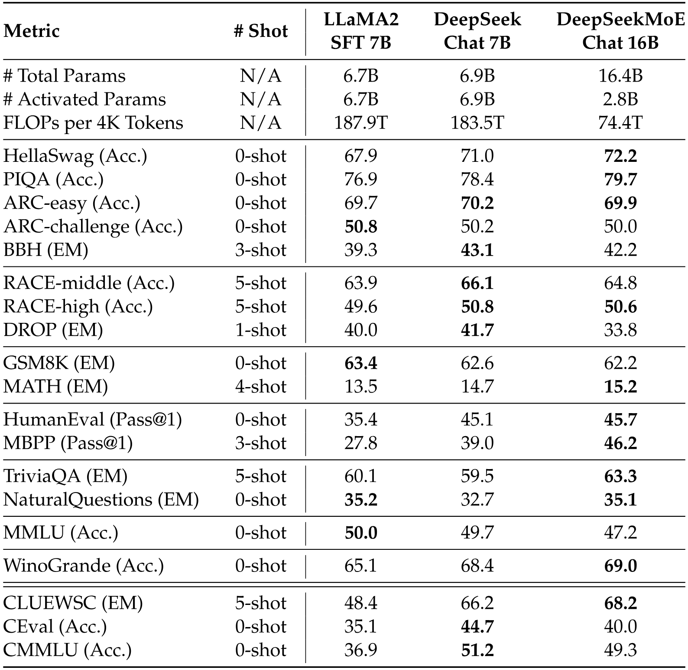

**表 5.** LLaMA2 SFT 7B、DeepSeek Chat 7B、DeepSeekMoE Chat 16B の比較。この三つのモデルはいずれも同じ SFT データでファインチューニングしている。DeepSeekMoE Chat 16B は、どちらの 7B 密モデルと比べても、計算量を 40% しか用いずに、大半のベンチマークで同等以上の性能を達成する。

### 6.2 評価

**ベースライン。** アラインメント後の DeepSeekMoE 16B の可能性を検証するため、LLaMA2 7B、DeepSeek 7B、DeepSeekMoE 16B に教師ありファインチューニングを行い、公平性を確保するため、まったく同じファインチューニングデータを使用する。これに対応して、LLaMA2 SFT 7B [+3]、DeepSeek Chat 7B、DeepSeekMoE Chat 16B という三つのチャットモデルを構築する。続いて、幅広い下流タスクにおいて、DeepSeekMoE Chat 16B を他の二つの密チャットモデル（FLOPs は約 2.5 倍）と比較する。

**結果。** 評価結果を [表 5](#table-05) に示す。主な観察結果は次のとおりである。(1) DeepSeekMoE Chat 16B は計算量を約 40% しか使用せずに、言語理解と推論（PIQA、ARC、BBH）、機械読解（RACE）、数学（GSM8K、MATH）、知識集約的タスク（TriviaQA、NaturalQuestions）において、7B 密モデルに匹敵する性能を達成する。(2) コード生成タスクでは、DeepSeekMoE Chat 16B は LLaMA2 SFT 7B を大幅に上回り、HumanEval と MBPP で顕著な改善を示す。さらに DeepSeek Chat 7B も上回る。(3) MMLU、CEval、CMMLU を含む多肢選択質問応答ベンチマークでは、DeepSeekMoE Chat 16B は依然として DeepSeek Chat 7B に及ばず、ベースモデルについての観察結果（[第 5.2.1 節](#section-5-2-1)）と一致する。しかし、教師ありファインチューニング後は、DeepSeekMoE 16B と DeepSeek 7B の性能差が縮まっていることは注目に値する。(4) 二言語コーパスによる事前訓練の恩恵を受け、DeepSeekMoE Chat 16B はすべての中国語ベンチマークで LLaMA2 SFT 7B を顕著に上回る。これらの結果は、DeepSeekMoE 16B が中国語と英語の両方でバランスの取れた能力を持ち、多様な場面での汎用性と適用可能性が高いことを示す。結論として、チャットモデルの評価は、DeepSeekMoE 16B がアラインメントから恩恵を受けられる可能性を浮き彫りにし、約 40% の計算量だけで密モデルに匹敵する性能を達成するという一貫した優位性を裏づける。

## 7 進行中の DeepSeekMoE 145B

DeepSeekMoE 16B の優れた性能を受け、さらに DeepSeekMoE を 145B へ拡張する予備的な試みに着手する。この初期研究では DeepSeekMoE 145B を 245B トークンで訓練した段階だが、すでに GShard アーキテクチャに対する一貫した優位性を示し、DeepSeek 67B（Dense）に匹敵するか、それを上回る見込みを示している。さらに、DeepSeekMoE 145B の最終版を完成させ、十分に訓練した後には、これも一般公開する予定である。

### 7.1 実験設定

**訓練データとトークン化。** DeepSeekMoE 145B では、DeepSeekMoE 16B とまったく同じ訓練コーパスとトークナイザを用いる。唯一の違いは、初期研究として DeepSeekMoE 145B を 245B トークンで訓練する点である。

**モデル設定。** DeepSeekMoE 145B では、Transformer の層数を 62、隠れ次元を 4096 に設定する。注意ヘッドを合計 32 個持ち、各ヘッドの次元が 128 のマルチヘッド注意機構を用いる。初期化では、すべての学習可能なパラメータを標準偏差 0.006 でランダムに初期化する。DeepSeekMoE 16B と同様に、第 1 層を除くすべての FFN を MoE 層へ置き換える。各 MoE 層は 4 個の共有エキスパートと 128 個のルーティング対象エキスパートからなり、各エキスパートの大きさは標準 FFN の 0.125 倍である。各トークンは、この 4 個の共有エキスパートと、128 個のルーティング対象エキスパートのうち 12 個へルーティングされる。この設定では、DeepSeekMoE 145 の総パラメータ数は約 144.6B、活性化パラメータ数は約 22.2B となる。

**訓練設定。** ハイパーパラメータを $\beta_1=0.9$、$\beta_2=0.95$、$\mathrm{weight\_decay}=0.1$ とする AdamW オプティマイザ [Los17] を用いる。DeepSeekMoE 145B の予備的研究では、ウォームアップ後に一定値を保つ学習率スケジュールを用いる。最初の 2K ステップでは、学習率を 0 から最大値まで線形に増加させる。その後、残りの訓練過程では学習率を一定に保つ。DeepSeekMoE 145B の最大学習率を $3.0 \times 10^{-4}$、勾配クリッピングのノルムを 1.0 に設定する。バッチサイズを 4.5K、最大系列長を 4K とし、各訓練バッチに 18M トークンを含める。DeepSeekMoE 145B を 13,000 ステップ訓練し、訓練トークン数を 245B とする。訓練中にドロップアウトは使用しない。パイプライン並列を利用してモデルの異なる層を異なるデバイスへ配置し、各層ではすべてのルーティング対象エキスパートを 4 台のデバイスへ均等に配置する（すなわち、エキスパート並列とデータ並列を組み合わせる）。DeepSeekMoE 145B ではエキスパート並列を採用するため、計算ボトルネックを軽減するにはデバイス単位の負荷分散を考慮する必要がある。そのため、デバイス単位のバランス係数を 0.05 に設定し、デバイス間で均衡した計算を促す。また、ルーティング崩壊を防ぐため、エキスパート単位のバランス係数も小さな 0.003 に設定する。

**評価ベンチマーク。** DeepSeekMoE 145B は、DeepSeekMoE 16B で使用したものとまったく同じ社内ベンチマークで評価する（[第 5.1.3 節](#section-5-1-3) を参照）。

**表 6.** DeepSeek 67B（Dense）と、総パラメータ数が約 140B 規模の MoE モデルの比較。「# Experts」と「# Activated Experts」の行では、$a$ + $b$ はそれぞれ $a$ 個の共有エキスパートと $b$ 個のルーティング対象エキスパートを表す。**太字**は、最後の列を除く最高またはそれに近い性能を示す。DeepSeekMoE 145B はもちろん、活性化エキスパートのパラメータ数が半分だけの DeepSeekMoE 142B（Half Activated）でさえ、GShard 137B を大幅に上回る。さらに、DeepSeekMoE 145B は計算量を 28.5% しか用いずに、DeepSeek 67B に匹敵する性能を達成する。

### 7.2 評価

**ベースライン。** **DeepSeekMoE 145B** に加え、さらに三つのモデルを比較対象とする。**DeepSeek 67B（Dense）** は総パラメータ数 67.4B の密モデルである（モデルと訓練の詳細は [Dee24e] を参照）。**GShard 137B** は DeepSeekMoE 145B と隠れ次元および層数が同じだが、GShard アーキテクチャに従う。DeepSeekMoE 145B は計算効率を高めるため、各エキスパートの中間隠れ次元を 64 の倍数へ揃えているため、モデルサイズが GShard 137B より 6% 大きいことに注意されたい。**DeepSeekMoE 142B（Half Activated）** は DeepSeekMoE 145B と同様のアーキテクチャを持つが、共有エキスパートは 2 個だけで、128 個のルーティング対象エキスパートのうち 6 個だけを活性化する。DeepSeekMoE 145B を含む比較対象の全モデルが、同じ訓練コーパスを共有することは注目に値する。さらに、比較するすべての MoE モデルはスクラッチから訓練し、同じ訓練ハイパーパラメータを共有する。

**結果。** [表 6](#table-06) に示す評価結果から、次の点が分かる。(1) 総パラメータ数と計算量が同等であるにもかかわらず、DeepSeekMoE 145B は GShard 137B を大幅に上回り、DeepSeekMoE アーキテクチャの利点を改めて浮き彫りにする。(2) 全体として、DeepSeekMoE 145B は計算量を 28.5% しか用いずに、DeepSeek 67B（Dense）に匹敵する性能を達成する。DeepSeekMoE 16B での知見と同様に、DeepSeekMoE 145B は言語モデリングと知識集約的タスクで顕著な強みを示す一方、多肢選択タスクには限界がある。(3) より大きな規模でも、DeepSeekMoE 142B（Half Activated）の性能は DeepSeekMoE 145B に大きくは劣らない。さらに、活性化エキスパートのパラメータ数が半分だけであるにもかかわらず、DeepSeekMoE 142B（Half Activated）は計算量を 18.2% しか用いずに、DeepSeek 67B（Dense）に匹敵する性能を達成する。また GShard 137B も上回り、[第 4.5 節](#section-4-5) の結論と一致する。

## 8 関連研究

Mixture of Experts（MoE）手法は、異なるサンプルを独立したエキスパートモジュールで処理するため、[Jac91] [Jor94] によって初めて提案された。[Sha17] は MoE を言語モデルの訓練へ導入し、大規模な LSTM ベース [Hoc97] の MoE モデルを構築した。Transformer が NLP で最も広く用いられるアーキテクチャになるにつれ、多くの研究が Transformer の FFN を MoE 層へ拡張し、MoE 言語モデルを構築してきた。GShard [Lep20] と Switch Transformer [Fed22] は、学習可能な top-2 または top-1 ルーティング戦略を採用し、MoE 言語モデルを極めて大規模に拡張した先駆的研究である。Hash Layer [Rol21] と StableMoE [Dai22b] は、ルーティングと訓練をより安定させるため、固定ルーティング戦略を用いる。[Zho22a] は、各トークンを異なる数のエキスパートへ割り当てられる、エキスパート選択型ルーティング戦略を提案した。[Zop22] は MoE モデルにおける訓練の不安定性とファインチューニングの難しさに焦点を当て、これらの課題を克服する ST-MoE を提案した。MoE のアーキテクチャと訓練戦略に関する研究に加え、近年は既存の MoE アーキテクチャに基づく多数の大規模言語モデルまたはマルチモーダルモデル [Lin21a, Du22, Ren23a, Xue23] も登場している。総じて、従来の MoE モデルの大半は従来型の top-1 または top-2 ルーティング戦略に基づいており、エキスパート特化には大きな改善の余地が残されている。これに対し、本研究の DeepSeekMoE アーキテクチャは、エキスパート特化を極限まで高めることを目指す。

## 9 結論

本稿では、究極のエキスパート特化を実現することを目的として、MoE 言語モデル向けの DeepSeekMoE アーキテクチャを導入した。細粒度エキスパート分割と共有エキスパート分離により、DeepSeekMoE は一般的な MoE アーキテクチャと比べ、エキスパート特化と性能を大幅に高める。まず、控えめな 2B パラメータ規模から DeepSeekMoE の利点を検証し、MoE モデルの性能上限に迫れることを示した。さらに、DeepSeekMoE のエキスパート特化の度合いが GShard より高いことを実証的に示した。

総パラメータ数 16B のより大きな規模へ拡張し、DeepSeekMoE 16B を 2T トークンで訓練したところ、約 40% の計算量だけで DeepSeek 7B および LLaMA2 7B に匹敵する優れた性能を示した。さらに、アラインメントのために教師ありファインチューニングを行い、DeepSeekMoE 16B に基づく MoE チャットモデルを構築して、その適応性と汎用性を改めて示した。加えて、DeepSeekMoE を 145B パラメータへ拡張する予備的な検討を行った。DeepSeekMoE 145B は GShard アーキテクチャに対する大幅な優位性をなお維持し、計算量を 28.5%（場合によっては 18.2%）しか用いずに、DeepSeek 67B に匹敵する性能を示すことが分かった。

研究利用のため、DeepSeekMoE 16B のモデルチェックポイントを一般公開する。このモデルは 40GB メモリの単一 GPU 上へデプロイできる。本研究が学術界と産業界の双方に有益な知見をもたらし、大規模言語モデルの発展を加速させる一助となることを願う。

## 10 ハイパーパラメータの概要

さまざまな規模の DeepSeekMoE におけるハイパーパラメータの概要を [表 7](#table-07) に示す。

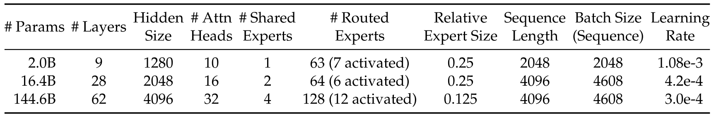

**表 7.** さまざまな規模の DeepSeekMoE におけるハイパーパラメータの概要。エキスパートの相対サイズは、標準 FFN と比較した値である。

## 11 DeepSeekMoE とより大きなモデルの比較

DeepSeekMoE、GShard$\times 1.2$、GShard$\times 1.5$ の比較を [表 8](#table-08) に示す。DeepSeekMoE、Dense$\times 4$、Dense$\times 16$ の比較を [表 9](#table-09) に示す。

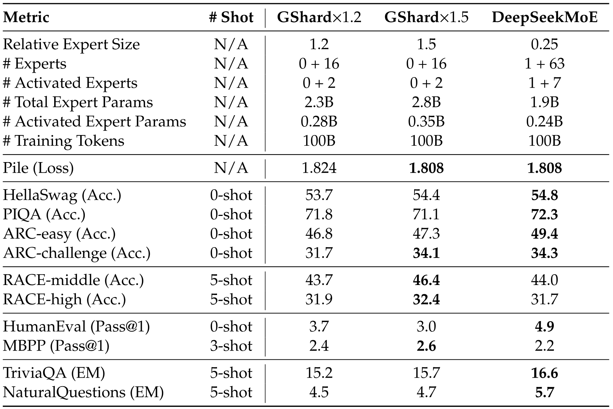

**表 8.** DeepSeekMoE とより大きな GShard モデルの比較。

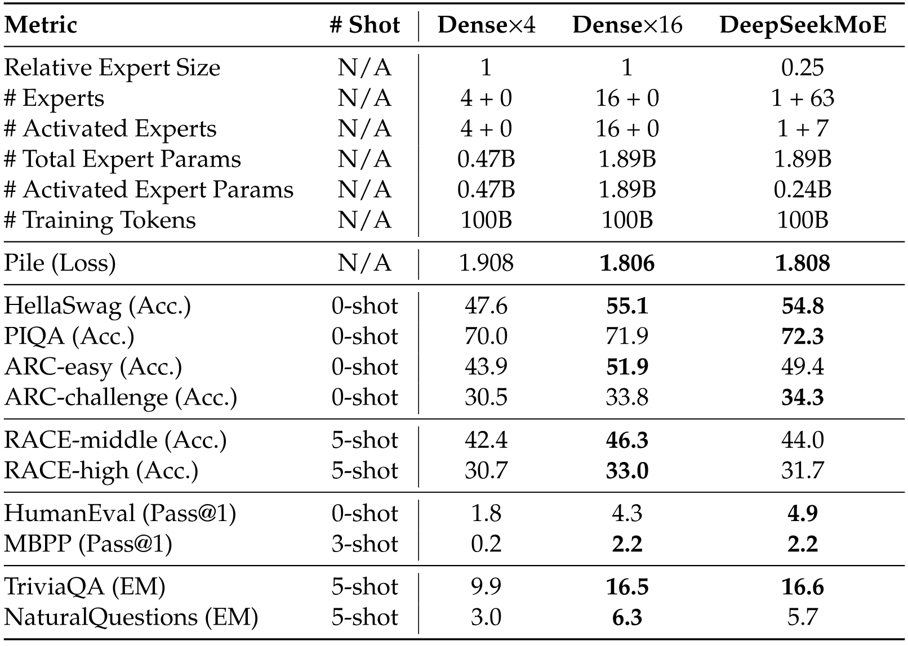

**表 9.** DeepSeekMoE とより大きな密ベースラインの比較。

総パラメータ数 13B のより大きな規模でも、DeepSeekMoE を GShard$\times 1.2$ および GShard$\times 1.5$ と比較し、その結果を [表 10](#table-10) に示す。より大きな規模では、DeepSeekMoE は GShard$\times 1.5$ を明確に上回る。

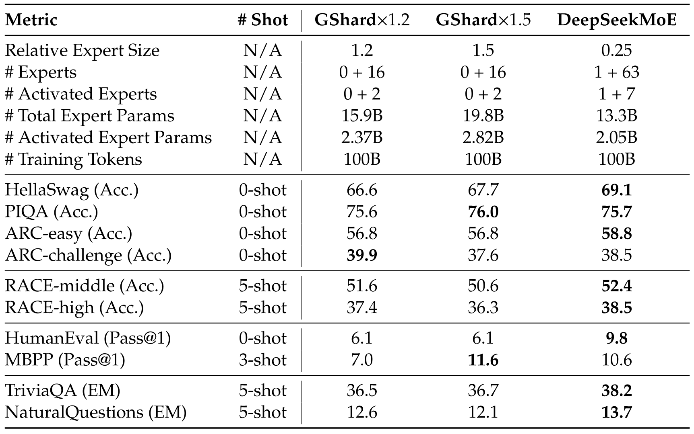

**表 10.** より大きな規模における DeepSeekMoE とより大きな GShard モデルの比較。

## 12 DeepSeekMoE 16B の訓練中のベンチマーク曲線

参考として、訓練中の DeepSeekMoE 16B と DeepSeek 7B（Dense）のベンチマーク曲線を [図 7](#figure-07) に示す。

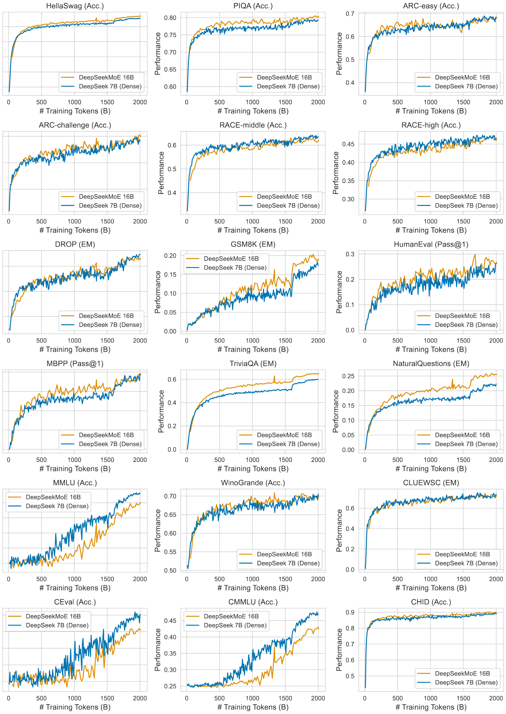

**図 7.** 訓練中の DeepSeekMoE 16B と DeepSeek 7B（Dense）のベンチマーク曲線。

[+1]: [Open LLM Leaderboard](https://huggingface.co/spaces/HuggingFaceH4/open_llm_leaderboard)
[+2]: [HuggingFace Tokenizers](https://github.com/huggingface/tokenizers)
[+3]: 公式の LLaMA2 Chat [Tou23a] モデルと区別するため、LLaMA2 SFT という名称を用いる。
