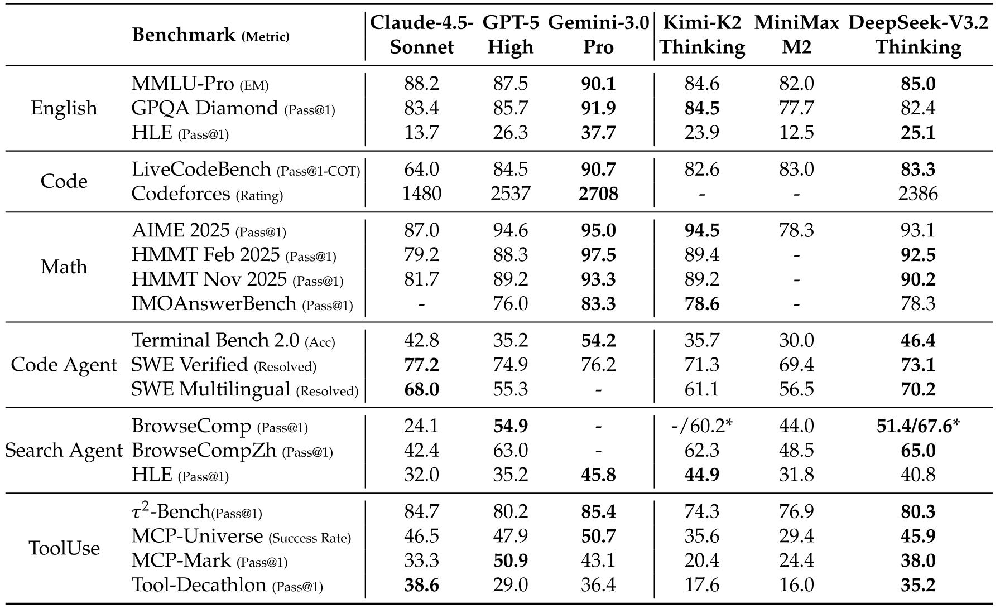
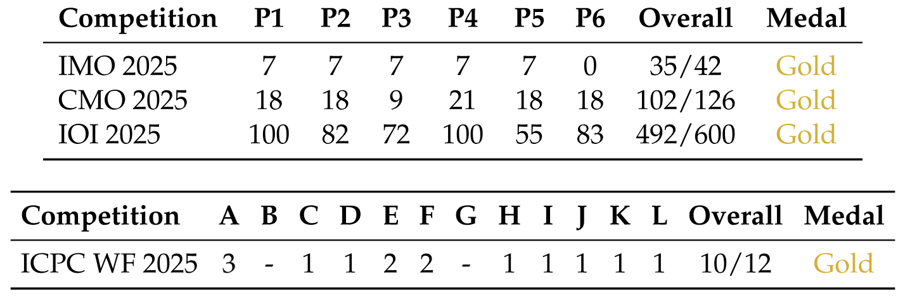

> [DeepSeek-AI](https://www.deepseek.com/)。2025 年 12 月 2 日に arXiv へ初投稿された。このウェブ閲覧版は arXiv v1 の [DeepSeek-V3.2: Pushing the Frontier of Open Large Language Models](https://arxiv.org/abs/2512.02556v1) に基づく。正確な印刷レイアウトと参考文献については[原論文 PDF](/paper/deepseek-v3-2.pdf) を正本とする。[DOI](https://doi.org/10.48550/arXiv.2512.02556)。[TeX ソース](https://arxiv.org/src/2512.02556v1)。

## 概要

本研究では、高い計算効率と優れた推論・エージェント性能を両立するモデル DeepSeek-V3.2 を提案する。DeepSeek-V3.2 の主要な技術的進展は次のとおりである。**（1）DeepSeek Sparse Attention（DSA）**：長文脈でのモデル性能を維持しながら計算複雑性を大幅に削減する効率的な注意機構 DSA を提案する。**（2）スケーラブルな強化学習フレームワーク**：堅牢な強化学習手順を実装し、事後学習の計算量を拡大することで、DeepSeek-V3.2 は GPT-5 と同等の性能を達成する。特に、高計算量版の DeepSeek-V3.2-Speciale は GPT-5 を上回り、Gemini-3.0-Pro と同等の推論能力を示し、2025 年国際数学オリンピック（IMO）と国際情報オリンピック（IOI）の双方で金メダル水準の性能を達成した。**（3）大規模エージェントタスク合成パイプライン**：推論をツール利用シナリオに統合するため、訓練データを体系的かつ大規模に生成する新たな合成パイプラインを開発した。この手法はスケーラブルなエージェント事後学習を可能にし、複雑な対話環境における汎化性能と指示追従の頑健性を大幅に改善する。

**図 1。** DeepSeek-V3.2 と比較対象モデルのベンチマーク。HMMT 2025 はベースラインと合わせて 2 月大会を報告する。HLE はテキストのみのサブセットを報告する。

## 1 はじめに

推論モデル [Ope24, Guo25] の公開は、大規模言語モデル（LLM）の発展における転換点となり、検証可能な分野全般で性能を大きく押し上げた。この節目以降、LLM の能力は急速に進歩してきた。しかし、ここ数か月で明確な分岐が生じている。オープンソースコミュニティ [Yan25g, Glm25, Min25, Kim25f] が進歩を続ける一方、クローズドソースのプロプライエタリモデル [Ope25l, Ant25f, Com25a] は著しく急なペースで性能を伸ばしている。その結果、クローズドモデルとオープンモデルの性能差は収束するどころか拡大しているように見え、複雑なタスクではプロプライエタリシステムの優位性が増している。

分析の結果、オープンソースモデルが複雑なタスクを処理する能力を制限する三つの重大な欠点が明らかになった。第一に、アーキテクチャの面では、標準的な注意機構 [Vas17] への依存が長い系列での効率を著しく制限している。この非効率性は、スケーラブルな配備と効果的な事後学習の双方にとって大きな障害となる。第二に、資源配分の面では、オープンソースモデルは事後学習段階への計算投資が不足しており、難しいタスクでの性能が制限される。最後に、AI エージェントでは、オープンソースモデルの汎化能力と指示追従能力がプロプライエタリモデル [Mcp25, Luo25j, Too26] に比べて明確に遅れており、実運用での有効性を妨げている。

これらの重大な制約に対処するため、まず計算複雑性を大幅に削減する高効率な注意機構 DSA を導入する。このアーキテクチャは効率上のボトルネックを解消し、長文脈でもモデル性能を維持する。第二に、事後学習段階で計算量を大幅に拡大できる、安定かつスケーラブルな RL 手順を開発する。この枠組みでは、事後学習に事前学習コストの 10% を超える計算予算を割り当て、高度な能力を引き出す。第三に、ツール利用シナリオで汎化可能な推論を育成する新しいパイプラインを提案する。まず DeepSeek-V3 [Dee24a] の方法を用いたコールドスタート段階で、単一の軌跡内に推論とツール利用を統合する。続く大規模エージェントタスク合成では、1,800 を超える異なる環境と 85,000 件の複雑なプロンプトを生成する。この大規模な合成データによって RL を進め、エージェント文脈でのモデルの汎化能力と指示追従能力を大幅に高める。

DeepSeek-V3.2 は複数の推論ベンチマークで Kimi-k2-thinking および GPT-5 と同等の性能を達成する。さらに、DeepSeek-V3.2 はオープンモデルのエージェント能力を大きく前進させ、[Mcp25, Luo25j, Too26] で導入されたロングテールのエージェントタスクで優れた能力を示す。エージェントシナリオにおいて、DeepSeek-V3.2 は非常に費用対効果の高い選択肢となり、大幅に低いコストでオープンモデルと最先端プロプライエタリモデルの性能差を大きく縮める。特に、推論領域でオープンモデルの限界を押し広げるため、長さの制約を緩和した DeepSeek-V3.2-Speciale を開発した。その結果、DeepSeek-V3.2-Speciale は主要なクローズドソースシステム Gemini-3.0-Pro [Dee25] と同等の性能に達した。IOI 2025、ICPC World Final 2025、IMO 2025、CMO 2025 で金メダル水準の性能を示している。

## 2 DeepSeek-V3.2 のアーキテクチャ

### 2.1 DeepSeek Sparse Attention

DeepSeek-V3.2 は DeepSeek-V3.2-Exp とまったく同じアーキテクチャを用いる。DeepSeek-V3.1 の最終版 DeepSeek-V3.1-Terminus と比べ、DeepSeek-V3.2 の唯一のアーキテクチャ変更は、継続学習による DeepSeek Sparse Attention（DSA）の導入である。

**DSA のプロトタイプ。** DSA のプロトタイプは主に、lightning indexer と細粒度 token 選択機構の二つから構成される。

**Lightning indexer** は、クエリ token $\mathbf{h}_{t}\in\mathbb{R}^{d}$ と先行 token $\mathbf{h}_{s}\in\mathbb{R}^{d}$ の間のインデックススコア $I_{t,s}$ を計算し、クエリ token が選択する token を決定する：

$$
I_{t,s}=\sum_{j=1}^{H^{I}}w_{t,j}^{I}\cdot\mathrm{ReLU}\left(\mathbf{q}^{I}_{t,j}\cdot\mathbf{k}^{I}_{s}\right),
$$

ここで $H^{I}$ は indexer の head 数、$\mathbf{q}^{I}_{t,j}\in\mathbb{R}^{d^{I}}$ と $w_{t,j}^{I}\in\mathbb{R}$ はクエリ token $\mathbf{h}_{t}$ から、$\mathbf{k}^{I}_{s}\in\mathbb{R}^{d^{I}}$ は先行 token $\mathbf{h}_{s}$ から得られる。スループットを考慮し、活性化関数には ReLU を選ぶ。Lightning indexer は head 数が少なく、FP8 で実装できるため、計算効率は非常に高い。

各クエリ token $\mathbf{h}_{t}$ に対するインデックススコア $\{I_{t,s}\}$ が与えられると、**細粒度 token 選択機構**は上位 k 個のインデックススコアに対応する key-value エントリ $\{\mathbf{c}_{s}\}$ のみを取得する。続いて、クエリ token $\mathbf{h}_{t}$ と疎に選択された key-value エントリ $\{\mathbf{c}_{s}\}$ の間に注意機構を適用し、注意出力 $\mathbf{u}_{t}$ を計算する：

$$
\mathbf{u}_{t}=\mathrm{Attn}\left(\mathbf{h}_t, \left\{\mathbf{c}_s \,\middle|\, I_{t,s}\in\mathrm{Top}\text{-}k\left(I_{t,:}\right)\right\}\right).
$$

**図 2。** DSA を MLA 上で具現化した DeepSeek-V3.2 の注意アーキテクチャ。緑色の部分は、indexer に基づいて DSA が上位 k 個の key-value エントリを選択する方法を示す。

**MLA 上での DSA の具現化。** DeepSeek-V3.1-Terminus から継続学習することを考慮し、DeepSeek-V3.2 では MLA [Dee24d] に基づいて DSA を具現化する。カーネルレベルでは、計算効率のため、各 key-value エントリを複数のクエリで共有する必要がある [Yua25e]。そこで MLA の MQA [Sha19] モードに基づいて DSA を実装し [+1]、各潜在ベクトル（MLA の key-value エントリ）をクエリ token の全 query head で共有する。MLA に基づく DSA のアーキテクチャを[図 2](#figure-02) に示す。詳細を曖昧さなく示すため、DeepSeek-V3.2 のオープンソース実装も提供する [+2]。

#### 2.1.1 継続事前学習

文脈長を 128K に拡張した DeepSeek-V3.1-Terminus のベースチェックポイントから出発し、継続事前学習と事後学習を行って DeepSeek-V3.2 を作成する。

DeepSeek-V3.2 の継続事前学習は二つの学習段階からなる。どちらの段階でも、学習データの分布は DeepSeek-V3.1-Terminus の 128K 長文脈拡張に用いたデータと完全に一致する。

**密なウォームアップ段階。** まず短いウォームアップ段階で lightning indexer を初期化する。この段階では密な注意を維持し、lightning indexer 以外のモデルパラメータをすべて凍結する。Indexer の出力を主注意分布に整合させるため、第 $t$ クエリ token について、全注意 head の主注意スコアを合計する。この合計を系列次元に沿って L1 正規化し、目標分布 $p_{t,:}\in\mathbb{R}^{t}$ を得る。$p_{t,:}$ に基づき、KL ダイバージェンス損失を indexer の学習目標に設定する：

$$
\mathcal{L}^{I}=\sum_{t}\mathbb{D}_{\mathrm{KL}}\left(p_{t,:}\,\middle\|\,\mathrm{Softmax}\left({I}_{t,:}\right)\right).
$$

ウォームアップには学習率 $10^{-3}$ を用いる。Indexer は 1000 step だけ学習し、各 step は 128K token の系列 16 本からなり、合計 2.1B token となる。

**疎な学習段階。** Indexer のウォームアップ後、細粒度 token 選択機構を導入し、全モデルパラメータを最適化して DSA の疎なパターンにモデルを適応させる。この段階でも indexer 出力を主注意分布に整合させ続けるが、選択された token 集合 $\mathcal{S}_{t}=\left\{s \,\middle|\, I_{t,s}\in\mathrm{Top}\text{-}k\left(I_{t,:}\right)\right\}$ だけを考慮する：

$$
\mathcal{L}^{I}=\sum_{t}\mathbb{D}_{\mathrm{KL}}\left(p_{t,\mathcal{S}_{t}}\,\middle\|\,\mathrm{Softmax}\left(I_{t,\mathcal{S}_t}\right)\right).
$$

個別に最適化するため、indexer の入力を計算グラフから detach している点に注意されたい。Indexer の学習信号は $\mathcal{L}^{I}$ のみから得られ、主モデルは言語モデリング損失のみに従って最適化される。この疎な学習段階では学習率を $7.3\times 10^{-6}$ とし、各クエリ token に対して 2048 個の key-value token を選択する。主モデルと indexer の双方を $15000$ step 学習し、各 step は 128K token の系列 480 本からなり、合計 943.7B token となる。

### 2.2 同等性の評価

**標準ベンチマーク。** 2025 年 9 月、多様な能力に焦点を当てた一連のベンチマークで DeepSeek-V3.2-Exp を評価し、DeepSeek-V3.1-Terminus と比較したところ、同等の性能が得られた。DeepSeek V3.2 Exp は長い系列で計算効率を大幅に改善する一方、短文脈・長文脈のいずれのタスクでも、DeepSeek-V3.1-Terminus と比べて大幅な性能低下は観察されなかった。

**人間の選好。** 直接的な人間の選好評価には本質的にバイアスが入りやすいため、新たに開発したベースモデルに対する利用者の選好を近似する間接評価フレームワークとして ChatbotArena を用いる。DeepSeek-V3.1-Terminus と DeepSeek-V3.2-Exp は同一の事後学習戦略を共有し、2025 年 11 月 10 日の評価で得られた Elo スコアも近い。この結果から、新しいベースモデルは疎な注意機構を導入しながら、前版と同等の性能を達成していることが示唆される。

**長文脈評価。** DeepSeek-V3.2-Exp の公開後、それまで未見のテストセットを用いた複数の独立した長文脈評価が実施された。代表的なベンチマークは AA-LCR [+3] であり、DeepSeek-V3.2-Exp は推論モードで DeepSeek-V3.1-Terminus を 4 point 上回った。Fiction.liveBench 評価 [+4] でも、DeepSeek-V3.2-Exp は複数の指標で一貫して DeepSeek-V3.1-Terminus を上回る。これらの証拠は、DeepSeek-V3.2-Exp のベースチェックポイントが長文脈タスクで退行していないことを示す。

### 2.3 推論コスト

DSA は主モデルの中核的な注意の複雑性を $\mathcal{O}(L^2)$ から $\mathcal{O}(L k)$ に削減する。ここで $k$（$\ll L$）は選択する token 数である。Lightning indexer の複雑性は依然として $\mathcal{O}(L^2)$ だが、DeepSeek-V3.1-Terminus の MLA と比べて必要な計算量ははるかに少ない。最適化した実装と組み合わせることで、DSA は長文脈で end-to-end の大幅な高速化を達成する。[図 3](#figure-03) は、DeepSeek-V3.1-Terminus と DeepSeek-V3.2 の token コストが、系列内の token 位置に応じてどのように変化するかを示す。これらのコストは、H800 GPU 上に配備した実サービスを、GPU 1 枚 1 時間あたり 2 USD のレンタル価格でベンチマークして推定した。短い系列の prefill については、DSA を模擬する masked MHA モードを特別に実装しており、短文脈条件でより高い効率を実現できる。

**図 3。** H800 クラスタ上での DeepSeek-V3.1-Terminus と DeepSeek-V3.2 の推論コスト。

## 3 事後学習

継続事前学習の後、事後学習を行って最終的な DeepSeek-V3.2 を作成する。DeepSeek-V3.2 の事後学習でも、疎な継続事前学習段階と同じ方法で疎な注意を用いる。DeepSeek-V3.2 では DeepSeek-V3.2-Exp と同じ事後学習パイプラインを維持し、specialist distillation と混合 RL 学習を含める。

**Specialist distillation。** 各タスクについて、まずその分野だけに特化した専用モデルを開発する。すべての specialist model は、同じ事前学習済み DeepSeek-V3.2 ベースチェックポイントから fine-tuning する。執筆タスクと一般的な質疑応答に加え、数学、プログラミング、一般論理推論、一般エージェントタスク、エージェント coding、エージェント search の六つの専門分野を対象とし、すべての分野が思考モードと非思考モードの双方を支援する。各 specialist は大規模な強化学習（RL）計算で学習する。さらに、長い chain-of-thought 推論（思考モード）と直接的な応答生成（非思考モード）の学習データには、それぞれ異なるモデルを用いる。Specialist model の準備後、最終チェックポイント用の分野別データを生成させる。実験結果から、蒸留データで学習したモデルの性能は分野別 specialist をわずかに下回るだけであり、その差は後続の RL 学習で実質的に解消されることが分かる。

**混合 RL 学習。** DeepSeek-V3.2 でも、RL 学習アルゴリズムとして Group Relative Policy Optimization（GRPO） [Sha24d, Guo25] を採用する。DeepSeek-V3.2-Exp と同様、推論、エージェント、人間とのアラインメントの学習を一つの RL 段階に統合する。この方法は、多段階学習に一般的に伴う破滅的忘却を回避しつつ、多様な分野の性能を効果的に均衡させる。推論タスクとエージェントタスクには、ルールベースの結果報酬、長さ penalty、言語一貫性報酬を用いる。一般タスクには、プロンプトごとに固有の評価 rubric を持つ生成的報酬モデルを用いる。

**DeepSeek-V3.2 と DeepSeek-V3.2-Speciale。** DeepSeek-V3.2 は、specialist から蒸留した推論、エージェント、人間とのアラインメントのデータを統合し、数千 step の継続 RL 学習を経て最終チェックポイントに到達する。長い思考の可能性を調べるため、実験的な変種 DeepSeek-V3.2-Speciale も開発した。このモデルは推論データのみで学習し、RL 中の長さ penalty を弱めた。さらに、数学証明能力を高めるため、DeepSeekMath-V2 [Sha25] のデータセットと報酬手法を組み込んだ。

[第 3.1 節](#section-3-1) では RL 計算を拡大する安定した recipe の構築、[第 3.2 節](#section-3-2) では思考をエージェントタスクに統合する方法に関する取り組みを詳しく述べる。

### 3.1 GRPO のスケーリング

まず GRPO の目的を振り返る。各 question $q$ が与えられたとき、旧方策 $\pi_{\mathrm{old}}$ から sampling した応答群 $\{o_{1},\cdots,o_{G}\}$ に対し、GRPO は次の目的を最大化して方策モデル $\pi_{\theta}$ を最適化する：

$$
\begin{aligned}
\mathcal{J}_{\mathrm{GRPO}}(\theta)={}&\mathbb{E}_{q\sim P(Q),\{o_{i}\}_{i=1}^{G}\sim\pi_{\mathrm{old}}(\cdot|q)}\Bigg[\frac{1}{G}\sum_{i=1}^{G}\frac{1}{|o_{i}|}\sum_{t=1}^{|o_{i}|} \\
&\min\left(r_{i,t}(\theta)\hat{A}_{i,t},\mathrm{clip}\left(r_{i,t}(\theta),1-\varepsilon,1+\varepsilon\right)\hat{A}_{i,t}\right)-\beta\mathbb{D}_{\mathrm{KL}}\left(\pi_{\theta}(o_{i,t})\,\middle\|\,\pi_{\mathrm{ref}}(o_{i,t})\right)\Bigg],
\end{aligned}
$$

ここで

$$
r_{i,t}(\theta)=\frac{\pi_{\theta}(o_{i,t}|q,o_{i,<t})}{\pi_{\mathrm{old}}(o_{i,t}|q,o_{i,<t})}
$$

は現在の方策と旧方策の間の importance sampling ratio である。$\varepsilon$ と $\beta$ は、それぞれ clipping 範囲と KL penalty の強さを制御するハイパーパラメータである。$\hat{A}_{i,t}$ は $o_{i,t}$ の advantage であり、各 group 内で結果報酬を正規化して推定する。具体的には、複数の報酬モデルが group 内の各出力 $o_{i}$ に結果報酬 $R_{i}$ を与え、それぞれ $G$ 個の報酬 $\boldsymbol{R}=\{R_{1},\cdots,R_{G}\}$ を得る。$o_{i,t}$ の advantage は、出力 $o_{i}$ の報酬から group の平均報酬を引いて計算し、$\hat{A}_{i,t}=R_{i}-\mathrm{mean}(\boldsymbol{R})$ となる。

以下では、GRPO アルゴリズムを直接基礎として、RL のスケーリングを安定させる追加戦略を概説する。

**不偏 KL 推定。** $o_{i,t}$ は旧方策 $\pi_{\mathrm{old}}(\cdot|q,o_{i,<t})$ から sampling されるため、K3 estimator [Sch20a] を補正し、現在の方策 $\pi_{\theta}$ と旧方策 $\pi_{\mathrm{old}}$ の importance-sampling ratio を用いて不偏な KL 推定を得る。

$$
\mathbb{D}_{\mathrm{KL}}\left(\pi_{\theta}(o_{i,t})\,\middle\|\,\pi_{\mathrm{ref}}(o_{i,t})\right)=\frac{\pi_{\theta}(o_{i,t}|q,o_{i,<t})}{\pi_{\mathrm{old}}(o_{i,t}|q,o_{i,<t})}\left(\frac{\pi_{\mathrm{ref}}(o_{i,t}|q,o_{i,<t})}{\pi_{\theta}(o_{i,t}|q,o_{i,<t})}-\log\frac{\pi_{\mathrm{ref}}(o_{i,t}|q,o_{i,<t})}{\pi_{\theta}(o_{i,t}|q,o_{i,<t})}-1\right).
$$

この調整の直接的な結果として KL estimator の gradient は不偏となり、系統的な推定誤差が解消され、安定した収束が促される。これは元の K3 estimator と明確に異なり、sampling された token の現在方策での確率が参照方策より大幅に低い場合、すなわち $\pi_{\theta}\ll\pi_{\mathrm{ref}}$ の場合に特に顕著である。この場合、K3 estimator の gradient は、それらの token の尤度を最大化するため、不釣り合いに大きく上限のない weight を割り当てる。その結果、ノイズの多い gradient update が蓄積し、後続 iteration の sample quality を低下させ、学習 dynamics を不安定にする。実際には、分野によって有効な KL regularization の強さが異なることが分かった。数学など一部の分野では、比較的弱い KL penalty を適用するか、完全に省略することで性能が改善する場合もある。

**Off-policy sequence masking。** RL システムの効率を高めるため、通常は大きな batch の rollout data を生成し、複数の mini-batch に分割して数回の gradient update を行う。この方法は本質的に off-policy behavior を導入する。また、効率的なデータ生成に用いる推論フレームワークは高度に最適化されていることが多く、実装の詳細が学習フレームワークと異なる場合がある。この学習・推論の不一致は off-policy の程度をさらに悪化させる。学習を安定させ、off-policy update への耐性を高めるため、データ sampling 方策 $\pi_{\mathrm{old}}$ と現在方策 $\pi_{\theta}$ の KL divergence で測定した方策乖離が大きい負の系列を mask する。より具体的には、GRPO loss に binary mask $M$ を導入する：

$$
\begin{aligned}
\mathcal{J}_{\mathrm{GRPO}}(\theta)={}&\mathbb{E}_{q\sim P(Q),\{o_{i}\}_{i=1}^{G}\sim\pi_{\mathrm{old}}(\cdot|q)}\Bigg[\frac{1}{G}\sum_{i=1}^{G}\frac{1}{|o_{i}|}\sum_{t=1}^{|o_{i}|} \\
&\min\left(r_{i,t}(\theta)\hat{A}_{i,t},\mathrm{clip}\left(r_{i,t}(\theta),1-\varepsilon,1+\varepsilon\right)\hat{A}_{i,t}\right)M_{i,t}-\beta\mathbb{D}_{\mathrm{KL}}\left(\pi_{\theta}(o_{i,t})\,\middle\|\,\pi_{\mathrm{ref}}(o_{i,t})\right)\Bigg],
\end{aligned}
$$

ここで

$$
M_{i,t}=\begin{cases}0&{\hat{A}_{i,t}<0,\frac{1}{|o_{i}|}\sum_{t=1}^{|o_{i}|}\log\frac{\pi_{\mathrm{old}}(o_{i,t}|q,o_{i,<t})}{\pi_{\theta}(o_{i,t}|q,o_{i,<t})}>\delta}\\[4.30554pt]
1&{\mathrm{otherwise},}\end{cases}
$$

$\delta$ は方策乖離の閾値を制御するハイパーパラメータである。ここで $\pi_{\mathrm{old}}$ は推論フレームワークから直接返される sampling 確率を表すため、旧方策と現在方策の間の KL divergence は、前述した off-policy の二つの発生源をともに考慮する。負の advantage を持つ系列だけを mask する点にも注意されたい。

直感的には、モデルは自身の誤りから学ぶことで最大の恩恵を受けるが、高度に off-policy な負の sample は有害となり、最適化プロセスを誤った方向へ導いたり不安定にしたりする可能性がある。経験的には、この Off-Policy Sequence Masking 操作が、さもなければ不安定になる一部の学習条件で安定性を改善することを確認した。

**Keep Routing。** Mixture-of-Experts（MoE）モデルは、推論時に専門家 module の一部だけを活性化して計算効率を改善する。しかし、推論フレームワークと学習フレームワークの差異に方策更新が重なると、同一入力でも推論時と学習時で専門家 routing が一致しない場合がある。この不一致は active parameter subspace の急激な変化を引き起こし、最適化を不安定にして off-policy 問題を悪化させる。これを緩和するため、推論フレームワークで sampling 時に用いた専門家 routing path を保存し、学習時にも同じ routing path を強制して、同一の専門家パラメータが最適化されるようにする。この Keep Routing 操作は MoE モデルの RL 学習の安定性に不可欠であることが分かり、DeepSeek-V3-0324 以降、RL 学習パイプラインに採用している。

**Keep Sampling Mask。** Top-p sampling と top-k sampling は、LLM が生成する応答の品質を高めるために広く用いられる sampling 戦略である。最適化対象となる極端に低確率な token の sampling を避けられるため、RL 学習でこれらの戦略を使うことにも利点がある。この切り詰めは sample quality を保つ一方で、$\pi_{\mathrm{old}}$ と $\pi_{\theta}$ の action space に不一致を生じさせ、importance sampling の原理に反して学習を不安定にする。そこで、$\pi_{\mathrm{old}}$ から sampling する際の truncation mask を保存し、学習時に $\pi_{\theta}$ に適用することで、両方策が同一の action subspace を共有するようにする。経験的には、top-p sampling と Keep Sampling Mask 戦略を組み合わせることで、RL 学習中の言語一貫性を効果的に保てることが分かった。

### 3.2 ツール利用における思考

#### 3.2.1 思考文脈の管理

DeepSeek-R1 は、思考プロセスを組み込むことで、複雑な問題を解く能力を大幅に高められることを示した。この知見を基に、思考能力をツール呼び出しのシナリオへ統合することを目指す。

DeepSeek-R1 の戦略、すなわち 2 round 目のメッセージが到着した時点で推論内容を破棄する方法を再現すると、token の効率が大幅に低下することを観察した。この方法では、後続のツール呼び出しのたびに問題全体を重複して再推論する必要がある。これを緩和するため、[図 4](#figure-04) に示すとおり、ツール呼び出しシナリオ専用の文脈管理を開発した：

- 会話に新しい**ユーザーメッセージ**が導入された場合に限り、過去の推論内容を破棄する。ツール関連メッセージ（ツール出力など）だけが追加された場合、対話の全体を通じて推論内容を**保持**する。
- 推論 trace を削除する場合でも、**ツール呼び出しとその結果**の履歴は文脈内に保持する。

特に Roo Code や Terminus など一部のエージェントフレームワークは、ユーザーメッセージを介してツール対話を模擬する。これらのフレームワークは、上記の文脈管理規則のため、強化した推論保持を十分に活用できない可能性がある。したがって、この種のアーキテクチャで最適な性能を得るには、非思考モデルの利用を推奨する。

**図 4。** ツール呼び出しシナリオにおける思考保持機構。

#### 3.2.2 コールドスタート

推論データ（非エージェント）と非推論のエージェントデータが利用できる場合、この二つの能力を統合する直接的な戦略は、慎重に設計した prompting である。明示的な指示に正確に従う十分な能力をモデルが備えており、その結果、推論プロセスにツール実行を円滑に組み込めると想定する。

コールドスタート機構の動作を示すため、付録の[表 6](#table-06)-[表 8](#table-08) に示す学習データを選択的に sampling した。異なる task prompt には異なる system prompt が対応する点に注意されたい。[表 6](#table-06)-[表 8](#table-08) は、競技プログラミングの prompt に対応する例を示す。[表 6](#table-06) は推論データの例であり、system prompt が最終回答の前に推論するよう明示的に求め、特殊な tag `<think></think>` で推論 path を示す。[表 7](#table-07) は非推論エージェントデータの prompt を示し、system prompt には toolcall の guidance が含まれる。[表 8](#table-08) は、推論プロセスに複数の tool call を組み込むようモデルへ指示するために設計した system prompt を示す。

この方法では、ツール利用における推論パターンは頑健性に欠ける可能性があるものの、モデルは目的の軌跡を生成できる場合があり、後続の強化学習段階の基礎となる。

#### 3.2.3 大規模エージェントタスク

多様な RL タスクの集合は、モデルの頑健性を高めるうえで不可欠である。検索、コードエンジニアリング、コード解釈などのタスクには、実際のウェブ検索 API、coding tool、Jupyter Notebook を含む現実のツールを用いる。これらの RL 環境は実物だが、使用する prompt は実際のユーザー対話から得るのではなく、インターネット上の情報から抽出するか、合成して生成する。その他のタスクでは、環境と prompt をともに合成する。使用したエージェントタスクを[表 1](#table-01) に示す。

**表 1。** タスク数、環境の種類（実環境または合成環境）、prompt の出典（抽出または合成）を含む、エージェントタスク別の説明。

**検索エージェント。** DeepSeek-V3.2 に基づく multi-agent pipeline を用いて、多様で高品質な学習データを生成する。まず、大規模 web corpus から多様な分野の有益な long-tail entity を sampling する。次に question-construction agent が深さと幅を設定できる検索ツールで各 entity を調べ、見つけた情報を question-answer pair にまとめる。異種構成（異なる checkpoint、system prompt など）の複数の answer-generation agent が、各 QA pair に対して多様な候補応答を生成する。検索能力を持つ verification agent が複数回にわたってすべての回答を検証し、ground-truth が正しく、かつ全候補が検証可能な形で誤っている sample だけを残す。このデータは複数の言語、分野、難易度にまたがる。検証可能な sample を補い、実際の利用をよりよく反映するため、既存の helpful RL dataset から、検索ツールによる効果を測定できる instance を選別してデータセットに加える。続いて、複数の品質次元について詳細な評価 rubric を作成し、生成的報酬モデルで rubric に基づいて応答を採点する。この hybrid approach により、事実上の信頼性と実用上の有用性を同時に最適化できる。

**Code agent。** GitHub から数百万件の issue-Pull Request（PR） pair を収集し、ソフトウェア issue 解決用の大規模な実行可能環境を構築した。データセットは heuristic rule と LLM による判断で厳密に filter し、各 entry が合理的な issue description、関連する gold patch、検証用 test patch を含むことを必須とした。DeepSeek-V3.2 を用いた自動 environment-setup agent で、これらの pair に対する実行可能環境を構築した。この agent は package installation、dependency resolution、test execution を処理する。テスト結果は標準 JUnit 形式で出力し、プログラミング言語やテストフレームワークをまたいで一貫した parsing を可能にする。Gold patch の適用後に false-to-positive（F2P） test case が 0 件ではなく（issue の修正を示す）、かつ pass-to-fail（P2F） test case が 0 件である（regression がないことを示す）場合に限り、環境の構築に成功したとみなす。このパイプラインにより、Python、Java、JavaScript、TypeScript、C、C++、Go、PHP など複数のプログラミング言語にまたがる、数万件の再現可能な issue 解決環境を構築した。

**Code interpreter agent。** 複雑な推論タスクを解くため、code interpreter として Jupyter Notebook を利用する。そのために、数学、論理、データサイエンスにわたる多様な問題群を整備し、いずれも解答に到達するためモデルがコード実行能力を利用する必要があるものとした。

**一般エージェント。** RL のエージェント環境とタスクを拡大するため、自動 environment-synthesis agent を用いて、タスク指向の環境 1,827 件を合成する。これらのタスクは解くのが難しい一方、検証は容易である。合成 workflow は主に、環境と toolset の構築、タスク合成、解答生成からなる。具体的には次のように進める。

- タスクカテゴリ（旅行日程の計画など）と、bash および検索ツールを備えた sandbox が与えられると、agent はまずこれらのツールを用いてインターネットから関連データを生成または取得し、sandbox database に保存する。
- 次に agent は、各々を function として実装したタスク固有のツール群を合成する。
- 難しく、かつ自動検証可能なタスクを作るため、agent はまず現在の database に基づく単純なタスクを、Python で実装した solution function および verification function とともに提案する。Solution function は tool function の呼び出しまたは論理計算に限定され、他の function を呼び出したり database に直接アクセスしたりできないため、タスクは tool interface を介してのみ解ける。また、solution function の結果は verification function で検証しなければならない。Solution が検証されなければ、agent は solution function または verification function を、solution の出力が検証に合格するまで修正する。次に agent はタスクの難易度を反復的に高め、対応する solution function と verification function を更新する。この反復中、現在の toolset でタスクを解けない場合は toolset を拡張する。

この workflow により、数千件の $\langle\mathrm{environment},\mathrm{tools},\mathrm{task},\mathrm{verifier}\rangle$ tuple を得る。続いて DeepSeek-V3.2 を用いてこのデータセットで RL を行い、pass@100 が 0 でない instance だけを残すことで、1,827 環境と対応するタスク（合計 4,417 件）を得る。以下に、合成した旅行計画の例を示す。この例は、すべての制約を満たす旅行計画を大きな組合せ空間から探すことは難しい一方、与えられた候補解が制約を満たすかの確認は比較的容易であることを示す。

**合成タスクの例：旅行計画。**

**旅行計画のツールセット。**

## 4 評価

### 4.1 主な結果

MMLU-Pro [Wan24c]、GPQA Diamond [Rei23]、Human Last Exam（HLE） Text-only [Pha25]、LiveCodeBench（2024.08-2025.04）、Codeforces、Aider-Polyglot、AIME 2025、HMMT Feb 2025、HMMT Nov 2025 [Bal25]、IMOAnswerBench [Luo25]、Terminal Bench 2.0、SWE-Verified [Ope24e]、SWE Multilingual [Yan25b]、BrowseComp [Wei25b]、BrowseCompZh [Zho25]、$\tau^{2}$-bench [Bar25c]、MCP-Universe [Luo25j]、MCP-Mark [Mcp25]、Tool-Decathlon [Too26] でモデルを評価する。ツール利用ベンチマークでは標準的な function call format を用い、モデルを思考モードに設定する。MCP-Universe [Luo25j] と MCP-Mark [Mcp25] については、検索環境と Playwright 環境が公式設定とわずかに異なる可能性があるため、すべてのモデルを内部環境で評価する。Temperature は 1.0、文脈 window は 128K token に設定する。AIME、HMMT、IMOAnswerBench、HLE などの数学関連タスクは、`"{question}\nPlease reason step by step, and put your final answer within \boxed{}."` という template で評価する。HLE では、公式 template を用いて DeepSeek-V3.2-Thinking も評価し、$23.9$ の score を得た。

**表 2。** DeepSeek-V3.2 とクローズド・オープンモデルの比較。オープンモデルについては、ツール利用時の思考を支援するモデルだけを比較する。太字はモデル区分（オープンソースとクローズドソース）ごとの最高 score を示す。$\tau^{2}$-Bench の結果は各 category の平均である。BrowseComp では文脈管理技術を用いた性能を * で示す。

DeepSeek-V3.2 は推論タスクで GPT-5-high と同等の性能を達成するが、Gemini-3.0-Pro よりわずかに劣る。K2-Thinking と比べると、[表 3](#table-03) に示すように、DeepSeek-V3.2 は出力 token が大幅に少ないにもかかわらず同等の score を達成する。この性能向上は、RL 学習に割り当てた計算資源の増加によるものと考えられる。ここ数か月、RL 学習予算の拡大と相関して性能が一貫して向上することを確認しており、その予算はすでに事前学習コストの 10% を超えている。推論能力は計算予算をさらに割り当てることで高められる可能性があると考える。ここで示す DeepSeek-V3.2 の性能は、長さ制約の報酬モデルによって制限されている。この制限を取り除くと、[第 4.2 節](#section-4-2) で詳述するように、性能はさらに向上する。

Code agent の評価では、DeepSeek-V3.2 は SWE-bench Verified と Terminal Bench 2.0 の双方でオープンソース LLM を大幅に上回り、実世界の coding workflow における可能性を示す。Terminal Bench 2.0 については先に述べたとおり、現行の「思考モード」用文脈管理戦略が Terminus と互換性を持たないため、報告した 46.4 の score は Claude Code framework を用いて達成したものである。DeepSeek-V3.2 を Terminus の非思考モードでも評価し、39.3 の score を得た。SWE-bench Verified の主 score は内部 framework で取得した。Claude Code と RooCode の framework、および非思考モードを含む他の設定で頑健性を試験したところ、72 から 74 の範囲で一貫した結果が得られた。

検索エージェントの評価には、標準的な商用検索 API を用いる。DeepSeek-V3.2 が支援する文脈長は最大 128K だけであり、テストケースの約 20% 超がこの上限を超える。これに対処するため、文脈管理手法を用いて最終 score を求める。参考として、文脈管理を行わない場合の score は 51.4 である。詳細は[第 4.4 節](#section-4-4) に示す。

ツール利用ベンチマークでは、DeepSeek-V3.2 はオープンソース LLM とクローズドソース LLM の性能差を大幅に縮めるものの、最先端モデルには及ばない。$\tau^{2}$-bench ではモデル自体を user agent として用い、最終 category score は 63.8（Airline）、81.1（Retail）、96.2（Telecom）となった。MCP benchmark では function calling format を用い、ツール出力を「user」role ではなく「tool」role の message に置く。テスト中、DeepSeek-V3.2 が冗長な自己検証を頻繁に行い、過度に長い軌跡を生成することを確認した。この傾向により文脈長が 128K の上限を超える場合が多く、特に MCP-Mark GitHub と Playwright の評価で顕著である。その結果、DeepSeek-V3.2 の最終性能が妨げられる。ただし、文脈管理戦略を統合することで、性能をさらに改善できる。これは今後の研究課題であり、利用者にとって実用上の考慮事項でもある。この問題があっても、DeepSeek-V3.2 は既存のオープンモデルを大幅に上回る。また、これらのベンチマークで使う環境と toolset は RL 学習中に見ていないため、この改善は DeepSeek-V3.2 の推論戦略が out-of-domain のエージェントシナリオへ汎化できることを示す。エージェントシナリオにおける非思考モデルの評価は、付録の[表 9](#table-09) に示す。

### 4.2 DeepSeek-V3.2-Speciale の結果

**表 3。** 推論モデルのベンチマーク性能と効率。各ベンチマークの cell は精度と出力 token 数（千単位）を示す。ベンチマークごとの最高精度を太字、2 番目を下線で示す。

[表 3](#table-03) は、DeepSeek-V3.2-Speciale が推論 token を増やすことで優れた性能を達成し、複数のベンチマークで最先端の Gemini-3.0-Pro を上回ることを示す。特に、[表 4](#table-04) に示すように、この汎用モデルは対象を絞った学習なしで、2025 年国際情報オリンピック（IOI）と ICPC World Finals（ICPC WF）の金メダル水準の性能を達成する。さらに、[Sha25] の技術を取り入れることで、複雑な証明タスクで優れた性能を示し、2025 年国際数学オリンピック（IMO）と中国数学オリンピック（CMO）の金メダル基準に達する [+5]。詳しい評価手順は付録の[第 9 節](#section-9) に示す。

しかし、DeepSeek-V3.2-Speciale の token 効率は Gemini-3.0-Pro より依然として大幅に低い。配備コストと latency を抑えるため、公式版 DeepSeek-V3.2 の学習では、性能とコストの trade-off を最適化する目的で、より厳しい token 制約を課した。Token 効率は今後も重要な研究領域だと考える。

**表 4。** 最高水準の数学・プログラミング競技における DeepSeek-V3.2-Speciale の性能。ICPC WF 2025 は、正解した各問題の提出回数を報告する。DeepSeek-V3.2-Speciale は ICPC WF 2025 で 2 位、IOI 2025 で 10 位に相当した。

### 4.3 合成エージェントタスク

本節では、合成エージェントタスクの効果を調べるため ablation experiment を行う。二つの問題に焦点を当てる。第一に、合成タスクは強化学習に十分な難しさを持つか。第二に、これらの合成タスクはどの程度汎化するか、すなわち異なる下流タスクや実世界の環境へ転移できるかである。

第一の問題に答えるため、一般合成エージェントタスクから 50 instance を無作為に抽出し、合成に用いたモデルと最先端のクローズドソース LLM の双方を評価する。[表 5](#table-05) に示すように、DeepSeek-V3.2-Exp の精度はわずか 12% であり、最先端のクローズドソースモデルでも最大 62% である。この結果は、合成データに DeepSeek-V3.2-Exp と最先端クローズドソースモデルの双方にとって難しいエージェントタスクが含まれることを示す。

**表 5。** 異なるモデルにおける一般合成タスクの精度。

合成データでの RL が異なるタスクや実世界の環境へ汎化するかを調べるため、DeepSeek-V3.2 の SFT checkpoint（DeepSeek-V3.2-SFT と表記）に RL を適用する。長い CoT と他の RL データの影響を除くため、非思考モードで合成エージェントタスクだけを用いて RL を行う。次に、このモデルを DeepSeek-V3.2-SFT および DeepSeek-V3.2-Exp と比較する。DeepSeek-V3.2-Exp は検索環境とコード環境だけで RL 学習されている。[図 5](#figure-05) に示すように、大規模な合成データによる RL は、Tau2Bench、MCP-Mark、MCP-Universe ベンチマークで DeepSeek-V3.2-SFT を大幅に改善する。一方、RL をコードと検索のシナリオに限定しても、これらのベンチマークの性能は改善せず、合成データの可能性がさらに示される。

**図 5。** 合成した一般エージェントデータだけを用いた DeepSeek-V3.2-SFT の RL 学習。

### 4.4 検索エージェントの文脈管理

**図 6。** 異なる test-time compute 拡大戦略における Browsecomp の精度。

128k のような拡張した文脈 window でも、エージェント workflow、特に検索ベースのシナリオは最大長の制限に頻繁に達し、推論プロセスが途中で切り詰められる。このボトルネックは test-time compute の可能性を十分に引き出す妨げとなる。そこで token 使用量が文脈 window 長の 80% を超えた場合に、単純な戦略で文脈を管理し、test time の token budget を拡張する。戦略は次の三つである。（1）**Summary**：あふれた軌跡を要約して rollout を再開する。（2）**Discard-75%**：軌跡の先頭 75% の tool call history を破棄して空間を確保する。（3）**Discard-all**：過去の tool call history をすべて破棄して文脈を reset する（new context tool [Ant25a] と同様）。比較のため、並列拡大の baseline **Parallel-fewest-step** も実装する。これは N 本の独立した軌跡を sampling し、step 数が最も少ない軌跡を選ぶ。

これらの戦略を BrowseComp benchmark [Wei25b] で評価する。[図 6](#figure-06) に示すように、さまざまな計算予算の下で、文脈管理は test-time compute の拡大を可能にし、追加の実行 step のための空間を増やすことで、大幅な性能向上をもたらす。たとえば Summary は平均 step 数を 364 に延ばし、最大 60.2 の性能向上を達成する。ただし、全体的な効率は比較的低い。Discard-all は単純だが、効率と scalability の双方に優れ、大幅に少ない step 数で並列拡大と同等の 67.6 を達成する。

要約すると、test-time compute は文脈管理によって直列にも、並列にも拡大でき、どちらもモデルの問題解決能力を効果的に拡張する。ただし、戦略によって効率と scalability は異なる。したがって、モデル性能のベンチマークでは実際の計算コストを考慮することが重要である。効率と scalability の双方を最大化する直列・並列拡大の最適な組合せを見いだすことは、今後の重要な研究課題である。

## 5 結論、限界、今後の課題

本研究では、計算効率と高度な推論能力の隔たりを効果的に埋めるフレームワーク DeepSeek-V3.2 を提案した。DSA により、長文脈性能を犠牲にせず、重大な計算複雑性の問題に対処した。計算予算を増やすことで、DeepSeek-V3.2 は推論ベンチマークにおいて GPT-5 と同等の性能を達成する。最後に、大規模エージェントタスク合成パイプラインの統合はツール利用能力を大幅に高め、オープン LLM を用いた頑健で汎化可能な AI エージェントの新たな可能性を開く。さらに、高計算量版 DeepSeek-V3.2-Speciale は IMO と IOI で金メダル水準を達成し、オープン LLM の一つの節目となる。

これらの成果にもかかわらず、Gemini-3.0-Pro などの最先端クローズドソースモデルと比べて、いくつかの限界を認識している。第一に、総学習 FLOP が少ないため、DeepSeek-V3.2 の世界知識の広さは依然として主要なプロプライエタリモデルに遅れている。将来の iteration では事前学習の計算量を拡大し、この知識差に対処する予定である。第二に、token 効率は依然として課題であり、DeepSeek-V3.2 が Gemini-3.0-Pro などのモデルと同じ出力品質を得るには、通常、より長い生成軌跡（つまり多くの token）が必要となる。今後はモデルの推論 chain の intelligence density を最適化し、効率を改善する。第三に、複雑なタスクを解く能力は最先端モデルに及ばず、基盤モデルと事後学習 recipe のさらなる改善が必要である。

## 6 MLA の MHA モードと MQA モード

**図 7。** MLA の MHA モードと MQA モードの図解。DeepSeek-V3.1-Terminus は学習と prefill に MHA モード、decode に MQA モードを用いる。

[図 7](#figure-07) は、MLA の二つの側面である MHA モードと MQA モード、および両者の変換を示す。

## 7 コールドスタートテンプレート

**表 6。** 推論データの system prompt の例。System prompt は `<think></think>` tag 内に推論プロセスを出力するようモデルに求める。

**表 7。** `{TOOL-DESCRIPTIONS}` と `{TOOLCALL-FORMAT}` は、具体的なツールと設計した toolcall format に置き換えられる。

**表 8。** モデルは思考プロセス内で tool call を実行する。

## 8 非思考 DeepSeek-V3.2 のエージェント評価

**表 9。** DeepSeek-V3.2 の非思考モードと思考モードの比較。表中の Terminal Bench score は Claude Code framework で評価した。Terminus framework を用いた Terminal Bench 2.0 の非思考 score は 39.3 である。

非思考モードの性能は思考モードよりわずかに低いが、依然として競争力がある。

## 9 IOI、ICPC World Final、IMO、CMO の評価方法

すべての競技で、モデルの最大生成長を 128k に設定する。ツールやインターネットアクセスは使用せず、競技の時間制限と試行回数制限を厳密に守る。

IOI の評価では、1 問あたり最大 50 回の提出を認め、各提出について全 subtask で得た最高点を score とする公式競技規則に従い、提出戦略を設計した。具体的には、まず各問題について 500 個の候補解を sampling し、次に多段階の filtering pipeline を適用した。最初の段階では、提示された sample test case に合格しないか、長さ制約を超える無効な提出を除外した。続いて DeepSeek-V32-Exp model を用い、モデルが問題を解けない、または解くことを拒否すると明示した sample を特定して除外した。残った有効候補から、思考 trace が最も長い 50 sample を最終提出用に選んだ。

ICPC の評価では、同じ filtering 手法を、より小さい初期 sample size で適用した。各問題について 32 個の候補解を生成し、同一の filtering criteria で提出を選択した。

IMO と CMO のタスクには generate-verify-refine loop を用いる。モデルは完全な自己評価を得るか最大 revision 回数に達するまで、解答を反復的に改善する。このプロセスは [Sha25] と同一である。

## 10 著者一覧

**研究・エンジニアリング**：Aixin Liu, Aoxue Mei, Bangcai Lin, Bing Xue, Bingxuan Wang, Bingzheng Xu, Bochao Wu, Bowei Zhang, Chaofan Lin, Chen Dong, Chengda Lu, Chenggang Zhao, Chengqi Deng, Chenhao Xu, Chong Ruan*, Damai Dai, Daya Guo, Dejian Yang, Deli Chen, Erhang Li, Fangqi Zhou*, Fangyun Lin, Fucong Dai, Guangbo Hao, Guanting Chen, Guowei Li, H. Zhang, Hanwei Xu, Hao Li, Haofen Liang, Haoran Wei, Haowei Zhang, Haowen Luo, Haozhe Ji, Honghui Ding, Hongxuan Tang, Huanqi Cao, Huazuo Gao, Hui Qu, Hui Zeng, Jialiang Huang, Jiashi Li, Jiaxin Xu, Jiewen Hu, Jingchang Chen, Jingting Xiang, Jingyang Yuan, Jingyuan Cheng, Jinhua Zhu, Jun Ran*, Junguang Jiang, Junjie Qiu, Junlong Li*, Junxiao Song, Kai Dong, Kaige Gao, Kang Guan, Kexin Huang*, Kexing Zhou, Kezhao Huang, Kuai Yu, Lean Wang, Lecong Zhang, Lei Wang, Liang Zhao, Liangsheng Yin*, Lihua Guo, Lingxiao Luo, Linwang Ma, Litong Wang, Liyue Zhang, M.S. Di, M.Y Xu, Mingchuan Zhang, Minghua Zhang, Minghui Tang, Mingxu Zhou, Panpan Huang, Peixin Cong, Peiyi Wang, Qiancheng Wang, Qihao Zhu, Qingyang Li, Qinyu Chen, Qiushi Du, Ruiling Xu, Ruiqi Ge, Ruisong Zhang, Ruizhe Pan, Runji Wang, Runqiu Yin, Runxin Xu, Ruomeng Shen, Ruoyu Zhang, S.H. Liu, Shanghao Lu, Shangyan Zhou, Shanhuang Chen, Shaofei Cai, Shaoyuan Chen, Shengding Hu, Shengyu Liu, Shiqiang Hu, Shirong Ma, Shiyu Wang, Shuiping Yu, Shunfeng Zhou, Shuting Pan, Songyang Zhou, Tao Ni, Tao Yun, Tian Pei, Tian Ye, Tianyuan Yue, Wangding Zeng, Wen Liu, Wenfeng Liang, Wenjie Pang, Wenjing Luo, Wenjun Gao, Wentao Zhang, Xi Gao, Xiangwen Wang, Xiao Bi, Xiaodong Liu, Xiaohan Wang, Xiaokang Chen, Xiaokang Zhang, Xiaotao Nie, Xin Cheng, Xin Liu, Xin Xie, Xingchao Liu, Xingkai Yu, Xingyou Li, Xinyu Yang, Xinyuan Li*, Xu Chen, Xuecheng Su, Xuehai Pan, Xuheng Lin, Xuwei Fu, Y.Q. Wang, Yang Zhang, Yanhong Xu, Yanru Ma, Yao Li, Yao Li, Yao Zhao, Yaofeng Sun, Yaohui Wang, Yi Qian, Yi Yu, Yichao Zhang, Yifan Ding, Yifan Shi, Yiliang Xiong, Ying He, Ying Zhou, Yinmin Zhong, Yishi Piao, Yisong Wang, Yixiao Chen, Yixuan Tan, Yixuan Wei, Yiyang Ma, Yiyuan Liu, Yonglun Yang, Yongqiang Guo, Yongtong Wu, Yu Wu, Yuan Cheng, Yuan Ou, Yuanfan Xu, Yuduan Wang, Yue Gong*, Yuhan Wu, Yuheng Zou, Yukun Li, Yunfan Xiong, Yuxiang Luo, Yuxiang You, Yuxuan Liu, Yuyang Zhou, Z.F. Wu, Z.Z. Ren, Zehua Zhao, Zehui Ren, Zhangli Sha, Zhe Fu, Zhean Xu, Zhenda Xie, Zhengyan Zhang, Zhewen Hao, Zhibin Gou, Zhicheng Ma, Zhigang Yan, Zhihong Shao, Zhixian Huang, Zhiyu Wu, Zhuoshu Li, Zhuping Zhang, Zian Xu, Zihao Wang, Zihui Gu, Zijia Zhu, Zilin Li, Zipeng Zhang, Ziwei Xie, Ziyi Gao, Zizheng Pan, Zongqing Yao

**データアノテーション：** Bei Feng, Hui Li, J.L. Cai, Jiaqi Ni, Lei Xu, Meng Li, Ning Tian, R.J. Chen, R.L. Jin, S.S. Li, Shuang Zhou, Tianyu Sun, X.Q. Li, Xiangyue Jin, Xiaojin Shen, Xiaosha Chen, Xinnan Song, Xinyi Zhou, Y.X. Zhu, Yanping Huang, Yaohui Li, Yi Zheng, Yuchen Zhu, Yunxian Ma, Zhen Huang, Zhipeng Xu, Zhongyu Zhang

**ビジネス・コンプライアンス：** Dongjie Ji, Jian Liang, Jianzhong Guo, Jin Chen, Leyi Xia, Miaojun Wang, Mingming Li, Peng Zhang, Ruyi Chen, Shangmian Sun, Shaoqing Wu, Shengfeng Ye, T.Wang, W.L. Xiao, Wei An, Xianzu Wang, Xiaowen Sun, Xiaoxiang Wang, Ying Tang, Yukun Zha, Zekai Zhang, Zhe Ju, Zhen Zhang, Zihua Qu

著者は first name のアルファベット順で掲載している。* の付いた氏名は、チームを離れた人物を表す。

[+1]: MLA の MQA モードと MHA モードの違いは、付録の[第 6 節](#section-6) に示す。

[+2]: [https://huggingface.co/deepseek-ai/DeepSeek-V3.2-Exp/tree/main/inference](https://huggingface.co/deepseek-ai/DeepSeek-V3.2-Exp/tree/main/inference)

[+3]: [https://artificialanalysis.ai/evaluations/artificial-analysis-long-context-reasoning](https://artificialanalysis.ai/evaluations/artificial-analysis-long-context-reasoning)

[+4]: [https://fiction.live/stories/Fiction-liveBench-April-6-2025/oQdzQvKHw8JyXbN87](https://fiction.live/stories/Fiction-liveBench-April-6-2025/oQdzQvKHw8JyXbN87)

[+5]: CMO 2025 は英語版を評価した。IMO 2025 と CMO 2025 の問題、および推論 code は次で公開している：[https://github.com/deepseek-ai/DeepSeek-Math-V2](https://github.com/deepseek-ai/DeepSeek-Math-V2)。
