> [Sam Ade Jacobs](https://www.microsoft.com/en-us/research/people/samjacobs/), [Masahiro Tanaka](https://tohtana.github.io/), [Chengming Zhang](https://chengmingzh8.github.io/), [Minjia Zhang](https://minjiazhang.github.io/), [Shuaiwen Leon Song](https://sites.google.com/site/shuaiwenleonsongresearch/), [Samyam Rajbhandari](https://dblp.org/pid/115/9021), and [Yuxiong He](https://x.com/yuxionghe). arXiv 初回投稿日: September 25, 2023; 現行版は v2. [DeepSpeed Ulysses: System Optimizations for Enabling Training of Extreme Long Sequence Transformer Models](https://arxiv.org/abs/2309.14509). [原 PDF](/paper/deepspeed-ulysses.pdf). [TeX ソース](https://export.arxiv.org/e-print/2309.14509). 正確な印刷レイアウトと参考文献については原 PDF を正本とする.

## 要約

典型的なTransformerベースの大規模言語モデル（LLM）における計算は、バッチサイズ、隠れ次元、層数、シーケンス長によって特徴付けられます。これまで、大規模言語モデルのトレーニングを加速するためのシステム研究は、主に最初の3つの次元に焦点を当てていました：バッチサイズに対するデータ並列性、隠れ次元に対するテンソル並列性、モデルの深さや層に対するパイプライン並列性です。これら広く研究されている並列性の形態は、長いシーケンスのTransformerモデルを対象としたものではなく、最適化もされていません。長いシーケンスのLLMに対する実際の応用ニーズを考慮すると、シーケンス並列性への関心が再び高まっています。しかし、既存のシーケンス並列性に関する研究は、メモリと通信の非効率性による制約を受けており、長いシーケンスの大規模モデルへのスケーラビリティを制限しています。本研究では、非常に長いシーケンス長でも高効率かつスケーラブルなLLMトレーニングを可能にする、新規でポータブルかつ効果的な手法であるDeepSpeed-Ulyssesを紹介します。DeepSpeed-Ulyssesの中核は、シーケンス次元に沿って入力データを分割し、アテンション計算のために効率的な全体集合通信（all-to-all collective communication）を使用することです。理論的な通信解析により、他の手法がシーケンス長の増加に伴って通信オーバーヘッドを生じる一方、DeepSpeed-Ulyssesはシーケンス長と計算デバイスを比例的に増加させても通信量を一定に保つことが示されています。さらに、実験評価では、DeepSpeed-Ulyssesは既存手法のSOTAベースラインよりも4倍長いシーケンスで2.5倍高速に学習できることが示されています。

## 1 はじめに

長いシーケンスを用いた大規模モデルのトレーニングは、生成AIから科学的発見のためのモデルまで、あらゆる分野で非常に重要になりつつあります。生成AIの側面では、対話型AI、知識豊富な長文文書の要約、ビデオ生成は、空間および時間領域における長いコンテキストに基づいた推論を必要とします。例えば、音声、画像、波形を同時に処理するマルチモーダル基盤モデルは、高次元入力に対する長いシーケンスでの長いコンテキスト推論を必要とします。同様に、章や書籍レベルの要約（数万〜数十万語と推定される）は、対話型AIおよび抽象的要約タスクにおいて非常に重要であり  [Bel20, Kry22, Mos23]、長いシーケンストレーニングから利益を得ることが示されています  [Xio23, Pen23a, Tou23c]。ChatGPTの登場（およびその後の類似のオープンソースや“プロダクト” LLMブランド）は、チャットアプリケーションを現代AIの最前線に押し上げ、チャットアプリケーションの重要性をこれまで以上に高めました。チャットアプリケーションにおいて長い履歴をサポートするためには、長いシーケンスの処理が重要です  [Tou23c]。

長い配列の長さは、構造生物学、医療、気候および天気予測の理解を深めるための扉を開くという点で、科学のためのAIにとっても同様に重要です [Ngu23] そして大規模分子シミュレーションにおいても [Zvy22]。例えば、遺伝子配列に大規模言語モデルを適応させることにより、単純なアルファベットと非常に長い配列（ヒトゲノムには64億文字があります）を用いてゲノムの進化パターンを学習できる言語モデルを作ることができます [Zvy22]。医療においては、患者の全ケア記録に基づいた診断予測モデルは、長い配列の文脈を必要とします [Li22b, Gao21a]。

長い配列の長さが生成AIおよび科学のためのAIの両方において重要性を増しているにもかかわらず、既存の大規模モデル訓練システムおよび基盤となる並列化技術（データ並列、テンソル並列、パイプライン並列、シーケンス並列）は、効率的な長い配列の訓練をサポートする能力に限りがあります。既存の並列化アプローチには二つの課題が顕在化しています。第一に、データ並列、テンソル並列、パイプライン並列などの既存の並列化アプローチは、配列次元に沿ったスケーリングに対応できません。第二に、既存のシーケンス並列アプローチは、メモリと通信の非効率性のために効果的ではありません。さらに、既存のアプローチは、侵襲的でエラーが発生しやすいコードのリファクタリングを必要とするなど、使用可能性が限られています。

本論文では、DeepSpeed-Ulysses（または「オデュッセイ」、非常に長い小説）を紹介します。これは、極めて長いシーケンス長でも高効率かつスケーラブルなLLMトレーニングを実現するための、シンプルで移植可能かつ効果的な方法論です。DeepSpeed-Ulyssesは、個々のサンプルをシーケンス次元に沿って参加GPU間で分割します。次に、アテンション計算の直前に、分割されたクエリ、キー、バリューに対して全体通信（all-to-all）を用いることで、各GPUは全シーケンスを受け取りますが、アテンションヘッドの非重複サブセットに対してのみとなります。これにより、参加するGPUは異なるアテンションヘッドに対するアテンションを並列で計算できます。最後に、DeepSpeed-Ulyssesは別の全体通信を行い、シーケンス次元に沿った再分割を行いながらアテンションヘッドに沿った結果を集めます。

本研究では、DeepSpeed-Ulyssesが長いシーケンス並列処理の最先端を進展させるための以下の貢献を提示します：

- DeepSpeed-Ulyssesは既存システムよりも4倍長いシーケンス長でTransformerモデルをトレーニングでき、100万トークンを超えるシーケンスのトレーニングも可能にします。
- 既存システムと比較して10倍以上の通信削減を実現し、その結果スループットが最大2.5倍向上し、175 TFLOPS/GPU以上（ハードウェアピークの54%以上）の持続スループットを達成しています。
- 完全に一般的で実装に依存しないアテンション： DeepSpeedシーケンスパラレリズム（Ulysses）は密なアテンションと疎なアテンションの両方をサポートし、FlashAttention v2のような効率的なアテンション実装でも機能します。 [Dao23a]
- 大規模モデル訓練のサポート： DeepSpeedシーケンスパラレリズムはZeRO-3と連携して、大きなシーケンス長だけでなく、大規模モデルサイズもサポートします。
- 使いやすくポータブルで、既存の訓練フレームワークへのコード変更を最小限に抑えます。

今後のセクションでは、背景と関連研究、DeepSpeedシーケンスパラレリズムのコア設計の詳細、通信複雑性分析、実験評価および既存研究との比較を提供します。

## 2 背景と関連研究

本セクションでは、Transformerアーキテクチャの簡単な概要、Transformer訓練を加速するための並列化手法、および我々のアプローチに密接に関連する研究について説明します。

### 2.1 背景

本セクションでは、Transformerアーキテクチャを簡単に紹介し、深層ニューラルネットワーク一般、および特にTransformerモデルの異なる並列化手法を強調します。この簡単な議論に続いて、密接に関連する研究に焦点を当てます。

#### 2.1.1 Transformerアーキテクチャ

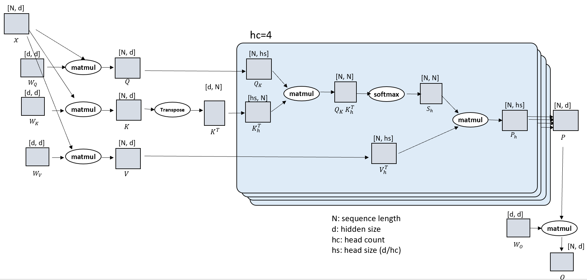

**図1.** マルチヘッドアテンションTransformer

図[図 1](#figure-01)に示されているのは、典型的なマルチヘッドアテンションTransformerアーキテクチャ[Vas17]の構成ブロックのスケッチである。それは、入力シーケンスから、クエリ（*Q*）、キー（*K*）、バリュー（*V*）の埋め込みに射影されることから成る。*QKV*は通常、サイズ$N,b,d$の3次元テンソルであり、ここで$N$はシーケンス長、$b$はマイクロバッチサイズ、$d$は隠れ次元である。$\mathrm{QKV}$テンソルは、Transformerモデルの中心的なコンポーネントであるアテンションブロックに入力される。アテンションの出力は、Transformerアーキテクチャの多層パーセプトロン（MLP）または位置ごとのフィードフォワードブロックの入力となる。

MLPブロックに続くアテンションブロックは、エンコーダ、デコーダ、またはエンコーダ-デコーダTransformerネットワークを形成するために複数回複製される。

#### 2.1.2 並列化方式

データ並列性 [Dea12] は、ニューラルネットワークのトレーニングを加速する事実上の手法であり、異なるニューラルネットワークのアーキテクチャや用途に広く適用されています。データ並列性は最も単純な形では、入力データをサンプルまたはバッチ次元で分割し、計算デバイス間でモデルパラメータを複製します。データ並列性は、バッチサイズが十分に大きく、計算中の通信コストを隠すことができる場合に有効です。しかし、モデルが大きく、デバイス間でのモデルパラメータ複製が実質的に不可能な場合には制約があります。ZeRO [Raj20, Raj21] 最適化は、利用可能な計算デバイス間でモデルパラメータを分割することでこの問題に対処します。さらに、大きなバッチはモデルの質に影響を与えることが知られています [Kes16].

私たちの提案するアプローチは、データ並列性やZeROの両方に対して直交していることに注目する価値があります。私たちの提案するアプローチは、両方の方法で使用できます。また、大規模システムでグローバルバッチサイズを適切なサイズに保つためにシーケンス並列性を活用することで、大きなバッチサイズがモデルの収束に与える影響を効果的に緩和します。この点で、シーケンス並列性には二つの目的があります。第一に、シーケンス並列性は、同じ（すでに探索された）長いシーケンス長に対する解決時間を短縮できます。言い換えれば、シーケンス並列性は、追加の計算リソースに比例して反復時間を短縮します。第二に、シーケンス並列性により、トレーニング時にコンテキスト長が時間と共に徐々に増加する長いシーケンスのトレーニングや継続的事前学習が可能になります [Xio23]。1024 GPUでの大規模トレーニングという現実のシナリオを考えてみましょう。初期の探索的または事前学習セットアップでは（プロキシとしての）LLMのシーケンス長は8192（8K）、マイクロバッチサイズは1（つまりグローバルトークン数は各GPUで800万）です。事前学習済みモデルの品質を改善するための簡単な変更は、シーケンス長を8Kから32Kに変更することを必要とし、これはおおよそ3,200万のグローバルバッチサイズとなります。しかし、グローバルバッチサイズを増やすことは、モデルの品質にネガティブな影響を与えるため選択肢にはなりません。したがって、シーケンス並列性は、面倒なハイパーパラメータの探索を必要とせずにシステム最適化技術として非常に便利です。このシナリオでは、シーケンス並列性により、シーケンス長に関係なく、グローバルバッチサイズを増やさずに複数のGPUに大きなバッチを分割することが可能になります。

テンソル [Sho20] とパイプライン並列処理 [Nar19, Hua19, Nar21b] は、大規模トレーニングにおける他の一般的な手法です。総称して、テンソル並列処理とパイプライン並列処理はモデル並列処理と呼ばれ、大規模モデルの計算オペレータを対象としています。データ並列処理とは対照的に、モデル並列処理はモデルがあまりにも大きく（多くのLLMでそうであるように）データ並列ランク全体に完全に複製できない場合に使用されます。テンソル並列処理は層内の計算オペレータ（例えば、アテンションやMLP）を分割し、パイプライン並列処理はモデルを深さ方向（層単位）で分割します。3D並列処理 [Dee20, Smi22] は、データ並列処理、テンソル並列処理、パイプライン並列処理を組み合わせて、3つの構成要素に比べて高いスループットを実現しますが、コードの大幅な書き換えと生産性のオーバーヘッドというコストが伴います [Wan23b]。

### 2.2 関連研究

深層ニューラルネットワークの分散トレーニング手法の広範な概要および調査については [Ben19] を参照してください。これらの手法は、上で説明したように、データ並列処理とモデル並列処理に大きく分類されます。しかし、既存のすべての並列手法は、極めて長いシーケンスに関連する中間活性化メモリのオーバーヘッドの処理に限界があります。

最近のシーケンス並列処理の研究はメモリのオーバーヘッドに対処していますが、通信効率に欠けており、そのためスケーリング能力が制限されています。我々の研究と同様に、シーケンス並列処理における既存のすべての研究は入力データをシーケンス次元に沿って分割しますが、どの入力投影が分割されるか、そして注意計算のためにパーティションがどのように集約され通信されるかは異なります。

著者らは [Li22a]（以下 *ColAI-SP* と呼ぶ）において、リング自己注意を導入している。これは、クエリ射影は局所的である一方、キーおよびバリュー射影がリング形式で送信されてグローバル注意の計算に用いられるリング状の通信集合であり、その結果、メッセージサイズに線形の通信複雑性をもたらす、$M$。Megatron-LM のシーケンス並列処理 [Kor22a] アプローチは、Megatron のテンソル並列処理と密接に統合されている。Megatron LM はシーケンス次元に沿ってシーケンスを分割し、注意計算のために *QKV* 射影を集約するために allgather および reduce scatter 集合を適用する。通信複雑性の分析によれば、我々のアプローチとは異なり、Megatron-LM のシーケンス並列処理では、計算デバイスの数に関わらず通信量はメッセージサイズに応じて線形に増加する（$M$）。一方、DeepSpeed-Ulysses は通信量を一定に保つために、メッセージサイズまたはシーケンス長に比例して GPU 数を増加させる。[3.2](#S3.SS2) を参照すると詳細がわかる。

[表1](#table-01) は、DeepSpeed-Ulysses が他の既存の手法とどのように異なるかをまとめたものです。DeepSpeed-Ulysses は、他の2つの手法より通信効率の利点があります。また、シーケンスおよびデータ並列グループ全体でモデルパラメータの分割を行う ZeRO [Raj20, Raj21] 最適化を利用することで恩恵を受けます。DeepSpeed-Ulysses はさまざまな種類のアテンションをサポートしており、使いやすいです。Megatron-LM のシーケンス並列性は Megatron-LM のテンソル並列性と密接に統合されており、メモリ効率と使いやすさの両方が制限されます。*ColAI-SP* は異なる（特定の）種類のアテンションを必要とし、使いやすくはありません。*ColAI-SP* のリング自己注意が他のアテンションタイプやメカニズムにどれだけ一般化できるかは明確ではありません。

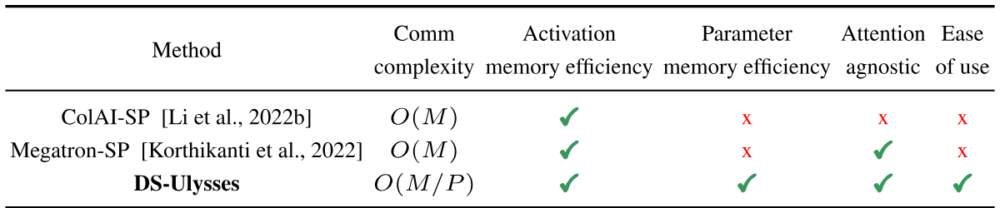

**表 1.** 我々の研究（DS-Ulysses）と他のシーケンス並列手法の比較。

スパーストランスフォーマーに関する関連研究として、フルアテンションの近似に焦点を当てたものがあります。このような例はスパースアテンションです  [Chi19, Cho20a, Zah21, Bel20]。また、最近の研究では、単一GPUでのメモリおよび計算効率の良いアテンションに関するものもあります。このカテゴリでよく知られている例はFlashアテンションです  [Dao22c, Dao23a]。これはタイル化や再計算などの既知の技術を計算およびメモリ効率のために活用しています。これらの研究は我々の研究とは直交的であり、それに応じて利用されました。

## 3 DeepSpeed-Ulysses コアデザイン

### 3.1 システムデザイン

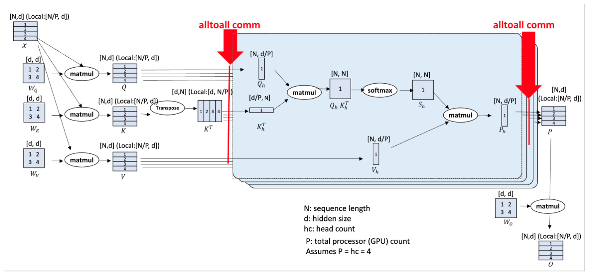

**図 2.** DeepSpeed シーケンス並列（DeepSpeed-Ulysses）デザイン

[図2](#figure-02) は DeepSpeed-Ulysses のコア設計を示しています。既知のトランスフォーマーアーキテクチャと同様に、この設計は入力シーケンス *N* を利用可能な *P* 台のデバイスに分割する構造になっています。各ローカルの *N/P* 分割は、クエリ（*Q*）、キー（*K*）、バリュー（*V*）埋め込みに射影されます。次に、（*QKV*） 埋め込みは、参加する計算デバイス間で高度に最適化されたオールトゥオール集団通信を通じてグローバルな *QKV* に集約されます。オールトゥオール集団通信に続いて、各ヘッドごとの注意計算は次の形式で行われます：

$$
\mathrm{Outputcontext}=\mathrm{Softmax}((\mathrm{QK}^\top)/\sqrt{(}d))V\tag{1}
$$

注意計算後、別のオールトゥオール集団通信によって、注意計算の出力コンテキストテンソルがシーケンス （*N/P*） 並列に変換され、トランスフォーマーレイヤーブロックの残りのモジュールにおける後続の演算（MLP行列乗算、レイヤーノルムなど）に使用されます。

### 3.2 通信分析

DeepSpeed-Ulysses を既存の長シーケンスアプローチと区別する点は、既存ソリューションと比較して、通信量の合計がはるかに少なく、シーケンス並列度の増加に対して全体としてより優れたスケーラビリティを示すことにあり、通信量分析により以下の通り示されます。

現代のクラスターにおいて、ノード内はNVSwitchインターコネクト、ノード間はファットツリーIBトポロジを持つ場合、*P*個のGPUで合計メッセージサイズ*M*のオールトゥーオール通信でリンクごとに送信される通信量は*M/P*となる。隠れ層サイズh、シーケンス長N、並列度Pのトランスフォーマーモデルに対しては、DS-Sequenceはアテンション計算前に*QKV*投影に対して合計メッセージサイズ*3Nh*のオールトゥーオール通信を行い、さらに各トランスフォーマーレイヤーの出力コンテキスト投影に対してサイズ*Nh*のオールトゥーオール通信を行う。したがって、DeepSpeedのシーケンス並列化では、リンクごとの合計通信量は*4Nh/P*（または複雑性として*O（N/P）*）となる。なお、*N*と*P*が比例して増加しても、この通信量は一定であることに注意されたい。

一方で、Megatron-LMのような既存のアプローチは、Pに関係なくNに比例して増加する通信量を伴い、その結果通信の複雑性は*O（N）*となります。例えば、Megatron-LMは各トランスフォーマーレイヤに対して、*Nh*のメッセージ量で2回のall-gatherおよび*Nh*のメッセージ量で2回のreduce-scatterを実行します。しかし、サイズ*M*の各all-gatherおよびreduce-scatterのコストは、*P >> 1*の場合でも*M*のままであり、*M/P*にはなりません。したがって、Megatron-LMのシーケンス並列処理では、リンクごとの通信量が*4Nh*となり、これはDeepSpeedのシーケンス並列処理の場合の*P*倍になります。これにより、DeepSpeedのシーケンス並列処理は非常に長いシーケンスでの学習を可能にし、既存のアプローチに比べて著しく高い学習効率を達成することができます。我々の評価結果はこの分析と一致しています。

### 3.3 メモリ効率

DeepSpeedのシーケンス並列処理は、長いシーケンスでトレーニングする際にアクティベーションメモリを削減しますが、モデル状態が消費するメモリには影響しません。したがって、大規模言語モデルでの長シーケンス長トレーニングをサポートするために、DeepSpeedのシーケンス並列処理はZeRO-3と統合されています。ZeRO（Redundancy Optimizer Stage 3, ZeRO-3）[Raj20, Raj21]は、大規模モデルのトレーニングにおけるメモリ最適化技術です。従来のニューラルネットワークのデータ並列トレーニングでは、モデル状態がデータ並列ランク全体に複製されますが、ZeRO-3はモデル状態をデータ並列ランク間で分割することによりメモリ使用量を最適化します。しかし、シーケンス並列処理では、トレーニングデータはバッチ（サンプル）とシーケンスの両方の次元で考慮でき、関連する並列グループを組み合わせてZeRO並列処理のためのより大きなグループを形成できます。したがって、ZeRO-3の分割をデータ並列およびシーケンス並列ランクの組み合わせに拡張します。言い換えれば、DeepSpeedのシーケンス並列処理では、ZeROはモデル状態をシーケンスおよびデータ並列グループの両方に分割し、必要なときに各ランクのパーティションを収集（allgather）します。同様に、勾配はパラメータ更新のためにデータおよびシーケンス並列ランクの両方で集約されます。ZeROのサポートにより、シーケンスおよびデータの両方の次元で大幅なメモリ節約が可能となり、大きなシーケンス長だけでなく大規模モデルへのスケーリングも可能になります。

### 3.4 一般的および注意非依存のソリューション

DeepSpeedによる分散注意モジュールの実装は、任意の注意機構（例：自己注意、クロス注意、因果注意）のサポートに十分一般的です。これらは、密な形態および疎な形態の両方で利用可能であり、FlashAttentionの異なるバージョンのように、ローカル注意レベルで長いシーケンスをサポートするさまざまな最適化カーネルにも対応しています。DeepSpeed-Ulyssesの一般的な特性は、そのコア設計のモジュール性に由来します：注意に焦点を当てたシーケンス並列設計です。注意計算の前は、N/Pパーティションのシーケンス並列性があり、注意計算自体は各ヘッドで完全な注意を行うヘッド並列性で行われますが、ヘッド数は少なくなっています。このため、注意計算は任意の種類の注意機構（例：密な注意やさまざまな形式の疎な注意）に置き換えることが可能です。

## 4 評価

DeepSpeed-Ulysses（DeepSpeed Sequence）をGPT [Rad19]上で評価します。これは、最大256のA100 GPU上で多くのNLPタスクの基盤となるモデルです。評価は5つの観点で行います：i） シーケンス長のスケーラビリティ、ii） 密な注意におけるスループットと既存システムとの比較、iii） 疎な注意におけるスループットと既存システムとの比較、iv） 並列スケーリングの研究、v） Deepシーケンス並列性の収束の研究です。各カテゴリごとに評価について議論し、提示します。

### 4.1 シーケンス長のスケーラビリティ

最初の一連の実験は、12億パラメータのGPTモデルにおけるシーケンス長の強いスケーリングで、最大100万トークンまでです。この評価の結果は[図3](#figure-03)に示されています。DeepSpeedシーケンス並列化により、GPUの数に応じてシーケンス長を線形に増加させることができ、適切なGPU数であれば計算スループットを保ちながらシーケンス長が線形にスケーリングします。

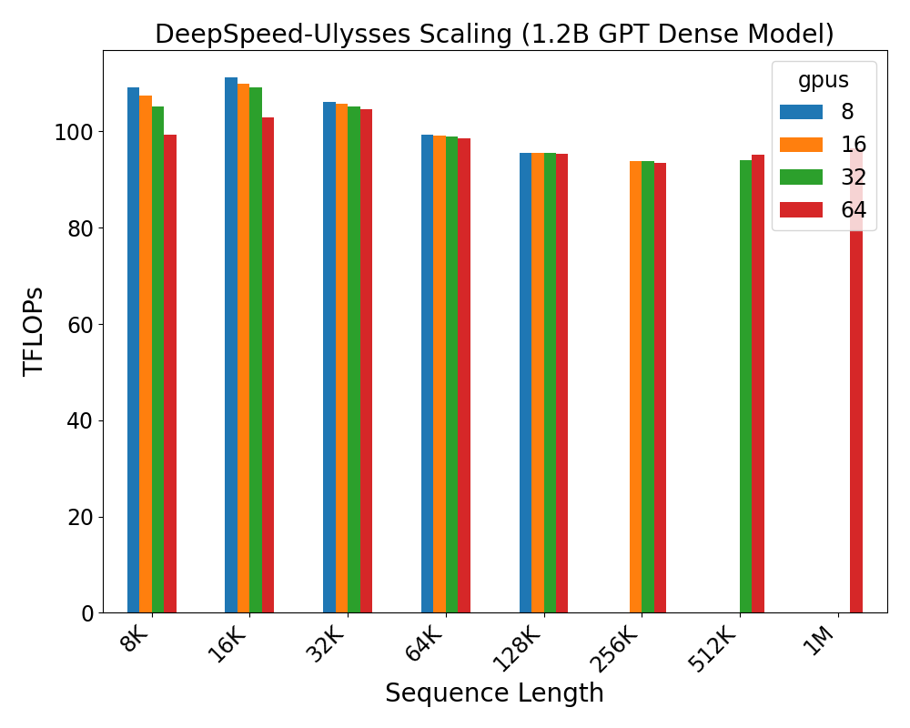

**図3.** 異なるシーケンス長およびGPU数におけるDeepSpeedシーケンス並列化の強いスケーラビリティ評価

### 4.2 密接注意評価

次に、DeepSpeedシーケンス並列化を7B（70億）および30B（300億）パラメータのGPT密接注意モデルで評価し、それぞれ32および64 A100 GPUでのMegatron-LMのシーケンス並列化と比較します。これらの評価結果は[図4](#figure-04)および[図5](#figure-05)に示されています。

DeepSpeedシーケンス並列化を、各種シーケンス長で稼働する7Bおよび30Bモデルに対してMegatron-LMと比較します。我々の評価では、DeepSpeedシーケンス並列化およびMegatron-LMの両方で最も高い性能（スループットまたはTFLOPsで測定）を示すシーケンス並列度とマイクロバッチサイズを選択しました。これを最適（バッチサイズ-シーケンス長）構成と呼びます。DeepSpeedシーケンス並列化では、7Bおよび30Bモデルに対して常に32および64のZeRO並列度を使用します。

[図4](#figure-04) および [図5](#figure-05) は、DeepSpeed シーケンス並列処理が、両方で実行可能なシーケンス長において一貫して Megatron-LM よりも優れていることを示しています。さらに、DeepSpeed シーケンス並列処理は Megatron-LM よりも長いシーケンスを実行できます。DeepSpeed シーケンス並列処理の性能上の利点は二重です：（1） ZeRO-3 と組み合わせた DeepSpeed シーケンス並列処理はメモリ最適化により Megatron-LM より多くのサンプルを適合させ、より高いスループットを実現できる （2） DeepSpeed シーケンス並列処理は、Megatron-LM シーケンス並列処理で適用される all-gather 通信と比較して、効率的な all-to-all 通信の恩恵を受けることができる。

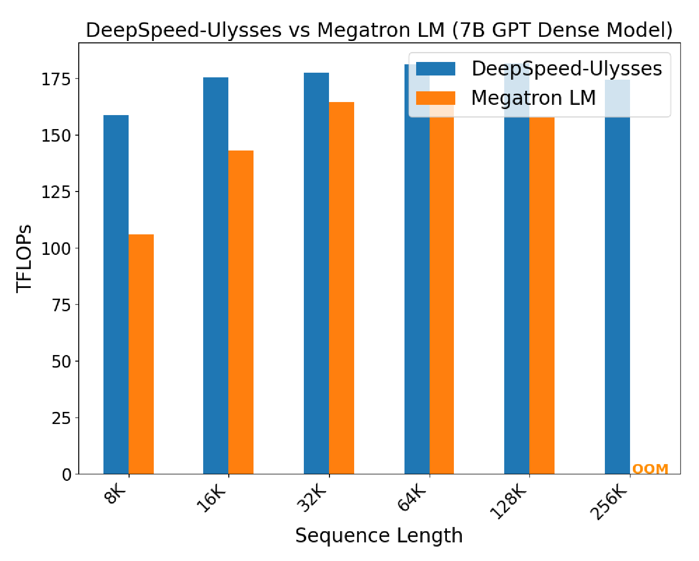

**図4.** デンスアテンションを持つ 7B パラメータモデルでの DeepSpeed-Ulysses と Megatron LM の評価（32 GPU）

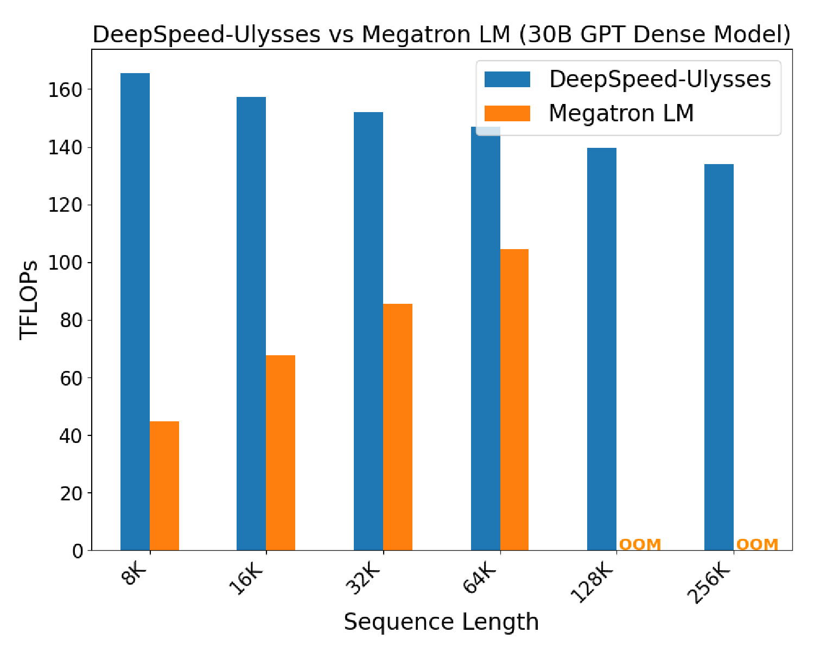

**図5.** デンスアテンションを持つ 30B パラメータモデルでの DeepSpeed-Ulysses と Megatron LM の評価（64 GPU）

### 4.3 スパースアテンション評価

同様に、私たちは7億および300億パラメータのスパースアテンションモデルに対してDeepSpeedシーケンス並列化を評価し、Megatron-LMのシーケンス並列化とベンチマークを行います。評価結果は[図6](#figure-06)および[図7](#figure-07)に示されています。スパースアテンションでも、密アテンションの実験と同様の傾向が見られます。DeepSpeedシーケンス並列化は、Megatron-LMと比較して2倍以上のスループット性能を示しています。メモリ節約に関しては、ZeRO-3を活用したDeepSpeedシーケンス並列化は、Megatron-LMよりも4倍長いシーケンス長にスケールします。

DeepSpeedシーケンス並列化は、両方で実行可能なシーケンス長においてMegatron-LMよりも優れています。実際、現在のDeepSpeedのスループットはローカルスパースアテンションの実装によりボトルネックになっており、その結果、シーケンス長が増加するにつれてDeepSpeedのスループットは低下します。将来的にローカルスパースアテンションの実装性能を向上させることで、DeepSpeedとMegatron-LMの間の性能差は、より長いシーケンス長においてさらに拡大することが予想されます。

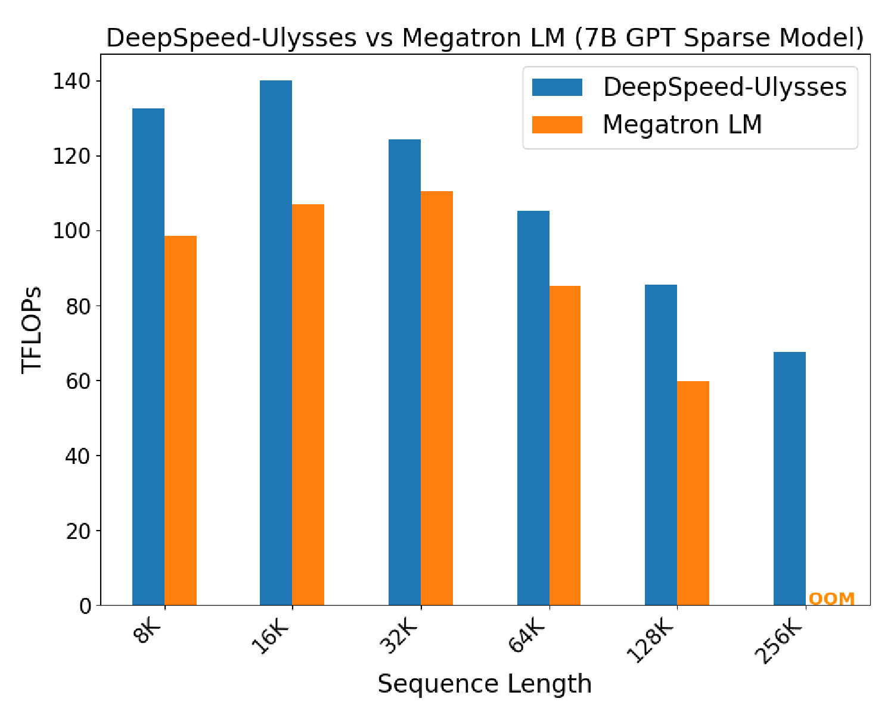

**図6.** ブロック型スパースアテンションを用いた7BパラメータモデルにおけるDeepSpeed-UlyssesとMegatron LMの評価（32 GPU）

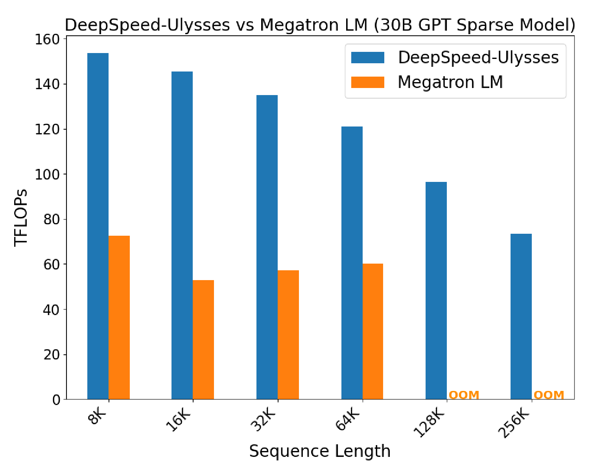

**図7.** ブロック型スパースアテンションを用いた30BパラメータモデルにおけるDeepSpeed-UlyssesとMegatron LMの評価（64 GPU）

### 4.4 並列スケーリング研究

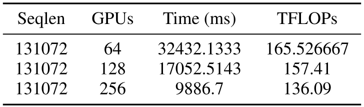

**表2.** 固定シーケンス長での並列スケーリング研究

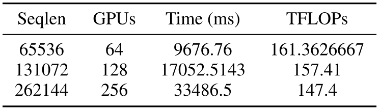

**表3.** 可変シーケンス長での並列スケーリング研究

さらに、私たちは DeepSpeed-Ulysses のスケーリング研究を二つの軸で並行して行います。まず、シーケンス長を 131,072 トークンに固定し、GPU の数を 64 から 256 に増加させます。次に、GPU の数をシーケンス長の増加に比例して増加させます。これらの実験の結果はそれぞれ [表2](#table-02) および [表3](#table-03) に示されています。両方の評価において、グローバルバッチサイズ 8 で GPT-7B 密モデルを使用しました。表にはイテレーション時間（マイクロ秒単位）および GPU ごとに測定したスループット（TFLOPs）を示しています。[表2](#table-02) は強スケーリングとして解釈でき、GPU 数を増やすにつれて実行時間がほぼ線形に減少することを示しています。一方、[表3](#table-03) は、従来の意味での弱スケーリングではありませんが、注意計算（シーケンス長の関数）が二次的に増加することを条件としたスケーリングの一形態です。言い換えれば、シーケンス長を増やすと作業量は二次的に増加します。

通信オーバーヘッドは、通信負荷（すなわちシーケンス長または GPU 数）を増加させるとスループットがわずかに減少することに起因します。このオーバーヘッドにもかかわらず、二つの研究において理論的なピーク GPU 性能の高い割合で良好なスケーリングが観察されました。これらの良好なスケーリング結果は、DeepSpeed-Ulysses の良好な並列効率を示しています。

### 4.5 収束研究

最後に、[図8](#figure-08) は、32K シーケンス長で 8 台の A100 GPU 上で 1.3 億の GPT モデルの収束を示しており、DeepSpeed-Ulysses と Megatron-LM のシーケンス並列度は共に 4 に設定されています。DeepSpeed シーケンス並列性の場合、異なる ZeRO ステージでの収束を評価します。DeepSpeed シーケンス並列性は、長いシーケンストランスフォーマーモデルの訓練を可能にする純粋なシステム最適化技術であるため、訓練済みモデルの品質に対して（負の）影響はなく、この主張は実験によって検証され、[図8](#figure-08) に示されています。

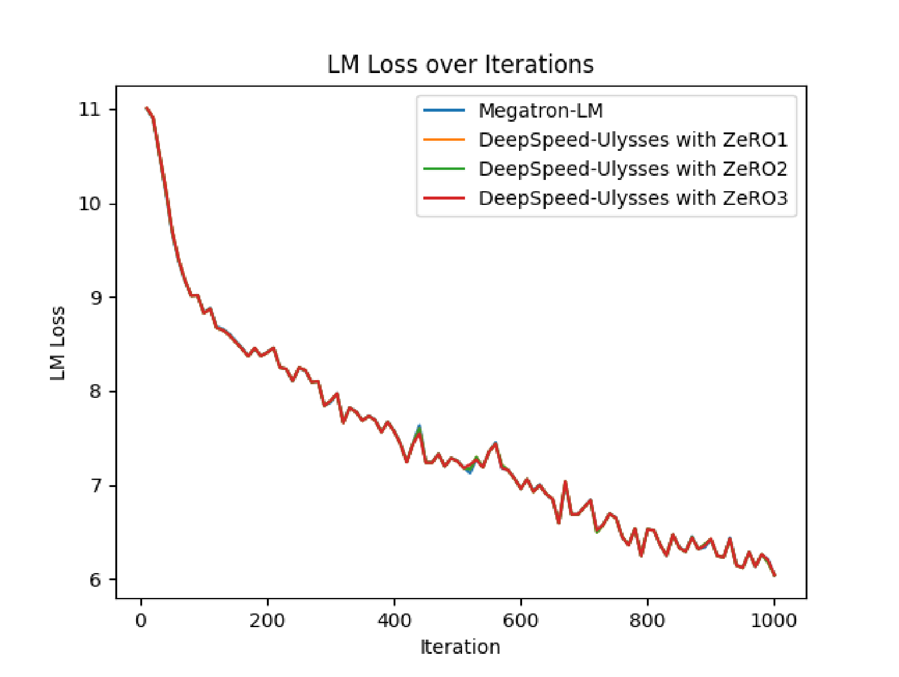

**図8.** 異なる ZeRO メモリ最適化ステージでの DeepSpeed-Ulysses の収束評価

## 5 結論

結論として、我々は長いシーケンスの大規模トランスフォーマー訓練のための有効技術として、メモリおよび通信効率の高い DeepSpeed シーケンスを提示します。DeepSpeed シーケンスは、GPU（拡張的には他の AI アクセラレータ）間でシーケンス並列性を可能にし、トランスフォーマーモデルのすべてのコンポーネントにわたってシーケンスを並列化し、最先端の Flash（密および疎）アテンションへのストリームラインサポートも提供します。DeepSpeed シーケンスを用いた訓練により、モデルサイズとシーケンス長は単一 GPU メモリの制約にほとんど縛られずに、ピーク計算性能の高い割合でほぼ無制限にスケール可能となります。
