> [Cheng Lu](https://luchengthu.github.io/)、[Yuhao Zhou](https://yuhaoz.com/)、[Fan Bao](https://www.baofan.ai/)、[Jianfei Chen](https://ml.cs.tsinghua.edu.cn/~jianfei/)、[Chongxuan Li](https://ai.ruc.edu.cn/english/FACULTYn/ChongxuanLi/index.htm)、[Jun Zhu](https://ml.cs.tsinghua.edu.cn/~jun/index.shtml)。2022 年 6 月 2 日に arXiv へ初投稿、現行版は v3。[NeurIPS 2022](https://proceedings.neurips.cc/paper_files/paper/2022/hash/260a14acce2a89dad36adc8eefe7c59e-Abstract-Conference.html) 掲載、5775–5787 頁。[DPM-Solver: A Fast ODE Solver for Diffusion Probabilistic Model Sampling in Around 10 Steps](https://arxiv.org/abs/2206.00927)。<a href="/paper/dpm-solver.pdf" target="_blank" rel="noopener noreferrer">原 PDF</a>。[DOI](https://doi.org/10.52202/068431-0418)。[TeX ソース](https://export.arxiv.org/e-print/2206.00927v3)。正確な印刷レイアウトと参考文献については原 PDF を正とする。

## 概要

拡散確率モデル（DPM）は、近年注目を集める強力な生成モデルである。高品質な生成性能を備える一方、1 つのサンプルを得るために大規模ニューラルネットワークを数百回から数千回、逐次的に関数評価（ステップ）するのが一般的であり、サンプリングが遅いという問題が残る。DPM からのサンプリングは、対応する拡散常微分方程式（ODE）を解く問題と捉えることもできる。本研究では、拡散 ODE の解の厳密な定式化を提案する。従来研究のように全項をブラックボックス ODE ソルバーへ委ねるのではなく、解の線形部分を解析的に計算する定式化である。変数変換を適用すると、この解はニューラルネットワークの指数重み付き積分へ等価に簡約できる。この定式化に基づき、収束次数を保証した拡散 ODE 専用の高速高次ソルバー DPM-Solver を提案する。DPM-Solver は追加学習なしで、離散時間と連続時間のどちらの DPM にも適用できる。実験では、さまざまなデータセットでわずか 10～20 回の関数評価により高品質なサンプルを生成できた。CIFAR10 データセットでは、関数評価 10 回で FID 4.70、20 回で FID 2.87 を達成し、複数のデータセットで従来の最先端の学習不要サンプラーに比べて $4\sim 16\times$ の高速化を実現した。 [+1]

## 1 はじめに

拡散確率モデル（DPM）[Soh15, Den20, Son21] は、画像生成 [Dha21, Men22]、動画生成 [Ho22]、テキストからの画像生成 [Ram22]、音声合成 [Che21n, Che21o]、可逆圧縮 [Kin21] など、多くのタスクで有望な性能を示す強力な生成モデルである。DPM は離散時間確率過程 [Soh15, Den20] または連続時間確率微分方程式（SDE）[Son21] で定義され、データ点に加えたノイズを段階的に除去する方法を学習する。広く使われる生成対抗ネットワーク（GAN）[Goo14] や変分オートエンコーダ（VAE）[Kin14] と比べ、DPM は厳密な尤度を計算できる [Son21] だけでなく、画像生成でさらに高いサンプル品質も達成する [Dha21]。しかし高品質なサンプルを得るには、通常、大規模ニューラルネットワークを数百から数千ステップにわたり逐次評価する必要があり、1 ステップの GAN や VAE よりサンプリングがはるかに遅い。この非効率性は DPM を下流タスクへ導入する際の重大なボトルネックになりつつあり、高速な DPM サンプラーの設計が急務である。

既存の DPM 高速サンプラーは 2 種類に分けられる。第 1 の種類には、知識蒸留 [Sal22, Luh21] と、ノイズレベルまたはサンプル軌道の学習 [San21a, Nic21, Lam21, Wat22] が含まれる。これらの手法を効率的なサンプリングに用いるには、計算コストが高くなり得る学習段階が事前に必要である。さらに、適用範囲や柔軟性にも限界があり、異なるモデル、データセット、サンプリングステップ数へ適応させるには相応の労力を要することがある。第 2 の種類は学習不要サンプラー [Son21a, Jol21, Bao22] で、すべての事前学習済み DPM に単純なプラグアンドプレイ方式で適用できる。学習不要サンプラーには、陰的 [Son21a] または解析的 [Bao22] な生成過程、高度な微分方程式（DE）ソルバー [Son21, Jol21, Liu22h, Pop22b, Tac21]、動的計画法 [Wat22] を用いるものがある。しかし、これらの手法でも高品質なサンプル（通常のサンプラーで約 1000 回の関数評価を行った場合に匹敵する品質）の生成にはなお $\sim$ 50 回の関数評価 [Bao22] が必要であり、依然として時間がかかる。

本研究では、逐次的な関数評価約 10 ステップ以内でサンプリングを完了する「少数ステップサンプリング」の領域で高品質なサンプルを生成できるよう、学習不要サンプラーの効率を一段と引き上げる。DPM からのサンプリングを、対応する DPM の拡散常微分方程式（ODE）を解く別の問題として扱い、その構造を詳しく調べる。拡散 ODE は、データ変数の線形関数とニューラルネットワークでパラメータ化された非線形関数から成る半線形構造を持つ。ブラックボックス DE ソルバーを直接用いる従来の学習不要サンプラー [Son21, Jol21] は、この構造を考慮していない。半線形構造を活用するため、解の線形部分を解析的に計算して対応する離散化誤差を避け、拡散 ODE の解を厳密に定式化する。さらに変数変換により、解はニューラルネットワークの指数重み付き積分へ等価に簡約できる。この特殊な積分は、指数積分法の数値手法 [Hoc10] で効率よく近似できる。

この解の定式化に基づき、上記の積分を近似する拡散 ODE 専用の高速ソルバー DPM-Solver を提案する。具体的には、収束次数を保証した 1 次、2 次、3 次の DPM-Solver を提案する。さらに、DPM-Solver の適応的ステップ幅スケジュールも示す。DPM-Solver は一般に連続時間と離散時間のどちらの DPM にも適用でき、分類器ガイダンス [Dha21] を用いた条件付きサンプリングにも対応する。[図 1](#figure-01) は、Denoising Diffusion Implicit Models（DDIM）[Son21a] を基準とした DPM-Solver の高速化性能を示す。ImageNet 256x256 データセット [Den09a] では、わずか 10 回の関数評価で高品質なサンプルを生成でき、DDIM より大幅に高速である。追加実験でも、DPM-Solver は離散時間・連続時間双方の DPM のサンプリングを大幅に高速化し、従来のすべての学習不要 DPM サンプラーよりはるかに速い約 10 回の関数評価で、優れたサンプル品質を達成できた。

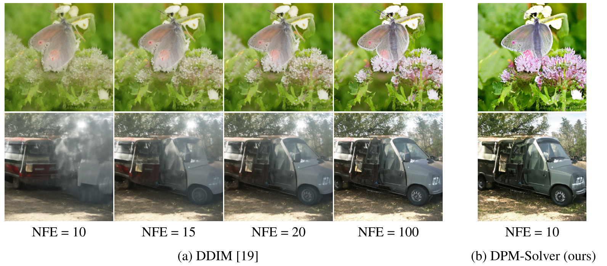

**図 1。** 分類器ガイダンス [Dha21] を備えた ImageNet $256\times256$ の事前学習済み DPM を用い、関数評価回数（NFE）を 10、15、20、100 とした DDIM [Son21a] のサンプルと、NFE をわずか 10 とした DPM-Solver（提案法）のサンプル。

## 2 拡散確率モデル

本節では、拡散確率モデルとそれに対応する微分方程式を概観する。

### 2.1 順方向過程と拡散 SDE

未知の分布 $q_{0}(\bm{x}_{0})$ に従う $D$ 次元確率変数 $\bm{x}_{0}\in\mathbb{R}^{D}$ があるとする。拡散確率モデル（DPM）[Soh15, Den20, Son21, Kin21] は、$\bm{x}_{0}$ から始まる $T>0$ の順方向過程 $\{\bm{x}_{t}\}_{t\in[0,T]}$ を定義し、任意の $t\in[0,T]$ において $\bm{x}_{0}$ を条件とする $\bm{x}_{t}$ の分布が次を満たすようにする。

$$
q_{0t}(\bm{x}_{t}|\bm{x}_{0})=\mathcal{N}(\bm{x}_{t}|\alpha(t)\bm{x}_{0},\sigma^{2}(t)\bm{I}),
$$

ここで $\alpha(t),\sigma(t)\in\mathbb{R}^{+}$ は $t$ の微分可能な関数であり、その導関数は有界である。簡単のため、それぞれ $\alpha_{t},\sigma_{t}$ と表す。$\alpha_{t}$ と $\sigma_{t}$ の選択を DPM のノイズスケジュールと呼ぶ。$q_{t}(\bm{x}_{t})$ を $\bm{x}_{t}$ の周辺分布とすると、DPM は、ある $\tilde{\sigma}>0$ に対して $q_{T}(\bm{x}_{T})\approx\mathcal{N}(\bm{x}_{T}|\bm{0},\tilde{\sigma}^{2}\bm{I})$ となり、信号対雑音比（SNR）$\alpha_{t}^{2}/\sigma_{t}^{2}$ が $t$ に関して狭義単調減少するようノイズスケジュールを選ぶ [Kin21]。さらに [Kin21] は、任意の $t\in[0,T]$ に対し、次の確率微分方程式（SDE）が [式 2.1](#equation-2-1) と同じ遷移分布 $q_{0t}(\bm{x}_{t}|\bm{x}_{0})$ を持つことを示した。

$$
\mathrm{d}\bm{x}_{t}=f(t)\bm{x}_{t}\mathrm{d}t+g(t)\mathrm{d}\bm{w}_{t},\quad\bm{x}_{0}\sim q_{0}(\bm{x}_{0}),
$$

ここで $\bm{w}_{t}\in\mathbb{R}^{D}$ は標準 Wiener 過程であり、

$$
f(t)=\frac{\mathrm{d}\log\alpha_{t}}{\mathrm{d}t},\quad g^{2}(t)=\frac{\mathrm{d}\sigma_{t}^{2}}{\mathrm{d}t}-2\frac{\mathrm{d}\log\alpha_{t}}{\mathrm{d}t}\sigma_{t}^{2}.
$$

一定の正則性条件の下で、[Son21] は [式 2.2](#equation-2-2) の順方向過程に、周辺分布 $q_{T}(\bm{x}_{T})$ から時刻 $T$ から $0$ へ進む等価な逆過程が存在することを示した。

$$
\mathrm{d}\bm{x}_{t}=[f(t)\bm{x}_{t}-g^{2}(t)\nabla_{\bm{x}}\log q_{t}(\bm{x}_{t})]\mathrm{d}t+g(t)\mathrm{d}\bar{\bm{w}}_{t},\quad\bm{x}_{T}\sim q_{T}(\bm{x}_{T}),
$$

ここで $\bar{\bm{w}}_{t}$ は逆時間の標準 Wiener 過程である。[式 2.4](#equation-2-4) で未知なのは、各時刻 $t$ におけるスコア関数 $\nabla_{\bm{x}}\log q_{t}(\bm{x}_{t})$ だけである。実際の DPM では、$\theta$ でパラメータ化されたニューラルネットワーク $\bm{\epsilon}_{\theta}(\bm{x}_{t},t)$ により、スケールされたスコア関数 $-\sigma_{t}\nabla_{\bm{x}}\log q_{t}(\bm{x}_{t})$ を推定する。パラメータ $\theta$ は、次の目的関数 [Den20, Son21] を最小化して最適化する。

$$
\begin{aligned}
\mathcal{L}(\theta;\omega(t)) & \coloneqq\frac{1}{2}\int_{0}^{T}\omega(t)\mathbb{E}_{q_{t}(\bm{x}_{t})}\Big[\|\bm{\epsilon}_{\theta}(\bm{x}_{t},t)+\sigma_{t}\nabla_{\bm{x}}\log q_{t}(\bm{x}_{t})\|_{2}^{2}\Big]\mathrm{d}t \\
=\frac{1}{2}\int_{0}^{T}\omega(t)\mathbb{E}_{q_{0}(\bm{x}_{0})}\mathbb{E}_{q(\bm{\epsilon})}\Big[\|\bm{\epsilon}_{\theta}(\bm{x}_{t},t)-\bm{\epsilon}\|_{2}^{2}\Big]\mathrm{d}t+C,
\end{aligned}
$$

ここで $\omega(t)$ は重み関数、$\bm{\epsilon}\sim q(\bm{\epsilon})=\mathcal{N}(\bm{\epsilon}|\bm{0},\bm{I})$、$\bm{x}_{t}=\alpha_{t}\bm{x}_{0}+\sigma_{t}\bm{\epsilon}$ であり、$C$ は $\theta$ に依存しない定数である。$\bm{\epsilon}_{\theta}(\bm{x}_{t},t)$ は $\bm{x}_{t}$ に加えられた Gaussian ノイズを予測するものとも見なせるため、通常はノイズ予測モデルと呼ばれる。$\bm{\epsilon}_{\theta}(\bm{x}_{t},t)$ の正解が $-\sigma_{t}\nabla_{\bm{x}}\log q_{t}(\bm{x}_{t})$ であることから、DPM は [式 2.4](#equation-2-4) のスコア関数を $-\bm{\epsilon}_{\theta}(\bm{x}_{t},t)/\sigma_{t}$ で置き換え、$\bm{x}_{T}\sim\mathcal{N}(\bm{0},\tilde{\sigma}^{2}\bm{I})$ から時刻 $T$ から $0$ へ進むパラメータ化された逆過程（拡散 SDE）を次のように定義する。

$$
\mathrm{d}\bm{x}_{t}=\left[f(t)\bm{x}_{t}+\frac{g^{2}(t)}{\sigma_{t}}\bm{\epsilon}_{\theta}(\bm{x}_{t},t)\right]\mathrm{d}t+g(t)\mathrm{d}\bar{\bm{w}}_{t},\quad\bm{x}_{T}\sim\mathcal{N}(\bm{0},\tilde{\sigma}^{2}\bm{I}).
$$

数値ソルバーで [式 2.5](#equation-2-5) の拡散 SDE を $T$ から $0$ へ離散化して解けば、DPM からサンプルを生成できる。[Son21] は、従来の DPM の祖先サンプリング法 [Den20] を [式 2.5](#equation-2-5) に対する 1 次 SDE ソルバーと見なせることを示した。しかし、これらの 1 次法が収束するには通常、数百から数千回の関数評価が必要であり [Son21]、サンプリングはきわめて遅い。

### 2.2 拡散（確率流）ODE

SDE を離散化する際、ステップ幅は Wiener 過程のランダム性によって制約される [Klo92]。特に高次元空間では、大きなステップ幅（少ないステップ数）を使うと収束しないことが多い。より高速なサンプリングには、SDE と各時刻 $t$ で同じ周辺分布を持つ、対応する確率流 ODE [Son21] を考えられる。具体的に [Son21] は、DPM に対する [式 2.4](#equation-2-4) の確率流 ODE が次式になることを示した。

$$
\frac{\mathrm{d}\bm{x}_{t}}{\mathrm{d}t}=f(t)\bm{x}_{t}-\frac{1}{2}g^{2}(t)\nabla_{\bm{x}}\log q_{t}(\bm{x}_{t}),\quad\bm{x}_{T}\sim q_{T}(\bm{x}_{T}),
$$

ここでも $\bm{x}_{t}$ の周辺分布は $q_{t}(\bm{x}_{t})$ である。スコア関数をノイズ予測モデルで置き換え、[Son21] は次のパラメータ化 ODE（拡散 ODE）を定義した。

$$
\frac{\mathrm{d}\bm{x}_{t}}{\mathrm{d}t}=\bm{h}_{\theta}(\bm{x}_{t},t)\coloneqq f(t)\bm{x}_{t}+\frac{g^{2}(t)}{2\sigma_{t}}\bm{\epsilon}_{\theta}(\bm{x}_{t},t),\quad\bm{x}_{T}\sim\mathcal{N}(\bm{0},\tilde{\sigma}^{2}\bm{I}).
$$

ODE を $T$ から $0$ へ解けばサンプルを得られる。ODE にはランダム性がないため、SDE より大きなステップ幅で解ける。さらに、効率的な数値 ODE ソルバーを利用してサンプリングを高速化できる。[Son21] は拡散 ODE に RK45 ODE ソルバー [Dor80] を用い、CIFAR-10 データセット [Kri09] で $\sim$ 60 回の関数評価により、[式 2.5](#equation-2-5) の 1000 ステップ SDE ソルバーに匹敵する品質のサンプルを生成した。しかし、既存の汎用 ODE ソルバーでも、少数ステップ（$\sim$ 10 ステップ）の領域では満足できるサンプルを生成できない。著者らの知る限り、少数ステップ領域で使える学習不要の DPM サンプラーはなお不足しており、DPM のサンプリング速度は依然として重大な課題である。

## 3 拡散 ODE 専用の高速ソルバー

[第 2.2 節](#section-2-2) で述べたように、高次元で SDE を離散化することは一般に難しく [Klo92]、少数ステップでは収束しにくい。これに対して ODE は解きやすく、高速サンプラーを実現できる可能性がある。しかし同節で触れた通り、従来研究 [Son21] の汎用ブラックボックス ODE ソルバーは、実験上、少数ステップでは収束しない。そこで、高速かつ高品質な少数ステップサンプリングを可能にする拡散 ODE 専用ソルバーを設計する。まず拡散 ODE 固有の構造を詳しく調べる。

### 3.1 拡散 ODE の厳密解の簡潔な定式化

本研究の核心は、時刻 $s>0$ の初期値 $\bm{x}_{s}$ が与えられたとき、[式 2.7](#equation-2-7) の拡散 ODE における各時刻 $t<s$ の解 $\bm{x}_{t}$ を、効率よく近似できる特殊な厳密式へ簡約できる点にある。

第 1 の重要な観察は、拡散 ODE 固有の構造を考慮すれば、解 $\bm{x}_{t}$ の一部を厳密に計算できることである。[式 2.7](#equation-2-7) の右辺は 2 つの部分から成る。$f(t)\bm{x}_{t}$ は $\bm{x}_{t}$ の線形関数であり、もう一方の $\frac{g^{2}(t)}{2\sigma_{t}}\bm{\epsilon}_{\theta}(\bm{x}_{t},t)$ は、ニューラルネットワーク $\bm{\epsilon}_{\theta}(\bm{x}_{t},t)$ のため一般に $\bm{x}_{t}$ の非線形関数である。この種の ODE を半線形 ODE と呼ぶ。従来研究 [Son21] のブラックボックス ODE ソルバーは、[式 2.7](#equation-2-7) の $\bm{h}_{\theta}(\bm{x}_{t},t)$ 全体を入力とするため、この半線形構造を考慮せず、線形項と非線形項の双方に離散化誤差を生じる。一方、半線形 ODE の時刻 $t$ における解は、「定数変化法」の公式 [Atk11] により厳密に表せる。

$$
\bm{x}_{t}=e^{\int_{s}^{t}f(\tau)\mathrm{d}\tau}\bm{x}_{s}+\int_{s}^{t}\left(e^{\int_{\tau}^{t}f(r)\mathrm{d} r}\frac{g^{2}(\tau)}{2\sigma_{\tau}}\bm{\epsilon}_{\theta}(\bm{x}_{\tau},\tau)\right)\mathrm{d}\tau.
$$

この定式化は線形部分と非線形部分を分離する。ブラックボックス ODE ソルバーと異なり、線形部分は厳密に計算されるため、線形項の近似誤差がなくなる。ただし非線形部分の積分は、ノイズスケジュールに関する係数、すなわち $f(\tau),g(\tau),\sigma_{\tau}$ と複雑なニューラルネットワーク $\bm{\epsilon}_{\theta}$ が結合しており、なお近似が難しい。

第 2 の重要な観察は、特殊な変数を導入すると非線形部分の積分を大幅に簡約できることである。$\lambda_{t}\coloneqq\log(\alpha_t / \sigma_t)$（log-SNR の半分）と置くと、[第 2.1 節](#section-2-1) で述べた DPM の定義から、$\lambda_{t}$ は $t$ の狭義単調減少関数となる。[式 2.3](#equation-2-3) の $g(t)$ は次のように書き換えられる。

$$
g^{2}(t)=\frac{\mathrm{d}\sigma_{t}^{2}}{\mathrm{d}t}-2\frac{\mathrm{d}\log\alpha_{t}}{\mathrm{d}t}\sigma_{t}^{2}=2\sigma_{t}^{2}\left(\frac{\mathrm{d}\log\sigma_{t}}{\mathrm{d}t}-\frac{\mathrm{d}\log\alpha_{t}}{\mathrm{d}t}\right)=-2\sigma_{t}^{2}\frac{\mathrm{d}\lambda_{t}}{\mathrm{d}t}.
$$

[式 2.3](#equation-2-3) の $f(t)=\mathrm{d}\log\alpha_{t}/\mathrm{d}t$ と組み合わせると、[式 3.1](#equation-3-1) は次のように書き換えられる。

$$
\bm{x}_{t}=\frac{\alpha_{t}}{\alpha_{s}}\bm{x}_{s}-\alpha_{t}\int_{s}^{t}\left(\frac{\mathrm{d}\lambda_{\tau}}{\mathrm{d}\tau}\right)\frac{\sigma_{\tau}}{\alpha_{\tau}}\bm{\epsilon}_{\theta}(\bm{x}_{\tau},\tau)\mathrm{d}\tau.
$$

$\lambda(t)=\lambda_{t}$ は $t$ の狭義単調減少関数なので、$t=t_{\lambda}(\lambda(t))$ を満たす逆関数 $t_{\lambda}(\cdot)$ を持つ。さらに $\bm{x}$ と $\bm{\epsilon}_{\theta}$ の添字を $t$ から $\lambda$ へ変更し、$\hat{\bm{x}}_{\lambda}\coloneqq\bm{x}_{t_{\lambda}(\lambda)}$、$\hat{\bm{\epsilon}}_{\theta}(\hat{\bm{x}}_{\lambda},\lambda)\coloneqq\bm{\epsilon}_{\theta}(\bm{x}_{t_{\lambda}(\lambda)},t_{\lambda}(\lambda))$ と表す。$\lambda$ に関する変数変換で [式 3.3](#equation-3-3) を書き換えると、次を得る。

**命題 3.1（拡散 ODE の厳密解）。** 時刻 $s>0$ における初期値 $\bm{x}_{s}$ が与えられたとき、[式 2.7](#equation-2-7) の拡散 ODE に対する時刻 $t\in[0,s]$ の解 $\bm{x}_{t}$ は次式で与えられる。

$$
\bm{x}_{t}=\frac{\alpha_{t}}{\alpha_{s}}\bm{x}_{s}-\alpha_{t}\int_{\lambda_{s}}^{\lambda_{t}}e^{-\lambda}\hat{\bm{\epsilon}}_{\theta}(\hat{\bm{x}}_{\lambda},\lambda)\mathrm{d}\lambda.
$$

積分 $\int e^{-\lambda}\hat{\bm{\epsilon}}_{\theta}(\hat{\bm{x}}_{\lambda},\lambda)\mathrm{d}\lambda$ を $\hat{\bm{\epsilon}}_{\theta}$ の指数重み付き積分と呼ぶ。これは非常に特殊であり、ODE ソルバーの文献における指数積分法 [Hoc10] と深く関係する。著者らの知る限り、拡散モデルの従来研究ではこの定式化は示されていない。

[式 3.4](#equation-3-4) は、拡散 ODE の解を近似する新たな視点を与える。具体的には、時刻 $s$ の $\bm{x}_{s}$ が与えられたとき、[式 3.4](#equation-3-4) によれば、時刻 $t$ の解を近似することは、$\lambda_{s}$ から $\lambda_{t}$ までの $\hat{\bm{\epsilon}}_{\theta}$ の指数重み付き積分を直接近似することに等しい。この方法は線形項の誤差を回避し、指数積分法の文献 [Hoc10, Hoc05] で十分に研究されている。この知見に基づく拡散 ODE の高速ソルバーを、以下で詳しく示す。

### 3.2 拡散 ODE の高次ソルバー

本節では、提案した解の定式化 [式 3.4](#equation-3-4) を利用し、収束次数を保証した拡散 ODE の高次ソルバーを提案する。ソルバーと解析は、ODE 文献の指数積分法 [Hoc10, Hoc05] に強く着想を得ている。

具体的には、時刻 $T$ の初期値 $\bm{x}_{T}$ と、$t_{0}=T$ から $t_{M}=0$ まで減少する $M+1$ 個の時刻点 $\{t_{i}\}_{i=0}^{M}$ が与えられたとする。$\tilde{\bm{x}}_{t_{0}}=\bm{x}_{T}$ を初期値とする。提案ソルバーは $M$ ステップで系列 $\{\tilde{\bm{x}}_{t_{i}}\}_{i=0}^{M}$ を反復計算し、各時刻点 $\{t_{i}\}_{i=0}^{M}$ の真の解を近似する。特に、最後の反復値 $\tilde{\bm{x}}_{t_{M}}$ が時刻 $0$ の真の解を近似する。

$\tilde{\bm{x}}_{t_{M}}$ と時刻 $0$ の真の解との近似誤差を小さくするには、各ステップで $\tilde{\bm{x}}_{t_{i}}$ の近似誤差を抑える必要がある [Atk11]。時刻 $t_{i-1}$ の直前の値 $\tilde{\bm{x}}_{t_{i-1}}$ から出発すると、[式 3.4](#equation-3-4) により、時刻 $t_{i}$ の厳密解 $\bm{x}_{t_{i-1}\to t_{i}}$ は次式で与えられる。

$$
\bm{x}_{t_{i-1}\to t_{i}}=\frac{\alpha_{t_{i}}}{\alpha_{t_{i-1}}}\tilde{\bm{x}}_{t_{i-1}}-\alpha_{t_{i}}\int_{\lambda_{t_{i-1}}}^{\lambda_{t_{i}}}e^{-\lambda}\hat{\bm{\epsilon}}_{\theta}(\hat{\bm{x}}_{\lambda},\lambda)\mathrm{d}\lambda.
$$

したがって、$\bm{x}_{t_{i-1}\to t_{i}}$ を近似する値 $\tilde{\bm{x}}_{t_{i}}$ を計算するには、$\lambda_{t_{i-1}}$ から $\lambda_{t_{i}}$ までの $\hat{\bm{\epsilon}}_{\theta}$ の指数重み付き積分を近似すればよい。$h_{i}\coloneqq\lambda_{t_{i}}-\lambda_{t_{i-1}}$ とし、$\hat{\bm{\epsilon}}_{\theta}^{(n)}(\hat{\bm{x}}_{\lambda},\lambda)\coloneqq\frac{\mathrm{d}^{n}\hat{\bm{\epsilon}}_{\theta}(\hat{\bm{x}}_{\lambda},\lambda)}{\mathrm{d}\lambda^{n}}$ を $\lambda$ に関する $\hat{\bm{\epsilon}}_{\theta}(\hat{\bm{x}}_{\lambda},\lambda)$ の $n$ 次全微分とする。$k\geq 1$ に対し、$\lambda_{t_{i-1}}$ における $\lambda$ に関する $(k-1)$ 次 Taylor 展開は

$$
\hat{\bm{\epsilon}}_{\theta}(\hat{\bm{x}}_{\lambda},\lambda)=\sum_{n=0}^{k-1}\frac{(\lambda-\lambda_{t_{i-1}})^{n}}{n!}\hat{\bm{\epsilon}}_{\theta}^{(n)}(\hat{\bm{x}}_{\lambda_{t_{i-1}}},\lambda_{t_{i-1}})+\mathcal{O}((\lambda-\lambda_{t_{i-1}})^{k}),
$$

この Taylor 展開を [式 3.5](#equation-3-5) に代入すると、

$$
\bm{x}_{t_{i-1}\to t_{i}}\!=\!\frac{\alpha_{t_{i}}}{\alpha_{t_{i-1}}}\tilde{\bm{x}}_{t_{i-1}}-\alpha_{t_{i}}\sum_{n=0}^{k-1}\hat{\bm{\epsilon}}_{\theta}^{(n)}(\hat{\bm{x}}_{\lambda_{t_{i-1}}},\lambda_{t_{i-1}})\!\int_{\lambda_{t_{i-1}}}^{\lambda_{t_{i}}}\!\!e^{-\lambda}\frac{(\lambda-\lambda_{t_{i-1}})^{n}}{n!}\mathrm{d}\lambda+\mathcal{O}(h_{i}^{k+1}),
$$

となる。積分 $\int e^{-\lambda}\frac{(\lambda-\lambda_{t_{i-1}})^{n}}{n!}\mathrm{d}\lambda$ は、部分積分を $n$ 回繰り返せば解析的に計算できる（[第 8.2 節](#section-8-2)）。したがって $\bm{x}_{t_{i-1}\to t_{i}}$ の近似には、$n\leq k-1$ に対する $n$ 次全微分 $\hat{\bm{\epsilon}}_{\theta}^{(n)}(\hat{\bm{x}}_{\lambda},\lambda)$ だけを近似すればよい。これは ODE 文献 [Hoc05, Lua21] でよく研究されている問題である。誤差項 $\mathcal{O}(h_{i}^{k+1})$ を落とし、最初の $(k-1)$ 次までの全微分を「剛性次数条件」[Hoc05, Lua21] で近似すれば、拡散 ODE の $k$ 次ソルバーを導出できる。これらを総称して DPM-Solver、特定の次数 $k$ に対して DPM-Solver-$k$ と呼ぶ。例として $k=1$ を取ると、[式 3.6](#equation-3-6) は次式となる。

$$
\begin{aligned}
\bm{x}_{t_{i-1}\to t_{i}} & =\frac{\alpha_{t_{i}}}{\alpha_{t_{i-1}}}\tilde{\bm{x}}_{t_{i-1}}-\alpha_{t_{i}}\bm{\epsilon}_{\theta}(\tilde{\bm{x}}_{t_{i-1}},t_{i-1})\int_{\lambda_{t_{i-1}}}^{\lambda_{t_{i}}}e^{-\lambda}\mathrm{d}\lambda+\mathcal{O}(h_{i}^{2}) \\
=\frac{\alpha_{t_{i}}}{\alpha_{t_{i-1}}}\tilde{\bm{x}}_{t_{i-1}}-\sigma_{t_{i}}(e^{h_{i}}-1)\bm{\epsilon}_{\theta}(\tilde{\bm{x}}_{t_{i-1}},t_{i-1})+\mathcal{O}(h_{i}^{2}).
\end{aligned}
$$

高次誤差項 $\mathcal{O}(h_{i}^{2})$ を落とすと、$\bm{x}_{t_{i-1}\to t_{i}}$ の近似が得られる。ここでは $k=1$ なので、このソルバーを DPM-Solver-1 と呼ぶ。詳細は次の通りである。

**DPM-Solver-1。** 初期値 $\bm{x}_{T}$ と、$t_{0}=T$ から $t_{M}=0$ へ減少する $M+1$ 個の時刻点 $\{t_{i}\}_{i=0}^{M}$ が与えられたとする。$\tilde{\bm{x}}_{t_{0}}=\bm{x}_{T}$ から始め、系列 $\{\tilde{\bm{x}}_{t_{i}}\}_{i=1}^{M}$ を次のように反復計算する。

$$
\tilde{\bm{x}}_{t_{i}}=\frac{\alpha_{t_{i}}}{\alpha_{t_{i-1}}}\tilde{\bm{x}}_{t_{i-1}}-\sigma_{t_{i}}(e^{h_{i}}-1)\bm{\epsilon}_{\theta}(\tilde{\bm{x}}_{t_{i-1}},t_{i-1}),\ \ \ \ \text{where }h_{i}=\lambda_{t_{i}}-\lambda_{t_{i-1}}.
$$

$k\geq 2$ の場合、Taylor 展開の先頭 $k$ 項を近似するには、$t$ と $s$ の間に追加の中間点が必要となる [Hoc05]。導出は技術的なので [第 8 節](#section-8) に回す。以下では $k=2,3$ のアルゴリズムを提案し、それぞれ DPM-Solver-2、DPM-Solver-3 と呼ぶ。

**アルゴリズム 1: DPM-Solver-2。**

- **入力:** 初期値 $\bm{x}_T$、時刻点 $\{t_i\}_{i=0}^M$、モデル $\bm{\epsilon}_\theta$。
- $\tilde{\bm{x}}_{t_0}\leftarrow\bm{x}_T$ とする。
- $i\leftarrow1$ から $M$ まで反復する。
  - $s_i\leftarrow t_\lambda\!\left(\frac{\lambda_{t_{i-1}}+\lambda_{t_i}}{2}\right)$.
  - $\bm{u}_i\leftarrow\frac{\alpha_{s_i}}{\alpha_{t_{i-1}}}\tilde{\bm{x}}_{t_{i-1}}-\sigma_{s_i}\left(e^{\frac{h_i}{2}}-1\right)\bm{\epsilon}_\theta(\tilde{\bm{x}}_{t_{i-1}},t_{i-1})$.
  - $\tilde{\bm{x}}_{t_i}\leftarrow\frac{\alpha_{t_i}}{\alpha_{t_{i-1}}}\tilde{\bm{x}}_{t_{i-1}}-\sigma_{t_i}(e^{h_i}-1)\bm{\epsilon}_\theta(\bm{u}_i,s_i)$.
- **返り値:** $\tilde{\bm{x}}_{t_M}$.

**アルゴリズム 2: DPM-Solver-3。**

- **入力:** 初期値 $\bm{x}_T$、時刻点 $\{t_i\}_{i=0}^M$、モデル $\bm{\epsilon}_\theta$。
- $\tilde{\bm{x}}_{t_0}\leftarrow\bm{x}_T$、$r_1\leftarrow\frac{1}{3}$、$r_2\leftarrow\frac{2}{3}$ とする。
- $i\leftarrow1$ から $M$ まで反復する。
  - $s_{2i-1}\leftarrow t_\lambda(\lambda_{t_{i-1}}+r_1h_i)$、$s_{2i}\leftarrow t_\lambda(\lambda_{t_{i-1}}+r_2h_i)$ とする。
  - $\bm{u}_{2i-1}\leftarrow\frac{\alpha_{s_{2i-1}}}{\alpha_{t_{i-1}}}\tilde{\bm{x}}_{t_{i-1}}-\sigma_{s_{2i-1}}(e^{r_1h_i}-1)\bm{\epsilon}_\theta(\tilde{\bm{x}}_{t_{i-1}},t_{i-1})$.
  - $\bm{D}_{2i-1}\leftarrow\bm{\epsilon}_\theta(\bm{u}_{2i-1},s_{2i-1})-\bm{\epsilon}_\theta(\tilde{\bm{x}}_{t_{i-1}},t_{i-1})$.
  - $\bm{u}_{2i}\leftarrow\frac{\alpha_{s_{2i}}}{\alpha_{t_{i-1}}}\tilde{\bm{x}}_{t_{i-1}}-\sigma_{s_{2i}}(e^{r_2h_i}-1)\bm{\epsilon}_\theta(\tilde{\bm{x}}_{t_{i-1}},t_{i-1})-\frac{\sigma_{s_{2i}}r_2}{r_1}\left(\frac{e^{r_2h_i}-1}{r_2h_i}-1\right)\bm{D}_{2i-1}$.
  - $\bm{D}_{2i}\leftarrow\bm{\epsilon}_\theta(\bm{u}_{2i},s_{2i})-\bm{\epsilon}_\theta(\tilde{\bm{x}}_{t_{i-1}},t_{i-1})$.
  - $\tilde{\bm{x}}_{t_i}\leftarrow\frac{\alpha_{t_i}}{\alpha_{t_{i-1}}}\tilde{\bm{x}}_{t_{i-1}}-\sigma_{t_i}(e^{h_i}-1)\bm{\epsilon}_\theta(\tilde{\bm{x}}_{t_{i-1}},t_{i-1})-\frac{\sigma_{t_i}}{r_2}\left(\frac{e^{h_i}-1}{h}-1\right)\bm{D}_{2i}$.
- **返り値:** $\tilde{\bm{x}}_{t_M}$.

ここで $t_{\lambda}(\cdot)$ は $\lambda(t)$ の逆関数であり、[第 10 節](#section-10) に示すように、[Den20, Nic21] で用いられる実用的なノイズスケジュールでは解析式を持つ。選択する中間点は、DPM-Solver-2 では $(s_{i},\bm{u}_{i})$、DPM-Solver-3 では $(s_{2i-1},\bm{u}_{2i-1})$ と $(s_{2i},\bm{u}_{2i})$ である。アルゴリズムに示す通り、$k=1,2,3$ の DPM-Solver-$k$ は 1 ステップ当たり $k$ 回の関数評価を必要とする。1 ステップのコストは高いものの、高次ソルバー（$k=2,3$）は収束に必要なステップ数がはるかに少ないため、通常はより効率的である。次の定理で、DPM-Solver-$k$ が $k$ 次ソルバーであることを示す。証明は [第 8 節](#section-8) に記す。

**定理 3.2（$k$ 次ソルバーとしての DPM-Solver-$k$）。** $\bm{\epsilon}_{\theta}(\bm{x}_{t},t)$ が [第 8.1 節](#section-8-1) の正則性条件を満たすとする。このとき $k=1,2,3$ に対して DPM-Solver-$k$ は拡散 ODE の $k$ 次ソルバーである。すなわち、DPM-Solver-$k$ が計算した系列 $\{\tilde{\bm{x}}_{t_i}\}_{i=1}^M$ の時刻 $0$ における近似誤差は $\tilde{\bm{x}}_{t_M}-\bm{x}_0=\mathcal{O}(h_{\max}^k)$ を満たす。ここで $h_{\max}=\max_{1\leq i\leq M}(\lambda_{t_i}-\lambda_{t_{i-1}})$ である。

最後に、指数積分法の従来研究 [Hoc05, Lua21] が示す通り、$k\geq 4$ のソルバーにはさらに多くの中間点が必要となる。そのため本研究では $k=1$ から $3$ のみを扱い、より高次のソルバーは今後の課題とする。

### 3.3 ステップ幅スケジュール

[第 3.2 節](#section-3-2) のソルバーでは、時刻点 $\{t_{i}\}_{i=0}^{M}$ を事前に指定する必要がある。ここでは 2 種類の時刻点スケジュールを提案する。一方は手設計で、区間 $[\lambda_{T}$, $\lambda_{0}$\] を一様分割する。すなわち $\lambda_{t_{i}}=\lambda_{T}+\frac{i}{M}(\lambda_{0}-\lambda_{T})$、$i=0,\dots,M$ とする。これは $t_{i}$ を一様に選ぶ従来研究 [Den20, Son21] とは異なる。実験上、$\lambda_{t_{i}}$ を一様にした DPM-Solver は、少数ステップでもすでに良好なサンプルを生成できる。結果は [第 11 節](#section-11) に示す。もう一方として、異なる次数の DPM-Solver を組み合わせてステップ幅を動的に調整する適応的ステップ幅アルゴリズムを提案する。このアルゴリズムは [Jol21] に着想を得たもので、実装の詳細は [第 9 節](#section-9) に記す。

少数ステップサンプリングでは、利用可能な関数評価回数（NFE）を使い切る必要がある。NFE が $3$ で割り切れない場合は、まず可能な限り DPM-Solver-3 を適用し、次に $K$ を $3$ で割った余りに応じて DPM-Solver-1 または DPM-Solver-2 を 1 ステップ加える。詳細は [第 10 節](#section-10) に示す。以降の実験では、NFE $\leq 20$ ならこのソルバーの組合せと一様ステップ幅スケジュールを用い、それ以外では適応的ステップ幅スケジュールを用いる。

### 3.4 離散時間 DPM からのサンプリング

離散時間 DPM [Den20] は $N$ 個の固定時刻点 $\{t_{n}\}_{n=1}^{N}$ でノイズ予測モデルを学習し、$n=0,\dots,N-1$ に対して $\tilde{\bm{\epsilon}}_{\theta}(\bm{x}_{n},n)$ とパラメータ化する。各 $\bm{x}_{n}$ は時刻 $t_{n+1}$ の値に対応する。任意の $\bm{x}\in\mathbb{R}^{d},t\in[0,T]$ に対して $\bm{\epsilon}_{\theta}(\bm{x},t)\coloneqq\tilde{\bm{\epsilon}}_{\theta}(\bm{x},\frac{(N-1)t}{T})$ と置けば、離散時間ノイズ予測モデルを連続時間版へ変換できる。$\tilde{\bm{\epsilon}}_{\theta}$ へ入力する時刻は整数でない場合もあるが、ノイズ予測モデルはなお良好に動作する。これは滑らかな時刻埋め込み（位置埋め込み [Den20] など）によるものと考えられる。この再パラメータ化により、ノイズ予測モデルへ連続時間の時刻点を入力できるため、DPM-Solver による高速サンプリングが可能になる。

## 4 既存の高速サンプリング手法との比較

ここでは、DPM-Solver と既存の ODE ベース DPM 高速サンプリング手法との関係と相違点を論じる。さらに、学習を要するサンプラーに対する学習不要サンプラーの利点を簡潔に述べる。

### 4.1 DPM-Solver-1 としての DDIM

Denoising Diffusion Implicit Models（DDIM）[Son21a] は、DPM から高速にサンプリングする決定論的手法を設計している。隣接する 2 つの時刻点 $t_{i-1}$ と $t_{i}$ について、時刻 $t_{i-1}$ の解 $\tilde{\bm{x}}_{t_{i-1}}$ が得られているとすると、$t_{i-1}$ から $t_{i}$ への DDIM の 1 ステップは次式となる。

$$
\tilde{\bm{x}}_{t_{i}}=\frac{\alpha_{t_{i}}}{\alpha_{t_{i-1}}}\tilde{\bm{x}}_{t_{i-1}}-\alpha_{t_{i}}\left(\frac{\sigma_{t_{i-1}}}{\alpha_{t_{i-1}}}-\frac{\sigma_{t_{i}}}{\alpha_{t_{i}}}\right)\bm{\epsilon}_{\theta}(\tilde{\bm{x}}_{t_{i-1}},t_{i-1}).
$$

着想の出発点はまったく異なるが、DPM-Solver-1 と Denoising Diffusion Implicit Models（DDIM）[Son21a] の更新式は同一である。$\lambda$ の定義から、$\frac{\sigma_{t_{i-1}}}{\alpha_{t_{i-1}}}=e^{-\lambda_{t_{i-1}}}$ および $\frac{\sigma_{t_{i}}}{\alpha_{t_{i}}}=e^{-\lambda_{t_{i}}}$ である。これらと $h_{i}=\lambda_{t_{i}}-\lambda_{t_{i-1}}$ を [式 4.1](#equation-4-1) に代入すると、[式 3.7](#equation-3-7) の DPM-Solver-1 の 1 ステップと厳密に一致する。一方、DPM-Solver の半線形 ODE に基づく定式化は、高次ソルバーへの原理的な一般化と収束次数解析を可能にする。

最近の研究 [Sal22] も、[式 4.1](#equation-4-1) の両辺を微分し、DDIM が拡散 ODE の 1 次離散化であることを示している。しかし、DDIM と拡散 ODE の 1 次 Euler 離散化との差は説明できない。これに対し、DDIM が DPM-Solver の特殊例であることを示すことで、DDIM が拡散 ODE の半線形性を十分に利用しており、それが従来の Euler 法より優れる理由であることを明らかにする。

### 4.2 従来の Runge-Kutta 法との比較

[式 2.7](#equation-2-7) の拡散 ODE に従来の陽的 Runge-Kutta（RK）法を直接適用すれば、高次ソルバーを得られる。具体的に RK 法は、[式 2.7](#equation-2-7) の解を次の積分形で表す。

$$
\bm{x}_{t}=\bm{x}_{s}+\int_{s}^{t}\bm{h}_{\theta}(\bm{x}_{\tau},\tau)\mathrm{d}\tau=\bm{x}_{s}+\int_{s}^{t}\left(f(\tau)\bm{x}_{\tau}+\frac{g^{2}(\tau)}{2\sigma_{\tau}}\bm{\epsilon}_{\theta}(\bm{x}_{\tau},\tau)\right)\mathrm{d}\tau,
$$

さらに $[t,s]$ の間にいくつかの中間時刻を置き、各時刻での $\bm{h}_{\theta}$ の評価を組み合わせて積分全体を近似する。陽的 RK 法の近似誤差は $\bm{h}_{\theta}$ に依存し、線形項 $f(\tau)\bm{x}_{\tau}$ と非線形ノイズ予測モデル $\bm{\epsilon}_{\theta}$ の双方に対応する誤差から成る。しかし線形項の厳密解は指数係数を持つため（[式 3.1](#equation-3-1)）、その誤差は指数的に増大し得る。半線形 ODE に陽的 RK 法を直接用いると、大きなステップ幅で数値的不安定性が生じ得ることは、多くの実験的知見 [Hoc10, Hoc05] が示している。[第 5.1 節](#section-5-1) では提案する DPM-Solver と従来の陽的 RK 法の実験上の差も示し、同じ次数の RK 法より DPM-Solver の離散化誤差が小さいことを確認する。

### 4.3 学習を要する DPM 高速サンプリング手法

追加学習または最適化を必要とするサンプラーには、知識蒸留 [Sal22, Luh21]、ノイズレベルまたは分散の学習 [San21a, Nic21, Bao22a]、ノイズスケジュールまたはサンプル軌道の学習 [Lam21, Wat22] がある。逐次蒸留法 [Sal22] は 4 ステップ以内の高速サンプラーを得られるものの、追加の学習コストがかかり、元の DPM が持つ情報の一部を失う（たとえば蒸留後のノイズ予測モデルは、$[0,T]$ のすべての時刻点でノイズ、すなわちスコア関数を予測できない）。これに対し、学習不要サンプラーは元のモデルの全情報を保持できるため、元のモデルと外部分類器 [Dha21] を組み合わせた条件付きサンプリングへ直接拡張できる（分類器ガイダンスによる条件付きサンプリングは [第 10 節](#section-10) を参照）。

DPM の高速サンプラーを直接設計する以外にも、高速サンプリングに適した新しい DPM が提案されている。たとえば、DPM に低次元潜在変数を定義する手法 [Vah21]、有界なスコア関数を持つ特殊な拡散過程を設計する手法 [Doc22]、GAN と DPM の逆過程を組み合わせる手法 [Xia22] がある。提案する DPM-Solver はこれらの DPM のサンプリング高速化にも適用できる可能性があり、今後の課題とする。

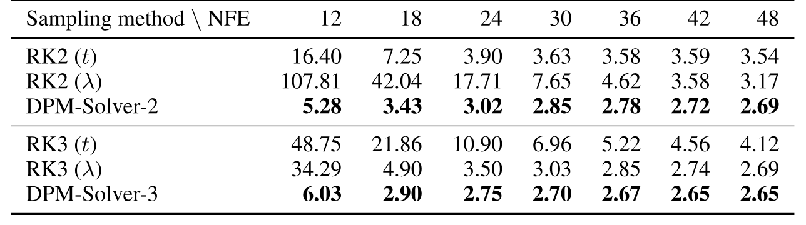

**表 1。** 関数評価回数（NFE）を変えたときの、異なる次数の Runge-Kutta（RK）法と DPM-Solver による CIFAR-10 上の FID $\downarrow$。RK 法では $t$（[式 2.7](#equation-2-7)）と $\lambda$（[式 E.1](#equation-e-1)）の双方に関する拡散 ODE を評価する。RK（$t$）では $t$ に関する一様ステップ幅、RK（$\lambda$）と DPM-Solver では $\lambda$ に関する一様ステップ幅を用いる。

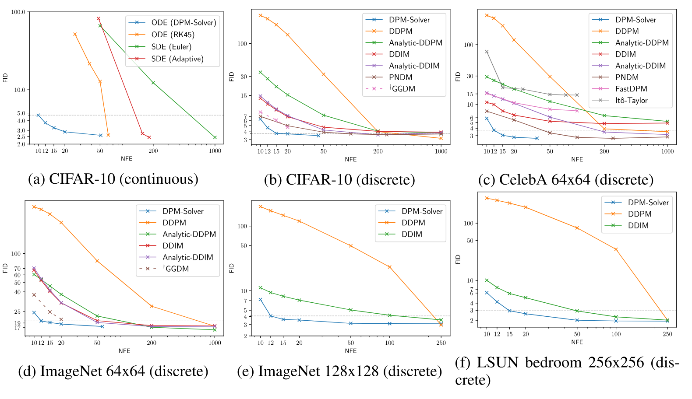

**図 2。** 関数評価回数（NFE）を変えたときの、DPM の各サンプリング手法によるサンプル品質（FID $\downarrow$）。連続時間・離散時間モデルを用いた CIFAR-10 と、離散時間モデルを用いた CelebA $64\times64$、ImageNet $64\times64$、ImageNet $128\times128$、LSUN bedroom $256\times256$ を評価した。$^\dagger$GGDM [Wat22] はサンプル軌道の最適化に追加学習を必要とするが、ほかの手法は学習不要である。最も強いベースラインを得るため、CelebA の DDIM には、原論文 [Son21a] の一様ステップ幅より FID が良い 2 次式のステップ幅を用いる。

## 5 実験

本節では、学習不要サンプラーである DPM-Solver が、線形ノイズスケジュール [Den20, Son21a] と cosine ノイズスケジュール [Nic21] の双方について、連続時間・離散時間を含む既存の事前学習済み DPM のサンプリングを大幅に高速化できることを示す。ノイズ予測モデル $\bm{\epsilon}_{\theta}(\bm{x}_{t},t)$ の呼出し回数に当たる関数評価回数（NFE）を変え、DPM-Solver とほかの手法のサンプル品質を比較する。各実験では 50K サンプルを生成し、広く使われる FID スコア [Heu17] で品質を評価する。通常、FID は低いほど品質が高い。

特記しない限り、NFE 予算が 20 未満なら [第 3.3 節](#section-3-3) の一様ステップ幅スケジュールを用いたソルバーの組合せを、それ以外では同節の適応的ステップ幅スケジュールを用いた DPM-Solver-3 を使用する。DPM-Solver のその他の実装詳細は [第 10 節](#section-10)、詳細な設定は [第 11 節](#section-11) を参照されたい。

### 5.1 連続時間サンプリング手法との比較

まず DPM-Solver を、ほかの DPM 連続時間サンプリング手法と比較する。比較対象は、拡散 SDE の Euler-Maruyama 離散化 [Son21]、拡散 SDE の適応的ステップ幅ソルバー [Jol21]、[式 2.7](#equation-2-7) の拡散 ODE に対する RK 法 [Son21, Dor80] である。線形ノイズスケジュールを持つ CIFAR-10 データセット [Kri09] の事前学習済み連続時間「VP deep」モデル [Son21] からのサンプリングで比較する。

<!-- -->`{=html}5 倍の高速化を達成する。具体的には、10 NFE で FID 4.70、12 NFE で 3.75、15 NFE で 3.24、20 NFE で 2.87 を達成し、CIFAR-10 で最速のサンプラーとなった。

アブレーションとして、[表 1](#table-01) の通り 2 次・3 次の DPM-Solver と RK 法も比較する。変数変換を用い、[式 2.7](#equation-2-7) の時刻 $t$ と half-log-SNR $\lambda$ の双方に関する拡散 ODE の RK 法を比較する（詳細は [第 11.1 節](#section-11-1)）。同じ NFE なら、DPM-Solver のサンプル品質は同次数の RK 法を一貫して上回る。DPM-Solver の効率の高さは、RK 法の離散化誤差がかなり大きい 15 NFE 未満の少数ステップ領域で特に顕著である。これは主として、DPM-Solver が線形項を解析的に計算し、その離散化誤差を回避するためである。また高次の DPM-Solver-3 は DPM-Solver-2 より速く収束し、[定理 3.2](#theorem-03-02) の次数解析と一致する。

### 5.2 離散時間サンプリング手法との比較

[第 3.4 節](#section-3-4) の方法で DPM-Solver を離散時間 DPM に適用し、DDPM [Den20]、DDIM [Son21a]、Analytic-DDPM [Bao22]、Analytic-DDIM [Bao22]、PNDM [Liu22h]、FastDPM [Kon21a]、Itô-Taylor [Tac21] など、ほかの離散時間学習不要サンプラーと比較する。同じ事前学習済みモデルを使う一方、サンプル軌道の追加学習を必要とする GGDM [Wat22] とも比較する。NFE を 10 から 1000 まで変えてサンプル品質を比較する。

具体的には、線形ノイズスケジュールを用いて CIFAR-10 上で [Den20] の $L_{\text{simple}}$ により学習した離散時間モデル、線形ノイズスケジュールを用いた CelebA 64x64 [Liu15a] 上の [Son21a] の離散時間モデル、cosine ノイズスケジュールを用いて ImageNet 64x64 [Den09a] 上で [Nic21] の $L_{\text{hybrid}}$ により学習した離散時間モデル、線形ノイズスケジュールを用いた ImageNet 128x128 [Den09a] 上の [Dha21] の分類器ガイダンス付き離散時間モデル、線形ノイズスケジュールを用いた LSUN bedroom 256x256 [Yu15a] 上の [Dha21] の離散時間モデルを使用する。ImageNet で学習したモデルについては「mean」モデルだけを用い、「variance」モデルは省く。[図 2](#figure-02) に示す通り、すべてのデータセットで DPM-Solver は 12 ステップ以内に妥当なサンプルを得る（CIFAR-10 で FID 4.65、CelebA 64x64 で 3.71、ImageNet 64x64 で 19.97、ImageNet 128x128 で 4.08）。これは従来最速の学習不要サンプラーより $4\sim 16\times$ 高速である。DPM-Solver は、追加学習を要する GGDM さえ上回る。

## 6 結論

本研究では、DPM から高速かつ学習不要でサンプリングする問題に取り組んだ。関数評価約 10 ステップで DPM を高速にサンプリングする、拡散 ODE 専用の高速な学習不要ソルバー DPM-Solver を提案した。DPM-Solver は拡散 ODE の半線形性を利用し、ノイズ予測モデルの指数重み付き積分から成る拡散 ODE 厳密解の簡潔な定式化を直接近似する。指数積分法の数値手法に着想を得て、この積分を近似する 1 次、2 次、3 次の DPM-Solver を提案し、理論的な収束を保証した。手設計と適応的なステップ幅スケジュールの双方を提案し、連続時間と離散時間の DPM に適用した。実験により、DPM-Solver はさまざまなデータセットで約 10 回の関数評価により高品質なサンプルを生成し、従来の最先端の学習不要サンプラーに比べて $4\sim 16\times$ の高速化を達成できることを示した。

**限界と広範な影響。** 有望な高速化性能を示す一方、DPM-Solver は高速サンプリング向けに設計されており、DPM の尤度評価の高速化には適さない可能性がある。また、広く使われる GAN と比べると、DPM-Solver を用いた拡散モデルもリアルタイム用途にはまだ十分に速くない。さらに、ほかの深層生成モデルと同様に DPM が有害な偽コンテンツの生成に使われるおそれがあり、提案ソルバーは悪意ある用途における深層生成モデルの潜在的な悪影響をいっそう強める可能性がある。

## 謝辞

本研究は、中国国家重点研究開発計画（No. 2021ZD0110502）、中国国家自然科学基金（Nos. 62061136001、61620106010、62076145、U19B2034、U1811461、U19A2081、6197222、62106120）、北京市自然科学基金（No. JQ19016）、北京市卓越若手科学者プログラム（No. BJJWZYJH012019100020098）、清華大学国強研究院の助成、GPU/DGX アクセラレーションを備えた NVIDIA NVAIL Program、清華大学高性能計算センター、中央大学基本科研業務費、中国人民大学研究基金（22XNKJ13）の支援を受けた。J.Z は XPlorer Prize の支援も受けている。

## 7 ノイズスケジュールに不変なサンプリング

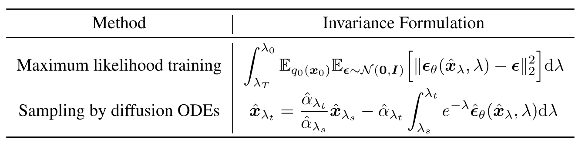

**表 2。** ノイズスケジュールの選択に不変な定式化。$\lambda$ に関する最尤学習損失は [Kin21, Son21b] の目的関数と等価であり、拡散 ODE の厳密解は [命題 3.1](#proposition-03-01) で提案されている。

本節では、[命題 3.1](#proposition-03-01) の厳密解をさらに論じ、この定式化に関する知見を示す。まず $\lambda$、すなわち half-logSNR に関して命題を言い換える。

**命題 3.1（拡散 ODE の厳密解）。** 時刻 $s$ の初期値 $\hat{\bm{x}}_{\lambda_s}$ と、対応する half-logSNR $\lambda_s$ が与えられたとする。このとき [式 2.7](#equation-2-7) の拡散 ODE に対し、対応する half-logSNR が $\lambda_t$ である時刻 $t$ の解 $\hat{\bm{x}}_{\lambda_t}$ は次式で与えられる。

$$
\hat{\bm{x}}_{\lambda_t}=\frac{\alpha_t}{\alpha_s}\hat{\bm{x}}_{\lambda_s}-\alpha_t\int_{\lambda_s}^{\lambda_t}e^{-\lambda}\hat{\bm{\epsilon}}_{\theta}(\hat{\bm{x}}_\lambda,\lambda)\mathrm{d}\lambda.
$$

以下では、この定式化がモデル $\bm{\epsilon}_{\theta}$ を特定のノイズスケジュールから分離し、ノイズスケジュールに不変となることを示す。また、[命題 3.1](#proposition-03-01) の $\lambda$ に関する変数変換は、拡散モデルの最尤学習 [Kin21, Son21b] と深く関係する。拡散モデルの最尤学習とサンプリングの双方が、ノイズスケジュールに依存しない不変な定式化を持つことを示す。

### 7.1 サンプリング解とノイズスケジュールの分離

本節では、[命題 3.1](#proposition-03-01) が拡散 ODE の厳密解を特定のノイズスケジュール、すなわち関数 $\alpha_{t}=\alpha(t)$ と $\sigma_{t}=\sigma(t)$ の選択から分離できることを示す。言い換えると、始点 $\lambda_{s}$、終点 $\lambda_{t}$、$\lambda_{s}$ における初期値 $\hat{\bm{x}}_{\lambda_{s}}$、ノイズ予測モデル $\hat{\bm{\epsilon}}_{\theta}$ が与えられれば、解 $\hat{\bm{x}}_{\lambda_{t}}$ は $\lambda_{s}$ と $\lambda_{t}$ の間のノイズスケジュールに依存しない。

まず、元の DDPM [Den20, Son21] と等価な VP 型拡散モデルを考える。VP 型では常に $\alpha_{t}^{2}+\sigma_{t}^{2}=1$ なので、ノイズスケジュールの定義は関数 $\alpha_{t}=\alpha(t)$ の定義と等価である（たとえば DDPM [Den20] は $\beta(t)=\frac{\mathrm{d}\log\alpha_{t}}{\mathrm{d} t}$ が $t$ の線形関数となるスケジュールを使い、i-DDPM [Nic21] はこれが $t$ の cosine 関数となるスケジュールを使う）。$\lambda_{t}=\log\alpha_{t}-\log\sigma_{t}$ なので、$\alpha_{t}=\sqrt{\frac{1}{1+e^{-2\lambda_{t}}}}$、$\sigma_{t}=\sqrt{\frac{1}{1+e^{2\lambda_{t}}}}$ である。したがって、与えられた $\lambda_{t}$ から $\alpha_{t}$ と $\sigma_{t}$ を直接計算できる。$\hat{\alpha}_{\lambda}\coloneqq\sqrt{\frac{1}{1+e^{-2\lambda}}}$ と置けば、

$$
\hat{\bm{x}}_{\lambda_{t}}=\frac{\hat{\alpha}_{\lambda_{t}}}{\hat{\alpha}_{\lambda_{s}}}\hat{\bm{x}}_{\lambda_{s}}-\hat{\alpha}_{\lambda_{t}}\int_{\lambda_{s}}^{\lambda_{t}}e^{-\lambda}\hat{\bm{\epsilon}}_{\theta}(\hat{\bm{x}}_{\lambda},\lambda)\mathrm{d}\lambda.
$$

被積分関数 $e^{-\lambda}\hat{\bm{\epsilon}}_{\theta}(\hat{\bm{x}}_{\lambda},\lambda)$ は $\lambda$ の関数なので、$\lambda_{s}$ から $\lambda_{t}$ までの積分は始点 $\lambda_{s}$、終点 $\lambda_{t}$、関数 $\hat{\bm{\epsilon}}_{\theta}$ だけに依存し、中間値には依存しない。ほかの係数 $\hat{\alpha}_{\lambda_{s}}$ と $\hat{\alpha}_{\lambda_{t}}$ も始点と終点だけに依存するため、$\hat{\bm{x}}_{\lambda_{t}}$ はノイズスケジュールの具体的な選択に不変である。直観的には、[式 3.1](#equation-3-1) の時刻 $t$ に関する元の積分を $\lambda$ に関する積分へ変換すると、関数 $f(t)$ と $g(t)$ が、それらの具体的な選択に依存しない解析式 $e^{-\lambda}$ へ変換されるためである。最後に、VE 型や subVP 型などほかの拡散モデルも、[Kin21] が示したようにノイズ予測モデルを等価に再スケーリングすれば VP 型と等価になる。したがって、これらの型の解も同じ性質を持つ。

要するに、[命題 3.1](#proposition-03-01) は拡散 ODE の解をノイズスケジュールから分離し、DPM 専用サンプラーを設計する余地を与える。実際、[第 3.2 節](#section-3-2) に示した通り、DPM-Solver で近似するのはニューラルネットワーク $\hat{\bm{\epsilon}}_{\theta}$ の $\lambda$ に関する Taylor 展開だけであり、特定のノイズスケジュールに対応するほかの係数は解析的に計算する。直観的には、既知の情報をできる限り保持し、扱いにくいニューラルネットワークの積分だけを近似するため、はるかに少ないステップで同等のサンプルを生成できる。

### 7.2 $\lambda$ に対する時刻点の選択はノイズスケジュールに不変

[第 7.1 節](#section-7-1) で述べた通り、[命題 3.1](#proposition-03-01) はサンプリング解をノイズスケジュールから分離する。解は始点 $\lambda_{s}$ と終点 $\lambda_{t}$ に依存し、中間のノイズスケジュールには依存しない。同様に、DPM-Solver の更新式も中間のノイズスケジュールに不変である。したがって、時刻点 $\{\lambda_{i}\}_{i=0}^{M}$ を選べば DPM-Solver の解も定まり、中間のノイズスケジュールには依存しない。

$\lambda$ の時刻点を選ぶ単純な方法は $[\lambda_{T},\lambda_{\epsilon}]$ の一様分割であり、本研究の実験でもこれを用いる。ただし、より精密な選択方法が存在すると考えられ、今後の課題とする。

### 7.3 拡散モデルの最尤学習との関係

興味深いことに、連続時間拡散 SDE の最尤学習もこの不変性を持つ [Kin21]。以下では拡散 SDE の最尤学習損失を簡潔に振り返り、拡散モデルを理解する新たな見方を提示する。

データ分布を $q_{0}(\bm{x}_{0})$、各時刻 $t$ の順方向過程の分布を $q_{t}(\bm{x}_{t})$、逆過程の分布を $p_{t}(\bm{x}_{t})$ とし、$p_{T}=\mathcal{N}(\bm{0},\bm{I})$ とする。[Son21] は、$q_{0}$ と $p_{0}$ の KL divergence が重み付き score matching 損失で上から抑えられることを示した。

$$
D_{\mathrm{KL}}(q_{0}\;\|\;p_{0})\leq D_{\mathrm{KL}}(q_{T}\;\|\;p_{T})+\frac{1}{2}\int_{0}^{T}\frac{g^{2}(t)}{\sigma_{t}^{2}}\mathbb{E}_{q_{0}(\bm{x}_{0})}\mathbb{E}_{\bm{\epsilon}\sim\mathcal{N}(\bm{0},\bm{I})}\Big[\|\bm{\epsilon}_{\theta}(\bm{x}_{t},t)-\bm{\epsilon}\|_{2}^{2}\Big]\mathrm{d}t+C,
$$

ここで $\bm{x}_{t}=\alpha_{t}\bm{x}_{0}+\sigma_{t}\bm{\epsilon}$ であり、$C$ は $\theta$ に依存しない定数である。[第 3.1 節](#section-3-1) に示した通り、

$$
g^{2}(t)=\frac{\mathrm{d}\sigma_{t}^{2}}{\mathrm{d}t}-2\frac{\mathrm{d}\log\alpha_{t}}{\mathrm{d}t}\sigma_{t}^{2}=2\sigma_{t}^{2}\left(\frac{\mathrm{d}\log\sigma_{t}}{\mathrm{d}t}-\frac{\mathrm{d}\log\alpha_{t}}{\mathrm{d}t}\right)=-2\sigma_{t}^{2}\frac{\mathrm{d}\lambda_{t}}{\mathrm{d}t},
$$

したがって $\lambda$ に関する変数変換を適用すると、

$$
D_{\mathrm{KL}}(q_{0}\;\|\;p_{0})\leq D_{\mathrm{KL}}(q_{T}\;\|\;p_{T})+\int_{\lambda_{T}}^{\lambda_{0}}\mathbb{E}_{q_{0}(\bm{x}_{0})}\mathbb{E}_{\bm{\epsilon}\sim\mathcal{N}(\bm{0},\bm{I})}\Big[\|\bm{\epsilon}_{\theta}(\hat{\bm{x}}_{\lambda},\lambda)-\bm{\epsilon}\|_{2}^{2}\Big]\mathrm{d}\lambda+C,
$$

となる。これは [Son21b] の importance sampling 技法および [Kin21] の連続時間拡散損失と等価である。[命題 3.1](#proposition-03-01) と比べると、拡散モデルのサンプリングと最尤学習はいずれも $\lambda$ に関する積分へ変換でき、その定式化が特定のノイズスケジュールに不変となることが分かる。[表 2](#table-02) に要約する。学習とサンプリングの双方が持つこの不変性は、拡散モデルを理解する新たな視点をもたらす。たとえば、時刻 $t$ ではなく（half-）logSNR $\lambda$ に関してノイズ予測モデル $\bm{\epsilon}_{\theta}$ を直接定義すれば、場当たり的なノイズスケジュールを選ばずに拡散モデルを学習・サンプリングできる。この知見は、拡散モデルの学習と推論の異なる方法を統一し得るため、今後の課題とする。

## 8 定理 3.2 の証明

### 8.1 仮定

本節を通して、$\bm{x}_{s}$ は $\bm{x}_{T}$ から出発する拡散 ODE [式 2.7](#equation-2-7) の解を表す。DPM-Solver-$k$ について次を仮定する。

**仮定 8.1。** $0\leq j\leq k+1$ に対して、全微分 $\frac{\mathrm{d}^j\hat{\bm{\epsilon}}_\theta(\hat{\bm{x}}_\lambda,\lambda)}{\mathrm{d}\lambda^j}$（$\lambda$ の関数として）が存在し、連続である。

**仮定 8.2。** 関数 $\bm{\epsilon}_\theta(\bm{x},s)$ は第 1 引数 $\bm{x}$ に関して Lipschitz 連続である。

**仮定 8.3。** $h_{\max}=\mathcal{O}(1/M)$ とする。

第 1 の仮定は Taylor の定理 [式 3.6](#equation-3-6) に必要である。第 2 の仮定は、$\lambda_{s}$ に関する Taylor 展開を適用できるよう、$\epsilon_{\theta}(\tilde{\bm{x}}_{s},s)$ を $\epsilon_{\theta}(\bm{x}_{s},s)+\mathcal{O}(\bm{x}_{s}-\tilde{\bm{x}}_{s})$ で置き換えるために用いる。最後の仮定は、著しく大きなステップ幅を除外するための技術的条件である。

### 8.2 指数重み付き積分の一般展開

まず、指数重み付き積分の Taylor 展開を導く。$t<s$、したがって $\lambda_{t}>\lambda_{s}$ とする。$h\coloneqq\lambda_{t}-\lambda_{s}$ と置き、$k$ 次全微分を $\hat{\bm{\epsilon}}_{\theta}^{(k)}(\hat{\bm{x}}_{\lambda},\lambda)\coloneqq\frac{\mathrm{d}^{k}\hat{\bm{\epsilon}}_{\theta}(\hat{\bm{x}}_{\lambda},\lambda)}{\mathrm{d}\lambda^{k}}$ と表す。$n\geq 0$ に対し、$\hat{\bm{\epsilon}}_{\theta}(\hat{\bm{x}}_{\lambda},\lambda)$ の $\lambda$ に関する $n$ 次 Taylor 展開は

$$
\hat{\bm{\epsilon}}_{\theta}(\hat{\bm{x}}_{\lambda},\lambda)=\sum_{k=0}^{n}\frac{(\lambda-\lambda_{s})^{k}}{k!}\hat{\bm{\epsilon}}_{\theta}^{(k)}(\hat{\bm{x}}_{\lambda_{s}},\lambda_{s})+\mathcal{O}(h^{n+1}).
$$

指数積分を展開するため、さらに次を定義する [Hoc05]。

$$
\varphi_{k}(z)\coloneqq\int_{0}^{1}e^{(1-\delta)z}\frac{\delta^{k-1}}{(k-1)!}\mathrm{d}\delta,\quad\quad\varphi_{0}(z)=e^{z}
$$

これは $\varphi_{k}(0)=\frac{1}{k!}$ と漸化式 $\varphi_{k+1}(z)=\frac{\varphi_{k}(z)-\varphi_{k}(0)}{z}$ を満たす。$\hat{\bm{\epsilon}}_{\theta}(\hat{\bm{x}}_{\lambda},\lambda)$ を Taylor 展開すると、指数積分は次のように書き換えられる。

$$
\int_{\lambda_{s}}^{\lambda_{t}}e^{-\lambda}\hat{\bm{\epsilon}}_{\theta}(\hat{\bm{x}}_{\lambda},\lambda)\mathrm{d}\lambda=\frac{\sigma_{t}}{\alpha_{t}}\sum_{k=0}^{n}h^{k+1}\varphi_{k+1}(h)\hat{\bm{\epsilon}}_{\theta}^{(k)}(\hat{\bm{x}}_{\lambda_{s}},\lambda_{s})+\mathcal{O}(h^{n+2}).
$$

したがって、[式 3.4](#equation-3-4) の解 $\bm{x}_{t}$ は次のように展開できる。

$$
\bm{x}_{t}=\frac{\alpha_{t}}{\alpha_{s}}\bm{x}_{s}-\sigma_{t}\sum_{k=0}^{n}h^{k+1}\varphi_{k+1}(h)\hat{\bm{\epsilon}}_{\theta}^{(k)}(\hat{\bm{x}}_{\lambda_{s}},\lambda_{s})+\mathcal{O}(h^{n+2}).
$$

最後に、$k=1,2,3$ に対する $\varphi_{k}$ の閉形式を示す。

$$
\begin{aligned}
\varphi_{1}(h) & =\frac{e^{h}-1}{h}, \\
\varphi_{2}(h) & =\frac{e^{h}-h-1}{h^{2}}, \\
\varphi_{3}(h) & =\frac{e^{h}-\nicefrac{{h^{2}}}{{2}}-h-1}{h^{3}}.
\end{aligned}
$$

### 8.3 $k=1$ のときの定理 3.2 の証明

::: details 証明

[式 B.4](#equation-b-4) で $n=0,t=t_{i},s=t_{i-1}$ とすると、

$$
\bm{x}_{t_{i}}=\frac{\alpha_{t_{i}}}{\alpha_{t_{i-1}}}\bm{x}_{t_{i-1}}-\sigma_{t}(e^{h_{i}}-1)\bm{\epsilon}_{\theta}(\bm{x}_{t_{i-1}},{t_{i-1}})+\mathcal{O}(h_{i}^{2}).
$$

[仮定 8.2](#assumption-08-02) と [式 3.7](#equation-3-7) から、

$$
\begin{aligned}
\tilde{\bm{x}}_{t_{i}} & =\frac{\alpha_{t_{i}}}{\alpha_{t_{i-1}}}\tilde{\bm{x}}_{t_{i-1}}-\sigma_{t_{i}}(e^{h_{i}}-1)\bm{\epsilon}_{\theta}(\tilde{\bm{x}}_{t_{i-1}},t_{i-1}) \\
=\frac{\alpha_{t_{i}}}{\alpha_{t_{i-1}}}\tilde{\bm{x}}_{t_{i-1}}-\sigma_{t_{i}}(e^{h_{i}}-1)\left(\bm{\epsilon}_{\theta}(\bm{x}_{t_{i-1}},t_{i-1})+\mathcal{O}(\tilde{\bm{x}}_{t_{i-1}}-\bm{x}_{t_{i-1}})\right) \\
=\frac{\alpha_{t_{i}}}{\alpha_{t_{i-1}}}\bm{x}_{t_{i-1}}-\sigma_{t_{i}}(e^{h_{i}}-1)\bm{\epsilon}_{\theta}(\bm{x}_{t_{i-1}},t_{i-1})+\mathcal{O}(\tilde{\bm{x}}_{t_{i-1}}-\bm{x}_{t_{i-1}}) \\
=\bm{x}_{t_{i}}+\mathcal{O}(h_{\max}^{2})+\mathcal{O}(\tilde{\bm{x}}_{t_{i-1}}-\bm{x}_{t_{i-1}}).
\end{aligned}
$$

この議論を繰り返すと、

$$
\tilde{\bm{x}}_{t_{M}}=\bm{x}_{t_{0}}+\mathcal{O}(Mh_{\max}^{2})=\bm{x}_{t_{0}}+\mathcal{O}(h_{\max}),
$$

となり、証明が完了する。

:::

### 8.4 $k=2$ のときの定理 3.2 の証明

[アルゴリズム 4](#algorithm-04) に示す一般形の DPM-Solver-2 の離散化誤差を証明する。

::: details 証明

まず、$0<t<s<T,h:=\lambda_{t}-\lambda_{s}$ に対して次の更新を考える。

$$
\begin{aligned}
 s_{1} & =t_{\lambda}\left(\lambda_{s}+r_{1}h\right), \\
\bar{\bm{u}} & =\frac{\alpha_{s_{1}}}{\alpha_{s}}\bm{x}_{s}-\sigma_{s_{1}}\left(e^{r_{1}h}-1\right)\bm{\epsilon}_{\theta}(\bm{x}_{s},s), \\
\bar{\bm{x}}_{t} & =\frac{\alpha_{t}}{\alpha_{s}}\bm{x}_{s}-\sigma_{t}\left(e^{h}-1\right)\bm{\epsilon}_{\theta}(\bm{x}_{s},s)-\frac{\sigma_{t}}{2r_{1}}(e^{h}-1)(\bm{\epsilon}_{\theta}(\bar{\bm{u}},s_{1})-\bm{\epsilon}_{\theta}(\bm{x}_{s},s)).
\end{aligned}
$$

上の更新は、$\tilde{x}_{t_{i-1}}$ を厳密解 $\bm{x}_{t_{i-1}}$ で置き換えた点を除き、$s=t_{i-1}$、$t=t_{i}$ とした DPM-Solver-2 の 1 ステップと同じである。$\bar{\bm{x}}_{t}=\bm{x}_{t}+\mathcal{O}(h^{3})$ を示せば、[第 8.3 節](#section-8-3) と同様の議論から $\tilde{\bm{x}}_{t_{i}}=\bm{x}_{t_{i}}+\mathcal{O}(h_{\max}^{3})+\mathcal{O}(\tilde{\bm{x}}_{t_{i-1}}-\bm{x}_{t_{i-1}})$ が従い、証明が完了する。

残りでは $\bar{\bm{x}}_{t}=\bm{x}_{t}+\mathcal{O}(h^{3})$ を示す。

[式 B.4](#equation-b-4) で $n=1$ とすると、

$$
\bm{x}_{t}=\frac{\alpha_{t}}{\alpha_{s}}\bm{x}_{s}-\sigma_{t}h\varphi_{1}(h)\bm{\epsilon}_{\theta}(\bm{x}_{s},s)-\sigma_{t}h^{2}\varphi_{2}(h)\hat{\bm{\epsilon}}_{\theta}^{(1)}(\hat{\bm{x}}_{\lambda_{s}},\lambda_{s})+\mathcal{O}(h^{3}).
$$

[式 B.1](#equation-b-1) から、

$$
\begin{aligned}
\bar{\bm{x}}_{t} & =\frac{\alpha_{t}}{\alpha_{s}}\bm{x}_{s}-\sigma_{t}\left(e^{h}-1\right)\bm{\epsilon}_{\theta}(\bm{x}_{s},s)-\frac{\sigma_{t}}{2r_{1}}(e^{h}-1)(\bm{\epsilon}_{\theta}(\bar{\bm{u}},s_{1})-\bm{\epsilon}_{\theta}(\bm{x}_{s},s)) \\
=\frac{\alpha_{t}}{\alpha_{s}}\bm{x}_{s}-\sigma_{t}\left(e^{h}-1\right)\bm{\epsilon}_{\theta}(\bm{x}_{s},s)-\frac{\sigma_{t}}{2r_{1}}\left(e^{h}-1\right)\left[\bm{\epsilon}_{\theta}(\bar{\bm{u}},s_{1})-\bm{\epsilon}_{\theta}(\bm{x}_{s_{1}},s_{1})\right] \\
-\frac{\sigma_{t}}{2r_{1}}\left(e^{h}-1\right)\left[(\lambda_{s_{1}}-\lambda_{s})\hat{\bm{\epsilon}}_{\theta}^{(1)}(\hat{\bm{x}}_{\lambda_{s}},\lambda_{s})+\mathcal{O}(h^{2})\right].
\end{aligned}
$$

$\bm{x}$ に関する $\bm{\epsilon}_{\theta}$ の Lipschitz 連続性（[仮定 8.2](#assumption-08-02)）から、

$$
\|\bm{\epsilon}_{\theta}(\bar{\bm{u}},s_{1})-\bm{\epsilon}_{\theta}(\bm{x}_{s_{1}},s_{1})\|=\mathcal{O}(\|\bar{\bm{u}}-\bm{x}_{s_{1}}\|)=\mathcal{O}(h^{2}),
$$

ここで最後の等式は、$k=1$ の証明と同様の議論による。$e^{h}-1=\mathcal{O}(h)$ なので、上式の第 2 項は $\mathcal{O}(h^{3})$ である。

$\lambda_{s_{1}}-\lambda_{s}=r_{1}h$、$\varphi_{i}(h)=(e^{h}-1)/h$、$\varphi_{2}(h)=(e^{h}-h-1)/h^{2}$ より、

$$
\bm{x}_{t}-\bar{\bm{x}}_{t} & =\sigma_{t}\left[h^{2}\varphi_{2}(h)-(e^{h}-1)\frac{\lambda_{s_{1}}-\lambda_{s}}{2r_{1}}\right]\hat{\bm{\epsilon}}_{\theta}^{(1)}(\hat{\bm{x}}_{\lambda_{s}},\lambda_{s})+\mathcal{O}(h^{3}).
$$

さらに次を確認すれば、証明は完了する。

$$
h^{2}\varphi_{2}(h)-(e^{h}-1)\frac{\lambda_{s_{1}}-\lambda_{s}}{2r_{1}}=(2e^{h}-h-2-he^{h})/2=\mathcal{O}(h^{3}).
$$

:::

### 8.5 $k=3$ のときの定理 3.2 の証明

::: details 証明

[第 8.4 節](#section-8-4) と同様に、$0<t<s<T$、$h=\lambda_{s}-\lambda_{t}$ に対し、次の更新の誤差が $\bar{\bm{x}}_{t}=\bm{x}_{t}+\mathcal{O}(h^{4})$ であることを示せば十分である。

$$
\begin{aligned}
 s_{1} & =t_{\lambda}\left(\lambda_{s}+r_{1}h\right),\quad s_{2}=t_{\lambda}\left(\lambda_{s}+r_{2}h\right), \\
\bar{\bm{u}}_{1} & =\frac{\alpha_{s_{1}}}{\alpha_{s}}\bm{x}_{s}-\sigma_{s_{1}}\left(e^{r_{1}h}-1\right)\bm{\epsilon}_{\theta}(\bm{x}_{s},s), \\
\bm{D}_{1} & =\bm{\epsilon}_{\theta}(\bar{\bm{u}}_{1},s_{1})-\bm{\epsilon}_{\theta}(\bm{x}_{s},s), \\
\bar{\bm{u}}_{2} & =\frac{\alpha_{s_{2}}}{\alpha_{s}}\bm{x}_{s}-\sigma_{s_{2}}\left(e^{r_{2}h}-1\right)\bm{\epsilon}_{\theta}(\bm{x}_{s},s)-\frac{\sigma_{s_{2}}r_{2}}{r_{1}}\left(\frac{e^{r_{2}h}-1}{r_{2}h}-1\right)\bm{D}_{1}, \\
\bm{D}_{2} & =\bm{\epsilon}_{\theta}(\bar{\bm{u}}_{2},s_{2})-\bm{\epsilon}_{\theta}(\bm{x}_{s},s), \\
\bar{\bm{x}}_{t} & =\frac{\alpha_{t}}{\alpha_{s}}\bm{x}_{s}-\sigma_{t}\left(e^{h}-1\right)\bm{\epsilon}_{\theta}(\bm{x}_{s},s)-\frac{\sigma_{t}}{r_{2}}\left(\frac{e^{h}-1}{h}-1\right)\bm{D}_{2}.
\end{aligned}
$$

まず次を示す。

$$
\bar{\bm{u}}_{2}=\bm{x}_{s_{2}}+\mathcal{O}(h^{3}).
$$

[第 8.4 節](#section-8-4) の証明と同様に、$\frac{e^{r_{2}h-1}}{r_{2}h}-1=\mathcal{O}(h)$ および $\bar{\bm{u}}_{1}=\bm{x}_{s_{1}}+\mathcal{O}(h^{2})$ なので、

$$
\begin{aligned}
\bar{\bm{u}}_{2} & =\frac{\alpha_{s_{2}}}{\alpha_{s}}\bm{x}_{s}-\sigma_{s_{2}}\left(e^{r_{2}h}-1\right)\bm{\epsilon}_{\theta}(\bm{x}_{s},s) \\
-\sigma_{s_{2}}\frac{r_{2}}{r_{1}}\left(\frac{e^{r_{2}h}-1}{r_{2}h}-1\right)\left(\bm{\epsilon}_{\theta}(\bm{x}_{s_{1}},s_{1})-\bm{\epsilon}_{\theta}(\bm{x}_{s},s)\right)+\mathcal{O}(h^{3}) \\
=\frac{\alpha_{s_{2}}}{\alpha_{s}}\bm{x}_{s}-\sigma_{s_{2}}\left(e^{r_{2}h}-1\right)\bm{\epsilon}_{\theta}(\bm{x}_{s},s) \\
-\sigma_{s_{2}}\frac{r_{2}}{r_{1}}\left(\frac{e^{r_{2}h}-1}{r_{2}h}-1\right)\bm{\epsilon}^{(1)}_{\theta}(\bm{x}_{s},s)(\lambda_{s_{1}}-\lambda_{s})+\mathcal{O}(h^{3}).
\end{aligned}
$$

$h_{2}=r_{2}h$ と置く。[第 8.4 節](#section-8-4) の証明と同じ議論により、次を確認すれば十分である。

$$
\begin{aligned}
\varphi_{1}(h_{2})h_{2} & =e^{h_{2}}-1, \\
\varphi_{2}(h_{2})h_{2}^{2} & =\frac{r_{2}}{r_{1}}\left(\frac{e^{h_{2}}-1}{h_{2}}-1\right)(\lambda_{s_{1}}-\lambda_{s})+\mathcal{O}(h^{3}),
\end{aligned}
$$

これは Taylor 展開から成り立つ。

$\bar{\bm{u}}_{2}=\bm{x}_{s_{2}}+\mathcal{O}(h^{3})$ と $\lambda_{s_{2}}-\lambda_{s}=r_{2}h=\frac{2}{3}h$ を用いると、

$$
\begin{aligned}
\bar{\bm{x}}_{t} & =\frac{\alpha_{t}}{\alpha_{s}}\bm{x}_{s}-\sigma_{t}\left(e^{h}-1\right)\bm{\epsilon}_{\theta}(\bm{x}_{s},s)-\sigma_{t}\frac{1}{r_{2}}\left(\frac{e^{h}-1}{h}-1\right)\big(\bm{\epsilon}_{\theta}(\bar{\bm{u}}_{2},s_{2})-\bm{\epsilon}_{\theta}(\bm{x}_{s},s)\big) \\
=\frac{\alpha_{t}}{\alpha_{s}}\bm{x}_{s}-\sigma_{t}\left(e^{h}-1\right)\bm{\epsilon}_{\theta}(\bm{x}_{s},s)-\sigma_{t}\frac{1}{r_{2}}\left(\frac{e^{h}-1}{h}-1\right)\big(\bm{\epsilon}_{\theta}(\bm{x}_{s_{2}},s_{2})-\bm{\epsilon}_{\theta}(\bm{x}_{s},s)\big)+\mathcal{O}(h^{4}) \\
=\frac{\alpha_{t}}{\alpha_{s}}\bm{x}_{s}-\sigma_{t}\left(e^{h}-1\right)\bm{\epsilon}_{\theta}(\bm{x}_{s},s) \\
-\sigma_{t}\frac{1}{r_{2}}\left(\frac{e^{h}-1}{h}-1\right)\big(\bm{\epsilon}^{(1)}_{\theta}(\bm{x}_{s},s)r_{2}h+\frac{1}{2}\bm{\epsilon}^{(2)}_{\theta}(\bm{x}_{s},s)r_{2}^{2}h^{2}\big)+\mathcal{O}(h^{4}).
\end{aligned}
$$

[式 B.4](#equation-b-4) で $n=2$ とした Taylor 展開と比較すると、

$$
\bm{x}_{t}=\frac{\alpha_{t}}{\alpha_{s}}\bm{x}_{s}-\sigma_{t}h\varphi_{1}(h)\bm{\epsilon}_{\theta}(\bm{x}_{s},s)-\sigma_{t}h^{2}\varphi_{2}(h)\bm{\epsilon}_{\theta}^{(1)}(\bm{x}_{s},s)-\sigma_{t}h^{3}\varphi_{3}(h)\bm{\epsilon}_{\theta}^{(2)}(\bm{x}_{s},s)+\mathcal{O}(h^{4}),
$$

次の条件を確認する必要がある。

$$
\begin{aligned}
 h\varphi_{1}(h) & =e^{h}-1, \\
 h^{2}\varphi_{2}(h) & =\left(\frac{e^{h}-1}{h}-1\right)h, \\
 h^{3}\varphi_{3}(h) & =\left(\frac{e^{h}-1}{h}-1\right)\frac{r_{2}h^{2}}{2}+\mathcal{O}(h^{4}).
\end{aligned}
$$

最初の 2 条件は明らかである。最後の条件は次式から従う。

$$
h^{3}\varphi_{3}(h) & =e^{h}-1-h-\frac{h^{2}}{2}=\frac{h^{3}}{6}+\mathcal{O}(h^{4})=\left(\frac{e^{h}-1}{h}-1\right)\frac{r_{2}h^{2}}{2}.
$$

したがって、$\bar{\bm{x}}_{t}=\bm{x}_{t}+\mathcal{O}(h^{4})$ である。

:::

### 8.6 陽的指数 Runge-Kutta（expRK）法との関係

次の形の ODE があるとする。

$$
\frac{\mathrm{d}\bm{x}_{t}}{\mathrm{d} t}=\alpha\bm{x}_{t}+\bm{N}(\bm{x}_{t},t),
$$

ここで $\alpha\in\mathbb{R}$ であり、$\bm{N}(\bm{x}_{t},t)\in\mathbb{R}^{D}$ は $\bm{x}_{t}$ の非線形関数である。時刻 $t$ の初期値 $\bm{x}_{t}$ が与えられたとき、$h>0$ に対する時刻 $t+h$ の真の解は

$$
\bm{x}_{t+h}=e^{\alpha h}\bm{x}_{t}+e^{\alpha h}\int_{0}^{h}e^{-\alpha\tau}\bm{N}(\bm{x}_{t+\tau},t+\tau)\mathrm{d}\tau.
$$

指数 Runge-Kutta 法 [Hoc10, Hoc05] は、いくつかの中間点を用いて積分 $\int e^{-\alpha\tau}\bm{N}(\bm{x}_{t+\tau},t+\tau)\mathrm{d}\tau$ を近似する。提案する DPM-Solver は、$\alpha=1$、$\bm{N}=\tilde{\bm{\epsilon}}_{\theta}$ とした同じ積分を近似するこの手法に着想を得ている。ただし expRK 法の線形項 $e^{\alpha h}\bm{x}_{t}$ は DPM-Solver の線形項 $\frac{\alpha_{t+h}}{\alpha_{t}}\bm{x}_{t}$ と異なるため、両者は同一ではない。要するに DPM-Solver は、指数重み付き積分の高次近似を導く expRK と同じ技法に着想を得つつ、定式化は expRK と異なり、拡散 ODE 固有の形に合わせて設計されている。

## 9 DPM-Solver のアルゴリズム

[アルゴリズム 3](#algorithm-03)、[アルゴリズム 4](#algorithm-04)、[アルゴリズム 5](#algorithm-05) に DPM-Solver-1、2、3 の詳細を示す。DPM-Solver-2 は $r_{1}\in(0,1)$ とする一般形であり、通常は $r_{1}=0.5$ とする。

**アルゴリズム 3: DPM-Solver-1。**

- **入力:** 初期値 $\bm{x}_T$、時刻点 $\{t_i\}_{i=0}^M$、モデル $\bm{\epsilon}_\theta$。
- $\mathrm{DPM}\text{-}\mathrm{Solver}\text{-}1(\tilde{\bm{x}}_{t_{i-1}},t_{i-1},t_i)$ を定義する。
  - $h_i\leftarrow\lambda_{t_i}-\lambda_{t_{i-1}}$.
  - $\tilde{\bm{x}}_{t_i}\leftarrow\frac{\alpha_{t_i}}{\alpha_{t_{i-1}}}\tilde{\bm{x}}_{t_{i-1}}-\sigma_{t_i}(e^{h_i}-1)\bm{\epsilon}_\theta(\tilde{\bm{x}}_{t_{i-1}},t_{i-1})$.
  - $\tilde{\bm{x}}_{t_i}$ を返す。
- $\tilde{\bm{x}}_{t_0}\leftarrow\bm{x}_T$ とする。
- $i\leftarrow1$ から $M$ まで反復する。
  - $\tilde{\bm{x}}_{t_i}\leftarrow\mathrm{DPM}\text{-}\mathrm{Solver}\text{-}1}(\tilde{\bm{x}}_{t_{i-1}},t_{i-1},t_i)$.
- **返り値:** $\tilde{\bm{x}}_{t_M}$.

**アルゴリズム 4: DPM-Solver-2（一般形）。**

- **入力:** 初期値 $\bm{x}_T$、時刻点 $\{t_i\}_{i=0}^M$、モデル $\bm{\epsilon}_\theta$、$r_1=0.5$。
- $\mathrm{DPM}\text{-}\mathrm{Solver}\text{-}2(\tilde{\bm{x}}_{t_{i-1}},t_{i-1},t_i,r_1)$ を定義する。
  - $h_i\leftarrow\lambda_{t_i}-\lambda_{t_{i-1}}$.
  - $s_i\leftarrow t_\lambda(\lambda_{t_{i-1}}+r_1h_i)$.
  - $\bm{u}_i\leftarrow\frac{\alpha_{s_i}}{\alpha_{t_{i-1}}}\tilde{\bm{x}}_{t_{i-1}}-\sigma_{s_i}(e^{r_1h_i}-1)\bm{\epsilon}_\theta(\tilde{\bm{x}}_{t_{i-1}},t_{i-1})$.
  - $\tilde{\bm{x}}_{t_i}\leftarrow\frac{\alpha_{t_i}}{\alpha_{t_{i-1}}}\tilde{\bm{x}}_{t_{i-1}}-\sigma_{t_i}(e^{h_i}-1)\bm{\epsilon}_\theta(\tilde{\bm{x}}_{t_{i-1}},t_{i-1})-\frac{\sigma_{t_i}}{2r_1}(e^{h_i}-1)(\bm{\epsilon}_\theta(\bm{u}_i,s_i)-\bm{\epsilon}_\theta(\tilde{\bm{x}}_{t_{i-1}},t_{i-1}))$.
  - $\tilde{\bm{x}}_{t_i}$ を返す。
- $\tilde{\bm{x}}_{t_0}\leftarrow\bm{x}_T$ とする。
- $i\leftarrow1$ から $M$ まで反復する。
  - $\tilde{\bm{x}}_{t_i}\leftarrow\mathrm{DPM}\text{-}\mathrm{Solver}\text{-}2}(\tilde{\bm{x}}_{t_{i-1}},t_{i-1},t_i,r_1)$.
- **返り値:** $\tilde{\bm{x}}_{t_M}$.

**アルゴリズム 5: DPM-Solver-3。**

- **入力:** 初期値 $\bm{x}_T$、時刻点 $\{t_i\}_{i=0}^M$、モデル $\bm{\epsilon}_\theta$、$r_1=\frac{1}{3}$、$r_2=\frac{2}{3}$。
- $\mathrm{DPM}\text{-}\mathrm{Solver}\text{-}3(\tilde{\bm{x}}_{t_{i-1}},t_{i-1},t_i,r_1,r_2)$ を定義する。
  - $h_i\leftarrow\lambda_{t_i}-\lambda_{t_{i-1}}$.
  - $s_{2i-1}\leftarrow t_\lambda(\lambda_{t_{i-1}}+r_1h_i)$、$s_{2i}\leftarrow t_\lambda(\lambda_{t_{i-1}}+r_2h_i)$ とする。
  - $\bm{u}_{2i-1}\leftarrow\frac{\alpha_{s_{2i-1}}}{\alpha_{t_{i-1}}}\tilde{\bm{x}}_{t_{i-1}}-\sigma_{s_{2i-1}}(e^{r_1h_i}-1)\bm{\epsilon}_\theta(\tilde{\bm{x}}_{t_{i-1}},t_{i-1})$.
  - $\bm{D}_{2i-1}\leftarrow\bm{\epsilon}_\theta(\bm{u}_{2i-1},s_{2i-1})-\bm{\epsilon}_\theta(\tilde{\bm{x}}_{t_{i-1}},t_{i-1})$.
  - $\bm{u}_{2i}\leftarrow\frac{\alpha_{s_{2i}}}{\alpha_{t_{i-1}}}\tilde{\bm{x}}_{t_{i-1}}-\sigma_{s_{2i}}(e^{r_2h_i}-1)\bm{\epsilon}_\theta(\tilde{\bm{x}}_{t_{i-1}},t_{i-1})-\frac{\sigma_{s_{2i}}r_2}{r_1}\left(\frac{e^{r_2h_i}-1}{r_2h_i}-1\right)\bm{D}_{2i-1}$.
  - $\bm{D}_{2i}\leftarrow\bm{\epsilon}_\theta(\bm{u}_{2i},s_{2i})-\bm{\epsilon}_\theta(\tilde{\bm{x}}_{t_{i-1}},t_{i-1})$.
  - $\tilde{\bm{x}}_{t_i}\leftarrow\frac{\alpha_{t_i}}{\alpha_{t_{i-1}}}\tilde{\bm{x}}_{t_{i-1}}-\sigma_{t_i}(e^{h_i}-1)\bm{\epsilon}_\theta(\tilde{\bm{x}}_{t_{i-1}},t_{i-1})-\frac{\sigma_{t_i}}{r_2}\left(\frac{e^{h_i}-1}{h}-1\right)\bm{D}_{2i}$.
  - $\tilde{\bm{x}}_{t_i}$ を返す。
- $\tilde{\bm{x}}_{t_0}\leftarrow\bm{x}_T$ とする。
- $i\leftarrow1$ から $M$ まで反復する。
  - $\tilde{\bm{x}}_{t_i}\leftarrow\mathrm{DPM}\text{-}\mathrm{Solver}\text{-}3}(\tilde{\bm{x}}_{t_{i-1}},t_{i-1},t_i,r_1,r_2)$.
- **返り値:** $\tilde{\bm{x}}_{t_M}$.

次に、DPM-Solver-12（1 次と 2 次の組合せ、[アルゴリズム 6](#algorithm-06)）と DPM-Solver-23（2 次と 3 次の組合せ、[アルゴリズム 7](#algorithm-07)）という適応的ステップ幅アルゴリズムを示す。[Jol21] に従い、画像データの絶対許容誤差を $\epsilon_{\text{atol}}=\frac{\bm{x}_{\max}-\bm{x}_{\min}}{256}$ とする。VP 型 DPM では $0.0078$ である。相対許容誤差 $\epsilon_{\text{rtol}}$ を調整すれば精度と NFE の釣合いを取れ、$\epsilon_{\text{rtol}}=0.05$ で十分かつ速やかに収束する。

実際には、適応的ステップ幅ソルバーへの入力はバッチデータである。$E_{2}$ と $E_{3}$ にはバッチ全体の最大値を採用する。また数値的な問題を避けるため、比較 $s>\epsilon$ は $|s-\epsilon|>10^{-5}$ として実装する。

**アルゴリズム 6:（DPM-Solver-12）DPM-Solver-1 と 2 を組み合わせた適応的ステップ幅アルゴリズム。**

- **入力:** 開始時刻 $T$、終了時刻 $\epsilon$、初期値 $\bm{x}_T$、モデル $\bm{\epsilon}_\theta$、データ次元 $D$、ハイパーパラメータ $\epsilon_{\mathrm{rtol}}=0.05$、$\epsilon_{\mathrm{atol}}=0.0078$、$h_{\mathrm{init}}=0.05$、$\theta=0.9$。
- **出力:** 時刻 $\epsilon$ における近似解 $\bm{x}_\epsilon$。
- $s\leftarrow T$、$h\leftarrow h_{\mathrm{init}}$、$\bm{x}\leftarrow\bm{x}_T$、$\bm{x}_{\mathrm{prev}}\leftarrow\bm{x}_T$、$r_1\leftarrow\frac{1}{2}$、$\mathrm{NFE}\leftarrow0$ とする。
- $s>\epsilon$ の間、反復する。
  - $t\leftarrow t_\lambda(\lambda_s+h)$.
  - $\bm{x}_1\leftarrow\mathrm{DPM}\text{-}\mathrm{Solver}\text{-}1}(\bm{x},s,t)$.
  - $\bm{x}_2\leftarrow\mathrm{DPM}\text{-}\mathrm{Solver}\text{-}2}(\bm{x},s,t,r_1)$（DPM-Solver-1 と同じ関数値 $\bm{\epsilon}_\theta(\bm{x},s)$ を共有する）。
  - $\bm{\delta}\leftarrow\max(\epsilon_{\mathrm{atol}},\epsilon_{\mathrm{rtol}}\max(|\bm{x}_1|,|\bm{x}_{\mathrm{prev}}|))$.
  - $E_2\leftarrow\frac{1}{\sqrt{D}}\|\frac{\bm{x}_1-\bm{x}_2}{\bm{\delta}}\|_2$.
  - $E_2\leq1$ ならば、
    - $\bm{x}_{\mathrm{prev}}\leftarrow\bm{x}_1$, $\bm{x}\leftarrow\bm{x}_2$, $s\leftarrow t$.
  - $h\leftarrow\min(\theta hE_2^{-\frac{1}{2}},\lambda_\epsilon-\lambda_s)$.
  - $\mathrm{NFE}\leftarrow\mathrm{NFE}+2$.
- **返り値:** $\bm{x}$, $\mathrm{NFE}$.

**アルゴリズム 7:（DPM-Solver-23）DPM-Solver-2 と 3 を組み合わせた適応的ステップ幅アルゴリズム。**

- **入力:** 開始時刻 $T$、終了時刻 $\epsilon$、初期値 $\bm{x}_T$、モデル $\bm{\epsilon}_\theta$、データ次元 $D$、ハイパーパラメータ $\epsilon_{\mathrm{rtol}}=0.05$、$\epsilon_{\mathrm{atol}}=0.0078$、$h_{\mathrm{init}}=0.05$、$\theta=0.9$。
- **出力:** 時刻 $\epsilon$ における近似解 $\bm{x}_\epsilon$。
- $s\leftarrow T$、$h\leftarrow h_{\mathrm{init}}$、$\bm{x}\leftarrow\bm{x}_T$、$\bm{x}_{\mathrm{prev}}\leftarrow\bm{x}_T$、$r_1\leftarrow\frac{1}{3}$、$r_2\leftarrow\frac{2}{3}$、$\mathrm{NFE}\leftarrow0$ とする。
- $s>\epsilon$ の間、反復する。
  - $t\leftarrow t_\lambda(\lambda_s+h)$.
  - $\bm{x}_2\leftarrow\mathrm{DPM}\text{-}\mathrm{Solver}\text{-}2}(\bm{x},s,t,r_1)$.
  - $\bm{x}_3\leftarrow\mathrm{DPM}\text{-}\mathrm{Solver}\text{-}3}(\bm{x},s,t,r_1,r_2)$（DPM-Solver-2 と同じ関数値を共有する）。
  - $\bm{\delta}\leftarrow\max(\epsilon_{\mathrm{atol}},\epsilon_{\mathrm{rtol}}\max(|\bm{x}_2|,|\bm{x}_{\mathrm{prev}}|))$.
  - $E_3\leftarrow\frac{1}{\sqrt{D}}\|\frac{\bm{x}_2-\bm{x}_3}{\bm{\delta}}\|_2$.
  - $E_3\leq1$ ならば、
    - $\bm{x}_{\mathrm{prev}}\leftarrow\bm{x}_2$, $\bm{x}\leftarrow\bm{x}_3$, $s\leftarrow t$.
  - $h\leftarrow\min(\theta hE_3^{-\frac{1}{3}},\lambda_\epsilon-\lambda_s)$.
  - $\mathrm{NFE}\leftarrow\mathrm{NFE}+3$.
- **返り値:** $\bm{x}$, $\mathrm{NFE}$.

## 10 DPM-Solver の実装詳細

### 10.1 サンプリングの終了時刻

理論上、サンプル生成には拡散 ODE を時刻 $T$ から $0$ まで解く必要がある。実際には $t$ が $0$ に近いときの数値的な問題を避けるため、ノイズ予測モデル $\bm{\epsilon}_{\theta}(\bm{x}_{t},t)$ の学習と評価は通常、時刻 $T$ から $\epsilon$ まで行う。ここで $\epsilon>0$ はハイパーパラメータである [Son21]。

拡散 SDE に基づくサンプリング法 [Den20, Son21] と異なり、時刻 $\epsilon$ の最終ステップでノイズ分散を 0 にする「denoising」技法は加えない。DPM-Solver で $T$ から $\epsilon$ まで拡散 ODE を解くだけで十分良好に動作するためである。

離散時間 DPM では、まずモデルを連続時間へ変換し（[第 10.2 節](#section-10-2)）、時刻 $T$ から $t$ まで解く。

### 10.2 離散時間 DPM からのサンプリング

本節では、1000 ステップ DPM [Den20] と 4000 ステップ DPM [Nic21]、および終了時刻 $\epsilon$ を含む、より一般的な離散時間 DPM の場合を論じる。

離散時間 DPM [Den20] は $N$ 個の固定時刻点 $\{t_{n}\}_{n=1}^{N}$ でノイズ予測モデルを学習する。実際には $N=1000$ または $N=4000$ であり、4000 ステップ DPM [Nic21] の実装はその時刻点を 1000 ステップ DPM の範囲へ変換する。具体的には、$n=0,\dots,N-1$ に対してノイズ予測モデルを $\tilde{\bm{\epsilon}}_{\theta}(\bm{x}_{n},\frac{1000n}{N})$ とパラメータ化し、各 $\bm{x}_{n}$ は時刻 $t_{n+1}$ の値に対応する。通常は $[0,T]$ の一様時刻点を選び、$n=1,\dots,N$ に対して $t_{n}=\frac{nT}{N}$ とする。

しかし、離散時間ノイズ予測モデルは最小時刻 $t_{1}$ より前のノイズを予測できない。最小時刻点は $t_{1}=\frac{T}{N}$ であり、対応するモデルは $\tilde{\bm{\epsilon}}_{\theta}(\bm{x}_{0},0)$ なので、離散時刻点 $[t_{1},t_{N}]=[\frac{T}{N},T]$ を連続時間範囲 $[\epsilon,T]$ へ「スケーリング」する必要がある。次の 2 種類を提案する。

**Type-1。** 離散時刻点 $[t_{1},t_{N}]=[\frac{T}{N},T]$ を連続時間範囲 $[\frac{T}{N},T]$ へスケーリングし、$t\in[\epsilon,\frac{T}{N}]$ では $\bm{\epsilon}_{\theta}(\cdot,t)=\bm{\epsilon}_{\theta}(\cdot,\frac{T}{N})$ とする。このとき連続時間ノイズ予測モデルを次式で定義できる。

$$
\bm{\epsilon}_{\theta}(\bm{x},t)=\tilde{\bm{\epsilon}}_{\theta}\left(\bm{x},1000\cdot\max\left(t-\frac{T}{N},0\right)\right),
$$

ここで連続時刻 $t\in[\epsilon,\frac{T}{N}]$ は離散入力 $0$ に、連続時刻 $T$ は離散入力 $\frac{1000(N-1)}{N}$ に対応する。

**Type-2。** 離散時刻点 $[t_{1},t_{N}]=[\frac{T}{N},T]$ を連続時間範囲 $[0,T]$ へスケーリングする。このとき連続時間ノイズ予測モデルを次式で定義できる。

$$
\bm{\epsilon}_{\theta}(\bm{x},t)=\tilde{\bm{\epsilon}}_{\theta}\left(\bm{x},1000\cdot\frac{(N-1)t}{N T}\right),
$$

ここで連続時刻 $0$ は離散入力 $0$ に、連続時刻 $T$ は離散入力 $\frac{1000(N-1)}{N}$ に対応する。

$\tilde{\bm{\epsilon}}_{\theta}$ へ入力する時刻は整数でない場合もあるが、ノイズ予測モデルはなお良好に動作する。これは滑らかな時刻埋め込み（位置埋め込み [Den20] など）によるものと考えられる。この再パラメータ化により、ノイズ予測モデルへ連続時間の時刻点を入力できるため、DPM-Solver による高速サンプリングが可能になる。

実際には $T=1$、最小離散時刻は $t_{1}=10^{-3}$ である。関数評価回数 $K$ を固定した実験では、$K$ が小さいと $\epsilon=10^{-3}$ の Type-1 が、$K$ が大きいと $\epsilon=10^{-4}$ の Type-2 がより高い品質を得る場合がある。詳細は [第 11 節](#section-11) に示す。

### 10.3 関数評価 20 回以内の DPM-Solver

関数評価回数の予算を $K\leq 20$ に固定し、区間 $[\lambda_{T},\lambda_{\epsilon}]$ を $M=(\lfloor K/3\rfloor+1)$ 個へ一様分割して、$M$ ステップでサンプルを生成する。関数評価回数の合計が厳密に $K$ となるよう、この $M$ ステップは $K$ を $3$ で割った余り $R$ に応じて決める。

- •

  $R=0$ なら、まず DPM-Solver-3 を $M-2$ ステップ実行し、次に DPM-Solver-2 と DPM-Solver-1 を各 1 ステップ実行する。関数評価回数の合計は $3\cdot(\frac{K}{3}-1)+2+1=K$ である。

- •

  $R=1$ なら、まず DPM-Solver-3 を $M-1$ ステップ実行し、次に DPM-Solver-1 を 1 ステップ実行する。関数評価回数の合計は $3\cdot(\frac{K-1}{3})+1=K$ である。

- •

  $R=2$ なら、まず DPM-Solver-3 を $M-1$ ステップ実行し、次に DPM-Solver-2 を 1 ステップ実行する。関数評価回数の合計は $3\cdot(\frac{K-2}{3})+2=K$ である。

この時刻点設計が生成品質を大幅に改善し、DPM-Solver は 10 ステップで同等のサンプル、20 ステップで高品質なサンプルを生成できることを実験で確認した。

### 10.4 $t_\lambda(\cdot)$（$\lambda(t)$ の逆関数）の解析式

$t_{\lambda}(\cdot)$ の計算コストは無視できる。従来の DPM が $\alpha_{t}$ と $\sigma_{t}$ に用いる「linear」と「cosine」のノイズスケジュール [Den20, Nic21] では、$\lambda(t)$ とその逆関数 $t_{\lambda}(\cdot)$ の双方に解析式があるためである。ここでは最も広く使われる分散保存型を主に扱う。ほかの型（分散発散型、sub-variance preserving 型）も同様に導出できる。

**線形ノイズスケジュール [Den20]。** 次式を得る。

$$
\log\alpha_{t}=-\frac{(\beta_{1}-\beta_{0})}{4}t^{2}-\frac{\beta_{0}}{2}t,
$$

[Son21] に従い $\beta_{0}=0.1$、$\beta_{1}=20$ とする。$\sigma_{t}=\sqrt{1-\alpha_{t}^{2}}$ なので $\lambda_{t}$ は解析的に計算でき、逆関数は

$$
t_{\lambda}(\lambda)=\frac{1}{\beta_{1}-\beta_{0}}\left(\sqrt{\beta_{0}^{2}+2(\beta_{1}-\beta_{0})\log\left(e^{-2\lambda}+1\right)}-\beta_{0}\right).
$$

数値的な問題の影響を抑えるには、$t_{\lambda}$ を次の等価な式で計算できる。

$$
t_{\lambda}(\lambda)=\frac{2\log\left(e^{-2\lambda}+1\right)}{\sqrt{\beta_{0}^{2}+2(\beta_{1}-\beta_{0})\log\left(e^{-2\lambda}+1\right)}+\beta_{0}}.
$$

そして $T=1$ として、$[\epsilon,T]$ の間で拡散 ODE を解く。

**Cosine ノイズスケジュール [Nic21]。** 次のように置く。

$$
\log\alpha_{t}=\log\left(\cos\left(\frac{\pi}{2}\cdot\frac{t+s}{1+s}\right)\right)-\log\left(\cos\left(\frac{\pi}{2}\cdot\frac{s}{1+s}\right)\right),
$$

[Nic21] に従い $s=0.008$ とする。[Nic21] は数値安定性のため導関数を clip しているので、最大時刻も $T=0.9946$ に clip する。$\sigma_{t}=\sqrt{1-\alpha_{t}^{2}}$ なので $\lambda_{t}$ を解析的に計算できる。さらに、固定した $\lambda$ に対して

$$
f(\lambda)=-\frac{1}{2}\log\left(e^{-2\lambda}+1\right),
$$

と置くと、$\lambda$ に対応する $\log\alpha$ を計算できる。逆関数は

$$
t_{\lambda}(\lambda)=\frac{2(1+s)}{\pi}\arccos\left(e^{f(\lambda)+\log\cos\left(\frac{\pi s}{2(1+s)}\right)}\right)-s.
$$

そして $T=0.9946$ として、$[\epsilon,T]$ の間で拡散 ODE を解く。

### 10.5 DPM-Solver による条件付きサンプリング

DPM-Solver は簡単な変更で条件付きサンプリングにも使える。条件付き生成では、条件付きノイズ予測モデルを含む条件付き拡散 ODE [Son21, Dha21] からサンプリングする必要がある。分類器ガイダンス法 [Dha21] に従い、条件付きノイズ予測モデルを $\bm{\epsilon}_{\theta}(\bm{x}_{t},t,y)\coloneqq\bm{\epsilon}_{\theta}(\bm{x}_{t},t)-s\cdot\sigma_{t}\nabla_{\bm{x}}\log p_{t}(y|\bm{x}_{t};\theta)$ と定義する。ここで $p_{t}(y|\bm{x}_{t};\theta)$ は事前学習済み分類器、$s$ は分類器ガイダンスの尺度（既定値 1.0）である。したがって [図 1](#figure-01) のように、この拡散 ODE を DPM-Solver で解いて高速な条件付きサンプリングを行える。

### 10.6 数値安定性

DPM-Solver のアルゴリズムでは $e^{h_{i}}-1$ を計算する必要があるため、[Kin21] に従って exp($h_{i}$)-1 の代わりに expm1($h_{i}$) を使い、数値安定性を高める。

## 11 実験の詳細

最も広く使われる分散保存（VP）型 DPM [Soh15, Den20] のサンプリングで提案法を検証する。この場合、すべての $t\in[0,T]$ で $\alpha_{t}^{2}+\sigma_{t}^{2}=1$、$\tilde{\sigma}=1$ である。ただし提案法と理論結果は一般的であり、ノイズスケジュール $\alpha_{t}$ と $\sigma_{t}$ の選択に依存しない。

すべての実験で DPM-Solver を NVIDIA A40 GPU 上で評価する。ただしサンプリングのバッチサイズは調整できるため、NVIDIA GeForce RTX 2080Ti などほかの GPU も利用できる。

### 11.1 $\lambda$ に関する拡散 ODE

別の方法として、拡散 ODE を $\lambda$ 領域へ再パラメータ化できる。本節では VP 型に対する $\lambda$ に関する拡散 ODE の定式化を示す。ほかの型も同様に導出できる。

与えられた $\lambda$ に対し、$\hat{\alpha}_{\lambda}\coloneqq\alpha_{t(\lambda)}$、$\hat{\sigma}_{\lambda}\coloneqq\sigma_{t(\lambda)}$ と置く。$\hat{\alpha}_{\lambda}^{2}+\hat{\sigma}_{\lambda}^{2}=1$ なので、$\frac{\mathrm{d}\lambda}{\mathrm{d}\hat{\alpha}_{\lambda}}=\frac{1}{\hat{\alpha}_{\lambda}\hat{\sigma}^{2}_{\lambda}}$、したがって $\frac{\mathrm{d}\log\hat{\alpha}_{\lambda}}{\mathrm{d}\lambda}=\hat{\sigma}^{2}_{\lambda}$ を示せる。[式 2.7](#equation-2-7) に変数変換を適用すると、

$$
\frac{\mathrm{d}\hat{\bm{x}}_{\lambda}}{\mathrm{d}\lambda}=\hat{\bm{h}}_{\theta}(\hat{\bm{x}}_{\lambda},\lambda)\coloneqq\hat{\sigma}_{\lambda}^{2}\hat{\bm{x}}_{\lambda}-\hat{\sigma}_{\lambda}\hat{\bm{\epsilon}}_{\theta}(\hat{\bm{x}}_{\lambda},\lambda).
$$

ODE [式 E.1](#equation-e-1) は RK 法でも直接解ける。[表 1](#table-01) の RK2（$\lambda$）と RK3（$\lambda$）の実験にはこの定式化を用いる。

### 11.2 コード実装

連続時間 DPM 向けには JAX、離散時間 DPM 向けには PyTorch で実装した。コードは <https://github.com/LuChengTHU/dpm-solver> で公開している。

### 11.3 連続時間サンプリング手法とのサンプル品質比較

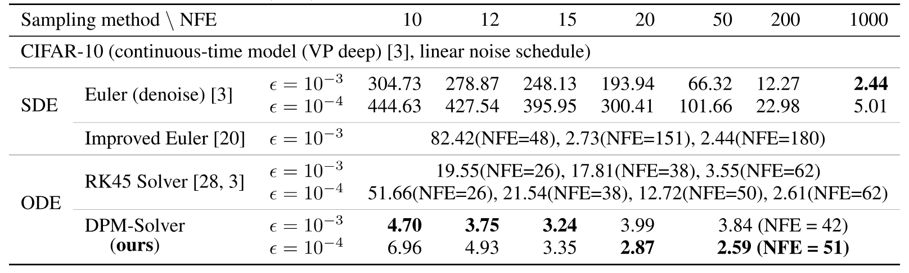

**表 3。** 関数評価回数（NFE）を変えたときの、連続時間手法による CIFAR-10 のサンプル品質（FID $\downarrow$）。

[表 3](#table-03) は [図 2(a)](#figure-02) に対応する詳細な FID を示す。[Son21] の公式コードと checkpoint（Apache License 2.0）および公開された「VP deep」型の「checkpoint_8」を用いる。$\epsilon=10^{-3}$ と $\epsilon=10^{-4}$ で比較した結果、拡散 SDE に基づく方法は前者、拡散 ODE に基づく方法は後者でより高い品質を得る。DPM-Solver は 15 NFE 未満では $\epsilon=10^{-3}$ が、15 NFE を超えると $\epsilon=10^{-4}$ がより良い FID を得る。

Euler 離散化した拡散 SDE では、[Son21] の PC sampler を「euler_maruyama」predictor、corrector なしで用い、$T$ と $\epsilon$ の間を一様時刻点にする。最終ステップには「denoise」技法を加え、$\epsilon=10^{-3}$ の FID を大幅に改善する。

改良 Euler 離散化 [Jol21] の拡散 SDE は、$\epsilon=10^{-3}$ の結果だけを含む原論文に従う。対応する相対許容誤差 $\epsilon_{rel}$ は順に $0.50$、$0.10$、$0.05$ である。

RK45 ソルバーによる拡散 ODE では [Son21] のコードを使い、atol と rtol を調整する。NFE の小さい順に、$\epsilon=10^{-3}$ では atol = rtol = $0.1$、$0.01$、$0.001$、$\epsilon=10^{-4}$ では $0.1$、$0.05$、$0.02$、$0.01$、$0.001$ とする。

DPM-Solver による拡散 ODE では、NFE $\leq 20$ なら [第 10.3 節](#section-10-3) の方法、それ以外では [第 9 節](#section-9) の適応的ステップ幅ソルバーを用いる。$\epsilon=10^{-3}$ では相対許容誤差 $\epsilon_{\text{rtol}}=0.05$ の DPM-Solver-12、$\epsilon=10^{-4}$ では同じ相対許容誤差の DPM-Solver-23 を用いる。

### 11.4 RK 法とのサンプル品質比較

[表 1](#table-01) に RK 法と DPM-Solver-2、3 の性能差を示す。本節では詳しい設定を記す。

次の ODE があるとする。

$$
\frac{\mathrm{d}\bm{x}_{t}}{\mathrm{d}t}=\bm{F}(\bm{x}_{t},t),
$$

時刻 $t_{i-1}$ の $\tilde{\bm{x}}_{t_{i-1}}$ から出発し、陽的中点法として知られる次の式で RK2 により時刻 $t_{i}$ の解 $\tilde{\bm{x}}_{t_{i}}$ を近似する。

$$
\begin{aligned}
 h_{i} & =t_{i}-t_{i-1}, \\
 s_{i} & =t_{i-1}+\frac{1}{2}h_{i}, \\
\bm{u}_{i} & =\tilde{\bm{x}}_{t_{i-1}}+\frac{h_{i}}{2}\bm{F}(\tilde{\bm{x}}_{t_{i-1}},t_{i-1}), \\
\tilde{\bm{x}}_{t_{i}} & =\tilde{\bm{x}}_{t_{i-1}}+h_{i}\bm{F}(\bm{u}_{i},s_{i}).
\end{aligned}
$$

また、提案する DPM-Solver-3 とよく似た「Heun の 3 次法」として知られる次の RK3 で、時刻 $t_{i}$ の解 $\tilde{\bm{x}}_{t_{i}}$ を近似する。

$$
\begin{aligned}
 h_{i} & =t_{i}-t_{i-1},\quad r_{1}=\frac{1}{3},\quad r_{2}=\frac{2}{3}, \\
 s_{2i-1} & =t_{i-1}+r_{1}h_{i},\quad s_{2i}=t_{i-1}+r_{2}h_{i}, \\
\bm{u}_{2i-1} & =\tilde{\bm{x}}_{t_{i-1}}+r_{1}h_{i}\bm{F}(\tilde{\bm{x}}_{t_{i-1}},t_{i-1}), \\
\bm{u}_{2i} & =\tilde{\bm{x}}_{t_{i-1}}+r_{2}h_{i}\bm{F}(\bm{u}_{2i-1},s_{2i-1}), \\
\tilde{\bm{x}}_{t_{i}} & =\tilde{\bm{x}}_{t_{i-1}}+\frac{h_{i}}{4}\bm{F}(\tilde{\bm{x}}_{t_{i-1}},t_{i-1})+\frac{3h_{i}}{4}\bm{F}(\bm{u}_{2i},s_{2i}).
\end{aligned}
$$

RK2（$t$）と RK3（$t$）では [式 2.7](#equation-2-7) の $\bm{F}(\bm{x}_{t},t)=\bm{h}_{\theta}(\bm{x}_{t},t)$ を、RK2（$\lambda$）と RK3（$\lambda$）では [式 E.1](#equation-e-1) の $\bm{F}(\hat{\bm{x}}_{\lambda},\lambda)=\hat{\bm{h}}_{\theta}(\hat{\bm{x}}_{\lambda},\lambda)$ を用いる。すべての実験で $t$ または $\lambda$ に関する一様ステップ幅を使う。

### 11.5 離散時間サンプリング手法とのサンプル品質比較

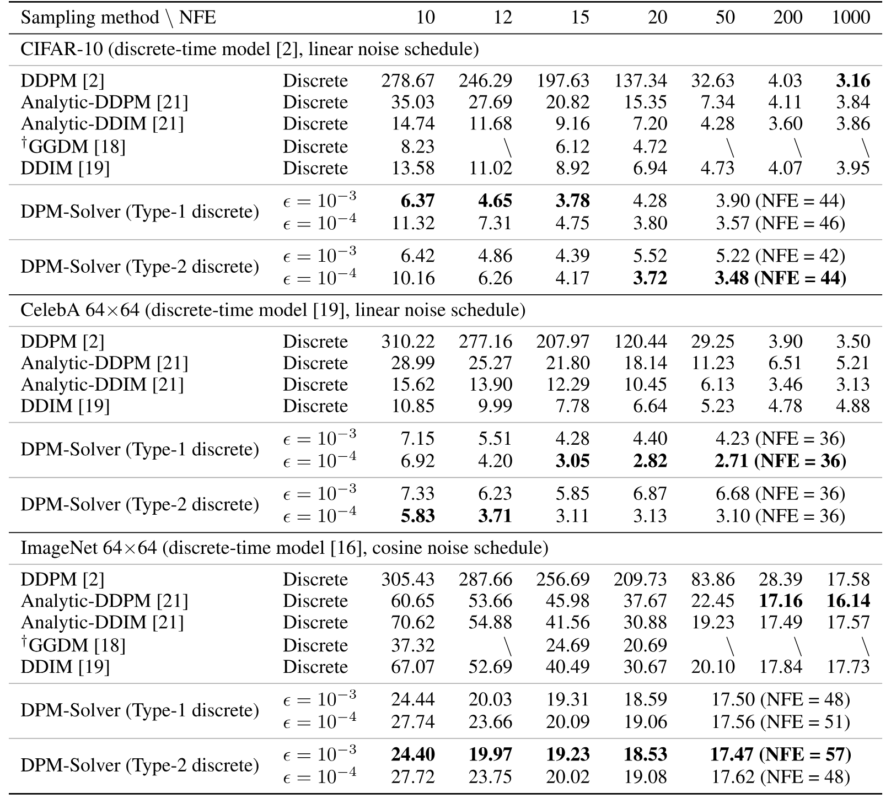

**表 4。** 関数評価回数（NFE）を変えたときの、離散時間 DPM による CIFAR-10、CelebA $64\times64$、ImageNet $64\times64$ のサンプル品質（FID $\downarrow$）。$^\dagger$GGDM は追加学習を必要とする。原論文にない結果は「$\backslash$」で表す。

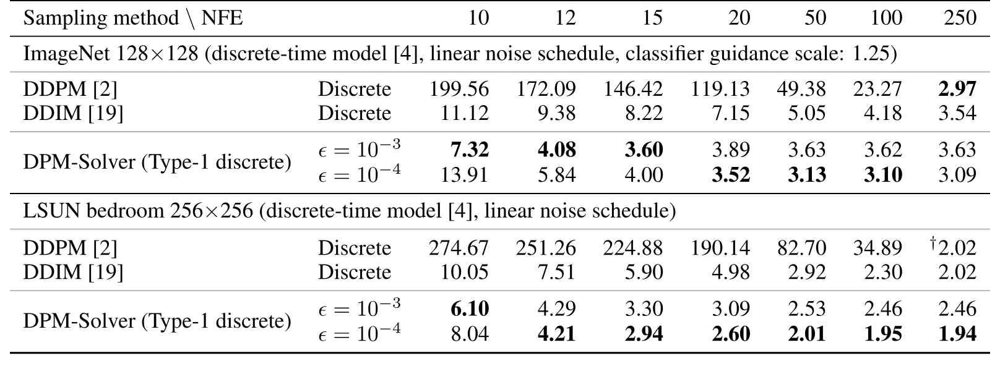

**表 5。** 関数評価回数（NFE）を変えたときの、分類器ガイダンス付き ImageNet $128\times128$ と LSUN bedroom $256\times256$ におけるサンプル品質（FID $\downarrow$）。DDIM と DDPM は、$^\dagger$ の実験で [Dha21] が調整した時刻点を使う場合を除き、一様時刻点を用いる。DPM-Solver は [第 10.3 節](#section-10-3) の一様 logSNR 時刻点を用いる。

[表 4](#table-04) と [表 5](#table-05) の通り、DPM-Solver をほかの離散時間 DPM サンプリング法と比較する。DDPM と DDIM には [Son21a] のコード（MIT License）、Analytic-DDPM と Analytic-DDIM には [Bao22] のコード（ライセンス不明）を使用する。GGDM [Wat22] は原論文の最良結果をそのまま用いる。

CIFAR-10 の実験では [Den20] の事前学習済み checkpoint を使う。これは [Son21a] の公開コードにも含まれる。DDPM と DDIM には、一様時刻点より FID が良い 2 次式の時刻点 [Son21a] を、Analytic-DDPM と Analytic-DDIM には一様時刻点を使う。DPM-Solver では Type-1 discrete と Type-2 discrete の双方で離散時間モデルを連続時間へ変換する。NFE $\leq 20$ では [第 10.3 節](#section-10-3) の方法、NFE $>20$ では [第 9 節](#section-9) の適応的ステップ幅ソルバーを用いる。すべての実験で相対許容誤差 $\epsilon_{\text{rtol}}=0.05$ の DPM-Solver-12 を使う。

CelebA 64x64 の実験では [Son21a] の事前学習済み checkpoint を使う。DDPM と DDIM には、一様時刻点より FID が良い 2 次式の時刻点 [Son21a] を、Analytic-DDPM と Analytic-DDIM には一様時刻点を使う。DPM-Solver では Type-1 discrete と Type-2 discrete の双方で離散時間モデルを連続時間へ変換する。NFE $\leq 20$ では [第 10.3 節](#section-10-3) の方法、NFE $>20$ では [第 9 節](#section-9) の適応的ステップ幅ソルバーを用いる。すべての実験で相対許容誤差 $\epsilon_{\text{rtol}}=0.05$ の DPM-Solver-12 を使う。CelebA 64x64 での最良 FID は 1000 ステップ DDPM を含む全手法を上回る。

ImageNet 64x64 の実験では [Nic21] の事前学習済み checkpoint（MIT License）を使う。[Son21a] に従い DDPM と DDIM に一様時刻点を使い、Analytic-DDPM と Analytic-DDIM にも一様時刻点を用いる。DPM-Solver では Type-1 discrete と Type-2 discrete の双方で離散時間モデルを連続時間へ変換する。NFE $\leq 20$ では [第 10.3 節](#section-10-3) の方法、NFE $>20$ では [第 9 節](#section-9) の適応的ステップ幅ソルバーを使う。すべての実験で相対許容誤差 $\epsilon_{\text{rtol}}=0.05$ の DPM-Solver-23 を用いる。ImageNet には実在の人物写真が含まれ、[Yan21e] が論じるプライバシー上の問題があり得る。

ImageNet 128x128 の実験では、[Dha21] の拡散モデルと分類器の事前学習済み checkpoint（MIT License）を使い、分類器ガイダンスでサンプリングする。[Son21a] に従い DDPM と DDIM には一様時刻点を使う。DPM-Solver では Type-1 discrete だけで離散時間モデルを連続時間へ変換する。NFE $\leq 20$ では [第 10.3 節](#section-10-3) の方法、NFE $>20$ では相対許容誤差 $\epsilon_{\text{rtol}}=0.05$ の適応的 DPM-Solver-12（[第 9 節](#section-9)）を用いる。すべての実験で分類器ガイダンス尺度を $s=1.25$ とする。これは [Dha21] で DDIM に最適な設定である（詳細は同論文の第 14 表）。

LSUN bedroom 256x256 の実験では [Dha21] の無条件事前学習済み checkpoint（MIT License）を使う。[Son21a] に従い DDPM と DDIM には一様時刻点を使う。DPM-Solver では Type-1 discrete だけで離散時間モデルを連続時間へ変換し、[第 10.3 節](#section-10-3) の方法を用いる。

### 11.6 異なる次数の DPM-Solver の比較

[表 6](#table-06) の通り、異なる次数の DPM-Solver のサンプル品質も比較する。$\lambda$ に関する一様時刻点を用いた DPM-Solver-1、2、3 と、NFE が 20 未満の場合の [第 10.3 節](#section-10-3) の高速版 DPM-Solver-fast を使う。離散時間モデルでは Type-2 discrete だけを比較するが、Type-1 の結果も同様である。

DPM-Solver-2 の実際の NFE は $2\times\lfloor\text{NFE}/2\rfloor$、DPM-Solver-3 では $3\times\lfloor\text{NFE}/3\rfloor$ であり、指定 NFE より小さくなることがある。この場合は ^†^ で示す。NFE が 20 未満なら高速版 DPM-Solver-fast は通常、単一次数の方法より優れる。NFE が大きいと DPM-Solver-3 は DPM-Solver-2 より、DPM-Solver-2 は DPM-Solver-1 より優れ、提案した収束率解析と一致する。

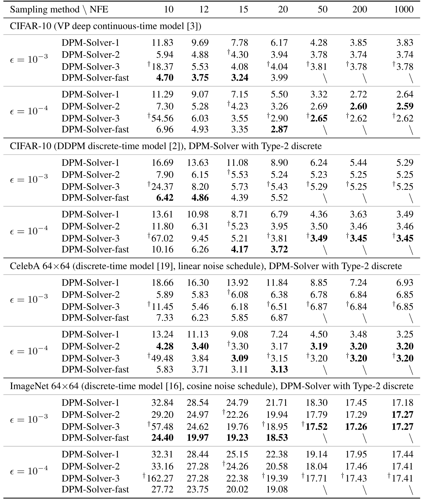

**表 6。** 関数評価回数（NFE）を変えたときの、異なる次数の DPM-Solver によるサンプル品質（FID $\downarrow$）。$^\dagger$ は指定 NFE が $2$ または $3$ で割り切れず、実際の NFE が小さいことを示す。大きな NFE では DPM-Solver-3 とほぼ同じになるため、DPM-Solver-fast は NFE が 20 未満の場合だけ評価する。

### 11.7 DPM-Solver と DDIM の実行時間比較

理論上、同じ NFE における DPM-Solver と DDIM の実行時間はほぼ等しく、NFE に線形である。主な計算コストは大規模ニューラルネットワーク $\bm{\epsilon}_{\theta}$ の逐次評価であり、ほかの係数は無視できるコストで解析的に計算されるためである。

[表 7](#table-07) は、データセットと NFE を変えたときの単一 NVIDIA A40 上での DPM-Solver と DDIM の実行時間を示す。正確な計測には torch.cuda.Event と torch.cuda.synchronize を使う。各データセットの離散時間事前学習済み拡散モデルを用い、8 バッチの実行時間から平均と標準偏差を求める。GPU メモリの制約から LSUN bedroom 256x256 はバッチサイズ 64、ほかは 128 とする。

DDIM には公式実装 [+2] を使う。DPM-Solver の実装では係数の重複計算を一部削減しているため、同じ NFE では公式 DDIM 実装よりわずかに速い。それでも評価結果では、同じ NFE における両者の実行時間はほぼ等しく、実行時間は NFE にほぼ線形である。したがって NFE の高速化率は実際の実行時間の高速化率にほぼ等しく、DPM-Solver は DPM のサンプリングを大幅に高速化できる。

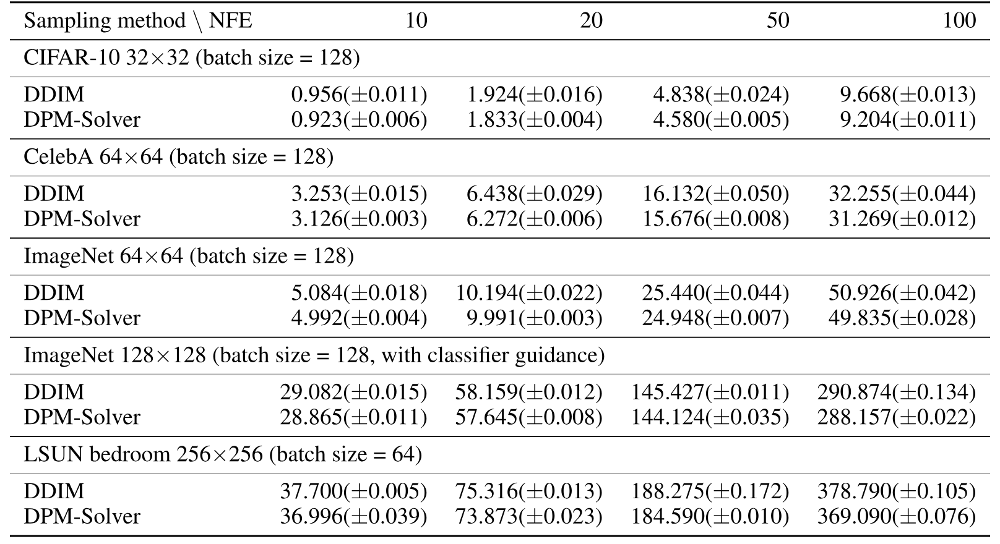

**表 7。** 関数評価回数（NFE）を変え、離散時間拡散モデルでサンプリングしたときの、単一 NVIDIA A40 上の DDIM と DPM-Solver の 1 バッチ当たり実行時間（秒 / batch、$\pm$std）。

### 11.8 ImageNet 256x256 における条件付きサンプリング

[図 1](#figure-01) の条件付きサンプリングでは、[Dha21] の分類器ガイダンス付き事前学習済み checkpoint（ADM-G）を使い、分類器尺度を $1.0$ とする。コードは MIT License である。DDIM には一様時刻点を、DPM-Solver には [第 10.3 節](#section-10-3) の高速版 DPM-Solver-fast を用い、10、15、20、100 ステップで評価する。

[図 3](#figure-03) に DDIM と DPM-Solver の条件付きサンプルを示す。15 NFE の DPM-Solver は 100 NFE の DDIM に匹敵するサンプルを生成できる。

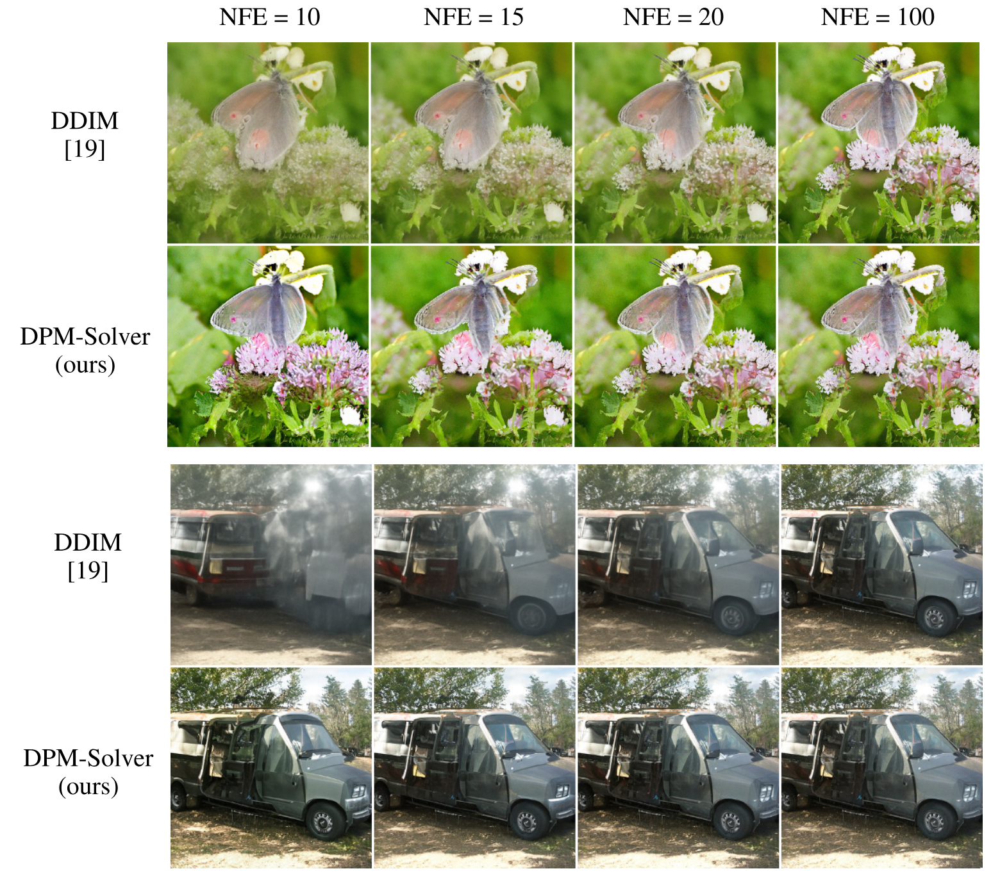

**図 3。** 分類器ガイダンス [Dha21] を備えた ImageNet $256\times256$ の事前学習済み DPM を用い、同じ乱数 seed で NFE を 10、15、20、100 とした DDIM [Son21a] と DPM-Solver（提案法）のサンプル。

### 11.9 追加サンプル

CIFAR-10、CelebA 64x64、ImageNet 64x64、LSUN bedroom 256x256 [Yu15a]、ImageNet 256x256 の追加サンプルを [図 4](#figure-04)～[図 8](#figure-08) に示す。

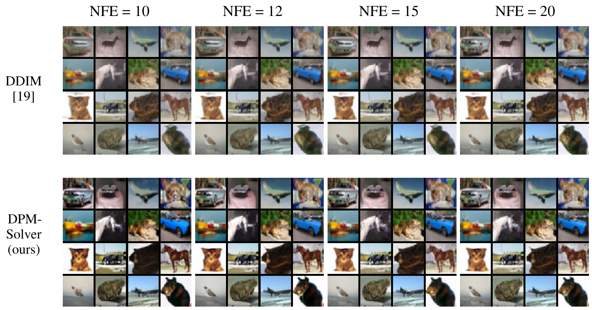

**図 4。** CIFAR-10 の事前学習済み離散時間 DPM [Den20] を用い、同じ乱数 seed で NFE を 10、12、15、20 とした DDIM [Son21a]（2 次式の時刻点）と DPM-Solver（提案法）のランダムサンプル。

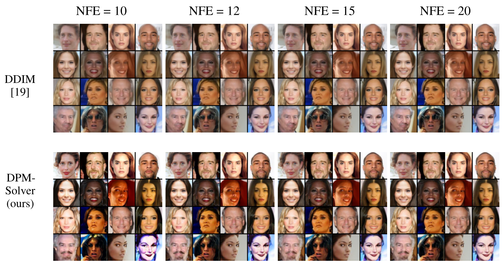

**図 5。** CelebA $64\times64$ の事前学習済み離散時間 DPM [Son21a] を用い、同じ乱数 seed で NFE を 10、12、15、20 とした DDIM [Son21a]（2 次式の時刻点）と DPM-Solver（提案法）のランダムサンプル。

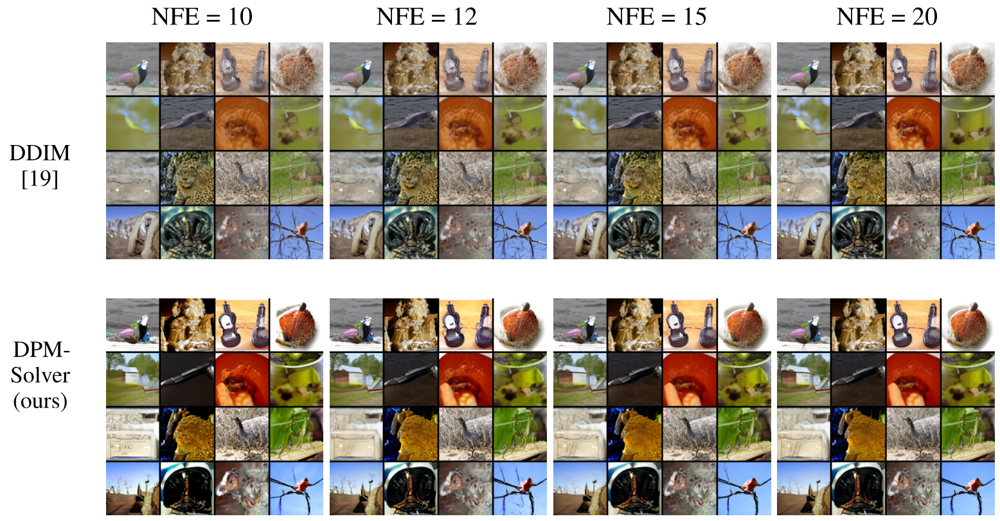

**図 6。** ImageNet $64\times64$ の事前学習済み離散時間 DPM [Nic21] を用い、同じ乱数 seed で NFE を 10、12、15、20 とした DDIM [Son21a]（一様時刻点）と DPM-Solver（提案法）のランダムサンプル。

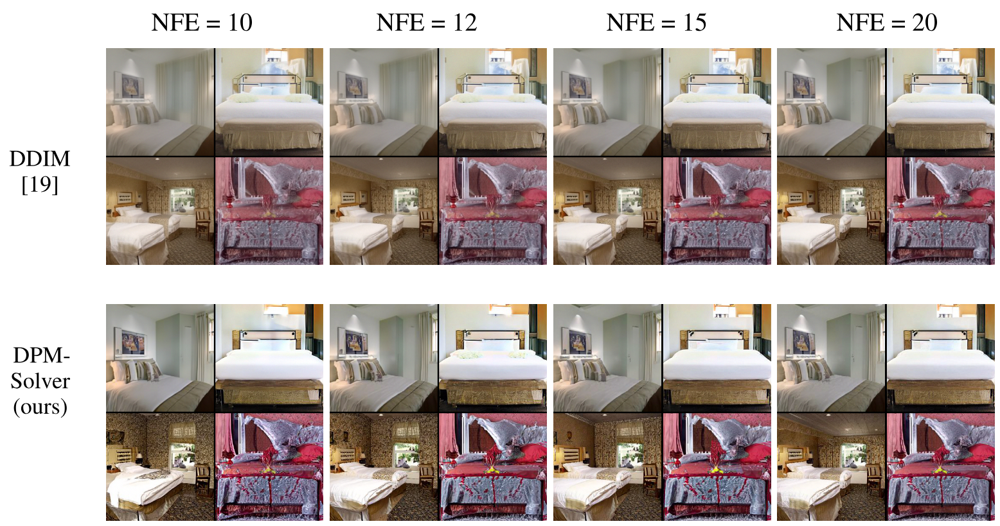

**図 7。** LSUN bedroom $256\times256$ の事前学習済み離散時間 DPM [Dha21] を用い、同じ乱数 seed で NFE を 10、12、15、20 とした DDIM [Son21a]（一様時刻点）と DPM-Solver（提案法）のランダムサンプル。

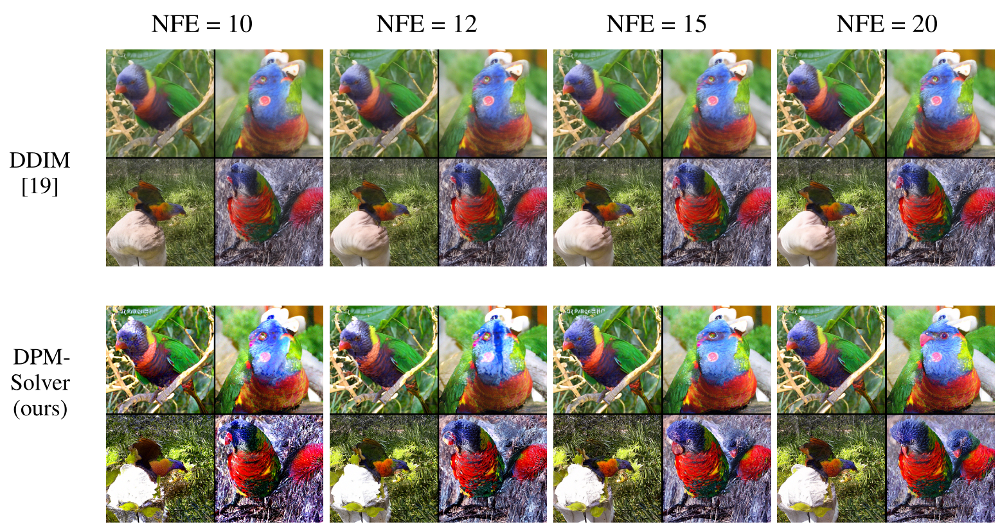

**図 8。** 分類器ガイダンス（分類器尺度 1.0）付き ImageNet $256\times256$ の事前学習済み離散時間 DPM [Dha21] を用い、同じ乱数 seed で NFE を 10、12、15、20 とした DDIM [Son21a]（一様時刻点）と DPM-Solver（提案法）のランダムなクラス条件付きサンプル（class 90、lorikeet）。

[+1]: コードは [https://github.com/LuChengTHU/dpm-solver](https://github.com/LuChengTHU/dpm-solver) で公開されている。

[+2]: [https://github.com/ermongroup/ddim](https://github.com/ermongroup/ddim)
