> [Hongyi Jin](https://dblp.org/pid/321/1565)、[Bohan Hou](https://spectrometerhbh.github.io/)、[Guanjie Wang](https://dblp.org/pid/166/5270.html)、[Ruihang Lai](https://ruihanglai.com/)、[Jinqi Chen](https://www.cs.cmu.edu/afs/cs.cmu.edu/Web/Posters/MSCSThesis-5-JinqiChen25.pdf)、[Zihao Ye](https://expye.com/)、[Yaxing Cai](https://dblp.org/pid/290/7679.html)、[Yixin Dong](https://github.com/Ubospica)、[Xinhao Cheng](https://www.csd.cs.cmu.edu/people/doctoral-student/xinhao-cheng)、[Zhihao Zhang](https://jackfram.github.io/)、[Yilong Zhao](https://ylzhao.me/)、[Yingyi Huang](https://mlsys26.flashinfer.ai/)、[Lijie Yang](https://derrickylj.github.io/)、[Jinchen Jiang](https://dblp.org/pid/307/3686.html)、[Gabriele Oliaro](https://www.gabrieleoliaro.com/)、[Jianan Ji](https://jiananji.me/)、[Xupeng Miao](https://hsword.github.io/)、[Vinod Grover](https://developer.nvidia.com/blog/author/vgrover/)、[Todd C. Mowry](https://www.cs.cmu.edu/~tcm/)、[Zhihao Jia](https://www.cs.cmu.edu/~zhihaoj2/)、[Tianqi Chen](https://tqchen.com/) 著。2026 年 4 月 14 日に arXiv へ初回投稿され、現行版は 2026 年 4 月 21 日改訂の v2 である。[Proceedings of Machine Learning and Systems 8 (MLSys 2026)](https://proceedings.mlsys.org/paper_files/paper/2026/hash/53d3f45797970d323bd8a0d379c525aa-Abstract-Conference.html) に掲載。本閲覧版は [*Event Tensor: A Unified Abstraction for Compiling Dynamic Megakernel*](https://arxiv.org/abs/2604.13327v2) を転記したもので、<a href="/paper/event-tensor.pdf" target="_blank" rel="noopener noreferrer">原 PDF</a>、[arXiv DOI](https://doi.org/10.48550/arXiv.2604.13327)、[TeX ソース](https://arxiv.org/src/2604.13327v2)も参照できる。厳密な印刷レイアウトと参考文献については、原 PDF を正本とする。

## 概要

現代の GPU ワークロード、とりわけ大規模言語モデル（LLM）の推論では、カーネル起動オーバーヘッドと粗粒度の同期がカーネル間並列性を制限している。近年のメガカーネル技術は、複数の演算子を単一の永続カーネルへ融合し、起動間の空白をなくしてカーネル間並列性を引き出すが、実際のワークロードに見られる動的形状やデータ依存計算の扱いには課題が残る。本稿では、動的メガカーネルのための統一コンパイラ抽象 *Event Tensor* を提案する。Event Tensor はタイル化されたタスク間の依存関係を符号化し、形状依存とデータ依存の動的性質をいずれも第一級の機能として扱える。この抽象の上に構築した Event Tensor Compiler（ETC）は、静的および動的スケジューリング変換によって高性能な永続カーネルを生成する。評価の結果、ETC はシステムのウォームアップ負荷を大幅に減らしながら、最先端の LLM サービング遅延を達成した。

## 1 はじめに

機械学習（ML）アプリケーションを効率よく展開するには、遅延を最小化し、ハードウェア利用率を最大化する必要がある。そのため、システム性能最適化 [Kwo23, Zhu25c, Ye25, Zho24] は重要な研究分野となっている。GPU の速度と並列性が向上し続けるなか、従来の GPU スケジューリングモデルに存在する複数のシステムオーバーヘッドが、エンドツーエンド効率を制約する主要なボトルネックとして顕在化している。

第 1 のオーバーヘッドはカーネル起動に由来する。PyTorch [Pas19a] などの現行システムは、ホスト CPU から GPU カーネルを逐次起動する（[図 1](#figure-01)、左上）。LLM 推論では、自回帰デコーディングの各ステップに数百から数千もの細粒度演算が含まれ、起動オーバーヘッドを十分に償却できないことがある。1 回のカーネル起動には通常 5–10 $\mu$s の遅延がかかる一方、最速のカーネルは 2 $\mu$s で完了するため、起動オーバーヘッドが支配的になる。

第 2 のオーバーヘッドは、連続するカーネル間に暗黙の同期を強制するカーネル境界に由来する。後続のカーネルが先行カーネルの結果の一部にしか依存しない場合は多く、原理的には両者を重ね合わせたりパイプライン化したりしてスループットを向上できる。しかし、カーネル間の境界がこのような細粒度のカーネル間並列性を妨げ、大きな性能余地を残している。

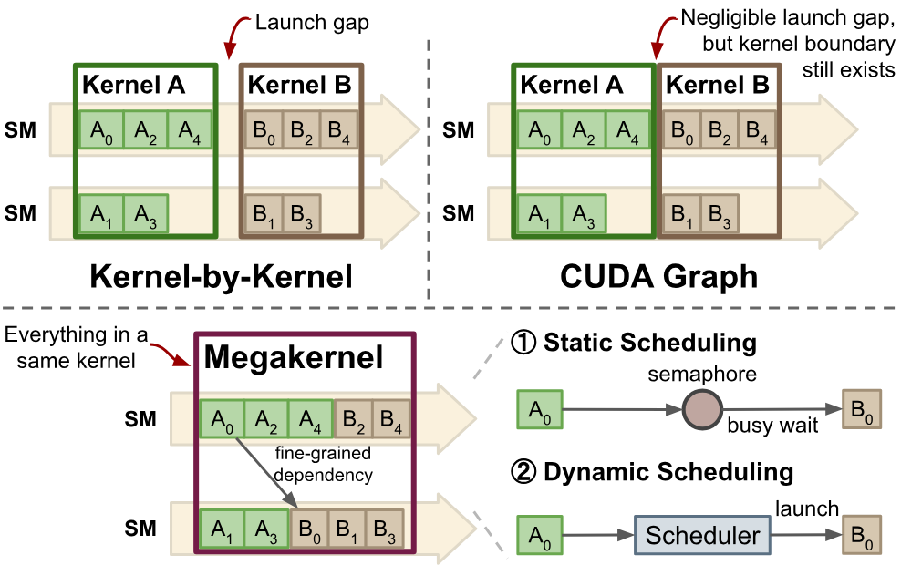

**図 1.** GPU スケジューリングモデルの比較。カーネル単位および CUDA Graph のスケジューリングモデルは、粗粒度の逐次実行を強制する。メガカーネルは演算を小さなタスクへ分割し、カーネル間並列性を実現する。

**図 2.** Event Tensor 抽象の概要。計算グラフ（左）はタイル化された演算子（*タスク*）に分割され、Event Tensor はタスク間の細粒度依存関係を、シンボリックな形状を持つ第一級オブジェクトとして表現する。これにより、LLM サービングに本質的な主な動的性質を扱う。形状の動的性質：タイル化テンソルと Event Tensor は、動的バッチサイズ **B** のようなシンボリック次元を持つ。データ依存の動的性質：右側の MoE 層は、依存関係を実行時に解決する方法を詳しく示す。データ依存の更新とトリガー（黄色の矢印）は、`topk` や `exp_indptr` など実行時に計算される値を用いてタスク実行を動的に管理する。

これらの制約を部分的に解決しようとする試みはいくつか行われてきた。まず、多くのシステムは CUDA Graphs [Gra19]（[図 1](#figure-01)、右上）のような実行時技術を採用し、固定されたカーネル列をキャプチャして再生することでカーネル起動オーバーヘッドを減らしている。しかし、CUDA Graphs はカーネル境界を残すため、カーネル間並列性を引き出せない。

より最近では、*メガカーネル* 最適化 [Spe25, Che25ae] が有望な代替手段として登場した（[図 1](#figure-01)、下）。中心となる考え方は、複数の演算子を単一の永続カーネルへ融合し、カーネル起動オーバーヘッドをなくしてカーネル間並列性を可能にすることである。各演算子は、細粒度の計算タイル、すなわち *タスク* に分解され、ストリーミングマルチプロセッサ（SM）へ分配される。タスクとその依存関係はタスクグラフを形成し、軽量な実行時シグナリングが実行を調整することで、依存関係を保ちながら並行性を最大化する。

有望ではあるものの、LLM 推論ワークロードへメガカーネルを導入するには、主に二つの課題がある。

**動的性質の課題。** 現代の LLM サービングワークロードは本質的に動的である。継続的バッチ処理の導入により、システムは可変入力形状を扱わなければならない。このような動的形状を単一のメガカーネルで支えるのは難しく、考え得る形状ごとにカーネルを再生成または再コンパイルしなければならない場合が多い。これは許容しがたい起動遅延を招き、形状候補の空間が大きすぎる場合には実現不能になり得る。さらに、Mixture-of-Experts（MoE）のようなモデルには、専門家ルーティングなどデータ依存の制御フローがあり、演算子間並列性を生かすには細粒度のタスク依存関係を動的に追跡する必要がある。既存手法には、このような細粒度のデータ依存関係を表現する抽象がない。とりわけ、この問題はメガカーネル固有ではない。実行時の動的性質は CUDA Graphs のような従来手法にも大きな困難をもたらし、動的形状ごとに CUDA Graphs を再キャプチャして管理する作業は、本番 LLM サービングシステムの主要な悩みとなっている。こうした動的性質の課題は、リアルタイムのエージェントワークフローや対話型コーディング支援のような、新しい遅延重視の用途で特に重要である。これらでは低バッチ推論が中心であり、リクエストごとの遅延を減らすにはカーネル間並列性が欠かせない。

**プログラマビリティの課題。** メガカーネルのプログラミングには相当な複雑さが伴う。開発者はタスク間の複雑な細粒度依存関係を考慮する必要があり、誤りやすく保守も難しい。形状依存およびデータ依存の動的性質が、この作業をさらに複雑にする。また、ワークロードによっては複数のタスク管理戦略が望ましい。たとえば、*静的スケジューリング* はカーネル起動前に各 SM へ所定のタスクキューを割り当て、*動的スケジューリング* は GPU 上のスケジューラを用いて実行時に準備済みタスクをディスパッチする。理想的には、開発者はカーネル全体を実装し直さずにこれらの戦略を選択、または組み合わせ、ワークロードに応じたスケジューリングを行えるべきである。

本稿では、動的メガカーネルのコンパイルと実行を簡潔にする抽象 **Event Tensor**（[図 2](#figure-02)）を提案する。ここで *イベント* とは、GPU の SM 粒度で一組のタスクが完了したことを表すプリミティブである。メガカーネルは演算子を多数のタイルレベルタスクへ分割するため、それに対応する同期イベントはデータテンソルに似た多次元構造を自然に形成する。*Event Tensor* はそのようなイベントの多次元配列であり、メガカーネル内部の細粒度同期を、簡潔な第一級表現として提供する。セマフォを用いた同期自体は周知のプリミティブだが、本研究の中心的な新規性は、これらのプリミティブをコンパイラ IR の第一級テンソルへ引き上げた点にある。イベントをテンソル形式へ統一することで、Event Tensor は既存のコンパイラが持つシンボリック形状の支援 [Ans24, Lai25a] を利用し、テンソル次元をシンボリックなまま保って動的形状計算を簡潔に表現できる。さらに、Event Tensor はタスク座標をイベント座標へ写像する添字式により、データ依存の動的性質を表現する。この抽象に基づき、ETC は依存関係を高度に最適化された永続メガカーネルへ自動変換し、従来は手作業の専用実装を要した最適化を一般化する。

Event Tensor 抽象を土台として、演算子の融合とスケジューリングを自動化し、カーネル間並列性を得る体系的なコンパイラパイプラインを開発した。明示的な演算子と Event Tensor で注釈された計算グラフから出発し、コンパイラは一連のスケジューリング変換を適用して、プログラムを実行可能なメガカーネルへ低位化する。これらの変換は、完全に静的な実行から動的に負荷分散する実行まで、同期オーバーヘッドと実行時適応性の異なるトレードオフを表す複数のスケジューリング戦略を支える。従来は手作業で行っていた融合や専用スケジューリング技法 [Spe25, Che25ae] をコンパイラ変換へ統一することで、ETC はメガカーネル構築の工数を大きく減らしつつ、実行性能を高める。

多様な LLM サービングワークロードで ETC を評価し、CUDA Graphs、Programmatic Dependent Launch（PDL）、`torch.compile` など積極的な最適化をすでに利用する、競争力の高い産業水準のベースライン（vLLM や SGLang など）と比較した。結果として、ETC は実行時のグラフ再キャプチャや再コンパイルを必要とせず、形状依存とデータ依存の動的性質を効率よく扱いながら、これらのシステムを大幅に高速化した。テンソル並列ワークロードでは、コンパイラが計算と通信を重ね合わせることで、融合 GEMM＋Reduce-Scatter カーネルを最大 1.40x 高速化した。MoE のようなデータ依存ワークロードでは、メガカーネルが専用ライブラリを最大 1.23x 上回った。動的形状かつ低バッチの推論では、高度に最適化された推論システムと同等以上の性能を達成し、エンジンのウォームアップ負荷を最大 3.5x 削減した。このような強力なベースラインに対する中程度の高速化であっても、データセンター規模では大きな経済価値につながる。速度だけでなく、ETC は動的ワークロードに対して真の事前（AOT）コンパイルを実現し、実行時コンパイルの負荷と、CUDA Graph の反復再キャプチャを管理する複雑さを完全に取り除く。後者は本番サービングシステムにおける大きな問題である。さらに ETC は、複雑でデータ依存のサブグラフ（MoE 層、GEMM＋通信など）のメガカーネル融合を自動化し、既存のサービングエンジンと組み合わせられる性質を保ちながら、プログラミングの複雑さを大きく減らす。ETC は主要なオープンソースシステムの一つに導入されている。Event Tensor 抽象の簡潔さと汎用性、ならびに付随するコンパイラフレームワークは、より広い機械学習システムとコンパイラのコミュニティにも有益である。

## 2 Event Tensor 抽象

### 2.1 言語構成要素

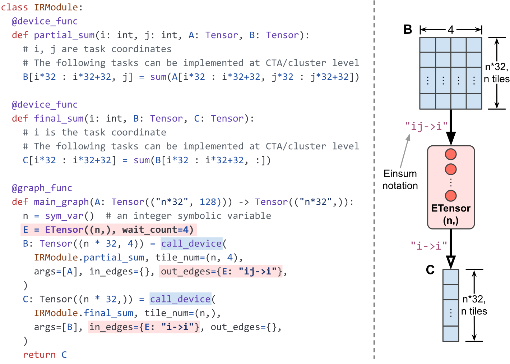

**図 3.** Event Tensor に基づくプログラムの例。

まず、Event Tensor に基づくプログラムの主要な言語構成要素を説明する。

**デバイス関数。** デバイス関数は、GPU 上で並列起動されるタスクのグリッドを定義する。各起動は多次元座標でパラメータ化され、それぞれの座標がストリーミングマルチプロセッサ（SM）上で実行されるタスクタイルを識別する。各タスクには、warp specialization や Tensor Core 呼び出しなどの専用ロジックを含められる。

**Event Tensor。** Event Tensor は多次元構造であり、その要素はイベント、すなわち SM レベルでのタスク集合の完了を表す。これは並列プログラミングシステムで確立された慣行 [Blu95, Tre14, Bau12, Dag98] に従う。各要素には依存するタスク数を記録する初期待機カウントがあり、複数の操作を支える。`E[i].notify()` はタスクの完了を通知し、`E[i].wait()` はイベントがトリガーされるまでブロックする。動的スケジューリングでは、イベントから依存タスクをトリガーすることもできる。独立したイベントを一つずつ管理する手法と比べ、実際の LLM 推論ワークロードで数百万の細粒度イベントまで拡張する際、Event Tensor はタスクグラフ管理の負荷を大幅に削減する。

**グラフ関数。** グラフ関数は、指定したタスク形状でデバイス関数を明示的に起動する `call_device` 呼び出しからなる計算グラフを表す。従来の計算グラフと異なり、データテンソルと Event Tensor の両方を含む。各デバイス関数の起動には、明示的な入出力依存関係と座標写像を注釈でき、Event Tensor を通じて細粒度のタスク関係を追跡する。

[図 3](#figure-03) は Event Tensor に基づくプログラムの例である。一般のプログラムは、「生産側タスク $\rightarrow$ イベント $\rightarrow$ 消費側タスク」という形でタスクグラフを簡潔に表したものと捉えられる。イベントとタスクの関係は汎用ラムダ関数で表す。[+1] これらの依存関係注釈は、各生産側タスクの末尾でのイベント通知と、各消費側タスクの先頭での待機へ暗黙に対応する。この記法は大半の用途に十分であることが分かった。重要な点として、デバイス関数が Event Tensor を明示的に引数として受け取り、各タスク内でイベントの通知と待機を呼び出すことも認めている。デバイス関数における Event Tensor の第一級サポートにより、高度な用途を表現できる。さらに、次節で詳しく述べる明示的な融合最適化を、表現内部の変換として扱える。

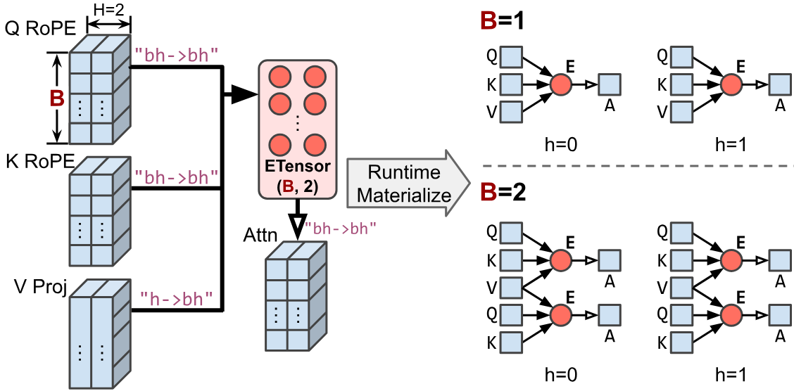

**図 4.** **Event Tensor はシンボリック形状テンソルによって形状の動的性質を扱う。** これらのテンソルは依存グラフのテンプレートを定義する。実行時には、テンプレートが具体的な形状値でインスタンス化される（たとえばバッチサイズ 1 なら $1\times 2$ グラフ、バッチサイズ 2 なら $2\times 2$ グラフを生成する）。再コンパイルや反復グラフキャプチャは不要である。

### 2.2 細粒度依存関係の表現

Event Tensor の実際の使い方を示すため、[図 3](#figure-03) の例を順に見ていく。このタスクグラフは、シンボリック形状 $(n\times 32,128)$ を持つ入力テンソル $A$ の内側軸について総和 $C[i]=\sum_{k\in[0,128)}A[i,k]$ を計算する。例では split-K アルゴリズムを採用し、総和を $B[i,j]=\sum_{k\in[j*32,j*32+32)}A[i,k]$ と $C[i]=\sum_{k\in[0,4)}B[i,k]$ の 2 段階に分ける。第 1 段階は各行の部分和を $B$ に計算し、第 2 段階でそれらを集約して $C$ を得る。従来のカーネル単位の手法では、第 1 段階の全タスクが完了してから第 2 段階のタスクが起動される。しかし、各出力行 $C[i]$ は対応する行 $B[i,:]$ にしか依存しないため、その計算は別の行の部分和と並行して進められる。この細粒度依存関係を捉えるため、$B$ と $C$ の計算をさらに細かいタスクへ分割し、Event Tensor $E$ を導入する。

$$
\begin{aligned}
\text{タスク }\hat{B}_{i,j}: && B[i*32:i*32+32,j], \\
\text{イベント }E_{i}: && E[i], \\
\text{タスク }\hat{C}_{i}: && C[i*32:i*32+32].
\end{aligned}
$$

タスクを分割すると、依存関係は $\hat{B}_{i,j}\rightarrow E_{i}$（$\hat{B}_{i,j}$ が $E_{i}$ を生成）および $E_{i}\rightarrow\hat{C}_{i}$（$\hat{C}_{i}$ が $E_{i}$ を消費）となる。各 $E_{i}$ は、行 $32*i$ から始まる $B$ の連続 32 行の完了に対応する。

`main_graph` 関数は計算全体を記述し、プリミティブ `call_device` がまず `partial_sum` 関数を、続いて `final_sum` 関数を起動する。`partial_sum` と `final_sum` のタスク間依存関係は、`out_edges` と `in_edges` の引数で指定する。

### 2.3 動的形状の第一級サポート

Event Tensor に基づくグラフは、並列システムにおけるタスクグラフ表現 [Tre14] を、より簡潔にしたものと見なせる。従来の表現では、イベント要素とタスクを個別のノードとエッジとして明示し、実行時にタスクグラフとして具体化する。これに対して本手法では、単一テンソルで数千のイベントを表現できる。Event Tensor 表現には、シンボリック次元を第一級の機能として導入できる利点もある。たとえば Event Tensor の形状に、バッチサイズやシーケンス長などのシンボリック変数を含められる。シンボリック形状の Event Tensor グラフは、実行時に異なるタスクグラフ（[図 4](#figure-04)）へ対応する汎用テンプレートとなる。この表現により、CUDA Graph のような静的タスクグラフシステムの制約を克服し、複数の形状に対応する動的形状 Event Tensor グラフを、再コンパイルや反復グラフキャプチャなしで *事前に* 最適化できる。したがって、動的形状ワークロードをより柔軟に扱える。

### 2.4 データ依存の動的性質への対応

**図 5.** **Event Tensor はデータ依存の動的性質を扱う。**（a）静的依存関係を持つ規則的なワークロード。（b）実行時テンソル `topk` と `exp_indptr` が不規則なタスクグラフを定義し、データ依存のイベント更新とタスクトリガーを可能にする MoE ワークロード。

現代のワークロードにおける重要な課題は、不規則でデータに依存するタスクグラフを扱うことである。代表例は Mixture-of-Experts（MoE）層 [Sha17] であり、入力トークンは実行時に計算されるルーティング決定に基づき、異なる専門家サブネットワークへ動的に送られる。効率的な MoE 実装では、一般にトークンを割り当て先の専門家ごとにまとめ、GroupGEMM 演算子を使って各グループ内の全トークンの結果を計算する。

動的ルーティングは、コンパイル時には分からない細粒度かつデータ依存のタスク関係を生む。具体的には、各専門家のどの GroupGEMM タイルがどのトークンを処理するかという関係である。依存関係が固定された静的タスクグラフを仮定する従来のコンパイラやスケジューラにとって、この動的性質は大きな課題となる。このような動的ワークロードを効率よく表現するには、（1）各消費側タスクがどのタスクに依存するかを実行時に決定し、（2）実行時データに基づいて可変数の消費側タスクをトリガーできる抽象が必要である。Event Tensor 抽象はまさにこの目的に合わせて設計されている。二つの中心的な仕組みにより、データ依存タスクグラフを管理する。

**データ依存イベント更新。** 静的依存関係しか扱えない従来のタスクグラフ（[図 5](#figure-05)a）と異なり、Event Tensor 抽象は動的イベント依存関係（[図 5](#figure-05)b）を扱える。MoE の例では、`topk` テンソルに格納された実行時ルーティング決定により、どのグルーピングタイル（トークンごとに一つ）が、どのイベント（専門家ごとに一つ）を更新するかが決まる。各専門家のイベントカウンタは、その専門家へルーティングされたトークン数で初期化される。この初期化は `topk` の計算とともに実行時に動的に行われる。

**データ依存タスクトリガー。** 同様に、一つのイベントから実行時に決まる数のタスクをトリガーできる。`topk` のルーティング決定に基づき、各専門家が処理すべきトークン数と、それに必要な GroupGEMM タイル数を計算できる。[図 5](#figure-05)b のように、この情報はテンソル `exp_indptr` へ符号化され、専門家ごとにトリガーする GroupGEMM タイル数の累積和を格納する。[+2] `exp_indptr` によりデータ依存トリガーを実現し、専門家 `i` は範囲 `(exp_indptr[i], exp_indptr[i+1])` のタイルを有効化する。

この二つの仕組みにより、静的タスクグラフでは扱いにくい高度に動的なワークロードへ効率よく適応するメガカーネルを、コンパイラが生成できる。前述のシンボリック形状サポートと合わせて、ETC のコンパイルはすべてオフラインで行われる。推論時にはコンパイル済みバイナリが、コンパイル負荷なしで形状依存とデータ依存の動的性質をともに処理する。

依存関係全体は、厳密なフィードフォワード連鎖（[図 2](#figure-02)、右）、すなわち Attention Output $\rightarrow$ Token Routing (TopK) $\rightarrow$ Token Grouping $\rightarrow$ Token Computation (GroupGEMM) のままである点に注意されたい。TopK の計算は先行する Attention の出力だけに依存し、これは標準的な静的依存関係である。前述のデータ依存 Event Tensor の仕組みが対象とするのは後続段階だけであり、ルーティング結果が、どのグルーピングタスクからどの専門家イベントへ通知するか、また各専門家がいくつの GroupGEMM タイルをトリガーするかを動的に決める。

## 3 Event Tensor のコンパイル

本節では、提案した Event Tensor 抽象を利用する ETC の最適化について説明する。

### 3.1 静的スケジューリングと変換

静的スケジューリングは、タスクを事前にストリーミングマルチプロセッサ（SM）へ明示的に分配することで、複数のデバイス関数を融合する。その結果、各タスクは特定の SM のタスクキューへあらかじめ割り当てられる。タスク依存関係は、カウンタ型セマフォやイベントによりトリガーされる待機など、低位の同期プリミティブで管理する。この手法は同期オーバーヘッドを最小限に抑え、SM の分割を事前に最適化できる予測可能なワークロードに特に有効である。

**図 6.** 静的スケジューリング変換前後の GEMM＋Reduce-Scatter。二つの独立したデバイス関数を単一の永続関数へ融合し、Event Tensor に対する明示的な `notify` と `wait` の呼び出しで依存関係を調整する。

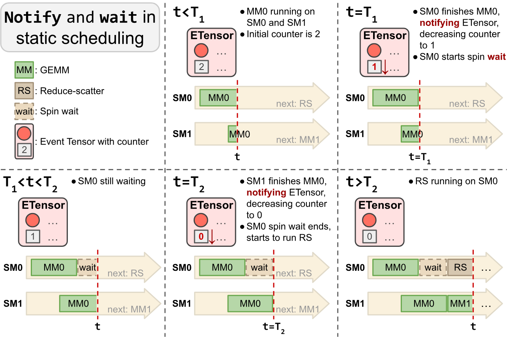

**図 7.** 静的スケジューリングの通知・待機機構。

ETC では、三つの主要ステップで静的スケジューリング変換を実装する（[アルゴリズム 1](#algorithm-01)）。（1）ホスト上で SM ごとの実行キューを構築する。（2）各 SM が再起動なしでタスクを連続実行できる永続メインループを生成する。（3）Event Tensor の依存関係を明示的な `notify()` と `wait()` の呼び出しへ低位化し、細粒度の実行順序を保証する。[図 6](#figure-06) は、テンソル並列実行の基礎となる GEMM＋Reduce-Scatter についてこの処理を示す。デバイス関数を単一の永続カーネルへ融合し、そのメインループが `tile_scheduler` の事前計算キューからタスクを連続して取得する。GEMM タスクの末尾では `notify()` を発行し、Reduce-Scatter タスクの先頭では `wait()` を発行する。

[図 7](#figure-07) は、静的に融合した GEMM（MM）＋Reduce-Scatter（RS）カーネルが実際に動作する様子を示す。各 RS タスクは二つの MM タスクに依存する（RS タイルの大きさが MM タイルの 2 倍である）ため、各イベントの初期カウントは 2 である。$T_{1}$ で SM0 上の MM0 が完了して Event Tensor へ通知し、カウントを 1 に減らす。SM0 で次に静的スケジュールされた RS タスクはまだ進めず、スピン待機状態に入る。$T_{1}$ から $T_{2}$ の間、SM1 は MM0 の実行を続けて GPU を稼働させる。$T_{2}$ で SM1 上の MM0 が完了すると、カウントが 0 になり依存関係が満たされる。RS タスクは待機ループから解放され、SM0 で実行を開始する。

**アルゴリズム 1：ETC における静的スケジューリング変換。**

- **入力：** Event Tensor の依存関係を持つタイルレベルのデータフローグラフ `G` を含むモジュール `mod`。
- **出力：** 融合され、静的にスケジュールされたメガカーネルを持つ更新済みモジュール。
- `mod_updated` $\leftarrow$ `mod.Copy()`。
- `static_schedule` $\leftarrow$ `GenerateStaticSchedule(G)`。
- `fused_kernel` $\leftarrow$ `NewPersistentKernel()`。
- 事前計算したスケジュールをグローバルメモリへ埋め込む。
- `fused_kernel.AddBuffer(static_schedule)`。
- `G` 内のすべての `task_grid` について：
  - `fused_kernel.AddDispatchLogic(task_grid)`。
  - `task_grid.in_edges` 内のすべての `event` について：
    - `fused_kernel.AddWaitLogic(event)`。
  - `fused_kernel.AddTileLogic(task_grid)`。
  - `task_grid.out_edges` 内のすべての `event` について：
    - `fused_kernel.AddNotifyLogic(event)`。
- `mod_updated.Replace(G, fused_kernel)`。
- **返却：** `mod_updated`。

通常の静的スケジューリングは、動的ワークロードを自然には扱えない。形状の動的性質を扱うため、代表的な形状の集合をサンプリングし、未観測の形状には次に大きいサンプル値の実行キューを再利用する。データ依存の動的性質を扱うため、関連する `notify()` と `wait()` を `E[0].notify()` と `E[0].wait()` へ書き換え、Event Tensor の更新とトリガーを最悪ケースとして保守的に仮定する。簡単のため、実行キューはラウンドロビン方針で構築する。

### 3.2 動的スケジューリングと変換

**図 8.** 動的スケジューリング変換後の GEMM＋Reduce-Scatter。タスク `push` と `pop` が挿入され、スケジューラがタスク実行を動的に調整する。

タスク実行時間が予測不能な場合、動的スケジューリングは SM 間の負荷分散を改善する。ETC は軽量な GPU 上タスクスケジューラを用いて、Event Tensor に基づく動的スケジューリングを実装する。依存する全タスクが完了してイベントがトリガーされると、そのイベントは関連するすべての消費側タスクをアトミックにスケジューラへ **push** し、実行可能として印を付ける。空いている任意の SM が、実行可能なタスクをアトミックに **pop** して実行できる。

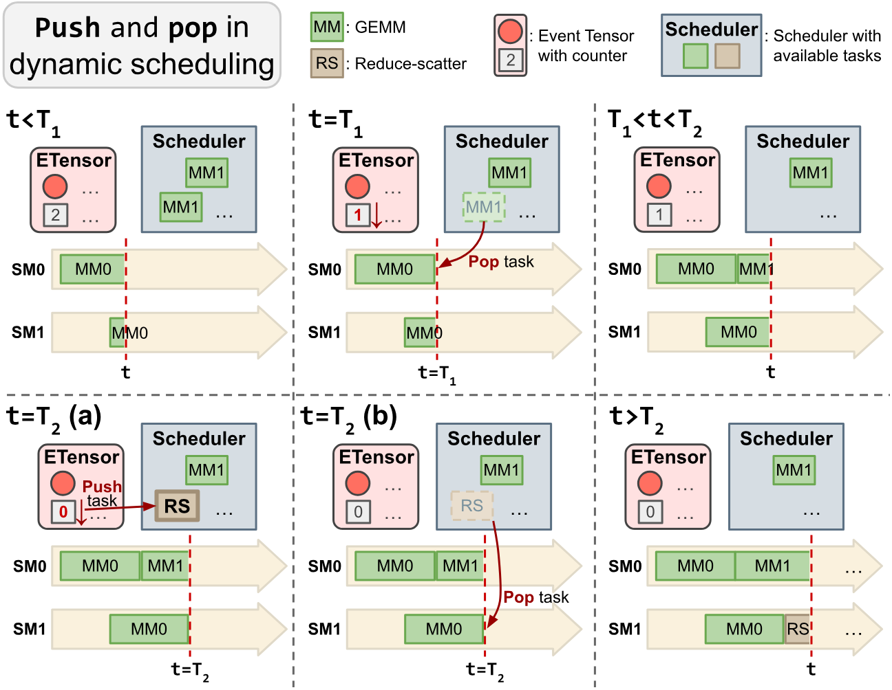

**図 9.** 動的スケジューリングの push・pop 機構。

コンパイラには動的スケジューリング変換を実装した [+3]。[図 8](#figure-08) は、[第 3.1 節](#section-3-1) で述べた同じ GEMM（MM）＋Reduce-Scatter（RS）の例について、変換後のコードを示す。[図 9](#figure-09) は push–pop 機構を示す。$T_{1}$ で SM0 上の MM0 が完了してイベントカウンタを 1 に減らすと、空いた SM0 はただちに実行可能なタスク（MM1）をスケジューラから pop する。$T_{2}$ で SM1 上の MM0 が完了すると、カウンタが 0 となり、RS タスクがスケジューラへ push される。SM1 はその RS タスクを pop し、実行を開始する。依存関係の追跡とタスクのディスパッチはすべて GPU 上で効率よく進み、ホストで事前計算したタスクキューを必要としない。

動的スケジューリングは、両方の動的性質を本質的に支える。タイルの実行順序は、シンボリック形状値と実行時値がスケジューラによってすでに解決された実行時に、その場で決まるためである。push-pop インターフェースの実装には、全 SM が共有するグローバルメモリ上の集中キューを用いる。実装が簡潔になるためこの設計を選んだが、大規模化に伴う競合の可能性は認識している。動的スケジューラの実行時最適化については [第 11 節](#section-11) でも論じる。

**静的スケジューリングと動的スケジューリングのトレードオフ。** 両者の選択には古典的なトレードオフがある。静的スケジューリングはスケジューリング負荷が最小で、予測可能なワークロードに適する。一方、動的スケジューリングは、データ依存の動的ワークロードや予測不能なタスク完了時間に柔軟に対応し、タスクキューへの push と pop による小さな実行時負荷と引き換えに、自然な負荷分散を実現する。

### 3.3 最小ランタイムへの低位化

本コンパイラの静的および動的スケジューリングにより、低位のタスク依存関係とその処理を変換後のプログラムへ直接封入できるため、対応するランタイム支援は最小限で済む（[図 10](#figure-10)）。具体的には、各 Event Tensor を整数テンソルへ低位化し、既存のテンソルデータ構造を再利用することで、イベント専用の実行時データ構造を不要にする。この整数テンソル上の `notify()` と `wait()` は、効率的なハードウェアアトミック演算で実装する。`notify()` はアトミック減算を行い、`wait()` はカウンタが 0 になるまでスピン待機する。実行時のデータ状態は、これらの整数テンソルとスケジューラのタスクキューだけで構成される。タスクグラフ全体をメモリへ具体化し、それを走査してデバイス関数を起動する汎用タスク実行器に依存する典型的なタスクグラフ手法に比べ、このコンパイル組み込み方式が必要とするランタイムは小さい。

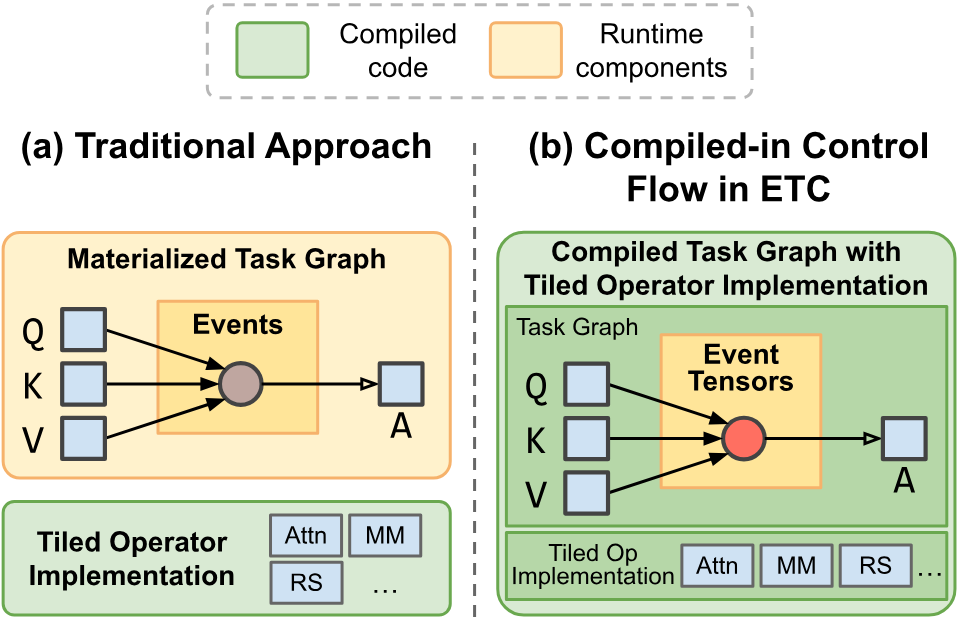

**図 10.** ランタイムアーキテクチャの比較。（a）従来のランタイム実行器はタスクグラフをメモリへ具体化し、タイル化演算子だけをコンパイルする。（b）ETC は実行時にタスクグラフを具体化せず、スケジューリングロジックをメガカーネルへコンパイルする。

### 3.4 エンドツーエンドのコンパイルフロー

ETC のエンドツーエンドコンパイルフロー [+4] は、Event Tensor が定義され、演算子がすでに CTA レベルのタイルへ分割された未最適化の計算グラフから始まる。この分割は Triton [Til19] のようなカーネル DSL を通じてユーザーが指定するか、コンパイラの組み込みとして提供される。本実装では、標準的なタイルベースプログラミングを支える TVM ベースの DSL [Hou26] でデバイス関数を記述する。Event Tensor 抽象は DSL に依存しない点が重要である。その依存グラフとスケジューリングロジックは、根本的な設計上の衝突なしに他のコンパイラスタック（Triton、CuteDSL など）へ統合できる。op グラフにはまず、既存の深層学習コンパイラ [Sab20, Lat21, Lai25a, Ans24] と同様、メモリプランニングを含む標準的なグラフレベル最適化を施す。次に、タイルレベル最適化がハードウェア命令への写像やパイプライン戦略などの低位の詳細を決定し、各演算子を改善する。その後、グラフは [第 3.1 節](#section-3-1) と [第 3.2 節](#section-3-2) で述べた静的または動的スケジューリングパスにより変換される。得られた融合デバイス関数は、永続カーネル形式の GPU コードとして出力される。続くプリフェッチパスは、ユーザー注釈に基づいてタイル化演算子の重みプリフェッチ関数を生成し、各タイルが入力活性化の到着前に重みをプリフェッチできるようにする。最後に静的スケジューリングを選んだ場合、コンパイラは SM ごとのタスク順序を計算し、メガカーネルの静的実行キューとして具体化する。

## 4 評価

ETC は Apache TVM 上の一連のコンパイラパスとして実装した。なお、提案する抽象は他のコンパイラにも適用できる。本節の評価では、次の主要な問いに答える。

- Event Tensor 抽象は、静的タスクグラフ（[第 4.1 節](#section-4-1)）と、形状依存およびデータ依存の動的性質を持つタスクグラフ（[第 4.2 節](#section-4-2)）の両方で、細粒度依存関係をどの程度うまく管理できるか。
- ETC がコンパイルするメガカーネルは、動的な低バッチサービングでエンドツーエンド遅延を短縮できるか。（[第 4.3 節](#section-4-3)）
- Event Tensor の動的形状サポートは、静的形状を対象とする実行時の Just-In-Time（JIT）コンパイルとグラフキャプチャシステムが必要とする、大きなエンジンウォームアップ負荷を取り除けるか。（[第 4.4 節](#section-4-4)）
- 静的スケジューリングと動的スケジューリングは、異なるワークロードでそれぞれ異なる性能トレードオフを示すか。（[第 4.5 節](#section-4-5)）

すべての実験は、NVLink で接続した NVIDIA B200 GPU 8 基を搭載し、Ubuntu 24.04、PyTorch 2.8.0、CUDA 13.0、ドライバ 580.82.07 を実行するサーバー上で行った。B200 は最先端のハードウェアを代表するため選んだが、Event Tensor 抽象はコンパイラ IR レベルで動作し、特定の GPU 世代に固有ではない。ETC を最先端の深層学習コンパイラ、専用ライブラリ、高性能 LLM サービングシステムと比較する。既存のメガカーネルフレームワークは単一バッチ推論向けに設計されているため、動的形状またはデータ依存ワークロードでは公平に比較できない。

### 4.1 通信・計算融合の性能

Event Tensor 抽象が静的な計算・通信パターンをどの程度うまく最適化するかを評価するため、テンソル並列 LLM の基礎となる二つの融合カーネル、GEMM＋Reduce-Scatter と All-Gather＋GEMM をベンチマークする。これらのカーネルは、分散推論の遅延を最小化し、ハードウェア利用率を最大化するうえで重要である。複数の現代的な LLM に由来する MLP 構成を使用し、すべての実験でテンソル並列数を 8、トークン数を 8192 に固定する。構成の詳細は [第 9 節](#section-9) に示す。ETC が生成するカーネルを複数のベースラインと比較し、各ワークロードの性質に合わせて実装を選択する。

- GEMM＋Reduce-Scatter：Reduce-Scatter 集団通信を CUDA multimem PTX 命令で実装する。ネットワークの競合や変動による予測不能なワークロードを扱うため、ETC の **動的スケジューラ** を用いる。状況へ即応してタスクを負荷分散する能力が最も有効になるためである。
- All-Gather＋GEMM：All-Gather 演算は、コピーエンジン（DMA）によるリングアルゴリズムを用いる。リングアルゴリズムが定めるデータ到着順に従い、SM 上では GEMM タイルだけが実行されるため、**静的スケジューラ** を用いる。事前計算した静的スケジュールにより、実行時負荷を最小に抑えつつ通信と計算を効果的に重ね合わせられる。

比較対象のベースラインは次のとおりである。

- cuBLAS+NCCL：cuBLAS と NCCL のカーネルを逐次実行する、重ね合わせなしのベースライン。融合しない場合の性能を表す。
- TP-Async [Lia24b]：重ね合わせのために非同期演算を手作業で調整する、PyTorch ベースの手法。
- Triton Distributed v0.0.2-rc [Zhe25i]：重なり合うカーネルを生成するコンパイラ型システムで、最先端のオープンソースベースラインとして用いる。
- cuBLASMp [Cub23]：分散計算と通信を重ね合わせる、高性能なマルチプロセス融合カーネルライブラリ。

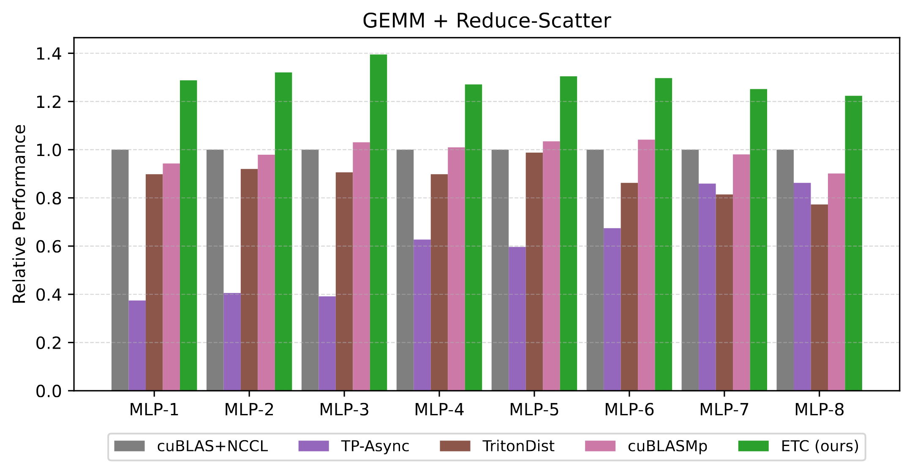

**図 11.** 動的スケジューラを用いた GEMM＋Reduce-Scatter の B200 8 基上での性能。

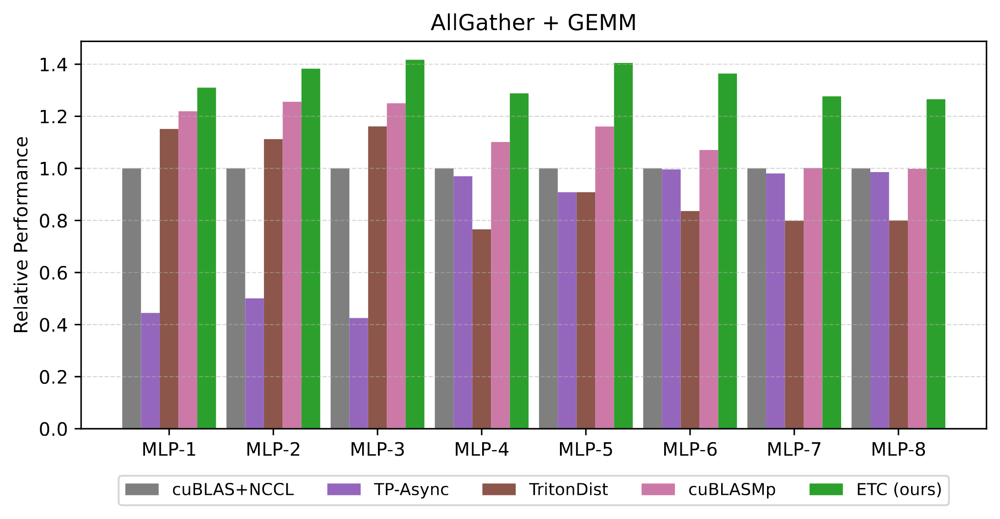

**図 12.** 静的スケジューラを用いた All-Gather＋GEMM の B200 8 基上での性能。

[図 11](#figure-11) と [図 12](#figure-12) は、特に大規模モデルの構成でベースラインを明確に改善し、どちらのワークロードでも cuBLAS+NCCL ベースラインに対して実行時間を最大 1.40x 高速化する。融合ベースラインのうち、TP-Async の粗粒度分割では、SM を飽和させるには小さすぎるチャンク、または通信遅延を十分に隠すには大きすぎるチャンクが生じ得る。また Triton-Dist の B200 対応は実験的であり、Triton ベースの GEMM はまだ Blackwell アーキテクチャ向けに十分最適化されていない。その結果、未融合の cuBLAS+NCCL ベースラインがこれらの融合手法と競合する場合もあり、効率的な融合の難しさが分かる。ETC の一貫した性能優位は Event Tensor 抽象に由来する。細粒度依存関係を第一級の Event Tensor として表すことで、コンパイラは一体化した演算を深くパイプライン化したタスクグラフへ変換できる。この抽象により、統一スケジューリング変換も効果的に適用できる。GEMM＋Reduce-Scatter では、通信遅延の潜在的な予測不能性に対処するため動的スケジューラを用い、All-Gather＋GEMM では、予測可能なリングアルゴリズムとの重ね合わせを最小負荷で調整するため静的スケジューラを用いる。この細粒度かつコンパイラ主導の手法は、計算資源（SM）とネットワーク資源を継続して稼働させ、既存システムと同等以上の重ね合わせを達成する。

### 4.2 Mixture-of-Experts（MoE）層の性能

Event Tensor 抽象が形状依存およびデータ依存の動的性質を持つタスクグラフを管理する能力を評価するため、本項ではトークン数が可変の完全な MoE 層をベンチマークする。既存システムは効率的な永続 GroupGEMM カーネルを用いるが、完全な MoE 層には依然として複数の独立した起動列が必要である。ETC は、データ依存の MoE データフロー全体を単一メガカーネルへ融合できるため、既存の最適化済みマルチカーネルベースラインと性能を比較する。Qwen3-30B-A3B の完全な MoE 層を使用する。この層は 128 の専門家を持ち、top-k は 8 である。ワークロードは可変数の入力トークンを処理する。この不規則でデータ依存のタスクグラフには適応的な負荷分散が適しているため、ETC の動的スケジューラを使用する。比較するベースラインは次のとおりである。

- Triton 3.4.0 [Til19]：SGLang [She24] や vLLM [Kwo23] を含む最先端のサービングシステムで広く使われる、高度に最適化された MoE 実装。
- FlashInfer 0.2.14.post1 [Ye25]：融合 MoE カーネルを含む、LLM 推論向け最適化カーネルを提供する高性能ライブラリ。

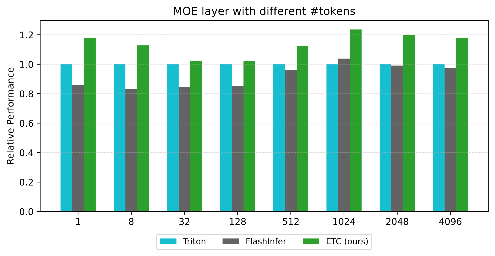

**図 13.** 単一 B200 上での MoE 層の性能。

[図 13](#figure-13) は、異なるトークン数における MoE 層の相対的なエンドツーエンド性能を示す。ETC のメガカーネル手法は最良ベースラインを大きく上回り、1024 トークンで最大 1.23x の高速化を達成する。二つのベースラインのうち、FlashInfer の GroupGEMM は大きなトークン数向けに最適化され、Triton は gather/scatter を GroupGEMM へ融合する利点があるため、相対順位はトークン数によって変わる。ETC の性能向上は Event Tensor 抽象と動的スケジューリング変換の直接的な結果である。第一に、データ依存 Event Tensor はベースラインの大域同期障壁を取り除き、MoE の二つの GroupGEMM 段階の間に細粒度パイプラインを作る。融合演算子間の SM 配分が平滑化され、wave quantization も減る。第二に、MoE でより重要な点として、オンチップ動的スケジューラが不規則なトークンルーティングをより適切に負荷分散し、SM のアイドル時間を最小化することで、トークン数が増えても一貫して他の手法を上回る。

### 4.3 エンドツーエンドの低バッチサービング性能

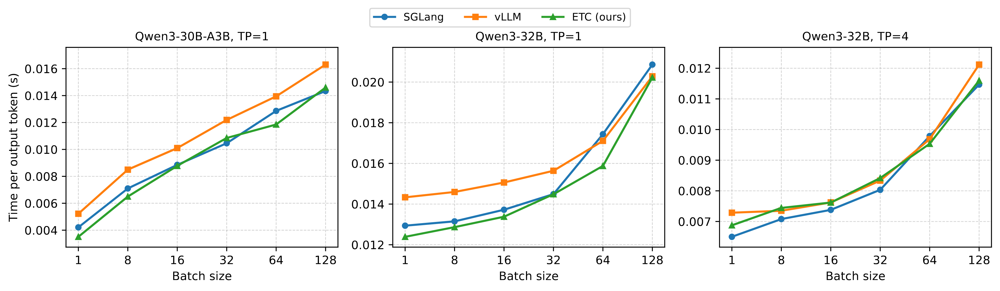

**図 14.** Qwen3-30B-A3B と Qwen3-32B のモデルサービングにおけるエンドツーエンド性能（低いほど良い）。

本項では、リアルタイムのエージェントワークフローや対話型コーディング支援など遅延重視の用途で増えている、動的な低バッチサービングにおいて、ETC コンパイル済みメガカーネルがエンドツーエンド遅延を短縮できるかを調べる。prefill と大バッチサービングは通常 GPU 利用率が高く、メガカーネルから得る利益が小さいため、デコーディング段階に注目する。ただし [第 4.1 節](#section-4-1) で示した計算・通信の重ね合わせは例外である。個々の演算子のハードウェア利用率は追加負荷なしで変わらないため、ETC が大バッチ性能を低下させない点も重要である。代表的な二つのモデル、Qwen3-30B-A3B MoE と Qwen3-32B dense に ETC コンパイル済みメガカーネルを統合し、どちらも実行時負荷を避けるため静的スケジューラを用いる。コンパイルしたメガカーネルは GEMM だけでなく、デコーディングパイプライン全体（Attention、RoPE、KV-Cache、Norm、MLP、MoE）を対象とする。Qwen ファミリーの dense と MoE の両変種は、現代の LLM（LLaMA 3、GPT など）を構造的に代表するため選んだ。ベンチマークでは、prefill 長 512、生成出力 100 トークンの合成データセットを使い、バッチサイズを 1 から 128 まで変化させる。LLM エンジンのデコーディング性能を最もよく反映する、出力トークン当たり時間（TPOT）を測定する。1 回のデコーディング反復における生のカーネル実行時間は [第 10 節](#section-10) に示す。そこではカーネル性能だけに注目し、フレームワーク固有のスケジューリング遅延やその他の CPU 負荷など無関係な負荷を除外して、異なるフレームワークを公平に比較する。ETC を主要サービングシステム vLLM（v0.11.0rc2）および SGLang（v0.5.3rc0）と比較する。どちらも性能最適化に CUDA Graph と `torch.compile` [Ans24] を利用している。

[図 14](#figure-14) 左は Qwen3-30B-A3B のエンドツーエンド性能を示し、バッチサイズ 1 で ETC は vLLM を 1.48x、SGLang を 1.20x 高速化する。[図 14](#figure-14) 中央の Qwen3-32B では ETC が一貫して最小遅延を示し、バッチサイズ 1 で vLLM を最大 1.15x、バッチサイズ 64 で SGLang を最大 1.09x 上回る。Qwen3-32B を 4-way TP テンソル並列（TP）実行 [Sho19] した場合（[図 14](#figure-14)、右）、ETC の性能は vLLM と同等で、高速化率は 0.99x から 1.06x である。この設定で ETC と vLLM の遅延が SGLang より高いのは、SGLang の高度に最適化された CPU スケジューラが、より小さな分散ランタイム負荷を持つためである。ETC が最良ベースラインにわずかに遅れる場合があるのは、抽象の根本的な制約ではなく、実装上の要因、具体的には一部構成でコンパイラ生成 GEMM タイルの調整が cuBLAS より不足していることと、本サービングエンジンの CPU 側負荷が高いことによる。

ETC の高い性能は、Event Tensor 抽象と静的スケジューリング変換による融合メガカーネルアーキテクチャに由来する。カーネル列を起動し、カーネル境界で暗黙に同期する従来手法と異なり、ETC はワークロード全体を単一の永続カーネル内で実行する。このコンパイラ主導の融合は、CUDA Graph ベースのシステムでは難しい細粒度最適化を可能にする。Attention 内での並列実行（たとえば Q の Norm+RoPE と、K の Norm+RoPE+CacheAppend の同時実行）を引き出し、MoE の GroupGEMM と MLP の GEMM をパイプライン化して wave quantization を減らし、入力活性化の準備前にモデル重みをプリフェッチしてメモリ遅延を隠す。演算子境界をまたいだパイプライン化と重ね合わせが、ベースラインに対する遅延短縮の鍵である。特に、ETC はカーネル境界を破り、MoE のように本質的に動的なワークロードでも CUDA Graphs と同等の性能を実現する。

### 4.4 ウォームアップ負荷

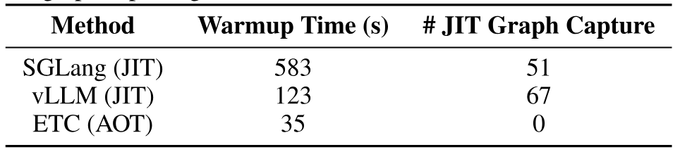

**表 1.** 異なるグラフキャプチャ方式を用いた Qwen3-32B モデルサービングのウォームアップ時間。

本項では、LLM エンジンのウォームアップ負荷を測定し、ETC のコンパイル戦略が展開に及ぼす影響を評価する。ウォームアップ時間は、エンジン起動から最初のリクエスト処理までの総実時間と定義し、エンジン初期化、モデル読み込み、すべての JIT コンパイルまたは CUDA Graph キャプチャ負荷を含める。形状の動的性質の支援による ETC の事前（AOT）コンパイルが、Just-In-Time（JIT）コンパイルと CUDA Graph キャプチャの実行時コストを取り除けるかを調べる。[表 1](#table-01) には大きな差があり、Qwen3-32B のウォームアップに vLLM は 123 s、SGLang は 583 s を要するのに対し、ETC は 35 s で初期化する。この高速化は、形状の動的性質を第一級の機能として扱い、AOT コンパイルを可能にする Event Tensor 抽象に由来する。ベースラインは異なる形状を網羅するため、実行時に多数の静的 CUDA Graphs（vLLM では 67 個）をキャプチャしなければならないが、ETC は形状に汎用的な単一の永続メガカーネルをオフラインでコンパイルする（Qwen3-32B では 107 s）。実行時には事前コンパイル済みグラフを読み込むだけで、JIT と実行時キャプチャ手法に固有の反復ウォームアップ負荷を避けられる。

### 4.5 スケジューリング手法間のトレードオフ

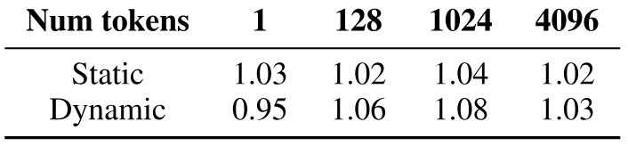

**表 2.** MoE 層における、未融合メガカーネルに対する ETC の各スケジューリング手法の相対性能。高いほど良い。

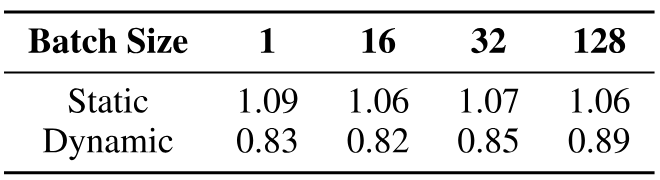

**表 3.** TP=4 の Qwen-3-32B における、未融合メガカーネルに対する ETC の各スケジューリング手法の相対性能。高いほど良い。

本節では、ETC の静的および動的スケジューリング戦略の性能特性とトレードオフを分析し、未融合メガカーネルのベースラインと比較して融合の利得を定量化する。このベースラインは、異なる演算子段階の間に単一のイベントを置いて大域同期障壁を強制し、1 回のカーネル起動内で逐次実行モデルを模擬する。重要な点として、未融合ベースラインは ETC と同一の演算子コードを用いる。したがって、[表 2](#table-02) と [表 3](#table-03) の高速化は、優れた演算子レベル実装によるものではなく、ETC の細粒度 Event Tensor 依存関係が引き出すカーネル間並列性だけによる。利得の源泉は、[第 4.2 節](#section-4-2) と [第 4.3 節](#section-4-3) で述べた wave quantization の削減、重みプリフェッチ、並列実行、オンチップ負荷分散と同じである。

**データ依存ワークロード。** [第 4.2 節](#section-4-2) の MoE 層のようにデータ依存制御フローを持つワークロードでは、動的スケジューラが負荷分散を行う。[表 2](#table-02) のように、単一バッチ推論を除いて動的スケジューラは静的スケジューラを上回る。バッチサイズ 1024 では、静的スケジューラに対して最大 4.0%、未融合ベースラインに対して最大 8.1% 高速化する。データ依存のトークンルーティングは、本質的な負荷不均衡を生む。硬直した静的スケジューラでは、一部の SM に長時間動作するタイルがキューとして蓄積し、それらが遅延要因となる一方、別の SM がアイドル状態になる可能性がある。

**規則的ワークロード。** 一方、[第 4.3 節](#section-4-3) で TP=4 により分析した規則的な dense Transformer 層のワークロードでは、静的スケジューラが明確に優位である（[表 3](#table-03)）。分散環境、とりわけリモートのタスクキューへタスクを push しようとする場合、動的スケジューラの負荷は非常に大きくなる。ETC-static は ETC-unfused に対して一貫して 6–8% 高速であり、その利得は純粋に細粒度パイプライン化による。

これらの結果は、[図 11](#figure-11)、[図 12](#figure-12)、[図 14](#figure-14) のマルチ GPU 評価が異なる傾向に見える理由も説明する。[図 11](#figure-11) と [図 12](#figure-12) は大バッチ（8192 トークン）で帯域幅制約となる領域を表し、ETC は細粒度シグナリングによって通信と計算を重ね合わせることで優れた性能を示す。対照的に、[図 14](#figure-14) 右は低バッチで遅延が重要な領域を表し、通信負荷と CPU スケジューリング負荷が露出する。このため異なるスケジューリング戦略が必要になる。動的スケジューリングは大バッチでの揺らぎを効率よく扱い、静的スケジューリングは遅延重視の低バッチタスクにおける負荷を最小化する。

以上の知見は、ワークロードに依存する明確なトレードオフを示し、ETC フレームワークが両方のスケジューリング変換を支える価値を裏付ける。

## 5 関連研究

MLIR [Lat21]、XLA [Sab20]、TVM [Che18e, Fen22, Lai25a]、PyTorch コンパイラ [Ans24] などの深層学習コンパイラは、深層学習モデル最適化の基礎を築いた。これらのシステムはグラフレベル最適化を行い、カーネル単位で実行する。CUDA Graph [Gra19] はカーネル列をキャプチャして再生することで起動オーバーヘッドを大幅に減らすが、静的入力に依存する。機械学習コンパイラでは、カーネル起動オーバーヘッドを最適化するため、垂直融合 [Zhe20, Niu21] と水平融合 [Jia19b, Li22e] も進められている。Rammer [Ma20] と Roller [Zhu22] は、タイル化タスクをソフトウェアから起動する。従来研究には細粒度依存関係を追跡し最適化する明示的な抽象がなく、提案する Event Tensor によりメガカーネル最適化を可能にできる。DynaTune [Zha21m]、DietCode [Zhe22c]、SparseTIR [Ye23a] などの動的テンソルコンパイラは、単一カーネルのレベルで動的形状または疎性を扱う。ETC はそれらを補完し、演算子実装をメガカーネルへ融合してカーネル間並列性を引き出す。

SGLang [She24]、vLLM [Kwo23]、TensorRT-LLM [Ten24a]、Orca [Yu22a] などの LLM 推論システムは、継続的バッチ処理や投機的実行などのシステム最適化により高性能を実現する。本 Event Tensor コンパイラは、これらのフレームワークをより効率よく GPU 上で実行するバックエンドとなり得る。近年の研究 [Che25ae, Spe25] は LLM 向けメガカーネルの構築に着手している。これらは単一バッチの dense モデル推論だけを対象とし、一つのスケジューリング戦略に注目している。本稿の Event Tensor 抽象は、形状依存およびデータ依存の動的性質に対して体系的なコンパイラ抽象を提供し、これらの手法を補完する。Event Tensor コンパイラは静的スケジューリングと動的スケジューリングの両方を支える。CuSync [Jan24a] は異なる CUDA ストリーム上にある独立カーネルの協調スケジューリングを最適化し、FlashMoE [Aim25] は分散 MoE 向けに手作業で最適化したカーネルを提供する。ETC は、体系的なコンパイラパイプラインによりサブグラフ全体を単一の永続メガカーネルへ融合し、特定の演算子パターンに限定されない点で、両者と異なる。

本手法は、Cilk [Blu95]、Legion [Bau12]、Realm [Tre14]、OpenMP Tasks [Dag98] など、タスクベースの並列プログラミングモデルと密接に関連する。従来手法の多くは、一般に CPU が調整する粗粒度タスクを対象とする。本手法は、単一カーネルを最適化する Graphene [Hag23] と Cypress [Yad25] にも関連する。Graphene はスレッドを同期機能付きテンソルとしてモデル化し、概念的には関連があるが、動的形状およびデータ依存を支える複数演算子のメガカーネル融合ではなく、単一カーネルの最適化を対象とする。本手法はこれらの先行知見に基づき、演算子のサブタスクにまたがる細粒度依存関係を簡潔に表現し、GPU のストリーミングマルチプロセッサ上で静的および動的スケジューリングを行う Event Tensor 抽象を提案する。

## 6 結論

本研究では、動的 GPU メガカーネルのコンパイルにおける細粒度同期を表現する統一抽象、Event Tensor を導入した。Event Tensor は形状依存およびデータ依存の動的性質を第一級の機能として支える。この抽象に基づき、ETC は静的および動的スケジューリングによって、高性能な永続カーネルを体系的に生成する。ETC は最先端のサービング遅延を実現しながら、ウォームアップ負荷を大幅に削減する。今後は、標準的な計算グラフから Event Tensor タスクグラフを自動生成する高位パスにより、手作業による同期の負担をさらに減らしたい。本研究がメガカーネルのさらなる研究を促し、ML コンパイラの新たな可能性を示すことを期待する。

## 謝辞

建設的なフィードバックとコメントを寄せてくださった MLSys の匿名査読者全員と shepherd に感謝する。本研究は NVIDIA、Google、Amazon からの寄付により一部支援された。また、DGX B200 に対する NVIDIA の支援にも感謝する。

## 7 動的スケジューリングの疑似コード

**アルゴリズム 2：ETC における動的スケジューリング変換。**

- **入力：** Event Tensor の依存関係を持つタイルレベルのデータフローグラフ `G` を含むモジュール `mod`。。
- **出力：** 融合され、動的にスケジュールされたメガカーネルを持つ更新済みモジュール。
- `mod_updated` $\leftarrow$ `mod.Copy()`。
- `fused_kernel` $\leftarrow$ `NewPersistentKernel()`。
- 実行時スケジューラではない。push/pop 関数だけを提供する。
- `scheduler` $\leftarrow$ `GPUScheduler()`。
- `fused_kernel.AddPopLogic(scheduler.f_pop_tasks)`。
- `G` 内のすべての `task_grid` について：
  - `fused_kernel.AddDispatchLogic(task_grid)`。
  - `fused_kernel.AddTileLogic(task_grid)`。
  - `task_grid.out_edges` 内のすべての `event` について：
    - `fused_kernel.AddCompleteOnLogic(event, scheduler.f_push_tasks)`。
- `mod_updated.Replace(G, fused_kernel)`。
- **返却：** `mod_updated`。

[アルゴリズム 2](#algorithm-02) は、Event Tensor グラフを動的にスケジュールされたメガカーネルへ変換するコンパイラパスを記述する。SM が現在のタスクを完了するたびに `scheduler.pop_tasks` の呼び出しを挿入し、タスクの完了によって関連イベントカウンタが 0 に減少し、依存タスクのブロックが解除されるときには `scheduler.push_tasks` の呼び出しを挿入する。

## 8 ETC のエンドツーエンドコンパイルフロー

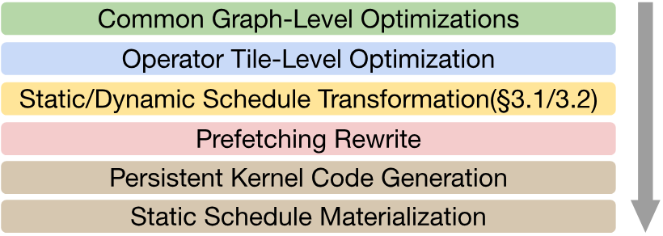

**図 15.** ETC のエンドツーエンドコンパイルパイプライン。

[図 15](#figure-15) は、[第 3.4 節](#section-3-4) で述べた ETC のエンドツーエンドコンパイルフローをまとめたものである。

## 9 [第 4.1 節](#section-4-1) で用いた MLP 構成

[表 4](#table-04) は通信・計算融合の評価で用いた、複数の現代的 LLM に由来する MLP 構成を示す。

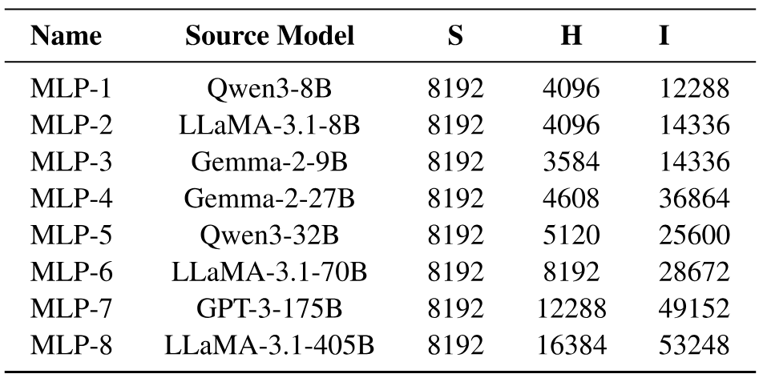

**表 4.** MLP のモデル構成。S はシーケンス長、H は隠れ次元、I は中間サイズ。

## 10 エンドツーエンド LLM サービングにおける生のカーネル時間評価

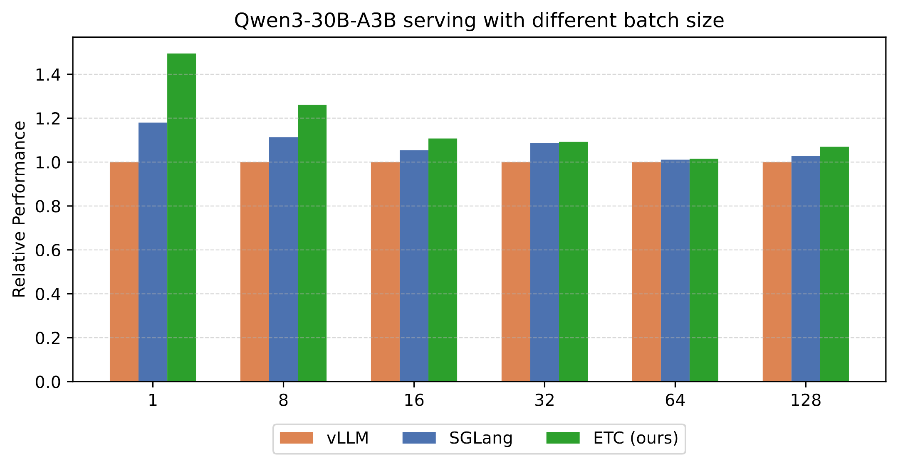

**図 16.** 単一 B200 上での Qwen-30B-A3B の生カーネル相対性能。

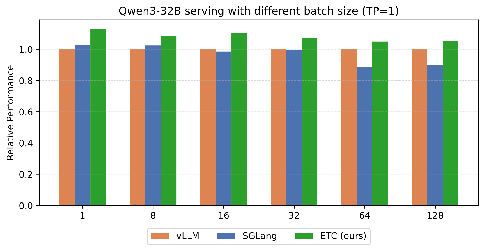

**図 17.** 単一 B200 上での Qwen-32B の生カーネル相対性能。

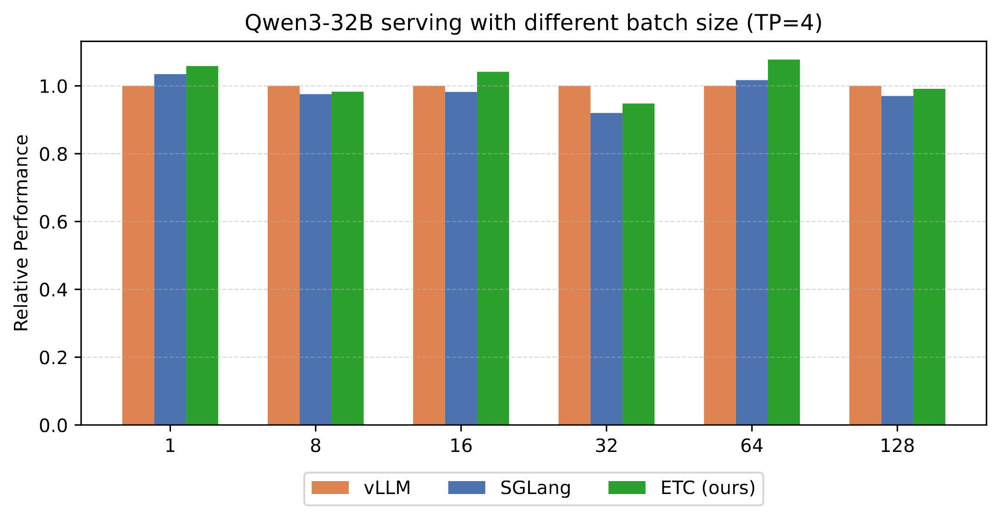

**図 18.** B200 4 基上でテンソル並列を用いた Qwen-32B の生カーネル相対性能。

[第 4.3 節](#section-4-3) では、エンドツーエンド LLM サービングにおける ETC とベースラインの出力トークン当たり時間（TPOT）を報告した。TPOT には GPU カーネルの総実行時間だけでなく、フレームワーク固有のリクエストスケジューリング遅延など CPU 側の負荷も含まれる。無関係な負荷の影響を受けない、より直接的で公平な比較を行うため、本節では [第 4.3 節](#section-4-3) と同じベースラインと実験設定を用い、エンドツーエンド LLM サービングにおける GPU カーネルの生の実行時間を評価する。

[図 16](#figure-16) は、Qwen3-30B-A3B の複数のバッチサイズについて、ETC とベースラインの生カーネルによる相対エンドツーエンド性能を示す。ETC はベースラインを一貫して高速化し、バッチサイズ 1 で vLLM に対して 1.49x、SGLang に対して 1.27x という最大の改善を示す。Event Tensor 抽象が MoE のデータ依存関係を支えるため、ETC は MoE モデル全体を単一カーネルで実行し、Attention 演算子間の並列性向上、GroupGEMM 間の細粒度パイプライン化、モデル重みのプリフェッチといった最適化を可能にする。

[図 17](#figure-17) と [図 18](#figure-18) はそれぞれ、単一 B200 および B200 4 基のテンソル並列における Qwen3-32B サービングの生カーネル性能を示す。単一 GPU 設定（TP = 1）では、ETC はすべてのバッチサイズで vLLM と SGLang の両方を一貫して上回り、バッチサイズ 1 で vLLM に対して最大 1.13x、平均で約 7% 改善する。テンソル並列（TP = 4）では、ETC はすべての設定で同等以上の性能を維持し、バッチサイズの増加に対して同様のスケーラビリティを保ちながら、vLLM に対して最大 1.08x 高速化する。この同等の性能は、ETC のメガカーネル設計と、Event Tensor 抽象に基づく静的スケジューリングの有効性を示す。

## 11 動的スケジューラの実行時最適化

スケジューリング負荷を隠すため、早期 push 戦略を採用する。タスクの依存関係（生産側タスク）の実行完了を待つのではなく、すべての生産側タスクが SM へディスパッチされた時点で（完了は不要）、スケジューラは消費側タスクを準備済みキューへ先に push する。依存関係は、消費側タスクの実行前に追加した待機で保証する。この先行処理により、push 操作の負荷がクリティカルパスに入るのを防ぐ。push は生産側タスクの実行と同時に行われ、スケジューリングコストを先行計算と実質的に重ね合わせる。

[+1]: 簡潔にするため、図とサンプルコードでは Numpy の einsum に似た記法 [Har20b] を用いる。

[+2]: `indptr` は、圧縮疎行列（CSR）形式などの疎行列表現で一般に使われる用語である。

[+3]: 動的スケジューリング変換の疑似コードは [第 7 節](#section-7) に示す。

[+4]: コンパイルパイプラインの図は [第 8 節](#section-8) に示す。
