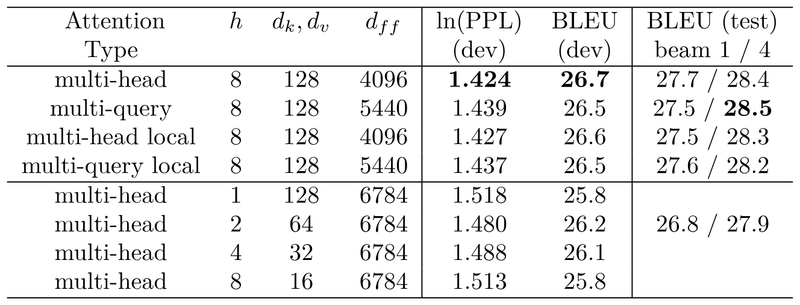
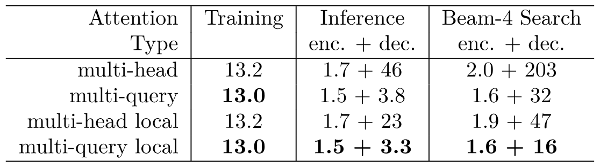
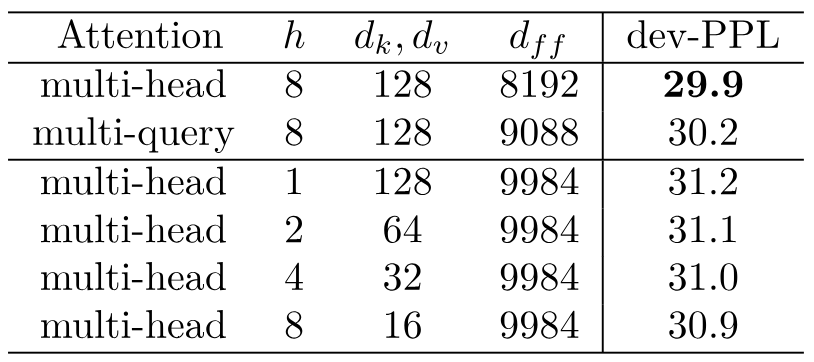

> [Noam Shazeer](https://www.noamshazeer.com/)。2019 年 11 月 6 日に arXiv へ初回投稿、現行版は v1。[Fast Transformer Decoding: One Write-Head is All You Need](https://arxiv.org/abs/1911.02150v1)。[原論文 PDF](/paper/fast-transformer-decoding.pdf)。[DOI](https://doi.org/10.48550/arXiv.1911.02150)。[TeX ソース](https://export.arxiv.org/e-print/1911.02150v1)。正確な印刷レイアウトと参考文献については、原論文 PDF を正本とする。

## 概要

Transformer ニューラル系列モデルで用いられるマルチヘッド注意層は、系列内および系列間で情報を移動させる手段として、RNN に代わる強力な選択肢である。系列長方向に並列化できるため、これらの層の訓練は一般に高速かつ単純だが、そのような並列化が不可能な増分推論は、大きな「キー」と「値」のテンソルを繰り返し読み込む際のメモリ帯域幅コストにより、しばしば低速になる。本稿では、異なるすべての注意「ヘッド」でキーと値を共有するマルチクエリ注意という変種を提案し、これらのテンソルのサイズと増分デコードに必要なメモリ帯域幅を大幅に削減する。実験により、得られたモデルは実際にデコードを大幅に高速化でき、ベースラインからの品質低下もわずかであることを確認する。

<span id="section-1"></span>

## 1 はじめに

Transformer ニューラル系列モデル [Vas17] は、再帰型系列モデルに代わる一般的な選択肢として普及している。Transformer は、系列内および系列間で情報を伝達するために注意層を用いる。Transformer の大きな課題の一つは、増分推論の速度である。後述するように、現代の計算ハードウェアにおける Transformer の増分推論速度は、注意層の状態を符号化する大きな「キー」と「値」のテンソルを再読み込みするために必要なメモリ帯域幅によって制限される。以下では、Transformer で用いられるマルチヘッド注意層を概説し、性能を分析したうえで、品質低下をわずかに抑えながら推論速度を大幅に向上させるアーキテクチャ上の変種（マルチクエリ注意）を提案する。

<span id="section-2"></span>

## 2 背景：ニューラル注意

[Bah14] が提案したニューラル注意は、可変長表現を操作するための強力な手法である。ニューラル注意関数は、単一のクエリベクトル $q$ と、$m$ 個の異なる（キーベクトル、値ベクトル）の組（行列 $K$ と $V$ で表す）を受け取り、出力ベクトル $y$ を生成する。出力 $y$ は異なる値ベクトルの加重和として計算され、その重みはクエリとキーの比較から導かれる。

<span id="section-2-1"></span>

### 2.1 ドット積注意

次のコードは一般的な定式化を示しており、重みはクエリと各キーのドット積に softmax を適用して計算する。

```python
def DotProductAttention(q, K, V):
  """1 つのクエリに対するドット積注意。
  引数：
    q: 形状 [k] のベクトル
    K: 形状 [m, k] の行列
    V: 形状 [m, v] の行列
  戻り値：
    y: 形状 [v] のベクトル
  """
  logits = tf.einsum("k,mk->m", q, K)
  weights = tf.softmax(logits)
  return tf.einsum("m,mv->v", weights, V)
```

コード例では、任意次元のテンソル間における一般化された縮約を表すため、TensorFlow と numpy で定義される **einsum** 記法を用いる。この記法では、方程式によって入力テンソルと出力テンソルの次元に名前を付ける。この計算は、各入力をすべての次元の和集合までブロードキャストし、要素ごとに乗算した後、目的の出力形状に含まれないすべての次元について総和を取ることと数値的に等価である。

<span id="section-2-2"></span>

### 2.2 マルチヘッド注意

「Transformer」系列間変換モデル [Vas17] は、$h$ 個の異なる注意層（ヘッド）を並列に用い、著者らはこれを「マルチヘッド注意」と呼ぶ。$h$ 個の異なる層に対するクエリベクトルは、入力ベクトル $x$ に、学習された $h$ 個の異なる線形射影 $P_q$ を適用して得る。同様に、キーと値は、$m$ 個の異なる入力ベクトルからなる集合 $M$ に、学習された $h$ 個の異なる線形射影 $P_k, P_v$ を適用して得る。$h$ 個の層の出力には、それぞれ学習された異なる線形射影 $P_o$ を適用し、その後で総和を取る。簡単のため、入力ベクトルと出力ベクトルの次元を同じ $d$ とする。計算は次のように表せる。

```python
def MultiheadAttention(
  x, M, P_q, P_k, P_v, P_o):
  """1 つのクエリに対するマルチヘッド注意。
  引数：
    x: 形状 [d] のベクトル
    M: 形状 [m, d] の行列
    P_q: 形状 [h, d, k] のテンソル
    P_k: 形状 [h, d, k] のテンソル
    P_v: 形状 [h, d, v] のテンソル
    P_o: 形状 [h, d, v] のテンソル
  戻り値：
    y: 形状 [d] のベクトル
  """
  q = tf.einsum("d,hdk->hk", x, P_q)
  K = tf.einsum("md,hdk->hmk", M, P_k)
  V = tf.einsum("md,hdv->hmv", M, P_v)
  logits = tf.einsum("hk,hmk->hm", q, K)
  weights = tf.softmax(logits)
  o = tf.einsum("hm,hmv->hv", weights, V)
  y = tf.einsum("hv,hdv->d", o, P_o)
  return y
```

注：[Vas17] では logits に定数のスケーリング係数を加えている。この係数は線形射影 $P_q$ または $P_k$ に組み込めるため、本稿のコードでは省略する。

<span id="section-2-3"></span>

### 2.3 マルチヘッド注意（バッチ処理）

実際には、複数のクエリをまとめてバッチ処理する方がはるかに効率的である。次のコードは 2 種類のバッチ処理を追加する。まず、系列内の $n$ 個の異なる位置からクエリを生成する。これらのクエリはすべて同じキーと値と相互作用する。さらに、相互作用しない $b$ 個の異なる系列からなるバッチを一度に処理する。[Vas17] に従い、自己回帰モデルでは、不正な位置に $-\infty$ を持つ「マスク」を logits に加えることで、情報が後方へ流れるのを防げる。

```python
def MultiheadAttentionBatched(
  X, M, mask, P_q, P_k, P_v, P_o):
  """マルチヘッド注意。
  引数：
    X: 形状 [b, n, d] のテンソル
    M: 形状 [b, m, d] のテンソル
    mask: 形状 [b, h, n, m] のテンソル
    P_q: 形状 [h, d, k] のテンソル
    P_k: 形状 [h, d, k] のテンソル
    P_v: 形状 [h, d, v] のテンソル
    P_o: 形状 [h, d, v] のテンソル
  戻り値：
    Y: 形状 [b, n, d] のテンソル
  """
  Q = tf.einsum("bnd,hdk->bhnk", X, P_q)
  K = tf.einsum("bmd,hdk->bhmk", M, P_k)
  V = tf.einsum("bmd,hdv->bhmv", M, P_v)
  logits = tf.einsum("bhnk,bhmk->bhnm", Q, K)
  weights = tf.softmax(logits + mask)
  O = tf.einsum("bhnm,bhmv->bhnv", weights, V)
  Y = tf.einsum("bhnv,hdv->bnd", O, P_o)
  return Y
```

<span id="section-2-3-1"></span>

#### 2.3.1 バッチ処理したマルチヘッド注意の性能分析

性能分析を簡単にするため、次のいくつかの単純化した仮定を置く。

- $m=n$
- [Vas17] の提案どおり、$k=v=\frac{d}{h}$
- $n\leq d$

算術演算の総数は $\Theta(bnd^2)$ である。上記の各 `tf.einsum` 演算の計算量は、単純化した仮定のもとで $O(bnd^2)$ となる。

アクセスするメモリの総量は、関係するすべてのテンソルのサイズの和 $O(bnd+bhn^2+d^2)$ に等しい。第 1 項は $X$, $M$, $Q$, $K$, $V$, $O$, $Y$、第 2 項は logits と weights、第 3 項は射影テンソル $P_q$, $P_k$, $P_v$, $P_o$ に由来する。

両者を割ると、算術演算量に対するメモリアクセス量の比は $O(\frac{1}{k}+\frac{1}{bn})$ となる。現代の GPU/TPU ハードウェアでは計算能力がメモリ帯域幅より 2 桁高い場合があるため、良好な性能にはこの低い比率が必要である。

<span id="section-2-4"></span>

### 2.4 マルチヘッド注意（増分処理）

設定によっては、データ依存関係のため、複数位置のクエリを並列に処理できない。Transformer [Vas17] のような自己回帰言語モデルにおける自己注意層がその一例である。各位置で生成されたクエリは、その位置までの各位置で生成されたキーと値の組に注意を向ける。訓練時は正解のターゲット系列が既知であり、[第 2.3 節](#section-2-3)と同様の効率的な並列実装を利用できる。しかし、訓練済みモデルから生成する場合、ある位置における自己注意層の出力が次の位置で生成されるトークンに影響し、そのトークンがさらに次の位置における同層への入力に影響する。このため並列計算はできない。この自己注意層を増分計算するコードを次に示す。

```python
def MultiheadSelfAttentionIncremental(
  x, prev_K, prev_V, P_q, P_k, P_v, P_o):
  """マルチヘッド自己注意（1 ステップ）。
  引数：
    x: 形状 [b, d] のテンソル
    prev_K: 形状 [b, h, m, k] のテンソル
    prev_V: 形状 [b, h, m, v] のテンソル
    P_q: 形状 [h, d, k] のテンソル
    P_k: 形状 [h, d, k] のテンソル
    P_v: 形状 [h, d, v] のテンソル
    P_o: 形状 [h, d, v] のテンソル
  戻り値：
    y: 形状 [b, d] のテンソル
    new_K: 形状 [b, h, m+1, k] のテンソル
    new_V: 形状 [b, h, m+1, v] のテンソル
  """
  q = tf.einsum("bd,hdk->bhk", x, P_q)
  new_K = tf.concat(
    [prev_K, tf.expand_dims(tf.einsum("bd,hdk->bhk", M, P_k),axis=2)],
    axis=2)
  new_V = tf.concat(
    [prev_V, tf.expand_dims(tf.einsum("bd,hdv->bhv", M, P_v), axis=2)],
    axis=2)
  logits = tf.einsum("bhk,bhmk->bhm", q, new_K)
  weights = tf.softmax(logits)
  o = tf.einsum("bhm,bhmv->bhv", weights, new_V)
  y = tf.einsum("bhv,hdv->bd", O, P_o)
  return y, new_K, new_V
```

<span id="section-2-4-1"></span>

#### 2.4.1 性能分析

[第 2.3.1 節](#section-2-3-1)と同じ単純化した仮定を置く。

$n$ 回の呼び出し全体で、算術演算の総数は再び $\Theta(bnd^2)$ となる。

$n$ 回の呼び出し全体で、メモリアクセスの総量は $\Theta(bn^2d+nd^2)$ となり、第 1 項は $K$ と $V$、第 2 項は $P_q$, $P_k$, $P_v$, $P_o$ に由来する。

メモリアクセス量を計算量で割ると、算術演算量に対するメモリアクセス量の比は $\Theta(\frac{n}{d}+\frac{1}{b})$ となる。$n\approx d$ または $b\approx1$ のとき、この比率は 1 に近くなり、現代の計算ハードウェアではメモリ帯域幅が大きな性能ボトルネックとなる。増分生成を効率化するには、これら 2 項をどちらも $\ll1$ まで減らさなければならない。$\frac{1}{b}$ の項は比較的容易であり、メモリ容量が許す限りバッチサイズを大きくすればよい。

$\frac{n}{d}$ の項を減らす方が難しい。この項は、記憶を表すサイズ $b h m k=bn^2$ の $K$ と $V$ のテンソルを各ステップで再読み込みするコストに関係する。一つの解決策は、系列長 $n$ を制限することである。別の方法として、局所近傍だけに注意を向けるか、[Liu18b], [Zha18b], [Pov18] のように記憶位置の数を圧縮することで、注意対象となる位置数を減らせる。本稿では、$K$ と $V$ のテンソルから「ヘッド」次元を取り除きつつ、クエリの「ヘッド」次元を維持するという、これらと直交する縮小手法を示す。

<span id="section-3"></span>

## 3 マルチクエリ注意

[Vas17] で説明されたマルチヘッド注意の変種として、**マルチクエリ注意**を導入する。マルチヘッド注意は、複数の注意層（ヘッド）を並列に配置し、クエリ、キー、値、出力にそれぞれ異なる線形変換を適用する。マルチクエリ注意も同一の構成だが、異なるヘッドが単一のキーと値の集合を共有する点だけが異なる。増分マルチクエリ自己注意のコードは、上に示したマルチヘッド注意のコードと同じであり、$K$, $V$, $P_k$, $P_v$ の「ヘッド」次元を表す文字「h」を `tf.einsum` 方程式から取り除くだけでよい。

```python
def MultiqueryAttentionBatched(
  X, M, mask, P_q, P_k, P_v, P_o):
  """マルチクエリ注意。
  引数：
    X: 形状 [b, n, d] のテンソル
    M: 形状 [b, m, d] のテンソル
    mask: 形状 [b, h, n, m] のテンソル
    P_q: 形状 [h, d, k] のテンソル
    P_k: 形状 [d, k] のテンソル
    P_v: 形状 d, v] のテンソル
    P_o: 形状 [h, d, v] のテンソル
  戻り値：
    Y: 形状 [b, n, d] のテンソル
  """
  Q = tf.einsum("bnd,hdk->bhnk", X, P_q)
  K = tf.einsum("bmd,dk->bmk", M, P_k)
  V = tf.einsum("bmd,dv->bmv", M, P_v)
  logits = tf.einsum("bhnk,bmk->bhnm", Q, K)
  weights = tf.softmax(logits + mask)
  O = tf.einsum("bhnm,bmv->bhnv", weights, V)
  Y = tf.einsum("bhnv,hdv->bnd", O, P_o)
  return Y
```

```python
def MultiquerySelfAttentionIncremental(
  x, prev_K, prev_V, P_q, P_k, P_v, P_o):
  """マルチクエリ自己注意（1 ステップ）。
  引数：
    x: 形状 [b, d] のテンソル
    prev_K: 形状 [b, m, k] のテンソル
    prev_V: 形状 [b, m, v] のテンソル
    P_q: 形状 [h, d, k] のテンソル
    P_k: 形状 [d, k] のテンソル
    P_v: 形状 [d, v] のテンソル
    P_o: 形状 [h, d, v] のテンソル
  戻り値：
    y: 形状 [b, d] のテンソル
    new_K: 形状 [b, m+1, k] のテンソル
    new_V: 形状 [b, m+1, v] のテンソル
  """
  q = tf.einsum("bd,hdk->bhk", x, P_q)
  K = tf.concat(
    [prev_K, tf.expand_dims(tf.einsum("bd,dk->bk", M, P_k), axis=2)],
    axis=2)
  V = tf.concat(
    [prev_V, tf.expand_dims(tf.einsum("bd,dv->bv", M, P_v), axis=2)],
    axis=2)
  logits = tf.einsum("bhk,bmk->bhm", q, K)
  weights = tf.softmax(logits)
  o = tf.einsum("bhm,bmv->bhv", weights, V)
  y = tf.einsum("bhv,hdv->bd", O, P_o)
  return y, K, V
```

<span id="section-3-1"></span>

### 3.1 増分マルチクエリ注意の性能分析

[第 2.3.1 節](#section-2-3-1)と同じ単純化した仮定を置く。

$n$ 回の呼び出し全体で、算術演算の総数は再び $\Theta(bnd^2)$ となる。

$n$ 回の呼び出し全体で、メモリアクセスの総量は $\Theta(bnd+bn^2k+nd^2)$ となり、第 1 項は $x$, $q$, $o$, $y$、第 2 項は $K$ と $V$、第 3 項は $P_q$, $P_k$, $P_v$, $P_o$ に由来する。

メモリアクセス量を計算量で割ると、算術演算量に対するメモリアクセス量の比は $\Theta(\frac{1}{d}+\frac{n}{dh}+\frac{1}{b})$ となる。問題となる $\frac{n}{d}$ を $h$ 分の 1 に減らした。理論上、バッチサイズ $b$ が大きければ、増分生成の性能は劇的に向上するはずである。実験の節では、性能向上が実際に得られ、モデル品質も高く保たれることを示す。

<span id="section-4"></span>

## 4 実験と結果

<span id="section-4-1"></span>

### 4.1 実験設定

[Vas17] に従い、WMT 2014 英独翻訳タスクで評価する。ベースラインには、6 層のエンコーダ・デコーダ Transformer モデルを用い、$d_{\mathrm{model}}=1024$ $d_{\mathrm{ff}}=4096$, $h=8$, $d_k=d_v=128$、学習された位置埋め込み、およびトークン埋め込み層と出力層の間の重み共有を使用する。ベースラインモデルとすべての変種は 2 億 1100 万個のパラメータを持つ。すべてのモデルを 100,000 ステップ（約 20 エポック）訓練した。各訓練バッチは 128 個の例で構成され、各例は 256 トークンの入力系列と 256 トークンのターゲット系列からなる（この長さに達するよう複数の訓練文を連結した）。モデルは 32 コアの TPUv3 クラスタで訓練し、各モデルの訓練には約 2 時間を要した。tensor2tensor ライブラリと mesh-tensorflow ライブラリの実装を使用した。使用した設定は [to be added before publication] で確認でき、学習率、dropout、ラベル平滑化などの詳細を含む。

「multi-query」モデルでは、モデル内のすべての注意層をマルチクエリ注意に置き換える。これには、エンコーダ自己注意層、デコーダ自己注意層、エンコーダ・デコーダ注意層が含まれる。フィードフォワード隠れ層を 4096 から 5440 に広げ、総パラメータ数をベースラインと等しくする。

局所注意とマルチクエリ注意が直交していることを示すため、ベースラインモデルとマルチクエリモデルの「local」版も訓練した。この版では、デコーダ自己注意層（ほかの注意層は除く）が、現在位置と直前の 31 位置だけに注意を制限する。

$K$ と $V$ のサイズを削減する、より単純な別の方法は、ヘッド数 $h$ を減らすこと、および／またはキーと値の次元 $k$ と $v$ を小さくすることである。比較のためにそのようなモデルを複数訓練し、総パラメータ数をベースラインと等しくするため、同じくフィードフォワード隠れ層を広げた。

Billion-Word Language Modeling Benchmark [Che13] では、「transformer-decoder」言語モデルを用いて同様の実験を行った。ベースラインには 6 層、$d_{\mathrm{model}}=1024$ $d_{\mathrm{ff}}=8192$, $h=8$, $d_k=d_v=128$ のモデルを用いた。ベースラインとすべての変種の総パラメータ数は 1 億 9200 万である。64K トークンのバッチサイズで 136K ステップ（10 エポック）訓練した。ここでも 32 コアの TPUv3 クラスタを用い、各モデルを約 3 時間訓練した。

<span id="section-4-2"></span>

### 4.2 モデル品質

[表 1](#table-01) に機械翻訳実験の結果を示す。開発セットを貪欲最尤デコードで処理し、sacrebleu `"sacrebleu -t wmt13 -l en-de -tok intl"` で BLEU スコアを計算した。開発セットにおけるサブワードトークン当たりのパープレキシティも示す。どちらの指標でも、マルチクエリ注意モデルはベースラインよりわずかに劣るように見えるが、$h$, $d_k$, $d_v$ を減らすほかのどの選択肢よりもベースラインに近い。

貪欲デコードとビームサーチ（beam 4, $\alpha=0.6$）の両方でテストセットをデコードし、sacrebleu `"sacrebleu -t wmt14 -l en-de -tok intl"` で評価して結果を検証した。ここでもマルチクエリモデルはベースラインと同程度の性能を示し、beam-4 デコードでは実際に最高の BLEU スコア（28.5）を達成した。

[表 3](#table-03) に Billion-Word 言語モデリングベンチマークの結果を示す。モデルは、開発セットにおける単語当たり（サブワードトークン当たりではない）のパープレキシティで評価した。結果は翻訳結果と同様の傾向を示す。マルチクエリ注意モデルはベースラインよりわずかに劣るものの、$h$, $d_k$, $d_v$ を減らすほかのどの選択肢よりも大幅に優れている。

<span id="section-4-3"></span>

### 4.3 速度

[表 2](#table-02) に各モデルの訓練時間と推論時間を示す。訓練速度と推論速度は、いずれも 1 台の TPUv2（8 コア）で評価した。前述の 32,768 個の入力トークンと 32,768 個のターゲットトークンからなる 1 訓練ステップは、ベースモデルで 433ms、マルチクエリモデルで 425ms を要した。32,768 で割ると、[表 2](#table-02) に示すとおり、訓練時間は（入力トークン＋ターゲットトークン）当たり $13.2\mu\mathrm{s}$ となる。

1024 系列（各コア 128 系列）のバッチで、長さ 128 トークンのソース系列と長さ 128 のターゲット系列を用いて、増分貪欲推論を実行した。[+1] ベースラインモデルでは、エンコーダ部分に 222ms、デコーダの各増分ステップに 47ms を要した。それぞれのトークン数で割ると、[表 2](#table-02) に示すとおり、償却推論時間はエンコーダで 1 トークン当たり $1.7\mu\mathrm{s}$、デコーダではそれよりはるかに大きい 1 トークン当たり $46\mu\mathrm{s}$ となる。マルチクエリモデルでは、エンコーダに 195ms、デコーダの各ステップに 3.9ms を要し、1 トークン当たりの償却コストはそれぞれ $1.5\mu\mathrm{s}$ と $3.8\mu\mathrm{s}$ となる。[表 2](#table-02) には、これらの値とビームサーチの同様の結果を示す。

[+1]: 固定形状を必要とするシステム上の制約により、デコーダ自己注意の実装ではパディングとマスキングを使用した。そのため、メモリテンソルは最大長（128）まで、局所注意の場合はウィンドウサイズ（32）までパディングした。したがって各デコードステップに同じ時間がかかった。テンソルを増分的に成長させる別の実装であれば、系列の先頭付近で時間を短縮できる。

<span id="table-01"></span>



**表 1。** WMT14 英独翻訳の結果。

<span id="table-02"></span>



**表 2。** 系列長 128 の WMT14 英独翻訳タスクにおける償却訓練・推論コスト。値の単位は、出力トークン当たりの TPUv2 マイクロ秒である。

<span id="table-03"></span>



**表 3。** Billion-Word LM ベンチマークの結果。

<span id="section-5"></span>

## 5 結論

本稿では、増分設定におけるメモリ帯域幅要件がマルチヘッド注意より大幅に低い代替手法として、マルチクエリ注意を提案した。これにより、推論性能が重視されるアプリケーションで、注意ベースの系列モデルがさらに広く採用されると考える。
