> [Jay Shah](https://developer.nvidia.com/blog/author/jayshah/) [+equal]、[Ganesh Bikshandi](https://dblp.org/pid/68/2188.html) [+equal]、[Ying Zhang](https://x.com/ipiszy)、[Vijay Thakkar](https://cse.gatech.edu/people/vijay-thakkar)、[Pradeep Ramani](https://developer.nvidia.com/blog/author/prramani/)、[Tri Dao](https://tridao.me/)。2024 年 7 月 11 日に arXiv へ初投稿。現行版は 2024 年 7 月 12 日改訂の v2。[Advances in Neural Information Processing Systems 37 (NeurIPS 2024) Main Conference Track](https://proceedings.neurips.cc/paper_files/paper/2024/hash/7ede97c3e082c6df10a8d6103a2eebd2-Abstract-Conference.html) に採録。[FlashAttention-3: Fast and Accurate Attention with Asynchrony and Low-precision](https://arxiv.org/abs/2407.08608v2)。<a href="/paper/flashattention-3.pdf" target="_blank" rel="noopener noreferrer">原 PDF</a>。[arXiv DOI](https://doi.org/10.48550/arXiv.2407.08608)。[会議論文 DOI](https://doi.org/10.52202/079017-2193)。[TeX ソース](https://export.arxiv.org/e-print/2407.08608v2)。正確な印刷レイアウトと参考文献については原 PDF を正とする。

## 概要

Attention は、広く使われる Transformer アーキテクチャの中核層であり、大規模言語モデルと長いコンテキストを扱うアプリケーションのボトルネックでもある。FlashAttention は、メモリの読み書きを最小化して GPU 上の Attention を高速化する手法を詳述した。しかし、新しいハードウェアが備える機能をまだ活用できておらず、FlashAttention-2 の H100 GPU 利用率は 35% にとどまる。そこで、Hopper GPU 上の Attention を高速化する三つの主要技法を開発した。Tensor Core と TMA の非同期性を利用し、(1) warp 特化によって計算全体とデータ移動を重ね、(2) ブロック単位の行列積と softmax を交互に実行し、さらに (3) FP8 低精度のハードウェア支援を利用したブロック量子化と非コヒーレント処理を行う。提案手法 FlashAttention-3 は H100 GPU 上で FP16 を 1.5-$2.0\times$ 高速化し、最大 740 TFLOPs/s (利用率 75%) に達する。FP8 では 1.2 PFLOPs/s 近くに達する。また、FP8 FlashAttention-3 の数値誤差は基準となる FP8 Attention より $2.6\times$ 小さいことを検証した。

<span id="section-1"></span>

## 1 はじめに

Transformer アーキテクチャ [Vas17] では、query と key の自己 Attention スコアの計算量が系列長に対して二次で増えるため、Attention 機構が主な計算ボトルネックとなる。Attention をより長いコンテキストへ拡張すれば、複数の長文書 [Guo21a, Sha22a, Pen23] や大規模コードベース内のファイル [Roz23, Li23o] を対象とするモデリングと推論、新しいモダリティである高解像度画像 [Che22a]・音声 [Gul20]・動画 [Ho22]、さらに長い履歴をもつユーザー対話 [Sun19d] や長期的なエージェントワークフロー [Yao22b] といった新しい応用が可能になる。このため、近似 [Kat20, Cho20a, Tay20a]、ソフトウェア最適化 [Rab21, Dao22, Kwo23]、さらには代替アーキテクチャ [Pen23b, Sun23b, Gu23] まで、長いコンテキスト領域で Attention を高速化する研究が大きな関心を集めている。

本研究は、GPU の実行モデルとハードウェア特性に関する知識を高水準の設計へ組み込んだ厳密 Attention アルゴリズムを開発する [Dao22] の研究を土台とする。Dao らは [Dao22] で FlashAttention を提案した。これは Attention の全処理を単一の GPU kernel へ融合し、低速なグローバルメモリへの中間読み書きをなくす、新しいタイル分割型の並列化戦略である。[Dao23b] はこのアルゴリズムを FlashAttention-2 として再構成し、系列長方向にも並列化するとともに、forward pass の内側ループを key 行列と value 行列のブロック単位で実行することで、GPU の占有率と処理分担を改善した。それでも、FlashAttention-2 は最適化済みの行列積 (GEMM) kernel と比べ、新しい GPU 上での利用率が低い。たとえば Hopper H100 GPU では 35% であり、最適化 GEMM の 80-90% に及ばない。その一因は、Tensor Core を対象とする際に Ampere 用命令を Hopper 固有の命令へ置き換えていないなど、実装レベルの違いにあると考えられる。ThunderKittens [Res24] や cuDNN 9 [Nvi24g] などは、Hopper 固有命令と tile ベースの抽象化により、Attention 計算を高速化し、実装も単純化できることを示している。

より本質的には、FlashAttention-2 のアルゴリズムは単純化した同期モデルに従い、設計上、非同期性と低精度を明示的に利用していない。非同期性は、機械学習ワークロードで最も重要な処理を高速化するハードウェア特化から生じる。行列積を担う Tensor Core やメモリロードを担う Tensor Memory Accelerator (TMA) は、論理・整数・浮動小数点計算を行うその他の CUDA core とは別の専用ユニットである。Hopper の FP8 や Blackwell の FP4 は、FP16 (2017 年の Pascal) と BF16 (2020 年の Ampere) の流れを引き継ぐ。同じ消費電力とチップ面積でスループットを 2 倍または 4 倍にできる実証済みの技法である。Hopper がこれらの方向で提供する機能を[第 2.2 節](#section-2-2)で概説する。技術的な課題は、こうしたハードウェア機能を利用できるよう FlashAttention-2 を再設計することにある。非同期化には、一方が他方の出力に依存するにもかかわらず、行列積と softmax の計算を重ねる必要がある。低精度化では、特に LLM の外れ値特徴 [Det22, Sun24c] がある場合に量子化誤差を抑える注意が必要となる。

そこで FlashAttention-3 を提案する。新しい GPU アーキテクチャ上の性能をさらに高めるため、三つの新しい着想を統合した。 [+1]

- **Producer-Consumer 非同期化:** データの producer と consumer を別々の warp に分割し、データ移動と Tensor Core の非同期実行を利用する warp 特化ソフトウェアパイプラインを定義する。これにより、メモリ遅延と命令発行遅延を隠す能力を拡張する。
- **非同期ブロック GEMM の背後に softmax を隠す:** softmax に含まれる、浮動小数点積和や指数関数など比較的スループットの低い非 GEMM 処理を、GEMM 用の非同期 WGMMA 命令と重ねる。その一環として FlashAttention-2 のアルゴリズムを作り直し、softmax と GEMM の間にある一部の逐次依存を回避する。たとえば 2 段版では、スコア行列の一つのブロックで softmax を実行している間に、非同期プロキシ上の WGMMA が次のブロックを計算する。
- **ハードウェア支援付き低精度 GEMM:** forward pass を FP8 Tensor Core の GEMM に対応させ、実測 TFLOPs/s をほぼ倍増させる。そのためには、FP32 accumulator と FP8 operand の行列ブロックがメモリ上でどう配置されるかについて、WGMMA が要求する異なるレイアウト整合性を橋渡しする必要がある。FP8 精度へ移行した際の精度低下を抑えるため、ブロック量子化と非コヒーレント処理を用いる。

実験では、H100 SXM5 GPU 上で各種パラメータに対して FlashAttention-3 をベンチマークした。その結果、(1) FP16 は forward pass で FlashAttention-2 より 1.5-$2.0\times$ 高速 (最大 740 TFLOPs/s)、backward pass で 1.5-$1.75\times$ 高速、(2) FP8 は約 1.2 PFLOPs/s、(3) 長い系列では FP16 が NVIDIA cuDNN ライブラリの最先端 Attention 実装を上回り、FP8 も同等 [+2] である。また、softmax の再スケーリングなど中間結果を FP32 のまま保持するため、FP16 FlashAttention-3 の数値誤差は FlashAttention-2 と同じで、標準 Attention 実装より小さい。さらに、外れ値特徴がある場合、ブロック量子化と非コヒーレント処理を用いる FP8 FlashAttention-3 は、tensor 単位量子化を用いる標準 Attention より $2.6\times$ 高精度である。

FlashAttention-3 を寛容なライセンスでオープンソース化し [+3]、できるだけ多くの研究者と開発者が利用できるよう PyTorch および Hugging Face ライブラリへの統合を計画している。

<span id="section-2"></span>

## 2 背景: Multi-Head Attention と GPU の特性

<span id="section-2-1"></span>

### 2.1 Multi-Head Attention

$\mathbf{Q},\mathbf{K},\mathbf{V}\in\mathbb{R}^{N\times d}$ を、一つの head に対応する query、key、value の入力系列とする。$N$ は系列長、$d$ は head 次元である。このとき Attention の出力 $\mathbf{O}$ は次のように計算される。

$$
\mathbf{S}=\alpha\mathbf{Q}\mathbf{K}^{\top}\in\mathbb{R}^{N\times N},\quad\mathbf{P}=\mathrm{softmax}(\mathbf{S})\in\mathbb{R}^{N\times N},\quad\mathbf{O}=\mathbf{P}\mathbf{V}\in\mathbb{R}^{N\times d},
$$

$\mathrm{softmax}$ は行ごとに適用し、通常はスケーリング係数を $\alpha=1/\sqrt{d}$ とする。実際には、指数関数の数値不安定性を防ぐため $\mathbf{S}$ から $\mathrm{rowmax}(\mathbf{S})$ を引く。Multi-Head Attention (MHA) では各 head が独自の query、key、value projection をもち、この計算を複数の head と batch にわたって並列化し、完全な出力 tensor を生成する。

次に、$\phi$ をスカラー損失関数、$\mathbf{d}(-)=\partial\phi/\partial(-)$ を勾配の記法とする。出力勾配 $\mathbf{dO}\in\mathbb{R}^{N\times d}$ が与えられたとき、連鎖律に従って $\mathbf{dQ}$、$\mathbf{dK}$、$\mathbf{dV}$ を次のように計算する。

$$
\begin{aligned}
\mathbf{dV} & =\mathbf{P}^{\top}\mathbf{dO}\in\mathbb{R}^{N\times d} \\
\mathbf{dP} & =\mathbf{dO}\mathbf{V}^{\top}\in\mathbb{R}^{N\times N} \\
\mathbf{dS} & =\mathrm{dsoftmax}(\mathbf{dP})\in\mathbb{R}^{N\times N} \\
\mathbf{dQ} & =\alpha\mathbf{dS}\mathbf{K}\in\mathbb{R}^{N\times d} \\
\mathbf{dK} & =\alpha\mathbf{dS}^{\top}\mathbf{Q}\in\mathbb{R}^{N\times d},
\end{aligned}
$$

ベクトル $s$ の関数 $p=\mathrm{softmax}(s)$ に対しては $\mathbf{d}s=(\mathrm{diag}(p)-pp^{\top})\mathbf{d}p$ であり、$\mathrm{dsoftmax}(\mathbf{dP})$ はこの式を行ごとに適用することを表す。最後に、MHA の backward pass でも head 数と batch にわたってこの計算を並列化する。

<span id="section-2-2"></span>

### 2.2 GPU のハードウェア特性と実行モデル

FlashAttention-3 に関係する GPU 実行モデルの側面を、NVIDIA Hopper アーキテクチャを具体例として説明する。

**メモリ階層:** GPU のメモリはデータ位置の階層として構成され、容量と帯域幅は反比例する ([表 1](#table-01)) [+4]。HBM とも呼ばれるグローバルメモリ (GMEM) は、すべての Streaming Multiprocessor (SM) からアクセスできるオフチップ DRAM である。GMEM のデータは透過的にオンチップ L2 cache へ格納される。次に、各 SM は shared memory (SMEM) と呼ばれる、小容量でオンチップ、プログラマ管理型、多数 bank 構成の cache をもつ。最後に各 SM 内の register file がある。

**スレッド階層:** GPU のプログラミングモデルは、thread と呼ばれる論理的な実行単位のグループを中心に構成される。細粒度から粗粒度の順に、thread、warp (32 thread)、warpgroup (連続する 4 warp)、threadblock (cooperative thread array、CTA)、threadblock cluster (Hopper)、grid からなる。

二つの階層は密接に結びついている。同じ CTA の thread は同じ SM にまとめてスケジュールされ、同じ cluster の CTA は同じ GPC にまとめてスケジュールされる。SMEM は CTA 内の全 thread が直接アドレス指定できる。一方、各 thread は自身だけが使える register (RMEM) を最大 256 個もつ。

<span id="table-01"></span>

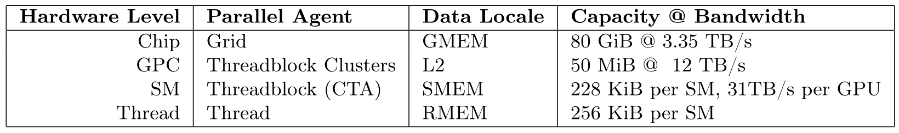

**表 1.** NVIDIA Hopper H100 SXM5 GPU の thread-memory 階層。

**非同期性と warp 特化:** GPU は、並行性と非同期性によってメモリ遅延と実行遅延を隠すスループットプロセッサである。GMEM と SMEM 間の非同期メモリコピー用に、Hopper は専用ハードウェア Tensor Memory Accelerator (TMA) を備える [Nvi24c]。さらに Ampere など従来のアーキテクチャとは異なり、warpgroup 全体の WGMMA 命令 [Ptx24] を介して公開される Hopper の Tensor Core も非同期で、shared memory から入力を直接取得できる。

非同期性のハードウェア支援により warp 特化 kernel が可能になる。CTA の warp を producer または consumer に分け、それぞれデータ移動または計算だけを発行する。一般に、これはコンパイラが最適な命令スケジュールを生成する能力を高める [Bau11]。加えて Hopper は、`setmaxnreg` を使った warpgroup 間の register 動的再割り当てを支援する [Ptx24]。そのため MMA を実行する warp は、TMA を発行するだけの warp より大きな割合の RMEM を取得できる。TMA には一つの thread しか必要ない。

**低精度数値形式:** 現代の GPU は低精度計算を高速化する専用ハードウェアを備える。たとえば WGMMA 命令で Hopper の FP8 Tensor Core を対象にすると、FP16 または BF16 の 2 倍の SM 当たりスループットを得られる。

ただし、FP8 WGMMA を正しく呼び出すには operand のレイアウト制約を理解する必要がある。$M\times K$ 行列 $A$ と $N\times K$ 行列 $B$ に対して $A\times B^{\top}$ を計算する GEMM を考える。operand $A$ または $B$ が外側の $M$ または $N$ 次元で連続なら *mn-major*、内側の $K$ 次元で連続なら *k-major* と呼ぶ。FP16 WGMMA は、SMEM 内の operand について mn-major と k-major の両方を受け付けるが、FP8 WGMMA が支援するのは k-major だけである。さらに Attention のように連続する GEMM を一つの kernel へ融合する場面では、FP32 accumulator と FP8 operand のレイアウトが衝突し、依存関係にある FP8 WGMMA の呼び出しを妨げる。

Attention におけるこれらのレイアウト制約は FP8 アルゴリズムの設計変更を必要とする。[第 3.3 節](#section-3-3)で説明する。

<span id="section-2-3"></span>

### 2.3 標準 Attention と FlashAttention

[Dao22] に従い、中間行列 $\mathbf{S}$ と $\mathbf{P}$ を HBM に実体化する GPU 上の Attention 実装を**標準 Attention**と呼ぶ。FlashAttention の主な着想は、softmax reduction の局所版を使い、高コストな中間読み書きを避けて Attention を一つの kernel に融合することだった。局所 softmax は、[アルゴリズム 1](#algorithm-01)の consumer mainloop における 18-19 行と、$\mathbf{O}$ のブロック再スケーリングに対応する。この手順が実際に $\mathbf{O}$ を計算することの簡潔な導出は [Dao23b] にある。

<span id="section-3"></span>

## 3 FlashAttention-3 アルゴリズム

本節では FlashAttention-3 アルゴリズムを説明する。簡単のため forward pass に焦点を当て、backward pass は[第 7.1 節](#section-7-1)で説明する。まず、warp 特化とリング状 SMEM buffer を FlashAttention-2 の基本アルゴリズムへ統合する方法を示す。次に WGMMA の非同期性を利用し、GEMM-softmax を重ねる 2 段 pipeline を定義する方法を述べる。最後に、レイアウト整合性と、ブロック量子化および非コヒーレント処理による精度の両面から、FP8 に必要な変更を説明する。

<span id="section-3-1"></span>

### 3.1 Warp 特化と ping-pong スケジューリングによる Producer-Consumer 非同期化

**Warp 特化。** FlashAttention-2 と同様、FlashAttention-3 の forward pass は batch size、head 数、query 系列長について自明に並列化できる。したがって、query 行列の tile $\mathbf{Q}_{i}$ を処理して対応する出力 tile $\mathbf{O}_{i}$ を計算する、CTA レベルのアルゴリズムを示せば十分である。説明を単純にするため、まず GEMM-softmax の重なりを**加えず**、リング状 SMEM buffer を用いる warp 特化方式を示す。$d$ を head 次元、$N$ を系列長とし、query block size $B_{r}$ を固定して、$\mathbf{Q}$ を $T_{r}=\lceil\frac{N}{B_{r}}\rceil$ 個の block $\mathbf{Q}_{1},..,\mathbf{Q}_{T_{r}}$ に分割する。

<span id="algorithm-01"></span>

**アルゴリズム 1: Consumer 内の重なりを使わない FlashAttention-3 forward pass、CTA view。**

- **入力:** HBM 上の行列 $\mathbf{Q}_i \in \mathbb{R}^{B_r \times d}$ および $\mathbf{K}, \mathbf{V} \in \mathbb{R}^{N \times d}$、key block size $B_c$、$T_c = \lceil \frac{N}{B_c} \rceil$。
- $s$ 段リング状 SMEM buffer による barrier 同期を管理する pipeline object を初期化する。
- **もし** producer warpgroup 内なら:
  - 所定数の register を解放する。
  - $\mathbf{Q}_i$ を HBM から shared memory へロードする。
  - 完了時に commit し、$\mathbf{Q}_i$ のロードを consumer に通知する。
  - **各** $0 \le j < T_c$ について:
    - buffer の第 $(j\,\%\,s)$ 段が消費されるまで待つ。
    - $\mathbf{K}_j, \mathbf{V}_j$ を HBM から shared memory の第 $(j\,\%\,s)$ 段へロードする。
    - 完了時に commit し、$\mathbf{K}_j, \mathbf{V}_j$ のロードを consumer に通知する。
- **それ以外なら:**
  - consumer warp 数に応じて所定数の register を再割り当てする。
  - オンチップで $\mathbf{O}_i = (0) \in \mathbb{R}^{B_r \times d}$ および $\ell_i, m_i = (0), (-\infty) \in \mathbb{R}^{B_r}$ を初期化する。
  - $\mathbf{Q}_i$ が shared memory にロードされるまで待つ。
  - **各** $0 \le j < T_c$ について:
    - $\mathbf{K}_j$ が shared memory にロードされるまで待つ。
    - $\mathbf{S}_i^{(j)} = \mathbf{Q}_i \mathbf{K}_j^\top$ (SS-GEMM) を計算する。Commit して待つ。
    - $m_i^{\mathrm{old}} = m_i$ を保存し、$m_i = \max(m_i^{\mathrm{old}}, \mathrm{rowmax}(\mathbf{S}_i^{(j)}))$ を計算する。
    - $\widetilde{\mathbf{P}}_i^{(j)} = \exp(\mathbf{S}_i^{(j)} - m_i)$ および $\ell_i = \exp(m_i^{\mathrm{old}} - m_i) \ell_i + \mathrm{rowsum}(\widetilde{\mathbf{P}}_i^{(j)})$ を計算する。
    - $\mathbf{V}_j$ が shared memory にロードされるまで待つ。
    - $\mathbf{O}_i = \mathrm{diag}(\exp(m_i^{\mathrm{old}} - m_i))^{-1} \mathbf{O}_i + \widetilde{\mathbf{P}}_i^{(j)} \mathbf{V}_j$ (RS-GEMM) を計算する。Commit して待つ。
    - buffer の第 $(j\,\%\,s)$ 段を producer に解放する。
  - $\mathbf{O}_i = \mathrm{diag}(\ell_i)^{-1} \mathbf{O}_i$ および $L_i = m_i + \log(\ell_i)$ を計算する。
  - $\mathbf{O}_i$ と $L_i$ を、$\mathbf{O}$ と $L$ の第 $i$ block として HBM へ書き込む。

Hopper 上の[アルゴリズム 1](#algorithm-01)では、register の割り当てと解放に `setmaxnreg`、$\mathbf{Q}_{i}$ および $\{\mathbf{K}_{j},\mathbf{V}_{j}\}_{0\leq j<T_{c}}$ のロードに TMA、consumer mainloop の GEMM 実行に WGMMA を用いる。SS または RS prefix は、第 1 operand の供給元が shared memory か register file かを示す。[アルゴリズム 1](#algorithm-01)の実行フローを読む際には、非同期性により TMA load の発行が他の load の完了待ちで停止しない点に注意が必要である。また producer mainloop では、buffer が満たされる最初の $s$ iteration に wait は発行されない。

**Ping-pong スケジューリング。** WGMMA と TMA の非同期性を warp 特化と組み合わせると、一つの warpgroup の softmax 計算を別の warpgroup の GEMM と重ねられる。現代のハードウェアアクセラレータでは、非行列積処理のスループットが行列積処理よりはるかに低い。たとえば H100 SXM5 GPU の FP16 行列積は 989 TFLOPS だが、softmax に必要な指数関数などの特殊関数は 3.9 TFLOPS にすぎない [+5]。head 次元 128 の FP16 Attention forward pass では、行列積の FLOPS は指数演算数の 512 倍だが、指数関数のスループットは 256 倍低いため、指数関数は行列積に比べ 50% の cycle を要しうる。FP8 では行列積のスループットだけが倍増し、指数関数は変わらないため、状況はさらに悪い。

指数関数は独立したハードウェア unit (multi-function unit) で実行されるため、Tensor Core が行列積を実行している間に指数計算をスケジュールするのが理想である。そのため同期 barrier (`bar.sync` 命令) を使い、warpgroup 1 の GEMM、すなわち一つの iteration の GEMM1 ($\mathbf{P}\mathbf{V}$) と次の iteration の GEMM0 ($\mathbf{Q}\mathbf{K}^{\top}$) を warpgroup 2 の GEMM より先にスケジュールさせる。結果として warpgroup 1 の softmax は、warpgroup 2 が GEMM を実行している間にスケジュールされる。次に役割を入れ替え、warpgroup 2 が softmax、warpgroup 1 が GEMM を実行するため、ping-pong スケジューリングと呼ぶ。[図 1](#figure-01)に示す。実際の ping-pong スケジューリングは図ほど整然としていないものの、通常は性能が向上する。たとえば head 次元 128、系列長 8192 の FP16 forward は 570 TFLOPS から 620-640 TFLOPS へ向上する。

<span id="figure-01"></span>

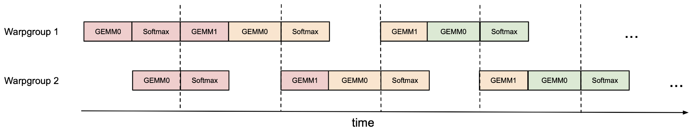

**図 1.** 2 warpgroup の ping-pong スケジューリングによる softmax と GEMM の重なり。一方の warpgroup の softmax は、他方の warpgroup が GEMM を実行しているときにスケジュールされる。同じ色は同じ iteration を表す。

**Attention の変種。** Multi-query Attention [Sha19] と Grouped-query Attention [Ain23a] では FlashAttention-2 の方法に従って tensor index を調整し、HBM 上で $\mathbf{K}$ と $\mathbf{V}$ を複製しない。

<span id="section-3-2"></span>

### 3.2 Warpgroup 内での GEMM と softmax の重なり

一つの warpgroup 内でも、softmax の一部の命令を GEMM の一部の命令と重ねられる。そのための技法を一つ説明する。

Attention アルゴリズムの内側ループ (mainloop) 内には逐次依存があり、単一 iteration 内の並列化を妨げる。たとえば局所 softmax (18-19 行) は最初の GEMM の出力 $\mathbf{S}_{i}^{(j)}$ に依存し、2 番目の GEMM はその結果 $\widetilde{\mathbf{P}}_{i}^{(j)}$ を operand とする。実際、[アルゴリズム 1](#algorithm-01)の 17 行と 21 行にある wait 文は softmax と GEMM の実行を直列化する。しかし、register に buffer を追加して iteration 間を pipeline 化すれば、この依存関係を断ち切れる。この発想に基づき、次の 2 段 [+6] GEMM-softmax pipeline アルゴリズムを提案する。

<span id="figure-02"></span>

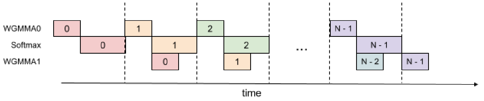

**図 2.** 2 段 WGMMA-softmax pipeline

<span id="algorithm-02"></span>

**アルゴリズム 2: FlashAttention-3 の consumer warpgroup forward pass。**

- **入力:** HBM 上の行列 $\mathbf{Q}_i \in \mathbb{R}^{B_r \times d}$ および $\mathbf{K}, \mathbf{V} \in \mathbb{R}^{N \times d}$、key block size $B_c$、$T_c = \lceil \frac{N}{B_c} \rceil$。
- consumer warp 数に応じて所定数の register を再割り当てする。
- オンチップで $\mathbf{O}_i = (0) \in \mathbb{R}^{B_r \times d}$ および $\ell_i, m_i = (0), (-\infty) \in \mathbb{R}^{B_r}$ を初期化する。
- $\mathbf{Q}_i$ と $\mathbf{K}_0$ が shared memory にロードされるまで待つ。
- WGMMA で $\mathbf{S}_{\mathrm{cur}} = \mathbf{Q}_i \mathbf{K}_0^\top$ を計算する。Commit して待つ。
- $\mathbf{K}$ 用 buffer の第 $0$ 段を解放する。
- $\mathbf{S}_{\mathrm{cur}}$ に基づいて $m_i$、$\widetilde{\mathbf{P}}_{\mathrm{cur}}$、$\ell_i$ を計算し、$\mathbf{O}_i$ を再スケーリングする。
- **各** $1 \le j < T_c - 1$ について:
  - $\mathbf{K}_j$ が shared memory にロードされるまで待つ。
  - WGMMA で $\mathbf{S}_{\mathrm{next}} = \mathbf{Q}_i \mathbf{K}_{j}^\top$ を計算する。Commit するが待たない。
  - $\mathbf{V}_{j-1}$ が shared memory にロードされるまで待つ。
  - WGMMA で $\mathbf{O}_{i} = \mathbf{O}_{i} + \widetilde{\mathbf{P}}_{\mathrm{cur}} \mathbf{V}_{j-1}$ を計算する。Commit するが待たない。
  - WGMMA $\mathbf{Q}_i \mathbf{K}_{j}^\top$ を待つ。
  - $\mathbf{S}_{\mathrm{next}}$ に基づいて $m_i$、$\widetilde{\mathbf{P}}_{\mathrm{next}}$、$\ell_i$ を計算する。
  - WGMMA $\widetilde{\mathbf{P}}_{\mathrm{cur}} \mathbf{V}_{j-1}$ を待ち、$\mathbf{O}_i$ を再スケーリングする。
  - buffer の第 $(j\,\%\,s)$ 段と第 $(j-1\,\%\,s)$ 段を、それぞれ $\mathbf{K}$ と $\mathbf{V}$ 用に解放する。
  - $\mathbf{S}_{\mathrm{next}}$ を $\mathbf{S}_{\mathrm{cur}}$ へコピーする。
- $\mathbf{V}_{T_c - 1}$ が shared memory にロードされるまで待つ。
- WGMMA で $\mathbf{O}_{i} = \mathbf{O}_{i} + \widetilde{\mathbf{P}}_{\mathrm{last}} \mathbf{V}_{T_c - 1}$ を計算する。Commit して待つ。
- **Epilogue:**
  - $m_i$ に基づいて $\mathbf{O}_{i}$ を再スケーリングする。
  - $m_i$ と $\ell_i$ に基づいて $L_i$ を計算する。
  - $\mathbf{O}_{i}$ と $L_i$ を、$\mathbf{O}$ と $L$ の第 $i$ block として HBM へ書き込む。

[アルゴリズム 2](#algorithm-02)は[アルゴリズム 1](#algorithm-01)の consumer path を置き換え、FP16 精度の完全な FlashAttention-3 アルゴリズムを構成する。高水準では WGMMA を非同期 GEMM の換喩として用いる。Mainloop (8-16 行) では iteration $j$ の 2 番目の WGMMA (11 行) と iteration $j+1$ の softmax (13 行) が重なる。

上に示した pipeline 構造は理論上の性能向上をもたらすが、実用上はいくつかの点を考慮する必要がある。

**コンパイラによる並べ替え。** 疑似コードは理想的な実行順序を表すが、コンパイラ (NVCC) は最適化のため命令を並べ替えることが多い。綿密に設計した WGMMA と非 WGMMA 処理の pipeline 順序が乱れ、予期しない動作や性能向上の縮小を招く可能性がある。SASS code の解析では、コンパイラが想定どおり重なった code を生成することを確認した ([第 7.2 節](#section-7-2))。

**Register pressure。** 最適な性能を保つには register spill を最小化すべきである。しかし 2 段 pipeline は、中間結果の保存と段間の文脈維持に追加 register を必要とする。具体的には $\mathbf{S}_{\mathrm{next}}$ をもう一つ register に保持する必要があり、threadblock 当たり $B_{r}\times B_{c}\times\text{sizeof}(\text{float})$ の register が追加される。この増加は、同じく register を多く使う大きな block size と衝突しうる。実際には profiling 結果に基づいてトレードオフを判断する必要がある。

**3 段 pipeline。** 上の 2 段アルゴリズムを拡張し、2 番目の WGMMA と softmax をさらに重ねる 3 段版を提案する。Tensor Core 利用率をさらに高められる可能性がある一方、pipeline stage の追加でいっそう多くの register を要し、tile size と pipeline depth の均衡が難しくなる。3 段アルゴリズムの詳細と評価結果は[第 7.3 節](#section-7-3)に示す。

<span id="section-3-3"></span>

### 3.3 FP8 による低精度化

<span id="figure-03"></span>

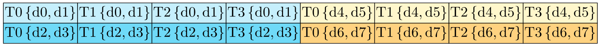

**図 3.** FP32 accumulator register の WGMMA レイアウト。行 0 と 8、thread 0-3、entry 0-7。

<span id="figure-04"></span>

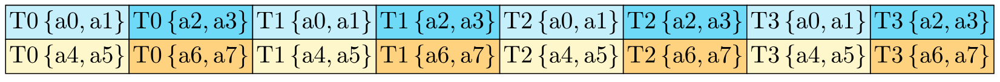

**図 4.** FP8 operand A register の WGMMA レイアウト。行 0 と 8、thread 0-3、entry 0-7。

**効率: レイアウト変換。** FP8 精度で FlashAttention-3 の forward pass を計算する場合、レイアウト整合性について FP16 にはない課題が加わる。

第一に、入力 tensor $\mathbf{Q}$、$\mathbf{K}$、$\mathbf{V}$ は通常 head 次元で連続している。しかし、2 番目の GEMM で FP8 WGMMA の k-major 制約を満たすには、$\mathbf{V}$、より正確には SMEM にロードする $\mathbf{V}$ の tile が系列長次元で連続していなければならない。TMA load 自体は連続次元を変えられないため、(1) 前処理として GMEM 上で $\mathbf{V}$ を転置するか、(2) $\mathbf{V}$ の tile を SMEM へロードしてから kernel 内で転置する必要がある。選択肢 (1) は、(1a) rotary embedding など直前の処理の epilogue に転置を融合するか、(1b) 系列長次元と head 次元の stride を交換する単独の前処理転置 kernel [+7] を呼び出すことで実装できる。しかし (1a) は標準ライブラリへの統合が難しく、(1b) は推論のような memory-bound の状況では無駄が大きすぎる。

そこで FP8 FlashAttention-3 では選択肢 (2) を採用する。Kernel 内転置には LDSM (`ldmatrix`) と STSM (`stmatrix`) 命令を利用する。これらは warp 内の thread が共同で、128 byte 単位に SMEM から RMEM へ load し、RMEM から SMEM へ store する。 [+8] LDSM/STSM は register 効率に優れるため producer warpgroup で実行でき、memory copy の際にレイアウトを転置することもできる。さらに最初の iteration の後は、次の $\mathbf{V}$ tile の転置を、直前の $\mathbf{V}$ tile と現在の $\mathbf{K}$ tile に関係する二つの WGMMA の背後で実行するよう配置できる。

第二に、FP16 と異なり、FP8 WGMMA の FP32 accumulator の memory layout は、register に保持した operand A に想定される layout と異なる。[図 3](#figure-03)と[図 4](#figure-04)に二つの layout の一部を示す。entry は各 thread の register に記載順で保持される。Byte permute 命令により、最初の WGMMA の accumulator を 2 番目の WGMMA に適した形式へ変換し、kernel 内転置が作る $\mathbf{V}$ tile の layout と整合させられる。具体的には[図 3](#figure-03)を参照し、順序を次のように変える。

$$
\{\verb|d0 d1 d4 d5 d2 d3 d6 d7|\},
$$

この register permutation を 8 byte ごとに繰り返す。$\mathbf{P}$ tile の論理形状で見ると、この操作は列を置換する。たとえば列 $0189$ が最初の 4 列になる。WGMMA が正しい出力 tile を計算できるよう、kernel 内転置で $\mathbf{V}$ tile の対応する行置換を書き出すよう配置できる。 [+9]

**精度: ブロック量子化と非コヒーレント処理。** FP8 (e4m3) 形式は仮数に 3 bit、指数に 4 bit しか使わないため、FP16/BF16 より数値誤差が大きい。さらに、大規模モデルには他の大多数の値より絶対値の大きい外れ値 [Det22, Sun24c] が通常存在し、量子化を難しくする。一般的には tensor ごとに一つの scalar、たとえば $\mathbf{Q}$、$\mathbf{K}$、$\mathbf{V}$ にそれぞれ一つを保持する per-tensor scaling [Mic22] を使う。FP8 Attention の数値誤差を減らすため、二つの技法を用いる。

- **ブロック量子化:** ブロックごとに一つの scalar を保持する。$\mathbf{Q}$、$\mathbf{K}$、$\mathbf{V}$ をそれぞれ $B_{r}\times d$ または $B_{c}\times d$ のブロックへ分割し、別々に量子化する。この量子化は、Attention の直前の処理、たとえば rotary embedding に融合でき、追加の低速化を生じない。Rotary embedding は memory bandwidth bound だからである。FlashAttention-3 はもともとブロック単位で動作するため、追加計算なしに $\mathbf{S}$ の各 block をスケーリングし、このブロック量子化を反映できる。
- **非コヒーレント処理:** 外れ値を均すため、FP8 へ量子化する前に $\mathbf{Q}$ と $\mathbf{K}$ にランダム直交行列 $\mathbf{M}$ を掛ける。$\mathbf{M}$ は直交行列なので $\mathbf{M}\mathbf{M}^{\top}=I$ であり、$(\mathbf{Q}\mathbf{M})(\mathbf{K}\mathbf{M})^{\top}=\mathbf{Q}\mathbf{K}^{\top}$ となる。つまり、$\mathbf{Q}$ と $\mathbf{K}$ の両方に $\mathbf{M}$ を掛けても Attention の出力は変わらない。$\mathbf{Q}\mathbf{M}$ または $\mathbf{K}\mathbf{M}$ の各 entry は $\mathbf{Q}$ または $\mathbf{K}$ の entry のランダムな和となるため、外れ値を「拡散」し、量子化誤差を減らせる。実際には [Che24b] と [Tse24] に従い、$\mathbf{M}$ を $\pm 1$ のランダム対角行列と Hadamard 行列の積とする。これにより $O(d^{2})$ ではなく $O(d\log d)$ で乗算でき、追加計算なしに rotary embedding へ融合できる。

これら二つの技法が数値誤差を最大 $2.6\times$ 減らすことを[第 4.3 節](#section-4-3)で検証する。

<span id="section-4"></span>

## 4 実験による検証

CUTLASS [Nvi24a] の WGMMA や TMA の抽象化などを用いて FlashAttention-3 を実装し、効率と精度を評価する。

- **Attention のベンチマーク。** 各種系列長で FlashAttention-3 の実行時間を測定し、PyTorch の標準実装、FlashAttention-2、Triton 版 FlashAttention-2 (H100 固有命令を使用)、および cuDNN にある H100 GPU 向けに最適化された vendor の FlashAttention-2 実装と比較する。FlashAttention-3 は FlashAttention-2 より最大 $2.0\times$、Triton 版 FlashAttention-2 より $1.5\times$ 高速であることを確認した。FlashAttention-3 は最大 740 TFLOPs/s、H100 GPU の理論最大 TFLOPs/s の 75% に達する。
- **Ablation study。** Warp 特化と GEMM-softmax pipeline によるアルゴリズム上の改善が FlashAttention-3 の高速化に寄与することを確認する。
- **FP8 Attention の精度。** ブロック量子化と非コヒーレント処理により FP8 FlashAttention-3 の数値誤差が $2.6\times$ 小さくなることを検証する。

<span id="section-4-1"></span>

### 4.1 Attention のベンチマーク

H100 80GB SXM5 GPU 上で、FP16 入力について設定を変え、因果 mask なし・あり、head 次元 64 または 128 で各種 Attention 手法の実行時間を測定する。[図 5](#figure-05)と[図 6](#figure-06)の結果から、FlashAttention-3 は forward pass で FlashAttention-2 より約 1.5-$2.0\times$、backward pass で 1.5-$1.75\times$ 高速である。標準 Attention 実装と比べると最大 3-$16\times$ 高速である。中程度から長い系列 (1k 以上) では、H100 GPU 向けに最適化された vendor library (closed source の cuDNN) よりも高速である。

**ベンチマーク設定:** 系列長を 512、1k、…、16k と変え、token 総数が 16k となるよう batch size を設定する。Hidden 次元は 2048、head 次元は 64、128、256 のいずれか、すなわち 32、16、8 head とする。Forward pass の FLOPs は次式で計算する。

$$
\begin{aligned}
4\cdot\text{seqlen}^{2}\cdot\text{head dimension}\\
{}\cdot\text{number of heads}.
\end{aligned}
$$

因果 mask ありでは、計算される entry が約半分であることを反映してこの値を 2 で割る。Backward pass の FLOPs は forward pass の 2.5 倍とする。Forward pass には 2 回、backward pass には再計算により 5 回の行列積があるためである。

<span id="figure-05"></span>

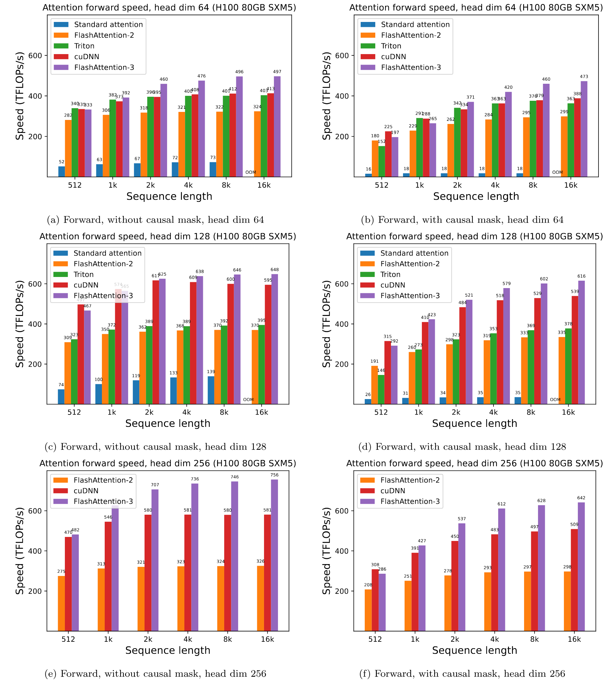

**図 5.** H100 GPU 上の Attention forward 速度 (FP16/BF16)

<span id="figure-06"></span>

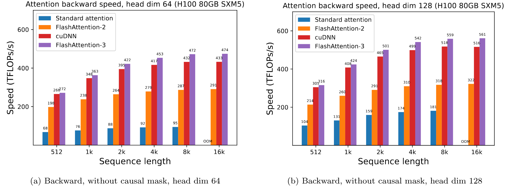

**図 6.** H100 GPU 上の Attention backward 速度 (FP16/BF16)

同様の設定で FP8 forward pass の実行時間も測定する。Head 次元 256 の結果を[図 7](#figure-07)に、全結果を[第 8.2 節](#section-8-2)に示す。

<span id="figure-07"></span>

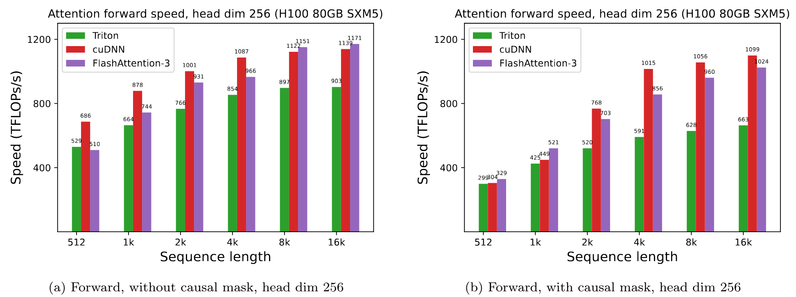

**図 7.** H100 GPU 上の Attention forward 速度 (FP8)

<span id="section-4-2"></span>

### 4.2 Ablation study: 2 段 pipeline 実験

固定パラメータ $\{\text{batch},\text{seqlen},\text{nheads},\text{hdim}\}=\{4,8448,16,128\}$ の非因果 FP16 FlashAttention-3 について、2 段 WGMMA-softmax pipeline と warp 特化の両方を ablation する。[表 2](#table-02)の結果は、warp 特化による非同期性と GEMM-softmax の重なりというアルゴリズム上の改善により、570 TFLOPs から 661 TFLOPs へ大きく高速化することを確認している。

<span id="table-02"></span>

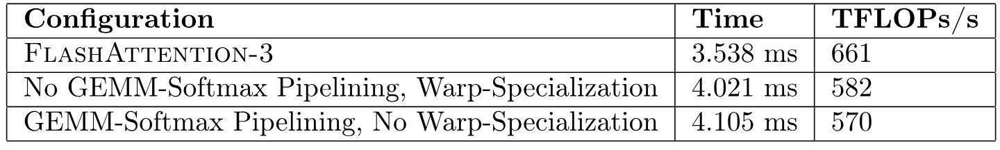

**表 2.** Pipeline ablation の測定値

<span id="section-4-3"></span>

### 4.3 数値誤差の検証

FlashAttention の数値誤差 [Gol24] が注目されているため、FP64 の参照実装を基準として FlashAttention-2、FlashAttention-3、標準 Attention 実装を比較する。LLM の外れ値特徴と activation [Det22, Sun24c] を模擬するため、$\mathbf{Q},\mathbf{K},\mathbf{V}$ の entry を次の分布から生成する。

$$
\mathcal{N}(0,1)+\mathcal{N}(0,100)\cdot\mathrm{Bernoulli}(0.001).
$$

つまり、各 entry は平均 0、標準偏差 1 の正規分布に従うが、0.1% の entry には標準偏差 10 の正規分布に従う独立項を加える。次に[表 3](#table-03)の root mean squared error (RMSE) を測定する。FP16 では中間結果 (softmax) を FP32 のまま保持するため、FlashAttention-2 と FlashAttention-3 の RMSE は標準実装より $1.7\times$ 小さい。FP8 の baseline Attention は per-tensor scaling を使い、行列積 accumulator は FP32、中間の softmax 結果は FP16 とする。ブロック量子化と非コヒーレント処理により、FP8 の FlashAttention-3 はこの baseline より $2.6\times$ 高精度である。

<span id="table-03"></span>

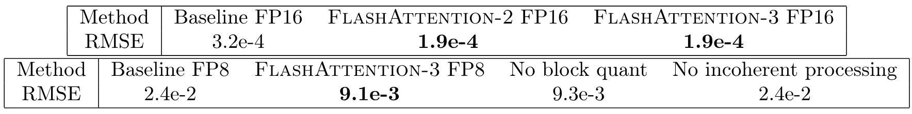

**表 3.** FP16 と FP8 (e4m3) の数値誤差比較。

<span id="section-5"></span>

## 5 議論、制約、結論

FlashAttention-3 により、非同期性と低精度などの新しいプログラミング技法とハードウェア機能が、Attention の効率と精度に大きな影響を与えられることを示した。FlashAttention-2 と比べて Attention を 1.5-$2.0\times$ 高速化し、標準 per-tensor 量子化と比べて FP8 の数値誤差を $2.6\times$ 減らした。今後取り組みたい制約として、LLM 推論向けの最適化、FP8 kernel への persistent kernel 設計の統合 [+10]、大規模学習における低精度 Attention の影響の解明がある。本研究は Hopper GPU に焦点を当てたが、開発した技法は他のハードウェアアクセラレータにも適用できると考えている。より高速かつ高精度な Attention primitive により、長いコンテキストを扱う課題で新しい応用が可能になることを期待する。

## 謝辞

Hopper のプログラミングモデルを理解する手助けと、FlashAttention-3 実装のための簡潔で強力な building block を提供するライブラリに対して、NVIDIA CUTLASS team、とりわけ Haicheng Wu、Aniket Shivam、Cris Cecka に感謝する。FP8 の kernel 内転置という着想について cuDNN team に感謝する。GEMM と softmax を重ねる着想は Christopher Ré、Benjamin Spector、Aniket Shivam、Markus Hoehnerbach との洞察に富む議論から得た。Ping-pong スケジューリングは CUTLASS の warp 特化 ping-pong GEMM 実装を取り入れた。FlashAttention を PyTorch へ統合した Driss Guessous に感謝する。FlashAttention-3 は、Attention の各種変種についての Horace He、分散 Attention についての Hao Liu と Phil Wang、量子化についての Daniel Haziza と Chris De Sa との有益な議論からも恩恵を受けた。計算資源を提供した Meta、Together AI、Princeton Language and Intelligence (PLI) に感謝する。

<span id="section-6"></span>

## 6 関連研究

**Attention の変種と分散 Attention。** Transformer アーキテクチャ [Vas17] によって Attention が普及して以来、より長い系列へ拡張するために Attention を近似する研究が大量に行われてきた。近似手法は一般に sparse と low-rank の二つに分類できる。Sparse Attention は Attention 行列 $\mathrm{softmax}(\mathbf{Q}\mathbf{K}^\top)$ の一部の entry だけを計算し、他は 0 と仮定する。どの entry を 0 とするかは手法ごとに異なり、固定 pattern [Chi19]、sliding window [Bel20a]、hashing [Kit20] または routing [Roy21] による動的 pattern がある。Low-rank 手法は Attention 行列に low-rank 構造があると仮定し、query と key に pointwise nonlinear function [Kat20] と random projection [Cho20a, Pen21, Xio21] を適用する。Sparse 近似と low-rank 近似を組み合わせ、品質を改善することもできる [Zah20, Che21b]。しかし、近似手法は通常、標準 Attention と同じモデル品質を実現できず [Tay20a]、大規模モデルのほとんどは採用していない。

推論効率を高めるため KV cache を縮小する別の Attention 変種もある。Multi-query Attention [Sha19] と Grouped-query Attention [Ain23a] は複数の $\mathbf{K}$ と $\mathbf{V}$ head を結びつけ、複数の query head が同じ key と value の head と相互作用する。Multi-head Latent Attention [Dee24] は $\mathbf{K}$ と $\mathbf{V}$ を共有行列の low-rank projection として parameterize し、KV cache をさらに縮小する。しかし、いずれも学習中の中核計算 $\mathrm{softmax}(\mathbf{Q}\mathbf{K}^\top)\mathbf{V}$ を変えず、$\mathbf{Q},\mathbf{K},\mathbf{V}$ の取得方法だけを変える。したがって、標準 Attention 計算の効率または精度が向上すれば、これらの手法にも有益である。

さらに長いコンテキストへ拡張するには、Attention 計算を複数 GPU に分散できる。Ring Attention [Liu23, Liu24l] とその変種 [Bra23] は最大 100 万 token のコンテキスト長に達する。FlashAttention または FlashAttention-2 を primitive として使うため、FlashAttention-3 の改善はこうした分散 Attention にも有益である。

**代替アーキテクチャ。** Attention の制約を動機として、さまざまな代替アーキテクチャが提案されている。これらは Linear Attention [Kat20] と Recurrent Neural Network (RNN) の関係に基づく。RWKV [Pen23b]、H3 [Dao22g]、MEGA [Ma23b]、Retnet [Sun23b] は、より高度な recurrence により Linear Attention の単純な累積和の表現力を高める。Mamba [Gu23] と xLSTM [Bec24] は recurrence に学習可能な重み付けを使い、小規模または中規模の言語モデリングで Transformer と同等の品質を実現できる。Token mixing 行列の構造という観点から、これらは Linear Attention の一般化と結びつけられる [Dao24]。Jamba [Jam24]、Zamba [Zam24]、Megalodon [Ma24e]、Mamba2-hybrid [Wal24] など、中規模から大規模なモデルで利用され始めている。最高の品質を得るため、SSM と RNN を基盤とするモデルもなお多くの Attention 層を使う。本研究の Attention 高速化技法は、これらの代替アーキテクチャの高速化にも役立つと考えている。

**低精度 Attention。** 量子化は Attention を高速化する有望な方法だが、従来研究の多くは推論効率向上のため KV cache の空間を減らすことに焦点を当てる。QuIP [Che24b] と QuIP# [Tse24] は非コヒーレント処理で量子化誤差を減らし、本研究ではこの技法を FP8 FlashAttention-3 に適用した。近年の研究によれば、推論時の KV cache は 4、3、さらには 2 bit まで高度に圧縮できる [Hoo24, Liu24c]。しかし、安定した学習には通常より高い精度が必要なため、学習中の量子化は依然として難しい。

**ハードウェア対応アルゴリズム。** 本研究は、新しい命令セットを利用し、ネイティブな非同期プログラミングモデルを採用するための microarchitecture 固有 tuning に焦点を当てる。ハードウェア対応アルゴリズムの共同設計には、これと直交する軸もある。最近の例である LeanAttention [San24a] は、逐次 token 生成段階における低い GPU occupancy と高い memory bandwidth 要求を推論の主な bottleneck と捉え、Stream-K load balancing [Osa23] と同様の、より賢い load balancing により最適化して、ほぼ peak occupancy を実現する。特定ハードウェア向けの GEMM 最適化にも、同様の技法を数多く用いる大きな研究分野がある。たとえば [Abd16] は K40c Graphics Processing Unit (GPU) 上で固定・可変 size の両方に対応する高性能 batched GEMM kernel を提示し、専用 GEMM 設計と包括的な autotuning によって当時最高水準の性能を実現している。

<span id="section-7"></span>

## 7 アルゴリズムの補足

<span id="section-7-1"></span>

### 7.1 Backward pass における warp 特化による非同期化

Forward pass の[第 3.1 節](#section-3-1)と同様に、warp 特化で非同期性を扱う。Forward pass の単純な producer-consumer pattern に加え、$\mathbf{dQ}$ writer という役割を一つ追加する。各 threadblock が生成した $\mathbf{dQ}$ をグローバルな $\mathbf{dQ}$ へ累積する必要があるためである。この $\mathbf{dQ}$ 累積は、多数の threadblock が同じ場所に書き込むため memory contention を生じる。専用 warp でこの処理と非同期性を扱えば、threadblock 内の他の warp が次の計算、すなわち行列積を実行するのを妨げずに済む。

Warp 特化を用いた backward pass を[アルゴリズム 3](#algorithm-03)に示す。

<span id="algorithm-03"></span>

**アルゴリズム 3: Warp 特化を用いる FlashAttention-3 backward pass。**

- **入力:** HBM 上の行列 $\mathbf{Q}, \mathbf{K}, \mathbf{V}, \mathbf{O}, \mathbf{dO} \in \mathbb{R}^{N \times d}$、HBM 上の logsumexp vector $L \in \mathbb{R}^N$、block size $B_c$、$B_r$。
- 前処理 kernel で $D = \mathrm{rowsum}(\mathbf{dO} \circ \mathbf{O}) \in \mathbb{R}^d$ (pointwise multiply) を計算し、$D$ を HBM へ書き込み、それぞれ size $B_r$ の $T_r$ block $D_1, \dots, D_{T_r}$ に分割する。
- $\mathbf{Q}$ を、それぞれ size $B_r \times d$ の $T_r = \left\lceil\frac{N}{B_r} \right\rceil$ block $\mathbf{Q}_1, \dots, \mathbf{Q}_{T_r}$ に分割する。$\mathbf{K}, \mathbf{V}$ を、それぞれ size $B_c \times d$ の $T_c = \left\lceil \frac{N}{B_c} \right\rceil$ block $\mathbf{K}_1, \dots, \mathbf{K}_{T_c}$ と $\mathbf{V}_1, \dots, \mathbf{V}_{T_c}$ に分割する。
- $\mathbf{dO}$ を、それぞれ size $B_r \times d$ の $T_r$ block $\mathbf{dO}_i, \dots, \mathbf{dO}_{T_r}$ に分割する。$L$ を、それぞれ size $B_r$ の $T_r$ block $L_i, \dots, L_{T_r}$ に分割する。
- $s$ 段リング状 SMEM buffer による barrier 同期を管理する pipeline object を初期化する。
- **もし** producer warpgroup 内なら:
  - 所定数の register を解放する。
  - $\mathbf{K}_j$ と $\mathbf{V}_j$ を HBM から shared memory へロードする。
  - 完了時に commit し、$\mathbf{K}_j$ と $\mathbf{V}_j$ のロードを consumer に通知する。
  - **各** $1 \le i \leq T_r$ について:
    - buffer の第 $(i\,\%\,s)$ 段が消費されるまで待つ。
    - $\mathbf{Q}_i, \mathbf{dO}_i$ を HBM から shared memory の第 $(i\,\%\,s)$ 段へロードする。
    - 完了時に commit し、$\mathbf{Q}_i, \mathbf{dO}_i$ のロードを consumer に通知する。
- **それ以外で** consumer warpgroup 内なら:
  - consumer warp 数に応じて所定数の register を再割り当てする。
  - オンチップで $\mathbf{dK}_j = (0)_{B_c \times d}, \mathbf{dV}_j = (0)_{B_c \times d}$ を初期化する。
  - $\mathbf{K}_j$ と $\mathbf{V}_j$ が shared memory にロードされるまで待つ。
  - **各** $1 \le i \leq T_r$ について:
    - $\mathbf{Q}_i$ が shared memory にロードされるまで待つ。
    - $L_i, D_i$ を HBM からオンチップ SRAM へロードする。
    - オンチップで $\mathbf{S}_{i}^{(j)} = \mathbf{Q}_i \mathbf{K}_j^\top \in \mathbb{R}^{B_r \times B_c}$ (SS-GEMM) を計算する。Commit する。
    - $\mathbf{dO}_i$ が shared memory にロードされるまで待つ。
    - オンチップで $\mathbf{dP}_{i}^{(j)} = \mathbf{dO}_{i} \mathbf{V}_j^\top \in \mathbb{R}^{B_r \times B_c}$ (SS-GEMM) を計算する。Commit する。
    - オンチップで $\mathbf{S}_{i}^{(j)}$ を待ち、$\mathbf{P}_{i}^{(j)} = \exp(\mathbf{S}_{ij} - L_{i}) \in \mathbb{R}^{B_r \times B_c}$ を計算する。
    - オンチップで $\mathbf{dP}_i^{(j)}$ を待ち、$\mathbf{dS}_{i}^{(j)} = \mathbf{P}_{i}^{(j)} \circ (\mathbf{dP}_{i}^{(j)} - D_i) \in \mathbb{R}^{B_r \times B_c}$ を計算する。
    - オンチップで $\mathbf{dV}_j \leftarrow \mathbf{dV}_j + (\mathbf{P}_{i}^{(j)})^\top \mathbf{dO}_i \in \mathbb{R}^{B_c \times d}$ (RS-GEMM) を計算する。Commit する。
    - オンチップで $\mathbf{dK}_{j} \leftarrow \mathbf{dK}_j + {\mathbf{dS}_{i}^{(j)}}^\top \mathbf{Q}_i \in \mathbb{R}^{B_c \times d}$ (RS-GEMM) を計算する。Commit し、$\mathbf{dV}_j$ と $\mathbf{dK}_j$ の両方を待つ。
    - オンチップで $\mathbf{dQ}_{i}^{(\mathrm{local})} = \mathbf{dS}_{i}^{(j)} \mathbf{K}_j \in \mathbb{R}^{B_r \times d}$ (SS-GEMM) を計算し、$\mathbf{dQ}_i^{(\mathrm{local})}$ を SMEM へ書き込む。$\mathbf{dQ}$ writer に通知する。
- **それ以外で** $\mathbf{dQ}$ writer warp 内なら:
  - **各** $1 \le i \leq T_r$ について:
    - SMEM 上の $\mathbf{dQ}_i^{(\mathrm{local})}$ が準備できるまで待つ。
    - Semaphore を使い、$\mathbf{dQ}_i^{(\mathrm{local})}$ をグローバルメモリ上の $\mathbf{dQ}_i$ へ atomic add する。

<span id="section-7-2"></span>

### 7.2 2 段 pipeline の SASS 解析

Consumer warpgroup mainloop 内部の簡略化した SASS code を示す。

```text
// Compute row_max
FMNMX.FTZ R0, R24, R6, !PT ;
SHFL.BFLY PT, R185, R2, 0x2, 0x1f ;
… FMNMX and SHFL.BFLY …

// Apply exp2 and row_sum. Rescale O.
FMUL.FTZ R2, R4, UR9 ;
MUFU.EX2 R185, R184 ;
FFMA.FTZ R24, R24, UR9, -R6.reuse ;
FADD.FTZ R24, R211, R24 ;
… FMUL, FFMA, FMUL, MUFU.EX2, FADD …

// FP32 -> FP16 conversion are interleaved with exp2, row_sum and O rescaling.
F2FP.F16.F32.PACK_AB R231, R25, R231 ;
… F2FP, FMUL, MUFU, FFMA, FADD ...

// Start the first WGMMA. Broken down into 8 HGMMAs.
// The first 7 HGMMAs are packed together.
WARPGROUP.ARRIVE ;
HGMMA.64x192x16.F32 R24, gdesc[UR44], RZ, !UPT ;
... HGMMA x 6 ...

// FP32->FP16, exp2, row_sum, O rescaling are interleaved with HGMMA.
F2FP.F16.F32.PACK_AB R214, R214, R187 ;
MUFU.EX2 R234, R5 ;
FADD.FTZ R237, R187, R2 ;
… F2FP, MUFU, FADD …

// The last HGMMA is issued here. No need to wait.
HGMMA.64x192x16.F32 R24, gdesc[UR44], R24, gsb0 ;

// Start the second WGMMA. Broken down into 12 HGMMAs.
// All 12 HGMMAs are packed together. Not interleaved with other instructions.
WARPGROUP.ARRIVE ;
HGMMA.64x128x16.F32 R120, R228, gdesc[UR8].tnspB, R120 ;
... HGMMA x 10 ...
HGMMA.64x128x16.F32 R120, R184, gdesc[UR8].tnspB, R120, gsb0 ;

// wgmma.wait_group at the end.
WARPGROUP.DEPBAR.LE gsb0, 0x0 ;
```

次のことが観察できる。

- Softmax は最初の WGMMA よりも前、冒頭に並べ替えられている。
- 最初の WGMMA は softmax および $\mathbf{S}$ の FP32 $\rightarrow$ FP16 datatype 変換と交互に置かれている。WGMMA と非 WGMMA が並列実行されていることを示す。
- `exp2`、`row\_sum`、O の再スケーリング、FP32 $\rightarrow$ FP16 変換は相互に interleave している。
- 2 番目の WGMMA は予想どおり他の命令と重なっていない。

全体として、SASS は 2 段 pipeline の着想が想定どおり機能することを示している。

<span id="section-7-3"></span>

### 7.3 3 段 pipeline アルゴリズム

Iteration $j+2$ の最初の WGMMA、iteration $j+1$ の softmax、iteration $j$ の 2 番目の WGMMA を並列化する 3 段 pipeline アルゴリズムを実験する。[アルゴリズム 4](#algorithm-04)に示す。このアルゴリズムは、次の理由から 2 段 pipeline より性能が低い。

<span id="figure-08"></span>

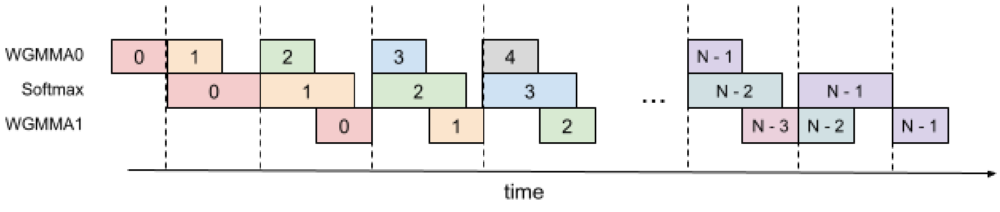

**図 8.** 3 段 pipeline

<span id="algorithm-04"></span>

**アルゴリズム 4: FlashAttention 3 段 pipeline の consumer warpgroup forward pass。**

- **入力:** HBM 上の行列 $\mathbf{Q}, \mathbf{K}, \mathbf{V} \in \mathbb{R}^{N \times d}$、block size $B_c$、$B_r$。各 warpgroup は size $B_r \times d$ の $\mathbf{Q}_i$ block を 1 個と、$T_c = \left\lceil \frac{N}{B_c} \right\rceil$ 個の size $B_c \times d$ の block $\mathbf{K}_1, \dots, \mathbf{K}_{T_c}$ および $\mathbf{V}_1, \dots, \mathbf{V}_{T_c}$ を読む。各 warpgroup は size $B_r \times d$ の出力 block $\mathbf{O}_i$ を 1 個と、size $B_r$ の logsumexp block $L_i$ を 1 個書き込む。
- 初期化。$\mathbf{Q}_i$ を HBM からオンチップ SRAM へロードする。$\mathbf{O}_i, \ell_i, m_i, \mathrm{scale}_o$ を初期化する。
- Producer warpgroup が $\mathbf{K}_0$ を HBM からオンチップ SRAM へロードするのを待つ。
- WGMMA で $\mathbf{S} = \mathbf{Q}_i \mathbf{K}_0^\top$ を計算する。Commit して待つ。
- $\mathbf{S}$ に基づいて $m_i$、$\widetilde{\mathbf{P}}_i$、$\ell_i$、$\mathrm{scale}_o$ を計算する。
- Producer warpgroup が $\mathbf{K}_1$ を HBM からオンチップ SRAM へロードするのを待つ。
- WGMMA で $\mathbf{S} = \mathbf{Q}_i \mathbf{K}_1^\top$ を計算する。Commit して待つ。
- **各** $2 \le j < T_c - 2$ について:
  - Producer warpgroup が $\mathbf{K}_j$ を HBM からオンチップ SRAM へロードするのを待つ。
  - WGMMA で $\mathbf{S}_{\mathrm{next}} = \mathbf{Q}_i \mathbf{K}_{j}^\top$ を計算する。Commit するが待たない。
  - Producer warpgroup が $\mathbf{V}_{j-2}$ を HBM からオンチップ SRAM へロードするのを待つ。
  - $\mathrm{scale}_o$ に基づいて $\mathbf{O}_i$ を再スケーリングする。
  - WGMMA で $\mathbf{O}_i = \mathbf{O}_i + \widetilde{\mathbf{P}}_i \mathbf{V}_{j-2}$ を計算する。Commit するが待たない。
  - $\mathbf{S}$ に基づいて $m_i$、$\widetilde{\mathbf{P}}_{i,\mathrm{next}}$、$\ell_i$、$\mathrm{scale}_o$ を計算する。
  - それ以前のすべての WGMMA を待つ。
  - $\mathbf{S}_{\mathrm{next}}$ を $\mathbf{S}$ へコピーする。
  - $\widetilde{\mathbf{P}}_{i,\mathrm{next}}$ を $\widetilde{\mathbf{P}}_i$ へコピーする。
- Producer warpgroup が $\mathbf{V}_{T_c-2}$ を HBM からオンチップ SRAM へロードするのを待つ。
- $\mathrm{scale}_o$ に基づいて $\mathbf{O}_i$ を再スケーリングする。
- WGMMA で $\mathbf{O}_i = \mathbf{O}_i + \widetilde{\mathbf{P}}_i \mathbf{V}_{T_c-2}$ を計算する。Commit して待つ。
- $\mathbf{S}$ に基づいて $m_i$、$\widetilde{\mathbf{P}}_i$、$\ell_i$、$\mathrm{scale}_o$ を計算する。
- Producer warpgroup が $\mathbf{V}_{T_c-1}$ を HBM からオンチップ SRAM へロードするのを待つ。
- $\mathrm{scale}_o$ に基づいて $\mathbf{O}_i$ を再スケーリングする。
- WGMMA で $\mathbf{O}_i = \mathbf{O}_i + \widetilde{\mathbf{P}}_i \mathbf{V}_{T_c-1}$ を計算する。Commit して待つ。
- Epilogue。$\ell_i$ に基づいて $\mathbf{O}_i$ を再スケーリングする。$\ell_i$ と $m_i$ に基づいて $L_i$ を計算する。$\mathbf{O}_i$ と $L_i$ を、$\mathbf{O}$ と $L$ の第 $i$ block として HBM へ書き込む。

**重なり。** Softmax は「最初の WGMMA + 2 番目の WGMMA」と重なると予想した。しかし、コンパイラはそのように動作しない。SASS code によれば softmax と重なるのは最初の WGMMA だけで、2 番目は重ならない。コンパイラがなぜこのように命令を並べ替えるのかは明らかでない。

**Register pressure。** このアルゴリズムは 2 段 pipeline より多くの register を必要とする。理論上、$\tilde{\mathbf{P}}_{i}$ と $\mathrm{scale}_o$ を追加で保持する必要があり、その size は $B_{r}\times B_{c}\times\text{sizeof}(\text{input\_data\_type})+B_{r}\times\text{sizeof}(\text{float})$ である。その結果、より小さな block size を選ばなければならない。

<span id="section-8"></span>

## 8 実験とベンチマークの補足

<span id="section-8-1"></span>

### 8.1 システムとライブラリ

H100 80GB SXM5 (700W) 上で速度をベンチマークする。原則として執筆時 (2024 年 5 月) における各ライブラリの最新版を使用する。具体的には次のとおりである。

- CUDA 12.3
- cuDNN 9.1.1.17
- CUTLASS 3.5
- FlashAttention 2.5.8
- Triton nightly 3.0.0.post20240424212437
- PyTorch 2.3.0

変動を減らすため、GPU clock speed を 1830MHz に固定する。これは FP16 の理論最大スループット 989 TFLOPS の計算に使われる clock speed である。ベンチマークを 100 回繰り返し、平均時間を採用する。

<span id="section-8-2"></span>

### 8.2 FP8 Attention の全結果

系列長は 512、1024、2048、4224、8448、16896 とする。系列長が $\geq$ 4k の場合、wave quantization を避けるため、H100 SXM5 の SM 数である 132 でも割り切れるようにする。

<span id="figure-09"></span>

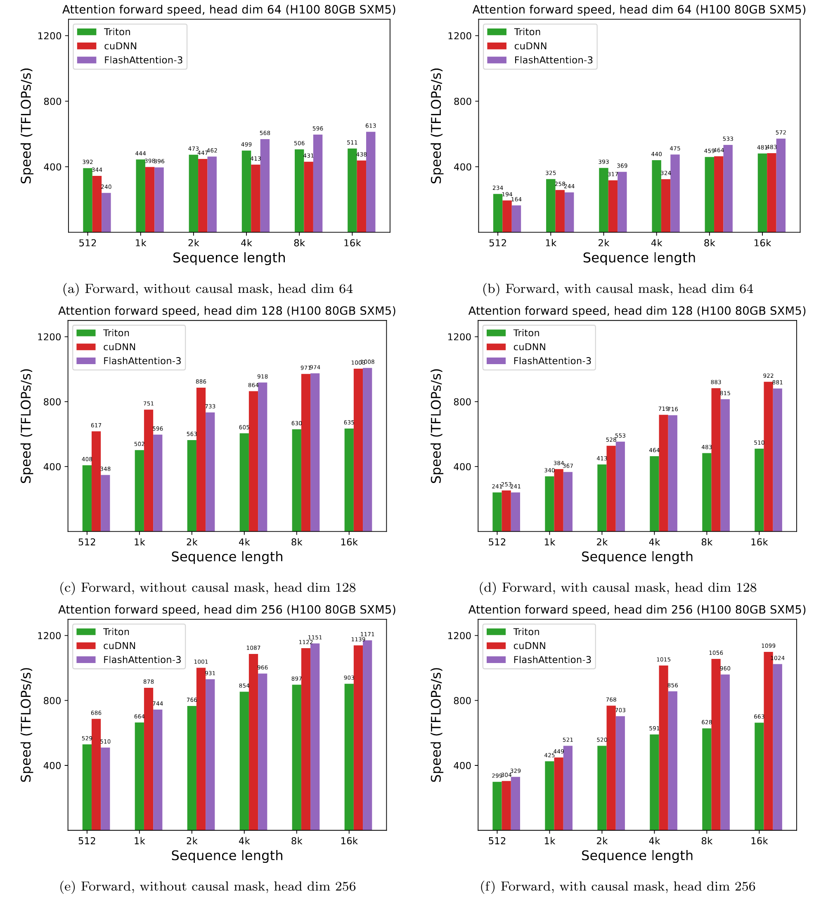

**図 9.** H100 GPU 上の Attention forward 速度 (FP8)

[+1]: 結果は NVIDIA Hopper アーキテクチャを前提として説明している。ただし、十分に強力な非同期実行機能と低精度機能を備える GPU アーキテクチャなら、本アルゴリズムは動作する。

[+2]: より正確には、head 次元 64 では FlashAttention-3 FP8 が上回り、head 次元 128 と 256 では因果 mask なしの場合に同等、因果 mask ありの場合に下回る。

[+3]: FlashAttention-3 は [https://github.com/Dao-AILab/flash-attention](https://github.com/Dao-AILab/flash-attention) で公開されている。

[+4]: [Luo24b] は SM 当たり clock cycle 当たり 128 byte の shared memory bandwidth を報告している。この値に 132 SM と boost clock 1830 MHz を掛けた。

[+5]: CUDA programming guide は、Streaming Multiprocessor (SM) 当たり clock cycle 当たり 16 回の特殊関数演算を実行できると規定する。16 に 132 SM と 1830 MHz の clock speed を掛け、特殊関数の 3.9 TFLOPS を得る。

[+6]: 重ね合わせ方式の stage 数はリング状 SMEM buffer の stage 数 $s$ を上限とするが、$s$ と等しい必要はない。

[+7]: 最適化済みの転置 kernel は device bandwidth に近い速度へ達する [Cut24]。

[+8]: PTX 文書では LDSM/STSM を、16 bit entry をもつ $8\times 8$ 行列のコピーとして説明する [Ptx24]。しかし、8 bit entry を 2 個ずつ pack すれば、FP8 精度でも LDSM/STSM を利用できる。ただし LDSM/STSM の転置版は pack した 8 bit entry を分割できないため、実際に tile 単位の転置を行うには LDSM と STSM の間で所定の register 移動が必要となる。詳細は省略する。

[+9]: Kernel 内転置で得られるこの追加の自由度により、thread 間で register ownership を変更する shuffle 命令が不要になる。これは [Bik24] で以前説明した。

[+10]: 本ベンチマークでは FP16 FlashAttention-3 に persistent kernel と load balancing 戦略がある一方、FP8 FlashAttention-3 にはない。これが、短い系列と因果 mask で FP8 FlashAttention-3 が FP8 cuDNN kernel ほど高性能でない理由の一部である。

[+equal]: 同等の貢献。
