> [Moritz Firsching](https://firsching.ch/) [+equal], [Paul Lezeau](https://sites.google.com/view/paul-lezeau/home/) [+equal], [Salvatore Mercuri](https://smmercuri.github.io/) [+equal], [Miklós Z. Horváth](https://miklos.ai/) [+equal], [Yaël Dillies](https://yaeldillies.github.io/), [Calle Sönne](https://dblp.org/pid/437/6124), [Eric Wieser](https://x.com/EricWieser), [Fred Zhang](https://fredzhang.me/), [Thomas Hubert](https://dblp.org/pid/211/7107), [Blaise Agüera y Arcas](https://www.blaiseaguera.com/), [Pushmeet Kohli](https://dblp.org/pid/94/248). 2026 年 5 月 13 日に arXiv へ初投稿. 現行版は同日付の v1. [Formal Conjectures: An Open and Evolving Benchmark for Verified Discovery in Mathematics](https://arxiv.org/abs/2605.13171v1). <a href="/paper/formal-conjectures.pdf" target="_blank" rel="noopener noreferrer">原論文 PDF</a>. [DOI](https://doi.org/10.48550/arXiv.2605.13171). [TeX ソース](https://export.arxiv.org/e-print/2605.13171v1). 正確な印刷レイアウトと参考文献については原論文 PDF を正とする.

[+equal]: 同等の貢献. 連絡先: `firsching@google.com`.

## 概要

自動推論システムが急速に進歩するにつれ, その能力を正確に評価するための研究水準の形式数学問題がますます必要になっている.
これに応えるため, 本研究では Formal Conjectures を提示する. [+repository] これは現在 2615 件の数学問題文を Lean 4 で形式化した, 発展を続けるベンチマークである.
データセットは活発に研究されている数学分野から収集され, 数学的証明発見のための汚染ゼロのベンチマークとなる 1029 件の未解決研究予想と, 証明の自動形式化に用いる 836 件の解決済み問題を収録する.
とりわけ, このリポジトリは, 問題を形式化・明確化する数学者と, その解決を試みる AI システムおよび人間を結ぶ構造化インターフェースを提供する.
ベンチマークはすでに, 未解決の研究予想の解決を含む新たな数学的発見に利用され, 直ちに役立つことが実証されている.
本稿では, 活発なコミュニティが貢献する共同オープンソースプロジェクトにおいて, 形式化の正しさを確保する方法を説明する.
この枠組みでは, AI が生成した証明と反証が有用な監査機構となり, ベンチマークの忠実度を反復的に改善する.
最後に, 標準化された評価設定と凍結評価サブセット上のベースライン結果を示し, 研究水準の数学に対する自動推論の現在の最前線を測る, 段階的に向上可能な信号を実証する.

[+repository]: [Formal Conjectures リポジトリ](https://github.com/google-deepmind/formal-conjectures).

<span id="section-1"></span>

## 1 はじめに

大規模言語モデル (LLM) を含む自動推論システムの能力が向上し続ける一方で, その進歩を測るベンチマークは重大な課題に直面している.
(形式) 数学の領域では, 既存の多くの評価枠組みに次の問題がある. **(i) データ漏洩:** ベンチマーク問題の解答がオンラインに現れると, 真の推論と記憶を区別することが難しい. MiniF2F, PutnamBench, FATE, FormalMATH などのベンチマークがこの問題を抱える [Zhe22a, Tso24, Jia25f, Yu25j]. **(ii) 非公開評価:** 漏洩への対策として評価集合を非公開にするベンチマークもあるが, オープンで再現可能な研究を妨げる [Cho25d, Gla24, Cen26]. **(iii) 単純化されすぎた成功基準:** 多くのベンチマークは, 数値など単純で機械検査可能な最終回答の検証に依存し, 完全な数学的証明に固有の複雑な多段階推論を捉えられない [Hen21, Gla24]. **(iv) 飽和:** モデルの改善に伴い, 一部のベンチマークは飽和する. たとえば MiniF2F [Zhe22a] は現在, 99% を超える割合で解かれるのが一般的である. [Hub26, Che25h, Lin25j] を参照されたい.

これらの限界に対処するため, Mathlib [Mat20b] を用いて Lean 4 [Mou21] で形式化した数学問題を集めた, オープンソースで成長を続ける **Formal Conjectures** を導入する.
ベンチマークは*未解決予想*を第一の課題とし, 既存の訓練データには解答が存在しない汚染ゼロのテスト環境を提供する.
第二の課題は, 既知の (非形式的な) 解答を持つ問題の自動形式化であり, 同じ汚染ゼロ保証はない.
すべての問題を形式言語で表現することで, 客観的, 厳密かつ自動的な評価を可能にする. 提案された解答は, 対応する証明が `sorry` のような禁止公理に依存せずカーネルに受理される場合, かつその場合に限り, 明確に正しい.
Lean 4 を選んだのは実用上の理由による. 現存する最大の形式数学ライブラリである Mathlib は, 多様な高度な予想を記述するうえで不可欠である.
本研究は Lean 4 に焦点を当てるが, ベンチマークの中核原理は言語に依存せず, 他の形式体系へも拡張できる.

本稿では **Formal Conjectures** ベンチマークの構築と方法論を詳述する.
ベンチマークは Apache 2.0 ライセンスで公開され, すでに現実の数学的発見に利用されている [Ale25, Goo26]. 主な貢献は次のとおりである.

- **Formal Conjectures ベンチマーク:** Lean 4 による 2615 件の数学的文を含む, 大規模で発展を続けるデータセット. 汚染ゼロの証明発見に用いる 1029 件の未解決予想と, 自動形式化に用いる 836 件の解決済み問題を含む.
- **数学的推論のための統一 API:** 数学者と自動ソルバのエコシステムを結び, 文の監査を並行して行いながら, 問題を AI システムへ迅速に届けるリポジトリインターフェース.
- **文の形式化方法論:** 形式化の忠実度を確保するため, 共同作業パイプラインと三段階の誤形式化分類 (Translation, Underspecified, Source) を導入する. これには, 数学的な値の発見と証明検証を分離する `answer(sorry)` 機構が含まれる. 研究水準の形式化で修正された 291 件の事例から得た知見も示す.
- **標準化評価枠組み:** 単純化されすぎた数値回答に頼らず, Lean 4 カーネルで多段階推論を検証する厳密な評価設定を提供する. 安定して再現可能なモデル比較のため, 凍結サブセット `FC100SolvedSet1` と `FC100OpenSet1` を設定する.

<span id="section-2"></span>

## 2 関連研究

本研究は, 数学的推論ベンチマークと形式定理証明にまたがる.

**一般的な数学的推論ベンチマーク.** 形式証明を要求せず, AI システムによる高度な問題解決を評価するベンチマークがいくつか存在する.
FrontierMath [Gla24] は専門家が作成した問題を数値回答で検証する. 機械検査は可能だが, 多段階の推論過程を完全には捉えられない.
2026 年 1 月, Epoch AI は *FrontierMath: Open Problems* を開始した. これは少数の未解決な研究水準の非形式問題を集め, 評価をサービスとして提供するウェブサイト限定の試行である.
Humanity's Last Exam [Cen26] は専門家の問題をクラウドソーシングするが, 証明検証ではなく回答検査に依存する.
MathArena [Bal25] は, 汚染リスクを減らすため新しい競技問題で LLM を評価し, 非形式的な証明記述を判定する.
ARC Prize [Cho25d, Cho26] は抽象推論を対象とし, パターン照合ではなく真の推論を測る点で本研究と共通する.
これに対し, 形式ベンチマークでは推論または証明全体を自動検証できる.

**形式数学ベンチマークと自動定理証明.** 自動定理証明への関心は AI 推論を加速させ, 既存の形式ベンチマークを急速に飽和させた.
MiniF2F [Zhe22a] は高校水準の評価を開拓したが, モデルの改善とともに飽和が進んだ.
この転換を決定づけたのが, 2024 年 IMO で銀メダル級の成績を収めた AlphaProof [Hub26] と AlphaGeometry 2 [Che25ac] である. AlphaProof は Lean 問題を解き, Formal-IMO [Hub26] データセットを導入した.
Aristotle [Ach25] や Seed-Prover [Che25h] などのシステムは, 2025 年 IMO で金メダル相当の成績を達成した.
この能力の飛躍は学部数学にも波及し, Seed-Prover 1.5 [Che25a], Numina [Liu26a], その他の産業界システムによって PutnamBench [Tso24] や Putnam 2025 などのベンチマークも飽和しつつある.
SorryDB [Let26] は実用的な定理補完で AI を評価し, FATE [Jia25f] はさまざまな難易度の最前線の代数を対象とするが, 以前のベンチマークの飽和は研究水準の評価が急務であることを示す. すなわち, 未解決の研究水準数学における推論のベンチマークである.

**Formal Conjectures の採用.** 2025 年 5 月のオープンソース公開以来, このリポジトリは数学者とツール開発者の双方に採用されている.
Boris Alexeev はリポジトリ内の形式化を使い, Aristotle [Ach25] で Erdős Problem 124 [Blo25] を証明した.
その文は当初誤形式化され, 意図しない余分な仮定を含んでいたが, Aristotle の証明はその仮定に依存せず成功した.
[Ale25] など, その後の多くの成功は発見におけるリポジトリの価値を示すとともに, AI が生成した証明が形式化の忠実度を高める重要な監査機構になることを実証している.
DeepMind prover agent [Goo26] はリポジトリ全体を系統的に評価し, 複数の未解決問題を解いた.
標準化され再現可能な評価を容易にするため, 本稿では名前とバージョンを持つスナップショット ([第 4.1 節](#section-4-1)) を導入し, 個別テストから多様な手法を横断する系統的ベンチマークへ進む.

<span id="section-3"></span>

## 3 Formal Conjectures

<span id="section-3-1"></span>

### 3.1 問題の選択と構成

<span id="figure-01"></span>

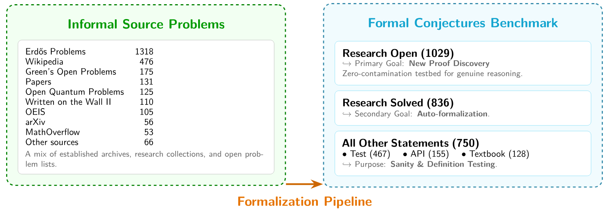

**図 1.** 左: 非形式的な出典の分布. 右: 形式カテゴリの分布. 未解決 (1029) 問題と解決済み (836) 問題を含む.

<span id="figure-02"></span>

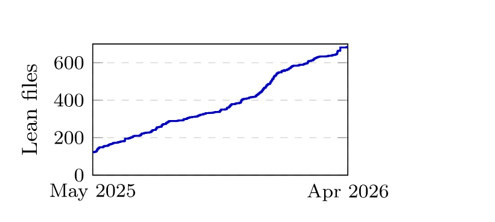

**図 2.** リポジトリの経時的成長.

幅広い領域を網羅するため, ベンチマークの問題は多様な数学文献から収集されている.
主な出典には, *erdosproblems.com* にまとめられた Paul Erdős の問題集 [Blo23], 群論の未解決問題集 Kourovka Notebook [Khu26], IQOQI Vienna の open quantum problems [IQO17], Wikipedia の著名な予想, 学術誌や arXiv の近年の論文にある予想, MathOverflow の質問が含まれる.
非形式的な出典ごとの問題数を[図 1](#figure-01)に示す.
さらに, リポジトリは最初のオープンソース公開以来, [図 2](#figure-02)のように着実に成長している.

コレクションは二つの主要カテゴリに分かれる. **未解決予想**は, 形式・非形式を問わず証明すれば新しい数学的発見となる未解決の研究問題である. **解決済み問題**は, 既知の*非形式*証明を持つ確立済みの定理であり, 既存の議論を形式化する AI の能力を測る. ただし現在, *形式*証明が得られているのは一部に限られる.
両カテゴリを収録するのは, それぞれが別の課題 (証明生成と自動形式化) のベンチマークになるだけでなく, 両者がしばしば結びついているからである.
未解決予想を形式化するときは, より単純な解決済み変種を記述・証明するのが自然である.
たとえば, すべての有効な $k \in \mathbb{N}$ に対するサイズ $4k$ の Hadamard 行列の存在という一般予想を, 解決済みの場合 (たとえばすべての $k \leq 166$) や最初の未解決の場合 ($k = 167$) と並べて提示できる.

*解決済み*問題の別の出典は, 未解決と解決済みの両方を含む予想集である. その場合, 解決済みの場合の文も形式化する. これらは未解決予想と主題上関連していることが多く, 文の形式化と証明の自動形式化は未解決予想の支援にもなる.

解決済み問題のコレクションには, 自明なものから教科書水準まで, 基礎となる形式化の正しさを検証する単純な文も含まれる.
こうした単純な問題を含めると, 未解決問題の誤形式化を検出しやすい. 簡単な特殊例や既知の変種が反証されれば, 使用した定義のどれかが誤って記述されている可能性がある.
以下では, 初期の誤形式化が形式・非形式双方の問題文の改善につながった例を示す.
予想については, 最も単純な未解決の変種と, より一般的な予想の双方を常に記述するよう努める.

**`@[category]` 属性.** コレクションを検索しやすくするため, 各文には次のカテゴリタグのいずれかを付ける. `research open` (未解決の研究水準問題), `research solved` (解決済みの研究水準問題), `textbook` (高校から大学院までの教科書水準の数学問題), `API` (一般的な再利用を意図した新定義の基礎理論を整備する文), `test` (健全性検査のための文).
全カテゴリの分布を[図 1](#figure-01)右側に示す.

**`@[subject]` 属性.** 文には AMS Mathematics Subject Classification [Edi20] に従う主題タグも付ける.
出典コレクション別および AMS 主題分類別の分布を[表 3](#table-03)と[表 4](#table-04) ([第 7.1 節](#section-7-1)) に示す.
数論と組合せ論だけで全体の半数を超えるものの, ベンチマークはすでに 10 を超える AMS 主題 (量子論や代数幾何など) を含んでおり, 今後さらに広げる予定である.

<span id="section-3-2"></span>

### 3.2 形式化の方法論

<span id="figure-03"></span>

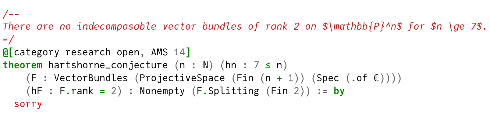

**図 3.** Formal Conjectures の文. [Har74] の未解決予想であり, コメントとしての非形式的な文, タグ, Lean の文を含む.

すべての問題は非形式的な文を伴う Lean の定理として提示される. 中核的な目標は, AI ソルバが置き換える `sorry` プレースホルダを持つ未解決の文を提供することだが, 予想の解決済み変種や問題リストの項目も収録する. 未解決問題には証明を付けない. 解決済み項目では, 定義を試す非常に短い証明または反例 (25–50 行未満) を歓迎する. リポジトリを軽量に保つため長い証明は除外し, 貢献者には自分のリポジトリで証明を公開し, 後述の `@[formal_proof]` 機構でリンクすることを推奨する.

[図 3](#figure-03)に文の例を示す.

**`answer(sorry)` 機構.** 多くの数学問題は証明だけでなく, 数値, 関数, 集合といった特定の*答え*も要求する.
そこで, 計算可能な答えを発見する課題と, その正しさを証明する課題を分離する, カスタム Lean 項エラボレータとして実装された `answer(sorry)` 構文を導入する.
たとえば「$P(n)$ を満たす最小の $n$ は何か」という問題は, ソルバが具体的な値に置き換えるべきプレースホルダとして `answer(sorry)` を使い形式化され, 検証可能な証明義務に帰着する.
この構文は真理値が不明な場合も扱う. `answer(sorry)` が双条件に現れたとき, ソルバは `True` または `False` に置き換え, 命題を予想または否定する.
詳細な例と完全なエラボレーション意味論は[第 7.2 節](#section-7-2)を参照されたい.

**「for Mathlib」パターン.** プロジェクトは `FormalConjecturesForMathlib` ディレクトリを管理している. ここには, 予想に必要だがまだ Mathlib にない補助定義と補題を収めた 88 ファイルがある.
これらの結果は非同期に Mathlib 上流へ貢献される.
このディレクトリの理由と内容は[第 7.3 節](#section-7-3)で詳述する.

**`@[formal_proof]` 属性.** リポジトリを軽量に保つため, `@[formal_proof]` 属性によって問題文と解答を分離する.
三つのモードをサポートする. (1) `formal_conjectures` は, ここに記載した文の型を正確に解く証明である. リポジトリの `main` ブランチ上のコミットを基に `sorry` を埋めたコミットを指すべきである.
(2) `lean4` は, Mathlib や外部リポジトリなど, 他所の Lean 4 で解かれた同値な問題を表す.
(3) `other_system` は, Lean 3, Isabelle, Rocq など別の体系で解かれた問題を表す.
この設計により, リポジトリを保守可能に保ちながら外部の検証源へリンクできる.
属性は解決済みのどのカテゴリにも適用できるが, `research open` 問題で使用すると linter の警告が発生する.
この属性で記録された証明の被覆率を[表 1](#table-01)にまとめる.

<span id="section-3-3"></span>

### 3.3 誤形式化

形式証明を与えずに数学問題を*正しく*形式化するのは, 極めて難しいことで知られている.
*誤形式化*とは, 正しくない形式的な文である.
ベンチマーク品質に厳密な基盤を与えるため, 誤形式化の分類法を導入する.
次の水準を含み, いずれの場合も形式的な文は正しくない.

1. **翻訳**: 非形式的な文は正確で, 明示的に記述されている.
2. **不十分な指定**: 非形式的な文は正確だが, 詳細が不足している.
3. **出典**: 非形式的な文が意図どおりではない.

これらの水準は, 形式化者の寄与の度合いに従って並べられている.
水準 1 の誤形式化は形式化だけに由来し, 水準 3 は非形式テキストだけに由来する.
さらに, 非形式的な文の分野に詳しいとは限らない Lean 専門家にとって, 修正の難しさの順にもなっている.
水準 2 と 3 の誤形式化は, 文献の非形式的な文を明確化するうえで有用だった.
Erdős Problem 978 が例である. 何度も形式化を試みたことで, 元の非形式問題が改訂された. [+erdos-978]
元の文は,
「$f(n)$ が $(k-2)$-power-free となる $n$ は無限に存在するか」
だったが, 複数の追加仮定が必要だと分かり,
「$k>3$ で, すべての素数 $p$ に対して $p^{k-2}\nmid f(n)$ となる $n$ が存在するとき, $f(n)$ が $(k-2)$-power-free となる $n$ は無限に存在するか」
となった.
より一般に, 非形式テキストは自明な場合を明記せず除外することがあるが, 形式化では明示しなければならない.

[+erdos-978]: [Erdős Problem 978 の議論](https://www.erdosproblems.com/forum/thread/978).

誤形式化はさらに, 三水準にまたがる六つの型に分類できる. 翻訳水準の*構文*, *意味*, *誤表現*の誤り, 不十分な指定水準の*暗黙の慣習*, 出典水準の*報告*と*数学*の誤りである.
定義と代表的な pull request を含む完全な分類は[第 7.4 節](#section-7-4)に示す.
リポジトリ全体で合計 $291$ 件の誤形式化が修正され, *誤表現* (48%) と*意味* (35%) の誤りが最も多い ([表 5](#table-05)).
これらの誤形式化の詳細なコード差分は[第 7.5 節](#section-7-5)に示す.

<span id="section-3-4"></span>

### 3.4 誤形式化の回避

<span id="figure-04"></span>

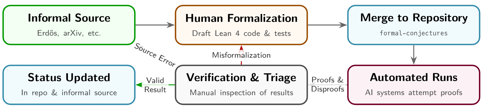

**図 4.** Formal Conjectures の反復パイプライン. 形式化された文は定期的な AI 実行で試され, 問題の解決または改訂ループを引き起こす.

Formal Conjectures では, すべての貢献について, Lean の専門知識と関連する数学分野の知識を持つ人間によるコードレビューを必須とする.
初期の貢献はすべて手作業で書かれたが, 執筆工程は変化しており, 最近の投稿の大半はエージェント型コーディング支援や自動形式化システムなどの AI ツールを使う.
高品質な AI 支援の貢献を容易にするため, リポジトリはこれらのツールに構造化された指針を与える `AGENTS.md` ファイルを提供する.
レビュー工程でも AI の利用が増えている. レビュー担当者は言語モデルで形式化と非形式的な出典を照合し, AlphaProof は投稿上で実行され, マージ前に誤形式化の可能性を検出する.

このレビュー工程に加え, データセット全体で誤形式化のリスクを抑える複数の戦略を採用している.
第一に, 定義にはテストベース設計を採用し, 推奨する.
新しい定義には, 定義が期待どおりに振る舞うことを確認し, 境界事例の誤りを抑えるための, 証明済み `test` 補題と `API` 文の一式を添えるべきである.
Lean と `Mathlib` のツール (たとえば `decide`) で, こうした `test` 文の多くを証明できる.
[`bench-v1-lean4.27.0` リリース](https://github.com/google-deepmind/formal-conjectures/releases/tag/bench-v1-lean4.27.0)時点で, リポジトリには 467 件の `test` 文と 155 件の `API` 文があり, 全文の 23.8% を占める.

第二に, AlphaProof などの自動定理証明器がリポジトリ全体で定期的に証明と反証を試みる ([図 4](#figure-04)). その結果を人手で調べると, 主に誤形式化が見つかる.
テストベース設計が境界事例のリスクを事前に減らすのに対し, この事後的手法は[第 3.3 節](#section-3-3)のすべてのカテゴリから誤形式化を見つけられる.
さらに Gemini, AlphaProof などのツールで形式化と非形式的な出典テキストを自動照合し, 差異の可能性を人間のレビュー用に通知する.
今後は GitHub CI でこれらの処理をさらに自動化し, 保守担当者による事後修正の負担を減らす.

第三に, Mathlib の枠組みに基づくカスタム Lean linter が, 貢献全体のメタデータと文書化の標準を強制する.
AMS 分類タグ, `answer(sorry)` の使用, 問題カテゴリ注釈, モジュール docstring を対象とする.

最後に, Formal Conjectures の存在感が増すにつれ, コミュニティ参加と外部の自動定理証明器による証明・反証の試みはますます重要になっている.
この過程で得られた知見と修正は元の出典にも積極的に還元され, たとえば Erdős problems ウェブサイトの管理者が非形式問題文を定期的に明確化・調整するきっかけになっている.

<span id="section-4"></span>

## 4 ベンチマーク評価

<span id="section-4-1"></span>

### 4.1 評価枠組み

**評価パラダイム.** Formal Conjectures は, 複雑な問題における究極の知的障壁を新たな数学的洞察と位置づけ, 高度な自動推論のための動的で厳密なベンチマークを提供する. 二つの異なる設定を定義する.

1. **第一目標: 新しい形式証明の発見.** 未解決問題の形式証明を発見する AI の能力を測る. 解かれていない予想は, 真の数学的発見のための汚染ゼロのテスト環境となる. どの訓練コーパスにも解答が存在しないため, 成功は推論能力の決定的な信号となり, 他のベンチマークで一般的な非公開評価集合が不要になる.
2. **第二目標: 証明の自動形式化.** 確立済みの数学を形式コードへ翻訳する非自明な作業を, 独立した厳密な課題として扱う, 段階的に向上可能なベンチマークである. Lean 4 と Mathlib を使って既知の議論を形式化するモデルの能力を測る.

**未解決問題の評価.** 未解決問題の評価は決定的である. 公開時に形式解が存在しないため, カーネルに初めて受理された証明は汚染ゼロの成功信号になる.
ただし, 証明が意図された問題ではなく誤形式化された文を解いている場合があるため, 未解決予想の結果は必ず忠実度の人手検査を受ける.

**固定ベンチマークサブセット.** 安定したモデル比較のため, それぞれ 100 問からなる二つの凍結サブセットを提供する.
`FC100OpenSet1` (100 件の `research open` 文) と `FC100SolvedSet1` (100 件の `research solved` 文) である.
サブセットはリポジトリの `FC100OpenSet1.lean` と `FC100SolvedSet1.lean` で定義され, 対応する定理文だけを import する.
これらのファイルは, サポートされるすべての Lean バージョンでリポジトリの一部としてコンパイルされるため, リポジトリが発展しても問題集合は固定され比較可能である.
サブセット構築の詳細は[第 8.1 節](#section-8-1)に示す.

**正しさ.** 既存の形式数学ベンチマークの方法 [Zhe22a, Tso24] に従い, Lean 4 カーネルを利用して, 客観的, 厳密かつ自動化可能な成功基準を設ける.
提案される解答は `sorry` プレースホルダを置き換える Lean 証明項である.
解答は, `sorry` などの禁止公理に依存せずカーネルに受理される場合, かつその場合に限り正しい.
この二値基準は人間による採点の曖昧さを排除し, 議論の余地のない正解を与える.
理論上は Lean カーネルの基礎的なバグや意図しない公理の影響を受けうる (たとえば Lean Zulip のスレッド [+lean-kernel] は, 現在修正済みの exploit に言及する) が, 実際にはカーネル水準の検証が最高の数学的厳密性を与える.
したがって全評価は自動検証でき, 結果と証明項を公開共有して透明で再現可能な研究を実現できる.

[+lean-kernel]: [修正済みの健全性バグに関する Lean Zulip の議論](https://leanprover.zulipchat.com/#narrow/channel/270676-lean4/topic/Soundness.20bug.3A.20hasLooseBVars.20is.20not.20conservative/with/520153084).

**バージョン管理と再現性.** 変化し続けるリポジトリ上の評価は難しい. 依存関係の更新で文の意味が変わり, Mathlib の新定理で問題が簡単になる場合がある.
再現可能な比較のため, `bench-vN-lean4.X.Y` という二部構成の命名方式で凍結ベンチマークスナップショットにタグを付ける.
*ベンチバージョン* `vN` は固定問題集合を識別し, *Lean バージョン*接尾辞は, 文をコンパイル・評価する Mathlib タグ (したがって Lean ツールチェーン) を固定する.
リリースは数か月ごとに発行する. Lean バージョンを上げるときは, `bench-v3-lean4.27.0` のような付随タグにより, 同じ問題集合を中間ツールチェーンで評価できる.
ベースラインを保存するためスナップショットは不変とし, 誤形式化の修正を既存版にパッチせず, 次版 (たとえば `bench-v(N+1)`) へ組み込む.

**生きたベンチマークと統一 API.** 凍結サブセット以外では, リポジトリは時間とともに有用な評価動態を示す動的ベンチマークとして動作する.
コミュニティが新しい予想を追加, 解決, 修正するにつれ, 難易度が自然に自己調整され, 拡大し改善される.
最も難しい問題は未解決のまま残り, 自動推論の最前線を押し進める.
重要なのは, リポジトリが統一 API として機能する点である. 研究者は形式化した予想を一つの中央ハブへ投稿し, 評価に参加するすべての AI システムへ同時に公開できる.
各証明器へ個別に接触する必要がなくなり, 数学的発見への広範で並行した試行を保証できる.

<span id="table-01"></span>

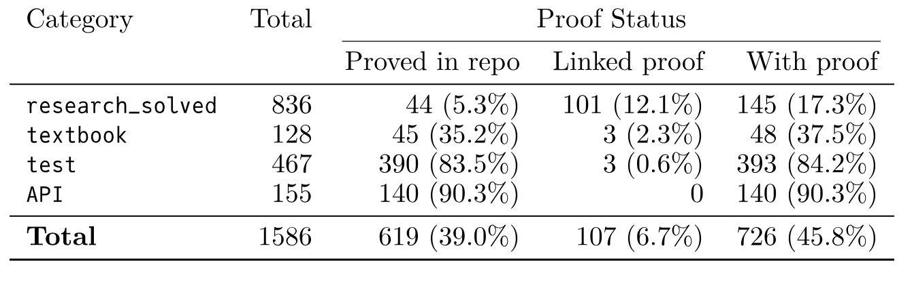

**表 1.** すべての文カテゴリにおける証明被覆率. リポジトリ内で証明済み: 文に `sorry` を含まない証明がリポジトリ内にある. リンク済み証明: `@[formal_proof]` 属性で証明が記録されているが, リポジトリ内にはない. 証明あり: 前二者のいずれか.

**未解決問題のベースライン.** 未解決問題に対する第一の証明発見課題では, 最初のタグ付きリリース `bench-v1-lean4.27` のベースラインはすべてのシステムで $0\%$ である. 定義上, タグ付け時にはどの `research open` 文にも形式証明が存在しない (既知の解を持つ問題は `research solved` に再分類される).
時間とともに, これらの未解決文は形式または非形式の証明を得る可能性がある.
意図した問題を解くのではなく誤形式化 ([第 3.3 節](#section-3-3)) を明らかにした証明は, 次のバージョンに組み込む改訂を引き起こす.
後続リリースでは, その間に解決された問題を `research solved` に再分類し, 形式解には `@[formal_proof]` 属性を付ける.
新しい `research open` 集合は, 未解決のままの問題と新規追加を組み合わせる. したがって後続版は, 解決済み文が $\geq 0\%$ のベースラインから始まり, ますます難しくなる.

**証明自動形式化のベースライン.** 自動形式化のベースラインはシステムに依存しない. 出所を問わず, リポジトリへ貢献されたすべての形式証明を追跡する.
証明は `@[formal_proof]` 属性 ([第 3.2 節](#section-3-2)) で追跡され, 証明体系 (`formal_conjectures` はリポジトリ内の証明, `lean4` は Mathlib など外部 Lean 4 プロジェクトの証明, `other_system` は Isabelle, Rocq などの証明) を記録し, 出典へリンクする.
[表 1](#table-01)に現状をまとめる. 特に, `research_solved` 文の 17.3% に既知の形式証明がある (内部 5.3%, 外部リンク 12.1%).

<span id="section-4-2"></span>

### 4.2 例示的評価

設定とコストの詳細を[第 8.2 節](#section-8-2)に示し, 例示的評価を行う.

<span id="table-02"></span>

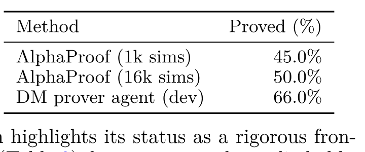

**表 2.** 凍結 `FC100SolvedSet1` 上の結果.

**凍結評価サブセット.** リポジトリが変化しても安定して比較できるよう, `bench-v1-lean4.27.0` タグから各 100 問を無作為抽出した二つの凍結評価サブセットを提供する. `FC100SolvedSet1` (証明自動形式化) と `FC100OpenSet1` (証明発見, ベースライン 0%) である.
定義上, `FC100OpenSet1` は現在, 評価した手法すべてで明確な 0% ベースラインにとどまり, 新発見の厳密な最前線であることを示す.
`FC100SolvedSet1` の結果 ([表 2](#table-02)) は, 計算量とモデル能力の双方にわたり, 明確で段階的に向上可能な信号を示す.
多様な評価のため, 2024 年 IMO で使われた AlphaProof システム [Hub26] のわずかに改良した版と, DeepMind prover agent [Goo26] の開発版を評価する.
これらは同じアーキテクチャの漸進的な版ではなく, 異なるシステムである.
v6e TPU 上の制約付き木探索のみの推論設定で, AlphaProof は問題ごとに 1,000 simulations の低計算構成を用い, `FC100SolvedSet1` で 45% の解決率を達成する.
計算予算を 16,000 simulations へ増やすと解決率は 50% に向上し, 明確なスケーリング信号を示す.
これらの評価は木探索推論だけで行い, AlphaProof の test-time reinforcement learning (TTRL) 機構を使っていないことを強調する. TTRL は証明探索中に学習用カリキュラムを生成し, 重み更新を通じて学習する.
さらに, より新しい DeepMind prover agent の開発版を使うと解決率は 66% へ上がり, 改良されたモデルアーキテクチャと方法論の進歩をベンチマークが有効に測れることを示す.
Lean 内で自動推論手法を実行するには大きなインフラ負担があるため, ベンチマーク信号を検証する例示的ベースラインとして, これら特定のシステムを示す.
コミュニティには, これらのサブセットと発展を続けるメインリポジトリの双方で結果を報告することを推奨する.

<span id="section-5"></span>

## 5 議論

**より広い利点.** 第一の役割を超えて, Formal Conjectures は形式的な精密さを課し, 文の正確な意味を明らかにすることで**精密な数学**を提供する.
これにより, 一般性や精度が解釈に委ねられがちな標準的引用とは異なり, 一意のファイル名とコミットハッシュで曖昧なく参照でき, 固定され検証可能な数学的意図を持つ予想ライブラリが得られる.
さらに, 高度な予想の形式化は既存ライブラリの不足を明らかにするため, ベンチマークは **Mathlib 開発**の指針になる.
その不足には, 結果を継続的に Mathlib 上流へ送る `FormalConjecturesForMathlib` ディレクトリで対応する. 記述困難な概念を見つけることで, リポジトリは推論を評価すると同時に形式数学を拡張する.

**限界.** 問題選択には Mathlib の現在の被覆範囲に制約される**範囲の偏り**があり, `ForMathlib` ディレクトリである程度緩和している. 一部の概念は依然形式化が難しいが, Mathlib の拡大とともにこの限界は小さくなる.
著名な予想と Erdős problems への**選択の偏り**もあり, 数論と組合せ論に集中している. コンピュータ科学や物理など多様な分野の arXiv プレプリントから収集し, 緩和する予定である.
未解決問題への集中は, 文や出典の微妙な誤りによる**誤形式化リスク**を生む.
[第 3.4 節](#section-3-4)の新手法で緩和しているが, 完全な証明が得られるまではリスクが残る. 新たに見つかった誤りの修正には, 過去の比較へ影響する改訂が必要になる場合がある.
ベンチマークには**汚染の課題**もある. 解決済み問題ではモデルが最初から推論せず既知の議論を検索することがあり, 未解決問題では将来の解答が訓練データに入るため汚染ゼロは永続しない.
生きたリポジトリはこうした展開を追跡し, 問題を適宜再分類する.
最後に, **検証と再現性**は Lean 4 カーネルの完全性に依存する. 基礎的なバグや意図しない公理が理論上利用できることは形式体系一般の課題だが, カーネル検証はなお最高水準の厳密さである.
リポジトリが発展しても安定した結果を得るため, 標準評価用に凍結されたバージョン付きサブセットを提供する.

**今後の研究.** 活発なオープンソースプロジェクトとして, 新しい問題, 改善された問題, プラットフォーム機能を追加し, Formal Conjectures の保守と拡張を続ける. この継続的な取り組みは, 初回公開以来のリポジトリの着実な成長にも表れている ([図 2](#figure-02)).
計画している拡張, メタデータ改善, コミュニティ機能の詳細は[第 9 節](#section-9)を参照されたい.

<span id="section-6"></span>

## 6 結論

未解決予想を含む, Lean 4 で形式化された数学問題文の発展的なコレクション **Formal Conjectures** を提示した.
多様な数学文献と分野から収集することで, 形式数学における AI システムの能力を評価する枠組みとして幅広く網羅する.
研究水準問題の汚染ゼロのテスト環境と, 証明自動形式化のための充実した集合を併せて提供し, 形式数学研究向け AI を評価する厳密な環境を確立する.
重要な点として, リポジトリが発展してもモデルを安定かつ再現可能に比較できるよう, この動的データセットにバージョン付き凍結評価サブセットを加える.
生きたリポジトリと Mathlib への新定義の継続的な還元を通じて形式数学を拡大するとともに, 人間の数学的専門知識と自動形式推論の隔たりを埋める忠実度の高いベンチマークとなることを期待する.
最終的に, この資源は現在の進歩を測るだけでなく, 形式数学的発見の最前線を加速すると考える.

## 謝辞

リポジトリのオープンソース公開以来貢献したすべての方々, とりわけ Abel Doñate, Aditya Ramabadran, Amogh Parab, Anirudh Rao, Anthony Wang, Ayush Debnath, Bhavik Mehta, Bolton Bailey, Cong Lu, Daniel Chin, Felix Pernegger, Franz Huschenbeth, James Jordan, Jean-Guillaume Durand, Jofre Costa, Junseok Lee, Junyan Xu, Madhu Shree Aravindan, Mario Krenn, Martin Bruse, Michael Rothgang, Mirek Olšák, Ralf Stephan, Reklle, Seewoo Lee, The bbchallenge Collaboration (bbchallenge.org), Wojciech Nawrocki, Yan Yablonovskiy, Yoh Tanimoto, Yongxi Lin, Zeyu Zheng, Zhen Ning David Liu に感謝する.
貢献者の全一覧は [https://github.com/google-deepmind/formal-conjectures/graphs/contributors](https://github.com/google-deepmind/formal-conjectures/graphs/contributors) にある.
また, 有益な議論と実験実行の支援について, Swarat Chaudhuri, George Tsoukalas, Anton Kovsharov, Henryk Michalewski, Edward Lockhart, Goran Žužić に感謝する.

以下に各種の補足詳細を収録する.

<span id="section-7"></span>

## 7 Formal Conjectures の詳細

<span id="section-7-1"></span>

### 7.1 出典と AMS 分類表

一つの出典問題から, 変種 (特殊な場合, 一般化, 解決済みの部分問題, テスト補題など) によって複数の形式的な文が生じるのが一般的である. 異なる数学的観点や曖昧さの解消法を捉えるため, 一つの非形式的主張について複数の代替形式化を含めることを明示的に許可・推奨している. したがって, 表の数値は異なる出典問題の数ではなく, 形式的な文の数である.

<span id="table-03"></span>

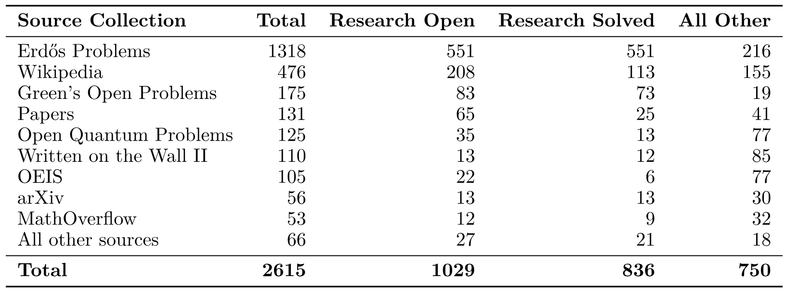

**表 3.** 出典コレクション別にカテゴリ分けした形式的な文の数. 一つの出典問題が複数の文 (変種, 特殊な場合, テスト) を生むことがある.

[表 4](#table-04)は AMS 主題分類ごとの文の分布を示す.
数論と組合せ論のほか, 量子論, 線形代数, 代数幾何も重要な分野である.

<span id="table-04"></span>

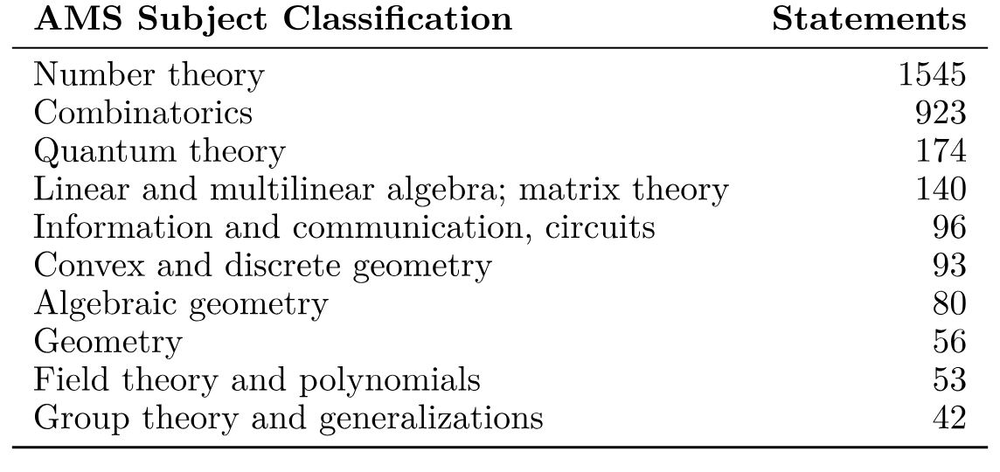

**表 4.** Formal Conjectures で文の数が多い上位 10 の AMS 主題分類.

<span id="section-7-2"></span>

### 7.2 `answer(sorry)` 機構の詳細

解を要求する問題は, カスタム Lean 項エラボレータ `answer( )` で形式化する.
具体的には「$P(n)$ を満たす最小の $n$ は何か」という問題を次のように形式化する.

```lean
theorem smallest_n : IsLeast {n : ℕ | P n} answer(sorry) := by
  sorry
```

通常どおり, `sorry` は問題が解かれたと主張するために埋めるべきプレースホルダだが, 今度は二つある.
解が既知なら, 文中の `answer(sorry)` を `answer(42)` に置き換える.
この機構により, 答えの発見が主な課題で検証は定型的な, 計算的予想を文に含められる.

重要なのは, 証明を与えるには `:= sorry` を有効な項へ置き換える方法を一つ見つければよいのに対し, 答えを与えることは本質的に異なる点である. 数学的意味を評価し, 正しい値を決定しなければならない.
Lean の型検査器は, 提案された答えが有効な証明につながるか検証できるが, 答え自体が数学的に意味を持つかは判断できない. それは人間の数学者または真の数学的推論能力を持つ AI システムの仕事である.

解を直接書いたり裸の `sorry` プレースホルダを使ったりする場合と比べ, `answer( )` ラッパには複数の利点がある.

- 形式化のどの部分が解答に対応するか明確になる. したがってエージェントの評価時に `research solved` 文から解答を隠せる. Lean 項に挿入されたメタデータを調べる方法も, より実用的に単純な正規表現置換を使う方法もある.
- Lean の柔軟なエラボレーションに対する一定の保護になる. `1 / 2 * 2 = sorry` と記述した問題は, `sorry` を `(0 : ℕ)` または `(1 : ℚ)` に置き換えて解けてしまう. Lean は既定で等式の両辺を分析してから型を推論するためである. 答えに応じて問題の意味が変わるのは明らかに望ましくない. `1 / 2 * 2 = answer(sorry)` とすれば, `answer` エラボレータが分析を延期し, 解を見る前に Lean に等式の型を決めさせるため, この問題を防げる.
- 解が何かをあらかじめ仮定しない形で文を書くことを強制する.

<span id="section-7-2-1"></span>

#### 7.2.1 命題的な解

特に一般的なのは, 命題 $P$ の真理値自体が不明で, 問題を「……は真か」と表現できる場合である.
この場合, `answer(sorry)` は `True` または `False` に置き換えるべき命題プレースホルダとなる.

```lean
theorem is_P_true : answer(sorry) ↔ P := by
  sorry
```

`answer(sorry)` を `True` に置き換えるのは $P$ が成り立つと予想することであり, ソルバは $P$ を証明しなければならない.
`False` に置き換えるのは $P$ が成り立たないと予想することであり, ソルバは $P$ を反証しなければならない.
このパターンは, 期待される真理値さえ不明な未解決問題でリポジトリ全体に広く使われている.

証明だけを埋められるソルバシステムの評価を容易にするため,
`answer(sorry)` がこのように命題的に使われていると検出されると, 既定設定では `True` にエラボレートされる.
これにより, これらのシステムはプレースホルダを埋める代わりに, 文を証明または反証して命題を決定できる.

<span id="section-7-3"></span>

### 7.3 「for Mathlib」パターン

形式化プロジェクトでは, Mathlib に適していそうな欠けた (しばしば自明な) 結果が見つかるのが一般的である.
これらを Mathlib に貢献するのは当然の解決策だが, 複数の欠点がある.

- これらの結果に依存する新しい予想は, 長い依存関係の末尾に置かれる. 欠けた結果が Mathlib のレビューを受け, マージされた変更が月次 Mathlib リリースに入り, Formal Conjectures リポジトリがその版へ更新されなければならない.
- Mathlib には専門的すぎる結果もあり, Mathlib への貢献時に直ちに一般化する必要が生じる.
- 結果が新しい数学的展開全体を伴う場合, Mathlib コミュニティが適切な抽象化を見つけ, その展開を正しい形へ発展させるまで時間がかかる. 上記の依存関係を迂回すれば, この発展の多くを Mathlib の外でより速く進められる.

Lean コミュニティでは, こうした結果の準備領域として `ForMathlib` ディレクトリを作るパターンが広く採用されている. 最古の例は「liquid tensor experiment」の [`for_mathlib` ディレクトリ](https://github.com/leanprover-community/lean-liquid/tree/master/src/for_Mathlib)である. [+lean-liquid]
formal-conjectures プロジェクトの `FormalConjecturesForMathlib` ディレクトリもこのパターンに従い, 88 ファイルを収録する. 自然数集合の自然密度と対数密度 (単調性や偶数の密度などの基本性質の証明を含む), 等差数列と AP-free 集合, hypergraph Ramsey 数, Turing machine と busy beaver halting 数, 決定可能性インスタンスを持つ完全冪, Abel 群の VC dimension, Latin square と transversal, Wiener index, Szeged index, Lovász theta function, Havel–Hakimi residue を含む graph invariant ライブラリなどである.
これらの結果は時間をかけて非同期に Mathlib 上流へ貢献される.

[+lean-liquid]: [liquid tensor experiment](https://github.com/leanprover-community/lean-liquid).

<span id="section-7-4"></span>

### 7.4 誤形式化の分類

誤形式化はおおよそ次のように分類でき, 水準を括弧内に示す. [+pr-sources]

- **構文 (1)**: 形式化者が Lean による構文解析の微妙な点を見落とす. たとえば括弧の欠落により, 式の意味が予期せず変わる場合がある. PR #1338 を参照.
- **意味 (1)**: 形式化者が Lean による型または演算子の表現の微妙な点を見落とす. たとえば Lean の自然数は $0$ を含み, 減算は切り捨てられる. PR #349, #1259, #1262 を参照.
- **誤表現 (1)**: 形式化者が翻訳中に, 非形式的な文の側面を形式的に誤って表現する. たとえば量化子や論理結合子を誤る, または出典テキストにある仮定を含めない場合である. PR #1164, #1156 を参照.
- **暗黙の慣習 (2)**: 出典テキストが分野の専門知識を前提とし, 特定の仮定や慣習を明記しない. たとえば解析的整数論では, 数の集合の大きさを問う際に漸近的意味を暗黙に仮定することが多い. PR #2136, #1151 を参照.
- **報告 (3)**: 通常は誤植により, 文献での反復を通じて文が変化する. Erdős Problem 918 の議論を参照.
- **数学 (3)**: 出典テキストが明らかに意図どおりでないか, 真の数学的誤りを含む. Erdős Problem 728 の議論を参照.

[+pr-sources]: Pull request (PR) 番号は [Formal Conjectures リポジトリ](https://github.com/google-deepmind/formal-conjectures)を指す. Erdős Problem の議論は [erdosproblems.com](https://www.erdosproblems.com) にある.

<span id="table-05"></span>

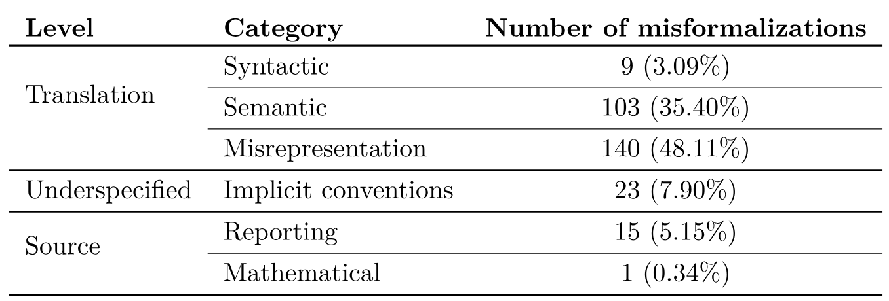

**表 5.** カテゴリ別の誤形式化の数と割合.

<span id="section-7-5"></span>

### 7.5 誤形式化の例

本節では[第 3.3 節](#section-3-3)で触れた誤形式化の例を示す.

<span id="section-7-5-1"></span>

#### 7.5.1 構文エラー

括弧の位置を修正した構文エラーの例を[図 5](#figure-05)に示す.

<span id="figure-05"></span>

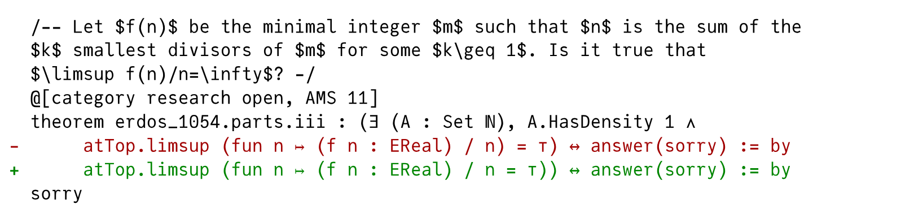

**図 5.** 構文エラーと括弧の修正を示すコード差分.

<span id="section-7-5-2"></span>

#### 7.5.2 意味エラー

[図 6](#figure-06), [図 7](#figure-07), [図 8](#figure-08)は, 形式化中に生じたさまざまな意味エラーを示す.

<span id="figure-06"></span>

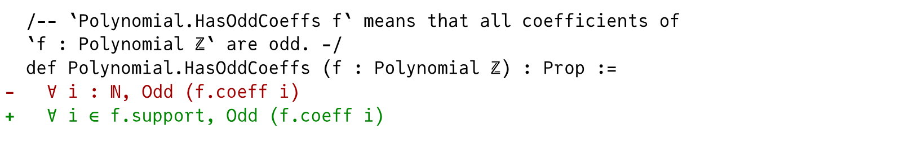

**図 6.** 意味エラーの例を示すコード差分. 修正では多項式の台上で量化する必要がある.

<span id="figure-07"></span>

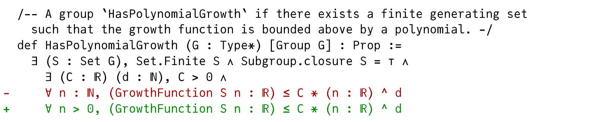

**図 7.** 意味エラーの例を示すコード差分. 形式化が自然数 $0$ での挙動を考慮していなかった.

<span id="figure-08"></span>

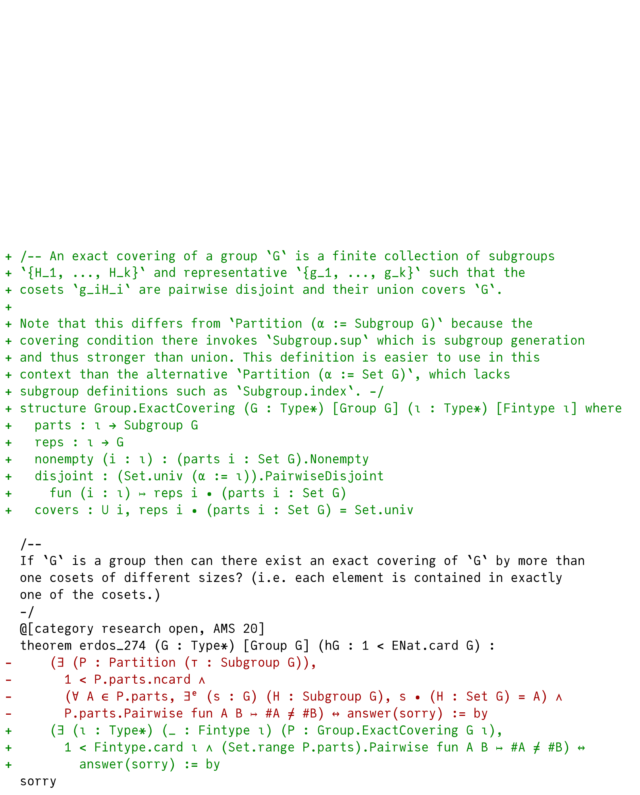

**図 8.** 意味エラーの例を示すコード差分. 形式化は `Partition` が被覆条件で `sup` を呼び出し, それが部分群と集合で異なる意味を持つという微妙な点を見落としていた.

<span id="section-7-5-3"></span>

#### 7.5.3 誤表現エラー

[図 9](#figure-09)は非形式テキストの仮定を省いた誤表現エラーの例を示し, [図 10](#figure-10)は不正な量化のエラーを示す.

<span id="figure-09"></span>

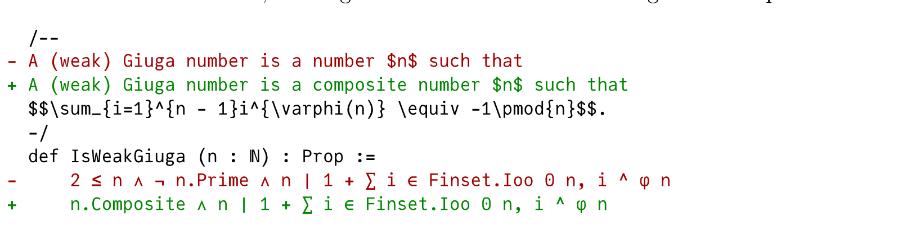

**図 9.** 誤表現エラーの例を示すコード差分. 形式化には非形式テキストにある仮定が欠けていた.

<span id="figure-10"></span>

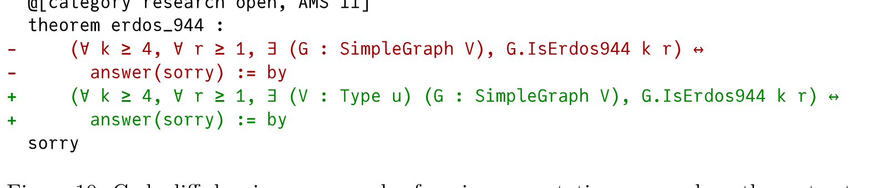

**図 10.** 誤表現エラーの例を示すコード差分. 頂点型 `V` が誤って量化されていた. 旧版では `V` が section variable だったため, 存在量化子の範囲外に現れた.

<span id="section-7-5-4"></span>

#### 7.5.4 暗黙の慣習

出典資料の暗黙の慣習に由来するエラーの例を[図 11](#figure-11)と[図 12](#figure-12)に示す.

<span id="figure-11"></span>

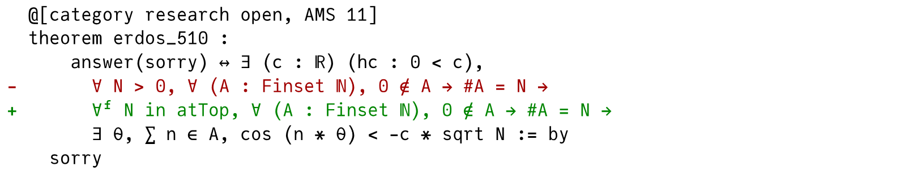

**図 11.** 暗黙の慣習の例を示すコード差分. 出典 [+erdos-510] は不等式が十分大きい $N$ で成り立つことを暗黙に仮定する. これは解析的整数論に共通する慣習であり, 通常は関数や自然数列の漸近挙動に関心がある.

[+erdos-510]: [Erdős Problem 510](https://www.erdosproblems.com/510).

<span id="figure-12"></span>

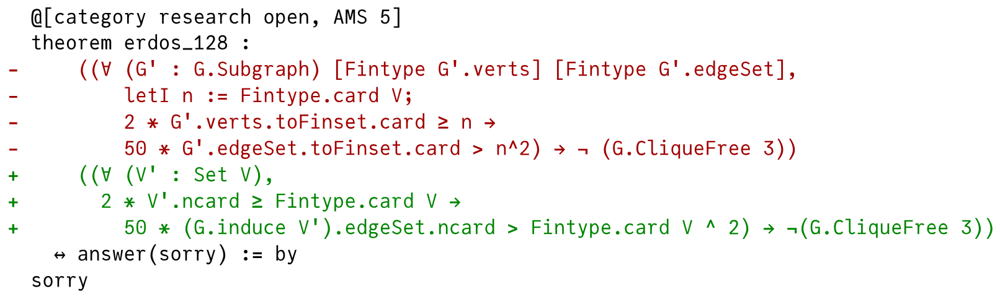

**図 12.** 暗黙の慣習の例を示すコード差分. 出典 [+erdos-128-source] は「induced subgraph」ではなく「subgraph」と記述した. コメント [+erdos-128-comments] は, induced subgraph に限定しなければ問題が自明になることを示すため, 暗黙の慣習に分類する. 元論文は「induced subgraph」と明記しているので [Erd93, p. 344], 報告エラーとも考えられる.

[+erdos-128-source]: [Erdős Problem 128 の出典履歴](https://www.erdosproblems.com/history/128).

[+erdos-128-comments]: [Erdős Problem 128 のコメント](https://www.erdosproblems.com/forum/thread/128).

<span id="section-7-5-5"></span>

#### 7.5.5 報告エラー

[図 13](#figure-13)は, induced subgraph に関する歴史的出典資料の曖昧さによって生じた報告エラーを示す.

<span id="figure-13"></span>

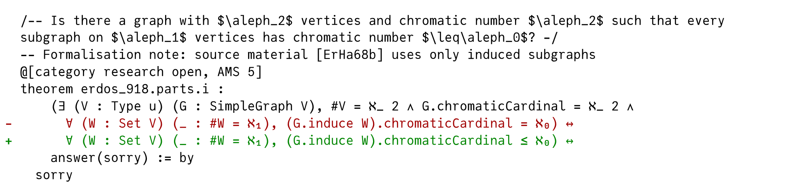

**図 13.** 問題の内部ドラフト形式化における報告エラーの例を示すコード差分. この問題は [Erd68] と [Erd69] に現れる. 前者は $\leq \aleph_0$ を明記するが, 後者にはない. この曖昧さはドラフト形式化後に自明解が発見されて初めて明確になった. 非 induced subgraph の場合はウェブサイトのコメント [+erdos-918], induced subgraph の場合は AlphaProof による. また [Erd68] は *induced* subgraph と明記するが, [Erd69] とウェブサイトは明記しない.

[+erdos-918]: [Erdős Problem 918 のコメント](https://www.erdosproblems.com/forum/thread/918).

<span id="section-8"></span>

## 8 実験評価の詳細

<span id="section-8-1"></span>

### 8.1 凍結サブセット

凍結サブセット `FC100SolvedSet1` と `FC100OpenSet1` はそれぞれ 100 問からなり, `research solved` と `research open` カテゴリの文から一様無作為に抽出される.
リポジトリ内の `FormalConjectures/Subsets/FC100OpenSet1.lean` と `FormalConjectures/Subsets/FC100SolvedSet1.lean` で定義され, 対応する定理文だけを import する.
これらのファイルはすべてのタグ付きリリースの一部としてコンパイルされ, 問題集合が明確に定義されたまま, サポートされるすべての Lean バージョンで正しくコンパイルされることを保証する.

サブセット名 (たとえば `FC100OpenSet1`) はリポジトリのリリースタグ (`bench-vN-lean4.X.Y`, [第 4.1 節](#section-4-1)参照) と*直交*する.
ベンチバージョン $N$ が同じで Lean バージョンだけが変わるとき (たとえば `bench-v1-lean4.27.0` から `bench-v1-lean4.29.0`), 問題集合には同じ文が含まれることが保証され, 新しいタグは更新された Lean ツールチェーンと Mathlib でのコンパイルだけを保証する.
ベンチバージョンが増えるとき (たとえば `bench-v1` から `bench-v2`), 既存集合の文は修正 (誤形式化の訂正など) やカテゴリ更新 (`open` 問題を `solved` へ再分類するなど) を受ける場合があるが, 集合の*要素*は安定し, 問題の追加・削除はない.
完全な再現のため, 結果には集合名とリリースタグの両方を指定すべきである. たとえば `FC100SolvedSet1@bench-v1-lean4.27.0` である.

将来は, 完全に異なる問題を含みうる追加集合 (`FC100SolvedSet2`, `FC500OpenSet1` など) を公開し, 以前の集合を保ちながら, 異なる規模や難易度を対象とした評価を可能にする予定である.

<span id="section-8-2"></span>

### 8.2 例示的評価の詳細

[第 4.2 節](#section-4-2)で述べたように, 評価はベンチマークの有用性とスケーリングへの感度の実証に焦点を当てる.
すべてのシステムで, Lean 4 カーネルが禁止公理に依存せず証明項を受理する場合, かつその場合に限り解答は正しい.

**AlphaProof の設定.** AlphaProof [Hub26] のわずかに更新した版を, test-time reinforcement learning loop を使わず, 木探索推論で評価した.
[表 2](#table-02)のとおり, 検索予算へのベンチマークの感度を示すため, AlphaProof の二つの計算構成を区別する. 1k sims は 1,000 simulations と問題ごとに 2 attempts (v6e TPU で約 0.1 TPUh), 16k sims は 16,000 simulations と 2 attempts (v6e TPU で約 1.6 TPUh) を使う.

**DeepMind Prover Agent の設定.** DeepMind prover agent [Goo26] の結果は, 活発に実験中の手法の開発版で得られた.
現在の API 価格に基づくと, この評価には問題ごとに最大 100 ドルかかる.

<span id="section-9"></span>

## 9 拡張議論

<span id="section-9-1"></span>

### 9.1 今後の研究

新しく追加された Mathlib 定義により記述可能になった問題や, コミュニティからの貢献によって, Formal Conjectures を継続的に拡張する予定である.
実装は Lean 4 を使うが, 方法論は言語に依存せず, Isabelle や Rocq が同等のライブラリ支援を持つようになれば移植できる. エコシステムの互換性を保つため, 今後の Lean 更新も追跡する.
予想の難易度と影響をよりよく評価するため, 予想が最初に提案された時期を記録するようメタデータを拡張する予定である.
この客観指標により, 長年の未解決問題と現代の問いを絞り分けられる.
ただし難易度と重要性は主観的なことが多いため, コミュニティが知見を共有できる対話型インターフェースも提案する.
ユーザーは, 予想について感じる難易度, 数学的重要性, 真理値への確信
(たとえば True, False, ZFC から独立) に投票できるようになる.

さらに, 現在リポジトリでは数学文献の参照を一貫して扱えておらず, 各ファイルで重複が必要なことが多い. 今後は参照管理を一元化して改善する予定である.

この構想はリポジトリの付随ウェブサイト [+website] に統合されつつある.
ウェブサイトはすでにベンチマークのフロントエンドとして機能し, ソースコードの閲覧, LaTeX で描画された docstring の表示, 予想の検索・並べ替え・絞り込みができる.
`research open` 問題がいつ解かれたか, `research solved` 問題がいつ形式証明を得たかを記録するメタデータも含み, 今後はこうした変更をより目立つ形で表示する予定である.

今後, 成功した AI ベースの解答を追跡し, 問題に取り組むグループを顕彰する公開 leaderboard など, 対話型コミュニティ機能を備えた共同ハブへプラットフォームを拡張する予定である.

[+website]: [Formal Conjectures ウェブサイト](https://google-deepmind.github.io/formal-conjectures/).
