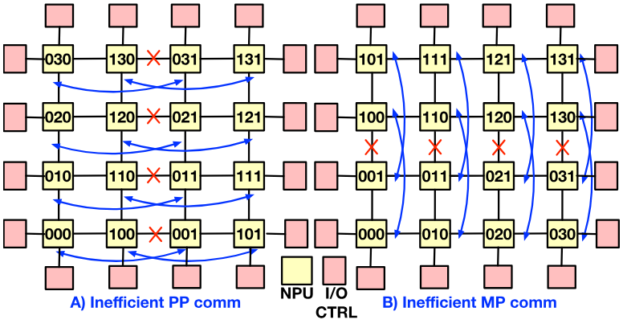
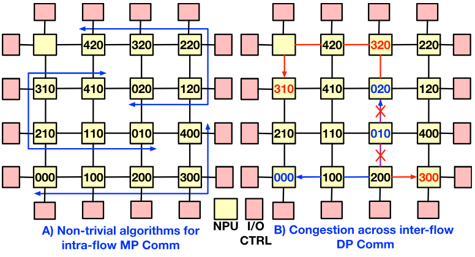

> [Saeed Rashidi](https://orcid.org/0000-0002-6472-9920)、[William Won](https://orcid.org/0000-0002-1715-9144)、[Sudarshan Srinivasan](https://orcid.org/0009-0002-8662-5820)、[Puneet Gupta](https://orcid.org/0000-0002-6188-1134)、[Tushar Krishna](https://orcid.org/0001-5738-6942)。2024 年 6 月 28 日に arXiv へ初投稿。現行版は v2（2025 年 6 月 9 日）。[第 52 回 IEEE/ACM International Symposium on Computer Architecture（ISCA 2025）](https://doi.org/10.1145/3695053.3731055) 掲載、2025 年 6 月 21-25 日。[FRED: A Wafer-scale Fabric for 3D Parallel DNN Training](https://arxiv.org/abs/2406.19580v2)。[原著 PDF](/paper/fred.pdf)。[arXiv DOI](https://doi.org/10.48550/arXiv.2406.19580)。[TeX ソース](https://export.arxiv.org/e-print/2406.19580v2)。正確な印刷レイアウトと参考文献は原著 PDF を参照されたい。

## 概要

ウェハスケールシステムは、高性能アクセラレータチップレットと高速ウェハスケールインターコネクトを密に統合し、低レイテンシかつ広帯域の接続を提供する技術である。これは深層ニューラルネットワーク（DNN）の学習基盤として有望である。しかし、2D Mesh など現在のウェハ上ネットワークトポロジーは、さまざまな並列化戦略を効率よく扱うための柔軟性に欠ける。本稿では、DNN 学習の通信要件に合わせたウェハスケールファブリック Fred を提案する。Fred は小型マイクロスイッチによる分散ウェハ上トポロジーを構成し、任意のアクセラレータ群の集合通信に対するノンブロッキング接続とスイッチ内集合通信を実現する。例示した並列化戦略では、ベースラインのウェハスケール Mesh と比べて、ResNet-152、Transformer-17B、GPT-3、Transformer-1T のエンドツーエンド学習時間を平均でそれぞれ $1.76\times$、$1.87\times$、$1.34\times$、$1.4\times$ に短縮できる。

## 1 序論

DNN モデルの規模は指数関数的に拡大している。最近の研究によれば、2 年足らずの間に DNN 学習に必要な計算量とメモリ量はそれぞれ 1,800$\times$、1,500$\times$ に増加した [Thi21]。学習時間を短縮するため、複数のアクセラレータ、すなわち Neural Processing Unit（NPU）に学習を分散することが現在では一般的である。一方、分散学習では、並列化戦略に応じてモデル勾配やアクティベーションを同期する NPU 間通信がオーバーヘッドとなる。NPU 数が増えるほど通信オーバーヘッドも増加し、やがて分散学習レイテンシの支配要因になる [Ast20, Sca20b, Jia19a, An20]。

NVLink [Eva19] のような高速ラックスケールファブリックでも、提供できる帯域幅には根本的な上限がある。このため、複数の NPU を同一パッケージに統合するプラットフォームへの関心が高まっている。Cerebras [Cer21] は、NPU 同士を接続したモノリシックウェハという形で、この考え方の極端な実装例を示した。コストと歩留まりの面でより有利な方法には、シリコン／有機インターポーザを用いる方式 [Sim19, Cen20] や、パッケージを介さずチップレットを厚みのあるシリコン *ウェハ* に直接接合する Silicon Interconnect Fabric（Si-IF）[Arc19, Des21, Waf24] がある。*本研究では、Si-IF や TSMC-SoW [Tsm24] と同様に、チップレットを微細ピッチで接合する受動的なインターコネクト専用ウェハスケール基板を想定する。モノリシックな Cerebras 方式とは異なり、異なる技術で製造した計算、メモリ、ネットワークの各チップレットをヘテロジニアスに統合できる。*

ウェハスケール基板がもたらす拡張性と帯域幅の利点は広く認められているが、*NPU を接続するファブリックのアーキテクチャ* は未解決である。これまでに提案されたウェハスケールアクセラレータ（Cerebras CS2 [Cer21]、NVIDIA SIMBA [Sim19]、UCLA waferscale GPU [Arc19]、Chiplet Cloud [Chi24a]、Chen らの TTO [Enh24] など）は、すべてファブリックに 2D Mesh トポロジーを採用している。Mesh が選ばれる理由は明快である。配置配線が容易で拡張性も高いため、多コアチップで最も広く使われており、ウェハスケール基板でも自然な選択となる。*しかし本稿では、2D Mesh トポロジー固有のブロッキング性が DNN 学習通信にはきわめて非効率であることを示す。*

**図 1.** DNN 学習通信を最適化する HW-SW 協調設計スタック。赤色で示した三つの段階が本研究の対象である。左側には、3D 並列における学習ワーカーの論理構成例を示す。並列化戦略は MP(4)-DP(3)-PP(2) であり、MP／DP／PP の各次元にそれぞれ 4／3／2 個のピアワーカーが存在する。各ワーカー名は 3 桁で、各桁が MP、DP、PP 次元のワーカー ID を表す。各次元に沿って並ぶワーカーは、対応する種類の並列化のために *通信* する。たとえばワーカー 000、100、200、300 は MP 通信、すなわち順伝播／逆伝播時のアクティベーション／入力勾配同期を行い、ワーカー 300、310、320 は DP 通信、すなわち逆伝播時の重み勾配同期を行う。

DNN 学習の通信は、採用する並列化戦略に本質的に依存する。Data-Parallel（DP）[Li20c, An20]、Model-Parallel（MP）[Lep20, Jia19a]、Pipeline-Parallel（PP）[Hua19, Pip19] は、あらゆる並列化戦略の構成要素である。DP では DNN モデルを複数の NPU に複製し、各 NPU が異なる学習サンプル集合、すなわち minibatch を処理する。MP では、同じ学習サンプルを処理しながら各 DNN 層を複数の NPU に分割する。PP では各 NPU が DNN 層の一部を保持し、学習サンプルが NPU 間をパイプライン方式で流れる。3D 並列 [Eff21] は NPU 間に異なる MP/DP/PP グループを作り、これらすべての戦略を組み合わせる。DP、MP、PP の最適な配分はワークロードと基盤プラットフォームに大きく依存し、*ワークロード／プラットフォーム構成によって大幅に変わり得る* [Jia19a, Ali24]。[図 1](#figure-01) に 3D 並列戦略の例を示す。

**図 2.** ウェハ上の 20 個の NPU を接続する 2D Mesh トポロジー（詳細は[第 6 節](#section-6)）で Transformer-17B を実行したときの、さまざまな並列化戦略（説明は[第 2 節](#section-2)）における計算・通信オーバーヘッドの正規化値。

通信の観点では、3D 並列は分散学習の各段階で、同じ MP/DP/PP グループに属する NPU 間の *複数の通信操作を同時に実行* する必要がある。また、並列化戦略によって計算と通信への負荷は異なる。この差を[図 2](#figure-02)に示す。同図のように、通信オーバーヘッドが大きいと、計算効率の高い戦略の総学習オーバーヘッドが、計算効率の低い戦略を上回ることがある（MP(20)-DP(1)-PP(1) と MP(5)-DP(4)-PP(1) の比較など）。ワークロードによって決まる通信量を除けば、[図 2](#figure-02) の大きなネットワークオーバーヘッドは、主としてベースライントポロジーにおける *ネットワークリソースの非効率な利用* による。具体的には、（i）大半の通信操作で NPU リンクの半分以下しか有効にならないこと（[第 3.2.4 節](#section-3-2-4)）、（ii）MP/DP/PP 並列グループ間でネットワーク競合が起きること（[第 3.2.2 節](#section-3-2-2)）が原因である。ベースライントポロジーの課題は[第 3.2 節](#section-3-2)にまとめる。

以上より、分散 DNN 学習に適したウェハスケールファブリックは、次の三要件を満たす必要がある。

- 輻輳を最小限に抑えながら、*複数* のノンブロッキング集合通信を処理する。
- *すべて* の 3D 並列構成で効率よく動作する。
- NPU 間に *広帯域* 接続を提供する。

本稿では、任意の 3D 並列を支える Flexible REduction-Distribution 機能を備えたウェハスケールファブリック **Fred** を提案する。Fred は、（i）帯域幅を増幅するため、リダクションとブロードキャストをネイティブに支援するスイッチトポロジー、（ii）ノンブロッキング集合通信ルーティングアルゴリズム、（iii）輻輳を抑えるデバイス配置アルゴリズムから構成される。Fred はウェハスケール基板 [Des21] 上に実装する。本アーキテクチャの各 NPU は、H100 [Nvi23] と同様に、高性能計算チップレットと 3D 積層 DRAM チップレットを混載したものである。ウェハ基板上で Fred トポロジーを物理配置し、拡張する方法も論じる。

著者らの知る限り、*Fred は DNN 学習向けに設計され、3D 並列などの複合並列化戦略における複数の同時集合通信を効率よく支援できる、初のウェハスケールファブリック提案である*。したがってコンパイラは、ネットワーク上での実行効率を懸念せず、任意の並列化戦略を検討できる。貢献は次のとおりである。

- 3D 並列向けウェハスケールファブリック設計の課題を明らかにする（[第 3 節](#section-3)）。
- 拡張可能なトポロジーで接続した柔軟な reduction-distribution tree からなる *スイッチファブリック*（[第 4 節](#section-4)）、複数の集合通信を同時にルーティングする *新しいルーティングアルゴリズム*、および 3D 並列向けの輻輳対応デバイス配置方針（[第 5 節](#section-5)）を備えた Fred を提案する。
- Fred をウェハスケールファブリックとして実装する方法を示す（[第 6 節](#section-6)）。
- いくつかのワークロードと並列化戦略について、Fred とベースラインファブリックを比較する（[第 8 節](#section-8)）。

評価の結果、ベースライン 2D Mesh と比べて、Fred は ResNet-152、Transformer-17B、GPT-3、Transformer-1T の平均エンドツーエンド学習時間をそれぞれ $1.76\times$、$1.87\times$、$1.34\times$、$1.4\times$ 高速化できる。

## 2 背景

### 2.1 集合通信パターン

DNN モデルは多様だが、分散学習中の通信の大部分は集合通信パターンで処理できる [An20]。モデルの種類と並列化戦略によっては、順伝播／逆伝播中にアクティベーションや勾配を同期するため、異なる集合通信が必要になる [Ast20]。[図 3](#figure-03) は、3 ワーカー間でよく使われる集合通信パターンの数学的な意味を示す。*Reduce-Scatter* では、通信完了時に各ワーカーがグローバルにリダクションされたデータの一部を持つように通信する。*All-Gather* では、各ワーカーがローカルデータを他の全ワーカーへブロードキャストする。*All-Reduce* は分散学習で最も一般的なパターン [An20] であり、*Reduce-Scatter* の後に *All-Gather* を実行するものとみなせる。*Reduce* では複数の NPU がデータをリダクションし、その結果を一つの NPU だけに保存する。一方、*Gather* は全 NPU からデータを集め、一つの NPU に保存する。*Multicast* は一つの NPU から複数の NPU へデータを送る。*All-to-All* では、各ワーカーがローカルデータの一部を全ワーカーへ送信する。

**図 3.** 3 ワーカー間の集合通信パターン。

### 2.2 集合通信アルゴリズム

[第 2.1 節](#section-2-1)のパターンは、さまざまな *集合通信アルゴリズム* で処理できる。実装方法は大きく二つに分かれる。

**1）エンドポイントベース。** NPU は中央の調停を必要とせず、明示的なメッセージの send/recv により、ピアツーピアの分散方式で通信する。この場合、最適なアルゴリズムは通常、物理ネットワークトポロジーと集合通信の規模に依存する。たとえば、物理トポロジーがリングならリングベース All-Reduce が最適であり、ツリー型トポロジーやメッセージが小さい場合はツリーベース All-Reduce が最適である [Tha05]。

NPU 間方式の欠点は、生成するトラフィック量である。帯域幅の点で最適な NPU 間アルゴリズムでも、$N$ 個の NPU 間で $D$ バイトの All-Reduce を行うには、各 NPU が約 $\frac{2(N-1)}{N}D$ バイトを送受信する必要がある [An20]。これは All-Reduce サイズ（$D$ バイト）のほぼ $2\times$ に相当する [Tha05, Col06, Col07]。すべてのエンドポイントベースアルゴリズムではリダクション段階と収集段階を別々に実行し、各段階で NPU ごとに $\frac{(N-1)}{N}D$ バイトを送受信するためである [Tha05, Col06, Col07]。

**2）ネットワーク内集合通信実行。** エンドポイント方式の余分なトラフィックを減らすため、近年の提案ではスイッチに計算機能を加え [Sca21, An20, Acc19]、リダクションと収集を同時に行うネットワーク内集合通信アルゴリズムを導入している。たとえば、$D$ バイトの All-Reduce では、各 NPU がスイッチまたはスイッチ階層と $D$ バイトを送受信するだけでよい。スイッチまたはスイッチ階層は各 NPU から $D$ バイトを受信し、$N$ 個の NPU から届いた全データをリダクションして、その $D$ バイトを全 NPU へブロードキャストする。したがって、エンドポイント方式と比べて各 NPU の送受信トラフィックはほぼ半分になる（$D$ バイト対 $\frac{2(N-1)}{N}D$ バイト）[Acc19]。ネットワークスイッチが集合通信を処理するため、エンドポイントのリソースを学習計算に割り当てられる利点もある。

### 2.3 3D 並列化における通信

分散学習タスクを複数の NPU に割り当てる並列化戦略には、MP（Tensor-parallelism）[Sho19]、DP [Li20c]、PP [Hua19, Pip19] がある。これらの組合せは 3D 並列 [Eff21] として一般化できる。[図 1](#figure-01) に 3D 並列の概念を示す。この場合、各学習ワーカーは一つずつの MP、DP、PP グループに属し、各 NPU の MP/DP/PP グループ内 ID（オフセット）は、3 桁のワーカー ID の第 1／第 2／第 3 桁で決まる。したがって、DP 桁と PP 桁が同じ NPU は同一 MP グループに属する（000、100、200、300 など）。

同じ DP グループの NPU は、逆伝播中に *All-Reduce* で通信してローカルに計算したモデル勾配を同期し、次の学習イテレーションを始める前にモデルを更新する [An20]。MP グループでは、順伝播／逆伝播中に出力アクティベーション／入力勾配を同期するため、NPU 間通信が必要になる。ただし通信パターンは層の種類と分割方法に依存する。よく使われるのは *All-Reduce* [Sho19]、*All-to-All* [Nau19]、*Reduce-Scatter* [Lep20]、*All-Gather* [Lep20] である。PP グループでは、境界層の順伝播／逆伝播時に出力アクティベーション／入力勾配を転送し、次の層群を保持する NPU にデータを渡す必要がある。[表 1](#table-01) に各並列化戦略で発生する集合通信パターンを示す。

[図 1](#figure-01) は、複数の集合通信を同時に扱う必要性も示している。たとえば 8 個の DP グループがあるため、DP 通信では最大 8 個の All-Reduce を同時に処理しなければならない（MP／PP 通信では、それぞれ 6／12 個の通信操作が同時に発生する）。さらに、MP、DP、PP グループでは通信種別もピアワーカーも異なる。したがって、*基盤となるネットワークファブリックには、異なる集合通信パターンを同時かつ柔軟に扱う能力が不可欠である*。

**表 1.** 各並列化方式で発生する集合通信パターン。

### 2.4 マルチチップレット統合

チップレット統合では、NPU チップを製造した後、Si-IF などのパッケージインターコネクトに接合する [Sim19, Des21, Tsm24]。この方式では、DRAM を含む異なる技術の部品をパッケージ上に統合できる。また、統合前にチップレットを試験できるため、Cerebras [Cer21] のような完全モノリシック方式より歩留まりが高く、ヘテロジニアス統合に対応し、必要な冗長性も少ない。

**マルチチップレットファブリックトポロジー。** 近年のマルチチップレット製品と研究はいずれも、2D Mesh トポロジーで NPU を相互接続している [Arc19, Cer21, Des21, Sim19, Enh24, Chi24a]。パッケージ内／ウェハ上で 2D Mesh が選ばれる主な理由は、配置配線が容易で、2 次元基板上の面積効率が高いことである [Arc19]。*そこで本稿では 2D Mesh を主要なベースライントポロジーとし、提案方式と比較する。*

## 3 ウェハスケールファブリックの目標指標

### 3.1 通信要件

まず、ウェハスケール基板上で DNN 学習を実行する二つのモードを説明する。

#### 3.1.1 重み定常

DNN モデル全体がウェハ内のオンチップメモリに収まる場合、モデルパラメータ全体のロードと、学習結果のパッケージへの入出力は一度だけのオーバーヘッドとなる。 [+1] 事前学習済みモデルのロードと学習済みモデルの保存にかかるコストは、数千回の学習イテレーションにわたって償却される。一方、入力サンプルは各イテレーションの開始時にロードする必要がある。サンプルはモデルよりはるかに小さいため、この I/O が学習性能全体に与える影響は小さい。したがって、*このモードの主な性能要因は、計算コアの効率と NPU 間通信性能である*。インターコネクトが最適化されていないと、特定の並列化戦略で NPU 間通信性能が低下し、計算資源とオンチップメモリをより有効に利用できる戦略であっても、通信性能だけを理由にコンパイラが除外せざるを得なくなる（[第 3.2 節](#section-3-2)）。

#### 3.1.2 重みストリーミング

利用可能なオンチップメモリにモデルが収まらない場合、実行モデルは *重みストリーミング* に移行する [Cer21, Thi21]。この方式では、任意の時点で DNN 層の一部だけをパッケージにロードする。処理を終えると、そのオンチップ領域を解放して次の層群に利用する。そのため学習中にはモデル全体を複数回、少なくとも順伝播と逆伝播で一度ずつチップにロードしなければならない。さらに NPU がモデル勾配を計算すると、そのデータをオフチップストレージへ送り、ストレージ側の軽量な計算コアが次のイテレーションに向けてモデルを更新する [+2] [Cer21]。この方式の性能は I/O 律速となり、学習性能の上限は $\propto \frac{\mathit{model\_size}}{\mathit{I/O\_BW}}$ に比例する。したがって、*計算効率と NPU 間通信性能に加え、最大 I/O 帯域幅を維持する必要がある*。固定的なトポロジーでは、I/O チャネルとの間でモデルや勾配を分配・収集するときにホットスポットが生じ、*I/O データレートが制限される*（[第 3.2 節](#section-3-2)）ため、学習性能へ直接影響する。

### 3.2 2D Mesh の課題

次に、DNN 学習の通信要件を 2D Mesh で支える際の具体的な課題を説明する。

#### 3.2.1 効率的な I/O

前述のとおり、重みストリーミングで最適な性能を得るには、高い I/O 帯域幅の維持が欠かせない。しかし 2D Mesh では最大 I/O 性能を得られないことが多い。[図 4](#figure-04) は、純粋な DP 戦略を用いる $4\times 4$ Mesh でこの問題を示す。この場合、オフチップメモリチャネルから取得した各重みを全 NPU へブロードキャストしなければならない。[図 4(A)](#figure-04) は、2D Mesh 上の one-to-many パターンの *MPI* 実装 [For09] に基づき、二つのメモリチャネルから読み出すブロードキャストアルゴリズムを示す。赤と青が各フローである。

理想的には、I/O 帯域幅を最大化するため、全メモリチャネルが異なる重みを同時にラインレートでストリーミングすべきである。しかし、*2D Mesh の形状は本質的にホットスポットを生み、I/O 帯域幅を低下させる*。[図 4(B)](#figure-04) は、全メモリチャネルが同時に重みを取得するときの、あるホットスポットリンクにおける最大負荷を示す。各メモリチャネルの帯域幅を $P$ バイト／秒とすると、$4\times 4$ Mesh で最大 I/O 帯域幅を得るには、ホットスポットリンクに $7P$ バイト／秒の容量が必要になる。

に対応する最大チャネル負荷の分析。](../../papers/fred/figure-04.png)

**図 4.** （A）二つの異なる I/O チャネルから読み出すときのブロードキャスト通信パターン（赤と青の矢印）。各矢印の数字は、一つのパケットがリンクを通過する時刻を表す。実際には、各経路で複数のパケットをパイプライン転送する。この例の並列化戦略は MP(1)-DP(16)-PP(1) であり、重みストリーミング実行のためにモデル重みを全 NPU へブロードキャストする。逆伝播では逆順に重み勾配を加算し、最終結果をリモートストレージへ書き込む。（B）全 I/O チャネルを同時に使用した場合の[図 4(a)](#figure-04)に対応する最大チャネル負荷の分析。

一般に、$N\times N$ Mesh と $4\times N$ 個の外部 I/O チャネルがあり、各 I/O チャネルの帯域幅を $P$ バイト／秒とすると、すべての並列化戦略で I/O 帯域幅を使い切るため、ウェハスケールファブリックのリンクには $\mathbf{(2N-1)P}$ バイト／秒の帯域幅が必要である。式のとおり、必要なリンク帯域幅は Mesh 幅に対して $O(N)$ で増加する。パッケージが大きくなると、この帯域幅を実現できない場合がある。その場合は最大リンク帯域幅に合わせて I/O チャネルレートを比例的に下げ、$P=\frac{\mathit{link\_BW}}{2N-1}$ とする必要がある。

**Fred の解決策。** Fred は全リンクへトラフィックを均等に適応ルーティングしてネットワークホットスポットを防ぎ、ウェハスケールシステムの拡張性を高める。

#### 3.2.2 デバイス配置

**図 5.** MP(2)-DP(4)-PP(2) 戦略に対する二つのデバイス配置。（A）MP と DP 通信を優先する一方で PP 通信に輻輳を生じさせる配置。（B）DP と PP 通信を優先する一方で MP 通信に輻輳を生じさせる配置。

デバイス配置とは、各論理学習ワーカーを物理 NPU に割り当てることである。$N$ 個の NPU には $N!$ 通りの配置がある。3D 並列では、各学習ワーカーと異なる並列グループの他ワーカーとの通信量・パターンが異なり得るため、この配置が重要になる（[図 1](#figure-01)）。したがって、ネットワーク競合を最小化する配置を求める必要がある。

ところが、固定的なトポロジー、特に一部の通信パターンを本質的に優先する 2D Mesh では、この配置が難しい。[図 5](#figure-05) に MP(2)-DP(4)-PP(2) 戦略の二つの配置を示す。[図 5(A)](#figure-05) では MP と DP 通信に輻輳はないが、異なる PP グループ間で輻輳する。[図 5(B)](#figure-05) では DP と PP 通信が最適化される一方、MP グループ間で輻輳する。2D Mesh には論理的に独立した $x$、$y$ の二次元しかないため、*3D 並列の全次元を 2D Mesh に最適に割り当てることは数学的に不可能である*。各角の NPU に出力リンクが二本しかないことからも分かる。経路の多様性が限られるため、三つの並列グループのいずれかで輻輳が生じ、通信性能が低下する。2D Mesh では優先する通信パターンを選ばざるを得ず、その判断にはエンドツーエンドワークロードと各通信操作の影響を詳しく分析する必要がある。

**Fred の解決策。** Fred は、すべての通信パターンに対して同時に無輻輳ルーティングを提供する。

#### 3.2.3 非整列並列化戦略

**図 6.** 非整列な MP(5)-DP(3)-PP(1) 並列化戦略を $4\times 4$ Mesh トポロジーで実行したときのネットワーク通信。（A）同じ MP グループの NPU 間で最適化されていない通信パターン（All-Reduce など）を実行する場合。（B）X-Y ルーティングを仮定した、赤と青で示す二つの DP グループ間のトラフィック輻輳（明瞭さのため他グループのトラフィックは省略）。

最適な並列化戦略を探索すると、MP/DP/PP の規模が物理トポロジーの次元と整合しない構成が数多く現れる。2D Mesh は経路の多様性が限られ、NPU 間距離も一様でないため、このような構成ではさらに問題が生じる。

[図 6](#figure-06) は、MP(5)-DP(3)-PP(1) 戦略を $4\times 4$ 2D Mesh で実行する際の通信問題を示す。[図 6(A)](#figure-06) は同じ MP グループの NPU 間通信を示す。集合通信は通常、リング、ツリー、スイッチなど規則的なトポロジー向けに最適化される。しかし[図 6(A)](#figure-06)では MP グループが不規則な形となり、各形状に最適な集合通信アルゴリズムを見つけにくい。たとえば 2D Mesh の固定的な形状により NPU 420 と 020 は 2 ホップ離れており、ネットワーク輻輳を無視しても *整ったリングを構成できない*。[図 6(B)](#figure-06) は、次元の不整合によって異なる二つの DP グループ間に生じる追加の輻輳を赤と青で示す。

**Fred の解決策。** Fred は MP/DP/PP の規模や配置を問わず、無輻輳のトポロジーとルーティング機構を提供する。

#### 3.2.4 ネットワーク帯域利用率

2D Mesh では高い帯域利用率を保つことが難しい。たとえば MP 通信は順伝播と逆伝播の両方で必要だが、DP 通信は逆伝播でのみ発生する。しかし経路が限られ、最適なルーティングもないため、MP 通信はこれらのリンクを利用できない。その結果、逆伝播で DP 通信に使うリンクは順伝播中に十分利用されず、多くの戦略で 2D Mesh の全帯域を活用できない。

**Fred の解決策。** Fred は各通信フェーズで、すべての NPU の帯域幅を使い切ることができる。

#### 3.2.5 ネットワーク内集合通信実行

[第 2.2 節](#section-2-2)で述べたように、ネットワーク内集合通信はトラフィックを大幅に減らし、実行性能を高める。この機能はすでにオフチップスイッチ [An20, Mel20] で使われているが、複数データの収集、リダクション、ブロードキャストを行う集中型または階層型スイッチを必要とする。NPU が分散し、共有の中央要素を持たない 2D Mesh では、ネットワーク内集合通信の導入が難しい。

**Fred の解決策。** Fred はネットワーク内集合通信を支援するスイッチベーストポロジーを採用する。

#### 3.2.6 まとめ

DNN 学習向けファブリックは、3D 並列学習のどの通信フェーズでも各 NPU がネットワーク帯域幅を使い切り、輻輳せず、ネットワーク内集合通信を支援することが望ましい。2D Mesh はその形状と固定性のため、これらの要件を満たせない。したがって Fred のような新しいトポロジーとルーティング機構が必要になる。

## 4 Fred ネットワークファブリックアーキテクチャ

**図 7.** （a）$P$ ポート Fred スイッチの概要。（b）ポート数が偶数（$2r$）または奇数（$2r+1$）の場合に再帰的に構成する Fred インターコネクト。（c）Fred*m*($2$) スイッチ。（d）Fred*m*($3$) スイッチ。（e）R-$\mu$Switch。（f）D-$\mu$Switch。（g）RD-$\mu$Switch。（h）Fred*2*($8$) インターコネクトの実装例と、ルーティングされた二つの All-Reduce 通信パターン（緑と橙）。（i）競合グラフを用いて Fred2($8$) 上の三つの All-Reduce 通信フローを処理するルーティングアルゴリズム。（j）ルーティング競合の例。

Fred スイッチはファブリックの骨格となる。Fred スイッチを階層的に接続して完全な Fred ファブリックを構成する。詳細は[第 6.1 節](#section-6-1)で述べる。Fred スイッチの考え方は単純である。**スイッチを最小の基本要素に分解し、各要素へ小規模な計算機能を加える。** 計算機能を細粒度に分散することで、3D 並列の通信パターンに対し、柔軟で同時実行可能なスイッチ内集合通信を支援できる。集合通信の計算を分散させる方式は、計算・メモリを集中配置する方式よりも、高帯域なウェハスケールリンクへ拡張しやすい。

[図 7(a)](#figure-07) の Fred スイッチは、制御ユニット、入力ポートバッファ、Fred インターコネクトからなる。制御ユニットが入力ポートと出力ポートの間をルーティングする。

[図 7(b)](#figure-07) の Fred インターコネクトは *Clos* ネットワーク [A53] に着想を得ている。Clos ネットワークは組 $(m,n,r)$ で表され、$m\geq 2$ は中間段スイッチ数、$n$ は各入出力マイクロスイッチ（$\mu$Switch）の入出力ポート数、$r$ は入出力 $\mu$Switch 数である。Fred の接続は $(m,n=2,r)$ Clos に似ており、Fred*m*($P$) と記す。$m$ は中間段スイッチ数、$P$ は入力（出力）ポート数である。既存研究 [Arb97] に基づき、Fred は任意のポート数で設計できる。$P$ が偶数なら $P=2r$、奇数なら $P=2r+1$ である。Clos と同様、Fred は再帰的に構成される。ポート数が偶数なら中間段は $m\times \mathrm{Fred}_{m}(r)$、奇数なら $m\times \mathrm{Fred}_{m}(r+1)$ のスイッチとなる（[図 7(b)](#figure-07)）。再帰は[図 7(c)](#figure-07)と[図 7(d)](#figure-07)の基本 Fred*m*($2$) または Fred*m*($3$) スイッチで終了する。

*Fred と基準 Clos の主な違いは、基準 $\mu$Switch にリダクションおよび／または分配（ブロードキャスト）機能を加える点である*。二機能の有無により三種類の $\mu$Switch を用いる。[図 7(e)](#figure-07) の *R-$\mu$Switch* は二つの入力データをリダクションし、一方の出力へ送る。[図 7(f)](#figure-07) の *D-$\mu$Switch* は一方の入力データを両出力へブロードキャストする。[図 7(g)](#figure-07) の *RD-$\mu$Switch* は $2\times 2$ で、両機能を備える。Fred スイッチ全体は、この三種類と、$P$ が奇数のとき最後のポートを全中間段へ接続する *Mux*／*Demux* を用い、前述の再帰処理で構成する。

[図 7(h)](#figure-07) は、緑と橙の二つの All-Reduce を同時実行する Fred*2*($8$) の全構造を示す。強調した $\mathrm{R}/\mathrm{D}/\mathrm{RD}$ は、対応する $\mu$Switch のリダクション／分配／両機能が有効であることを表す。たとえば入力ポート $4,5$ を接続する入力 $\mu$Switch はリダクションし、結果を一方の出力へ送る。強調していない $\mu$Switch は Clos $\mu$Switch と同様に動作する。

## 5 競合のない集合通信ルーティング

### 5.1 Fred 上の通信パターン

細粒度のリダクションとブロードキャスト機能により、Fred $\mu$Switch は分散学習で使われる各種の集合通信パターンを実行できる。Fred 上の集合通信実装は、*通信フロー*、略して *フロー* という表記で抽象化できる。

Fred*m*($P$) 上の *フロー* は、入力ポート集合 $\mathrm{IPs}=\{\mathit{ip}_1,\mathit{ip}_2,\ldots,\mathit{ip}_i\}$ と出力ポート集合 $\mathrm{OPs}=\{\mathit{op}_1,\mathit{op}_2,\ldots,\mathit{op}_j\}$ を持ち、$|\mathrm{IPs}|\leq P$、$|\mathrm{OPs}|\leq P$ である。*フロー* は $\mathrm{IPs}$ の入力データをリダクションし、最終結果を $\mathrm{OPs}$ の出力ポートへブロードキャストする。両集合のポート番号と要素数は通信パターンに応じて独立に設定できる。各通信アルゴリズムは一つ以上の *フロー* として表せる。たとえば[図 7(h)](#figure-07) の橙色 All-Reduce は、$\mathrm{IPs}=\{3,4,5\}$、$\mathrm{OPs}=\{3,4,5\}$ の単一 *フロー* である。

**単純通信アルゴリズム。** 一つの *フロー* だけで Fred 上に実現できる通信パターンを指す。[表 2](#table-02) に各パターンと入出力ポート数を示す。

**複合通信アルゴリズム。** 複数の *フロー* で通信パターンを実現する。[表 2](#table-02) に各複合パターンを示す。たとえば $i$ 入力の *Reduce-Scatter* は $i$ 個の直列な *reduce フロー* に分解し、$1\leq j\leq i$ の第 $j$ ステップで出力 $\mathit{op}_j$ に対応する *reduce* を行う。他の複合アルゴリズムも同様である。

### 5.2 ルーティングプロトコル

Fred は *フロー* をルーティング単位とし、複数フローの同時ルーティングを支援する。既存手法 [Nov22] と同様に再帰的であり、まず最外層の $\mu$Switch、すなわち入力／出力 $\mu$Switch の状態を決め、次に中間段スイッチへ再帰する。ただし Fred $\mu$Switch はリダクション／分配機能を持ち、フローの入出力ポート間にも依存関係があるため、新しいアルゴリズムが必要になる。プロトコルは次の考え方に基づく。

- 二つのフローが同じ入出力 $\mu$Switch を共有するなら、異なる中間段スイッチ（サブネットワーク）へ送る。
- R-$\mu$Switch または RD-$\mu$Switch の両入力が同じ *フロー* なら、リダクション機能を有効にする。
- D-$\mu$Switch または RD-$\mu$Switch の両出力が同じ *フロー* なら、$\mu$Switch の分配機能を有効にする。

後二点は容易に実現できる。第一点を満たすため、Fred は *競合グラフ* を作る。[図 7(i)](#figure-07) に Fred2($8$) のルーティング例の第 1 ステップと対応する競合グラフを示す。

競合グラフの各ノードは *フロー*、ノード間の辺は同じ入出力 $\mu$Switch を共有する競合を表す。Fred はグラフ彩色で各フローの経路を求め、色数は中間段スイッチ数 $m$ とする。[図 7(i)](#figure-07) では $m=2$ のため二色だけを使い、二つのフローを上側（青）、一つを下側（赤）のサブネットワークへ送る。その後、青と赤の Fred2($4$) でプロトコルと競合グラフ生成を再帰的に実行する。DL 学習の通信パターンは決定的かつ反復的で、コンパイル時に推論できる。そのため各通信フェーズのルーティングをコンパイル時に実行し、Fred の制御ユニットへ保存して、学習中のルーティングオーバーヘッドを抑えられる。

### 5.3 ルーティング競合と解決方法

すべての *フロー* を同時にルーティングできず、*ルーティング競合* が生じる場合がある。競合グラフの全ノードを彩色できなければ競合と判定する。[図 7(j)](#figure-07) は Fred2($8$) 上の四フローと競合グラフの例である。*フロー 0、1、2* が循環依存するため、二色では彩色できない。競合はサブネットワークを処理する任意の再帰呼出しで発生し得る。検出時にはルーティング全体を競合ありとする。

**表 2.** 単純（網掛け）集合通信アルゴリズムと複合集合通信アルゴリズム。

以下では、この競合を解決する方法を述べる。

**（1）競合 *フロー* のブロック。** 一部の競合フローを止め、他の完了後に実行する。競合グラフから一部ノードを除くことに相当する。[図 7(j)](#figure-07) では *フロー* $1,2,3$ のいずれかを止めれば次のサブネットワーク処理へ進めるが、性能コストは大きい。

**（2）中間段スイッチ数の増加。** $m$ を増やして彩色に使える色数を増やせば、より多くの競合 *フロー* を同時にルーティングできる。 [+3] ただしハードウェアオーバーヘッドが増える。

**（3）通信アルゴリズムの分解。** 単一キャストだけなら Fred は $m=2$ で *rearrangeably nonblocking*、$m\geq 3$ で *strict-sense nonblocking* である。通信を複数ステップへ分け、各ステップの入出力依存を解消して単一キャスト化できる。最悪の場合、任意の集合通信を完全な単一キャストへ分解できる。たとえば All-Reduce をネットワーク内ではなく NPU 上のリング方式で処理する。[図 7(j)](#figure-07) の *フロー* $0,1,2$ をリング方式へ切り替え、*フロー* $3$ だけをネットワーク内で実行できる。フローは止めないが、競合フローの性能は低下する。

**（4）インテリジェントなデバイス配置。** 起動時に学習ワーカーを物理 NPU へ適切に配置して競合を防ぐ。[図 7(j)](#figure-07) でポート $1$ と $4$ の NPU に割り当てたワーカーを交換すれば、競合は起きない。

*Fred は通信性能を優先し、（1）と（3）は使わない。（2）を採用し、Fred*3*($P$) だけを使って三色を確保し、配置アルゴリズムを簡単にする。同じ MP グループのワーカーを連続する物理 NPU へ割り当て、続いて PP、DP の順に反復する。これで 3D 並列のルーティング競合を防げる。*

### 5.4 重複通信の処理

学習中には同時に複数の通信が必要になる。たとえば逆伝播の DP 通信中に、次の microbatch を交換する PP 通信が始まることがある。しかし FRED の回線交換設定は一度に一つの通信フェーズしか扱えず、計算遅延の差で NPU ごとの発行時刻も異なる。新しい通信の優先度が高い場合、転送中パケットへの影響を抑えつつ、現在の通信を安全にプリエンプトする仕組みが必要である。

各ポートに複数の Virtual Circuit（VC）を割り当て、それぞれを MP など特定の通信グループ専用とし、重複する通信間で FRED を再構成する。短い間隔で再構成して同時処理することも可能だが、本設計では待機中で最優先の通信を実行し、より高優先度の通信が来れば現在の通信をプリエンプトする。学習は通常、任意時点で最優先の一通信に阻まれているため、この方法は設計と再構成オーバーヘッドを抑えつつ要件に合う。3D 並列では MP、PP、DP の順に優先する。バッファ管理とフロー制御は[第 6.2.3 節](#section-6-2-3)で述べる。

## 6 ウェハスケールアーキテクチャ

評価用に Fred で接続したウェハスケール NPU システムの一例を示す。別の構成も可能である。

### 6.1 Fred ファブリックのレイアウト

Fred スイッチは複数のウェハスケール NPU を接続する基礎となる。大規模システムでは配線や面積の制約から、全 NPU を一つの Fred スイッチに接続できない。そこで *Fred ファブリック* は階層構造を用いる。[図 8](#figure-08) は、Fred スイッチを 2 段ツリーで接続し、NPU を葉の *L1* スイッチへ接続した例である [+4]。ツリー高と各階層間の帯域幅は、システム規模と物理制約で決まる（[第 6.2 節](#section-6-2)）。

複数階層の Fred スイッチがあると、通信アルゴリズムは複数スイッチをまたぐため最適化が必要になる。[図 8(a)](#figure-08) は NPU $1,5,6$ 間の All-Reduce 経路を示す。NPU $1$ と $5$ のデータをローカル L1 で先にリダクションし、L2 へのトラフィックを減らす。その結果と NPU $6$ のデータを L2 でリダクションし、最終結果を対応する L1 へ戻す。NPU $1$ と $5$ の L1 は結果を両 NPU へマルチキャストする。

**図 8.** 2 階層 Fred トポロジーの物理構成と論理構成。

### 6.2 ウェハスケールアーキテクチャの構成

既存研究 [Arc19, Sca21a] と同様に、直径 $300\,\mathrm{mm}$、面積 $70000\,\mathrm{mm}^2$ の標準ウェハを想定する。

#### 6.2.1 制約

ウェハ上の計算資源は、（i）熱制約と（ii）電力供給網に制限される [Des21, Arc19, Sca21a]。冷却方式に応じた熱制約が供給可能電力を決め、既存研究の上限は $9.6\,\mathrm{kW}$ [Arc19] から $15\,\mathrm{kW}$ [Cer21] である。本稿は $\boldsymbol{15\,\mathrm{kW}}$ を想定する。電力供給網は大型のオンウェハ *Voltage Regulator Module（VRM）* を必要とし、NPU 面積を制限し得る [Arc19]。一方、ウェハ上面からの給電 [Cer21] や *Through-Wafer Via（TWV）* による背面給電 [Pro19] で VRM を不要にできる。本稿ではこれらを用い、**オンウェハ VRM は使用しない**。

#### 6.2.2 物理システムパラメータ

[表 3](#table-03) に他の物理パラメータを示す。NPU チップレットは接合前に試験済みとする。Known Good Die 試験が難しければ、NPU Compute などの大きなチップレットを小さく分割する必要がある。最近の研究 [Chi23c] は、コスト最適化には $40\,\mathrm{mm}^2$-$400\,\mathrm{mm}^2$ 程度が適切だとする。評価では H100 GPU 相当の NPU 計算チップレットと 5 スタックの HBM3 を用い、合計 $700\,\mathrm{W}$、$1314\,\mathrm{mm}^2$ とする [Nvi23]。

NPU 計算チップレット周辺は最大 12 TBps を支援する。6 TBps をローカル HBM の 3 TBps（読出し 3 TBps＋書込み 3 TBps）に、残り 6 TBps を合計 3 TBps の双方向 NPU 間通信（送信 3 TBps＋受信 3 TBps）に割り当てる。

$15\,\mathrm{kW}$ の予算では、他部品を除いても NPU 数は $15\,\mathrm{kW}/700\,\mathrm{W}\approx 21$ に制限される。予想電力密度 $22\,\mathrm{W/cm}^2$ は異種統合ロードマップの冷却能力内にある [Iee23]。他部品の余地を残すため 20 NPU とし、外部メモリ接続に 18 個の I/O Controller を使う。NPU と I/O Controller の総面積は $26640\,\mathrm{mm}^2$ である。

[Arc19] と同様、ベースラインの NPU 間隔を $100\,\mathrm{um}$ とする。I/O Controller を含む全体はウェハ中央の $190.8\,\mathrm{mm}\times 150.4\,\mathrm{mm}$ に収まり、残りは未使用となる。

**表 3.** 物理システムパラメータ。

の Fred 実装におけるハードウェアオーバーヘッド。](../../papers/fred/table-04.png)

**表 4.** [図 8(b)](#figure-08)の Fred 実装におけるハードウェアオーバーヘッド。

#### 6.2.3 Fred トポロジーとパラメータ

限られた電力予算と高性能 NPU の組合せでは、$70000\,\mathrm{mm}^2$ のうち $26640\,\mathrm{mm}^2$ しか使わず、**未使用面積を Fred のような柔軟なファブリックに利用できる**。ただし電力の大半は NPU が使うため、ファブリックは低消費電力でなければならない。**Fred が両条件を満たすことを示す。**

対象 Fred は[図 8(a)](#figure-08)のような 2 段のほぼ Fat-tree で、20 NPU と I/O Controller を接続する。NPU 当たり 3 TBps は同じだが、二分帯域幅は 30 TBps になる。L1-L2 帯域幅は接続 NPU の合計だけで、I/O Controller 分を含まないため「ほぼ」Fat-tree である。*フロー* の参加者に I/O Controller があれば、その要求は 128 GBps など NPU 間帯域より小さい I/O 帯域で決まるため、完全な Fat-tree と同等の性能を得られる。

[図 8(a)](#figure-08) の L1/L2 帯域要件では、ウェハ配線を接続するためのスイッチ外周が製造可能範囲を超える。そのため各 Fred スイッチを複数の低帯域チップレットへ分解する。[図 8(b)](#figure-08) は、実現可能な Fred チップレットでほぼ Fat-tree を構成する論理図である。各スイッチを帯状の枠内にある小型 Fred へ分解し、評価では Fred3($P$) を使う。

[図 8(b)](#figure-08) の L1 は NPU と I/O Controller に異なる帯域幅の下りリンクを使うため、別々のインターフェース回路が必要である。この分は[表 4](#table-04)に含む。異種オンチップインターコネクトは、多コアのルータとメモリコントローラ接続などで広く使われている [Pri04]。

**フロー制御。** クレジットベースのバックプレッシャを備えた Virtual Cut-Through を想定する。プリエンプトのため、各ポートに MP、DP、PP 専用のデータ VC 三本と ACK/NACK 等の制御 VC 一本を置く。データ／制御パケットは 4KB／512B、flit は 512B、ヘッダは 6B である。ヘッダは通信フェーズごとの $\mu$Switch 設定ビットへの索引も持つ [+5]。全ポートに高優先度フェーズのパケットが届くと、その $\mu$Switch 設定へ切り替えて転送する。全フローが単一キャストとなる既定索引もあり、その場合はオンラインルーティングで $\mu$Switch 設定を決める。対象ワークロードにはないが、src/dst 対ごとのフローサイズが動的に変わる *alltoallv* などに有用である。

再送には単純な Go-Back-N を使い、16 データパケットごとに累積 ACK を返して、ACK オーバーヘッドを帯域幅の $1\%$ 未満にする。NPU から NACK を受けたスイッチはフローの全入力ポートへ転送し、さらに全送信元 NPU へ伝播させ、NACK 対象パケットから再送する。

各入力ポートはデータ VC ごとに 24KB、制御 VC に 2KB のバッファを持つ。通信プリエンプト時にも $\mathit{link\_BW}\times \mathrm{RTT}=24\,\mathrm{KB}$ を確保し、新しい通信をリンク全帯域で送信できる。

**ハードウェアオーバーヘッド。** [表 4](#table-04) に[図 8](#figure-08)の実装を示す。各 FRED に通信操作別の $\mu$Switch 設定を保存する 1.5KB SRAM を置き、15nm NanGate PDK のレイアウト後評価を用いた。電力は $179.35\,\mathrm{W}$、総予算の約 $1.2\%$、面積は $25195\,\mathrm{mm}^2$ で、未使用領域に収まる。[第 6.2.3 節](#section-6-2-3)のとおり、主な面積はスイッチロジックではなく広帯域 I/O による。

**考察：Fred の面積。** 未使用面積に大きく低消費電力な Fred を配置し、高 I/O 帯域要件を満たせる。内部ロジックはチップ面積の 5% 未満なので、I/O 密度が上がれば面積を大幅に減らせる。

**表 5.** 評価対象の構成。

保守的にスイッチと NPU に同じピッチ、周波数等を仮定する。次世代 I/O は本設計の 107.4 GBps/mm に対し最大 250 GBps/mm を見込む [Het24]。同じ帯域幅なら Fred 面積を現在の 18.4% にできる。

別案は最大 1 TBps/mm の UCIe Advanced [Uni24] などのシリアル高速リンクであり、面積を 5% にできる。現在の大きな面積仮定でも、Fred は計算 NPU より内部ロジックが少なく欠陥も少ないため、歩留まりは実用上の問題にならないと考える。

**表 6.** 評価対象のワークロード。

## 7 評価方法

### 7.1 ベースラインと Fred の構成

**ベースライン。** 端の NPU に I/O Controller を接続した $5\times 4$ 2D Mesh で、既存のマルチチップレット・ウェハスケール試作に似る [Arc19, Des21, Sim19, Enh24, Chi24a]。各 NPU が 3 TBps（[第 6.2.2 節](#section-6-2-2)）なので NPU 間リンクは 750 GBps、二分帯域幅は 3.75 TBps、I/O Controller-NPU は 128 GBps である。

**Fred。** 各機能の寄与を見るため四変種を試す（[表 5](#table-05)）。*Fred-A* は二分帯域幅を同じにして Mesh からスイッチ型へ移行し、ネットワーク内集合通信は使わない。*Fred-B* は Fred-A にその機能を加える。*Fred-C* は機能なしで二分帯域幅を増やす。Fred-D は Fred-C に機能を加えた最適変種である。

### 7.2 集合通信アルゴリズム

ベースラインの全ウェハ集合通信には、逆方向の二チャンクを同時に流す階層 2D アルゴリズムを使う [Hig20, Enh24]。任意 NPU 間では論理リングを作り、実機で一般的な X-Y ルーティングを使う [Hig20]。Fred-A/C は [Cho19] と同様の階層 2D リングで L1-L2 トラフィックを減らし、Fred-B/D は[第 6.1 節](#section-6-1)の階層 Fred とネットワーク内機能を使う。

### 7.3 対象ワークロードと実行モード

紙幅の都合で 60M-1T パラメータの四ワークロードを評価する（[表 6](#table-06)）。ResNet-152 と Transformer-17B はウェハメモリに収まり *重み定常*、GPT-3 と Transformer-1T は *重みストリーミング* を使う（[第 3.1 節](#section-3-1)）。同じ DP グループは逆伝播で All-Reduce し、重み勾配を同期する。重み定常では Microsoft ZeRO optimizer stage 2 [Raj20b] を DP 次元で使う。重みストリーミングでは、I/O Controller 経由で外部メモリへ勾配を流しながらリダクションし、[図 4](#figure-04) と逆方向になる。Transformer-17B、GPT-3、Transformer-1T は Megatron-LM [Sho19] で分割し、各 Transformer 層スタックが順伝播と逆伝播で MP 方向に二回 All-Reduce する。Transformer-17B の PP は minibatch を 8 microbatch に分けてパイプラインバブルを隠す [Hua19]。GPT-3 は重みストリーミングと組み合わせ、$\mathrm{PP}=2$ なら連続二層を毎回ウェハへ載せ PP 方向へ分配するため、二 microbatch で十分である。[第 8.1 節](#section-8-1)と[第 8.2 節](#section-8-2)では minibatch を $\mathit{DP\_size}\times 16$、[第 8.3 節](#section-8-3)と[図 2](#figure-02)では $\mathit{DP\_size}\times 40$ とし、$\mathit{PP\_size}$ 増加時の細粒度パイプラインを可能にする [+6]。勾配はすべて FP16 である。

### 7.4 シミュレーションフレームワーク

分散学習システム用のオープンソースシミュレータ ASTRA-SIM [Ast20, Ast20a] を使う。Fred を含むファブリックの計算・通信性能、各種並列化戦略、計算と通信カーネルの重複、詳細なネットワーク操作をモデル化できる。重み定常／ストリーミングの I/O-ウェハ転送を追加し、各ワークロードを二イテレーション実行する。

エンドポイント方式は計算資源とメモリ帯域幅への負荷を増やし、計算カーネル効率を下げる [Ena21]。ベースラインに有利な条件でネットワーク特性だけを見るため、その影響を無視し、Fred と同じ計算効率を仮定する。

**評価指標。** [第 8 節](#section-8)ではエンドツーエンド時間を総計算時間と各 *露出* 通信時間に分解する。同一ワークロードの戦略比較では minibatch サイズが異なり得るため、レイテンシをサイズで割って正規化する（[図 2](#figure-02)）。露出通信時間は計算と重ならず、通信完了を待つ時間であり、load、DP、MP、PP、重みストリーミングなどから生じる。

## 8 結果

### 8.1 マイクロベンチマーク結果

[図 9](#figure-09)に、Transformer-17B の二つの並列化戦略について、3D 並列の各フェーズにおける通信内訳を示す。MP(20)-DP(1)-PP(1) 戦略では、MP 通信としてウェハ全体の All-Reduce だけを実行する。ベースラインの実効帯域幅利用率は、他の NPU へのリンクを 2 本しか持たない角の NPU に制約される。そのため、各 NPU の平均ネットワーク帯域幅利用率は約 $2\times 750\,\mathrm{GBps}=1500\,\mathrm{GBps}$ に制限される。Fred-A では NPU-L1 帯域幅が NPU 当たり 3 TBps である一方、NPU-L2 帯域幅は 375 GBps である。 [+7] [The22a] と同様に分析すると、階層型集合通信では NPU-L2 帯域幅がボトルネックとなり、実効 NPU 帯域幅利用率は $375\,\mathrm{GBps}+4\times 375\,\mathrm{GBps}=1850\,\mathrm{GBps}$ になる。Fred-B では、L1 スイッチが最初の All-Reduce を実行し、続いて L1-L2 帯域幅全体を使ってデータを L2 スイッチへ転送し、2 回目の All-Reduce を行う。したがって、各 NPU は $1500\,\mathrm{GBps}$（L1-L2 帯域幅）で L2 スイッチへデータを送信できる。ただしネットワーク内で集合通信を実行するため、各 NPU が送出するトラフィック量はエンドポイント方式の集合通信のほぼ半分になる。Fred-C は L1-L2 帯域幅がはるかに広く、各 NPU は $3\,\mathrm{TBps}$ まで帯域幅を利用できる。Fred-D では、$3\,\mathrm{TBps}$ の NPU 帯域幅利用に加え、ネットワーク内集合通信によってトラフィックをさらに半減させる。

から選んだ Transformer-17B の二つの並列化戦略について、3D 並列の各フェーズにおける通信性能だけを比較した通信マイクロベンチマーク結果。](../../papers/fred/figure-09.png)

**図 9.** [図 2](#figure-02)から選んだ Transformer-17B の二つの並列化戦略について、3D 並列の各フェーズにおける通信性能だけを比較した通信マイクロベンチマーク結果。

MP(2)-DP(5)-PP(2) では、MP（All-Reduce）、DP（All-Reduce）、PP（multicast）の通信がすべて発生する。MP 通信の場合、ベースライン NPU は最大 4 本あるリンクのうち 1 本しか利用できず、帯域幅利用率は $750\,\mathrm{GBps}$ にとどまる。Fred トポロジーでは、通信する NPU がすべて同じ L1 スイッチの配下にあるため、NPU-L1 帯域幅 $3\,\mathrm{TBps}$ の全量を通信に利用できる。また、ピア NPU が二つの場合に限り、エンドポイント方式とネットワーク内実行で生じるトラフィック量は等しい。したがって、すべての Fred 構成で MP 通信性能は同じになる。

DP 通信でも、ベースラインは角の NPU に制約され、各 NPU はリンクを 1 本しか利用できない。したがって、ベースラインの NPU 帯域幅は $750\,\mathrm{GBps}$ である。Fred の DP 通信では、各 NPU が異なる L1 スイッチ配下にある四つの NPU と通信する必要がある。そのため、Fred の各構成では L1-L2 帯域幅を四つの集合通信フローで共有する。ゆえに、L1-L2 帯域幅はこの集合通信の性能を大きく左右する。Fred-A では NPU 当たりの平均 NPU-L2 帯域幅が $375\,\mathrm{GBps}$ であり、NPU 帯域幅利用率も $375\,\mathrm{GBps}$ にとどまるため、ベースラインより低い。一方 Fred-B では、各フローの All-Reduce を L2 スイッチで実行する。これにより各 NPU が生成するトラフィックは約 $37.5\%$ 減少し、全体性能はベースラインに近づく。Fred-C では NPU-L2 帯域幅が $3\,\mathrm{TBps}$ に増える。最後に、Fred-D はネットワーク内集合通信を実行してトラフィックを $37.5\%$ 減らし、Fred-C の性能を改善する。

PP 通信では、ベースライン NPU はリンクを 1 本使って次のパイプライン段へデータを転送できるため、帯域幅利用率は 750 GBps である。Transformer-17B などの言語モデルでは、MP グループ内の一つの NPU だけで次段の全 NPU へ出力をマルチキャストできるため [+8]、同じ段にある同一 MP グループの NPU 間で競合は生じない。Fred ではすべてのピア NPU が同じ L1 スイッチの配下にあり、PP 通信に $3\,\mathrm{TBps}$ の帯域幅全体を利用できる。

**考察：Fred の NPU-L1 トポロジーを選んだ理由。** マイクロベンチマーク結果を踏まえ、四つの NPU を L1 スイッチへ接続する方式としてツリートポロジーを選んだ理由を説明する。別案として、四つの NPU を完全結合し、スイッチ階層を一つだけにする構成も考えられる。しかし、この設計にも[第 7.4 節](#section-7-4)で述べたエンドポイント方式の影響、すなわちエンドポイントで計算資源とメモリ帯域幅の使用量が増える問題が残る。また、[第 2.2 節](#section-2-2)で説明したとおり、エンドポイント方式は通信トラフィックも増やす。たとえば四つの NPU でサイズ $D$ の All-Reduce を実行する場合、エンドポイント方式で帯域幅効率が最も高いアルゴリズムでも NPU 当たり $1.5D$ のトラフィックを生成する [Tha05, The22a]。ネットワーク内集合通信が生成するトラフィックは NPU 当たり $D$ だけであり [Sca21]、完全結合トポロジーより 50% 少ない。

**図 10.** エンドツーエンド学習時間を計算時間と各種通信時間に分解した結果。各ワークロードの実行時間は、対応するベースラインで正規化している。

### 8.2 全ワークロード結果: 詳細分析

[図 10](#figure-10)に、ベースラインと Fred における学習ワークロードのエンドツーエンド実行時間を示す。紙幅の都合で、ベースラインとの比較には Fred-C と Fred-D だけを示す。ただし性能上、Fred-A と Fred-B の結果はベースラインと Fred-C の間に位置する。一般に、入力アクティベーションはモデルパラメータより小さく、イテレーション時間全体に占めるオーバーヘッドも大きくない。また、ウェハスケールインターコネクトがアイドル状態なら、次のイテレーションの入力アクティベーションをウェハへプリフェッチできる。そのため Transformer-1T を除き、評価対象のワークロードでは *initial_input_load* による *露出* 通信は生じない。

ResNet-152 は重み定常モデルで純粋な DP を使う。したがって、各学習イテレーションで繰り返される通信コストは、入力 minibatch のロードと DP 通信だけである。前述のとおり、ウェハ全体の All-Reduce では、ベースラインは 1.5 TBps の NPU 帯域幅を利用できる。Fred-C と Fred-D は 3 TBps の NPU 帯域幅を達成し、Fred-D はネットワークトラフィックをさらに約 $2\times$ 削減するため、露出した DP 通信時間が大幅に減る。その結果、Fred-C と Fred-D は ResNet-152 のエンドツーエンド学習時間をそれぞれ $1.41\times$、$1.76\times$ 高速化する。

Transformer-17B は 3D 並列の全次元を使うため、DP、MP、PP の通信オーバーヘッドがすべて発生する。ベースラインのデバイス配置は MP を優先する一方、PP と DP の通信を犠牲にする。とりわけ[第 3 節](#section-3)で説明したように、並列化戦略の次元が整列していない場合に影響が大きい。ベースラインには、MP／DP／PP 通信が重ならないためリンクを十分に利用できないという欠点もある（[第 3 節](#section-3)）。一方 Fred-C には、リンク利用率の低下や並列化戦略の非整列という問題がない。また、DP、MP、PP のいずれかを他より優先する必要もない。Fred-D はスイッチ内集合通信の実行機能により、MP と DP の集合通信性能をさらに改善できる。その結果、Fred-C と Fred-D はエンドツーエンド学習性能全体をそれぞれ $1.75\times$、$1.87\times$ 向上させる。

GPT-3 は重みストリーミングと 3D 並列を組み合わせる。[第 3 節](#section-3)の分析によれば、ベースライントポロジーは I/O コントローラのラインレート全体で重みをストリーミングできない。ホットスポットリンクには $(2\times 5-1)\times 128\,\mathrm{GBps}=1152\,\mathrm{GBps}$ が必要だが、リンク容量は $750$ GBps しかないためである。したがって、I/O チャネルはラインレートの $\frac{750}{1152}=0.65\times$ で動作させる必要がある。ベースラインではリンクを十分に利用できないため、Fred-C と Fred-D の MP／PP 通信性能はベースラインの約 $4\times$ になる。Fred-C と Fred-D の MP 集合通信性能が等しいのは、$\dim(\mathrm{MP})=2$ だからである。前述のとおり、この特殊な場合には、エンドポイント方式とスイッチ内集合通信でネットワークトラフィック量が等しく、性能も同じになる。全体として、Fred-D と Fred-C は GPT-3 の総学習時間をベースラインより $1.34\times$ 改善する。

Transformer-1T も重みストリーミングを使うワークロードだが、並列化は DP だけである。そのため、初期入力ロード以外の通信オーバーヘッドは重みストリーミングの遅延だけになる。高性能計算 NPU に対してオフチップ I/O 帯域幅が限られているため、重みストリーミング性能はクリティカルパスに直接入る。つまり NPU はストリーミングされる重みのラインレートで動作でき、すべての重みをどれだけ速く転送できるかが主な制約となる。この場合、Fred-C と Fred-D は I/O 帯域幅全体を利用できるが、ベースライントポロジーは前述のとおり、総 I/O 帯域幅の $0.65\times$ しか利用できない。また、I/O コントローラは常に重みストリーミングに使われるため、現在の学習イテレーション中に次のイテレーションの入力 minibatch をプリフェッチする空き時間がない。したがって、オーバーヘッド自体はごく小さいものの、初期入力ロードを隠蔽できない。全体として、Fred-C／Fred-D は学習時間を $1.4\times$ 改善する。

**図 11.** Transformer-1T と Transformer-17B の各種並列化戦略におけるベースラインと Fred-D の比較。

### 8.3 さまざまな並列化戦略

異なる並列化戦略における Fred の効率を調べるため、Transformer-17B と Transformer-1T の二つのワークロードを選び、それぞれ[図 11(a)](#figure-11)と[図 11(b)](#figure-11)でベースラインと Fred-D の性能を比較する。Avg. の棒は[図 2](#figure-02)と同様に全並列化戦略の平均であるが、紙幅の都合で[図 2](#figure-02)にある個々の並列化戦略を[図 11(a)](#figure-11)と[図 11(b)](#figure-11)にすべては示していない。両図から分かるように、Fred-D はすべての並列化戦略で通信性能を大幅に改善し、露出した通信時間の総量を減らせる。

この改善により、計算効率が最も高い、すなわち計算時間が最も短い並列化戦略が、全体としても最良の並列化戦略になる。たとえば Transformer-17B で計算効率が最も高い戦略は MP(20)-DP(1)-PP(1) である。しかしベースラインシステムでは、露出通信オーバーヘッドが非常に大きく、この構成の総学習時間は最短にならない。Fred-D は露出通信オーバーヘッドの割合を減らすため、この構成が他の並列化戦略より最適になる。Transformer-1T でも同様に、計算効率が最も高い MP(5)-DP(1)-PP(4) が最適な戦略になる。

全並列化戦略で平均すると、Fred-D は Transformer-17B と Transformer-1T の露出通信時間をそれぞれ $4.22\times$、$3.92\times$ 改善し、学習時間をそれぞれ $1.63\times$、$1.44\times$ 高速化する。

**考察：単一ウェハを越える場合。** 本稿の主眼は、より柔軟な並列化戦略を可能にする柔軟なウェハ内インターコネクトの提供にあるが、ここではモデルが単一ウェハに収まらない場合を考える。第一の方法は、本稿で検討・評価したように、モデルの一部を階層的にロード／アンロードする重みストリーミングである。しかし、学習時間を短縮するために複数のウェハが必要になる場合もある。その場合、最適なウェハ間トポロジーは未解決の問題である。異なるウェハで得た勾配をリダクションツリーで集約する手法もある [Cer21]。この手法はウェハ間のデータ並列には効率的だが、ウェハ間で他の並列化戦略を使う場合には柔軟性がない。Fred に似たウェハ間インターコネクトを構築すれば、ウェハ間の柔軟性を高められる。いずれの場合も、ウェハ内 Fred トポロジーはウェハ間インターコネクトと連携し、効率的な階層型集合通信を構成できる。たとえばグローバル All-Reduce は三段階に分解できる。（i）Fred が特殊なウェハ内 Reduce-Scatter を実行し、I/O にアクセスできる境界 NPU だけが結果を保持する。（ii）ウェハ間インターコネクトが All-Reduce を実行し、境界 NPU が異なるウェハ間のデータをリダクションする。（iii）最後に Fred が特殊なウェハ内 All-Gather を実行し、境界 NPU が最終結果を同じウェハ内の全 NPU へブロードキャストする。

**考察：3D 並列を越える場合。** 本稿では主に MP／DP／PP 並列を扱ったが、近年はさらに多くの並列化戦略が提案されている。たとえば Expert Parallelism（EP）[A23b]、Context Parallelism（CP）[Dis25]、層ごとに並列化戦略が変わり得る、より個別化された不均質な戦略 [Jia19a] がある。本稿では定量的に調べていないが、並列化戦略の次元が増えるほど、ベースライン 2D Mesh のネットワーク輻輳が増え、各並列次元の実効ネットワーク帯域幅が低下すると予想する。このことは、Fred のように柔軟なネットワークファブリックが必要であることを示している。

## 9 関連研究

**アクセラレータファブリック。** *柔軟な* DNN アクセラレータに関する先行研究 [Mae18, Sig20, Fle23, Eye19, Cus17] は、オペランドの効率的な分配と部分和のリダクションに向けて、Benes／Fat-tree／Clos などの間接トポロジーを検討してきた。本研究はこの考え方を利用し、集合通信に最適化したトポロジーを構築する。

**スイッチ内集合通信。** スイッチ内で集合通信を実行する考え方は、さまざまなネットワーク階層を対象とする多くの先行研究で提案されている。*P4* 言語 [P14] は、P4 抽象アーキテクチャに対応するネットワークスイッチへアプリケーション固有の処理をオフロードできる。[Sca21, Atp21] は、データ並列学習の All-Reduce をオフロードするため、データセンターの Ethernet スイッチをプログラムする手法を提案した。iSwitch [Acc19] はスイッチ内の FPGA ロジックを使い、強化学習の分散学習における All-Reduce 機能をオフロードする。Mellanox SHARP [Mel20] は集合通信を実行する Infiniband スイッチアーキテクチャである。Klenk ら [An20] は、スケールアップ NPU ファブリック（NVLink [Eva19] など）へ集合通信をオフロードする手法を提案した。Clos トポロジーも先行研究で検討されている [Cus17, Atp21]。これらの研究と Fred の根本的な違いは、前者がパッケージ内ネットワークより帯域幅の大幅に狭い *オフチップ* ネットワーク向けに提案された点にある。こうした解決策の多くでは、$P$ ポート間の All-Reduce と Reduce をそれぞれ効率よく、すなわちラインレートで実行するために、スイッチ内部帯域幅をリンク帯域幅の少なくとも $2\times$、$P\times$ にする必要がある。これは、ルーティング後に出力ポートでのみリダクションを実行するスイッチアーキテクチャによる。オフチップリンクとオンチップスイッチアーキテクチャの違いを利用すれば、このような帯域幅の差を設けられる。しかし、リンクがオンチップにあり、スイッチと同じ帯域幅を持ち得るパッケージ内／ウェハ上プラットフォームには適用できない。一方 Fred は、Fred インターコネクト上のルーティング中に複数の段階（$\mu$Switch）でリダクションを実行する。したがって、Fred スイッチはリンクと同じ帯域幅で動作し、ラインレートのスループットを提供できる。

## 10 結論と今後の課題

本稿では、分散学習ワークロードのさまざまな 3D 並列化戦略構成に柔軟に対応する、高帯域幅ウェハスケールファブリック Fred を提案した。Fred はネットワーク内集合通信の同時実行を効率よく支援できるため、上位コンパイラは計算資源とメモリの利用率に合わせて並列化戦略をさらに最適化できる。今後は、Fred を用いた分散推論を研究する予定である。

## 謝辞

本研究は Intel および Semiconductor Research Corporation（SRC）の助成を受けた。また本研究は、SRC JUMP 2.0 の七つの研究センターの一つである ACE Center for Evolvable Computing の支援を受けた。有益なコメントを寄せてくださった査読者に感謝する。論文の改訂を手伝ってくださった Jinsun Yoo にも感謝する。

[+1]: 異なる学習イテレーションにわたるモデル更新は、すべてオンチップで行われる。

[+2]: モデル更新の演算強度は低い。そのため、更新をオフチップで実行すれば、軽量な処理のためにオプティマイザ状態をチップへロードせずに済み、I/O 帯域幅の浪費を防げる。

[+3]: たとえば Fred3($8$) は、[図 7(j)](#figure-07)の全フローをルーティングできる。

[+4]: 図示した Fred レイアウトはタイル状ではない。そのため、チップレットを接合する基板にはステッパ露光によるリソグラフィを使えない可能性がある。ただし、基板のパターニングに直接描画式のマスクレスリソグラフィを使うことは珍しくなく、商用パッケージング企業の ThinkDeca でも採用されている [Ada24a]。このパターニングには対称性の要件がないが、スループットは低い。また、マスクレスリソグラフィを使うと基板製造コストはある程度増えるものの [Cos10]、基板製造がシステム総コストに占める割合は小さい [Des21]。

[+5]: 複合集合通信は複数のフェーズを持つ。

[+6]: これらの結果では、Transformer-17B の $\mathrm{PP}$ 規模が 1、2、4、5、10、20 の場合、microbatch 数をそれぞれ 1、10、20、20、20、40 と仮定する。Transformer-1T では、microbatch 数は $\mathrm{PP}$ 規模と等しい。

[+7]: L1-L2 帯域幅を全 NPU で均等に共有すると仮定する。

[+8]: この場合、同じ MP グループ内の全 NPU が同じ出力を生成する。
