> [Songlin Yang](https://sustcsonglin.github.io/) [+author-note]、[Bailin Wang](https://berlino.github.io/) [+author-note]、[Yikang Shen](https://dblp.org/pid/152/8226)、[Rameswar Panda](https://rpand002.github.io/)、[Yoon Kim](https://people.csail.mit.edu/yoonkim/)。2023 年 12 月 11 日に arXiv へ初投稿され、現在の版は v6。2024 年 7 月に *Proceedings of the 41st International Conference on Machine Learning*、PMLR 235:56501-56523 で発表。[Gated Linear Attention Transformers with Hardware-Efficient Training](https://arxiv.org/abs/2312.06635)。<a href="/paper/gated-linear-attention.pdf" target="_blank" rel="noopener noreferrer">原論文 PDF</a>。[ICML 2024](https://proceedings.mlr.press/v235/yang24ab.html)。[DOI](https://doi.org/10.48550/arXiv.2312.06635)。[TeX ソース](https://export.arxiv.org/e-print/2312.06635v6)。正確な印刷レイアウトと参考文献については、原論文 PDF を正本とする。

## 概要

Linear attention を用いる Transformer は効率よく並列学習できる一方、二次元の行列値 hidden state を持つ RNN としても表せるため、推論計算量は系列長に対して線形となる。しかし、linear attention の性能は一般に通常の softmax attention に及ばず、既存実装は I/O を考慮していないため、高度に最適化された softmax attention より遅い。本研究は、memory movement と並列性を両立させるハードウェア効率のよい linear attention アルゴリズムを示す。FlashLinearAttention と呼ぶ実装は、単独の layer として、1K のような短い系列でも FlashAttention-2 [Dao23b] より高速である。さらに、このアルゴリズムを data-dependent gate を持つ、より表現力の高い linear attention へ一般化する。Transformer の標準 attention layer を置き換えた gated linear attention（GLA）Transformer は、中規模の language modeling 実験で LLaMA architecture Transformer [Tou23]、RetNet [Sun23b]、Mamba [Gu23] といった近年の linear-time inference baseline に匹敵した。GLA Transformer は長さの一般化に特に強く、2K で学習したモデルが perplexity を大きく悪化させず 20K 超の系列へ一般化できる。学習速度でも、同規模の Mamba より高い throughput を示す。

[https://github.com/sustcsonglin/flash-linear-attention](https://github.com/sustcsonglin/flash-linear-attention)

<span id="section-1"></span>

## 1 はじめに

Softmax attention を用いる Transformer [Vas17a] は効率よく並列学習できるが、系列長に対して二次の計算量を要するため、線形時間で系列を扱える RNN に近いモデルが求められてきた。Linear attention は、指数 similarity function を、必要に応じて変換した key/query vector の単純な内積へ置き換えるもので、古典的な softmax attention の有望な代替となっている [Kat20, Cho20a, Kas21, Pen21]。Linear attention は二次元 hidden state を持つ linear RNN として「再帰形式」に書けるため [Kat20]、線形時間推論が可能である。学習時には、系列を重ならない chunk に分け、直列の inter-chunk recurrence の後に並列の intra-chunk computation を行う、準二次の「chunkwise 並列形式」も利用できる [Hua22a, Sun23b, Lin23]。これにより学習の並列性を一部保てる。ただし既存の linear attention アルゴリズムは I/O-aware ではなく、中程度の系列長では最適化済み softmax attention 実装 [Dao22, Dao23b] より実際には遅い。

性能面では、linear attention は通常の softmax attention を下回り、language modeling では大きな差が生じることも多い [Kas21]。RetNet [Sun23b] や TransNormerLLM [Qin23c] など近年の手法は、RNN update の前に現在の hidden state へ decay factor を掛けて性能を大きく改善した。しかし、一次元 RNN では *data-dependent* gating が性能に不可欠だと示されている [Wes18, Qin23a] にもかかわらず、これらは global かつ *data-independent* な decay factor を使う。Decay factor を導入しても、linear attention Transformer を scratch から事前学習した性能は最良の Transformer architecture に届かない。

本研究は hardware-efficient な linear attention アルゴリズムを開発し、softmax attention と競合できる gated variant の学習へ応用する。まず、現代の GPU 上で通常の linear attention を最適化する際の要点を整理し、異なる学習条件に向けた二つの I/O-aware algorithm を示す（[第 3 節](#section-3)）。FlashLinearAttention と呼ぶ実装は、1K のような短い系列でも FlashAttention-2 [Dao23b] より速い。次に data-dependent gating mechanism を持つ gated linear attention layer を説明し、FlashLinearAttention を gated case へ一般化する（[第 4 節](#section-4)）。得られた *gated linear attention（GLA）Transformer* を中規模 language modeling benchmark で検証し、340M/1.3B parameter model をそれぞれ 15B/100B token で学習する。GLA Transformer は、近年の recipe を使う強力な LLaMA architecture Transformer baseline [Tou23] と、RetNet [Sun23b]、Mamba [Gu23] など近年の linear-time sequence model の双方に対して良好な結果を示した。Linear recurrent model の中でも、とくに長さの一般化と recall-intensive task に強い。学習 throughput も同規模の Mamba より大幅に高い。

<span id="section-2"></span>

## 2 背景: Linear Attention

まず linear attention layer の背景を簡潔に示す。表記には、matrix に太字大文字（${\mathbf{S}}$、${\mathbf{Q}}$ など）、vector に太字小文字（${\bm{q}}_{t}$、${\bm{k}}_{t}$ など）、learnable parameter matrix に italic 大文字（${\bm{W}}_{K}$ など）を使う。Matrix の行には通常同じ文字を用い、たとえば ${\bm{q}}_{t}$ は ${\mathbf{Q}}$ の第 $t$ 行を表す。

<span id="section-2-1"></span>

### 2.1 並列形式と再帰形式

標準的な autoregressive Transformer は softmax attention を用いる。入力系列 ${\mathbf{X}}\in\mathbb{R}^{L\times d}$（$L$ は長さ、$d$ は hidden dimension）から、出力 ${\mathbf{O}}\in\mathbb{R}^{L\times d}$ を次のように計算する。

$$
\begin{aligned}
{\mathbf{Q}},{\mathbf{K}},{\mathbf{V}} & ={\mathbf{X}}{\bm{W}}_{Q},{\mathbf{X}}{\bm{W}}_{K},{\mathbf{X}}{\bm{W}}_{V}, \\
{\mathbf{O}} & =\mathrm{softmax}\big(({\mathbf{Q}}{\mathbf{K}}^\top)\odot{\mathbf{M}}\big){\mathbf{V}},
\end{aligned}
$$

${\bm{W}}_{Q},{\bm{W}}_{K},{\bm{W}}_{V}\in\mathbb{R}^{d\times d}$ は learnable matrix、${\mathbf{M}}\in\{-\infty,1\}^{L\times L}$ は future token への attention を防ぐ mask である。すなわち $i\geq j$ なら ${\mathbf{M}}_{ij}=1$、$i<j$ なら ${\mathbf{M}}_{ij}=-\infty$ とする。簡単のため単一 attention head を仮定する。完全な入力 ${\mathbf{X}}$ があれば、この *parallel form* は ${\mathbf{O}}$ を並列計算でき、効率よく学習できる。一方、推論時には次の *recurrent form* を使う必要がある。

$$
\begin{aligned}
{\bm{q}}_{t},\ {\bm{k}}_{t},\ {\bm{v}}_{t} & ={\bm{x}}_{t}{\bm{W}}_{Q},\ {\bm{x}}_{t}{\bm{W}}_{K},\ {\bm{x}}_{t}{\bm{W}}_{V}, \\
{\bm{o}}_{t} & =\frac{\sum_{i=1}^{t}\exp({\bm{q}}_{t}{\bm{k}}_{i}^\top){\bm{v}}_{i}}{\sum_{i=1}^{t}\exp({\bm{q}}_{t}{\bm{k}}_{i}^\top)},
\end{aligned}
$$

現在の token representation ${\bm{x}}_{t}\in\mathbb{R}^{1\times d}$ から query ${\bm{q}}_{t}$、key ${\bm{k}}_{t}$、value ${\bm{v}}_{t}$ を求め、増え続ける key 集合 $\{{\bm{k}}_{1},\dots,{\bm{k}}_{t}\}$ と value 集合 $\{{\bm{v}}_{1},\dots,{\bm{v}}_{t}\}$、すなわち「KV cache」に attention を行う。

Linear attention [Kat20] は $\exp({\bm{q}}_{t}{\bm{k}}_{i}^\top)$ を feature map $\phi$ に対応する kernel $k({\bm{x}},{\bm{y}})$ で置き換える。ここで $k({\bm{x}},{\bm{y}})=\langle\phi({\bm{x}}),\phi({\bm{y}})\rangle$ である。これにより ${\bm{o}}_{t}$ は次のように簡単になる。

$$
\begin{aligned}
{\bm{o}}_{t} & =\frac{\sum_{i=1}^{t}\phi({\bm{q}}_{t})\phi({\bm{k}}_{i})^\top{\bm{v}}_{i}}{\sum_{i=1}^{t}\phi({\bm{q}}_{t})\phi({\bm{k}}_{i})^\top}=\frac{\phi({\bm{q}}_{t})\sum_{i=1}^{t}\phi({\bm{k}}_{i})^\top{\bm{v}}_{i}}{\phi({\bm{q}}_{t})\sum_{i=1}^{t}\phi({\bm{k}}_{i})^\top}.
\end{aligned}
$$

${\mathbf{S}}_{t}=\sum_{i=1}^{t}\phi({\bm{k}}_{i})^\top{\bm{v}}_{i}$、${\bm{z}}_{t}=\sum_{i=1}^{t}\phi({\bm{k}}_{i})^\top$ とおく。${\mathbf{S}}_{t}\in\mathbb{R}^{d\times d}$、${\bm{z}}_{t}\in\mathbb{R}^{d\times 1}$ であり、上式は RNN として書き直せる。

$$
\begin{aligned}
{\mathbf{S}}_{t}={\mathbf{S}}_{t-1} & +\phi({\bm{k}}_{t})^\top{\bm{v}}_{t},\hskip 2.84526pt{\bm{z}}_{t}={\bm{z}}_{t-1}+\phi({\bm{k}}_{t})^\top,\hskip 2.84526pt{\bm{o}}_{t}=\frac{\phi({\bm{q}}_{t}){\mathbf{S}}_{t}}{\phi({\bm{q}}_{t}){\bm{z}}_{t}}.
\end{aligned}
$$

さまざまな kernel が検討されてきたが [Kas21, Pen21]、近年は normalizer を持たない linear kernel、すなわち $\phi$ を identity とする構成が実際に良好だと報告されている [Sun23b]。このとき、unnormalized linear attention layer の update は次式となる。

<span id="equation-01"></span>

$$
{\mathbf{S}}_{t}={\mathbf{S}}_{t-1}+{\bm{k}}_{t}^\top{\bm{v}}_{t},\quad{\bm{o}}_{t}={\bm{q}}_{t}{\mathbf{S}}_{t}.
$$

[Equation 1](#equation-01) から、linear-attention layer は本質的に、outer product ${\bm{k}}_{t}^\top{\bm{v}}_{t}=({\bm{x}}_{t}{\bm{W}}_{K})^\top({\bm{x}}_{t}{\bm{W}}_{V})$ で更新される行列値 hidden state ${\mathbf{S}}_{t}$ を持つ linear recurrent layer だと分かる。 [+1] Causal linear attention の並列形式は ${\mathbf{O}}=\big(({\mathbf{Q}}{\mathbf{K}}^\top)\odot{\mathbf{M}}\big){\mathbf{V}}$ であり、$L$ に対して依然として二次 complexity を持つ。ここで ${\mathbf{M}}\in\{0,1\}^{L\times L}$ は、$i\geq j$ なら ${\mathbf{M}}_{ij}=1$、$i<j$ なら ${\mathbf{M}}_{ij}=0$ となる mask である。${\mathbf{M}}$ があるため、matmul の結合則を使って並列形式の complexity を二次から線形へ下げることはできない。 [+2]

<span id="section-2-2"></span>

### 2.2 Chunkwise 並列形式

Linear attention の *chunkwise* parallel form は parallel form と recurrent form の均衡を取り [Hua22a, Sun23b]、準二次で部分的に並列な学習を可能にする。入力 ${\mathbf{X}}$ を重ならない長さ $C$ の chunk に分ける。$i$ chunk 処理後の chunk-level hidden state を ${\mathbf{S}}_{[i]}:={\mathbf{S}}_{iC}\in\mathbb{R}^{d\times d}$ とし、第 $i$ chunk の query vector を ${\mathbf{Q}}_{[i]}:={\mathbf{Q}}_{iC+1:(i+1)C+1}\in\mathbb{R}^{C\times d}$ とする。${\mathbf{K}}_{[i]}$、${\mathbf{V}}_{[i]}$、${\mathbf{O}}_{[i]}$ も同様に定義する。$i\in[0,1,\dots\frac{L}{C}-1]$ に対する inter-chunk recurrence は次のとおりである。

<span id="equation-02"></span>

$$
{\mathbf{S}}_{[i+1]}={\mathbf{S}}_{[i]}+\underbrace{\sum_{j=iC+1}^{(i+1)C}{\bm{k}}_{j}^\top{\bm{v}}_{j}}_{{\mathbf{K}}^\top_{[i]}{\mathbf{V}}_{[i]}}\quad\hskip 2.84526pt\in\mathbb{R}^{d\times d}.
$$

${\mathbf{S}}_{[0]}$ は zero または直前 segment の hidden state で初期化できる。Chunk 内の全 RNN input の和 ${\mathbf{K}}^\top_{[i]}{\mathbf{V}}_{[i]}$ は $O(C^{2}d)$ で並列計算できる。出力の intra-chunk parallel computation は次式で与えられる。

$$
{\mathbf{O}}_{[i+1]}=\underbrace{{\mathbf{Q}}_{[i+1]}{\mathbf{S}}_{[i]}}_{\mathrm{inter-chunk}:{\mathbf{O}}^{\mathrm{inter}}_{[i+1]}}+\underbrace{\big(({\mathbf{Q}}_{[i+1]}{\mathbf{K}}_{[i+1]}^\top)\odot{\mathbf{M}}\big){\mathbf{V}}_{[i+1]}}_{\mathrm{intra-chunk}:{\mathbf{O}}^{\mathrm{intra}}_{[i+1]}},
$$

ここで ${\mathbf{O}}_{[i+1]}\in\mathbb{R}^{C\times d}$ である。「Intra-chunk」成分 ${\mathbf{O}}^{\mathrm{intra}}_{[i+1]}$ は [Equation 1](#equation-01) とまったく同じ並列形式を持ち、$O(C^{2}d+Cd^{2})$ を要する。「Inter-chunk」成分 ${\mathbf{O}}^{\mathrm{inter}}_{[i+1]}$ は前の chunk の hidden state からの寄与を扱い、$O(Cd^{2})$ を要する。したがって training complexity は $O\left(\frac{L}{C}(C^{2}d+Cd^{2})\right)=O(L C d+L d^{2})$ で、$L>d$ なら $O(L^{2}d)$ より小さい。$C=L$ とすれば並列形式、$C=1$ とすれば再帰形式に戻る。

<span id="section-3"></span>

## 3 Hardware-Efficient Linear Attention

FlashAttention [Dao22, Dao23b] の考え方に基づく、I/O-aware で hardware-efficient な linear attention algorithm、FlashLinearAttention を説明する。まず、実際に効率のよい実装で考慮すべき hardware の性質を整理する。

<span id="section-3-1"></span>

### 3.1 ハードウェア効率のよいアルゴリズムの原則

効率的な algorithm は、現代の hardware における compute model、memory hierarchy、specialized compute unit を考慮する必要がある。

**Occupancy.** GPU は多数の thread を並列実行する。Thread は thread block にまとめられ、streaming multiprocessor（SM）上で実行される。GPU occupancy、すなわち使用中の GPU resource の割合を高く保つには、十分な数の SM を使う必要がある。Batch size が小さくなりやすい大規模学習や長系列 modeling では、時間方向の並列化によって高い occupancy を維持できる [Dao23b]。

**Specialized compute unit.** 現代の neural network training hardware は、NVIDIA GPU の tensor core や TPU の matrix multiply unit など、matmul を大幅に高速化する専用 unit を備える。たとえば A100 の半精度 matmul は、tensor core 上で CUDA core のおよそ 16 倍高速である。これらの unit は大規模学習に欠かせない。

**Memory hierarchy.** GPU には、大容量だが遅い global GPU memory（high bandwidth memory、HBM）と、小容量だが高速な shared memory（SRAM）からなる階層がある。SRAM を有効に使って HBM I/O cost を減らすと、大幅な高速化が得られる。

<span id="section-3-2"></span>

### 3.2 Linear Attention のハードウェア上の考慮事項

Linear attention の各形式について、hardware efficiency 上の考慮事項を述べる。

**Recurrent form.** 基本実装は全 time step の二次元 hidden state を HBM に保存するため、I/O cost が高い [Mao22]。[Kat20] のように materialization を避け、backward pass で hidden state を再計算すれば I/O は減らせるが、recurrent update の elementwise operation は tensor core を使えず arithmetic intensity も低い。そのため三形式で FLOPs が最少でも、wall time が短いとは限らない。Parallel scan で linear recurrence を並列化することも理論上は可能だが、各 time step の二次元 hidden state を materialize する必要があり、大きな memory I/O が系列方向の並列化の利点を相殺する [Kat23]。

**Parallel form.** 同様の I/O optimization を用いれば FlashAttention と同程度に効率化できる [Qin23c]。しかし二次 complexity による FLOPs の多さから長系列学習は高コストであり、naïve softmax attention と同じ問題を持つ。

**Chunkwise form.** 追加 parameter $C$ により parallel form と recurrent form の間を補間し、上記の tradeoff を細かく調整できる。Recurrent form と異なり大半の operation は matmul で実行でき、$C$ を 16 の倍数にすれば tensor core を利用できる。Chunkwise training algorithm は既存研究にもあるが [Hua22a, Sun23b]、多くの実装は I/O-aware でなく、2K–4K 程度の系列では FlashAttention より遅い。

<span id="figure-01"></span>

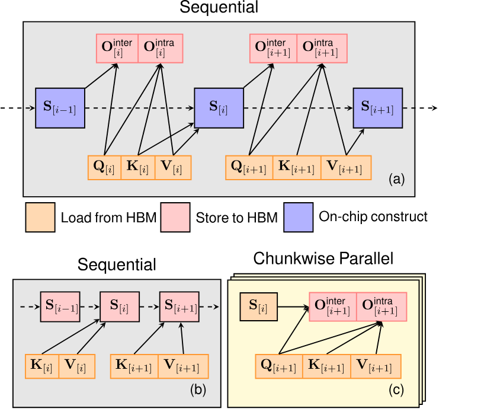

**Figure 1.** (a) Materialization を行わない FlashLinearAttention。こちらは memory-efficient である。(b-c) Materialization を行う FlashLinearAttention。Sequence-level の chunkwise parallelism を利用できる。

<span id="section-3-3"></span>

### 3.3 FlashLinearAttention: Chunkwise 形式による Hardware-Efficient Linear Attention

Chunkwise form の I/O-aware、hardware-efficient implementation を示す。Chunk-level hidden state ${\mathbf{S}}_{[n]}$ を HBM に materialize するかどうかで、forward/backward pass が異なる二つの版を用意する。Forward pass は [Algorithm 1](#algorithm-01) と [Figure 1](#figure-01)、backward pass は付録の [Algorithm 2](#algorithm-02) を参照されたい。Tiling により tensor を block 単位で読み込み、on-chip で再利用して HBM I/O を極力避ける。たとえば ${\mathbf{Q}}_{[n]}$ を SRAM に読み込むと、${\mathbf{Q}}_{[n]}{\mathbf{S}}$ と $({\mathbf{Q}}_{[n]}{\mathbf{K}}_{[n]}^{\top}\odot{\mathbf{M}}){\mathbf{V}}_{[n]}$ の双方を on-chip で計算でき、${\mathbf{Q}}_{[n]}$ の二重読み込みを避けられる。

<span id="algorithm-01"></span>

**Algorithm 1: FlashLinearAttention の forward pass.**

<div class="paper-algorithm">

- **入力:** ${\mathbf Q},{\mathbf K},{\mathbf V}\in\mathbb R^{L\times d}$、chunk size $C\in[L]$、`materialize` $\in\{$`True`,`False`$\}$。
- ${\mathbf Q},{\mathbf K},{\mathbf V}$ を、それぞれ $C\times d$ の $N=L/C$ block に分割する。
- SRAM 上で ${\mathbf S}=\mathbf 0\in\mathbb R^{d\times d}$ を初期化し、on-chip で causal mask ${\mathbf M}\in\mathbb R^{C\times C}$ を構成する。
- **条件** `materialize`（materialization 版）:
  - **ループ** $n\gets1,N$:
    - ${\mathbf S}$ を ${\mathbf S}_{[n]}$ として HBM に保存する。
    - ${\mathbf K}_{[n]},{\mathbf V}_{[n]}$ を HBM から SRAM へ読み込む。
    - On-chip で ${\mathbf S}={\mathbf S}+{\mathbf K}_{[n]}^\top{\mathbf V}_{[n]}$ を計算する。
  - **並列ループ** $n\gets1,N$:
    - ${\mathbf Q}_{[n]},{\mathbf K}_{[n]},{\mathbf V}_{[n]},{\mathbf S}_{[n]}$ を HBM から SRAM へ読み込む。
    - On-chip で ${\mathbf O}'={\mathbf Q}_{[n]}{\mathbf S}_{[n]}+({\mathbf Q}_{[n]}{\mathbf K}_{[n]}^\top\odot{\mathbf M}){\mathbf V}_{[n]}$ を計算する。
    - ${\mathbf O}'$ を ${\mathbf O}_{[n]}$ として HBM に保存する。
  - **出力:** ${\mathbf O}=\{{\mathbf O}_{[1]}\dots{\mathbf O}_{[N]}\}$ と ${\mathbf S}=\{{\mathbf S}_{[1]}\dots{\mathbf S}_{[N]}\}$。
- **それ以外**（non-materialization 版）:
  - **ループ** $n\gets1,N$:
    - ${\mathbf Q}_{[n]},{\mathbf K}_{[n]},{\mathbf V}_{[n]}$ を HBM から SRAM へ読み込む。
    - On-chip で ${\mathbf O}'={\mathbf Q}_{[n]}{\mathbf S}+({\mathbf Q}_{[n]}{\mathbf K}_{[n]}^\top\odot{\mathbf M}){\mathbf V}_{[n]}$ を計算する。
    - On-chip で ${\mathbf S}={\mathbf S}+{\mathbf K}_{[n]}^\top{\mathbf V}_{[n]}$ を計算する。
    - ${\mathbf O}'$ を ${\mathbf O}_{[n]}$ として HBM に保存する。
  - **出力:** ${\mathbf O}=\{{\mathbf O}_{[1]}\dots{\mathbf O}_{[N]}\}$。

</div>

**Non-materialization version** は SRAM に ${\mathbf{S}}_{[n]}$ を一時保存し、$n\in[N]$ の ${\mathbf{O}}_{[n]}$ を逐次計算するため memory-efficient である。Batch size、head 数、head dimension には並列化できるが、sequence-level parallelism はない。Batch size が大きければ十分な occupancy を得られるが、小 batch の長系列・大規模学習では SM を使い切れない。**Materialization version** は inter-chunk recurrence（[Equation 2](#equation-02)）を先に計算し、全 ${\mathbf{S}}_{[n]}$ を HBM に保存してから各 chunk の ${\mathbf{O}}_{[n]}$ を並列計算する。並列性は高いが memory footprint が約 10–20% 増える。Forward pass 後に hidden state を破棄し backward pass で再計算する *recomputation* により、わずかな runtime overhead で memory footprint を大きく削減できるため、これを default とする。

<span id="figure-02"></span>

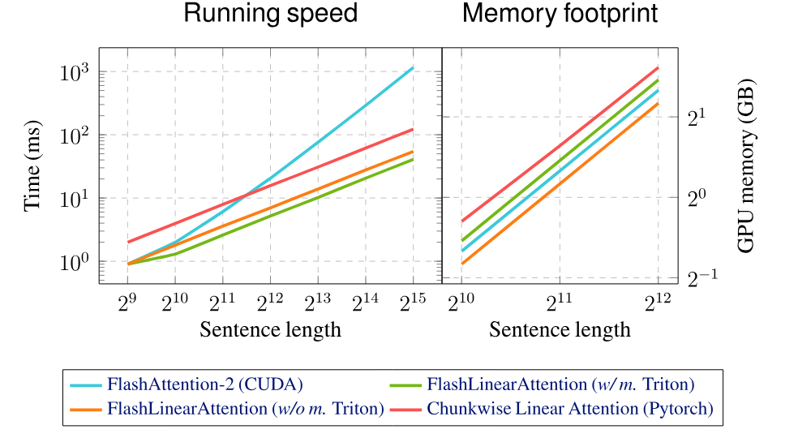

**Figure 2.** 単一の H100 GPU 上での速度比較。Batch size 32、head 数 16、head dimension 64、chunk size 64 とした。横軸と縦軸はいずれも log scale。*w/ m.* と *w/o m.* は、それぞれ hidden state を HBM に materialize する場合としない場合の FlashLinearAttention を表す。

[Figure 2](#figure-02) に実装の速度とメモリ使用量を示す。FlashLinearAttention の両バージョンは、FlashAttention-2 [Dao23b] と純粋な PyTorch による（すなわち I/O を考慮しない）chunkwise linear attention の実装より大幅に高速であり、I/O-aware な設計の効果が確認できる。

<span id="section-4"></span>

## 4 Gated Linear Attention

[Equation 1](#equation-01) の linear recurrence には減衰項も忘却ゲートもないが、これらは RNN に不可欠であることが知られている [Bec24, Cho14a, Wes18]。減衰項がないと情報を「忘れる」ことが難しく、long-context task における linear attention の不安定性の一因だと考えられている [Buc24]。近年の研究 [Sun23b, Qin23c] は、global で*データ非依存*な減衰係数 [+3] $\gamma\in(0,1)$ を linear attention に導入し、${\mathbf{S}}_{t}=\gamma{\mathbf{S}}_{t-1}+{\bm{k}}_{t}^\top{\bm{v}}_{t}$ とすることで性能を改善した。単一の $\gamma$ を使うのは、効率的な学習に必要な attention 型の並列形式を保つためである。本研究では、linear attention にデータ依存のゲート機構を導入する。より表現力の高いゲートを備えていても、得られる gated linear attention（GLA）層には hardware-efficient な chunkwise 形式があり、効率よく学習できることを示す。

<span id="section-4-1"></span>

### 4.1 GLA の再帰形式と並列形式

<span id="table-01"></span>

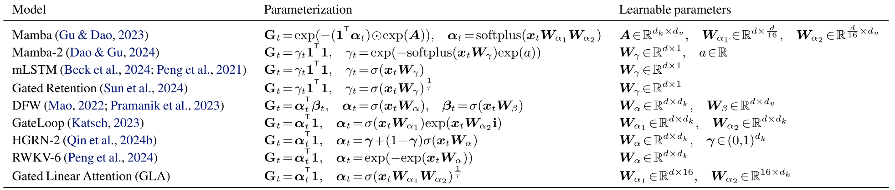

**Table 1.** 近年のモデルにおける gated linear attention の定式化。モデルごとに ${\mathbf{G}}_{t}$ の parameterization が異なる。Bias 項は省略した。

**再帰形式.** GLA は時刻ごとに変化する二次元の忘却ゲート ${\mathbf{G}}_{t}\in(0,1)^{d_{k}\times d_{v}}$ を持つ。

$$
{\mathbf{S}}_{t}={\mathbf{G}}_{t}\odot{\mathbf{S}}_{t-1}+{\bm{k}}_{t}^{\top}{\bm{v}}_{t},
$$

ここでは hidden state の二つの次元が異なっていてもよい。この Hadamard 積に基づく再帰形式は汎用性が高く、[Table 1](#table-01) に示す二次元 hidden state を持つ近年の RNN の多くを包含する。

Gated linear attention の設計で中心となるのは ${\mathbf{G}}_{t}$ の parameterization であり、*parameter efficiency*、*state size*、*training efficiency* の均衡が必要になる。データ依存のゲート行列を得るために ${\bm{x}}_{t}\mapsto{\mathbf{G}}_{t}$ を素朴に写像すると、$d\cdot d_{k}\cdot d_{v}$ 個の要素を持つ行列が必要となり、parameter efficiency が悪い。[Mao22] は、outer product に基づくより効率的な low-rank parameterization（${\mathbf{G}}_{t}={\bm{\alpha}}_{t}^{\top}{\bm{\beta}}_{t}$）を提案し、parameter 数を $d\cdot d_{v}+d\cdot d_{k}$ に抑えた。 [+4]

Mamba [Gu23] は、*データ非依存*の学習可能な行列 ${\bm{A}}$ とデータ依存ベクトル ${\bm{\alpha}}_{t}$ を組み合わせて ${\mathbf{G}}_{t}$ を求めるため、ゲート行列を full rank にできる。しかし [Dao24] が論じたように、この形式は matmul に書き換えられず tensor core を利用できない。簡潔な matmul 形式がないため、各 time step の hidden state を materialize しなければならない。[Gu23] は高い I/O cost を抑えるため、hidden state を HBM ではなく SRAM だけに materialize する hardware-aware な algorithm を開発した。ただし SRAM の容量には限界があり、より大きな hidden state には拡張できない。実験で示すように、この制約は recall-intensive task での性能不足につながる。Mamba-2 [Dao24] は、より制限の強い ${\mathbf{G}}_{t}=\gamma_{t}\mathbf{1}^\top\mathbf{1}$ を用いる。ここで $\gamma_{t}\in(0,1)$ は scalar であり、再帰を matmul 形式に変換できるため、tensor core と大きな state size を利用できる。この*scalar*なデータ依存ゲートは [Pen21]、[Sun24b]、[Bec24] でも使われている。

本論文では scalar parameterization と完全な low-rank parameterization の中間として、${\mathbf{G}}_{t}={\bm{\alpha}}_{t}^{\top}\mathbf{1}$ を採用する。 [+5] これにより、次の再帰形式を得る。

<span id="equation-03"></span>

$$
{\mathbf{S}}_{t}=({\bm{\alpha}}_{t}^{\top}\mathbf{1})\odot{\mathbf{S}}_{t-1}+{\bm{k}}_{t}^{\top}{\bm{v}}_{t}=\mathrm{Diag}({\bm{\alpha}}_{t}){\mathbf{S}}_{t-1}+{\bm{k}}_{t}^{\top}{\bm{v}}_{t},
$$

${\bm{\alpha}}_{t}$ は ${\bm{x}}_{t}$ に low-rank linear layer と sigmoid を順に適用して parameterize する（[第 4.4 節](#section-4-4)）。この定式化は一般的であり、近年の複数の RNN [Kat23, Qin24a, Pen24a] を包含する。したがって、次に述べる hardware-efficient な GLA 実装は、ほかのモデルにもそのまま、または調整して利用できる。

**並列形式.** 系列長方向に並列化する GLA の並列形式を説明する。[Equation 3](#equation-03) を展開すると、

$$
{\mathbf{S}}_{t}=\sum_{i=1}^{t}\left(\left(\prod_{j=i+1}^{t}{\bm{\alpha}}_{j}^{\top}\mathbf{1}\right)\odot{\bm{k}}_{i}^{\top}{\bm{v}}_{i}\right)
$$

${\bm{b}}_{t}:=\prod_{j=1}^{t}{\bm{\alpha}}_{j}$ とおけば、上式は次のように書き換えられる。

$$
\begin{aligned}
{\bm{o}}_{t}={\bm{q}}_{t}{\mathbf{S}}_{t} & ={\bm{q}}_{t}\sum_{i=1}^{t}\left(\left(\frac{{\bm{b}}_{t}}{{\bm{b}}_{i}}\right)^{\top}\mathbf{1}\right)\odot{\bm{k}}_{i}^{\top}{\bm{v}}_{i} \\
=\sum_{i=1}^{t}({\bm{q}}_{t}\odot{\bm{b}}_{t})\left(\frac{{\bm{k}}_{i}}{{\bm{b}}_{i}}\right)^{\top}{\bm{v}}_{i}
\end{aligned}
$$

除算は element-wise である。${\bm{b}}_{t}$ を積み重ねた行列を ${\mathbf{B}}\in(0,1)^{L\times d}$ とすると、並列形式は次のようになる。

$$
{\mathbf{O}}=\left(\left(\underbrace{({\mathbf{Q}}\odot{\mathbf{B}})\left(\frac{{\mathbf{K}}}{{\mathbf{B}}}\right)^{\top}}_{\mathbf{P}}\right)\odot{\mathbf{M}}\right){\mathbf{V}}.
$$

ただし、この形式は数値的に安定しない。${\bm{b}}_{t}$ は ${\bm{\alpha}}_{j}\in(0,1)^{1\times d}$ のゲート値の累積積なので、$t$ が大きいと極端に小さくなり、$\frac{\mathbf{K}}{{\mathbf{B}}}$ が発散するためである。そこで $\mathbf{P}$ を log space で計算する。 [+6]

<span id="equation-04"></span>

$$
\mathbf{P}_{ij}=\sum_{k=1}^{d}\mathbf{Q}_{ik}\mathbf{K}_{jk}\,\exp(\log{\mathbf{B}}_{ik}-\log{\mathbf{B}}_{jk}),\quad i\geq j.
$$

ここで $k$ は feature index を表す。ただし通常の linear attention と違い、[Equation 4](#equation-04) は標準的な matmul で表せず、tensor core 上の half-precision matmul を利用できない。[第 4.3 節](#section-4-3) では、[Figure 3](#figure-03) のように secondary-level chunking によって、数値安定性を保ちながら大半の計算を half-precision matmul で行う方法を示す。

<span id="figure-03"></span>

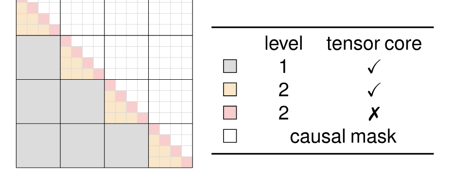

**Figure 3.** GLA の chunkwise 計算を示す attention 型の map。灰色の inter-chunk dependency は chunkwise 形式では直接計算せず、並列形式でのみ計算する。Intra-chunk dependency には secondary chunking/tiling を用い、橙色の inter-sub-chunk 部分は half-precision matmul、桃色の intra-sub-chunk 部分は log space での full-precision 計算によって求める。

<span id="section-4-2"></span>

### 4.2 GLA の Chunkwise 並列形式

基本的な linear attention の chunkwise 形式（[第 2.2 節](#section-2-2)）と同様に、GLA の chunkwise 形式を導く。Intra-chunk operation では、上の並列形式を chunk 単位で実行して ${\mathbf{O}}^{\mathrm{intra}}$ を得る。Inter-chunk については、

$$
\begin{aligned}
\mathbf{\Lambda}_{iC+j} & =\frac{{\bm{b}}_{iC+j}}{{\bm{b}}_{iC}},\mathbf{\Gamma}_{iC+j}=\frac{{\bm{b}}_{(i+1)C}}{{\bm{b}}_{iC+j}},{\bm{\gamma}}_{i+1}=\frac{{\bm{b}}_{(i+1)C}}{{\bm{b}}_{iC}}, \\
{\mathbf{S}}_{[i+1]} & =\left({\bm{\gamma}}_{i+1}^{\top}\mathbf{1}\right)\odot{\mathbf{S}}_{[i]}+\left({\mathbf{K}}_{[i+1]}\odot\mathbf{\Gamma}_{[i+1]}\right)^{\top}{\mathbf{V}}_{[i+1]}, \\
{\mathbf{O}}^{\mathrm{inter}}_{[i+1]} & =\left({\mathbf{Q}}_{[i+1]}\odot\mathbf{\Lambda}_{[i+1]}\right){\mathbf{S}}_{[i]}.
\end{aligned}
$$

直観的には、$\mathbf{\Lambda}_{[i+1]}$ は chunk の先頭からの累積減衰を符号化し、前の chunk の hidden state ${\mathbf{S}}_{[i]}$ を伝播するために使う。一方、$\mathbf{\Gamma}_{[i+1]}$ は chunk の末尾までの減衰を符号化し、次の hidden state ${\mathbf{S}}_{[i+1]}$ に加える情報を蓄積するために使う。

<span id="section-4-3"></span>

### 4.3 Hardware-Efficient GLA

Chunkwise 形式が得られたので、[第 3 節](#section-3) の FlashLinearAttention algorithm を gated case に適用できる。この適用には、以下の二つの重要な技法も必要になる。本節では概要だけを説明し、完全な algorithm は Appendix [第 9 節](#section-9) の [Algorithms 3–6](#algorithm-03) に示す。

**Secondary-level chunking.** 通常の linear attention と違い、GLA の intra-chunk 計算は log space の計算（[Equation 4](#equation-04)）を含むため、half-precision matmul、したがって tensor core を利用できない。Tensor core をより有効に使うため、古典的な tiling [Dao22] と同様に、一つの chunk をさらに sub-chunk に分ける secondary-level chunking を採用する。すると attention-like matrix ${\mathbf{P}}\in\mathbb{R}^{L\times L}$ は、[Figure 3](#figure-03) のように chunkwise に計算できる。具体的には、sub-chunk 間の interaction を half-precision matmul で計算する。 [+7]

$$
\begin{aligned}
{\mathbf{P}}_{[i][j]} & =\Big({\mathbf{Q}}_{[i]}\odot{\mathbf{\Lambda}}_{[i]}\Big)\Big({\mathbf{K}}_{[j]}\odot{\mathbf{\Gamma}}_{[j]}\odot\frac{{\bm{b}}_{iC}}{{\bm{b}}_{(j+1)C}}\Big)^\top\in\mathbb{R}^{C\times C}.
\end{aligned}
$$

これは [Figure 3](#figure-03) の橙色の tile に対応する。Intra-sub-chunk 部分（同図の桃色の tile）は [Equation 4](#equation-04) に従い、安定性のため full precision で matmul を行う必要がある。この二段階 tiling により、half precision でない matmul の FLOPs が大幅に減り、wall-clock time も短くなる。PyTorch 形式の pseudo-code は Appendix [第 9 節](#section-9) の [Listing 1](#listing-01) に示す。

**Memory-efficient な ${\mathbf{d}\bm{\alpha}}_{t}$ の計算.** 先行研究 [Mao22] は、${\mathbf{d}\bm{\alpha}}_{t}=({\mathbf{S}}_{t-1}\odot\mathbf{d}{\mathbf{S}}_{t})\mathbf{1}$ であるため、GLA 型モデルですべての勾配 ${\mathbf{d}\bm{\alpha}}_{t}$ を求めるには、$L\times d\times d$ の行列値 hidden state を HBM に materialize する必要があるとした。本研究では代わりに、${\mathbf{d}\log\bm{\alpha}}_{t}$ について次の*閉形式*を与える。

$$
\begin{aligned}
{\mathbf{d}\log\bm{b}}_{t} & ={\bm{q}}_{t}\odot{\mathbf{d}\bm{q}}_{t}-{\bm{k}}_{t}\odot{\mathbf{d}\bm{k}}_{t},\hskip 11.38109pt{\mathbf{d}\log\bm{\alpha}}_{t}=\sum_{t\leq i\leq L}{\mathbf{d}\log\bm{b}}_{i},
\end{aligned}
$$

これは [Equation 4](#equation-04) を微分すれば容易に得られる（完全な導出は Appendix [第 9 節](#section-9) を参照）。${\mathbf{d}\bm{q}}_{t}$ と ${\mathbf{d}\bm{k}}_{t}$ は [Algorithms 4 and 6](#algorithm-04) と同様に計算できる。

<span id="section-4-4"></span>

### 4.4 GLA Transformer

GLA 層を multi-head case に一般化する。Head 数を $H$ とすると、各 head $h\in[1,H]$ について次式を得る。

$$
\begin{aligned}
{\mathbf{S}}^{h}_{t}=\left(\left({\bm{\alpha}}_{t}^{h}\right)^{\top}\mathbf{1}\right)\odot{\mathbf{S}}_{t-1}^{h}+{\bm{k}}_{t}^{h\top}\,{\bm{v}}^{h}_{t}\in\mathbb{R}^{d^{\prime}_{k}\times d^{\prime}_{v}}, \\
{\bm{o}}^{h}_{t}={\bm{q}}_{t}^{h}{\mathbf{S}}_{t}^{h}\in\mathbb{R}^{1\times d^{\prime}_{v}}, \\
{\bm{o}}^{\prime}_{t}=\mathrm{concat}(\mathrm{LN}({\bm{o}}^{1}_{t}),\dots,\mathrm{LN}({\bm{o}}^{H}_{t}))\in\mathbb{R}^{1\times d_{v}}, \\
{\bm{r}}_{t}=\mathrm{Swish}({\bm{x}}_{t}{\bm{W}}_{r}+{\bm{b}}_{r})\in\mathbb{R}^{1\times d_{v}}, \\
{\bm{y}}_{t}=({\bm{r}}_{t}\odot{\bm{o}}^{\prime}_{t}){\bm{W}}_{O}\in\mathbb{R}^{1\times d}.
\end{aligned}
$$

ここでは key dimension（$d_{k}$）と value dimension（$d_{v}$）を分け、$d^{\prime}_{k}=d_{k}/H,d^{\prime}_{v}=d_{v}/H$ を各 head の key/value dimension とする。各 head の出力後に LayerNorm（$\mathrm{LN}$）を適用し、output projection と output gating は head 出力を連結したものに作用する [Sun23b]。

続いて、multi-head GLA 層と feed-forward network（FFN）を交互に配置し、Transformer 型のモデルを構成する。具体的には、layer $l$ の contextualized representation ${\mathbf{X}}^{(l)}$ から ${\mathbf{X}}^{(l+1)}$ を次のように求める。

$$
\begin{aligned}
{\mathbf{Y}}^{(l)}=\mathrm{GLA}(\mathrm{LN}({\mathbf{X}}^{(l)}))+{\mathbf{X}}^{(l)} \\
{\mathbf{X}}^{(l+1)}=\mathrm{SwiGLU}(\mathrm{LN}({\mathbf{Y}}^{(l)}))+{\mathbf{X}}^{(l)},
\end{aligned}
$$

ここで SwiGLU FFN layer [Tou23] は次式で定義する。

$$
\mathrm{SwiGLU}({\mathbf{Z}})=(\mathrm{Swish}({\mathbf{Z}}{\bm{W}}_{1})\odot{\mathbf{Z}}{\bm{W}}_{2}){\bm{W}}_{3}.
$$

<span id="table-02"></span>

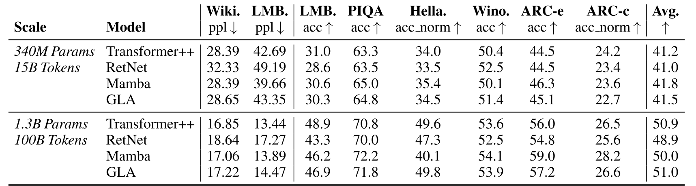

**Table 2.** GLA Transformer と Transformer++ [Tou23]、RetNet [Sun23b]、Mamba [Gu23] の比較。すべてのモデルを SlimPajama の同じ subset と Mistral tokenizer で学習した。340M/1.3B モデルの学習量はそれぞれ 15B/100B token である。各 task の性能は zero-shot で測定した。[Gu23] と同じ task 群の主な結果を示す。5-shot を含むほかの benchmark の結果は Appendix [第 11 節](#section-11) に掲載した。最終列は（normalized）accuracy を指標とする全 benchmark の平均である。

**Parameter allocation.** 提案する GLA 層は、通常の softmax attention 層と比べ、${\bm{\alpha}}_{t},{\bm{r}}_{t}$ を予測する二つの行列（${\bm{W}}_{\alpha},{\bm{W}}_{r}$）が追加される。Parameter efficiency を保つため、次の low-rank parameterization を用いる。

$$
{\bm{\alpha}}_{t}=\sigma(({\bm{x}}_{t}{\bm{W}}^{1}_{\alpha}{\bm{W}}^{2}_{\alpha}+{\bm{b}}_{\alpha})))^{\frac{1}{\tau}}\in\mathbb{R}^{1\times d_{k}},
$$

ここで ${\bm{W}}^{1}_{\alpha}\in\mathbb{R}^{d\times 16}$、${\bm{W}}^{2}_{\alpha}\in\mathbb{R}^{16\times d_{k}}$ とし、$\tau=16$ はモデルの忘却を緩やかにする temperature 項である。さらに $d_{k}=\frac{d}{2}$、$d_{v}=d$ とし、${\bm{W}}_{Q},{\bm{W}}_{K},{\bm{W}}_{V},{\bm{W}}_{O},{\bm{W}}_{r}$ には full-rank parameterization を用いる。最終的に一つの GLA 層が必要とする parameter 数は、通常の softmax attention と同じく約 $4d^{2}$ となる。

<span id="section-5"></span>

## 5 実証研究

<span id="section-5-1"></span>

### 5.1 実験設定

主な実験は language modeling を対象とし、GLA が（i）現代的な architecture を用いた強力な Transformer baseline、（ii）近年の linear-time model に匹敵するかを調べる。SlimPajama dataset [Sob23] を Mistral tokenizer [Jia23e] で tokenize する。元の dataset は 627B token を含むが、本実験ではそのうち 100B token を用いる。

**Baselines.** GLA を Transformer++ [Tou23]、RetNet [Sun23b]、Mamba [Gu23] の三つの baseline と比較する。Transformer++ は Rotary Positional Embeddings [Su24]、SwiGLU [Sha20]、RMSNorm [Zha19] を採用した LLaMA architecture である。公平な比較のため、RetNet の元の FFN も SwiGLU に置き換える。Mamba には公開実装を使用する。すべての baseline は同じ dataset で、まったく同じ token 数だけ学習する。

**学習条件.** すべてのモデルを 340M と 1.3B の二つの規模で scratch から学習する。Optimizer は AdamW [Los18]、最大 learning rate は 3e-4 とする。340M モデルは batch size 0.5M token で 15B token、1.3B モデルは batch size 2M token で 100B token 学習する。Cosine learning-rate schedule を用い、340M/1.3B の warmup はそれぞれ 0.5B/1B token とする。初期および最終 learning rate は 3e-5、weight decay は 0.01、gradient clipping は 1.0 である。

<span id="section-5-2"></span>

### 5.2 主な結果

Wikitext（Wiki.）の perplexity（ppl）に加え、[Gu23] と同様に commonsense reasoning と question answering を含む幅広い downstream task を評価する。対象は LAMBADA [Pap16]、PiQA [Bis20]、HellaSwag [Zel19]、WinoGrande [Sak19]、ARC-easy（ARC-e）、ARC-challenge（Arc-c）[Cla18] である。Appendix [第 11 節](#section-11) には Copa [Roe11]、SciQA [Aue23]、OpenbookQA [Mih18b]、BoolQA [Cla19] の結果も示す。WikiText と LAMBADA では perplexity、HellaSwag、ARC-challenge、OpenbookQA では長さで正規化した accuracy、その他では accuracy を報告する。すべての評価には LM evaluation harness [Gao21c] を用いる。

<span id="figure-04"></span>

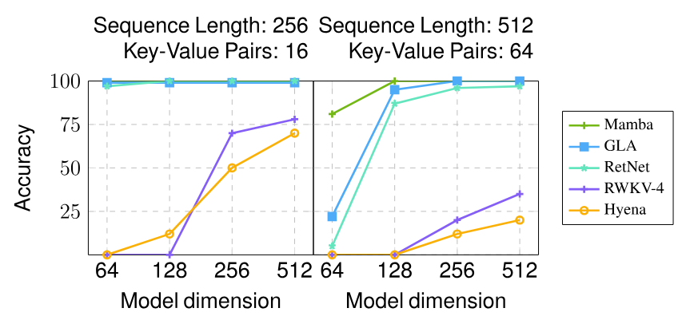

**Figure 4.** 合成 MQAR task における accuracy（%）。

<span id="figure-05"></span>

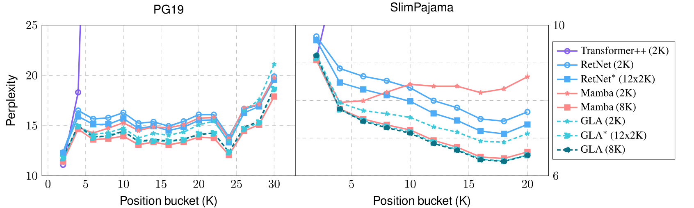

**Figure 5.** SlimPajama と PG19 の test set における length extrapolation。異なる学習長を用い、1.3B モデルを SlimPajama の 100B token で scratch から事前学習した。<sup>*∗*</sup> は、各 2K token の 12 segment による truncated BPTT を用いたモデルを示す。

主な結果を [Table 2](#table-02) に示す。データ非依存の decay rate を使う RetNet と比べ、データ依存ゲートを持つ GLA Transformer はすべての task で性能が向上した。GLA Transformer と Mamba は、ともに Transformer++ と同程度の性能を示す。

**Recall-intensive task.** Subquadratic model は Transformer に匹敵する language-modeling 性能を達成できるが、recall-intensive task では softmax attention に劣ることが [Aro24] で示されている。そこで、recall を重視する実 task と合成 task で GLA を評価する。

合成 MQAR task [Aro23] は induction-head task [Dao22g] を難しくした multi-query 版で、モデルは query token に続く token を複数回想起する必要がある。[Aro23] の実験設定に従い、GLA を RetNet [Sun23b]、Mamba [Gu23]、Hyena [Pol23a]、RWKV-4 [Pen23b] など近年の subquadratic model と比較する。RetNet と GLA の head 数は 2 とし、その他のモデルには [Aro23] の既定設定を用いる。結果を [Figure 4](#figure-04) に示す。標準的な quadratic attention はすべての設定で満点になるため省略した。行列値 hidden state を持つモデル（Mamba/RetNet/GLA）は Hyena/RWKV より優れ、GLA は RetNet を上回る。これはデータ依存ゲートの効果を裏づける。

[Aro24] に従い、FDA [Aro23a]、SWDE [Loc19]、SQUAD [Raj18] の三つの実用的な recall-intensive task でも評価する。これらは information extraction または reading comprehension を対象とする。[Table 3](#table-03) のとおり、subquadratic model は information-extraction task である FDA と SWDE で Transformer を大きく下回る。ただし GLA は、ほかの subquadratic model より高い性能を示す。Mamba より大きな recurrent state と、RetNet にはない selection mechanism が寄与したと考えられる。

<span id="table-03"></span>

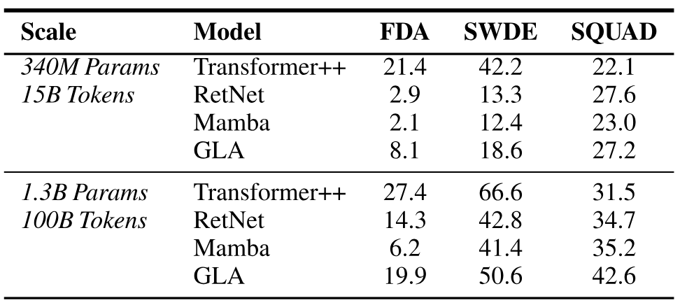

**Table 3.** [Aro24] で評価された三つの recall-intensive task におけるモデル比較。すべて高いほどよい。

**長系列学習と length extrapolation.** Linear-attention model の利点の一つは、長系列を線形時間で効率よく学習できることである。この性質を示すため、（i）8K context を直接学習する設定と、（ii）2K segment ごとの truncated backpropagation through time（TBPTT）で 24K context を学習する設定を比較する。 [+8] 後者では segment をまたいで gradient を伝播しないため、標準的な 2K 学習（初期 hidden state を常に zero にする）と同程度の小さな overhead で済む。1.3B の Mamba、RetNet、GLA を各設定で SlimPajama の 100B token により事前学習し、SlimPajama と PG19 [Rae20] の test set で評価する。

[Figure 5](#figure-05) は position group ごとに求めた token の perplexity を示す。2K context で学習したモデルでは、PG19 test set の大半の position bucket で GLA の extrapolation が Mamba/RetNet より良い。Mamba は 4K を超える extrapolation が難しい一方、GLA/RetNet は SlimPajama test set で 18K まで generalize できる。Transformer が学習長を超えて extrapolate できないのは既知の failure mode である。 [+9] 三つのモデルはいずれも長系列で事前学習すると perplexity が一貫して改善する。GLA では二つの設定の perplexity 差が小さく、TBPTT がより経済的な長系列学習法になりうる。Mamba は 8K 学習から大きな恩恵を受け、同じ設定の GLA と同程度の性能になる。

**Ablation.** 340M の GLA variant を 7B token 学習する小規模な ablation study を行い、（i）*fine-grained*かつ*データ依存*な gating の重要性、（ii）head dimension の影響を調べる。結果は [Table 4](#table-04) に示す。（i）データ依存 scalar gate は RetNet を大幅に改善するが、さらに細粒度の gating mechanism が必要である。（ii）既定では 4 head とし、head 数を変えて head dimension を調整した。8 head、すなわち小さい head dimension では perplexity が比較的大きく悪化する。1 head、すなわち大きい head dimension が最良だが、改善はわずかな一方で GPU memory を大幅に多く必要とする。そのため実験では 4 head を採用する。

<span id="table-04"></span>

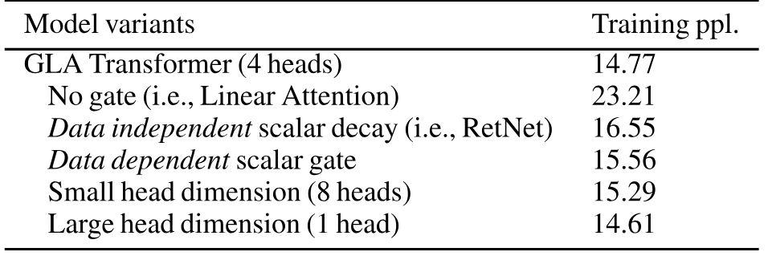

**Table 4.** 7B token 学習した 340M モデルの ablation study。各 variant は最後の 200 training step の平均 perplexity で評価する。

<span id="section-5-3"></span>

### 5.3 学習効率

<span id="figure-06"></span>

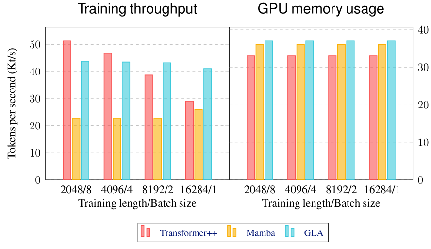

**Figure 6.** 単一の H100 GPU 上での 1.3B モデルの training throughput と GPU memory 使用量。

[Figure 6](#figure-06) は、単一の H100 GPU 上で 1.3B モデルの sequence length と batch size を変えたときの throughput と memory 使用量を示す。 [+10] GLA には hidden state を recompute する FlashLinearAttention の materialization 版（[第 3.3 節](#section-3-3)）を用いる。全モデルの space complexity は線形で、GPU footprint の差はわずかである。Training throughput では Mamba が Transformer++ と GLA を下回り、training length が 4096 を超えると GLA の優位性が大きくなる。

<span id="section-5-4"></span>

### 5.4 限界と今後の課題

GLA Transformer は一定の規模で実験したものの、計算資源の制約から、さらに大規模な実験は行えなかった。より大きなモデルや dataset に対する GLA の scaling は現時点では不明だが、規模が大きくなるほど、Mamba に対する GLA の training efficiency は高まると予想される。具体的に $>7$B などへ scale すると、GLA は tensor core をより活用でき、tensor parallelism にも対応するため、Mamba より効率的になりうる。 [+11] Linear attention の効率を生かすなら、最先端の state-space model を他種の data に応用する近年の研究 [Yan23f, Zhu24f, Ma24d, Liu24z, Xin24a, Wan24ad, Wan24ae, Yan24n] と同様に、GLA を他の modality、特に long-range dependency を持つ modality に適用することも重要な課題である。

<span id="section-6"></span>

## 6 関連研究

ここでは関連研究を簡潔に述べ、より詳しい議論を付録[第 8 節](#section-8)に示す。

従来の RNN は hidden state 間の非線形依存と、matmul に基づく高コストな逐次 hidden-state update のため scale しにくい。Linear RNN、State-Space Model（SSM）、Transformer は非線形依存を取り除き、時間方向に学習を並列化できる [Mar18, Gu22, Smi23]。Transformer architecture に代わる有力な準二次モデルとして、近年盛んに研究されている [Pen23b, Gu23, Qin23a, Qin23c, Sun23b, Wan22m]。

Data-dependent decay rate は以前から RNN に重要だと考えられてきた [Ger00, Wes18]。一般的な forget gate の値は、直前の hidden state と現在の入力の両方に依存する。一方 [Mar18] は、並列学習を可能にするため、forget gate を現在の入力だけに依存させることを提案した。この単純な方法は HGRN [Qin23a] の中規模実験で有効性が確認されている。RWKV-v6 [Pen24a] と Mamba [Gu23] も forget gate に似た data-dependent decay rate を用いる。Linear Transformer では、[Pen21] が粗粒度の position-wise forget gate を、[Mao22] と [Kat23] がより細粒度の forget gate を採用する。

RNN は履歴全体を固定次元の hidden state に符号化する。Hidden-state dimension は memory capacity の指標となり、表現力に大きく影響する。[第 2.1 節](#section-2-1)で述べたように、Linear Transformer は outer-product parameterization によって RNN の hidden dimension を拡張する。一方、linear SSM は single-input-single-output（SISO）によって拡張する。SSM parameter が data-dependent でなければ、Fast Fourier Transform（FFT）を使って学習時に効率よく計算できる。Data-dependent な場合は FFT-based training が使えないため、[Gu23] は parallel scan algorithm [Smi23] で selective state-space model を学習する custom CUDA kernel を実装した。すべての hidden state を SRAM に収める必要があり、expansion rate は最大 16 に限られる。これに対し本研究の hardware-aware training algorithm は、hidden dimension をより広い範囲へ効率よく拡張でき、recall-intensive task で有用であることを示した。

<span id="section-7"></span>

## 7 結論

Data-dependent gating mechanism を持つ linear attention Transformer を学習するための効率的なアルゴリズムを提案した。このアルゴリズムは FLOPs と並列性の均衡を取りながら、現代の GPU の tensor core を利用できる半精度 matmul を保つ。Language modeling 実験により、gated linear attention Transformer が強い baseline に匹敵する性能を示すことを確認した。

**Impact Statement.** 本論文は、（gated）linear-attention model という新しい model family の training efficiency 向上を目指す。この種のモデルが持つ効率上の利点は、language model を利用できる層の拡大につながる可能性がある。一方で、新しい architecture が language model の偏りや有害な出力といった既知の問題にどう影響するかは、まだ検証されていない。

## 謝辞

本研究は MIT-IBM Watson AI Lab の支援を受けた。示唆に富む議論をしてくれた Yutao Sun、Zhen Qin、Li Dong、Xinyu Yang、Jiacheng You、Huanqi Cao、Yu Zhang、Shida Wang に感謝する。また、校正に協力してくれた Yu Zhang、Fares Obeid、Daniel Goldstein、Liliang Ren に感謝する。FlashLinearAttention library に貢献した Yu Zhang には特に感謝したい。

<span id="section-8"></span>

## 8 関連研究の拡張

<span id="section-8-1"></span>

### 8.1 Linear Attention

**Feature map $\phi$.** Linear attention [Kat20] は、$\exp({\bm q}_t{\bm k}_i^\top)$ を feature map $\phi$ に対応する kernel $k({\bm x},{\bm y})$、すなわち $k({\bm x},{\bm y})=\langle\phi({\bm x}),\phi({\bm y})\rangle$ で置き換える。ここで $\phi\in\mathbb R^{d_{\text{key}}}\rightarrow\mathbb R^{d_{\text{dot}}}$ である。$\phi$ は多くの場合、$\phi=\phi_0\circ\phi_1$ の二部分からなる。$\phi_1$ には random sample で構成する linear map [Pen21, Cho20a]、学習可能な MLP [Kas21, Zha24aa, Kac23]、または単純な identity map [Mao22] を使える。$\phi_2$ は通常、$1+\operatorname{elu}$ [Kat20]、$\mathrm{ReLU}$ [Kas21]、$\exp(\cdot)$ [Zha24aa, Cho20a] のように $\phi$ を positive feature map にする element-wise activation である。ただし positive feature map は不要かもしれないという報告もある [Qin23c, Sun23b, Mao22]。

本研究は [Sun23b] と [Mao22] に従い、identity map $\phi=\mathbf I$ を用いる。近年、scaled element-wise exponential map [Nah23, Zha24aa] や higher-order polynomial map [Aro24, Kac23] など、identity でない feature map が実験上よく機能することが示されている。他種の feature map を GLA に組み込む検討は今後の課題とする。

**Attention spikiness.** Linear attention には、attention distribution が均一すぎて、すなわち entropy が高すぎて重要な token に集中できない「attention dilution」の問題がある [Qin22a]。[Qin22a] は近接 token に集中する local-attention layer の追加を提案し、この方法は [Lin23, Nah23, Zha23p] でも採用され、性能に不可欠だと確認された。Scaled element-wise exponential map、すなわち $t\geq2$ とする $\phi(\mathbf x)=\mathbf{\exp}(t\cdot\mathbf x)$ も attention の集中に役立つ [Nah23, Zha24aa]。[Zha24aa] は higher-order polynomial kernel が低 entropy で尖った attention distribution を生むことも示し、Based Linear Attention [Aro24] と PolySketchFormer [Kac23] の実験上の成功を部分的に説明した。

**Memory capacity.** Linear attention の memory size は有限 [Pen22] だが、softmax attention にはこの上限がない [Ore24]。両者の性能差を埋めるには、memory size を効率よく増やし、memory を有効利用することが鍵になる。Memory size の拡大には $d_{\operatorname{key}}$ を直接増やす方法が有効だが [Sun23b, Mao22, Zha22f]、$d_{\operatorname{key}}$ とともに総 parameter 数も増えて制御しにくい。Parameter-efficient な方法では $d_{\text{key}}$ を維持し、代わりに $d_{\text{dot}}$ を増やすことが多い。次数 $p\geq2$ の higher-order polynomial kernel は $d_{\text{key}}$ を大きな $d_{\text{dot}}=O(d_\text{key}^p)$ に写像する [Aro23, Kac23]。[Sch21] は Deterministic Parameter-Free Projection（DPFP）を提案し、[Pra23] は parameterized outer product によって parameter-efficient、または parameter-free に $d_{\text{dot}}$ を拡張した。

Memory utilization を改善するため、[Sch21] は delta rule で memory を動的に編集する。ただし、gated RNN で無関係な履歴情報を消去する古典的手法である gating mechanism [Mao22] より性能が低いことが示されている。近年は、memory vector に直交性を課して utilization を高める方法も提案された [Zha23p]。

**Decay または gate を持つ linear attention.** [Pen21] は recency bias を linear attention に組み込む position-wise scalar gate を使い、近年の [Dao24, Bec24, Sun24b] もこの方法を再検討した。一方 [Mao22, Pra23] は、より細粒度に memory を制御するため outer product で得た行列値 gate を用いる。

Scalar decay は chunkwise linear attention に容易に組み込めるため、効率よく学習できる [Sun23b, Qin24c]。行列値 gate では training efficiency の確保がはるかに難しい。[Mao22] と [Kat23] の training algorithm は、全 step の hidden state を HBM に materialize するので I/O cost が高く、tensor core も利用できない。本研究の hardware-efficient training algorithm は materialization を削減または除去し、tensor core の利用を可能にする。

**I/O-aware な chunkwise linear attention.** Linear attention の chunkwise 形式は広く知られている。[Hua22a] は [Kat20] の training algorithm が実際には遅いと指摘し、最初に chunkwise linear attention を提案した。[Sun23b] と [Qin24c] はこの形式を exponential decay（または ALiBi）を持つ linear attention に一般化し、[Kac23, Lin23] も同様の chunkwise 形式を導いた。

しかし大半の chunkwise linear attention は I/O-aware ではない。著者らの知る限り、I/O-aware なのは本研究と同時期の LightningAttention2 [Qin24c] だけであり、FlashLinearAttention の non-materialization 版によく似ている。本研究はさらに materialization 版を提案する。Memory footprint がわずかに増える代わりに sequence-level parallelism を利用でき、training throughput が向上する。

**その他の subquadratic model.** 本研究で扱う Linear-attention Transformer [Kat20, Sch21] のほかにも、あらかじめ定めた固定 pattern [Chi19, Bel20a, Zah20] や、context-aware で学習可能な pattern [Roy21, Kit20, Ren23] によって attention を sparse 化し、系列長に対して subquadratic complexity で sequence modeling を行う研究がある。Convolution を用いた効率的な sequence modeling も、Dynamic Convolution [Wu19]、Long Convolution [Fu23b, Qin23d, Pol23a, Mas23, Li23y, Rom21]、State Space Model [Gu22, Gup22, Gu21, Has22, Smi23, Ma23b] などで研究されている。

<span id="section-8-2"></span>

### 8.2 Sequence Parallelism

Linear Transformer の chunkwise 並列形式は、chunkwise な並列計算と inter-chunk communication を組み合わせる二段階 parallel prefix sum（parallel scan）algorithm [Ble90, Cha15] に似ている。また、attention-based Transformer を高速化する sequence parallelism [Li23g] とも近く、この技法は近年の長系列 modeling で注目されている [Liu23, Li23q, Bra23]。Sequence-level parallelism は FlashAttention-1 [Dao22] に対する FlashAttention-2 [Dao23b] の主な改善点でもある。主な違いは、（i）linear Transformer の chunk-level 並列形式は線形 complexity のため 1 pass で済むのに対し、Transformer の sequence parallelism は本質的な二次 complexity のため $L/C$ pass、すなわち各 query block に対して key/value block を左から右へ scan する必要があること、（ii）matmul の順序が異なることである。さらに distributed training では、chunkwise linear attention が softmax attention より device 間の communication cost を大幅に減らし、極端に長い系列の学習を可能にしうる。

<span id="algorithm-02"></span>

**Algorithm 2: FlashLinearAttention の backward pass.**

<div class="paper-algorithm">

- **入力:** ${\mathbf Q},{\mathbf K},{\mathbf V},{\mathbf O},{\mathbf{dO}}\in\mathbb R^{L\times d}$、chunk size $C\in[L]$、`materialize` $\in\{$`True`,`False`$\}$、${\mathbf S}\in\mathbb R^{(L/C)\times d\times d}$（`materialize` が `True` の場合に利用可能）。
- SRAM 上で ${\mathbf{dS}}=\mathbf0\in\mathbb R^{d\times d}$ を初期化し、on-chip で ${\mathbf M}\in\mathbb R^{C\times C}$ を構成する。
- **条件** `materialize`:
  - **ループ** $n\gets N,1$ の逆順:
    - ${\mathbf{dS}}$ を ${\mathbf{dS}}_{[n]}$ として HBM に保存し、${\mathbf Q}_{[n]},{\mathbf{dO}}_{[n]}$ を SRAM に読み込み、${\mathbf{dS}}={\mathbf{dS}}+{\mathbf Q}_{[n]}^\top{\mathbf{dO}}_{[n]}$ を計算する。
  - **並列ループ** $n\gets1,N$:
    - ${\mathbf Q}_{[n]},{\mathbf K}_{[n]},{\mathbf V}_{[n]},{\mathbf{dO}}_{[n]},{\mathbf S}_{[n]},{\mathbf{dS}}_{[n]}$ を HBM から SRAM へ読み込む。
    - On-chip で ${\mathbf{dQ}}={\mathbf{dO}}_{[n]}{\mathbf S}_{[n]}^\top+({\mathbf{dO}}_{[n]}{\mathbf V}_{[n]}^\top\odot{\mathbf M}){\mathbf K}_{[n]}$ を計算する。
    - On-chip で ${\mathbf{dK}}={\mathbf V}_{[n]}{\mathbf{dS}}_{[n]}^\top+({\mathbf V}_{[n]}{\mathbf{dO}}_{[n]}^\top\odot{\mathbf M}^\top){\mathbf Q}_{[n]}$ を計算する。
    - On-chip で ${\mathbf{dV}}={\mathbf K}_{[n]}{\mathbf{dS}}_{[n]}+({\mathbf Q}_{[n]}{\mathbf K}_{[n]}^\top\odot{\mathbf M})^\top{\mathbf{dO}}_{[n]}$ を計算し、${\mathbf{dQ}},{\mathbf{dK}},{\mathbf{dV}}$ を HBM に書き込む。
- **それ以外**:
  - SRAM 上で ${\mathbf S}=\mathbf0\in\mathbb R^{d\times d}$ を初期化する。
  - **ループ** $n\gets1,N$（hidden state の recomputation）: ${\mathbf K}_{[n]},{\mathbf V}_{[n]},{\mathbf{dO}}_{[n]}$ を読み込み、${\mathbf{dQ}}={\mathbf{dO}}_{[n]}{\mathbf S}^\top+({\mathbf{dO}}_{[n]}{\mathbf V}_{[n]}^\top\odot{\mathbf M}){\mathbf K}_{[n]}$ を計算し、${\mathbf S}={\mathbf S}+{\mathbf K}_{[n]}^\top{\mathbf V}_{[n]}$ を更新する。
  - **ループ** $n\gets N,1$ の逆順: chunk tensor を読み込み、${\mathbf{dS}}={\mathbf{dS}}+{\mathbf Q}_{[n]}^\top{\mathbf{dO}}_{[n]}$ と上記の ${\mathbf{dQ}},{\mathbf{dK}},{\mathbf{dV}}$ を計算し、HBM に書き込む。
- **出力:** ${\mathbf{dQ}}=\{{\mathbf{dQ}}_{[1]}\dots{\mathbf{dQ}}_{[N]}\}$、${\mathbf{dK}}=\{{\mathbf{dK}}_{[1]}\dots{\mathbf{dK}}_{[N]}\}$、${\mathbf{dV}}=\{{\mathbf{dV}}_{[1]}\dots{\mathbf{dV}}_{[N]}\}$。

</div>

<span id="section-8-3"></span>

### 8.3 Hardware-aware Algorithm

多くの algorithm は理論上高速でも、hardware 特性と噛み合わず実際には遅い [Hoo20, Sap23]。たとえば butterfly matrix の matmul は FFT によって理論上の complexity を下げられるが、大量の memory transfer のため実測では遅い。この問題から、butterfly operator を GPU に適合させやすい matrix が提案された [Dao22b, Fu23c]。実用上は tiling や recomputation で HBM I/O cost を減らし、tensor core をできる限り使うことが重要である。FlashLinearAttention の考え方は FlashAttention [Dao22, Dao23b] や FlashConvFFT [Fu23] に近い。これらは neural-network layer の I/O-aware 版を実装し、実時間での高速化を実現する。同時期の [Qin24c] も FlashLinearAttention の non-materialization 版に似た I/O-aware linear attention を提案した。本研究はさらに materialization 版を提案し、memory footprint が少し増える代わりに sequence-level parallelism を利用して training throughput を高める。

<span id="section-9"></span>

## 9 Chunkwise (Gated) Linear Attention の詳細

**FlashLinearAttention の backward pass.** Linear attention の backward-pass pseudo-code を [Algorithm 2](#algorithm-02) に示す。

**GLA の pseudo-code.** まず、secondary-level chunking を使わずに FlashLinearAttention を GLA 学習へ直接適用した形を示す。[Algorithms 3](#algorithm-03) と [4](#algorithm-04) は materialization 版の forward/backward pass、[Algorithms 5](#algorithm-05) と [6](#algorithm-06) は non-materialization 版に対応する。

Secondary-level chunking の pseudo-code を PyTorch 形式で [Listing 1](#listing-01) に示す。

<span id="listing-01"></span>

**Listing 1: GLA 学習用の二段階 chunking algorithm を示す PyTorch 形式の code snippet。簡潔にするため batch size と head 数の次元は省略した。**

```python
  def gated_linear_attention_forward(Q, K, V, a, C, c):
      '''
      Q/K/V: query/key/value
      a: log forget gate
      C/c: chunk size, subchunk size
      '''
      # L: sequence length, d: head dimension
      L, d_k = Q.shape
      d_v = V.shape[-1]
      S = torch.zeros(d_k, d_v)
      O = torch.empty_like(V)
      # cumsum of log decay within a chunk
      B = torch.empty_like(a)
      # local compute of cumulative product of decay within a chunk
      for i in range(0, L//C):
          b = torch.zeros(d_k)
          for j in range(0, C):
              b += a[i]
              B[i] = b

      for i in range(0, L // C):
          r = range(i*C,(i+1)*C)
          # (C, d) chunking
          bq, bk, bv, bb = Q[r], K[r], V[r], B[r]
          b = bb[-1,None]
          #inter-chunk w/ matmul
          q, k, g = bq*(bb.exp()), bk*((b-bb).exp()), b.exp()
          o = q @ S
          #hidden state update
          S = g.t() * S + k.t() @ bv
          #intra-chunk (secondary chunking)
          for j in range(0, C // c):
              t = range(j*c, (j+1)*c)
              #(c, head_dim) subchunking
              q, k, v, b = bq[t], bk[t], bv[t], bb[t]
              p = torch.zeros(c,c)
              #intra-subchunk w/o matmul.
              for m in range(c):
                  for n in range(m+1):
                      p[m,n]=torch.sum(q[m]*k[n]*((b[m]-b[n]).exp()))
              o[t] += p @ v
              # inter-subchunk w/ matmul
              z = b[0, None]
              q = q * (b-z).exp()
              for u in range(0, j):
                  y = range(u*c, (u+1)*c)
                  p = q @ (bk[y]*(z-bb[y]).exp()).t()
                  o[t] += p@bv[y]
          O[r] = o
      return O
```

<span id="algorithm-03"></span>

**Algorithm 3: Gated linear attention の forward pass（materialization あり）。**

<div class="paper-algorithm">

- **入力:** ${\mathbf Q},{\mathbf K},{\mathbf G}\in\mathbb R^{L\times d_k}$、${\mathbf V}\in\mathbb R^{L\times d_v}$、${\mathbf G}=[{\bm\alpha}_1\dots{\bm\alpha}_L]$、chunk size $C$。
- ${\mathbf Q},{\mathbf K},{\mathbf G}$ を $C\times d_k$ の $N=L/C$ block、${\mathbf V}$ を $C\times d_v$ の $N$ block に分割し、SRAM 上で ${\mathbf S}=\mathbf0\in\mathbb R^{d_k\times d_v}$ を初期化する。
- **ループ** $n\gets1,N$: ${\mathbf S}$ を ${\mathbf S}_{[n]}$ として HBM に書き込み、${\mathbf K}_{[n]},{\mathbf G}_{[n]},{\mathbf V}_{[n]}$ を読み込み、${\bm\gamma}_{[n]}$、${\mathbf\Gamma}_{[n]}$、$\widetilde{\mathbf K}_{[n]}={\mathbf K}_{[n]}\odot{\mathbf\Gamma}_{[n]}$、${\mathbf S}=({\bm\gamma}_{[n]}^\top\mathbf1)\odot{\mathbf S}+\widetilde{\mathbf K}_{[n]}^\top{\mathbf V}_{[n]}$ を計算する。
- **並列ループ** $n\gets1,N$: chunk tensor と ${\mathbf S}_{[n]}$ を読み込み、${\mathbf M}$ を構成し、${\mathbf\Lambda}_{[n]}$、${\mathbf\Gamma}_{[n]}$、$\widetilde{\mathbf Q}_{[n]}={\mathbf Q}_{[n]}\odot{\mathbf\Lambda}_{[n]}$、$\widetilde{\mathbf K}_{[n]}={\mathbf K}_{[n]}\odot{\mathbf\Gamma}_{[n]}$、$\overline{\mathbf K}_{[n]}={\mathbf K}_{[n]}/{\mathbf\Lambda}_{[n]}$ を計算する。
  - ${\mathbf O}_{[n]}^{\mathrm{inter}}=\widetilde{\mathbf Q}_{[n]}{\mathbf S}_{[n]}$、${\mathbf P}=(\widetilde{\mathbf Q}_{[n]}\overline{\mathbf K}_{[n]}^\top)\odot{\mathbf M}$、${\mathbf O}^{\mathrm{intra}}={\mathbf P}{\mathbf V}_{[n]}$、${\mathbf O}_{[n]}={\mathbf O}^{\mathrm{inter}}+{\mathbf O}^{\mathrm{intra}}$ を計算し、${\mathbf O}_{[n]}$ を HBM に保存する。
- **出力:** ${\mathbf O}=\{{\mathbf O}_{[1]}\dots{\mathbf O}_{[N]}\}$ と ${\mathbf S}=\{{\mathbf S}_{[1]}\dots{\mathbf S}_{[N]}\}$。

</div>

<span id="algorithm-04"></span>

**Algorithm 4: Gated linear attention の backward pass（materialization あり）。**

<div class="paper-algorithm">

- **入力:** ${\mathbf Q},{\mathbf K},{\mathbf G}\in\mathbb R^{L\times d_k}$、${\mathbf V},{\mathbf O},{\mathbf{dO}}\in\mathbb R^{L\times d_v}$、chunk size $C$。
- SRAM 上で ${\mathbf{dS}}=\mathbf0\in\mathbb R^{d_k\times d_v}$ を初期化する。
- **ループ** $n\gets N,1$: ${\mathbf{dS}}$ を ${\mathbf{dS}}_{[n]}$ として保存し、${\mathbf G}_{[n]},{\mathbf Q}_{[n]},{\mathbf{dO}}_{[n]}$ を読み込み、${\bm\gamma}_{[n]}$、${\mathbf\Gamma}_{[n]}$、$\widetilde{\mathbf Q}_{[n]}={\mathbf Q}_{[n]}\odot{\mathbf\Gamma}_{[n]}$、${\mathbf{dS}}=({\bm\gamma}_{[n]}^\top\mathbf1)\odot{\mathbf{dS}}+\widetilde{\mathbf Q}_{[n]}^\top{\mathbf{dO}}_{[n]}$ を計算する。
- **並列ループ** $n\gets1,N$: chunk tensor、state、state gradient を読み込み、${\mathbf M}$ と gated query/key を構成し、${\mathbf P}$ と ${\mathbf{dP}}=({\mathbf{dO}}_{[n]}{\mathbf V}_{[n]}^\top)\odot{\mathbf M}$ を計算する。
  - ${\mathbf{d\bar K}}_{[n]}=\widetilde{\mathbf Q}_{[n]}{\mathbf{dP}}^\top$、${\mathbf{d\widetilde K}}_{[n]}={\mathbf V}_{[n]}{\mathbf{dS}}_{[n]}^\top$、${\mathbf{dK}}_{[n]}={\mathbf{d\widetilde K}}_{[n]}\odot{\mathbf\Gamma}_{[n]}+{\mathbf{d\bar K}}_{[n]}/{\mathbf\Lambda}_{[n]}$ を計算する。
  - ${\mathbf{d\widetilde Q}}_{[n]}={\mathbf{dP}}\overline{\mathbf K}_{[n]}+{\mathbf{dO}}_{[n]}{\mathbf S}_{[n]}^\top$、${\mathbf{dQ}}_{[n]}={\mathbf{d\widetilde Q}}_{[n]}\odot{\mathbf\Lambda}_{[n]}$、${\mathbf{dV}}_{[n]}={\mathbf P}^\top{\mathbf{dO}}_{[n]}+\widetilde{\mathbf K}_{[n]}{\mathbf{dS}}_{[n]}$ を計算し、gradient を HBM に保存する。
- Chunk gradient を連結したものを ${\mathbf{dQ}},{\mathbf{dK}},{\mathbf{dV}}$ とし、${\mathbf{dA}}={\mathbf Q}\odot{\mathbf{dQ}}-{\mathbf K}\odot{\mathbf{dK}}$ と ${\mathbf{dG}}=\mathrm{revcum}({\mathbf{dA}})$ を計算する。
- **出力:** ${\mathbf{dQ}},{\mathbf{dK}},{\mathbf{dV}},{\mathbf{dG}}$。

</div>

<span id="algorithm-05"></span>

**Algorithm 5: Gated linear attention の forward pass（materialization なし）。**

<div class="paper-algorithm">

- **入力:** ${\mathbf Q},{\mathbf K},{\mathbf G}\in\mathbb R^{L\times d_k}$、${\mathbf V}\in\mathbb R^{L\times d_v}$、${\mathbf G}=[{\bm\alpha}_1\dots{\bm\alpha}_L]$、chunk size $C$。
- 入力を $N$ chunk に分割し、SRAM 上で ${\mathbf S}=\mathbf0\in\mathbb R^{d_k\times d_v}$ を初期化する。
- **ループ** $n\gets1,N$: chunk tensor を読み込み、${\bm\gamma}_{[n]}$、${\mathbf\Lambda}_{[n]}$、${\mathbf\Gamma}_{[n]}$、$\widetilde{\mathbf Q}_{[n]}$、$\widetilde{\mathbf K}_{[n]}$、$\overline{\mathbf K}_{[n]}$ を計算し、${\mathbf M}$ を構成する。
  - ${\mathbf O}_{[n]}^{\mathrm{inter}}=\widetilde{\mathbf Q}_{[n]}{\mathbf S}$、${\mathbf P}=(\widetilde{\mathbf Q}_{[n]}\overline{\mathbf K}_{[n]}^\top)\odot{\mathbf M}$、${\mathbf O}^{\mathrm{intra}}={\mathbf P}{\mathbf V}_{[n]}$、${\mathbf O}_{[n]}={\mathbf O}^{\mathrm{inter}}+{\mathbf O}^{\mathrm{intra}}$ を計算し、${\mathbf O}_{[n]}$ を保存する。
  - ${\mathbf S}=({\bm\gamma}_{[n]}^\top\mathbf1)\odot{\mathbf S}+\widetilde{\mathbf K}_{[n]}^\top{\mathbf V}_{[n]}$ を更新する。
- **出力:** ${\mathbf O}=\{{\mathbf O}_{[1]}\dots{\mathbf O}_{[N]}\}$。

</div>

<span id="algorithm-06"></span>

**Algorithm 6: Gated linear attention の backward pass（materialization なし）。**

<div class="paper-algorithm">

- **入力:** ${\mathbf Q},{\mathbf K},{\mathbf G}\in\mathbb R^{L\times d_k}$、${\mathbf V},{\mathbf O},{\mathbf{dO}}\in\mathbb R^{L\times d_v}$、chunk size $C$。
- SRAM 上で ${\mathbf S}=\mathbf0\in\mathbb R^{d_k\times d_v}$ を初期化する。
- **ループ** $n\gets1,N$: gate、query、output-gradient の chunk を読み込み、gate summary、${\mathbf{dP}}={\mathbf{dO}}_{[n]}{\mathbf V}_{[n]}^\top$、${\mathbf{d\widetilde Q}}_{[n]}={\mathbf{dP}}\widetilde{\mathbf K}_{[n]}+{\mathbf{dO}}_{[n]}{\mathbf S}^\top$、${\mathbf{dQ}}={\mathbf{d\widetilde Q}}_{[n]}\odot{\mathbf\Gamma}_{[n]}$ を計算し、${\mathbf{dQ}}_{[n]}$ を保存して ${\mathbf S}$ を更新する。
- SRAM 上で ${\mathbf{dS}}=\mathbf0\in\mathbb R^{d_k\times d_v}$ を初期化する。
- **ループ** $n\gets N,1$: chunk tensor と gradient を読み込み、${\mathbf M}$ と gated query/key を構成する。[Algorithm 4](#algorithm-04) と同様に ${\mathbf P}$、${\mathbf{dP}}$、${\mathbf{dK}}_{[n]}$、${\mathbf{dV}}_{[n]}$ を計算して HBM に保存し、${\mathbf{dS}}=({\bm\gamma}_{[n]}^\top\mathbf1)\odot{\mathbf{dS}}+\widetilde{\mathbf Q}_{[n]}^\top{\mathbf{dO}}_{[n]}$ を更新する。
- Chunk gradient を連結し、${\mathbf{dA}}={\mathbf Q}\odot{\mathbf{dQ}}-{\mathbf K}\odot{\mathbf{dK}}$ と ${\mathbf{dG}}=\mathrm{revcum}({\mathbf{dA}})$ を計算する。
- **出力:** ${\mathbf{dQ}},{\mathbf{dK}},{\mathbf{dV}},{\mathbf{dG}}$。

</div>

**${\mathbf{d}\log\bm\alpha}_t$ の導出.** 次の gradient 形式を導出する。

$$
{\mathbf{d}\log\bm b}_t={\bm k}_t\odot{\mathbf{d}\bm k}_t-{\bm q}_t\odot{\mathbf{d}\bm q}_t,\qquad
{\mathbf{d}\log\bm\alpha}_t=\sum_{t\leq i\leq L}{\mathbf{d}\log\bm b}_i.
$$

再帰を展開すると、

$$
{\bm o}_t={\bm q}_t{\mathbf S}_t=\sum_{i=1}^{t}({\bm q}_t\odot{\bm b}_t)\left(\frac{{\bm k}_i}{{\bm b}_i}\right)^\top{\bm v}_i
=\sum_{i=1}^{t}({\bm q}_t\odot\exp(\log{\bm b}_t))\left({\bm k}_i\odot\exp(-\log{\bm b}_i)\right)^\top{\bm v}_i,
$$

二つ目の等式では恒等式 $\exp(\log x)=x$ を用いた。

まず query/key vector に関する gradient を導く。

$$
{\mathbf{d}\bm q}_t=\sum_{i=1}^{t}\langle{\mathbf{d}\bm o}_t,{\bm v}_i\rangle{\bm b}_t\odot{\bm k}_i/{\bm b}_i,
\qquad
{\mathbf{d}\bm k}_i=\sum_{t=i}^{L}\langle{\mathbf{d}\bm o}_t,{\bm v}_i\rangle{\bm q}_t\odot{\bm b}_t/{\bm b}_i.
$$

次に、累積 gate の logit に関する gradient は、

$$
{\mathbf{d}\log\bm b}_t={\bm q}_t\odot\underbrace{\sum_{i=1}^{t}\langle{\mathbf{d}\bm o}_t,{\bm v}_i\rangle\odot{\bm b}_t\odot{\bm k}_i/{\bm b}_i}_{{\mathbf{d}\bm q}_t}
-{\bm k}_t\odot\underbrace{\sum_{i=t}^{L}\langle{\mathbf{d}\bm o}_i,{\bm v}_t\rangle{\bm q}_i\odot{\bm b}_i/{\bm b}_t}_{{\mathbf{d}\bm k}_t}.
$$

ここでは ${\mathbf{d}\bm k}$ 項の index notation を変更した。これで ${\mathbf{d}\log\bm b}_t={\bm q}_t\odot{\mathbf{d}\bm q}_t-{\bm k}_t\odot{\mathbf{d}\bm k}_t$ が明らかになる。$\log{\bm b}_t=\sum_{i=1}^{t}\log{\bm\alpha}_i$ なので、${\mathbf{d}\log\bm\alpha}_t=\sum_{t=i}^{L}{\mathbf{d}\log\bm b}_i$ を得る。

<span id="section-10"></span>

## 10 一般化 Gated Linear Attention

本文では、次の gated linear attention に対し ${\bm\beta}$ を $\mathbf1$ に固定した簡略化 parameterization を用いた。

$$
{\mathbf S}_t=({\bm\alpha}_t^\top{\bm\beta}_t)\odot{\mathbf S}_{t-1}+{\bm k}_t^\top{\bm v}_t.
$$

実験では ${\bm\beta}$ を学習可能にしても性能は向上しなかったが、この一般形にも並列形式と chunkwise 形式が存在する。今後の linear-attention model の発展に役立つ可能性があるため、ここで示す。

<span id="section-10-1"></span>

### 10.1 並列形式

再帰を展開すると、

$$
{\bm o}_t={\bm q}_t{\mathbf S}_t={\bm q}_t\sum_{i=1}^{t}\left(\left(\prod_{j=i+1}^{t}{\mathbf G}_j\right)\odot({\bm k}_i^\top{\bm v}_i)\right).
$$

Kronecker/outer product の mixed-product property を使うと、

$$
\left(\prod_{j=i+1}^{t}{\mathbf G}_j\right)\odot({\bm k}_i^\top{\bm v}_i)
=\left(\frac{{\bm b}_t}{{\bm b}_i}\odot{\bm k}_i\right)^\top\left(\frac{{\bm d}_t}{{\bm d}_i}\odot{\bm v}_i\right),
$$

ここで ${\bm b}_t=\prod_{j=1}^{t}{\bm\alpha}_j$、${\bm d}_t=\prod_{j=1}^{t}{\bm\beta}_j$ である。これを展開した再帰に代入すると次式を得る。

$$
\begin{aligned}
{\bm o}_t
&=\sum_{i=1}^{t}\left({\bm q}_t\left(\frac{{\bm b}_t}{{\bm b}_i}\odot{\bm k}_i\right)^\top\right)\left(\frac{{\bm d}_t}{{\bm d}_i}\odot{\bm v}_i\right)\\
&=\sum_{i=1}^{t}\left(\left({\bm q}_t\odot{\bm b}_t\right)\left(\frac{{\bm k}_i}{{\bm b}_i}\right)^\top\left(\frac{{\bm v}_i}{{\bm d}_i}\right)\right)\odot{\bm d}_t\in\mathbb R^{1\times d_v}.
\end{aligned}
$$

最初の等式は matmul の線形性と結合則による。二つ目は $\langle{\bm a},{\bm b}\odot{\bm c}\rangle=\langle{\bm a}\odot{\bm b},{\bm c}\rangle$ から導かれる。最終式は linear/softmax attention の並列形式に似た、次の等価な並列形式を持つ。

$$
\widetilde{\mathbf Q}={\mathbf Q}\odot{\mathbf B},\quad
\widetilde{\mathbf K}={\mathbf K}/{\mathbf B},\quad
\widetilde{\mathbf V}={\mathbf V}/{\mathbf D},\qquad
\widetilde{\mathbf O}=(\widetilde{\mathbf Q}\widetilde{\mathbf K}^\top\odot{\mathbf M})\widetilde{\mathbf V},\quad
{\mathbf O}=\widetilde{\mathbf O}\odot{\mathbf D},
$$

ここで ${\mathbf Q},{\mathbf K},{\mathbf B}\in\mathbb R^{L\times d_k}$、${\mathbf V},{\mathbf D}\in\mathbb R^{L\times d_v}$ であり、${\mathbf M}\in\mathbb R^{L\times L}$ は causal mask を表す。

<span id="section-10-2"></span>

### 10.2 Chunkwise 並列形式

一般の linear attention を効率よく学習するための chunkwise 並列形式を示す。${\mathbf X}$ をそれぞれ長さ $C$ の $L/C$ chunk に分ける。$i$ chunk を処理した後の chunk-level hidden state を ${\mathbf S}_{[i]}\in\mathbb R^{d_k\times d_v}$、すなわち ${\mathbf S}_{[i]}:={\mathbf S}_{iC}$ とする。さらに ${\mathbf K}_{[i+1]}:={\mathbf K}_{iC+1:(i+1)C}\in\mathbb R^{C\times d_k}$、${\mathbf V}_{[i+1]}:={\mathbf V}_{iC+1:(i+1)C}\in\mathbb R^{C\times d_v}$ とする。Inter-chunk recurrence は次式で与えられる。

$$
{\mathbf S}_{[i+1]}=\left(\left(\frac{{\mathbf B}_{(i+1)C}}{{\mathbf B}_{iC}}\right)^\top\left(\frac{{\mathbf D}_{(i+1)C}}{{\mathbf D}_{iC}}\right)\right)\odot{\mathbf S}_{[i]}
+({\mathbf B}'_{[i+1]}\odot{\mathbf K}_{[i+1]})^\top({\mathbf D}'_{[i+1]}\odot{\mathbf V}_{[i+1]}),
$$

ここで $j\in[1,C]$、$i\in[0,L/C-1]$ に対し、$({\mathbf B}'_{[i+1]})_j={\mathbf B}_{(i+1)C}/{\mathbf B}_{iC+j}\in\mathbb R^{1\times d_k}$、$({\mathbf D}'_{[i+1]})_j={\mathbf D}_{(i+1)C}/{\mathbf D}_{iC+j}\in\mathbb R^{1\times d_v}$ である。Intra-chunk の並列計算は次式となる。

$$
\begin{aligned}
\widetilde{\mathbf O}_{[i+1]}&=\underbrace{(({\mathbf Q}_{[i+1]}\odot{\mathbf B}^{\dagger}_{[i+1]}){\mathbf S}_{[i]})\odot{\mathbf D}^{\dagger}_{[i+1]}}_{\mathrm{inter-chunk}}\\
&\quad+\underbrace{(\widetilde{\mathbf Q}_{[i+1]}\widetilde{\mathbf K}_{[i+1]}^\top\odot{\mathbf M})\widetilde{\mathbf V}_{[i+1]}}_{\mathrm{intra-chunk}},\\
{\mathbf O}_{[i+1]}&=\widetilde{\mathbf O}_{[i+1]}/{\mathbf D}^{\dagger}_{[i+1]}.
\end{aligned}
$$

ここで $({\mathbf B}_{[i+1]}^{\dagger})_j={\mathbf B}_{iC+j}/{\mathbf B}_{iC}$、$({\mathbf D}_{[i+1]}^{\dagger})_j={\mathbf D}_{iC+j}/{\mathbf D}_{iC}$ である。したがって $\widetilde{\mathbf Q}_{[i+1]}={\mathbf Q}_{[i+1]}\odot{\mathbf B}_{[i+1]}^{\dagger}$、$\widetilde{\mathbf K}_{[i+1]}={\mathbf K}_{[i+1]}/{\mathbf B}_{[i+1]}^{\dagger}$、$\widetilde{\mathbf V}_{[i+1]}={\mathbf V}_{[i+1]}\odot{\mathbf D}_{[i+1]}^{\dagger}$ となる。初期値は ${\mathbf S}_0=\mathbf0$、${\mathbf B}_0=\mathbf1$、${\mathbf D}_0=\mathbf1$ とする。直観的には、${\mathbf B}'_{[i]}$ は chunk の先頭からの累積減衰を符号化し、前の chunk の hidden state ${\mathbf S}_{[i]}$ を伝播する。${\mathbf B}^{\dagger}_{[i]}$ は chunk の末尾までの減衰を符号化し、次の hidden state ${\mathbf S}_{[i+1]}$ に加える情報を蓄積する。

ここで示した chunkwise 形式は、既存の複数の linear-attention 形式を一般化したものである。${\mathbf A}_{ij}=1$、${\mathbf B}_{ij}=1$ とすれば本文の通常の linear attention の chunkwise 形式になり、${\mathbf A}_{ij}=1$、${\mathbf B}_{ij}=\gamma^{i+1}$ とすれば RetNet の chunkwise 形式 [Sun23b] になる。したがって本定式化は、細粒度のデータ依存減衰を可能にする linear attention の一般化 chunkwise 並列形式とみなせる。

**Memory-efficient な ${\mathbf{d}\bm\alpha}$ と ${\mathbf{d}\bm\beta}$ の計算.** 一般形では、${\bm\alpha}$ と ${\bm\beta}$ に関する gradient が次の閉形式を持つ。これにより ${\mathbf S}$ を HBM 上に生成せず、${\mathbf{d}\bm\alpha}$ と ${\mathbf{d}\bm\beta}$ を計算できる。

$$
\begin{aligned}
{\mathbf{d}\log\bm b}_t&={\bm k}_t\odot{\mathbf{d}\bm k}_t-{\bm q}_t\odot{\mathbf{d}\bm q}_t,&
{\mathbf{d}\log\bm\alpha}_t&=\sum_{t\leq i\leq L}{\mathbf{d}\log\bm b}_i,\\
{\mathbf{d}\log\bm d}_t&={\bm o}_t\odot{\mathbf{d}\bm o}_t-{\bm v}_t\odot{\mathbf{d}\bm v}_t,&
{\mathbf{d}\log\bm\beta}_t&=\sum_{t\leq i\leq L}{\mathbf{d}\log\bm d}_i.
\end{aligned}
$$

ここで $\log{\bm b}_t=\sum_{i=1}^{t}\log{\bm\alpha}_i$、$\log{\bm d}_t=\sum_{i=1}^{t}{\bm\beta}_i$ である（同じことを ${\bm b}_t=\prod_{i=1}^{t}{\bm\alpha}_i$、${\bm d}_t=\prod_{i=1}^{t}{\bm\beta}_i$ とも書ける）。上の cumulative-sum 形式で ${\mathbf{d}\log\bm b}_t$ と ${\mathbf{d}\log\bm d}_t$ を求めるため、ある計算上の工夫を用いる。$\log{\bm b}_t$ の gradient には ${\bm q}_t$ と ${\bm k}_i$ に対応する二つの source があり、同様に $\log{\bm d}_t$ には ${\bm o}_t$ と ${\bm v}_i$ の両方が寄与する。用いる関係は $\partial f({\bm a}\odot{\bm b})/\partial\log{\bm b}={\bm a}\odot\partial f({\bm a}\odot{\bm b})/\partial{\bm a}$ と $\partial f({\bm a}/{\bm b})/\partial\log{\bm b}=-\partial f({\bm a}/{\bm b})/\partial{\bm a}\odot{\bm a}$ である。

<span id="section-11"></span>

## 11 追加実験結果

<span id="table-05"></span>

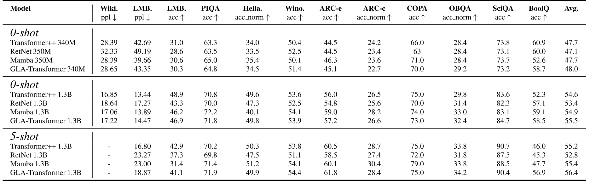

**Table 5.** Zero-shot および five-shot の拡張結果。すべてのモデルを SlimPajama の同じ subset と Mistral tokenizer で学習した。340M/1.3B モデルの学習量はそれぞれ 15B/100B token である。最終列は全 accuracy の平均を示す。

1.3B モデルの 5-shot を含む全 11 task の完全な結果を [Table 5](#table-05) に示す。

[+1]: 時間とともに変化する行列値 hidden state を持つこの種のモデルは「fast weights」とも呼ばれ [Hin87, Sch92, Ba16a]、近年は Transformer との関係が研究されている [Sch21, Iri21, Mao22]。

[+2]: ${\mathbf{M}}$ がなければ $({\mathbf{Q}}{\mathbf{K}}^\top){\mathbf{V}}$ を ${\mathbf{Q}}({\mathbf{K}}^\top{\mathbf{V}})$ に変形でき、complexity を二次 $O(L^{2}d)$ から線形 $O(Ld^{2})$ に下げられる。

[+3]: これは ALiBi position encoding [Pre21] を持つ linear attention とみなせる。実際には rotary position embedding [Su24] も組み込まれている。

[+4]: ただし [Mao22] は再帰形式だけを扱い、全 time step の hidden state を HBM に materialize する。Appendix [第 10 節](#section-10) ではモデルを matmul に基づく並列形式へ変換し、FlashLinearAttention の拡張を用いて効率よく学習できる新しい algorithm を示す。

[+5]: 予備実験では、${\mathbf{G}}_{t}={\bm{\alpha}}_{t}^{\top}{\bm{\beta}}_{t}$ は ${\mathbf{G}}_{t}={\bm{\alpha}}_{t}^{\top}\mathbf{1}$ に対してわずかな改善しか示さなかった。

[+6]: 指数内部の項を*データ依存*の相対位置係数とみなせる点で、この形式は extrapolatable position encoding [Sun22] に似ている。

[+7]: 記号を簡潔にするため、ここでは first-level chunking の記法で要点を表す。実際の実装には secondary-level chunk を用いる。

[+8]: 24K の入力系列を 12 segment に分割し、前の segment の final state を現在の segment の initial state とする。

[+9]: Length extrapolation を改善する position-encoding scheme はあるものの、学習時に見た context length を大幅に超えて generalize するのは依然として難しい [Pre21, Sun22, Li23x]。

[+10]: Mamba には公式実装、Transformer++ と GLA には fused SwiGLU、Transformer++ には FlashAttention-2 を用いる。

[+11]: とくに Mamba は multi-head model ではないため、tensor parallelism に適していない。

[+author-note]: 同等貢献。
