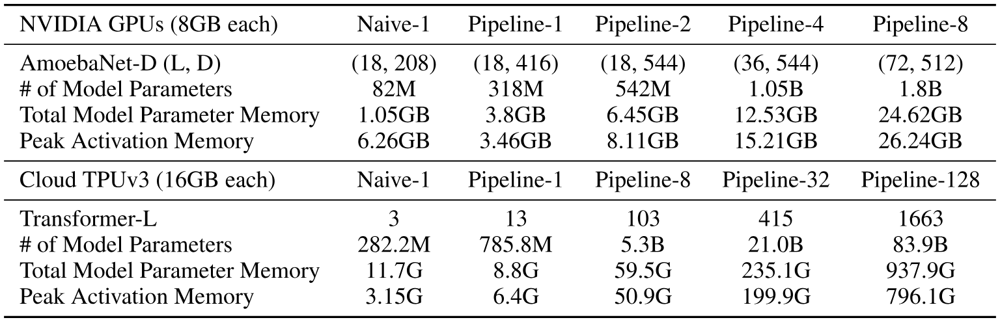
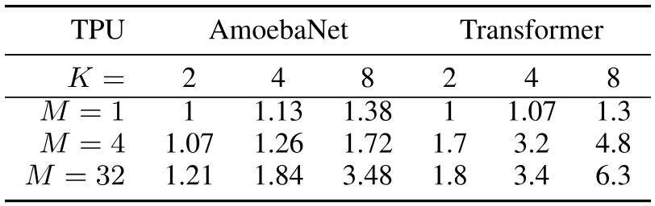
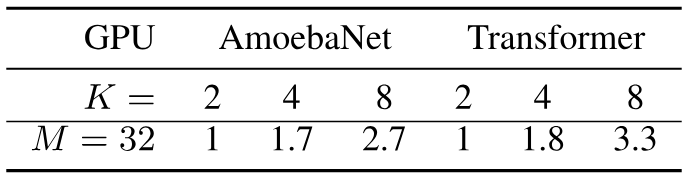
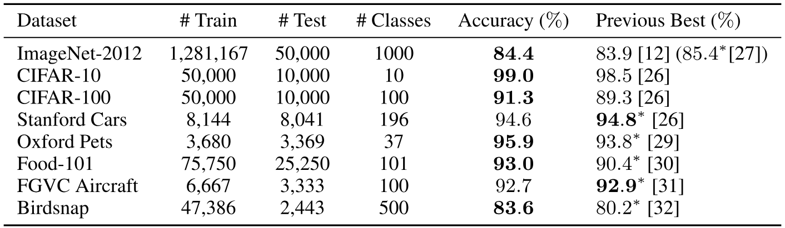
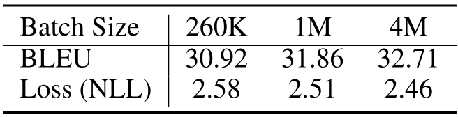

> [Yanping Huang](https://x.com/bignamehyp), [Youlong Cheng](https://dblp.org/pid/230/3622), [Ankur Bapna](https://x.com/ankurbpn), [Orhan Firat](https://orhanfirat.com/), [Mia Xu Chen](https://scholar.google.com/citations?user=wE9BArMAAAAJ), [Dehao Chen](https://dblp.org/pid/50/6185), [HyoukJoong Lee](https://dblp.org/pid/21/276), [Jiquan Ngiam](https://cs.stanford.edu/~jngiam/), [Quoc V. Le](http://cs.stanford.edu/~quocle/), [Yonghui Wu](https://dblp.org/pid/26/2189), and [Zhifeng Chen](https://www.zhifengchen.me/). arXiv 初回投稿日: November 16, 2018; 現行版は v5. [GPipe: Efficient Training of Giant Neural Networks using Pipeline Parallelism](https://arxiv.org/abs/1811.06965). [原 PDF](/paper/gpipe.pdf). [TeX ソース](https://export.arxiv.org/e-print/1811.06965). 正確な印刷レイアウトと参考文献については原 PDF を正本とする.

## 要約

ディープニューラルネットワークの容量を拡大することは、いくつかの異なる機械学習タスクにおいてモデルの品質を向上させる効果的なアプローチであることが知られています。多くの場合、単一のアクセラレータのメモリ制限を超えてモデル容量を増加させるには、特殊なアルゴリズムやインフラの開発が必要でした。これらの解決策はしばしばアーキテクチャ固有であり、他のタスクに適用できません。効率的でタスクに依存しないモデル並列性のニーズに対応するために、私たちはGPipeを紹介します。GPipeは、レイヤーのシーケンスとして表現できる任意のネットワークをスケーリング可能にするパイプライン並列化ライブラリです。異なるサブシーケンスのレイヤーを別々のアクセラレータでパイプライン処理することで、GPipeはさまざまなネットワークを効率的に巨大なサイズにスケーリングする柔軟性を提供します。さらに、GPipeは新しいバッチ分割パイプラインアルゴリズムを活用しており、モデルを複数のアクセラレータに分割した場合にほぼ線形のスピードアップを実現します。GPipeの利点を示すために、異なるネットワークアーキテクチャを持つ2つの異なるタスクで大規模ニューラルネットワークを訓練しました。（i） 画像分類： 557百万パラメータのAmoebaNetモデルを訓練し、ImageNet-2012でトップ1精度84.4%を達成、（ii） 多言語ニューラル機械翻訳： 6十億パラメータ、128層の単一Transformerモデルを100以上の言語を含むコーパスで訓練し、すべてのバイリンガルモデルよりも高い品質を達成しました。

## 1 はじめに

過去10年間で深層学習は大きな進展を遂げてきました。これは部分的には、ニューラルネットワークの有効な容量をスケーリングすることを容易にする方法の開発によるものです。この傾向は、特に画像分類で顕著であり、モデル容量の増加に伴うImageNetでの精度向上によって示されています（[図 1](#figure-01)a）。同様の現象は自然言語処理の文脈でも観察され、文表現の単純な浅いモデル[Mcc17, Pet18]は、より深く大きなモデル[Dev18, Rad19]に比べて性能が劣ることがわかります（[図 1](#figure-01)b）。

より大きなモデルは複数の分野で顕著な品質向上をもたらしてきましたが、ニューラルネットワークのスケーリングは重大な実際的課題を伴います。メモリ制限やアクセラレータ（GPUやTPU）の通信帯域幅などのハードウェア制約により、ユーザーはより大きなモデルを複数のパーティションに分割し、異なるパーティションを異なるアクセラレータに割り当てる必要があります。しかし、効率的なモデル並列アルゴリズムの設計と実装は非常に困難であり、実務者はスケーリング能力、柔軟性（または特定のタスクやアーキテクチャへの特化度）、訓練効率の間で難しい選択を迫られることが多いです。その結果、最も効率的なモデル並列アルゴリズムの多くはアーキテクチャおよびタスクに特化しています。ディープラーニングの応用が増える中で、研究者がさまざまな機械学習タスクに対してニューラルネットワークを容易にスケーリングできる信頼性が高く柔軟なインフラの需要はますます増加しています。

**図1.** （a） 最近の代表的な最先端画像分類モデルにおける、ImageNet 2012 検証データセット上のトップ1精度とモデルサイズの間の強い相関 [Den09] [Sze14, Sze16, He16a, Xie16, Hu18, Zop18, Rea18]。モデル容量の $36\times$ 増加が見られる。赤い点は、550M パラメータを持つ AmoebaNet モデルの $84.4\%$ トップ1精度を示す。（b） モデルサイズの増加に伴って、当社の大規模多言語社内コーパス上で二言語ベースラインと比較した翻訳品質（BLEU）の平均改善。各点 $T(L,H,A)$ は、$L$ エンコーダーおよび $L$ デコーダー層、$H$ のフィードフォワード隠れ次元および $A$ のアテンションヘッドを持つ Transformer の性能を示す。赤い点は、128層、6B パラメータの Transformer の性能を示す。

これらの課題に対処するために、私たちは GPipe を紹介します。これは、大規模なニューラルネットワークの効率的な学習を可能にする柔軟なライブラリです。GPipe は、モデルを異なるアクセラレータに分割し、各アクセラレータでの再計算をサポートすることによって、単一のアクセラレータのメモリ制限を超えて任意の深いニューラルネットワークアーキテクチャのスケーリングを可能にします [Gri00, Che16]。GPipe を使うと、各モデルはレイヤーのシーケンスとして指定でき、連続したレイヤーのグループをセルに分割できます。各セルは別々のアクセラレータに配置されます。この分割された構成に基づき、バッチ分割を伴う新しいパイプライン並列アルゴリズムを提案します。まず、トレーニング例のミニバッチをより小さなマイクロバッチに分割し、その後、各マイクロバッチセットの実行をセル間でパイプライン化します。トレーニングには同期ミニバッチ勾配降下法を適用し、ミニバッチ内のすべてのマイクロバッチで勾配を蓄積し、ミニバッチの最後に適用します。その結果、GPipe を使用した勾配の更新は、分割数に関わらず一貫しており、研究者はより多くのアクセラレータを投入することで容易により大きなモデルを学習できます。GPipe は、データ並列性と組み合わせることで、さらに学習をスケールさせることも可能です。

我々は、画像分類および機械翻訳におけるGPipeの柔軟性と効率性を実証します。画像分類では、ImageNet 2012データセットからの$480\times 480$入力でAmoebaNetモデルを訓練します。モデルの幅を増やすことで、パラメータ数を$557$百万にスケールアップし、トップ1検証精度84.4％を達成します。機械翻訳では、103言語（102言語から英語への変換）に対して、単一の128層、60億パラメータの多言語Transformerモデルを訓練します。このモデルが、個別に訓練された3.5億パラメータの二言語Transformer Big [Vas17]モデルよりも100言語ペアで優れた性能を発揮できることを示します。

## 2 GPipeライブラリ

次に、GPipeのインターフェースと主要な設計機能を説明します。このオープンソースライブラリは、Lingvo [She19a]フレームワークの下で実装されています。GPipeのコア設計機能は一般的に適用可能であり、他のフレームワークにも実装することができます[Jia14, Che15b, Pas17]。

### 2.1 インターフェース

任意の深層ニューラルネットワークは、 $L$ 層のシーケンスとして定義することができます。各層 $L_{i}$ は、順伝播計算関数 $f_{i}$ およびそれに対応するパラメータセット $w_{i}$ で構成されます。さらに GPipe では、ユーザーがオプションの計算コスト推定関数 $c_{i}$ を指定することも可能です。与えられた分割数 $K$ に対して、 $L$ 層のシーケンスは $K$ の複合層、またはセルに分割することができます。 $p_{k}$ を、層 $i$ と $j$ の間の連続した層とします。 $p_{k}$ に対応するパラメータの集合は $w_{i}$、$w_{i+1}$、…、$w_{j}$ の合併と同等であり、その順伝播関数は $F_{k}=f_{j}\circ\ldots\circ f_{i+1}\circ f_{i}$ となります。対応する逆伝播関数 $B_{k}$ は、自動記号微分を用いて $F_{k}$ から計算することができます。コスト推定器 $C_{k}$ は $\Sigma_{l=i}^{j}c_{l}$ に設定されます。

GPipe インターフェースは非常に簡単かつ直感的であり、ユーザーは以下を指定するだけで済みます：（i） モデル分割数 $K$、（ii） マイクロバッチ数 $M$、（iii） モデルを定義する $L$ 層のシーケンスおよび定義。例については補足資料を参照してください。

### 2.2 アルゴリズム

ユーザーがネットワーク内の層の順序をモデルパラメータ$w_{i}$、順伝播計算関数$f_{i}$、およびコスト推定関数$c_{i}$の観点で定義すると、GPipeはネットワークを$K$個のセルに分割し、$k$番目のアクセラレータに$k$番目のセルを配置します。隣接するパーティション間でデータ転送を可能にするために、パーティション境界に通信プリミティブが自動的に挿入されます。パーティション分割アルゴリズムは、すべてのセルの推定コストの分散を最小化し、すべてのパーティション間で計算時間を同期させることでパイプラインの効率を最大化します。

順伝播中、GPipeはまずサイズ$N$の各ミニバッチを$M$個の等しいマイクロバッチに分割し、$K$個のアクセラレータを通じてパイプライン処理します。逆伝播中、各マイクロバッチの勾配は順伝播時に使用された同じモデルパラメータに基づいて計算されます。各ミニバッチの最後に、すべての$M$マイクロバッチからの勾配が集計され、すべてのアクセラレータ間でモデルパラメータを更新するために適用されます。この操作の順序は[図2](#figure-02)cに示されています。

ネットワークでバッチ正規化[Iof15]を使用する場合、トレーニング中の入力の十分統計量は各マイクロバッチごとに、必要に応じてレプリカごとに計算されます[Pen17]。また、評価時に使用するために、ミニバッチ全体にわたる十分統計量の移動平均も追跡します。

**図2.** （a） 順序付きレイヤーを持つニューラルネットワークの例が4つのアクセラレータに分割されている。$F_{k}$ は $k$ 番目のセルの合成順伝播計算関数である。$B_{k}$ は逆伝播関数であり、上位レイヤーからの $B_{k+1}$ と $F_{k}$ の両方に依存する。 （b） 単純なモデル並列化戦略は、ネットワークの順序依存性のために重大な未利用を招く。 （c） パイプライン並列化は入力ミニバッチを小さなマイクロバッチに分割し、異なるアクセラレータが同時に異なるマイクロバッチで作業できるようにする。勾配は最後に同期的に適用される。

### 2.3 パフォーマンス最適化

活性化メモリ要件を削減するために、GPipe は再計算をサポートする [Che16]。順伝播計算中、各アクセラレータは分割境界での出力アクティベーションのみを保存する。逆伝播において、$k$ 番目のアクセラレータは合成順伝播関数 $F_{k}$ を再計算する。その結果、ピークアクティベーションメモリ要件は $O(N+\frac{L}{K}\times\frac{N}{M})$ に削減される。ただし、$\frac{N}{M}$ はマイクロバッチサイズであり、$\frac{L}{K}$ は1つの分割あたりのレイヤー数である。比較として、再計算および分割を行わなかった場合のメモリ要件は $O(N\times L)$ となる。なぜなら勾配 $b_{i}$ を計算するためには、上位レイヤーの勾配 $b_{i+1}$ とキャッシュされたアクティベーション $f_{i}(x)$ の両方が必要だからである。

図[2（c）](#figure-02) に示すように、パーティショニングは各アクセラレータにいくつかのアイドル時間を導入します。これをバブルオーバーヘッドと呼びます。このバブル時間は $O(\frac{K-1}{M+K-1})$ マイクロステップ数 $M$ にわたって均等化されます。私たちの実験では、$M\geq 4\times K$ の場合、バブルオーバーヘッドは無視できることがわかりました。これは部分的には、バックワードパス中の再計算を、より早くスケジュールできるためであり、以前の層からの勾配を待つ必要がないためです。

GPipe は、アクセラレータ間のパーティション境界で活性化テンソルを渡すだけでよいため、通信オーバーヘッドも低くなります。したがって、高速インターコネクトを持たないアクセラレータ上でも効率的なスケーリング性能を達成できます。

図[2（c）](#figure-02) は、パーティションが均等にバランスされていることを前提としています。しかし、異なる層でのメモリ要件や計算フロップはしばしば大きく不均衡です。このようなシナリオでは、不完全なパーティショニングアルゴリズムにより負荷不均衡が生じる可能性があります。より優れたパーティショニングアルゴリズムは、私たちのヒューリスティックアプローチよりもパフォーマンスを向上させる可能性があります。

## 3 パフォーマンス分析

**表1.** さまざまなシナリオ下でGPipeがサポートするAmoebaNetの最大モデルサイズ。Naive-1はGPipeを用いない逐次版を指す。Pipeline-$k$は、$k$のパーティションを$k$アクセラレータ上でGPipeにより動作させることを意味する。AmoebaNet-D （L, D）： $L$個の通常セル層およびフィルタサイズ$D$を持つAmoebaNetモデル。Transformer-L： $L$層、2048モデルおよび8192隠れ次元を持つTransformerモデル。各モデルパラメータは、学習時にRMSPropを適用したため$12$バイトを必要とする。

我々は、GPipeの性能を二種類の非常に異なるモデルアーキテクチャで評価した： AmoebaNet [Rea18]畳み込みモデルおよびTransformer [Vas17]シーケンス・トゥ・シーケンスモデル。モデルのスケーラビリティ、効率、通信コストを調査するために実験を行った。

私たちは、リマテリアライゼーション（再計算）とパイプライン並列化の両方がメモリ利用効率に寄与し、それによって巨大モデルの適用が可能になると予想しています。合理的に大きな入力サイズにおける、GPipeがサポートできる最大モデルサイズを[表1](#table-01)に示します。AmoebaNetについては、アクセラレータあたり8GBメモリのCloud TPUv2上で実験を行いました。固定の入力画像サイズとして$224\times 224$、ミニバッチサイズとして$128$を使用しました。GPipeを使用しない場合、単一アクセラレータではデバイスメモリの制約により、最大で82MパラメータのAmoebaNetをトレーニング可能です。バックプロパゲーション時の再計算およびバッチ分割により、GPipeは中間アクティベーションのメモリ要件を6.26GBから3.46GBに削減し、単一アクセラレータで318Mパラメータのモデルを可能にします。モデル並列化により、AmoebaNetを8つのアクセラレータで18億パラメータまで拡張でき、GPipeを使用しない場合の25倍の規模になります。この場合、AmoebaNetの異なる層におけるモデルパラメータの不均衡分布のため、最大モデルサイズは完全に線形にスケールしませんでした。

次に、各アクセラレータコアあたり16GBのメモリを持つCloud TPUv3を使用してTransformerモデルを訓練しました。固定の語彙サイズ32k、シーケンス長1024、バッチサイズ32を使用しました。各Transformer層は、モデル次元2048、フィードフォワード隠れ次元8192、アテンションヘッド32を持っています。層数を変えることでモデルのスケーリングを行いました。再計算（Re-materialization）により、単一アクセラレータ上でより大きな$2.7\times$モデルを訓練できます。128パーティションで、GPipeはTransformerを最大83.9Bパラメータまでスケーリング可能であり、これは単一アクセラレータで可能な範囲よりも$298\times$増加しています。AmoebaNetとは異なり、Transformerの場合、各層が同じ数のパラメータと入力サイズを持つため、最大モデルサイズはアクセラレータ数に比例して線形にスケールします。

**表2.** TPU上で、異なるパーティション数$K$および異なるマイクロバッチ数$M$を使用したGPipeによる正規化された訓練スループット。パフォーマンスはマイクロバッチ数が増えると向上します。Transformerモデルではアクセラレータの数に応じてほぼ線形のスピードアップが見られます$M\gg K$。必要に応じてメモリに収まるようにバッチサイズを調整しました。

効率を評価するために、AmoebaNet-D （18, 256） および Transformer-48 の正規化されたトレーニングスループットを、異なるパーティション数および異なるマイクロバッチ数で GPipe を用いて [表2](#table-02) に報告します。各パーティションは別々のアクセラレータに割り当てられます。マイクロバッチの数が $M$ であり、パーティションの数が $4\times$ 以上の場合、バブルオーバーヘッドはほぼ無視できることが分かります。Transformer モデルでは、4 倍のアクセラレータに分割した場合に $3.5\times$ の速度向上があります。さらに、Transformer レイヤー全体に計算が均等に分配されているおかげで、トレーニングスループットはデバイス数にほぼ線形にスケールします。対照的に、AmoebaNet モデルは計算分布の不均衡により、線形未満の速度向上を達成します。$M$ が比較的小さい場合、バブルオーバーヘッドはもはや無視できません。$M$ が $1$ の場合、パイプライン並列性は事実上ありません。使用されるアクセラレータの数にかかわらず、比較的一定のスループットが観察され、任意の時点で一つのデバイスのみがアクティブに計算していることを示しています。

GPipeの通信オーバーヘッドの影響を測定するために、我々はNVLinkなしの複数のNVIDIA P100 GPUを搭載した単一ホストで実験を実施しました。この場合、GPU間のデータ転送は比較的遅いデバイスからホスト、ホストからデバイスへのPCI-E経由の転送を介さなければなりません。マイクロバッチの数は32に固定しました。[表3](#table-03)に示すように、パーティション数を$2$から$8$に増やした場合、AmoebaNet-D （18, 128）では$2.7\times$の速度向上が観察されます。$24$層のTransformerでは、速度向上は

**表3.** 高速インターコネクトなしのGPUでのGPipeを使用した正規化トレーニングスループット。

この速度向上は$3.3\times$です。高速インターコネクトが装備されたTPUで観察される線形の速度向上と同様です。GPipeはパーティションの境界にある活性化テンソルのみを転送するため、デバイス間の通信帯域幅はもはやモデル並列化のボトルネックではありません。

## 4 画像分類

概念実証として、まず GPipe を使用して AmoebaNet をスケールしました。AmoebaNet のチャネル数を増やし、入力画像サイズを $480\times 480$ にスケーリングしました。この 5億5700万パラメータの AmoebaNet-B（18, 512） を ImageNet 2012 データセットでトレーニングし、[Rea18] で説明されているのと同じハイパーパラメータを使用しました。ネットワークは 4 つのパーティションに分割されました。この単一モデルは、シングルクロップで $84.4\%$ の top-1、$97\%$ の top-5 バリデーション精度を達成します。

さらに、転移学習[Raz14, She17]を通じて、他の画像データセットに対する巨大畳み込みネットワークの有効性を示しています。具体的には、事前学習済みのImageNetモデルを用いて、一般分類から細かかな分類まで多様なターゲットデータセットをファインチューニングしました。最後のsoftmax分類レイヤーの出力ユニット数をターゲットデータセットのクラス数に変更し、新しいsoftmaxレイヤーをランダムに初期化しました。その他のすべてのレイヤーはImageNetの事前学習から初期化されました。訓練中のネットワークへの入力画像は$480\times 480$にリサイズされ、水平にランダムに反轉され、カットアウト[Dev17]で補強されました。トレーニング用ハイパーパラメータはImageNetで使用されたものと同じでした（トレーニングセットアップの詳細は補足資料に記載されています）。[表4](#table-04)では、各データセットに対して5回の微調整ランにおける単一作物の平均テスト精度を報告しています。私たちの巨大モデルは、すべてのターゲットデータセットで競争力のある結果を得ています。例えば、CIFAR-10の誤差率は$1\%$に、CIFAR-100の誤り率は$8.7\%$に減少します。これらの結果は、Kornblithらの発見を裏付けています。[Kor18]、つまりより良いImageNetモデルは転送がより良くなります。

**表4.** ImageNet 2012で最初に訓練され、その後他のデータセットでファインチューニングされたAmoebaNet-B （18, 512）を使用した画像分類精度。訓練設定の詳細については補足資料を参照してください。我々のファインチューニング結果は、5回のファインチューニング実行の平均値です。ベースライン結果はReal *et al*. [Rea18]およびCubuk *et al*. [Cub18]のもので、これらはスクラッチから直接訓練されました。*Mahajan et al* のモデル[Mah18]は、$85.4\%$トップ1精度を達成しましたが、非公開のInstagramデータで事前訓練されています。Ngiam *et al*. [Ngi18]は、プライベートデータセット（JFT-300M）で事前訓練することでより良い結果を達成しました。

## 5 大規模多言語機械翻訳

次に、GPipe の柔軟性を、自然言語処理（NLP）に使用されるモデルのスケーリングによって実証します。利用可能な並列コーパスが豊富であるため、ニューラル機械翻訳（NMT）は、NLP に使用される任意のアーキテクチャにとってベンチマークタスクとなっています [Geh17, Vas17, Sha18a, Che18b, Wu19]。この理由から、大規模多言語 NMT タスクでの GPipe 実験を継続します。102 言語と英語にまたがる並列文書コーパスを使用し、合計 250 億件の訓練例が含まれており、言語ごとに $10^{4}$ から $10^{9}$ までの範囲です [Ari19a]。このデータセットは、リソースが少ない（low-resource）言語からリソースが豊富な（high-resource）言語まで、多様な言語群をカバーすることで、スケーラビリティに関する実験に現実的なテスト環境を提供します。機械翻訳において初めて、大規模な NMT モデルが、100 以上の言語ペア間のマッピングを同時に学習でき、かつすべての言語で二言語モデルの性能を上回ることを示します。これはさらに、効率的で柔軟なモデル並列化ツールの重要性を示しています。

我々の比較は、このコーパスのすべての言語ペアで訓練された単一のトランスフォーマー [Vas17] の性能に基づいています。我々は、GPipe の柔軟性を強調するために、アーキテクチャを2つの方向に拡張します。（i） モデルの層数を増やすことによる深さの方向、（ii） フィードフォワード層の隠れ次元およびマルチヘッドアテンション層におけるアテンションヘッドの数（およびアテンションチャネル数に相当）を増やすことによる幅の方向、Shazeer *ら* に類似する方法 [Sha18a]。データセット、ベースライン、トレーニング構成および最適化ハイパーパラメータの詳細な説明は補足資料を参照してください。

我々は標準的な 4億パラメータの Transformer Big モデル $T(6,8192,16)$ [+1] から始めます。これは Chen *ら* により記述された [Che18b] で、語彙サイズは 64k です。[図 3](#figure-03) では、その性能を 13億パラメータの深いモデル $T(24,8192,16)$、13億パラメータの幅広モデル $T(12,16384,32)$、30億パラメータのモデル $T(32,16384,32)$、および 60億パラメータのモデル $T(64,16384,32)$ と比較しています。すべてのモデルはすべての言語ペアに対して同時に訓練され、多言語 BERT に使用された温度ベースのサンプリングを使用しています [+2] [Dev18]。$T(12,16384,32)$、$T(24,8192,32)$、$T(32,16384,32)$ および $T(64,16384,32)$ はそれぞれ $2$、$4$、$8$ および $16$ アクセラレータに分割されています。

[図 3](#figure-03) （#figure-03） から、モデル容量を 400M から 1.3B パラメータに増やすことで、すべての言語でパフォーマンスが大幅に向上することが観察できます。モデルを 1.3B パラメータから 6B パラメータにスケールアップすると、特に高リソース言語でさらなる改善が見られますが、1.3B から 3B および 6B パラメータにスケールアップする際には収益逓減が見られます。

以下では、これらの大規模実験に基づくいくつかの実証的な知見について議論します。

**図3.** 多言語モデル容量の増加に伴う、すべての言語における翻訳品質。言語は左から右に向かってトレーニングデータセットサイズが減少する順に配置されています。 $T(L,H,A)$ は、$L$ エンコーダ層と $L$ デコーダ層を持つ Transformer の性能を示しており、フィードフォワード隠れ次元は $H$、アテンションヘッドは $A$ です。モデル容量を 400M パラメータ （$T(6,8192,16)$） から 1.3B （$T(24,8192,16)$）、さらに 6B （$T(64,16384,32)$） に増やすと、すべての言語で大幅な品質向上が見られることが分かります。また、低リソース言語（プロットの右側）では、バイリンガルベースラインと比較して大きな品質向上が見られ、これは多言語モデルをトレーニングすることによる大きな転移効果を示しています。

深さと幅のトレードオフ： 我々は多言語設定における深さと幅のトレードオフを研究し、1.3B幅モデル $T(12,16384,32)$ と1.3B深モデル $T(24,8192,16)$ の性能を比較しました。高リソース言語におけるこれら2つのモデルの品質（[図 3](#figure-03) の左側）は非常に似ていますが、低リソース言語ではより深いモデルが大きな差で優れており、モデルの深さを増やすことが一般化に有利である可能性を示唆しています。さらに、低リソース言語の品質向上（[図 3](#figure-03) の右側）は、1.3B深モデルと400Mモデルを比較した場合、高リソース言語の改善とほぼ同程度であり、深さを増やすことで低リソースタスクへの転移の程度も潜在的に増加する可能性があることを示しています。

深層モデルの学習可能性の課題： 深さはニューラルネットワークの表現能力を高める一方で、最適化問題を複雑にします。我々の大規模実験では、鋭い活性化（正の尖度）とデータセットのノイズの組み合わせから生じる深刻な学習可能性の問題に直面しました。数千ステップの学習後、モデルの予測が非常に尖ったものになり、ノイズに対して脆弱になることを観察しました。これにより、しばしば非有限または大きな勾配が発生し、最終的に学習進行を破壊しました。これらの問題に対処するために、我々は二つの方法を適用します： （i） Zhang *ら* [Zha19g] に従い、全てのトランスフォーマーのフィードフォワード層の初期化を層数で縮小します。 （ii） ロジット予測（ソフトマックスの前の活性化）の大きさがある値を超えた場合にクリップします。

**表5.** バッチサイズの影響

これら二つのアプローチを組み合わせることで、モデルの深さ拡大によって生じる学習の不安定性を軽減できます。

大規模バッチ： その単純さゆえに、データ並列はニューラルネットワークのトレーニングをスケールさせる際の主要なアプローチです[Kes16, Smi17]。私たちは、標準Transformer Bigトレーニングに使用されるバッチサイズを大幅に増加させることで、大規模バッチトレーニングの限界をテストします。1バッチあたり26万トークンから始め、実効バッチサイズを400万に増加させ、高リソースの言語ペアであるドイツ語-英語における検証損失とBLEUスコアを観察します（他の言語ペアでも同様の傾向が見られます）。ここで使用される最適化パラメータは、以前の実験と同じです。私たちの知る限り、1バッチあたり400万トークンは、NMTモデルのトレーニングに文献で使用された最大のバッチサイズです[Ott18]。 [表5](#table-05) は、バッチサイズを増やすにつれて両方の指標が大幅に改善されることを示しています。バッチサイズをさらに増やすことで、さらなる改善が得られる可能性があると考えています。

## 6 設計の特徴とトレードオフ

効率的な大規模モデル並列を可能にするために、いくつかのアプローチが提案されています。しかし、それぞれのアプローチは独自のトレードオフを選択しており、特定のハードウェア制約下で特定のアーキテクチャをスケールさせるのに適しています。ここでは、いくつかのモデル並列アプローチに関わるさまざまな設計の選択肢とトレードオフ、およびそれらがGPipeと比べて、さまざまなハードウェア制約やアーキテクチャ変種の下で柔軟性、スケーラビリティ、および効率の面でどのように比較されるかを強調します。

モデル並列処理の核心的な考え方は、ネットワークを異なる計算ユニットに分割し、それらを異なるデバイスに配置することにあります [Kri14, Lee14, Mir17, Dea12]。概念的には、これは大規模なモデルの幅広いスペクトラムを巨大な容量にスケーリングすることをサポートします。しかし、これらのアプローチは通常、ハードウェアの利用率が低く、デバイス間通信のボトルネックに悩まされます。これらの課題に対抗する解決策として、単一プログラム複数データ（SPMD）およびパイプライン並列処理が提案されています。

Mesh-Tensorflow [Sha18a] は SPMD パラダイムに従います。これは、データ並列性に使用される単一命令多重データ（SIMD）アプローチを他のテンソル次元に拡張したものです。SPMD は、すべての計算を複数のデバイスに分割することを可能にし、個々の行列乗算のサイズ（したがって個々の層のモデルパラメータ）をアクセラレータの数に応じて線形にスケールさせることを可能にします。しかし、これは各並列化された行列乗算の出力を結合するために使用される AllReduce のような操作が多くなるため、アクセラレータ間の通信オーバーヘッドも高くなります。このため、高速インターコネクトで接続されたアクセラレータのシナリオに限ってこのアプローチの適用が可能です。さらに、SPMD は効率的にスケーリングできる操作の種類を制限するため、特定のネットワークアーキテクチャや機械学習タスクに限定して使用されます。たとえば、このパラダイムの下で畳み込み層のチャネル次元に沿って分割することは、チャネルが実質的に完全に接続されているため効率的ではなく、空間次元に沿って分割する場合はハロー領域に関する高度な技術が必要です。SPMD は各操作を小さくすることでモデルの深さをスケーリングすることを可能にしますが、そのためには各層をより多くのアクセラレータに分割する必要があり、その結果、デバイス間の通信オーバーヘッドがさらに増加します。

他のアプローチでは、ニューラルネットワークをスケールさせるためにパイプライン並列ベースの手法を利用しようと試みられてきた [Pet93, Wu17]。ニューラルネットワークのトレーニングに適用されるパイプライン並列の最新の反復は PipeDream [Har18] であり、パラメータサーバーの通信オーバーヘッドを削減することを目的としている [Li14]。PipeDream は順方向パスの実行をパイプライン化し、逆方向パスと交互に実行することでハードウェアの利用率を最大化しようとする。この設計は非同期の逆方向更新によって導入される重みの陳腐化という問題を抱えている。重みの陳腐化に起因する最適化の問題を避けるために、PipeDream は各アクセラレータ上でモデルパラメータの複数のバージョンコピーを保持し、勾配更新を正確に計算する必要があるため、ユーザーがより大きなモデルにスケールすることを妨げている。

GPipeは、新しいタイプのパイプライン並列処理を導入しており、マイクロバッチの実行をパイプライン化し、全ミニバッチに対して単一の同期勾配更新を適用する前に処理します。再計算と組み合わせた我々の新しいバッチ分割パイプライン並列アルゴリズムにより、多数のマイクロバッチへのスケーリングが可能になります。これにより、非同期勾配更新を必要とせずにバブルオーバーヘッドを最小化します。GPipeは、使用するアクセラレータの数に応じて、モデルサイズを線形にスケールさせることを可能にします。SPMDとは異なり、パイプライン並列処理はモデルをスケールさせる際に追加の通信オーバーヘッドがほとんど発生しません。デバイス間の通信は、各マイクロバッチのパーティション境界でのみ行われ、導入される通信オーバーヘッドはわずかであり、高速デバイス間インターコネクトが利用できない状況でもGPipeの有用性を拡張します。しかし、現在のGPipeは、単一の層が単一アクセラレータのメモリ要件に収まることを前提としています[+3]。さらに、マイクロバッチ分割では、バッチ全体に対する計算を必要とする層をサポートするために複雑な戦略が必要です（例えば、BatchNormは訓練中にマイクロバッチの統計を使用しますが、評価時にはミニバッチ統計を蓄積します）。

## 7 結論

本研究では、巨大なニューラルネットワークの訓練のためのスケーラブルなモデル並列ライブラリである GPipe を紹介します。我々は、同期的な勾配更新を使用する新しいバッチ分割パイプライン並列アルゴリズムを提案および実装しており、高いハードウェア利用率と訓練の安定性を持つモデル並列性を可能にします。GPipe を活用して大規模な畳み込みモデルとトランスフォーマーベースのモデルを訓練し、画像分類および多言語機械翻訳の両方で強力な実証結果を示します。GPipe ライブラリの三つの主要な特徴を強調します： 1） 効率性： 新しいバッチ分割パイプラインアルゴリズムを使用することで、GPipe はデバイスの数にほぼ線形のスピードアップを達成します。 2） 柔軟性： GPipe はレイヤーのシーケンスとして表現できる任意の深層ネットワークをサポートします。 3） 信頼性： GPipe は同期的勾配降下法を利用し、分割数に関わらず一貫した訓練を保証します。

[+1]： $T(L,H,A)$ は $L$ のエンコーダーレイヤーと $L$ のデコーダーレイヤー、NXQ0006QXZ のフィードフォワード隠れ次元および $A$ のアテンションヘッドを持つトランスフォーマーモデルです。モデルの次元は $1024$ に固定されています。

[+2]： https://github.com/google-research/bert/blob/master/multilingual.md

[+3]： この制約を回避する一つの方法は、単一の行列積をより小さな行列積に分割し、それらを複数のレイヤーに順次分散させることです。
