> [Elias Frantar](https://efrantar.github.io/) [+author-note]、[Saleh Ashkboos](https://sashkboos.github.io/)、[Torsten Hoefler](https://htor.inf.ethz.ch/)、[Dan Alistarh](https://daslab.ista.ac.at/)。2022 年 10 月 31 日に arXiv へ初投稿され、2023 年 3 月 22 日に v2 へ改訂され、[ICLR 2023](https://openreview.net/forum?id=tcbBPnfwxS) で発表された。[GPTQ: Accurate Post-Training Quantization for Generative Pre-trained Transformers](https://arxiv.org/abs/2210.17323)。<a href="/paper/gptq.pdf" target="_blank" rel="noopener noreferrer">原論文 PDF</a>。[TeX ソース](https://export.arxiv.org/e-print/2210.17323)。正確な印刷レイアウトと参考文献については、原論文 PDF を正とする。

## 概要

GPT または OPT として知られる生成事前学習済み Transformer モデルは、複雑な言語モデリングタスクにおける画期的な性能だけでなく、きわめて大きな計算コストとストレージコストによっても際立っている。具体的には、その巨大な規模のため、大規模で高精度な GPT モデルは推論だけでも複数の高性能 GPU を必要とする場合があり、こうしたモデルの利用可能性を制限している。モデル圧縮によってこの負担を軽減する研究が現れつつあるものの、既存の圧縮手法の適用可能性と性能は GPT モデルの規模と複雑さによって制約されている。本論文ではこの課題に取り組み、近似二次情報に基づく、高精度かつ高効率な新しいワンショット重み量子化手法 GPTQ を提案する。具体的に GPTQ は、1750 億パラメータの GPT モデルを約 4 GPU 時間で量子化し、非圧縮ベースラインに対する精度低下をほぼ生じさせずに、重み当たりのビット幅を 3 または 4 ビットまで削減できる。本手法は精度を維持しつつ、従来のワンショット量子化手法に比べて圧縮効果を 2 倍以上に高め、1750 億パラメータのモデルを生成推論のために単一 GPU 内で実行することを初めて可能にする。さらに、重みを 2 ビット、さらには*三値*の量子化レベルへ量子化する*極端な量子化*領域でも、妥当な精度を得られることを示す。実験により、これらの改善を FP16 に対するエンドツーエンド推論の高速化へ活用でき、ハイエンド GPU（NVIDIA A100）では約 3.25 倍、より低コストな GPU（NVIDIA A6000）では 4.5 倍に達することを示す。実装は [https://github.com/IST-DASLab/gptq](https://github.com/IST-DASLab/gptq) で公開している。

## 1 はじめに

一般に GPT または OPT [Rad19, Bro20, Zha22] と呼ばれる Transformer [Vas17] 系列の事前学習済み生成モデルは、複雑な言語モデリングタスクで画期的な性能を示し、学術面でも実用面でも大きな関心を集めている。その利用を阻む主要な要因の一つが計算コストとストレージコストであり、既知のモデルのなかでも最大級である。たとえば、GPT3-175B のような最高性能のモデル変種は約 1750 億個のパラメータを持ち、学習には数十から数百 GPU 年を要する [Zha22]。本論文が対象とする、事前学習済みモデル上での推論というより単純なタスクでさえ非常に難しい。たとえば GPT3-175B のパラメータは、コンパクトな float16 形式で保存しても 326GB（1024 の倍数で計算）のメモリを占有する。これは最高性能の単一 GPU の容量さえ超えるため、推論にはマルチ GPU 配置のような、より複雑で高価な構成が必要になる。

こうしたオーバーヘッドを取り除く標準的な方法は*モデル圧縮*、たとえば [Hoe21, Gho21a] だが、驚くべきことに、この種のモデルを推論用に圧縮する方法についてはほとんど分かっていない。理由の一つは、低ビット幅量子化やモデル枝刈りの高度な手法が通常は*モデルの再学習*を必要とし、十億パラメータ級モデルではそれがきわめて高価なことである。一方、再学習なしでモデルを一度に圧縮する*学習後*手法 [Nag20, Wan20g, Hub20, Nah21] は非常に魅力的である。しかし、そのうち高精度な手法 [Li21a, Hub21, Fra22a] は複雑であり、数十億パラメータへ拡張するのが難しい [Yao22]。これまで GPT-175B の規模に適用されたのは、最近傍への丸めに基づく基本的な量子化 [Yao22, Det22] だけである。この方法は 8 ビット重みなど低い圧縮目標では良好に働くが、より高い圧縮率では精度を維持できない。したがって、より高い圧縮率へのワンショット*学習後量子化*が一般に可能かどうかは未解決である。

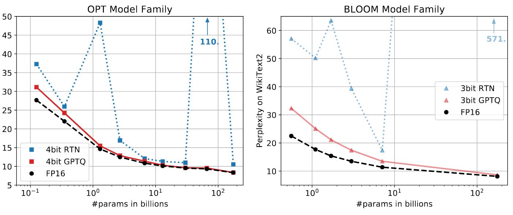

**図 1.** OPT モデルを 4 ビット、BLOOM モデルを 3 ビット精度へ量子化し、GPTQ を FP16 ベースラインおよび最近傍丸め（RTN）[Yao22, Det22] と比較した結果。

**貢献。** 本論文では GPTQ [+gptq-name] と呼ぶ新しい学習後量子化手法を提示する。この手法は、数千億パラメータを持つモデルを長くても数時間で処理できるほど効率的であり、しかも大きな精度低下なしにパラメータ当たり 3 または 4 ビットへ圧縮できるほど正確である。たとえば GPTQ は、公開されている最大級のモデル OPT-175B と BLOOM-176B を約 4 GPU 時間で量子化し、厳格な精度指標として知られる perplexity の増加を最小限に抑えられる。

さらに、本手法が、成分当たり 2 ビット、あるいは*三値*へ量子化する*極端な量子化*領域でも頑健な結果を得られることを示す。実用面では、圧縮後のモデルを生成タスクで効率よく実行するための実行基盤を開発する。具体的には、圧縮した OPT-175B モデルを単一の NVIDIA A100 GPU で初めて実行でき、より低コストな NVIDIA A6000 GPU でも 2 台だけで実行できる。また、圧縮を利用してメモリ読み込みを高速化する専用 GPU カーネルを実装し、A100 GPU では約 $3.25 \times$、A6000 GPU では $4.5\times$ の高速化を実現する。

我々の知る限り、本研究は数千億パラメータを持つ高精度言語モデルを成分当たり 3～4 ビットへ量子化できることを初めて示した。従来の*学習後手法*は 8 ビットでしか精度を維持できず [Yao22, Det22]、従来の*学習に基づく*手法は一桁から二桁小さいモデルしか扱っていない [Wu22b]。これらのネットワークは過剰パラメータ化されているため、この高い圧縮率は自然に思えるかもしれない。しかし詳細な結果分析で論じるように、圧縮は言語モデリング精度（perplexity）、ビット幅、元モデルの大きさの間に自明ではないトレードオフをもたらす。

本研究がこの領域のさらなる研究を促し、より広い利用者がこれらのモデルを使えるようにする一歩となることを願う。制約として、本手法は現時点で実際の乗算を高速化しない。主流アーキテクチャが混合精度オペランド（たとえば FP16 x INT4）をハードウェアで支援していないためである。また、対象シナリオでは大きなボトルネックではないため、現時点の結果には活性化量子化を含めていない。ただし、これは直交する手法 [Yao22] で対応できる。

## 2 関連研究

量子化手法は大きく、学習中の量子化と学習後手法の二つに分かれる。前者は通常、長時間の再学習やファインチューニング中にモデルを量子化し、丸め操作には何らかの近似微分機構を用いる [Gho21a, Nag21]。対して学習後（「ワンショット」）手法は、通常は数千個のデータサンプルと数時間の計算という少量の資源で事前学習済みモデルを量子化する。モデル全体の学習やファインチューニングさえ高価な巨大モデルでは、学習後手法がとりわけ興味深い。本論文はこの状況を扱う。

**学習後量子化。** 学習後手法の多くは視覚モデルを対象としてきた。高精度な手法は通常、個々の層または連続する少数の層のブロックを量子化する（詳しくは[第 3 節](#section-3)を参照）。AdaRound [Nag20] は、量子化レベルに対応するグリッド点へ重みを近づけるペナルティ項をアニーリングし、データ依存の丸めを計算する。BitSplit [Wan20g] は残差に対する二乗誤差目的で量子化値をビットごとに構築し、AdaQuant [Hub21] は straight-through 推定に基づく直接最適化を行う。BRECQ [Li21a] は Fisher 情報を目的関数へ導入し、単一の残差ブロック内の層を共同で最適化する。最後に Optimal Brain Quantization（OBQ）[Fra22a] は、古典的な Optimal Brain Surgeon（OBS）の二次情報による重み枝刈り枠組み [Has93, Sin20, Fra21] を量子化へ一般化する。OBQ は量子化誤差順に重みを一つずつ量子化し、常に残りの重みを調整する。これらの手法は数 GPU 時間で約 1 億パラメータまでのモデルに良好な結果を出せるが、それより何桁も大きいネットワークへの拡張は難しい。

**大規模モデルの量子化。** BLOOM [Lau22] や OPT-175B [Zha22] などの言語モデルが近年オープンソースで公開されたことで、こうした巨大ネットワークを推論用に低コストで圧縮する手法の開発が始まった。既存研究の ZeroQuant [Yao22]、LLM.int8() [Det22]、nuQmm [Par22] はいずれもベクトル単位など量子化粒度を慎重に選ぶが、超大規模モデルで許容可能な実行時間を保つため、最終的には重みを最近傍（RTN）の量子化レベルへ丸めるだけである。ZeroQuant は AdaQuant に似た層単位の知識蒸留も提案するが、それを適用できる最大モデルは 13 億パラメータにすぎない。この規模でも ZeroQuant は約 3 時間を要する一方、GPTQ は約 4 時間で 100 倍大きなモデルを量子化する。LLM.int8() は、少数の特徴次元にある*活性化外れ値*が大きなモデルの量子化を破綻させることを見いだし、それらの次元を高精度のまま保つ方法を提案する。最後に nuQmm は、特定のバイナリ符号化に基づく量子化方式向けに効率的な GPU カーネルを開発する。

これらの研究に対し、本論文は、はるかに複雑で高精度な量子化器も大規模モデルで効率よく実装できることを示す。具体的には、GPTQ は同程度の精度を保ちながら、従来手法に比べて圧縮量を 2 倍以上にする。

## 3 背景

**層単位の量子化。** 大枠では、本手法は最先端の学習後量子化手法 [Nag20, Wan20g, Hub21, Fra22a] と同じく層ごとに量子化を行い、各層に対応する再構成問題を解く。具体的に、$\mathbf{W_\ell}$ を線形層 $\ell$ の重み、$\mathbf{X}_\ell$ をネットワークへ入力した少数の $m$ 個のデータ点に対応する層入力とする。このとき、全精度の層出力に対する二乗誤差を最小化する量子化重み行列 $\mathbf{\widehat{W}}$ を求める。形式的には次のように書ける。

$$
\operatorname*{argmin}_{\mathbf{\widehat{W}}} \, \|\mathbf{W} \mathbf{X} - \mathbf{\widehat{W}} \mathbf{X}\|_2^2.
$$

さらに [Nag20, Li21a, Fra22a] と同様に、$\mathbf{\widehat{W}}$ の量子化グリッドは処理前に固定され、個々の重みは [Hub21, Fra22a] と同じく自由に移動できると仮定する。

**Optimal Brain Quantization。** 本手法は、上で定義した層単位の量子化問題を解くために近年提案された Optimal Brain Quanization（OBQ）[Fra22a] に基づく。我々はこれに一連の大幅な変更を加え、大規模言語モデルへ拡張できるようにするとともに、計算を*3 桁以上*高速化する。理解を助けるため、まず元の OBQ 手法を簡単に要約する。

OBQ は、[式 1](#equation-01)を $\mathbf{W}$ の各行における二乗誤差の和として書けるという観察から出発する。そして各行 $\mathbf{w}$ を独立に処理し、一度に一つの重みを量子化しながら、まだ量子化されていないすべての重みを更新して、単一の重みを量子化したことで生じる誤差を補償する。対応する目的関数は二次関数であり、Hessian は $\mathbf{H}_F = 2\mathbf{X}_F\mathbf{X}_F^\top$ となる。ここで $F$ は残っている全精度重みの集合である。次に量子化すべき貪欲最適な重みを $w_q$、$F$ 内の全重みに対する最適な更新を $\boldsymbol{\delta}_F$ とすると、これらは次式で与えられる。ここで $\mathrm{quant}(w)$ は $w$ を量子化グリッド上の最近傍値へ丸める。

$$
w_q = \operatorname*{argmin}_{w_q} \, \frac{(\mathrm{quant}(w_q) - w_q)^2}{[\mathbf{H}_F^{-1}]_{qq}}, \quad \boldsymbol{\delta}_F = - \frac{w_q - \mathrm{quant}(w_q)}{[\mathbf{H}_F^{-1}]_{qq}} \cdot (\mathbf{H}_F^{-1})_{:, q}.
$$

OBQ は $\mathbf{w}$ の全重みが量子化されるまで、この二つの式を反復して重みを量子化する。$w_q$ の量子化後に必要となる $\mathbf{H}$ の第 $q$ 行と第 $q$ 列の削除は、$\mathbf{H}^{-1}$ 全体の高価な再計算を避け、Gaussian 消去の 1 ステップによって逆行列上で直接効率よく行う。すなわち更新後の逆行列は次式で与えられる。

$$
\mathbf{H}_{-q}^{-1} = \Big(\mathbf{H}^{-1} - \frac{1}{[\mathbf{H}^{-1}]_{qq}} \mathbf{H}^{-1}_{:, q} \mathbf{H}^{-1}_{q, :} \Big)_{-p}.
$$

この手法には $\mathbf{W}$ の複数行を並列処理するベクトル化実装があり、中規模モデルでは妥当な実行時間を達成できる。たとえば ResNet-50（2500 万パラメータ）の完全な量子化は単一 GPU で約 1 時間であり、最先端の精度を持つ他の学習後手法とおおむね同程度である [Fra22a]。しかし $d_{\mathrm{row}} \times d_{\mathrm{col}}$ 行列 $\mathbf{W}$ に対する OBQ の実行時間は、入力に対して三次の $O(d_{\mathrm{row}} \cdot d_{\mathrm{col}}^3)$ で増加するため、数十億パラメータのモデルへ適用するときわめて高価になる。

## 4 GPTQ アルゴリズム

**ステップ 1：任意順序に関する洞察。** 前節で説明したように、OBQ は重みを貪欲な順序で量子化し、現時点で追加の量子化誤差が最小となる重みを常に選ぶ。興味深いことに、この自然な戦略は確かに良好に働くものの、任意の順序で重みを量子化する場合に対する改善は通常小さく、特に大規模でパラメータの多い層ではその傾向が強い。これはおそらく、大きな個別誤差を持つ量子化重みの数がわずかに減る一方、それらが処理の終盤で量子化され、その時点では補償のために調整できる未量子化重みがほとんど残っていないため、両者が相殺されるからである。以下で論じるように、とりわけ大規模モデルでは*どのような固定順序でも良好に働き得る*という洞察は重要な帰結を持つ。

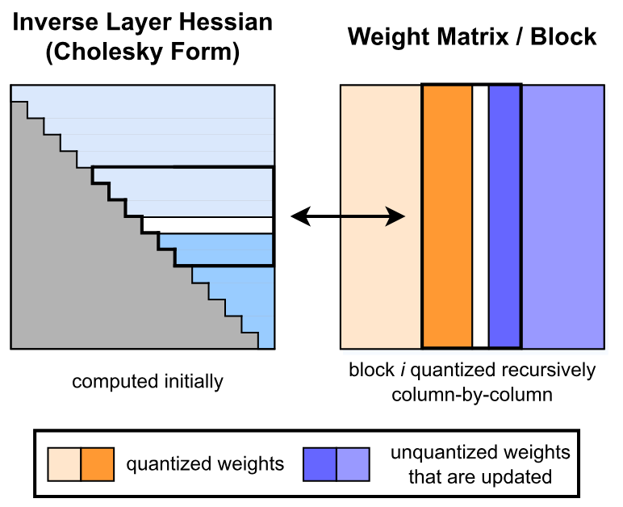

**図 2.** GPTQ の量子化手順。各ステップでは、Cholesky 分解に格納された逆 Hessian 情報を使って連続する*列*のブロック（太字）を量子化し、ステップの最後に残りの重み（青）を更新する。量子化手順は各ブロック内で再帰的に適用され、白い中央列が現在量子化中の列である。

元の OBQ は、対応する誤差で決まる特定の順序に従い、$\mathbf{W}$ の行を独立に量子化する。これに対し、我々は*全行の重みを同じ順序*で量子化し、その最終二乗誤差が通常は元の解と同程度になることを示す。その結果、未量子化重みの集合 $F$ と $\mathbf{H}_F^{-1}$ はすべての行で常に同一となる（[図 2](#figure-02)を参照）。詳しく言えば、$\mathbf{H}_F$ は層入力 $\mathbf{X}_F$ のみに依存し、それはすべての行で同一であり、重みには依存しないためである。したがって、[式 3](#equation-03)による $\mathbf{H}_F^{-1}$ の更新は、重みごとの $d_{\mathrm{row}} \cdot d_{\mathrm{col}}$ 回ではなく、列ごとの $d_{\mathrm{col}}$ 回だけでよい。これにより全体の実行時間は $O(d_{\mathrm{row}} \cdot d_{\mathrm{col}}^3)$ から $O(\max \, \{d_{\mathrm{row}} \cdot d_{\mathrm{col}}^2, d_{\mathrm{col}}^3\})$ へ、すなわち $\min \, \{d_{\mathrm{row}}, d_{\mathrm{col}}\}$ 倍削減される。大規模モデルでは、この差は数桁に及ぶ。ただし、このアルゴリズムを実際に巨大モデルへ適用するには、さらに二つの大きな問題を解決しなければならない。

**ステップ 2：遅延バッチ更新。** 第一に、前述の方式を直接実装しても、計算量に対するメモリアクセス量が多いため、実際には高速にならない。たとえば [式 3](#equation-03)では、各要素にわずかな FLOP を適用するだけで、潜在的に巨大な行列の全要素を更新する必要がある。この種の処理は現代の GPU が持つ巨大な計算能力を十分に活用できず、はるかに低いメモリ帯域幅がボトルネックになる。

幸い、次の観察でこの問題を解決できる。列 $i$ の最終的な丸め判断に影響するのは、その列自身に対する更新だけであり、この時点では後続列への更新は無関係である。そこで更新を「遅延バッチ化」し、GPU 利用率を大きく高められる。具体的には一度に $B = 128$ 列へアルゴリズムを適用し、更新をそれらの列と $\mathbf{H}^{-1}$ の対応する $B \times B$ ブロック内に限定する（[図 2](#figure-02)も参照）。ブロック全体を処理して初めて、以下に示す[式 2](#equation-02)と[式 3](#equation-03)の複数重み版を用いて、$\mathbf{H}^{-1}$ 行列と $\mathbf{W}$ 行列全体を更新する。ここで $Q$ は添字の集合、$\mathbf{H}_{-Q}^{-1}$ は対応する行と列を削除した逆行列を表す。

$$
\begin{aligned}
\boldsymbol{\delta}_F &= -(\mathbf{w}_Q - \mathrm{quant}(\mathbf{w}_Q))([\mathbf{H}_F^{-1}]_{Q,Q})^{-1} (\mathbf{H}_F^{-1})_{:, Q}, \\
  \mathbf{H}_{-Q}^{-1} &= \Big(\mathbf{H}^{-1} - \mathbf{H}^{-1}_{:, Q} ([\mathbf{H}^{-1}]_{Q,Q})^{-1} \mathbf{H}^{-1}_{Q, :} \Big)_{-Q}.
\end{aligned}
$$

この戦略は理論上の計算量を減らさないが、メモリスループットのボトルネックを実質的に解消する。実際、巨大モデルで 1 桁の高速化をもたらし、本アルゴリズムの重要な構成要素となる。

**ステップ 3：Cholesky による再定式化。** 最後に解決すべき技術的問題は数値誤差である。既存モデルの規模では、特に前段のブロック更新と組み合わせると、これが重大な問題になり得る。具体的には $\mathbf{H}_F^{-1}$ が不定値行列になる場合があり、アルゴリズムが誤った方向へ残りの重みを大きく更新し、対応する層の量子化を任意に悪化させることがある。実際、これが起きる確率はモデルサイズとともに増える。数十億パラメータを超えるモデルでは、少なくとも数層でほぼ確実に発生する。主因は[式 5](#equation-05)の反復適用、とりわけ追加の行列反転によって各種の数値誤差が累積することだと考えられる。

小規模モデルでは、$\mathbf{H}$ の対角要素へ小さな定数 $\lambda$（常に対角値平均の 1% とする）を加える減衰で数値問題を避けられる。しかし、大規模モデルにはより頑健で一般的な方法が必要である。

そこで、重み $q$ を量子化するとき、$F_q$ を未量子化重みの集合とすると、$\mathbf{H}_{F_q}^{-1}$ から必要なのは第 $q$ 行、より正確には対角要素以降の部分だけであることに注目する。したがって、メモリ消費を大きく増やさず、これらの行を数値的に安定した方法で事前計算できる。実際、対称な $\mathbf{H}^{-1}$ に対する[式 3](#equation-03)の行削除は、本質的には Cholesky 分解に対応する。唯一の小さな違いは、後者が第 $q$ 行を $([\mathbf{H}^{-1}_{F_q}]_{qq})^{1/2}$ で割ることである。そこで最先端の Cholesky カーネルを使い、$\mathbf{H}^{-1}$ から後で必要になる全情報を事前計算できる。軽い減衰と組み合わせると、巨大モデルでも問題なく実行できるほど頑健になる。さらに、十分に最適化された Cholesky カーネルによって追加の高速化も得られる。以下では Cholesky 版アルゴリズムに必要な細かな変更をすべて示す。

**完全なアルゴリズム。** 最後に、上記の最適化を含む GPTQ の完全な疑似コードを[アルゴリズム 1](#algorithm-01)に示す。

**アルゴリズム 1：逆 Hessian $\mathbf{H}^{-1} = (2 \mathbf{X} \mathbf{X}^\top + \lambda \mathbf{I})^{-1}$ とブロックサイズ $B$ を与え、$\mathbf{W}$ を量子化する。**

- $\mathbf{Q} \gets \mathbf{0}_{d_{\mathrm{row}} \times d_{\mathrm{col}}}$ とする — 量子化出力。
- $\mathbf{E} \gets \mathbf{0}_{d_{\mathrm{row}} \times B}$ とする — ブロック量子化誤差。
- $\mathbf{H}^{-1} \gets \mathrm{Cholesky}(\mathbf{H}^{-1})^\top$ とする — 逆 Hessian 情報。
- **各** $i = 0, B, 2B, \dots$ **について**：
  - **各** $j = i, \dots, i + B - 1$ **について**：
    - $\mathbf{Q}_{:,j} \gets \mathrm{quant}(\mathbf{W}_{:,j})$ とする — 列を量子化。
    - $\mathbf{E}_{:,j-i} \gets (\mathbf{W}_{:,j} - \mathbf{Q}_{:,j}) / [\mathbf{H}^{-1}]_{jj}$ とする — 量子化誤差。
    - $\mathbf{W}_{:,j:(i+B)} \gets \mathbf{W}_{:,j:(i+B)} - \mathbf{E}_{:,j-i} \cdot \mathbf{H}^{-1}_{j,j:(i+B)}$ とする — ブロック内の重みを更新。
  - $\mathbf{W}_{:,(i+B):} \gets \mathbf{W}_{:,(i+B):} - \mathbf{E} \cdot \mathbf{H}^{-1}_{i:(i+B),(i+B):}$ とする — 残りの全重みを更新。

## 5 実験による検証

**概要。** まず、他の高精度だが高コストな量子化器に対する GPTQ の精度を、これらの手法が妥当な実行時間を保てる小規模モデルで検証する。次に、巨大モデルに対する GPTQ の実行時間のスケーリングを調べる。その後、BLOOM と OPT の全モデル系列を 3 ビットおよび 4 ビットへ量子化した結果を、難しい言語生成タスクの perplexity により評価する。さらに、量子化粒度を連続重みの小ブロックまで細かくすれば、本手法が 2 ビット量子化でも安定することを示す。この perplexity 分析を補うため、量子化モデルを標準的なゼロショットタスク群でも評価する。最後に、公開されている最大かつ興味深い二つのモデル Bloom-176B と OPT-175B に焦点を当て、複数タスクで詳しく評価する。また、これらのモデルについて、推論に必要な GPU 数の削減と、生成タスクにおけるエンドツーエンドの高速化という実用上の改善も示す。

**設定。** GPTQ を PyTorch [Pas19] で実装し、BLOOM [Lau22] と OPT [Zha22] モデル系列の HuggingFace 統合を使用した。すべてのモデル（1750 億パラメータ版を含む）を、80GB メモリを搭載した*単一の NVIDIA A100 GPU* で量子化した。GPTQ の全校正データは C4 データセット [Raf20] からランダムに抽出した 128 個の 2048 token 区間、すなわちランダムにクロールされたウェブサイトの抜粋だけであり、一般的なテキストデータを表す。したがって GPTQ はタスク固有のデータを一切見ておらず、結果は実際に「ゼロショット」である。[Det22] と同様に min-max グリッド上で標準的な行単位の一様非対称量子化を行う。評価の詳細は[第 9.2.1 節](#section-9-2-1)に示す。

圧縮処理全体を、全精度モデルの実行に必要な量より大幅に少ない GPU メモリで行うには工夫が必要である。具体的には、一度に 6 層からなる Transformer ブロックを一つだけ GPU メモリへ読み込み、各層の Hessian を蓄積して量子化する。最後に、現在のブロック入力を完全に量子化したブロックへ再度通し、次のブロックを量子化するための新たな入力を生成する。したがって量子化処理は、全精度モデル内の層入力ではなく、すでに部分的に量子化されたモデル内の実際の層入力に対して動作する。これはほぼ追加コストなしで顕著な改善をもたらす。

**ベースライン。** 主なベースライン RTN は、GPTQ とまったく同じ非対称な行単位グリッド上で、すべての重みを最近傍の量子化値へ丸める。したがって、LLM.int8() の最先端の重み量子化に正確に対応する。これは巨大言語モデル量子化の全研究 [Det22, Yao22, Par22] で現在選ばれている方法である。直接丸めるだけなので、数十億パラメータのネットワークへ良好にスケールするためである。後でも論じるように、AdaRound [Nag20] や BRECQ [Li21a] など高精度な手法は、本研究の中心である数十億パラメータのモデルには遅すぎる。それでも GPTQ が小規模モデルではこれらの手法と競合しつつ、OPT-175B のような巨大モデルにも拡張できることを示す。

**小規模モデルの量子化。** 最初のアブレーションでは、標準的な PTQ ベンチマークである ResNet18 と ResNet50 において、[Fra22a] と同じ設定で GPTQ を最先端の学習後量子化（PTQ）手法と比較する。[表 1](#table-01)のとおり、GPTQ は 4 ビットでは同等で、3 ビットでは最高精度の手法よりわずかに劣る。同時に、従来の PTQ 手法で最速の AdaQuant を大きく上回る。さらに、二つの小規模言語モデル BERT-base [Dev19] と OPT-125M で、完全な貪欲 OBQ と比較する。結果は付録[表 8](#table-08)に示す。4 ビットでは両手法は同程度であり、3 ビットでは意外にも GPTQ がわずかに優れる。これは、外れ値を早期に丸めるといった OBQ の追加ヒューリスティックの一部が、非視覚モデルで最適に働くためには慎重な調整を要するからだと推測する。総じて GPTQ は、小規模モデルで最先端の学習後手法と競合しながら、約 1 時間ではなく 1 分未満で処理できる。これにより、はるかに大きなモデルへ拡張できる。

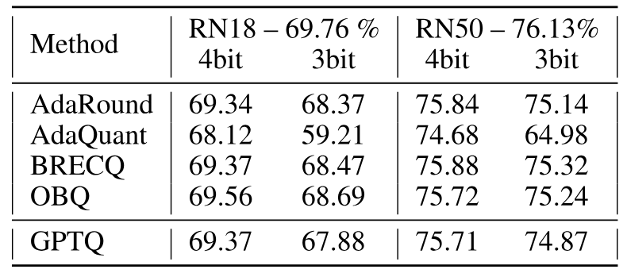

**表 1.** 視覚モデル向けの最先端学習後手法との比較。

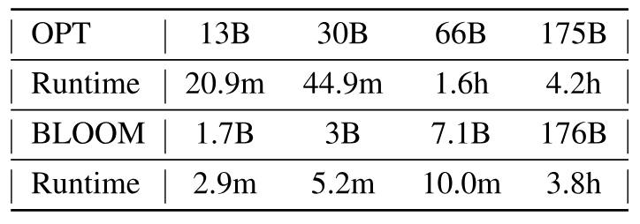

**表 2.** 最大の OPT および BLOOM モデル 4 種を GPTQ で完全量子化する実行時間。

**実行時間。** 次に、GPTQ によるモデル全体の量子化時間を単一の NVIDIA A100 GPU で測定する。結果を[表 2](#table-02)に示す。GPTQ は 10～30 億パラメータのモデルを数分、1750 億パラメータのモデルを数時間で量子化する。参考として、straight-through に基づく ZeroQuant-LKD [Yao22] は同じハードウェアで 13 億パラメータのモデルに 3 時間かかると報告しており、1750 億パラメータへ線形外挿すると数百時間、すなわち数週間になる。適応的丸めに基づく手法は通常、はるかに多くの SGD ステップを用いるため、さらに高価になる [Nag20, Li21a]。

**言語生成。** 大規模な検証ではまず、OPT と BLOOM の全モデル系列を 3 ビットおよび 4 ビットへ圧縮する。その後、WikiText2 [Mer16]（[図 1](#figure-01)、[表 3](#table-03)、[表 4](#table-04)も参照）、Penn Treebank（PTB）[Mar94]、C4 [Raf20]（後二つは[第 9.3 節](#section-9-3)）を含む複数の言語タスクで評価する。これらの perplexity ベースのタスクはモデル量子化に特に敏感だと知られているため [Yao22]、ここに焦点を当てる。OPT モデルでは GPTQ が RTN を大幅に上回る。たとえば 175B モデルの 4 ビット量子化で、GPTQ の perplexity の損失はわずか 0.03 だが、RTN は 2.2 ポイント悪化し、10 倍小さい全精度 13B モデルよりも低い性能になる。3 ビットでは RTN が完全に破綻する一方、GPTQ は、特に大規模モデルで妥当な perplexity を維持する。BLOOM も同様の傾向を示すが、手法間の差は通常やや小さく、このモデル系列は量子化しやすい可能性がある。興味深い傾向として（[図 1](#figure-01)も参照）、OPT-66B [+opt-66] を例外として、大きなモデルほど一般に量子化しやすい。圧縮が最も必要なのも大きなモデルであるため、実用上は好ましい結果である。

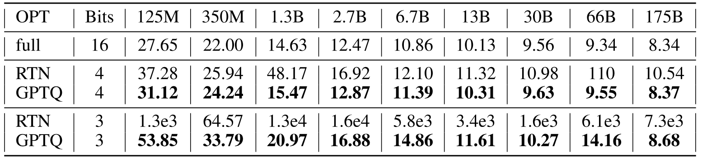

**表 3.** WikiText2 における OPT の perplexity。

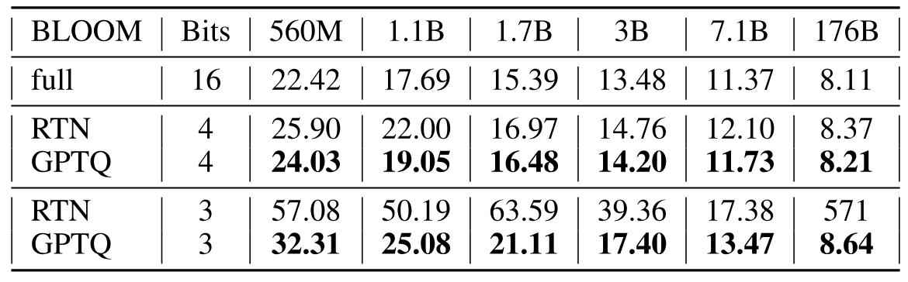

**表 4.** WikiText2 における BLOOM の perplexity。

**1750 億パラメータモデル。** 次に、公開されている最大の密モデル BLOOM-176B と OPT-175B を調べる。[表 5](#table-05)は Wikitext-2、PTB、C4 における結果をまとめたものである。4 ビットでは、GPTQ モデルの perplexity は全精度版より $\leq 0.25$ 低いだけであり、OPT-175B の RTN 結果とは大きな差がある。3 ビットでは RTN が破綻する一方、GPTQ はほとんどのタスクで良好な性能を維持し、5 倍を超える圧縮でも損失は $0.3 - 0.6$ ポイントにすぎない。GPTQ の精度は、より細粒度なグループ化 [Par22] でさらに改善できる。グループサイズ 1024（追加で約 0.02 ビット）は perplexity を平均約 $0.2$ 改善し、サイズ 128（追加で約 0.15 ビット）ではさらに $0.1$ 改善して、非圧縮時との差は $0.1 - 0.3$ だけになる。各層の量子化中、常に最新の更新済み重みからグループパラメータを決められるため、グループ化は GPTQ と非常に相性がよい。

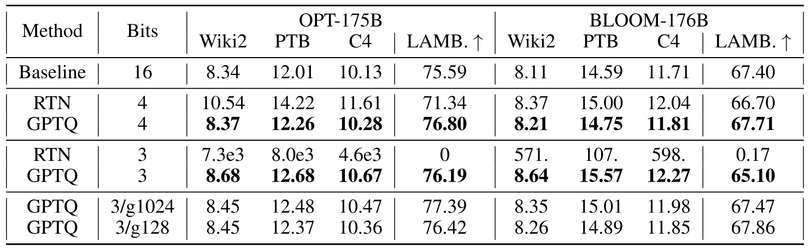

**表 5.** OPT-175B と BLOOM-176B の結果まとめ。「g1024」と「g128」は、それぞれサイズ 1024 と 128 のグループ化を用いた結果を表す。

**実用上の高速化。** 最後に実用的な応用を検討する。興味深い事例として OPT-175B に注目する。3 ビットへ量子化すると、完全な FP16 精度で保持する埋め込み層と出力層を含めて、約 63GB のメモリを占める。また、生成タスクで一般的な最適化である全層の key と value の履歴を完全に保存すると、最大 2048 token に対してさらに約 9GB を消費する。したがって量子化モデル全体を単一の 80GB A100 GPU に収め、推論時に必要となる層を動的に逆量子化して実行できる（4 ビットでは完全には収まらない）。比較として、標準的な FP16 実行には 5 台の 80GB GPU、最先端の 8 ビット LLM.int8() 量子化器 [Det22] には 3 台が必要である。

次に、最も魅力的な用途の一つである言語生成について、レイテンシ削減を目指す。LLM.int8() はメモリコストを減らすが実行時間は FP16 ベースラインと同じであるのに対し、量子化モデルはこの用途で大きく高速化できる。言語生成ではモデルが一度に 1 token を処理して出力し、OPT-175B では token 当たり数百ミリ秒かかることも珍しくない。計算の中心は行列–ベクトル積であるため、生成結果を利用者へ届ける速度を上げるのは難しい。行列–行列積とは違い、これは主にメモリ帯域幅に制限される。この問題に対し、必要なとき重みを動的に逆量子化して行列–ベクトル積を行う、量子化行列–全精度ベクトル積カーネルを開発する。特に、これは活性化量子化を一切*必要としない*。逆量子化で計算は増えるものの、カーネルのメモリアクセスは大幅に減り、[表 6](#table-06)に示す高速化が得られる。標準的な HuggingFace accelerate 類似の設定では通信コストを無視できるため、高速化のほぼすべてがカーネルによるものである（詳しくは[第 9.2.2 節](#section-9-2-2)）。

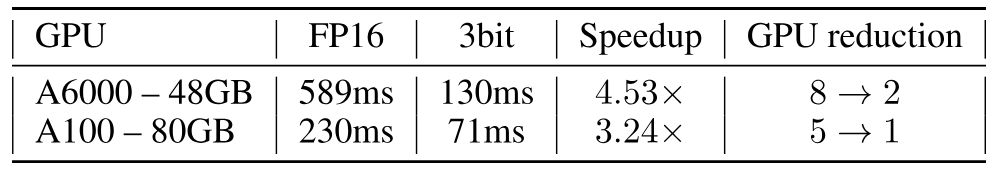

**表 6.** 長さ 128 の系列を生成するときの token 当たり平均レイテンシ（batch size 1）。

たとえば本カーネルを使うと、単一 A100 上で動作する GPTQ の 3 ビット OPT-175B は、token 当たりの平均時間で、5 GPU 上の FP16 版より約 $\mathbf{3.25\boldsymbol{\times}}$ 高速である。NVIDIA A6000 のような入手しやすい GPU はメモリ帯域幅がはるかに低いため、この戦略はさらに有効になる。2 台の A6000 で 3 ビット OPT-175B を実行すると、レイテンシは 8 台の GPU を使う FP16 推論の 589 ミリ秒から 130 ミリ秒へ下がり、$\mathbf{4.5\boldsymbol{\times}}$ 短縮される。

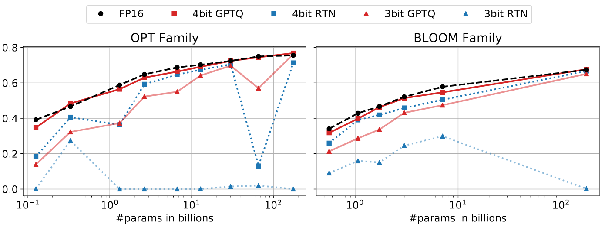

**図 3.** GPTQ 適用後の OPT および BLOOM モデルを LAMBADA で測定した精度。

**ゼロショットタスク。** 本研究の中心は言語生成だが、LAMBADA [Pap16]、ARC（Easy と Challenge）[Bor18]、PIQA [Tat03] という一般的なゼロショットタスクでも量子化モデルを評価する。[図 3](#figure-03)は LAMBADA でのモデル性能を可視化している（[表 5](#table-05)の「Lamb.」も参照）。挙動はこれまでと同様だが、二つの特徴がある。1）4 ビットでは全モデル範囲で量子化が「容易」に見え、RTN さえ比較的良好に働く。2）3 ビットでは RTN が破綻する一方、GPTQ は良好な精度を保つ。追加の結果は[第 9.4 節](#section-9-4)に示す。

**追加の工夫。** ここまでの実験は単純な行単位量子化だけを対象としたが、GPTQ は*ほぼ任意の量子化グリッドと互換性がある*。たとえば $g$ 個の連続重みからなる各グループを独立に量子化する標準的な*グループ化* [Ali17, Par22] と容易に組み合わせられる。[表 5](#table-05)の最後の行群に示すように、最大モデルの 3 ビット精度を明確に高められる。さらに[図 4](#figure-04)のとおり、中規模モデルの 4 ビット精度における精度損失も大きく減らせる。

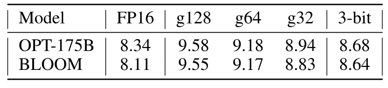

**表 7.** グループサイズを変えた 2 ビット GPTQ 量子化の結果。WikiText2 における perplexity。

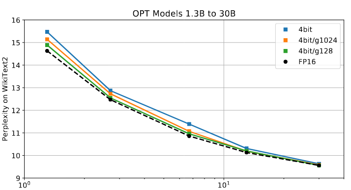

**図 4.** 中規模 OPT モデルに対する、異なるグループサイズの 4 ビット GPTQ。

**極端な量子化。** 最後にグループ化を使うと、平均して成分当たり約 2 ビットという極端な量子化でも妥当な性能を得られる。[表 7](#table-07)は、最大モデルをさまざまなグループサイズで 2 ビットへ量子化したときの WikiText2 における結果を示す。約 2.2 ビット（グループサイズ 128、グループごとに FP16 scale と 2 ビット zero point を使用）では perplexity の増加がすでに 1.5 ポイント未満であり、約 2.6 ビット（グループサイズ 32）では 0.6～0.7 まで下がる。これは単純な 3 ビットよりわずかに悪いだけで、実用的なカーネル実装に適している可能性がある。さらにグループサイズを 8 にすると、*三値*（-1、0、+1）量子化を適用でき、OPT-175B の WikiText2 PPL は 9.20、損失は 1 ポイント未満となる。平均圧縮率は上の 2 ビット結果より低いが、このパターンは FPGA のような専用ハードウェアで効率よく実装できる可能性がある。総じて、これは巨大言語モデルの高精度な*ワンショット*圧縮を、値当たり平均 3 ビット未満へ押し下げるための有望な第一歩である。

## 6 まとめと制約

本論文では、真に大規模な言語モデルを量子化するための近似二次手法 GPTQ を提示した。GPTQ は公開されている最大級のモデルを 3 ビットおよび 4 ビットへ正確に圧縮し、わずかな精度損失で利用可能性を大きく改善し、エンドツーエンドの高速化を実現する。本手法により、より多くの研究者と実務者がこれらのモデルを利用できるようになることを願う。同時に、重要な制約もある。技術面では、本手法はメモリ移動の削減によって高速化するもので、計算量を減らすものではない。また本研究は生成タスクに焦点を当て、活性化量子化を扱っていない。これらは今後の自然な研究方向であり、慎重に設計した GPU カーネルと既存手法 [Yao22, Wu22b] によって実現できると考える。

## 謝辞

Elias Frantar と Dan Alistarh は、欧州連合 Horizon 2020 プログラムの European Research Council（ERC）による助成（助成契約番号 805223 ScaleML）、Eldar Kurtic、および IST Austria IT 部門、特に Stefano Elefante、Andrei Hornoiu、Alois Schloegl による実験支援に感謝する。Saleh Ashkboos と Torsten Hoefler の研究は PASC DaCeMI プロジェクトの支援を受け、MAELSTROM、番号 955513 のもとで EuroHPC-JU の助成を受けた。計算基盤の支援を提供した Swiss National Supercomputing Center（CSCS）に感謝する。

## 7 倫理声明

本研究は、perplexity など標準的な精度指標でほとんど、あるいはまったく精度を失わず、量子化によって大規模言語モデル（LLM）を圧縮する一般的手法を導入する。校正にはランダムに選んだごく少量のデータしか使わないため、本手法はタスクに依存しない。したがって、手法の技術的詳細から直接生じる重大な倫理的影響は予見していない。ただし、本研究が perplexity のような、文献で標準とされる「最高精度」の指標に注目した点は考慮すべきである。perplexity は関連文献で事実上の標準である [Det22, Yao22]。圧縮が二次的な尺度、とりわけバイアスの影響 [Ben21] に与える作用は、十分に研究する必要があり、本研究によってその調査が容易になる可能性がある。同時に、本研究は巨大言語モデル上の推論を、良くも悪くも利用しやすくする。やがてこの種のツールはさらに使いやすく、配置しやすくなると考えられ、その力と制約を理解する必要性は一層高まる。

## 8 再現性声明

補足資料では、本論文の全実験を再現するコードを提供する。具体的には次を含む。

- OPT と BLOOM の全モデル系列を 2/3/4 ビットへ圧縮するコード。

- 量子化モデルの perplexity 評価。

- 3 ビット CUDA カーネルと圧縮推論ベンチマーク機能。

- ゼロショット実験のコード。

- サンプルコマンドと全スクリプトの実行方法を示す README ファイル。

## 9 付録

### 9.1 OBQ との追加比較

OBQ を無理なく適用できる最大級のモデルの一つとして、BERT-base/SQuAD [Raj16] と OPT-125M/WikiText2 における GPTQ と OBQ の追加比較を示す。

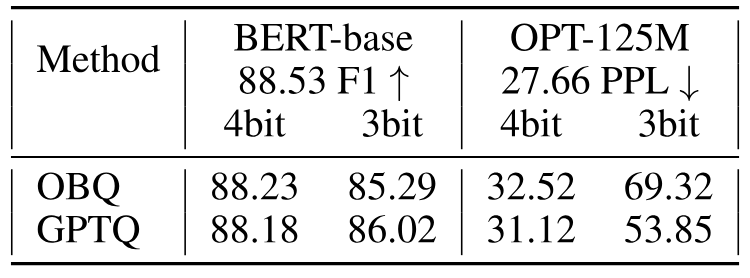

**表 8.** BERT-base/SQuAD および OPT-125M/WikiText2 における GPTQ と OBQ の比較。

### 9.2 実験の詳細

本節では、特にモデル評価と時間計測実験の設定について、実験設定の詳細を補足する。

#### 9.2.1 評価

言語生成実験では、[Rad19] と同じ標準的な方法で perplexity を計算する。まず検証セット全体を二つの改行で区切って連結し、各モデルの既定の HuggingFace tokenizer で符号化する。次に系列を、モデルの完全なコンテキスト長である幅 2048 の重なりのない区間へ分割する。それぞれをモデルへ入力し、各次 token に対応する対数確率を収集する。その平均を指数化した値が最終的に報告する perplexity である。

ゼロショットタスクでは、データ前処理と最終スコア計算について EleutherAI evaluation harness [+evaluation-harness] に従う。個々のサンプルを別々に評価するため、padding は一切適用しない。

#### 9.2.2 時間計測実験の設定

時間計測実験は、最近の LLM.int8() [Det22] でも使われた標準的な HuggingFace/accelerate [+accelerate] 設定に従う。この設定では、連続する層のまとまりを GPU 間へ分配してモデルを分割する。重要なのは、8 GPU を使用しても通信コストが総実行時間の $5\%$ 未満と小さいことである。したがって、報告する高速化のほぼすべては、量子化行列–全精度ベクトル積カーネルによるものである。FP16 ベースラインと量子化モデルの唯一の違いは、基礎となる行列–ベクトル積を行うカーネルである。

これは、HuggingFace、attention、残差や LayerNorm などの非量子化演算による全オーバーヘッドが完全に同じであることを意味する。したがって量子化モデルもベースラインと同様に、高度な分散戦略 [Zhe22] や高効率な attention カーネル [Dao22] の恩恵を受けられる。

一般に本カーネルは、基礎処理が（ほぼ）行列–ベクトル積となりメモリ律速になる、低 batch size の生成推論を対象とする（簡単のため batch size 1 のみを考える）。非生成および大 batch の用途では、処理がメモリ律速ではなく計算律速となり、カーネルを直接適用できない場合がある。その場合は対応する行列–行列計算の前に行列を展開すればよい。この処理は A100 で 1.5ms 未満、A6000 で 3ms 未満であり、その後の OPT-175B FC2 層の計算は batch size $16 \times 1024$ token でそれぞれ 76ms/365ms かかる。したがって、この種の用途でも、わずかな計算オーバーヘッドで必要 GPU 数を大きく削減できる。これは近年の研究 [Det22] と同様だが、圧縮率は $2.5\times$ 高い。

### 9.3 言語生成の追加結果

[表 9](#table-09)、[表 10](#table-10)、[表 11](#table-11)、[表 12](#table-12)に言語生成タスクの追加結果を示す。

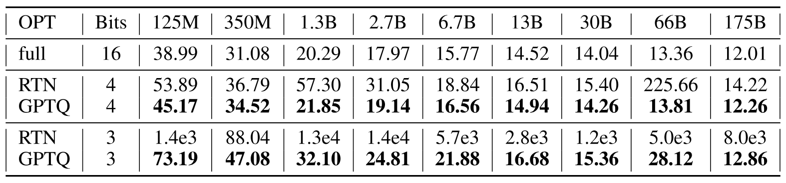

**表 9.** PTB における OPT の perplexity。

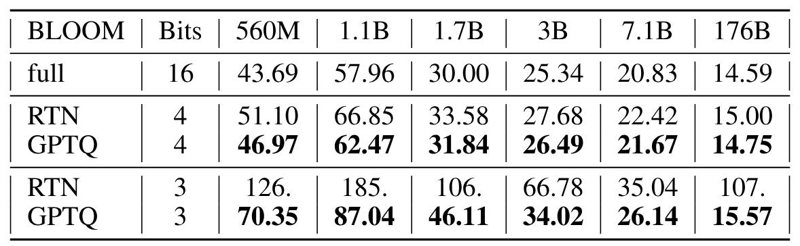

**表 10.** PTB における BLOOM の perplexity。

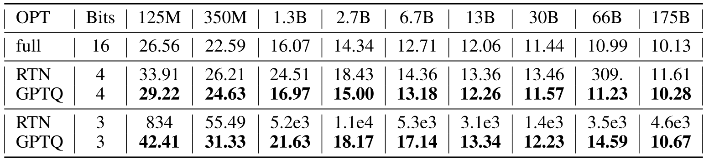

**表 11.** C4 における OPT の perplexity。GPTQ の校正データは C4 学習セットから抽出されるため、このタスクは完全なゼロショットではない。

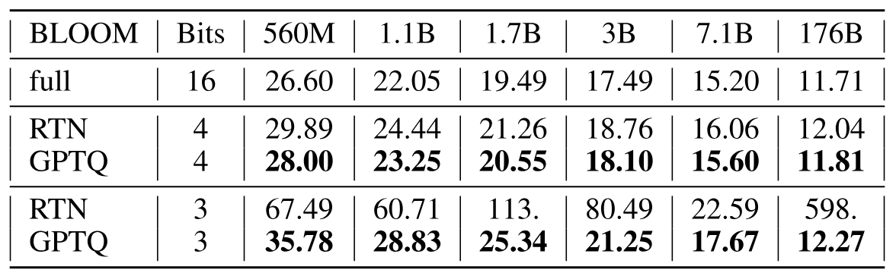

**表 12.** C4 における BLOOM の perplexity。GPTQ の校正データは C4 学習セットから抽出されるため、このタスクは完全なゼロショットではない。

### 9.4 ゼロショットの追加結果

本節ではゼロショットタスクの追加結果を示す。

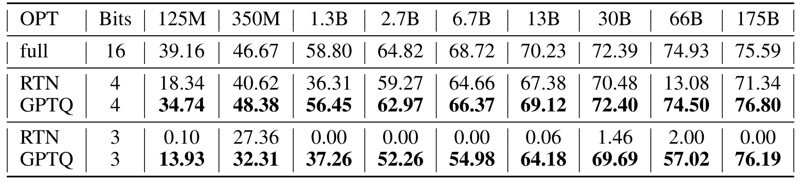

**表 13.** LAMBADA における OPT の精度。

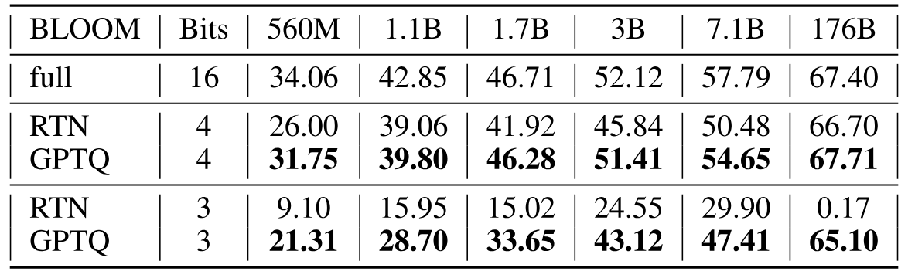

**表 14.** LAMBADA における BLOOM の精度。

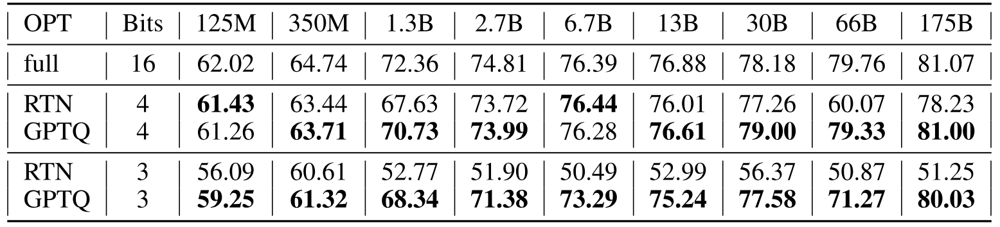

**表 15.** PIQA における OPT の精度。

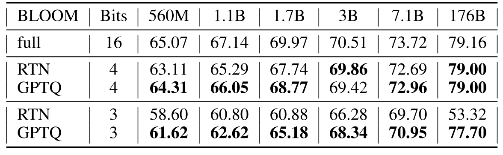

**表 16.** PIQA における BLOOM の精度。

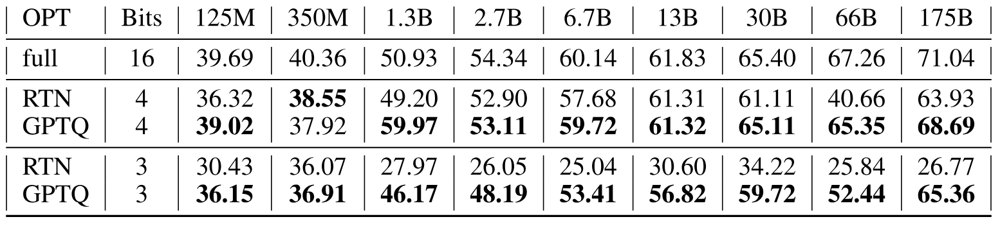

**表 17.** ARC-easy における OPT の精度。

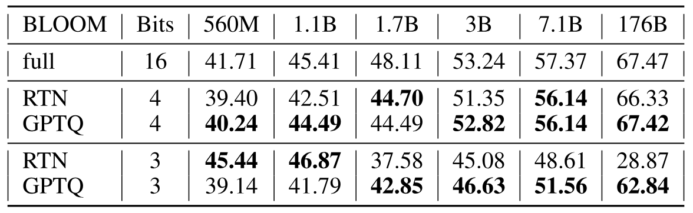

**表 18.** ARC-easy における BLOOM の精度。

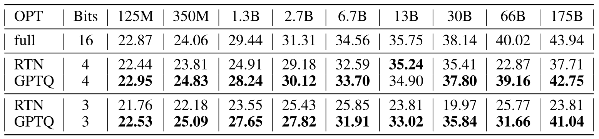

**表 19.** ARC-challenge における OPT の精度。

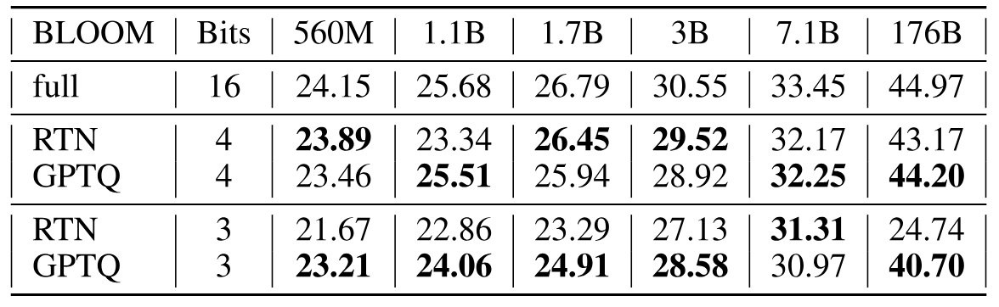

**表 20.** ARC-challenge における BLOOM の精度。

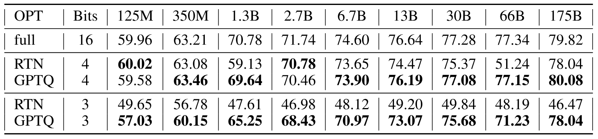

**表 21.** StoryCloze における OPT の精度。

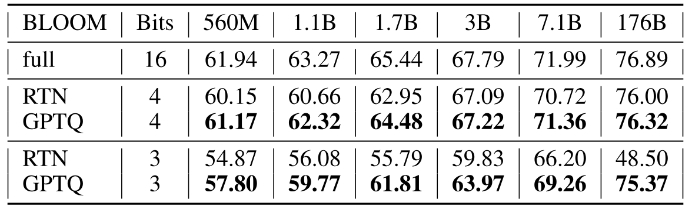

**表 22.** StoryCloze における BLOOM の精度。

[+author-note]: 責任著者：`elias.frantar@ist.ac.at`。

[+gptq-name]: OPT モデル系列の名称と学習後量子化（PTQ）の略称を組み合わせた名称である。

[+opt-66]: OPT-66B モデルを詳しく調べると、学習済みモデルの初期層に多数の不活性ユニットがあることと相関しているように見え、これが圧縮を難しくしている可能性がある。

[+evaluation-harness]: [https://github.com/EleutherAI/lm-evaluation-harness](https://github.com/EleutherAI/lm-evaluation-harness)

[+accelerate]: [https://huggingface.co/docs/accelerate/index](https://huggingface.co/docs/accelerate/index)
