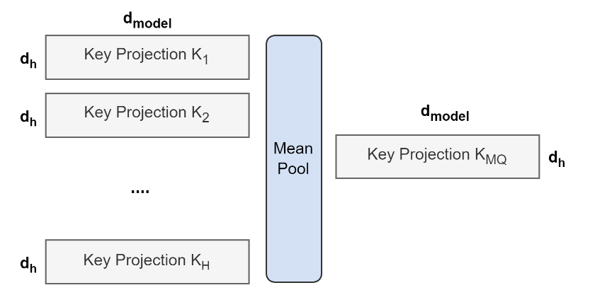
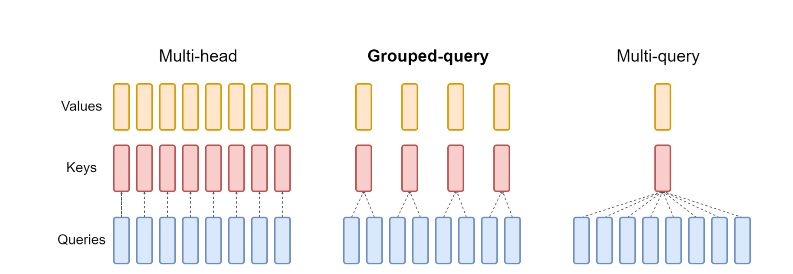
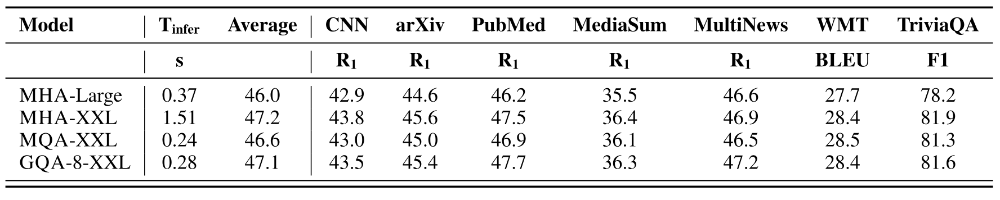
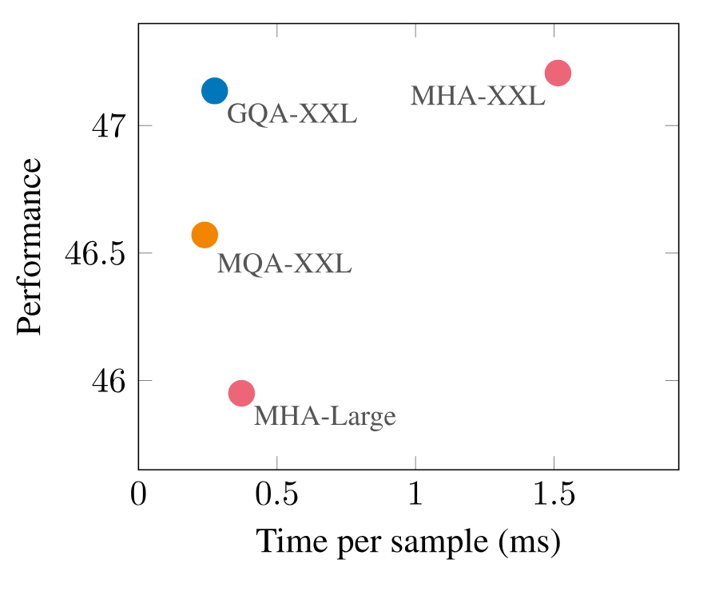
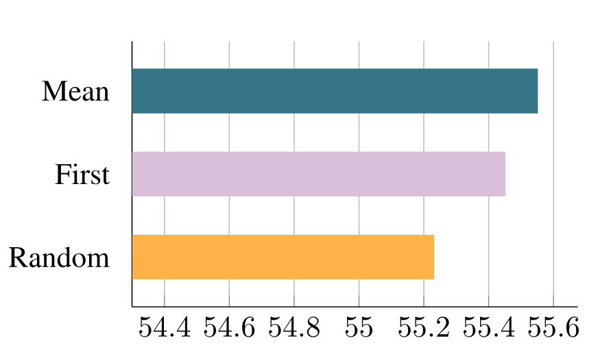
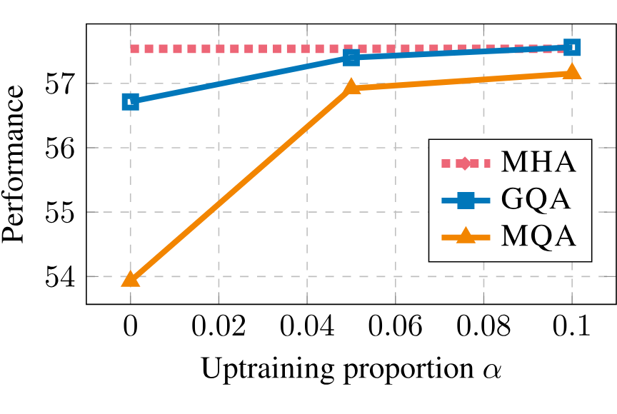
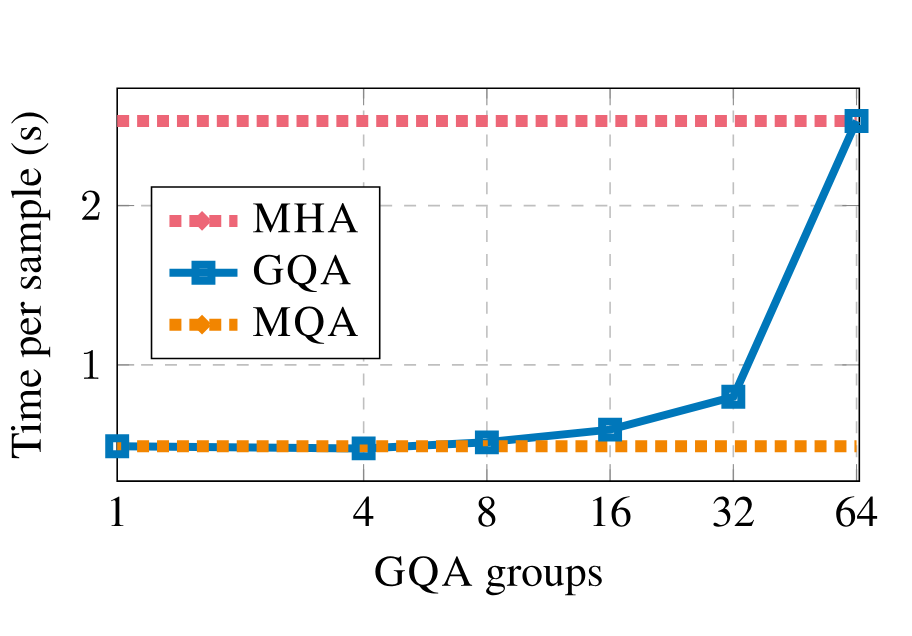

> [Joshua Ainslie](https://dblp.org/pid/263/3363) [+1]、[James Lee-Thorp](https://dblp.org/pid/292/3901) [+1]、[Michiel de Jong](https://dblp.org/pid/223/0153) [+1] [+2]、[Yury Zemlyanskiy](https://dblp.org/pid/225/5302)、[Federico Lebrón](https://dblp.org/pid/347/9919)、[Sumit Sanghai](https://dblp.org/pid/263/3559)。2023 年 5 月 22 日に arXiv へ初投稿され、現在の版は v3。2023 年 12 月に *Proceedings of the 2023 Conference on Empirical Methods in Natural Language Processing*、4895–4901 ページで発表。[GQA: Training Generalized Multi-Query Transformer Models from Multi-Head Checkpoints](https://arxiv.org/abs/2305.13245)。<a href="/paper/gqa.pdf" target="_blank" rel="noopener noreferrer">原論文 PDF</a>。[EMNLP 2023](https://aclanthology.org/2023.emnlp-main.298/)。[DOI](https://doi.org/10.18653/v1/2023.emnlp-main.298)。[TeX ソース](https://export.arxiv.org/e-print/2305.13245)。正確な印刷レイアウトと参考文献については、原論文 PDF を正本とする。

## 概要

単一の key-value head だけを使う multi-query attention（MQA）は、decoder inference を大幅に高速化する。しかし、MQA は品質低下を招く可能性があり、高速な推論のためだけに別のモデルを訓練することが望ましいとは限らない。我々は、（1）元の事前学習計算量の 5% を使って、既存の multi-head language model checkpoint を MQA モデルへ uptraining する手順を提案し、（2）中間的な数（1 より多く、query head 数より少ない）の key-value head を使う multi-query attention の一般化として grouped-query attention（GQA）を導入する。Uptraining した GQA は、MQA と同程度の速度を保ちながら multi-head attention に近い品質を達成することを示す。

## 1 はじめに

自己回帰 decoder inference は Transformer model の深刻なボトルネックであり、その原因は各 decoding step で decoder weight とすべての attention key および value を読み込む際の memory bandwidth overhead にある [Sha19, Pop22, Dej22]。複数の query head と単一の key head および value head を使う *multi-query attention* [Sha19] により、key と value の読み込みに必要な memory bandwidth を大幅に減らせる。

しかし、multi-query attention（MQA）は品質低下と学習の不安定性を招く可能性があり、品質と推論にそれぞれ最適化したモデルを別々に訓練することは現実的でない場合がある。また、PaLM [Cho22b] のように multi-query attention をすでに使う language model がある一方、公開されている T5 [Raf20b] や LLaMA [Tou23] など、多くのモデルは採用していない。

本研究は、大規模 language model の高速推論に対して二つの貢献を行う。第一に、multi-head attention（MHA）を使う language model checkpoint を、元の学習計算量のごく一部で MQA を使うように *uptraining* [Kom22a] できることを示す。これにより、高速な multi-query checkpoint と高品質な MHA checkpoint を低コストで得られる。

第二に、multi-head attention と multi-query attention の中間に位置し、*query head の subgroup ごと*に単一の key head と value head を持つ grouped-query attention（GQA）を提案する。Uptraining した GQA は、multi-query attention とほぼ同じ速度で multi-head attention に近い品質を達成することを示す。

## 2 手法

### 2.1 Uptraining

Multi-head model から multi-query model を生成する処理は、まず checkpoint を変換し、次に追加の事前学習でモデルを新しい構造へ適応させる、という二つの step からなる。[図 1](#figure-01) は、multi-head checkpoint を multi-query checkpoint に変換する手順を示す。Key head と value head の projection matrix は、mean pooling によってそれぞれ単一の projection matrix にまとめられるが、これは単一の key head と value head を選ぶ方法や、新しい key head と value head を一からランダムに初期化する方法よりも良好に機能する。

**図 1．** Multi-head attention から multi-query attention への変換の概要。すべての head の key projection matrix と value projection matrix を mean pooling し、単一の head にまとめる。

変換後の checkpoint は、同じ事前学習手順で元の学習 step 数の一部 $\alpha$ だけ追加学習される。

### 2.2 Grouped-query attention

**図 2．** Grouped-query 手法の概要。Multi-head attention には H 個の query head、key head、value head がある。Multi-query attention では、すべての query head が単一の key head と value head を共有する。Grouped-query attention では、query head の各 *group* が単一の key head と value head を共有し、multi-head attention と multi-query attention の間を補間する。

Grouped-query attention は query head を $G$ 個の *group* に分割し、各 group が単一の key head と value head を共有する。GQA-G は $G$ 個の group を持つ grouped-query を指す。Group が一つで key head と value head も一つの GQA-$1$ は MQA と等価であり、group 数が head 数と等しい GQA-H は MHA と等価である。[図 2](#figure-02) は、grouped-query attention と multi-head／multi-query attention を比較している。Multi-head checkpoint を GQA checkpoint に変換する際は、各 group に含まれる元の head をすべて mean pooling して、その group の key head と value head を構成する。

中間的な group 数を使うと、MQA より高品質で MHA より高速な補間モデルとなり、後述するように有利な trade-off が得られる。MHA から MQA への変更では、$H$ 個の key head と value head をそれぞれ一つに減らすため、key-value cache のサイズと読み込むデータ量は $H$ 分の 1 になる。しかし、大きなモデルほど一般に head 数も増えるため、multi-query attention による memory bandwidth と容量の削減はどちらもより急になる。GQA では、モデルが大きくなっても bandwidth と容量の減少率を同じに保てる。

さらに、大きなモデルでは KV-cache がモデル次元に比例して増える一方、モデルの FLOP 数と parameter 数はモデル次元の二乗に比例するため、attention の memory bandwidth overhead が相対的に小さくなる。最後に、大規模モデルの標準的な sharding では、単一の key head と value head がモデル partition 数だけ複製される [Pop22] が、GQA はこの partition による無駄を取り除く。したがって、GQA は大きなモデルで特に良好な trade-off を示すと予想される。

なお、GQA は encoder self-attention layer には適用しない。Encoder representation は並列に計算されるため、memory bandwidth は通常、主要なボトルネックにならない。

## 3 実験

### 3.1 実験設定

**構成。** すべてのモデルは T5.1.1 architecture [Raf20b] を基にし、JAX [Bra18]、Flax [Hee20]、Flaxformer [+3] で実装した。主要実験では、multi-head attention を使う T5 Large と XXL、および uptraining して multi-query attention と grouped-query attention を使う T5 XXL を検討する。T5 [Raf20b] と同じ hyperparameter および learning rate schedule で Adafactor optimizer を使う。MQA と GQA は decoder self-attention と cross-attention に適用するが、encoder self-attention には適用しない。

**Uptraining。** Uptraining するモデルは、公開された T5.1.1 checkpoint から初期化する。Key head と value head を mean pooling して適切な MQA または GQA 構造を作り、その後 [Raf20b] と同じ元の事前学習設定と dataset で、元の事前学習 step 数の $\alpha$ の割合だけ追加学習する。$\alpha=0.05$ の場合、学習には約 600 TPUv3 chip-days を要した。

**データ。** 要約 dataset の CNN/Daily Mail [Nal16]、arXiv と PubMed [Coh18]、MediaSum [Zhu21a]、Multi-News [Fab19]、翻訳 dataset の WMT 2014 English-to-German、質問応答 dataset の TriviaQA [Jos17] で評価する。GLUE [Wan18d] のような一般的な分類 benchmark は、自己回帰推論との関係が薄いため評価しない。

**Fine-tuning。** すべての task の fine-tuning で、一定の learning rate 0.001、batch size 128、dropout rate 0.1 を使う。CNN/Daily Mail と WMT の input length は 512、output length は 256 とする。他の要約 dataset では input length 2048、output length 512 とする。最後に、TriviaQA では input length 2048、output length 32 とする。収束するまで学習し、dev performance が最も高い checkpoint を選ぶ。推論には greedy decoding を用いる。

**計時。** Xprof [Xpr20] で測定した、TPUv4 chip 1 個当たりの sample 処理時間を報告する。計時実験では 8 個の TPU を使い、各 TPU で最大 32 までの収容可能な最大 batch size を設定し、model ごとに並列化を個別に最適化する。

**表 1．** Multi-head attention を使う T5 Large および XXL と、5% の uptraining を行って multi-query attention および grouped-query attention を使う T5-XXL model の推論時間と平均 dev set performance の比較。対象は要約 dataset の CNN/Daily Mail、arXiv、PubMed、MediaSum、MultiNews、翻訳 dataset の WMT、質問応答 dataset の TriviaQA。

**図 3．** **Uptraining した MQA は、MHA-Large より高品質かつ高速で、MHA に対して有利な tradeoff を示す。また、GQA は同程度の速度向上を保ちながら performance をさらに高め、MHA-XXL に近い品質を達成する。** Multi-head attention を使う T5-Large と T5-XXL、および 5% の uptraining を行って MQA と GQA-8 attention を使う T5-XXL について、全 task の平均 performance と sample 当たりの平均推論時間の関係を示す。

### 3.2 主要結果

[図 3](#figure-03) は、MHA を使う T5-Large と T5-XXL、および uptraining 比率 $\alpha = 0.05$ の MQA と GQA-$8$ XXL model について、全 dataset の平均 performance と平均推論時間の関係を示す。大きな uptraining 済み MQA model は、MHA-Large より高品質で推論も高速であり、MHA model に対して有利な trade-off を示す。さらに、GQA は品質を大幅に高め、MQA に近い速度で MHA-XXL に近い performance を達成する。[表 1](#table-01) に全 dataset の完全な結果を示す。

### 3.3 Ablation

本節では、modeling 上の各選択が与える影響を調べる実験を示す。代表的な task の subset、すなわち CNN/Daily Mail（短文要約）、MultiNews（長文要約）、TriviaQA（質問応答）で performance を評価する。

**図 4．** T5-Large を $\alpha=0.05$ の比率で MQA へ uptraining した場合の、異なる checkpoint 変換法の performance 比較。「Mean」は key head と value head を mean pooling し、「First」は最初の head を選び、「Random」は head を一からランダムに初期化する。

**Checkpoint 変換。** [図 4](#figure-04) は、異なる checkpoint 変換法の performance を比較する。Mean pooling が最もよく機能し、単一 head の選択、ランダム初期化の順となる。直観的には、結果は事前学習済み model から情報が保存される度合いの順に並んでいる。

**Uptraining step。** [図 5](#figure-05) は、MQA と GQA を使う T5 XXL の performance が uptraining 比率に応じてどう変化するかを示す。まず、GQA は変換直後でも妥当な performance を達成するが、MQA は利用可能になるまで uptraining が必要である。MQA と GQA はどちらも 5% の uptraining で改善し、10% では収益が逓減する。

**図 5．** MQA と GQA-8 を使う T5 XXL model の performance と uptraining 比率の関係。

**Group 数。** [図 6](#figure-06) は、GQA の group 数が推論速度へ与える影響を示す。大きな model では、KV cache による memory bandwidth overhead の制約が小さく [Sha19]、head 数の増加によって key-value size の削減幅も大きくなる。その結果、MQA から group 数を増やしても最初はわずかな速度低下にとどまり、MHA に近づくほど group を追加するコストが増える。我々は、有利な中間点として 8 group を選んだ。

**図 6．** Input length 2048、output length 512 における GQA-XXL の、GQA group 数と sample 当たりの時間の関係。1 group（MQA）から 8 group への変更では推論 overhead がわずかに増え、その後は group を増やすほどコストが高くなる。

## 4 関連研究

本研究は、key と value の読み込みに伴う memory bandwidth overhead [Wil09] を減らすことで、decoder の品質と推論時間のよりよい trade-off を目指す。Shazeer [Sha19] は、この overhead を multi-query attention によって減らす方法を初めて提案した。その後の研究では、multi-query attention が長い input で特に有効であることが示された [Pop22, Dej22]。Rabe [Rab23] は独立に GQA を開発し、実装を公開した。他の研究では、計算効率のために attention head を group 化する方法 [Par20b, Luo22, Ni23] が検討されているが、memory bandwidth overhead を決める key-value head には特に焦点を当てていない。

Key と value、および parameter による memory bandwidth overhead を減らすため、他にもさまざまな手法が提案されている。Flash attention [Dao22] は、二次の attention score を materialize しないよう attention 計算を構成し、memory を削減して学習を高速化する。Quantization [Det22, Fra22] は、key と value を含む weight と activation の precision を下げ、その size を小さくする。Model distillation [Hin15, Gou21] は、より大きな model が生成した data で小さな model を finetune し、一定の precision で model size を削減する。Layer-sparse cross-attention [Dej22] は、長い input で主なコストとなる cross-attention layer の大部分を除去する。Speculative sampling [Che23, Lev23] は、小さな model で複数 token を提案し、それを大きな model で並列に score することで memory bandwidth bottleneck を緩和する。

最後に、我々が提案する uptraining 手順は Komatsuzaki ら [Kom22a] に着想を得ている。彼らは標準の T5 checkpoint を、疎に活性化される Mixture-of-Experts model へ uptraining した。

## 5 結論

Language model の推論コストが高い主因は、key と value の読み込みに伴う memory bandwidth overhead である。Multi-query attention は model の容量と品質を犠牲にして、この overhead を減らす。我々は、元の事前学習計算量のごく一部を使って multi-head attention model を multi-query model に変換する方法を提案する。さらに、multi-query attention と multi-head attention の補間であり、multi-query attention と同程度の速度で multi-head に近い品質を達成する grouped-query attention を導入する。

## 6 制約

本論文は、key と value の読み込みに伴う memory bandwidth overhead の緩和に焦点を当てる。この overhead は長い sequence の生成で最も重要になるが、その品質を評価すること自体が難しい。要約では Rouge score を用いるが、これは全体像を捉えられない不完全な評価であると認識しており、そのため我々の trade-off が正しいと断定することは難しい。計算資源が限られているため、XXL GQA model と一から学習した同等の model を比較しておらず、uptraining と一からの学習の相対 performance は不明である。最後に、uptraining と GQA の影響は encoder-decoder model だけで評価した。近年は decoder-only model が非常に普及しており、これらの model には self-attention と cross-attention の区別がないため、GQA は MQA に対してさらに大きな利点を持つと予想する。

## 謝辞

有益な助言と議論をいただいた Santiago Ontañón、Afroz Mohiuddin、William Cohen、および Google Research の皆様に感謝する。

## 7 学習の安定性

Multi-query attention は、特に長い input の task と組み合わせた場合に、fine-tuning の不安定性を招くことがわかった。Multi-query attention を使う複数の T5-Large model を一から学習した。いずれの場合も、事前学習中に loss spike が頻発し、最終 model は長い input の task で fine-tuning を始めると直ちに発散した。Uptraining した multi-query attention model はより安定しているものの分散は依然として大きいため、不安定な task の multi-query model については 3 回の fine-tuning run の平均 performance を報告する。一方、uptraining した grouped-query attention model は安定しているように見えたため、multi-query の不安定性の根本原因はこれ以上調査しなかった。

[+1]: 同等の貢献。

[+2]: 南カリフォルニア大学。Google Research で実施した研究。

[+3]: [https://github.com/google/flaxformer](https://github.com/google/flaxformer)
