> [Kimi Team](https://platform.kimi.com/docs/guide/kimi-k3-quickstart)。Kimi K3: Open Frontier Intelligence：Kimi K3 テクニカルレポート。本 Web 閲覧版は [原論文 PDF](/paper/k3_tech_report.pdf) から抽出した本文をもとにしています。数式表記、図表、完全な参考文献一覧については PDF を正とします。[モデルウェイト](https://huggingface.co/moonshotai/Kimi-K3)。

## 概要

Kimi K3 は、1,040 億個のアクティブ化パラメーター、ネイティブ ビジョン機能、および 100 万トークンのコンテキスト ウィンドウを備えた 2.8T パラメーターの専門家混合モデルです。 Kimi K3 は Kimi Delta Attention [Tea25b] および Attention Residuals [Tea26] に基づいて構築されており、シーケンスの長さとモデルの深さにわたる情報フローが向上します。トークンごとに 896 人のルーティングされたエキスパートのうち 16 人を効果的にアクティブ化する Stable LatentMoE、および洗練されたトレーニングとデータのレシピを組み合わせることで、これらの進歩により、全体的なスケーリング効率が Kimi K2 [Tea25] と比較して約 $2.5\times$ 向上しました。トレーニング後のトレーニングでは、一般、エージェント、コーディングの各ドメインと複数の推論努力レベルにわたる強化学習が強調表示され、構成的な一般化と長期的な堅牢な実行が可能になります。 2.8T スケールの Kimi K3 は、KDA のアルゴリズムとシステムの共同設計、効率的なメモリ管理を備えた完全にバランスの取れたエキスパート並列トレーニング、永続的なロールアウトとサンドボックス状態を備えた 100 万トークンのエージェント RL、展開の革新など、複数の領域におけるインフラストラクチャの進歩によってサポートされています。広範な評価により、Kimi K3 は長期的なコーディング、エージェント、知識、推論、およびビジョンのタスクにわたってフロンティア レベルのパフォーマンスを達成することが示されています。全体的なパフォーマンスは依然として、最も強力な独自モデルである Claude Fable 5 および GPT-5.6 Sol には及ばないものの、Kimi K3 は、スイートで評価された他のオープンな独自モデルを常に上回っています。今後の研究を促進し、フロンティア インテリジェンスの広範な展開と導入を加速するために、完全な Kimi K3 モデルの重みをリリースします。

<span id="figure-01"></span>

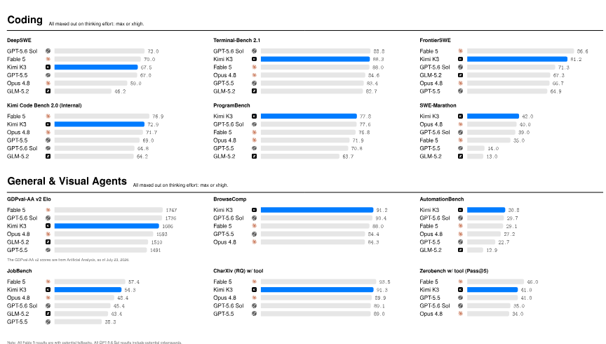

**図 1.** Kimi K3 の主な結果。

## 1 はじめに

大規模言語モデル (LLM) の開発のほとんどにおいて、スケーリングとは、より多くのデータ [Kap20、Hof22] で大規模なモデルをトレーニングすることにより、デプロイメント前にさらに多くの計算に投資することを意味します。推論モデルの台頭により、テスト時の計算がスケーリングの 2 番目の軸として確立されました。OpenAI の o シリーズは、強化学習とテスト時の推論 [Ope24、Ope25] をスケールします。 Anthropic の拡張思考モデルは、適応的思考の予算を割り当て、推論とツールの使用をインターリーブします。 DeepSeek-R1 [Guo25] および Kimi K1.5 [Sca25] は、大規模な強化学習が強力な事前トレーニング済みモデルから高度な推論動作を引き出すことができることを示しています。 Kimi K2.5Agent Swarm [Kim26a] は、テスト時間のスケーリングを逐次推論から並列エージェント調整までさらに拡張します。これらの進歩により、テスト時間のスケーリングがフロンティア研究の中心的な焦点になりました。ただし、オープンソース モデルのエコシステムは 2 番目の軸では急速に進歩していますが、1 番目の軸ではゆっくりと進歩しています。最近のモデルの多くは、1T クラスのパラメータ領域 [Zen26、Dee26、XiaWeb、Thi26] 内またはわずかに上にとどまっています。ますます洗練された推論とエージェント強化学習手法が、同様の規模の事前トレーニングされた基盤に適用されるにつれて、オープンソースの進歩は収束するリスクを負い、最強の独自システムとの差は拡大します。 Kimi K3 では、両方のスケーリング軸を一緒に最前線まで追求します。強化学習、推論努力、および 1M コンテキスト長での長期インタラクションをスケーリングしながら、事前トレーニングされた基盤を前例のない 3T クラスのパラメーターにスケーリングします。

Kimi K3 は、合計 2.8 兆のパラメーター、1,040 億のアクティブ化されたパラメーター、および最大 100 万のトークンのコンテキスト ウィンドウを備えたネイティブ マルチモーダル専門家混合モデルです。そのアーキテクチャは、シーケンスの長さ、ネットワークの深さ、モデルの幅にわたって情報フローを拡張します。 Kimi Delta Attention(KDA) [Tea25b] は、グローバル インタラクションを維持する定期的にインターリーブされた Gated MLA レイヤーを使用して、効率的なロング シーケンス ミキシングを提供します。 Attention Residuals(AttnRes) [Tea26] を使用すると、各レイヤーが先行するすべてのレイヤーの表現に選択的に対応できます。 Stable LatentMoE は、ルーティングされたエキスパート スペースを 896 エキスパートに拡張し、トークンごとに 16 がアクティブ化されます。一方、正規化、SiTU-GLU、および Quantile Balancing は、極度のスパース性で最適化を安定させます。これらのアーキテクチャの進歩と、洗練されたデータおよびトレーニング レシピを組み合わせることで、全体的なスケーリング効率が Kimi K2 [Tea25] よりも約 $2.5\times$ 向上しました。

この事前トレーニング基盤と、1M コンテキストのテスト時間のスケーリング用に明示的に設計された事後トレーニングを組み合わせます。 Kimi K3 は、長期コーディング、一般エージェント、一般推論、知識タスクにわたって強化学習を受け、それぞれが複数の推論努力レベルに及びます。トレーニング環境には、検証可能な検索と専門知識の作業、ソフトウェア エンジニアリングとカーネルの最適化、ビジョンインザループ ツールの使用によるマルチモーダル推論、永続的なアシスタント ワークフロー、Web 開発、および自律実行タスクが含まれます。これらの環境は、多くの場合、数百または数千のツール呼び出しと数百万の蓄積されたコンテキスト トークンを超えて、推論、行動、観察、検証、適応の一般的なループを訓練します。ドメインおよびエフォートに特化したポリシーは、マルチ教師によるポリシー蒸留 [Lu25、Xia26、Dee26] を通じて統合モデルに統合されます。

この体制を実現するには、アーキテクチャの複雑さ、モデルのサイズ、軌道の長さに応じて拡張できるインフラストラクチャが必要です。 KDA のシステムを共同設計するために、融合カーネル、KDA コンテキスト並列処理、およびステートアウェア プレフィックス キャッシュを開発して、デバイス内、デバイス間、リクエスト全体で KDA を効率化します。 2.8T パラメータの MoE 事前トレーニングの場合、MoonEP は、静的計算シェイプとゼロコピー通信による完全にバランスのとれたエキスパート実行を提供し、メモリ効率の高いトレーニングとマルチモーダル エンコーダの最適化により、制限されたメモリ内の使用率を維持します。 100 万トークンのエージェント RL の場合、当社の同じ場所にあるシステムは、部分的なロールアウト、外部 KV キャッシュの保持、適応型スロットル、再開可能な microVM サンドボックスを組み合わせて、長期間存続するモデルと環境の状態を保存します。最後に、特殊なカーネルと、キャッシュと予算を意識したフリート スケジューリングにより、これらのイノベーションが予測可能な運用サービスに変換されます。

結果として得られるモデルは、新たなオープンフロンティアを確立します。長期的なコーディング、エージェント、知識、推論、およびビジョンのタスクにわたるベンチマークでは、Kimi K3 は、総合的に最強の独自システムである Claude Fable 5 および GPT-5.6 Sol に後れをとり、レポートで評価された他のオープンな独自モデルを常に上回っています。

**Contributions.** Kimi K3 は、2.8T パラメータのネイティブ マルチモーダル MoE モデルと、104B のアクティブ化パラメータおよび 1M トークンのコンテキスト ウィンドウを組み合わせています。ドメインと推論努力レベルにわたる強化学習。数兆パラメータの事前トレーニングと数百万トークンのエージェント軌道のためのインフラストラクチャ。そして完全なモデルウェイトのリリース。

## 2 モデルアーキテクチャ

Kimi K3 アーキテクチャは、シーケンスの長さ、ネットワークの深さ、モデルの幅という 3 つの相補的な次元に沿って情報フローを拡張するように設計されています。シーケンスの次元に沿って、ハイブリッド アテンションは各ブロック内の 3 つの Kimi Delta Attention(KDA) [Tea25b] レイヤーと 1 つの Gated MLA レイヤーを組み合わせて、選択的な大容量アテンションを維持しながら、ロングコンテキストのトークン混合のための効率的なメカニズムを提供します。 ([§2.1](#_2-1-hybrid-attention))。深さの次元に沿って、Attention Residuals(AttnRes) [Tea26] により、各モジュールが埋め込み、現在のブロック、および先行ブロックから表現を選択的に取得できるようになり、従来の逐次残差累積 ([§2.2](#_2-2-attention-residuals)) を超えて情報アクセスが拡張されます。幅の次元に沿って、各アテンション レイヤーの後には、スパース チャネル ミキシングを実行する Stable LatentMoE レイヤーが続き、トークンごとに 896 のルーティングされたエキスパートのうち 16 を効果的にアクティブにします ([§2.3](#_2-3-stable-latentmoe))。ネイティブ ビジョンの場合、MoonViT-V2 は画像とビデオをエンコードし、軽量プロジェクターは、バックボーン処理の前に、結果の視覚特徴を共有埋め込みスペースにマッピングします ([§2.4](#_2-4-native-vision))。これらのコンポーネントは、Per-Head Muon([§2.5](#_2-5-per-head-muon)) とともに、トークン、レイヤー、およびチャネルにわたる情報フローをスケーリングするための統合アーキテクチャを提供します。洗練されたトレーニングとデータのレシピを組み合わせると、全体的なスケーリング効率が Kimi K2 よりも約 $2.5\times$ 向上します。[図 2](#figure-02) は、アーキテクチャの概要を示しています。

<span id="figure-02"></span>

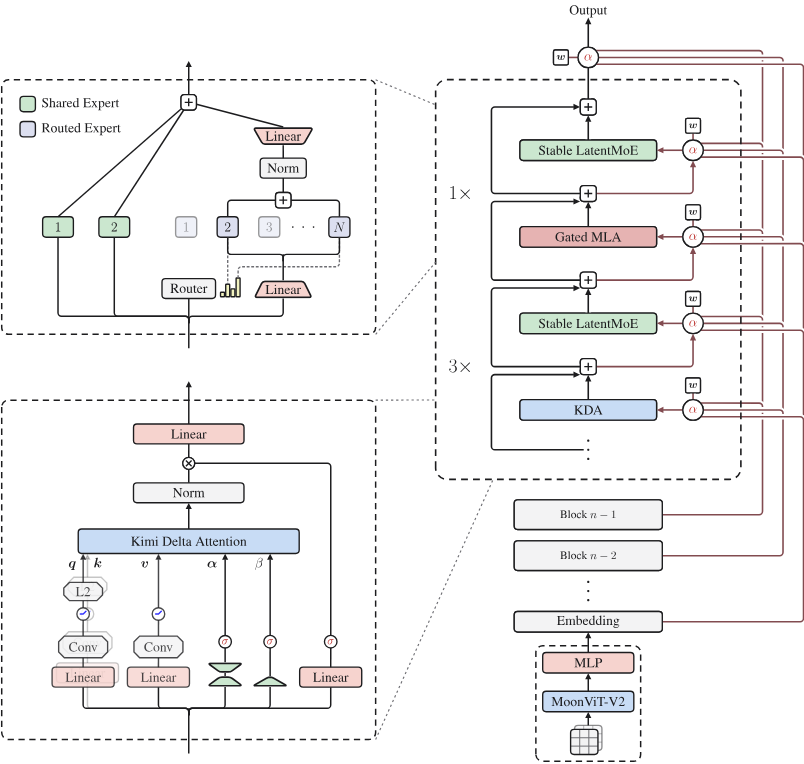

**図 2.** Kimi K3 アーキテクチャは、トークン、チャネル、レイヤーの混合を中心に構成され、入力にネイティブ ビジョン パスウェイを備えています。各ブロックには 3 つの Kimi Delta Attention(KDA) レイヤーとそれに続く 1 つの Gated MLA レイヤーが含まれており、各アテンション レイヤーは Stable LatentMoE フィードフォワード ネットワークとペアになっています。 Attention Residuals(AttnRes) は、学習された疑似クエリを使用して、埋め込みブロック出力と先行ブロック出力に対するアテンションの重みを導出し、深さ全体にわたる選択的な情報フローを可能にします。

### 2.1 ハイブリッド アテンション

Kimi K3 は、KDA [Tea25b] と Gated MLA を組み合わせた、リニア アテンションとグローバル アテンションのレイヤーワイズ ハイブリッドを使用します。各ブロックには 3 つの KDA レイヤーとそれに続く 1 つの Gated MLA レイヤーが含まれており、混合比は 3:1 になります。このパターンはバックボーン全体で繰り返されます。 2 つのアテンション メカニズムについては、以下で個別に説明します。追加の Gated MLA レイヤーがバックボーンの最後に配置され、最終レイヤーが常にグローバル アテンションを実行できるようにします。

#### 2.1.1 Kimi Delta Attention

KDA は、デルタ ルール反復 [Sch21、Yan25] をチャネルごとの忘却ゲート [Tea25b] で拡張します。一連の非表示状態 $\mathbf x_t\in\mathbb R^d$ を考えます。ここで、$t$ はトークンの位置をインデックスし、$d$ はモデルの非表示ディメンションです。明確にするために、最初に、クエリおよびキー ベクトル $\mathbf q_t,\mathbf k_t\in\mathbb R^{d_k}$、値ベクトル $\mathbf v_t\in\mathbb R^{d_v}$、およびリカレント状態 $\mathbf S_t\in\mathbb R^{d_k\times d_v}$ を含む単一のアテンション ヘッドについて説明します。 KDA は、デルタ ルールの更新前にチャネルごとの減衰を適用します。

$$
\mathbf S_t=(\mathbf I-\beta_t\mathbf k_t\mathbf k_t^\top)
\operatorname{Diag}(\boldsymbol\alpha_t)\mathbf S_{t-1}
+\beta_t\mathbf k_t\mathbf v_t^\top,
\qquad
\widetilde{\mathbf o}_t=\mathbf S_t^\top\mathbf q_t.
\tag{1}
$$

ここで、$\boldsymbol\alpha_t\in(0,1)^{d_k}$ はチャネルごとの 1 ステップ保持係数であり、$\beta_t\in(0,1)$ はデルタ ルール書き込み強度を制御します。

Kim Linear [Tea25b] に従って、KDA は頭当たりの量を次のようにパラメータ化します。

$$
\begin{aligned}
\mathbf q_t^h,\mathbf k_t^h
  &=\operatorname{L_2Norm}\!\left(\operatorname{Swish}\!\left(\operatorname{ShortConv}(\mathbf W_{q/k}^h\mathbf x_t)\right)\right)\in\mathbb R^{d_k},\\
\mathbf v_t^h
  &=\operatorname{Swish}\!\left(\operatorname{ShortConv}(\mathbf W_v^h\mathbf x_t)\right)\in\mathbb R^{d_v},\\
\beta_t^h&=\operatorname{Sigmoid}(\mathbf W_\beta^h\mathbf x_t)\in(0,1),\\
\mathbf z_t^h&=\mathbf W_\alpha^\uparrow\mathbf W_\alpha^\downarrow\mathbf x_t+\mathbf b_\alpha^h\in\mathbb R^{d_k}.
\end{aligned}
\tag{2}
$$

クエリ、キー、値の射影では ShortConv に続いて Swish [Yan25] が適用され、クエリとキーは $L_2$ 正規化 [Yan24b] でさらに正規化されます。低ランク投影とヘッド固有のバイアス $\mathbf b_\alpha^h\in\mathbb R^{d_k}$ は、キー チャネルごとにきめの細かい減衰ロジット $\mathbf z_t^h$ を生成します。 $\mathbf z_t^h$ から $\boldsymbol\alpha_t^h$ への下限マッピングは、以下のチャンク単位の定式化の後に導入されます。

**チャンクごとの並列形式。** キミ リニア [Tea25b] に従って、KDA はチャンク間で反復され、各チャンク内で並列になります。チャンク サイズ $C$ の場合、$\mathbf X_{[t]}$ は $\mathbf X\in\{\mathbf Q,\mathbf K,\mathbf V,\mathbf O,\mathbf U,\mathbf W\}$ の $t$ 番目のチャンクにトークン ベクトルをスタックします。行列 $\mathbf S_{[t]}\in\mathbb R^{d_k\times d_v}$ は、チャンク $t$ に入る反復状態を示します。位置 $1\le i\le j\le C$ の場合、チャネルごとの累積減衰を定義します

$$
\boldsymbol\gamma_{[t]}^{i\to j}:=\prod_{r=i}^{j}\boldsymbol\alpha_{[t]}^r,
\qquad
\boldsymbol\gamma_{[t]}^r:=\boldsymbol\gamma_{[t]}^{1\to r}.
\tag{3}
$$

Kim Linear と同様に、$\boldsymbol\Gamma_{[t]}^{1\to C}\in\mathbb R^{C\times d_k}$ は $\boldsymbol\gamma_{[t]}^1,\ldots,\boldsymbol\gamma_{[t]}^C$ を行方向にスタックします。 UT 変換は $\mathbf U_{[t]}$ および $\mathbf W_{[t]}$ を生成し、そこから擬似値項 $\widetilde{\mathbf V}_{[t]}:=\mathbf U_{[t]}-\mathbf W_{[t]}\mathbf S_{[t]}$ を定義します。受信状態 $\mathbf S_{[t]}$ を考慮すると、チャンク $t$ 内のすべての出力は次のように並列計算されます。

$$
\begin{aligned}
\mathbf A_{[t]}&=\operatorname{Tril}\!\left [
(\mathbf Q_{[t]}\odot\boldsymbol\Gamma_{[t]}^{1\to C})
(\mathbf K_{[t]}/\boldsymbol\Gamma_{[t]}^{1\to C})^\top\right],\\
\mathbf O_{[t]}&=
\underbrace{(\boldsymbol\Gamma_{[t]}^{1\to C}\odot\mathbf Q_{[t]})\mathbf S_{[t]}}_{\text{inter-chunk}}
+\underbrace{\mathbf A_{[t]}\widetilde{\mathbf V}_{[t]}}_{\text{intra-chunk}}.
\end{aligned}
\tag{4}
$$

行列 $\mathbf M$ の場合、$\operatorname{Tril}(\mathbf M)$ は厳密に上三角のエントリをすべて 0 に設定し、対角を含む下三角のエントリを保持します。このマスクはチャンク内で因果関係を強制し、現在のトークンの更新後に各出力が状態を読み取るため、対角線が保持されます。 $\mathbf O_{[t]}$ の最初の項は前のチャンクからの情報を伝えますが、2 番目の項は現在のチャンク内の相互作用を説明します。 UT 変換とチャンクワイズ形式の完全な導出については、「 Kim Linear [Tea25b]」を参照してください。

**下限減衰** 式 4 は、各チャンク内のキーを逆累積減衰 $1/\boldsymbol\Gamma_{[t]}^{1\to C}$ で再スケーリングします。 $\boldsymbol\Gamma_{[t]}^{1\to C}$ は $(0,1)$ の保持係数の積であるため、この逆数は無制限に増加し、有限精度 [Yan24a、Tea25b] でオーバーフローする可能性があります。 Kimi Linear は、対数空間の相対減衰を計算し、各チャンクを 2 番目の 16 トークン タイル [Yan24a、Tea25b] に分割することで、この数値範囲を制御します。非対角タイルは、Tensor コア上で直接密行列乗算を使用して計算できます。対照的に、対角タイルは依然として明示的な位置ペアの計算を必要とし、これが主なチャンク内のボトルネックのままです。 Kimi K3 は、減衰ログ $\mathbf z_t^h$ からステップごとのログ減衰 $\mathbf g_t^h$ へのマッピングを変更することで、このボトルネックに対処します。 GDN と Mamba-2 に続き、Kimi Linear はネガティブ Softplus マッピング $\mathbf g_t^h=-e^{A_h}\operatorname{Softplus}(\mathbf z_t^h)\in(-\infty,0)^{d_k}$ [Yan25、Dao24、Tea25b] を使用します。 Kimi K3 は代わりに、スケーリングされたシグモイドを使用して、下からの対数減衰を制限します。

$$
\mathbf g_t^h=g_{\min}\operatorname{Sigmoid}(e^{A_h}\mathbf z_t^h)\in(g_{\min},0)^{d_k},
\qquad
\boldsymbol\alpha_t^h=\exp(\mathbf g_t^h)\in(e^{g_{\min}},1)^{d_k}.
\tag{5}
$$

ここで、$A_h$ は学習可能な頭ごとの対数スケールであり、$g_{\min}=-5$ は固定です。 $A_h=0$ を初期化し、[Tea25b、Dao24、Yan25] に続いて各バイアス $\mathbf b_\alpha^h$ が初期化されます。 $g_{\min}=-5$ では、すべての保持係数が $\alpha_{t,j}^h>e^{-5}\approx6.7\times10^{-3}$ を満たし、16 トークン タイルにわたる累積対数減衰は $(-80,0)$ にあります。したがって、対応する逆数再スケーリング係数は $e^{80}$ よりも小さく、BF16 ダイナミック レンジ内に留まります。この有限範囲により、対角タイルと非対角タイルの両方で高密度の Tensor コア行列乗算を使用できるようになり、位置ペアの対角パスが排除されます。このパラメータ化は、以前の研究 [Qin24a、De24、Pen25] の下限再帰ゲートと密接に関連しています。[図 3](#figure-03) は、減衰パラメータ化の変化とその計算結果を示しています。

<span id="figure-03"></span>

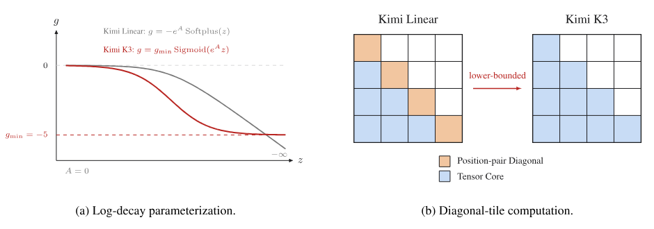

**図 3.** 下限減衰とそのチャンク単位の KDA 計算への影響。 Kim Linear は無制限の負の Softplus マッピングを使用しますが、Kimi K3 はスケーリングされたシグモイドで対数減衰を制限し、すべての因果タイルが高密度 Tensor コア行列乗算を使用できるようにします。

**フルランク ゲート。** 最後に、Kimi K3 は、KDA の出力ゲートを、 Kim Linear [Tea25b] で使用される低ランクのパラメータ化から入力依存のフルランク射影に変更します。ヘッドワイズ RMSNorm [Zha19] をリカレント出力に適用した後、KDA はデータ依存の出力ゲート [Qiu25] を適用します。

$$
\mathbf y_t=\mathbf W_o\!\left [\operatorname{Sigmoid}(\mathbf W_g\mathbf x_t)\odot
\operatorname{RMSNorm}(\widetilde{\mathbf o}_t)\right].
\tag{6}
$$

#### 2.1.2 Gated MLA

DeepSeek-V2 [Dee24] で導入されたマルチヘッド潜在アテンション (MLA) は、各トークンのキーと値の表現を低次元の潜在ベクトル $\mathbf c_t=\mathbf W_c\mathbf x_t$ に圧縮します。完全なヘッド固有のキーと値をキャッシュする代わりに、MLA は $\mathbf c_t$ をキャッシュし、アテンションの計算中に学習されたアップ投影を通じてコン​​テンツのキーと値を再構築します。この因数分解により、グローバルなトークン間の注意を維持しながら、KV キャッシュのフットプリントが削減されます。 MLA はその後、Kimi K2 および Kimi K2.5 [Tea25、Kim26a] によって採用され、Kimi K3 は定期的なグローバル アテンション レイヤーに保持します。

Kimi K2 および Kimi K2.5 とは異なり、Kimi K3 は Kim Linear [Tea25b] のハイブリッド設計に従い、位置エンコーディングなし (NoPE) をすべての MLA レイヤーに適用します。したがって、明示的な位置エンコーディングはクエリやキーに適用されません。介在する KDA レイヤーは位置に敏感で最新性を認識したシーケンス ミキシングを提供し、MLA レイヤーは無制限のグローバル コンテンツ インタラクションを提供します。この分離により、RoPE 周波数ベースの再調整や YaRN [Pen23] の適用など、コンテキスト長を拡張する際の位置エンコーディング パラメータの変更も回避されます。

さらに、Kimi K3 は、入力依存のチャネルごとのフルランク出力ゲートで MLA を強化します。 $\widetilde{\mathbf o}_t$ が、位置 $t$ のゲートされていない MLA 出力を表すものとします。ゲート出力は

$$
\mathbf y_t=\mathbf W_o\!\left [\operatorname{Sigmoid}(\mathbf W_g\mathbf x_t)\odot\widetilde{\mathbf o}_t\right].
\tag{7}
$$

ゲート プロジェクション $\mathbf W_g$ はフルランクで、Kimi K3 の KDA で使用される新しいパラメータ化と一致します。このゲートにより、各トークンがグローバル アテンション [Qiu25] から読み取られたチャネルを変調できるようになります。

フラッシュ アテンションで発生する偏った丸め誤差を修正するために、[Qiu26] の方法を採用し、トレーニング中にアテンションの出力を FP32 に保持します。この選択により、出力タイルのオンチップ フットプリントが 2 倍になります。したがって、クエリ タイルではなく KV ステージング バッファーとオーバーラップするようにトレーニング カーネルを再設計し、より深い KV パイプラインとより高いトレーニング スループットのために共有メモリを解放します。

### 2.2 Attention Residuals

標準の残りの接続 [He16] は、以前のすべての情報を深度にわたって単一の状態 $\mathbf h_l$ に圧縮します。これは、時間の経過とともに RNN を彷彿とさせるボトルネックになります。シーケンス モデリングの場合、Transformer は繰り返しを注意 [Bah14、Vas17] に置き換え、各位置がデータ依存の重みを使用して以前のすべての位置に選択的にアクセスできるようにしました。 Attention Residuals(AttnRes) [Tea26] は、同じ方法論を深度に適用します。各レイヤーは、表現を均一に蓄積するのではなく、先行するすべてのレイヤーから選択的に取得します。

#### フル Attention Residuals

各 layer $l$ に対し、layer 固有の学習可能な pseudo-query $\mathbf q_l=\mathbf w_l\in\mathbb R^d$ と key、value を定義します。

$$
\mathbf k_i=\mathbf v_i=
\begin{cases}
\mathbf h_1,&i=0,\\
f_i(\mathbf h_i),&1\le i\le l-1.
\end{cases}
\tag{8}
$$

ここで $f_i(\mathbf h_i)$ は layer $i$ の出力、$\mathbf h_1$ は token embedding です。attention weight は softmax kernel $\phi(\mathbf q,\mathbf k)=\exp(\mathbf q^\top\operatorname{RMSNorm}(\mathbf k))$ [Kat20、Zha19] に従い、RMSNorm によって出力の絶対値が大きい layer が weight を支配することを防ぎます。

$$
\alpha_{i\to l}=\frac{\phi(\mathbf q_l,\mathbf k_i)}
{\sum_{j=0}^{l-1}\phi(\mathbf q_l,\mathbf k_j)},
\qquad
\mathbf h_l=\sum_{i=0}^{l-1}\alpha_{i\to l}\mathbf v_i.
\tag{9}
$$

ネットワークの深さは控えめなので ($L<100$)、この完全形式の $O(L^2d)$ 演算は手頃な価格です。実際のオーバーヘッドは、$O(Ld)$ メモリと、すべてのレイヤー出力を維持するために必要なパイプライン並列処理でのクロスステージ通信です。

#### ブロック Attention Residuals

このオーバーヘッドを削減するために、$L$ レイヤーをそれぞれ $S=L/N$ レイヤーの $N$ ブロックに分割します。ブロック $n$(レイヤー インデックス $\mathcal B_n$) 内では、レイヤー出力は合計によって単一の表現 $\mathbf b_n=\sum_{j\in\mathcal B_n}f_j(\mathbf h_j)$ に縮小されます。$\mathbf b_n^i$ はブロックの最初の $i$ レイヤーの部分和を示します。トークンの埋め込みが常にソースとして含まれるように $\mathbf b_0=\mathbf h_1$ を設定します。ブロック全体にわたって、$N$ ブロックレベル表現のみに完全な注意が適用されます。ブロック $n$ 内の $i$ 番目のレイヤーの場合、値行列は次のようになります。

$$
\mathbf V=
\begin{cases}
[\mathbf b_0,\mathbf b_1,\ldots,\mathbf b_{n-1}]^\top,&i=1,\\
[\mathbf b_0,\mathbf b_1,\ldots,\mathbf b_{n-1},\mathbf b_n^{i-1}]^\top,&i\ge2.
\end{cases}
\tag{10}
$$

式 8 および 9 に従ってキーとアテンションの重みを使用します。その後、最終出力層はすべての $N$ ブロック表現を集約します。ブロック AttnRes では、メモリと通信のオーバーヘッドが $O(Ld)$ から $O(Nd)$ に低下しますが、このブロック構造は推論時間の状態も制限するため、並列ブロック間の結果をオンライン ソフトマックス [Mil18] を介して順次ブロック内部分和とより適切にマージできるようになり、推論時間のコストが大幅に削減されます。

経験的には、$N\approx8$ は、モデル スケール [Tea26] 全体で利点のほとんどを回復します。 Kimi K3 の場合、その層を 12 層ブロック サイズの 8 ブロックに分割し、埋め込み層をカウントすると部分的な最終ブロックと合計 9 ブロックが得られます。

### 2.3 Stable LatentMoE

エキスパート プールとアクティブなエキスパートの数の両方を増やすと、エキスパートの専門分野が拡大しますが、従来の MoE では、選択された各エキスパートが完全な $d$ 次元のトークン表現を受け取るため、ルーティングの多重度に応じて通信とエキスパートの重み付けのトラフィックが増加します。 LatentMoE [Fed22] は、モデルの全幅をルーティングされたエキスパートの幅から分離することで、この拡張を手頃な価格で実現します。共有エキスパートは一般的な変換用の全幅のパスを保持しますが、特化されたルーティングされたエキスパートは幅 $\ell$ のコンパクトな潜在スペースで動作します。これにより、Kimi K3 は、スパース度 56 に相当する、トークンごとに 16 人のアクティブなエキスパートを含む 896 人のルーティングされたエキスパートにチャネル ミキシングを拡張できます。

この極端な希薄性により、バニラ設計の 2 つの故障モードが増幅されます。まず、ルーテッド パスは、ゲート付きマルチブランチ エキスパート フィードフォワード ネットワークである $\mathbf W^\downarrow$ と、$\mathbf W^\uparrow$ をほぼ 4 つの連続する行列乗算のチェーンに構成します。この条件の悪い構造は、2.8 兆のパラメータ スケールと組み合わされて、配線されたブランチ内で爆発的な内部アクティベーションを生成します。第二に、ほぼ $10^3$ エキスパートの負荷のバランスをとることは、既存の補助損失のないバイアス更新が適切に動作し続ける体制を超えています。 Stable LatentMoE は、3 つのコンポーネントでこれら 2 つの障害モードに対処します。アッププロジェクション前の RMSNorm と、アクティベーション爆発を抑制する Sigmoid Tanh Unit GLU(SiTU-GLU)、およびロード バランシングのための Quantile Balancing(QB) です。

[図 2](#figure-02) に示すように、このレイヤーは、DeepSeekMoE [Dai24] の共有およびルーティングされたエキスパート組織に従います。 $\mathbf x\in\mathbb R^d$ の場合、共有エキスパートは $\mathbf x$ を直接処理しますが、ルーティングされたパスはそれを $\mathbf z=\mathbf W^\downarrow\mathbf x\in\mathbb R^\ell$ に投影し、$\mathbf z$ を選択したエキスパートにディスパッチし、重み付けされた集計を $\mathbb R^d$ から $\mathbf W^\uparrow$ にマッピングします。

$$
\mathbf u=\sum_{i\in\mathcal T_k(\mathbf x)}p_iE_i^{\mathrm{routed}}(\mathbf W^\downarrow\mathbf x),
\qquad
\mathbf y=\sum_{j=1}^{N_s}E_j^{\mathrm{shared}}(\mathbf x)
+\mathbf W^\uparrow\operatorname{RMSNorm}(\mathbf u).
\tag{11}
$$

ここで、$\mathbf u\in\mathbb R^\ell$ は集約されたルーティングされた表現、$E_j^{\mathrm{shared}}:\mathbb R^d\to\mathbb R^d$ および $E_i^{\mathrm{routed}}:\mathbb R^\ell\to\mathbb R^\ell$ は共有およびルーティングされたエキスパート フィードフォワード ネットワーク、$p_i$ は以下の Quantile Balancing ルールで定義されたルーターの重みです。 Kimi K3 は、各レイヤーの全角共有エキスパートの数を $N_s=2$ に固定します。

#### 2.3.1 Normalized LatentMoE

元の LatentMoE は、$\mathbf W^\uparrow$ を集約されたルーティング表現 $\mathbf u$ に直接適用します。そのスケールは、選択されたエキスパートとそのルーティングの重みによって異なります。式 11 に示すように、Kimi K3 は代わりに、エキスパート集計と上方投影の間に RMSNorm [Zha19] を挿入します。この正規化により、全幅共有ブランチと結合される前に、ルーティングされたブランチのスケール変動に対する感度が低下します。追加の RMSNorm はトレーニングを安定させるだけでなく、検証損失とダウンストリーム ベンチマークを一貫して改善します。

#### 2.3.2 Sigmoid Tanh Unit GLU

ゲート線形ユニット (GLU) は、シグモイド活性化ゲートを使用して線形値ブランチを変調し、$\operatorname{Sigmoid}(\mathbf W_g\mathbf x)\odot\mathbf W_u\mathbf x$ [Yan17] を計算します。 SwiGLU はシグモイド ゲートを $\operatorname{Swish}(x)=x\operatorname{Sigmoid}(x)$ に置き換え、Transformers [Sha20] で強力な経験的パフォーマンスを実現します。 SwiGLU はその後、大規模な言語モデルで広く採用される FFN 設計になりましたが、その経験的な有効性についての完全な説明は依然として未解決です。ただし、SwiGLU の乗算因子はどちらも制限がないため、大きな座標が一致するとアクティベーション外れ値が生成され、低精度の算術演算でオーバーフローのリスクが増加する可能性があります。元の GLU のシグモイド ゲートは、無制限のゲート成長を回避しますが、Swish のほぼ線形の正の領域を保持しません。これにより、SwiGLU の特徴的な局所的およびプラス側の応答を維持しながら、大きな値の増加を制御する活性化が促進されます。他の最近の取り組みでは、このトレードオフ [Jia26] の代替パラメーター化が検討されています。

これらの要件を満たすために、Sigmoid Tanh Unit GLU(SiTU-GLU) を提案します。 SiTU-GLU は、スムーズ キャップ $\operatorname{softcap}(x,\beta)=\beta\tanh(x/\beta)$ を Swish ゲートの線形係数に適用し、独立して up ブランチに適用します。

$$
\operatorname{SiTU\text{-}GLU}(\mathbf x)=
\beta_1\tanh(\mathbf W_g\mathbf x/\beta_1)
\odot\operatorname{Sigmoid}(\mathbf W_g\mathbf x)
\odot\beta_2\tanh(\mathbf W_u\mathbf x/\beta_2).
\tag{12}
$$

Kimi K3 の場合、ソフトキャップ ハイパーパラメータをゲート ブランチの場合は $\beta_1=4$、アップ ブランチの場合は $\beta_2=25$ に設定します。スケーリングされた正接正接は原点付近でほぼ線形であり、大きな値で境界があるため、SiTU-GLU は積の両方の要素を制御しながら SwiGLU のローカル応答を保存できます。[図 4](#figure-04) は、共通スライス上の GLU、SwiGLU、および SiTU-GLU の分岐定義とスカラー応答を比較しています。付録 B では、局所的な拡張、制限ケース、正式な出力限界、およびハード クランプとの比較を示します。

<span id="figure-04"></span>

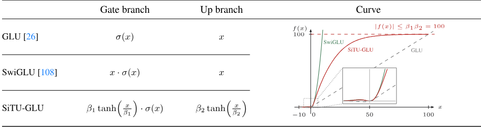

**図 4.** GLU、SwiGLU、および SiTU-GLU のゲート以降のブランチとそのスカラー応答。 SiTU-GLU は原点付近で SwiGLU に厳密に追従し、大きな正の入力では有界 $|f(x)|\le\beta_1\beta_2=100$ に近づきますが、SwiGLU は有界のままです。

#### 2.3.3 Quantile Balancing

補助損失ベースの配線 [Fen25] とは異なり、Kimi K3 は補助損失なしの配線 [Dee24a] を採用しています。負荷分散は、Top-$k$ の選択に使用されるルーター スコアにエキスパート固有のバイアス $b_j$ を追加することによって実装されます。トークン $\mathbf x_i$ の場合、ルーターは $\mathbf s_i=\operatorname{Sigmoid}(\mathbf W_r\mathbf x_i)$ を計算して適用します。

$$
\mathcal T_i=\operatorname{argtop}_k(\mathbf s_i+\mathbf b),
\qquad
p_{i,j}=\frac{s_{i,j}}{\sum_{r\in\mathcal T_i}s_{i,r}},\quad j\in\mathcal T_i.
\tag{13}
$$

$\mathbf b$ は $p_{i,j}$ から省略されているため、混合重みや勾配ベースのルーター最適化を変更せずにディスパッチを制御します。元のメソッドは、固定ステップ ルール [Dee24a] を使用して $\mathbf b$ を更新します。

$$
b_j^{(t+1)}=b_j^{(t)}+\gamma\operatorname{sign}(\ell-\ell_j^{(t)}),
$$

$\gamma$ は、負荷振動に対する適応の遅さをトレードオフします。 LatentMoE では、ルーティングされたエキスパート プールがレイヤーあたり 896 に増加するため、バランスのとれた負荷を維持することはさらに困難になります。ルーティングのバランスが崩れると、エキスパートと並列トレーニングの速度が低下し、一部のエキスパートの [Hua26] トレーニングが不十分になる可能性があります。

この制限に対処するために、ターゲット負荷 [Su26] に一致するルーター スコア分位値から各エキスパート バイアスを設定する Quantile Balancing(QB) を導入します。 Top-$k$ 選択を使用して $n$ エキスパートにルーティングされる $m$ トークンのトレーニング バッチを考えます。そのため、ターゲット負荷はエキスパートあたりの $q:=mk/n$ トークンになります。 QB は 1 回のフォワードパスから次のバイアスを導き出します。ルーティングは、偏ったスコア $\mathbf s_i+\mathbf b^{(t)}$ で Top-$k$ を Top-$(k+1)$ に置き換えます。最初の $k$ エントリは実際に使用されたルートですが、$(k+1)$ 番目のエントリは、エキスパートがトークン $i$ を入力するために超える必要があるカットオフ $\alpha_i^{(t)}$ です。トップ-$k$。

Top-$(k+1)$ ルーティングからカットオフを取得すると、別のトークン側分位数が回避されます。カットオフが固定されているため、候補バイアス $b_j^{(t+1)}$ の下でエキスパート $j$ にルーティングされるトークン数は次のようになります。

$$
\sum_{i=1}^{m}\mathbf 1\!\left [s_{i,j}+b_j^{(t+1)}>\alpha_i^{(t)}\right],
$$

これは、しきい値 $-b_j^{(t+1)}$ で単調減少します。同数がないと仮定すると、このカウントを $q$ に設定すると、$b_j^{(t+1)}$ が $(q+1)$ 番目に大きいマージン $s_{i,j}-\alpha_i^{(t)}$ になります。 $q/m=k/n$ 以降、これはトークン全体のマージンの $(1-k/n)$ 分位数であり、QB 更新が与えられます。

$$
\begin{aligned}
b_j^{(t+1)}&\leftarrow\operatorname{quantile}_{1-k/n}(\mathbf s_{:,j}-\boldsymbol\alpha^{(t)}),\\
\mathbf b^{(t+1)}&\leftarrow\mathbf b^{(t+1)}-\operatorname{mean}(\mathbf b^{(t+1)})\mathbf 1.
\end{aligned}
\tag{14}
$$

マージンは生のスコア $s_{i,j}$ からバイアスされたカットオフ $\alpha_i^{(t)}$ を減算するため、古いバイアスはカットオフを通じてのみ更新に入り、2 行目は Top-$k$ の選択を変更しないままにする共通のオフセットを削除します。因果関係により、更新は次のステップ [Dee24a] でのみ有効になります。つまり、バッチがそれ自体から派生したバイアスでルーティングされることはありません。[図 5](#figure-05) は、$m=8$、$n=4$、および $k=1$ のケースを示しています。各エキスパートはターゲット ロード $q=2$ を受け取ります。最終的なバイアスは推論時に固定されます。バランス割り当ての導出については、付録 C に記載されています。

<span id="figure-05"></span>

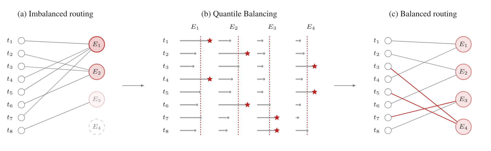

**図 5.** Quantile Balancing と $m=8$ トークン、$n=4$ ルーティングされたエキスパート、および $k=1$ トークンごとに選択されたエキスパート。エキスパート側のバイアス更新により、不均衡負荷 $(4,3,1,0)$ が平衡負荷 $(2,2,2,2)$ に変更されます。

#### ヒストグラム推定

スケールでは、式の分位数は次のようになります。 14 はグローバル バッチ全体に及び、そのマージンは数百万単位に達し、ランクや累積ステップ全体に分散しているため、正確な分位数でマージンを収集することはトレーニング時に実行できません。代わりに、マージンのヒストグラムから各エキスパートの分位数を読み取ります。単一の all-reduce でランクごとのビン数を合計し、プールされた数から分位数が復元されます。カウントは加算されるため、ヒストグラムはトークンのシャーディング方法に関係なく、プールされたグローバル バッチを表します。そのため、エキスパートあたりわずか数百ビンの通信コストで、推定値はビン幅までのバッチ全体の分位数を反映します。このヒストグラム推定器は、実際に使用する方法です。これとそのエラー範囲については、[§D](#d-histogram-based-quantile-estimation) で詳しく説明します。

### 2.4 ネイティブビジョン

Kimi K3 はネイティブにマルチモーダルです。テキスト、画像、ビデオは 1 つのコンテキスト内の単一の共有バックボーンによって処理され、事後のモダリティ調整段階はありません。この設計は、[§1](#_1-introduction) で説明されている長期的なビジョンインザループ動作のアーキテクチャ基盤です。レンダリングされた出力とそれを生成したコードは同じトークン ストリーム内に存在し、モデルはコードを記述し、結果のスクリーンショットやビデオ フレームを検査し、モデル間のハンドオフなしで視覚的なアーティファクト (ユーザー インターフェイス、グラフィックス、ビデオ) を反復的に改良できます。

#### MoonViT-V2

Kimi K2.5 からの主な違いは、Kimi K3 のビジョン エンコーダーである MoonViT-V2 を、次のトークン予測を使用して完全にゼロからトレーニングしていることです。 Kimi K2.5 自体を含む以前の実践では、事前トレーニングされた視覚知識がモデルに有利なスタートを与えるという前提の下で、SigLIP などの対照的に事前トレーニングされたモデルからビジョン エンコーダーを初期化します。私たちは主にトレーニングの安定性を目的として、この慣行から離れます。事前トレーニングされたエンコーダーが LLM に接続されると、ジョイントの最適化が不安定になります。SigLIP で初期化された MoonViT-3D は、頻繁なスパイクを伴う持続的に高い勾配ノルムを示しますが、MoonViT-V2 はトレーニングを通じて安定したままです ([図 6](#figure-06))。また、ネクストトークン予測を使用したトレーニングでは、きめの細かいテキストや構造的な手がかりよりもグローバルなセマンティクスを優先する対照的な損失ではなく、言語モデリングの目的によってエンコーダーの表現を直接形成することもできます。特に、MoonViT-V2 が視覚評価全体で SigLIP で初期化されたベースラインと一致していることがわかり、大規模なマルチモーダル言語モデルの初期化として対照的な事前トレーニングが不要であることが示されています。

<span id="figure-06"></span>

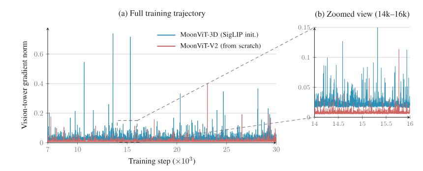

**図 6.** トレーニング前アブレーションにおけるビジョンタワー勾配ノルム。 SigLIP で初期化された MoonViT-3D と比較して、スクラッチからの MoonViT-V2 はスパイクが少なく、より低い勾配ノルムを維持しており、より安定した最適化を示しています。

**Architecture.** このトレーニング レシピは、Kimi K2.5 [Kim26a、Tea25a] の全体的な設計に従うビジョン パスウェイに基づいて構築されています。視覚入力は、最初に MoonViT-V2 によってエンコードされ、次に軽量の MLP プロジェクターによって LLM にマッピングされます。 MoonViT-V2 は、約 0.4B パラメータを備えた 27 層のビジョン トランスフォーマーであり、RMSNorm を採用し、線形およびアテンション投影からすべてのバイアス項を除去します。これは、上記の最初からの最適化をさらに安定させる設計です。 MoonViT-3D と同様に、画像とビデオは完全に共有されたパラメータで処理されます。注目はフレーム内の空間パスとフレーム間の時間パスに分解され、時間プールにより時間次元に沿ってトークンがさらに圧縮されます。投影前に、$2\times2$ ダウンサンプリングを使用したピクセル シャッフル操作によりビジュアル トークンの数が 4 分の 1 に削減され、1M トークンのコンテキスト内で最大 $3584\times3584$ ピクセルの入力を手頃な価格に保ちます。

### 2.5 Per-Head Muon

Kimi K2 に続き、Kimi K3 はマトリックス パラメーターのオプティマイザーとして Muon [Kel24] を採用します。アテンション投影については、それをヘッドごとのバリアントにさらに改良します。完全な $\mathbf Q$、$\mathbf K$、および $\mathbf V$ 投影行列にニュートン シュルツ直交化を適用する代わりに、それらの運動量行列をヘッドの次元に沿って分割し、各ヘッドのブロックを個別に直交化します。直観的には、完全行列直交化ではすべてのヘッドが単一の結合ブロックとして扱われるため、より大きな勾配または運動量スケールを持つヘッドが共有更新方向を支配し、一方、より小さなスケールのヘッドは不十分に正規化された更新を受け取ります。ヘッドごとの直交化により、ヘッド全体の更新スケールが均等化されます。実際には、この設計により、頭全体でよりバランスの取れた学習ダイナミクスが得られ、大規模なトレーニングの安定性が向上します。また、ヘッドごとの背の高いブロックでのニュートン・シュルツ反復の方が完全な射影行列での場合よりも安価になるため、オプティマイザーのオーバーヘッドもわずかに軽減されます。

## 3 事前トレーニング

### 3.1 事前トレーニングデータ

Kimi K3 は、大規模なビジョン コーパスとともに、Web テキスト、コード、数学、知識の 4 つの主要なテキスト ドメインにわたる厳選されたコーパスで事前トレーニングされています。ビジョン データには、キャプション、インターリーブされた画像とテキストのドキュメント、OCR、知覚、ビデオ、およびビジュアル コーディング データが含まれます。当社のデータ パイプラインは、Kimi K2 [Tea25] 用に開発され、Kimi K2.5 [Kim26a] で洗練されたものに基づいて構築されています。

**Text data.** 各ドメインは、ルールベースのヒューリスティック、分類子ベースの品質スコアリング、および重複排除の組み合わせによってフィルタリングされます。また、より小規模なモデルでのアブレーション研究によって決定されたドメイン固有のサンプリング レートが使用されます。 Kimi K2 [Tea25] の言い換えレシピに従って、スタイルと視点の多様なプロンプト、チャンク単位の自己回帰生成、およびソース文書に対する忠実性検証を使用して、知識と数学のコーパスを言い換えます。

#### 視覚データ

ビジョン コーパスは、Kimi K2.5 [Kim26a] の分類に従い、オープンソースのコレクションとフィルタリング、合成、および重複排除のための社内パイプラインを組み合わせています。トレーニング中、座標監視は絶対形式と正規化 ($[0,1]$) 形式の両方で提供され、正確で解像度に強い位置特定が可能になります。従来のテキストキャプション付き画像に加えて、プログラムによるマルチモーダル データを大幅にスケールアップし、コード スニペットと、SVG、3D アセット、Web ページ、ゲーム、CAD 回路図などのドメイン固有の形式でレンダリングされたビジュアルを結合します。

### 3.2 スケーリング則

まとめると、前のセクションで説明したアーキテクチャ、データ、トレーニングの改善により、新しいモデル ファミリが定義されます。これらの変更により最適なトレーニング体制も変更されるため、バッチ サイズ、学習率、パラメーターあたりのトークン数の比率 (TPP)、モデルの形状などの主要なハイパーパラメーターを再調整するための専用のスケーリング則研究を実施します。保持されている OOD 検証データに基づいて評価した[図 7](#figure-07) のスケーリング則曲線は、これらの改善により全体的なスケーリング効率が Kimi K2 よりも約 $2.5\times$ 向上していることを示しています。[表 1](#table-01) は、Kimi K2 と Kimi K3 のアーキテクチャの詳細な比較を示し、この改善に寄与する構造の変更を強調しています。

<span id="figure-07"></span>

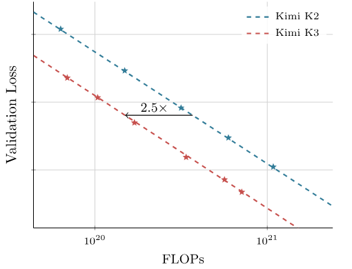

**図 7.** Kimi K2 および Kimi K3 に適合したスケーリング則曲線。 Kimi K3 は、Kimi K2 よりもスケーリング効率において $2.5\times$ の向上を実現します。

<span id="table-01"></span>

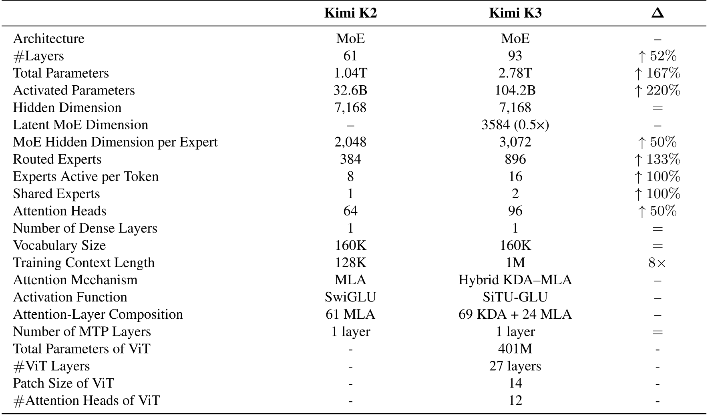

**表 1.** Kimi K2 と Kimi K3 のアーキテクチャの比較。

私たちのスケーリング則の研究では、一貫してウォームアップ安定減衰 (WSD) [Hu24] よりもコサイン減衰が優先され、デフォルトの学習率スケジュールとしてコサイン減衰を採用することになりました。一定の最小学習率の下でコサイン減衰と WSD を比較します。これまでの研究では、WSD がコサイン減衰に匹敵するか、それを上回るパフォーマンスを発揮できることが報告されていますが、2 つのスケジュールが著しく異なる最適なハイパーパラメーターを示していることが観察されています。同じモデル サイズとトレーニング トークン予算の下でも、最適なピーク学習率とバッチ サイズは大幅に異なります。その結果、共有のハイパーパラメータ セットを使用して 2 つのスケジュールを比較すると、単にそれらのハイパーパラメータがより適切に調整されているという理由で一方が不当に有利になる可能性があります。公平な比較を確保するために、スケジュールごとに独立したスケーリング則検索を実行します。それぞれの最適なハイパーパラメータ設定の下では、コサイン減衰は WSD よりも一貫して低い最終損失を達成します。

### 3.3 トレーニングレシピ

Kimi K3 は、ポストホック調整ステージを通じて事前トレーニングされた言語モデルにビジョン エンコーダーを移植するのではなく、トレーニングの開始時から言語と視覚が共同で最適化されるネイティブ マルチモーダル トレーニング戦略を採用しています。このパラダイムの下では、ビジュアル トークンとテキスト トークンが単一の次トークン予測目標内でインターリーブされ、共有バックボーンが最初から統合されたマルチモーダル表現を学習できるようになります。

QB を採用しながら、Per-Head Muon オプティマイザー ([§2.5](#_2-5-per-head-muon)) と Kimi K2 で導入されたウェイト クリッピング メカニズムを使用してモデルを最適化します。 ([§2.3.3](#_2-3-3-quantile-balancing)) MoE ロード バランシング用。 1% の線形ウォームアップを伴うコサイン学習率スケジュールを使用します。ウェイト減衰は全体を通して 0.1 に設定されます。

事前トレーニングは 8,000 トークンのコンテキスト長で始まり、その後のトレーニング フェーズで 64,000 トークンに拡張されます。

### 3.4 ロングコンテキストの拡張

**位置エンコーディング。** Kimi K3 は、明示的な位置埋め込み (NoPE) を使用せず、代わりに、KDA のリカレント ゲートおよび減衰メカニズムを通じて位置情報を暗黙的にエンコードします。その結果、モデルは、RoPE の再スケーリングや補間 [Pen23] などの位置エンコーディングの変更を行わずに、1M トークンのコンテキストを直接外挿します。

**長いコンテキスト データ。** 自然ソースからの長いドキュメントとビデオには、ほぼ重複したもの、バイナリ BLOB、切り詰められたファイル、ビデオ クリップ、機械で生成された無効なログなど、大量の低品質のコンテンツが含まれています。したがって、正確な重複排除とあいまいな重複排除を組み合わせた専用のクリーニング パイプラインを通じてそれらを処理し、ビデオのフレームに対する知覚的ハッシュと、ヒューリスティックおよび分類器ベースの品質フィルタリング、および構造検証を組み合わせます。本当に長くて一貫性のあるドキュメントやビデオは短いテキストに比べて少ないため、クールダウン中に長いコンテキストの配信が短いシーケンスによって圧倒されないように、それらをアップサンプリングします。しかし、長さだけでは長距離能力が得られません。これに対処するために、マルチモーダルなドキュメントとサブタスクを慎重に並べ替えて連結することで、追加の長いコンテキスト データを合成します。これにより、完全な 1M トークン コンテキスト全体に散在する情報に注意することによってのみ埋め込みタスクを解決できるようになります。これにより、意図した規模で注意メカニズムが訓練され、それが局所的なパターンに変質するのを防ぎます。

**プログレッシブ コンテキスト拡張。** Kimi K3 は、最大 100 万トークンのコンテキスト ウィンドウをサポートします。これは、4 段階のカリキュラムに従い、トレーニングの進行に応じてコンテキスト ウィンドウを段階的に拡張することで実現します。このウィンドウは、事前トレーニング中に 8,000 トークンから 64,000 トークンに増加し、クールダウン フェーズでは 256,000 トークンから 100 万トークンに増加します。コストのかかる長期シーケンスの計算をトレーニング予算全体のごく一部に集中させることで、カリキュラムを経済的に保ちながら、ますます長距離化する依存関係にモデルを徐々に適応させることができます。 KDA レイヤーで 100 万トークンのトレーニングを扱いやすくするシーケンス次元分割については、[§5.1.2](#_5-1-2-kda-context-parallelism) で説明されています。

## 4 事後学習

### 4.1 方法

トレーニング後のパイプラインは 3 段階のパラダイムに従っています。教師あり微調整 (SFT) によるベースライン エージェント機能の初期化、強化学習 (RL) によるさまざまな推論努力における専門ドメイン エキスパートの開発、および複数教師によるポリシー蒸留 (MOPD) を使用したこれらのドメイン固有のポリシーの単一モデルへの統合です。

#### 4.1.1 教師ありファインチューニング

SFT ステージでは、後続の RL ステージのための高品質のコールド スタート ポリシーを確立します。以前の Kim モデル [Tea25、Kim26a] の SFT パイプラインを基盤として、Kimi K3 の SFT データセットを拡張し、複雑なエージェント タスクのカバー範囲を大幅に拡大しました。具体的には、以前の Kim シリーズのドメインに特化したモデルを使用してデータの軌跡を合成し、その後、多段階の検証と人間参加型のアノテーションを行います。これらの複雑なエージェントの軌跡を一貫して表現するために、XTML ベースのチャット テンプレート (eXtensible Token Markup Language、詳細については [§F](#f-chat-template) を参照) を使用してすべてのデータをシリアル化します。これらの手順をまとめると、Kimi K3 に適応推論、正確なツール呼び出し、長期的なエージェント シナリオでの堅牢な実行を提供する大規模な命令データセットが生成されます。さらに、MXFP4 重みと MXFP8 アクティベーションを使用して、SFT 段階以降から量子化対応トレーニング (QAT) を適用します ([§4.1.4](#_4-1-4-deployment-aware-post-training))。

#### 4.1.2 強化学習

<span id="figure-08"></span>

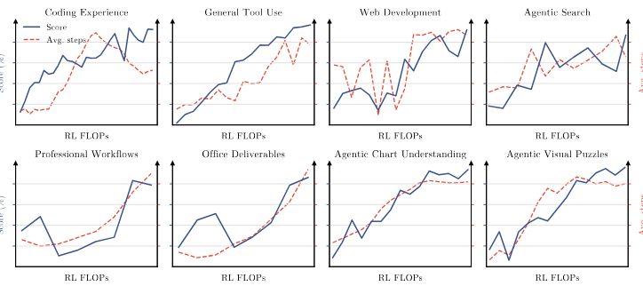

**図 8.** 強化学習中の公的評価と社内評価にわたるアシスタント ステップのスコアと平均。 RL FLOP をスケーリングすると、ツール呼び出しステップが一貫して増加し、全体的な機能が向上します。

SFT は強固なコールド スタート基盤を提供しますが、RL は高次の推論機能と実行機能を解放するために重要です。個々のタスクに特化した RL モデルをトレーニングするのではなく、RL を 3 つの広範なドメインにわたって拡張し、それぞれが幅広いサブタスクを包含し、各ドメインのあらゆる推論努力レベルで 1 人の専門家をトレーニングします。 (ii) 長期にわたるアシスタント業務、詳細な調査、および段落レベルの執筆に及ぶ一般的なエージェント。 (iii) ソフトウェア エンジニアリング (SWE)、コーディング経験、カーネル タスク、および Web 開発を含むコーディング エージェント。[図 8](#figure-08) に示すように、RL FLOP をスケーリングすると、知識、推論、ビジョン、一般エージェント、コーディングにわたるさまざまな機能が一貫して向上します。 $\{\mathrm{low},\mathrm{high},\mathrm{max}\}$ でこれら 3 つのドメイン エキスパートと 3 つの推論労力レベルを組み合わせると、9 つのエキスパート モデルが得られます。

**アルゴリズム。** 長期タスクで深刻になる long-tail latency を抑えるため、同期 RL framework [Sca25、Kim26a] の partial rollout 方式を拡張します。各 iteration の rollout phase では、$N$ 個の prompt ごとに $K$ 個の completion を sample し、$N\times K$ 本の trajectory を active workload として維持します。全 rollout の終了を待たず、trajectory のうち $\lambda\in(0,1)$、すなわち $\lambda NK$ 本が完了した時点で生成 phase を一時停止するため、遅い実行を待たずに policy optimization へ進めます。一時停止した rollout は queue に入れ、sandbox 基盤（[§5.3.2](#_5-3-2-sandbox-infrastructure)）を利用して次の iteration の冒頭で優先的に再開します。一つの prompt に対する $K$ 個の response がすべて完了すると、Kimi K2.5 [Kim26a] のアルゴリズムに従って直ちに policy optimization へ送ります。この方式では一つの長期 trajectory が複数 iteration にまたがり、data staleness が学習の安定性を脅かしますが、per-token regularization により極端な off-policy 状態にも耐えられます。policy update を局所的な近傍へ制限することで、古い data を安定して扱い、学習を維持します。

**推論の労力 RL.** トークンの効率を最大化しながら推論の労力を微調整するために、RL [Kim26a] 中に問題ごとの予算管理メカニズムを実装します。各問題 $x$ をコールド スタート モデルから推定された初期トークン バジェット $b_0(x)$ に関連付け、総トークン バジェット $T(y)$ がスケーリングされたしきい値 $\tau b_0(x)$ を超える軌道については、タスク報酬を $-1$ でオーバーライドします。一般タスクの場合、$T(y)$ は思考トークンの数を測定しますが、エージェント タスクの場合、$T(y)$ は推論トレースとツール呼び出し引数の両方を含む累積出力トークンを考慮します。トレーニングは、予算乗数 $\tau$ に応じた段階的なカリキュラムに従います。まず、比較的大きな $\tau$ を使用して最大予算のバリアントをトレーニングしますが、過度の考え過ぎを抑制するために最大予算に制限を設けます。次に、$\tau$ をより小さい値にアニールして、労力の高いエキスパート モデルと労力の少ないエキスパート モデルを取得します。 $\tau$ の調整は、人間参加型のガイダンスに従ってドメインごとに構成されます。結果として得られるすべての推論レベルの専門家によって生成された軌跡は、教師付き微調整と複数の教師によるポリシーの蒸留のために共同で収集されます。

#### エージェント生成型報酬モデル

検証不可能な一般タスクについては、エージェント生成報酬モデル (GRM) を採用し、Kimi K2.5 [Tea25、Kim26a] のようなバイナリ比較によるトーナメント スタイルのグループ報酬を保持します。強化された判断のための一般的なエージェント機能を超えて、エージェント裁判官は次の必須プロトコルに従う必要があります。(1) 結果、結果、またはテキスト出力を読み取る。 (2) ルーブリックを作成します。 (3) ルーブリックに照らして各候補者を採点します。 (4) ルーブリックに割り当てられたスコアをスコアパッドに記録します。ますます冗長な出力への報酬ハッキングを軽減するために、上記の推論労力制御と同様の予算ベースの冗長制御を適用します。コールド スタート モデルから推定された初期冗長度 $\ell_0$ と乗数 $\sigma$ が与えられると、出力の長さが $\sigma\ell_0$ を超える候補はバイナリ比較で自動的に失われます。

#### 4.1.3 マルチティーチャー・オンポリシー蒸留

私たちは、Multi-Teacher On-Policy Distillation (MOPD) を採用して、さまざまな推論の取り組みにわたるこれらのドメインに特化した機能を統合モデル [Lu25、Xia26、Dee26] に統合します。トレーニング中、特定のドメイン $d$ およびサンプリングされた推論労力レベル $e\in\{\mathrm{low},\mathrm{high},\mathrm{max}\}$ について、9 人の専門家の間で対応する教師モデル $\pi_{\mathrm{teacher}}^{(d,e)}$ によって最適化がガイドされます。入力クエリ $x$ とプレフィックス レスポンス $y_{<t}$ を指定すると、$y_t$ で評価されるトークンごとのポリシー蒸留報酬は次のようになります。

$$
r_{\mathrm{opd}}^d(y_t\mid e,x,y_{<t})=
\operatorname{clip}\!\left(
\operatorname{sg}\!\left [
\log\frac{\pi_{\mathrm{teacher}}^{(d,e)}(y_t\mid x,y_{<t})}
{\pi_\theta(y_t\mid e,x,y_{<t})}
\right],-R_{\max},R_{\max}\right).
\tag{15}
$$

ここで、$\operatorname{sg}(\cdot)$ は停止勾配演算子を表し、$R_{\max}>0$ は極度のアドバンテージ信号を制限するクリッピングしきい値であり、これにより RL トレーニングが安定します。この高密度の報酬シグナルは RL フレームワークにシームレスに統合され、長期的なタスクの部分的なロールアウト トレーニングなどのインフラストラクチャ レベルの最適化が自然に可能になります。よりきめの細かい Top-$k$ 蒸留目標でも実験しましたが、この設定では収束速度や最終パフォーマンスのいずれにおいても明らかな利点は観察されませんでした。

#### 4.1.4 デプロイを考慮した事後学習

#### MXFP4 量子化を考慮した事後学習

導入時のメモリ フットプリントとサービス コストを削減するために、モデルのパラメータ メモリの大部分を占める MoE エキスパートの重みを MXFP4 [Dar23] に量子化し、MXFP8 で計算されたアクティベーションを使用します。一方、すべての非エキスパート コンポーネント (注意予測、潜在 MoE 予測、共有エキスパート、MoE ルーター) は高精度のままです。量子化対応トレーニング (QAT) [Ben18] をトレーニング後の段階全体で実行し、SFT と RL の両方をカバーして、モデルが量子化による精度損失に適応できるようにします。 RL の間、ロールアウトとトレーニングは同じ量子化スキームを共有するため、トレーニングと推論の不一致が排除されます。

**ドラフト モデルの微調整.** 推論効率の最適化は、複雑で長期的なエージェント モデルを提供するために重要です。 Kimi K3 は、バックボーン ブロックの構造を反映するマルチトークン予測 (MTP) レイヤーを使用して事前トレーニングされています。 EAGLE-3 [Li25] のドラフト モデルは、構造が MTP レイヤーと一致する単一のデコーダー レイヤーで構成されているため、事前トレーニングされた MTP レイヤーを EAGLE-3 スタイルのドラフト モデルに微調整します。ターゲット モデルはフリーズされ、ドラフト レイヤーとその機能融合投影のみが更新されます。 EAGLE-3 のトレーニング時テスト プロトコルに従って、ドラフトはトレーニング中に 7 つのステップに展開されます。最初のステップを超えると、最新の位置のターゲット側の機能が利用できなくなり、ドラフトは以前のステップからの独自の出力を消費し、推論時に繰り返されるドラフト手順を反映します。

ドラフト入力は、それぞれ 1 番目、4 番目、および最後の AttnRes ブロックの出力から取得された、ターゲット モデルの低レベル、中レベル、および高レベルの機能を融合します ([§2.2](#_2-2-attention-residuals))。これらの特徴は連結され、$[\,\mathbf 0\;\mathbf 0\;\mathbf I\,]$ として初期化されるバイアスのない行列 $\mathbf W_{\mathrm{E3}}$ によって隠れたサイズに投影されます。これにより、融合表現は最初に高レベルの特徴 $\mathbf h^h$(MTP 層が事前トレーニングされた入力) と一致し、微調整中に低レベルおよび中レベルの特徴を組み込むことを徐々に学習します。

投機的デコードの高速化は、ロスレス投機的サンプリングにおけるトークンごとの受け入れ率 $\sum_{x\in\mathcal V}\min(p(x),q(x))$ によって制御されます。ここで、$p$ および $q$ は、ターゲット モデルとドラフト モデルの次のトークンの分布を示します。従来の KL 発散サロゲートを最小化しても、容量が制限されたドラフト モデルのこのレートを最大化することは保証されないため、許容率自体の負の対数である尤度ベースの LK 損失 [Sam26] を直接最適化します。

$$
\mathcal L_{\mathrm{LK}}=-\log\sum_{x\in\mathcal V}\min(p(x),q(x)).
\tag{16}
$$

$p$ および $q$ は温度 1 で評価され、補助グラウンド トゥルース ク​​ロス エントロピー項はありません。ドラフトの微調整はトレーニング後の QAT 構成 ([§4.1.4](#_4-1-4-deployment-aware-post-training)) に従い、MoE エキスパートの重みは MXFP4 で、その入力アクティベーションは MXFP8 で行われますが、非エキスパート モジュールは高精度のままです。

### 4.2 RL タスクの合成とエージェント環境

RL フレームワークの有効性は、豊富で多様性があり、堅牢に検証可能な環境に大きく依存しています。長期にわたる複雑なタスクにわたるスケーラブルなトレーニングをサポートするために、一連の特殊なホワイトボックス環境とタスク合成パラダイムを設計します。

#### 4.2.1 統合ホワイトボックス RL 環境

単一の固定エージェント ハーネスを使用したトレーニングでは、モデルが特定のツール スキーマ、システム プロンプト、コンテキスト管理メカニズム、または対話プロトコルに過剰適合する可能性があります。これに対処するために、ツール インターフェイス、システム プロンプト、コンテキスト管理戦略、スキル、メモリ、サブエージェント、その他のコンポーネントを含む、構成可能で構成可能なモジュールのコレクションとしてエージェント ハーネスを表す統合ホワイトボックス RL 環境を開発します。構成を通じてこれらのモジュールを構成すると、環境では、Kimi Code [Kim26]、Claude Code [Cod26]、Codex [Cod26a]、OpenClaw [Ope26a]、Hermes [Age26b] などの主流ハーネスや、まったく新しいハーネスをインスタンス化できます。 RL トレーニング中に、さまざまなタスク グループに対してさまざまなハーネス構成を動的に構築し、単一のハーネスの規則ではなく、これらのモジュールの多様な組み合わせに Kimi K3 を公開します。同じ抽象化により、さまざまなタスク ドメインにわたる RL も容易にサポートされ、より汎用的なエージェントをトレーニングするためのスケーラブルな基盤が提供されます。

#### 4.2.2 ナレッジグラフに基づくタスクの合成

**動機と概要.** トレーニング後のタスクの質と多様性は、主にソース資料によって決まります。きめの細かい概念に基づいた検索により、専門的で過小評価されている知識が明らかになり、多様な概念にわたるサンプリングにより対象領域が広がります。粒度とカバレッジの両方を大規模に制御するために、自己進化する階層的に組織化されたナレッジ グラフを構築し、エージェントが知識集約型ドメインやコーディング ドメインにわたる Web スケールの探索を通じて継続的に拡張します。[図 9](#figure-09) は、タスク合成パイプラインを示しています。階層的に構成されたナレッジ グラフは、広範な領域から詳細な概念に至るまで、複数のレベルで概念を表します。関連するノードがサンプリングされて、公開されているソース素材の検索をガイドするキーワード セットが形成されます。合成インスタンスごとに、システムはタスク タイプを選択し、取得したマテリアルを使用して対応するタスクを合成します。

<span id="figure-09"></span>

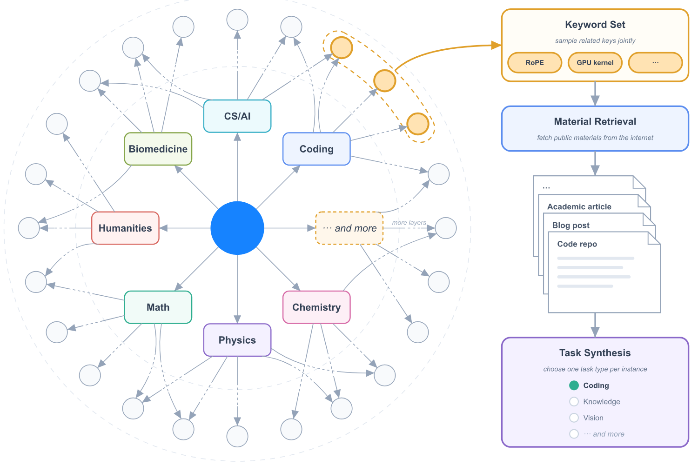

**図 9.** ナレッジ グラフに基づくタスクの合成。階層概念グラフ内の関連ノードは、ソースの検索とさまざまなタスクの統合をガイドします。

#### エージェントナレッジグラフ構築

再帰的なエージェント駆動の拡張を通じて、有向非巡回グラフとしてナレッジ グラフを構築します。拡張プロセスは、事前定義された粗粒シード ノードのセットから始まります。次に、エージェント インスタンスが各ノードに割り当てられ、複数の Web 検索を実行して、対応する概念を調査します。新しいノードを追加する前に、エージェントは既存のグラフを調査して同等または関連する概念を特定し、必要に応じて既存のノードを再利用し、重複を最小限に抑えます。エッジは、エージェントがどのエンドポイントを最初に検出したかに関係なく、常に粗い概念からより細かい概念に向けられます。新しく追加されたノードは、その後、さらなる探索のためにエージェントに割り当てられます。割り当てられたエージェントが現在の概念が十分にアトミックであると判断すると、ブランチの展開が停止します。

#### 資料の検索とタスクの合成

ドメインおよびタスク タイプ全体で目的の分散をターゲットにするために、システムは、個別に、または関連する組み合わせで、さまざまな粒度レベルでノードをサンプリングします。サンプリングされたノードから得られたキーワードは、ナレッジ グラフ内のそれらの先祖からのコンテキスト情報と組み合わされて、Web クエリを作成します。取得された現実世界のマテリアルは、合成エージェントがさまざまなタスク タイプのトレーニング タスクを生成できるように組み立てられます。

#### 4.2.3 エージェント環境における検証可能な問題

エージェント環境で検証可能な問題について Kimi K3 をトレーニングします。代表的な例には、モデルが調査を計画し、Web から段階的に証拠を収集し、検証可能な答えを生成する、複数ステップの複雑な情報検索が含まれます。投資銀行業務、データ分析、法律実務など、専門家の実際の日常業務。モデルが複雑なリクエストを分解し、サンドボックスでドメイン ツールを操作し、数十から数百のステップを経て成果物を完成させます。 STEM 問題、視覚的なパズル、チャートの理解に関するマルチステップの検証可能な視覚的推論。各視覚推論軌跡は、分離されたサンドボックス内の Python インタプリタを備えたエージェント環境で生成されます。モデルは、入力画像のトリミング、ズーム、または変換、正確な計算の実行、または中間結果の検証を行うコードを繰り返し記述して実行し、生成された画像を含む実行出力を、複数のインタラクション ステップにわたる新しい観察として受け取ります。モデルがより多くの画像操作を実行し、より多くの観察を収集することを学習するにつれて、複雑な視覚的推論タスクのパフォーマンスが着実に向上します。

#### 4.2.4 カーネル最適化タスク

Kimi K3 の GPU カーネル最適化機能を強化するために、Flash Linear Attendance [Yan24] などの高品質な GitHub リポジトリをソースとして、シングル オペレーター カーネルから融合メガ カーネルに至るまで、大規模なカーネル タスク スイートを構築します。このスイートは、CUDA、Triton、CuTe DSL、Gluon、ThunderKittens [Ben25]、TileLang [Wan25] などの多様な GPU プログラミング アプローチにまたがっており、BF16、FP8、FP4 などの広く使用されている GPU アーキテクチャと数値形式をカバーしています。報酬は正確さとパフォーマンスの両方を評価します。各カーネルは PyTorch リファレンス実装を提供し、事前定義された数値エラーしきい値を超えるソリューションには報酬がゼロになります。パフォーマンスはエキスパートの実装に対してスコア付けされ、一致すると報酬が 0.5 になり、ハードウェアのルーフラインに近づくと報酬が 1 に向かって増加します。報酬が真の最適化を確実に反映するように、CUDA グラフのリプレイ、入力キャッシュ、精度削減などの報酬ハッキング戦略にペナルティを与えるハッキング検出システムを開発し、Kimi K3 の開発中に新しいハッキング戦略が観察されると、新しい安全策でシステムを継続的に拡張します。

#### 4.2.5 パーソナルアシスタントのタスク

長期的なパーソナル アシスタントのタスクのために、Gmail、Notion、Slack、Canvas など、広く使用されているアプリケーションの現実的なモック実装を開発します。これらは、現実世界の対応物のコア セマンティクスを維持しながら、外部 API やレート制限なしで再現可能な大規模なインタラクションを可能にします。これらの模擬アプリケーションに基づいて、人事、法律サービス、財務などのシナリオにおける現実のプロフェッショナルのワークフローからインスピレーションを得た複雑なタスクを設計します。各タスクでは、エージェントはシミュレートされた複数日にわたって永続的で進化する環境で動作し、アプリケーション全体に分散された相互依存する多数のイベントに遭遇します。 1 つのロールアウトには、最大数千のツール呼び出しと数百万のコンテキスト トークンが含まれる場合があります。各イベントには独自の評価基準があり、決定論的ルールまたは LLM ベースのエバリュエーターによって評価されます。初期ワークスペースは、Web 上で参考資料を自律的に検索し、それらを一貫したタスク関連の環境に変換するエージェントによって構築されます。また、そのような生活環境をサポートするために RL フレームワークを拡張し、複雑なイベント ストリームと誘発される世界状態の遷移をモデル化します。

#### 4.2.6 自律実行タスク

Verify-in-the-Loop の最適化を通じて長期的なエージェント インテリジェンスをトレーニングする環境パラダイムである Autonomous Execution Tasks (AET) を紹介します。各タスクは、初期状態、制約された目標、ツールベースのアクションスペース、実行予算、および独立した検証者を指定します。エージェントは、参照軌跡や事前定義された手順なしで、目的、コンテキスト、制約、および検証インターフェイスのみを認識し、タスクの分解、ツールの選択、計画、エラー回復、および終了を自律的に実行する必要があります。報酬は、エージェントの自己報告による完了ではなく、最終的な環境状態の検証者の評価に基づいています。当社は、ブラックボックス システムのレプリケーション ([図 10](#figure-10))、定量的要素の検出、税務監査など、多様な環境をサポートする複数のタイプの検証ツールを設計しています。

<span id="figure-10"></span>

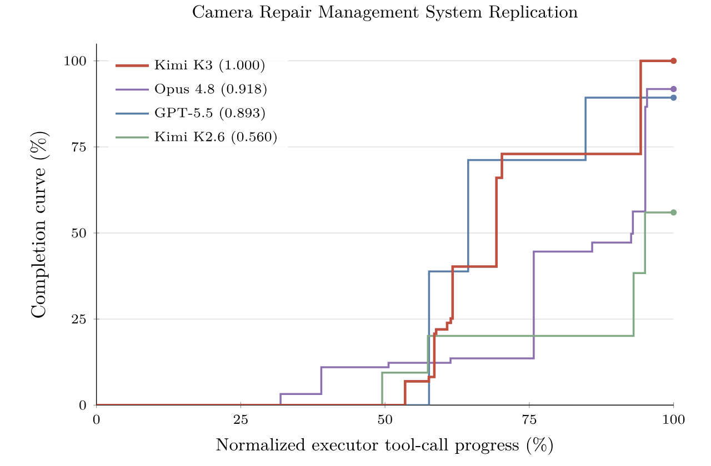

**図 10.** カメラ修理管理システムの完了曲線。エージェントが Oracle クエリを通じて隠し 3D カメラ修理システムを Web アプリケーションとして再構築するブラック ボックス システム複製タスク。

各環境で、エージェントは繰り返し解決策を提出し、検証者のフィードバックを受け取り、戦略を洗練させ、仮説の立て、行動、フィードバックの分析、適応という一般的なループをトレーニングします。報酬ハッキングは、エージェントを検証者から隔離し、診断フィードバックを提供する公開検証者と保留されたシナリオを評価する非表示の検証者を組み合わせ、限られた提出予算の下でペナルティベースの報酬を適用することによって軽減されます。

#### 4.2.7 Web 開発タスク

私たちは、典型的なシナリオをカバーする、専門家が厳選した Web 開発タスクの多様なスイートを構築します。入力は、1 行のシーン説明から複数段落の仕様まで多岐にわたります。アーティファクトは、Web サイト、インタラクティブ ゲーム、3D/WebGL シーン、データ視覚化、SVG、およびフルスタック アプリケーションに及びます。すべてのタスクはコンテナ化されたサンドボックスで実行され、単一の固定ハーネスではなく多様なエージェント スキャフォールドの下でロールアウトされるため、スキャフォールド間の汎用化が促進されます。報酬は、決定論的チェックと内部報酬モデルによるモデル判定の 2 つのコンポーネントで構成されます。決定的チェックでは、アプリケーションの動作を機能的にテストし、参照を複製するタスクの構造的およびピクセルレベルの類似性をスコアリングします。プロジェクトがビルドに失敗した場合、エラーが発生して実行された場合、またはアーティファクトを実装せずに偽装した場合、報酬はゼロになります。モデル判定では、他のモデルを使用してソース コード検査を実行したり、出力アーティファクトを調べて操作したりします。

## 5 インフラストラクチャ

Kimi K3 は、ハイブリッド KDA アテンション、3T クラスのスパース マルチモーダル トレーニングと推論、100 万トークンのエージェント ワークロードという 3 つのシステム課題を 1 つのモデルで組み合わせたものです。当社のインフラストラクチャは、モデルのライフサイクル全体にわたってこれらの課題を考慮して共同設計されています。アーキテクチャ レベルでは、高性能 KDA カーネルとコンテキスト並列処理により、トレーニングと推論の両方において、デバイス内およびデバイス間で反復定式化が効率的に行われます。事前トレーニング中は、バランスの取れたエキスパートの実行、メモリ使用量の削減、および通信が重複するスケジューリングにより、大規模な高使用率が維持されます。 1M トークンのエージェント RL の間、階層的な状態管理と再開可能なサンドボックス実行により、反復にわたる長い軌跡が維持されます。最後に、ステート対応の KDA プレフィックス キャッシュ、特殊な推論カーネル、キャッシュと予算を認識したスケジューリングにより、これらの効率が予測可能な運用サービスに変換されます。

### 5.1 KDA のアルゴリズムとシステムの共同設計

KDA は、ソフトマックス アテンションの増大するキー値キャッシュを固定サイズの再帰状態 $\mathbf S\in\mathbb R^{d_k\times d_v}$([§2.1.1](#_2-1-1-kimi-delta-attention)) に置き換えます。この状態のシリアル更新は、転送と再利用が安価な固定サイズの状態と引き換えに、並列実行に課題をもたらします。以下の設計は、デバイス内の融合カーネルとデバイス間の KDA コンテキスト並列処理を使用して、最初のプロパティに対処し、2 つの実行レベルで 2 番目のプロパティを活用します。

#### 5.1.1 複数の体制にわたる KDA カーネル

KDA 状態のシリアル依存性は、広範囲で均一な並列処理を求める GPU の好みと矛盾しており、各実行体制で異なるボトルネックとして現れます。各レジームに専用のカーネルを設計します。

**トレーニングおよびプレフィル用のチャンクごとのカーネル。** KDA のチャンクごとの形式は、各チャンク内では並列ですが、リカレント状態がチャンクからチャンクに伝播する必要があるため、チャンク間では直列です。単純に実行すると、これら 2 つのフェーズが交互に行われ、シリアル伝播中は SM がアイドル状態になります。したがって、チャンク内の計算とチャンク間の状態伝播をオーバーラップする CUTLASS ベースのチャンクごとのカーネルである FlashKDA [Che26a] を開発します。カーネルは、作業をトークン並列ステージとヘッド並列再帰に分解し、それぞれが個別にスケジュールおよび調整され、Triton リファレンス実装を大幅に上回ります。 FlashKDA はトレーニングと推論プリフィルの両方を提供し、flash-linear-attention [Yan24] のバックエンドとして自動ディスパッチされます。

**長いコンテキストのプリフィルのためのデバイス内コンテキスト並列処理。** テンソル並列処理は、デバイス間でヘッドを分割しますが、再帰を短縮することはありません。そのため、純粋な TP 展開では、各ランクが少数のヘッドのみを保持している場合、超長いシーケンスをプリフィルするとほとんどの SM がアイドル状態になります。重要な観察は、各セグメントの状態遷移を受信状態とは独立して評価でき、その後正確に構成できることです。したがって、自動 SM レベルのコンテキスト並列 (CP) プランナー [Wan25a、Yan24] は、単一ランクの SM 全体でシーケンスを分割し、セグメント遷移を並列で評価し、それらをマージして各セグメントの正確な初期状態を回復します。 [§5.1.2](#_5-1-2-kda-context-parallelism) のクロスデバイス KCP とは対照的に、この並列処理は完全にデバイス内で行われ、クロスデバイス通信は発生しません。

KDA デコードには、トレーニングやプレフィル中に遭遇するものとは異なる課題が存在します。これらの課題については、[§5.4.2](#_5-4-2-high-performance-kernels) で詳しく説明します。

#### 5.1.2 KDA コンテキスト並列処理

コンテキスト並列処理の通信オーバーヘッドは、ソフトマックスとリニア アテンションでは根本的に異なります。ソフトマックス アテンションでは、サイズがシーケンス長 [Liu23] に応じて増大するキーと値のブロックを交換するランクが必要です。代わりに、線形アテンションは、固定サイズの反復状態 $\mathbf S\in\mathbb R^{d_k\times d_v}$ で先行するコンテキストを保持します。従来のコンテキスト並列メソッドは、各ランクでローカル トークンが $\mathbf S=0$ から生成する状態を計算し、これらのローカル状態を前のランクにわたって合計して、受信状態 [Sun24、Sun25] を復元することによって、バニラ線形アテンションの加算的再帰を利用します。

ただし、この直接合計は KDA には不十分です。式 1 から、KDA がその状態を $\mathbf S_t=\mathbf M_t\mathbf S_{t-1}+\beta_t\mathbf k_t\mathbf v_t^\top$ として更新することを思い出してください。ここで、$\mathbf M_t:=(\mathbf I-\beta_t\mathbf k_t\mathbf k_t^\top)\operatorname{Diag}(\boldsymbol\alpha_t)$ です。 KDA のデルタ ルールは、現在の書き込みを追加する前に、トークン依存の行列 $\mathbf M_t$ を受信状態に適用します。したがって、ローカル シーケンス セグメントの効果は、そのセグメントに入る状態に依存し、$\mathbf S=0$ のみで計算された状態から判断することはできません。

この依存関係を維持するために、KDA コンテキスト並列処理 (KCP) を導入します。これは、各セグメントの効果を、ローカルで計算可能な 2 つの量、つまり受信状態に作用する累積遷移とゼロからローカルに生成される状態に分解します。 [§2.1.1](#_2-1-1-kimi-delta-attention) のチャンク単位の表記に従って、$t$ ローカル トークンの後のランク $i$ のセグメント内の反復状態に対して $\mathbf S_{[i]}^t$ を書き込みます。これにより、$\mathbf S_{[i]}^{T_i}$ がランクを離れる状態を示します。 $i$ およびランク $i+1$ に入ります。 $\mathbf S=0$ から始まる同じ再発の状態を $\widetilde{\mathbf S}_{[i]}^t$ と書きます。 $P$ コンテキスト並列ランクの $(i+1)$ 番目に入る任意の状態の場合、$t$ ローカル トークン後の状態は次のようになります。

$$
\begin{aligned}
\mathbf M_{[i+1]}^{t\leftarrow1}&:=\prod_{r=1}^{t}\mathbf M_r\in\mathbb R^{d_k\times d_k},\\
\mathbf S_{[i+1]}^t
&=\widetilde{\mathbf S}_{[i+1]}^t+\mathbf M_{[i+1]}^{t\leftarrow1}\mathbf S_{[i]}^{T_i}\\
&=\widetilde{\mathbf S}_{[i+1]}^t+\mathbf M_{[i+1]}^{t\leftarrow1}
\sum_{j=1}^{i}\left(\prod_{l\leftarrow j+1}^{i}\mathbf M_{[l]}^{T_l\leftarrow1}\right)
\widetilde{\mathbf S}_{[j]}^{T_j}
\in\mathbb R^{d_k\times d_v}.
\end{aligned}
\tag{17}
$$

ここで、$\mathbf M_{[i+1]}^{t\leftarrow1}$ は、最初の $t$ ローカル トークンの累積遷移を示します。最初の項にはローカル トークンによって生成された状態が含まれますが、2 番目の項にはローカル KDA 更新を通じて前のランクからのコンテキストが伝播されます。 $t=T_{i+1}$ では、$\mathbf M_{[i+1]}^{T_{i+1}\leftarrow1}$ と $\widetilde{\mathbf S}_{[i+1]}^{T_{i+1}}$ の両方が、$\mathbf S_{[i]}^{T_i}$ が利用可能になる前にローカル トークンのみを使用して計算でき、各ランクが他のランクと交換するフラグメントです。

式 17 の合計は、すべての状態がローカルで計算されたフラグメントのみから構成されていることを示しています。これらのランクレベルの更新は連想的に構成されるため、各ランクの受信状態はプレフィックス スキャン [Mar18] によって回復できます。各ランクはまず $\mathbf M_{[i]}^{T_i\leftarrow1}$ と $\widetilde{\mathbf S}_{[i]}^{T_i}$ をローカルで計算し、次に両方のテンソルを 1 つのオールギャザー [Yan24] と交換します。全収集の後、ランク $i+1$ は、同じドキュメントの先行フラグメントを順番に処理し、$\mathbf S=0$ から開始して各フラグメントに $\mathbf S\leftarrow\mathbf M_{[j]}^{T_j\leftarrow1}\mathbf S+\widetilde{\mathbf S}_{[j]}^{T_j}$ を適用することにより、$\mathbf S_{[i]}^{T_i}$ を再構築します。したがって、KCP では、リカレント状態の同期に必要なのは固定サイズのオールギャザーのみであり、線形なコンピューティング スケーリングを実現します。

### 5.2 3T クラスの事前トレーニングのインフラ

Kimi K3 事前トレーニングでは、パイプライン並列処理 (PP) と仮想ステージ (VP) [Hua19、Nar21]、エキスパート並列処理 (EP) [Lep20]、ZeRO-1 データ並列処理 [Raj20]、パイプライン ZeRO-2 勾配シャーディングを組み合わせます。 [Zen26]、およびコンテキスト並列処理 (CP、[§5.1.2](#_5-1-2-kda-context-parallelism)) [Sam23]。

MoE レイヤーは、EP ランク全体で複製された共有エキスパートを採用しており、エキスパートの派遣と結合のための全対全通信は、遅延を隠すために計算とオーバーラップされます。

3T クラスでのネイティブのマルチモーダル事前トレーニングには、次の 3 つの重大な問題が生じます。(i) EP ランク間でトークンの負荷が不均衡である。 (ii) アクティベーション、勾配、およびオプティマイザーの状態がメモリ バジェットを超えている。 (iii) ビジョン エンコーダの非常に可変的な計算がクリティカル パス上で公開されます。次のサブセクションでは、これらの問題に順番に対処します: 完全にバランスのとれたエキスパート並列 MoE トレーニング ([§5.2.1](#_5-2-1-perfectly-balanced-expert-parallel-moe-training))、メモリ効率の高いトレーニング ([§5.2.2](#_5-2-2-memory-efficient-training))、およびマルチモーダル エンコーダー最適化 ([§5.2.3](#_5-2-3-multimodal-encoder-optimization))。[図 11](#figure-11) は、結果として得られる実行スケジュールを示しています。

<span id="figure-11"></span>

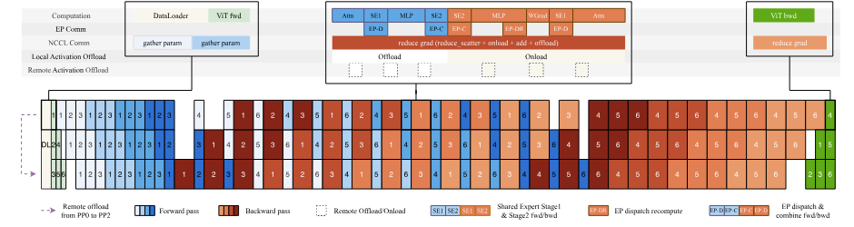

**図 11.** 計算、通信、およびオフロードは、異なるパイプライン並列フェーズで重複しました。

#### 5.2.1 完全に負荷分散された expert-parallel MoE 学習

従来の EP 方式では token 負荷が rank 間で偏ります。その結果、計算の不均衡によって学習スループットが低下し、routed expert activation の形状が動的に変わることで深刻なメモリ断片化も生じます。そこで、動的な冗長 expert により完全な負荷分散を実現する EP 方式 MoonEP（[repository](https://github.com/MoonshotAI/MoonEP)）を提案します。MoonEP は DeepEP [ZhaWeb] など従来方式の全体的な計算フローを保ちつつ、オンライン計画と冗長 expert の移動を導入します。forward pass では、現在の microbatch と layer の router 出力から冗長 expert を計画し、routed expert の計算前に prefetch します。backward pass では勾配を local reduce buffer に一時保存し、計算完了後に home rank の gradient buffer へ戻します。

**境界冗長エキスパートによる完璧なバランス。** MoonEP では、すべてのランクが正確に $S\times K$ トークンを受け取る必要があります。$S$ はシーケンスの長さ、$K$ はトークンごとに選択されたエキスパートの数であるため、すべてのランクが同じ量の計算を実行します。重要な問題は、そのようなバランスを保証するために何人の専門家を余らせれば十分なのかということである。 $E$ をエキスパートの数、$R$ を EP サイズとします。バランスの取れた計画が常に存在し、ランクあたり最大 $E/R$ の冗長エキスパートが存在し、この限界が本質的に厳しいことを証明します (付録 E)。したがって、ランクごとに $E/R$ 冗長エキスパート スロットを予約すると、計画に常に実行可能な解決策が含まれることが保証されるため、トレーニングが中断されることはありません。対照的に、ECHO [Yan26] や UltraEP [Wei26] などの以前の作品では、冗長エキスパートの数が事前に設定されているか、ランクごとのトークンの上限が課されています。その後、キャップ内に実行可能な計画が存在しない場合、トレーニングは強制的に停止され、不均衡が残ったままキャップ自体を手動で調整する必要があります。

**オンライン プランニング.** すべてのトレーニング ステップで正確な最適値を計算するには、法外なコストがかかります。したがって、参考として代表的なケースに対して整数線形計画法 (ILP) を使用して正確な解をオフラインで計算し、最適に近く、無視できるオーバーヘッドを発生させ、常に $E/R$ の上限を尊重する GPU プランニング カーネルを設計します。

**ゼロコピー通信。** 完璧なバランスにより、通信経路も簡素化されます。計画カーネルがすべてのトークンの宛先を事前計算する、融合された並べ替え/並べ替え解除オペレーターを実装します。そのため、トークンはリモート ランク上のエキスパートがグループ化した位置に直接送信され、通信バッファーのビューは計算に直接返され、中間コピーが排除されます。最悪の場合の不均衡下では、DeepEP で同じコピーフリー データ パスをサポートするには、サイズ $S\times K\times R$ の通信バッファが必要ですが、MoonEP では、完璧なバランスにより、固定の $S\times K$ バッファのみが必要になります。

**静的計算シェイプ。** 従来の実装では、エキスパート計算を開始する前に動的シェイプを同期し、レイヤー間のパイプラインを停止させます。完璧なバランスにより、すべてのランクが正確に $S\times K$ トークンを受け取り、すべてのレイヤーの計算形状が静的に知られています。これにより、レイヤごとの MoE ホスト同期が不要になり、ホスト側のカーネル起動のオーバーヘッドが軽減されます。

**Expert-GEMM のスケジューリングと重複。** 集計負荷がランク間で完全にバランスが取れている場合でも、各ランク内のエキスパートごとのトークン数は偏ったままであり、固定順序でワークロードを意識しないスケジュールにより、この偏りが SM ワーカー間の不均衡なメイクスパンに変わります。したがって、起動前にパラメーターを現在のトークン配布に適応させ、実行中にパラメーターを固定しておくワークロード認識スケジューラーを使用して、ルーテッド エキスパート GEMM をスケジュールします。

軽量ヒューリスティックは、ハードウェア メトリクスの分析コスト モデルを使用してこれらのパラメーターを選択し、オフライン自動チューニングで調整された主要な係数を使用します。共有エキスパートについては、他のカーネルと重複するように GEMM を別のストリームにディスパッチします。

#### 5.2.2 メモリ効率の高いトレーニング

**統合アクティベーション マネージャー。** アクティベーション用の統合ストレージ抽象化を設計します。この抽象化では、バックワード パス用に保存されたすべてのテンソルがプラガブル ストレージ バックエンドに関連付けられます。再計算、量子化、およびオフロード/リモートオフロードは、この抽象化に基づく単なるストレージ ポリシーであり、テンソル粒度で自由に構成できます。ポリシーは、モデル コードから完全に切り離された、テンソル上の軽量のアノテーションを介して宣言されます。再計算は関数の粒度で実行され、層間の再計算がサポートされます。私たちの実装では、すべての GPU メモリがメインのコンピューティング ストリームに割り当てられ、単一のメモリ プール内で管理されるため、マルチストリームの断片化とホストバウンドのオーバーヘッドが回避されます。アクティベーションは層粒度でプリフェッチされ、計算とオーバーラップされるため、無視できるほどの余分なオーバーヘッドが発生します。 Kimi K3 では、ほとんどのアクティベーションはブロック単位の FP8 量子化 [Tea25、Dee24a] をオフロード/リモート オフロードと組み合わせて使用​​し、要素単位の演算子は再計算で構成されます。

#### メモリ効率の高い MoE

ネイティブ MoE 実装では、`permuted_probs` の勾配計算は順方向出力 `output` に依存します。 SonicMoE [Guo25a] からインスピレーションを得て、数学的変換を通じてこの勾配を中間アクティベーション `act_output` と上流勾配 `doutput` のみに依存する形式に書き換え、追加の軽量の要素ごとの計算を犠牲にして `output` への後方依存性を排除しました。さらに、グループ GEMM のフォワード パスでは、ディスパッチ操作の入力のみを保存します。バックワードパス中に、グループ GEMM の入力はディスパッチを再計算することによって回復されます。[図 11](#figure-11) に示すように、この再計算によって導入される通信は、グループ GEMM 後方計算の一部とオーバーラップすることができ、無視できるコストで起動ストレージのこの部分を削除します。

#### メモリ効率の高い Attention Residuals

アテンション残差については、ブロック AttnRes に基づいてコンパニオン最適化を設計します。ブロック表現は境界層で一度生成され、後続のすべての層で共有され、GPU 上に直接常駐します。 AttnRes の計算は完全にチェックポイント処理でラップされているため、各層でのバックワード パス用に保存されたアクティベーションは標準の残差アーキテクチャのアクティベーションと同一です。パイプラインの並列処理には、キャッシュ ベースのパイプライン通信 [Tea26] を採用します。この通信では、新しく生成されたブロックのみがステージ間で段階的に転送され、マイクロバッチが終了するとすぐに解放され、メモリ フットプリントの理論的な下限に達します。

**PP ランク間でのアクティベーションのバランスをとる。** インターリーブ 1F1B パイプライン並列処理では、パイプラインのウォームアップによりアクティベーションが PP ランク間で不均等に分散され、PP ランクが増加するにつれて常駐アクティベーションの数が減少します。メモリ不足 (OOM) エラーを回避するために、Mooncake Transfer Engine [Qin24] を使用してアクティベーションを他の PP ランクのメモリにリモートでオフロードし、PP ランク全体でバランスの取れたアクティベーション メモリを実現します。

**Pipeline ZeRO-2 勾配シャーディングとオフロード。** アクティベーション以外にも、Pipeline ZeRO-2 勾配シャーディング [Zen26] を使用して、データ並列 (DP) ランク全体で勾配をシャーディングします。さらに、GPU 上で double grad バッファを維持しながら、ピーク時の GPU メモリ使用量を削減するために、シャードされた勾配を CPU メモリに保存します。勾配が DP ランク全体で double grad バッファに減少した後、CPU シャードに蓄積されます。

#### P2P ベースの Muon 直交化

分散オプティマイザは DP ランク全体でパラメータを均等に分割しますが、Muon のニュートン-シュルツ直交化では完全なパラメータ行列が必要となるため、各更新の前に完全なパラメータを収集するための通信ステップが必要になります。単純なアプローチでは、各ランク [Liu25] のパラメーター バッファー全体でオールギャザーを実行します。これにより、通信が大規模な主なボトルネックになることに加えて、大量のメモリ フットプリントが発生します。代わりに、各ランクは、対応する所有者ランクとのピアツーピア (P2P) 通信を介して、ローカルに所有されているパラメーターのシャードのみを取得し、フルパラメーターのバッファーを排除し、メモリ使用量と通信量の両方を削減します。通信と計算はモデル チャンク バッファーの粒度でさらにパイプライン化され、通信のオーバーヘッドが隠蔽されます。

#### 5.2.3 マルチモーダルエンコーダの最適化

**マルチモーダル エンコーダーのダイナミック CP。** ロングコンテキストのマルチモーダル トレーニングでは、大きな画像や長いビデオによりビジョン エンコーダーの計算時間が大幅に増加し、デバイス間で大幅な負荷の不均衡が発生します。これに対処するために、コンテキスト並列処理をこのような大規模なサンプルに拡張します。単一の大きなイメージがパッチの次元に沿って複数のデバイスに分割され、CP ランク全体でキーと値のペア (gather-KV) を収集することによってアテンションが計算されます。さらに、各 CP グループをいくつかのサブ CP グループに分割し、負荷分散された方法で複数の大きなイメージをサブ CP グループに分散し、規模に応じて通信部分が増大するのを防ぎます。これにより、大規模なビジュアル サンプルのエンコーダのレイテンシとデバイス間の負荷の不均衡の両方が削減され、残りのエンコーダの計算をパイプライン バブル内に隠すことができます。

#### PP バブルでのエンコーダーの計算

Kimi K2.5 では、分離エンコーダー プロセス (DEP) [Kim26a] を導入しました。これは、ViT とテキスト トレーニングを個別のステージに分割し、PP ステージ全体でビジョンの前方パスと後方パスのバランスをとります。インターリーブ 1F1B パイプライン スケジュールでは、最初の PP マイクロバッチのテキスト順方向パスはすべて最初にスケジュールされているのに対し、最後の PP マイクロバッチのテキスト逆方向パスは最後にのみ終了することがわかります。したがって、ViT 計算 [Val26a] をさらに分解します。最初の PP マイクロバッチの ViT 順方向パスは前もって同期して実行され、残りの順方向パスはパイプライン バブルにスケジュールされ、逆方向パスは同様に処理されます。その結果、ViT 計算の大部分はパイプライン バブル内に隠蔽され、ビジョン エンコーダの効果的なオーバーヘッドが大幅に排除されます。

### 5.3 1M-token エージェント RL 基盤

Kimi K3 ほどの大規模なモデルのエージェント RL を、制限されたコンピューティング予算内で 100 万トークンのコンテキストに拡張すると、リソース効率が第一の目標になります。したがって、私たちは、効率的なトレーニングとロールアウトのためのロングコンテキスト RL インフラストラクチャと、長期的な環境対話のための高性能で再開可能なサンドボックスを開発します。

#### 5.3.1 ロングコンテキスト RL インフラストラクチャ

同じ場所に配置された RL トレーニング [Tea25] を採用して、各 1M コンテキスト Kimi K3RL 実験を数百 GPU 内に維持し、部分ロールアウト [Sca25] を使用して超長い軌道からのテール レイテンシーを削減します。この設計によりハードウェアの使用率が向上しますが、ロングコンテキストのロールアウトにより、KV キャッシュ保持のための追加の DRAM 需要が発生し、トレーニング側の状態と競合します。さらに、プレフィルとデコードの両方で高い効率を達成するには、慎重なプレフィックス管理とリクエストのスケジューリングが必要です。

**外部 KV キャッシュ プール。** 1M コンテキストのマルチステップ ロールアウトでは、プレフィックス KV キャッシュのミスは非常に高価です。部分的なロールアウトでは、前の反復からの多くの未完了の長いプレフィル リクエストが同時に到着するため、各反復の開始時にこの問題が悪化します。投機的デコードにより、比較的固定されたツール呼び出し間隔内でのリクエストの回転がさらに加速され、プレフィックス ブロックのチャーンが増加します。これらの問題はプリエンプションを引き起こし、ロングコンテキスト RL にとって重要なキャッシュ ヒット率を低下させる可能性があります。

したがって、ライトバック設計により、プレフィックス保持を GPU 常駐から切り離します。アクティブなデコード ブロックは GPU KV キャッシュに残りますが、再利用可能なアイドル プレフィックスは、GPU から削除された場合にのみ CPU DRAM の外部 KV キャッシュ プールに書き戻され、次の再利用の前にプリフェッチされます。 KDA 状態は、対応する MLAKV キャッシュ ブロックとともにオフロードおよびプリフェッチされ、ライフサイクルの整合性が維持されます。ライトスルー戦略と比較して、このポリシーでは、アクティブなデコード パスから離れるプレフィックスに対してのみ CPU DRAM 使用量と転送帯域幅が発生し、GPU 上にまだ常駐してアクティブなブロックの冗長な CPU コピーが回避されます。

外部プールに十分な DRAM を提供するために、トレーニングの反復終了後にトレーニング状態 (モデルの重みとオプティマイザーの状態) を NVMe にオフロードします。ロールアウトの反復後、トレーニング ワークロードとの競合を避けるためにプールが解放されます。

#### ロールアウト自動スロットル スケジューラ

マルチステップのロールアウトでは、軌道が進むにつれてコンテキストが徐々に増大するため、軌道全体の平均長に基づいて固定同時実行性を見積もるのが難しく、初期段階では過度に保守的になります。逆に、同時実行性の設定が高すぎると、後の段階で KV キャッシュのプレッシャーが生じ、プリエンプションがトリガーされる可能性があります。したがって、LLM リクエスト スケジューリング層で自動スロットリング メカニズムを設計し、アクティブなリクエスト数、キューに入れられたリクエスト数、KV キャッシュ使用率などのランタイム シグナルを使用して、推論エンジンに送信されるリクエストの数を動的に制御します。これにより、KV キャッシュの圧力が上昇するにつれて同時実行性が低下しながら、初期のロールアウトが適切に活用され、手動調整なしで飽和不足と過負荷の両方が回避されます。

**非ポリシー モデルの転送のためのグラデーション バッファーの再利用。** RL 損失の計算には、多くの場合、参照モデルなどの順方向専用の非ポリシー モデルが必要ですが、その重みが大きすぎて GPU 上に常駐し続けることができません。これらの重みを CPU メモリに保持し、必要な場合にのみ実体化し、ポリシー モデルの FP32 勾配バッファ ストレージでパラメータ テンソルをバックアップします。これにより、追加の割り当てや断片化を行わずに既存の GPU メモリが再利用され、後で実際の勾配が計算されるときにバッファが上書きされるため、安全性が保たれます。

ZeRO-2 勾配シャーディングとオフロード ([§5.2.2](#_5-2-2-memory-efficient-training)) を使用すると、各 GPU は Kimi K3RL トレーニングの 2 つの VPP チャンクのみの勾配バッファーを保持します。参照の重みをこれらのスロットにチャンクごとにストリーミングします。1 つのスロットは現在の順方向計算に使用され、もう 1 つのスロットは次のチャンクをプリフェッチし、GPU メモリを増やすことなくコピーのオーバーヘッドを隠します。

#### 5.3.2 サンドボックスインフラストラクチャ

Kimi K3 のポストトレーニングと評価のさまざまな要件をサポートするために、従来のコンテナーベースのランタイム、GPU サンドボックス ランタイム、そして最も注目すべきものとして、AgentENV と呼ばれる新しい microVM ベースのサンドボックス ランタイムなど、複数のサンドボックス ランタイムを採用しています。

AgentENV ([repository](https://github.com/kvcache-ai/AgentENV)) は、パートナーと協力して開発された、エージェント AI ワークロード向けに特別に設計されたサンドボックス システムです。これは、次の 3 つの主要な設計目標を中心に構築されています。

- **忠実度の高い分離サンドボックス ランタイム。** エージェントの能力が向上し、タスクがより困難になるにつれて、エージェントはより積極的に探索する傾向があり、報酬のハッキングを試みることもあります。一方で、これはセキュリティに特有の課題を引き起こします。従来のコンテナベースのサンドボックス ランタイムを使った初期の実験では、意図しないエージェント操作によって引き起こされるカーネル パニックやデッドロックがいくつか観察されました。一方で、エージェントの機能を制限しないように、できるだけ多くの探索を許可したいと考えており、複雑なタスクには実世界の環境に近いサンドボックスが必要です。たとえば、エージェントはディスクをマウントしたり、コンテナを実行したり、仮想マシンを自由に起動したりできる必要があります。 Firecracker [Aga20] で分離された microVM を実行することにより、AgentENV はコンテナベースのランタイムでは実現できないレベルの分離と忠実性を提供します。

- **エージェント RL の柔軟なサンドボックス ライフサイクル。** 低レベルでは、AgentENV は増分チェックポイント作成とサンドボックス状態の再開をサポートします。この場合、最後のチェックポイント以降にダーティになったメモリ ページのみがチェックポイント作成中に保存され、チェックポイントと再開のレイテンシがそれぞれ 133 ミリ秒と 49 ミリ秒という低さになります。これに加えて、AgentENV は、エージェント RL 効率の向上に役立つ 3 つの高レベルの操作を提供します。 (a) 一時停止と再開: 一時停止されたサンドボックスはメモリや CPU リソースを消費しません。したがって、エージェントがモデルの推論結果を待っている間、サンドボックスは一時停止される可能性があり、これがサンドボックスの寿命の 98% を占める可能性があります。 (b) フォーク: フォークは、元のサンドボックスを実行したまま、元のサンドボックスの正確な状態から新しいサンドボックスを作成します。これは、副作用なしで報酬を判断するのに役立ちます。 (c) スナップショット: エラー回復のために、サンドボックスのスナップショットを定期的に保存できます。

- **高効率と高密度。** 私たちのワークロードでは、それぞれに固有のイメージ セットを含む数万のサンドボックスを数秒以内に作成する必要がある場合があります。画像形式として OverlayBD [Li20] を採用し、カスタム ublk ドライバー実装、ストレージ層共有、および P2P トランスポートを組み合わせて、大規模な場合でも 1 秒未満の起動遅延を実現します。コピーオンライト メモリとページ キャッシュの最適化によりメモリ使用量をさらに削減し、実際のワークロードで最大 $6.5\times$ のメモリ オーバーコミット率を達成します。

Kimi K3 のトレーニングと評価を通じて、1,505,678 個の画像にわたって合計 51,219,741 個のサンドボックスが作成されました。

### 5.4 推論とオンライン サービス

Kimi K3 を提供すると、本番側でも同じ課題が明らかになります。ハイブリッド KDA-MLA アーキテクチャは、100 万トークンのコンテキストで共同管理する必要がある 2 つの根本的に異なるキャッシュを維持します。その新しいモジュールと高度にスパースなエキスパートは、それぞれに合わせたカーネルを要求します。また、本番トラフィックは、リクエストあたりのコストが 3 桁にも及ぶリクエストを混在させます。以下の設計は、これらの課題に 3 つのレベルで対処します。エンジン レベルでは、KDA 対応プレフィックス キャッシュは、固定サイズの反復状態を MLAKV キャッシュと同じページ プールにパックし、長いプレフィックスを複数のリクエストにわたって再利用できるようにします。デバイス レベルでは、KDA デコード用の専用カーネル、ブロック AttnRes、およびスパース潜在 MoE により、トークンごとの遅延とメモリ トラフィックが最小限に抑えられます。フリート レベルでは、キャッシュを意識したアフィニティ スケジューリングと予算ベースのアドミッション コントロールにより、これらの効率が予測可能なサービスに変換されます。

#### 5.4.1 KDA 対応プレフィックス キャッシュ管理

Kimi K3 のハイブリッド アーキテクチャにより、プレフィックス キャッシュが複雑になります。KDA リカレント ステートと MLAKV キャッシュは、サイズと有効期間が根本的に異なりますが、キャッシュされたプレフィックスは、両方を同じ境界で一緒に復元できる場合にのみ再利用できます。したがって、統一されたページ レイアウトから、同時スケジューリングの下で​​のきめ細かいプレフィックスの再利用と一貫性まで、2 つのキャッシュ タイプを共同で管理する、KDA 対応のプレフィックス キャッシュを設計します。百万トークンのプレフィックスを低コストで保持し、リクエスト間で再利用できるようにします。

**ハイブリッド KDA-MLA の統合キャッシュ レイアウト注意。** 各 Kimi K3 ブロックは 3 つの KDA レイヤーと 1 つの Gated MLA レイヤーで構成されており、それらのキャッシュは根本的に異なります。 MLAKV キャッシュはシーケンスの長さに応じて増加し、トークンごとにページングされますが、KDA 反復状態はサイズが固定されており、リクエストごとに 1 つのコピーが存在します。それぞれに個別のマネージャーを維持すると、割り当て、削除、転送ロジックが重複してしまいます。したがって、KDA 状態を MLAKV と同じページ ブロック プールにパックし、ページを同じバイト サイズに統合して、両方のページ タイプが割り当て、参照カウント、およびエビクションの 1 つの実装を共有するようにします。ページ内では、すべてのヘッドの状態がヘッドごとに連続して格納されるため、各ヘッドのバイト ストリームは自己完結型であり、クロスノード転送の最小単位として機能します。プレフィル/デコード分離では、プレフィル ノードとデコード ノードが異なる TP 次数を採用する場合、GPU 側の再シャッフルなしで転送パス上で再レイアウトが実行されます。この非対称性は、開発中に有用であることが判明しました。タイプを混乱させたアクセスでは、妥当なデータではなくガベージが生成されます。これにより、プールされたレイアウトでオーバーヘッドがゼロの健全性チェックが行われます。

#### KDA プレフィックス キャッシュの最適化

ブロック ハッシュ ベースのプレフィックス キャッシュは、1 つの物理ブロックの粒度で KV キャッシュを再利用します。完全なブロックのみがハッシュされるため、ブロックに位置合わせされたプレフィックスのみが再利用可能です。このカップリングは Kimi K3 で破綻します。ブロック ハッシュ マッチングには、すべてのレイヤーで共有される 1 つのブロック サイズが必要で、プレフィックス ヒットは、ヒット境界での KDA 状態が保持されている場合にのみ再利用可能です。 KDA レイヤーは、トークン エントリごとではなくシーケンスごとに単一の大きな反復状態を維持するため、状態スナップショットは疎な境界でのみ利用可能です。したがって、共有ブロック サイズは 1024 ～ 6144 トークンに強制され、ハッシュはストレージ ブロックに関連付けられているため、ハッシュ粒度も同様になります。ただし、MLA のトークンごとのエントリだけでは、より細かいブロックを許容できます。このような粗い粒度では、キャッシュはほとんど役に立ちません。1 ブロックより短いリクエストは決して再利用できず、チャンク プレフィルはブロック全体の境界を越えるまでキャッシュ可能なプレフィックスをエクスポートしません。

したがって、2 つの粒度を分離します。プレフィックス ハッシュは、MLA ページ内の細かいハッシュ ブロック (例: 512 トークン) で実行されますが、物理ブロックは粗い割り当て単位のままです。 KDA では、アライメントは逆の方法で実行されます。再発状態のチェックポイントは、MLA のハッシュ エンドポイントの疎なサブセット、つまりルックアップが参照できる唯一の位置にのみ保存されます。

<span id="figure-12"></span>

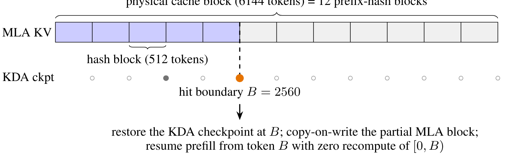

**図 12.** 6144 トークンの物理キャッシュ ブロック内のきめ細かいプレフィックス キャッシュ。リクエストは 512 トークンの MLA ハッシュ ブロックと境界 $B=2560$ の KDA チェックポイントを再利用し、$[0,B)$ を再計算せずにプレフィルを再開します。

プレフィル中、部分的に埋められた MLA ページは、最後の完全なハッシュ ブロックの連鎖ハッシュの下でプレフィックス キャッシュ インデックスに登録されます。各ハッシュは、先行するすべてのハッシュ ブロックをカバーするため、エンドポイントの一致により、それまでのプレフィックス全体が証明されます。ページがいっぱいになるにつれて、登録されたエンドポイントが進みます。一方、各前方パスの後、KDA カーネルは、最後に処理されたハッシュ位置でリカレント状態を保持します。チェックポイントは大きいため、リクエストの進行に伴って置き換えられる中間チェックポイントはリサイクルされますが、会話ターン境界にあるチェックポイントはリクエスト間での再利用のために保持されます。キャッシュされたチェックポイントは読み取り専用のスナップショットです。ヒットすると、次の転送パスの前にリクエストのプライベートな実行状態にコピーすることで状態が復元され、新しいチェックポイントが新しいスロットに書き込まれるため、他のリクエストから見えるチェックポイントがその場で変更されることはありません。

ルックアップは 2 段階で行われます ([図 12](#figure-12))。 MLA ステージは、連鎖ハッシュによって物理ブロック全体を照合し、最初に失われたブロックで、そのブロック内のハッシュ エンドポイントにフォールバックするため、部分的に埋められたページはヒット可能なままになります。次に、KDA ステージでは、各 KDA キャッシュ・グループの候補境界にチェックポイントが必要になります。各キャッシュ・グループは、独立したリカレント状態を維持します。ヒットは両方のステージを満たす最長の境界であり、常にハッシュ ブロックの倍数であり、物理ブロックの倍数である必要はありません。[図 12](#figure-12) では、最初の 2800 トークンがキャッシュされたプレフィックスと一致するリクエストが、6144 トークンの物理ブロックの奥深くにある $B=2560=5\times512$ にヒットし、$[0,B)$ を再計算する代わりにトークン $B$ からプレフィルを再開します。

#### 同時スケジュールでの一貫性

残りの設計ポイントはそれぞれ、ヒット ブロックが共有キャッシュ エントリであると同時にプライベート リクエストの成長ポイントである設定、および MLA および KDA キャッシュ グループがすべてのヒット境界で一致する必要がある設定において、部分的にフィルされたブロックを共有するという具体的な障害モードによって決まります。まず、すべてのキャッシュ グループが 1 つの共有フリー リストからブロックを描画するため、あるグループにプライベート コピーを割り当てると、別のグループがヒットしたばかりのブロックが追い出される可能性があります。したがって、すべてのヒット ブロックは、何かが割り当てられる前にすべてのグループにわたって固定されます。第 2 に、プライベート ブロックへのコピーは、フォワード パスの直前に GPU 上で実行されるため、現在のスケジューリング ステップ内で割り当てまたは登録されたブロックは、引き続き前の所有者のバイトをリーダーに渡します。そのようなブロックは、コピーが着地するまでマッチングから除外されます。 3 番目に、チェックポイントはすべての KDA グループに存在する場合にのみリクエストを復元できるため、1 つのグループのチェックポイントを削除するとその兄弟がアトミックに無効になります。チェックポイントはすべてのグループでヒット可能であるか、どのグループでもヒット可能ではありません。これらのメカニズムにより、登録されたすべての状態は常にその宣言されたトークン プレフィックスに正確に対応し、ハイブリッド KDA-MLA モデルのプレフィックス キャッシュはフル アテンション モデルと同じ一般性を実現します。つまり、共有プレフィックスは、リクエストの長さ、チャンキング、またはスケジューリング インターリーブとは無関係に、任意の 512 トークン境界で再利用可能です。

#### 5.4.2 高性能カーネル

Kimi K3 では、いくつかの新しいアーキテクチャ モジュールが導入されています: KDA([§2.1.1](#_2-1-1-kimi-delta-attention))、ブロック AttnRes([§2.2](#_2-2-attention-residuals))、および Stable LatentMoE([§2.3](#_2-3-stable-latentmoe))。それぞれのカーネル実装を最適化します。

**KDA.** KDA プリフィル ([§5.1](#_5-1-algorithm-system-co-design-for-kda)) と比較すると、KDA デコードには明確な一連の課題があります。主なボトルネックは、並列処理の利用から効率的な利用に移行します。進化する反復状態を管理し、デコード ステップごとに適切に更新されます。このインプレース更新は、MTP ベースの投機的デコードでは問題になります。検証でドラフトされたトークンのサブセットが拒否された場合、状態はすでに最後に受け入れられたトークンを超えて進んでおり、簡単にロールバックすることはできません。各ドラフト ポジションの状態スナップショットを維持すると、ロールバックが可能になりますが、オンライン サービスに典型的な大きなバッチ サイズで支配的な状態トラフィックのコストも倍増します。

ただし、受け入れられたドラフト プレフィックスの後の状態は、状態自体よりもはるかに小さいドラフト トークンの予測される入力によって完全に決定されます。したがって、これらの投影された入力のみをキャッシュし、受け入れられたトークンの状態をオンチップで再構築し、検証済みトークンとボーナス トークンの状態を書き戻します。この設計は、並行作業である ReplaySSM [Dao26] で独自に提案されています。再生されたトークン、ボーナス トークン、および次のドラフト ウィンドウは、短い畳み込み、入力正規化、ゲート、KDA 再帰、および出力正規化をカバーする単一の融合カーネル内の 1 つの再帰ループを共有します。検証のレイテンシーは、検証されたトークンの数に応じて非線形に増加し、状態キャッシュのベースラインよりも低いままです。プロジェクション キャッシュはデコード ステージを離れることがないため、プレフィックス キャッシュとプレフィルとデコードの分解は、非投機的サービスの場合と同じペイロードで動作します。

**ブロック AttnRes.** ブロック AttnRes [Tea26] は 2 フェーズのスケジュールに従います。バッチ化されたブロック間パスは、キャッシュされたブロック表現をブロックごとに 1 回読み取ります。その後、各レイヤーはオンライン ソフトマックス マージ [Mil18] を通じてブロック内部分和に組み込まれます。メモリ アクセスは、プリフィルとデコードの両方でこれらのカーネルのコストのかなりの部分を占めるため、両方の段階での最適化は主にメモリ効率に重点を置いています。

プレフィルの場合、すべてのテンソル並列 (TP) ランクでブロック表現を具体化すると、かなりの冗長メモリ消費が発生します。したがって、アクティベーションにはシーケンス並列処理 (SP) を採用します。TP all-reduce は、reduce-scatter と all-gather に分解され、ブロック内カーネルが 2 つの集合の間に挿入され、シーケンスシャード化された隠れ状態で動作するため、各トークンのブロック表現は正確に 1 つのランクで実体化されます。これにより、追加のメモリ消費がなくなり、プリフィル中のブロック AttnRes の I/O オーバーヘッドが削減されます。

デコードの場合、メイン ストリームの独立した計算と重なるように、サイド ストリームでブロック間カーネルを起動します。代わりに、ブロック内カーネルは融合によって合理化されます。AttnRes 出力とその部分和更新のマージは、後続の RMSNorm とともに、先行する TP all-reduce に融合され、ブロック内フェーズ用の専用カーネルが排除されます。これらの最適化を組み合わせることで、ブロック間パスのレイテンシーが隠蔽され、ブロック内フェーズのメモリ トラフィックが削減されます。

**Stable LatentMoE.** Stable LatentMoE は、エキスパートの総数とトークンごとにアクティブ化されたエキスパートの数の両方を増加します。その結果、エキスパート空間とトークンごとのエキスパート数の両方が増加すると、スケジューリングと調整のオーバーヘッドが増加し、従来の MoE カーネルが高いハードウェア使用率を維持することが困難になります。これらの課題により、このモジュール専用のカーネル最適化が行われます。

潜在 GEMM のオーバーヘッドを軽減するために、3 つの最適化を採用します。まず、潜在的なダウンプロジェクションと MoE ルーターを単一の GEMM に融合します。次に、潜在重み行列をランク間でシャーディングし、multimem ストア命令を使用して出力オールギャザーを GEMM エピローグに融合します。最後に、共有エキスパート計算など、結果として生じる通信を他のオペレーターと重ね合わせます。これらの最適化により、冗長な重みトラフィックと重複した計算が排除され、計算の背後にある通信遅延が隠蔽されます。

ルーティングされたエキスパートにとって、バッチ サイズが小さい場合、グループ GEMM は重み行列のメモリ限定ストリーミングに縮小されます。これは、従来のタイル中心のカーネルがコンピューティング指向の設計と前処理のオーバーヘッドのためにあまり適していない領域です。代わりに、WarpDecode [Bet26] のトークン中心設計に基づいて MoE デコーディング カーネルを構築します。この設計では、各ワープが 1 つの出力ニューロンを担当し、関連する重みをメモリから直接ストリーミングします。並列性をさらに向上させるために、各ワープをよりきめの細かいレーン チームに細分化し、各チームが専門家のばらばらのサブセットを処理した後、部分的な結果をワープ全体で削減します。さらに、重みレイアウトは 1 回の前処理コストでオフラインで変更されるため、実行時の逆量子化のオーバーヘッドが大幅に削減されます。

#### 5.4.3 フリートレベルのスケジューリング

単一のサービング インスタンスを超えると、課題はリクエストごとの効率から予測可能性に移ります。プレフィックス キャッシュのミスはヒットよりも桁違いにコストがかかり、100 万トークンのリクエストがバーストすると短いリクエストが枯渇する可能性があります。これに対処するために、2 つのフリート レベルのスケジューリング ポリシーを提案します。キャッシュ対応アフィニティ スケジューリングは、クラスタ障害のコストを制限しながら、プレフィックス キャッシュを保持するクラスタに各セッションをルーティングします。また、バジェット ベースのアドミッション コントロールは、バースト的なロングコンテキスト トラフィックがシステム全体の SLO を低下させないように、各要求クラスに独自のリソース バジェットを付与します。

**キャッシュ対応アフィニティ スケジューリング。** 1M コンテキストでは、一般的なコーディング入力には 400K トークンのプレフィックスが含まれますが、必要なプレフィル増分は 4K トークンのみであるため、プレフィックス キャッシュ ヒットはプレフィックス全体の再プレフィルを回避し、ミスよりも桁違いにコストが安くなります。したがって、キャッシュを別のクラスターに移動するには、クラスター内ファブリックよりもはるかに遅いクラスター間リンクを介してキャッシュを転送する必要があるため、各リクエストをそのプレフィックス キャッシュを保持するクラスターにルーティングします。ただし、このキャッシュ対応アフィニティは各セッションを単一のクラスタにバインドするため、クラスタに障害が発生すると、それにバインドされているすべてのセッションが中断されます。したがって、一貫性のあるハッシュにより、各セッションは 2 つのクラスター (トラフィックを処理するプライマリと、プライマリに障害が発生したときに引き継ぐ事前に割り当てられたセカンダリ) に固定されます。セカンダリはセッションのプレフィックス キャッシュを保持しないため、フェールオーバー時に再プレフィルする必要があります。コンシステント ハッシュでは、さまざまなセッションの二次割り当てがフリート全体に均一に分散されるため、この再プレフィル作業は 1 つに集中するのではなく、多くのクラスターに分割されます。したがって、一般的なケースではキャッシュの局所性が維持され、単一クラスター障害の影響は限定されたままになります。

#### 予算ベースのアドミッションコントロール

運用トラフィックには、2,000 トークン未満の短いリクエストと、最大 1,000 万トークンの超長いリクエストが混在しているため、リクエストあたりのコストはおよそ 3 桁に及び、固定数のリクエストによって課せられる総負荷は非常に予測できません。キャパシティ プランニング、キュー モデル、および「平均リクエスト」に基づくレート制限クォータはすべて、この差異の下で分解されます。典型的な障害モードでは、長いコンテキストのリクエストのバーストが利用可能なコンピューティングを飽和させ、その後に到着する短いリクエストを迅速にスケジュールできず、すべてのトラフィック全体で最初のトークンまでの時間 (TTFT) が低下します。したがって、私たちは予算ベースのアドミッション コントロールを採用し、異なるリクエスト クラスに個別のリソース バジェットを割り当てます。これにより、バースト性の高いコンテキスト トラフィックが最大でも容量の独自のシェアを消費し、他のクラスが経験するシステム全体の SLO が低下することがなくなります。

## 6 評価

### 6.1 主な結果

#### 6.1.1 ベンチマーク

私たちは、4 つの幅広い機能軸に沿って編成された包括的なベンチマーク スイートで Kimi K3 を評価します。

- **推論と知識:** GPQA ダイヤモンド [Rei24]、CritPt [Art26]、AA-LCR [Art26a]、および人類最後の試験 (HLE-フル、ツールの有無にかかわらず) [Pha25]。

- **コーディング:** DeepSWE [Ela26]、プログラムベンチ [Pro26]、ターミナルベンチ 2.1 [Mer26]、フロンティア SWE [Fu24]、SWE マラソン [Mar26]、ポストトレインベンチ [Pos26]、MLS-Bench-Lite [Lyu26]、および SciCode [Tia24、Art26]。

- **Agentic:** BrowseComp [Wei25]、DeepSearchQA [Ved25]、ResearchRubrics [Sha26]、Toolathlon 検証済み [Li25b]、MCPMark 検証済み [Wu25]、MCP-Atlas [Ban26a]、AutomationBench [She26]、JobBench [Li26]、GDPval-AA v2 [Pat25]、AA-Briefcase [Art26、Age26]、エージェントの最終試験 (ALE) [Age26a、Sun26a]、APEX-Agents [Vid26]、OfficeQA Pro [Ops26]、SpreadsheetBench 2 [Zhu26]、OSWorld 検証済み [Xie25] および OSWorld 2.0 [Yua26]、 SaaS-Bench [Shi26]、$\tau^3$-Banking [Ban26、Art26]、Harvey Lab-AA [Art26、Har26]、CorpFin v2 [Val26]、財務エージェント v2 [Fro26]、および法務調査ベンチ [Val26b]。

- **Vision:** WorldVQA [Zho26]、OmniDocBench [Ouy25]、PerceptionBench [Tea26b]、Video-MME [GlmWeb]、MMVU [Zha25]、BabyVision [Che26]（Python tool を使用）。MMMU-Pro [Yue24]、CharXiv (RQ) [Wan24a]、Math-Vision [Wan24]、ZeroBenchmain [Rob25]（いずれも Python tool 拡張の有無を評価）。

#### 6.1.2 ベースライン

私たちは、最先端の独自モデルとオープンソース モデルに対してベンチマークを行います。独自モデルについては、Claude Fable 5 [Fab26]、GPT-5.6 Sol [Sol26]、Claude Opus 4.8 [Opu26]、および GPT-5.5 [Ope26] と比較します。 Claude Fable 5 の結果にはフォールバック動作が含まれ、GPT-5.6 Sol の結果には潜在的なサイバーガードが含まれます。オープンソース モデルの場合は、GLM-5.2 [Z26] が含まれます。 "xhigh" 設定を使用する GPT-5.5 を除き、すべてのモデルは最大の推論努力で評価されます。

#### 6.1.3 評価構成

すべての Kimi K3 評価では、最大推論労力と温度 $=1.0$ を使用します。 GPQA Diamond、HLE-Full、ツールを使用しないビジョン ベンチマークなどのシングルステップ タスクの場合は、top-$p=0.95$ を設定します。エージェント タスクの場合は、top-$p=1.0$ を設定します。一般に、推論および知識タスクには top-$p=0.95$ を使用し、コーディングおよびエージェント シナリオには top-$p=1.0$ を使用することをお勧めします。

**Coding.** 各モデルは、キミ コード [Kim26]、クロード コード [Cod26]、またはコーデックス [Cod26a] の 3 つのエージェント ハーネスのいずれかで評価されます。 DeepSWE では、公式リーダーボードへの追加参照とともに、v1.1 タスクの結果を報告します (Kimi K3 はミニ SWE エージェント ハーネスで 67.3 を達成しました)。 Terminal-Bench 2.1 では、すべてのモデルのハーネス全体で最高のスコアを報告します。 SWE マラソンの評価は、最終 v1.1 リリース前の 2026 年 7 月 9 日時点の公式タスクの H20 調整済みブランチに基づいており、Docker イメージ、パフォーマンス ゲート、GPU タスクのリファレンス オラクルは H20 用に再調整されていますが、正確性とアンチチート バリデーターは変更されていません。 Claude Fable 5 はタスクの 35% でフォールバックにヒットします。 PostTrainBench では、公式の Harbor 実装を最大の労力で使用して Kimi K3、Claude Fable 5、および GPT-5.6 Sol を評価し、H20 GPU (公式設定の H100 ではなく) での 3 回の実行の平均をとりました。 FrontierSWE の優位性スコアは、2026 年 7 月 16 日時点の公式評価スクリプトを使用して生のスコアから再計算されます。

**Agentic.** OfficeQA Pro の場合、各テスト ケースは、画像としてレンダリングされた PDF コーパス全体をエージェントに提供しますが、機械可読テキストは使用できません。 MCP-Atlas は、Gemini 3.1 Pro を審査員として使用し、100 ターン制限付きの 500 タスクのパブリック サブセットで評価されます。 AutomationBench は、600 タスクのパブリック サブセットで評価されます。 BrowseComp の場合、300K トークンでトリガーされるコンテキスト圧縮戦略を採用します。完全な 1M トークンのコンテキスト ウィンドウを使用し、コンテキスト管理を行わずに評価した場合、Kimi K3 は 90.4% を達成しました。

**Vision.** スコアは、公式設定に従って 5 回実行した ZeroBench-main を除き、3 回の実行で平均されます。 MMMU-Pro は公式プロトコルに従い、元の入力順序を保持し、画像をテキスト入力の先頭に追加します。 WorldVQA では、モデル間で一貫した拒否動作を観察し、迅速なエンジニアリングを通じて回答を強制します。

#### サードパーティの結果

GDPval-AA v2、AA-Briefcase、$\tau^3$-Banking、Harvey Lab-AA、APEX-Agents、SciCode、AA-LCR、および CritPt スコアは、2026 年 7 月 23 日時点の Artificial Analysis [Art26] から引用されています。Harvey Lab-AA については、基準合格率。 CorpFin v2、Finance Agent v2、および Legal Research Bench のスコアは Vals AI [Val26c] から引用されています。エージェントの最終試験のスコアは、2026 年 7 月 23 日時点の公式リーダーボード [Age26a] から引用されています。リーダーボードの主要な合格率指標を報告します。リーダーボードでは、各モデルは特定のハーネスとペアになっています。Kimi K3 と Kimi コード。 GPT-5.6 Sol および GPT-5.5 (コーデックス付き)。 Claude Fable 5、Claude Opus 4.8、およびクロード コードを備えた GLM-5.2。 Toolathlon で検証されたスコアと JobBench のスコアは、2026 年 7 月 24 日時点の公式リーダーボード [The26、Job26] から引用されています。

#### 6.1.4 結果

<span id="table-02"></span>

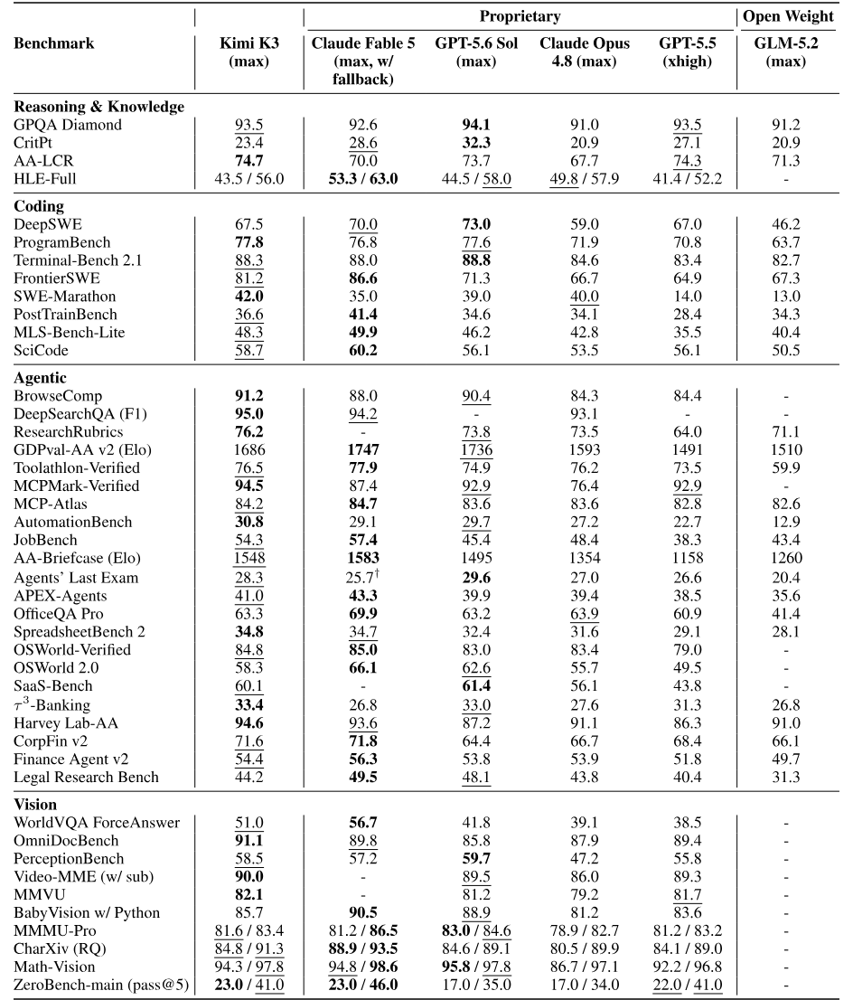

**表 2.** Kimi K3 と独自モデルおよびオープンウェイト モデルの性能比較。太字は各ベンチマークの最良の結果を示し、下線は 2 番目に良い結果を示します。

[表 2](#table-02) は、独自のベースラインとオープンソースのベースラインの両方に対する Kimi K3 の包括的な比較を示しています。全体として、Kimi K3 は、最強の独自モデルである Claude Fable 5 および GPT-5.6 Sol に僅差で及んでいますが、ベンチマーク スイート全体では常に Claude Opus 4.8、GPT-5.5、および GLM-5.2 を上回っています。以下に、コア機能ドメイン全体にわたる重要な観察結果を示します。

**推理と知識.** 大学院レベルの推理では、Kimi K3 は最前線に匹敵し、GPQA ダイヤモンドで 93.5% のスコアを獲得しました。ただし、研究レベルのタスクではギャップが残っています。HLE-Full では、ツールありとツールなしの両方で Claude Fable 5 と GPT-5.6 Sol をそれぞれ 56.0% と 43.5% で下回っています。また、CritPt のスコアは 23.4% で、Claude Fable 5、GPT-5.6 Sol、GPT-5.5 に遅れをとっており、研究レベルの推論が依然として改善の重要な方向性であることを示しています。

### 6.2 内部評価

#### 6.2.1 能力評価

公開ベンチマーク スイート以外にも、公開評価では十分にカバーされていない機能領域を対象とした社内ベンチマークのコレクションを維持しており、モデルとエージェントの機能をより包括的に測定できます。これらのベンチマークは頻繁に更新および拡張されるため、モデルの進化する故障モードを厳密に追跡し、データとトレーニングの反復を直接ガイドできます。これらは、コーディング能力と経験、一般的なエージェントの経験、会話の経験という 3 つのカテゴリに大別されます。[表 3](#table-03) は、これらのベンチマーク全体の結果を示しています。

<span id="table-03"></span>

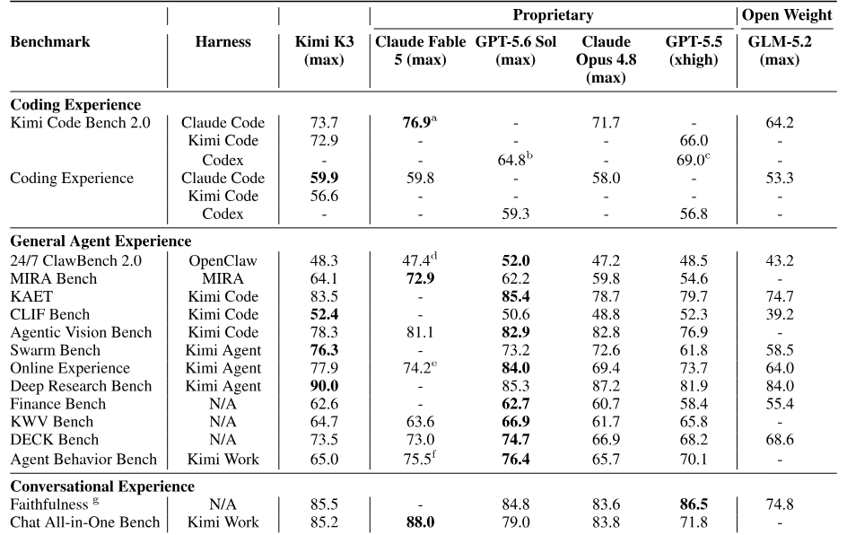

**表 3.** 社内ベンチマーク スイートの結果。太字は、ベンチマークごとに報告された最良の結果を示します。ダッシュはレポートに含まれていないスコアを示します。

#### コーディング能力と経験

- **Kimi Code Bench 2.0(KCB 2.0):** は、幅広いプログラミング言語と実稼働指向のテクノロジ スタックにわたる現実的なエンドツーエンドのソフトウェア エンジニアリング タスクでコード エージェントを評価します。

- **Kimi Webdev Bench:** は、実際の使用シナリオから抽出された困難な Web 開発プロンプトに関するモデルを評価し、専門家の盲目的な判断を通じて出力を比較します。その結果を[表 4](#table-04) に示します。

<span id="table-04"></span>

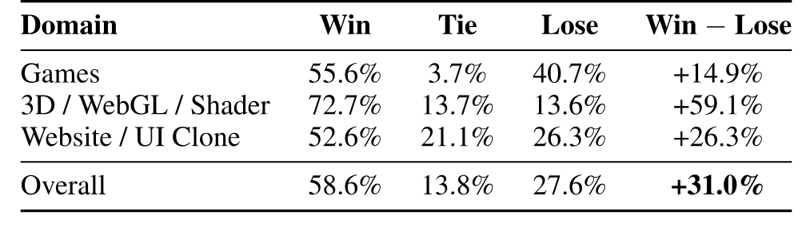

**表 4.** Kimi Webdev Bench の結果: コードの品質、機能の完全性、視覚的な忠実度、およびインタラクション エクスペリエンスを専門家が盲目的に判断した結果、Kimi K3 と Claude Opus 4.8 が比較されました。

- **コーディング エクスペリエンス:** は、実際の開発ワークフローでコーディング エージェントとしてモデルを操作する実践的な経験を評価します。

#### 一般的なエージェントの経験

- **24/7 ClawBench 2.0:** は、タスクが複数日に渡り、イベントが同時に到着し、中断が定期的に発生する、常時稼働のアシスタント作業をシミュレートします。

- **Multi-Agent Infra for Routing and Assignment (MIRA) Bench:** は、ロングチェーン、マルチロール、マルチシステムのエンタープライズ コラボレーション タスクを評価し、エージェントがエンドツーエンドの作業を実行できるかどうかを評価し、組織化するかサブエージェントに委任するタイミングを判断します。

- **Kimi 自律実行タスク (KAET):** は、実際のユーザー要求とエンタープライズ システム操作をシミュレートするタスクに対する長期的な自律実行を評価します。

- **コンテキスト学習および命令追従 (CLIF) ベンチ:** はコンテキスト内学習をターゲットにしており、複数の複雑なスキルを交互に組み込んだ指示に従いながら、モデルが提供されたコンテキストから学習する必要があります。

- **Agentic Vision Bench:** は、エージェントがタスクの実行中に主要な視覚的事実に気づき、正しく使用しているかどうかを評価します。

- **Swarm Bench:** は、調整された分解と並列実行の恩恵を受ける複雑なタスクでエージェント群 [Kim26a] を調整するモデルの能力を評価します。

- **オンライン エクスペリエンス:** は、実際のオンライン エージェントの使用状況の分布を反映し、ユーザーが最も頻繁に要求する配信可能なファイル タイプのパフォーマンスを測定します。

- **Deep Research Bench:** は、ドメインの専門家によって厳選され、専門家と連携したルーブリックで等級付けされたディープ リサーチ スタイルのクエリに基づいてモデルを評価します。

- **Finance Bench:** は、ソース資料からレビュー可能な成果物に至るまで、完全なワークフローのエンドツーエンドの実行を必要とする現実的な財務作業に関するモデルを評価します。

- **ナレッジ ワーク ビジョン (KWV) ベンチ:** は、実際のナレッジ ワーク シナリオから抽出されたタスクから抽出されたアトミックな視覚能力を評価します。

- **DECK ベンチ:** は、実際の使用シナリオから抽出されたタスクの説明から高品質のプレゼンテーション資料を作成する能力を測定します。

- **エージェント行動ベンチ:** は、エージェントの評価を結果の正確さからプロセスの品質に拡張し、タスクの完了とともにツールの使用行動、効率、規律をスコアリングします。

#### 会話体験

- **忠実度:** は、各応答がファクト チェッカーによって検証され、モデル応答における事実の幻覚率を測定します。

- **Chat オールインワン ベンチ:** は、実際のオンライン ユーザーのニーズに基づいて設計されたシナリオを使用して、製品使用のあらゆる段階での会話エクスペリエンスを測定します。

**Evaluation Configurations.** ベンチマークがハーネスごとに個別の行に分割されていない限り、[表 3](#table-03) のハーネス列には、Kimi K3 に使用されるハーネスがレポートされます。その他のモデルについては、Claude モデルと GLM-5.2 は Claude Code で評価され、GPT モデルは Codex で評価されます。例外は、すべてのモデルが同じ指定されたハーネスを使用するベンチマークです。OpenClaw for 24/7 ClawBench 2.0。 MIRA (Multi-Agent Infra for Routing and Assignment)、MIRA Bench 用の内部配電外ハーネス。キミはエージェント行動ベンチとチャットのオールインワンで働いています。 CLIF および Agentic Vision Bench 用の Kim Code です。

**Results.** 社内スイートは、公開ベンチマークよりも Kimi K3 の強みと弱みを明確に区別します。最も明確な強みは、オーケストレーションおよびリサーチ型の代理店です。Kimi K3 は、Swarm Bench (76.3) および Deep Research Bench (90.0) を圧倒的な差でリードしており、複雑な目標を分解し、並行作業を調整し、ルーブリックを満たす成果物を作成する能力が高いことを示しています。コーディングも同様に強みです。Kimi Code Bench 2.0 では、Claude Fable 5 に次ぐスコアであり、コーディング エクスペリエンスで最高のスコアを獲得しています。これは、コーディング エージェントとしての実際の動作 (通信品質、動作の適切性、指示に従う安定性) が生のタスク スコアよりも優れていることを示唆しています。 Kimi Webdev Bench では、専門家審査員は Claude Opus 4.8 よりも +31.0 ポイントの全体マージンで Kimi Webdev Bench を好んでおり、3D/WebGL/シェーダー タスクで最大の利益を得ています。専門的な知識の作業も前世代に比べて著しく改善されており、Finance Bench は基本的に GPT-5.6 Sol と連携しています。

Kimi K3 は、主に Agent Behavior Bench、MIRA Bench、24/7 ClawBench 2.0、Agentic Vision Bench、および KWV Bench でリーダーの後を追い続けています。残りの満席のスイート (KAET、CLIF Bench、Online Experience、DECK Bench、Faithhood、および Chat All-in-One Bench) では、Kimi K3 が 1 位または僅差で 2 位にランクされています。

#### 6.2.2 サイバーセキュリティ評価

私たちは、運用リスクの増大の 2 段階の進行に沿ってモデルのサイバーセキュリティ機能を評価します。概念実証開発による脆弱性発見 (段階 1)、およびエンドツーエンドのエクスプロイト開発 (段階 2) です。評価対象には、実稼働サービスやコードベースを含む社内インフラストラクチャだけでなく、広く導入されているソフトウェア オペレーティング システムのカーネル コンポーネントやオープンソース プロジェクトの最新バージョンも含まれます。すべてのタスクは、実際の展開を代表する標準構成で実行されます。 Anthropic と OpenAI のフロンティア モデルはサイバー関連のタスクを拒否するため、比較可能な評価を実行できません。したがって、それらをこのスイートから除外します。

#### 脆弱性の発見 (Tier 1)。

この層は、既知の脆弱性を再現するのではなく、現在のコードベース内の本物のバグを特定し、それらが再現可能であることを実証することをモデルに課します。これらの機能は主に防御セキュリティ研究に関連しています。

このモデルは、オペレーティング システム カーネル、データベース、AI サービス、Web フレームワーク、ブロックチェーン、VPN ソフトウェアにまたがる、広く展開されている数十のシステムにわたって、数百の脆弱性の候補を特定しました。人間によるレビューを受けた調査結果のうち、6 つのプロジェクトにわたる 16 件のこれまで知られていなかった脆弱性を含む、約 70% が本物であることが確認されました。

Linux カーネルに関する 2 つの発見は、これらの結果の深さを示しています。まず、モデルはリモートでトリガー可能なヒープの境界外書き込みを特定しました。このバグは不完全なアップストリーム修正によって導入され、最新のアップストリーム コードまでのその後のすべてのリリースに影響します。セキュリティの専門家は、これがリモートのサービス拒否のプリミティブであることを確認しました。 2 番目に、モデルは RDMA サブシステムの Dirty-COW クラスの脆弱性を特定しました。以前のアップストリーム修正により、誤って権限チェックが削除され、カーネル側で読み取り専用メモリ ページへの書き込みが可能になってしまいました。セキュリティの専門家は、これが決定的なローカル特権昇格プリミティブであることを確認しました。

**エクスプロイト開発 (層 2).** この層では、モデルが脆弱性を有効なエンドツーエンドのエクスプロイトに変換する必要があり、悪用リスクに最も直接関連する層です。 2 つのトラックにわたる 36 のタスクからなる社内スイートを使用して、ベースラインとして GLM-5.2 に対して評価します。

**ユーザー空間の活用 (16 タスク).** このモデルは、PostgreSQL、XWiki コラボレーション プラットフォーム、Apache HTTP サーバー、およびいくつかのコンテンツ管理システムやその他のアプリケーションを含む、広く展開されているユーザー空間ソフトウェアで実際の CVE をエンドツーエンドで活用する必要があります。タスクごとに、モデルには完全なソース コードとライブ インスタンスが与えられます。ターゲットは追加の強化を行わずに標準構成で実行されます。

**Linux カーネルの活用 (20 タスク).** 各タスクは、過去のカーネル CVE から構築された再現可能な QEMU 環境を提供します。モデルは、特権のないユーザーから root に権限を昇格する C エクスプロイトを記述する必要があります。軽減策は難易度ごとに段階的に有効になります。

スイート内のすべてのタスクは、人間のセキュリティの専門家によって解決可能であることが検証されています。完全なスイートを完了するには、およそ 540 時間のエキスパート時間、つまり 1 タスクあたり平均約 15 時間かかると見積もっています。

**エクスプロイト スイートの結果。** このモデルは、このスイートで有意義なエクスプロイト開発機能を実証し、36 タスク中 14 タスク (38.9%) を解決しましたが、GLM-5.2 では 36 タスク中 8 タスク (22.2%) を解決しました。ただし、その成功は不均等に分布しており、14 件中 10 件はユーザースペース トラックによるものです。カーネル トラックでは、どちらのモデルもタスクの 4 分の 3 を解決できません。

すべてのタスクは人間の専門家によって解決できるため、未解決のタスクによって、人間レベルの能力に対するモデルの残りのギャップが直接測定されます。軌跡分析では、このギャップは繰り返される 4 つの障害モードに起因すると考えられます。(i) すでに取得したプリミティブからエクスプロイト チェーンの最終段階を完了するのが難しい。 (ii) データのみの攻撃の方が簡単で信頼性が高いにもかかわらず、制御フローのハイジャックを継続するなど、緩和策の下での不適切な戦略の選択。 (iii) 長期にわたる非生産的なデバッグ ループに陥る。 (iv) 提出前の最終成果物の検証が不十分であること。

**summary.** このモデルのサイバー能力は、階層 1 および階層 2 内のユーザー空間の活用において最も強力ですが、人間の専門家との明らかな差は依然として残っています。本質的に防御的な階層 1 では、モデルはこれまで知られていなかった脆弱性を含む真の脆弱性を特定し、その再現性を実証します。階層 2 では、ユーザー空間ターゲットに対するエンドツーエンドのエクスプロイトを完了します。しかし、強化されたターゲットに対しては、完全なエクスプロイト チェーンを完了することが依然としてボトルネックとなっており、専門家が解決できるタスクの多くは未解決のままです。

英国 AI セキュリティ研究所と NIST の AI 標準イノベーションセンター (CAISI) [Pre26] による独立した共同評価では、私たちの結論と一致する結論に達しています。 Kimi K3 は、エクスプロイト開発に関しては GLM-5.2 よりも優れています (ExploitBench では 32% 対 24%、人間の専門家が約 20 時間かかる 32 ステップのシミュレートされたエンタープライズ ネットワークでは 17 対 11 ステップ) が、エンドツーエンドのエクスプロイト完了に関しては最前線のサイバー対応モデルに劣り、41 タスク中 0 タスクで任意のコード実行を達成しました。

私たちは評価を能力の下限とみなしています。これらの結果は現在のモデルのバージョンと評価カバレッジに基づいており、主要なモデルの更新ごとに再調査されます。

### 6.3 第三者評価

Kimi K3 はリリース以来、第三者機関による独自の評価も受けています。[表 5](#table-05) は、2026 年 7 月 23 日時点のヘッドライン結果をまとめたものです。

<span id="table-05"></span>

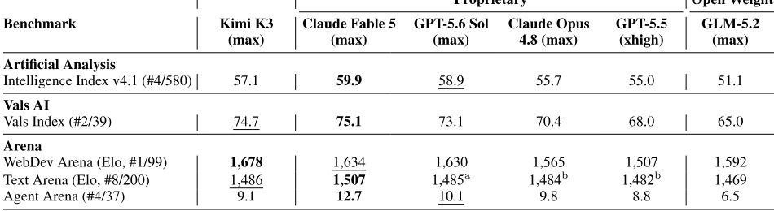

**表 5.** 2026 年 7 月 23 日時点の Kimi K3 のヘッドライン独立第三者評価。

#### Artificial Analysis

Artificial Analysis は Kimi K3 [Art26] を評価しました。 Kimi K3 は、インテリジェンス インデックス v4.1 の 57.1 を達成し、580 モデル中 4 位にランクされます。GPT-5.6 Sol エフォート バリアントを 1 つのエントリとしてカウントした場合は、Claude Fable 5(59.9) および GPT-5.6 Sol(58.9) に次ぐ 3 位で、他のすべての評価モデルを上回ります。

**Vals AI.** Vals AI の GDP 加重業界ベンチマーク スイート [Val26c] では、Kimi K3 は Vals 指数 (74.7%) の 39 モデル中 2 位にランクされ、Claude Fable 5(75.1%) に次いで GPT-5.6 Sol を上回っています。 (73.1%)。

**Arena.** クラウドソーシングの人間優先アリーナ [Lea26] では、Kimi K3 が WebDev Arena の 99 モデル中 1 位にランクされています (Elo 1,678、Claude Fable 5 の 1,634 を上回っています) - このリーダーボードでトップに立った最初のオープン モデル - および 200 モデル中 8 位にランクされています。 Text Arena (1,486 Elo) で。 7 月 19 日頃に投票が開始されたエージェント アリーナでは、Kimi K3 は現在、Claude Fable 5(12.7)、GPT-5.6 Sol(10.1)、および Claude Opus 4.8(9.8) に次いで、37 件中 4 位 (9.1) にランクされています。

### 6.4 コスト効率

スコアだけでなく、コーディングとエージェント タスクをカバーする 4 つのスイート (Kimi Code Bench 2.0、BrowseComp、GDPval-AA v2、および AA-Briefcase) にわたるタスクごとのコストとスコアを比較することで、推論のコスト効率を調べます。 Kimi Code Bench 2.0 のコストは内部で測定され、Kimi K3 は Kim Code 経由で実行され、他のすべてのモデルは Claude Code 経由で実行されます。

BrowseComp の場合、Kimi K3 のコストは独自の実行から測定されますが、Claude と GPT のコストは公開されているチャート [Sol26、Son26、Son26a] から引用されています。 GDPval-AA v2 および AA-Briefcase のコストは、2026 年 7 月 23 日時点の Artificial Analysis のペイパートークン API 価格 [Art26] から引用されています。

Kimi Code Bench 2.0 では、Kimi K3 はコストの 38% で Claude Fable 5 に 4.0 ポイントの差があり、高いエフォートではコストの約 3 分の 1 で Claude Opus 4.8 の最大エフォート スコアにすでに匹敵します。 BrowseComp では、Kimi K3 はタスクあたり \$2.03で最高のスコア (91.2%) を達成しました。これは、コストが GPT-5.6 Sol(90.4%) の半分であり、最大の努力でクロード モデルよりも桁違いに安価です。 GDPval-AA v2では、Kimi K3は GPT-5.6 Solの 50 Elo 以内で 13% コストが低く、$ 2.6\times$は Claude Fable 5 より安価です。 AA-Briefcase では、Claude Fable 5 の約半分のコストで、Claude Fable 5 に次いで 2 番目に良いスコアを実現します。[図 13](#figure-13) は比較をまとめたものです。全体として、Kimi K3 は 4 つのスイートすべてにおいてコスト効率の最前線かそれに近いレベルにあり、特に Claude Fable 5 の数分の一のコストで最高に近いスコアを実現します。

<span id="figure-13"></span>

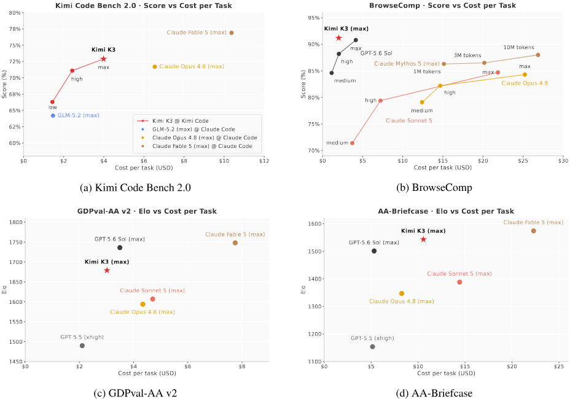

**図 13.** Kimi Code Bench 2.0、BrowseComp、GDPval-AA v2、および AA-Briefcase のスコアとタスクごとの推論コスト。 Kimi K3 には星が付いています。

## 7 ケーススタディ

このセクションでは、さまざまな技術的タスクにわたる Kimi K3 の機能を実証する代表的なケースを紹介します。

#### GPU カーネルの最適化

モデルが GPU kernel を最適化する能力を検証しました。各モデルは同一構成の sandbox で独立に動作し、profiling、書き換え、benchmark を含む各タスクに最大 24 時間を与えます。対象は NVIDIA Hopper GPU と別ベンダーの GPGPU 上で動く四つの代表的な kernel、AttnRes、DeepSeek Sparse Attention (DSA)、KDA、head dimension 512 の MLA です。Kimi K3 は全 kernel の性能を大きく改善し、AttnRes の latency を 283.6 ms から 114.4 ms へ短縮、DSA と KDA の実行時間をそれぞれ 55.1% と 73.6% 削減し、MLA では peak TFLOPS の半分以上へ到達しました。これらのタスクで Kimi K3 は fallback ありの Claude Fable 5 [Fab26] と同等で、Claude Opus 4.8 [Opu26]、GPT-5.6 Sol [Sol26]、GPT-5.5 [Ope26] を大きく上回りました。[図 14](#figure-14) は AttnRes における各モデルの最適化過程を比較します。また benchmark に限らず、開発後期の kernel 最適化作業の大半は、すでに初期の Kimi K3 checkpoint が担っていました。

<span id="figure-14"></span>

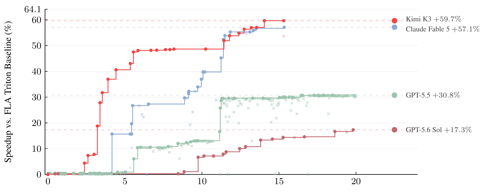

**図 14.** AttnRes の GPU カーネル最適化の軌跡。

**GPU コンパイラの開発。** Kimi K3 は、カスタム タイル レベルを備えたコンパクトな Triton に似た [Til19] コンパイラである MiniTriton([repository](https://github.com/MoonshotAI/minitriton)) を開発しました。 Python フロントエンドおよびレイアウト システム、軽量のワープ レベル MLIR [Lat21] アノテーションおよび最適化レイヤー、および並列スレッド実行 (PTX) コード生成パイプライン。コンパイラを中心に構築されているのは、PyTorch のような [Pas19] 高レベル インターフェイスを備えたデュアルモード テンソル ライブラリであり、その積極的および前方専用コンパイル済みパスは同じ DSL コンパイラとランタイムを共有します。このライブラリはさらに、リバース モード autograd、ニューラル ネットワーク モジュール、NCCL [NccWeb] 上の分散トレーニング プリミティブ、およびスパースおよび視覚化プリミティブを提供します。 NVIDIA L20 では、MiniTriton はコア ベンチマーク スイートよりも幾何平均で PyTorch 熱心な [Pas19] および torch.compile [Ans24] よりも優れています。スクラッチからのテンソルコア Matmul パスは、最大形状で cuBLAS [Cub26] に近づき、測定されたマシン ルーフの約 90% に達します。一方、DSL レベルの KDA [Tea25b] プレフィル カーネルは、一致する Triton リファレンスを明らかに上回っています。また、MiniTriton は、PyTorch リファレンスを厳密に追跡する損失曲線を使用して GPT モデルをエンドツーエンドでトレーニングします。フルモデルの勾配は、FP64 リファレンスと比較して測定されたトーチ独自の FP32 丸め誤差 $10^{-4}$ のみでトーチの autograd と異なります。まとめると、これらの結果は、Kimi K3 が、分離されたカーネルのコレクションではなく、DSL フロントエンドおよび IR パスから PTX コード生成および CUDA ランタイムに至る一貫したエンドツーエンド コンパイラーを構築できることを示しています ([図 15](#figure-15))。

<span id="figure-15"></span>

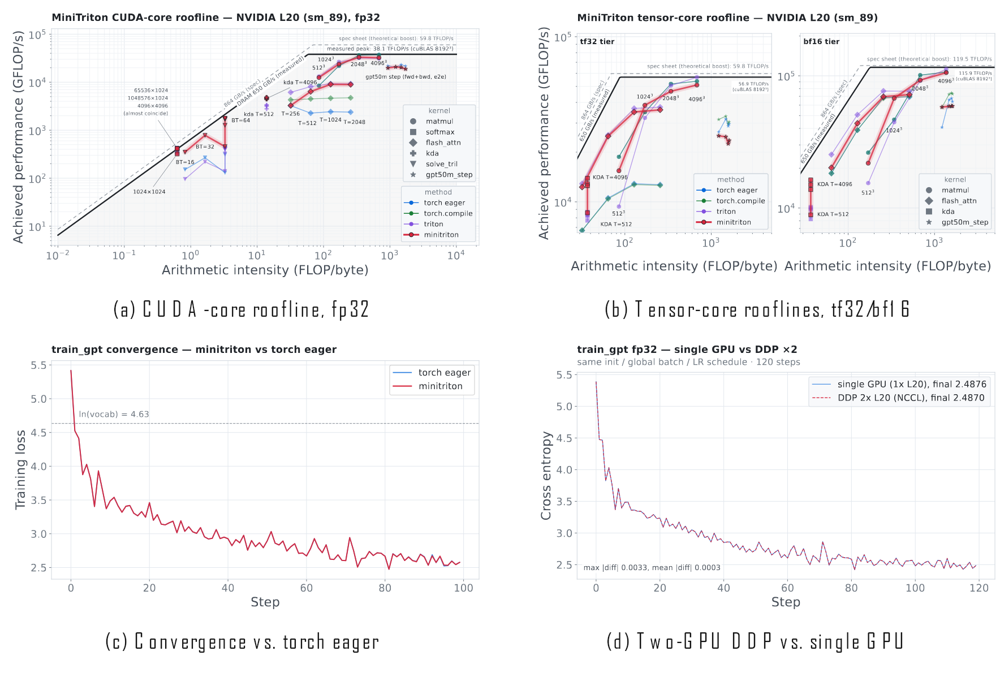

**図 15.** MiniTriton を使用した GPU コンパイラー開発: CUDA コアとテンソルコアのルーフライン、GPT トレーニング損失、および 2 GPU データ並列トレーニング。

#### チップ設計

初期の概念実証として、Kimi K3 は、グループごとの INT4 重み量子化 (グループ サイズ 128) のもとで、同じアーキテクチャ、ハイブリッド KDA および NoPE-MLA アテンション、ブロック サイズ 2 のブロック AttnRes、および 1 人の共有エキスパートによるシグモイドベースの MoE ルーティングに従って、ナノ モデルの推論チップ プロトタイプを設計しました。 Kimi K3 は、Kimi Code を使用した 48 時間の自律実行で、オープンソース EDA ツールと Nangate45 スタンダード セル ライブラリ [Nan10] を使用してチップを構築、最適化、検証しました。 $4\,\mathrm{mm}^2$ 解析領域の予算内で、このデザインは 100 MHz でタイミングを閉じ、1.46M のスタンダード セル、0.277 MiB の SRAM、および融合逆量子化を備えた INT4 MAC アレイを統合して、8,700 トークン/秒を超える RTL シミュレーション デコード スループットを達成します。 RTL コードは GitHub ([repository](https://github.com/MoonshotAI/nano-kpu)) で入手できます。

#### 研究用のコーディング

計算天体物理学における I-Love-Q の普遍関係を再現するために、Kimi K3 は 20 以上の論文をレビューしてその結果を相互検証し、完全な数値パイプラインを実装し、300 以上の状態方程式を評価し、公開された数式の不一致を特定し、3,000 行を超える Python を記述し、インタラクティブな HTML ダッシュボードを作成しました。これを、経験豊富な場合は通常 1 ～ 2 週間かかるのに対し、約 2 時間で完了しました。研究者。

#### 知識労働

Kimi Work では、Kimi K3 が AI ASIC 業界の 42 年間をカバーするインタラクティブなリサーチ Web サイトを作成しました。このモデルは、2,800 以上の Web 検索と 1,100 以上の端末クエリを通じて、87 の四半期レポートと 99 のオリジナル PDF (11,000 ページ以上) のコーパスを利用して、120 回以上の反復改良を完了しました。 2 番目のケースでは、Kimi K3 は 20 を超えるサブエージェントを同時に使用して GWTC-5 での 391 件の重力波イベントを分析し、7 つの科学的視覚化、2 つの要約表、および 10 以上の論文の文献統合を生成しました。

**ビデオ編集とモーション デザイン。** ネイティブ マルチモーダル アーキテクチャを活用して、Kimi K3 は独自のアーキテクチャの 3Blue1Brown スタイルのモーション グラフィックス説明ツールを作成し、56 個のソース クリップからティーザー ビデオを編集しました。これには、クリップの選択、モーションに一致したカット、フレーム精度のビート同期、オーディオ処理、および複数回の改訂が含まれます。同等の高密度の短編ビデオを制作するには、経験豊富な編集者であれば通常 1 ～ 2 日かかります。

## 8 結論

Kimi Delta Attention および Attention Residuals をベースに構築された、ネイティブ ビジョン機能と 100 万トークンのコンテキスト ウィンドウを備えた、オープンな 2.8 兆パラメータの専門家混合モデルである Kimi K3 を紹介します。世界初のオープン 3T クラス モデルである Kimi K3 は、長期的なコーディング、エージェント、知識、推論、およびビジョン タスクにわたってフロンティア レベルのパフォーマンスを提供します。最強の独自モデルとの差はまだ残っていますが、Kimi K3 は誰もが手の届く新たなオープンフロンティアを確立します。これにより、より広範なコミュニティが研究、導入、イノベーションに力を発揮できるようになると期待しています。

## A 貢献

完全な寄稿者リストはオリジナルの PDF で入手でき、姓のアルファベット順に並べられています。

## B Sigmoid Tanh Unit GLU の詳細

SiTU-GLU([§2.3.2](#_2-3-2-sigmoid-tanh-unit-glu)) の設計目標は、Swish の特徴的な形状 (原点付近のほぼ線形応答と消失する負の尾部) を破棄することなく SwiGLU 積を結合することです。[図 4](#figure-04) は、ゲートおよびアップ分岐とその完全なスカラー応答を示しています。

#### 両方の枝を滑らかにキャップする

SiTU は、シグモイド係数 [Tea26a] を保持しながら、Swish の線形係数を $\beta_1\tanh(\mathbf W_g\mathbf x/\beta_1)$ として制限します。シグモイドはすでに負のゲート応答をゼロに向けて駆動しているため、この変更は主に負のテールを除去することなく、大きな正の活性化を制御します。 Kimi K3 は、$\beta_2\tanh(\mathbf W_u\mathbf x/\beta_2)$ と同じ構造を上ブランチに適用し、どちらかのブランチが製品を支配するのを防ぎます。

**ローカルで制限的な動作。** 原点付近のスカラー $z$ の場合、スケーリングされた正接は次の条件を満たします。

$$
\beta\tanh(z/\beta)=z+O(z^3/\beta^2).
\tag{18}
$$

したがって、SiTU-GLU は SwiGLU を原点付近の 1 次と一致させます。また、SwiGLU を $\beta_1,\beta_2\to\infty$ としてポイント単位で回復します。

**境界出力。** $|\tanh(z)|<1$ と $0<\operatorname{Sigmoid}(z)<1$ なので、すべての出力座標が満たされます。

$$
\|\operatorname{SiTU\text{-}GLU}(\mathbf x)\|_\infty\le\beta_1\beta_2=100.
\tag{19}
$$

ここでは $\beta_1=4$ と $\beta_2=25$ です。ゲートの事前アクティベーションのハード クランプとは異なり、スムーズ キャップは飽和境界から離れたゼロ以外の勾配を保持し、これによりトレーニング動作が向上することがわかりました。

## C Quantile Balancing の導出

この付録では [Su26] に従い、最適な均衡割当から [§2.3](#_2-3-stable-latentmoe) で用いる Quantile Balancing（QB）の更新式を導きます。expert の負荷分散を割当問題として捉える見方は、BASE Layers [Lew21] と BIP [Sun25a] にさかのぼります。$\mathbf s\in\mathbb R^{m\times n}$ は $m$ 個の token から $n$ 個の expert への router score をまとめたもので、各 token はちょうど $k$ 個の expert を選びます。$x_{i,j}\in\{0,1\}$ は token $i$ が expert $j$ へ割り当てられたかを表します。各 expert がちょうど $mk/n$ 個の token を受け持つ（整数と仮定する）最大 score の均衡割当は、次のように書けます。

$$
\max_{\mathbf x;\,x_{i,j}\in\{0,1\}}\sum_{i,j}x_{i,j}s_{i,j}
\quad\text{s.t.}\quad
\sum_jx_{i,j}=k,\qquad\sum_i x_{i,j}=\frac{mk}{n}.
\tag{20}
$$

**線形緩和と双対性。** $x_{i,j}\in\{0,1\}$ から $x_{i,j}\in[0,1]$ への緩和は、方程式 20 を線形プログラムに変換します。その最適値は、2 部構成の $b$ マッチング多面体の標準積分によって積分されます。したがって、緩和は正確です。トークン側とエキスパート側の等式制約にそれぞれ無料の乗数 $\alpha_i$ と $\beta_j$ を導入すると、緩和された問題は最大-最小形式で次のように書くことができます。

$$
\max_{\mathbf x;\,x_{i,j}\in [0,1]}\min_{\boldsymbol\alpha,\boldsymbol\beta}
\sum_{i,j}x_{i,j}s_{i,j}
-\sum_i\alpha_i\left(\sum_jx_{i,j}-k\right)
-\sum_j\beta_j\left(\sum_i x_{i,j}-\frac{mk}{n}\right).
\tag{21}
$$

$\mathbf x$、$\boldsymbol\alpha$、および $\boldsymbol\beta$ のそれぞれで目的は線形であり、実現可能セットは凸であるため、ミニマックス定理により最適化の順序を交換できます。

$$
\min_{\boldsymbol\alpha,\boldsymbol\beta}\max_{\mathbf x;\,x_{i,j}\in [0,1]}
\sum_{i,j}x_{i,j}(s_{i,j}-\alpha_i-\beta_j)
+k\sum_i\alpha_i+\frac{mk}{n}\sum_j\beta_j.
\tag{22}
$$

内部最大値はエントリ間で分離可能で、$s_{i,j}-\alpha_i-\beta_j>0$ の場合は $x_{i,j}^*=1$、$s_{i,j}-\alpha_i-\beta_j<0$ の場合は $x_{i,j}^*=0$ となります。タイケースの実際の測定値はゼロです。 $\mathbf x^*$ を代入すると、凸双対物レンズが得られます。

$$
\min_{\boldsymbol\alpha,\boldsymbol\beta}\mathcal L(\boldsymbol\alpha,\boldsymbol\beta):=
\sum_{i,j}\max(0,s_{i,j}-\alpha_i-\beta_j)
+k\sum_i\alpha_i+\frac{mk}{n}\sum_j\beta_j.
\tag{23}
$$

```pseudocode:line-numbers title="アルゴリズム 1：交互 QB ソルバー"
Input: score matrix s in R^(m x n)
Output: assignment x in {0,1}^(m x n)

Initialize beta = 0
for t = 1, 2, ..., T:
  alpha <- desc_sort(s - beta, axis=1)[:, k:k+1]
  beta  <- desc_sort(s - alpha, axis=0)[mk/n:mk/n+1]
return x, where x[i,j] = 1 iff j is in argtop_k(s[i] - beta)
```

**正確な座標の最小化。** $\boldsymbol\beta$ を固定して $\boldsymbol\alpha$ を解くこと、またはその逆を交互に解くことによって、式 23 を最小化します。各部分問題は閉じた形式の厳密な解を許容します。 $\boldsymbol\beta$ が修正されると、問題はトークンを介して切り離され、トークン $i$ については解決されます。

$$
\min_\alpha k\alpha+\sum_j\max(0,s_{i,j}-\beta_j-\alpha).
\tag{24}
$$

この目標は、$\alpha$ で区分的に線形であり、傾き $k$ からマージンの数 $s_{i,j}-\beta_j$ を差し引いた値が $\alpha$ を超えます。したがって、$k$ マージンが $\alpha$ より上にあるとき、つまり、$\mathbf s_i-\boldsymbol\beta$ の $k$ 番目と $(k+1)$ 番目の最大エントリの間の任意の $\alpha_i^*$ について、正確に最小化されます。慣例により、$(k+1)$ 番目に大きいエントリ、つまり $(1-k/n)$ 番目の分位数を取得します。

$$
\alpha_i^*=\operatorname{quantile}_{1-k/n}(\mathbf s_i-\boldsymbol\beta).
\tag{25}
$$

対称的に、$\boldsymbol\alpha$ が固定されている場合、エキスパート $j$ は $\min_\beta \frac{mk}{n}\beta+\sum_i\max(0,s_{i,j}-\alpha_i-\beta)$ を解きます。その最小化子は、$\mathbf s_{:,j}-\boldsymbol\alpha$ の $(mk/n+1)$ 番目に大きいエントリであり、やはり $(1-k/n)$ 番目の分位です。

$$
\beta_j^*=\operatorname{quantile}_{1-k/n}(\mathbf s_{:,j}-\boldsymbol\alpha).
\tag{26}
$$

したがって、両方の更新はそれぞれトークン軸とエキスパート軸に沿った同じ分位数であり、これがメソッドの名前の由来となっています。図５は、エキスパート側の更新が、各エキスパートのマージン分布の受け入れられた上裾を均等化するものとして示しており、Ａｌｇ． 1 は、結果として得られる交互ソルバーを要約したものです。

**割り当てからルーティングまで。** 式 23 の最適化では、$s_{i,j}-\alpha_i^*-\beta_j^*>0$ の場合に限り、$x_{i,j}^*=1$。トークン制約 $\sum_jx_{i,j}^*=k$ と組み合わせると、選択されたエキスパートはまさに $\mathbf s_i-\boldsymbol\beta^*$ の Top-$k$ エントリになります。したがって、ルーティングにはエキスパートしきい値 $\boldsymbol\beta\in\mathbb R^n$(式 13 のバイアス $\mathbf b=-\boldsymbol\beta$ と同等) のみが必要ですが、トークンしきい値 $\boldsymbol\alpha\in\mathbb R^m$ は動的トレーニング バッチに関連付けられた中間変数であり、破棄されます。この非対称性により、トレイン推論の一貫性が維持されます。デプロイメント時には、ルーティングは固定されたバイアスを持つ固定 Top-$k$ 選択となり、分位点の計算は必要ありません。

**符号ベースの無損失更新との関係。** 式 26 の基礎となるエキスパート側の部分問題には (部分) 勾配があります。

$$
\frac{\partial\mathcal L}{\partial\beta_j}=\frac{mk}{n}
-\sum_{i=1}^{m}\chi(s_{i,j}-\alpha_i-\beta_j>0).
\tag{27}
$$

つまり、ターゲット負荷からエキスパート $j$ の観測負荷を引いたものです。この目的の SignSGD ステップは、符号規則 $\mathbf b=-\boldsymbol\beta$ まで、補助損失のないバランシング [Dee24a] の固定ステップの符号更新を回復します。符号の更新は式 27 の負荷誤差の方向のみを保持しますが、QB は同じ二重目的の正確な座標最小化装置に直接ジャンプします。このビューは、QB が学習率のようなハイパーパラメータを必要としない理由と、ほぼ $10^3$ の専門家であっても数回の更新ステップ内で平衡化する理由の両方を説明します。 QB も同様に BIP [Sun25a] に関連しており、不等式制約 $\sum_jx_{i,j}\le k$ および $\sum_i x_{i,j}\le mk/n$ を使用して同じ割り当てを解決します。 $\boldsymbol\alpha$ と $\boldsymbol\beta$ に誘発された非負性制約により、両方の更新に $\max(0,\cdot)$ クリッピングが追加されます。これにより、過小選択されたエキスパートは促進されず、過剰に選択されたエキスパートのみが抑制され、実験の平衡化が著しく遅くなります。最後に、結果の固定トップ $k$ ルーティングは、エキスパート固有のしきい値ルーティングに関連していますが、EMA しきい値を維持し、トークン [Sun26] ごとに選択されたエキスパートの可変数を許可するエキスパートしきい値ルーティングとは異なります。

## D ヒストグラムに基づく分位点推定

式 14 の QB 更新では、トレーニング ステップ全体にわたって取得される分位数が要求されます。$n$ エキスパートのそれぞれについて、マージン $s_{i,j}-\alpha_i$ の $(1-k/n)$ 番目の分位数が求められます。ここで、トークン数 $m$ は、データ並列ランクと勾配累積ステップ全体でシャーディングされた数百万のトークンに及びます。正確な分位数の $O(mn)$ マージンを収集することは、トレーニング ループ内では非現実的です。

重要な観察は、更新にはマージン自体は必要なく、ヒストグラムが固定コストで要約するエキスパートごとの分布のみが必要であるということです。したがって、Kimi K3 はエキスパートごとにビン化されたヒストグラムを維持し、そこから分位数を読み取ります。具体的には、必要なバイアス $r_{i,j}:=\alpha_i-s_{i,j}$、つまりエキスパート $j$ をトークン $i$ のカットオフに正確に配置するバイアスをヒストグラム化します。マージンを否定すると順序が逆になるため、式 14 の QB ターゲット $b_j$ は、まさに $\mathbf r_{:,j}$ の $(k/n)$ 分位数になります。

#### ビニング範囲

最初の質問は、どの間隔でビン化するかということですが、ここで必要なバイアスが役に立ちます。その範囲は現在のバイアス自体によって制限されます。ルータースコアはシグモイド出力であるため、$s_{i,j}\in(0,1)$、カットオフ $\alpha_i$ 自体は、一部の専門家 $j'$ のバイアスされたスコア $s_{i,j'}+b_{j'}$ であるため、$(b_{\min},1+b_{\max})$ 内にあり、$b_{\min}$ と $b_{\max}$ が現在のバイアスの両端になります。したがって、すべての $r_{i,j}$ は $[b_{\min}-1,b_{\max}+1]$ に分類されます。この間隔を $B$ 均一ビンに分割し、ステップごとに範囲を再計算します。これにより、ビン幅 $w=(b_{\max}-b_{\min}+2)/B$ は、不均衡を修正するために分散するバイアスに適応したままになります。

#### 蓄積と回収

残りの手順はトレーニング ステップの構造に従います。各順方向パス中に、すべてのランクはローカル $r_{i,j}$ 値をエキスパートごとのカウント行列 $\mathbf H\in\mathbb N^{n\times B}$ に分散加算し、通信なしですべてのマイクロバッチにわたって累積します。ステップの最後に、単一の all-reduce によってローカル カウントがグローバル ヒストグラムに合計され、すべてのランクが同じプールされたカウントから分位数を回復します。各エキスパートのヒストグラムはすべてのトークンを 1 回カウントするため、ターゲット ランクは正確に $q=mk/n$([§2.3.3](#_2-3-3-quantile-balancing)) となり、ステップ全体が引き継がれます。累積カウントが $\lceil q\rceil$ に達する最初のビンを選択し、その中で線形補間します。ビン $\ell_j$ が選択され、その前に累積カウント $c_j$ があり、その内側に $h_j$ カウントがあり、その後 $b_j=b_{\min}-1+(\ell_j+\operatorname{clip}((q-c_j)/h_j,0,1))w$ となり、結果として生じるバイアスは式 14 のように平均中心になります。

**Properties.** 3 つのプロパティにより、この推定ツールは大規模に実用的になります。まず、正確です。累積カウントはビンの端で正確であるため、真の分位値とその推定値は同じビン内にあり、誤差はビン幅 $w$ によって制限されます。 $B=1000$ の場合、これはせいぜい数 $10^{-3}$ であり、測定可能な残留負荷の不均衡は観察されません。第二に、安価です。唯一の通信は、$m$ とは独立した、ステップごとのレイヤーごとの $nB$ 値の 1 つの整数 all-reduce です。この構成では、これは、自然な代替手段であるマイクロバッチごとのプロセス グループ上で生のマージンを交換するコストの 1% 未満です。 3 番目に、適切な量を推定します。カウントは加算的なため、グローバル ヒストグラムは、ランクまたは累積ステップ間でトークンがどのように分割されるかに対してまったく不変であり、推定値はランクごとの分位数の平均ではなく、プールされたグローバル バッチの分位数であり、通常は異なります。さらなる改良として、ステップ全体で推定分位数の指数移動平均を維持すると、バッチ間のサンプリング ノイズが減少し、ロード バランスをさらに改善できます。

## E MoonEP の一般上界の証明

$m_r(P)$ が、計画 $P$ の下でランク $r$ に配置された余剰専門家の数を示すものとします。ルーター出力 $I$ の場合、計画の目的は、任意のランク (つまり $M(I)=\min_P\max_r\{m_r(P)\}$) の冗長エキスパートの最大数を最小限に抑えることです。 $M(I)\le E/R$ が常に成り立ち (定理 1)、この境界が本質的に厳密であることを証明します。つまり、$M=\lceil E(R-1)/R^2\rceil\approx E/R$ となるルーター出力が存在します (定理 2)。

#### 定理 1 の証明 (一般的な上限)

目標は、$M(I)\le E/R$ がルーター出力 $I$ に対して成り立つことを証明することです。重要な補題は、すべての EP ランクがまったく同じ数のトークン $S\times K$ を受け取り、各ランクのリモート トークンが他の 1 つの EP ランクからのみ取得されるようなプラン $P^*$ が存在するということです。最初は、各ランクはローカル トークンのみを保持し、ランクは過負荷または過負荷として分類されます。それぞれを繰り返し 1 つ選択し、過負荷のランクからトークンを移行して、過負荷のランクを $S\times K$ に正確に埋めます。充填するたびに 1 つの過小負荷ランクのバランスがとられ、その後は変更されないため、最大でも $R-1$ が充填された後でプロセスが終了します。各ランクは最大 1 回だけ満たされるため、そのリモート トークンは単一のランクから取得されます。ランク $r$ のリモート トークンがランク $s$ からのものである場合、それらはランク $s$ の最大でも $E/R$ のローカル エキスパートに属し、したがって $m_r(P^*)\le E/R$ になります。

$$
M(I)=\min_P\max_r\{m_r(P)\}
\le\max_r\{m_r(P^*)\}\le\frac ER.
\tag{28}
$$

#### 定理 2 (上限の厳密性) の証明

ルーター出力 $I^*$ を次のように構築します。EP ランク 0 のエキスパートはトークンを受け取りませんが、他の $R-1$ ランクのすべてのエキスパートはすべてのトークンを均等に共有します。次に、すべての $S\times K\times R$ トークンが $E(R-1)/R$ エキスパート間で均等に分配されるため、各エキスパートは $SKR^2/[E(R-1)]$ トークンを受け取ります。どのプラン $P$ においても、ランク 0 は $S\times K$ トークンを受け取る必要があります。これらのトークンはすべてリモートであり、これらのトークンには少なくとも $E(R-1)/R^2$ の個別の専門家が関与します。上限を考えると、ランク 0 には少なくとも $\lceil E(R-1)/R^2\rceil$ の冗長エキスパートが必要であるため、$M(I^*)\ge\lceil E(R-1)/R^2\rceil$ になります。逆に、定理 1 による充填手順では、専門家による移行が優先され、すべてのランクがこの値内に維持されるため、平等が成り立ちます。 $R$ が大きいときは $E(R-1)/R^2\approx E/R$ なので、定理 1 の上限は本質的に厳しいです。

## F チャット テンプレート

<span id="figure-16"></span>

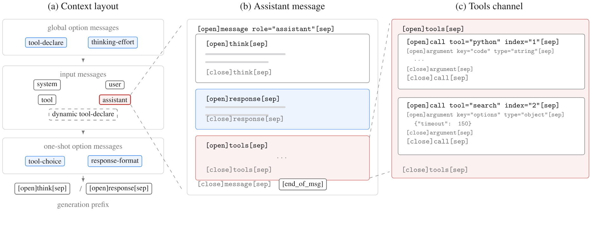

**図 16.** Kimi K3 チャット テンプレートの構造: コンテキスト レイアウト、アシスタント メッセージ チャネル、およびインデックス付き並列ツール呼び出し。

Kimi K3 チャット テンプレートは、3 つの目標を中心に再設計されました。 1 つ目は拡張性です。新しい機能は、単一のテンプレートがモデル生成全体に対応できるように、テンプレートのリビジョンではなく、下位互換性のあるメッセージ形式を通じて導入する必要があります。 2 つ目は、調整負荷が低いことです。形式は最小限の教師ありデータで学習可能であり、軽く微調整された事前トレーニング済みモデルが直接強化学習に進むことができるパイプラインをサポートする必要があります。 3 つ目は、デコードのしやすさです。構造は、単純なエンコーダー、ストリーミング パーサー、および文法に制約のあるエンフォーサーを許容する必要があります。これらの目的を達成するために、テンプレートは XTML (eXtensible Token Markup Language) を採用しています。XTML (eXtensible Token Markup Language) は、山かっこ構文が 3 つの予約された特別なトークンで置き換えられた XML のようなマークアップです。

#### メッセージとゾーン

コンテキストの最上位単位はメッセージであり、メッセージは発信元によって 2 つのカテゴリに分類されます ([図 16a](#figure-16))。入力メッセージはリクエストのメッセージ フィールドをシリアル化し、使い慣れたシステム、ユーザー、アシスタント、ツールの役割をカバーします。オプション メッセージは、リクエスト オプションをモデルがコンテキストで読み取る命令に変換し、その配置はそのスコープを反映します。グローバル オプション (ツール宣言 (type="tool-declare") と推論エフォート設定) は、すべての入力メッセージの前に表示されます。これらはセッション全体を制御し、めったに変更されないため、これらを変更するといずれにしても KV キャッシュが無効になります。ワンショット オプション (tool_choice、response_format) は入力メッセージの後に追加されるため、リクエストごとの変更により履歴 KV キャッシュがそのまま残ります。 3 番目の種類の入力オプション メッセージは、セッション中にグローバル オプションを補足またはオーバーライドするために入力メッセージとインターリーブされます。このメカニズムは、動的にロードされるツールをサポートします。会話中に取得またはロードされたツールは、追加のツール宣言メッセージを通じて通知され、その後、モデルで使用可能なツールセットは、先行するコンテキストを再構築することなく拡張されます。

#### チャンネル

アシスタント メッセージの本文は、OpenAI の Harmony 応答形式 [Ope25a] に触発された概念であるチャネルに編成されます。思考には推論トレースが含まれ、応答にはユーザーに表示される回答が含まれ、ツールが呼び出すツールが含まれます ([図 16b](#figure-16))。 2 つの生成モードは、生成プレフィックスによってのみ選択されます。思考モードの場合は [open] think [sep]、命令の場合は [open] response [sep] です。モード - 個別のテンプレートを使用するのではなく。 Kimi K3 は保存された思考のみをサポートします。思考モードでは、思考チャネルはコンテンツが空の場合でも常に履歴に保持され、モデルはターン全体で一貫したメッセージ構造を観察します。指示モードでは、履歴メッセージには応答チャネルとツール チャネルのみが含まれます。

**ツール呼び出し。** ツール チャネル内では、各呼び出しはツールとインデックスの属性を伝えます。インデックスはメッセージ内の並列呼び出しに番号を付けます。各ツールと結果のメッセージは同じツールとインデックスのペアを繰り返し、その呼び出しの順序に従います。その結果、結果は呼び出しに明確に関連付けられます。引数は型付けされます。文字列引数は生のテキストとして表示されますが、他の JSON 型の値はコンパクトにシリアル化されます。したがって、コードなどの自由形式のテキストは、エスケープされた JSON 文字列ではなく、第一級市民となります。純粋な JSON フォールバック ブロックは、引数を型付き引数ブロックに分解できない入力をカバーします。これは入力トークンでのみ発生し、モデル出力では決して発生せず、その損失はトレーニング中にマスクされます。

#### 推論の労力と選択肢

推論の努力は、thing-effort タイプのグローバル オプション メッセージとして公開され、ツール宣言の後、入力メッセージの前に挿入されます。生成プレフィックスを変更したり、トークン バジェットを公開したりする代わりに、メッセージは要求されたレベルを自然言語で示し、生成制約の指示として機能します。スキーマは 4 つのレベル (低、中、高、最大) を予約しており、Kimi K3 はそのサブセットをサポートします。この表現は、エフォート インターフェイスをテンプレート構文から切り離し、[§4.1.1](#_4-1-1-supervised-fine-tuning) および [§4.1.2](#_4-1-2-reinforcement-learning) で説明されているエフォート条件付きトレーニングと直接連携します。より広義には、これはすべてのオプション メッセージの共通実装です。tool_choice、response_format、thing-effort はそれぞれ、専用の特別な構文ではなく、コンテキスト内に配置された短い自然言語命令に変換されます。事前トレーニングされたモデルはすでにそのような指示によく従っているため、追加のトレーニングをほとんどまたはまったく行わずに新しいオプションを導入できます。これは、上記の低アライメント負荷の設計原理を直接具体化したものです。
