> [Hengrui Zhang](https://dblp.org/pid/228/2533)、[August Ning](https://dblp.org/pid/284/6904)、[Rohan Prabhakar](https://dblp.org/pid/294/3826)、および [David Wentzlaff](https://www.cs.princeton.edu/people/profile/dwentzlaff)。2023 年 12 月 5 日に arXiv へ初投稿、現行版は v1。[A Hardware Evaluation Framework for Large Language Model Inference](https://arxiv.org/abs/2312.03134)。[原 PDF](/paper/llmcompass.pdf)。[TeX ソース](https://export.arxiv.org/e-print/2312.03134)。正確な印刷レイアウトと参考文献については、原 PDF を正本とする。

## 概要

この一年で、大規模言語モデル（LLM）の普及は急速に進んだ。その前例のない規模と高いハードウェアコストは、さらなる普及を妨げており、効率的なハードウェア設計が求められている。LLM 推論を実行するだけでも大規模なハードウェアが必要なため、異なるハードウェア設計の評価そのものが新たなボトルネックとなる。本研究では、LLM 推論ワークロード向けのハードウェア評価フレームワーク LLMCompass を提案する。LLMCompass は高速かつ正確で汎用性があり、さまざまなハードウェア設計を記述して評価できる。性能が最適となるマッピングとスケジューリングを自動で探索するマッパーに加え、設計上の選択を検討するための面積ベースのコストモデルも備える。実機と比較すると、LLMCompass の推定レイテンシの平均誤差率は、さまざまな入力サイズの各種演算子で 10.4%、LLM 推論で 4.1% である。LLMCompass を用いれば、4 基の NVIDIA A100 GPU からなるノードで GPT-3 175B 推論を実行するシミュレーションを、マッパーによる 26,400 回のパラメータ探索を含め、一般的なハードウェア上で 16 分以内に完了できる。本研究は LLMCompass を用いてアーキテクチャ上の示唆を導き、新たな高コスト効率のハードウェア設計を検討する。計算能力を削減するか、高帯域幅メモリ（HBM）を従来型 DRAM に置き換えることで、これらの設計は NVIDIA A100 に比べて性能/コストを最大 3.41 倍改善でき、LLM の普及に有望な選択肢となる。LLMCompass は完全なオープンソース化を予定している。

## 1 はじめに

大規模言語モデル（LLM）は OpenAI ChatGPT [Ope22]、Github Copilot [Git21]、Google Bard [Bar23] を支える技術であり、社会全体から広く注目を集めている。LLM の能力はモデルサイズと関係し [Kap20a, Hof22a]、小規模モデル [Rad19, Dev18] と比べて大規模モデル [Bro20, Cho22b] は優れた能力 [Wei22f] を示す。将来のモデルは 1 兆を超えるパラメータを持つと予想されている [Fed22]。

LLM の前例のない規模は、展開に課題をもたらす。GPT-3（175B パラメータ）の推論サービスでは、モデルパラメータを半精度で格納するだけでも最低 5 基の NVIDIA A100 が必要となる。この多額のハードウェアコストは LLM の普及を阻み、よりコスト効率の高いハードウェアを設計する動機となる。LLM 推論用ハードウェアの設計には、次の三つの課題がある。

**ハードウェア設計を評価するツールの不足。** RTL コードの作成に入る前に、ハードウェア設計者は異なる設計案を概略化し、比較したい場合がある。そのためのハードウェア評価ツールには、次の性質が求められる。

- **高速かつ正確であること。** LLM 推論は計算とメモリの双方に大量のハードウェア資源を要求するため、精度を犠牲にせず、可能な限り高速でなければならない。
- **アーキテクチャを記述できること。** 異なる設計案を表現できるだけの汎用性が必要である。特定のアーキテクチャにしか適用できなければ、設計空間が制約される。
- **性能を最適化できること。** ハードウェア性能は、ワークロードをハードウェアへどう割り当てるかといったソフトウェアの実装方法にも左右される。各設計の能力を十分に示すため、評価ツールはこのソフトウェア領域を最適化する必要がある。
- **コストを考慮できること。** 性能とコストのトレードオフを検討するには、各ハードウェア設計の選択がコストへ与える影響も把握したい。

既存のツールは、これらの要件を満たしていない。Roofline モデル解析は高速だが正確ではなく、サイクルレベルシミュレータは正確だが遅い。FPGA エミュレーションは正確で面積の統計も得られるが、多大な開発作業を要する。LLM 時代の大規模ハードウェア設計を評価するには、新たな評価ツールが必要である。

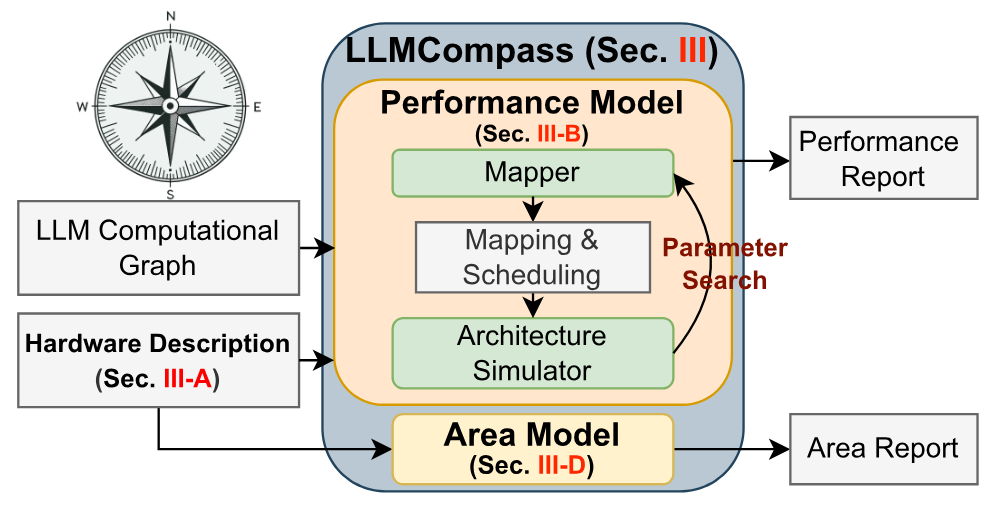

**図 1。** LLMCompass の概要。LLMCompass は汎用的な評価ツールとしてハードウェア設計プロセスを支援できる。

**ハードウェア設計上の選択が LLM 推論性能へ与える影響についての知見不足。** LLM は新しい用途であり、そのハードウェア特性はまだ十分に理解されていない。計算量とメモリ量が大きいだけでなく、自己回帰的に token を生成する点も LLM に固有である。こうした性質によって、従来のアーキテクチャ設計の常識が変わるかを検討したい。

**LLM を普及させる高コスト効率のハードウェア設計の不足。** LLM は強力だが、展開コストが高すぎる。GPT-3 を提供する DGX A100 計算ノードは 100,000 米ドルを超える場合があり [Dgx20]、各 NVIDIA A100 は 540 億個のトランジスタと 80 GB の高帯域幅メモリ（HBM）を備える。この高いハードウェアコストが LLM の普及を妨げている。

本稿ではこれらの課題に取り組み、三つの主要な貢献を行う。

**(1) LLM 推論ワークロード向けのハードウェア評価フレームワーク LLMCompass を提案する（[第 3 節](#section-3)）。** 主流の機械学習ハードウェアプラットフォームには多くのアーキテクチャ上の共通点があり、それらに適用できる汎用的なハードウェア記述テンプレートを構築できる。また、LLM の計算グラフは、行列乗算、softmax、層正規化などの密な演算子で構成される。これらの演算子は構造化され、予測可能な計算およびメモリアクセスパターンを持つ。そこで LLMCompass は、サイクル精度シミュレータと比べて精度を損なうことなく、より高い抽象度で tile（ブロック）単位の高速なシミュレーションを行う。メモリ階層を手動で管理し、密なワークロードに対して性能が最適となるマッピングとスケジューリングを探索するマッパーも実装する。さらに公開パラメータに基づくコストおよび面積モデルを備え、異なる設計案の検討を支援する。

LLMCompass は NVIDIA A100 [Nvi20]、AMD MI210 [Amd21a]、Google TPUv3 [Nor21, Jou20] という三つの商用ハードウェア設計で検証した。実機と比較した推定レイテンシの誤差率は、さまざまな入力サイズの各種演算子で 10.4%、LLM 推論で 4.1% である。Python で実装されているが、LLMCompass は高速である。4 基の A100 を持つノードで GPT-3 175B 推論を実行するシミュレーションは、マッパーによる 26,400 回のパラメータ探索を含めても 15～16 分で完了する（[図 5](#figure-05)(i)、Intel Xeon Gold 6242R CPU @ 3.10GHz の 1 コアで測定）。

**(2) LLMCompass を用いてアーキテクチャ上の示唆を導き、ハードウェア設計の選択が LLM 推論へ与える影響を調べる（[第 4 節](#section-4)）。** *prefill* と *decoding* ではハードウェア要件が異なる。*prefill* は計算能力とバッファの増加から大きな効果を得られるが、*decoding* ではほとんど効果がなく、メモリ帯域幅への感度が高い。この知見は、新しいハードウェア設計パラダイムを検討する契機となる。

**(3) 従来の常識とは異なる二つの高コスト効率なハードウェア設計を提案する（[第 5 節](#section-5)）。** 今日のハードウェア設計では、大量の計算能力と SRAM を、高性能 HBM に接続された巨大なダイへ収める傾向がある。LLM 推論の特性を分析すると、現在の設計が非効率である理由が明らかになる。

- LLM 推論の大部分は I/O 律速であるため、HBM によって低レイテンシを実現できる。しかし HBM の容量は batch size を制限し、大量の計算能力を十分に利用しにくい。この観察に基づくと、計算能力とバッファサイズを半減しても元の性能の 95.3% を維持できる。
- batch size を大きくすれば、モデルパラメータを batch 全体で一度しか読み出さないため、スループットを大幅に改善できる。メモリ容量が batch size を制限し、それによってスループットも制限されるため、HBM を従来型 DRAM に置き換えることを提案する。大きな batch size でメモリ帯域幅の低下を補い、スループットを 1.42 倍、性能/コストを 3.41 倍改善できる。

## 2 背景

### 2.1 大規模言語モデルと Transformer

大規模言語モデルは Transformer モデル [Vas23] の変種であり、大規模コーパスで事前学習された多数のパラメータを持つ [Min23]。現在の LLM は最大 1 兆個のパラメータを持つ [Fed22]。小規模モデルと比較すると、GPT-3 175B [Bro20] などの大規模モデルは、創発的能力 [Wei22f] や few-shot learning [Bro20] を含む優れた能力を示す。モデルサイズの増大と、それに伴うメモリおよび計算要件は、ハードウェアに固有の課題をもたらす。

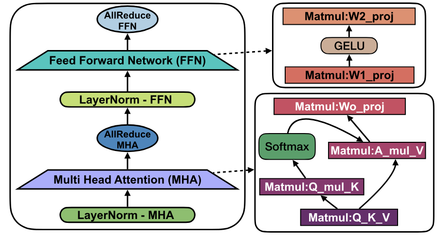

**図 2。** Tensor Parallelism を用いた Decoder-Only Transformer Layer。GPT-3 175B [Bro20] は、この層を 96 段積み重ねた構成を持つ。

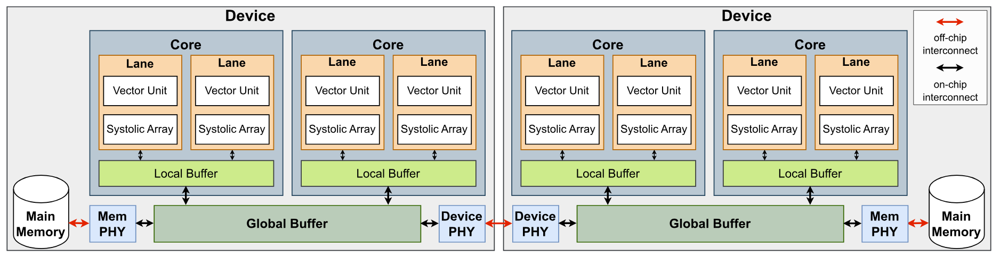

**図 3。** LLMCompass のハードウェア記述テンプレート。この例では、各 device が 2 個の core、各 core が 2 本の lane を持つ。

本稿では、現在の LLM の大半が採用する Decoder-only Transformer モデル [Phu22]、すなわち LLaMA [Oth23]、GPT [Bro20, Rad19]、Bloom [Wor23]、PaLM [Cho22b] などを対象とする。これらのモデルの基本構成要素は Transformer layer である。[図 2](#figure-02) に示すように、各 layer は Multi-Head Attention block と、それに続く MLP block からなる。これらの layer を積み重ねた部分が、LLM のメモリおよび計算要件の大半を占める。Transformer は学習された Vocabulary embedding と Position embedding も用いるが、GPT-3 のような大規模モデルでは、メモリと計算のいずれに対しても寄与は小さい（$<2$%）。一般性を失うことなく、Multi-Head Attention Transformer（GPT 型）に焦点を当てる。Multi-Query Attention [Cho22b]、Mixture-of-Experts [Fed22]、Attention と MLP の並列化 [Cho22b] といった変種もある。いずれも共通の演算子群を使うため、LLMCompass はこれらの変種をそのまま扱える。

### 2.2 LLM 推論

入力 prompt と必要な出力 token 数が与えられると、LLM 推論は二つの段階に分けられる [Pop23]。

- *Prefill*：入力 prompt を処理し、KV cache を計算する。Key Value（KV）cache は、各 layer の Attention block に保存された Key および Value tensor を指す [Pop23]。
- *Decoding*：出力 token を自己回帰的に一つずつ生成する。新しく生成した token の Key と Value は KV cache に連結され、次の token の生成に使われる。

*prefill* と *decoding* のレイテンシは、それぞれ主として入力系列長と出力系列長で決まる。*prefill* では入力系列全体と全パラメータを乗算するため、通常は計算律速となる。*decoding* では新しい token ごとに全パラメータとの乗算を行い、KV cache へ連結するため、通常はパラメータと KV cache の読み出しが律速となる。

レイテンシとスループットは、LLM 推論システムを評価する主要な指標である。chatbot [Ope22] のような対話用途では、レイテンシの最適化が不可欠である。一方、data wrangling [Nar22] や form processing [Che21f] などのバックグラウンド処理では、スループットがより重要となる。両者のトレードオフは batch size で決まり、batch を大きくするとスループットは向上するが、レイテンシも増加する。

### 2.3 LLM 推論の並列化

計算処理とメモリ操作の量が大きいため、複数 device にわたって LLM 推論を並列化することには利点がある。性能が大きく向上するほか、モデルパラメータと KV cache が単一 device のメモリに収まらない場合には不可欠となる。LLM 推論におけるモデル並列化には、pipeline parallelism と tensor parallelism の二方式がある。pipeline parallelism では、モデルの異なる layer を連続する partition にまとめ、ハードウェア pipeline のように異なる device へ割り当てる。この方式はレイテンシを増加させる代わりに、スループットを大幅に向上させる。これに対し、Megatron-LM [Sho20] が提案した tensor parallelism は、各 layer を利用可能な device 間で分割する。レイテンシを短縮できる一方、頻繁な device 間通信と同期が必要になる。[図 2](#figure-02) に示すように、各 Transformer layer で二回の *all-reduce*、すなわち Attention block の後と MLP block の後に一回ずつ実行する必要がある。

## 3 LLMCompass

LLMCompass（**L**arge **L**anguage **M**odel **Com**putation **P**erformance and **A**rea **S**ynthesi**s**）の概要を[図 1](#figure-01) に示す。Transformer ベースの大規模言語モデルをハードウェアシステム上で実行した際の性能、たとえばスループットとレイテンシを評価するには、LLM の計算グラフと**ハードウェア記述**（[第 3.1 節](#section-3-1)）という二つの入力が必要である。入力を受け取ると、**性能モデル**（[第 3.2 節](#section-3-2)）が性能レポートを生成する。**マッパー**は**アーキテクチャシミュレータ**とともにパラメータ探索を行い、最良のマッピングとスケジューリングを求める。同時に、**面積モデル**（[第 3.4 節](#section-3-4)）が面積およびコストのレポートを生成する。

### 3.1 ハードウェア記述テンプレート

[図 3](#figure-03) に示す LLMCompass のハードウェア記述テンプレートは、次のように構成される。

- **system**（たとえば DGX node）は、device-device interconnect（たとえば NVLink や Infinity Link）で接続された複数の device からなる。
- 各 **device**（たとえば GPU）は、複数の core、共有 global buffer、off-chip main memory からなる。**global buffer**（たとえば NVIDIA GPU の L2 cache）は、main memory、device-device interconnect、すべての core に接続される。
- 各 **core**（たとえば NVIDIA GPU の Stream Multiprocessor）は、**local buffer**（たとえば NVIDIA GPU の L1 cache）を共有する複数の lane を持てる。local buffer は on-chip interconnect を介して global buffer へ接続される。
- 各 **lane** は互いに独立し、固有の **vector unit**、**systolic array**、register、control logic を持つ。

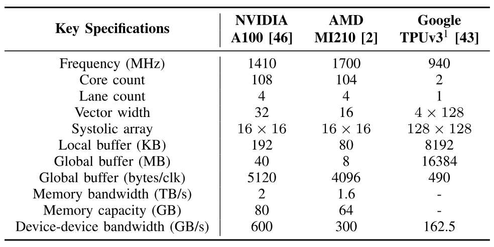

**表 1。** LLMCompass のハードウェア記述例 [+1]

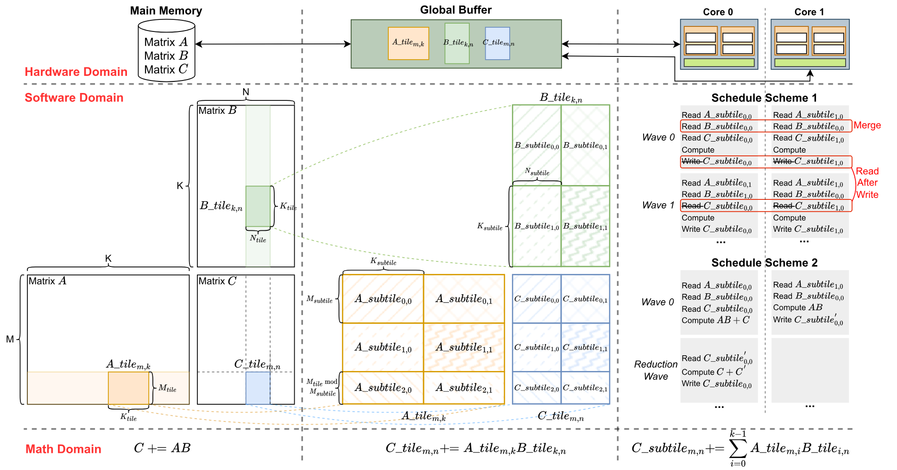

**図 4。** [第 3.2.1 節](#section-3-2-1)で述べる LLMCompass における行列乗算の可視化。

既存 device では、local buffer と global buffer は通常、cache、scratchpad、またはその組み合わせとして実装された on-chip SRAM である。LLMCompass ではメモリをマッパーが明示的に管理するため、cache と scratchpad を区別しない。高度に最適化されたライブラリもメモリを慎重に管理するため、この仮定によって一般性は失われないと考える。main memory は通常、HBM、DDR memory、CXL memory などの off-chip DRAM であり、いずれも本テンプレートのパラメータで記述できる。

このハードウェア記述は、現在の主流の機械学習プラットフォーム、すなわち NVIDIA GPU、AMD GPU、Google TPU を記述するのに十分に汎用的である。[表 1](#table-01) に主要仕様の一部を示す。将来のアーキテクチャを探索できる柔軟性も備える。

### 3.2 性能モデル

Transformer の計算グラフは、Transformer layer を積み重ねた構造を持つ。各 layer は、行列乗算（*Matmul*）、*Softmax*、層正規化（*LayerNorm*）、GPT で用いられる GELU [Hen16b, Bro20, Rad19] などの活性化関数を含む一連の演算子からなる。複数 device を使う構成では、tensor parallelism のために *all-reduce* などの通信プリミティブも必要となる。主要な課題は、与えられたハードウェアシステム上で各演算子と通信プリミティブの性能をどうシミュレーションするかである。これには、ハードウェアに関する知識と、多階層の計算システムおよびメモリ階層へ演算子をマッピング、スケジューリングする方法の知識が必要となる。

この課題を解決するため、LLMCompass はマッパーとアーキテクチャシミュレータによって性能モデルを構築する。概念的には、選択したハードウェア上での演算子の実行を再帰的にシミュレーションする。まず問題を global buffer に収まる小さな sub-problem に分割し、次に各 sub-problem を各 core の local buffer に収まるさらに小さな sub-sub-problem に分割する。マッパーが分割、マッピング、スケジューリングを生成し、パラメータ探索によって最適な組み合わせを求める。LLMCompass は常に性能が最適となるマッピングを探索し、ハードウェアの能力を十分に引き出す。

#### 3.2.1 行列乗算

行列乗算のシミュレーション過程を[図 4](#figure-04) に示す。$\mathbf{A}$ は $M$ 行 $K$ 列の $M\times K$ 行列である。同様に、$\mathbf{B}$ と $\mathbf{C}$ はそれぞれ $K\times N$ 行列と $M\times N$ 行列である。一般化された行列乗算は $\mathbf{C}=\mathbf{AB}+\mathbf{C}$ と定義される。

**main memory から global buffer へ：** データ再利用を最大化するため、行列乗算は通常 tile 単位で計算される [Lam91a]。[図 4](#figure-04) 左側に示すように、行列 $\mathbf{A}$、$\mathbf{B}$、$\mathbf{C}$ を global buffer に収まる大きさの tile へ分割する。各 step では、$A_{\mathrm{tile}_{m,k}}$、$B_{\mathrm{tile}_{k,n}}$、$C_{\mathrm{tile}_{m,n}}$ を一つずつ global buffer に読み込み、core が計算を行った後に結果を書き戻す。

**global buffer から local buffer へ：** tile が global buffer に入ると、$C_{\mathrm{tile}_{m,n}}=A_{\mathrm{tile}_{m,k}}B_{\mathrm{tile}_{k,n}}+C_{\mathrm{tile}_{m,n}}$ の計算を複数 core へ並列化する必要がある。[図 4](#figure-04) 中央に示すように、各 tile をさらに各 core の local buffer に収まる小さな sub-tile へ分割する。その後、sub-tile を core へ割り当てるスケジューリング問題となる。

[図 4](#figure-04) 右側には、二つのスケジューリング方式を示す。

- **Schedule Scheme 1：** 異なる core が、同じ列にある異なる $C_{\mathrm{subtile}}$ を処理する。*wave 0* では *core 0* と *core 1* の双方が同じ $B_{\mathrm{subtile}}$ を読むため、global buffer へのメモリアクセスを統合すべきである。本シミュレータは、この統合を自動的に検出して処理する。同じ core が同じ $C_{\mathrm{subtile}}$ を更新し続けるため、部分結果を一度 global buffer へ書き戻してから再び読み出す必要もない。この *Read-After-Write* 依存関係も自動的に処理される。
- **Schedule Scheme 2：** 異なる core が同じ $C_{\mathrm{subtile}}$ を処理する。*core 0* と *core 1* がデータを読み込んで部分結果を計算し、reduction を実行して最終結果を書き戻す。

実際には core と tile の数が多く、スケジューリング空間は[図 4](#figure-04) の例よりも複雑になりうる。

**local buffer から lane へ：** 同様に、各 core の内部では sub-tile をさらに sub-sub-tile へ分割し、local buffer を共有する lane へ割り当てる。その後、sub-sub-tile を systolic array へ渡す。LLMCompass はサイクルレベルの systolic array シミュレータ SCALE-Sim [Sam18, Sam20] を利用して挙動を再現し、サイクル数を求める。LLMCompass は SCALE-Sim の結果を lookup table にキャッシュし、重複シミュレーションを避ける。必要な場合は vector unit が reduction を実行する。

**マッパー：** マッパーはパラメータ探索により、最良の tiling 方式とスケジューリング方式を決定する。計算とメモリアクセスを重ねるため、メモリ階層の各 level で software pipeline（double buffering）もスケジューリングの選択肢とする。software pipeline を有効にすると追加のバッファ空間が必要となり、最大 tile size が小さくなって systolic array の利用率が下がる可能性がある。ただし、大半の場合に software pipeline は有効である。

#### 3.2.2 通信プリミティブ

AHEAD [Abd19] と LogGP [Ale95] の link model を用いる。$L$ を link latency、$O$ をデータ転送に伴う追加 overhead、$B$ を link bandwidth とする。link を介して $n$ byte のデータを転送するレイテンシ $T$ は、[式 1](#equation-01)と[式 2](#equation-02)で表される。

$$
T=L+O+\frac{\hat{n}}{B}
$$

$$
\hat{n}=\left\lceil\frac{n}{\mathit{MaxPayload}}\right\rceil*{\mathit{\mathit{Flit\_size}}}+n
$$

このモデルの上に、帯域幅最適な all-reduce アルゴリズムである ring all-reduce [Pat09] を実装する。NVLink [Fol17] に基づき、$\mathit{\mathit{Flit\_size}}$ は 16 byte、$\mathit{MaxPayload}$ は 256 byte とする。LLM 推論では tensor parallelism に *all-reduce*、pipeline parallelism に *peer-to-peer* だけが必要なため、その他の通信プリミティブはモデル化しない。

#### 3.2.3 その他の演算子

*Softmax*、*LayerNorm*、*GELU* も[第 3.2.1 節](#section-3-2-1)と同様の方法でモデル化する。相違点は二つである。

- 次元数が少ないため、より単純である。*Softmax* と *LayerNorm* は二次元データ、*GELU* は一次元データ、*Matmul* は三次元データを扱う。各次元で tiling と scheduling が必要となるため、マッパーの探索空間ははるかに小さい。
- systolic array を使わない。*Softmax* は online algorithm [Mil18a] で実装し、*GELU* は $\tanh$ で近似する [Hen16b]。

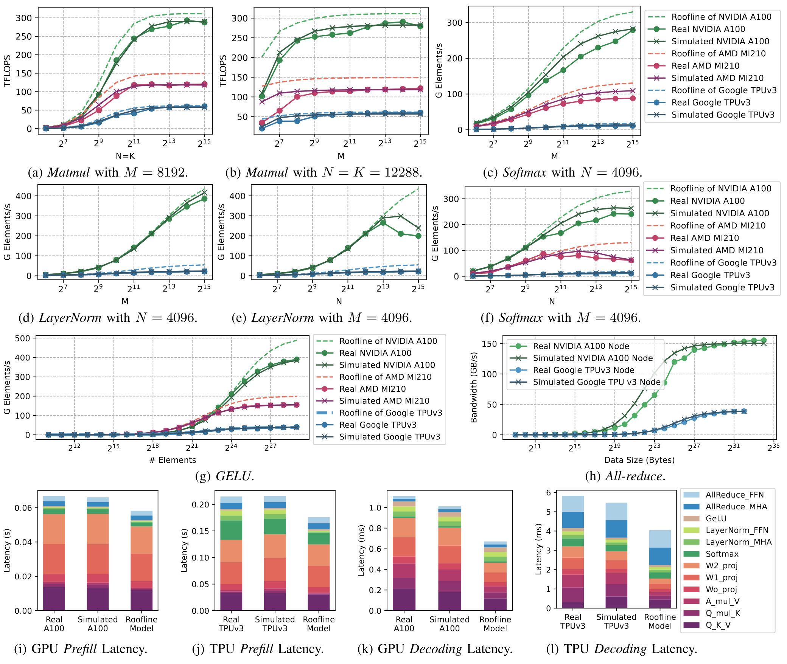

**図 5。** $M=8192$ の *Matmul*。

### 3.3 性能モデルの検証

本節では、三つの実ハードウェアプラットフォームを用いてフレームワークを検証する。（1）80 GB の NVIDIA A100 SXM4 GPU 4 基を NVLink で全結合したデータセンター GPU node、（2）8 個の TPUv3 core を 2D torus topology で接続した Google Cloud TPU node、（3）AMD MI210 GPU [+2]である。結果を[図 5](#figure-05) に示す。NVIDIA GPU では CUDA 11.7 と PyTorch 2.0 を用いて演算子を半精度（FP16）で測定し、性能を最大化するため *LayerNorm* と *GELU* では `torch.compile` を有効にした。通信プリミティブ *all-reduce* は、NVIDIA GPU 向けの通信プリミティブ性能ベンチマーク nccl-tests [Ncc21] で測定した。Google TPU では JAX 0.4.18 を用いて演算子と通信プリミティブを測定した。TPU のハードウェア特性により、*Matmul* は bfloat16（BF16）、その他の演算子は FP32 で測定した。AMD GPU では ROCm 5.4.2 と PyTorch 2.0 [+3]を用い、*Matmul* は FP16、その他の演算子は FP32 とした。framework overhead を含む kernel launch overhead は、入力サイズ 1 で演算子を実行して測定した。

[図 5](#figure-05) に示すように、*Matmul*、*Softmax*、*LayerNorm*、*GELU*、*all-reduce* に対する LLMCompass の平均誤差率は、それぞれ 9.0%、12.0%、11.3%、5.0%、14.9% である。LLM 推論では、*prefill* と *decoding* の平均誤差率がそれぞれ 0.69% と 7.5% である。**全体として、さまざまな入力サイズの各種演算子では平均 10.4%、*prefill* と *decoding* では平均 4.1% の誤差率となる。**

実機と完全に一致するわけではないが、LLMCompass は単純な Roofline model では表せない傾向を再現できる。たとえば[図 5](#figure-05)(d) では、*LayerNorm* の reduction dimension が極端に大きくなると、reduction cost の増加によりスループットが低下する。LLMCompass はこの傾向を捉えている。

LLMCompass の結果は補正係数を加えなくても完全に解釈可能であり、完全な一致よりもこの解釈可能性が重要だと考える。LLMCompass と実機の差異には、次の原因が考えられる。

- **ハードウェア知識の不足。** GPU と TPU の microarchitecture、たとえば hardware pipeline や scheduler の設計について得られる知識は少ない。入力サイズが大きい場合はハードウェア利用率が高く、一部の overhead を隠せる。入力サイズが小さい場合は overhead を隠しにくく、microarchitecture の詳細が性能に大きく影響する。また、LLMCompass は NVIDIA GPU の Tensor Core と AMD GPU の Matrix Core を systolic array としてシミュレーションしているが、実際には異なる可能性がある。
- **ソフトウェア知識の不足。** 各プラットフォームの演算子と通信プリミティブは closed-source library であり、その実装は不明である。本研究では各入力サイズについて十分なパラメータ探索を行って性能を最大化するが、実際の library は heuristic によって mapping と scheduling を決めている可能性があり、すべての入力サイズで最適とは限らない。たとえば $M=64$、$N=K=12288$ の *Matmul* では、AMD MI210 が Roofline 性能の 25% 未満であるのに対し、NVIDIA A100 は 50% を達成する。また、重要な情報の一部は公開されていない。たとえば TPU-TPU 通信の packet format が見つからないため、代わりに NVLink の packet format を使用した。
- **非理想的なハードウェア。** LLMCompass は固定周波数を仮定するが、実機の測定ではデータセンター GPU や TPU node の周波数を制御できない。帯域幅を最大限に利用できることも仮定するが、実際には error correction code などの overhead が存在しうる。

### 3.4 面積およびコストモデル

chip designer が単一 chip の性能を高めるために die area を増やすと、一枚の wafer に収まる chip 数が減り、yield 低下の危険も生じるため、コストが上昇する。LLMCompass は面積およびコストモデルを備え、性能と面積のトレードオフを検討できるようにする。これらのモデルは、既知 component の transistor count と die area の推定値を含むハードウェア記述から、device 全体の die area を求める。方法は次のとおりである。

各 core の lane では、open-source design、tape-out、generator [Zar19, Mck18a, Gen21] から vector unit と systolic array の transistor count を推定する。各 lane の register file の面積 overhead は、経験的な面積モデル [Rag09] で推定する。各 core の lane が共有する local buffer と、各 core が共有する global buffer は SRAM cache としてモデル化し、CACTI [Mur09] で面積を求め、7 nm process へ縮小する。memory と device-device interconnect については、注釈付きの A100 および MI210 die photo [Pat22a, Smi22b] に基づいて PHY と controller の面積を推定する。計算上、controller area は process node に応じて変化させるが、内部の analog device は縮小しにくいため PHY area は固定する。

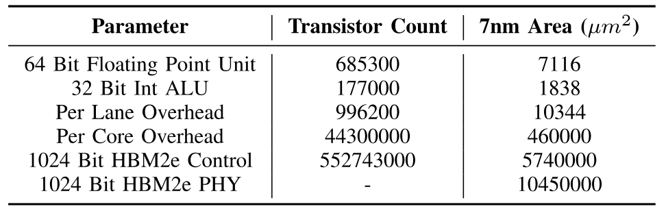

**表 2。** 面積モデルのパラメータ例（7 nm）

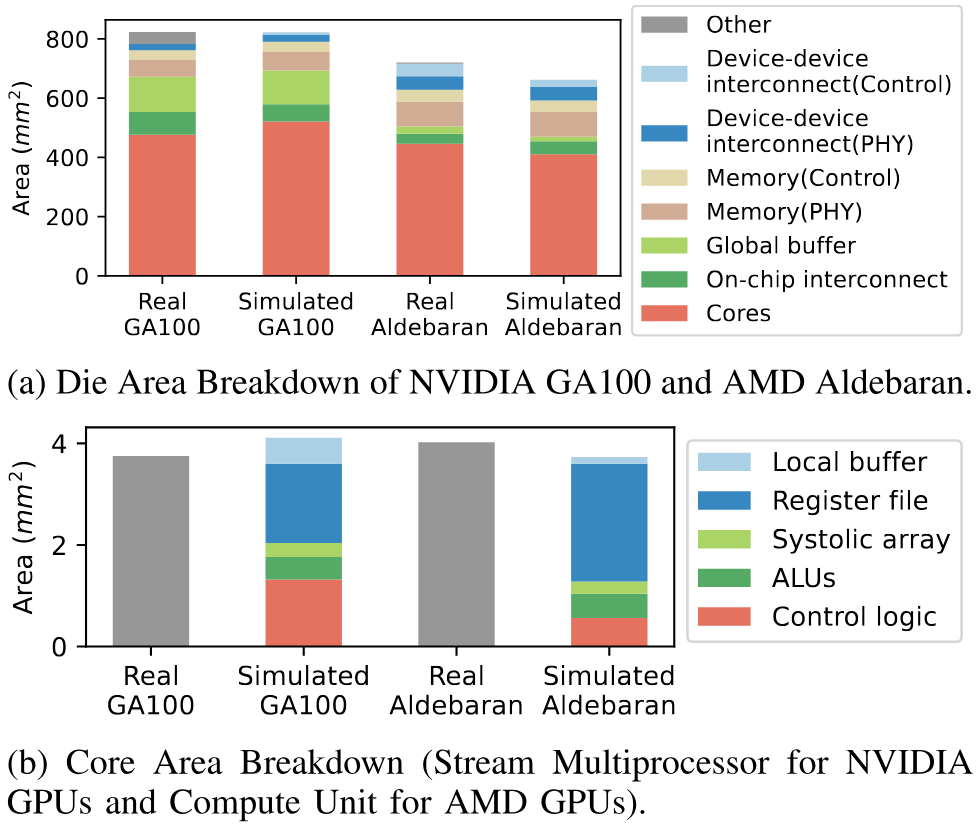

**図 6。** NVIDIA GA100 と AMD Aldebaran の die area の内訳。

lane ごとの追加 overhead、たとえば control signal は、モデルで core area を計算し、注釈付き写真から得た予想 die area との差を取って算出する。その overhead を lane ごと、scheduler width ごとに分割する。scheduler width は A100 で 32、MI210 で 16 である。同様に、core 間 crossbar などの core ごとの追加 overhead は、モデルで予想 die area を計算し、core 間で分割して求める。lane ごと、core ごとの overhead 推定値には AMD と NVIDIA chip の平均を用いる。

コストの推定には supply chain modeling [Nin23] を用い、wafer cost から die 当たりのコストを算出する。このコストには IP、mask、packaging cost を含めない。memory cost には、DDR の平均 DRAM spot price [Tre23] と HBM2e の consumer estimate [Lap19] を用いる。

[表 2](#table-02) は、面積モデルで用いるパラメータについて、transistor count と対応する 7 nm die area の一部を示す。それぞれの architecture white paper に基づき、NVIDIA A100 の die である GA100 [Nvi20] と AMD MI210 の die である Aldebaran [Amd21a] をモデル化して、総 die area を推定した。結果を[図 6](#figure-06)(a) に示す。対象 component について、GA100 と Aldebaran の die area に対する LLMCompass の推定誤差は、それぞれ 5.1% と 8.1% である。この差は、非公開で推定が難しい core microarchitecture と core 間通信の overhead によるものと考える。本モデルでは、単一 core の面積を個々の component に分解することもできる。[図 6](#figure-06)(b) に結果を示す。

## 4 アーキテクチャ上の示唆

LLMCompass によって design space exploration を行い、LLM 推論向けの効率的なハードウェアシステム設計を検討できる。本節では、計算システムの構成、memory bandwidth、buffer size が LLM 推論性能へ与える影響を LLMCompass で調べ、アーキテクチャ上の示唆を導く。この知見に基づき、[第 5 節](#section-5)で新しい設計を提案する。

### 4.1 実験設定

特に記載のない仕様には NVIDIA A100 の仕様（[表 1](#table-01)）と 4-way tensor parallelism を用いる。*prefill* レイテンシは、batch size 8（レイテンシとスループットの均衡点）、input sequence length 2048（GPT-3 では中～長程度の系列）で GPT-3 の 1 layer を実行して測定する。*decoding* レイテンシは、batch size 8、input sequence length 2048 で GPT-3 の 1 layer を実行し、1024 番目の output token を生成する際のレイテンシとする。すべての演算子に FP16 を用いる。

### 4.2 計算システム

[表 3](#table-03) に示す五つの計算システム設計を評価する。A から E へ進むにつれて、各 core の systolic array、vector unit、local buffer の容量を増やす。B は完全な GA100 を表す。少数の大きな core と多数の小さな core という設計案を比較するため、B、C、D、E の総計算能力と総 buffer size を同一にする。構成 A の計算能力は他の構成の 4 分の 1 だけである。すべての設計で総 buffer size を同じにし、register file size は vector width に応じて変化させる。

[図 7](#figure-07) は、各設計の *prefill* と *decoding* のレイテンシを示す。GA100 と比較すると、設計 A の *prefill* レイテンシは 3.25 倍だが、*decoding* は 0.1% 遅いだけで、面積は 57.8% に抑えられる。最大の core を持つ設計 E では *prefill* と *decoding* のレイテンシがそれぞれ 12.4% と 30.8% 増加する一方、die area を最大 7.7% 削減できる。

**分析：** *prefill* は計算律速であるため、B は A より大幅に高速である。core ごとの systolic array と vector unit を大きくするにつれて、計算 unit を十分に利用するには tile size も大きくする必要がある。problem size を tile size と hardware size に量子化する必要があるため、大きな tile は padding を増やす場合がある。大きな systolic array と vector unit は面積効率が高い一方、スケジューリングと完全な利用が難しい。

*decoding* は I/O 律速であるため、計算能力を増やしてもほとんど効果がない。これが A と B の性能が近い理由である。*decoding* 中の行列乗算は細長いため、たとえば $16\times{}12288$ であり、大きな systolic array の完全な利用はさらに難しく、性能が低下する。

**示唆：**

- *計算能力の増加は prefill に大きく効くが、decoding にはほとんど効かない。*
- *大きな systolic array は decoding より prefill で効率が高い。*

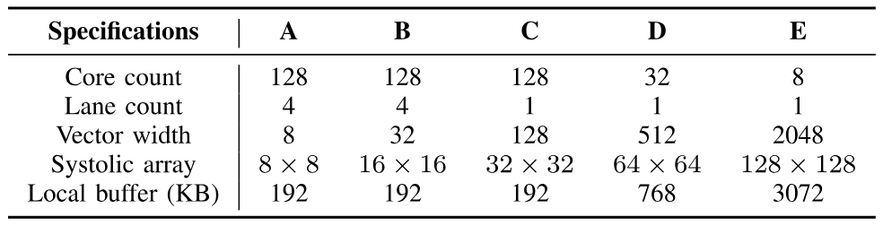

**表 3。** 五つの計算システム設計。

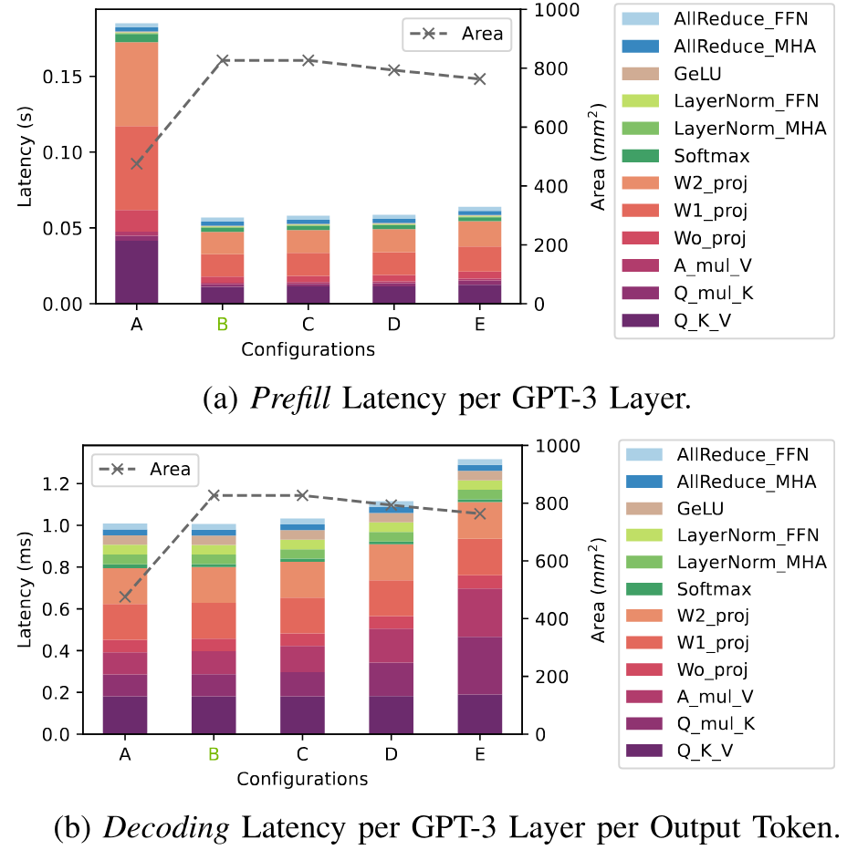

**図 7。** GPT-3 の layer 当たりの *Prefill* レイテンシ。

### 4.3 main memory

main memory の容量は、parameter と KV cache を格納するのに十分な容量が必要という制約として扱われるため、main memory bandwidth の影響に焦点を当てる。[図 8](#figure-08) は、memory bandwidth を 400～3200 GB/s の範囲で変化させた性能を示す。*prefill* では bandwidth を 800GB/s から 2000GB/s に増やすとレイテンシが 14.3% 短縮し、3200GB/s まで増やしても追加の性能向上は 3.5% にとどまる。*decoding* では 800GB/s から 2000GB/s への増加で 1.88 倍高速化し、3200GB/s への増加でさらに 26% 改善する。

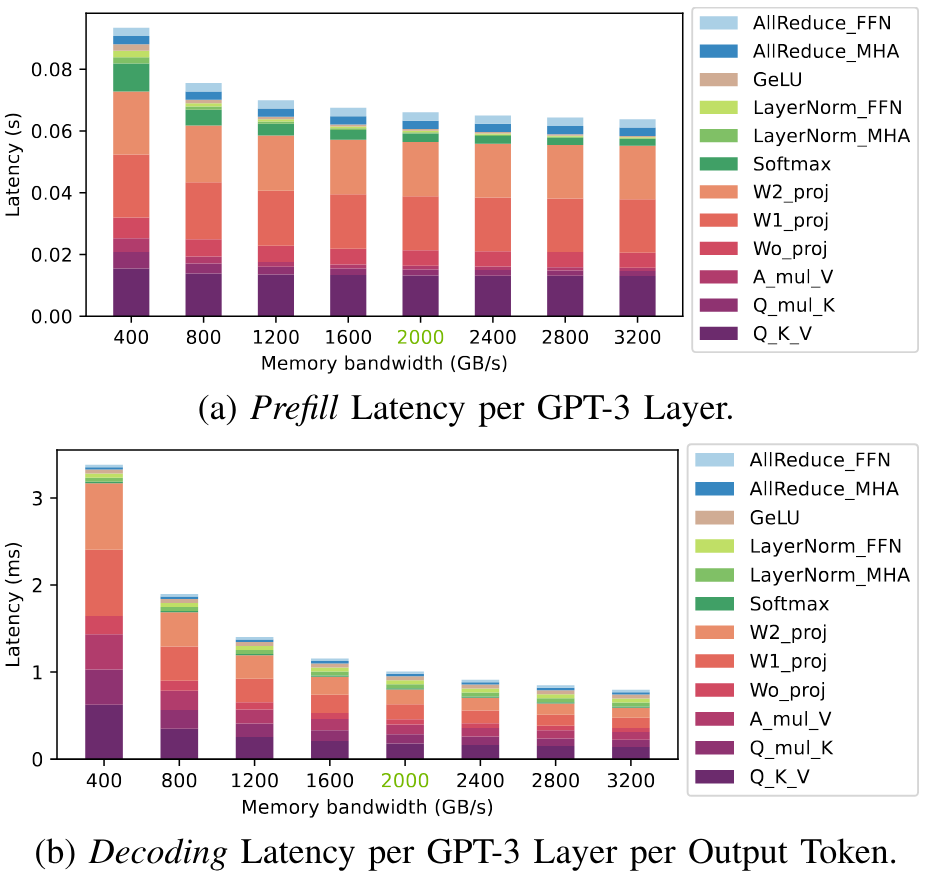

**図 8。** GPT-3 の layer 当たりの *Prefill* レイテンシ。

**分析：** *prefill* 段階では、memory bandwidth を 400GB/s から 800GB/s に増やすと *Matmul* が大幅に高速化する。それ以上に bandwidth を増やしても、*Matmul* は計算律速となるため、性能は大きく変わらない。I/O 律速の *GELU*、*LayerNorm*、*Softmax* では、大きな memory bandwidth により大幅に高速化する。

*decoding* 段階では、memory bandwidth の増加により *Matmul* が大幅に高速化する。主な理由は、*Matmul* が細長く、batch size 1 では vector-matrix multiplication となり、I/O 律速になるためである。この段階の *GELU*、*LayerNorm*、*Softmax* は入力サイズが小さい。kernel launch overhead が支配的で、memory bandwidth の影響はほとんど受けない。

*decoding は prefill より memory bandwidth に対する感度が大幅に高い。*

### 4.4 local buffer と global buffer

**local buffer。** ハードウェア仕様を NVIDIA A100（[表 1](#table-01)）に固定し、local buffer size を変化させる。結果を[図 9](#figure-09) に示す。*prefill* では local buffer size を 64KB から 192KB に増やすと、面積が 5.8% 増える一方、性能は 18.0% 改善する。1024KB まで増やすと面積は 28.8% 増えるが、性能向上は 0.2% にすぎない。*decoding* では 64KB から 1024KB に増やしても、性能は 0.5% しか改善しない。

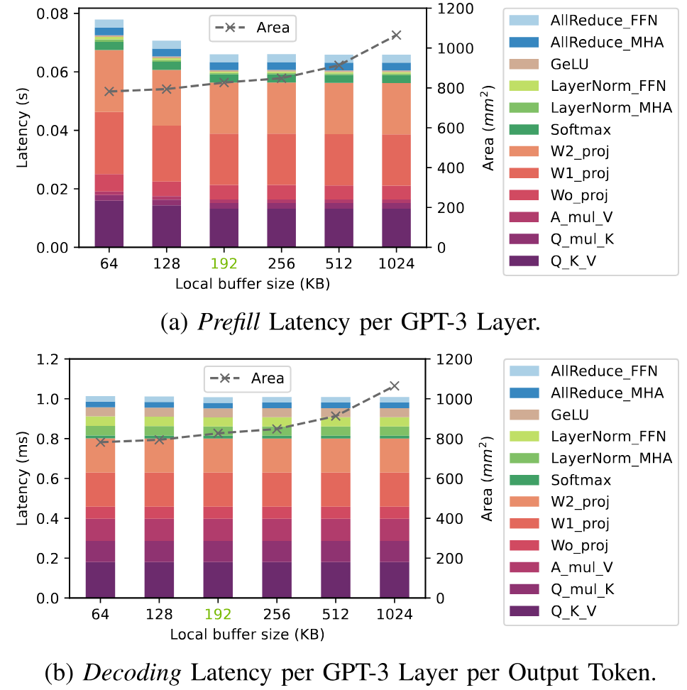

**図 9。** GPT-3 の layer 当たりの *Prefill* レイテンシ。

**分析：** local buffer を大きくした際に *prefill* レイテンシが短くなる主因は、行列乗算のレイテンシ低下である。大きな local buffer は大きな matrix tile を可能にし、systolic array の利用率を高める。192KB の local buffer は、FP16 と double buffering を用いた $128\times 128\times 128$ の行列乗算にちょうど十分であり、$16\times 16$ systolic array を完全に利用できる。これは NVIDIA A100 の設計上の選択を理解する手掛かりとなる。systolic array をすでに完全利用している状態では、local buffer size の増加による性能向上は小さい。*decoding* は I/O 律速であるため、local buffer を大きくしても効果がない。

**global buffer。** global buffer size に対する性能の傾向は[図 9](#figure-09) と同様である。global buffer size を 10MB から 40MB に増やすと、面積が 9.6% 増える一方、*prefill* は 11.8% 高速化する。80MB まで増やしても、面積が 11.7% 増えるのに対して性能向上は 0.01% にすぎない。*decoding* では 10MB から 80MB に増やしても、性能は 0.7% しか改善しない。

**分析：** 大きな global buffer により大きな matrix tile が可能となり、systolic array の利用率と global buffer level のデータ再利用が向上する。同様に、systolic array が飽和した後は、global buffer size を増やしても効果は逓減する。*decoding* 段階は計算律速ではないため、大きな global buffer の恩恵をほとんど受けない。

- *大きな buffer は prefill に有効だが、decoding には有効でない。*
- *buffer は systolic array を完全に利用できる大きさにすべきである。*

## 5 LLMCompass による効率的なハードウェア設計

理想的なハードウェア設計は、性能とコストの双方を最適化する。[第 4 節](#section-4)の知見に基づき、本節では二つの効率的なハードウェア設計、すなわちレイテンシ指向設計とスループット指向設計を提案する。いずれも、性能を維持または改善しながらハードウェアコストを削減することを目的とする。主要仕様を[表 4](#table-04) に示す。公平に比較するため、周波数、register file size、device-device interconnect、kernel launch overhead、framework overhead など、その他の仕様は NVIDIA GA100 と同じにする。

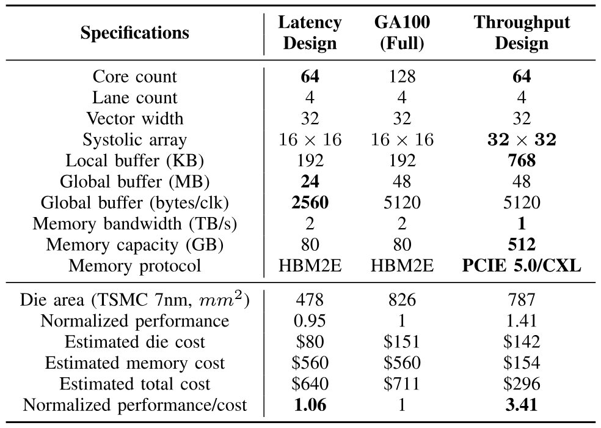

**表 4。** NVIDIA GA100 との比較

### 5.1 レイテンシ指向設計

LLM 推論レイテンシは、request を受け取ってから最後の token を生成するまでの総時間を指し、chatbot などの対話用途では重要な指標である。入力系列を処理する時間である *prefill* レイテンシと、出力系列を自己回帰的に生成する時間である *decoding* レイテンシからなる。入力系列が出力系列よりはるかに長い場合を除き、推論レイテンシは通常 *decoding* が支配する。*decoding* は I/O intensive で、主にモデルパラメータと KV cache の読み出しが律速となる。

**観察：** レイテンシの大部分は I/O 律速であるため、短縮の鍵は memory bandwidth であり、HBM が最良の選択となる。しかし HBM の容量には制約があり、batch size を大きくしすぎることはできない。KV cache と intermediate value のサイズは batch size に比例するからである。そのため、大量の計算能力は十分に利用されない。

**提案：** [表 4](#table-04) 左側に示すように、GA100 と同じ memory system を使いながら計算能力を半分に削減する、効率的なレイテンシ指向設計を提案する。

**結果：** NVIDIA GA100 と比較して、平均性能の 95.3% を維持しながら die area を 42.1% 削減できる。結果を[図 10](#figure-10) に示す。

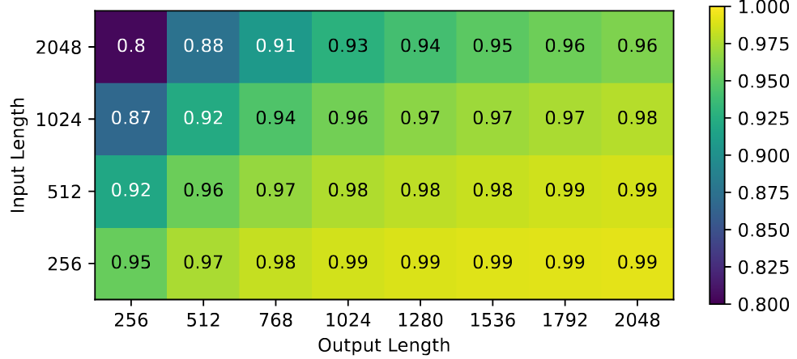

**図 10。** GA100 に対して正規化したレイテンシ指向設計の end-to-end 性能。性能指標はレイテンシの逆数であり、高いほどよい。設定：batch size は 16 [+5]、4-way tensor parallelism、GPT-3 の半分に当たる 48 layer を実行。

**議論：** *decoding* 段階が I/O 律速であるため、過剰に構成された GA100 は、本提案のレイテンシ指向設計より推論性能を大幅に高めることができない。[図 11](#figure-11) に示すように、計算資源を削減した設計でも GA100 と同じ *decoding* 性能を達成する。GA100 は巨大な die で yield 問題の影響を受けやすく、A100 の die は 128 個の SM のうち 108 個が動作するものを選別している。本設計は、core と SRAM の半分を無効化しても同程度の性能を達成できることを示す。これにより、従来は不良と判断された chip を回収し、LLM 推論に特化した別製品として製造できる可能性がある。

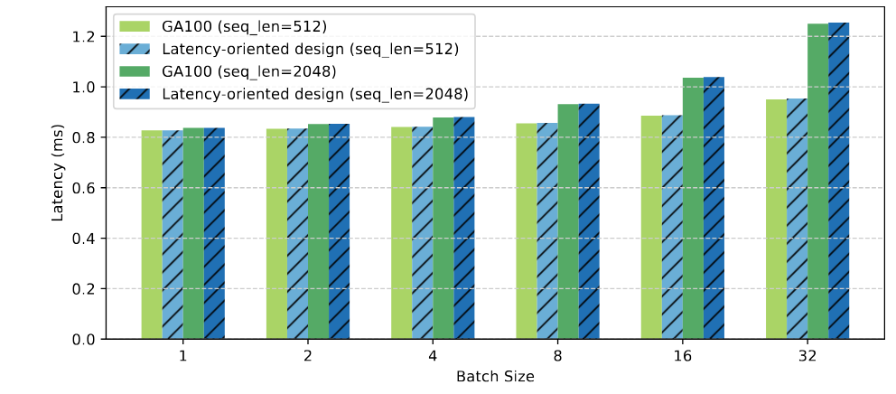

**図 11。** GPT-3 の layer 当たりの *Decoding* レイテンシ比較。

計算能力の削減は、計算律速の *prefill* 性能だけを損なう。入力系列が長く出力系列が短い場合には *prefill* の比率が高くなり、性能低下がより明確になる。このため、入力長 2048、出力長 256 では GA100 の 80% の性能にとどまる。入力が短く出力が長い場合、本提案のレイテンシ指向設計は GA100 の 99% の性能を達成できる。

### 5.2 スループット指向設計

form processing や data wrangling などのバックグラウンド用途では、レイテンシよりスループットが重要になる場合がある。スループットを改善する方法は、一般に二つある。

- **レイテンシを短縮する。** レイテンシの大部分はモデルパラメータと KV cache の読み出しによる I/O 律速であるため、短縮する最良の方法は memory bandwidth のさらなる向上である。しかし HBM はすでに高価であり、コストを増やさずに実現するのは難しい。
- **batch size を大きくする。** パラメータを batch 全体で一度しか読み出さないため、batch size が大きいほど一般にスループット効率が高い。ハードウェア利用率も改善できる。欠点は、batch size の増加により計算能力の消費と KV cache access が増えることである。

**観察：** 高価な上位 HBM や SRAM まで必要となるレイテンシ短縮と比べ、batch size の増加はスループットを高める効率的な方法である。batch size を大きくすると、より大きな KV cache と intermediate value を保持するため、メモリ容量も増やす必要がある。

**提案：** [表 4](#table-04) 右側に示すスループット指向設計を提案する。大きな batch を保持するため、256 本の PCIe 5.0 channel で接続した 512GB DRAM を用い、総 memory bandwidth を 1TB/s とする。（面積モデルによれば、800$mm^{2}$ die の周囲には約 400 本の PCIe 5.0 channel を配置できる。）HBM の高いコストと限られた容量を考えると、この設計はコスト効率が高い。batch size を大きくすると計算能力の需要も増すため、systolic array と local buffer を 4 倍にする。GA100 と同程度の die area を維持するため、core count と vector unit は半分にする。

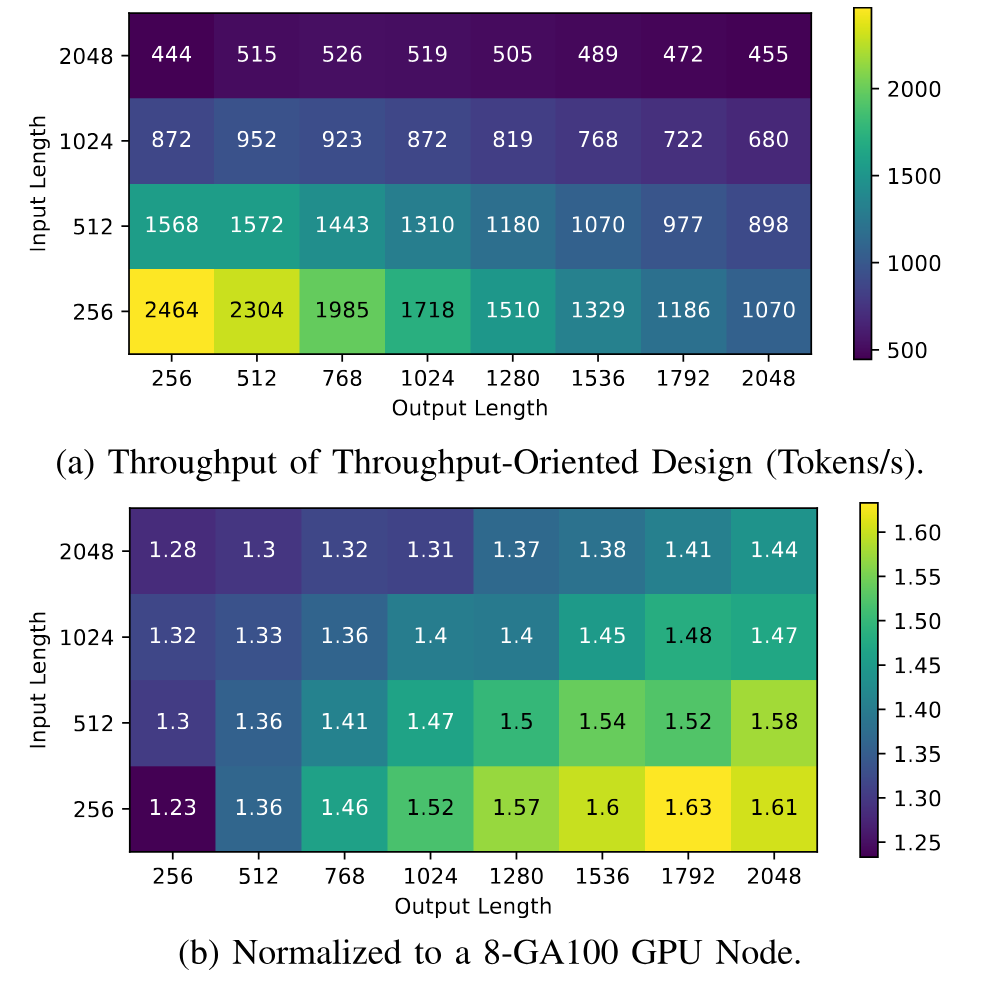

**図 12。** スループット指向設計のスループット（tokens/s）。

**結果：** NVIDIA GA100 と比較すると、die area はわずかに小さく、平均スループットは 1.42 倍に向上する。結果を[図 12](#figure-12) に示す。HBM を従来型 DRAM に置き換えることでコストを 58.3% 削減し、性能/コストを合計 3.41 倍改善する。

**議論：** 本設計のメモリ容量は GA100 の 6.4 倍であり、モデルパラメータが占める固定領域を差し引いた後では、12 倍を超える batch size を使用できる。理想的には、GA100 の半分の bandwidth でも、この構成はスループットを 6 倍以上改善できる。しかし batching によって減るのはモデルパラメータへの access だけであり、KV cache の読み出しは減らない。batch が大幅に大きくなると、KV cache access が新たなボトルネックとなり、batching の効果を弱める。入力長と出力長が増すにつれ、KV cache の読み出しが長くなるため、[図 12](#figure-12)(a) に示すようにスループットは低下する。

レイテンシの観点では、このスループット指向設計は有望でない可能性がある。平均レイテンシは GA100 より 9.21 倍悪い。モデルパラメータは batch ごとに一度しか読み出さないものの、大きな batch size では読み出す KV cache と intermediate value も増える。LLM 推論では、レイテンシとスループットの間に無償の利得はない。

## 6 関連研究

### 6.1 大規模ハードウェア設計の評価

性能、面積、コストなど、ハードウェア設計のさまざまな特性を評価することは、設計者にとって非常に有用である。選択肢は次のとおりである。

**Roofline Model Analysis** [Wil09]。Roofline model は解析的で評価が速く、各種アーキテクチャの性能比較に適用できる。ただし、実際のハードウェア能力に比べて楽観的すぎる場合がある。

**Cycle-level Simulation** [Bak09, Bec15, Gut18, Sun19b, Ger18, Kim12, Gon17, Uba12, Kha20a, Par19, Sam18, Sam20]。一般的なシミュレーション速度は毎秒 100K instruction 未満であり、LLM 規模のワークロード評価には現実的でない。また、特定アーキテクチャ向けに設計されることが多く、本来の目的と大きく異なる設計を記述することは難しい。たとえば GPGPU-sim [Bak09] は GPU ISA に依存するため、TPU 型の設計評価にはほぼ利用できない。評価対象のプログラムをユーザーが用意することも多い。そのソフトウェアが最適化されていなければ、不公平な比較となりうる。

**FPGA Emulation。** 別の方法は、設計を RTL code で実装し、FPGA 上でエミュレーションすることである。RTL code は手書きするか、accelerator generator [Ven19, Nvd18, Tin23, Gen21] で生成できる。エミュレーション自体は高速だが、大規模言語モデルを実行できる大きな設計では synthesis に長い時間がかかり、設計を収めるために複数の FPGA が必要となる可能性もある。さらに、新しい設計を評価するたびに RTL code を書き換え、synthesis をやり直す必要がある。ハードウェアを十分に利用するための効率的なワークロード mapping もユーザーが行わなければならない。

**比較。** [表 5](#table-05) に示すように、LLMCompass は Roofline model analysis より正確で、cycle-level simulator より高速かつ汎用的であり、FPGA emulation より開発作業が少ない。LLM 時代の大規模ハードウェア設計を評価する際、LLMCompass は初期設計段階で core 数、memory bandwidth などの高水準なハードウェア特性を決めるのに有用だと考える。本研究では大型 Transformer model を対象に LLMCompass を説明したが、他の dense neural network model にも適用できる。

**LLMCompass は FPGA emulation を補完できる。** 設計者は FPGA emulation と提案設計の RTL 実装に伴う大きなコストを負う前に、初期の design space exploration を行える。

### 6.2 accelerator の design space exploration

CNN の時代から、最適なハードウェア設計と mapping の探索に多くの研究が取り組んできた [Par19, Dav19, Dav20, Lu17, Ven19, Yan20c, Heg21, Li21d, Rea17, Zha22d]。LLMCompass は設計上の考慮事項と重点がこれらの研究と異なる。

- これらの研究は主に Convolutional Neural Network（CNN）を対象とし、loop parallelization、loop order、weight stationary や output stationary などの dataflow に注目する。これらは Transformer ベース LLM の主要な設計上の考慮事項ではない。LLMCompass は行列乗算の tiling と scheduling、および *LayerNorm* などの他の Transformer 演算子に特化している。
- LLMCompass は GPU 規模の設計を対象とし、Eyeriss [Che16h] などの CNN accelerator よりはるかに大きい。LLM のワークロードも CNN のワークロードより大幅に大きい。

**LLMCompass は design space exploration も補完できる。** Python library として実装されているため、FAST [Zha22d] などの design space exploration framework にそのまま統合できる。FAST は内部の TPU 性能 simulator を用いるため、広い用途には制約がある。高速かつ正確で完全に open-source の LLMCompass は、ハードウェアの design space exploration 研究を広く利用可能にできると考える。

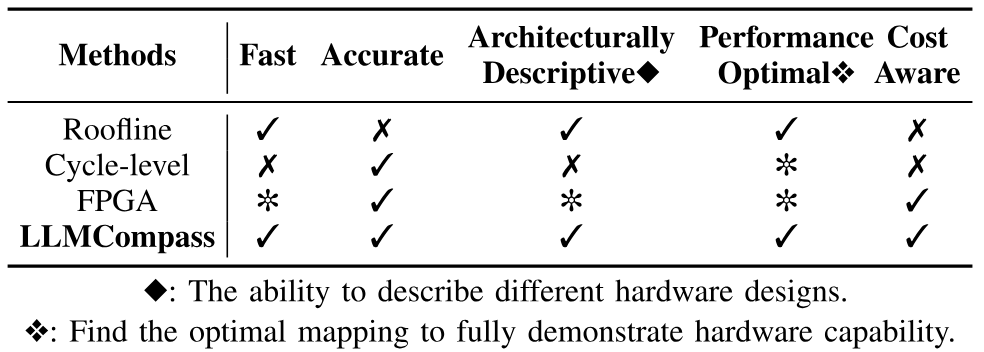

**表 5。** ハードウェア評価手法の比較

### 6.3 LLM 推論の高速化

多くの Transformer accelerator [Tam21, Wan22j, Wan21f, Ham21] が提案されており、主として pruning や approximate computing などの hardware-software co-design によって Transformer を高速化する。最大規模のモデルでもこれらの技術が有効かどうかは、今後の検証を要する。また、今日の LLM における主要な課題はモデルの巨大な規模にあり、これが本稿の主な対象である。

ソフトウェア領域でも LLM 推論を高速化する多くの試みがある [Ami22a, Pop23, Dao22f, Dao23c, She23d]。LLMCompass は、その計算とメモリアクセスパターンをモデル化することで、これらの最適化技術に対応できる。FlashAttention [Dao22f] のような技術は本稿の焦点と直交するため論じない。これらはソフトウェア領域を対象とし、通常は NVIDIA GPU など特定のハードウェアプラットフォーム上に実装される。

## 7 結論

本研究では、LLM 推論ワークロード向けの高速かつ正確で、アーキテクチャ記述能力を持つハードウェア評価フレームワーク LLMCompass を提案した。LLMCompass のハードウェア記述テンプレート、マッパー、アーキテクチャシミュレータにより、cycle-level simulator では現実的でない大規模 LLM chip design をハードウェア設計者が評価できる。組み込まれた面積およびコストモデルは、性能とコストのトレードオフの検討にも役立つ。LLMCompass を用い、ハードウェア設計が LLM 推論へ与える影響について示唆を導いた。この知見に基づき、NVIDIA GA100 と比べて性能/コストをそれぞれ 1.06 倍と 3.41 倍改善するレイテンシ指向設計とスループット指向設計を提案した。今後は、より多くの機械学習ワークロードと LLM fine-tuning を扱えるよう LLMCompass を拡張する予定である。

## 謝辞

Qixuan (Maki) Yu、Zhongming Yu、Haiyue Ma、Christopher Batten、および Princeton Parallel Group の全員から寄せられた feedback、suggestion、encouragement に感謝する。本研究は National Science Foundation Graduate Research Fellowship Program（Grant No. DGE-2039656）、National Science Foundation（Grant No. CCF-1822949）、Air Force Research Laboratory（AFRL）および Defense Advanced Research Projects Agency（DARPA）（agreement No. FA8650-18-2-7862）の支援を受けた。本稿に記載された意見、知見、結論、提言は著者のものであり、National Science Foundation の見解を必ずしも反映するものではない。米国政府は、著作権表記の有無にかかわらず、政府目的で複製物を作成し配布する権限を持つ。本稿に含まれる見解と結論は、明示的か黙示的かを問わず、Air Force Research Laboratory（AFRL）、Defense Advanced Research Projects Agency（DARPA）、または米国政府の公式方針や承認を必ずしも表すものと解釈すべきではない。

[+1]: TPUv3 core 1 個。各 TPUv3 chip には TPUv3 core が 2 個ある。同じ chip 内の TPUv3 core は internal link で接続される。

[+2]: 周波数変動を避けるため、周波数を 1400 MHz に設定した。

[+3]: 「load binary」error が発生したため、AMD MI210 では *LayerNorm* を benchmark しなかった。

[+5]: 実際には、input length 2048、output length 2048、batch size 16 はメモリ容量をわずかに超える。
