> [Yuhan Liu](https://yuhanliu11.github.io/)、[Jiayi Yao](https://dblp.org/pid/71/10222)、[Yihua Cheng](https://www.tensormesh.ai/about)、[Yuwei An](https://dblp.org/pid/18/10645)、[Xiaokun Chen](https://dblp.org/rec/journals/corr/abs-2510-09665)、[Shaoting Feng](https://shaoting-feng.github.io/)、[Yuyang Huang](https://royyhuang.github.io/)、[Samuel Shen](https://dblp.org/pid/417/0856)、[Rui Zhang](https://www.linkedin.com/in/rui-zhang-0279aa201)、[Kuntai Du](https://kuntaidu.github.io/aboutme.html)、[Junchen Jiang](https://people.cs.uchicago.edu/~junchenj/) [+equal]。2025 年 10 月 8 日に arXiv へ初回投稿、現行版は v2（2025 年 12 月 5 日）。[LMCache: An Efficient KV Cache Layer for Enterprise-Scale LLM Inference](https://arxiv.org/abs/2510.09665)。[原 PDF](/paper/lmcache.pdf)。[DOI](https://doi.org/10.48550/arXiv.2510.09665)。[TeX ソース](https://export.arxiv.org/e-print/2510.09665v2)。正確な印刷レイアウトと参考文献については原 PDF を正本とする。

[+equal]: *Yuhan Liu、Jiayi Yao、Yihua Cheng は同等に貢献した。*

## 要約

KV キャッシュは従来、大規模言語モデル（LLM）推論のデコードフェーズを高速化するために GPU メモリへ格納されてきた。しかし、異なるクエリや推論エンジン間でキャッシュを再利用するため、KV キャッシュを GPU デバイスの外へ移動する必要性が高まっている。実環境の利用統計もこの傾向を裏付けており、ユーザが格納する KV キャッシュの総量は時間とともに急速に増大し、GPU メモリの容量を大きく上回っている。

このような需要があるにもかかわらず、KV キャッシュを効率よくオフロードし、転送する手法はまだない。本稿では、現代的な LLM エンジン（vLLM と SGLang）が生成した KV キャッシュを GPU メモリから取り出して格納し、エンジンやクエリをまたいで共有する、初の、かつ現時点で最も効率的なオープンソース KV キャッシュソリューション **LMCache** を提示する。LMCache は、*キャッシュオフロード*（クエリ間のプリフィックス再利用）と、*プリフィル・デコード（PD）分離*（エンジン／GPU 間のキャッシュ転送）の両方をサポートする。

LMCache の高い性能と広範な採用は、次の貢献による。*(i)* バッチ化されたデータ移動操作と計算・I/O パイプラインによる、高度に最適化された KV キャッシュのデータ移動、*(ii)* LMCache を推論エンジンの急速な進化から分離する、モジュール化された KV キャッシュコネクタ、*(iii)* GPU、CPU、ストレージ、ネットワークの各レイヤーにわたる柔軟なキャッシュオーケストレーションを可能にする、pin、lookup、cleanup、move、compression などの一級制御 API である。

評価の結果、LMCache と vLLM を組み合わせると、複数ラウンドの質疑応答や文書分析などのワークロードでスループットが最大 $15\times$ 向上した。企業環境での LMCache の大規模な採用からは、貴重な知見も得られた。例えば、リモートストレージから KV キャッシュを取得するとプリフィル遅延に明らかな利点があり、業界で広く使われるコンテキスト切り詰めはプリフィックスキャッシュのヒット率を半減させる。

LMCache のソースコードは [https://github.com/LMCache/LMCache](https://github.com/LMCache/LMCache) で公開されている。

## 1 はじめに

現在、大規模言語モデル（LLM）の*推論*は、成長速度で学習を上回っている。LLM 推論は、対話型カスタマーサポートやコード生成から、検索ベースの文書分析、エージェント型ワークフローまで、数百万のアプリケーションを支えている。LLM 推論システムの構築において、LLM 推論の中間状態である KV キャッシュは、推論を高速化する事実上の標準的な最適化となっている。

従来、KV キャッシュは新しいトークンの生成中に、*単一クエリ内で*入力プロンプトの KV キャッシュを再計算しないために使われてきた。そのため、各クエリは推論エンジンの*一つのインスタンス*で独立に処理され、計算や I/O 操作を含む LLM クエリのライフサイクル全体が、一つの推論エンジンの GPU と GPU メモリ上で完結していた。

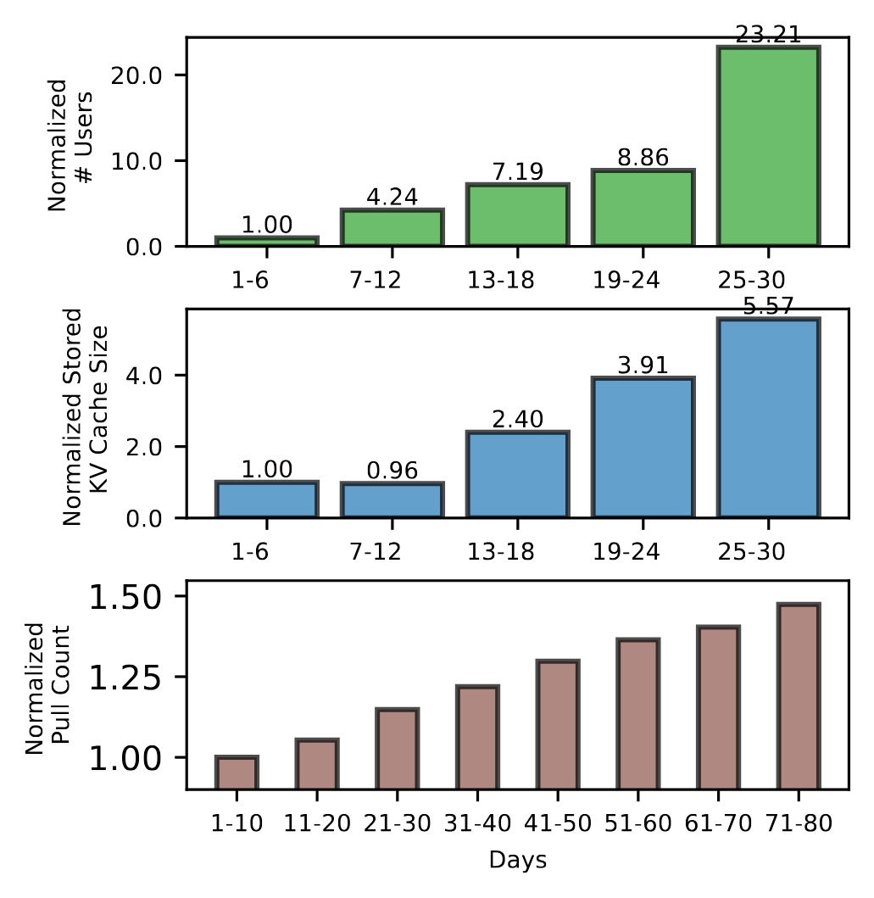

**図 1。** 上：LMCache を使うユーザは時間とともに増えている。中：LMCache はより大きな KV キャッシュの格納に使われている。下：LMCache の Docker イメージの pull 数は増加し続けている。

しかし近年は、KV キャッシュを GPU メモリの外へ移す次の二つの方向が現れている。

**重複計算を避けるクエリ間キャッシング：** KV キャッシュをクエリのライフサイクルを越えて*永続化*（例えば下位のストレージデバイスへ格納）し、別のクエリで共通プリフィックスを再計算することを避けられる。

**利用率を高めるプリフィル・デコード分離：** レイテンシに敏感なデコードフェーズが、スループット重視のプリフィルフェーズの影響を受けないよう、プリフィルとデコードを異なる GPU へ分離する傾向が生じている。このようなプリフィル・デコード（PD）分離では、プリフィル GPU が生成した KV キャッシュをデコード GPU へ転送する必要がある。

実環境の利用統計は、KV キャッシュが GPU メモリから外へ移る傾向を裏付けている。この後§[2.2](#section-02-02) で詳しく述べるように、ユーザが格納する KV キャッシュの総サイズは増え続け、GPU メモリの容量を大きく上回っている。リクエストが増えると、GPU メモリから KV キャッシュを頻繁に退避させる必要が生じ得る。また、別のクエリで再利用するには、いったん GPU メモリからオフロードし、再利用時に GPU メモリへ戻さなければならない。

これらのアイデアを実用化するには、LLM 推論システムへ新しい KV キャッシュセマンティクスを追加する必要がある。具体的には、通常の推論呼び出しから KV キャッシュを*抽出*し、後続クエリで必要に応じて*再ロード*できるインターフェースを、推論エンジンが提供しなければならない。システムは、抽出した KV キャッシュの永続的な*格納*と、分散推論エンジン間の*転送*も許容する必要がある。最も重要なのは、このようなインターフェース拡張を実用的にするため、KV キャッシュの抽出、再ロード、格納、転送を効率よく行い、新しいインターフェースを vLLM [Kwo23] や SGLang [Lm01] など急速に進化する推論エンジンと互換に保つことである。

本稿では、これらの新しい KV キャッシュセマンティクスを高性能に実現する初のオープンソースライブラリ、**LMCache** を導入する。LMCache により、KV キャッシュは推論エンジンから効率よく抽出して再ロードでき、CPU メモリ、ローカルディスク、リモートディスク、Redis からなるストレージ階層へ格納し、Ethernet、RDMA、NVLink など異なるネットワーク上で転送できる。

LMCache には三つの明確な貢献がある。

**#1。高度に最適化された性能：** LMCache は、実環境で KV キャッシュの格納とロードを効率的かつ実用的にする、一連の性能最適化を取り入れている。例えば、LMCache は操作をバッチ化し、KV キャッシュの格納とロードをパイプライン化するとともに、GPU 計算とデータのロード／格納もパイプライン化する（例えば、現在のレイヤーを計算しながら次のレイヤーの KV キャッシュをロードする）。また、推論エンジンがネイティブに用いる小さなページ単位で KV キャッシュを格納／ロードするのではなく、設定可能で、しばしばページよりはるかに大きいチャンクサイズで操作し、ストレージデバイスと GPU メモリ間の帯域幅を最大限に活用する。LMCache は、異なるストレージ階層間で KV キャッシュデータを移動する際のコピー数も、ゼロコピー操作によって抑える。

**#2。推論エンジンとの標準化インターフェース：** LMCache は、急速に変化する推論エンジンバックエンドとの互換性を保つ、標準化されたコネクタインターフェースを定義する。2025 年には平均して毎週 15-20 個の新しいオープンウェイトモデルが公開されるため、新しいモデルで新しいハードウェアを最大限に活用するには、現代の LLM 推論エンジンも急速に進化しなければならない。その結果、GPU メモリ内の KV キャッシュレイアウトが変わり、LMCache のインターフェースにも影響する可能性がある。これに対処するため、LMCache は推論エンジンバックエンドから分離された、モジュール化 KV キャッシュコネクタインターフェースを設計、実装し、推論エンジン API の変化に容易に適応できるようにする。

**#3。柔軟な KV キャッシュ管理インターフェース：** LMCache が導入するインターフェース拡張は、LLM 推論における新しいデータ構造である KV キャッシュを外部へ公開する。LMCache は、推論エンジンから抽出された KV キャッシュを開発者や運用者が特定、移動、固定、さらには圧縮できる API を提供する。これらの一級 API により、クエリスケジューラやルータなどの上位アプリケーションは、KV キャッシュを考慮したクエリルーティングなど、より適切な判断を下せる。

評価の結果、LMCache は、ローカルプリフィックスキャッシング、分散プリフィックス再利用、PD 分離など多様な環境で、オープンソース推論フレームワークの組み込み KV キャッシュ機構と商用推論 API のどちらも一貫して上回り、最大 $15\times$ 高いスループットと少なくとも $2\times$ 低いレイテンシを実現した。

定量的な改善に加え、LMCache は複数の企業とオープンソースプロジェクトに採用され、本番規模の KV キャッシュドライバ最適化に関する有用な知見と教訓をもたらした。この中には、リモートストレージバックエンドによる予想外のレイテンシ改善、コンテキスト切り詰めによるプリフィックスキャッシュヒット率の低下、言語自体の性能よりも高速な進化と円滑な統合の柔軟性が重要であることが含まれる。

以降では、動機（§[2](#section-02)）と課題（§[3](#section-03)）、LMCache のアーキテクチャと主要な設計選択（§[4](#section-04)、§[5](#section-05)、§[6](#section-06)）、導入経験（§[9](#section-09)）、実験評価（§[8](#section-08)）を述べる。

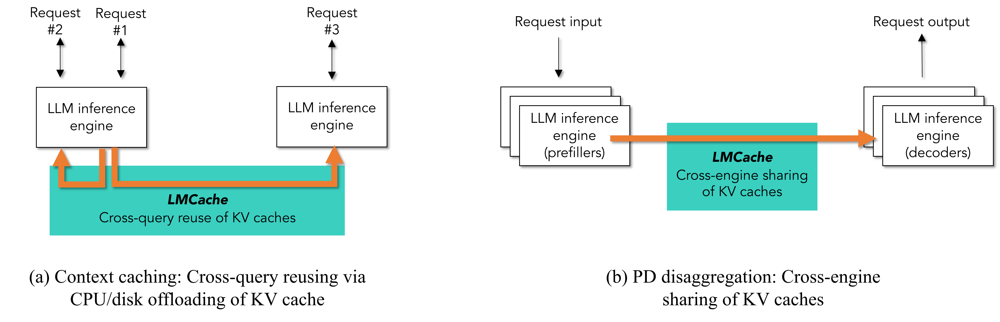

**図 2。** LMCache は、コンテキストキャッシング（クエリ間の KV キャッシュのオフロードと共有）と PD 分離（エンジン間の KV キャッシュ転送）の両方をサポートする。

## 2 動機と実環境の利用統計

### 2.1 LLM 推論における KV キャッシュ

*KV キャッシュ*はもともと、入力トークンとそれまでに生成されたトークンのアテンション状態を $K$ と $V$ のテンソルとして GPU メモリに直接保存し、単一の推論クエリを高速化するために導入された。KV キャッシュは実質的に、このクエリでそれまでに現れた各トークン対間のアテンション情報を格納する。要するに、これは *LLM ネイティブ*な知識表現である。

現在はコンテキストがますます長くなり、背景知識で推論を拡張するようになっている。この傾向から、長いコンテキストや背景知識による重複計算を減らすため、異なるユーザクエリ間で KV キャッシュを共有することが一般的になっている。

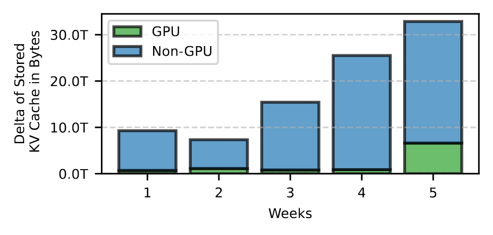

**図 3。** GPU メモリに収まる部分とそれを超える部分を含む、KV キャッシュサイズの週次増加。

### 2.2 実環境の利用統計

**KV キャッシュサイズは GPU メモリを超える：** 従来の LLM 推論システムは、KV キャッシュを常に GPU メモリ内へ格納してきた。ユーザが任意で有効にした利用状況トラッカーが収集した実環境の統計から、KV キャッシュの需要が GPU メモリの容量を大きく上回る規模に達していることが分かった。

[図 3](#figure-03) は、過去 5 週間における KV キャッシュサイズの週次増加を示す。緑色は GPU メモリに収まるキャッシュ、青色は GPU メモリ容量を超えるキャッシュである。時間の経過とともに、GPU メモリへ収まらない部分が大幅に増えており、すべてのキャッシュを GPU メモリだけで保持できないことが示される。クエリ間で KV キャッシュを再利用するには、特に過去に生成されたキャッシュを再利用する場合、CPU メモリや他のストレージ階層へオフロードするなど、GPU メモリから外へ移さなければならない。

**1 トークン当たりの再利用回数が大幅に増加：** 時間とともに、1 トークン当たりの再利用回数が大きく増えることも確認した。

[図 4](#figure-04) の左は、GPU メモリを超えたキャッシュのうち、再利用されたトークン数と格納済みの全トークン数の比を、再利用量上位 10 ユーザについて示す。この比を、1 トークン当たりの再利用回数と呼ぶ。過去数週間で 1 トークン当たりの再利用回数は明らかに増加しており、GPU メモリへ収まらないトークンが推論でますます頻繁に再利用されている。これは、GPU メモリへ再ロードすべきトークンが増えていることを意味する。

右の図は、過去 1 週間におけるユーザ別の 1 トークン当たりの再利用回数の分布を示す。19% を超えるユーザが格納済みトークンを 1.5 回以上再利用しており、トークンを格納した後に繰り返しアクセスする傾向が見て取れる。

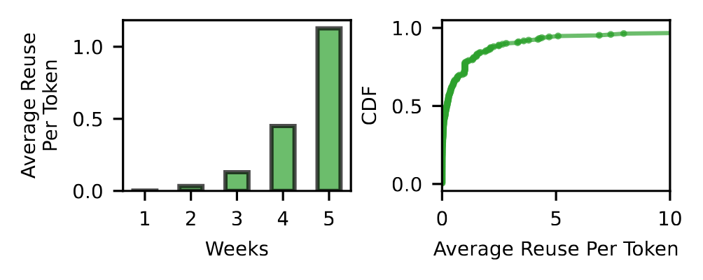

**図 4。** 左：上位ユーザの 1 トークン当たり平均再利用回数。右：ユーザ別の 1 トークン当たり平均再利用回数の分布。

### 2.3 KV キャッシュを移動する効率的な KV キャッシュレイヤーの必要性

実環境の導入統計から、KV キャッシュに二つの傾向が見られる。第一に、コンテキストの長大化やユーザトラフィックの増加が原因と考えられる、GPU メモリに収まらない KV キャッシュの継続的な増大である。第二に、GPU メモリの外へ格納されたトークンの再利用回数も増えている。どちらの傾向も、KV キャッシュを GPU メモリから外へ移す必要性を示している。現在の業界で KV キャッシュが GPU の外へ移される主要な場面は二つある。

1. *コンテキストキャッシング（クエリ間の KV キャッシュ再利用）*：一つのクエリの KV キャッシュ断片を保存し、後続の共通プリフィックスを持つクエリで再利用する。例として、同じ文書（または文書断片）の繰り返し分析、固定システムプロンプトや長い先行テキストを含む複数ラウンドの会話がある。プリフィックスキャッシングはプリフィルフェーズの重複計算を減らし、TTFT とクエリ当たりの GPU-hours を直接低下させる [Liu24d, Lm02, Lm03, Lm04, Qin24, Lm05, Lm06, Lm07]。
2. *プリフィル・デコード（PD）分離（エンジン間の KV キャッシュ転送）*：推論をプリフィルフェーズ（入力プロンプト全体を処理）とデコードフェーズ（自己回帰的なトークン生成）に分け、異なる GPU またはノードへ配置する。これにより、デコード速度がプリフィルに中断されず、テールレイテンシが低下する [Zho24, Lm08, Lm09]。

しかし、後述するシステム上の課題（§[3](#section-03)）のため、GPU メモリから KV キャッシュを効率よく抽出し、ロードできるライブラリは現時点で存在しない。

## 3 効率的な KV キャッシングの課題と関連研究

### 3.1 効率的な KV キャッシングの課題

プリフィックスキャッシングと PD 分離には大きな可能性があるが、実用化は互いに関連する三つのシステム上の課題に制限されている。

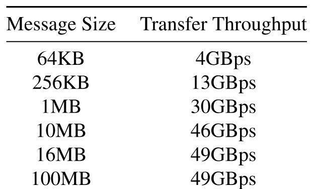

**表 1。** RCCL 転送ライブラリ使用時のメッセージサイズと実際の転送スループットの関係 [Lm10]。

#### 3.1.1 課題 #1：ページメモリにおける I/O の非効率性

KV キャッシュの格納と転送は、従来 PyTorch のシリアライズ（`torch.save` / `torch.load`）や単純なテンソルコピーに依存し、一般的な転送速度は 1 GB/s 未満だった。KV キャッシュのような大きなデータ構造を扱う場合、これらの方法は大きなレイテンシオーバーヘッドを生む。また、ローカルまたはリモートの多様なストレージデバイスに対するゼロコピーをサポートせず、CPU-GPU 間で追加のデータコピーが必要になる。

近年の vLLM [Kwo23] や SGLang [Lm01] などの高スループット推論エンジンは、KV キャッシュの格納と転送をさらに難しくしている。これらはページアテンションメモリを使い、アテンションバッファを小さく固定長のページ（通常 16-64 KB）へ分割する。例えば、vLLM は Llama-3.1-8B-Instruct で 62.5 KB のページを使用する。ページメモリアーキテクチャが広く使われるのは、バッチ処理とメモリ利用率を改善できるためである。

しかし、KV キャッシュのページは必ずしも連続しておらず、ページメモリアーキテクチャは KV キャッシュの永続化や転送に必要な小さな I/O 操作の数を大幅に増やす。これほど小さなデータブロックの転送は、ネットワーク帯域幅の利用不足を起こし、スループットを低下させることが知られている [Lm11, Lm12, Lm13]。[表 1](#table-01) が引用する研究では、8 枚の Broadcom Thor-2 400 Gbps NIC で接続した二つの AMD GPU ノード上でネットワーク帯域幅を使い切るには、転送ブロックを少なくとも 16 MB にする必要があることが示された [Lm14]。別の研究では、PCIe 5.0 の理論帯域幅の 75-80% へ達するには、転送サイズを MB オーダ（例えば 1-2 MB）まで増やす必要があることが示されている [Lm15]。

#### 3.1.2 課題 #2：急速に進化する推論エンジンとの互換性

AI の普及に伴い、新しい LLM やハードウェアアクセラレータが絶えず登場している。2025 年には、重要な LLM が平均 4 日に 1 個公開されている [Lm16]。推論エンジンも同じように高速で進化しなければならない。

新しいモデルやハードウェアをサポートする更新では、GPU メモリの割り当て方式がしばしば変わり、それに伴って KV キャッシュインターフェースも変化する。例えば、vLLM が新しいアテンションカーネルを採用すると、生成される KV キャッシュの次元が変わることがあり、KV キャッシュライブラリはその新しいカーネルの出力形式を自らがサポートする形式へ変換しなければならない。急速に変化する推論エンジンに合わせ、これらの変化を追跡し続けるには多大な作業が必要になる。

#### 3.1.3 課題 #3：管理 API の不足

KV キャッシュが LLM 推論バックエンドの一級データ構造になると、推論エンジン以外のコンポーネントや ML 運用チームも、それに基づく判断を下す必要がある。しかし、キャッシュの特定、退避、固定、圧縮のための統一的な管理インターフェースがなければ、上位モジュールは配置や退避について適切に判断できない。その結果、キャッシュ利用率の低下、ストレージの重複、予測不可能な退避動作が生じる。

例えば、クエリルータは各クエリを一つの推論エンジンインスタンスへ割り当てる。マッチするプリフィックスがローカル（例えば CPU メモリ）に保存されているインスタンスへクエリを送るには、KV キャッシュの位置を知る必要がある。

アプリケーションも、このような KV キャッシュ管理インターフェースを求め始めている。2025 年初頭、LMCache と密接に連携する金融企業 [+1] は、頻繁にアクセスする金融文書をユーザが*明示的に*固定し、ホットなコンテキストへより高速にアクセスできるインターフェースを求めた。別のエージェント企業は、指定されたコンテンツに対応する KV キャッシュを特定して圧縮し、圧縮後のキャッシュをノード間で転送する API 群を求めた。

[+1]: 機密保持のため、本稿では企業ユーザの名称を開示しない。

### 3.2 関連研究と既存の解決策

KV キャッシュを扱う機構は複数存在するが、上記の課題すべてを解決するものはない。

**推論フレームワーク：** 2025 年 1 月に vLLM Production Stack [Lm17] が公開されて以降、Nvidia の Dynamo [Lm18]、AIBrix [Lm19]、`llm-d` [Lm20]、SGLang OME [Lm21]、KServe [Lm22] など、複数のオープンソース分散推論スタックが登場した。これらは Kubernetes 上への推論エンジンソリューションの容易な導入を目指し、技術的には負荷やプリフィックスキャッシュを考慮した各種クエリルータと KV キャッシングをサポートする。LMCache は vLLM production stack、Dynamo、llm-d、KServe で利用されている。

**推論エンジンネイティブな KV キャッシング：** vLLM や SGLang などのオープンソース推論エンジンも、GPU から CPU へのネイティブな KV キャッシュ転送を提供する。しかし、単一ノードの推論向けに設計されているため、ノード間転送の最適化や KV キャッシュの階層ストレージサポートが欠けている。§[8](#section-08) でその性能を評価し、LMCache と比較する。

**KV キャッシュストレージレイヤー：** Mooncake [Qin24]、Redis [Lm23]、InfiniStore [Lm24]、3FS [Lm25] は分散オブジェクトストレージまたはキャッシングを提供する。しかし、推論エンジンとストレージレイヤーの間で小さなテンソルを異なるストレージ階層へ頻繁に、かつ効率よく移動するための「接着剤」となるレイヤーを欠いているか、特定の推論フレームワークと強く結合している。

**プロプライエタリ実装：** Fireworks AI や Together AI などのプロプライエタリ推論 API は、独自のプリフィックスキャッシングを内部実装している。しかし、自社の*クローズドソース*サービングスタックに結び付いており、独自のインフラを導入する運用者は利用できない。

**研究用ソースコード：** プリフィックスキャッシング [Kwo23, Lm01, Lm26, Lm27, Lm28, Lm29, Lm30, Lm05, Lm02, Lm07, Lm03, Lm31]、PD 分離 [Zho24, Lm08, Lm09]、KV キャッシュ圧縮 [Liu24c, Lm32, Lm33, Xia24a, Li24c, Lm34, Lm35, Lm36, Lm37, Lm38, Lm39] など、KV キャッシュ最適化のプロトタイプをオープンソース化した研究提案がある。しかしこれらのプロトタイプは、HuggingFace Transformers など研究向けの推論フレームワーク上に構築され、企業で利用できる水準へ十分に達していないか、SGLang や vLLM のように急速に変化する推論エンジンエコシステムとともに進化するように設計されていない。

## 4 LMCache の概要

**LMCache** は、これらの課題に対し、ページメモリを使う推論エンジン向けに KV キャッシュを効率的に格納、移動、明示的に管理できる、統一された高性能 KV キャッシュレイヤーである。これにより、プリフィックスキャッシングと PD 分離を企業規模で実用化する。

KV キャッシュレイヤーとして、LMCache は LLM 推論エンジンと異種のストレージ／ネットワークデバイスの間に位置する（[図 5](#figure-05)）。目標は、急速に進化する vLLM や SGLang などの推論フレームワークと互換性を保ちながら、KV キャッシュの移動と管理のための標準化された高性能な基盤を提供することである。

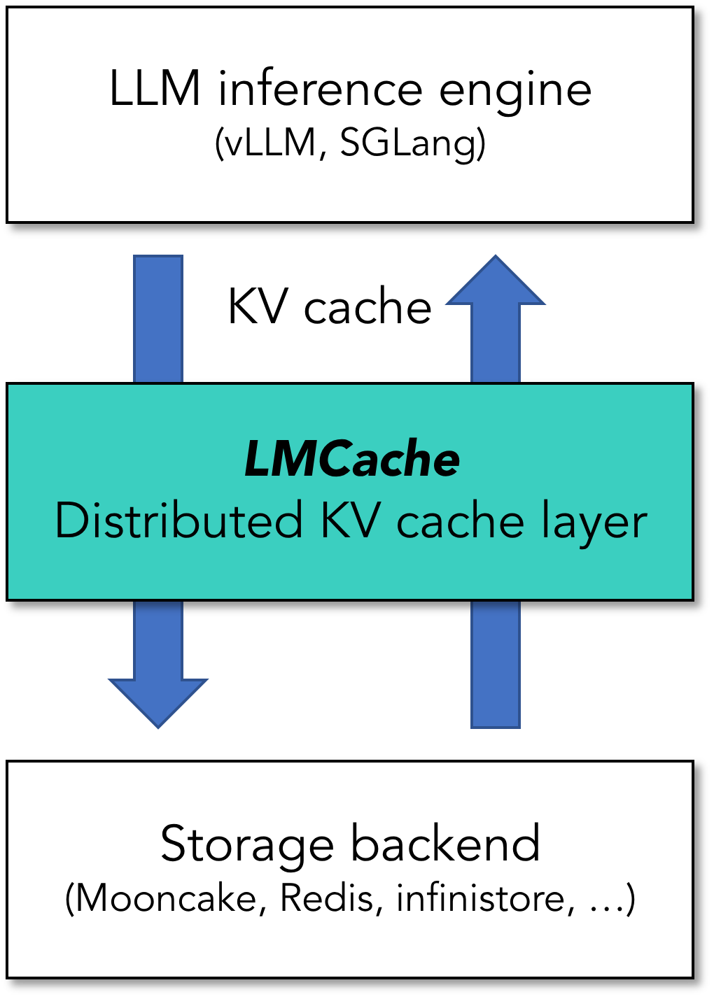

**図 5。** LMCache は LLM 推論エンジンと異種のストレージ／ネットワークデバイスの間に位置する。

[図 6](#figure-06) はエンドツーエンドシステムを示す。以下では、KV キャッシュを格納するワークフローと取得するワークフローの二つを例に説明する。

**Store：** 新しいクエリが到着すると、まず *KV connector* を通る。ここでトークン化された入力プロンプトや、関係するページの GPU メモリアドレスなどのメタデータを準備する。次にクエリは *token processor* へ渡され、バックエンドにまだ存在しない新しいトークンの数、すなわち格納すべきトークン数を決定する。最後に storage manager が、データ転送ロジックを担当する *transfer channel* を介して、それらのトークンの KV キャッシュをバックエンドへ保存する。

**Retrieve：** クエリがバックエンドから KV キャッシュをロードする必要がある場合も、KV connector から開始してメタデータを準備する。token processor はバックエンドに既に存在するプリフィックス一致トークン数を特定する。次に event manager は同じ query ID が以前に現れたかを確認する。もし現れていれば、キャッシュ済みメモリアドレスはすでに追跡されており、*GPU connector* へ直接返せる。GPU connector は KV キャッシュを GPU メモリへ戻す。event manager は、§[5.2](#section-05-02) で述べる層単位の非同期ロードイベントも起動する。query ID が新しい場合は、格納済み KV キャッシュの CPU メモリアドレスを検索するため、ストレージマネージャへ転送する。

**Lookup：** 特定トークンの KV キャッシュがバックエンドに存在するか確認する必要があるとき、ルータなどの上位コンポーネントは cache controller へクエリを送る。cache controller は、KV キャッシュバックエンドに現在格納されているすべてのトークンを記録する token pool を管理する。LMCache インスタンスが KV キャッシュを格納または退避するたびに、インスタンス内の LMCache worker が token pool を新しい状態で更新する。そのため token pool はバックエンドのトークンの最新状態を常に記録する。

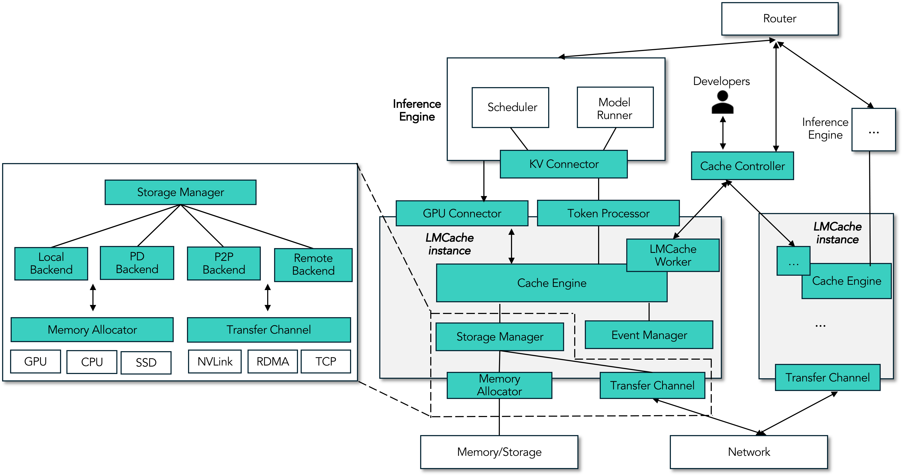

**図 6。** LMCache のエンドツーエンドシステムワークフロー。

## 5 性能最適化

LMCache の重要な側面は、デバイス間の KV キャッシュ移動を効率化することである。企業規模の LLM 推論で、LMCache は三つの主要な課題に対処する。

- 現代の LLM 推論エンジンは、ページ単位で KV キャッシュを管理する [+2]。Llama、Qwen、GPT-OSS など一般的なモデルでは、ページは通常 20 KB-63 KB である。このような小さな単位は帯域幅を飽和させられないため、転送には非効率である [Lm15, Lm14]。
- KV キャッシュの転送は LLM 推論と並行して実行する必要がある。これにより二つのオーバーヘッドが生じる。第一に、転送を計算と同じ CUDA stream で実行すると、データ移動が推論を停止させる。第二に、メモリコピー CUDA 関数の起動に CPU オーバーヘッドがかかる。各呼び出しは CPU サイクルを消費し、レイヤーやページが多いとその消費量は大きくなる。
- LLM 推論では大量のクエリが大量の KV キャッシュを生成する。これらをストレージデバイス上で複製すると空間を浪費し、コピーオーバーヘッドも生むため、推論が遅くなる。

[+2]: vLLM では、1 レイヤーの各ページが 16 トークンに対応する。

これらの課題は、オープンソースプロジェクトと企業導入の両方から得られた反省を反映している。本節ではこれらの課題を詳細に説明し、LMCache の設計判断の根拠を述べる。

### 5.1 バッチ操作

KV キャッシュ単位が小さいために生じる I/O の非効率性を解消するため、LMCache は一連の最適化を導入する。

**設定可能なチャンクサイズ：** ページ単位で KV キャッシュを転送する代わりに、LMCache は複数レイヤーの複数ページを大きなチャンクにまとめ、デフォルトではチャンク当たり 256 トークンとする [+3]。中間の *streaming GPU buffer* を使って実現する。格納時は、まず散在したページ化 GPU メモリからカスタム CUDA kernel で連続した streaming buffer へ KV キャッシュをコピーし、個々のページではなくチャンク単位で DMA エンジンが下位ストレージ（例えば CPU メモリ）へ一括オフロードする。ロード時は、DMA エンジンがまずストレージレイヤーから GPU buffer へチャンクを取得し、CUDA kernel でページメモリへ分解する。

[+3]: チャンクサイズは I/O 速度に合わせて設定できる。

**並列 Store/Load 操作：** LMCache は、ローカル CPU DRAM またはディスク、リモート CPU DRAM またはディスク、オブジェクトストレージ（例えば S3）など、複数のストレージ階層間で KV キャッシュを並行して格納、取得できる。実際の LLM サービングでは、KV キャッシュを複数デバイス間で同時に移動する必要がある。例えば、ホットなコンテキストの KV キャッシュを GPU から CPU メモリへ転送しながら、コールドなコンテキストを CPU メモリからローカルディスクへオフロードする。リンクを最大限に利用するため、LMCache の store と load API は複数のソースとターゲットデバイスを受け取り、異種リンク間の同時データ移動を可能にする。さらに、インターコネクトが全二重通信（例えば PCIe）をサポートすれば、これらの操作は並行実行できる。

**デコード KV キャッシュの遅延格納：** LMCache はデコード中に新しく生成された KV キャッシュを格納することもサポートする。各トークンの KV キャッシュを即座にオフロードする単純な方法は、頻繁な小さな書き込みを発生させる。その代わりに、LMCache はキャッシュをバッファに保持し、予め定めた数のトークン（すなわちチャンク）が生成された時点でバッチ格納する。チャンク単位の遅延格納は書き込み頻度と I/O オーバーヘッドを減らし、全体のストレージスループットを大幅に改善する。

### 5.2 計算と I/O のオーバーラップ

LMCache は、GPU 利用率を最大化するため、LLM 推論計算と I/O をオーバーラップさせる複数の最適化を用いる。

**層単位パイプライニング：** LMCache は層単位のパイプライニングによって KV キャッシュ転送と推論計算をオーバーラップさせる。各層の推論計算とデータ移動に別々の CUDA stream を割り当てる。例えば、第 1 層の推論を行う前に、その KV キャッシュを GPU buffer へロードしてページに変換する。第 1 層の推論中には、第 2 層の KV キャッシュをバッファへ非同期で取得し、同様に変換する。第 2 層の KV キャッシュのロードは、第 1 層の KV キャッシュが正しいページメモリに配置された後に行われる。この設計では、単一層の KV キャッシュと同じサイズの固定サイズ GPU buffer だけが必要で、データ転送と計算をオーバーラップできる。

**非同期計算とプリフェッチ：** 多くの場面では、推論スケジューラがクエリを受け付けてから、その KV キャッシュが実際に推論で必要となるまでに時間の隙間がある。例えば、キャッシュヒットのクエリが推論エンジンの他クエリ処理中に到着すると、そのクエリはキューで待機しなければならない。LMCache はこの空き時間を利用し、待機中クエリの KV キャッシュを遅いストレージ階層からより速い階層（例えばリモートディスクからローカル CPU メモリまたは GPU メモリ）へプリフェッチする。その結果、実際の推論計算が始まると、必要な KV キャッシュをより速いストレージ階層からロードまたは直接利用できるため、ロード遅延を大幅に削減できる。LMCache では、レイテンシ SLO とリソース制約に応じて、プリフェッチ先の階層をユーザが設定できる。

### 5.3 最小データコピー

単純な KV キャッシュ移動実装では、特に異種ストレージを扱う場合、各転送ステップでデータの追加コピーを作成してしまい、冗長なメモリ使用と不要なオーバーヘッドを生む。LMCache は必要最小限のコピーだけを維持することでこれを避ける。

**ゼロコピー操作：** KV キャッシュを複数デバイスへ同時に転送するとき、LMCache は参照カウンタによってデータ複製を減らす。具体的には、ローカル CPU メモリからローカルディスクとリモートオブジェクトストレージへ同時に書き込むなど、KV キャッシュを複数の宛先へ書き込む場合、LMCache は新しいコピーを作らず、転送ごとに共有データの参照カウンタを増やす。各読み書きが完了するとカウンタを 1 減らし、カウントが 0 になったときデータを解放する。この設計により、並行する読み書き操作間でデータを共有しつつ不要な複製を避け、メモリ圧力を減らして効率を高める。この技術はオペレーティングシステムの PCB counter に似ている [Lm40]。

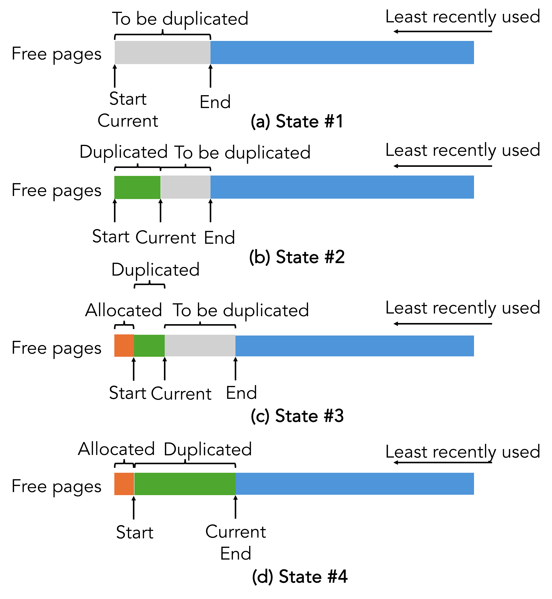

**図 7。** LMCache における動的オフロードの図。

**動的オフロード：** vLLM など現代の推論エンジンは、アクティブなクエリが現在使っていない KV キャッシュページ、すなわち *free page* のプールを GPU メモリに維持する。LMCache はすべての free page を CPU メモリへ複製せず、一部だけを複製する。この機構は三つのポインタで実装される。

- **Start pointer：** GPU メモリにおける free-page 領域の開始アドレス。
- **Current pointer：** 既に CPU メモリへオフロードされた free page のインデックス。
- **End pointer：** オフロード対象としてスケジュールされた free-page 領域の終了アドレス。

[図 7](#figure-07) に示すように、動的オフロードには四つの状態がある。

- **State #1 (Initialization)：** start と current のポインタが重なる。start/current ポインタと end ポインタの間の領域は、複製待ちのページを表す。
- **State #2 (In-progress)：** current ポインタが end ポインタに向かって移動する。start と current の間のページは既に CPU メモリへオフロードされている。
- **State #3 (Query Arrival)：** 新しいクエリが free page の一部を取得すると、後続のアクティブクエリに十分な GPU メモリを確保するため、end ポインタを割り当てられたページ数だけ前方へ移動させる。
- **State #4 (Steady state)：** current ポインタと end ポインタが重なり、スケジュールされたすべてのページが複製済みであることを示す。

クエリが current ポインタより先のページを割り当てようとすると、必要なページを覆うのに十分なだけ current ポインタが右へ移動するまで、割り当ては停止する。したがってこの設計の主なトレードオフは、GPU と CPU メモリ間で複製するページ数、すなわち end pointer - start pointer で定義される領域である。複製窓を小さくすると複製率は下がるが、割り当て停止の可能性が高まる。例えば 1 ページだけを複製し、推論クエリが 3 ページを必要とすると、current と end ポインタがさらに 2 ページ分進むまでクエリは待たなければならない。一方、3 ページを複製すればクエリはすぐ実行できるが、複製率は高くなる。現時点では未サポートだが、同じ動的オフロード戦略は CPU と GPU 以外の他のストレージ階層にも拡張できる。

## 6 KV キャッシュレイヤーと推論エンジンを接続する標準インターフェース

現代の vLLM や SGLang などの LLM 推論エンジンは、多様なアーキテクチャを持つ新しいモデルをサポートするため、急速に進化している。2025 年には、毎週平均 15-20 個の新しいモデルが公開されている。これらの新アーキテクチャに対応するには、Sliding Window Attention や Multi-Head Latent Attention の追加のように、推論エンジンに非自明な変更が必要になることが多い。これらのコード変更は KV キャッシュの内部管理を変えることが多く、LMCache がその都度に個別対応するのは現実的ではない。

この課題に対処するため、LMCache は KV キャッシュ管理を推論エンジンバックエンドから分離する、標準化された KV キャッシュコネクタインターフェースを導入する。この設計により、上流の推論エンジンがどのように進化しても LMCache の互換性が保たれる。

この API の設計は LMCache チームが発案したが、API の実装とメンテナンスは LMCache チームと vLLM チームの協働による。

**設計目標：** 主な設計目標は次のとおり。

- **最大の柔軟性：** 可能な限り多くの KV キャッシュ操作を可能にする。
- **vLLM ネイティブ：** 厳格な scheduler-worker 分離、プリフィックスキャッシングを一級機能とすること、アテンション以外の操作のみ CUDA graph をキャプチャするピース単位 CUDA graph など、vLLM の設計方針に沿う。
- **ツリー外 connector に親和的：** vLLM 側のコードを変更せずにツリー外 connector を統合できる。
- **API レベルのオーバーヘッド最小化：** API レベルでプロセス間通信などのオーバーヘッドを導入しない。

vLLM の scheduler と model runner を分離する方針と互換性を保つため、connector API は二組のインターフェースを含む。1）scheduler では、connector からの追加キャッシュヒットトークンを vLLM 内の通常のプリフィックスキャッシュトークンとして扱い、LMCache がスケジューリング判断に直接影響を与えて変更する（すなわち LMCache にキャッシュヒットがあると新たにプリフィルするトークン数が変わる）、2）model runner では、モデル実行の前後とアテンション計算の前後に hook を追加し、大きな KV キャッシュのオフロードと層単位 KV キャッシュのオフロードの両方を可能にする。

本節の残りでは、[表 2](#table-02) にすべてのインターフェースを一覧し、重要な API の設計を説明したうえで、クエリがこれらのインターフェースとエンドツーエンドでどのようにやり取りするかを追跡する。

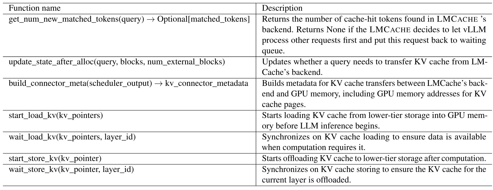

**表 2。** LMCache connector の関数。

[表 2](#table-02) のインターフェースは、下位ストレージにおける LMCache の KV キャッシュのロードと格納の基盤を形成する。そのうち最初の三つのインターフェースは vLLM scheduler 内に実装され、LMCache KV キャッシュバックエンドで見つかった一致トークン数に基づいて必要なメタデータを準備する。残り四つは model runner にあり、推論エンジンと LMCache KV キャッシュバックエンド間の実際の KV キャッシュ転送を実行する。

以上をまとめると、クエリが到着したとき scheduler はまず `get_num_new_matched_tokens` を呼び、LMCache にバックエンドのキャッシュヒットトークンを問い合わせる。LMCache が vLLM に現在のリクエストを待機キューへ戻して他のリクエストを先に処理させ、このリクエストの I/O と他のリクエストの計算をオーバーラップさせると判断した場合、この関数は `None` を返すことがある。

`update_state_after_alloc` 関数は、LMCache から得た一致トークン情報に基づき、vLLM の各ページを外部ストレージバックエンドからロードする必要があるかを決定する。キャッシュヒットトークン数が 0 より大きければ、`build_connector_meta` を呼び、ストレージデバイスから KV キャッシュをロード、またはそこへ保存するためのメタデータを準備する。

クエリが model runner に到達すると、層単位パイプライニングの場合、`start_load_kv` を呼んで第 1 層の KV キャッシュの GPU メモリへのロードを開始する。各層の LLM 推論計算が始まる前に `wait_load_kv` を呼び、その層の KV キャッシュロードを同期し、次の層の KV キャッシュのロードを開始する。

各層の推論計算後、層単位パイプライニングでは `wait_store_kv` を呼び、前の層の KV キャッシュの格納完了を待ってから、`start_store_kv` を呼び、新たに生成された層の KV キャッシュの格納を開始する。

層単位以外のパイプライニングでは、第 1 層の LLM 推論開始前に `start_load_kv` を呼び、KV キャッシュ全体を GPU メモリへブロッキングロードする。KV キャッシュが正しい GPU メモリページアドレスに置かれた後に LLM 推論を実行する。現在のスケジュールイテレーションの LLM 推論が完了した後、`start_store_kv` を呼び、生成された KV キャッシュを下位ストレージへ同期的に格納する。

**影響：** この API は vLLM で公開されてから 6 ヶ月以上経過した。この 6 ヶ月で、NVIDIA Dynamo、RedHat の llm-d、ByteDance の AIBrix、vLLM production stack などのオープンソース採用があった。また、KV connector API を利用する複数のプロプライエタリ connector も確認した。

## 7 Controller インターフェース

LMCache は、グローバルメタデータ管理、キャッシュ操作、リクエストルーティングを担当する集中型 KV cache controller を中心とする分散キャッシングシステムである。これらの機能をサポートするため、LMCache は二種類の API を提供する。（1）ユーザやシステム運用者が直接アクセスできる外部 API、（2）個々の LMCache インスタンスが使用する内部 API である。

機構上、KV cache controller は集中型 controller manager とインスタンス単位の worker という二層からなる。controller manager は単独プロセスとして実行され、グローバルな協調点となる。インスタンス単位の worker は各 peer LMCache インスタンスと併置され、ローカル操作を処理するか manager へグローバルリクエストを発行する。外部 API 呼び出しは集中型 manager が受け取り、必要に応じて適切な操作を各 worker へ配信する。インスタンス単位の worker は、メタデータの更新や検索のため、内部 API を介して集中型 manager と能動的にやり取りすることもできる。

KV cache controller は、ノード間 KV キャッシュ共有、キャッシュを考慮したリクエストルーティング、動的 KV キャッシュ移行などの高度な最適化を支える。本節の残りでは、具体的な例を通じてこれらの最適化が controller インターフェースをどのように利用できるかを示す。

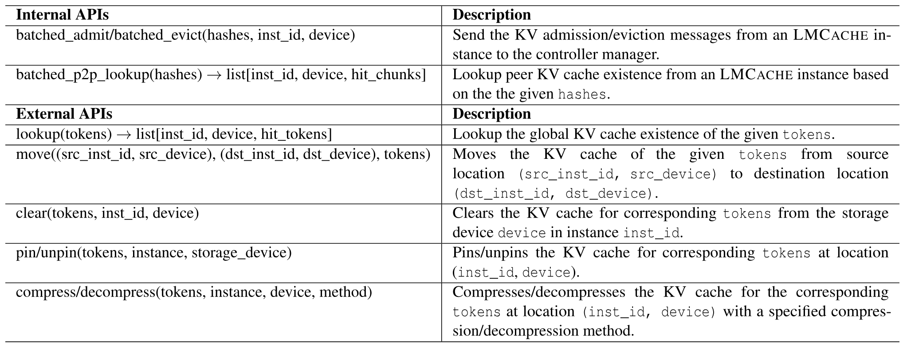

**表 3。** LMCache Controller の API。

**KV キャッシュを考慮したルーティング：** この場合、上位ルータは予想キャッシュヒット率が最も高いインスタンスへリクエストを送ろうとする。各 LMCache インスタンスは `batched_admit` と `batched_evict` を通じ、キャッシュへの受け入れと退避の判断を controller manager へ報告する。controller manager はこれらの更新を集約し、すべてのインスタンスにまたがる KV キャッシュ状態のグローバルなインメモリビューを管理する。ルータが `lookup(tokens)` を呼ぶと、controller はグローバル KV キャッシュ状態を参照し、現在キャッシュされている場所とトークン数を示す `(instance_id, storage_device, hit_tokens)` のリストを返す。

**KV キャッシュ移行：** KV キャッシュを保持するインスタンスを縮小するとき、または負荷分散が必要なとき、KV キャッシュを別のインスタンスへ移す必要がある。controller manager は `move((src_inst_id, src_device), (dst_inst_id, dst_device), tokens)` API を通じてこの操作を処理し、ソースインスタンスにリクエストを配信する。ソースインスタンスは宛先インスタンスへの接続がなければ接続を確立し、指定された KV キャッシュをソースストレージデバイス `src_device` から `(dst_inst_id, dst_device)` の位置へ転送する。

**P2P KV キャッシュ共有：** LMCache はピアツーピアの KV キャッシュ共有をサポートし、ローカルキャッシュミス時にピアから KV キャッシュを取得できる。キャッシュミス後、インスタンスのローカル worker は `batched_p2p_lookup` を介して集中コントローラに問い合わせる。manager はヒットチャンク数とその場所を表す `(inst_id, device, hit_chunks)` のリストを返す。インスタンスは、例えば `hit_chunks` が最大のピアから KV キャッシュをロードできる。

**KV キャッシュのクリア：** モデル切り替えやメモリ回収の際に、アプリケーションはキャッシュをクリアできる。`clear(tokens, inst_id, location)` 呼び出しを受け取ると、controller manager は `inst_id` で特定された対応インスタンスへ操作を配信する。そのインスタンスの worker は、特定ストレージデバイス `device` に格納された `tokens` に関連する KV キャッシュを削除する。

上述の応用例では、`compress/decompress(tokens, inst_id, device, compression_method)` のように、指定場所（`inst_id`, `device`）の KV キャッシュを指定された `compression_method` で圧縮／解圧縮する API は扱っていない。また `pin/unpin(tokens, inst_id, device)` は、特定の場所 `(inst_id, device)` で指定された KV キャッシュを固定、または固定解除できる。ユーザはこれらの API を必要に応じて自由に呼び出し、自分のアプリケーションで KV キャッシュを明示的に管理できる。

## 8 評価

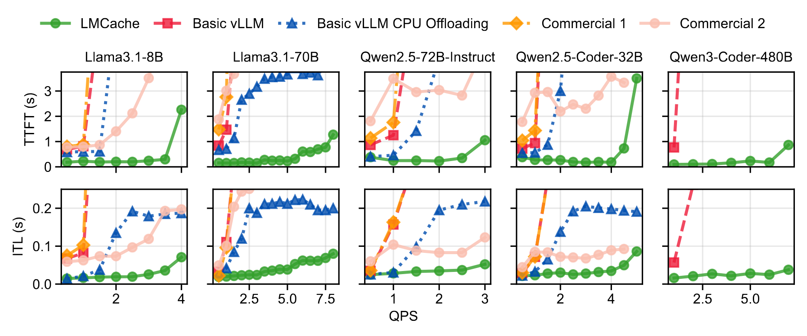

**図 8。** 基本 vLLM、基本 vLLM CPU オフロード、二つの商用代替手段と比べ、LMCache の TTFT は 1.9-8.1$\times$ 小さく、推論スループットは 2.3-14$\times$ 高い。基本 vLLM CPU オフロードは `Qwen3-Coder-480B` で実行できず、商用代替手段にも `Qwen3-Coder-480B` を導入する選択肢はない。

### 8.1 設定

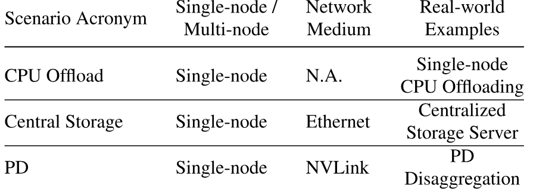

**表 4。** 評価シナリオの設定。

[表 4](#table-04) に示す三つの異なるシナリオで LMCache を評価する。これらは LMCache のユーザが一般に使用する代表的な設定である。

**モデル：** 業界で採用される人気のオープンソースモデル、`meta-llama/Llama-3.1-8B-Instruct`、`Sao10K-L3-8B`、`meta-llama/Llama-3.1-70B-Instruct`、`Qwen/Qwen2.5-Coder-32B-Instruct`、`Qwen/Qwen3-Coder-480B-A35B-Instruct-FP8`、`Qwen/Qwen2.5-72B-Instruct` で LMCache とベースラインを比較する。

**データセット：** 複数ラウンドの質疑応答を模倣したデータ、LongBench [Bai23] の長文コンテキスト質疑応答、vLLM 公式ベンチマークスクリプト [Kwo23] のランダムデータセットなど、複数のデータセットで LMCache を評価する。

**ハードウェア：** 単一ノード評価では、GMI Cloud [Lm41] が提供する $8\times$H100 サーバ上で LMCache を実行する。モデルのサービングに必要な GPU 数はモデルごとに異なるため、各モデルを正常に起動できる最小数の H100 GPU を割り当てる。複数ノード評価では、単一ノードと同数の GPU を使い、KV キャッシュ格納に CPU メモリを使う集中型リモートストレージバックエンドを設定する。PD 分離では、prefiller と decoder の両インスタンスに単一ノード評価と同数の GPU を割り当て、NVLink で接続する。

**指標：** 各実験で、プリフィル遅延である time-to-first-token（TTFT）と、連続する二つの出力トークン生成間の平均遅延である inter-token-latency（ITL）の両方を示す。CPU オフロードや PD 分離の遅延を分解するコンポーネント単位分析では、各コンポーネントの遅延を個別に報告する。

**ベースライン：** LMCache `v0.3.6` を次のベースラインと比較する。

- Basic vLLM：プリフィックスキャッシングをデフォルトで有効にする vLLM `v0.10.2`。KV キャッシュを GPU メモリ内だけに保持するため、小さな一部しか保持できない。
- Basic vLLM CPU Offloading：独自の CPU オフロード実装を持つ vLLM `v0.11.0`。
- Commercial offerings #1 および #2：ユーザが定義したモデルを実行するために GPU を予約する専用エンドポイントサービス。これらのベースラインは 9 月 10 日にアクセスして実行した。

### 8.2 単一ノード CPU オフロード

まず、[表 4](#table-04) の CPU Offload シナリオで LMCache を評価する。この実験では、典型的なチャットボットベースの文書分析シナリオを模倣する、複数ラウンドの Q&A ワークロードを使用する。デフォルトでは、各 LLM クエリは 10K トークンからなり、コンテキストとして使う文書（約 12 ページの PDF）と、クエリごとに異なる短い質問を含む。小さなモデルは一般に、より多く、より長いクエリを処理するのに適しているため、Llama-3.1-8B-Instruct へは 20K トークンを入力する。LLM の出力は最大 100 トークンの短い回答である。チャットセッションは 40 ユーザで始まり、指定した到着率（QPS）に従って追加ユーザが参加する。LMCache が KV キャッシュをオフロードできる CPU メモリの上限は 500 GB とする。

[図 8](#figure-08) に示すように、LMCache は TTFT と ITL の両方ですべてのベースラインを一貫して上回る。例えば QPS = 1 のように QPS が低いとき、LMCache の TTFT は 1.9-8.1$\times$ 小さい。評価した 5 モデルのすべてで、同じ TTFT のもとで最強のベースラインより 2.3-14$\times$ 高いクエリ処理率（スループット）を実現する。ITL でも LMCache がベースラインを上回る。ベースラインでは最初のトークン生成前の遅延が長く、その後のトークン生成も待ち行列に入るためである。具体的には QPS=1 のとき、LMCache の ITL は最良ベースラインより 7%-92% 小さい。Qwen3-Coder-480B については、Commercial Option #1 と #2 のどちらもホスティングをサポートしていない。

**LMCache の改善を理解する：** LMCache がベースラインを上回るのには複数の理由がある。GPU メモリ内だけに KV データをキャッシュする基本 vLLM と異なり、LMCache は CPU オフロードを活用する。CPU メモリは GPU メモリよりはるかに多くの KV キャッシュを保持できるため、LMCache は大幅に高いキャッシュヒット率を実現する。レイヤーごと、16 トークンごとに転送するためロード帯域幅を十分に利用できない基本 vLLM CPU オフロードに対し、LMCache はチャンク単位で KV キャッシュをロードし、高性能のデータロード CUDA kernel を用いるため、転送モジュールの実装がより効率的である。クローズドソースの商用代替手段は内部実装が公開されていないため、比較はブラックボックス方式で行う。エンドツーエンドの結果から、Commercial Option #1 には二次ストレージへの KV キャッシュオフロード機構がないと推測する。Commercial Option #2 は二次ストレージへの KV キャッシュオフロードをサポートしている可能性が高いが、性能は依然として LMCache より低い。

### 8.3 実トレース駆動評価

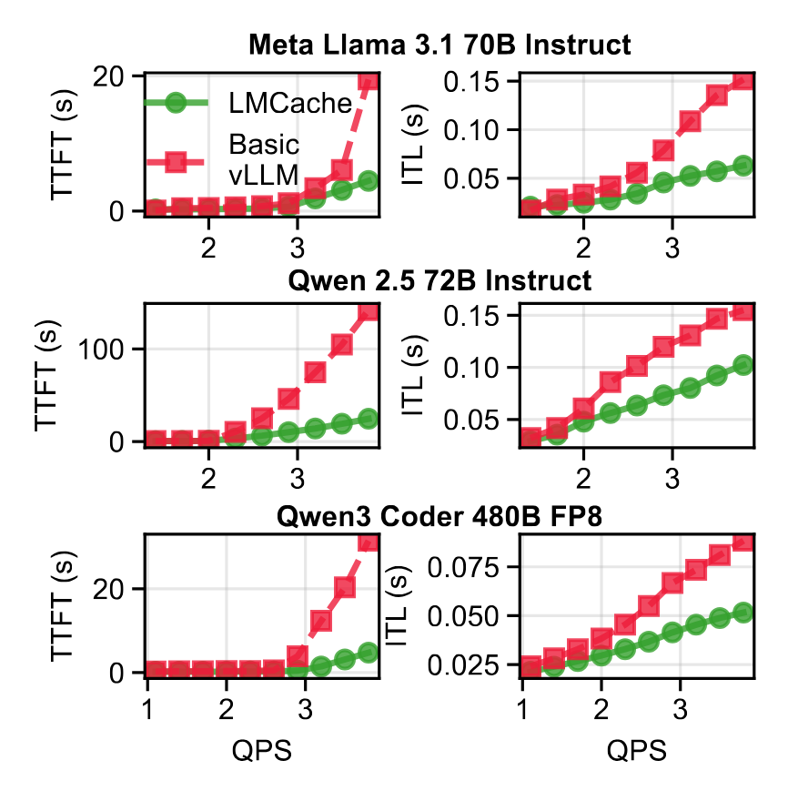

**図 9。** 企業 F の入出力分布から得た実トレースに基づき、3 種類のモデルで LMCache と基本 vLLM を比較する。高 QPS で LMCache の TTFT は少なくとも 4.4-6.6$\times$ 小さく、ITL は 34%-58% 小さい。

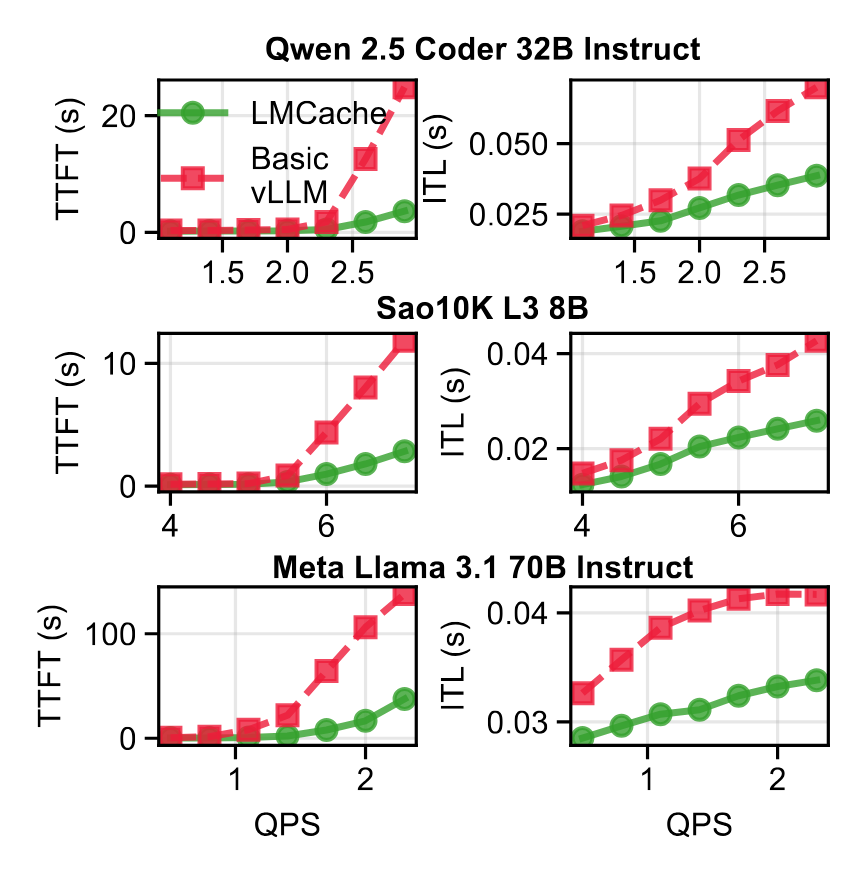

**図 10。** 上と中の図：企業 F から得た実トレースに基づき、Qwen 2.5 Coder 32B Instruct と Sao10K L3 8B で LMCache と基本 vLLM を比較する。下の図：企業 G の入出力データ分布から得たトレースに基づき、Llama 3.1 70B Instruct で LMCache と基本 vLLM を比較する。LMCache の TTFT は 3.7-6.8$\times$ 小さく、ITL は 19%-44% 小さい。

企業 F と企業 G の入出力トークン分布から得た実トレースで LMCache を評価する。企業 $F$ のプロプライエタリモデルへはアクセスできないため、5 種類のモデルでトレースを実行する。実験を現実的な時間で実行するため、本来は数日間にわたるトレースを伸縮し、実行するワークロードが 1 時間以内に完了するようにする。LMCache の CPU DRAM 使用量は最大 500 GB とし、GPU プリフィックスキャッシングを有効にした最新の基本 vLLM と比較する。

[図 9](#figure-09) と [図 10](#figure-10) に示すように、LMCache は 5 モデルの実トレースにおいて、異なる QPS でも基本 vLLM を一貫して上回る。具体的には、高 QPS で 5 モデルの TTFT を少なくとも 3.7-6.8$\times$ 削減し、ITL を少なくとも 19%-58% 削減する。

### 8.4 集中型ストレージサーバ

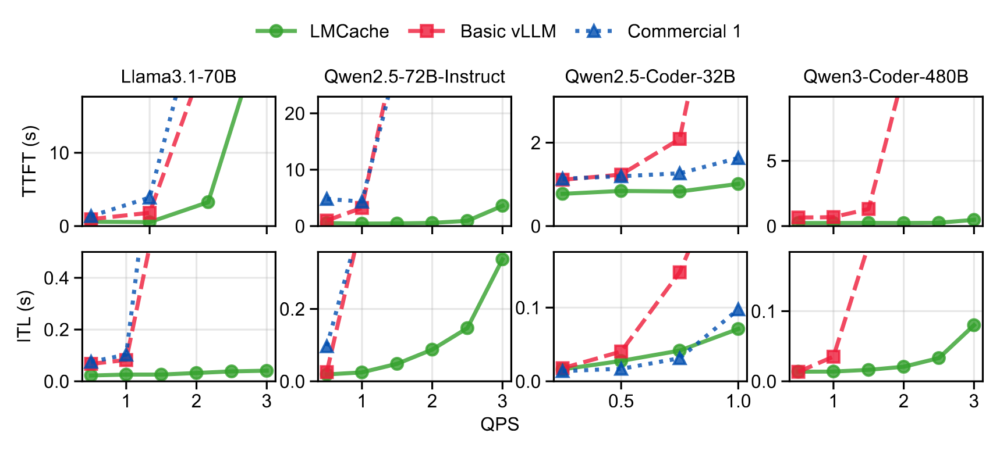

**図 11。** 基本 vLLM と比べ、リモートバックエンドへオフロードする LMCache は、同じ TTFT のもとで推論スループットを 1.3-3$\times$ 向上させる。

次に、[表 4](#table-04) の集中型ストレージ設定に従い、15 Gbps の帯域幅で GPU インスタンスに接続した集中型リモートサーバを通じ、KV キャッシュを共有する LMCache を実行する。この実験では、長文コンテキスト評価に広く利用されるベンチマークである LongBench [Bai23] の TriviaQA データセットを使用する。公式 vLLM ベンチマークスクリプト [Kwo23] に従い、指定 QPS のポアソン分布に従って推論クエリを生成する。

[図 11](#figure-11) に示すように、LMCache は異なる QPS レベルですべてのベースラインを一貫して上回り、推論スループットを 1.3-3$\times$ 向上させる。リモートバックエンドは CPU メモリよりはるかに多くの KV キャッシュを格納できるため、キャッシュヒット率が高くなることが改善の理由である。

しかし、リモートバックエンドは帯域幅がはるかに低いため、そこから KV キャッシュをロードすると CPU メモリからのロードより遅延が大きくなる。入力コンテキストが短い、またはモデルが小さくプリフィルが速すぎる場合、ロード遅延がプリフィル遅延を超えることさえある。このシナリオは後で§[8.7](#section-08-07) に示す。したがって、KV キャッシュがリモートストレージサーバにある場合、ロードとプリフィルのどちらを行うかを適応的に判断する必要がある。

### 8.5 PD 分離

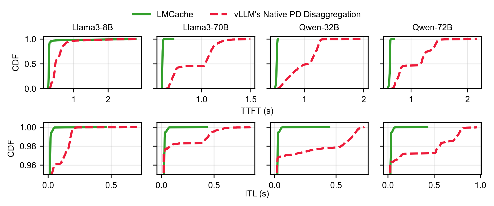

**図 12。** vLLM ネイティブ PD 分離と比べ、LMCache の PD 分離はテールレイテンシが大幅に低く、平均 TTFT が 1.5-1.8$\times$ 小さく、平均 ITL が 1.1-1.7$\times$ 小さい。

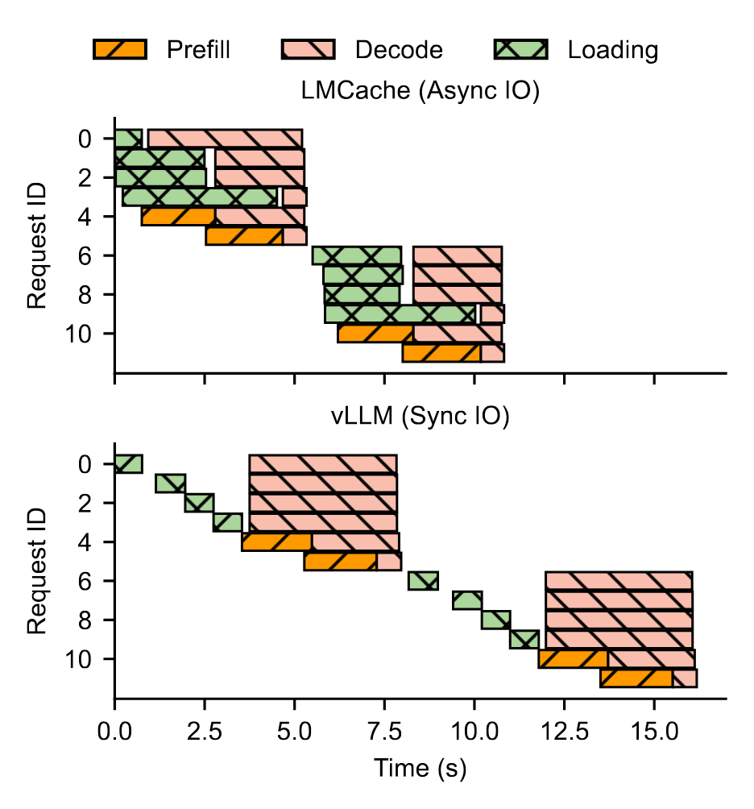

**図 13。** リクエストの非同期化により、LMCache は KV キャッシュのロードと推論計算（プリフィルまたはデコード）をオーバーラップさせる。

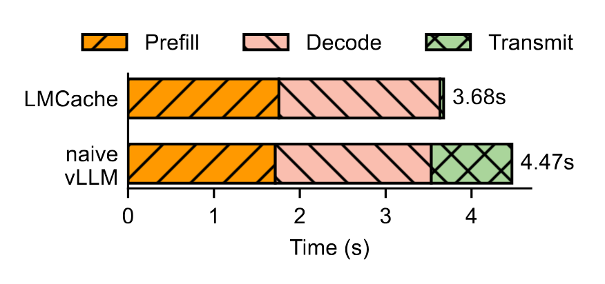

**図 14。** vLLM ネイティブ PD 分離と比べ、LMCache の転送遅延ははるかに小さく、エンドツーエンド遅延も低下する。

この実験では PD 分離環境の性能を評価する。ランダムな入出力ワークロード向けの公式ベンチマークスクリプトを用い、LMCache と vLLM ネイティブ PD 分離を比較する。入力は 8K トークン、出力は 200 トークンとする。[図 12](#figure-12) は LMCache と vLLM ネイティブ PD 分離の 95 パーセンタイル TTFT を示し、LMCache のテールレイテンシが大幅に短いことが分かる。平均 TTFT でも、LMCache は vLLM ネイティブ PD 分離を大きく上回る。具体的には、4 モデルで平均 TTFT を 1.53-1.84$\times$ 削減し、平均 ITL を 1.12-1.66$\times$ 削減する。

LMCache がベースラインを上回る性能は、PD 分離向けのより効率的な設計による。具体的に LMCache は、チャンクプリフィル中に生成された KV キャッシュの各チャンクを prefiller インスタンスの GPU メモリ内のバッファへコピーし、decoder インスタンスの対応バッファへ転送する。受信後、KV キャッシュは decoder インスタンスのページメモリへコピーされる。

一方、vLLM ネイティブ PD 分離は NIXL のメモリコピー関数を使い、prefiller が生成したページ化 KV キャッシュを decoder へ直接送る。この関数は prefiller 側の KV キャッシュページのメモリアドレスを入力として受け取り、decoder 側の宛先アドレスへコピーする。しかし、KV キャッシュのページメモリが prefiller の GPU メモリ全体に散在すると、転送はページ単位で行われ、§[5](#section-05) で述べたように帯域幅の利用不足を招く。

### 8.6 コンポーネント単位の評価

LMCache による改善をさらに理解するため、エンドツーエンドシステムの各コンポーネントの遅延を分解するコンポーネント単位分析も行う。

**PD 分離：** [図 14](#figure-14) は、プリフィルとデコードの計算、および prefiller と decoder インスタンス間の KV キャッシュ転送を含む LLM 推論の遅延内訳を示す。プリフィルとデコードの計算時間は、LMCache と vLLM ネイティブ PD 分離で同じである。しかし§[8.5](#section-08-05) で述べたように、vLLM ネイティブの設計はより細かい粒度で KV キャッシュを転送するため、帯域幅を十分に利用できない。一方、LMCache はより効率的な KV キャッシュ転送機構を用いて転送を大幅に高速化し、PD 分離のエンドツーエンド遅延全体を削減する。

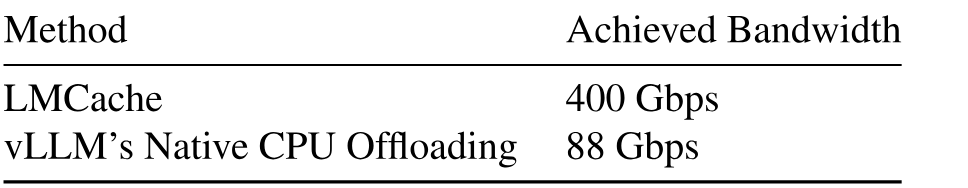

**表 5。** CPU メモリから KV キャッシュをロードするとき、LMCache は vLLM ネイティブ CPU オフロードよりはるかに高いロード帯域幅を実現する。

**CPU オフロード：** [表 5](#table-05) では、LMCache と vLLM ネイティブ CPU オフロードが CPU からのロードで達成する帯域幅をアブレーション評価する。LMCache の転送帯域幅が vLLM ネイティブ CPU オフロードより高い理由は、転送粒度にある。ネイティブ CPU オフロードがページごとにデータを移動するのに対し、LMCache はチャンクごとに転送する。各転送操作は CUDA メモリコピーを起動し、事前のメタデータ準備と完了後のシグナル送信が必要になる。これらの転送ごとの処理が各メモリコピーカーネルへオーバーヘッドを加える。1 回のコピーでより大きなデータチャンクを転送することで、LMCache は全体のオーバーヘッドを減らし、実効帯域幅を大幅に高める。

**非同期計算：** エンドツーエンド遅延を削減する LMCache の非同期計算の効果も示す。[図 13](#figure-13) は、クエリのロードと推論計算のタイムラインを示す。図示のため、より長い実行の中間部から作成した。図のように、クエリを非同期化しない場合はプリフィル／デコード計算とロードが順番に実行される。クエリを非同期化すると、プリフィル／デコード計算と KV キャッシュロードがオーバーラップし、エンドツーエンド遅延を $1.46\times$ 削減する。

### 8.7 感度分析

コンテキスト長とリモートバックエンドの種類によって LMCache の遅延がどのように変わるかを確認するため、複数の感度評価も行う。

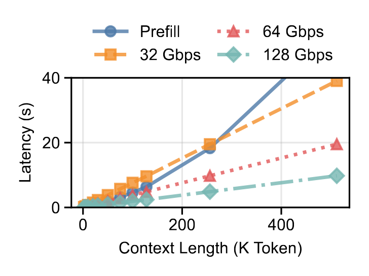

**図 15。** ネットワーク帯域幅が 32 Gbps のとき、LMCache の KV キャッシュオフロードが基本 vLLM のプリフィルを上回るのは、入力長が 256K トークンを超える場合だけである。帯域幅が 64 または 128 Gbps のときは、すべての入力長で LMCache の KV キャッシュオフロードがプリフィルを上回る。

**コンテキスト長の影響：** [図 15](#figure-15) は B200 マシンでのプリフィル遅延と、異なるネットワーク帯域幅でのロード遅延を示す。帯域幅が低いとき（すなわち 32 Gbps）、LMCache の KV キャッシュロードが単純なプリフィルを上回るのは、入力コンテキスト長が 256K トークンを超える場合だけである。一方、帯域幅が高いとき（すなわち 64 または 128 Gbps）、すべてのコンテキスト長で LMCache のロード遅延は単純なプリフィルより一貫して小さい。これらの結果は、LMCache の KV キャッシュロードを適応的に実行すべきことを示す。帯域幅が低いときは、ロードがプリフィルより速くなる交差点をコンテキスト長が超えたときだけ、ロードを有効にする必要がある。

### 8.8 SGLang の結果

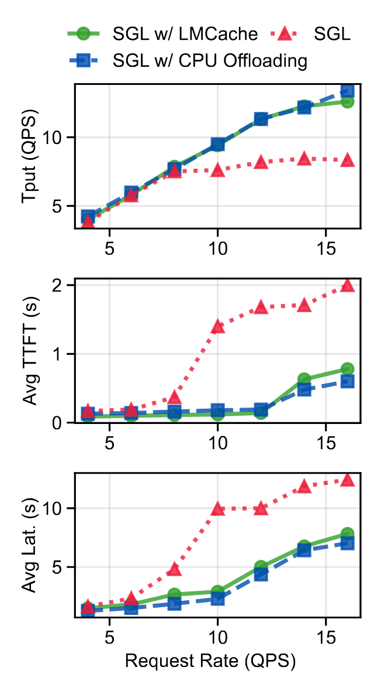

**図 16。** `Qwen3-32B` モデルで、LMCache の CPU オフロードは SGLang ネイティブ CPU オフロードと同等の性能を実現する。

主要な評価では vLLM を用いたが、SGLang と統合した LMCache も評価する。[図 16](#figure-16) は、2 枚の H100 GPU（TP=2）で Qwen3-32B をサービングし、LMCache の CPU オフロードを有効にした結果を示す。CPU オフロードを使わない SGLang と比べ、LMCache はスループットが高く、平均 TTFT と平均エンドツーエンド遅延が低い。SGLang ネイティブ CPU オフロードと比べると、LMCache は同等の性能を実現する。これらの結果は、別の推論エンジンでも LMCache が有効であることを示す。SGLang ネイティブ CPU オフロードは SGLang 上で LMCache CPU オフロードと同等の性能を実現するが、ローカルディスクやリモート CPU／ディスクリソースなど、階層化されたストレージデバイス間で効率よくデータをオフロードできる分散ストレージバックエンドを持たない。

## 9 実環境での教訓と経験

**リモートストレージからのロードはプリフィルより速い：** 従来、リモートストレージからの KV キャッシュロードは、安価なストレージデバイスを活用してキャッシュヒット率を高め、ストレージコストを下げることが主な利点だが、リモートデバイスからのデータロードはフルプリフィルより遅いと考えられていたため、推論遅延は増えると思われていた。この前提は、Amazon S3 などのリモートオブジェクトストレージのスループットが歴史的に低く、ロード速度が 100 MBps 程度だったことによる。しかし近年、リモートストレージの性能は大きく向上した。例えば Amazon S3 Express では、スループットが 100 MBps からほぼ 1 GBps へ増えている。Company C などのユーザは、独自のリモートオブジェクトストレージから KV キャッシュをロードするために LMCache を採用し、フルプリフィルと比べて TTFT を 22%-32% 削減した。この知見は、リモートバックエンドがキャッシュヒット率の向上と TTFT の削減を同時に実現できることを示す。

**コンテキスト切り詰めはプリフィックスキャッシュのヒット率を下げる：** 多くの業界ユーザは、モデルのコンテキストウィンドウや GPU メモリの制約を受ける長い入力を扱うため、スライディングウィンドウ機構を使っている。例えば、入力トークンがコンテキストウィンドウの上限を超えると、一部の企業は入力を切り詰め、最近のトークンだけを残す。しかし、切り詰め後の入力は以前にキャッシュしたコンテキストのプリフィックスと一致しなくなるため、プリフィックスキャッシュヒット率が大幅に低下する。Company F の実トレースでは、最新トークンだけを残すよう入力コンテキストを切り詰めると、プリフィックスキャッシュヒット率が約 85% から 45% へ低下することが分かった。他の研究もこの現象を論じ、コンテキストトークンの動的な追加や削除はプリフィックス KV キャッシュの再利用を無効にするため、避けるべきだと強調している [Lm42]。

**コンテナ化コードが好まれる：** LLM 推論の規模が拡大するにつれ、ほとんどの本番環境は GPU クラスタの管理に Kubernetes を利用するようになった。そのため、通常は Docker イメージであるコンテナ化環境を通じ、vLLM や SGLang などの推論エンジンと LMCache を導入することが業界ユーザの標準的な方法になっている。興味深いことに、多くのユーザは LMCache のソースコードを深く読まず、公式 Docker イメージだけに依存している。

**本番システムで予想外に高いキャッシュヒット率：** 顧客は LMCache をシステム内へ導入するまで、Company G の本番環境での 50% など、これほど高いプリフィックスキャッシュヒット率を予想していなかった。これまでは、KV キャッシュを再利用できるのは固定システムプロンプトだけだと考えられていた。しかし、現代のアプリケーションでは、コーディングアシスタント、チャットアプリケーション、検索拡張生成（RAG）パイプラインの会話履歴など、「動的に再利用可能なコンテキスト」が増えている。これらの新しいパターンにより、実環境でのキャッシュヒット率全体が大幅に高まった。

**業界ユーザと学術ユーザ：** LMCache は 2024 年 5 月、研究成果を取り入れて影響を広げられる統一プロトタイプフレームワークとして設計された。しかし当時、KV キャッシュのサイズと同時ユーザ数が増え続ける中、業界は高効率の KV キャッシュオフロードソリューションを求めていることが分かった。その後、焦点を性能、安定性、互換性の改善へ移した。ほとんどの企業はアテンションアルゴリズムのカスタマイズにあまり関心がないため、選択的なトークン破棄などの特殊なアテンション機構を統合する柔軟な API の設計優先度を下げた。そのため、研究プロトタイプでアテンション機構を変更することの多い学術ユーザには LMCache があまり人気ではない。次のステップとして、LMCache は業界と学界の両方が使いやすい、より柔軟な API を設計する予定である。

**プログラミング言語の柔軟性と性能：** Python は常に ML の事実上の標準言語であった。しかし、現在の業界の関心は、幅広い互換性よりも高い効率へ段階的に移っている。具体的には、多くの企業が ML ライブラリを Rust や C++ などの高性能言語で書き直すか、柔軟性を保ちながら実行時オーバーヘッドを隠蔽するよう Python ベースのシステムを慎重に最適化している。代替手段の一部は ML ライブラリを Rust で書いているが、本プロジェクトは慎重に設計した最適化を加えつつ Python を使い続けている。この方法により、コミュニティの貢献をより多く受けて高速に進化しながら、代替手段と同等の性能を維持できる。

**LMCache は現在コミュニティの取り組みである：** LMCache が研究プロトタイプから業界で広く採用されるフレームワークへ急速に進化した主要な理由の一つは、コミュニティ貢献者の積極的な参加である。約 1 年前、LMCache がサポートしていたのは、NVIDIA GPU 上の vLLM と統合されたローカル CPU、ローカルディスク、Redis バックエンドだけだった。現在は、NVIDIA、AMD、Ascend、TPU の 4 プロセッサ種別にわたり、NFS、WEKA、GPU-Direct Storage、Mooncake Store、NIXL、S3、InfiniStore、Valkey の 8 種類の追加ストレージバックエンドと、vLLM と SGLang の 2 推論エンジンをサポートする。これらの貢献はすべて業界パートナーが行った。そのパートナーは進行中の開発と整合し、最新の LMCache 更新から分岐しないよう、コードを積極的にアップストリームへ取り込んだ。

## 10 結論と展望

本稿では、企業規模の LLM 推論向けで初のオープンソース、かつ最も広く採用されている本番対応 KV キャッシュレイヤーである LMCache を提示した。KV キャッシュを推論の内部副産物ではなく一級データ構造として扱うことで、LMCache は LLM エンジンを孤立したトークンプロセッサから、計算とストレージの分散エコシステムへ変える。多様なワークロードとモデルでの評価は、オープンソースのベースラインと商用推論 API の両方に比べ、LMCache がスループットを一貫して大幅に向上させ、レイテンシを削減することを示した。

性能以外でも、LMCache は本番環境に急速に採用されており、企業は CPU オフロード、階層ストレージ、PD 分離機能を活用し、兆トークン規模の導入で低レイテンシを保ちつつコストを削減している。実環境への導入は、推薦システムにおける KV キャッシュの再利用、オープンエンドチャットボットにおける非可逆圧縮など、新しい機会も明らかにし、多様な応用領域における LMCache の汎用性を示している。

今後、LMCache はより大きな変化を示唆する。**KV キャッシュなどの AI ネイティブデータは、LLM 推論とエージェント型ワークロードをスケールさせる基盤として、ますます機能する**。KV キャッシュを標準化されたストレージおよび通信メディアとして確立することで、LMCache は推論を孤立セッションとしてではなく、永続的でキャッシュを考慮する計算基盤として扱う将来のシステムの土台を作る。本稿で示した設計、最適化、導入上の教訓が、KV キャッシュなどの AI ネイティブデータを単なる最適化ではなく、効率的で信頼性が高く、スケーラブルな推論の中核プリミティブとする、次世代 LLM インフラストラクチャの参考となることを期待する。

LMCache のソースコードは [https://github.com/LMCache/LMCache](https://github.com/LMCache/LMCache) で公開されている。

## 11 謝辞

LMCache コミュニティの貴重なサポートと貢献に感謝する。リモート connector を管理した Baolong Mao と Chunxiao Zheng、GitHub インフラストラクチャを担当した Martin Hickey、ドキュメントを執筆・維持した Huaizheng Zhang、Siddhant Ray、Zhuohan Gu、Hanchen Li、有用なフィードバックを提供した Qizheng Zhang と Hussain Mohammad を含む。また、実験実行用の GPU クラスタを提供した GMI Cloud にも感謝する。
