> [Albert Gu](https://dblp.org/pid/130/0612.html) [+author-order]、[Tri Dao](https://tridao.me/)。arXiv 初回投稿日は 2023 年 12 月 1 日、現行版は 2024 年 5 月 31 日の v2。COLM 2024 で発表され、Outstanding Paper に選出。[Mamba: Linear-Time Sequence Modeling with Selective State Spaces](https://arxiv.org/abs/2312.00752)。<a href="/paper/mamba.pdf" target="_blank" rel="noopener noreferrer">原論文 PDF</a>。[COLM 2024 / OpenReview](https://openreview.net/forum?id=tEYskw1VY2)。[DOI](https://doi.org/10.48550/arXiv.2312.00752)。[TeX ソース](https://export.arxiv.org/e-print/2312.00752v2)。正確な誌面レイアウトと参考文献については、原論文 PDF を正とする。

## 概要

現在、深層学習の刺激的な応用の大半を支える基盤モデルは、ほぼ例外なく Transformer アーキテクチャとその中核である attention モジュールに基づいている。長い系列に対する Transformer の計算効率の低さに対処するため、linear attention、gated convolution と recurrent model、structured state space model（SSM）など、多くの準二次時間アーキテクチャが開発されてきたが、言語のような重要なモダリティでは attention ほど良い性能を示していない。こうしたモデルの主要な弱点が content-based reasoning を実行できないことにあると見いだし、いくつかの改善を施す。第一に、SSM のパラメータを単に入力の関数とすることで離散モダリティに対する弱点を解消し、現在のトークンに応じて系列長方向に情報を*選択的に*伝播または忘却できるようにする。第二に、この変更によって効率的な convolution は使えなくなるものの、recurrent mode で動作する hardware-aware な並列アルゴリズムを設計する。これらの selective SSM を、attention はもちろん MLP block さえ持たない簡潔な end-to-end neural network アーキテクチャ（**Mamba**）へ統合する。Mamba は高速な推論（throughput は Transformer より 5$\times$ 高い）と系列長に対する線形スケーリングを実現し、実データでの性能は系列長 100 万まで向上する。汎用 sequence model backbone として、Mamba は言語、音声、ゲノミクスなど複数のモダリティで state-of-the-art の性能を達成する。言語モデリングでは、Mamba-3B は同規模の Transformer を上回り、事前学習と downstream evaluation の双方で 2 倍の規模の Transformer に並ぶ。

## 1 はじめに

基盤モデル（FM）、すなわち膨大なデータで事前学習した後に downstream task へ適応させる大規模モデルは、現代の機械学習における有効なパラダイムとして台頭してきた。これらの FM の backbone はしばしば *sequence model* であり、言語、画像、発話、音声、時系列、ゲノミクスなど、きわめて多様な領域からなる任意の入力系列を扱う [Sut14, Dos20, Oor16, Bro20, Ism19, Pol23a]。この概念自体は特定のモデルアーキテクチャに依存しないが、現代の FM は主として単一種類の sequence model、すなわち Transformer [Vas17] とその中核である attention layer [Bah15] に基づく。self-attention の有効性は、context window 内で情報を密に経路制御でき、複雑なデータをモデリングできることに由来する。しかし、この性質には根本的な欠点が伴う。有限の window の外側を一切モデリングできず、window 長に対して計算量が二次的に増大する。これらの欠点を克服すべく、attention のより効率的な変種について膨大な研究が行われてきた [Tay22a] が、それを有効にする性質そのものを犠牲にすることが多い。これまでのところ、こうした変種のいずれも、複数領域にわたって大規模時の実証的な有効性を示していない。

近年、structured state space sequence model（SSM）[Gu21a, Gu22a] が sequence modeling の有望なアーキテクチャ群として登場した。これらのモデルは、古典的な state space model [Kal60] に着想を得た recurrent neural network（RNN）と convolutional neural network（CNN）の組合せとして解釈できる。このモデル群は recurrence と convolution のいずれとしても非常に効率良く計算でき、系列長に対して線形または準線形にスケールする。さらに、特定のデータモダリティにおける長距離依存関係 [Gu20a] をモデリングする原理的な仕組みを持ち、Long Range Arena [Tay21] などの benchmark を席巻してきた。SSM の多くの変種 [Gu22a, Gup22, Gu22b, Li23y, Ma23b, Smi23, Orv23] は、音声や画像など連続信号データを伴う領域 [Goe22a, Sao23, Ngu22] で成功している。しかし、テキストのような離散的で情報密度の高いデータのモデリングには、あまり有効でなかった。

本研究では、系列長に対する線形スケーリングを保ちながら Transformer のモデリング能力を実現するため、先行研究を複数の観点で改善した新たな **selective state space model** 群を提案する。

**Selection Mechanism。** 第一に、先行モデルの主要な制約、すなわち入力に依存する形でデータを効率的に*選択*する（つまり特定の入力へ注目する、または無視する）能力を特定する。selective copy や induction head といった重要な synthetic task から得た直観に基づき、SSM のパラメータを入力に基づいてパラメータ化する単純な selection mechanism を設計する。これにより、モデルは無関係な情報を除外し、関連する情報を無期限に記憶できる。

**Hardware-aware Algorithm。** この単純な変更はモデル計算に技術的な課題をもたらす。実際、従来のすべての SSM model は、計算効率を得るために時間および入力に対して不変でなければならない。これに対し、convolution の代わりに scan を用いてモデルを recurrent に計算しつつ、GPU memory hierarchy の異なる階層間での IO access を避けるため展開後の state を実体化しない、hardware-aware algorithm によって克服する。その実装は、理論上（convolution-based SSM がすべて擬線形であるのに対し、系列長に対して線形にスケールする）も、現代の hardware 上（A100 GPU で最大 3$\times$ 高速）も、従来手法より高速である。

**アーキテクチャ。** 従来の SSM アーキテクチャ [Dao23d] の設計と Transformer の MLP block を単一 block に統合することで、従来の深層 sequence model アーキテクチャを簡素化し、selective state space を組み込んだ単純で均質なアーキテクチャ設計（**Mamba**）を導く。

Selective SSM、ひいては Mamba アーキテクチャは完全な recurrent model であり、系列を扱う汎用基盤モデルの backbone に適した主要な性質を備える。

1. 高品質：selectivity により、言語やゲノミクスのような高密度モダリティで高い性能を得られる。
1. 高速な学習と推論：学習中の計算量とメモリ量は系列長に対して線形に増加し、過去要素の cache を必要としないため、推論時にモデルを自己回帰的に展開しても 1 step あたり定数時間しか必要としない。
1. 長い context：品質と効率を併せ持つことで、実データ上では系列長 1M まで性能が向上する。

複数種類のモダリティと設定において、事前学習の品質と領域固有 task の性能の双方から、汎用 sequence FM backbone としての Mamba の可能性を実証的に検証する。

- **Synthetic task。** 大規模言語モデルにとって重要だと提案されてきた copying や induction head などの synthetic task において、Mamba はそれらを容易に解くだけでなく、*解を無期限の長さまで外挿*できる（$>$1M token）。

- **音声とゲノミクス。** Mamba は、音声波形と DNA 配列のモデリングにおいて SaShiMi、Hyena、Transformer など従来の state-of-the-art model を、事前学習品質と downstream metric の双方で上回る（例えば、難しい音声生成 dataset で FID を半分以下にする）。どちらの設定でも、*context を長くするにつれて系列長 100 万まで性能が向上する*。

- **言語モデリング。** Mamba は、事前学習 perplexity と downstream evaluation の双方で、*真に Transformer 品質の性能を実現した初の線形時間 sequence model* である。最大 1B parameter までの scaling law により、Mamba が LLaMa [Tou23] に基づく非常に強力な現代的 Transformer 学習 recipe を含む広範な baseline を上回ることを示す。Mamba 言語モデルは同規模の Transformer に対して 5$\times$ の生成 throughput を持ち、Mamba-3B の品質は 2 倍の規模の Transformer と同等である（例えば、常識推論の平均値で Pythia-3B より 4 point 高く、Pythia-7B さえ上回る）。

モデルコードと事前学習済み checkpoint は <https://github.com/state-spaces/mamba> で open-source として公開している。

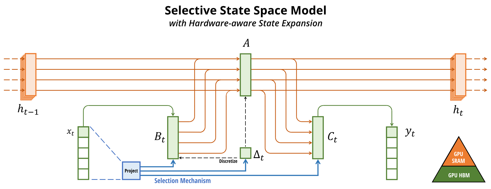

**図 1。** （**概要。**）Structured SSM は、入力 $x$ の各 channel（例えば $D=5$）を、高次元の潜在 state $h$（例えば $N=4$）を介して出力 $y$ へ独立に写像する。従来の SSM は、時間不変性を要する巧妙な別の計算経路を用いることで、この大きな実効 state（$D N$ に batch size $B$ と系列長 $L$ を掛けたもの）の実体化を避ける。$(\Delta, \bm{A}, \bm{B}, \bm{C})$ パラメータは時刻を通じて一定である。本研究の selection mechanism は入力依存の dynamics を再び導入するため、展開後の state を GPU memory hierarchy のより効率的な階層でのみ実体化する慎重な hardware-aware algorithm も必要になる。

## 2 State Space Model

Structured state space sequence model（S4）は、RNN、CNN、および古典的 state space model と広く関係する、近年の深層学習向け sequence model 群である。これらは、暗黙の潜在 state $h(t) \in \mathbb{R}^N$ を介して 1 次元関数または系列 $x(t) \in \mathbb{R}\mapsto y(t) \in \mathbb{R}$ を写像する、特定の continuous system [式 1](#equation-01) に着想を得ている。

具体的には、S4 model は 4 つのパラメータ $(\Delta, \bm{A}, \bm{B}, \bm{C})$ で定義され、2 段階で sequence-to-sequence 変換を定める。

$$
\begin{aligned}
      h'(t) &= \bm{A}h(t) + \bm{B}x(t) \\
      y(t) &= \bm{C}h(t)
    \end{aligned}
$$

$$
\begin{aligned}
      h_{t} &= \overline{\bm{A}}h_{t-1} + \overline{\bm{B}}x_t \\
      y_t &= \bm{C}h_t
    \end{aligned}
$$

$$
\begin{aligned}
      \bm{\overline{K}} &= (\bm{C}\bm{\overline{B}}, \bm{C}\bm{\overline{A}}\bm{\overline{B}}, \dots, \bm{C}\bm{\overline{A}}^{k}\bm{\overline{B}}, \dots) \\
      y &= x \ast \bm{\overline{K}}
    \end{aligned}
$$

**離散化。** 第一段階では、固定された式 $\overline{\bm{A}}= f_A(\Delta, \bm{A})$ および $\overline{\bm{B}}= f_B(\Delta, \bm{A}, \bm{B})$ により、「連続パラメータ」$(\Delta, \bm{A}, \bm{B})$ を「離散パラメータ」$(\overline{\bm{A}}, \overline{\bm{B}})$ へ変換する。このとき、組 $(f_A, f_B)$ を*離散化則*と呼ぶ。

[式 4](#equation-04) で定義される zero-order hold（ZOH）など、さまざまな規則を利用できる。

$$
\overline{\bm{A}}= \exp(\Delta\bm{A})
    \qquad
    \overline{\bm{B}}= (\Delta\bm{A})^{-1} (\exp(\Delta\bm{A}) - \bm{I}) \cdot \Delta\bm{B}
$$

離散化は continuous-time system と深く関係しており、resolution invariance [Ngu22] や、モデルが適切に正規化されることの自動的な保証 [Gu23a, Orv23] など、追加の性質を付与しうる。また、RNN の gating mechanism [Tal18a, Gu20b] とも関係し、これは [第 3.5 節](#section-3-5) で再び取り上げる。しかし、機械的な観点からは、離散化は単に SSM の forward pass における計算グラフの最初の step とみなせる。

SSM の別の変種では、離散化 step を迂回し、$(\overline{\bm{A}}, \overline{\bm{B}})$ を代わりに直接パラメータ化でき [Zha23q]、その方が推論しやすい場合もある。

**計算。** パラメータを $(\Delta, \bm{A}, \bm{B}, \bm{C}) \mapsto (\overline{\bm{A}}, \overline{\bm{B}}, \bm{C})$ へ変換した後、モデルは **linear recurrence** [式 2](#equation-02) または **global convolution** [式 3](#equation-03) の 2 通りで計算できる。

一般に、モデルは効率的に並列化可能な学習（入力系列全体を事前に参照できる場合）には convolution mode [式 3](#equation-03) を用い、効率的な自己回帰推論（入力が 1 timestep ずつ与えられる場合）には recurrent mode [式 2](#equation-02) へ切り替える。

**Linear Time Invariance（LTI）。** [式 1](#equation-01) から [式 3](#equation-03) の重要な性質は、モデルの dynamics が時刻を通じて一定であることだ。言い換えると、$(\Delta, \bm{A}, \bm{B}, \bm{C})$、したがって $(\overline{\bm{A}}, \overline{\bm{B}})$ も、すべての timestep で固定されている。この性質を *linear time invariance（LTI）* と呼び、recurrence および convolution と深く関係する。大まかには、LTI SSM を任意の linear recurrence [式 2a](#equation-02-a) または convolution [式 3b](#equation-03-b) と等価なものと捉え、LTI をこれらのモデル群の総称として用いる。

これまでの structured SSM はすべて、[第 3.3 節](#section-3-3) で論じる根本的な効率制約のため LTI（例えば convolution として計算）であった。しかし、本研究の中核的な洞察は、特定種類のデータをモデリングする上で LTI model に根本的な制約があるという点であり、技術的貢献は効率上の bottleneck を克服しながら LTI 制約を取り除くことにある。

**構造と次元。** 最後に、structured SSM がその名で呼ばれるのは、効率的な計算のために $\bm{A}$ 行列へ構造を課す必要もあるからだと記しておく。最も一般的な構造は対角 [Gup22, Gu22b, Smi23] であり、本研究でもこれを用いる。

この場合、$\bm{A}\in \mathbb{R}^{N \times N}, \bm{B}\in \mathbb{R}^{N \times 1}, \bm{C}\in \mathbb{R}^{1 \times N}$ の各行列は、いずれも $N$ 個の数で表現できる。batch size $B$、長さ $L$、channel 数 $D$ の入力系列 $x$ を扱うため、SSM を各 channel に独立に適用する。この場合、入力あたりの総 hidden state は次元 $D N$ を持ち、系列長全体の計算には $O(B L D N)$ の時間とメモリを要することに注意されたい。これが [第 3.3 節](#section-3-3) で扱う根本的な効率上の bottleneck の原因である。

**一般的な State Space Model。** *state space model* という用語は非常に広い意味を持ち、潜在 state を伴う任意の recurrent process という概念を表すにすぎないことに注意する。この語は、Markov decision process（MDP）（強化学習 [Haf20]）、dynamic causal modeling（DCM）（計算論的神経科学 [Fri03]）、Kalman filter（制御 [Kal60]）、hidden Markov model（HMM）と linear dynamical system（LDS）（機械学習）、さらには広義の recurrent（時に convolutional）model（深層学習）など、異なる分野の多種多様な概念を指すために使われてきた。

本論文全体を通じて、「SSM」という用語は structured SSM または S4 model [Gu22a, Gup22, Gu22b, Ma23b, Smi23, Has23] のクラスだけを指すものとして用い、これらの用語を相互に置き換えて使用する。便宜上、linear-recurrence または global-convolution のいずれかの観点に焦点を当てたモデル [Orv23, Li23y, Pol23a] のような派生形を含める場合もあり、必要に応じて細かな違いを明確にする。

**SSM Architecture。** SSM は、それ自体で完結する sequence 変換であり、end-to-end neural network architecture に組み込める。

（SSM architecture を SSNN と呼ぶこともある。SSNN と SSM layer の関係は、CNN と linear convolution layer の関係に相当する。）

最もよく知られた SSM architecture の一部を論じる。その多くは本研究の主要 baseline としても用いる。

- Linear attention [Kat20] は self-attention の近似であり、縮退した linear SSM とみなせる recurrence を伴う。

- H3 [Dao23d] は、この recurrence を S4 を使うよう一般化した。これは 2 つの gated connection で SSM を挟んだ architecture とみなせる（[図 3](#figure-03)）。H3 はさらに、main SSM layer の前に標準的な local convolution を挿入し、それを shift-SSM と位置付けている。

- Hyena [Pol23a] は H3 と同じ architecture を用いるが、S4 layer を MLP-parameterized global convolution [Rom21] に置き換える。

- RetNet [Sun23a] は architecture に gate をもう 1 つ追加し、より単純な SSM を用いることで、convolution の代わりに multi-head attention（MHA）の変種を用いた、並列化可能な別の計算経路を実現する。

- RWKV [Pen23g] は、別の linear attention 近似である attention-free Transformer [Zha21e] に基づき、言語モデリング向けに設計された近年の RNN である。その主要な「WKV」mechanism は LTI recurrence を伴い、2 つの SSM の比とみなせる。

密接に関連するその他の SSM と architecture は、拡張した関連研究（[第 8 節](#section-8)）でさらに論じる。特に S5 [Smi23]、QRNN [Bra16]、SRU [Lei17] を取り上げる。これらを、本研究の中核である selective SSM に最も密接に関連する手法とみなしている。

## 3 Selective State Space Model

まず synthetic task から得た直観によって selection mechanism の動機を示し（[第 3.1 節](#section-3-1)）、次にこの mechanism を state space model へ組み込む方法を説明する（[第 3.2 節](#section-3-2)）。得られる time-varying SSM は convolution を使えず、効率的な計算法という技術的課題を生む。現代の hardware の memory hierarchy を活用する hardware-aware algorithm によってこれを克服する（[第 3.3 節](#section-3-3)）。続いて、attention も MLP block も持たない単純な SSM architecture を説明する（[第 3.4 節](#section-3-4)）。最後に、selection mechanism の追加的な性質を論じる（[第 3.5 節](#section-3-5)）。

### 3.1 動機：圧縮手段としての選択

sequence modeling の根本的な問題は、*context をより小さな state へ圧縮すること*だと主張する。実際、この観点から代表的な sequence model の tradeoff を捉えられる。例えば attention は context を明示的にまったく圧縮しないため、有効であると同時に非効率である。これは、自己回帰推論で context 全体（すなわち KV cache）を明示的に保存する必要があり、それが Transformer の低速な線形時間推論と二次時間学習を直接引き起こすことから分かる。一方、recurrent model は有限の state を持つため効率的であり、定数時間推論と線形時間学習を実現する。しかし、その有効性はこの state が context をどれほど良く圧縮できたかに制約される。

この原理を理解するため、2 つの synthetic task を一貫した例として用いる（[図 2](#figure-02)）。

- **Selective Copying** task は、記憶すべき token の位置を変化させることで、一般的な Copying task [Arj16] を修正する。関連する token（*色付き*）を記憶し、無関係な token（*白*）を除外するには、*content-aware* な推論が必要となる。

- **Induction Heads** task は、LLM の in-context learning 能力の大部分を説明すると仮定されている、よく知られた mechanism である [Ols22]。適切な context（*黒*）で正しい出力をいつ生成すべきか知るには、*context-aware* な推論が必要となる。

これらの task は LTI model の failure mode を明らかにする。recurrent の観点では、その一定の dynamics（例えば [式 2](#equation-02) の $(\overline{\bm{A}}, \overline{\bm{B}})$ 遷移）では、context から正しい情報を選択することも、系列に沿って渡される hidden state へ入力依存の形で作用することもできない。convolution の観点では、通常の Copying task は time-awareness のみを必要とするため global convolution で解ける [Rom21] 一方、Selective Copying task は content-awareness がないため難しい（[図 2](#figure-02)）ことが知られている。より具体的には、入力から出力までの間隔が変化するため、静的な convolution kernel ではモデリングできない。

まとめると、sequence model の効率性と有効性の tradeoff は、state をどれほど良く圧縮できるかによって特徴付けられる。効率的なモデルは小さな state を持たなければならず、有効なモデルの state は context から必要な情報をすべて含まなければならない。そこで、sequence model を構築する根本原理として **selectivity**、すなわち入力へ注目する、または入力を sequential state から除外する context-aware な能力を提案する。特に、selection mechanism は系列次元に沿って情報がどのように伝播または相互作用するかを制御する（詳しくは [第 3.5 節](#section-3-5) を参照）。

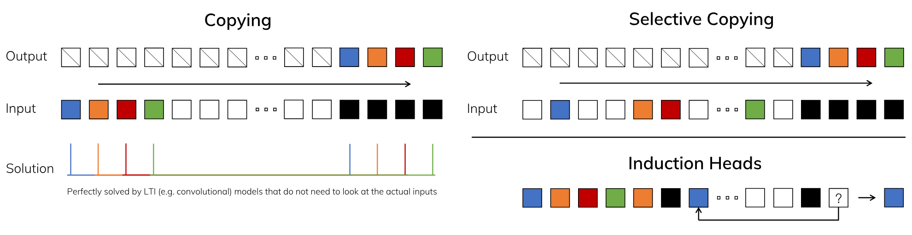

**図 2。** （*左*）Copying task の標準版では入力要素と出力要素の間隔が一定であり、linear recurrence や global convolution などの time-invariant model で容易に解ける。（*右上*）Selective Copying task では入力間の間隔がランダムであり、内容に応じて入力を*選択的に*記憶または無視できる time-varying model が必要となる。（*右下*）Induction Heads task は、context に基づいて答えを検索する必要がある associative recall の一例であり、LLM にとって主要な能力である。

### 3.2 選択による SSM の改善

selection mechanism をモデルへ組み込む一つの方法は、系列に沿った相互作用へ影響するパラメータ（例えば RNN の recurrent dynamics や CNN の convolution kernel）を入力依存にすることである。

[アルゴリズム 1](#algorithm-01) と [アルゴリズム 2](#algorithm-02) は、本研究で用いる主な selection mechanism を示す。主な違いは、いくつかのパラメータ $\Delta, \bm{B}, \bm{C}$ を単に入力の関数とし、それに伴って tensor shape 全体を変更する点である。特に、これらのパラメータが length dimension $L$ を持つようになり、モデルが time-invariant から time-varying へ変わったことを強調したい。（shape annotation は [第 2 節](#section-2) で説明した。）これにより convolution [式 3](#equation-03) との等価性が失われ、効率にも影響する。次にこれを論じる。

具体的には、$s_B(x) = \mathrm{Linear}_N(x)$、$s_C(x) = \mathrm{Linear}_N(x)$、$s_\Delta(x) = \mathrm{Broadcast}_D(\mathrm{Linear}_1(x))$、$\tau_\Delta= \mathrm{softplus}$ を選ぶ。ここで $\mathrm{Linear}_d$ は次元 $d$ へのパラメータ化された射影である。$s_\Delta$ と $\tau_\Delta$ の選択は、[第 3.5 節](#section-3-5) で説明する RNN の gating mechanism との関係に基づく。

**アルゴリズム 1。SSM（S4）**

- **入力：** $x : (B, L, D)$
- **出力：** $y : (B, L, D)$
- $\bm{A} : (D, N) \leftarrow \mathrm{Parameter}$
  - 構造化された $N \times N$ 行列を表す
- $\bm{B} : (D, N) \leftarrow \mathrm{Parameter}$
- $\bm{C} : (D, N) \leftarrow \mathrm{Parameter}$
- $\Delta : (D) \leftarrow \tau_\Delta(\mathrm{Parameter})$
- $\overline{\bm{A}}, \overline{\bm{B}} : (D, N) \leftarrow \mathrm{discretize}(\Delta, \bm{A}, \bm{B})$
- $y \leftarrow \mathrm{SSM}(\overline{\bm{A}}, \overline{\bm{B}}, \bm{C})(x)$
  - Time-invariant：recurrence または convolution
- **返す：** $y$

**アルゴリズム 2。SSM + Selection（S6）**

- **入力：** $x : (B, L, D)$
- **出力：** $y : (B, L, D)$
- $\bm{A} : (D, N) \leftarrow \mathrm{Parameter}$
  - 構造化された $N \times N$ 行列を表す
- $\bm{B} : (B, L, N) \leftarrow s_B(x)$
- $\bm{C} : (B, L, N) \leftarrow s_C(x)$
- $\Delta : (B, L, D) \leftarrow \tau_\Delta(\mathrm{Parameter} + s_\Delta(x))$
- $\overline{\bm{A}}, \overline{\bm{B}} : (B, L, D, N) \leftarrow \mathrm{discretize}(\Delta, \bm{A}, \bm{B})$
- $y \leftarrow \mathrm{SSM}(\overline{\bm{A}}, \overline{\bm{B}}, \bm{C})(x)$
  - Time-varying：recurrence（scan）のみ
- **返す：** $y$

### 3.3 Selective SSM の効率的な実装

convolution [Kri12] や attention [Bah15, Vas17] のような hardware-friendly primitive は広く使われている。本研究では selective SSM も現代の hardware（GPU）上で効率化することを目指す。selection mechanism は非常に自然であり、以前の研究でも recurrent SSM で $\Delta$ を時刻に応じて変化させる [Gu20a] など、selection の特殊例を組み込む試みがなされた。しかし、

前述のとおり、SSM を利用する上での中核的な制約は計算効率であり、

これが S4 とそのすべての派生が LTI（non-selective）model を、最も一般的には global convolution の形で用いた理由である。

#### 3.3.1 先行モデルの動機

まずこの動機を改めて確認し、先行手法の制約を克服する本研究の方法を概観する。

- 高いレベルでは、SSM のような recurrent model は常に表現力と速度の tradeoff を取る。[第 3.1 節](#section-3-1) で論じたように、hidden state dimension が大きいモデルほど有効だが低速になるはずである。したがって、*速度とメモリの cost を負わずに hidden state dimension を最大化*したい。

- recurrent mode は convolution mode より柔軟であることに注意されたい。後者 [式 3](#equation-03) は前者 [式 2](#equation-02) を展開して導かれるからである [Gu21a, Gu22a]。しかし、これには shape $\mathtt{(B,L,D,N)}$ の潜在 state $h$ を計算して実体化する必要があり、shape $\mathtt{(B,L,D)}$ の入力 $x$ および出力 $y$ より（SSM state dimension $N$ 倍）大幅に大きい。そこで state の計算を迂回し、サイズが $\mathtt{(B,L,D)}$ にすぎない convolution kernel [式 3a](#equation-03-a) を実体化できる、より効率的な convolution mode が導入された。

- 従来の LTI state space model は recurrent-convolutional の二重形式を活用し、効率を損なうことなく、実効 state dimension を従来の RNN よりはるかに大きい $N$ 倍（$\approx 10-100$）へ増やす。

#### 3.3.2 Selective Scan の概要：Hardware-Aware な State Expansion

selection mechanism は LTI model の制約を克服するよう設計されている。そのため同時に、SSM の計算問題を再検討する必要がある。kernel fusion、parallel scan、recomputation という 3 つの古典的手法でこれに対処する。主な観察は 2 点である。

- 素朴な recurrent 計算は $O(B L D N)$ FLOP、convolutional 計算は $O(B L D \log(L))$ FLOP を要し、前者は定数因子が小さい。したがって長い系列かつ state dimension $N$ が過度に大きくない場合、実際には recurrent mode の方が FLOP が少なくなりうる。

- 2 つの課題は、recurrence が逐次的であることと、大量のメモリを使うことである。後者に対しては、convolutional mode と同様に、完全な state $h$ を実際には実体化しないよう試みられる。

主な発想は、現代の accelerator（GPU）の性質を活用し、memory hierarchy のより効率的な階層でのみ state $h$ を実体化することだ。特に、大半の演算（行列乗算を除く）は memory bandwidth に律速される [Wil09, Iva21, Dao22]。これは本研究の scan operation も含み、kernel fusion を使って memory IO の量を減らすことで、標準実装に対して大幅な高速化を得る。

具体的には、サイズ $\mathtt{(B,L,D,N)}$ の scan input $(\overline{\bm{A}}, \overline{\bm{B}})$ を GPU HBM（high-bandwidth memory）に用意する代わりに、SSM パラメータ $(\Delta, \bm{A}, \bm{B}, \bm{C})$ を低速な HBM から高速な SRAM へ直接読み込み、SRAM 上で離散化と recurrence を実行してから、サイズ $(\mathtt{B,L,D})$ の最終出力を HBM へ書き戻す。

recurrence の逐次性を避けるため、線形ではないにもかかわらず、work-efficient parallel scan algorithm [Ble90, Mar18, Smi23] で並列化できることに着目する。

最後に、backpropagation に必要な中間 state の保存も避けなければならない。古典的な recomputation 手法を慎重に適用してメモリ要件を削減する。中間 state は保存せず、backward pass で入力を HBM から SRAM へ読み込む際に再計算する。その結果、fused selective scan layer のメモリ要件は、FlashAttention を使った最適化済み Transformer 実装と同じになる。

fused kernel と recomputation の詳細は [第 10 節](#section-10) に示す。

Selective SSM layer とアルゴリズムの全体像を [図 1](#figure-01) に示す。

### 3.4 簡素化した SSM Architecture

structured SSM と同様、selective SSM はそれ自体で完結した sequence 変換であり、neural network へ柔軟に組み込める。H3 architecture は最もよく知られた SSM architecture（[第 2 節](#section-2)）の基礎であり、一般に linear attention に着想を得た block と MLP（multi-layer perceptron）block を交互に配置して構成される。この 2 要素を 1 つに統合し、それを均質に積み重ねることで architecture を簡素化する（[図 3](#figure-03)）。これは、attention に対して同様のことを行った gated attention unit（GAU）[Hua22] に着想を得ている。

この architecture では、制御可能な expansion factor $E$ で model dimension $D$ を拡大する。各 block の parameter の大半（$3 E D^2$）は linear projection（input projection に $2 E D^2$、output projection に $E D^2$）にあり、内部の SSM の寄与は小さい。

SSM parameter（$\Delta, \bm{B}, \bm{C}$ の projection と行列 $\bm{A}$）の数は、それに比べてはるかに少ない。

この block を標準的な normalization および residual connection と交互に反復し、Mamba architecture を構成する。実験では常に $E=2$ に固定し、block を 2 stack 用いることで、Transformer で交互に配置される MHA（multi-head attention）と MLP block の $12D^2$ parameter に合わせる。

SiLU / Swish activation function [Hen16a, Ram17] を使う。その動機は、Gated MLP が広く使われる「SwiGLU」variant [Dau17, Sha20, Cho23a, Tou23] となるためである。

最後に、optional な normalization layer（LayerNorm [Ba16] を選択）も使用する。その動機は、RetNet が同様の位置で normalization layer を使っていることにある [Sun23a]。

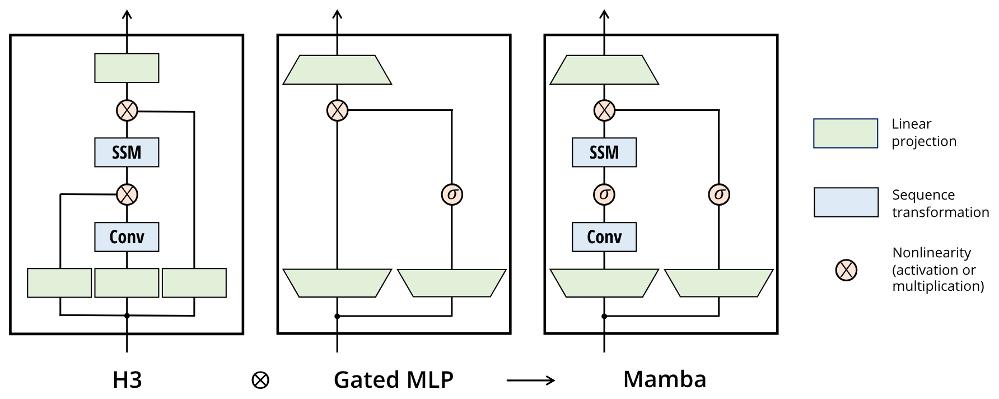

**図 3。** （**アーキテクチャ。**）本研究の簡素化した block 設計は、大半の SSM architecture の基礎となる H3 block と、現代の neural network で広く使われる MLP block を統合する。この 2 種類の block を交互に置く代わりに、Mamba block だけを均質に反復する。H3 block と比べて Mamba は最初の multiplicative gate を activation function に置き換える。MLP block と比べて Mamba は main branch に SSM を追加する。$\sigma$ には SiLU / Swish activation [Hen16a, Ram17] を用いる。

### 3.5 Selection Mechanism の性質

selection mechanism はより広い概念であり、従来型の RNN や CNN、異なるパラメータ（例えば [アルゴリズム 2](#algorithm-02) の $\bm{A}$）、異なる変換 $s(x)$ など、さまざまな形で適用できる。

#### 3.5.1 Gating Mechanism との関係

最も重要な関係を強調する。RNN の古典的な gating mechanism は、SSM に対する本研究の selection mechanism の一例である。RNN gating と continuous-time system の離散化との関係は、すでに確立されている [Fun93, Tal18a]。実際、[定理 1](#theorem-01) は [Gu21a]（Lemma 3.1）を改善し、ZOH discretization と input-dependent gate へ一般化したものである（証明は [第 9 節](#section-9)）。より広く言えば、SSM の $\Delta$ は RNN の gating mechanism を一般化した役割を担うとみなせる。先行研究にならい、*SSM の離散化は heuristic な gating mechanism の原理的基盤である*という見方を採る。

**定理 1。** $N=1, \bm{A}=-1, \bm{B}=1, s_\Delta=\mathrm{Linear}(x)$、かつ $\tau_\Delta=\mathrm{softplus}$ のとき、selective SSM recurrence（[アルゴリズム 2](#algorithm-02)）は次の形を取る。

$$
\begin{aligned}
        g_t &= \sigma(\mathrm{Linear}(x_t)) \\
        h_{t} &= (1-g_t) h_{t-1} + g_t x_t
        .
      \end{aligned}
$$

[第 3.2 節](#section-3-2) で述べたように、$s_\Delta, \tau_\Delta$ の具体的な選択はこの関係に基づく。特に、ある入力 $x_t$ を完全に無視すべき場合（synthetic task で必要となる）、$D$ channel のすべてがそれを無視すべきであるため、入力を $1$ 次元へ射影した後、$\Delta$ とともに repeat / broadcast することに注意されたい。

#### 3.5.2 Selection Mechanism の解釈

selection が持つ 3 つの具体的な機械的効果を詳述する。

**可変間隔。** Selectivity により、注目する入力の間に現れうる無関係な noise token を除外できる。Selective Copying task がその例だが、一般的なデータモダリティ、特に離散データでは普遍的に生じる。例えば言語における「えーと」のような filler がある。この性質は、モデルが特定の入力 $x_t$ を機械的に除外できるため生じる。例えば gated RNN の場合（[定理 1](#theorem-01)）、$g_t \to 0$ のときである。

**Context の除外。** より長い context を与えても多くの sequence model は改善しないことが実証的に観察されている [Shi23d] が、原理上、context が多いほど性能は必ず向上するはずである。一つの説明は、多くの sequence model が必要に応じて無関係な context を有効に無視できないことである。global convolution（および一般の LTI model）が直観的な例となる。一方、selective model はいつでも state を単に reset して余分な履歴を取り除けるため、原理上、その性能は context length とともに単調に向上する（例えば [第 4.3.2 節](#section-4-3-2)）。

**境界での Reset。** 複数の独立した系列を連結する設定では、Transformer は特定の attention mask を用意してそれらを分離したままにできるが、LTI model では系列間に情報が漏れる。Selective SSM も境界で state を reset できる（例えば $\Delta_t \to \infty$、または [定理 1](#theorem-01) で $g_t \to 1$ の場合）。こうした設定は人為的に（例えば hardware utilization を改善するため文書をまとめて pack する場合）も、自然に（例えば強化学習における episode boundary [Lu23a]）も生じうる。

さらに、各 selective parameter の効果を詳述する。

**$\Delta$ の解釈。** 一般に $\Delta$ は、現在の入力 $x_t$ にどれほど注目し、どれほど無視するかの均衡を制御する。これは RNN gate（例えば [定理 1](#theorem-01) の $g_t$）を一般化する。機械的には、大きな $\Delta$ は state $h$ を reset して現在の入力 $x$ に注目し、小さな $\Delta$ は state を保持して現在の入力を無視する。SSM [式 1](#equation-01)-[式 2](#equation-02) は timestep $\Delta$ で離散化された continuous system と解釈できる。この文脈での直観は、大きな $\Delta\to \infty$ は現在の入力により長く注目する system（したがってそれを「選択」して現在の state を忘れる）を表し、小さな $\Delta\to 0$ は無視される過渡的な入力を表す、というものである。

**$\bm{A}$ の解釈。** $\bm{A}$ parameter も selective にできるが、最終的には $\overline{\bm{A}}= \exp(\Delta\bm{A})$（離散化 [式 4](#equation-04)）を介した $\Delta$ との相互作用によってのみモデルへ影響することを指摘しておく。したがって $\Delta$ の selectivity だけで $(\overline{\bm{A}}, \overline{\bm{B}})$ の selectivity を保証するには十分であり、改善の主因となる。$\bm{A}$ も $\Delta$ に加えて（またはその代わりに）selective にすれば同様の性能になると仮定し、簡潔さのため除外する。

**$\bm{B}$ と $\bm{C}$ の解釈。** [第 3.1 節](#section-3-1) で論じたように、selectivity の最も重要な性質は、無関係な情報を除外し、sequence model の context を効率的な state へ圧縮できることである。SSM では、$\bm{B}$ と $\bm{C}$ を selective にすることで、入力 $x_t$ を state $h_t$ へ入れるか、state を出力 $y_t$ へ入れるかを、より細かく制御できる。これは、モデルがそれぞれ content（入力）と context（hidden state）に基づいて recurrent dynamics を調整できるものと解釈できる。

### 3.6 モデルの追加詳細

**実数対複素数。** 従来の SSM の多くは state $h$ に複素数を用いる。これは perceptual modality の多くの task で高い性能を得るために必要である [Gu22a]。しかし、設定によっては完全な実数値 SSM でも問題なく、場合によってはさらに良く機能することが実証的に観察されている [Ma23b]。本研究では実数値を既定とし、1 つを除くすべての task で良好に機能する。complex-real の tradeoff はデータモダリティの continuous-discrete spectrum と関係し、複素数は連続モダリティ（例えば音声、動画）には有用だが、離散モダリティ（例えばテキスト、DNA）には有用でないと仮定する。

**初期化。** 従来の SSM の多くは、特に複素数値の場合に特別な初期化も提案しており、low-data regime など複数の設定で役立つ場合がある。複素数の場合の既定の初期化は S4D-Lin、実数の場合は S4D-Real [Gu22b] とし、後者は HIPPO theory [Gu20a] に基づく。これらは $\bm{A}$ の $n$ 番目の要素を、それぞれ $-1/2 + n i$ および $-(n+1)$ と定義する。しかし、特に large-data かつ real-valued SSM の regime では、多くの初期化が問題なく機能すると予想する。いくつかの ablation を [第 4.6 節](#section-4-6) で検討する。

**$\Delta$ のパラメータ化。** $\Delta$ に対する selective な調整を $s_\Delta(x) = \mathrm{Broadcast}_D(\mathrm{Linear}_1(x))$ と定義したが、その動機は $\Delta$ の mechanics（[第 3.5 節](#section-3-5)）にある。これは次元 $1$ から、より大きな次元 $\mathtt{R}$ へ一般化できることが分かった。これを $\mathtt{D}$ の小さな割合に設定し、block の主要な Linear projection と比べて無視できる数の parameter しか使わない。さらに、broadcasting operation は特定の $1$ と $0$ の pattern に初期化された別の Linear projection ともみなせる。この projection が学習可能なら、代替形 $s_\Delta(x) = \mathrm{Linear}_D(\mathrm{Linear}_R(x))$ が得られ、low-rank projection と解釈できる。

実験では、$\Delta$ parameter（bias term とみなせる）を、SSM の先行研究 [Gu23a] にならって $\tau_\Delta^{-1}(\mathrm{Uniform}([0.001, 0.1]))$ で初期化する。

**備考。** 実験結果では簡潔さのため、selective SSM を *S6 model* と略すことがある。これは、*selection* mechanism を持ち、*scan* で計算する S4 model だからである。

## 4 実証評価

[第 4.1 節](#section-4-1) では、[第 3.1 節](#section-3-1) で動機付けた 2 つの synthetic task を解く Mamba の能力を検証する。続いて 3 つの領域を評価し、それぞれで自己回帰事前学習と downstream task の双方を扱う。

- [第 4.2 節](#section-4-2)：言語モデルの事前学習（scaling law）と zero-shot downstream evaluation。

- [第 4.3 節](#section-4-3)：DNA 配列の事前学習と、長い系列の分類 task に対する fine-tuning。

- [第 4.4 節](#section-4-4)：音声波形の事前学習と、自己回帰的に生成した音声 clip の品質。

最後に、[第 4.5 節](#section-4-5) では学習時と推論時の双方における Mamba の計算効率を示し、[第 4.6 節](#section-4-6) では architecture と selective SSM のさまざまな構成要素を ablation する。

### 4.1 Synthetic Task

task の詳細と学習 protocol を含む実験の全詳細は [第 11.1 節](#section-11-1) に示す。

#### 4.1.1 Selective Copying

Copying task は、もともと recurrent model の記憶能力を検証するために設計された、sequence modeling で最もよく研究されている synthetic task の一つである。[第 3.1 節](#section-3-1) で論じたように、LTI SSM（linear recurrence と global convolution）はデータについて推論せず時刻だけを追跡することで、例えば正確に必要な長さの convolution kernel を構成して、この task を容易に解ける（[図 2](#figure-02)）。これは global convolution に関する以前の研究 [Rom21] で明示的に検証された。Selective Copying task は token 間隔をランダム化して、この近道を使えなくする。この task は以前に Denoising task [Jin19] として導入されていることに注意されたい。

従来研究の多くは、architecture gating（乗法的相互作用）を追加すればモデルに「data-dependence」を付与し、関連 task を解けると主張している [Dao23d, Pol23a]。しかし、このような gating は系列軸に沿って相互作用せず、token 間隔へ影響できないため、直観的にはこの説明は不十分だと考える。特に architecture gating は selection mechanism の一例ではない（[第 7 節](#section-7)）。

[表 1](#table-01) は、H3 や Mamba のような gated architecture が性能を部分的にしか改善しない一方、selection mechanism（S4 を S6 へ変更）はこの task を容易に解き、特にこうした強力な architecture と組み合わせたときに有効であることを確認している。

#### 4.1.2 Induction Head

Induction head [Ols22] は mechanistic interpretability の観点 [Elh21] から得られた単純な task であり、驚くほど LLM の in-context learning 能力を予測する。モデルは associative recall と copy を行う必要がある。例えば、モデルが系列内で「Harry Potter」のような bigram を見ていれば、次に同じ系列で「Harry」が現れたとき、履歴から copy して「Potter」を予測できなければならない。

**Dataset。** 語彙サイズ $16$、系列長 $256$ の induction heads task で 2-layer model を学習する。これはこの task の先行研究 [Dao23d] と同等だが、系列はより長い。さらに、test 時に $2^6 = 64$ から $2^{20} = 1048576$ までのさまざまな系列長で評価し、汎化能力と外挿能力を調べる。

**モデル。** induction head に関する確立された研究にならい、attention が induction heads task を機械的に解ける 2-layer model を用いる [Ols22]。multi-head attention（8 head、さまざまな positional encoding）と SSM variant の双方を検証する。model dimension $D$ は Mamba で $64$、その他のモデルで $128$ とする。

**結果。** [表 2](#table-02) は、Mamba、より正確にはその selective SSM layer が、関連する token を選択的に記憶し、その間のすべてを無視できるため、task を完全に解けることを示す。**学習時に見た系列の $4000\times$、すなわち長さ 100 万の系列へ完全に汎化する**一方、他の手法はいずれも $2\times$ を超えない。

attention model の positional encoding variant では、長さ外挿のために設計された xPos が他よりわずかに良い。また、memory 制約のため、attention model はすべて系列長 $2^{14}=16384$ までしか検証していないことに注意されたい。他の SSM では H3 と Hyena が同程度であり、[Pol23a] の知見とは異なる。

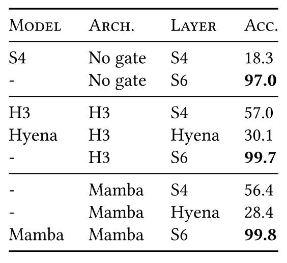

**表 1。** （**Selective Copying。**）
architecture と inner sequence layer の組合せに対する accuracy。

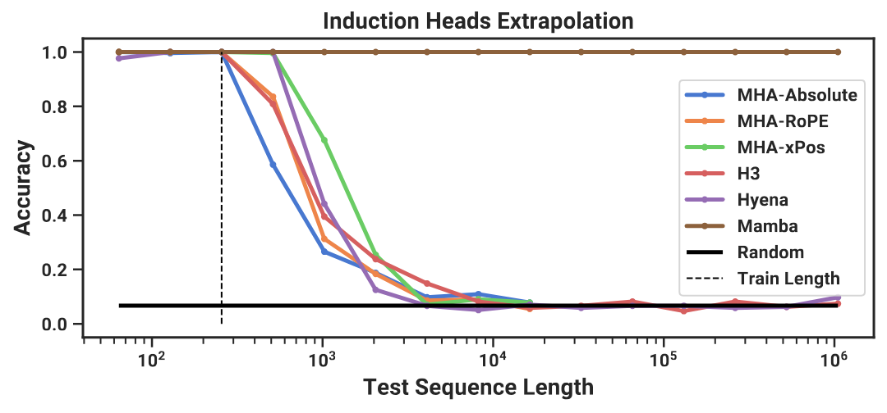

**表 2。** （**Induction Heads。**）モデルは系列長 $2^8=256$ で学習し、$2^6=64$ から $2^{20}=1048576$ まで増加する系列長で検証する。全数値は [表 11](#table-11) に示す。

### 4.2 言語モデリング

標準的な自己回帰言語モデリングにおいて、事前学習指標（perplexity）と zero-shot evaluation の双方で、Mamba architecture を他の architecture と比較評価する。model size（depth と width）は GPT3 の仕様に合わせる。Pile dataset [Gao20] を使い、[Bro20] で説明された学習 recipe に従う。学習の全詳細は [第 11.2 節](#section-11-2) に示す。

#### 4.2.1 Scaling Law

baseline として、標準的な Transformer architecture（GPT3 architecture）に加え、PaLM と LLaMa architecture に基づく、既知の中で最も強力な Transformer recipe（ここでは Transformer++ と呼ぶ）と比較する（例えば rotary embedding、SwiGLU MLP、LayerNorm の代わりの RMSNorm、linear bias なし、高い learning rate）。その他の近年の準二次 architecture とも比較する（[図 4](#figure-04)）。モデルの全詳細は [第 11.2 節](#section-11-2) に示す。

[図 4](#figure-04) は、標準的な Chinchilla [Hof22b] protocol の下で、$\approx 125M$ から $\approx 1.3B$ parameter までのモデルに対する scaling law を示す。**Mamba は、現在標準となっている非常に強力な Transformer recipe（Transformer++）の性能に並ぶ初の attention-free model であり、特に系列長が増すほどその傾向が強い。**（効率的な実装がなく、out-of-memory または非現実的な計算要件になるため、SSM とも解釈できる従来の強力な recurrent model である RWKV と RetNet の baseline については、context length 8k の完全な結果が欠けている。）

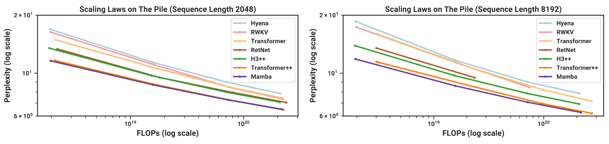

**図 4。** （**Scaling Law。**）Pile で学習した、規模 $\approx 125M$ から $\approx 1.3B$ parameter のモデル。Mamba は他のすべての attention-free model より良くスケールし、現在標準となった非常に強力な「Transformer++」recipe の性能に並ぶ初のモデルであり、特に系列長が増すほどその傾向が強い。

#### 4.2.2 Downstream Evaluation

[表 3](#table-03) は、広く使われる複数の downstream zero-shot evaluation task における Mamba の性能を示す。この規模で最もよく知られた open-source model、とりわけ本研究のモデルと同じ tokenizer、dataset、学習長（300B token）で学習した Pythia [Bid23] および RWKV [Pen23g] と比較する。（Mamba と Pythia は context length 2048 で学習し、RWKV は context length 1024 で学習したことに注意されたい。）

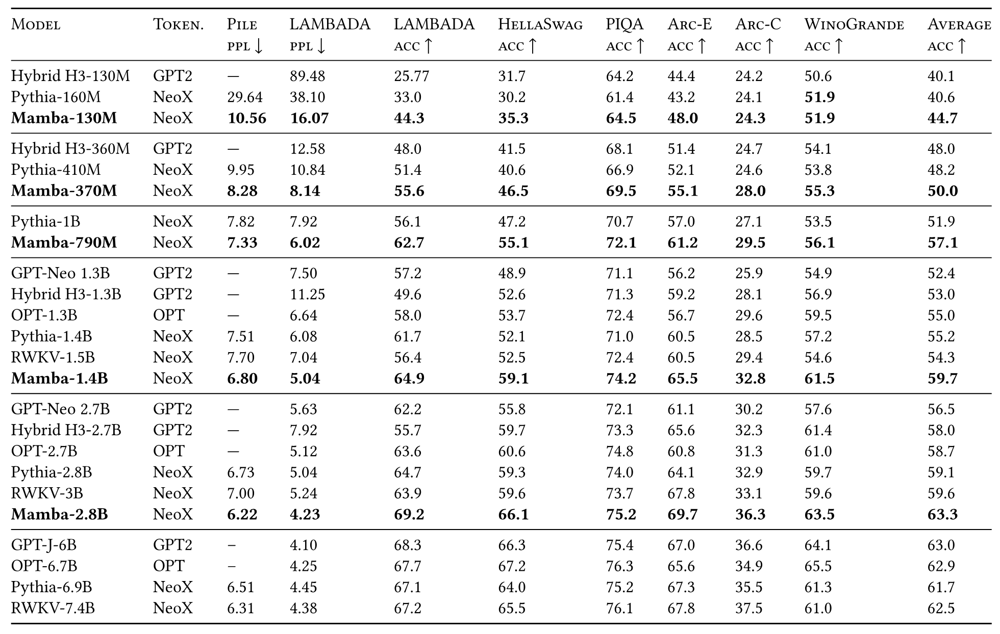

**表 3。** （**Zero-shot Evaluation。**）各規模の最良結果を太字で示す。さまざまな tokenizer を使い、最大 300B token で学習した open-source LM と比較する。Pile は validation split を指し、同じ dataset と tokenizer（GPT-NeoX-20B）で学習したモデルとのみ比較する。各 model size で、Mamba はすべての評価結果において同規模中で最良であり、概して 2 倍の model size の baseline に並ぶ。

### 4.3 DNA モデリング

大規模言語モデルの成功を受け、近年はゲノミクスへ基盤モデルのパラダイムを用いる研究が進んでいる。DNA は有限の語彙を持つ離散 token の系列からなる点で、言語になぞらえられてきた。また、そのモデリングには長距離依存関係が必要であることも知られている [Avs21]。DNA 向け long-sequence model に関する近年の研究 [Ngu23a] と同じ設定で、事前学習および fine-tuning の FM backbone として Mamba を調べる。特に、model size と sequence length に対する 2 種類の scaling law（[図 5](#figure-05)）と、長い context を必要とする難しい downstream synthetic classification task（[図 6](#figure-06)）に焦点を当てる。

事前学習では、学習とモデルの詳細について、標準的な causal language modeling（next token prediction）の設定に概ね従う（[第 11.2 節](#section-11-2) も参照）。dataset には、学習 split が約 45 億 token（DNA base pair）の単一 human genome からなる HG38 dataset を事前学習に用いる HyenaDNA [Ngu23a] の設定へ概ね従う。

#### 4.3.1 スケーリング：Model Size

この実験では、さまざまな model backbone を持つ genomics foundation model の scaling property を調べる（[図 5](#figure-05) *左*）。

**学習。** baseline に有利となるよう、短い系列長 $1024$ で学習する。[第 4.3.2 節](#section-4-3-2) で示すように、系列が長いほど結果はさらに Mamba に有利になると予想する。global batch size は $1024$ に固定し、batch あたり合計 $2^{20} \approx 1M$ token とする。モデルは合計 $10B$ token、$10K$ gradient step で学習した。

**結果。** [図 5](#figure-05)（*左*）は、Mamba の事前学習 perplexity が model size とともに滑らかに改善し、HyenaDNA と Transformer++ の双方より良くスケールすることを示す。例えば最大の model size $\approx 40M$ parameter では、曲線は **Mamba が約 $3\times$-$4\times$ 少ない parameter で Transformer++ および HyenaDNA model に並べる**ことを示す。

#### 4.3.2 スケーリング：Context Length

次の DNA 実験では、sequence length に対するモデルの scaling property を調べる。長い系列長では quadratic attention が法外に高価になるため、HyenaDNA と Mamba model だけを比較する。系列長 $2^{10}=1024$、$2^{12}=4096$、$2^{14}=16384$、$2^{16}=65536$、$2^{18}=262144$、$2^{20}=1048576$ でモデルを事前学習する。model size は 6 layer、width $128$（約 1.3M-1.4M parameter）に固定する。モデルは合計 $\approx 330B$ token、$20K$ gradient step で学習した。長い系列長では [Ngu23a] と同様の sequence length warmup を用いた。

**結果。** [図 5](#figure-05)（*右*）は、**Mamba が長さ 1M という極端に長い系列まで、より長い context を活用でき**、context の増加に伴って事前学習 perplexity が改善することを示す。一方、HyenaDNA model は系列長とともに悪化する。これは selection mechanism の性質に関する [第 3.5 節](#section-3-5) の議論から直観的に理解できる。特に、LTI model は情報を選択的に無視できない。convolutional な観点では、非常に長い convolution kernel は、多量の noise を含みうる長い系列全体からすべての情報を集約してしまう。HyenaDNA は長い context で改善すると主張しているが、その結果では計算時間を統制していないことに注意されたい。

#### 4.3.3 Synthetic Species Classification

DNA の連続した区間をランダムに sample し、5 種の異なる種を分類する downstream task でモデルを評価する。この task は、種 $\{ \texttt{human}, \texttt{lemur}, \texttt{mouse}, \texttt{pig}, \texttt{hippo} \}$ を用いた HyenaDNA から適応したものである。5 種の*大型類人猿*、
$\{ \texttt{human}, \texttt{chimpanzee}, \texttt{gorilla}, \texttt{orangutan}, \texttt{bonobo} \}$ を分類するよう task を変更し、大幅に難しくする。これらは DNA の 99% を共有することで知られている。

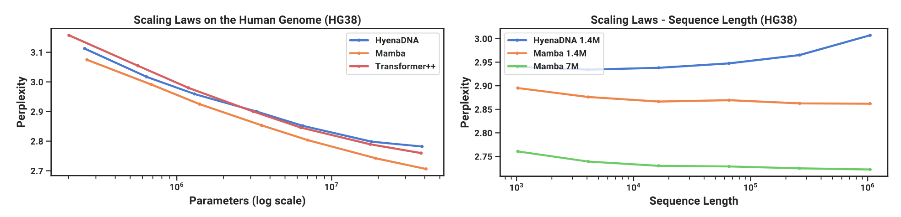

**図 5。** （**DNA Scaling Law。**）HG38（human genome）dataset で事前学習する。（*左*）短い context length $2^{10}=1024$ を固定し、規模を $\approx200K$ から $\approx 40M$ parameter へ増やすと、Mamba は baseline より良くスケールする。（*右*）model size を固定し、tokens/batch と総学習 token 数を一定に保ちながら sequence length を増やす。baseline と異なり、Mamba の selection mechanism は context length の増加に伴う性能向上を促す。

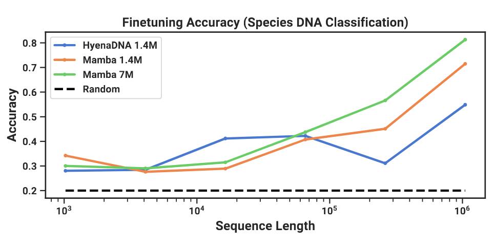

**図 6。** （**Great Apes DNA Classification。**）同じ context length の事前学習済みモデルを用い、長さ $2^{10}=1024$ から $2^{20}=1048576$ までの系列で fine-tuning した後の accuracy。数値結果は [表 13](#table-13) に示す。

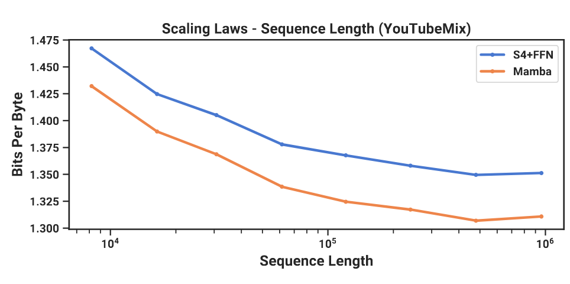

**図 7。** （**音声事前学習。**）Mamba は自己回帰音声モデリングで従来の state-of-the-art（Sashimi）を上回り、同時に 1 分の context、すなわち系列長 100 万まで性能が向上する（計算量を統制）。

### 4.4 音声モデリングと生成

音声波形モダリティでは、主として SaShiMi architecture および学習 protocol [Goe22a] と比較する。

このモデルは次で構成される。

1. model dimension $D$ を stage ごとに 2 倍にする、係数 $p$ の 2 段階 pooling を持つ U-Net backbone。

2. 各 stage で交互に配置した S4 block と MLP block。

S4+MLP block を Mamba block で置き換えることを検討する。

実験の詳細は [第 11.4 節](#section-11-4) に示す。

#### 4.4.1 長い Context での自己回帰事前学習

YouTubeMix [Dee17] で事前学習品質（自己回帰的な next-sample prediction）を評価する。これは先行研究で用いられた標準的な piano music dataset で、16000 Hz で sample した $4$ 時間の piano solo からなる。事前学習の詳細は標準的な言語モデリング設定（[第 4.2 節](#section-4-2)）に概ね従う。[図 7](#figure-07) では計算量を固定し、学習 sequence length を $2^{13}=8192$ から $2^{20}\approx 10^6$ まで増やした効果を評価する。

（データの作成方法にはいくつか細かな例外があり、scaling curve に折れ曲がりを生じさせる可能性がある。例えば 1 分の clip しか利用できないため、実際の最大 sequence length は $60s \cdot 16000Hz = 960000$ に制約される。）

**Mamba と SaShiMi（S4+MLP）baseline はともに、context length が長くなるほど一貫して改善する。Mamba は全域で優れ、長い系列ほど差が広がる。** 主な指標は bits per byte（BPB）であり、他のモダリティの事前学習で用いる標準的な negative log-likelihood（NLL）loss に定数 $\log(2)$ を掛けたものである。

重要な詳細を一つ記しておく。本論文で real parameterization から complex へ切り替えた実験は、これだけである（[第 3.6 節](#section-3-6)）。追加の ablation は [第 11.4 節](#section-11-4) に示す。

#### 4.4.2 自己回帰音声生成

SC09 は、「zero」から「nine」までの数字について、高度に多様な特性を持つ、16000 Hz で sample した $1$ 秒の clip からなる音声生成 benchmark dataset [War18, Don19b] である。自己回帰学習の設定と生成 protocol は [Goe22a] に概ね従う。

[表 4](#table-04) は Mamba-UNet model の自動指標を、[Goe22a] のさまざまな baseline、すなわち WaveNet [Oor16]、SampleRNN [Meh17]、WaveGAN [Don19b]、DiffWave [Kon21]、SaShiMi と比較する。**小さな Mamba model が state-of-the-art の、しかも大幅に大きい GAN-based / diffusion-based model を上回る。** baseline と parameter 数を合わせた大きなモデルでは、fidelity metric がさらに劇的に改善する。

[表 5](#table-05) では小さな Mamba model を使い、外側の stage と中央 stage に対する異なる architecture の組合せを調べる。外側の block では Mamba が一貫して S4+MLP より良く、中央 block では Mamba $>$ S4+MLP $>$ MHA+MLP であることを示す。

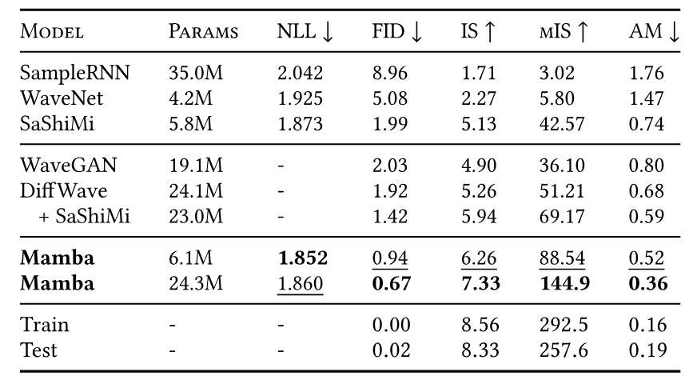

**表 4。** （**SC09。**）固定長の音声 clip からなる難しい dataset での unconditional generation に対する自動指標。（*上から下*）自己回帰 baseline、非自己回帰 baseline、Mamba、dataset の指標。

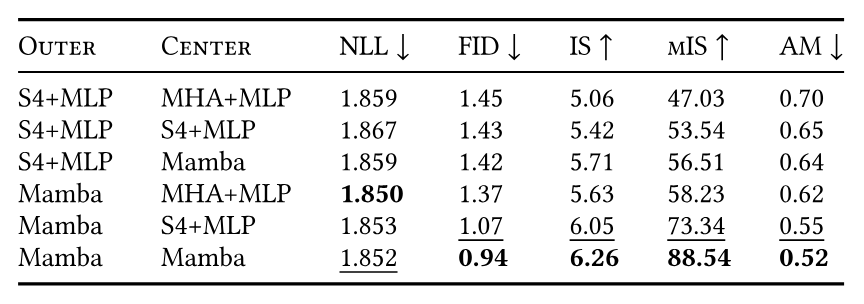

**表 5。** （**SC09 Model Ablation。**）6M parameter のモデル。SaShiMi の U-Net backbone では、系列長 $1000$ で動作する中央 block が 8 個あり、その両側を系列長 $4000$ の外側 block 8 個ずつが挟み、さらにその両側を系列長 $16000$ の外側 block 8 個ずつが挟む（合計 40 block）。中央 8 block の architecture は他の部分と独立に ablation する。効率上の制約から、より重要な外側 block では Transformer（MHA+MLP）を検証していないことに注意されたい。

### 4.5 速度とメモリの Benchmark

[図 8](#figure-08) で SSM scan operation（state expansion $N=16$）の速度と、Mamba の end-to-end inference throughput を benchmark する。本研究の効率的な SSM scan は、系列長 2K を超えると既知の最良 attention 実装（FlashAttention-2 [Dao24a]）より高速で、PyTorch の標準 scan 実装より最大 20-40$\times$ 高速である。Mamba は KV cache がなく、はるかに大きな batch size を使えるため、同規模の Transformer より 4-5$\times$ 高い inference throughput を達成する。例えば（未学習の）Mamba-6.9B は、$5\times$ 小さい Transformer-1.3B より高い inference throughput を持つ。詳細は [第 11.5 節](#section-11-5) に示し、そこにはメモリ消費量の benchmark も含める。

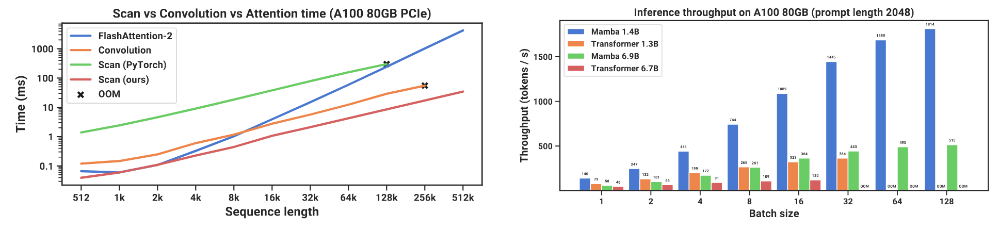

**図 8。** （**効率 Benchmark。**）（*左*）学習：効率的な scan は標準実装より $40\times$ 高速。（*右*）推論：recurrent model である Mamba は Transformer より $5\times$ 高い throughput を達成できる。

### 4.6 モデルの Ablation

モデルの構成要素について、一連の詳細な ablation を行う。主に Chinchilla token 数で学習した規模 $\approx 350$M の言語モデル設定（[図 4](#figure-04) と同じ設定）に焦点を当てる。

#### 4.6.1 アーキテクチャ

[表 6](#table-06) では architecture（block）とその inner SSM layer（[図 3](#figure-03)）の効果を調べる。次のことが分かった。

- global convolution と等価な、従来の non-selective（LTI）SSM 同士では、性能は非常に近い。

- 従来研究の complex-valued S4 variant を real-valued variant に置き換えても性能への影響は小さく、hardware efficiency を考慮すれば（少なくとも LM では）real-valued SSM の方が良い選択となりうることを示唆する。

- これらのいずれを selective SSM（S6）で置き換えても性能は大幅に改善し、[第 3 節](#section-3) の動機を裏付ける。

- Mamba architecture は H3 architecture と同程度に機能する（selective layer を使うとわずかに良いように見える）。

Mamba block と MLP（従来型 architecture）や MHA（hybrid attention architecture）など他の block を交互に配置する場合も [第 11.2.2 節](#section-11-2-2) で調べる。

#### 4.6.2 Selective SSM

[表 7](#table-07) は selective な $\Delta$、$\bm{B}$、$\bm{C}$ parameter（[アルゴリズム 2](#algorithm-02)）のさまざまな組合せを検討して selective SSM layer を ablation し、RNN gating（[定理 1](#theorem-01)）との関係により $\Delta$ が最も重要な parameter であることを示す。

[表 8](#table-08) では SSM の異なる初期化を検討する。これらは一部のデータモダリティと設定で大きな差を生むことが示されている [Gu22a, Gu22b]。言語モデリングでは、より標準的な complex-valued parameterization（S4D-Lin、row 1）ではなく、単純な real-valued diagonal initialization（S4D-Real、row 3）の方が良い性能を示す。先行研究 [Meh23] の知見と一致して、random initialization も良好に機能する。

[表 9](#table-09) と [表 10](#table-10) では、それぞれ $\Delta$ projection と $(\bm{B}, \bm{C})$ projection の dimension を変化させる。static から selective への変更が最大の利得をもたらし、dimension をさらに増やすと、parameter 数の小さな増加と引き換えに性能は概してわずかに改善する。

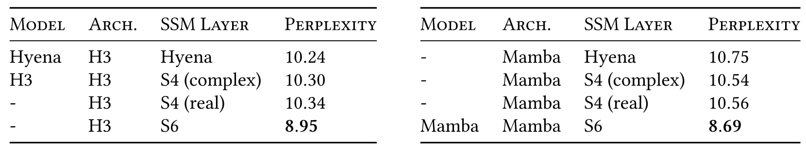

**表 6。** （**Ablation：Architecture と SSM layer。**）Mamba block はより単純でありながら H3 と同程度に機能する。inner layer では LTI model の異なる parameterization 間にほとんど差がない一方、selective SSM（S6）は大きな改善をもたらす。より具体的には、S4（real）variant は S4D-Real、S4（complex）variant は S4D-Lin である。

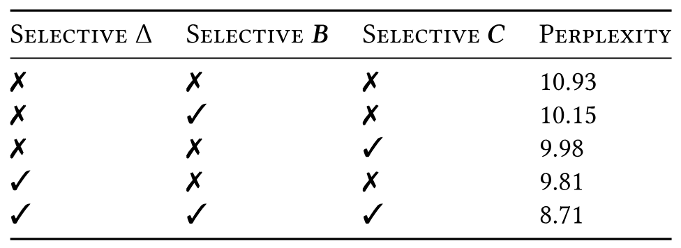

**表 7。** （**Ablation：Selective parameter。**）$\Delta$ が最も重要な parameter（[定理 1](#theorem-01)）だが、複数の selective parameter を併用すると相乗効果が生じる。

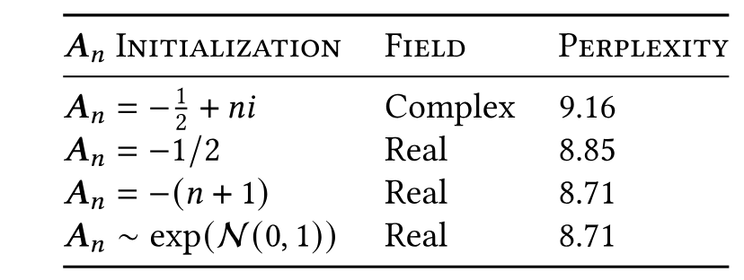

**表 8。** （**Ablation：$\bm{A}$ の Parameterization。**）SSM が selective な場合、S4D-Lin [Gu22b] に基づくより標準的な初期化は、S4D-Real または random initialization より悪い。

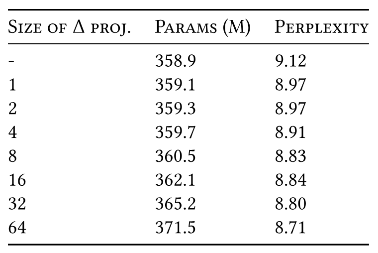

**表 9。** （**Ablation：$\Delta$ の表現力。**）$\Delta$ の selection mechanism は入力の projection からそれを構成する。次元 $1$ への射影だけでも性能は大幅に向上し、さらに増やすと parameter の緩やかな増加と引き換えに一層改善する。state size は $N=16$ に固定。

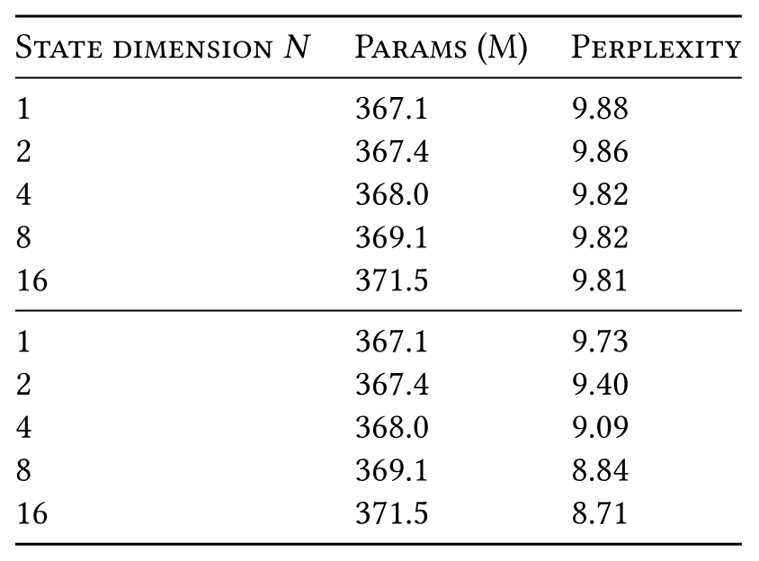

**表 10。** （**Ablation：SSM state dimension。**）（*上*）一定の $\bm{B}$ と $\bm{C}$。（*下*）Selective な $\bm{B}$ と $\bm{C}$。recurrent state dimension に対する expansion factor とみなせる SSM state dimension $N$ を増やすと、parameter / FLOP の cost をほとんど増やさずに性能を大幅に改善できるが、それは $\bm{B}$ と $\bm{C}$ も selective な場合に限られる。$\Delta$ projection の size は $64$ に固定。

特に注目すべきは、state size $N$ を増やしたとき selective SSM が劇的に改善し、parameter がわずか 1% 増えるだけで perplexity が 1.0 以上改善することである。これは [第 3.1 節](#section-3-1) と [第 3.3 節](#section-3-3) の中核的な動機を裏付ける。

## 5 議論

関連研究、制約、および今後の方向性を論じる。

**関連研究。** [第 7 節](#section-7) では selection mechanism と類似概念との関係を論じる。[第 8 節](#section-8) では SSM と他の関連モデルについて関連研究を拡張して扱う。

**No Free Lunch：Continuous-Discrete Spectrum。** Structured SSM はもともと continuous system [式 1](#equation-01) の離散化として定義され、perceptual signal（例えば音声、動画）のような continuous-time data modality に強い inductive bias を持ってきた。[第 3.1 節](#section-3-1) と [第 3.5 節](#section-3-5) で論じたように、selection mechanism はテキストや DNA など離散モダリティに対する弱点を克服する。しかし反対に、LTI SSM が得意とするデータでの性能を阻害しうる。音声波形に関する ablation では、この tradeoff をさらに詳しく調べる。

**Downstream の可能性。** Transformer-based foundation model（特に LLM）には、fine-tuning、adaptation、prompting、in-context learning、instruction tuning、RLHF、quantization など、事前学習済みモデルの豊かな性質と利用形態からなる ecosystem がある。SSM のような Transformer の代替にも同様の性質と可能性があるかに、特に関心を持っている。

**スケーリング。** 実証評価は小さな model size に限られ、強力な open-source LLM（例えば Llama [Tou23]）の多くや、7B parameter 以上で評価されている RWKV [Pen23g]、RetNet [Sun23a] など他の recurrent model の閾値を下回る。より大きな規模でも Mamba が有利に比較できるかは、今後評価する必要がある。また、SSM の scaling には、本論文で論じていない追加の engineering 上の課題やモデル調整が伴う可能性がある。

## 6 結論

structured state space model に selection mechanism を導入し、系列長に対する線形スケーリングを保ちながら context-dependent reasoning を可能にした。単純な attention-free architecture に組み込むと、Mamba は多様な領域で state-of-the-art の結果を達成し、強力な Transformer model の性能に並ぶか上回る。特にゲノミクス、音声、動画など長い context を要する新興モダリティを含む、異なる領域の基盤モデル構築に selective state space model を広く応用できることを期待している。本研究の結果は、Mamba が汎用 sequence model backbone の有力な候補であることを示唆する。

## 謝辞

草稿に有益な feedback を寄せてくれた Karan Goel、Arjun Desai、Kush Bhatia に感謝する。

## 7 議論：Selection Mechanism

本研究の selection mechanism は、gating、hypernetwork、data-dependence などの概念に着想を得ており、それらと関係する。また、「fast weights」[Sch92, Ba16a] と関係するものとも捉えられ、これは古典的 RNN と linear attention の mechanism を結び付ける [Sch21]。しかし、selection mechanism は明確化する価値のある別個の概念だと考える。

**Gating。** Gating はもともと LSTM [Hoc97] や GRU [Chu14] などの RNN の gating mechanism、または [定理 1](#theorem-01) の gated equation [式 5](#equation-05) を指していた。これは、RNN の hidden state へ入力を入れるか否かを制御する特定の仕組みと解釈された。特に、時刻を通じた signal の伝播に影響し、系列長方向に沿って入力を相互作用させる。

しかしその後、一般的な用法での gating という概念は、単に任意の乗法的相互作用（多くの場合 activation function を伴う）を意味するまで緩められた。例えば、neural network architecture の*要素ごとの*乗法的構成要素（系列長に沿って相互作用しない）も、元来の RNN における意味とは大きく異なるにもかかわらず、現在では一般に gated architecture と呼ばれる [Hua22, Meh23]。したがって、元来の *RNN gating* と一般的に使われる *multiplicative gating* は、実際には意味が大きく異なると考える。

**Hypernetwork。** Hypernetwork は、それ自体の parameter がより小さな neural network によって生成される neural network を指す。元来の着想 [Ha17] は、recurrent parameter がより小さな RNN で生成される大きな RNN を定義するという狭い意味で用いており、他の variant も長年存在してきた [Sch92]。

**Data-dependence。** hypernetwork と同様、data-dependence はモデルの一部の parameter がデータに依存するという任意の概念を指しうる [Pol23a]。

**例：GLU Activation。** これらの概念の問題を例示するため、単純な diagonal linear layer $y = \bm{D}x$ を考える。ここで $\bm{D}$ は対角 weight parameter である。次に、optional な nonlinearity を伴い、$\bm{D}$ 自体が $x$ の linear transformation から生成されるとする：$\bm{D} = \sigma(\bm{W} x)$。対角なので、この乗算は elementwise product となる：$y = \sigma(\bm{W} x) \circ x$。

これはかなり自明な変換だが、技術的には gating（乗法的な「branch」を持つため）、hypernetwork（parameter $\bm{D}$ が別の layer で生成されるため）、data-dependent（$\bm{D}$ がデータ $x$ に依存するため）の一般的な意味を満たす。しかし実際には単に GLU function を定義しているだけであり、意味のある layer というより、しばしば activation function にすぎないとみなされるほど単純である [Dau17, Sha20]。

**Selection。** したがって、selection mechanism を architectural gating、hypernetwork、data-dependence などの着想の特殊例とみなすことはできるが、同じことは他の膨大な構成にも、実質的には標準的な attention mechanism [Bah15, Vas17] を含め、乗算を持つあらゆるものにも言えるため、その捉え方に有益さはないと考える。

代わりに、これを従来型 RNN の gating mechanism と最も密接に関係するものと捉える。この mechanism は特殊例であり（[定理 1](#theorem-01)）、$\Delta$ の可変な（input-dependent）離散化を通じて SSM と結び付く、より長い歴史も持つ [Fun93, Tal18a, Gu20a]。また、以前の用語が多義的に使われていることを明確にするため、「gating」を避けて *selection* という用語を使う。より狭義には、selection を、入力を選択または無視し、系列長に沿ったデータ相互作用を促すモデルの*機械的な*作用を指すために用いる（[第 3.1 節](#section-3-1)）。selective SSM と gated RNN のほか、input-dependent convolution [Yan19c, Lio20, Kos23, Lut23] や attention さえ、その例に含まれうる。

## 8 関連研究

本手法に関連する複数の先行研究を概観する。最も密接に関連するモデルの一部には、S4、S5、quasi-RNN などの recurrent layer と、H3、RetNet、RWKV などの end-to-end architecture が含まれる。

### 8.1 S4 の Variant と派生

先行研究の structured SSM、特に本手法と関係するものを簡潔に概観する。

- S4 [Gu21a, Gu22a] は最初の structured SSM を導入し、diagonal structure と diagonal plus low-rank（DPLR）を説明した。continuous-time online memorization（HIPPO）[Gu20a] との関係から、DPLR SSM 向けの効率的な convolutional algorithm に焦点を当てた。

- DSS [Gup22] は HIPPO initialization を近似することで、diagonal structured SSM の実証的な有効性を初めて発見した。S4D [Gu22b] はこれを理論的に拡張した。

- S5 [Smi23] は独立に diagonal SSM approximation を発見し、parallel scan で recurrent に計算した初の S4 model である。しかし、それには実効 state dimension を小さくする必要があり、SSM の次元を SISO（single-input single-output）から MIMO（multi-input multi-output）の定式化へ切り替えて実現した。本研究が提案する S6 も scan を使うが、（i）SISO dimension を維持してより大きな実効 recurrent state を得る、（ii）hardware-aware algorithm で計算問題を克服する、（iii）selection mechanism を追加する、という点で異なる。

  [Lu23a] は episode trajectory 間で SSM state を reset するため、S5 を meta-RL に適用した。その mechanism は、入力に依存する学習可能な本研究の mechanism とは異なり、$\overline{\bm{A}}$ を手動で $0$ に設定する、hard-coded な selection mechanism の一例とみなせる。この設定へ selective SSM を一般的に適用し、episode boundary で state を自動的に reset するようモデルが学習したかを調べることは興味深い。

- Mega [Ma23b] は S4 を complex-valued ではなく real-valued に簡素化し、exponential moving average（EMA）という解釈を与えた。さらに、SSM の discretization step と EMA の *damping* term との興味深い関係を示した。元来の S4 論文の知見と異なり、特定の設定や異なる architectural component と組み合わせた場合に real-valued SSM が実証的に有効だと示した初のモデルである。

- Liquid S4 [Has23] も S4 を input-dependent state transition で拡張することを動機としている。この観点では selection mechanism と似ているが、依然として convolutionally に計算され、LTI に近い限定的な形である。

- SGConv [Li23y]、Hyena [Pol23a]、LongConv [Fu23b]、MultiresConv [Shi23e]、Toeplitz Neural Network [Qin23d] はいずれも S4 の convolutional representation に焦点を当て、異なる parameterization で global または long convolution kernel を構成する。しかし、これらの手法は高速な自己回帰推論を直接行えない。

特に、これらの手法、および把握している他のすべての structured SSM は non-selective であり、通常は厳密に LTI（linear time invariant）である。

### 8.2 SSM Architecture

SSM architecture または state space neural network（SSNN）という用語を、従来の SSM の一つを black-box layer として組み込んだ deep neural network architecture を指すために用いる。

- GSS [Meh23] は SSM を組み込んだ最初の gated neural network architecture である。[Hua22] の gated attention unit（GAU）を動機とし、追加の projection を除けば本研究の block と非常によく似ている。最も重要なのは、その projection が SSM の state size を減らすため model dimension を*縮小*する一方、本研究では [第 3.1 節](#section-3-1) の動機に基づき、state size を増やすため model dimension を*拡大*する点である。

- Mega [Ma23b] は、上述した S4 の EMA への簡素化を、効率的な attention approximation を用いる hybrid architecture に組み込んだ。

- H3 [Dao23d] は S4 と linear attention [Kat20] の組合せを動機とする。この linear attention の定式化をより一般的な recurrence へ一般化した最初の手法であり、後続 architecture の基礎にもなった。

- Selective S4 [Wan23l] は S4 を black box として組み込み、入力へ乗算する binary mask を生成する。「selection」という名称は共通するが、selection mechanism より architectural gating に近い architecture の変更だと考える（[第 7 節](#section-7)）。例えば、無関係な入力を単に mask out しても関連入力間の間隔には影響しないため、Selective Copying task は解けないと仮定する（実際、noise token を 0 に embedding すれば、Selective Copying task はあらかじめ mask されたものとさえみなせる）。

- RetNet [Sun23a] も Linear Attention に基づき H3 と非常によく似ているが、inner S4 layer を state dimension $N=1$ の特殊例まで縮小する。そのようには位置付けられていないが、その recurrence は linear SSM の特殊例とみなせる。

  主な改善源は、大きな *head dimension* を持つ linear attention を用いることであり、これは input-dependent state expansion を行う別の方法とみなせる。linear attention variant の文脈で大きな head dimension を最初に用いたのは H3 だが、追加計算量が比例して増えるため、その後は広く使われなかった。RetNet は、convolution の代わりに標準的 multi-head attention の variant で計算を並列化する別の方法によってこれを避ける。この方法は、単純な EMA として働く RetNet 固有の SSM の特殊例だから可能となる。

- RWKV [Pen23g] は、言語モデリング向けに設計された近年の別の RNN である。linear attention の別の variant である AFT（attention-free Transformer [Zha21e]）に基づく。主要な「WKV」mechanism は LTI recurrence を伴い、2 つの SSM の比とみなせる。

また、Transformer の MHA block と MLP block を統合することを動機とした [Hua22] の gated attention unit（GAU）も取り上げる。これは H3 block と MLP block を統合した本研究の architecture（[第 3.4 節](#section-3-4)）の着想源となった。

### 8.3 RNN との関係

RNN と SSM は、ともに潜在 *state* 上の *recurrence* という概念を伴うため、広く関係している。

strongly typed RNN [Bal16]、quasi-RNN（QRNN）[Bra16]、simple recurrent unit（SRU）[Lei17, Lei21] など、以前の複数の RNN は time-wise nonlinearity を持たない gated RNN の形を取る。gating mechanism と selection mechanism の関係により、これらは selective SSM の事例とみなせるため、ある意味では上述した LTI structured SSM 群より強力である。主な相違点は次のとおり。

- state expansion（$N=1$）も selective な $\bm{B}, \bm{C}$ parameter も用いないが、いずれも性能に重要である（[第 4.6 節](#section-4-6)）。

- heuristic な gating mechanism を用いる。本研究ではこれを selection mechanism + discretization の帰結として一般化する（[定理 1](#theorem-01)）。原理的な SSM theory との関係により、より良い parameterization と initialization が得られる（[第 3.6 節](#section-3-6)）。

さらに、以前の RNN は効率問題と vanishing gradient problem [Hoc91, Hoc01, Pas13] に苦しんだことで知られ、いずれも逐次的な性質に起因する。前者は上述した RNN の一部では parallel scan [Mar18] を活用して解決できたが、後者はその後 SSM のために発展した理論なしには難しかった。例えば現代の structured SSM は、古典的 SSM theory に着想を得た recurrent dynamics のより慎重な parameterization（例えば離散化 [Gu21a, Gu23a]）または直接的な解析 [Orv23, Kau20, Gup22a] の点で異なる。

また、$\overline{\bm{A}}$ transition matrix を orthogonal または unitary に制約し、その eigenvalue を制御して vanishing gradient problem を防ぐことを動機とする、orthogonal RNN の長い研究系列 [Arj16, Hen16c, Mha17, Vor17, Lez19] もある。しかし、これらには別の制約があった。orthogonal / unitary RNN も LTI であることが、その原因だと考える。例えば、ほぼ必ず完全に解ける Copying task で評価される一方、Selective Copying task では苦戦することが観察されている [Jin19]。

### 8.4 Linear Attention

Linear Attention（LA）[Kat20] framework は、kernel attention を広め、recurrent autoregressive model との関係を示した重要な成果である。多くの variant が別の kernel やその他の変更を提案してきた。Random Feature Attention（RFA）[Pen21] は、Gaussian kernel の random Fourier feature approximation [Rah07] を用いて softmax attention（すなわち $\exp$ feature map）を近似するよう kernel feature map を選ぶ。Performer [Cho21] は positive feature だけを伴う exponential kernel の近似を見いだし、softmax normalization term も扱える。TransNormer [Qin22a] は LA denominator term が不安定になりうると示し、LayerNorm で置き換えることを提案した。cosFormer [Qin22b] は locality を強調する positional information を組み込んだ cosine reweighting mechanism により RFA を拡張する。Linear Randomized Attention [Zhe22b] は importance sampling の観点から RFA を一般化し、（$\exp$ 変換した numerator だけでなく）完全な softmax kernel のより良い推定値を与えるよう拡張する。

kernel attention のほかにも efficient attention の variant は多数あり、survey [Tay22a] はその多くを広範に分類している。

### 8.5 Long Context Model

long context は広く扱われる話題となり、近年の複数のモデルがより長い系列へスケールできると主張している。しかし、これは計算面からの主張であることが多く、広範には検証されていない。次が含まれる。

- Recurrent Memory Transformer [Bul23] は Transformer backbone の軽量 wrapper である。系列長 1M まで汎化する能力を示したが、synthetic memorization task に限られる。主な結果は、本研究の Induction Heads 外挿実験（[表 2](#table-02)）と似ている。

- LongNet [Din23a] は長さ 1B までスケールすると主張したが、実際の task では長さ $<100K$ だけを評価した。

- Hyena と HyenaDNA [Pol23a, Ngu23a] は最大 1M の context を活用すると主張した。しかし、その実験は長い context ほど比例して多くのデータで学習しており、context 1M での品質向上が context length によるのか、データと計算量の増加によるのか結論付けにくい。

- Sparse Transformer [Chi19] は strided sparse attention Transformer を用い、長さ $2^{20}=1048576$ の音声波形をモデリングする proof-of-concept を示したが、計算量と model size を統制した場合の performance tradeoff は論じなかった。

これに対し、本研究は長い context による性能向上を有意に実証した最初期の手法の一つだと考える。

## 9 Selective SSM の Mechanics

::: details 証明

$N=1, \bm{A}=-1, \bm{B}=1, s_\Delta=\mathrm{Linear}(x), \tau_\Delta=\mathrm{softplus}$ の selective SSM（[アルゴリズム 2](#algorithm-02)）を考える。対応する continuous-time SSM [式 1](#equation-01) は

$$
\begin{aligned}

  h(t) = -h(t) + x(t)
\end{aligned}
$$
であり、*leaky integrator* とも呼ばれる。

離散化 step size は

$$
\begin{aligned}

  \Delta_t &= \tau_\Delta(\mathrm{Parameter} + s_\Delta(x_t)) \\
      &= \mathrm{softplus}(\mathrm{Parameter} + \mathrm{Linear}(x_t)) \\
      &= \mathrm{softplus}(\mathrm{Linear}(x_t))
\end{aligned}
$$
となる。ここで parameter は学習可能な bias とみなして linear projection へ畳み込めることが分かる。

ここで zero-order hold（ZOH）の離散化式を適用すると、

$$
\begin{aligned}

  \overline{\bm{A}}_t &= \exp(\Delta\bm{A}) = \frac{1}{1 + \exp(\mathrm{Linear}(x_t))} = \sigma(-\mathrm{Linear}(x_t))
    \\&= 1 - \sigma(\mathrm{Linear}(x_t))
    \\
  \overline{\bm{B}}_t &= (\Delta\bm{A})^{-1} (\exp(\Delta\bm{A}) - \bm{I}) \cdot \Delta\bm{B} = -(\exp(\Delta\bm{A}) - \bm{I}) = 1 - \overline{\bm{A}}
    \\&= \sigma(\mathrm{Linear}(x_t))
    .
\end{aligned}
$$

したがって、最終的な discrete recurrence [式 2a](#equation-02-a) は

$$
\begin{aligned}

  g_t &= \sigma(\mathrm{Linear}(x_t)) \\
  h_{t} &= (1-g_t) h_{t-1} + g_t x_t
\end{aligned}
$$
となり、所望の結果を得る。

:::

## 10 Selective SSM 向け Hardware-Aware Algorithm

input-dependent selectivity がなければ、SSM は fast Fourier transform（FFT）を primitive として活用する convolution [Gu22a, Dao23d] として効率的に実装できる。selectivity があると、SSM はもはや convolution と等価ではないが、parallel associative scan を活用できる。SSM scan は理論上効率的（$O(B L D N)$ FLOP、$L$ に対して線形にスケール）だが、selective SSM で基盤モデルを学習するには、現代の hardware（GPU）上でも効率的でなければならない。SSM scan を高速かつ memory-efficient にするため、*kernel fusion* と *recomputation* をどのように使うか説明する。[第 4.5 節](#section-4-5) では scan 実装の速度を convolution および attention と比較評価し、系列長 32K では attention より最大 7$\times$ 高速で、最良の attention 実装（FlashAttention）と同等に memory-efficient であることを示す。

**速度。** 現代の hardware accelerator（GPU）では、大半の演算（行列乗算を除く）が memory-bandwidth に律速される [Wil09, Iva21, Dao22]。これは本研究の scan operation にも当てはまり、kernel fusion を用いて memory IO 量を減らすことで、標準実装に対して大幅に高速化する。

[第 3.2 節](#section-3-2) の scan algorithm を実装する標準的な方法は、サイズ $(B, L, D, N)$ の scan input $\overline{\bm{A}}, \overline{\bm{B}}$ を GPU HBM（high-bandwidth memory、一般に GPU memory と呼ばれる）に用意し、parallel associative scan 実装を呼び出してサイズ $(B, L, D, N)$ の scan output を GPU HBM へ書き込み、それからその scan output に $\bm{C}$ を乗じてサイズ $(B, L, D)$ の出力を生成する。しかし、これには $O(B L D N)$ のオーダーの memory read / write が必要となる。代わりに、離散化 step、scan、$\bm{C}$ との乗算を一つの kernel に fuse できる。

1. 低速な HBM から高速な SRAM へ $O(B L D + D N)$ byte の memory（$\Delta, \bm{A}, \bm{B}, \bm{C}$）を読み込む。

2. 離散化し、SRAM 上にサイズ $(B, L, D, N)$ の $\overline{\bm{A}}, \overline{\bm{B}}$ を生成する。

3. parallel associative scan を行い、SRAM 上にサイズ $(B, L, D, N)$ の中間 state を得る。

4. $\bm{C}$ と乗算して総和を取り、サイズ $(B, L, D)$ の出力を生成し HBM へ書き込む。

この方法により、IO を（state dimension）$O(N)$ 倍削減し、実際には operation を 20-40 倍高速化する（[第 4.5 節](#section-4-5)）。

sequence length $L$ が長すぎて系列を SRAM（HBM よりはるかに小さい）に収められない場合は、系列を chunk に分割して各 chunk に fused scan を行う。中間 scan state があれば、次の chunk で scan を継続できる。

**メモリ。** selective SSM layer の学習に必要な総メモリ量を削減するため、古典的な *recomputation* 手法をどのように用いるか説明する。

forward pass を fuse する方法では、メモリの爆発を避けるため、サイズ $(B, L, D, N)$ の中間 state を保存しない。しかし、これらの中間 state は backward pass で gradient を計算するために必要となる。そこで backward pass で中間 state を再計算する。HBM から SRAM へ読み込む入力 $\Delta, \bm{A}, \bm{B}, \bm{C}$ と output gradient のサイズは $O(B L N + D N)$ で、input gradient のサイズも $O(B L N + D N)$ であるため、recomputation により HBM から $O(B L N D)$ 要素を読み込む cost を避けられる。つまり、backward pass で SSM state を再計算する方が、それを保存して HBM から読み込むより計算が速くなる。

scan operation だけのメモリ要件を最適化することに加え、selective SSM block 全体（input projection、convolution、activation、scan、output projection）のメモリ要件を最適化するためにも recomputation を用いる。特に、メモリを大量に使う一方で高速に再計算できる中間 activation（例えば activation function や short convolution の出力）は保存しない。その結果、selective SSM layer のメモリ要件は FlashAttention を使った最適化済み Transformer 実装と同じになる。具体的には、各 attention layer（FlashAttention）は token あたり約 12 byte、各 MLP layer は token あたり約 20 byte の activation を保存し、合計 32 byte となる（FP16 または BF16 での mixed-precision training を仮定）。各 selective SSM は token あたり約 16 byte の activation を保存する。したがって、selective SSM 2 layer の activation memory は attention layer と MLP layer の組合せとほぼ同じになる。

## 11 実験の詳細と追加結果

### 11.1 Synthetic Task

**Selective Copying。** 系列長 4096、16 種類の token からなる語彙（[図 2](#figure-02) の白い「noise」token を含む）を用い、16 個の「data」token をモデルに記憶させる設定である。model dimension $D = 64$ の 2-layer model を用いる。

モデルは batch size $64$、一定の learning rate $0.0001$ で 400K step 学習する。

**Induction Head。**

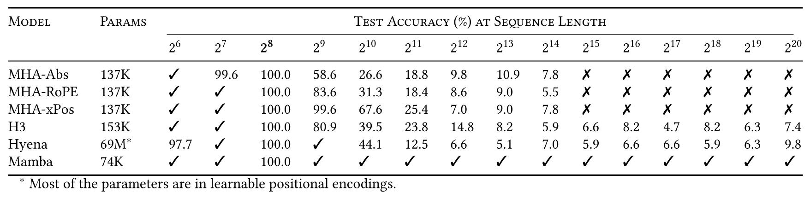

**表 11。** （**Induction head。**）モデルは系列長 $2^8=256$ で学習し、$2^6=64$ から $2^{20}=1048576$ までのさまざまな系列長で検証する。✓ は完全な汎化 accuracy、✗ は out of memory を表す。

学習では毎 step データをランダムに生成し、batch size は $8$ とする。「epoch」の size は 8192 step とし、各 target sequence length の固定 validation set（これもランダムに生成）で accuracy を追跡する。MHA-Abs と Mamba model は 25 epoch 後（$8192 \times 25 = 204800$ step）、MHA-RoPE と MHA-xPos model は 50 epoch 後（$8192 \times 50 = 409600$ step）の結果を報告する。LTI H3 と Hyena model は、その時点で収束し、その後改善しなかったため 10 epoch 後（$81920$ step）の結果を報告する。

weight decay なしの Adam optimizer を用いる。すべてのモデルを一定の learning rate $2e-4$ と $1e-3$ で学習し、各モデルの良い方の結果を報告する（Mamba 以外のすべてのモデルでは $2e-4$）。attention model と Hyena model は LR $1e-3$ では学習しなかった。H3 はどちらの LR でも学習したが、興味深いことに小さい LR $2e-4$ の方が短い系列へよく汎化した。Mamba はどちらの LR でも学習したが、大きな LR $1e-3$ の方がよく外挿した。

### 11.2 言語モデリング

#### 11.2.1 Scaling Law の詳細

Scaling law 実験は概ね GPT3 recipe に従った。すべてのモデルを GPT2 tokenizer を使って Pile で学習した。

**Model Size。** [表 12](#table-12) は scaling law に用いる model size を定める。これは GPT3 の仕様 [Bro20] をごくわずかに変更して、そのまま採用した。第一に、大きな batch size を必要とするほど並列化しなかったため、1.3B model の batch size を 1M token から 0.5M token へ変更した。第二に、学習 token 数は model size に比例して増加すべきとする Chinchilla scaling law [Hof22b] に概ね一致するよう、training step 数と総 token 数を変更した。

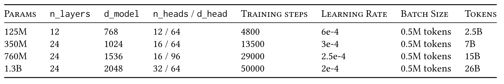

**表 12。** （**Scaling Law の Model Size。**）scaling 実験における model size と hyperparameter。（Model dimension と head 数は Transformer model にのみ適用。）

**学習 Recipe。** すべてのモデルで、次の設定を持つ AdamW optimizer を用いた。

- gradient clip value $1.0$

- weight decay $0.1$

- dropout なし

- cosine decay を伴う linear learning rate warmup

既定では、peak learning rate は GPT3 の仕様とする。

複数のモデルには、PaLM [Cho23a] や LLaMa [Tou23] など広く使われる大規模言語モデルで採用された変更を参考に「improved recipe」を与える。これには次が含まれる。

- $1e-5$ までの cosine decay を伴う linear learning rate warmup。peak value は GPT3 の値の $5\times$

- linear bias term なし

- LayerNorm の代わりに RMSNorm

- PyTorch の既定値 $\beta=(.9, .999)$ の代わりに AdamW hyperparameter $\beta=(.9, .95)$（GPT3 の値）

**Architecture と学習の詳細。** 用いるモデルは次のとおり。

- **Transformer**：GPT3 に基づく標準 Transformer（[表 12](#table-12)）。

- **Transformer++**：改善した architecture、すなわち rotary positional encoding [Su21] と SwiGLU MLP [Sha20]、および上述の improved training recipe を持つ Transformer。

- **Hyena**：Hyena block（S4 を MLP でパラメータ化した global convolution に置き換えた H3 block）と標準的な MLP block を交互に配置する。MLP block の expansion factor は $4$ ではなく $2$ とし、parameter 数を保つため layer 数をそれに応じて $1.5\times$ に増やす。

- **H3++**：H3 architecture に、（i）上述した Hyena と同じ「thin」dimension、（ii）上述の improved training recipe、（iii）8 の linear attention *head dimension* を含むいくつかの変更を加える。

- **RWKV**：[Pen23g] の既定の RWKV model で、変更された MLP block を含む。また、特定の parameter で learning rate を $2\times$ または $3\times$ に増やすなど、指定された training recipe も可能な限り用いた。

- **RetNet**：[Sun23a] の既定の RetNet model。上述の improved training recipe も与えた。

- **Mamba**：上述の improved training recipe を持つ標準 Mamba architecture。

#### 11.2.2 Scaling Law の追加 Ablation

[図 4](#figure-04)（*左*）の 2k context length scaling law と同じ protocol を用い、architecture について追加の ablation を行う。

**Mamba Architecture：Block の交互配置。** Mamba block と組み合わせる異なる architectural block の効果を検証する。Mamba block は、単に標準的な SwiGLU block へ追加の $\mathrm{conv} \to \mathrm{SSM}$ path を加えたものだという観点に注目する。ここから 2 つの自然な ablation が得られる。

- Mamba block を均質に積み重ねず、標準 MLP block と交互に配置するとどうなるか。これは Mamba から SSM の半分を取り除くこととも解釈できる。

- Mamba block を MHA（multi-head attention）block と交互に配置するとどうなるか。これは SwiGLU MLP を持つ Transformer（すなわち Transformer++ と呼ぶもの）を取り、その MLP block へ単に SSM を追加することとも解釈できる。

[図 9](#figure-09)（*右*）は、これらの variant を元の（均質な）Mamba architecture と比較する。興味深いことに、どちらの変更も大きな影響を与えない。Mamba-MLP architecture はわずかに悪いだけで、依然として Transformer++ 以外の全モデルより良い。Mamba-MHA architecture はわずかに良いだけである。近年の多くの研究が（LTI）SSM と Attention の組合せは大幅な改善につながりうると見いだした [Dao23d, Fat23a, Sao23, Zuo22, Fat23] ことを考えると、これはやや意外である。

**H3 Architecture：学習 Recipe。** 次に、Transformer++ と Mamba を除いて最も弱いモデルと最も強いモデルである Hyena と H3++ の差を ablation し、特に training recipe の効果を分離する。

- **Hyena**：元来の architecture と GPT3 training recipe を持つ Hyena block（[図 4](#figure-04) と同じ）。

- **Hyena+**：同じ architecture だが、上述した improved training recipe を用いる。

- **H3+**：Hyena+ と同じ architecture だが、Hyena convolution kernel を S4D convolution kernel へ置き換える。

- **H3++**：H3+ と同じだが、linear attention の *head dimension* を 8 とする。これにより SSM recurrence 内の計算量は増えるが、parameter は増えない。

一般的な表記規則として、「Model+」は improved training recipe を持つ base model を表し、「Model++」は architectural な変更も許す。

[図 9](#figure-09)（*右*）は次のことを示す。

- improved training recipe により大幅に改善する。この recipe は主要な [図 4](#figure-04) の多くのモデル（RetNet、H3++、Transformer++、Mamba）で用いた。

- inner LTI SSM の選択は重要ではなく（例えば Hyena 対 S4）、本論文全体の知見と一致する。

- head dimension の拡大は性能を改善し、拡張した state dimension が SSM の性能を改善するという主要な主題の一つ（[第 3 節](#section-3)）と一致する。

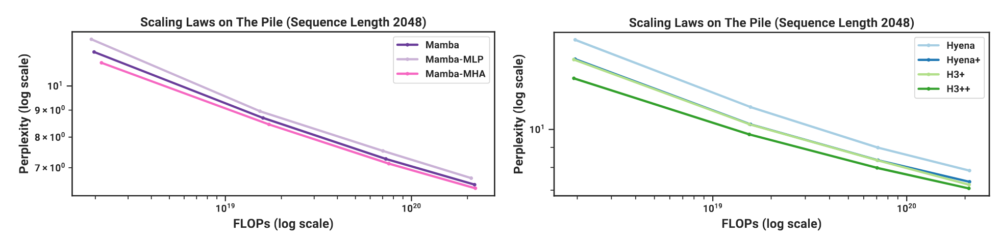

**図 9。** （**Scaling law：追加 ablation。**）（*左*）代わりに（*右*）代わりに

#### 11.2.3 Downstream Evaluation の詳細

この事前学習手順は scaling law protocol と同じだが、300B token まで拡張し、GPT2 tokenizer の代わりに GPT-NeoX tokenizer [Bla22] を使う。1.3B model では GPT3 の仕様と一致させるため、batch size 1M token を用いる。Pile validation set 上の perplexity を報告し、この指標に限っては、同じ dataset と同じ tokenizer で学習したモデル、特に Pythia と RWKV だけと比較する。

downstream evaluation には、この領域の大半の研究と同様、EleutherAI の LM evaluation harness [Gao21] を用いる。常識推論を測る次の task / dataset で評価する。

- LAMBADA [Pap16a]

- HellaSwag [Zel19]

- PIQA [Bis20]

- ARC-challenge [Cla18]

- ARC-easy：ARC-challenge の容易な subset

- WinoGrande [Sak21]

LAMBADA、WinoGrande、PIQA、ARC-easy には accuracy を、HellaSwag と ARC-challenge には系列長で正規化した accuracy を報告する（これらの task ではほぼすべてのモデルで normalized accuracy の方が高いため）。

### 11.3 DNA モデリング

#### 11.3.1 事前学習の詳細

HG38 事前学習 task の dataset と学習手順をさらに詳しく説明する。

dataset はゲノミクスに関する先行研究 Enformer [Avs21] の split に従う。training split は genome を覆う長さ $2^{17}=131072$ の segment を合計 $S=34021$ 個含み、総計約 45 億 token（DNA base pair）となる。これらの segment は（chromosome number、starting index、ending index）の組であり、必要なら（例えば長い segment を得るため）拡張できる。

学習 sequence length が $2^{17}$ でない場合は HyenaDNA と異なる。HyenaDNA は常に固定 sub-segment（例えば指定 segment の冒頭または中央）を取り、どの学習 sequence length でも各 epoch は $34021$ sample に固定され、必ずしも genome 全体を通過しない。一方、本研究では学習データ全体を用いる。

- context length $L$ が $2^{17}$ 以下の場合、各 segment を長さ $L$ の重複しない sub-segment に分け、合計 sample 数を $S \times \frac{2^{17}}{L}$、epoch あたりの token 数を $S \times 2^{17} \approx 4.5B$ とする。

- context length $L$ が $2^{17}$ より長い場合、各 segment を、指定 segment で始まるものと指定 segment で終わるものの 2 sample にする。したがって各 epoch には $2S$ item、$2 S L$ token が含まれる。例えば sequence length $2^{18}=262144$ では既定の $4\times$、sequence length $2^{20}$ では $16\times$ の token がある。

その他の学習詳細は、概して言語モデリング実験（[第 11.2 節](#section-11-2)）と同じ protocol に従う。例えば $(\beta_1, \beta_2) = (0.9, 0.95)$ の AdamW、dropout なし、weight decay $0.1$ を用いる。総 step の 10% を linear warmup とする cosine learning rate scheduler を用いる。

#### 11.3.2 スケーリング：Model Size の詳細

**モデル。** 検討するモデルは次のとおり。

- Transformer++：改善した architecture、とりわけ RoPE positional encoding [Su21] を用いる Transformer。非形式的な知見として、[Vas17] の vanilla positional encoding より明らかに良いことが分かった。

- HyenaDNA：[Pol23a, Ngu23a] の Hyena model。概ね、MHA block を、MLP でパラメータ化した global convolution を使う H3 block へ置き換えた Transformer である。

- Mamba：標準 Mamba architecture。

**Model Size。** 次の model size を用いる。

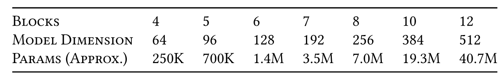

**モデル規模。**
Mamba の block 数を 2 倍にすることに注意されたい。Transformer の 1「layer」は MHA block と MLP block の双方を含み（Hyena も同様）、parameter 数を合わせるには Mamba block が 2 つ必要だからである（[第 3.4 節](#section-3-4)）。

**学習。** 各モデル（Transformer++、HyenaDNA、Mamba）について、learning rate を $\{1e-3, 2e-3, 4e-3, 8e-3\}$ の範囲で sweep した。Transformer と HyenaDNA の最適 learning rate は全 size で 2e-3 だった。Mamba の最適 learning rate は 8e-3 だった。Mamba は learning rate を合わせた（2e-3）場合も baseline より良かったが、高い learning rate ではより安定し、さらに改善したことに注意されたい。（さらに、この LR は sweep の上限側にあるため、本研究の結果が依然として suboptimal である可能性もある。）

標準的な LM scaling law（[表 12](#table-12)）と異なり、簡潔さのため model size 間で LR を一定に保ったことに注意されたい。大きなモデルでは最適 LR を下げるべきだが、検討した小さな model size（最大でも数百万 parameter）では目立った効果は見られなかった。

#### 11.3.3 スケーリング：Context Length の詳細

すべての sequence length で、training step あたりの総 batch size を $2^{24}\approx 16M$ token とする（例えば長さ $2^{20}$ では batch あたり $16$ segment、長さ $2^{10}$ では $16384$ segment）。通常の LM の基準では model size に対して大きな batch size だが、8 GPU、sequence length $2^20$ の machine では batch size $2^{23}$ が可能な最小値であり、HyenaDNA はさらに大きな $2^{28}$ の batch を用いたことに注意されたい。

learning rate は Mamba で $0.008$、HyenaDNA で 0.001 とした。当初は HyenaDNA に前節と同じ learning rate $0.002$ を使おうとしたが、最長 context length では不安定であることが分かった。

**Sequence Length Warmup。** [Ngu23a] にならい、事前学習中に sequence length warmup（SLW）を用いる。$2^{10}=1024$ から始め、2 のべき乗の各 sequence length で 2 epoch ずつ学習する単純な schedule を選ぶ。（データの作成方法により、最長の sequence length では比例して多くの step と token を費やすことに注意されたい。具体的には、長さ $2^{17}$ までの各 stage は同じ token 数を処理するが、長さ $2^{18}$ では $4\times$、長さ $2^{19}$ では $8\times$、長さ $2^{20}$ では $16\times$ の token を処理する。）

HyenaDNA と異なり、gradient update あたりの token 数を常に統制するため、各 stage で sequence length を 2 倍にするたび batch size を順次半分にする。

**備考。** schedule は tune しておらず、これらの事前学習実験で sequence length warmup を無効にする実験は一度も行っていないことも記しておく。後に、同程度の長さの音声事前学習（[第 4.4 節](#section-4-4)）では SLW が目立って役立たないと分かり、DNA 事前学習にも不要な可能性がある。

#### 11.3.4 種（大型類人猿）の分類

モデルは causal であるため、その出力の（系列長方向の）最後の要素だけを classification head に用いる。gradient step あたりの loss function の総要素数を統制することに注意されたい。事前学習 objective は系列長全体のすべての位置を含むため、$\mathrm{batch\_size} \times \mathrm{sequence\_length}$ を一定に保つ。言い換えると、sequence length が増すほど batch size は減少する。しかし classification task では、最後の位置だけが loss に入るため、batch size 自体を一定に保つ。これは、長い sequence length のモデルを fine-tuning するほど計算 cost が高いことも意味する。

学習は 10 epoch からなり、各 epoch は 1024 gradient step を持つ。各 gradient step は batch size 64 を用い、そのすべてを、種を一様に選び、chromosome を一様に選び、続いて連続した DNA segment を一様に選ぶことで、独立かつランダムに抽出する。

[Ngu23a] にならい、最大 context length が $2^{14} = 16384$ を超えるモデルでは、長さ $2^{14}=16384$ で 1 epoch、長さ $2^{15}=32768$ で 1 epoch、長さ $2^{16}=65536$ で 1 epoch と、最大 sequence length まで続ける sequence length warmup を用いる。例えば context $2^{20}=1048576$ のモデルは $6$ epoch の sequence length warmup を行った後、最大 sequence length でさらに $4$ epoch 学習する。

すべての Hyena model の learning rate は $\mathtt{4e-5}$、すべての Mamba model の learning rate は $\mathtt{1e-4}$ である。これらは、短い sequence length $(2^{10}, 2^{12}, 2^{14}, 2^{16})$ で各モデルについて $\{1e-5, 2e-5, 4e-5, 1e-4, 2e-4\}$ から learning rate sweep を行って得た値であり、各モデルで一貫して最良だった。長さ $2^{18}$ では簡略化した learning rate sweep を行って同じ値を得て、長さ $2^{20}$ では 1 回だけ実行した（上述のとおり、これらの実験の計算 cost は sequence length に比例する）。learning rate は、最大 learning rate まで 5 epoch の linear warmup を行い、$1e-6$ まで 5 epoch の cosine decay を行う warmup 付き cosine decay schedule に従った。通常より長い learning rate warmup schedule は、sequence length warmup も長いため選んだ（例えば context length $2^{20}$ のモデルでは 10 epoch 中 6 epoch を占める）。この選択は実験していない。

Species classification task の結果は [表 13](#table-13) に示す。

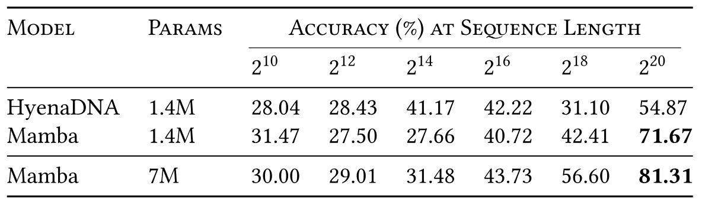

**表 13。** （**Great Apes DNA Classification。**）同じ context length の事前学習済みモデルを用い、長さ $2^{10}=1024$ から $2^{20}=1048576$ までの系列で fine-tuning した後の accuracy。random guessing は 20%。

### 11.4 音声の詳細

#### 11.4.1 YouTubeMix 音声事前学習

**モデル。** stage あたり 3 block（合計 $3\times5=15$ Mamba block）、pooling factor $p=16$、outer dimension $D=64$、約 3.5M parameter のモデルを用いる。

**Dataset。** データは 8 bit の mu-law で encode されているため、モデルは語彙サイズ $256$ の離散 token をモデリングする。

dataset は長さ最大 1 分、すなわち $960000$ の clip からなり、subsample して任意の sequence length の segment に分割する。architecture には係数 $16$ の pooling が 2 stage あり、hardware efficiency のため結果の sequence length を $8$ の倍数にしたいので、可能な最長系列は $468 \times 2048 = 958464$ となる。残りの sequence length は、これを順次半分にし、最も近い $2048$ の倍数へ切り上げて定義する。

[表 14](#table-14) は [図 7](#figure-07) で用いた仕様を示す。batch size が異なることに加え、training set の有効 segment 数も sequence length 間で異なった（例えば graph 上の異なる点で epoch あたりの training step 数が一定でなかった）。これが scaling curve の折れ曲がりに寄与した可能性がある。

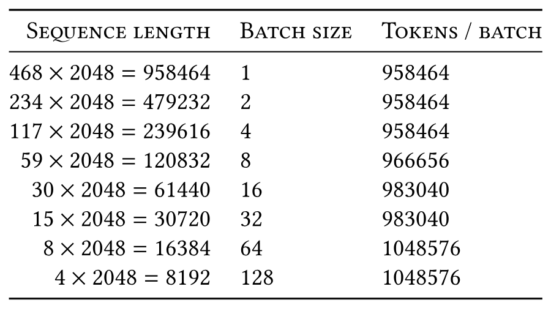

**表 14。** YouTubeMix の長さ scaling における sequence length と batch size。

**学習。** モデルは、最大 learning rate $0.002$、$20K$（10%）warmup step、weight decay $0.1$ で $200K$ training step 学習した（領域全体で用いる一般的な事前学習 recipe と同様）。

**追加 Ablation：SSM Parameterization。** [図 7](#figure-07) の設定で、長尺音声波形の事前学習に対する SSM parameterization を調べる。設定をわずかに変更し、より大きなモデル（$8$ layer、$D=64$、6M parameter、SaShiMi の既定値）、より短い系列（$2^{13}$-$2^{20}$ ではなく $2^{11}=2048$-$2^{18}=262144$）、低い LR（$0.002$ から $0.001$）、短い training cycle（200K step ではなく 100K step）を用いる。

[図 10](#figure-10) は、S4 $\to$ S6 への変更（すなわち selection mechanism）が常に有益とは限らないことを示す。長尺音声波形では、実際には性能を大幅に損なう。音声は一様に sample され、非常に滑らかなので、continuous linear time-invariant（LTI）method が有益だという観点から直観的に理解できる。selection mechanism を ablate した後、得られるモデルは Mamba block 内の S4 layer となることに注意されたい。区別のため、既定の Mamba architecture を Mamba-S6 とするのに対し、これを Mamba-S4 と呼ぶ。

しかし右側では、U-Net Mamba-S4 の outer layer を維持し、inner layer だけを ablate する。性能差は劇的に縮まる。これは*生の*音声 signal に近い layer は LTI であるべきだが、outer layer で「tokenize」して圧縮した後は inner layer が LTI である必要はない、という仮説を補強する。ただし、この設定でも real-valued SSM は complex-valued SSM より性能が低い。

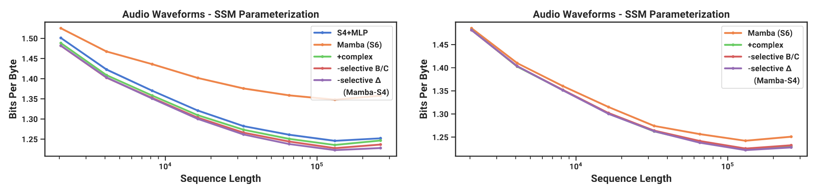

**図 10。** （**音声事前学習（YouTubeMix）の Ablation。**）一様に sample された「continuous」signal modality である音声波形は、実際には一致する inductive bias を持つ LTI model から恩恵を受ける。（*左*）均質なモデル（全 block が同じ parameterization）。（*右*）中央の U-Net block だけを ablate し、outer block は Mamba-S4 とする。紫の線は左図と同じ。

#### 11.4.2 SC09 音声生成

自己回帰学習は概ね自己回帰言語モデリング protocol に従い、例えば次を用いた。

- weight decay $0.1$

- 総 step の 10% を learning rate warmup

- $\beta=(0.9, 0.95)$ の AdamW optimizer

- gradient clip value $0.1$

learning rate $0.002$、batch size $16$ で $200000$ training step 学習した。

[表 4](#table-04) の大きな Mamba model は、stage あたり 15 layer、outer dimension $D=96$、pooling factor $4$ を持つ。この dataset は小さく（学習は 100 epoch を通過した）、この大きなモデルでは BPB または NLL が著しく overfit したことに注意されたい。しかし、生成 sample の自動指標は学習全体を通じて改善し続けた。

[表 5](#table-05) の architecture ablation におけるモデルはすべて、stage あたり 8 layer、outer dimension $\mathtt{D}=64$、pooling factor $4$ を持つ。S4+MLP block はおよそ $2D^2 + 4D^2$ parameter（MLP の expansion factor $2$）を持つ。Transformer block は $4D^2 + 2D^2$ parameter（MLP の expansion factor $1$）を持つ。Mamba block は通常どおり $\approx 6D^2$ parameter を持つ。すべてのモデルは総計およそ 6M parameter である。

### 11.5 効率 Benchmark

**Scan Operation。** A100 80GB PCIe GPU 上で計測し、selective SSM の中核 operation である parallel scan（[第 3.3 節](#section-3-3)）を convolution および attention と比較する。これらには、global-convolution model における convolutional kernel の計算や、attention における QKV projection の計算など、この中核 operation 外の他の operation の cost は含まれないことに注意されたい。

baseline として、kernel fusion なしの標準 parallel scan を PyTorch で実装する。これには parameter $\overline{\bm{A}}, \overline{\bm{B}}, \bm{C}$ を HBM に実体化する必要がある。

本研究の scan 実装は discretization step と parallel scan を fuse し、大きな parameter をすべて HBM に実体化する cost を避ける。

convolution には PyTorch の標準実装を用いる。これは入力と filter に別々に FFT を行い、frequency domain で乗算した後、inverse FFT を行って結果を得る。sequence length $L$ に対する理論計算量は $O(L \log (L))$ である。

attention については、把握している最速の実装（FlashAttention-2 [Dao24a]）を causal mask 付きで比較する。causal mask 付き FlashAttention-2 は、attention entry のほぼ半分しか計算しないため、causal mask なしより約 1.7$\times$ 高速であることに注意されたい。

batch size 1 を用い、sequence length を $2^9=512$、$2^{10}\approx 1K$、$2^{11}\approx 2K$ から $2^{19} \approx 500K$ まで増やす（baseline の一部は 500K に達する前に out of memory となる）。model dimension $D = 1024$、state dimension $N = 16$ を用いる。大規模学習で最も一般的な data type である BF16 input で計測する。

**End-to-end 推論。** Mamba 1.4B model と未学習の Mamba 6.9B model の inference throughput を、規模 1.3B および 6.7B の標準 Transformer（GPT3 architecture）と比較して計測する。Huggingface `transformers` library の標準 Transformer 実装を用いる。

prompt length は 2048、generation length は 128 とする。batch size を 1、2、4、8、16、32、64、128 と変化させ、128 token の生成に要する時間を計測する。続いて throughput（tokens/s）を $\mathrm{batch\ size} \times 128 / \mathrm{time\ taken}$ として計算する。計測を 3 回繰り返し、その平均を取る。A100 80GB PCIe GPU 上で計測する。

**メモリ Benchmark。** 大半の deep sequence model と同様、メモリ使用量は単に activation tensor の size に比例して増加する。1 台の A100 80GB GPU 上で、125M model の学習メモリ要件を計測して報告する。各 batch は長さ 2048 の系列からなる。把握している中で最も memory-efficient な Transformer 実装（`torch.compile` による kernel fusion と FlashAttention-2 を使用）と比較する。[表 15](#table-15) は、Mamba のメモリ要件が同規模の極度に最適化された Transformer 実装と同程度であることを示し、今後 Mamba の memory footprint はさらに改善すると予想する。

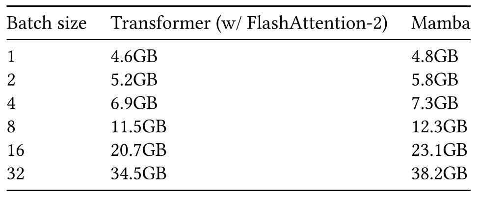

**表 15。** （**メモリ Benchmark。**）Mamba の memory footprint は最も最適化された Transformer と同程度。125M model の結果。

[+author-order]: 著者は名のアルファベット順に記載されている。
