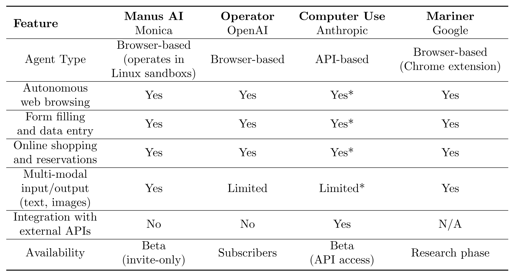
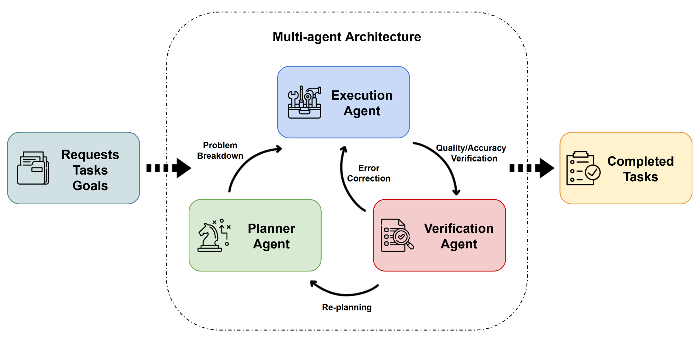
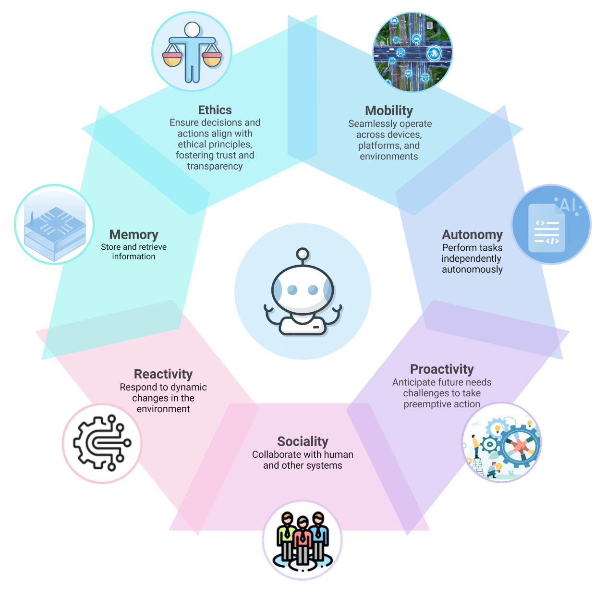
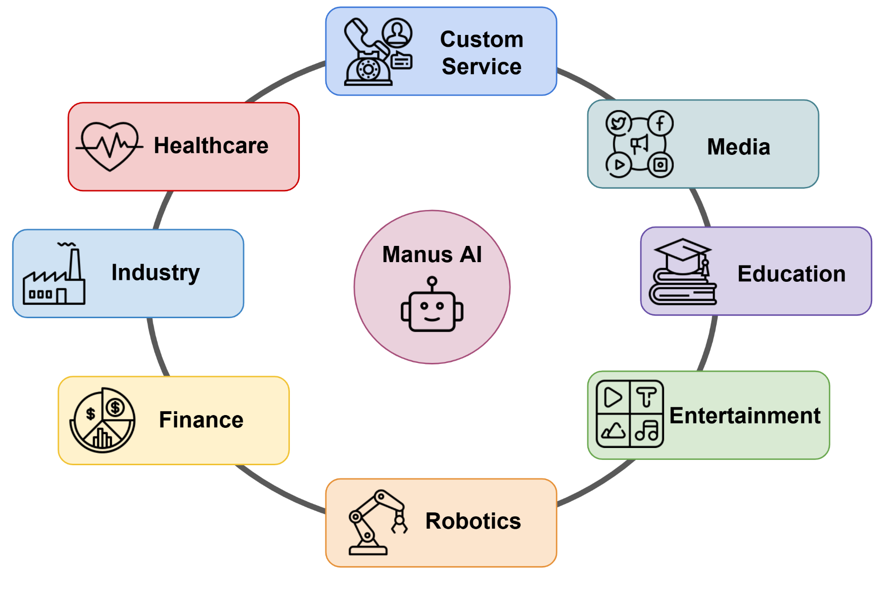

> [Minjie Shen](https://dblp.org/pid/364/7992.html)、[Yanshu Li](https://kaamava.github.io/)、[Lulu Chen](https://dblp.org/pid/93/77.html)、[Zhichao Fan](https://dblp.org/pid/127/3107.html)、Yanhang Li、[Qikai Yang](https://dblp.org/pid/358/3841.html)、[Haochen Yang](https://daslab.seas.harvard.edu/)。2025 年 5 月 4 日に arXiv へ初回投稿され、現行版は 2026 年 7 月 24 日改訂の v4 である。[From Mind to Machine: The Rise of Manus AI as a Fully Autonomous Digital Agent](https://arxiv.org/abs/2505.02024v4)。[原論文 PDF](/paper/manus-ai.pdf)。[DOI](https://doi.org/10.48550/arXiv.2505.02024)。[TeX ソース](https://arxiv.org/src/2505.02024v4)。正確な印刷レイアウトと参考文献は原論文 PDF を参照されたい。

## 要旨

**Manus AI** は、自律型人工知能のブレークスルーとして 2025 年初頭に登場した汎用 AI エージェントである。中国のスタートアップ Monica.im が開発した Manus は、「心」と「手」の隔たりを埋めるよう設計されている。大規模言語モデルのように思考し計画するだけでなく、複雑なタスクをエンドツーエンドで実行し、具体的な成果を届ける。本稿では Manus AI を包括的に概観し、基盤となる技術アーキテクチャ、医療・金融・製造・ロボット工学・ゲームなど幅広い産業での応用、ならびに長所、限界、将来展望を検討する。Manus AI は、AI の未来を早期に示す存在として位置づけられる。知的エージェントが高水準の意図を実行可能な成果へ変換し、仕事と日常生活を変革することで、人間と AI の協働に新たなパラダイムをもたらしうるからである。

## 1 はじめに

近年、人工知能（AI）は、ディープニューラルネットワークの台頭から、対話して複雑な問題を解ける大規模言語モデルまで、大きな進歩を遂げてきた。OpenAI の GPT-4 [Ope24a] などは前例のない言語理解能力を示したが、通常は問い合わせに応答するアシスタントとして動作し、タスクを自律的に実行するわけではない。AI の次の進化は、意思決定と行動の隔たりを埋める*汎用 AI エージェント*の開発である。**Manus AI** はその顕著な例であり、人間のアシスタントのように「考え」、タスクを実行できる世界初の真に自律的な AI エージェントの一つと説明されている [Mal25]。

中国のスタートアップ Monica が 2025 年に開発した Manus AI は、最小限の人間の指示で多様な現実世界の仕事をこなす能力により、急速に世界の注目を集めた。情報や提案だけを返す従来のチャットボットと異なり、Manus は解決策を計画し、ツールを呼び出し、複数段階の手順を自ら実行できる [Eco25]。たとえば、旅行の助言を与えるだけでなく、旅行日程全体を自律的に計画し、Web から関連情報を集め、完成した計画をユーザーへ提示できる。段階ごとのプロンプトは必要ない [Eco25]。このエージェント中心のアプローチは AI の能力を大きく前進させ、Manus のようなシステムが汎用人工知能（AGI）へ向かう AI 進化の次段階を告げるという見方を生んだ。

汎用 AI エージェントのベンチマーク評価では、Manus AI が*最先端*の結果を達成したと報告されている。AI の推論、ツール使用、現実世界のタスク自動化能力を評価する包括的ベンチマーク GAIA では、OpenAI GPT-4 などの主要モデルを上回った [Llm25a]。初期報告によれば、Manus は従来の GAIA 首位スコア 65% を超え、新たな性能記録を樹立した [Llm25a]。こうした成果は、AI の競争環境における画期的システムとしての Manus AI の重要性を示している。

本稿では Manus AI を詳細に検討する。[第 2 節](#section-02）では、その仕組みをモデルアーキテクチャ、中心的アルゴリズム、学習過程、独自機能の面から説明する。[第 3 節](#section-03）では、医療や金融からロボット工学、教育まで、さまざまな産業での応用を取り上げ、その汎用性を示す。[第 4 節](#section-04）では、OpenAI、Google DeepMind、Anthropic の技術を含む他の最先端 AI と比較し、Manus の特徴を分析する。[第 5 節](#section-05）では Manus AI の長所、限界、継続中の課題を論じる。[第 6 節](#section-06）では将来展望と分野全体への広い影響を考察する。最後に、[第 7 節](#section-07）で知見をまとめ、AI の発展過程における Manus AI の意義を検討する。

**表 1.** Manus AI、OpenAI Operator、Anthropic Computer Use、Google Mariner の機能比較。注: * 印の機能は API を介した統合が必要である。

## 2 Manus AI の仕組み

### アーキテクチャとモデル設計

**図 1.** アーキテクチャとモデル設計

Manus AI は、大規模な機械学習モデルと知的エージェント フレームワークを組み合わせた洗練されたアーキテクチャに基づいて構築されている。その中心となるのは、膨大な量のテキスト データとマルチモーダル データでトレーニングされたトランスフォーマー ベースの *大規模言語モデル*（LLM）である。このコア モデルは、Manus の一般的な知性、言語理解、推論能力を提供する。ただし、Manus AI は、認知プロセスを特殊なモジュール [Pan25] に編成する **マルチエージェント アーキテクチャ** を採用することで、単一モデルを超えている。特に、Manus は連携して動作する少なくとも 3 つの協調エージェントで構成されている。
- **プランナー エージェント**： このモジュールは戦略家として機能する。ユーザーがリクエストや目標を与えると、プランナーは問題を管理可能なサブタスクに分割し、望ましい結果を達成するための段階的な計画や戦略を策定する。
- **実行エージェント**： これはアクション モジュールである。実行エージェントは、プランナーの計画を受け取り、必要な操作またはツールを呼び出してそれを実行する。外部システム（Web ブラウザ、データベース、コード実行環境など）と対話して、情報の収集、計算の実行、または各サブタスクに必要なコマンドの実行を行う。
- **検証エージェント**： 品質管理として機能するこのモジュールは、実行エージェントのアクションの結果をレビューおよび検証する。結果の精度と完全性をチェックし、出力を完成させるか先に進む前に、各ステップが要件を満たしていることを確認する。検証エージェントは、必要に応じてエラーを修正したり、再計画をトリガーしたりできる。

このマルチエージェント システムは、制御されたランタイム環境（一種のクラウドベースのサンドボックス）内で実行され、基本的にタスク リクエストごとに「デジタル ワークスペース」を作成する。Manus AI は、プランナー、実行、および検証のサブエージェント [Li24k] 間で責任を分割することで、タスク処理の効率性と並列性を向上させる。複雑なジョブを分解してコンポーネントを同時に処理することで、単一のモノリシック モデルと比較して完了時間を短縮できる。このアーキテクチャは小規模なチームに似ている。1 人のエージェントが計画を立て、もう 1 人が実行し、3 人目がレビューすることで、複雑な複数ステップのタスクでも堅牢で信頼性の高いパフォーマンスを実現する。

### アルゴリズムと学習プロセス

Manus AI のエージェントのインテリジェンスは、高度な機械学習アルゴリズムによって強化されている。このシステムは、自然言語の理解と意思決定にディープ ニューラル ネットワークを活用しており、オープンエンド シナリオ [Chi25] で効果的に動作するように *強化学習* などの技術を通じて改良されている。固定ルールに従うか、静的なトレーニング データにのみ応答する AI システムとは異なり、Manus は不慣れな状況にリアルタイムで適応する。開発中、Manus チームはおそらく幅広いタスクのデモンストレーションでモデルをトレーニングし、ヒューマン フィードバック（RLHF） [Ouy22] からの強化学習を使用して、そのアクションを望ましい結果に一致させた。このアプローチにより、Manus は新しい問題に遭遇したときに、目標を正常に完了した場合の報酬メカニズムに基づいて戦略を動的に調整することができる [Chi25]。

Manus AI の特徴的な側面の 1 つは、**コンテキストを認識した意思決定**である。Manus は、単一ステップのコマンドを実行するのではなく、問題に対処する際のコンテキストと中間結果の内部メモリを維持する。これは、次のアクションを決定する際に、タスクの進行状況とユーザー固有の設定を考慮できることを意味する。基礎となるモデルはシーケンス間の予測を使用して最も論理的な次のステップを決定し、新しい情報が取得されると内部計画を更新する。Manus のアルゴリズムには *人間のような推論* の要素が組み込まれており、ユーザーが最終的に何を望んでいるかの推論を試み、それらの目標を達成するために判断を下す [Chi25]。たとえば、ユーザーが Manus に「販売データを分析して戦略を提案してほしい」と依頼した場合、Manus はトレンドを計算するだけでなく、どのタイプの分析や視覚化が関連するかを判断し、人間のアナリストと同じように実用的な洞察を生成する。

このような複雑な動作をサポートするために、Manus AI のトレーニングにはマルチモーダルおよびマルチタスク学習が含まれる可能性がある。レポートによると、Manus はテキスト、画像、さらには音声やコードさえも入出力として処理できる [Chi25, Llm25a]。これは、多様なデータ（文書、画像、プログラミング コードなど）でモデルをトレーニングし、さまざまなモダリティからの情報を融合できるスケーラブルなニューラル ネットワーク アーキテクチャを使用することによって可能になった。その結果、AI エージェントは、タスクで必要な場合に、医療画像の解釈、科学論文の読み取り、コード ブロックの作成、およびこれらの異種入力の相互参照を単一のワークフロー内で実行できるようになる。

もう 1 つの重要なコンポーネントは、Manus AI の **ツール統合機能**である。実行エージェントは、外部アプリケーションおよび API とインターフェイスするように設計されている。Manus はトレーニング中に、自然言語を使用して機能やツールを呼び出す能力を身に付けた（他の AI エージェントにおける「ツールの使用」と同様の概念）。たとえば、計画の一部で最新の株価を取得する必要がある場合、Manus は Web ブラウジング ツールを起動してデータ [Llm25a] を取得する必要があることを知っている。タスクに構造化データの操作が含まれる場合、Manus はデータベース クエリ ツールまたはスプレッドシート エディタを使用できる。この拡張可能なツール使用フレームワークは、さまざまなツールの使用例を Manus が微調整し、外部サービスの API を組み込むことによって開発されたと考えられる。これにより、Manus はニューラルネットワークの重みに保存されている機能を超えて機能を拡張でき、リアルタイム情報や特殊な機能（コードの実行やインターネットの検索など）にその場でアクセスできるようになる [Llm25a]。

### 独自の特徴と能力

Manus AI は、そのアーキテクチャとトレーニングを通じて、従来の AI アシスタントと一線を画す、いくつかの独自機能を備えている:
- **自律的なタスク実行**： Manus AI は、ユーザーの介入を最小限に抑えながら、複雑な一連のアクションを実行できる。大まかな目標が与えられると、主に単独でタスクを計画し、実行し、最終的に完了する。これは、ユーザーが問題を分析したり、各ステップを確認したりする必要がある一般的な AI をはるかに超えている。Manus は、作成者が [Mal25] と表現しているように、「仕事や生活のさまざまなタスクに優れており、休んでいる間にすべてを終わらせます」と述べている。たとえば、生データから完全に自律的に詳細なレポート（ビジュアルとテキストを含む）を生成したり、ユーザーが休暇計画をリクエストした後に旅行を予約するすべての手順を実行したりできる。
- **マルチモーダル理解**： Manus AI [Llm25a] は、次のような複数の種類のデータを処理および生成するように設計されている。
  - テキスト（例:レポートの生成、クエリへの回答）
  - 画像（ビジュアル コンテンツの分析など）
  - コード（プログラミング タスクの自動化など）
 この多用途性により、Manus は図や X 線を読んでその説明を書いたり、コードとエラー スクリーンショットの両方に基づいてソフトウェアをデバッグしたりするなどのタスクに取り組むことができる。
- **高度なツールの使用**： Manus AI は、外部ツールやソフトウェア アプリケーションとの統合に優れ、その能力を強化する。Web ブラウジングのサポートが組み込まれているため、インターネットから最新の情報を取得できる。生産性向上ソフトウェア（たとえば、スプレッドシートやドキュメントの作成または編集）と連携し、データベースにクエリを実行できる。外部アプリケーションと対話できるこの機能により、Manus AI はワークフローの自動化を目指す企業にとって理想的なツールとなる。ツールの使用を AI エージェントに統合するのは困難だが、Manus の効果的なツールの使用は、AI と実際の自動化タスクの橋渡しにおける大きな革新である。
- **継続的な学習と適応**： Manus AI は、ユーザー インタラクションから継続的に学習し、そのプロセスを最適化して、パーソナライズされた効率的な応答を提供する。これにより、時間の経過とともに AI がユーザー[Llm25a] の特定のニーズにさらに適合するようになる。たとえば、ユーザーが一貫して特定の形式またはトーンで表示されるデータを好む場合、Manus は将来の出力でそれらの好みに適応する。この適応学習は使用中に行われ、最初のオフライン トレーニングを補完する。さらに、開発者は倫理的な保護手段と透明性を重視している。これは、システムが経験を積むにつれて、安全でない結果を回避し、人間の意図に沿うように動作を調整するように設計されていることを意味する。

**図 2.** 独自の特徴と能力

要約すると、Manus AI の内部動作は、強力な汎用 AI モデルと、自律的な動作を可能にする賢いエージェント フレームワークを組み合わせている。Manus は、計画と検証のための専門化されたサブエージェント、意思決定のための強化学習、マルチモーダルおよびツール使用の熟練度、および適応行動を通じて、AI テクノロジーの最先端レベルの自律性と多用途性を実現する。これらの技術基盤は、次のセクションで説明する Manus AI の幅広いアプリケーションを強化する。

## 3 さまざまな産業での応用

Manus AI の最も魅力的な側面の 1 つは、複雑なタスクを自動化および強化することで、多くの業界を変革する可能性があることである。Manus は単一のドメインに限定されないため、インテリジェントな意思決定とタスクの実行が必要な場所であればどこにでも導入できる。以下では、Manus AI がさまざまな分野にどのように適用できるかを検討し、ヘルスケア、金融、ロボット工学、エンターテイメント、顧客サービス、製造、教育などのユースケースに焦点を当てる。これらのそれぞれにおいて、Manus のデータ分析、推論、自律的アクションの組み合わせは、効率を向上させ、新しい機能を解放する能力を持っている。

**図 3.** さまざまな産業での応用

### ヘルスケア

ヘルスケアでは、Manus AI は、医療専門家や研究者にとって強力なアシスタントとして機能する可能性がある。そのマルチモーダル機能により、患者記録、医学文献、さらには診断画像を連携して分析することができる。たとえば、Manus は患者の病歴、検査結果、放射線スキャンをレビューして、医師が複雑な状態を診断するのを支援し、関連する医療データからの裏付けとなる証拠を伴うセカンドオピニオンを提供することができる。Manus の長期記憶力と分析スキルは、包括的な患者情報を相互参照することで診断の精度を向上させる可能性がある。新しい症例から継続的に学習することで、結果の解釈における見落としエラーを減らすことができる可能性がある。

Manus AI は診断を超えて、**個別の治療計画**に貢献できる。医療知識や患者固有の要因（ゲノミクスやライフスタイルなど）の膨大なデータベースからの情報を統合して、カスタマイズされた治療オプションを提案できる。たとえば、がん患者のプロフィールを考慮して、Manus はそのがんサブタイプに対する効果的な治療法に関する最新の研究を照合し、臨床試験結果を相互参照し、腫瘍学者に治療法に関するランク付けされた推奨事項を情報源の証拠とともに注釈を付けて提供することができる。これは、AI が多くの変数を同時に考慮することで、適切な患者に対する適切な治療法を特定するのに役立つ、精密医療のビジョンと一致している。

もう 1 つの有望な用途は、創薬と生物医学研究である。Manus AI の自律的な研究能力は、科学論文やデータベースをマイニングすることで仮説を立て、検証できることを意味する。製薬会社は Manus に、ある疾患の新規薬剤標的を見つける任務を課すかもしれない。Manus は何百万もの出版物をスキャンし、生物学的経路のパターンを特定し、潜在的な標的を提案し、さらには仮想スクリーニング実験 [Lu22b] を設計するだろう。モダリティ（テキストの仮説、化学構造、実験データ）を横断して推論し、実験を計画する能力により、医学の研究開発プロセスが劇的に加速する可能性がある。
もう 1 つの有望な用途は、創薬と生物医学研究である。Manus AI の自律的な研究能力は、科学論文やデータベースをマイニングすることで仮説を立て、検証できることを意味する。製薬会社は Manus に、ある疾患の新規薬剤標的を見つける任務を課すかもしれない。Manus は何百万もの出版物をスキャンし、生物学的経路のパターンを特定し、潜在的な標的を提案し、さらには仮想スクリーニング実験を設計するだろう。モダリティ（テキストの仮説、化学構造、実験データ）を横断して推論し、実験を計画するその能力により、医学の研究開発プロセス [New22, Ji24, Ji24a, Le25] が劇的に加速する可能性がある。

最終的に、Manus は **臨床業務** と患者ケアで役割を果たすことができる。AI アシスタントとして、医療レポートの作成や医師と患者の会話の要約など、日常的ではあるが時間のかかるタスクを処理できるため、臨床医は患者との直接的なやり取りにより集中できるようになる。患者の質問に答え、接続されたデバイスを介して症状を監視し、介入が必要な場合には人間の医療提供者に警告する、24 時間年中無休の仮想医療エージェントとして動作する可能性がある。自律的な監視と意思決定支援が可能なこのような AI エージェントは、過重な労働力 [Alo23] を増強することで医療提供を改善できる可能性がある。

### 金融

金融業界は、膨大な量のデータと迅速かつ正確な意思決定の重要なニーズを抱えており、Manus のような汎用 AI エージェントによって大きく変わる余地がある。重要なアプリケーションの 1 つは、**アルゴリズム取引および投資分析** [Tre13, Ni24] である。Manus AI は、金融ニュース、市場データ、過去の傾向を継続的に取り込み、その情報を使用して取引戦略や投資の推奨事項を自律的に策定できる。固定ルールに従う従来の取引アルゴリズムとは異なり、Manus は新しい情報が届くたびに戦略を動的に調整できる。たとえば、ソーシャルメディアから消費者心理の微妙な変化を検出し、競合他社よりも先にポートフォリオのバランスを再調整することを決定する可能性がある。Manus は、その財務的洞察力を実証するために、株式データを分析し、主要な指標のチャートを生成し、実用的な洞察を備えたプロレベルのアナリスト レポートを作成していることが証明されている [Pan25]。このような包括的な分析には通常、人間のアナリストのチームが必要である。Manus はこれをほんの少しの時間で実行でき、状況の変化に応じて結果をリアルタイムで更新できる。

**リスク管理と不正行為検出**の領域において、Manus AI は大きな利点を提供する。金融機関は、不正取引を迅速に検出したり、信用リスクを評価したりするのに苦労している [Ins25]。Manus は、1 秒あたり数千件のトランザクションを監視し、詐欺を示唆する異常なパターンを特定し、手動で確認するよりもはるかに迅速に保護措置（トランザクションのブロックやアカウントにフラグを立てるなど）を自律的に開始する任務を負うことができる。その適応学習は、新たな詐欺戦術に合わせて進化できることを意味する。同様に、信用とリスクの評価についても、Manus は多様なデータ（顧客の金融履歴、マクロ経済指標、さらには顧客の業界に関するニュース）を統合して詳細なリスク予測を行い、従来の信用スコアリング モデルを改善することができる。Manus は意思決定の背後にある要因を説明できるため、リスク担当者がフラグを立てたリスクの根拠を理解するのに役立ち、透明性に対する規制の要求を満たすことができる。

もう 1 つの金融アプリケーションは **顧客サービスとパーソナライズされた金融**である。Manus AI は、顧客とチャットするだけでなく、実際に顧客に代わってアクションを実行する財務アドバイザーのチャットボットとして機能する可能性がある。たとえば、顧客は「月々の予算を最適化し、余剰金を投資するのを手伝ってください」と尋ねるかもしれない。Manus は、（許可を得て取引データにアクセスすることで）その人の支出パターンを分析し、貯蓄すべき領域を特定し、資金を投資口座に自動的に移動させ、顧客のプロフィールと目標に基づいて適切な投資を選択することができた。これらすべては、顧客に情報を提供しながら自律的に実行でき、バックグラウンドで継続的に機能するパーソナル ファイナンシャル プランナーとして効果的に機能する。

### ロボット工学と自律システム

Manus AI は主にソフトウェア エージェントとして存在するが、ロボット システムと組み合わせることで、その機能を物理領域に拡張できる。ロボット工学において、Manus は機械にインテリジェントな指示を与える高レベルの「頭脳」として機能する。応用例の 1 つは **産業オートメーション** で、Manus は工場の現場でロボット群を監督している。Manus は複雑な一連の動作を計画および調整できるため、さまざまなロボットにタスクを動的に割り当て、スループットを最適化するためにアクティビティをスケジュールし、1 台のロボットが問題に遭遇した場合にその場で計画を適応させることができる。たとえば、製造ロボットがメンテナンスのために停止した場合、Manus は問題を検出し、すぐにタスクを他の機械に転送したり、組立ラインの停止を防ぐために組立順序を調整したりするだろう。リアルタイムのセンサー データを統合する機能により、Manus はコンテキストを認識した意思決定を行い、業務をスムーズに実行し続けることができる。

もう 1 つのドメインは、**自動運転車とドローン** [Bat22, Din24b, Wan24h, Wan24i] である。Manus AI の意思決定アルゴリズム、特に強化学習バックボーンは、ナビゲーションと制御の問題に最適である。原則として、Manus は自動運転車ネットワークの中心となる AI として機能し、交通データ、地図情報、さらには口頭での乗客のリクエストを処理して、安全で効率的な運転ルートを計画することができる。実行エージェントと検証エージェントがデジタル タスクでどのように機能するかに似て、制御コマンドを（自動車のインターフェイスを通じて）実行し、結果を検証する。人間のような推論コンポーネントは、不慣れな工事区域での交渉や、緊急車両が近づいてきたときにどのように調整するかを決定するなど、判断が必要なシナリオに役立つ。同様に、配達用ドローンのフリートを Manus AI で管理することもできる。Manus AI は、ルートを最適化し、ミッションを再計算することで例外（悪天候に遭遇したドローンなど）に対処し、各配達から学習して時間の経過とともにパフォーマンスを向上させる。

重要なことに、Manus は **人間とロボットのコラボレーション** [Sem23] も促進できる。多くのロボットには高度な搭載型インテリジェンスが欠如しており、複雑なタスクを事前にプログラムされたルーチンか手動制御に依存している。このようなロボットに Manus AI へのアクセスを与えることで、ロボットはある種の常識と高度な理解を獲得する。病院での利用場面を考える。サービス ロボットは看護師のために物品を持ってくる任務を負っている。Manus を使用すると、ロボットは「12 号室に点滴スタンドを追加し、それから患者が起きていれば、この薬を 7 号室へ届けてほしい」といったリクエストを理解できる。Manus はこれを細分化する。点滴スタンドの保管場所に移動し、複数のタスクが競合する場合は優先順位を付け、病院のデータベースから患者の状態を解釈して、7 号室の患者が投薬の準備ができているかどうかを知るなどである。これにより、ロボットは基本的に、複数ステップの口頭または書面による指示に従い、必要な場合にのみ説明を求めながら、それらをインテリジェントに実行できるようになる。

大規模言語モデルとロボット工学を統合した初期の実験は、このビジョンを裏付けている。研究者らは、言語モデルが高レベルの命令を低レベルのロボットの動作に変換し、人間とロボットのタスク計画 [Ran23] を支援できることを示した。Manus のようなロボットを監視するシステムを使用すると、抽象的な目標（「この部屋を掃除してから夕食のテーブルを整える」）を与えることができる汎用の家庭用ロボットや職場用ロボットに近づき、視覚、操作、推論を組み合わせて確実に実行できる。これにより、柔軟な自動化の需要が高い倉庫物流から高齢者介護までの分野に革命を起こす可能性がある。

### エンターテイメントおよびメディア制作

エンターテインメント業界は、創造的なプロセスや制作ワークフローに貢献できる Manus のような AI エージェントから大きな影響を受ける傾向にある。**ゲーム開発**では、Manus AI を使用して、よりインテリジェントで適応力のあるノンプレイヤー キャラクター（NPC）や、ゲームの物語全体 [Nvi24b] を設計することもできる。ゲーム デザイナーが世界設定と目標を指定すると、Manus がクエスト ライン、ダイアログ、動的なイベントを自律的に生成して、ゲーム コンテンツを効率的に共同作成できる。Manus は意思決定をシミュレートできるため、Manus を搭載した NPC はプレイヤーのアクションに基づいて進化する人間のような戦略的行動や対話を示すことができ、前例のない奥深さとリプレイ性を備えたゲームにつながる。

**映画やコンテンツの作成**では、脚本作成、視覚効果、編集のためのツールとして、生成 AI がすでに登場している [Mim25, Den24, Din24c]。Manus AI は、制作パイプラインのコーディネーターおよびクリエーターとして機能することで、これをさらに推し進める。たとえば、映画作家は Manus に、前提となる設定を与えていくつかのプロットの概要を草案するよう依頼できる。Manus は要約を書くだけでなく、魅力的なストーリーを作るための知識を統合して、重要なシーンやカメラ アングルを提案することもある。ポストプロダクションでは、Manus のような AI が、希望のペースに従って生の映像を一貫したシーケンスに編集したり、プレースホルダーの特殊効果を生成して監督のフィードバックに基づいて調整したりするなどのタスクを自律的に実行できる。Manus のマルチモーダル生成は、テキスト スクリプトからストーリーボード（画像として）を作成したり、感情的なトーンを分析した後にシーンの音楽を提案したりできることを意味する。

もう 1 つの分野は **パーソナライズされたエンターテイメント**である。Manus は個人の好みを理解できるため、メディアを厳選したり、オンザフライでカスタム コンテンツを生成したりすることもできる。Manus が語り手となるインタラクティブなストーリーテリング アプリ [Rie13] を想定する。このアプリはユーザーの入力（好みのジャンル、好きなキャラクター）を受け取り、画像と音声の生成モデルを制御することによって、パーソナライズされた短編小説や短編アニメーション映画を作成する。ユーザーが反応したりフィードバックを提供したりすると、Manus は物語を調整し、基本的に 1 人の人物に合わせた映画やゲームを即興で作成する。この種の AI 主導のエクスペリエンスは、クリエイターと視聴者の間の境界線を曖昧にし、新しいエンターテイメント フォーマットを切り開く。

さらに、メディア制作環境では、Manus は、コンテンツの字幕と翻訳、ソース コンテンツからのマーケティング資料（予告編、ポスター）の生成、続編や編集を知らせるための視聴者のフィードバックと興行収入データの分析など、時間のかかることが多いタスクのサポートを支援する。視聴者のコメントや批評を自主的に精査し、番組の具体的な改善点を提案してくれるエージェントは非常に価値がある。一部のスタジオはすでに AI を使用して、珍しいストーリー要素が視聴者にどのように届くかについてデータに基づいた予測を提供している [Dav23]。Manus のような AI は、これらの予測を受け取り、スクリプトまたは編集に変更を直接実装して、より効率的なフィードバック ループを作成できる。

クリエイティブな分野では AI に対して当然の抵抗があるが、エンターテインメントにおける Manus AI の役割は、人間のアーティストに最終的な創造的な判断を委ねながら、日常的な作業をスピードアップし、アイデアの源泉を提供する強力なアシスタントとみなすことができる。最終的な効果は、制作スケジュールの短縮と、以前は制作が現実的ではなかった新しい形式のインタラクティブ コンテンツになる可能性がある。

### カスタマー サービスとサポート

カスタマー サービスは、チャットボットや仮想アシスタントの形で AI を急速に導入した業界であり、Manus AI はこの分野の次の飛躍を表す。従来のカスタマー サービス ボットは、FAQ に回答したり、単純なチケット ルーティングを行ったりすることができるが、Manus ははるかに複雑な対話を処理し、サービス タスクを最初から最後まで実行することもできる。**チャットボット**として、Manus は高度な会話能力とコンテキスト認識能力を備え、対話の初期の部分を記憶し、複数ターンにわたる問い合わせを簡単に処理する。ただし、顧客に代わってアクションを実行することもできる。たとえば、顧客がスマート ホーム デバイスが動作しないとサポートに連絡する可能性がある。Manus は、会話形式でトラブルシューティングの手順を実行し、同時にバックグラウンドで診断ツールと連携することができた（オンラインでデバイスのステータスを確認したり、ファームウェアのアップデートをプッシュしたりするなど）。返品または修理が必要な場合、Manus は返品承認の記入、集荷のスケジュール設定、顧客への確認などのプロセスをすべて同じチャット セッション内で自律的に開始できる。

顧客サービスにおけるこのような自律性の利点は、解決時間と一貫性が大幅に向上することである。研究によると、AI 主導のサポートにより、より迅速な解決と 24 時間の可用性が実現する可能性があり、ある分析では、AI ソリューションを使用する企業のサポート能力が 3.5 倍に増加したと報告されている。Manus AI は 24 時間年中無休のサービスを提供できるだけでなく、人間のエージェントを必要とせずに多くの問題を処理できるため、人間の代表者は真に共感や複雑な判断を必要とする最も困難なケースに集中できるようになる。Manus は社内データベースやナレッジ ベースと統合できるため、顧客の購入履歴、アカウント ステータス、関連ポリシーを即座に取得できるため、やり取りをパーソナライズし、人間が情報を検索するよりも効率的に問題を解決できる。

Manus は、事後対応のサポートに加えて、**積極的な顧客サービス**を可能にする。たとえば、問題を予測するためにユーザー アカウントのアクティビティやデバイスのログを（許可を得て）監視する場合がある。Manus は、ユーザーがソフトウェア製品で頻繁にエラーに遭遇していることを検出した場合、支援を提供したり、黙って修正を実装したりするために利用者に連絡することがある。電子商取引では、Manus は商品を推奨するだけでなく、会話を通じて購入プロセス全体を処理するパーソナル ショッピング アシスタントとして機能する可能性がある（「別の店でこの商品のより良い価格を見つけたので注文しました。続けましょうか?」）。

**人間のエージェントのトレーニングと支援**にも応用できる。Manus は、顧客と人間のサポート スタッフの間のやり取りを（適切なプライバシー保護手段を備えた上で）観察し、過去のやり取りから学んだことに基づいて、問題を解決する方法やサービスをアップセルする方法について人間のエージェントにリアルタイムの提案を提供できる。また、さまざまな難易度の顧客の質問をシミュレートし、フィードバックを提供することで、新しいサポート スタッフをトレーニングするために使用することもできる。

顧客サービスにおける課題の 1 つは、高レベルの品質と共感を維持することであり、純粋に自動化されたシステムでは困難を伴う。Manus の高度な言語モデルとコンテキスト保持により、微妙なクエリを適切なトーンで処理できる。しかし、企業はおそらくハイブリッド アプローチで Manus を使用するだろう。AI は日常的なクエリを完全に処理し、複雑なクエリを支援し、必要に応じて人間への簡単なエスカレーション パスを提供する。このアプローチは、AI によるスピードと効率性、そして重要な部分での人間味という、両方の長所を生み出す。AI が進化し続けるにつれ、最終的には Manus のようなシステムが顧客の問題の大部分を即座に解決し、カスタマー サービス センターの運営方法を根本的に変える可能性がある。

### 製造とインダストリー 4.0

製造業は、インダストリー 4.0 と呼ばれることが多いデジタル変革を経験しており、Manus のような AI エージェントはこの進化の中心となる可能性がある。重要なアプリケーションの 1 つは、**予測メンテナンス** [Zon20, Jin25a, Yan24g, Yan25d, Xu24, Xu24a] である。工場の設備や機械は、適切に分析すれば、部品が故障する可能性が高い時期やメンテナンスが必要な時期を予測できる豊富なセンサー データを生成する。Manus AI は、このデータをリアルタイムで自律的に監視し、モーターの振動パターンやタービン ベアリングのわずかな温度上昇など、摩耗や損傷の微妙な信号を検出できる。これらを早期に発見することで、Manus は故障が発生する前にメンテナンスのスケジュールを立てることができ、コストのかかるダウンタイムを回避できる。PwC の調査によると、AI ベースの予知保全を使用している製造業者は、装置の稼働時間が最大 9% 増加し、保守コストが 12% 削減されている [Pwc18]。Manus はデータを分析し、(作業指示書や技術者へのアラートを生成することにより）行動することができるため、メンテナンスを最適化するためのフルサイクル ソリューションとなる。

**プロセスの最適化**において、Manus は生産ライン上のリアルタイムの意思決定エージェントとして機能する。現代の製造業では、サプライ チェーン、生産スケジュール、品質管理の複雑な調整が必要である [Yad24]。Manus は、原材料の入手可能性、機械のパフォーマンス、注文の締め切りに関するライブデータを取得し、生産計画を動的に調整できる。たとえば、供給品の出荷が遅れた場合、Manus は組み立て順序を変更して、すべてのコンポーネントが準備できている製品を優先したり、完了可能な別のバッチに切り替えるように機械に指示したりして、工場の生産性を維持する可能性がある。同様に、Manus は品質指標を（ライン上のセンサーまたはマシン ビジョンを介して）監視することができ、標準以下のユニットの生産を検出した場合は、機械の設定を調整したり、人間による検査を要求したりすることができる。時間が経つにつれて、Manus は出力データと歩留まりから学習することで、機械の構成方法を継続的に改良し、静的な事前プログラム式ロジックでは難しい水準まで生産効率を高められる。

もう 1 つの重要な分野は、**サプライ チェーンと物流管理**である。製造 AI エージェントは、サプライヤーにシームレスに接続し、在庫レベルを追跡し、注文や配送スケジュールを交渉することもできる。Manus は、現在の燃焼速度に基づいて特定のコンポーネントが 2 週間でなくなると予測し、最もコスト効率の高い配送を手配しながら自動的に発注する可能性がある。倉庫業では、ロボット工学のセクションで説明したように、Manus は自律型フォークリフトやロボットを誘導して、在庫の配置と注文の履行を最適に管理できる。Manus AI は、製造エコシステム全体のグローバルな視野と意思決定の自律性を備えているため、サプライ チェーンの対応における待ち時間と非効率性の多くを排除できる。このような AI を使用する製造業者は、市場の変化や混乱にほぼ即座に対応でき、たとえば、予測される需要の落ち込みに先立って生産を縮小したり、サプライヤーが故障した場合に代替品を迅速に調達したりすることで、コストを節約し、機敏性を保つことができる。

人間の監視が最小限に抑えられる将来の「無人工場」を想像することができる。Manus AI は、生産計画を立て、ロボットを稼働させ、保守とサプライチェーン物流を管理する。人間への通知は、戦略的な意思決定や真に新しい状況が生じた場合に限る。完全に自律的な工場はまだ稀だが、このビジョンの構成要素は適切な位置に収まりつつあり、Manus は、これらすべての要素を 1 つの知性の傘の下で調整できる一種の汎用 AI エージェントの例となっている。

### 教育

教育も、高度にパーソナライズされたインタラクティブな学習体験を可能にすることで、Manus AI の機能が変革をもたらす分野である。**家庭教師またはティーチングアシスタント**として、Manus は各生徒の学習スタイルとペースに適応できる。難しい概念を複数の方法で説明し、生徒の弱点に合わせた練習問題を生成し、解答に対する即座のフィードバックを提供する。多くの生徒に注意を分散させなければならない人間の教師とは異なり、Manus は潜在的にすべての生徒に同時に 1 対 1 の個別指導を行うことができる。各生徒の進捗状況を詳細に記憶し、概念が誤解されたままにならないようにする。たとえば、生徒が微積分の問題に苦戦している場合、Manus は生徒の質問や間違いから混乱を認識し、視覚的なデモンストレーションを使用したり、生徒が得意とする科目からの類推を利用したりして戦略を切り替えることができ、概念を理解させることができる。

これは **個別のカリキュラム生成** [Dua19a] と連携して行われる。Manus AI は、個人の目標と現在の知識に合わせて最適化された学習計画を設計できる。学生が Web 開発のためのプログラミングを学びたいと考えているとする。Manus は生徒の現在の数学と論理スキルを評価し、必要なプログラミング概念を教える一連のレッスンとプロジェクトを作成し、生徒の向上に合わせて難易度を調整する。マルチメディア（テキスト、コード例、ビデオ説明）だけでなく、インタラクティブなコーディング環境もカリキュラムの一部として統合できる。生徒が進歩するにつれて、Manus は学習計画を継続的に更新し、さらに多くの課題を導入したり、面倒だった以前のトピックを強化するために戻ったりすることがある。

教師や教育コンテンツ作成者にとって、Manus は **コンテンツ生成および採点アシスタント** [Lee24d] として機能する。特定のトピックをさまざまな難易度でカバーするクイズ問題や試験問題を生成できる。また、ルーブリックを適用して自由形式の回答やエッセイを採点することもでき、スコアだけでなく詳細なフィードバックも提供する。これは、主観的な採点がボトルネックとなる、大規模な公開オンライン コースや大規模教育で特に役立つ。さらに、Manus は、トピックの説明に役立つ実例、図、さらには教育用ゲームをその場で作成するのに役立ち、教育者のクリエイティブ パートナーのように機能する。

未来の教室では、各生徒が自分のデバイス上に、または教室で利用​​できる Manus のような AI 家庭教師を持つことになるかもしれない。AI 家庭教師は日常的な指導と練習を処理できるが、人間の教師はより高度な指導、モチベーション、社会的感情の学習に焦点を当てる。また、Manus のような AI は、授業内容をよりアクセスしやすい形式に変換したり、難しい分野で追加の練習をしたりするなど、カスタマイズされたサポートを提供することで障害のある生徒を支援し、インクルーシブ教育をサポートすることもできる。

初期の AI 家庭教師でも、生徒に即時かつ個別のフィードバックを与えることで学習成果を高められると示されている。Manus の高度な推論と記憶力は、質問に答えるだけでなく、生徒が間違いを犯した理由を解明し、根本原因に対処できるため、これらの利点をさらに拡大する可能性がある。概念のデモンストレーションとして、Manus のような AI エージェントは、生徒向けにパーソナライズされた学習計画を生成し、オンデマンドで説明を提供し、疲れを知らない教育補助者として効果的に機能する可能性がある。教育における潜在的な影響力の規模は巨大である。Manus のような AI アシスタントは、高品質の個別指導へのアクセスを民主化し、各生徒のニーズに合わせた個人講師を提供することで教育の不平等を軽減するのに役立つ可能性がある。

### その他の分野

上記で詳しく説明した業界を超えて、Manus AI の一般的な機能により、他の多くの分野でチャンスが開かれる。
- **法務サービス**： Manus は、長大な法的文書や契約書をレビューし、重要な点や矛盾点を強調し、法的準備書の初期バージョンを作成することによって、パラリーガルの補佐として機能することができる。クエリが与えられると、判例法を調査し、関連する判例を編集できる。この自動化により、弁護士が調査や書類の準備に費やす時間を大幅に削減できる。デモンストレーションでは、Manus が法的契約のレビューをエンドツーエンドで処理し、条項が見落とされていないことを確認していることが示された [Ait25]。
- **人事**： 採用において、Manus AI は履歴書と求人応募書を高速で審査し、企業の基準に基づいて最適な候補者を特定する。キーワード一致だけではない。Manus は経験やスキルの説明を状況に応じて解釈し、人間の採用担当者と同じように判断を下すことができる。あるユースケースでは、Manus が履歴書の束を解析して評価し、主要な資格を抽出して応募者を効率的にランク付けした [Pan25, Xia24e]。さらに、Manus は、パーソナライズされた学習モジュールを提供し、スタッフにポリシー関連の質問に答えることで、従業員のトレーニングを支援する。
- **不動産と計画**： Manus は、不動産リストをスキャンし、購入者の好みや予算と比較し、長所/短所と投資見通しを含む最適な候補の候補リストを作成することで、不動産分析を自動化できる [Yan24h]。また、不動産評価レポートを作成したり、オファーレターや賃貸契約書の草案を作成したりすることもできる。一例で述べたように、Manus は不動産調査の任務を負っており、特定の基準を満たす利用可能な不動産に関する詳細なレポートを作成することに成功し、クライアントを何時間もの検索と比較 [Pan25] から節約した。
- **科学研究**： 研究者は、Manus を分析アシスタントとして使用して、実験のシミュレーションや実験データの分析を行うことができる。たとえば、物理学研究室では、Manus はソフトウェアを介して機器を制御し、データを収集し、それを理論モデルに適合させ、解釈を提案できた。また、読み取った参考文献から実験の背景、方法、結果、関連研究を整理して、研究論文の初期草稿を自動的に作成することもできる。このような機能により、生物学から工学に至る分野の研究サイクルが加速される可能性がある [Wan24j]。
- **公共部門とスマートシティ**： 政府や都市計画者は Manus AI を使用して公共サービスを最適化する可能性がある [Kal25]。たとえば、Manus は交通パターン、公共交通機関の利用状況、イベントのスケジュールを分析して、信号機のタイミングを最適化したり、交通ルートの変更をリアルタイムで推奨したりして、都市のモビリティを向上させることができる。公衆衛生分野では、Manus は疫学データを監視し、リソースをどこに割り当てるかを提案することで健康危機への対応を調整することができた。その自律性は、最大の効率とインシデントへの迅速な対応を目指して、現在のデータに基づいて都市システム（水道、配電、緊急サービスの展開）を継続的に管理および調整できることを意味する。

これらの例はほんの表面に過ぎない。事実上、複雑な意思決定プロセス、大規模なデータセット、または複数ステップのワークフローを伴うあらゆる分野で、ある程度 Manus AI を活用できる可能性がある。共通点は、Manus が認知スキル（文脈の理解、学習、推論）と行動能力（ツールの使用や指示の実行による）の組み合わせをもたらしているということである。これにより、Manus AI は、あらゆるドメインのタスクに向けることができ、最小限の適応で生産的な貢献を開始できる一種の *普遍的な問題解決アシスタント* となる。

## 4 他の AI 技術との比較

Manus AI の出現は、多くの組織がより高度な AI システムの構築を競っているときに行われた。これは、OpenAI、Google DeepMind、Anthropic などの大手 AI ラボの既存テクノロジーと比較して際立っている。このセクションでは、Manus がこれらの同時代の製品とどのように異なり、潜在的にそれを超えるかを分析し、独自の側面とトレードオフを強調する。

### Manus AI と OpenAI の GPT-4 およびエージェント

2023 年にリリースされた OpenAI の GPT-4 は、最もよく知られた AI モデルの 1 つであり、言語の理解と生成において優れた能力を示している [Ope24a]。GPT-4 は、問題を解決し、コードを記述し、高いレベルの流暢さで会話を行うことができる。ただし、GPT-4（およびその公的に展開された形式である ChatGPT）は、主にユーザー入力に応答する対話型アシスタントとして動作する。本質的に、継続的なプロンプトなしで複数ステップの計画を自律的に実行する能力はない。Manus AI は、この制限を克服するために構築された。提案や情報を提供する GPT-4 とは異なり、Manus は主導権を握り、タスクをエンドツーエンドで実行するように設計されている [Llm25a]。たとえば、GPT-4 はデータセットの分析方法を指示するかもしれないが、Manus はそれ以上のプロンプトを表示することなく実際に分析を実行し、グラフを作成し、レポートを提供する。

GAIA ベンチマーク [Mia23a] などの内部評価では、Manus AI は実際のタスク実行で GPT-4 より高い性能を示した [Llm25a]。プラグインツールで拡張された GPT-4 も、限定的な Web 閲覧やコード実行を可能にすることで Manus に近づき始めているが、こうした機能は Manus のツール使用ほどシームレスに統合されておらず、汎用的でもない。Manus は、ツールの使用と行動を後付けせず、コアアーキテクチャに組み込んでいる。したがって Manus は、自然な推論過程の一部としてツールをいつ、どのように使うかを計画する一方、GPT-4 は同様の処理に外部オーケストレーションを必要とする。実際、Manus はプラグイン対応 GPT-4 よりも GAIA のタスク完了率が高く、後者のスコアは大幅に低かった [Llm25a]。

もう 1 つの違いは、アクセシビリティとオープンさである。OpenAI のモデルは独自仕様ではあるが、API または消費者向けアプリを通じて広く利用できるため、コミュニティによる広範な独立した評価が可能になる。対照的に、Manus AI は比較的非公開に保たれている（現段階では招待のみのベータ版）。これは、独立したベンチマークが開発者が報告するものに限定されることを意味する。一部の専門家は、さらなる公開検査が可能になるまで、Manus の主張する優位性について懐疑的な姿勢を表明している。それにもかかわらず、利用可能な証拠（デモやベンチマーク レポート）は、Manus の新しいアーキテクチャが、GPT-4 でさえすぐに使える自律性の点で優位性を与えていることを示している。

OpenAI も、オープンソースの *AutoGPT* [Gra25] や GPT モデルをよりエージェント的にする社内プロジェクトなど、独自のエージェント型フレームワークを開発している。Manus も同じパラダイム シフトの一部と見なすことができるが、より高度な実装に最初に飛びついたように見える。GPT-4 がガイドに従って優れた問題解決者であるとすれば、Manus は最小限のガイド [Du24a] で何をする必要があるかを把握できる独立した問題解決者である。

### Manus AI と Google DeepMind の AI の比較

Google の DeepMind 部門は、AlphaGo（囲碁をマスターした） [Sil16, Sil17] から AlphaFold（タンパク質の折りたたみを解決した） [Jum21, Sen20] まで、最も印象的な AI の画期的な成果を生み出し、複数種類のタスクを実行できる *Gato* のようなジェネラリスト モデルを実験してきた。DeepMind は、次世代モデル（次期マルチモーダル モデル *Gemini* など）についても Google Brain と協力している。しかし、これまで DeepMind のシステムの多くは、ユーザーに直接対応する一般的なエージェントではなく、高度に特化されているか、特定の環境（ゲームやシミュレーションなど）に限定されていた。

Manus AI が優れている点は、現実世界で無制限のタスクを実行できる広範なユーザー対話型エージェントであることである。DeepMind の *Sparrow* [Dee24c] やその他のチャットボットは対話と事実の正確さに重点を置いているが、ユーザーに代わって物理的タスクやデジタル タスクを実行することはない。より類似した DeepMind プロジェクトは、ツールを使用できる適応エージェントに関する研究かもしれない（DeepMind は、言語モデルとツールの使用および推論を組み合わせた研究も発表している）。ただし、これらは研究用プロトタイプであり、Manus は展開可能な製品として位置付けられている。

DeepMind には、基礎研究と最高性能を重視してきた実績がある（たとえば、AlphaGo は囲碁に特化して高度に最適化されている）。それに比べて、Manus は、狭い領域では特殊な DeepMind モデルに匹敵しないかもしれない（たとえば、AlphaGo ほどうまく囲碁をプレイすることはできない）が、DeepMind の個々のモデルにはない「幅広い」能力をもたらす。それは、チャンピオンのスプリンターと十種競技の選手の違いに似ている。Manus は、AI という意味で十種競技者になろうとしている。

比較すべき領域の 1 つは、推論と安全性である。DeepMind モデルには大量の強化学習が組み込まれていることが多く、シミュレートされた環境（ゲーム戦略など）での計画に優れている。Manus はまた、現実世界のタスク計画 [Chi25] に強化学習を使用し、そのパラダイムをより実践的な設定に効果的に導入している。安全性に関して、DeepMind は慎重である。たとえば、Sparrow は安全でない答えを避けるための制約を設けて設計されている。Manus は倫理的制約と透明性も実装していると主張しているが、より多くの公開データが利用可能になるまでは、その安全メカニズムがDeepMindの調整作業とどのように比較されるかを評価することは困難である。Manus の開発者は、望ましくない行動を阻止するためにルールベースのフィルターや報酬シグナルを統合している可能性が高いが、OpenAI と DeepMind は、公衆の目で反復的な改良を行うという利点を持っていた。

要約すると、DeepMind（および Google の AI への取り組み）にはより純粋な研究力とリソースがあるかもしれないが、Manus の重要性は、現在日常業務に取り組んでいる実用的な一般的な AI エージェントを示すことにある。これは、実験用 AI と実用的な一般エージェントとの間のギャップが縮まりつつあるという概念の実証となる。DeepMind の今後のシステム（Gemini など）に同様のエージェント機能が組み込まれるかどうか、またそれらが Manus に対してどのように対抗するかはまだ分からない。

### Manus AI と Anthropic Claude などの比較

AI の安全性と研究を行う会社である Anthropic は、OpenAI の GPT モデルの直接の競合となる *Claude* シリーズの言語モデルを開発した。Claude は、その大きなコンテキスト ウィンドウと、Constitutional AI [Bai22] と呼ばれる手法を通じた有用性と無害性に重点を置いたトレーニングで知られている。Manus AI を Anthropic の Claude と比較すると、GPT-4 と同様の二分法に注目する。つまり、Claude は非常に有能な会話モデルであるが、外部フレームワークなしではマルチステップのツールを使用するタスクをネイティブに実行しない。Manus は、推論と行動の総合ベンチマークで Anthropic のクロードを超えると宣伝されている（一部の解説では、「クロード + ツールの使用」を超える能力があると説明されている）。Claude が主に自律エージェントとして設計されていないことを考えると、これはもっともらしいことである。

別の見方では、Manus は「OpenAI の Deep Research [Ope24g] と Claude の Computer Use [Ant24a]」の融合と説明されており、OpenAI と Anthropic のモデル双方の長所から着想を得たことを示唆する。支持者によれば、Manus は OpenAI 級の推論と Claude に似たツール使用を組み合わせ、さらに自らコードを書いて実行する能力を加えている。その結果、ある観察者が AI 能力の「モンスター」と呼ぶものが、予想より早く登場した。

Anthropic 以外にも、新たな AI システムが登場している。たとえば、新興企業や大手テクノロジー企業は独自の汎用 AI エージェントを立ち上げている。Amazon の実験的な *Nova* プロジェクト [Int24] や、Grok と呼ばれるモデルを使用したイーロン マスクの *xAI* イニシアチブは、同様の目標を目指している。完全自律型の総合エージェントを最初に披露した Manus の優位性は、これらのプレーヤーが追いつくにつれて挑戦される可能性がある。とはいえ、業界のコメントによると、xAI の Grok や Anthropic の Claude などの競合他社と比較して、Manus の自律性とタスク完了能力は、この初期段階 [Aib25a] において差別化された利点とみなされている。Manus は、他の人が目指すであろう高いハードルを設定した。

小規模ながら著名な貢献者についても言及する価値がある。H2O.ai の h2oGPT ベースのエージェントである [Hoa25] は、Manus よりも前に GAIA ベンチマークをリードしており、それほど有名ではないプレーヤーでも革新できることを実証した。Manus がその得点を上回り、この分野での急速な進歩を強調した。中国では、別のプロジェクトである *DeepSeek* が AI チャットボットとして先に注目を集め、非常に高い人気を得た [Dee24a]。Manus は次の「DeepSeekの瞬間」としてよく比較されるが、単なる会話ではなく自律性に焦点を当てている。強力な投資に支えられた中国のテクノロジー エコシステムは、Manus が間もなく国内の競争に直面する可能性があることを意味する。

要約すると、競争環境は活発である。Manus AI は、真の自律性と汎用性を重視することで他と一線を画しているが、他のほとんどの AI 製品は現在、会話型知能（GPT-4、Claude など）または狭い領域の習得（AlphaGo など）のいずれかで優れている。Manus は理解と行動の両方を行おうとしているため、一般的な AI エージェントへの一歩とみなされている。Manus が根本的に異なる種類の AI 「脳」を持っているとは必ずしも言えない。Manus は依然として他の AI と同様の大規模言語モデル技術に依存しているが、その脳をより有効に活用できる革新的なシステム設計を備えている。Manus のアプローチが効果的であることが証明されれば、他の AI リーダーもよりエージェントのような動作をシステムに統合することが期待できる。Manus は、ある意味、難題に挑戦した。既存の AI 技術（LLM、RL、ツール インターフェイス）を単一のエージェントに緊密に統合することで、集中したチームが何を達成できるかを示した。最終的な勝者は、複数のソースからますます強力になる AI エージェントにアクセスできるユーザーと企業になる可能性が高くなる。

## 5 Manus AI の長所と短所

高度な AI エージェントとして、Manus AI は多くの重要な長所を示すが、同時に特定の制限と課題も提示する。これらの長所と短所を理解することは、Manus の全体的な影響を評価し、今後の改善を導く上で非常に重要である。

### 長所

**自律性と効率**： Manus AI の最大の強みは、目標が与えられると自律的に動作する能力である。これにより、タスクを完了する際の効率が大幅に向上する。ユーザーはタスクを細かく管理したり、サブタスクに分割したりする必要はない。Manus がプロセス全体を処理する。実際的には、これにより時間と労力を節約できる。人間のチームが調整に数時間、あるいは数日かかるタスクも、Manus なら数分から数秒で完了できる。たとえば、包括的な市場調査レポートを作成するには、通常、研究者がデータを収集し、アナリストがそれを解釈し、ライターが文書を編集する必要がある。Manus は、データの Web スクレイピングから分析、結果の作成まで、これらすべての段階を単独で実行できるため、ワークフローが崩壊する。

**汎用性**： Manus のジェネラリスト設計とマルチモーダルな能力により、非常に汎用性が高くなる。再設計することなく、あるドメインから別のドメインに移行できる。この「何でも屋」機能は、Manus AI の 1 つのインスタンスがさまざまな方法で企業の複数の部門を支援したり、生活のさまざまな側面で 1 人のユーザーを支援したりできることを意味する。また、汎用性は Manus の将来性をある程度保証する。新しいタスクやツールが出現した場合、Manus のアーキテクチャは、新しいモデルを最初から作成するのではなく、（追加のトレーニングや統合を通じて）比較的簡単にそれらを組み込めるように構築されている。

**最先端のパフォーマンス**： 前述したように、Manus は困難なベンチマークで最先端のパフォーマンスを実証した（GAIA の結果は他のモデルを上回った）。ベンチマークがすべてではないが、Manus の推論能力と問題解決能力が最先端にあることを示している。その作成者らは、最も困難なタスク カテゴリでもトップレベルの結果を達成し、現代の AI モデル [Ait25, Mal25] を上回るパフォーマンスを達成したと報告している。ユーザー向けのトライアルでは、多くの人が、他の AI システムが困難なタスク（複雑な複数ステップのクエリや、異なるソースからの知識の結合など）を処理する Manus の能力に感銘を受けている。技術的に競合他社に先んじることにより、Manus は自律型 AI エージェント市場での先行者としての優位性を得ることができる。

**ツールの使用と統合**： Manus が外部システムと統合することに熟達していることは、実質的に大きな利点である。既存のソフトウェア エコシステムに接続できるため、まったく新しいプラットフォームを必要とするのではなく、企業の現在のアプリケーションと連動するように展開できる。たとえば、企業は Manus を自社のデータベース、CRM システム、または DevOps パイプラインに接続し、アクションを実行させることができる。この統合されたアプローチにより、Manus はアドバイスするだけでなく実際にボタンを押すことができる一種の「AI 従業員」に変わる。この統合が欠けている競合する AI は、何をすべきかを指示するコンサルタントのように機能するが、Manus は仕事を実行する手となる。

**継続的な改善**： Manus AI は、対話から学習するように設計されている。時間の経過と使用量の増加により、さらにパーソナライズされ、環境に合わせて微調整されるようになる。これは、システムが遭遇する特定のデータや設定に適応するため、Manus の導入は大きなアップデートを行わなくても改善される可能性があることを意味する。このような継続的な学習は強力である。それは従業員が仕事の経験を積むのと似ている。もちろん、これには正しさから逸脱しないように慎重に扱う必要があるが、制御された方法で、失敗から学んでいるのであれば、今日の Manus は昨日の Manus よりも優れている可能性があることを意味する。さらに、Manus の開発者は、より広範なデータとユーザーのフィードバックを使用してモデルを改良し、弱点に対処し、知識を拡大する可能性が高いため、コア AI はより賢く、より高性能になり続けるだろう。

**グローバルなリーチと言語サポート**： 大規模なデータでのトレーニングを考慮すると、Manus AI は複数の言語をサポートし、世界中でサービスを提供できる可能性がある。この広範な言語能力は、Manus が多様な言語文脈で有益であることを意味し、英語中心のツールと比較して国際的なアプリケーションで有利になる。多言語コミュニケーション（コンテンツ分析中の翻訳など）を仲介できる可能性があり、グローバルに事業を展開する組織での有用性が高まる。

### 限界と課題

**透明性の欠如**： Manus AI の課題の 1 つは、多くの深層学習ベースのシステムと同様、意思決定プロセスが不透明になる可能性があることである。結果をチェックする検証エージェントが備わっているが、Manus が複雑な決定にどのように到達したかを正確に理解することは簡単ではない。この「ブラック ボックス」の性質は、意思決定を正当化できることが不可欠である医療や法律など、一か八かの分野のユーザーに懸念をもたらす可能性がある。開発者らは Manus の設計における透明性と倫理的境界の重要性を述べているが、Manus が出力の提供以外にどの程度まで自らを説明できるかは明らかではない。説明可能性の向上（たとえば、Manus に人間が読める言葉でその行動の根拠や監査証跡を作成させる）は継続的な課題である。

**検証と信頼性**： Manus には内部検証機能があるが、絶対的な AI システムはない。Manus が実行した計画が最適ではなかったり、間違っていたりする場合もある。検証エージェントがエラーを捕捉できなかった場合、または Manus が使用するデータ ソースに欠陥がある場合、自信を持って誤った結果が生成される可能性がある。たとえば、Manus が Web から情報を収集しているときに誤った情報に遭遇した場合、それを分析に組み込む可能性がある。現在の AI モデルは、事実やロジックを「幻覚」させる場合があることが知られている。Manus の追加された構造はそれを軽減するかもしれないが、排除することはできない。したがって、重要なタスクを Manus に完全に引き渡すことは、Manus が豊富な実績を積むまではリスクを伴う。重要な出力には依然として人間による監視やレビューが必要な場合があり、自律性の利点が部分的に相殺される。

**データのプライバシーとセキュリティ**： Manus が効果的に機能するには、機密データ（医療記録、財務情報、社内のビジネス文書など）へのアクセスが必要になることがよくある。これにより、データのプライバシーとセキュリティに関する懸念が生じる。組織は、情報の悪用や漏洩がないという確固たる保証がなければ、データ サイロへのフル アクセスを Manus に組み込むことに躊躇するかもしれない。Manus の統合に脆弱性があると（外部ツールへの接続など）、サイバー攻撃やデータ侵害の媒介となる可能性がある。さらに、Manus がクラウドベースのサービスである場合、データを外部に保存することについての通常の懸念がある。これらは Manus に限ったことではないが、その適用範囲が広いということは、保護された情報（HIPAA [Hea25] に基づく患者データ、GDPR [Gdp18] に基づく消費者データなど）が関係するシナリオに頻繁に直面することを意味する。これらに対処するには、強力な暗号化、アクセス制御、そして必要に応じてデータが企業の安全な環境から流出しないようにオンプレミス導入オプションが必要である。

**計算リソース**： Manus AI のような複雑なシステムを実行すると、多くの計算量が必要になる可能性がある。マルチエージェント アーキテクチャと大規模な基礎モデルには、特にリアルタイム パフォーマンスのために、かなりの処理能力が必要である。これにより、運用コストが高くなったり、特殊なハードウェア（ASIC など）が必要になったりする可能性がある。ユーザーにとって、Manus を広範囲に（大規模な自動化などに）使用すると、顕著なクラウド コンピューティング費用が発生することを意味する可能性があり、これは、より単純な自動化スクリプトや、場合によっては人間の労力と比較して障壁になる可能性がある。時間の経過とともに、ハードウェアが改善され、モデルが最適化されるにつれて、このコストは低下するが、現時点では、バックエンドのコストとスケーラビリティにより、非常に大規模なシナリオや遅延に敏感なシナリオに対する Manus の導入が制限される可能性がある。

**アクセシビリティと可用性**： 前述のとおり、Manus AI はこれまで限定的な方法（招待のみの Web プレビュー）でリリースされてきた。現時点では、それを使用したいすべての人が広くアクセスできるわけではなく、コミュニティの信頼の蓄積と広範な普及が遅れる可能性がある。この独占性が続けば、競合他社に追いつく時間を与えたり、Manus のマインドシェアを減らしたりする可能性がある。さらに、モデルとエージェントが集中サーバー上で実行されている場合、ユーザーは稼働中のサービスに依存する。Manus のプラットフォームでダウンタイムや機能停止が発生すると、それに依存しているビジネスに混乱が生じる可能性がある。対照的に、最大限の稼働時間を必要とするミッションクリティカルなタスクには、セルフホスト型またはオフライン対応の AI システムを好む人もいるかもしれない。明確な可用性保証やオフライン モードを提供することは、企業に受け入れられるために Manus のプロバイダーが対処する必要がある課題である。

**倫理および制御の問題**： AI エージェントにタスクを実行する自律性を与えると、倫理および制御に関する考慮事項が生じる。Manus はスーパーアシスタントのように振る舞うことができるが、何ができるのかについては注意が必要である。たとえば、Manus が金融業界で取引を実行するために利用され、誤った判断を下した場合、誰が責任を負うのだろうか。これが人事部門で使用され、採用の推奨に誤ってバイアスが表示された場合（おそらくトレーニング データのバイアスを反映している）、公平性の問題が発生する可能性がある。Manus の決定が人間の価値観や会社の方針と一致するようにすることは、継続的な課題である。開発者は、制約を慎重にエンコードし、出力を監視して、望ましくない動作（プライバシー侵害、偏った決定、安全でないアクションなど）を防止する必要がある。これは AI 倫理の一部である。Manus はルールの遵守と透明性の維持に重点を置いて構築されているが、システムが新たな状況に遭遇する場合には常に警戒する必要がある。Manus を使用する組織は、Manus AI の使用に関するガイドラインを確立し、AI が予期せぬ動作をした場合のフォールバックを用意する必要があるだろう。

要約すると、Manus AI の長所は、多くの分野で効率とイノベーションを促進できる画期的なツールとしての可能性を示す。一方、その短所は、Manus が魔法のように絶対確実な存在ではなく、管理すべき限界を持つ技術であることを示している。透明性、信頼性、セキュリティなどの問題を克服することが、Manus AI の持続的な成功と受け入れの鍵となる。これらの課題の多くは現在開発が進められている分野であり、Manus や類似のエージェントが進化するにつれて改善されることが期待される。

## 6 将来展望

Manus AI は、AI システムの新しいカテゴリへの初期の飛躍を表しており、その軌道は、技術の進歩と、社会がそのようなエージェントをどのように受け入れるかを選択するかによって形成される。今後を展望すると、Manus AI とその後継者が進化する可能性が高いいくつかの重要な分野があり、さらにそれらが AI 分野や社会全体に与える可能性のある広範な影響もある。

### 能力の向上

将来の反復では、Manus AI がそのツールキットを拡張し、そのスキルを洗練することが期待できる。予想される開発の 1 つは、**ツール統合の拡張** [Llm25a] である。現在、Manus は Web ブラウザ、オフィス アプリケーション、コーディング環境を使用できるかもしれない。将来的には、はるかに多くのサードパーティのサービスやハードウェアとシームレスに統合できるようになるだろう。たとえば、Manus がエンジニアリング設計ソフトウェア（AI CAD デザイナーとして機能する）、バイオテクノロジー研究機器（実験を制御する研究室アシスタントとして機能する）、または個人用スマート ホーム デバイス（ホーム オートメーションの AI バトラーとして機能する）に結び付けられる可能性がある。新しい統合が行われるたびに、Manus の有用性と領域範囲が拡大する。

もう 1 つの成長分野は、**マルチモーダル認識の強化** [Llm25a] である。Manus はすでにテキストと画像を処理しているが、将来のバージョンでは、オーディオ（例: リアルタイムの会話や音の合図の文字起こしと解釈）、ビデオ（例: ライブビデオフィードの分析またはリアルタイムでのビデオ編集の支援）、さらには触覚または空間データ（ロボットまたは IoT センサーに接続されている場合）についてのより深い理解を実現する可能性がある。これにより、Manus は物理環境においてより敏感なエージェントとなるだろう。たとえば、セキュリティカメラと組み合わせることで、Manus は物理的な施設を監視し、「見た」ものに基づいてアクション（当局への通知や建物の管理の調整など）をトリガーできる可能性がある。基本的に、Manus は主にデジタル世界のエージェントから、物理世界にも移動して応答するエージェントに進化する可能性がある。

もう 1 つの焦点として考えられるのは、**学習と適応**である。Manus には高度なオンライン学習アルゴリズムが組み込まれており、新しいデータに遭遇したときに知識ベースやモデルのパラメータを更新できるようになるかもしれない（安全性チェック付き）。これが実現すれば、開発者による完全な再トレーニングを必要とせずに、Manus をよりパーソナライズして最新のものにすることができる。企業の Manus AI が、時間の経過とともにその企業特有の用語や手順を徐々に学習し、その組織の運営に固有の専門家へ成長する企業向け Manus AI を想定する。フェデレーテッド ラーニング（分散型の方法でユーザー データから学習）などの手法を使用すると、プライバシーを維持しながらモデルをオンザフライで改善できる。

### 幅広い導入とユースケース

Manus AI がその価値を証明し続ければ、さらに幅広い展開が期待できる。エンタープライズ分野では、汎用 AI エージェントがデータベースやクラウド サービスと同じくらい一般的になる可能性がある。企業では、機能横断的なタスクを処理する多くの部門に AI エージェントを統合している場合がある。これは **ワークフローの再設計**につながる可能性がある。組織は人間が行うタスクと AI エージェントが行うタスクを中心に再構築する可能性がある。日常的な分析タスクは主に AI に引き継がれ、人間は創造的、戦略的、または対人的な役割に集中する可能性がある。Manus のような AI エージェントの監督を専門とする「AI ワークフロー マネージャー」や「AI 倫理学者」のような、新しい職種が登場する可能性がある。

個人消費者にとって、おそらく将来の Manus のようなアシスタントは、今日の音声アシスタント（Siri や Alexa など）よりもはるかに強力で積極的な、どこにでも存在する個人的な相棒となるだろう。スケジュール、財務、コミュニケーションなどを統合的に管理できる。この利便性は非常に優れている可能性があるが、依存性とプライバシー（AI に多くのことを任せる）の問題も生じる。この分野での競争により、Manus の概念に由来する消費者向けの総合エージェントが生み出され、それぞれが異なるプロバイダーのテクノロジー エコシステムに統合される可能性は十分にある。

**AI エージェント間のコラボレーション**も目撃されるかもしれない。多くの一般的なエージェントが存在する場合、それらは大きなタスク（基本的には、大規模な問題（気候データ分析や大規模な経済モデリングなど）を分割および征服する Manus インスタンスのネットワーク）を調整するために通信する可能性がある。AI 間のコラボレーションのための標準プロトコルが開発される可能性がある。あるいは、ある Manus が別の特化した AI をツールとして参照し、ソフトウェア API だけでなく他の AI サービスを調整することもできる（Manus が必要に応じて医療診断モデルを呼び出すと考えればよい）。AI システムのこの相乗効果により、それぞれが単独でできることを拡大できる可能性がある。

### AI 研究開発への影響

Manus AI の出現は、AI 研究の方向性に大きな影響を与える可能性がある。言語モデルと計画、記憶、ツールの使用を組み合わせることで強力な結果が得られることを具体的に示す。**エージェント AI フレームワーク**に関する研究がさらに増える可能性がある。学術研究室やオープンソース コミュニティなどの競合するアプローチは、マルチエージェント アーキテクチャを反復し、サブエージェント間でタスクを分割するさまざまな方法を模索したり、Transformers を超えたさまざまなコグニティブ アーキテクチャを使用したりすることになる。数学や論理などの分野の信頼性を向上させるために、記号推論モジュールを組み込んだエージェントの実験が行われる可能性がある。

この進歩により、多くの人が聖杯と考えるもの、**汎用人工知能（AGI)** への動きが加速する可能性がある。Manus 自体は AGI ではないかもしれないが、多様性に対応し、適応的で一般的な問題解決の片鱗を見せることで、その方向を示している。将来の研究では、一般性をさらに高めることに重点が置かれる可能性がある。つまり、AI の死角や知識のギャップを減らし、転移学習（ある領域の知識をまったく新しい領域に適用すること）を向上させ、形式的推論と統合してエラーを減らすことである。Manus の成功は（もしそれが続けば）、システム指向のアプローチ（複数のコンポーネント + 学習）が、ありえないほど完璧な単一モデルを必要とせずに、より一般的な動作を達成できるという概念を証明するだろう。これにより、一部の研究はモデルを純粋にスケールアップすることから、よりスマートな方法でモデルを構成することに移行する可能性がある。

AI エージェントの **ベンチマークと標準**がより重視される可能性もある。GAIA はそのようなベンチマークの 1 つである。他のものは、AI エージェントの実際的な有用性、安全性、汎用性を測定するために開発される可能性がある。Manus のトップランキングは挑戦され、競合ベンチマークが業界全体の改善を促進することになるだろう。これは、2010 年代に ImageNet などのベンチマークがビジョン モデルの急速な進歩をもたらしたのと似ている。

### 社会的影響と考察

Manus のような AI の普及は、広範な社会的影響を与えるだろう。職場では、前述したように、特定の職務の置き換えが発生する可能性がある。日常的なタスク、大量のデータを必要とするタスク、または手続き型のタスクは、主に人間から AI に移行する可能性がある。これは必ずしも雇用をなくすことを意味するわけではない。それは仕事を変えるかもしれない。プロフェッショナルは、（非常に有能ではあるが）ジュニアのチームメイトとして AI をチームに置く場合がある。教育とトレーニングは、AI と競合するのではなく、AI を補完するスキル（監視、複雑な創造的思考、心の知能指数など）に重点を置くように適応する可能性がある。

**専門知識を民主化する**可能性もある。有能な弁護士、医師、会計士、エンジニアが一体となった AI エージェントに誰もがアクセスできれば、知識やサービスに対する障壁が大幅に軽減される可能性がある。人間の専門家がいない場合、遠隔地やサービスが十分に行き届いていない地域の人々は、AI を通じて専門家のアドバイスを受けることができる。これは楽観的な見通しである。AI は優れたイコライザーとして機能する。課題は、助言の正確さを確保し、十分な文脈なしに人々が過度に依存しないようにすることである（たとえば、ある時点で実際の医師が関与しないまま医療指導を誤解するなど）。

イノベーションの観点から見ると、AI エージェントに多くの単調な作業を処理させることで、人間の創造性と起業家精神が飛躍的に高まる可能性がある。AI エージェントがバックグラウンドでマーケティング、コーディング、デザイン、ロジスティクスを処理するため、個人または小規模なスタートアップ企業が、現在なら企業全体を必要とする仕事を成し遂げる状況を想定する。これにより、爆発的なイノベーションと生産性だけでなく、私たちがまだ考えていなかった新しいビジネス モデルが生まれる可能性がある。

ただし、**AI の調整と制御** に関しては懸念が残る。これらのエージェントがより強力になり、より多くの自律性が与えられる可能性があるため（たとえば、重要なインフラストラクチャや金融システムの管理）、彼らが人間の価値観と一致し続けることを保証することが最も重要である。AI の安全性に関する継続的な研究は、エージェントが許容範囲を超えて行動しないことを正式に検証することを目的として、強化される可能性がある。Manus の開発者などは、より厳格なガードレールを組み込んで、信頼性が極めて高くなるまで高リスク領域での行動範囲を制限する可能性がある。また、政策立案者が AI の自律的な動作に関するガイドラインを設定するために介入する可能性もある。

政策面では、政府が AI エージェントを具体的に規制し始める可能性がある。たとえば、医療や金融で使用される AI の認定要件が登場するかもしれない。AI が対話する際に（混乱や欺瞞を避けるために）AI 自身を識別する必要があるかどうかについて議論が行われる可能性がある。責任の枠組みは更新する必要があるだろう。自律的な主体が危害を加えた場合、誰が法的責任を負うのか?これらの法的および倫理的枠組みは、Manus のようなエージェントが日常生活に組み込まれるにつれて進化していく。

結論として、Manus AI および同様の一般的な AI エージェントの将来は、重大な責任を伴う大きな可能性の 1 つである。今後数年間で、このテクノロジーは急速に改善され、多くの分野での導入が拡大し、リスクを管理しながらそのような AI の利点を最大限に活用する方法についての活発な世界的な対話が行われる可能性がある。Manus AI は、今後 10 年間で最も重要な技術的変化の 1 つとなるかもしれないものを引き起こした。これは、人間のほぼすべての活動において、AI がツールの役割からパートナーまたは自律的な同僚の役割に移行するというものである。

## 7 結論

Manus AI は、理解、推論、行動を組み合わせた新世代の AI システムの最前線に立っている。本稿では、複数の専門エージェントと強力なコアモデルを組み合わせた革新的アーキテクチャから、産業横断的な幅広い応用、同時代の技術における位置づけ、それを特徴づける長所と短所まで、Manus AI の全体像を検討した。Manus AI の自律的にタスクを計画し実行する能力は、近年主流となっている支援 AI パラダイムからの大きな脱却を示している。これは、質問に答えるだけでなく結果をもたらす AI への移行を体現している。

私たちの調査により、Manus AI がヘルスケア、金融、ロボット工学、エンターテイメント、顧客サービス、製造、教育などのさまざまな分野に革命を起こす可能性があることが分かった。休みなく働く知識豊富なアシスタントとして機能することで、人間の能力を強化し、効率の向上と実現し始めているイノベーションを約束する。同時に、OpenAI、DeepMind、Anthropic などの他の AI リーダーとの比較は、Manus が AI における広範な推進力の一部であることを浮き彫りにしている。さまざまな組織が、実装方法は異なるものの、よりエージェント的で汎用的な AI というアイデアに収束しつつある。Manus は現在、現実世界の問題解決のいくつかのベンチマーク [Ait25] でリードしているが、競争によりすべてのプレーヤーが向上を促し、最終的にはユーザーと社会に利益をもたらすだろう。

Manus AI の長所と短所についても詳しく調べた。その自律性、多用途性、パフォーマンスは、透明性、信頼性、堅牢な倫理的ガードレールの必要性に対する懸念によってバランスがとれている。これらは開発が活発に行われている分野である。Manus がこれらの問題にどれだけうまく対処できるかは、信頼と採用に影響を与える。責任を持って導入することが、不用意な危害や混乱を引き起こすことなくテクノロジーが人間の可能性を確実に増幅させる鍵となる。

今後を見据えると、Manus AI とその後継者の進化は急速に進むだろう。私たちは、機能の継続的な改善、より広範な導入シナリオ、そして仕事や日常生活に及ぼす影響を期待している。Manus AI は、最終的に汎用人工知能の一種として認定されるシステムの先駆けとなる可能性があるが、人間の監視下で私たちと協力して動作する可能性がある。その成功は、そのような将来の AI の設計原則に情報を与え、汎用性を達成するためにマルチエージェントの調整、ツールの使用、継続的学習などの機能の重要性を実証する。

結論として、Manus AI はマイルストーンであると同時に先駆者であると見なすことができる。これは、AI が連携して考えて行動し、エンドツーエンドの方法で問題を解決するように設計されている場合に何が可能になるかを示したという点で画期的な出来事である。これは、インテリジェントエージェントが一般的になり、無数のタスクを処理し、複雑な取り組みで人間と協力する近未来を予感させるという点で前兆である。Manus AI の登場は、AI の急速な進展を強調し、人間の作業と機械の作業の境界がますます流動化する時代を垣間見ることができる。

Manus AI の旅はまだ始まったばかりだが、そこには AI コミュニティの多くの希望と課題が凝縮されている。Manus AI とそのようなシステムは、慎重に開発および導入されれば、生産性の向上、イノベーションの促進、さらには問題解決のための強力な新しいツールを提供することで世界的な課題への対処を支援するなど、大きな前向きな変化を推進する可能性を秘めている。また、AI の倫理的および社会的側面に積極的に取り組むよう促している。したがって、Manus AI の重要性はその技術仕様を超えている。このような自律型 AI エージェントが私たちの世界にどのように統合されるかを形成することに私たち全員が参加するよう呼びかけている。今後数年で、このバランスがどのように保たれるかが明らかになり、Manus AI は間違いなく、今後の展開を考える上で中心的なケーススタディとなるだろう。
